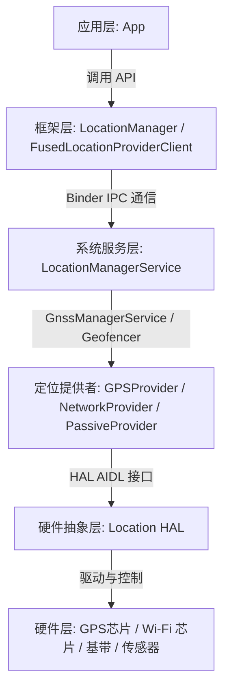
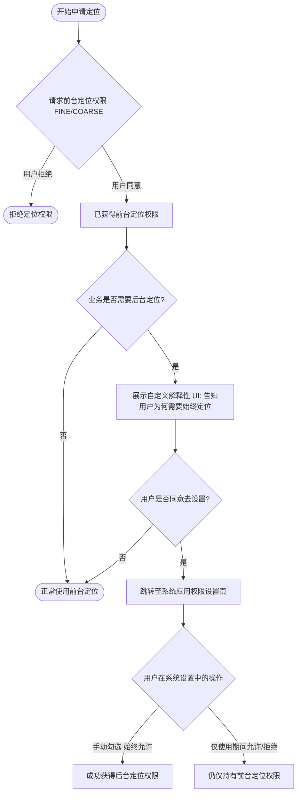
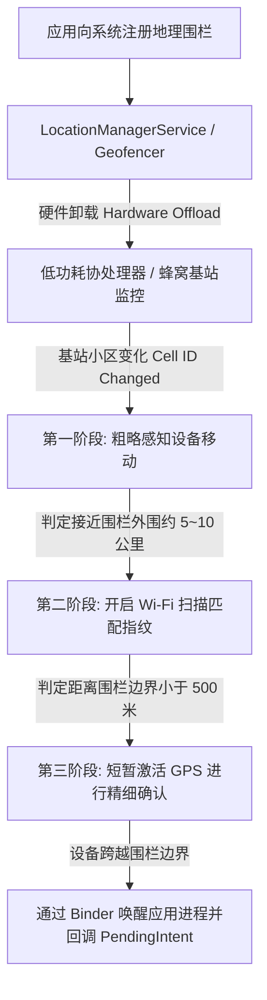

# 5.1.6.3.3 定位

在移动互联网时代，位置服务（Location-Based Services, LBS）已成为智能手机不可或缺的核心能力之一。无论是地图导航、周边商户推荐，还是天气预报、运动健康，都高度依赖于设备的位置信息。Android 系统为了在保护用户隐私、控制硬件功耗与提供高精度定位之间取得平衡，建立了一套庞大而复杂的定位架构与权限管理机制。

本文将从 Android 定位的核心架构出发，深度对比主流定位方式的优缺点与适用场景，详尽解析 Android 各个历史版本中定位权限的演进与适配策略（尤其是 Android 10、11、12 的重大变更），并深入剖析地理围栏与逆地理编码的技术原理，最后总结在实际开发中的常见误区与功耗优化最佳实践。

---

## 一、 Android 定位服务核心架构

Android 系统的定位服务采用典型的分层架构设计，从应用层、系统框架层、系统服务层，一直延伸到硬件抽象层（HAL）与物理芯片。通过这种分层，系统屏蔽了底层不同硬件芯片（如 GPS、Wi-Fi、基带）的物理差异，为上层应用提供了统一、标准的 API 接口。

### 1.1 系统架构分层解析

下图展示了 Android 定位服务的核心架构模型：



1. **应用层（Application Layer）**  
   开发者编写的应用程序。应用可以通过 Android 原生 SDK 中的 `LocationManager` 或 Google Play Services（及国内厂商提供的兼容库）中的 `FusedLocationProviderClient` 发起定位请求，监听位置更新。
   
2. **框架层（Framework Layer）**  
   框架层提供了应用直接访问的 Java 类。其中，`LocationManager` 是核心入口，负责管理定位源（Location Provider）。此外，还定义了 `ILocationManager.aidl` 接口，它是应用进程与系统 `LocationManagerService` 进行跨进程 Binder 通信的契约。

3. **系统服务层（System Server - LocationManagerService）**  
   `LocationManagerService`（简称 LMS）是整个定位架构的“大脑”，运行在系统的主服务进程 `SystemServer` 中。它的主要职责包括：
   - **请求管理**：收集并维护所有应用提交的定位请求，根据请求的参数（如精度、频率）进行合并与分发。
   - **权限动态验证**：在每次分发位置数据前，检查发起请求的应用是否依然拥有相应的运行时定位权限，以及用户的 GPS 开关是否处于开启状态。
   - **电量节流（Throttling）**：当应用进入后台或系统处于省电模式时，LMS 会强制降低定位回调的频率，或将高功耗的 GPS 定位请求降级为低功耗的基站定位。
   - **子服务协调**：LMS 内部协调 `GnssManagerService`（负责卫星定位相关的搜星状态、NMEA 数据分发）和 `Geofencer`（负责地理围栏检测）。

4. **硬件抽象层（HAL - Location HAL）**  
   硬件抽象层由芯片厂商（如高通 Qualcomm、联发科 MediaTek、博通 Broadcom 等）根据 Android 定义的标准接口（如 `android.hardware.gnss` AIDL/HIDL 接口）进行实现。HAL 层负责将底层芯片上报的原始卫星观测数据（如 NMEA 0183 协议数据、载波相位等）转换为系统框架层识别的标准数据结构。

5. **硬件与传感器层（Hardware & Sensors）**  
   包含 GPS/北斗/GLONASS 芯片、Wi-Fi 射频模块、蜂窝基带芯片，以及用于辅助定位的惯性测量单元（IMU，包含加速度计、陀螺仪、气压计等）。

### 1.2 Binder IPC 通信细节

在 Android 中，定位数据的传递本质上是一个跨进程的发布-订阅模式。由于 `LocationManagerService` 运行在 `system_server` 进程中，而应用运行在独立的 App 进程中，位置回调必须跨越进程边界。

当应用调用 `requestLocationUpdates(provider, listener)` 时：
1. `LocationManager` 在应用进程内将传入的 `LocationListener` 封装成一个 `ListenerTransport` 对象。该对象继承自 `ILocationListener.Stub`，是一个 Binder 服务端。
2. 随后，通过 `ILocationManager.registerLocationListener()` 将该 Binder 代理对象传递给 `LocationManagerService`。
3. 当硬件上报位置数据，经过 HAL 层和 LMS 的处理后，LMS 在 `system_server` 进程中调用 `ILocationListener` 的远程方法。
4. 应用进程的 `ListenerTransport` 收到 Binder 调用后，通过 Handler 将消息分发到应用指定的主线程（或 HandlerThread）中，最终触发 `LocationListener.onLocationChanged(Location)` 回调。

---

## 二、 主流定位方式深度对比（为什么）

Android 系统内置了多种定位提供者（Location Provider），它们在技术原理、定位精度、首次定位时间（TTFF）、室内可用性以及电池功耗上有着本质的区别。

### 2.1 GPS / GNSS Provider（卫星定位）

* **技术原理**  
  设备内置的 GNSS（全球导航卫星系统）芯片接收来自太空中 GPS、北斗、GLONASS、Galileo 等卫星发射的超高频无线电信号。通过测量信号从卫星传播到接收机的时间延迟，计算出设备与至少 4 颗卫星之间的距离。再利用“多星交会”（Trilateration，三边测量）算法，辅以相对论时间纠正，计算出设备在地球上的三维坐标（经度、纬度、高度）以及时间偏差。
* **搜星与冷启动痛点（TTFF）**  
  首次定位时间（Time To First Fix, TTFF）是 GNSS 定位的关键瓶颈。在**冷启动（Cold Start）**状态下，设备没有任何卫星星历（Ephemeris）和历书（Almanac）数据，芯片需要完整下载这些数据，这需要持续接收卫星信号达数分钟之久。即使在**热启动（Hot Start）**下，也需要数秒。
  为了解决这一问题，现代移动设备普遍采用 **AGPS（Assisted GPS）** 技术：通过移动蜂窝网络，快速从辅助定位服务器（AGPS Server）下载当前的卫星星历和粗略基站位置，使得 TTFF 缩短至 2~5 秒。
* **局限性**  
  卫星信号属于微波频段，无法穿透钢筋混凝土、金属和厚重的遮挡物。因此，在室内、地下车库、隧道中，GPS 信号基本完全中断；在“城市峡谷”（高楼林立的街道）中，信号会因为多路径反射（Multipath Effect）产生巨大的定位漂移。
* **功耗分析**  
  为了捕获微弱的卫星信号，GNSS 芯片的射频前端和基带协处理器必须全功率工作，持续消耗 50mA 到 150mA 左右的电流。如果应用在后台无节制地开启 GPS 定位，会导致设备严重发热，并在几小时内将电池耗尽。

### 2.2 Network Provider（基站与 Wi-Fi 定位）

* **技术原理**  
  * **Wi-Fi 定位**：当定位请求发起时，Wi-Fi 芯片会扫描周围所有可用的无线路由器信息，收集它们的 MAC 地址（BSSID）和信号强度（RSSI）。随后，这些扫描数据被发送到定位服务提供商的云端数据库（如 Google 定位数据库，国内的高德、百度等）。云端数据库利用“指纹算法”（Fingerprinting）或“多点强度交叉定位法”，匹配已知物理坐标的 Wi-Fi 热点，计算出当前设备的大致位置。
  * **基站定位**：设备获取当前注册的移动基站信息，包括移动国家代码（MCC）、移动网络代码（MNC）、位置区域码（LAC/TAC）和基站编号（Cell ID），结合相邻基站的信号强度，通过云端基站数据库解析出位置。
* **优缺点**  
  由于 Wi-Fi 信号在室内无处不在，Network Provider 完美解决了室内定位的难题。它的 TTFF 几乎为零，功耗极低（仅复用普通的网络射频扫描）。然而，其精度高度依赖于周围 Wi-Fi 的密度和云端数据库的更新频率。在偏远郊区或 Wi-Fi 稀疏的地带，定位精度会大幅下降至数百米甚至数公里。

### 2.3 Passive Provider（被动定位）

* **技术原理**  
  被动定位不主动向底层硬件发起任何定位指令，也不启动 GPS 或网络扫描。它是一个“窃听者”。当系统中的其他应用（如微信、高德地图、外卖软件）请求位置更新时，`LocationManagerService` 会将获取到的位置数据顺便抄送给注册了 Passive Provider 的应用。
* **优缺点**  
  由于它完全搭乘“便车”，其带来的额外功耗为绝对的零。但是，它具有极强的不确定性。如果系统中的其他应用都没有发起定位，该 Provider 将永远无法回调位置。这非常适合那些对位置实时性要求极低、但需要静默记录用户轨迹的后台低功耗辅助功能。

### 2.4 Fused Location Provider（融合定位）

* **设计哲学**  
  由于单一的定位源无法同时满足“高精度、低功耗、全场景覆盖”的要求，Google 在 Play Services 中引入了融合定位库（`FusedLocationProviderClient`）。国内非 GMS 设备通常由手机厂商在系统底层或通过高德/百度地图 SDK 实现类似的融合算法。
* **核心机制**  
  FLP 结合了 GPS、Network 以及设备内部的微机电系统（MEMS）传感器。例如：
  - 当检测到设备高速移动（如乘车）且处于室外时，FLP 会优先调用 GPS 以确保轨迹连续。
  - 当设备进入室内，GPS 信号断开时，FLP 会无缝、平滑地切换到 Wi-Fi 和基站定位，防止定位结果出现突兀的跳跃。
  - FLP 引入了**传感器融合算法**（如卡尔曼滤波、死抗/航位推算 Dead Reckoning）：当设备短暂失去所有定位信号时，利用加速度计测算步数和位移，利用陀螺仪测算方向，利用气压计估算楼层高度，从而维持一条平滑、连续的运动轨迹。
  - **智能静止检测**：通过传感器检测到设备放置在桌面上静止不动时，FLP 会自动暂停所有底层的 GPS 扫描和 Wi-Fi 扫描，直到传感器检测到设备再次被拿起。这大幅度降低了无意义的功耗。

### 2.5 定位方式对比矩阵

| 特性 / 维度 | GPS Provider | Network Provider | Passive Provider | Fused Location Provider |
| :--- | :--- | :--- | :--- | :--- |
| **定位信号源** | GNSS 卫星信号 | 移动蜂窝基站、Wi-Fi 热点 | 共享其他应用的位置数据 | 卫星、Wi-Fi、基站、加速度计、陀螺仪、气压计等 |
| **典型精度** | 极高（室外 3m ~ 10m） | 中等（Wi-Fi 10m~100m，基站 500m~数公里） | 取决于共享源的精度 | 动态自适应（高精度模式下可达 3m） |
| **首次定位时间 (TTFF)** | 慢（冷启动数分钟，热启动数秒） | 极快（毫秒级） | 完全取决于其他应用的定位时机 | 极快（利用缓存和融合预测） |
| **室内可用性** | 不可用（信号被钢筋混凝土屏蔽） | 完美支持（室内 Wi-Fi 密集） | 取决于其他应用是否在室内定位 | 优秀（自动降级切换） |
| **电池功耗** | 极高（50mA ~ 150mA 持续消耗） | 低（利用已有网络硬件） | 零（仅消耗少许内存和 CPU 处理时间） | 动态自适应（显著低于持续开启 GPS） |
| **推荐场景** | 户外专业跑步、车载高精度导航 | 城市出行、周边商户推荐、本地天气 | 后台静默监控、低功耗位置打卡 | 绝大多数现代 Android 应用的首选 |

---

## 三、 各版本定位权限与适配演进（重难点）

随着 Android 系统对用户隐私保护的力度逐年加大，定位权限的申请与获取流程经历了多次颠覆性的变革。从最初的粗放型授权，演进到了如今的前后台分离、精确度自主可控的精细化控制。关于 Android 历代版本权限变化的完整时间线与背景，可参考 [AndroidVersionChangeLog.md](../../../../../AndroidVersionChangeLog.md)。

下面，我们将重点解析 Android 10、Android 11 以及 Android 12 在定位权限上的重大变更及适配方案。

### 3.1 Android 10 (API 29)：前后台定位权限分离

在 Android 10 之前，定位权限是一体的。只要用户授予了 `ACCESS_COARSE_LOCATION` 或 `ACCESS_FINE_LOCATION`，应用无论是在前台处于交互状态，还是退到后台成为静默进程，都可以不受限制地获取设备位置。这引发了用户对隐私泄露的极大担忧。

#### 核心变更
- 引入了后台定位权限：`android.permission.ACCESS_BACKGROUND_LOCATION`。
- **前台定位的定义**：满足以下任一条件即判定为前台定位：
  1. 应用拥有可见的 Activity。
  2. 应用运行着一个前台服务（Foreground Service），且该服务在 `AndroidManifest.xml` 中声明了 `android:foregroundServiceType="location"`。
- **后台定位的定义**：应用在完全不可见，且没有与位置相关的前台服务运行时，仍然发起定位请求。
- **行为变化**：如果应用退到后台，且**没有**获得 `ACCESS_BACKGROUND_LOCATION` 权限，其注册的定位监听器将不会收到任何位置更新，或者回调方法中收到的位置对象为 `null`。

---

### 3.2 Android 11 (API 30)：后台定位权限强力限制

Android 11 进一步收紧了后台定位的获取门槛，彻底改变了权限申请的交互逻辑。

#### 核心变更
- **禁止前后台权限联合申请**：在 Android 11 上，应用无法再像过去那样，同时在权限申请列表中传入前台定位权限和 `ACCESS_BACKGROUND_LOCATION`。如果同时请求，系统会直接忽略，甚至在部分机型上导致整个权限申请对话框无法弹出。
- **无法在应用内直接弹出后台权限申请对话框**：应用无法通过 `requestPermissions` 直接唤起询问“是否允许始终定位”的系统弹窗。

#### 适配流程与时序图
为了获取后台定位权限，应用必须遵循以下严格的“两步走”串行流程：



1. **第一步：先申请前台定位权限**  
   首先请求 `ACCESS_FINE_LOCATION` 和 `ACCESS_COARSE_LOCATION`。用户选择“仅限使用期间允许”或“仅限本次允许”。
2. **第二步：展示解释性说明并引导跳转系统设置**  
   当前台权限被授予后，若业务需要后台定位，应用必须先弹出一个自定义的 Dialog 或启动一个引导页面，向用户详细阐明为什么需要“始终允许”定位。
3. **第三步：引导用户手动勾选**  
   用户点击同意后，应用启动系统设置意图，引导用户跳转到该应用的“权限详情页 -> 位置权限”。用户必须在系统设置中，手动勾选**“始终允许（Allow all the time）”**，应用才真正获得后台定位权限。

---

### 3.3 Android 12 (API 31)：近似定位与精确定位适配

Android 12 引入了更具颠覆性的隐私控制：用户在面对定位申请时，有权选择是给应用**精确位置（Precise）**还是**近似位置（Approximate）**。

#### 核心变更
- **强制双权限请求绑定**：如果应用需要精确位置（`ACCESS_FINE_LOCATION`），在调用请求权限 API 时，**必须同时**请求近似位置权限（`ACCESS_COARSE_LOCATION`）。如果只请求 `ACCESS_FINE_LOCATION`，在 Android 12+ 设备上会导致请求被系统直接拒绝或抛出 `IllegalArgumentException` 崩溃。
- **双选弹窗**：系统会向用户展示一个包含两个圆形示意图的全新对话框，左边为“近似位置”（精度约 3 公里），右边为“精确位置”（实际 GPS 精度）。

#### 数据降级机制
如果用户只授予了近似定位权限（`ACCESS_COARSE_LOCATION`），系统底层会对定位数据进行以下处理：
1. **坐标劣化**：系统会通过特定的模糊算法（将经纬度的某些小数位清零，并加上随机的偏移量），使得上报的位置精度固定在 **3公里（3000米）** 左右。
2. **更新频率限制（Throttling）**：为了防止恶意应用通过极高频率的近似定位来拟合、反推用户的精确行踪，系统会对近似定位进行限流。在后台，近似定位的更新速度通常被压制在每小时数次。

#### 适配代码实现

以下是在 Android 12+ 上使用 Kotlin 和 Jetpack ActivityResult API 进行定位权限申请与处理的标准代码实现：

```kotlin
import android.Manifest
import android.content.Context
import android.content.pm.PackageManager
import android.location.Location
import android.location.LocationListener
import android.location.LocationManager
import android.os.Bundle
import android.widget.Toast
import androidx.activity.result.contract.ActivityResultContracts
import androidx.appcompat.app.AppCompatActivity
import androidx.core.content.ContextCompat

class LocationActivity : AppCompatActivity() {

    private lateinit var locationManager: LocationManager

    // 使用 ActivityResult API 统一处理权限请求回调
    private val locationPermissionLauncher = registerForActivityResult(
        ActivityResultContracts.RequestMultiplePermissions()
    ) { permissions ->
        val fineGranted = permissions[Manifest.permission.ACCESS_FINE_LOCATION] ?: false
        val coarseGranted = permissions[Manifest.permission.ACCESS_COARSE_LOCATION] ?: false

        when {
            fineGranted -> {
                // 用户授予了精确位置权限
                showToast("已获得精确定位授权")
                startPreciseLocationService()
            }
            coarseGranted -> {
                // 用户只授予了近似位置权限
                showToast("用户仅授权近似定位，正在启动降级方案")
                startCoarseLocationService()
            }
            else -> {
                // 用户拒绝了所有定位权限
                showToast("定位权限被拒绝，无法使用该功能")
                handlePermissionDenied()
            }
        }
    }

    override fun onCreate(savedInstanceState: Bundle?) {
        super.onCreate(savedInstanceState);
        locationManager = getSystemService(Context.LOCATION_SERVICE) as LocationManager
        
        // 触发权限申请
        checkAndRequestLocationPermissions()
    }

    private fun checkAndRequestLocationPermissions() {
        val fineCheck = ContextCompat.checkSelfPermission(this, Manifest.permission.ACCESS_FINE_LOCATION)
        val coarseCheck = ContextCompat.checkSelfPermission(this, Manifest.permission.ACCESS_COARSE_LOCATION)

        if (fineCheck == PackageManager.PERMISSION_GRANTED) {
            startPreciseLocationService()
        } else {
            // Android 12 必须同时请求 FINE 和 COARSE 权限
            locationPermissionLauncher.launch(
                arrayOf(
                    Manifest.permission.ACCESS_FINE_LOCATION,
                    Manifest.permission.ACCESS_COARSE_LOCATION
                )
            )
        }
    }

    private fun startPreciseLocationService() {
        try {
            // 检查 GPS 提供者是否可用
            if (locationManager.isProviderEnabled(LocationManager.GPS_PROVIDER)) {
                locationManager.requestLocationUpdates(
                    LocationManager.GPS_PROVIDER,
                    5000L, // 5秒更新一次
                    5f,    // 移动超过5米触发回调
                    preciseLocationListener
                )
            } else {
                // GPS 未开启，尝试降级到网络定位或引导用户开启 GPS
                startCoarseLocationService()
            }
        } catch (e: SecurityException) {
            e.printStackTrace()
        }
    }

    private fun startCoarseLocationService() {
        try {
            // 降级使用网络定位，或者在 GPS 权限受限时使用网络服务
            if (locationManager.isProviderEnabled(LocationManager.NETWORK_PROVIDER)) {
                locationManager.requestLocationUpdates(
                    LocationManager.NETWORK_PROVIDER,
                    10000L, // 降低频率
                    20f,    // 增加位移门槛
                    coarseLocationListener
                )
            }
        } catch (e: SecurityException) {
            e.printStackTrace()
        }
    }

    private val preciseLocationListener = LocationListener { location ->
        // 处理高精度位置数据
        updateUIWithLocation(location, "精确度: ${location.accuracy} 米")
    }

    private val coarseLocationListener = LocationListener { location ->
        // 处理粗略位置数据，业务层进行相应的容错和降级显示
        updateUIWithLocation(location, "近似定位（已降级）")
    }

    private fun updateUIWithLocation(location: Location, tag: String) {
        // 更新 UI
    }

    private fun handlePermissionDenied() {
        // UI 降级：如提示用户手动在设置中开启权限，或者隐藏依赖位置的模块
    }

    private fun showToast(msg: String) {
        Toast.makeText(this, msg, Toast.LENGTH_SHORT).show()
    }
}
```

#### 业务容错设计指南
in Android 12 的近似定位环境下，不同业务场景应当采取不同的容错策略，严禁在获取不到精确位置时直接崩溃：
- **强位置依赖业务（如地图导航、打车打卡）**：当检测到只获得了 `ACCESS_COARSE_LOCATION` 时，应用不应当直接停止工作，而应弹出一个友好的说明 Dialog。向用户解释：“由于导航需要引导您在路口转弯，必须使用精确位置，请授权精确定位”，并再次引导用户打开精确位置。
- **中度位置依赖业务（如周边生活、外卖配送）**：即使是近似定位，也足以确定用户所在的街区。应用应当直接使用近似定位，为用户展示“XX 街道/商圈”的商户列表，而不是报错。
- **弱位置依赖业务（如本地天气、城市新闻）**：3 公里的精度对于展示“北京市朝阳区的天气”绰绰有余。应用在拿到近似定位时，不应向用户做任何打扰性弹窗，默默使用近似定位进行业务展示即可。

---

## 四、 地理围栏与逆地理编码工作原理

除了实时的单次或连续定位，Android 系统还提供了地理围栏（Geofencing）和逆地理编码（Geocoder）这两个衍生但极其重要的位置服务能力。

### 4.1 地理围栏（Geofencing）技术实现与唤醒机制

地理围栏允许应用设定一个虚拟的圆形物理区域（由中心点经纬度和半径决定），并注册一个 `PendingIntent`。当设备跨越这个边界（进入、离开或在围栏内停留）时，系统会唤醒应用并发送通知。

#### 物理模型与底层唤醒机制
地理围栏最核心的挑战在于**如何在不消耗大量电量的前提下，进行全天候的围栏边界监控**。
如果系统通过持续开启高精度的 GPS 来判断设备是否进入围栏，手机电量只能维持几小时。因此，Android 底层建立了一套**多级传感器唤醒机制**：



1. **硬件卸载（Hardware Offload）**：现代 SoC 芯片普遍支持将地理围栏监控下放到低功耗的 Sensor Hub（传感器协处理器）或无线芯片中，无需唤醒主 CPU，从而实现极低的待机功耗。
2. **基站感知（第一级）**：系统首先利用当前连接的基站（Cell ID）变化来判断设备是否发生了长距离的移动。只要设备处于距离围栏几公里甚至几十公里外的其他基站覆盖范围内，系统便会彻底休眠任何高级定位硬件。
3. **Wi-Fi 扫描（第二级）**：当设备进入到围栏附近（比如围栏半径外围的 1 到 2 公里内），系统会启动低频的 Wi-Fi 扫描，利用周围的 Wi-Fi SSID 变化进一步逼近计算。
4. **GPS 确认（第三级）**：只有当设备距离围栏边界非常近，且低功耗源判定设备大概率即将越过边界时，系统才会短暂开启 GPS 芯片进行秒级的精确测距，一旦判定设备穿过围栏，便立刻触发事件，并通过 `PendingIntent` 唤醒应用。

#### 触发事件类型
- **ENTER**：设备由外部进入了指定的圆形区域。
- **EXIT**：设备由区域内部移动到了外部。
- **DWELL**：设备在区域内持续停留，且停留时间超过了开发者设定的延迟阈值（可以有效过滤只是路过该区域的噪声）。

---

### 4.2 逆地理编码（Geocoder）系统实现与 IPC 机制

`Geocoder` 用于将经纬度坐标（如 `39.9087, 116.3975`）转化为结构化的邮政地址（如“中国北京市东城区天安门广场”），反之亦然。

#### 底层架构与通信流向
`Geocoder` 类本身并不是一个在本地进行地理数据库检索的工具。它的底层是一个典型的分布式客户端-服务器模型。
1. **API 调用**：应用在主进程中调用 `geocoder.getFromLocation(lat, lng, maxResults)`。
2. **系统代理（IPC）**：`Geocoder` 在内部通过 Binder 向系统的 `LocationManagerService` 发送请求。LMS 会将请求代理给系统中配置的 `GeocoderProvider`（在 GMS 环境下通常是 Google Play Services 里的 NetworkLocationProvider，在国内定制 ROM 中是厂商适配的第三方高德/百度/四维图新代理服务）。
3. **云端请求**：`GeocoderProvider` 接收到 Binder 请求后，将参数打包成 HTTP 协议的 API 请求，发送给其全球地理信息系统（GIS）云端服务器。
4. **回传与解析**：服务器检索庞大的地理信息数据库，解析出包含国家、省份、城市、街道、门牌号的结构化 JSON 数据，回传给 `GeocoderProvider`，最终通过 Binder 管道跨进程传递回应用进程，包装成 `Address` 对象列表。

> [!WARNING]
> **阻塞与 ANR 隐患**：由于 `Geocoder.getFromLocation` 的底层涉及跨进程 IPC 通信以及同步的 HTTP 网络请求，在 Android 13 之前，该方法是**同步且强阻塞**的。如果在应用的主线程（UI 线程）中直接调用，一旦遇到弱网、网络超时或系统服务繁忙，会瞬间引发 **ANR（Application Not Responding）**。
>
> **Android 13 (API 33) 异步适配**：自 Android 13 起，官方引入了全新的异步回调 API：`getFromLocation(double, double, int, Geocoder.GeocodeListener)`。在 Android 13 及以上设备上，应强制使用此异步 API；在低版本上，必须在独立的协程（如 `Dispatchers.IO`）或线程池中调用同步 API。

---

## 五、 常见误区与最佳实践（避坑指南）

定位功能是 Android 开发中最容易写出 Crash、内存泄漏和严重电量消耗的模块。以下总结了核心的避坑指南。

### 5.1 动态权限与状态检查的“护城河”

许多开发者容易遗漏定位服务状态（GPS 开关）的检查，导致虽然拿到了运行时权限，但依然无法获取任何定位。

#### 最佳实践
在调用 `requestLocationUpdates` 之前，必须建立三道安全防御：
1. **运行时权限检查**：使用 `ContextCompat.checkSelfPermission`。若未授权，严禁调用定位方法，否则引发 `SecurityException`。
2. **定位源可用性检查**：通过 `locationManager.isProviderEnabled(LocationManager.GPS_PROVIDER)` 检查 GPS 开关是否被用户手动关闭。
3. **统一配置校验（针对 Fused Location）**：如果是使用 Google Fused Location，推荐使用 `SettingsClient.checkLocationSettings()`。该 API 会自动评估当前应用的定位请求，如果发现用户关闭了 GPS，会返回一个包含 `ResolvableApiException` 的 Task。应用可以调用 `startResolutionForResult()`，系统会自动弹出一个优雅的半屏对话框，用户只需点击一下即可“一键开启 GPS”，无需手动去系统设置中繁琐寻找，大大提升了转化率。

---

### 5.2 功耗管理与 Leak 防范（removeUpdates 黄金法则）

#### 内存泄漏原理
当应用注册 `LocationListener` 时，`LocationManagerService`（系统进程）会通过 Binder 持有该监听器（应用进程）的强引用。如果应用在 Activity 销毁（`onDestroy`）时没有调用 `removeUpdates`：
- 系统进程将持续持有该 Activity 及其内部整个 View 树、资源文件的引用，导致应用进程发生严重的**内存泄漏（Memory Leak）**。
- 底层定位芯片（尤其是 GPS）将继续全功率运转，直到系统彻底杀死该应用进程。这会导致手机在用户口袋里剧烈发热、电量以每小时 20% 以上的速度狂飙。

#### 避坑黄金法则
- **生命周期完全对称**：如果在 `onStart()` / `onResume()` 中注册了位置监听，必须在 `onStop()` / `onPause()` 中对应反注册。
- **防止重复请求**：在发起 `requestLocationUpdates` 之前，先将已有的监听器移除一次，或者使用标志位确保不会重复请求同一个 Provider。

```kotlin
class SafeLocationManager(private val context: Context) {

    private val locationManager = context.getSystemService(Context.LOCATION_SERVICE) as LocationManager
    private var isListening = false

    private val locationListener = LocationListener { location ->
        // 处理位置变化
    }

    fun startLocationUpdates() {
        if (isListening) return
        
        // 1. 严格检查运行时权限
        if (ContextCompat.checkSelfPermission(context, Manifest.permission.ACCESS_FINE_LOCATION) 
            != PackageManager.PERMISSION_GRANTED) {
            return
        }

        try {
            // 2. 检查提供者状态
            if (locationManager.isProviderEnabled(LocationManager.GPS_PROVIDER)) {
                locationManager.requestLocationUpdates(
                    LocationManager.GPS_PROVIDER,
                    10000L, // 10 秒
                    10f,    // 10 米
                    locationListener
                )
                isListening = true
            }
        } catch (e: SecurityException) {
            e.printStackTrace()
        }
    }

    fun stopLocationUpdates() {
        if (!isListening) return
        try {
            // 3. 及时注销，杜绝泄露与功耗隐患
            locationManager.removeUpdates(locationListener)
            isListening = false
        } catch (e: Exception) {
            e.printStackTrace()
        }
    }
}
```

---

### 5.3 后台定位限制与前台服务适配

从 [Android 8.0 (API 26)](../../../../../AndroidVersionChangeLog.md#android-80-api-26) 开始，系统为了省电，对后台应用获取位置的频率实施了强制性的**后台位置限制（Background Location Limits）**。后台应用每小时只能收到几次位置更新。

对于跑步记录、骑行运动、实时导航、网约车司机端等需要持续、高频且在后台锁屏下继续工作的应用，常规的后台定位是无法满足要求的。

#### 解决方案：前台服务（Foreground Service）
为了绕过后台限制，必须将定位服务绑定为用户可见的“前台服务”：
1. **声明前台服务类型**：在 `AndroidManifest.xml` 中，针对你的定位 Service 声明 `android:foregroundServiceType="location"`：
   ```xml
   <service
       android:name=".LocationService"
       android:foregroundServiceType="location"
       android:exported="false" />
   ```
2. **声明前台服务权限**：自 Android 9 (API 28) 起，必须在清单文件中声明 `FOREGROUND_SERVICE` 权限；自 Android 14 起，还需要声明更具体的 `FOREGROUND_SERVICE_LOCATION` 权限。
3. **绑定 Notification 启动**：在 Service 启动时，调用 `startForeground(NOTIFICATION_ID, notification)`，在系统状态栏显示常驻通知，向用户明示“应用正在后台获取您的位置”。
4. **时序保证**：在前台服务运行期间，系统会将该进程的优先级判定为“前台进程级”，此时获取位置的频率和精度将完全等同于前台应用，不再受到后台位置限流的影响。
