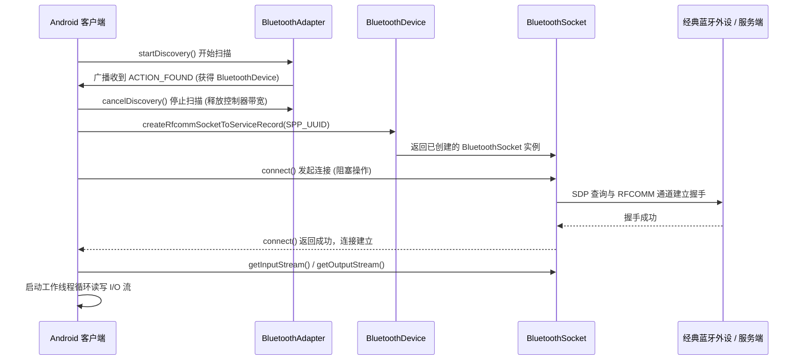
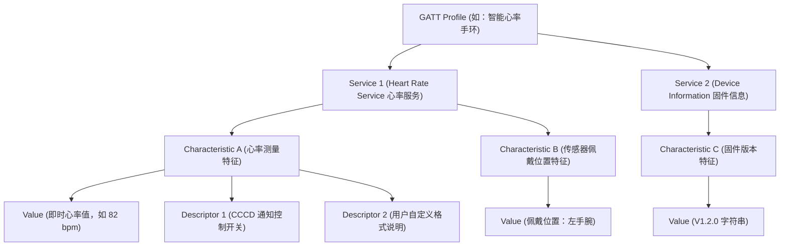
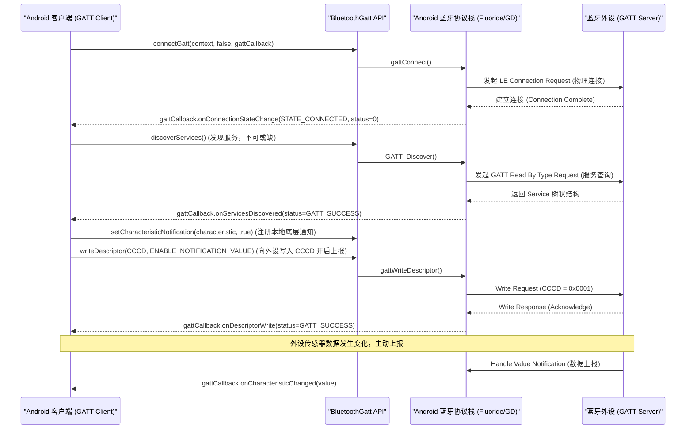

# 5.1.6.3.4 蓝牙

在 Android 移动开发中，蓝牙（Bluetooth）技术是连接物理世界与数字世界的核心桥梁。随着物联网（IoT）的爆发，蓝牙技术从早期的音频、大文件传输逐步演进为低功耗、高频次的传感器数据采集。本篇文档将深度剖析 Android 蓝牙的底层机制、经典蓝牙与低功耗蓝牙（BLE）的设计取舍、高并发下极其致命的 `status=133` 连接与通信问题，以及 Android 12+（API 31）全新的免定位权限体系适配方案。

---

## 1. 核心概念与蓝牙技术定位

蓝牙技术运行在 2.4GHz ISM（工业、科学、医疗）免授权频段上。在 Android 平台中，蓝牙协议栈经历了几次重大变革（从早期的 **BlueZ** 到 Android 4.2 引入的 **Bluedroid/Fluoride**，再到近年来 Google 推行的 Rust 重构版 **Gabeldorsche**）。在目前的开发中，蓝牙主要被划分为两大完全不同的体系：

### 1.1 经典蓝牙（Bluetooth Classic - BR/EDR）
经典蓝牙是指支持基本速率（Basic Rate, BR）和增强数据率（Enhanced Data Rate, EDR）的传统蓝牙技术。它工作在 79 个 1MHz 的信道上。
*   **物理层特征**：通过射频跳频技术（FHSS）在 79 个频点间快速切换，具备较强的抗干扰能力。
*   **通信特征**：一旦建立连接，通信双方将维持持续的同步物理通道。经典蓝牙的设计目标是**高带宽、持续流式传输**。
*   **适用场景**：实时高带宽数据交换。例如车载音频、高保真耳机（A2DP 协议）、语音通话（HFP 协议）、蓝牙打印机以及部分大文件传输。

### 1.2 低功耗蓝牙（Bluetooth Low Energy - BLE）
低功耗蓝牙是蓝牙 4.0 规范引入的全新架构，与经典蓝牙在物理层和协议栈上是**完全不兼容**的。它工作在 40 个 2MHz 的信道上（其中 37 个为数据信道，3 个为专用的广播信道：37、38、39 信道）。
*   **物理层特征**：BLE 优化了跳频算法和连接建立流程。它取消了经典蓝牙复杂的寻呼（Paging）与查询（Inquiry）过程，允许设备在数毫秒内完成“广播-扫描-连接-传输-断开”的完整闭环。
*   **通信特征**：采用**间歇性短包传输**模式。设备在没有数据传输时处于极低功耗的休眠状态，只有在预设的连接间隔（Connection Interval）内才会唤醒并进行短暂的握手和数据交换。
*   **适用场景**：对电量极其敏感、间歇性收发小数据包的设备。例如智能手环、心率带、血糖仪、温湿度传感器以及 iBeacon 定位信标。

---

## 2. 经典蓝牙与 BLE 的设计取舍

在面向实际业务进行架构设计时，选择经典蓝牙还是 BLE 是一项关键的技术取舍。下表对比了这两种技术的底层差异与设计哲学：

| 技术指标 | 经典蓝牙 (BR/EDR) | 低功耗蓝牙 (BLE) |
| :--- | :--- | :--- |
| **射频信道数** | 79 个 (1MHz 带宽) | 40 个 (2MHz 带宽) |
| **理论最大带宽** | 2.1 Mbps (EDR) / 3 Mbps (HS) | 1 Mbps (BLE 4.0) / 2 Mbps (BLE 5.0) |
| **实际吞吐量** | 约 800 kbps - 2.1 Mbps | 约 10 kbps - 1.4 Mbps (受 MTU 与连接间隔限制) |
| **功耗水平** | 较高 (工作电流 20 - 40 mA) | 极低 (工作电流 15 uA - 15 mA，待机 uA 级) |
| **连接建立耗时** | 较长 (通常需要 3 - 6 秒) | 极短 (通常小于 10 毫秒 - 100 毫秒) |
| **拓扑结构** | 网状/星型 (Piconet, 1 主 7 从) | 广播者/监听者、星型 (Master 多 Slaves)、Mesh (蓝牙 5.0) |
| **电池续航时长** | 数小时至数天 (需要频繁充电) | 数月至数年 (单颗纽扣电池 CR2032 即可驱动) |
| **主要应用协议** | SPP, A2DP, HFP, HSP, OPP | GATT (Generic Attribute Profile) |

### 设计哲学取舍分析
*   **带宽与功耗的负相关性**：经典蓝牙追求高带宽与低延迟的流式音频传输，为此付出了持续激活射频芯片的代价。而 BLE 的设计哲学是“**用完即走，深度睡眠**”，它牺牲了持续高带宽的能力，通过极短的空隙传输数据，保证在 99% 的时间内芯片处于功耗可忽略不计的睡眠模式。
*   **连接拓扑的选择**：经典蓝牙的微网（Piconet）限制了主设备最多只能连接 7 个从设备，且角色转换慢。BLE 的星型拓扑允许一个中心设备（Central）同时维护数十个外设（Peripheral）的连接，或者仅通过无连接的广播（Advertising）和扫描（Scanning）实现“一对多”的一向数据发布。

---

## 3. 经典蓝牙开发流与 Socket 通信

经典蓝牙的通信模型基于**虚拟串口**的理念，在 Android 平台中对应的是 **RFCOMM（Radio Frequency Communication）** 协议。RFCOMM 在 L2CAP（逻辑链路控制与适配协议）之上模拟了 RS-232 串口的标准控制信号，为开发者提供了像操作 TCP Socket 一样的流式字节读写体验。

### 3.1 经典蓝牙通信核心 API
*   `BluetoothAdapter`：本地蓝牙适配器，负责蓝牙的开启、关闭以及扫描。
*   `BluetoothDevice`：表示远程蓝牙物理设备。
*   `BluetoothServerSocket`：服务端 Socket 监听器，用于等待客户端的连接请求。
*   `BluetoothSocket`：客户端 Socket，用于与外设建立连接并提供 I/O 流。

### 3.2 经典蓝牙连接与传输工作流



### 3.3 经典蓝牙核心代码实现
由于蓝牙扫描和 Socket 连接都是高耗电、且可能导致阻塞的操作，我们必须将其放入子线程中执行。**切记：在调用 `BluetoothSocket.connect()` 之前，必须显式调用 `BluetoothAdapter.cancelDiscovery()`**。因为蓝牙搜索（Discovery）是一项非常消耗控制器带宽的工作，如果此时发起连接，会导致连接极易失败，传输速率也会受到毁灭性影响。

```kotlin
import android.bluetooth.BluetoothAdapter
import android.bluetooth.BluetoothDevice
import android.bluetooth.BluetoothSocket
import android.util.Log
import java.io.IOException
import java.io.InputStream
import java.io.OutputStream
import java.util.UUID

class ClassicBluetoothManager(private val bluetoothAdapter: BluetoothAdapter) {
    private val TAG = "ClassicBluetooth"
    
    // 标准串行端口服务 (SPP) 的经典 UUID
    private val SPP_UUID: UUID = UUID.fromString("00001101-0000-1000-8000-00805F9B34FB")
    private var connectThread: ConnectThread? = null
    private var transferThread: TransferThread? = null

    @Synchronized
    fun connectToDevice(device: BluetoothDevice) {
        // 取消正在运行的连接线程
        connectThread?.cancel()
        connectThread = ConnectThread(device).apply { start() }
    }

    private inner class ConnectThread(private val device: BluetoothDevice) : Thread() {
        private var socket: BluetoothSocket? = null

        init {
            try {
                // 利用 SDP UUID 创建客户端 RFCOMM Socket
                socket = device.createRfcommSocketToServiceRecord(SPP_UUID)
            } catch (e: IOException) {
                Log.e(TAG, "Socket 凭证创建失败", e)
            }
        }

        override fun run() {
            // 连接前必须取消扫描，释放控制器物理带宽
            if (bluetoothAdapter.isDiscovering) {
                bluetoothAdapter.cancelDiscovery()
            }

            try {
                // connect() 是阻塞调用，直到成功或抛出异常
                socket?.connect()
                Log.d(TAG, "物理连接成功建立！")
            } catch (connectException: IOException) {
                Log.e(TAG, "连接物理外设失败", connectException)
                try {
                    socket?.close()
                } catch (closeException: IOException) {
                    Log.e(TAG, "无法关闭未成功连接的 socket", closeException)
                }
                return
            }

            // 连接建立成功，启动数据收发线程
            socket?.let { startTransfer(it) }
        }

        fun cancel() {
            try {
                socket?.close()
            } catch (e: IOException) {
                Log.e(TAG, "无法关闭 Socket", e)
            }
        }
    }

    @Synchronized
    private fun startTransfer(socket: BluetoothSocket) {
        transferThread?.cancel()
        transferThread = TransferThread(socket).apply { start() }
    }

    private inner class TransferThread(private val socket: BluetoothSocket) : Thread() {
        private val inputStream: InputStream? = socket.inputStream
        private val outputStream: OutputStream? = socket.outputStream
        private var isRunning = true

        override fun run() {
            val buffer = ByteArray(1024)
            var bytes: Int

            // 循环读取数据流
            while (isRunning) {
                try {
                    inputStream?.let { stream ->
                        bytes = stream.read(buffer)
                        val receivedData = String(buffer, 0, bytes)
                        Log.d(TAG, "收到字节数据：$receivedData")
                        // 投递回调或 Handler 处理业务逻辑...
                    }
                } catch (e: IOException) {
                    Log.e(TAG, "读取数据流异常断开", e)
                    break
                }
            }
        }

        fun write(bytes: ByteArray) {
            try {
                outputStream?.write(bytes)
                outputStream?.flush()
                Log.d(TAG, "成功发送字节数据")
            } catch (e: IOException) {
                Log.e(TAG, "写入数据流异常失败", e)
            }
        }

        fun cancel() {
            isRunning = false
            try {
                socket.close()
            } catch (e: IOException) {
                Log.e(TAG, "断开连接失败", e)
            }
        }
    }
}
```

---

## 4. BLE 核心 GATT 机制与命令队列

与基于流式 Socket 的经典蓝牙不同，低功耗蓝牙（BLE）的核心通信建立在 **GATT（Generic Attribute Profile，通用属性配置文件）** 协议上。所有数据都以“属性（Attribute）”的形式存在，通过树形结构层层向下进行管理。

### 4.1 GATT 树形层次结构
GATT 的层级结构非常严密，依次为：**GATT Profile -> Service（服务）-> Characteristic（特征）-> Descriptor（描述符）**。



*   **Profile**：是逻辑上的功能组合。它并不是设备端存在的实体数据，而是一套官方定义的规范（如 Heart Rate Profile 定义了心率设备应该提供哪些服务）。
*   **Service**：服务的物理载体，是具有相似功能的特征集合。通过 16位（标准服务）或 128位（自定义服务）UUID 标识。例如，心率服务的标准 UUID 是 `0x180D`。
*   **Characteristic**：特征，是 BLE 通信中最基础的数据单元。它包含了具体的值（Value）以及操作它的属性（Properties），如：
    *   `READ`：允许客户端读取特征值。
    *   `WRITE` 或 `WRITE_NO_RESPONSE`：允许客户端向特征中写入新值。
    *   `NOTIFY` 或 `INDICATE`：允许外设在值发生改变时主动推送到客户端（`NOTIFY` 不需要客户端应答，`INDICATE` 需要应用层 ACK）。
*   **Descriptor**：描述符，用于对特征进行修饰和元数据补充。最常用的是 **CCCD（Client Characteristic Configuration Descriptor）**，UUID 为 `00002902-0000-1000-8000-00805f9b34fb`。客户端必须往这个描述符写入 `0x0001`（启用 Notify）或 `0x0002`（启用 Indicate）才能开启外设的数据上报通道。

### 4.2 BLE 核心开发流



---

### 4.3 MTU 协商机制（最大传输单元优化）

在低功耗蓝牙通信中，单次传输的数据容量受到 **MTU（Maximum Transmission Unit）** 的直接制约。
*   **默认限制**：根据蓝牙核心规范，默认的 ATT MTU 大小为 **23 字节**。去除 3 字节的 ATT 协议头部（1 字节的操作码 Opcode，2 字节的属性句柄 Attribute Handle），留给应用层传输的实际 Payload 只有 **20 字节**。
*   **吞吐量瓶颈**：如果需要同步大批量的历史传感器数据，或者进行 OTA 固件升级，每次只发送 20 字节将导致极其低效的吞吐量（受连接间隔限制，每秒可能只能发几百字节），极易导致同步超时甚至电池耗尽。
*   **协商提升**：自 Android 5.0（API 21）起，Android 引入了 `BluetoothGatt.requestMtu(int mtu)` 接口。该接口允许客户端主动向上发起 MTU 大小变更协商，最大可申请 **517 字节**（对应 Payload 为 **514 字节**）。
*   **开发最佳实践**：
    1.  **触发时机**：必须在物理连接建立成功（`STATE_CONNECTED`）后触发协商。通常建议在**连接建立完毕且执行服务发现（discoverServices）之前**，或者服务发现完毕后立即调用。
    2.  **异步响应**：调用 `requestMtu` 是一个异步过程，必须监听 `BluetoothGattCallback.onMtuChanged(gatt, mtu, status)` 回调。实际生效的 MTU 值为 Android 客户端与外设固件协议栈双方支持的最小值。
    3.  **队列管理**：由于 `requestMtu` 在底层同样占用 GATT 传输队列，在后续介绍的“GATT 命令队列”中，必须将 `requestMtu` 视为一个普通的异步指令进行排队串行化执行，防止与服务发现或特征读写产生竞争冲突。

---

### 4.4 BLE 连接参数调优（Connection Parameters）

BLE 设备之所以省电，是因为其采用了间歇性收发机制。这种机制由一组关键的**连接参数**所决定：

1.  **Connection Interval（连接间隔）**：主从设备进行射频握手和数据交换的时间周期。范围在 7.5ms 到 4.0s 之间。数值越小，吞吐量越高，延迟越低，但功耗呈指数级上升。
2.  **Slave Latency（从设备延迟）**：允许从设备在没有数据需要发送时，忽略（跳过）的连接事件次数。这允许外设在没有事件时保持睡眠，降低待机电耗。
3.  **Supervision Timeout（监督超时）**：两次成功连接事件的最大时间间隔。若在此时间内无任何响应，则判定链路断开。

#### Android 侧的调优接口
Android SDK 限制了应用层直接设置具体毫秒数连接间隔的权力，但提供了 `BluetoothGatt.requestConnectionPriority(int connectionPriority)` 接口进行策略调整：
*   `CONNECTION_PRIORITY_HIGH`：高优先级、高吞吐。底层会将连接间隔缩短到 **11.25ms - 15ms** 左右。在进行 OTA 固件下载或大数据传输时，必须在传输前切换至该模式以提高吞吐。
*   `CONNECTION_PRIORITY_BALANCED`：平衡模式。连接间隔通常在 **30ms - 50ms** 之间，适合常规的双向即时控制与小数据交换。
*   `CONNECTION_PRIORITY_LOW_POWER`：低功耗模式。连接间隔通常在 **100ms - 125ms** 之间。当设备处于后台静默状态，仅需维持心跳时，应立刻切入此状态。

*注意：外设固件端也可以随时向 Android 客户端发起 Connection Parameter Update Request。Android 底层协议栈（L2CAP 层）会自动处理此请求并完成协商。*

---

### 4.5 重点攻克 `status=133` 经典天坑

在 BLE 实际商业开发中，90% 的开发者都会遇到连接状态回调中莫名其妙返回 `status=133` 导致连接中断的情况。这是 Android 蓝牙中最具破坏性的“经典天坑”。

#### 4.5.1 `status=133` 的底层成因剖析
在 Android 蓝牙底层协议栈（AOSP C++ 代码如 `Fluoride/Bluedroid`）中，`status=133` 映射的是 `gatt_api.h` 中的 `GATT_ERROR`（其值为十六进制 `0x85`，即十进制的 `133`）。这是一个通用的错误捕捉码，底层凡是未显式分类的连接、通信异常，最终都会抛出 133。其最根本的物理和系统成因包括：

1.  **高并发下的协议栈阻塞与 L2CAP 单线程队列崩溃**：
    Android 的蓝牙协议栈是单线程、事件驱动的。GATT 所有的读写、通知注册和描述符写入动作，都需要通过底层的 L2CAP 通信队列。如果在前一个异步操作的硬件回调（例如 `onCharacteristicWrite` 或 `onDescriptorWrite`）尚未返回前，上层代码并发调用了下一个 GATT 动作（如连续调用 `writeCharacteristic`），底层协议栈就会发生指令覆盖、冲突或者由于没有拿到上一个包的 ACK 而导致状态机死锁。最后，协议栈会在连接超时后强制复位状态机，向 Android 应用层抛出 `status=133`，直接把连接掐断。
2.  **未及时释放连接导致系统的 GATT 通道泄露**：
    Android 蓝牙协议栈为每个应用分配了硬限制的 GATT Client 通道数量上限。通常，系统只允许单个 App 建立 6 到 8 个并发的 GATT 客户端连接（视不同厂商定制 ROM 和 Android 版本而定）。
    如果我们在外设断开连接时，只调用了 `BluetoothGatt.disconnect()`，但没有调用 `BluetoothGatt.close()` 来释放底层句柄，那么系统层的物理通道就无法被回收（GATT 接口泄露）。当尝试连接第 7 或 8 次时，由于通道已经耗尽，底层会直接拒绝分配信道，并瞬间返回 `status=133` 或 `status=134`（通道已满）。
3.  **连接时的扫描冲突（Collision）**：
    如果客户端在执行 `connectGatt` 发起物理握手时，还在高频度地运行 `BluetoothLeScanner.startScan()` 扫描周围设备。蓝牙控制器的射频接收器（RF Rx）需要在广播信道（37, 38, 39）和物理连接信道间不断硬切换，这极易导致连接协商数据包丢失或连接建立超时，从而最终在 `onConnectionStateChange` 回调中吐出 133。
4.  **AutoConnect 参数陷阱**：
    `connectGatt` 中的 `autoConnect: Boolean` 参数在设置为 `true` 时，表示由底层蓝牙控制器在合适的时候自动发起连接。这会导致设备以极低频次（Passive Scan Mode）去寻觅该设备，往往耗时几分钟也无法连接上，从而极易因各种连接间期超时导致 133；此外，`autoConnect = true` 在某些 Android 手机上，会将连接超时限制放宽到无限长，一旦出现信号丢包，底层就会抛出 133 并彻底卡死连接重试状态机。

#### 4.5.2 status=133 的治本之策
为了彻底根治 133 错误，必须在开发中遵循以下黄金法则：
*   **物理连接与重连前彻底 Close 句柄**：每次触发断开连接或进行重连时，必须先调用 `gatt.disconnect()` 释放连接，接着必须**立刻调用 `gatt.close()`**。
*   **先停止扫描，再发起连接**：发起连接动作前，务必调用 `scanner.stopScan()`，彻底清空射频芯片的工作负载。
*   **确保连接动作在主线程（或特定的 Single-Thread-Handler 线程）中触发**：在某些旧版本 Android（如 5.0 - 7.0）上，若在自定义子线程调用 `connectGatt()`，底层的 binder 回调会因为线程局部存储（TLS）环境不完整而导致连接超时，因此必须切换到 UI 线程触发连接动作。
*   **建立 GATT 串行命令队列**：这是最核心的技术方案。禁止一切异步操作并发执行。

---

### 4.6 基于命令队列（CmdQueue）的串行化架构设计

为了保证每一笔读、写、订阅数据在物理层依次执行，绝不在底层协议栈产生竞争冲突，我们必须设计一个**串行化命令执行队列**。

#### 4.6.1 核心设计思路
1.  **任务封装**：把每一次读、写、写描述符等操作封装成一个独立的 `GattCommand` 任务。
2.  **串行分发**：将命令加入一个线程安全的队列（如 `ConcurrentLinkedQueue`）中。当检测到当前蓝牙设备处于“空闲（isBusy = false）”状态时，从队头取出任务执行，并将设备状态置为“繁忙（isBusy = true）”。
3.  **回调解锁**：在 `BluetoothGattCallback` 的对应硬件回调函数（例如 `onCharacteristicWrite`、`onDescriptorWrite`、`onCharacteristicRead`）触发后，重新将 `isBusy` 置为 `false`，并驱动队列执行下一个任务。
4.  **超时护航（Watchdog）**：某些外设由于电池电量低、电磁干扰，可能会丢失数据包，导致 Android 底层迟迟收不到 ACK。我们需要设置一个 2000 毫秒的超时定时器，如果超时未触发回调，则强制解锁并跳过该命令，防止队列挂起。

#### 4.6.2 GATT 命令队列完整实现代码
以下为针对 BLE 开发设计的串行化命令管理器核心实现：

```kotlin
import android.bluetooth.*
import android.content.Context
import android.os.Handler
import android.os.Looper
import android.util.Log
import java.util.concurrent.ConcurrentLinkedQueue
import java.util.UUID

sealed class GattCommand {
    class WriteCharacteristic(val characteristic: BluetoothGattCharacteristic, val data: ByteArray) : GattCommand()
    class ReadCharacteristic(val characteristic: BluetoothGattCharacteristic) : GattCommand()
    class WriteDescriptor(val descriptor: BluetoothGattDescriptor, val data: ByteArray) : GattCommand()
    class RequestMtu(val mtu: Int) : GattCommand()
}

class BleQueueManager(private val context: Context, private val device: BluetoothDevice) {
    private val TAG = "BleQueueManager"
    
    private var bluetoothGatt: BluetoothGatt? = null
    private val commandQueue = ConcurrentLinkedQueue<GattCommand>()
    private var isBusy = false
    
    // 主线程 Handler 用于超时护航与回调派发
    private val mainHandler = Handler(Looper.getMainLooper())
    private val TIMEOUT_MILLIS = 2000L
    
    // 超时护航 Runnable：如果命令在规定时间内没收到回调，强制执行下一个
    private val watchdogRunnable = Runnable {
        Log.w(TAG, "GATT 异步指令执行超时！强制执行下一条指令。")
        isBusy = false
        executeNext()
    }

    fun connect() {
        mainHandler.post {
            // 主线程调用，先清理旧句柄，阻断物理泄露导致的 133 错误
            close()
            bluetoothGatt = device.connectGatt(context, false, gattCallback, BluetoothDevice.TRANSPORT_LE)
        }
    }

    @Synchronized
    fun enqueueCommand(command: GattCommand) {
        commandQueue.offer(command)
        if (!isBusy) {
            executeNext()
        }
    }

    @Synchronized
    private fun executeNext() {
        if (isBusy) return
        val command = commandQueue.poll() ?: return

        val gatt = bluetoothGatt
        if (gatt == null) {
            Log.e(TAG, "未建立 GATT 连接，无法执行指令")
            commandQueue.clear()
            return
        }

        isBusy = true
        // 挂载超时保护
        mainHandler.postDelayed(watchdogRunnable, TIMEOUT_MILLIS)

        try {
            when (command) {
                is GattCommand.WriteCharacteristic -> {
                    // API 33+ (Android 13) 推荐使用带有 writeType 的重载 API
                    command.characteristic.value = command.data
                    gatt.writeCharacteristic(command.characteristic)
                }
                is GattCommand.ReadCharacteristic -> {
                    gatt.readCharacteristic(command.characteristic)
                }
                is GattCommand.WriteDescriptor -> {
                    command.descriptor.value = command.data
                    gatt.writeDescriptor(command.descriptor)
                }
                is GattCommand.RequestMtu -> {
                    gatt.requestMtu(command.mtu)
                }
            }
        } catch (e: Exception) {
            Log.e(TAG, "向协议栈分发指令失败", e)
            commandCompleted()
        }
    }

    @Synchronized
    private fun commandCompleted() {
        // 收到硬件层正常回调，移除超时护航并解锁
        mainHandler.removeCallbacks(watchdogRunnable)
        isBusy = false
        executeNext()
    }

    // 经典 2902 CCCD 的 UUID 用于快捷封装订阅通知
    private val CCCD_UUID = UUID.fromString("00002902-0000-1000-8000-00805f9b34fb")

    fun enableNotification(characteristic: BluetoothGattCharacteristic) {
        val gatt = bluetoothGatt ?: return
        // 1. 本地注册监听事件
        gatt.setCharacteristicNotification(characteristic, true)
        
        // 2. 构造 CCCD 描述符写入命令，加入队列排队执行
        val descriptor = characteristic.getDescriptor(CCCD_UUID)
        if (descriptor != null) {
            enqueueCommand(GattCommand.WriteDescriptor(descriptor, BluetoothGattDescriptor.ENABLE_NOTIFICATION_VALUE))
        }
    }

    private val gattCallback = object : BluetoothGattCallback() {
        override fun onConnectionStateChange(gatt: BluetoothGatt, status: Int, newState: Int) {
            Log.d(TAG, "连接状态变化：status=$status, newState=$newState")
            if (status == 133) {
                Log.e(TAG, "遭遇经典 133 错误！通常需 Close 句柄并在数秒后重新连接。")
            }
            if (newState == BluetoothProfile.STATE_CONNECTED) {
                Log.d(TAG, "物理链路连接成功，发起 MTU 协商与服务发现...")
                // 首先将 MTU 协商放入队列中
                enqueueCommand(GattCommand.RequestMtu(517))
                // 然后发起服务发现
                gatt.discoverServices()
            } else if (newState == BluetoothProfile.STATE_DISCONNECTED) {
                Log.w(TAG, "链路断开，开始释放资源...")
                close()
            }
        }

        override fun onMtuChanged(gatt: BluetoothGatt, mtu: Int, status: Int) {
            Log.d(TAG, "MTU 协商回调完成，协商结果: $mtu, 状态码: $status")
            commandCompleted()
        }

        override fun onServicesDiscovered(gatt: BluetoothGatt, status: Int) {
            Log.d(TAG, "服务发现完毕，状态码: $status")
            // 到此阶段，方可正式开启数据通信
        }

        override fun onCharacteristicRead(gatt: BluetoothGatt, characteristic: BluetoothGattCharacteristic, status: Int) {
            Log.d(TAG, "特征读取完毕 UUID: ${characteristic.uuid}, status=$status")
            commandCompleted()
        }

        override fun onCharacteristicWrite(gatt: BluetoothGatt, characteristic: BluetoothGattCharacteristic, status: Int) {
            Log.d(TAG, "特征写入完毕 UUID: ${characteristic.uuid}, status=$status")
            commandCompleted()
        }

        override fun onDescriptorWrite(gatt: BluetoothGatt, descriptor: BluetoothGattDescriptor, status: Int) {
            Log.d(TAG, "描述符写入完毕 UUID: ${descriptor.uuid}, status=$status")
            commandCompleted()
        }

        override fun onCharacteristicChanged(gatt: BluetoothGatt, characteristic: BluetoothGattCharacteristic) {
            // 注意：onCharacteristicChanged 是外设主动推送的数据上报，不属于主动命令请求
            // 它不在命令队列的串行流程里，无需调用 commandCompleted()。
            val value = characteristic.value
            Log.d(TAG, "接收到外设主动上报特征值 UUID: ${characteristic.uuid}, hexLength=${value.size}")
        }
    }

    fun close() {
        commandQueue.clear()
        isBusy = false
        mainHandler.removeCallbacks(watchdogRunnable)
        try {
            bluetoothGatt?.disconnect()
            bluetoothGatt?.close()
            bluetoothGatt = null
        } catch (e: Exception) {
            Log.e(TAG, "关闭 GATT 物理链路异常", e)
        }
    }
}
```

---

## 5. 多版本蓝牙权限演进与适配

在 Android 的安全架构设计中，蓝牙权限经历了极其严苛的演进。因为蓝牙扫描不仅能够寻找设备，还能够通过抓取周围公共场所的蓝牙 Beacon（如商场、公共定位硬件等）信息，计算出设备的精确定位坐标。

### 5.1 Android 12（API 31）之前的混乱与高门槛
在 Android 6.0 至 Android 11 中，要让一个应用具有扫描和建立蓝牙连接的能力，必须声明并申请以下权限：
1.  **功能声明**：
    *   `android.permission.BLUETOOTH`：允许应用连接配对的蓝牙设备、读取数据流。
    *   `android.permission.BLUETOOTH_ADMIN`：允许应用扫描蓝牙设备并修改蓝牙配置。
2.  **定位绑架**：
    *   由于蓝牙扫描可以推算位置，Google 强制规定，进行蓝牙扫描（无论是经典蓝牙还是 BLE 扫描）的应用，**必须在运行时向用户申请并获得 `android.permission.ACCESS_FINE_LOCATION`（精确定位）权限**。
    *   **痛点**：对于大量仅仅需要连接手环、耳机等 Companion 设备的健康管理或小工具应用，由于需要强行向用户索要“精确定位”权限，导致用户极度反感并拒绝授权，造成极高的用户流失率。

---

### 5.2 Android 12+ 全新权限体系的优雅适配
自 Android 12（API 31）起（参考 [AndroidVersionChangeLog.md](../../../../../../AndroidVersionChangeLog.md#android-12api-31)），Google 彻底推翻了原有的“蓝牙与定位权限绑定”体系，引入了三个细粒度独立蓝牙权限：

*   `BLUETOOTH_SCAN`：用于执行蓝牙搜索和扫描。
*   `BLUETOOTH_CONNECT`：用于允许应用连接到配对的蓝牙设备、发起 RFCOMM 或 GATT 连接并读取/写入特征值。
*   `BLUETOOTH_ADVERTISE`：用于允许设备作为 Peripheral 发射广播。

#### 5.2.1 定位权限免申请方案：`neverForLocation` 标记
如果应用仅是通过扫描、连接蓝牙来完成一些硬件通信（例如手环同步步数、小风扇调整风速），而**绝对不会利用蓝牙扫描结果去推算、上传用户物理位置**，则可以通过向 `BLUETOOTH_SCAN` 权限附加 `android:usesPermissionFlags="neverForLocation"` 标志向系统表白。这样，应用在 Android 12+ 的设备上，**完全不需要申请任何 Location 定位权限，即可畅通无阻地开展蓝牙扫描与连接！**

#### 5.2.2 清单文件（AndroidManifest.xml）完整声明示例
针对新旧设备兼容，完美的清单声明方式如下：

```xml
<manifest xmlns:android="http://schemas.android.com/apk/res/android">

    <!-- 1. 兼容 Android 11 及以下的传统蓝牙权限 -->
    <uses-permission android:name="android.permission.BLUETOOTH"
                     android:maxSdkVersion="30" />
    <uses-permission android:name="android.permission.BLUETOOTH_ADMIN"
                     android:maxSdkVersion="30" />

    <!-- 2. 兼容 Android 11 及以下的定位权限（旧设备必须申请定位才能搜寻蓝牙） -->
    <uses-permission android:name="android.permission.ACCESS_FINE_LOCATION"
                     android:maxSdkVersion="30" />

    <!-- 3. 适配 Android 12+ 全新细分蓝牙权限 -->
    <!-- 关键点：添加 usesPermissionFlags 声明该扫描永不用于位置推算 -->
    <uses-permission 
        android:name="android.permission.BLUETOOTH_SCAN"
        android:usesPermissionFlags="neverForLocation" />
        
    <uses-permission android:name="android.permission.BLUETOOTH_CONNECT" />
    <uses-permission android:name="android.permission.BLUETOOTH_ADVERTISE" />

    <application>
        <!-- 业务 Activity 声明... -->
    </application>
</manifest>
```

#### 5.2.3 权限动态申请代码实践
在应用发起蓝牙操作前，针对 Android 12 手机，必须单独申请运行时动态权限授权：

```kotlin
import android.Manifest
import android.app.Activity
import android.content.Context
import android.content.pm.PackageManager
import android.os.Build
import androidx.core.app.ActivityCompat
import androidx.core.content.ContextCompat

fun checkAndRequestBluetoothPermissions(activity: Activity, requestCode: Int): Boolean {
    // 针对 Android 12 (API 31) 以上系统的动态权限申请
    if (Build.VERSION.SDK_INT >= Build.VERSION_CODES.S) {
        val permissionsToRequest = mutableListOf<String>()

        if (ContextCompat.checkSelfPermission(activity, Manifest.permission.BLUETOOTH_SCAN)
            != PackageManager.PERMISSION_GRANTED) {
            permissionsToRequest.add(Manifest.permission.BLUETOOTH_SCAN)
        }

        if (ContextCompat.checkSelfPermission(activity, Manifest.permission.BLUETOOTH_CONNECT)
            != PackageManager.PERMISSION_GRANTED) {
            permissionsToRequest.add(Manifest.permission.BLUETOOTH_CONNECT)
        }

        if (permissionsToRequest.isNotEmpty()) {
            ActivityCompat.requestPermissions(activity, permissionsToRequest.toTypedArray(), requestCode)
            return false // 尚未获得权限，发起申请并挂起本次蓝牙操作
        }
    } else {
        // 针对 Android 6.0 到 Android 11 系统的旧定位权限校验
        if (ContextCompat.checkSelfPermission(activity, Manifest.permission.ACCESS_FINE_LOCATION)
            != PackageManager.PERMISSION_GRANTED) {
            ActivityCompat.requestPermissions(
                activity,
                arrayOf(Manifest.permission.ACCESS_FINE_LOCATION),
                requestCode
            )
            return false
        }
    }
    return true // 权限已就绪
}
```

通过这一套全新的适配方案，既保障了旧版 Android 系统下蓝牙能正常搜寻，又在 Android 12+ 系统上将位置追踪的隐私疑虑彻底拔除，极大优化了 App 的权限请求体验。

---

### 5.3 Android 8.0+ 后台扫描限制与应对策略

为了避免应用在后台高频度开启蓝牙扫描消耗大量系统电量，自 Android 8.0（API 26）开始，Google 对后台蓝牙扫描施加了严格的硬件调度策略限制（可跳转参考 [AndroidVersionChangeLog.md](../../../../../../AndroidVersionChangeLog.md#android-80--81api-26--27)）。

*   **无过滤后台扫描彻底失效**：当应用退至后台且屏幕关闭后，若调用 `BluetoothLeScanner.startScan(null)`（即没有任何 `ScanFilter` 的无过滤扫描），系统将不会在后台返回任何扫描回调。
*   **强制 ScanFilter 绑定**：若要在后台正常接收到扫描广播，调用 `startScan()` 时**必须显式提供带有特定 Service UUID 的 `ScanFilter` 过滤器**，并且在 `ScanSettings` 中合理设置扫描模式。
*   **PendingIntent 机制（系统接管扫描）**：在要求极高生命周期留存的蓝牙设备管理应用中，建议使用带有 `PendingIntent` 形式的 `startScan(filters, settings, callbackIntent)` 接口。
    *   该方案将扫描交由系统的蓝牙子系统进行后台托管。
    *   当系统硬件检测到有匹配 `ScanFilter` 的外设出现时，系统会自动拉起该 `PendingIntent` 所对应的 `BroadcastReceiver`，即使此时应用已被系统强行杀死，也会瞬间被系统广播唤醒进行数据拉取。这极大改善了后台保活难题，并彻底规避了高耗电后台服务。

---

### 5.4 系统蓝牙状态广播监听（动态解耦设计）

用户在系统设置、快捷下拉菜单中可以随时关闭蓝牙开关，或者系统可能因过热等原因强制重启蓝牙子系统。为了防止蓝牙链路状态发生“雪崩式”崩溃，我们必须建立**动态全局系统蓝牙状态监听器**。

通过注册监听 `BluetoothAdapter.ACTION_STATE_CHANGED` 广播，动态追踪以下四种核心适配器状态：
*   `BluetoothAdapter.STATE_OFF`：蓝牙适配器已关闭。
*   `BluetoothAdapter.STATE_ON`：蓝牙适配器已正常开启。
*   `BluetoothAdapter.STATE_TURNING_ON`：蓝牙适配器正在开启中。
*   `BluetoothAdapter.STATE_TURNING_OFF`：蓝牙适配器正在关闭中。

#### 动态生命周期处理逻辑
当监听到 `STATE_TURNING_OFF` 或 `STATE_OFF` 时，应用层必须立即执行优雅退避逻辑：
1.  **清空排队数据**：立即调用 `BleQueueManager.close()` 或 `commandQueue.clear()`，防止积压的 GATT 命令在蓝牙断开后产生海量异常报错。
2.  **重置句柄**：将所有 `BluetoothGatt` 实例变量置为 `null`，释放资源。
3.  **UI 降级提示**：引导用户重新开启蓝牙，静待 `STATE_ON` 广播到来后，再安全触发断线重连状态机。

---
> **延伸阅读与关联**：
> - 关于 Android 12 中由于隐私收紧引入的其他前台服务或权限变更，请参考 [AndroidVersionChangeLog.md](../../../../../../AndroidVersionChangeLog.md#android-12api-31)。
> - 关于 Android 13 针对 Binder 序列化安全带来的额外限制，请参见 [AndroidVersionChangeLog.md](../../../../../../AndroidVersionChangeLog.md#android-13api-33)。
