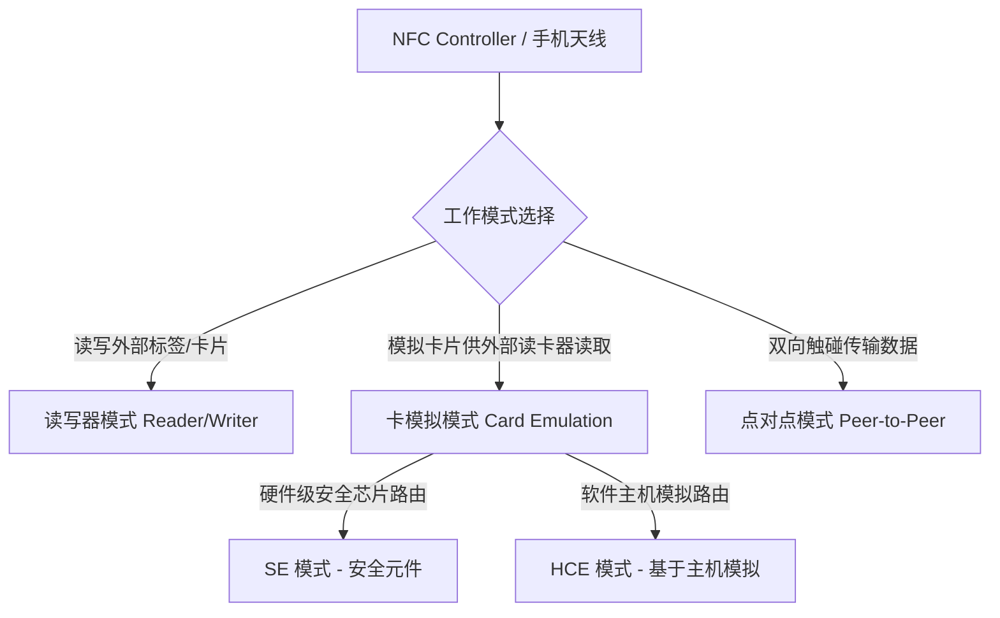
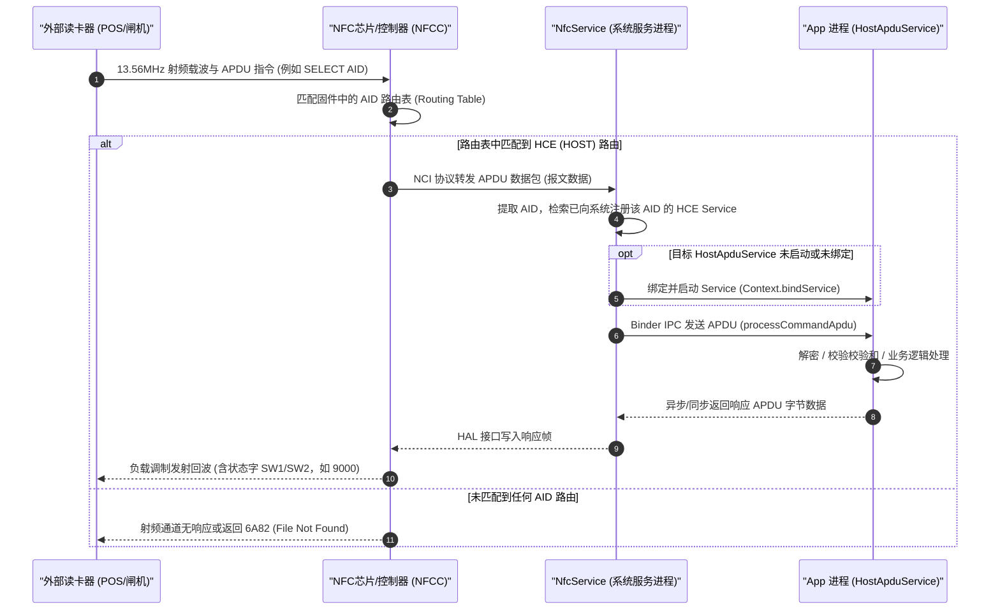
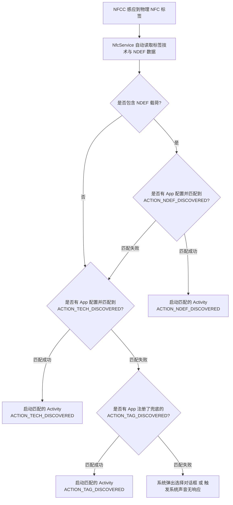
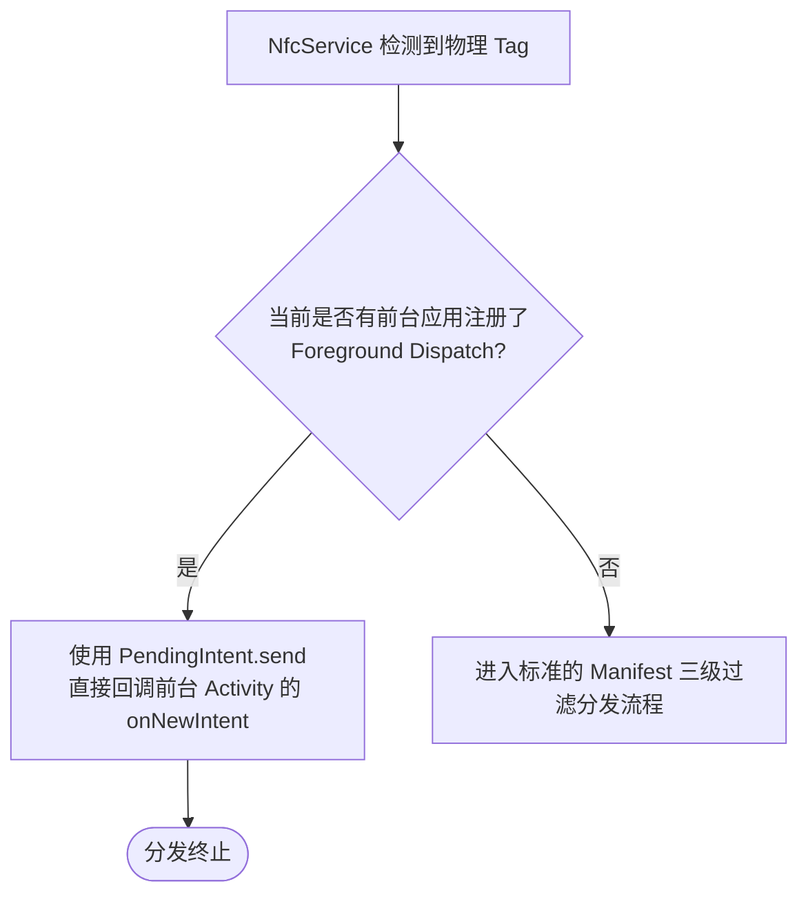

# 5.1.6.3.5 NFC

近场通信（Near Field Communication，简称 NFC）是一种基于射频识别（RFID）演进得来的短距离高频无线通信技术。NFC 在 13.56 MHz 频率下工作，通信距离通常限制在 10 厘米（实际使用中一般在 4 厘米以内）。在 Android 系统中，NFC 是一项核心的物理设备能力，被广泛应用于移动支付、公交卡刷卡、门禁模拟、数据传输及设备间快速配对等场景。

本篇文档将深入剖析 Android NFC 的底层架构设计与工作机制，重点涵盖**三大核心工作模式**、**HCE 与 SE 卡模拟的底层链路差异**、**NDEF 数据的字节级报文结构**、**系统 Intent 路由派发优先级机制**，以及**前台 Activity 抢占派发系统（Foreground Dispatch System）**与现代 ReaderMode API。

---

## 1. 核心概念与物理/协议栈基础

在深入 Android API 之前，理解 NFC 的物理机制与协议栈对于调试 TECH_DISCOVERED 或解决射频兼容性问题至关重要。

### 1.1 物理层特征
- **载波频率**：13.56 MHz。
- **通信模式**：主动（Active）模式与被动（Passive）模式。
  - **主动模式**：通信双方均通过自身电源产生射频场（RF Field）。
  - **被动模式**：仅发起方（主动设备）产生射频场，靶设备（被动设备，如 Tag）通过电磁感应获取能量，并利用负载调制（Load Modulation）技术将数据反射回发起方。
- **传输速率**：支持 106 kbps、212 kbps、424 kbps 以及部分高性能协议下的 848 kbps。

### 1.2 协议栈与 Android Tech 映射
NFC 协议栈复杂多样，Android 框架层将其抽象为不同的“技术类”（Tech Class），以便开发者进行底层的读写操作。在 Android 中，最基础的硬件类型被映射在 `android.nfc.tech` 包中：

| 硬件技术类 (Tech Class) | 遵循的物理标准 / 说明 | 典型应用场景 |
| :--- | :--- | :--- |
| `NfcA` | ISO 14443-3 Type A 标准。包括 MIFARE Ultralight 等。 | 绝大多数门禁卡、普通标签 |
| `NfcB` | ISO 14443-3 Type B 标准。 | 身份证、部分高安全级别的金融卡 |
| `NfcF` | JIS X 6319-4 标准（Sony FeliCa 技术）。 | 日本公交卡 (Suica) |
| `NfcV` | ISO 15693 标准（邻近卡，距离可达 1 米）。 | 图书馆图书标签、仓储物流管理 |
| `IsoDep` | ISO 14443-4 传输协议，通常建立在 NfcA 或 NfcB 之上。 | 支持 APDU 交互的金融卡、双界面 CPU 卡 |
| `MifareClassic` | NXP 专有的 MIFARE Classic 协议。 | 校园卡、老式小区门禁卡 |
| `MifareUltralight` | NXP 专有的轻量级协议。 | 一次性地铁票、景区门票 |
| `Ndef` | 符合 NFC Forum 定义的 NDEF 数据格式的标签。 | 智能海报、标准电子名片标签 |
| `NdefFormatable` | 尚未格式化为 NDEF、但支持格式化的标签。 | 空白标签的初始化 |

---

## 2. 三大工作模式对比

Android 手机在硬件上通常集成一个 NFC 控制器（NFCC），它能够使手机处于以下三种不同的工作状态之一。



### 2.1 读写器模式 (Reader/Writer Mode)
当手机工作在读写器模式下，它是“主动设备”，通过 NFC 天线发射 13.56 MHz 的射频场，向进入磁场的 NFC 标签提供微弱的电能，使其芯片唤醒。随后，手机与标签进行握手，读取或向其写入结构化的数据。

#### 2.1.1 NDEF 数据封装格式详解
为了保证跨厂商、跨平台的数据兼容性，NFC Forum 制定了标准的数据格式：**NDEF（NFC Data Exchange Format，NFC 数据交换格式）**。
NDEF 数据的最小单元是 **NDEF Record**（记录），多个 Record 组合在一起构成一个 **NDEF Message**（消息）。

一个完整的 NDEF Record 的字节结构如下图所示：

```
+-------------------------------------------------------------+
| MB | ME | CF | SR | IL |    TNF    |  Record Type Length   | -> 字节 0 ~ 1
+-------------------------------------------------------------+
|                       Payload Length                        | -> 1 字节(SR=1) 或 4 字节(SR=0)
+-------------------------------------------------------------+
|                      ID Length (可选)                        | -> 1 字节 (仅当 IL=1 时存在)
+-------------------------------------------------------------+
|                         Record Type                         | -> 长度由 Record Type Length 决定
+-------------------------------------------------------------+
|                           Record ID                         | -> 长度由 ID Length 决定
+-------------------------------------------------------------+
|                            Payload                          | -> 实际载荷，长度由 Payload Length 决定
+-------------------------------------------------------------+
```

##### 字节级字段释义：
- **MB (Message Begin, 第 7 位)**：1 表示该 Record 是 NDEF Message 中的第一条记录；0 表示不是。
- **ME (Message End, 第 6 位)**：1 表示该 Record 是 NDEF Message 中的最后一条记录；0 表示不是。
- **CF (Chunk Flag, 第 5 位)**：1 表示该 Record 是一条分块（Chunked）记录的开始或中间块；0 表示是不分块的完整记录。
- **SR (Short Record, bit 4)**：短记录标志。如果为 1，则 Payload Length 字段只占用 1 个字节（最大载荷 255 字节），可以有效压缩报文空间；如果为 0，Payload Length 字段占用 4 个字节。
- **IL (ID Length Flag, bit 3)**：如果为 1，表示报文中包含 ID Length 字段和 Record ID 字段；如果为 0，则这两个字段不存在。
- **TNF (Type Name Format, bit 2~0)**：类型名称格式。指示如何解释 Record Type 字段：
  - `0x01` (MIME_MEDIA)：RFC 2046 定义的媒体类型，例如 `text/plain`。
  - `0x02` (WELL_KNOWN)：NFC Forum 定义的知名类型，例如 `"T"` 代表文本，`"U"` 代表 URI。
  - `0x03` (ABSOLUTE_URI)：绝对 URI，如 `https://www.google.com`。
  - `0x04` (EXTERNAL_TYPE)：自定义的外部类型，常用于拉起特定的 Android 应用。
- **Record Type Length**：1 字节，指明 Record Type 字段 the 字节长度。
- **Payload Length**：数据有效载荷的字节长度。若 SR=1 占 1 字节，若 SR=0 占 4 字节。

#### 2.1.2 NDEF 文本解析机制
对于 Well-Known 类型中的 Text Record（`TNF = 0x01`, `Type = "T"`），其 Payload 内部有一套严格的编码前缀规则：
- **状态字节（第 0 字节）**：
  - 第 7 位（最高位）：指示文本的字符编码方式。0 表示 **UTF-8** 编码，1 表示 **UTF-16** 编码。
  - 第 6 位：保留，恒为 0。
  - 第 5~0 位：指示语言编码（Language Code）的长度（单位为字节）。例如，`"en"` 长度为 2 字节，`"zh-CN"` 长度为 5 字节。
- **语言编码字段（第 1 字节起）**：例如 `"en"`、`"zh"`，长度由状态字节的低 6 位决定。
- **真正文本数据**：紧跟在语言编码字段之后，其长度等于 `Payload Length - 1 - 语言编码长度`。

#### 2.1.3 Kotlin 读写 NDEF 文本最佳实践代码

```kotlin
import android.nfc.NdefMessage
import android.nfc.NdefRecord
import android.nfc.Tag
import android.nfc.tech.Ndef
import java.nio.charset.Charset
import java.util.Locale

object NfcNdefHelper {

    /**
     * 从 NDEF Message 中解析出第一个 Text Record 的文本内容
     */
    fun parseTextRecord(ndefMessage: NdefMessage): String? {
        val records = ndefMessage.records ?: return null
        for (record in records) {
            // 判断是否是标准的 NFC Forum Well-Known 类型的 Text Record
            if (record.tnf == NdefRecord.TNF_WELL_KNOWN && 
                record.type.contentEquals(NdefRecord.RTD_TEXT)) {
                
                val payload = record.payload ?: continue
                if (payload.isEmpty()) continue

                try {
                    val statusByte = payload[0].toInt()
                    // 第 7 位为 1 是 UTF-16 编码，为 0 是 UTF-8 编码
                    val isUtf16 = (statusByte and 0x80) != 0
                    val charSetName = if (isUtf16) "UTF-16" else "UTF-8"
                    
                    // 低 6 位指示语言编码的长度 (如 "en" 占 2 字节)
                    val langCodeLen = statusByte and 0x3F
                    
                    // 提取真正文本的字节区间
                    val textBytes = payload.copyOfRange(1 + langCodeLen, payload.size)
                    return String(textBytes, Charset.forName(charSetName))
                } catch (e: Exception) {
                    e.printStackTrace()
                }
            }
        }
        return null
    }

    /**
     * 创建一个包含指定文本的 NdefMessage
     */
    fun createTextNdefMessage(text: String, locale: Locale = Locale.getDefault()): NdefMessage {
        val langBytes = locale.language.toByteArray(Charset.forName("US-ASCII"))
        val textBytes = text.toByteArray(Charset.forName("UTF-8"))
        
        // 状态字节：UTF-8 编码 (最高位为 0) + 语言编码长度 (langBytes.size)
        val statusByte = (langBytes.size and 0x3F).toByte()
        
        val payload = ByteArray(1 + langBytes.size + textBytes.size)
        payload[0] = statusByte
        System.arraycopy(langBytes, 0, payload, 1, langBytes.size)
        System.arraycopy(textBytes, 0, payload, 1 + langBytes.size, textBytes.size)
        
        val textRecord = NdefRecord(
            NdefRecord.TNF_WELL_KNOWN,
            NdefRecord.RTD_TEXT,
            ByteArray(0), // 留空 ID
            payload
        )
        return NdefMessage(arrayOf(textRecord))
    }

    /**
     * 将 NdefMessage 写入物理标签
     */
    fun writeNdefMessage(tag: Tag, ndefMessage: NdefMessage): Boolean {
        val ndef = Ndef.get(tag) ?: return false
        try {
            ndef.connect()
            if (!ndef.isWritable) {
                return false
            }
            if (ndef.maxSize < ndefMessage.byteArrayLength) {
                return false // 数据量超出了标签的物理容量
            }
            ndef.writeNdefMessage(ndefMessage)
            return true
        } catch (e: Exception) {
            e.printStackTrace()
        } finally {
            try {
                ndef.close()
            } catch (e: Exception) {
                // 忽略关闭异常
            }
        }
        return false
    }
}
```

#### 2.1.4 现代替代者：ReaderMode API 详解
在 Android 4.4（API 19）之后，系统引入了 `NfcAdapter.enableReaderMode` 接口作为读写器模式下的首选 API。
- **工作机制差异**：传统的 Foreground Dispatch 依赖于系统的 Intent 路由，当 Tag 靠近时，系统必须封包并分发 Intent，容易引发 Activity 生命周期的瞬间跳变（如从 `onPause` 到 `onNewIntent` 再到 `onResume`），并会发出系统默认的 NFC 提示音。而 `enableReaderMode` 是基于直接回调的，它允许开发者提供一个 `NfcAdapter.ReaderCallback`。当检测到 Tag 时，系统直接在 Binder 的后台子线程中调用 `onTagDiscovered(Tag tag)`。
- **定制化标志（Flags）**：通过传入特定的 flags，开发者能够实现前台派发系统无法做到的精细化控制：
  - `NfcAdapter.FLAG_READER_NFC_A` / `B` / `F` / `V`：仅启用特定的射频技术扫描，直接跳过其他技术类型，加速读卡握手。
  - `NfcAdapter.FLAG_READER_SKIP_NDEF_CHECK`：跳过系统内部对 NDEF 格式的自动探测，适用于只需原始 APDU 交互的卡片读取，极大降低延迟。
  - `NfcAdapter.FLAG_READER_NO_PLATFORM_SOUNDS`：**静音读卡**。禁用系统检测到标签时自动播放的默认“滴”提示音，以便 App 根据自身业务场景自定义声音或震动反馈。

---

### 2.2 卡模拟模式 (Card Emulation Mode)
卡模拟模式是使 Android 设备对外表现得像一张符合 ISO/IEC 14443 协议的非接触式智能 IC 卡。当手机靠近读卡器（如地铁闸机、POS 机）时，由外部读卡器提供射频场强并主动发起 APDU（Application Protocol Data Unit，应用协议数据单元）指令交互。

卡模拟根据底层实现链路的不同，分为 **SE（Secure Element）卡模拟** 和 **HCE（Host-based Card Emulation）卡模拟**。

#### 2.2.1 HCE 模式与 SE 模式全方位对比

| 对比维度 | SE (Secure Element) 卡模拟模式 | HCE (Host-based Card Emulation) 模式 |
| :--- | :--- | :--- |
| **底层路由路径** | 射频天线 -> NFCC -> 硬件安全元件 (SE) | 射频天线 -> NFCC -> NfcService -> App 进程 |
| **Android 系统参与度**| Android 系统完全不参与 APDU 数据传输与加解密 | Android 系统充当管道，将 APDU 路由给宿主 App |
| **安全性** | **极高**。基于硬件防物理篡改、防侧信道攻击 | **中等**。依赖于 App 软件的安全设计与沙盒保护 |
| **硬件依赖** | 强依赖 SIM 卡、内置 eSE 芯片或 MicroSD 卡 | 仅依赖手机的 NFC 控制器硬件支持与固件路由 |
| **商业与准入壁垒** | **High**。必须与运营商、手机厂商达成深度商务合作 | **Low**。任何第三方 App 均可自由注册和部署 |
| **关机或断电工作** | 支持（在硬件供电设计允许下，如电量耗尽的短期内） | 不支持。必须保证手机开机、且 App 服务可运行 |

#### 2.2.2 HCE 模式的底层 APDU 数据通路
在 HCE 模式下，Android 应用通过软件模拟 ISO 7816-4 协议规范的 CPU 卡片。
整个数据的分发流向可以被清晰地还原为以下时序过程：



在上述流程中，**AID（Application Identifier，应用标识符）** 是路由的钥匙。ISO 7816-4 规定，AID 的长度为 5 到 16 字节。每次通信启动时，读卡器首先会发送一条特殊的 `SELECT AID` APDU 指令。NFCC 捕获到该指令后，在自身的路由表中匹配对应的 AID，从而判断是将后续数据直接发给 SE，还是发给 CPU 端运行的 Host 模拟器（即 Android OS 侧的 `HostApduService`）。

#### 2.2.3 HCE Service 最佳实践代码实现
要实现 HCE，App 必须创建一个继承自 `android.nfc.cardemulation.HostApduService` 的服务，并在 Manifest 中正确声明。

##### 1. Kotlin 代码实现：`MyHceService.kt`
```kotlin
import android.nfc.cardemulation.HostApduService
import android.os.Bundle
import android.util.Log

class MyHceService : HostApduService() {

    companion object {
        private const val TAG = "HceService"
        
        // 成功状态字 SW1 = 0x90, SW2 = 0x00
        private val STATUS_SUCCESS = byteArrayOf(0x90.toByte(), 0x00.toByte())
        
        // 未匹配到应用或指令不支持状态字 SW1 = 0x6A, SW2 = 0x81
        private val STATUS_FAILED = byteArrayOf(0x6A.toByte(), 0x81.toByte())
    }

    /**
     * 当外部读卡器向该 Service 发送 APDU 指令时，系统通过 Binder 调用此方法。
     * 该方法运行在 App 的主线程上，如果有耗时操作，应注意异步处理或快速返回。
     */
    override fun processCommandApdu(commandApdu: ByteArray?, extras: Bundle?): ByteArray {
        if (commandApdu == null) {
            return STATUS_FAILED
        }

        val hexCommand = toHex(commandApdu)
        Log.d(TAG, "收到读卡器 APDU 指令: $hexCommand")

        // 示例：解析 APDU 指令
        // 假定外部读卡器发送 SELECT AID 指令，前 4 字节为 CLA(00) INS(A4) P1(04) P2(00)
        if (commandApdu.size >= 4 && 
            commandApdu[0] == 0x00.toByte() && 
            commandApdu[1] == 0xA4.toByte() && 
            commandApdu[2] == 0x04.toByte()) {
            
            Log.i(TAG, "SELECT AID 指令匹配成功！")
            // 返回模拟的自定义数据 + 成功状态字
            val welcomeMessage = "HELLO READER".toByteArray(Charsets.UTF_8)
            val response = ByteArray(welcomeMessage.size + STATUS_SUCCESS.size)
            System.arraycopy(welcomeMessage, 0, response, 0, welcomeMessage.size)
            System.arraycopy(STATUS_SUCCESS, 0, response, welcomeMessage.size, STATUS_SUCCESS.size)
            return response
        }

        // 模拟其他自定义指令处理
        return if (hexCommand.startsWith("800A")) {
            // 收到指令：800A000000 -> 处理特定业务并返回响应
            val mockData = byteArrayOf(0x01, 0x02, 0x03, 0x04)
            concat(mockData, STATUS_SUCCESS)
        } else {
            STATUS_FAILED
        }
    }

    /**
     * 当与读卡器的链路断开、或被其他 AID 的 Service 抢占时调用
     */
    override fun onDeactivated(reason: Int) {
        when (reason) {
            DEACTIVATION_LINK_LOSS -> Log.d(TAG, "链路丢失：设备已移开读卡器感应区")
            DEACTIVATION_DESELECTED -> Log.d(TAG, "取消选择：另一应用抢占了 NFC 通道")
        }
    }

    private fun toHex(bytes: ByteArray): String {
        return bytes.joinToString("") { String.format("%02X", it) }
    }

    private fun concat(first: ByteArray, second: ByteArray): ByteArray {
        val result = ByteArray(first.size + second.size)
        System.arraycopy(first, 0, result, 0, first.size)
        System.arraycopy(second, 0, result, first.size, second.size)
        return result
    }
}
```

##### 2. 声明 Manifest 配置与元数据 XML
为了让系统的 `NfcService` 在启动时就将特定 AID 注册进 NFCC 路由表，必须在 Manifest 中为 HCE Service 配置相应的元数据。

在 `AndroidManifest.xml` 中进行声明：
```xml
<service
    android:name=".MyHceService"
    android:exported="true"
    android:permission="android.permission.BIND_NFC_SERVICE">
    <intent-filter>
        <action android:name="android.nfc.cardemulation.action.HOST_APDU_SERVICE" />
    </intent-filter>
    <meta-data
        android:name="android.nfc.cardemulation.host_apdu_service"
        android:resource="@xml/hce_service_config" />
</service>
```

在 `res/xml/hce_service_config.xml` 中声明支持的 AID 集合：
```xml
<?xml version="1.0" encoding="utf-8"?>
<host-apdu-service xmlns:android="http://schemas.android.com/apk/res/android"
    android:description="@string/hce_service_description"
    android:requireDeviceUnlock="false">
    
    <!-- 声明该服务所代表的业务类型，通常有 payment（支付）和 other（门禁、会员卡等） -->
    <aid-group
        android:category="other"
        android:description="@string/aid_group_description">
        <!-- 声明你需要捕获的 AID。这里以经典的测试 AID "F0010203040506" 为例 -->
        <aid-filter android:name="F0010203040506" />
    </aid-group>
</host-apdu-service>
```
> [!IMPORTANT]
> - `android:requireDeviceUnlock="true"` 可在配置文件中设置。若为 `true`，用户必须解锁屏幕后才允许该 AID 与外部读卡器发生交互，以此提升资金或身份数据的安全性。
> - `android.permission.BIND_NFC_SERVICE` 是必不可少的安全防范。如果不配置该权限，系统为了防止恶意应用直接绑定此 HCE服务，会忽略并拒绝启动该 Service。

#### 2.2.4 HCE 的安全防护与架构设计考虑
由于 HCE 的数据流直接暴露在 Android 操作系统（Host CPU）中，它无法像 SE 一样达到硬件级的物理隔离防篡改。在金融支付或高安全性的 HCE 架构设计中，业内通常采用以下组合防御方案：
- **Tokenization（数字标记化技术）**：宿主 App 不在本地存储真实的物理卡号或敏感账户信息，而是存储一个单次或短期有效的虚拟令牌（Token）。刷卡时传输虚拟令牌，由云端支付后台还原卡号，确保物理卡号不泄露。
- **动态密钥与 TEE 保护**：在手机的 TEE（可信执行环境）中生成和维护交易密钥。每次刷卡时，App 的 HCE 服务通过底层 JNI 本地接口访问 TEE 获取当次有效的单次交易码（OTB，One-Time Byte），读卡器拿到后需要与云端后台服务器进行校验。
- **前台运行与解锁校验**：利用 `android:requireDeviceUnlock="true"` 强制用户必须在设备解锁后才能与 HCE 服务发生数据交换，防止手机丢失被盗刷。

---

### 2.3 P2P 点对点模式与历史演进
在 P2P 模式下，两个处于激活状态的 NFC 设备可以互相碰一碰来传输短数据或发起高宽带链路建立。

#### 2.3.1 Android Beam 废弃与技术演进
- **Android Beam 的引入**：自 Android 4.0 (API 14) 开始被引入，用于支持通过 NFC 点对点触碰来分享图片、联系人或小段文字。对于大文件，NFC 仅负责进行握手，后续通过蓝牙（Bluetooth）或 Wi-Fi 直连（Wi-Fi Direct）完成物理介质的数据传输。
- **废弃背景**：由于 NFC 的 P2P 通信物理带宽小、对准要求严苛，极易因稍微移开设备而中断通信，使得大文件传输体验较差。因此，自 **Android 10 (API 29)** 开始，Android Beam 接口被正式弃用；在 **Android 14 (API 34)** 中，相关 API（如 `NfcAdapter.setNdefPushMessage` 等）被完全从 SDK 中移除。详细变更记录，可参考 [AndroidVersionChangeLog.md](../../../../../AndroidVersionChangeLog.md)。
- **当前的替代方案**：目前业界推荐的点对点和近场传输架构已迁移至 **Nearby Share（现已更名为 Quick Share）**。它采用底层的 Wi-Fi 热点或低功耗蓝牙（BLE）多信道并发传输，不仅传输速度提升数百倍，且在距离上摆脱了 NFC 10cm 内的物理限制。在极少数配对场景中，NFC 仅作为带外机制（OOB）用于快速交换 Wi-Fi 凭证或蓝牙 MAC 地址。

---

## 3. Intent 路由派发优先级机制

当手机靠近 NFC 标签或带有射频的卡片时，由于手机本身无法提前获知用户当前的交互目的，Android 系统需要一套专门的机制来唤醒能够处理该标签的 Activity。这就是 **NFC Intent 派发系统（NFC Intent Dispatch System）**。

为了确保精准、及时地拦截事件，Android 设计了从高到低、逐级降级的**三级 Intent 过滤机制**：



### 3.1 三级 Intent 过滤机制详解

#### 1. 最高优先级：`ACTION_NDEF_DISCOVERED`
- **触发条件**：被扫描到的标签中包含合法的 NDEF 数据载荷（Message），并且有已安装的应用在 `AndroidManifest.xml` 中声明了匹配该 NDEF 数据的 `<intent-filter>`（如具体的 MIME 类型或 URI）。
- **设计初衷**：NDEF 是格式高度规整、自解释的顶级格式。若能匹配，说明 App 完全理解标签的数据结构，应当优先直接处理，避免其他干扰。

#### 2. 中等优先级：`ACTION_TECH_DISCOVERED`
- **触发条件**：当标签不包含 NDEF 数据，或者包含了 NDEF 数据但**没有任何应用**匹配到 `ACTION_NDEF_DISCOVERED` 的 MIME/URI 过滤器时，系统就会降级为这一步。
- **匹配原理**：系统会查询物理标签支持的技术族（如 `NfcA`, `IsoDep`, `MifareClassic` 等），并在应用声明的 `xml/nfc_tech_filter.xml` 配置文件中匹配是否有子集。若存在交集，则判定匹配成功。

#### 3. 最低优先级（兜底）：`ACTION_TAG_DISCOVERED`
- **触发条件**：当没有任何应用声明并匹配到 `NDEF` 或是 `TECH` 这两级过滤时，系统抛出此 Intent 进行最后的广播/启动宣告。
- **解析难点**：此 Intent 的 Tag 对象仅携带原始的 UID 和底层技术，不保证数据是否有结构，也不包含解析上下文。

---

### 3.2 AndroidManifest.xml 过滤声明规范示例

为了能让应用在后台被 NFC 事件唤醒，必须根据这三级过滤，在 `<activity>` 下正确编写过滤集。

```xml
<manifest xmlns:android="http://schemas.android.com/apk/res/android"
    package="com.example.nfc">

    <uses-permission android:name="android.permission.NFC" />
    <!-- 声明该应用必须具备 NFC 硬件支持方可安装（可选） -->
    <uses-feature android:name="android.hardware.nfc" android:required="true" />

    <application>
        <activity
            android:name=".NfcReceiverActivity"
            android:exported="true"
            android:launchMode="singleTop"> <!-- 推荐使用 singleTop，避免多次刷卡重复创建 Activity 实例 -->

            <!-- 1. 过滤解析最高优先级的 NDEF 文本 -->
            <intent-filter>
                <action android:name="android.nfc.action.NDEF_DISCOVERED" />
                <category android:name="android.intent.category.DEFAULT" />
                <!-- 过滤特定的 MIME 类型 -->
                <data android:mimeType="text/plain" />
            </intent-filter>

            <!-- 2. 过滤解析中等优先级的 TECH 数据 -->
            <intent-filter>
                <action android:name="android.nfc.action.TECH_DISCOVERED" />
            </intent-filter>
            <!-- TECH 必须结合 meta-data 指定的 XML 配置文件进行过滤 -->
            <meta-data
                android:name="android.nfc.action.TECH_DISCOVERED"
                android:resource="@xml/nfc_tech_filter" />

            <!-- 3. 过滤解析最低优先级的 TAG 兜底 -->
            <intent-filter>
                <action android:name="android.nfc.action.TAG_DISCOVERED" />
                <category android:name="android.intent.category.DEFAULT" />
            </intent-filter>

        </activity>
    </application>
</manifest>
```

在 `res/xml/nfc_tech_filter.xml` 中，需要为 `TECH_DISCOVERED` 指定需要拦截的技术族列表。每个 `<tech-list>` 相当于一个 `AND` 逻辑，代表“标签必须**同时**满足其中的所有技术”；而多个 `<tech-list>` 之间是 `OR` 逻辑：

```xml
<?xml version="1.0" encoding="utf-8"?>
<resources>
    <!-- 第一组匹配条件：只要卡片同时支持 NfcA 和 IsoDep，则判定匹配 -->
    <tech-list>
        <tech>android.nfc.tech.NfcA</tech>
        <tech>android.nfc.tech.IsoDep</tech>
    </tech-list>

    <!-- 第二组匹配条件：若卡片支持 MifareClassic，也可以触发 -->
    <tech-list>
        <tech>android.nfc.tech.MifareClassic</tech>
    </tech-list>
</resources>
```

---

## 4. 前台 Activity 抢占派发机制 (Foreground Dispatch System)

虽然通过 Manifest 配置 Intent Filter 能够实现标签唤醒，但在真实场景中存在明显的体验硬伤：
1. **多重选择框弹窗**：如果有多个 App 均注册了同类型的 NFC 拦截器，用户触碰标签时，系统会强制弹出 App 列表选择对话框（Chooser Dialog），迫使用户中断操作去点击，无法做到“即刷即得”。
2. **应用抢占截断**：若应用已经处于前台与用户交互（如正在门禁录入界面），如果依然按照常规路由系统分发，可能会导致事件被后台其他流氓应用抢占，或者导致自身 Activity 实例被不必要地重新销毁、重建。

为了应对此类问题，Android 提供了**前台派发系统（Foreground Dispatch System）**。

### 4.1 底层运行原理
前台派发系统的核心精髓在于：**当前正在前台获得焦点的 Activity，在处理 NFC 事件上拥有绝对的第一优先级，可以无视并截断系统中一切已经配置好的 Manifest 静态路由规则。**

其内部机制如下：
1. **Binder 注册**：前台 Activity 处于 `onResume` 阶段时，通过 `NfcAdapter.enableForegroundDispatch()`，底层会构建一个 `PendingIntent`，并将期望拦截的 IntentFilter 数组和 TechList 数组，通过 Binder IPC 接口传递给系统的 `NfcService`。
2. **路由拦截**：当外部有 NFC 标签贴近，底层的 `NfcService` 检测到 Tag 信号并解析出底层技术后，其分发逻辑的第一步不是去查询包管理器（PackageManager）中的 Activity 列表，而是**优先检查 `mForegroundDispatch` 变量是否不为空**。
3. **分发回调**：若存在前台派发注册，且注册该服务的 Activity 所属进程确实处于前台，`NfcService` 会直接调用该 `PendingIntent` 对象的 `send()` 方法，向该 Activity 发送 Intent，并完全阻断（不执行）后续的三级降级分发链。
4. **焦点回调**：前台 Activity 将在其 `onNewIntent(intent: Intent)` 回调中直接获取这一 NFC 数据。



### 4.2 生命周期绑定规范
前台派发系统的使用原则具有极其严苛的生命周期要求：

```kotlin
override fun onResume() {
    super.onResume()
    // 1. 必须在 onResume 中启动，确保 Activity 处于活跃与焦点状态
    nfcAdapter?.enableForegroundDispatch(this, pendingIntent, filters, techLists)
}

override fun onPause() {
    super.onPause()
    // 2. 必须在 onPause 中停用，防止被暂停/后台的 Activity 依然占据物理路由分发器导致内存泄露或路由死锁
    nfcAdapter?.disableForegroundDispatch(this)
}
```

#### 为什么不能在 onCreate/onDestroy 或 onStart/onStop 中调用？
- **内存泄漏与死锁**：若在前台 Activity 已经不可见或被压入后台栈中（已执行 `onPause` 但未执行 `onStop`），当物理标签再次触碰时，若前台派发仍然有效，系统还会强行尝试向其派发。由于宿主组件已经不具备接收焦点的资格，会导致系统进程内的 Binder 回调堆积，甚至引发 `TransactionTooLargeException` 或是系统界面无响应。
- **公平分发原则**：当 Activity 失去焦点，说明用户正处于其他场景中。如果不注销，其他真正处于前台的应用将永远无法捕获 NFC 事件，这违背了 Android 系统多任务管理的体验逻辑。

### 4.3 物理层适配与 transceive 超时“大坑”
在读写器模式下，开发者经常使用 `IsoDep.transceive(data)` 发送原始 APDU 命令。这里存在两大物理适配痛点：
- **超时设置**：默认情况下，`transceive` 的超时时间非常短（通常是几百毫秒）。然而，某些高安全级的 CPU 卡（例如银行卡、防伪标签）在接收到某些复杂的解密或签名指令后，其片上微控制器需要长达 1-2 秒的时间进行加密计算。如果此时 App 没有调大超时时间，就会抛出 `IOException: Transceive failed`。最佳实践是在 `isoDep.connect()` 之后，立即调用 `isoDep.timeout = 2000` 将超时设置为 2 秒或更长。
- **不同厂商 NFC 芯片的射频差异**：不同手机（如采用 NXP 芯片、博通芯片或 ST 芯片）的射频发射功率和天线设计差异极大。某些非标准卡片在 A 手机上感应良好，在 B 手机上需要极其精确的对准甚至无法读取。开发者在代码中应妥善捕获 `transceive` 阶段的 `TagLostException` 或 `IOException`，引导用户“请保持卡片贴近手机，不要移动”，并进行适当的指数退避重试。

---

### 4.4 完整 Kotlin 前台派发机制模板实现

以下给出了在 `NfcActivity` 中安全、规范集成前台派发系统的完整代码实现方案：

```kotlin
import android.app.Activity
import android.app.PendingIntent
import android.content.Intent
import android.content.IntentFilter
import android.nfc.NfcAdapter
import android.nfc.Tag
import android.nfc.tech.IsoDep
import android.nfc.tech.NfcA
import android.os.Build
import android.os.Bundle
import android.util.Log
import android.widget.Toast

class NfcActivity : Activity() {

    companion object {
        private const val TAG = "NfcActivity"
    }

    private var nfcAdapter: NfcAdapter? = null
    private var pendingIntent: PendingIntent? = null
    
    // 前台派发所支持的 Intent 过滤数组
    private lateinit var intentFilters: Array<IntentFilter>
    // 前台派发所支持的底层技术族二维数组
    private lateinit var techLists: Array<Array<String>>

    override fun onCreate(savedInstanceState: Bundle?) {
        super.onCreate(savedInstanceState)
        
        // 1. 初始化 NfcAdapter，判断当前物理硬件是否支持及是否开启
        nfcAdapter = NfcAdapter.getDefaultAdapter(this)
        if (nfcAdapter == null) {
            Toast.makeText(this, "该设备不支持 NFC 硬件", Toast.LENGTH_SHORT).show()
            finish()
            return
        }

        if (!nfcAdapter!!.isEnabled) {
            Toast.makeText(this, "请先在系统设置中打开 NFC 选项", Toast.LENGTH_SHORT).show()
        }

        // 2. 准备 PendingIntent。当 Tag 被贴近时，系统会将 Tag 信息包装在 Intent 中启动此 Activity
        val intent = Intent(this, javaClass).addFlags(Intent.FLAG_ACTIVITY_SINGLE_TOP)
        
        // Android 12 (API 31) 以上要求显式指定 FLAG_MUTABLE 或 FLAG_IMMUTABLE
        val flags = if (Build.VERSION.SDK_INT >= Build.VERSION_CODES.S) {
            PendingIntent.FLAG_MUTABLE or PendingIntent.FLAG_UPDATE_CURRENT
        } else {
            PendingIntent.FLAG_UPDATE_CURRENT
        }
        pendingIntent = PendingIntent.getActivity(this, 0, intent, flags)

        // 3. 构建前台过滤器
        // 当标签内含有 NDEF 格式数据时，过滤 text/plain 纯文本
        val ndefFilter = IntentFilter(NfcAdapter.ACTION_NDEF_DISCOVERED).apply {
            try {
                addDataType("text/plain")
            } catch (e: IntentFilter.MalformedMimeTypeException) {
                throw RuntimeException("配置 MIME 过滤失败", e)
            }
        }
        intentFilters = arrayOf(ndefFilter)

        // 4. 构建前台底层技术过滤列表 (tech-list)
        // 声明我们希望拦截的技术支持类型。支持 NfcA 与 IsoDep 的组合
        techLists = arrayOf(
            arrayOf(NfcA::class.java.name, IsoDep::class.java.name)
        )
    }

    override fun onResume() {
        super.onResume()
        // 5. 必须在 onResume 中调用，向 NfcService 动态注册 Binder 回调
        if (nfcAdapter != null && pendingIntent != null) {
            nfcAdapter?.enableForegroundDispatch(
                this, 
                pendingIntent, 
                intentFilters, 
                techLists
            )
            Log.d(TAG, "NFC 前台派发系统已启用")
        }
    }

    override fun onPause() {
        super.onPause()
        // 6. 必须在 onPause 中注销，解除对前台路由拦截器的占用
        if (nfcAdapter != null) {
            nfcAdapter?.disableForegroundDispatch(this)
            Log.d(TAG, "NFC 前台派发系统已注销")
        }
    }

    /**
     * 由于使用了 launchMode="singleTop" 以及 FLAG_ACTIVITY_SINGLE_TOP 标志，
     * 当处于前台刷卡时，新产生的 NFC Intent 会通过此生命周期回调。
     */
    override fun onNewIntent(intent: Intent?) {
        super.onNewIntent(intent)
        setIntent(intent) // 保持当前的 Intent 最亲近
        
        val action = intent?.action
        Log.i(TAG, "onNewIntent 接收到 NFC 广播: $action")
        
        if (NfcAdapter.ACTION_NDEF_DISCOVERED == action ||
            NfcAdapter.ACTION_TECH_DISCOVERED == action ||
            NfcAdapter.ACTION_TAG_DISCOVERED == action) {
            
            // 7. 从 Intent 中获取底层的 Tag 物理标签对象
            val tag: Tag? = intent.getParcelableExtra(NfcAdapter.EXTRA_TAG)
            if (tag != null) {
                handleNfcTag(tag, intent)
            }
        }
    }

    private fun handleNfcTag(tag: Tag, intent: Intent) {
        // 打印该 Tag 支持的技术类型列表
        val techListString = tag.techList.joinToString(", ")
        Log.d(TAG, "Tag ID: ${toHex(tag.id)}, 支持的底层技术列表: $techListString")
        
        // 示例：优先判断是否能够作为 NDEF 进行解析
        val rawMessages = intent.getParcelableArrayExtra(NfcAdapter.EXTRA_NDEF_MESSAGES)
        if (rawMessages != null && rawMessages.isNotEmpty()) {
            val message = rawMessages[0] as android.nfc.NdefMessage
            val parsedText = NfcNdefHelper.parseTextRecord(message)
            if (parsedText != null) {
                Toast.makeText(this, "NDEF 文本解析内容: $parsedText", Toast.LENGTH_LONG).show()
                return
            }
        }

        // 示例：如果是非 NDEF 卡片，进行基于 IsoDep 的 APDU 数据交互
        if (tag.techList.contains(IsoDep::class.java.name)) {
            val isoDep = IsoDep.get(tag)
            try {
                isoDep.connect()
                
                // 解决超时大坑：将超时时间从默认值调大至 2.5 秒，防止复杂卡片计算导致超时崩溃
                isoDep.timeout = 2500
                
                // 发送一条测试 APDU 选择命令 (比如选择主应用目录)
                val selectApdu = byteArrayOf(0x00.toByte(), 0xA4.toByte(), 0x04.toByte(), 0x00.toByte(), 0x00.toByte())
                val result = isoDep.transceive(selectApdu)
                Log.d(TAG, "IsoDep APDU 交互结果: ${toHex(result)}")
            } catch (e: Exception) {
                Log.e(TAG, "IsoDep 通信失败", e)
            } finally {
                isoDep.close()
            }
        }
    }

    private fun toHex(bytes: ByteArray): String {
        return bytes.joinToString("") { String.format("%02X", it) }
    }
}
```

---

## 5. 总结与最佳实践

在 Android NFC 实际开发中，应始终遵守以下架构与设计最佳实践：
- **优先使用 ReaderMode API**：若只是需要单向读写前台标签数据，在 Android 4.4+ 上应**优先使用 `enableReaderMode` API** 代替传统的 `enableForegroundDispatch`。它不但没有 Activity 生命周期的额外抖动，还能支持静音刷卡和按需射频限制。
- **按需选择卡模拟**：需要银行金融级硬件防火墙、关机离线刷卡支持时，应与厂商合作选择 **SE 卡模拟**。而如果是大众轻量化的企业电子会员卡、自定义门禁识别等，可极大简化部署门槛，直接使用 **HCE 卡模拟**。
- **规范 NDEF 格式**：避免向标签物理介质中直接读写未经包装的裸 `byte[]` 裸流，因为这会导致其他应用将其标记为未知格式。应统一使用符合 NFC 论坛标准的 **NDEF Message/Record** 容器进行封装。
- **独占优先**：只要界面处于可交互状态（即 `onResume` 活跃期内），若仍选用传统的 `PendingIntent` 方式，也应当**推荐使用前台派发系统 (Foreground Dispatch System)**。这能有效拦截、挂起其他应用的介入，并将首选刷卡权让渡给最核心的前台展示页面。
- **关注版本升级与变更**：设计点对点无线传输时，切勿继续依赖于已被彻底移除的 Android Beam APIs。应全量升级至基于 Quick Share 的全新体系方案，具体平台版本接口差异需紧密对齐 [AndroidVersionChangeLog.md](../../../../../AndroidVersionChangeLog.md)。
