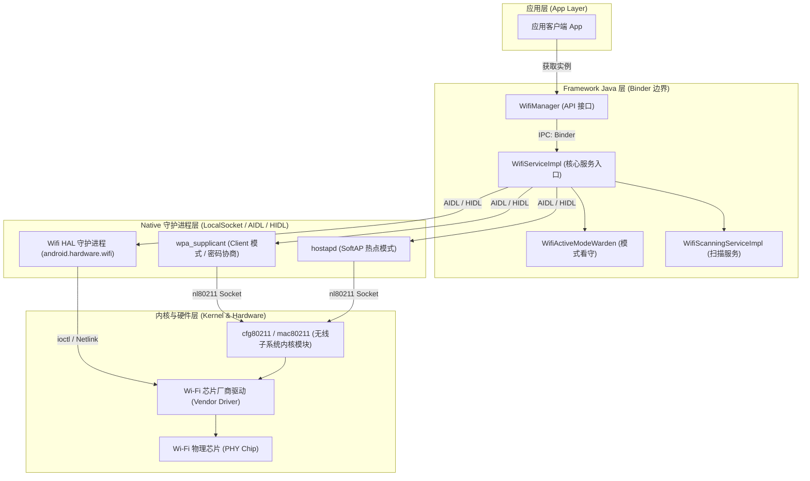
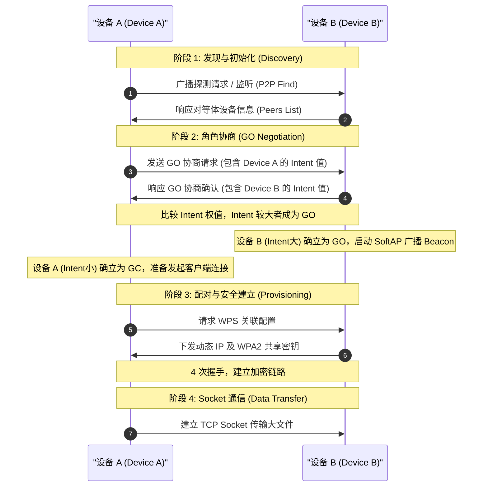

# 5.1.6.3.6 WiFi

Wi-Fi（Wireless Fidelity）作为 Android 设备中最核心的无线局域网通信手段，承载着应用日常的大部分数据流量与网络交互。随着 Android 系统安全模型的不断演进，Wi-Fi 模块的设计理念已从早期“对应用完全开放的硬件接口”逐步转变为“受系统高度隔离、安全管控的受限资源”。

本文将从 Android 系统 Wi-Fi 服务体系、热点扫描机制、连接控制的安全演进、Wi-Fi 直连（P2P）技术、定位权限的强制绑定原理以及 Wi-Fi 扫描节流限制等六个维度，对 Android Wi-Fi 机制进行系统且深度的剖析。

---

## 1. Android 系统 Wi-Fi 服务体系

Android 的 Wi-Fi 子系统是一个典型的分层架构，跨越了用户空间应用、系统服务框架、本地守护进程、硬件抽象层（HAL）以及内核驱动。其核心在于将复杂的无线协议状态机封装在系统底层，向上通过标准的 Java API 提供简单易用的控制接口。

### 1.1 系统服务架构关系

Android Wi-Fi 体系的整体架构以及跨进程通信（IPC）边界如下所示：



### 1.2 各层核心组件解析

#### 1. 应用层 (App Layer)
应用通过 `Context.getSystemService(Context.WIFI_SERVICE)` 获取 `WifiManager` 实例。`WifiManager` 本身并不执行具体的 Wi-Fi 逻辑，它只是一个远程代理对象，通过 Binder IPC 将请求转发给系统服务进程 `system_server` 中的 `WifiServiceImpl`。

#### 2. Framework Java 层
运行在 `system_server` 进程中，主要包含以下核心组件：
- **`WifiServiceImpl`**：Wi-Fi 服务的 Binder 接口实现端。它负责接收来自 `WifiManager` 的 IPC 调用，执行调用者的权限检查，并协调内部状态机。
- **`WifiActiveModeWarden`**：模式守护者。它负责管理 Wi-Fi 的工作模式，包括客户端模式（Client Mode）、扫描模式（Scan Only Mode）、热点模式（SoftAP Mode）以及 Wi-Fi 直连模式（P2P Mode）。它会根据用户的选择或系统的状态（如省电模式、热点开启等）来切换 Wi-Fi 的物理工作状态。
- **`WifiScanningServiceImpl`**：扫描服务的具体实现。它统一协调所有应用和系统自身的 Wi-Fi 扫描请求，防止多个应用频繁请求扫描导致硬件资源耗尽。
- **`WifiNative`**：Java 层与 Native 守护进程交互的桥梁，内部封装了通过 AIDL/HIDL 与 `wpa_supplicant` 和 Wifi HAL 通信的逻辑。

#### 3. Native 守护进程层
- **`wpa_supplicant`**：标准的开源无线网络配置 and 密码协商守护进程。在 Android 中，它被改造为通过 AIDL（Android 13+）或 HIDL（Android 12 及以下）与 Java 框架通信。它负责扫描周围热点、解析信标帧（Beacon）、管理 Wi-Fi 配置文件（密码、安全协议）、处理 802.1X 认证以及执行 WPA/WPA2/WPA3 的四次握手（4-Way Handshake）。
- **`hostapd`**：负责将 Android 设备虚拟化为无线接入点（SoftAP/热点）。它负责处理接入客户端的关联请求、身份验证以及管理接入点的物理信道和加密。
- **`Wifi HAL` (Hardware Abstraction Layer)**：厂商硬件抽象层。定义了一组标准的 C/C++ 接口，允许 Android Java 框架以与芯片无关的方式操作 Wi-Fi 芯片的特有功能，如 Gscan（硬件断网扫描）、RTT（往返时间定位）、Link Layer Stats（链路状态统计）等。

#### 4. 内核与硬件层
- **`cfg80211` / `mac80211`**：Linux 内核中的标准无线配置子系统。`wpa_supplicant` 通过 `nl80211`（基于 Netlink 机制的 socket）与内核通信，下发扫描、连接、断开等指令。
- **Wi-Fi 驱动**：芯片供应商（如 Broadcom、Qualcomm、MediaTek）提供的专用驱动，负责将内核中的 802.11 数据包和配置命令转换为特定物理芯片能够理解的控制流。

---

## 2. 热点扫描机制

热点扫描是 Wi-Fi 功能的基础，通过向外发送探测帧（Probe Request）并监听周围接入点发送的信标帧（Beacon）或探测响应（Probe Response），设备才能发现周边的无线网络。

### 2.1 触发扫描与注意事项

应用通常通过调用 `WifiManager.startScan()` 触发 Wi-Fi 扫描。然而，在实际开发中，需要注意以下事项：
1. **API 弃用警告**：自 [Android 9 (API 28)](../../../../../AndroidVersionChangeLog.md#android-90-pie---api-28) 开始，官方对 `startScan()` 进行了扫描频率节流限制；而在 [Android 10 (API 29)](../../../../../AndroidVersionChangeLog.md#android-100-q---api-29) 中，该方法已被标记为**弃用（Deprecated）**。官方建议应用应当主要依赖系统自身的自动扫描，或者使用更加高阶的 Network Suggestion/Specifier API。
2. **异步特性**：`startScan()` 是一个异步方法，它返回 `true` 仅代表系统已成功接受该扫描请求并准备开始扫描，不代表扫描已完成。若返回 `false`，则表明此时扫描硬件正忙、被限流或处于不可用状态。

### 2.2 扫描结果接收

为了获取扫描到的 AP 列表，应用必须通过动态注册 `BroadcastReceiver` 来监听 `WifiManager.SCAN_RESULTS_AVAILABLE_ACTION` 广播。

```kotlin
class WifiScanReceiver(private val wifiManager: WifiManager) : BroadcastReceiver() {
    override fun onReceive(context: Context, intent: Intent) {
        val success = intent.getBooleanExtra(WifiManager.EXTRA_RESULTS_UPDATED, false)
        if (success) {
            // 扫描成功，获取最新结果
            val scanResults: List<ScanResult> = wifiManager.scanResults
            processScanResults(scanResults)
        } else {
            // 扫描失败，或者由于节流限制未触发新一轮扫描，可选择使用旧缓存
            val cachedResults = wifiManager.scanResults
            processScanResults(cachedResults)
        }
    }
}
```

在返回的 `ScanResult` 列表中，包含以下核心字段：
- **`SSID`**：网络服务集标识符，即 Wi-Fi 的名称（例如 "Office-5G"）。
- **`BSSID`**：接入点的 MAC 地址（例如 "00:11:22:33:44:55"），用于物理上唯一识别某个特定的无线路由器。
- **`level`**：接收信号强度指示（RSSI，以 dBm 为单位）。通常为负值，数值越大（越接近 0）代表信号越强。例如 -50dBm 优于 -80dBm。
- **`frequency`**：该信道工作的物理频率（MHz）。通过频率可以区分 2.4GHz 频段（2412MHz-2484MHz）、5GHz 频段（5180MHz-5825MHz）以及 6GHz 频段。
- **`capabilities`**：该 AP 支持的安全协议和加密算法，例如 `[WPA2-PSK-CCMP][WPA3-SAE-AES][ESS]`，应用需要解析此字段来决定连接时该如何配网。

### 2.3 源码层扫描请求流转流程

当应用调用 `WifiManager.startScan()` 时，其在系统底层的流转过程如下：

1. **`WifiManager` (App 进程)**
   - 调用 `startScan()`。
   - 内部通过跨进程通信调用 `IWificlient.startScan(packageName, featureId)`。
2. **`WifiServiceImpl` (system_server 进程)**
   - 收到 Binder 请求，检查调用者的 AppOP 权限、定位权限、定位服务开关是否开启。
   - 如果校验通过，将请求分发给内部的 `WifiScanningServiceImpl`。
3. **`WifiScanningServiceImpl`**
   - 接收扫描请求，并对来自不同应用的并发扫描请求进行合并（Merging & Batching），减少物理芯片的唤醒次数和空口探测开销。
   - 调用 `WifiNative.scan()`。
4. **`WifiNative` 与 HAL 守护进程**
   - `WifiNative` 通过 AIDL 接口向系统底层的厂商 Wifi HAL 或者直接向 `wpa_supplicant` 发送 `SCAN` 指令。
5. **`wpa_supplicant` (Native 进程)**
   - 封装 802.11 协议包，通过 Netlink 套接字（`nl80211`）向内核 `cfg80211` 模块下发控制命令。
6. **内核与硬件**
   - 驱动程序驱动 Wi-Fi 芯片切入对应的频段，并发射 Probe Request（探测请求帧）。
   - 芯片在各个信道停留并收集周围 AP 的 Probe Response 与 Beacon 帧。
   - 扫描完成后，硬件通过中断通知驱动，驱动通过 Netlink 将扫描到的 BSSID 列表上报给 `wpa_supplicant`。
   - `wpa_supplicant` 触发 `CTRL-EVENT-SCAN-RESULTS` 事件，由系统框架层捕获，最终通过 `SCAN_RESULTS_AVAILABLE_ACTION` 广播分发给注册的应用程序。

---

## 3. Wi-Fi 连接控制的演进历史与安全变革

Android 系统的 Wi-Fi 连接控制API在近几代版本中经历了颠覆性的架构重构，其核心驱动力是**用户隐私保护**与**系统稳定性防线**的升级。

### 3.1 传统连接方式的弊端

在 [Android 9 (API 28)](../../../../../AndroidVersionChangeLog.md#android-90-pie---api-28) 及以前，应用连接 Wi-Fi 采用的是“静默配置与激活”机制：

```kotlin
// 传统连接逻辑（Android 9 以前）
val wifiConfig = WifiConfiguration().apply {
    SSID = "\"Target-WiFi-SSID\""
    preSharedKey = "\"wifi_password_123\""
}
val netId = wifiManager.addNetwork(wifiConfig)
wifiManager.disconnect()
wifiManager.enableNetwork(netId, true)
wifiManager.reconnect()
```

这种机制存在极其严重的局限性与安全缺陷：
- **静默网络劫持**：后台应用无需经过用户的任何确认，就可以随意断开用户当前已连接的、可正常上网的 Wi-Fi，并静默将网络强行切换到应用自身配置的恶意 Wi-Fi 或钓鱼热点上。
- **内网侦听与攻击**：流氓应用可以通过此方式，强行把设备带入特定的内网环境，配合中间人攻击（MITM）嗅探用户的未加密网络流量。
- **网络状态割裂**：当多个应用竞争连接不同的 Wi-Fi 时，系统无线链路会不断在断开和重连中切换，导致整个系统网络瘫痪，用户体验极差。
- **配置数据留存污染**：应用通过 `addNetwork()` 写入的 `WifiConfiguration` 会被永久保存在系统级 Wi-Fi 配置文件中。即使该应用被卸载，这些配置依然残留在系统中，对用户的配网列表造成持续污染。

### 3.2 Android 10+（API 29+）的现代连接变革

针对上述乱象，自 [Android 10 (API 29)](../../../../../AndroidVersionChangeLog.md#android-100-q---api-29) 开始，Google 彻底废弃了通过 `addNetwork()` 静默配置连接的接口，转而引入了两种全新的现代网络连接机制，将连接的主导权彻底收归系统，并将决策权交还用户。

#### 1. Wi-Fi Network Specifier (网络请求模式)
该模式针对的是**应用与外部特定 Wi-Fi 设备直接通信**的场景（例如：智能家居配网、行车记录仪视频下载、运动相机控制）。

- **设计初衷**：应用声明它需要连接一个特定的 Wi-Fi。系统收到请求后，**不再允许应用静默连接**，而是会由系统弹出一个底部 Sheet/Dialog（包含目标 Wi-Fi 的名称），让用户明确点击“连接”或“拒绝”。
- **免密码感知**：支持通过 SSID 模版或 BSSID 过滤来发现设备，应用可以提供密码，但输入与确认过程完全由系统接管。
- **生命周期绑定**：此连接的生命周期与发出请求的 `NetworkCallback` 及应用的进程生命周期绑定。一旦应用进程退到后台、被杀死或主动释放请求，**系统会立即自动断开该 Wi-Fi，并恢复设备之前的默认蜂窝网络或互联网 Wi-Fi**。这防止了应用在后台持续霸占硬件连接通道。

#### 2. Wi-Fi Network Suggestion (网络推荐模式)
该模式针对的是**应用向系统推荐可以连接以实现互联网访问的 Wi-Fi**（例如：商场 WiFi、运营商公共热点、连锁咖啡店免密 WiFi）。

- **设计初衷**：应用无需强占连接通道，而是将一组 Wi-Fi 网络推荐（`WifiNetworkSuggestion`）写入系统的自动连接池中。
- **智能优选**：系统在后台综合评估当前环境中的所有网络信号、可用带宽及质量。如果系统认为该应用推荐的 Wi-Fi 质量优于蜂窝网络或其他已知网络，系统会自动与之连接。
- **应用卸载清理**：一旦向系统写入过推荐列表的应用被用户卸载，系统会自动将该应用曾经推荐的所有 Wi-Fi 配置文件从自动连接池中**彻底清除**，杜绝了配置残留造成的安全隐患。

#### 3. 进程网络绑定机制 (Process-level Network Binding)
在 Android 10+ 中，连接到 `WifiNetworkSpecifier` 请求的 Wi-Fi 后，该 Wi-Fi 通常是**没有互联网连接（No Internet）**的局域网（本地连接）。系统默认会继续将有 Internet 的蜂窝数据网络作为整个操作系统的默认路由。

如果应用需要与这个局域网设备（如智能相机）通信，必须在应用进程级别将所有的 Socket 流量强行绑定到这个新建立的专用局域网通道上。否则，所有的 HTTP / TCP 请求依然会通过蜂窝数据网络发出，导致通信失败。这需要通过 `ConnectivityManager.bindProcessToNetwork()` 来实现。

### 3.3 Android 10+ 新版 Wi-Fi 连接逻辑代码演示

以下为实现与本地局域网 Wi-Fi（如智能家居设备热点）连接并绑定进程网络流量的完整 Kotlin 代码：

```kotlin
import android.content.Context
import android.net.ConnectivityManager
import android.net.Network
import android.net.NetworkCapabilities
import android.net.NetworkRequest
import android.net.wifi.WifiNetworkSpecifier
import android.os.PatternMatcher
import java.net.InetSocketAddress
import java.net.ServerSocket
import java.net.Socket

class WifiConnector(
    private val context: Context,
    private val connectivityManager: ConnectivityManager
) {
    private var networkCallback: ConnectivityManager.NetworkCallback? = null

    /**
     * 连接到指定的设备 Wi-Fi 热点
     * @param ssid 目标 Wi-Fi SSID
     * @param passphrase 目标 Wi-Fi 密码
     */
    fun connectToDeviceWifi(ssid: String, passphrase: String) {
        // 1. 构建 WifiNetworkSpecifier，指定要连接的 SSID 和密码
        val specifier = WifiNetworkSpecifier.Builder()
            .setSsidPattern(PatternMatcher(ssid, PatternMatcher.PATTERN_LITERAL))
            .setWpa2Passphrase(passphrase)
            .build()

        // 2. 构建 NetworkRequest，必须包含 TRANSPORT_WIFI 且包含上面构建的 specifier
        val request = NetworkRequest.Builder()
            .addTransportType(NetworkCapabilities.TRANSPORT_WIFI)
            .removeCapability(NetworkCapabilities.NET_CAPABILITY_INTERNET) // 通常设备热点无外网
            .setNetworkSpecifier(specifier)
            .build()

        // 3. 释放之前可能存在的 Callback，避免泄漏
        releaseCallback()

        // 4. 定义 NetworkCallback，监听连接结果
        networkCallback = object : ConnectivityManager.NetworkCallback() {
            override fun onAvailable(network: Network) {
                super.onAvailable(network)
                // 核心步骤：将当前应用进程的所有网络流量绑定到该专有 Wi-Fi 链路上
                val bindSuccess = connectivityManager.bindProcessToNetwork(network)
                if (bindSuccess) {
                    // 此时，应用内所有新建 of Socket 连接都会通过该 Wi-Fi 路由与局域网设备通信
                    onConnectionSuccess(network)
                } else {
                    onConnectionFailed("进程网络绑定失败")
                }
            }

            override fun onLost(network: Network) {
                super.onLost(network)
                // 网络丢失时，解除进程绑定
                connectivityManager.bindProcessToNetwork(null)
                onConnectionLost()
            }

            override fun onUnavailable() {
                super.onUnavailable()
                // 用户拒绝连接，或者超时未找到对应 Wi-Fi
                onConnectionFailed("用户拒绝连接或网络超时不可用")
            }
        }

        // 5. 向系统提交连接网络请求，系统此时会弹出确认 Sheet
        networkCallback?.let {
            connectivityManager.requestNetwork(request, it)
        }
    }

    /**
     * 主动断开连接，释放网络
     */
    fun disconnect() {
        releaseCallback()
        // 解除进程网络绑定，恢复系统默认路由（如蜂窝数据）
        connectivityManager.bindProcessToNetwork(null)
    }

    private fun releaseCallback() {
        networkCallback?.let {
            connectivityManager.unregisterNetworkCallback(it)
            networkCallback = null
        }
    }

    private fun onConnectionSuccess(network: Network) {
        // 业务处理逻辑
    }

    private fun onConnectionFailed(error: String) {
        // 异常处理逻辑
    }

    private fun onConnectionLost() {
        // 连接断开处理
    }
}
```

---

## 4. Wi-Fi 直连 (Wi-Fi Direct / P2P)

Wi-Fi 直连（Wi-Fi Direct，官方 API 中称为 Wi-Fi Peer-to-Peer 或 P2P）允许设备在没有中间无线路由器的协助下，直接进行点对点的双向无线连接。与经典蓝牙或低功耗蓝牙（BLE）相比，Wi-Fi P2P 具有传输带宽极大（可达数面 Mbps）和传输距离较远的天然优势，特别适合局域网大文件免流量无线快传。

### 4.1 原理解析：GO 与 GC 协商机制

Wi-Fi P2P 的网络拓扑实质上是将其中一台设备虚拟化为微型接入点（SoftAP），这台设备被称为 **Group Owner (GO，群组所有者)**，而其他接入的设备被称为 **Group Client (GC，群组客户端)**。



#### GO Negotiation (GO 协商机制)
当两台设备发起 Wi-Fi P2P 连接时，它们需要通过发送 `GO Negotiation Request/Response/Confirm` 帧来协商谁来扮演 GO，谁来扮演 GC：
- **Intent 值比较**：每台设备在发起连接时都会声明一个 `intent` 权值（数值范围为 0 到 15）。Intent 值越高的设备，越倾向于成为 GO。
- **决定胜负**：系统会比较两台设备的 Intent 值，高者获胜成为 GO；若 Intent 值相同，则由协议规定的一个随机位（Random Tie-breaker Bit）决定。
- **角色分配**：GO 启动 DHCP 服务器，为接入的 GC 动态分配 IP 地址（网段通常为 `192.168.49.0/24`，GO 本身固定为 `192.168.49.1`）。

### 4.2 P2P API 核心工作流与文件传输

在 Android 中，使用 `WifiP2pManager` 能够完成完整的直连与通信流。核心工作流步骤如下：

#### 1. 初始化通道
```kotlin
import android.net.wifi.p2p.WifiP2pConfig
import android.net.wifi.p2p.WifiP2pInfo
import android.net.wifi.p2p.WifiP2pManager
import android.net.wifi.p2p.WpsInfo

val manager = context.getSystemService(Context.WIFI_P2P_SERVICE) as WifiP2pManager
val channel = manager.initialize(context, context.mainLooper, null)
```

#### 2. 发现周边 P2P 设备
调用 `discoverPeers` 启动无线电搜寻，发现结果通过广播获取。
```kotlin
manager.discoverPeers(channel, object : WifiP2pManager.ActionListener {
    override fun onSuccess() {
        // 发现流程成功启动，开始监听 WIFI_P2P_PEERS_CHANGED_ACTION 广播
    }
    override fun onFailure(reasonCode: Int) {
        // 启动失败，可能原因为 P2P 硬件暂不可用或被禁用
    }
})
```

#### 3. 建立连接
从广播中获取对等设备列表 `WifiP2pDeviceList`，选择目标设备，构建 `WifiP2pConfig` 发起连接：
```kotlin
val config = WifiP2pConfig().apply {
    deviceAddress = targetDevice.deviceAddress // MAC 地址
    wps.setup = WpsInfo.PBC // 使用 Push Button 方式配对
}

manager.connect(channel, config, object : WifiP2pManager.ActionListener {
    override fun onSuccess() {
        // 连接请求已被系统接受，等待三次握手与配对协商完成
    }
    override fun onFailure(reason: Int) {
        // 连接发起失败
    }
})
```

#### 4. 获取连接信息并进行 Socket 通信
连接成功后，系统会发出 `WIFI_P2P_CONNECTION_CHANGED_ACTION` 广播，此时需主动调用 `requestConnectionInfo()` 来获取 GO 的 IP 地址：
```kotlin
manager.requestConnectionInfo(channel) { info: WifiP2pInfo ->
    val groupOwnerAddress = info.groupOwnerAddress.hostAddress
    if (info.groupFormed && info.isGroupOwner) {
        // 当前设备是 GO (Server 端)
        // 启动 ServerSocket 等待 GC 接入
        Thread {
            val serverSocket = ServerSocket(8888)
            val client = serverSocket.accept()
            // 读取文件流
            val inputStream = client.getInputStream()
            // 接下来可以将数据写入本地存储
        }.start()
    } else if (info.groupFormed) {
        // 当前设备是 GC (Client 端)
        // 使用获取到的 GO 地址 groupOwnerAddress 建立 TCP 连接
        Thread {
            val socket = Socket()
            socket.bind(null)
            socket.connect(InetSocketAddress(groupOwnerAddress, 8888), 5000)
            // 写入文件流
            val outputStream = socket.getOutputStream()
            // 接下来可以通过输出流传输大文件
        }.start()
    }
}
```

---

## 5. Wi-Fi 与定位权限的强制绑定

在 Android 开发中，许多开发者常会有这样的疑问：“我只是想获取一下周边的 Wi-Fi 列表，或者拿一下当前连接的 Wi-Fi 名字（SSID），为什么系统一定要让我强制申请‘精确定位权限（`ACCESS_FINE_LOCATION`）’，而且还必须强行要求用户在系统设置里把‘GPS/定位服务’的总开关打开？这是否属于系统级流氓行为？”

这并非 Android 系统的过度设计，而是基于物理安全学和数据隐私保护作出的必然抉择。

### 5.1 BSSID 与 SSID 作为“地理指纹”的本质

在无线网络中，每一个物理无线路由器（Access Point，AP）在出厂时都被分配了一个全球唯一的物理 MAC 地址，这在无线通信中被称为 **BSSID (Basic Service Set Identifier)**。
- 尽管用户可以随意修改无线路由器的 SSID（名称，如改成“My Home”），但 BSSID（例如 `ec:26:ca:11:aa:22`）是无法被普通用户轻易修改且具有全球唯一性的。
- 路由器的发射距离和覆盖范围是物理上极为有限的（通常室内半径只有 10-50 米，室外不过 100 米）。因此，一旦某个 BSSID 出现在你设备的扫描列表里，就代表你的物理身体此时此刻绝对处于这个路由器方圆几十米的物理空间内。

### 5.2 地理位置逆向数据库的运作机制

Google（Google Location Services）、Mozilla（Mozilla Location Service）以及各大地图服务商，在全球范围内长期维护并实时更新着规模极其庞大的**云端“基站/AP 逆向地理数据库”**：
1. **数据众包收集（Warding / Crowdsourcing）**：当用户开启手机的 GPS 在街上行走时，Android 系统的底层定位服务（如 Google Play Services）会在后台默默将周围扫描到的 Wi-Fi BSSID 列表、当前收到的信号强度（RSSI），与此时高精度的 GPS 物理坐标关联起来，并加密打包上传到云端数据库。
2. **位置修正与指纹化**：经过全球数以亿计 Android 用户的“日常众包数据上报”，云端数据库中每个 AP 的物理中心坐标、覆盖范围大小都被计算得极其精准。

### 5.3 逆向定位计算过程（Wi-Fi 指纹定位）

基于上述云端数据库，应用即便在不开启 GPS、身处完全无法接收卫星信号的地下室或室内商场的场景下，仅凭调用 `WifiManager.scanResults` 获取到的几个周边 AP 数据，就能在数秒内逆向解析出用户的极高精度物理位置。其背后的核心定位算法主要包括：

#### 1. 三边测量法 (Trilateration)
系统或数据库通过周围三个已知坐标的 AP 信号强度（RSSI），利用自由空间路径损耗模型公式：

$$RSSI = -10n \log_{10}(d) + A$$

（其中 $d$ 为距离，$n$ 为路径衰减因子，$A$ 为距离 1 米处的信号强度），估算出设备与这三个 AP 的物理距离 $d_1, d_2, d_3$。以三个 AP 坐标 $(x_i, y_i)$ 为圆心，以距离 $d_i$ 为半径画圆，三圆交汇的区域即为用户的精确地理位置。

```
       AP1 (x1,y1)
          /  \
         / d1 \
        /      \
       /   设备 \
    AP2(x2,y2)---AP3(x3,y3)
```

#### 2. 位置指纹法 (Location Fingerprinting)
针对室内多径反射极其复杂的环境，通过提前测量商场内各个位置的 Wi-Fi 信号强度向量 $\mathbf{S} = [RSSI_1, RSSI_2, \dots, RSSI_k]$ 并存储为指纹库。定位时，将设备采集到的当前信号向量与指纹库中的数据进行匹配，利用 K-近邻算法（KNN）或概率模型直接判定用户所处的精确柜台甚至楼层。

因此，**获取 Wi-Fi 扫描结果等同于获取了用户的精确定位**。如果不加以权限管控，恶意应用只需静默读取 Wi-Fi 列表，就能把用户一天的行动轨迹和精确到米级的位置图谱绘制得清清楚楚。因此，Android 强制要求：获取 Wi-Fi 扫描结果及当前连接网络详情，必须同时满足以下三项铁律：
- 声明并获取 `ACCESS_FINE_LOCATION`（精确定位权限）。
- 用户必须在手机状态栏中主动开启系统的“定位服务总开关（GPS）”。如果关闭 GPS 开关，底层芯片将直接被限制返回扫描数据。
- 运行时必须动态向用户申请定位授权。

---

## 6. Wi-Fi 扫描频率限制 (Throttling)

频繁的 Wi-Fi 扫描会带来致命的系统性能损耗：
- **电量骤降**：Wi-Fi 芯片为了扫描，必须从低功耗休眠模式切入高功率工作模式，频繁进行射频信号的发送与接收，是绝对的耗电大户。
- **空口资源污染**：设备发送 Probe Request 探测帧会挤占局域网信道带宽，频繁的扫描会导致同一区域内的其他设备网络发生丢包与延迟。

为了保障设备的续航与整体网速体验，自 [Android 9 (API 28)](../../../../../AndroidVersionChangeLog.md#android-90-pie---api-28) 开始，系统正式引入了硬性扫频限流（Wi-Fi Scan Throttling）机制。

### 6.1 硬性扫描限流规则

在 Android 9 及后续版本中，前后台应用的 Wi-Fi 扫描被施加了极为苛刻的额度限制：

| 应用状态 | 最大允许扫描频率 | 行为表现 |
| :--- | :--- | :--- |
| **前台应用 (Foreground App)** | **2 分钟内最多 4 次** | 2 分钟内调用 `startScan()` 超过 4 次后，后续的调用会直接被系统拦截并返回 `false`。系统不会向硬件下发扫描指令，直到 2 分钟的滑动窗口清零。 |
| **后台应用 (Background App)** | **1 小时内最多 1 次** | 后台应用基本上失去了实时扫描的能力。超过 1 次后，调用将被完全拦截。 |

> [!WARNING]
> 这个节流是系统针对**所有非系统级应用**的硬性底层防御，应用无法通过任何普通的 Manifest 属性或运行时权限来豁免该限制。

### 6.2 扫频节流对业务的负面冲击

该硬性限制对以下类型业务的打击是颠覆性的：
1. **室内高精度实时导航/定位**：在大型商场、机场等 GPS 信号无法覆盖的室内，导航系统通常需要每 1 到 2 秒触发一次 Wi-Fi 扫描，以利用 Wi-Fi 指纹算法实时更新用户在地图上的位置。2 分钟限制 4 次意味着平均 30 秒才能更新一次位置，这会让室内导航基本处于瘫痪状态。
2. **智能家居快速配网**：许多物联网设备（如扫地机器人、智能插座）在配网时会发射一个临时的临时热点（例如 `Device-xxxx`），App 需要频繁扫描周围 Wi-Fi 以检测该设备热点是否在线并建立握手。由于节流的存在，如果连接建立过程中出现重试或闪断，App 将无法及时刷新列表，导致配网超时失败。

### 6.3 规避限制的最佳实践与解决方案

在开发过程中，应当通过以下优雅的设计来对冲和规避 Throttling 的影响：

#### 1. 充分压榨本地缓存数据
当 `startScan()` 返回 `false` 或者检测到触发节流时，不要直接抛出错误。应主动调用 `wifiManager.getScanResults()`。
- 即使本次没有触发物理芯片去扫描，`getScanResults()` 也依然能立刻返回系统当前缓存的、上一次扫描成功的 AP 列表。
- 对于智能家居配网，读取本地缓存列表在绝大多数情况下已经足够判定设备热点是否处于周围环境中。

#### 2. 设计防抖与退避重试逻辑 (Exponential Backoff)
避免使用死循环或简单的 Timer 频繁去 call `startScan()`。应当设计带有最大尝试次数和指数退避（Backoff）时长的防抖扫描策略。例如，当检测到扫描失败时，下一次扫描等待时间从 2s 延长到 4s、8s、16s，避免持续触发系统节流红线。

#### 3. 引导用户手动关闭节流控制（开发与测试环境）
对于企业内部专用的特定终端（如商场内部导购员持有的定位 Pad、物流扫描手持枪），可以通过系统层面的配置关闭该限制：
- **操作步骤**：指导用户进入手机的 `设置 -> 关于手机 -> 连续点击版本号开启开发者选项`。然后进入 `系统与更新 -> 开发者选项 -> 寻找并关闭 “Wi-Fi 扫描节流” (Wi-Fi scan throttling) 开关`。
- **系统底层机制**：一旦该开关关闭，系统底层的限制器（Throttler）将被停用，应用将可以恢复到高频扫描状态。但请注意，此方案仅适用于可控的行业定制机或测试环境，对于面向大众用户的商用 App，依然必须严格遵循前述的缓存与避让设计原则。
