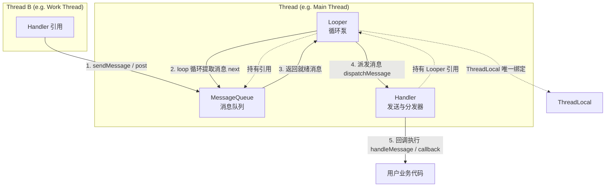
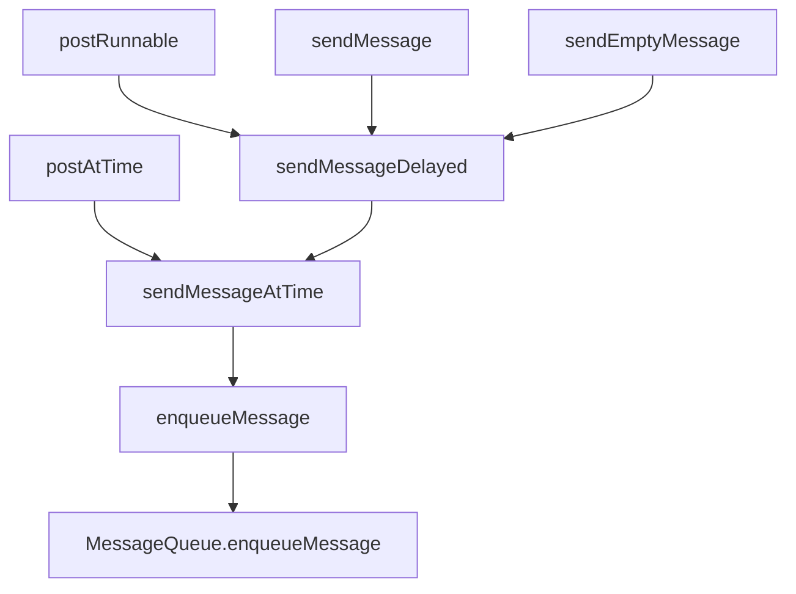
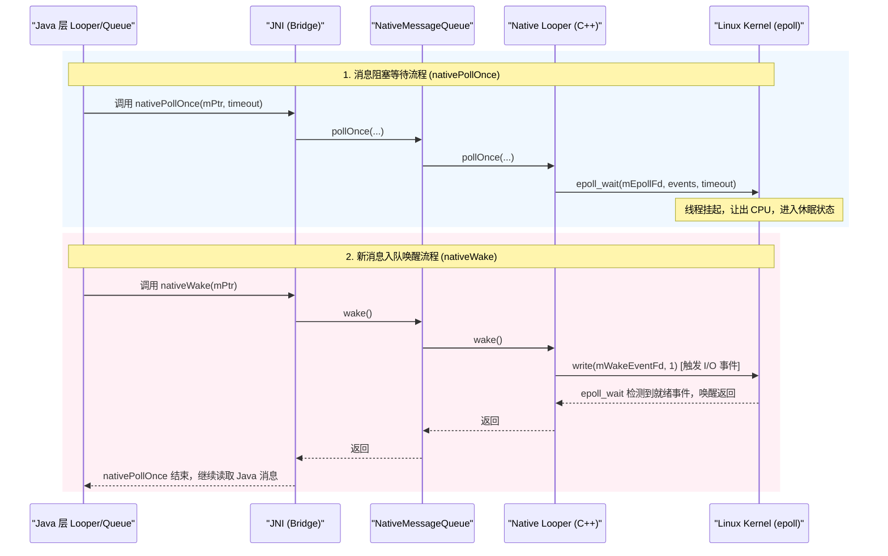
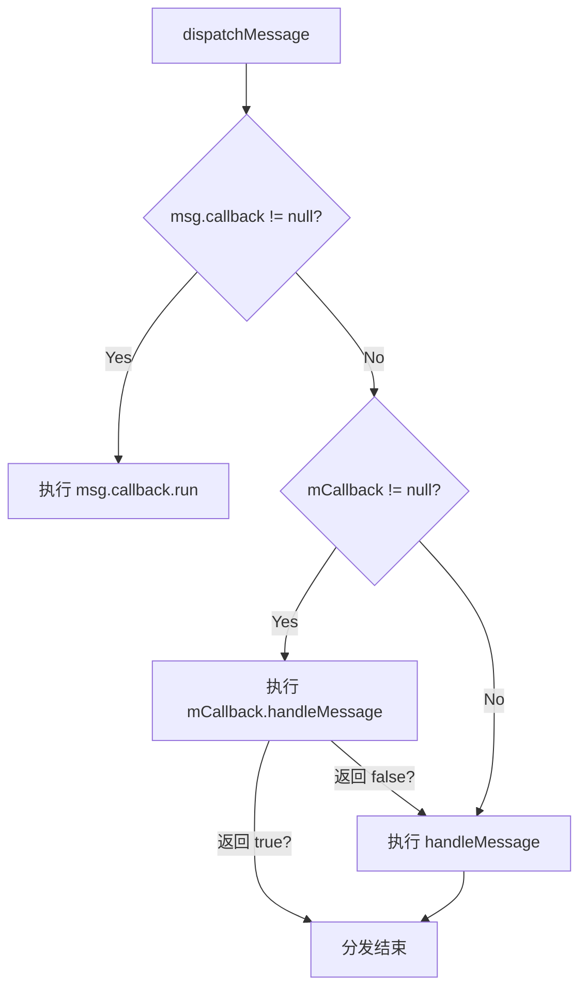
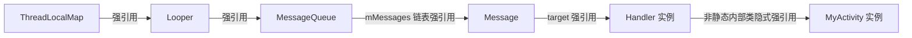

# 5.2.1.1 Handler 消息机制

在 Android 复杂的应用生态与高度动态的图形交互中，**Handler 消息机制**是支撑整个系统运行的骨架与心脏。无论是四大组件的生命周期调度、用户触摸事件的流转，还是屏幕图像的帧渲染，其幕后功臣皆是这一套看似简单、实则精妙绝伦的消息循环驱动模型。

本篇文档将作为 `5.2.1.Handler消息机制` 目录下的核心主干，深入探索 Handler 机制的本质初衷、核心组件的源码机制、Java-Native-Kernel 三层联动架构，以及其背后的 Linux epoll 阻塞唤醒原理。而对于细节分支主题，如 [ThreadLocal](./5.2.1.7.ThreadLocal.md)、[IdleHandler](./5.2.1.5.IdleHandler.md)、[消息延迟与同步屏障](./5.2.1.4.消息延迟实现与消息屏障.md) 以及 [HandlerThread](./5.2.1.8.HandlerThread.md)，本篇将仅作高维度的概念串联，具体技术细节请参阅对应的兄弟文档。

---

## 一、 Handler 机制 the 本质与设计初衷

### 1. Handler 机制的定位
从本质上讲，Handler 机制是 Android 系统提供的一种**基于事件驱动的单线程异步循环通信框架**。在应用进程启动后，主线程（ActivityThread）会初始化一个无限的消息循环，通过持续不断地从消息队列中提取事件并加以分发，驱动整个应用程序的生命周期和界面交互。

Handler 的定位可以总结为两个核心维度：
*   **线程间通信（Inter-Thread Communication, ITC）**：在 Android 多线程模型中，子线程执行耗时任务（如网络请求、数据库查询、复杂计算），而主线程负责 UI 更新。Handler 扮演了跨线程投递事件和数据的安全通道。
*   **任务异步驱动（Event Driving）**：它也是一个调度器，支持在未来某个特定时间点（延时消息）或者按照特定的优先级（同步屏障/异步消息）来执行任务。

---

### 2. 为什么 Android UI 框架设计为单线程？
在现代操作系统与多核 CPU 环境下，多线程技术已被广泛应用。然而，Android 的 UI 框架（以及大多数主流操作系统的 GUI 框架，如 Java Swing、Windows WPF、iOS UIKit）无一例外地选择了**单线程模型**（通常称为 UI 线程或主线程）来处理所有的界面绘制与组件交互。这一设计决策并非妥协，而是基于软件工程复杂性与系统性能平衡的深思熟虑：

#### (1) 多线程并发锁竞争与死锁风险
如果 UI 框架支持多线程并发访问，那么当两个不同的线程同时尝试修改同一个控件的属性（例如，子线程 A 修改 TextView 的文本，子线程 B 调整该 TextView 的大小）时，控件的内部状态将变得极不可控。
为了保证界面状态的一致性，系统必须引入大量的重入锁或互斥锁（ReentrantLock/Mutex）对控件的绘制逻辑、属性修改逻辑进行保护。然而，UI 控件树（View Hierarchy）是一个高度嵌套的树状拓扑结构，涉及极其频繁的自顶向下测量（Measure）、布局（Layout）与绘制（Draw）操作。
在早期的 GUI 框架设计探索中，许多先驱（例如 Java 早期版本的 AWT 框架）曾经尝试支持多线程并发修改 UI 属性，但在实际工程中几乎全部宣告失败，原因如下：
*   **严重的锁竞争（Lock Contention）**：UI 绘制是一个高度重度计算且对吞吐量要求极高的机制。每一次 View 树的重绘，都需要遍历几十甚至数百个 View 节点。如果每一个 View 的 getter/setter 方法以及测量绘制方法都使用同步锁（如 `synchronized` 或 `ReentrantLock`），在多线程并发环境下，主线程将面临严重的锁竞争。当锁由轻量级锁膨胀为重量级锁时，将导致 CPU 在内核态和用户态之间频繁切换进行线程上下文切换，引发极其严重的界面顿挫与卡顿。
*   **死锁（Deadlock）**：在 View 树的遍历过程中，如果父 View 持有锁去操作子 View，同时另一个子线程里的子 View 又尝试反向修改父 View 的刷新，极易造成循环等待，发生死锁导致整个应用进程彻底无响应。

#### (2) 渲染管线的单向遍历与性能保障
现代 UI 系统的渲染是一个极度追求平滑和吞吐量的过程。Android 依靠 Choreographer 机制以 60Hz/90Hz/120Hz 的频率向系统请求 VSync 信号，每次信号到来时，都需要在主线程自顶向下无打扰地遍历整个 View 树。
如果允许其他线程在渲染遍历期间修改 View 树的拓扑结构（如添加/移除节点）或改变测量属性，渲染管线将无法保证画面帧的完整性与一致性。使用单线程模型，可以确保测量、布局和绘制过程在一个纯净的、无干扰的单线程上下文里单向流动，极大简化了渲染管线的设计，提高了渲染性能。

#### (3) 软件设计的复杂性折中
若要强行设计一个线程安全的 UI 框架，其 API 的复杂度将呈指数级上升。开发者在编写业务代码时，必须时刻警惕是否会在不经意间引发多线程冲突。将 UI 访问限制在单一线程（主线程），能让应用层开发人员以极低的心理负担编写简洁的业务逻辑，极大地释放了生产力。

#### (4) 解决方案：单线程 + 消息循环
既然 UI 操作只能在主线程进行，而耗时操作又绝对不能阻塞主线程（否则会触发 ANR），那么“单线程+消息循环”就成为了完美的银弹。主线程不执行具体耗时的逻辑，而是化身成一个“消息接收机器”，通过 Handler 接收来自其他子线程投递的“UI 修改事件”，在排队后依次在主线程安全地串行执行。

---

### 3. Looper-Handler-MessageQueue-Message 协作架构
Handler 消息机制由四大核心组件共同构建，它们分工明确、环环相扣，可以用下方的交互流图来直观表示：



*   **Message（消息）**：数据的载体。它包含了事件的类型、参数、携带的数据，以及该消息的目标发送者（Handler target）和回调（Runnable callback）。
*   **MessageQueue（消息队列）**：消息的存储库。它在 Java 层表现为一个以执行时间戳（when）升序排列的单链表，负责接收 Handler 发送过来的消息，并在 Looper 提取消息时执行阻塞或唤醒逻辑。
*   **Looper（消息循环泵）**：驱动的核心。每个线程最多只能拥有一个 Looper，它持有当前线程 MessageQueue 的引用，负责通过 `loop()` 方法开启无限循环，不断地从 MessageQueue 中抽取消息并分发给对应的 Handler。
*   **Handler（消息发送与处理者）**：对外暴露 the API 窗口。开发者通过它将消息投递到特定的 MessageQueue 中，同时它也是 Looper 派发消息时的落脚点，负责在对应的线程中回调执行消息。

---

## 二、 核心组件深层解析与源码分析

要彻底理清这一套机制，我们必须剥开 Java 层的源码，从底层的具体实现和核心数据结构入手。

### 1. Message：数据承载与对象池优化

`Message` 是消息的实体结构。在 `android.os.Message` 中，它定义了以下几个极为关键的字段：

```java
public final class Message implements Parcelable {
    public int what;          // 消息标识（类型）
    public int arg1;          // 轻量级整型参数 1
    public int arg2;          // 轻量级整型参数 2
    public Object obj;        // 携带的任意类型对象
    public Messenger replyTo; // 跨进程通信（IPC）中的回复信道
    public int sendingUid = -1; // 发送方的 UID

    /* 内部控制字段 */
    @UnsupportedAppUsage
    /*package*/ int flags;    // 状态标记（是否在使用中、是否是异步消息等）
    @UnsupportedAppUsage
    /*package*/ long when;    // 目标执行时间戳（SystemClock.uptimeMillis()）
    /*package*/ Bundle data;  // 携带的大段复杂数据
    @UnsupportedAppUsage
    /*package*/ Handler target; // 发送并最终处理该消息的 Handler 对象
    @UnsupportedAppUsage
    /*package*/ Runnable callback; // 消息被执行时的回调（通常由 Handler.post 产生）

    // 关键：用于链表结构的指针，指向下一个 Message
    @UnsupportedAppUsage
    /*package*/ Message next;

    // 对象池静态锁与链表头节点
    public static final Object sPoolSync = new Object();
    private static Message sPool;
    private static int sPoolSize = 0;
    private static final int MAX_POOL_SIZE = 50; // 对象池最大容量
}
```

#### (1) 为什么 `next` 字段是 Message 类型？
这说明 `MessageQueue` 虽然名字叫“队列”，但其底层数据结构并不是一个 `Queue`（如 ArrayDeque 或 LinkedList），而是一个**由 Message 自身作为链表节点构成的单链表**。这种设计最大程度地节省了数据结构本身的包装开销（不需要额外的 Node 对象），并且在插入、删除操作时效率极高。

#### (2) flags 字段的位操作设计
在 Message 的内部实现中，`flags` 字段是一个高度精简的位掩码设计，用来承载 Message 的各种生命周期状态和属性。常见的状态位定义如下：
*   `FLAG_IN_USE = 1 << 0`：表示当前消息正在使用中，或者正处于 MessageQueue 的队列中等待被提取。一旦被标记为 `FLAG_IN_USE`，如果开发者试图再次将此消息发送出去，或者试图对其进行不合理的属性修改，系统将抛出异常 `"This message is already in use."`。
*   `FLAG_ASYNCHRONOUS = 1 << 1`：表示该消息是异步消息。异步消息可以绕过同步屏障，被 Looper 优先读取并分发。

在源码中，对 `flags` 的操作采用了经典的位运算，如设置异步状态：
```java
public void setAsynchronous(boolean async) {
    if (async) {
        flags |= FLAG_ASYNCHRONOUS;
    } else {
        flags &= ~FLAG_ASYNCHRONOUS;
    }
}
```
这种位掩码设计在 C++ 和 Java 底层框架中非常普遍，极大地压榨了内存空间与处理器的运算性能，体现了 Android 源码在细节上的极致考究。

#### (3) 享元模式与对象池机制的源码剖析
在 Android 应用的生命周期中，Handler 消息的吞吐量是惊人的（每一帧的绘制、每一次触摸事件都是一条消息）。
按照传统的 Java 内存分配原理，如果频繁使用 `new Message()` 创建新实例，在消息消费后又迅速将其抛弃，会导致 Java 虚拟机的堆内存中产生大量生命周期极其短暂的对象。
在 JVM 或 ART 的分代垃圾回收算法中，这些对象会迅速堆满新生代（Eden 区）。为了清理这些短命对象，虚拟机必须频繁触发 Minor GC（或者是 ART 中的垃圾回收算法）。频繁的垃圾回收将不可避免地导致主线程发生 STW（Stop-The-World）停顿，即使这个停顿只有几毫秒，也会在 60Hz/120Hz 的高频刷新下被用户感知为严重的画面抖动与卡顿。
为此，Android 对 Message 采用了经典的**享元设计模式**（Flyweight Pattern），实现了一个高效的对象复用池。

##### ① 获取复用消息：`Message.obtain()` 源码
当我们需要一条新消息时，绝对不要直接使用 `new Message()`，而应该调用静态方法 `Message.obtain()`。其源码如下：

```java
public static Message obtain() {
    synchronized (sPoolSync) { // 加锁保证多线程环境下对象池操作的安全
        if (sPool != null) {
            Message m = sPool;       // 1. 取出链表头部的 Message 实例（即栈顶元素）
            sPool = m.next;          // 2. 将链表头指针指向下一个 Message
            m.next = null;           // 3. 断开取出的消息与链表的连接，恢复独立性
            m.flags = 0;             // 4. 清除所有的状态标记（重置为 0）
            sPoolSize--;             // 5. 对象池当前计数减 1
            return m;                // 6. 返回复用的消息实例
        }
    }
    // 如果对象池为空，则无奈新建一个，这一步不加锁，提升性能
    return new Message(); 
}
```
这段代码逻辑非常直观，利用 `sPool` 维护了一个单向链表栈。每次 `obtain()` 都从栈顶弹出一个节点，并更新栈顶指针，全程受 `sPoolSync` 锁保护，保证了多线程安全。

##### ② 自动回收消息：`recycleUnchecked()` 源码
在 Looper 完成一条消息的派发后，或者 Handler 显式移除消息时，系统会自动调用 `recycleUnchecked()` 将消息擦除并放回对象池：

```java
void recycleUnchecked() {
    // 1. 将消息标记为 IN_USE 并彻底清空所有内容，防止持有外部强引用导致泄漏
    flags = FLAG_IN_USE;
    what = 0;
    arg1 = 0;
    arg2 = 0;
    obj = null;
    replyTo = null;
    sendingUid = -1;
    when = 0;
    target = null;
    callback = null;
    data = null;

    synchronized (sPoolSync) {
        if (sPoolSize < MAX_POOL_SIZE) { // 2. 检查对象池是否已满（最大 50 个）
            next = sPool;                // 3. 将当前消息的 next 指向当前栈顶
            sPool = this;                // 4. 当前消息成为新的栈顶元素
            sPoolSize++;                 // 5. 对象池计数加 1
        }
    }
}
```
通过这种**回收擦除 + 头部插入复用** 的方式，整个应用进程在运行期间可能只需要数十个 Message 实例循环运转，就足以支撑起海量的消息传递，彻底消除了由 Message 频繁分配与销毁导致的 GC 内存抖动风险。

---

### 2. Handler：消息的发送者与最终执行者

#### (1) 构造函数与 Looper 绑定机制
当我们在代码中构造一个 `Handler` 时，它必须绑定一个 `Looper` 才能正常工作。

```java
// 显式传入 Looper 的构造方法（推荐）
public Handler(@NonNull Looper looper, @Nullable Callback callback, boolean async) {
    mLooper = looper;
    mQueue = looper.mQueue; // 缓存 Looper 对应的 MessageQueue
    mCallback = callback;
    mAsynchronous = async;
}
```

##### 默认无参构造函数的废弃背景
在历史的 Android 版本中，曾大量存在如下无参构造函数：
```java
@Deprecated
public Handler() {
    this(null, false);
}
```
这种无参构造函数会隐式地通过 `Looper.myLooper()` 获取当前线程绑定的 Looper。如果当前线程没有 Looper（例如在普通的子线程中直接 `new Handler()`），就会抛出运行时异常：`"Can't create handler inside thread ... that has not called Looper.prepare()"`。
更严重的是，隐式关联 Looper 会带来**代码语义的不确定性与潜在的内存泄露风险**。如果在主线程中调用了某段初始化代码，而在某些重构或特殊回调下，这段初始化逻辑被意外运行在了子线程，那么这个 Handler 绑定的 Looper 就会发生偏离，导致 UI 更新任务发送到了子线程或者任务丢失。
因此，从 Android 11 开始，官方正式废弃了隐式绑定的无参构造函数，并在 Android 11（API 30）及更高版本中推荐使用显式传入 Looper 的构造方法，或者使用以下静态工厂方法来创建 Handler：
*   `Handler.createAsync(@NonNull Looper looper)`：创建一个用于投递异步消息的 Handler。
*   `Handler.createAsync(@NonNull Looper looper, @NonNull Callback callback)`：带有回调拦截的异步 Handler。

关于此 API 变更和废弃版本细节，可对照 [AndroidVersionChangeLog.md](../../../../AndroidVersionChangeLog.md) 了解其演进。

#### (2) 消息发送全链路源码追踪
无论是调用 `post(Runnable r)`、`postDelayed(Runnable r, long delayMillis)` 还是 `sendMessage(Message msg)`、`sendEmptyMessage(int what)`，这些丰富多样的 API 最终都殊途同归，指向底层的核心排队链路：



所有的 `postXXX` 方法在内部都会调用 `getPostMessage` 将 Runnable 转化为 Message 实例：
```java
private static Message getPostMessage(Runnable r) {
    Message m = Message.obtain();
    m.callback = r; // 将 Runnable 绑定为 Message 的 callback 字段
    return m;
}
```

我们来阅读 `sendMessageAtTime` 与 `enqueueMessage` 的源码：

```java
public boolean sendMessageAtTime(@NonNull Message msg, long uptimeMillis) {
    MessageQueue queue = mQueue;
    if (queue == null) {
        RuntimeException e = new RuntimeException(
                this + " sendMessageAtTime() called with no mQueue");
        Log.w("Looper", e.getMessage(), e);
        return false;
    }
    return enqueueMessage(queue, msg, uptimeMillis);
}

private boolean enqueueMessage(@NonNull MessageQueue queue, @NonNull Message msg,
        long uptimeMillis) {
    // 关键：将消息的 target 字段绑定为当前 Handler 实例！
    // 这保证了 Looper 在从 MessageQueue 取出消息时，能够精准知道该把消息分发给谁。
    msg.target = this;
    
    // 如果设置了 asynchronous 属性，则将该消息标记为异步消息
    if (mAsynchronous) {
        msg.setAsynchronous(true);
    }
    // 最终调用 MessageQueue 的 enqueueMessage 方法入队
    return queue.enqueueMessage(msg, uptimeMillis);
}
```
**细节串联**：此处提及的“异步消息”与“同步屏障”紧密相关，它是 Android 为了保证界面绘制（VSync 信号触发）能够具有绝对优先执行权而设计的机制。具体工作机制详见兄弟文档 [消息延迟与同步屏障](./5.2.1.4.消息延迟实现与消息屏障.md)。

---

### 3. Looper：线程的魔法师与消息循环泵

#### (1) ThreadLocal 的核心作用与 myLooper() 运行细节
一个线程要运行消息循环，必须拥有一个专属的 `Looper` 实例。为了实现这种“线程级别单例”隔离，Looper 依赖了 Java 的 `ThreadLocal` 机制。

```java
public final class Looper {
    // 每一个 Looper 内部都有一个静态的 ThreadLocal 变量
    @UnsupportedAppUsage
    static final ThreadLocal<Looper> sThreadLocal = new ThreadLocal<Looper>();
    
    final MessageQueue mQueue; // 该 Looper 持有的消息队列
    final Thread mThread;      // 关联的线程实例
    ...
}
```
通过 `sThreadLocal.get()` 与 `sThreadLocal.set()`，各个线程只能读写本线程的 Looper，确保了线程之间的 Looper 互不干扰。关于 ThreadLocal 内部 `ThreadLocalMap` 的具体内存模型、强弱引用链及防泄漏设计，可参见兄弟文档 [ThreadLocal](./5.2.1.7.ThreadLocal.md)。

##### ThreadLocal.get() 的微观运行细节剖析
当我们调用 `Looper.myLooper()` 获取当前线程的 Looper 时，其底层调用了 `sThreadLocal.get()`。在 Java 的 SDK 实现中，这一方法的微观逻辑如下：
```java
public T get() {
    Thread t = Thread.currentThread(); // 1. 首先通过系统底层的本地方法获取当前调用线程的句柄
    ThreadLocalMap map = getMap(t);    // 2. 获取该线程内部关联的私有成员变量 threadLocals
    if (map != null) {
        // 3. 以当前的 ThreadLocal 实例（即 Looper.sThreadLocal 静态单例）为 Key
        // 在 ThreadLocalMap 维护的 Entry 散列表中检索对应的节点
        ThreadLocalMap.Entry e = map.getEntry(this);
        if (e != null) {
            @SuppressWarnings("unchecked")
            T result = (T)e.value;
            return result; // 4. 成功获取专属的 Looper，直接返回
        }
    }
    // 5. 若当前线程尚未分配 ThreadLocalMap，或哈希映射未命中，调用此方法初始化专属 map
    return setInitialValue();
}
```
在 JVM 的物理内存模型中，`ThreadLocalMap` 本质是一个定制的散列表，其内部的 `Entry` 数组使用 `WeakReference<ThreadLocal<?>>` 作为键（Key），强引用的 `Looper` 作为值（Value）。这一强弱引用的引用链条设计如下：
`Thread` 强引用 `ThreadLocalMap` $\rightarrow$ `ThreadLocalMap` 强引用 `Entry` $\rightarrow$ `Entry` 弱引用 `ThreadLocal`，但 `Entry` 的 value 字段强引用了 `Looper`。
这种引用结构存在一个隐藏的**内存泄漏隐患**：如果当前线程是一个长期常驻的线程（例如主线程，或者线程池中的长驻核心线程），而 `ThreadLocal` 变量本身被显式置为 null，此时它的弱引用 Key 会在下一次垃圾回收时被无条件清理掉，使得对应的 Entry 变成一个 Key 为 null 但 Value 仍为 `Looper` 强引用的僵尸节点。为了避免此类泄漏，当不再使用消息循环时，必须调用退出方法清除消息，解除线程绑定。

#### (2) `Looper.prepare()` 源码与线程安全保证
当一个线程需要开启消息循环时，必须首先调用 `Looper.prepare()`：

```java
public static void prepare() {
    prepare(true);
}

private static void prepare(boolean quitAllowed) {
    // 关键保护：如果当前线程已经拥有了一个 Looper，则严厉报错！
    // 这保证了一个线程有且仅能调用一次 prepare()，从而保证只有一个 Looper 实例
    if (sThreadLocal.get() != null) {
        throw new RuntimeException("Only one Looper may be created per thread");
    }
    // 实例化一个 Looper 并存储进 ThreadLocal 中
    sThreadLocal.set(new Looper(quitAllowed));
}
```

##### 为什么 `sMainLooper` 设为全局静态单例，而子线程 Looper 不行？
在 Looper 类中，我们可以看到一个特殊的全局静态成员变量：`private static Looper sMainLooper;`。主线程的 Looper 在初始化时会被单独缓存到这个全局单例中，供外部通过 `Looper.getMainLooper()` 无阻碍、跨线程地直接获取。
主线程（UI 线程）是由系统在应用进程启动时静态确定的，伴随整个进程的生命周期直到程序消亡。所以，将主线程 Looper 常驻内存并以全局静态单例公开，在架构上是绝对安全的，不会引发任何额外的内存泄漏风险。
在 Android 系统服务进程 **SystemServer** 启动时，也是在系统主线程上调用 `Looper.prepareMainLooper()` 初始化主线程 Looper，进而以此主线程为纽带，串行启动和维持四大核心服务（如 AMS、WMS、PMS）生命周期的运转。
相反，**子线程的生命周期是完全动态且不确定的**。如果系统也为所有的子线程维护一个全局静态的单例数组或映射表，那么当子线程的工作完成后销毁时，只要全局静态单例还持有子线程 `Looper` 及其引用的 `MessageQueue`、`Handler`，垃圾回收器（GC）就永远无法回收这些消亡线程占用的内存。随着进程运行中子线程的频繁创建与终结，必将引发灾难性的**内存溢出（OOM）**。因此，子线程的 Looper 必须只能封闭在专属线程的 `ThreadLocalMap` 的局部空间中。

#### (3) `Looper.loop()` 无限循环源码剖析
`loop()` 方法是整个消息循环的发动机。一旦调用，当前线程将进入无限循环，永不停歇，直到循环主动被退出。以下为核心源码深度剖析：

```java
public static void loop() {
    final Looper me = myLooper(); // 1. 获取当前线程的 Looper 实例
    if (me == null) {
        throw new RuntimeException("No Looper; Looper.prepare() wasn't called on this thread.");
    }
    if (me.mInLoop) {
        Slog.w(TAG, "Loop again directly; nested loop is not supported");
    }
    me.mInLoop = true;
    final MessageQueue queue = me.mQueue; // 2. 获取该 Looper 关联的 MessageQueue

    // 开启无限循环
    for (;;) {
        // 3. 从 MessageQueue 取出消息。
        // 这一步是极其关键的阻塞调用！如果队列中暂时没有就绪的消息，
        // next() 方法内部就会发生阻塞休眠，线程让出 CPU，停留在这一行。
        Message msg = queue.next(); 
        if (msg == null) {
            // 只有当调用了 quit 导致 next() 返回 null 时，循环才会优雅终止！
            return;
        }

        // 4. 性能监控广告牌：打印调试日志（可供 APM 慢函数/卡顿检测使用）
        final Printer logging = me.mLogging;
        if (logging != null) {
            logging.println(">>>>> Dispatching to " + msg.target + " " +
                    msg.callback + ": " + msg.what);
        }
        ...
        try {
            // 5. 派发消息！调用消息发送者（msg.target 即 Handler）的 dispatchMessage
            msg.target.dispatchMessage(msg);
            if (observer != null) {
                observer.messageDispatched(token, msg);
            }
        } catch (Exception exception) {
            ...
            throw exception;
        } finally {
            ...
        }
        
        if (logging != null) {
            logging.println("<<<<< Finished to " + msg.target + " " + msg.callback);
        }

        // 6. 消息处理完毕后，擦除数据并归还到 Message 对象池中，实现循环复用
        msg.recycleUnchecked();
    }
}
```

#### (4) 退出机制：`quit()` 与 `quitSafely()` 的区别与源码级消息循环回收
当不需要消息循环时，必须退出 Looper，否则子线程将永久卡在 `next()` 处无法结束，造成严重的**线程泄漏**。
Looper 提供了两种退出方案，最终都调用了 `MessageQueue` 的 `quit(boolean safe)`：

```java
void quit(boolean safe) {
    if (!mQuitAllowed) {
        throw new IllegalStateException("Main thread not allowed to quit.");
    }

    synchronized (this) {
        if (mQuitting) {
            return;
        }
        mQuitting = true; // 1. 标记退出状态

        if (safe) {
            removeAllFutureMessagesLocked(); // 安全退出的清理
        } else {
            removeAllMessagesLocked();       // 暴力退出的清理
        }

        // 2. 关键：唤醒正处于阻塞状态的 next() 方法！
        nativeWake(mPtr);
    }
}
```

##### 退出清理与多线程并发回收源码级剖析
退出时，未处理的消息会调用 `recycleUnchecked()` 清空并投递到全局的 Message 静态对象池 `sPool` 中。
*   在暴力退出 `removeAllMessagesLocked()` 中，其源码逻辑如下：
    ```java
    private void removeAllMessagesLocked() {
        Message p = mMessages;
        while (p != null) {
            Message n = p.next;
            p.recycleUnchecked(); // 核心：将消息内部所有字段彻底擦除并放回全局对象池
            p = n;
        }
        mMessages = null;
    }
    ```
*   **多线程并发双重锁安全挑战**：
    由于 `recycleUnchecked()` 会操作全局静态的 `sPool` 链表，而在高并发环境下，很有可能出现以下竞争情况：两个子线程同时调用 `quit()` 触发 `removeAllMessagesLocked` 回收；同时，另一个工作线程正通过 `Message.obtain()` 申请新消息；而主线程也可能恰好执行完了某条消息正在 `loop()` 里的 `recycleUnchecked()`。
    为了阻断竞争冲突，Android 在 `Message.recycleUnchecked()` 中使用全局静态锁 `sPoolSync` 对对象池写入操作进行了高强度的同步保护：
    ```java
    synchronized (sPoolSync) {
        if (sPoolSize < MAX_POOL_SIZE) {
            next = sPool;
            sPool = this;
            sPoolSize++;
        }
    }
    ```
    在此过程中，调用 `quit()` 的线程先持有了 `MessageQueue` 实例的排他锁（`synchronized(this)`），在遍历链表回收消息时，又会去申请 `sPoolSync` 的静态锁。这导致在这一瞬间形成了**双重锁加锁逻辑**。
    为了杜绝潜在的死锁隐患（例如 A 线程持有 MessageQueue 锁去争抢 `sPoolSync` 锁，同时 B 线程持有 `sPoolSync` 去调用某个访问 MessageQueue 的方法），Android 源码设计为：在 `sPoolSync` 的临界区内部，**仅进行极简的静态对象指针赋值操作，绝不回调任何会去争抢其它对象锁的外部接口**，从而打破了死锁的环路等待状态，保障了并发安全性。

##### 主线程反射强行退出的灾难
如果开发者使用反射手段强行修改主线程 MessageQueue 中的 `mQuitAllowed = true` 并强行调用了 `quit()` 方法，会导致主线程的 `Looper.loop()` 彻底跳出无限循环并优雅执行完毕。
紧接着，在 `ActivityThread.main()` 方法中，`Looper.loop()` 下面的那行代码 `throw new RuntimeException("Main thread loop unexpectedly exited")` 就会被触发，导致整个应用程序进程瞬间崩溃。这也是 Android 保护自身核心线程的最后一道防线。

#### (5) 为什么 `loop()` 无限循环不会导致应用卡死（ANR）？
这是面试与深度机制探索中最经典的“灵性拷问”。

##### ① 什么是 ANR 的本质与系统监控的“延时炸弹”？
ANR 并不是因为主线程有死循环，而是因为**主线程的当前消息执行了耗时逻辑，导致后续由系统投递的按键、触摸事件消息（5秒内）或 BroadcastReceiver（10秒内）无法在规定时间内得到响应**。
在 Android 系统的 `ActivityManagerService`（AMS）端，监控主线程是否卡死的逻辑类似于放置一个**“定时炸弹”**：
1.  **挂载定时器**：当 AMS 向主线程发送一个生命周期指令或输入事件消息时，系统服务会通过自身的 Handler 往 SystemServer 线程的消息队列里投递一个延时的 ANR 判定消息（5秒/10秒等），就像是点燃了一个定时炸弹。
2.  **解除与引爆**：如果主线程的 `loop()` 循环能够正常且快速地从队列中提取该条消息并执行完，它在执行结束时会向 AMS 发送一个 Binder 回执汇报任务完成。AMS 收到回执后，就会在 SystemServer 中调用 `removeMessages` 将刚才挂载的定时 ANR 消息拔除。
3.  **炸弹引爆**：如果主线程卡在了某一段低效的代码中（如读数据库、同步锁阻塞），导致其迟迟无法给 AMS 回执，时间一到，AMS 端挂载的延时消息触发执行。此时系统将抓取整个进程的 Trace 信息并弹出 ANR 对话框。
由此可见，**主线程在单次消息分发中执行了耗时逻辑导致循环受阻，才是 ANR 的罪魁祸首**。

##### ② 驱动应用生命周期的源泉
实际上，Activity 的生命周期、绘制、点击事件，都是 ActivityThread 通过 Handler 发送对应的消息投递到主线程的 MessageQueue 中，最终由 `loop()` 循环提取出来并执行的。
也就是说，**主线程的生命本身就是由 `loop()` 消息循环支撑的**。如果 `loop()` 结束退出了，应用主线程也就退出了，进程也就随之宣告终结。

##### ③ 阻塞休眠（Linux epoll 机制）与省电策略
当 `MessageQueue.next()` 中没有消息，或者消息的执行时间 `when` 还没到时，主线程**绝不会**在 Java 层进行忙等待（Busy Waiting）式的空转死循环。相反，它会通过 JNI 沉降到 Native 层，最终调用 Linux 的 `epoll_wait` 系统调用进入内核级休眠。
此时，操作系统会将该主线程的 CPU 时间片收回，并将其状态置为**挂起/休眠状态**。此时，主线程几乎不消耗任何 CPU 资源。
在硬件层面，CPU 可以借此机会降低自身的运行频率，甚至将闲置的 CPU 核心置于低功耗状态（C-States / Low Power States），从而极大降低手机功耗，起到极致省电的作用。只有当有新的事件到来（例如用户滑动屏幕产生硬件中断，或者网络数据到达引发中断），内核才会通过硬件中断唤醒该线程，使其继续工作。

---

### 4. MessageQueue：消息优先级队列与底层控制

#### (1) 为什么选择单链表，而不是 PriorityQueue 等标准集合？
虽然在概念上，这是一个按照时间戳 `when` 排序的优先级队列，但 Java 内置的 `PriorityQueue` 并不适合。
*   `PriorityQueue` 的底层是二叉小顶堆，虽然插入和弹出的时间复杂度是 $O(\log n)$，但它并不是一个**线程安全**的数据结构，且**不支持随时高效地插入、中途任意移除指定的 Runnable/Message 节点**。
*   Handler 消息队列必须频繁地在多线程并发环境下工作（多个子线程投递消息，主线程读取消息）。通过自定义单链表，可以使用一个极其轻量级的私有锁（`synchronized(this)`）对链表的头部和指针修改进行极致的同步控制，并且可以在 $O(1)$ 的开销下删除头节点，或者在 $O(n)$ 时间内精准移除队列中满足特定特征（如特定 `what` 或 `token`）的所有消息，综合性能和定制灵活性极高。

#### (2) `enqueueMessage()` 源码深度剖析与链表插入算法
每当 Handler 调用消息发送 API 时，最终都会落到 MessageQueue 的 `enqueueMessage()` 方法上。其核心源码剖析如下：

```java
boolean enqueueMessage(Message msg, long when) {
    if (msg.target == null) {
        throw new IllegalArgumentException("Message must have a target.");
    }

    synchronized (this) { // 1. 采用 synchronized 对队列进行多线程安全保护
        if (mQuitting) {
            IllegalStateException e = new IllegalStateException(
                    msg.target + " sending message to a Handler on a dead thread");
            Log.w(TAG, e.getMessage(), e);
            msg.recycle();
            return false;
        }

        msg.markInUse();
        msg.when = when;
        Message p = mMessages; // 获取当前的队头消息
        boolean needWake;

        // 情况 A：队列为空，或者新消息的执行时间 `when` 比队头消息还要早
        if (p == null || when == 0 || when < p.when) {
            // 直接将新消息作为新的队头插入！
            msg.next = p;
            mMessages = msg;
            // 如果当前处于阻塞状态，需要唤醒
            needWake = mBlocked;
        } else {
            // 情况 B：新消息应该插入到队列的中部或尾部
            // 默认不需要唤醒，除非处于阻塞状态，且队头是一个同步屏障，并且新消息是第一个异步消息
            needWake = mBlocked && p.target == null && msg.isAsynchronous();
            
            // 开始遍历单链表，寻找最适合当前消息 when 时间戳的插入位置
            Message prev;
            for (;;) {
                prev = p;
                p = p.next;
                // 当到达链表尾部，或者找到一个 when 晚于新消息的消息时，停止遍历
                if (p == null || when < p.when) {
                    break;
                }
                // 如果发现遍历过程中已经有异步消息了，说明无需因为这个新异步消息唤醒线程
                if (needWake && p.isAsynchronous()) {
                    needWake = false;
                }
            }
            // 将新消息插入到 prev 和 p 之间
            msg.next = p;
            prev.next = msg;
        }

        // 2. 如果满足唤醒条件，调用 Native 方法 nativeWake 唤醒处于 epoll 阻塞的线程
        if (needWake) {
            nativeWake(mPtr);
        }
    }
    return true;
}
```

#### (3) 同步屏障的开启与移除源码级深度解析
同步屏障（Sync Barrier）就像是给消息队列插上了一面“黄牌”，它强行阻塞普通同步消息的取出，为高优先级的异步消息让出绿色通道。我们来阅读它开启与关闭的源码：

##### ① 开启同步屏障：`postSyncBarrier()`
```java
@UnsupportedAppUsage
public int postSyncBarrier() {
    return postSyncBarrier(SystemClock.uptimeMillis());
}

private int postSyncBarrier(long when) {
    synchronized (this) {
        final int token = mNextBarrierToken++; // 递增生成一个唯一的屏障标识
        final Message msg = Message.obtain();  // 从对象池拿一个消息实例
        msg.markInUse();
        msg.when = when;
        msg.arg1 = token; // 将标识存入 arg1
        // 特别注意：没有给 msg.target 赋值！即 msg.target == null

        Message prev = null;
        Message p = mMessages;
        // 开始寻找插入位置
        if (when != 0) {
            while (p != null && p.when <= when) {
                prev = p;
                p = p.next;
            }
        }
        // 将 target 为 null 的消息插入链表中
        if (prev != null) {
            msg.next = p;
            prev.next = msg;
        } else {
            msg.next = p;
            mMessages = msg;
        }
        return token; // 返回屏障的唯一标识
    }
}
```
**分析**：因为同步屏障本质上就是一个 `target == null` 的 Message 节点，当 `next()` 遍历到这种没有 `target` 的节点时，便会强行启动仅搜寻异步消息的机制。

##### ② 移除同步屏障：`removeSyncBarrier(int token)`
```java
@UnsupportedAppUsage
public void removeSyncBarrier(int token) {
    synchronized (this) {
        Message prev = null;
        Message p = mMessages;
        // 遍历消息队列，寻找 target == null 且标记了该 token 的屏障消息
        while (p != null && (p.target != null || p.arg1 != token)) {
            prev = p;
            p = p.next;
        }
        if (p == null) {
            throw new IllegalStateException("The barrier has already been removed or never posted.");
        }
        final boolean needWake;
        // 从单链表中移除屏障节点
        if (prev != null) {
            prev.next = p.next;
            needWake = false; // 如果被移除的屏障不是队头，说明队列前面的消息依然能正常轮流读取，无需主动唤醒
        } else {
            mMessages = p.next;
            // 如果被移除的屏障刚好在队头，且新队头消息不为空，或者已经处于阻塞态，则必须执行唤醒！
            needWake = mMessages == null || mMessages.target != null;
        }
        p.recycleUnchecked(); // 归还消息到对象池中

        if (needWake && !mQuitting) {
            nativeWake(mPtr); // 重新激活主线程
        }
    }
}
```

##### 兄弟文档概念串联：
*   **同步屏障与异步消息**：Choreographer 利用同步屏障和异步消息机制，保证系统渲染消息（异步消息）能够第一时间获得 CPU 调度。详细的工作生命周期、代码触发栈，请阅读 [消息延迟与同步屏障](./5.2.1.4.消息延迟实现与消息屏障.md)。
*   **IdleHandler**：在系统空闲时执行任务。具体设计、注意事项（如死循环问题）以及实战避坑指南，请参见 [IdleHandler](./5.2.1.5.IdleHandler.md)。

---

## 三、 线程通信与阻塞唤醒底层机制 (Java -> Native -> Linux epoll)

许多人对 Handler 的认知仅停留在 Java 层的这几个类。实际上，Android 的消息机制是一套**Java 与 C++ 双层并行的异构架构**，其底层的阻塞与唤醒完全构建在 Linux 系统的内核调度机制之上。



### 1. 阻塞唤醒核心：Linux epoll 机制的演进
在 Linux 操作系统中，**I/O 多路复用（I/O Multiplexing）**是高性能网络与系统编程的基石。Android 消息机制采用的底层技术正是其中的王牌 —— **epoll 机制**。

##### ① 什么是 epoll？
`epoll` 是 Linux 内核为处理大批量文件描述符（File Descriptor, FD）而作了极大优化的 I/O 事件通知机制。它具有两个最核心的优势：
*   **无 FD 数量限制**：对比旧时代的 `select` 和 `poll`（有 1024 个 FD 的物理硬上限），epoll 支持的 FD 上限为系统最大可打开文件数。
*   **不使用轮询扫描**：`select` 和 `poll` 每次被唤醒时，都需要在用户态和内核态之间拷贝 FD 集合，并在 $O(n)$ 时间内遍历所有的 FD 来确认是谁产生了事件；而 `epoll` 在内核中通过**红黑树**管理 FD，并通过**回调机制**将产生事件的 FD 放入一个**双向就绪链表**。线程被唤醒后，只需 $O(1)$ 时间直接读取就绪链表即可，性能不随 FD 数量增加而阻碍。

##### ② 从 pipe 管道到 eventfd 的演进
在早期的 Android 版本（Android 6.0 之前）中，底层的唤醒是基于 Linux 的 **pipe 管道机制** 实现的。
*   C++ 层的 Looper 会创建一个管道（包含一个读端 FD 和一个写端 FD），并将读端 FD 注册进 epoll 中。当需要阻塞时，线程调用 `epoll_wait` 监听读端；当需要唤醒时，向写端写入一个字符（例如 `'W'`），从而触发读端的 I/O 可读事件，令 `epoll_wait` 唤醒返回。
*   **升级为 eventfd**：从 Android 6.0 开始，系统废弃了双端管道，转而采用了更现代、更轻量级的 **eventfd 机制**。`eventfd` 是 Linux 专门用于事件通知的系统调用。它在内核中仅维护一个 8 字节（64位）的无符号整型计数器，不需要创建复杂的双端管道文件描述符。当需要唤醒时，只需往 `eventfd` 写入一个 8 字节整数，其开销远远小于 pipe 管道，并且节省了系统宝贵的文件描述符资源，大幅提升了线程间通信的效率。

这一从 Pipe 到 Eventfd 的重大演变历程，是 Android 运行期性能优化的典型案例，详细记录在 [AndroidVersionChangeLog.md](../../../../AndroidVersionChangeLog.md) 的系统底层架构变迁部分。

---

### 2. 为什么设计 Java-C++ 双层 MessageQueue 桥接结构？
在阅读源码时，我们会发现 Java 层有 `MessageQueue`，而 C++ 层也有一个对应的 `NativeMessageQueue`。这种看似“叠床架屋”的双层结构，是出于以下系统架构设计的深层次权衡：
1.  **各司其职，性能分流**：Java 层的 MessageQueue 负责管理那些与 Android 应用程序组件生命周期、应用业务逻辑密切相关的消息事件。这些逻辑多由 Java 编写，放在 Java 层管理极为方便。而在 Native 层，Android 的输入系统（Input System）、图形渲染（RenderThread）对延迟和时序有着极其严苛的百微秒级要求。如果将输入事件的读取和 Socket 事件全部用 JNI 抛给 Java 层去排队和处理，垃圾回收和虚方法调用带来的额外开销将是系统渲染性能无法承受之重。因此，底层的高频硬件 I/O 都在 C++ 层由 Native Looper 自主驱动分发，不经过 Java 队列，保证了图形系统的极度平滑。
2.  **指针映射与底座统一**：Java MessageQueue 内部持有了指向 NativeMessageQueue 的指针 `mPtr`。当 Java 队列为空需要阻塞时，Java 线程通过 `nativePollOnce(mPtr, ...)` 下沉到 Native 层，直接借用 C++ 层的 epoll 实例进行内核挂起；而当 C++ 层监听到 Input 输入事件时，它可以直接在底层回调消费，无需惊动 Java 队列；如果 Java 队列有新消息进来了，又能通过 `nativeWake(mPtr)` 往 Native 的 `eventfd` 写数据实现底层一键唤醒。这种以 C++ 端的 epoll 为底层公共底座的二合一映射结构，实现了优雅的性能与逻辑兼顾。

---

### 3. 关联 C++ 层的 Native 架构
当 Java 层的 `MessageQueue` 构造函数执行时，它会初始化 Native 层的组件：

```java
// MessageQueue 的构造函数
MessageQueue(boolean quitAllowed) {
    mQuitAllowed = quitAllowed;
    // 调用 nativeInit()，在 C++ 层初始化，并返回 C++ 对象的指针地址保存到 mPtr
    mPtr = nativeInit();
}
```

在 C++ 层（对应 `android_os_MessageQueue.cpp`）：
1.  `nativeInit()` 会创建一个 `NativeMessageQueue` 实例。
2.  `NativeMessageQueue` 在其构造函数中，会获取或创建一个 C++ 层的 `Looper` 对象（`system/core/libutils/Looper.cpp`）。
3.  C++ 层的 `Looper` 会调用 `epoll_create1()` 创建一个 epoll 实例，同时调用 `eventfd()` 创建一个唤醒描述符 `mWakeEventFd`，并使用 `epoll_ctl()` 将 `mWakeEventFd` 的可读事件（`EPOLLIN`）注册进 epoll 中。

---

### 4. `nativePollOnce` 与 `nativeWake` 源码级调用栈与内核交互

#### (1) `nativePollOnce` 深度调用栈
当 Java 层执行到 `MessageQueue.next()` 的 `nativePollOnce(ptr, nextPollTimeoutMillis)` 时，其底层调用轨迹如下：

1.  **Java 层**：`MessageQueue.next()` -> `nativePollOnce(ptr, timeout)`
2.  **JNI 层**：`android_os_MessageQueue_nativePollOnce`
    *   通过指针 `ptr` 强转为 C++ 层的 `NativeMessageQueue` 对象。
3.  **C++ NativeMessageQueue 层**：调用 `NativeMessageQueue::pollOnce`
    ```cpp
    void NativeMessageQueue::pollOnce(JNIEnv* env, jobject clazz, int timeoutMillis) {
        mLooper->pollOnce(timeoutMillis);
    }
    ```
4.  **C++ Looper 层**：调用 `Looper::pollOnce` -> `Looper::pollInner(timeoutMillis)`
    在 `pollInner` 中，会调用底层的系统阻塞方法 `epoll_wait`：
    ```cpp
    int eventCount = epoll_wait(mEpollFd, eventItems, EPOLL_MAX_EVENTS, timeoutMillis);
    ```
5.  **Linux 内核层**：
    *   内核接收到 `epoll_wait` 请求。如果 `timeoutMillis` 为 -1 且当前没有发生任何 I/O 事件（即 `mWakeEventFd` 计数器为 0），内核会将该线程的状态从 `TASK_RUNNING`（运行态）修改为 `TASK_INTERRUPTIBLE`（可中断睡眠态），并将该线程加入到对应 FD 的**等待队列**中。
    *   此时，主线程**主动让出 CPU 调度权**，进入深度休眠。

#### (2) `nativeWake` 深度调用栈
当子线程向主线程投递消息，或者延时时间已到需要唤醒主线程时，Java 层会调用 `nativeWake(mPtr)`：

1.  **Java 层**：`MessageQueue.enqueueMessage` -> `nativeWake(mPtr)`
2.  **JNI 层**：`android_os_MessageQueue_nativeWake`
    *   将 `mPtr` 强转为 `NativeMessageQueue`。
3.  **C++ NativeMessageQueue 层**：调用 `NativeMessageQueue::wake`
4.  **C++ Looper 层**：调用 `Looper::wake`
    ```cpp
    void Looper::wake() {
        uint64_t inc = 1;
        // 往内核 eventfd 写入 1
        ssize_t nWrite = TEMP_FAILURE_RETRY(write(mWakeEventFd, &inc, sizeof(uint64_t)));
        if (nWrite != sizeof(uint64_t)) {
            if (errno != EAGAIN) {
                ALOGW("Could not write wake signal, errno=%d", errno);
            }
        }
    }
    ```
5.  **Linux 内核层**：
    *   由于向 `mWakeEventFd` 写入了数据，内核检测到该 FD 的读缓冲区可读，会立刻触发硬件/软件中断。
    *   内核的中断处理程序会将之前挂在等待队列上的主线程移动到系统的**运行就绪队列（Run Queue）**中，并将线程状态修改为 `TASK_RUNNING`。
    *   主线程被重新调度，`epoll_wait` 唤醒返回，C++ 层的 `pollInner` 继续向下执行，最终通过 JNI 返回到 Java 层的 `MessageQueue.next()`，开始提取并执行 Java 消息。

---

### 5. 深度原理：为什么 epoll 阻塞不占用 CPU 时间片？
在 Linux 调度算法中，CPU 只会把算力分配给处于“运行就绪”状态的线程。
当线程调用 `epoll_wait` 发生阻塞时，它会被系统内核**移出 CPU 运行队列**。在内核层面，该线程的执行上下文（CPU 寄存器状态、程序计数器 PC 等）被安全保存，线程进入**睡眠等待队列**。

##### 内核的等待队列与唤醒机制
1.  **加入等待队列**：当线程执行 `epoll_wait` 被挂起时，内核会为该线程创建一个等待节点（`wait_queue_entry_t`），并将其插入到文件描述符对应的等待队列头（`wait_queue_head_t`）中。
2.  **让出 CPU**：内核将当前线程的状态设置为 `TASK_INTERRUPTIBLE`，并主动调用 `schedule()` 函数触发 CPU 任务调度，使其他就绪的线程获取 CPU 资源。此时，被挂起的线程不再消耗任何 CPU 周期。
3.  **中断驱动唤醒**：当另一个线程执行 `write()` 往 `eventfd` 中写入数据时，内核的 `sys_write` 系统调用会唤醒在该文件描述符上等待的队列。内核会遍历 `wait_queue_head_t` 链表，执行其唤醒回调函数，将原本处于休眠状态的线程状态修改为 `TASK_RUNNING`，重新拉回 CFS 调度器的就绪队列中，等待 CPU 时间片到来继续执行。
这是一种**被动的、完全基于中断驱动的唤醒机制**。在此期间，CPU 的核心硬件完全不需要周期性地去“询问”或“轮询检查”该线程是否准备好，而是可以去执行其他有计算需求的线程。因此，epoll 阻塞能够做到**“零 CPU 占有率”**的高效等待，完美地统一了“无限循环”与“极致省电”的矛盾。

---

### 6. C++ Native 层的自主消息循环（C++ Looper 的 FD 监听）
值得特别指出的是，Android 的 C++ 层 `Looper` 并非仅仅为了辅助 Java 层的 Handler 唤醒而存在，它自身也是一个完全独立的、功能更加强大的消息循环泵。
在 Native 层，C++ 开发者可以直接使用 `Looper` 创建循环，甚至可以使用 `Looper::addFd()` API 监听任意的文件描述符（如 Socket、Pipe、字符设备描述符等）：
```cpp
int addFd(int fd, int ident, int events, Looper_callbackFunc callback, void* data);
```
在 Android 系统中，**输入系统（Input System）**正是依靠这个机制来实现的：
*   系统的输入事件读取器（`InputReader`）和派发器（`InputDispatcher`）运行在底层的守护进程中。
*   它们与应用窗口的通信，本质上是通过 `InputChannel`（封装了 Unix Domain Socket）来传递触摸事件的。
*   应用进程的 Native 侧 `Looper` 通过 `addFd()` 将代表通信信道的 Socket 描述符注册到 epoll 实例中。
*   当用户触摸屏幕时，Socket 收到数据触发可读事件，内核唤醒主线程，直接在 C++ 层的 `Looper` 中调用回调函数，进而把事件打包传递给 Java 层的 `ViewPostImeInputStage` 执行分发。
组织底层的统一设计，将应用层事件驱动（Handler）与底层 I/O 驱动（Input 系统 Socket）无缝结合在同一个 epoll 实例中，极大地减少了系统线程开销。

---

## 四、 消息分发与回调执行优先级

当 Looper 成功拿到消息并调用 `msg.target.dispatchMessage(msg)` 时，消息就进入了分发与回调执行阶段。



### 1. `Handler.dispatchMessage` 源码级分发优先级

```java
public void dispatchMessage(@NonNull Message msg) {
    // 优先级 1：Message 自身的 Runnable 回调（如 Handler.post(Runnable) 产生的消息）
    if (msg.callback != null) {
        handleCallback(msg);
    } else {
        // 优先级 2：构造 Handler 时传入的 Callback 接口实例
        if (mCallback != null) {
            // 如果 Callback 的 handleMessage 返回 true，则代表消息被拦截，分发在此处戛然而止！
            if (mCallback.handleMessage(msg)) {
                return;
            }
        }
        // 优先级 3：最常规的重写 handleMessage 方法
        handleMessage(msg);
    }
}

private static void handleCallback(Message message) {
    message.callback.run();
}
```

---

### 2. 各种回调方式的应用场景与设计取舍
这三种分发渠道在实际开发中有着截然不同的使用哲学：

| 回调方式 | 触发源 | 执行载体 | 设计初衷与应用场景 |
| :--- | :--- | :--- | :--- |
| **`msg.callback`** | `Handler.post(Runnable)` | 匿名/非匿名 `Runnable` | 用于临时向指定线程投递一段**单次执行的轻量级闭包逻辑**。不需要定义消息的 `what`，即发即用，常用于简单的子线程计算完毕后投递回主线程更新某一个特定的 View。 |
| **`mCallback`** | `new Handler(looper, callback)` | `Handler.Callback` 接口 | 旨在提供一种**消息拦截与组合代理机制**。非常适合在编写插件化框架、基类组件或者不需要继承 Handler 就能对发送过来的消息实施统一前置拦截、监控或条件过滤的场景。比如可以用它收集应用的消息分发总耗时。 |
| **`handleMessage`** | 重写 `Handler.handleMessage` | 自定义子类方法 | **经典的契约式架构**。通过定义清晰的 `what` 静态常量，集中处理线程内所有不同类型、不同业务含义的事件。适用于逻辑复杂、消息类型多、需要状态机维护的业务场景，可读性极高。 |

---

### 3. VSync 信号与 Choreographer 协作大曝光
在 Android 的图形渲染管线中，主线程的 Handler 与 **Choreographer（编舞者）** 存在着至关重要的闭环协作。
*   **VSync 信号的起源**：VSync（垂直同步）信号由硬件显示驱动产生，或者是系统的 `SurfaceFlinger` 进程的 `EventThread` 派发。
*   **信号传输机制**：当 Choreographer 准备请求刷新画面时，它会向 SurfaceFlinger 注册下一个 VSync 信号。信号一旦到来，SurfaceFlinger 会通过 Unix Domain Socket 往应用进程发送事件。
*   **主线程的中断响应**：应用进程本地的 `FrameDisplayEventReceiver`（本质是一个 C++ Class）监听了该 Socket。Socket 缓冲区可读，触发 epoll 唤醒，线程在 C++ 层的回调函数中被激活，并迅速跳转到 Java 层的 `onVsync()` 回调。
*   **同步屏障的使用**：由于主线程队列中可能积压了大量的普通用户业务消息，为了防止这些消息阻塞图形渲染导致掉帧，Choreographer 在发送绘制消息前，会先往 MessageQueue 中插入一个**同步屏障**（`target = null`）。
*   **异步消息的登场**：Choreographer 投递的 `FrameDisplayEventReceiver` 消息，会被强制设置为**异步消息**（`setAsynchronous(true)`）。
*   在 `MessageQueue.next()` 执行时，一旦检测到同步屏障，就会跳过队列中所有普通的同步消息，唯独找出 Choreographer 发送的这个异步消息并优先分发。
*   主线程被立刻唤醒，开始遍历执行 `performTraversals()` 渲染当前帧。渲染完成后，系统自动移除同步屏障，主线程继续回去处理普通的业务消息。这一套精妙的协作设计，确保了 Android UI 渲染具有无可动摇的高优先级。

---

### 4. APM 主线程卡顿监控机制与 setMessageLogging 优缺点深剖
在主流的 APM 卡顿监测框架（如 BlockCanary）中，均利用了 Java 层 Looper 提供的日志机制来进行性能诊断。其拦截的核心原理代码示例如下：

```java
public class LooperMonitor implements Printer {
    private long mStartTimestamp = 0;
    private final long mBlockThresholdMs = 100; // 设定卡顿判定的耗时阈值为 100 毫秒

    @Override
    public void println(String x) {
        if (x.startsWith(">>>>> Dispatching to")) {
            mStartTimestamp = System.currentTimeMillis();
            // 收到消息分发前置信号：启动后台子线程，开始高频轮询 dump 主线程堆栈
            StackSampler.startDump();
        } else if (x.startsWith("<<<<< Finished to")) {
            long endTimestamp = System.currentTimeMillis();
            long duration = endTimestamp - mStartTimestamp;
            // 收到消息处理完毕后置信号：关闭堆栈收集器
            StackSampler.stopDump();
            if (duration > mBlockThresholdMs) {
                // 如果单条消息分发总时长超过阈值，直接判定为卡顿，打印并上报抓取到的堆栈
                Log.e("BlockCanary", "Detect UI Blocked: " + duration + "ms");
                StackSampler.reportBlockedStack();
            }
        }
    }
}
```

##### 深度分析 `setMessageLogging` 监控机制的利弊：
*   **无可比拟的优势（优点）**：
    *   **低成本非侵入式**：该方案无需修改应用中的任何既有业务代码，也不需要通过复杂的 ASM 或 AspectJ 进行字节码插桩。只需在初始化阶段调用一行 `Looper.getMainLooper().setMessageLogging(new LooperMonitor())`，就能全方位拦截并感知主线程中发生的所有消息执行行为，门槛极低且稳定性强。
*   **架构设计上的硬伤（缺点）**：
    1.  **高频内存抖动与 GC 压力**：
        主线程的 `loop()` 循环执行频率极高。在正常运行下，每秒可能产生数百次消息分发。每次分发过程，都会高频触发两条字符串的隐式拼接（产生 `">>>>> Dispatching to..."` 和 `"<<<<< Finished to..."` 两个大对象）。这会在堆内存的 Eden 区中产生大量的瞬时垃圾。在旧版 Dalvik 或者是内存受限的低端 ART 虚拟机上，如此高频的垃圾对象分配将导致频繁触发 GC，使得监控框架自身反而成为了内存抖动和顿挫的制造者。
    2.  **startsWith() 的时间复杂度损耗**：
        `Printer.println()` 接收的入参是普通字符串，为了区分是前置分发还是后置执行，开发者必须调用 `startsWith` 进行前缀匹配。由于这一过程是纯文本的 $O(n)$ 级别比较，在高频的消息流下，主线程的 CPU 时间会被这些无谓的字符串匹配操作所无情蚕食，消耗了主线程宝贵的算力。
    3.  **非消息驱动型的卡顿盲区**：
        `setMessageLogging` 只能统计在 `dispatchMessage()` 范围内的耗时。如果在两次消息分发之间，发生了非消息队列驱动的系统事件（例如底层硬件中断信号响应、主线程直接参与 Native 层的输入事件 Socket 回调、或者是内核层因为抢占导致的线程时间片被硬性收回），主线程同样会发生卡顿和掉帧。但在 Java 层的 Printer 日志中，这一段耗时根本无法被捕获，导致卡顿监控系统产生严重的“漏报”。
    4.  **Native 锁及等待阻塞盲区**：
        如果主线程在 `MessageQueue.next()` 的 `nativePollOnce()` 内部被某一个 Native 锁卡死，或者在 Native 层执行耗时文件 I/O，此时主线程尚未进入 Java 层的 `loop()` 分发，`Printer` 也绝不会被触发， BlockCanary 的监控程序对此段卡死会陷入完全的静默和致盲状态。

---

## 五、 典型场景、常见误区与最佳实践

### 1. Handler 内存泄漏分析
在 Android 开发中，不当使用 Handler 是导致 Activity 发生内存泄漏（Memory Leak）的头号杀手。

#### (1) 内存泄漏的底层链条推导与生命周期不一致
内存泄漏的本质是**生命周期长的对象持有了生命周期短的对象，导致生命周期短的对象在被销毁时无法被垃圾回收器正常回收**。
在 Java 语言中，**非静态内部类与匿名内部类会隐式地持有其外部类实例的强引用**。以下为典型致命代码：

```java
public class MyActivity extends Activity {
    // 匿名内部类，隐式持有 MyActivity 的强引用！
    private final Handler mHandler = new Handler(Looper.getMainLooper()) {
        @Override
        public void handleMessage(@NonNull Message msg) {
            // 更新 UI
        }
    };

    @Override
    protected void onCreate(Bundle savedInstanceState) {
        super.onCreate(savedInstanceState);
        // 发送一个 10 分钟后执行的延迟消息
        mHandler.sendEmptyMessageDelayed(1, 10 * 60 * 1000);
    }
}
```
当这段代码运行时，底层的强引用链条如下：



如果用户在进入 Activity 后迅速点击返回键关闭界面，系统会回调 `onDestroy()`。但由于这条从主线程 `ThreadLocal` 延伸过来的强引用链条依然完好，垃圾回收器（GC）根本无法回收 `MyActivity`。这导致 Activity 占用的全部内存（包括其持有的 Bitmap、View 控件树等）在消息未被执行的 10 分钟内永久驻留内存，引发严重的内存泄漏。

#### (2) 为什么必须在静态内部类中使用 WeakReference 而不是 SoftReference？
在 Java 引用体系中，`WeakReference`（弱引用）和 `SoftReference`（软引用）有着完全不同的 GC 触发机制：
*   **软引用（SoftReference）**：它的 GC 豁免级别较高。只有当系统内存极为紧张、濒临发生 OOM（OutOfMemoryError）时，垃圾回收器才会在最后关头强行回收软引用持有的对象。在普通内存充足的运行状况下，哪怕 GC 运行十次，软引用持有的 Activity 实例也不会被回收。这意味着如果使用软引用包裹 Activity，在用户关闭 Activity 后的很长一段时间内，内存泄漏依然会实打实地持续存在，造成宝贵的堆内存被长期占用。
*   **弱引用（WeakReference）**：它的生命周期更加短暂。在垃圾回收器线程扫描它所管辖的内存区域时，一旦发现了只具有弱引用的对象，不论当前内存空间足够与否，垃圾回收器**都会无条件地立即回收**它。
因此，为了确保 Activity 被销毁后能够以最快的速度释放其占用的资源，静态内部类 Handler 必须使用弱引用 `WeakReference` 建立与外部类的映射。

#### (3) 优雅的解决方案与最佳实践代码
要彻底切断上述强引用链，我们需要使用 **静态内部类 + 弱引用（WeakReference）**，并配合在生命周期结束时进行**消息队列的主动清空**：

```java
public class MyActivity extends Activity {

    // 静态内部类：不再持有外部类 MyActivity 的隐式强引用！
    private static class SafeHandler extends Handler {
        // 使用弱引用持有外部类，当外部类准备被回收时，弱引用不会阻止其回收
        private final WeakReference<MyActivity> mActivityRef;

        public SafeHandler(MyActivity activity) {
            super(Looper.getMainLooper());
            mActivityRef = new WeakReference<>(activity);
        }

        @Override
        public void handleMessage(@NonNull Message msg) {
            MyActivity activity = mActivityRef.get();
            if (activity == null || activity.isFinishing() || activity.isDestroyed()) {
                return; // 外部类已被回收，直接放弃执行逻辑
            }
            // 安全地操作外部 Activity
            activity.handleSafeMessage(msg);
        }
    }

    private final SafeHandler mSafeHandler = new SafeHandler(this);

    private void handleSafeMessage(Message msg) {
        // 执行具体的 UI 更新逻辑
    }

    @Override
    protected void onDestroy() {
        super.onDestroy();
        // 极其重要：在 Activity 销毁时，移除消息队列中所有以当前 Handler 为 target 的消息和 Callbacks！
        // 这能双重保险地切断引用，并避免 Activity 销毁后仍有残留的 Callback 在主线程空转。
        mSafeHandler.removeCallbacksAndMessages(null);
    }
}
```

---

### 2. 子线程与 UI 线程通信的辅助手段
Android 提供了诸如 `Activity.runOnUiThread` 和 `View.post` 的快捷 API。它们并非魔法，其底层实现依然依托于 Handler。

#### (1) `Activity.runOnUiThread(Runnable)` 原理
```java
public final void runOnUiThread(Runnable action) {
    if (Thread.currentThread() != mUiThread) {
        // 如果当前不在主线程，使用 Handler 投递到主线程消息队列中
        mHandler.post(action);
    } else {
        // 如果已经是在主线程了，不需要排队，直接原地同步执行！
        action.run();
    }
}
```
**设计取舍**：这种原地执行的设计非常高效，避免了不必要的入队、唤醒以及上下文切换开销。

#### (2) `View.post(Runnable)` 的特殊暂存队列机制
许多开发者误以为 `View.post()` 等同于 `new Handler(Looper.getMainLooper()).post()`。实际上，`View.post` 的内部逻辑要复杂得多，涉及到 **View 树的 attach 状态与暂存队列（HandlerActionQueue）**。

我们来阅读 View 类的相关核心源码：
```java
public boolean post(Runnable action) {
    final AttachInfo attachInfo = mAttachInfo;
    if (attachInfo != null) {
        // 1. 如果 View 已经 attach 到了 Window，则直接利用主线程的 Handler 发送
        return attachInfo.mHandler.post(action);
    }

    // 2. 如果 View 还没有 attach 到 Window（例如在 onCreate 中调用）
    // 此时主线程 Handler 还不可用，暂时将 Runnable 存在一个临时的 ActionQueue 队列中！
    getRunQueue().post(action);
    return true;
}
```
当我们在 Activity 的 `onCreate()` 中直接调用 `View.post(Runnable)` 试图获取控件的宽高时，为什么它能够精准拿到？
*   在 `onCreate()` 阶段，View 树还没有完成测量和布局，也还没有关联上 `ViewRootImpl`（即未 attach 到 Window）。
*   此时，View 内部并没有有效的 Handler。如上源码所示，View 会将这个 Runnable 暂存到其内部的一个临时的 `HandlerActionQueue` 队列中。
*   直到 Activity 完成了第一帧的测量和布局，在 `ViewRootImpl.performTraversals()` 中，整个 View 树被 attach 到 Window，系统会调用 View 的 `dispatchAttachedToWindow(AttachInfo info)` 方法。
*   在该方法内部，View 会获取到主线程本地的 `AttachInfo`（内含主线程 Handler）。
*   随后，系统会把之前暂存在 `HandlerActionQueue` 里的所有 Runnable 统一取出，并通过主线程的 Handler 发送到 MessageQueue 中去排队执行。
*   因为整个过程发生在一帧的 `measure` 和 `layout` 之后，当这些 Runnable 被执行时，控件的宽高自然已经可以安全获取了。

---

### 3. API 悬崖：危险的 `Handler.runWithScissors` 剖析
在 Handler 的隐藏/冷门 API 中，存在一个看似十分诱人的方法：`runWithScissors(Runnable r, long timeout)`（译为“拿着剪刀奔跑”）。
```java
@UnsupportedAppUsage
public final boolean runWithScissors(@NonNull Runnable r, long timeout) {
    if (r == null) {
        throw new IllegalArgumentException("runnable must not be null");
    }
    if (timeout < 0) {
        throw new IllegalArgumentException("timeout must be non-negative");
    }

    if (Looper.myLooper() == mLooper) {
        r.run(); // 如果当前线程就是目标 Handler 线程，原地直接执行
        return true;
    }

    // 否则，包装一个 BlockingRunnable 并发送出去，本线程进入 wait 阻塞！
    BlockingRunnable br = new BlockingRunnable(r);
    return br.postAndWait(this, timeout);
}
```
这个 API 的设计初衷是让**发送方线程同步等待接收方线程执行完任务后再继续往下走**。然而，它之所以被官方警告并限制使用，是因为它极易诱发致命的**死锁**：
*   **死锁场景 1**：如果目标 Looper 线程正卡在某个锁里，或者因某个耗时操作被阻塞，调用者线程将一直处于挂起状态。如果调用者线程正好握有目标线程需要的某把锁，就会立即死锁。
*   **死锁场景 2**：如果目标 Looper 线程被意外退出了（或尚未启动），或者队列中被放置了同步屏障，`BlockingRunnable` 将永远没有机会得到执行。如果传入的 `timeout` 是 0（代表无限等待），那么调用者线程将永远无法被唤醒，进而引发内存和线程资源的永久死锁。
因此，在日常工程实践中，应当完全避免使用此方法，转而采用更加确定的显式并发控制工具（如 `CountDownLatch` 或 `CompletableFuture`）。

---

### 4. 线程间引用的安全获取：分析 `HandlerThread.getLooper()` 同步设计
当我们想要获取另一个线程的 `Looper` 时，常常面临着多线程并发环境下的初始化时序问题：
*   如果我们在线程 A 中启动线程 B（调用 `B.start()`），并立即调用 `B.getLooper()`。
*   因为线程调度是由 CPU 决定的，有可能 B 的 `Looper.prepare()` 还没来得及在线程 B 中被调用，此时 A 去获取 `Looper` 就会拿到 `null`。
为了解决这一经典的“并发竞争”痛点，`HandlerThread` 内部采用了一套极其稳妥的 `synchronized + wait / notifyAll` 同步机制：

```java
public Looper getLooper() {
    if (!isAlive()) {
        return null;
    }
    
    // 利用当前 HandlerThread 实例对象作为同步锁
    synchronized (this) {
        // 如果线程已经存活，但其 Looper 还没有初始化好，则当前获取 Looper 的线程（如主线程）进入等待状态！
        while (isAlive() && mLooper == null) {
            try {
                wait(); // 挂起调用者线程，让出 CPU
            } catch (InterruptedException e) {
                // 响应中断
            }
        }
    }
    return mLooper;
}
```
而在线程 B 内部的 `run()` 方法中：
```java
@Override
public void run() {
    mTid = Process.myTid();
    Looper.prepare(); // 1. 创建子线程 Looper
    synchronized (this) {
        mLooper = Looper.myLooper();
        notifyAll(); // 2. 一旦 Looper 初始化完毕，立刻唤醒所有因调用 getLooper() 而被挂起等待的外部线程！
    }
    Process.setThreadPriority(mPriority);
    onLooperPrepared();
    Looper.loop(); // 3. 开启子线程循环
    mTid = -1;
}
```
这一套精密的互斥与同步设计，巧妙利用了 Java 并发原语，优雅确保了 `getLooper()` 获取 Looper 时的静态安全性，也是多线程共享引用的行业标杆设计。

---

### 5. 子线程 Looper 生命周期管理与异常处理
在非主线程（子线程）中手动构建消息循环，需要极度严谨的管理：

```java
class MyWorkThread extends Thread {
    public Handler mHandler;

    @Override
    public void run() {
        Looper.prepare(); // 1. 创建子线程 Looper 和 MessageQueue
        
        mHandler = new Handler(Looper.myLooper()) {
            @Override
            public void handleMessage(@NonNull Message msg) {
                // 处理子线程任务
            }
        };

        Looper.loop(); // 2. 开启子线程消息循环。线程在此处卡住阻塞。
        
        // 3. 注意：一旦 Looper 退出，代码才会走到这里！
        Log.d("Thread", "Loop exited, thread is going to terminate.");
    }
}
```

##### 最佳实践要求：
1.  **必须优雅退出**：子线程的任务生命周期结束时，必须调用 `Looper.myLooper().quit()` 或 `quitSafely()`。否则，该子线程将永远挂在 `epoll_wait` 处，哪怕外部已经没有 Handler 持有该线程的引用，线程也将作为“僵尸线程”永久驻留，导致内存和系统线程资源持续泄漏。
2.  **子线程 Handler 替代方案**：在大多数实际业务中，不推荐自行编写上述样板代码，而应该优先考虑使用系统封装好的 [HandlerThread](./5.2.1.8.HandlerThread.md)。它内部自动帮我们处理好了 `Thread`、`Looper` 初始化的并发锁同步问题，安全又省心。当不需要使用时，调用 `handlerThread.quit()` 即可安全销毁。
3.  **未捕获异常处理**：子线程的 `loop()` 循环如果运行中抛出了 RuntimeException，会导致子线程直接崩溃挂掉。我们可以通过 `Thread.setDefaultUncaughtExceptionHandler()` 对其进行防崩溃捕获或者进行资源的最后清理收尾。

---

通过对 Handler 消息循环机制的系统学习，我们不仅能编写出更加安全、防泄漏的应用层多线程代码，也能深刻体会到 Android 系统设计者从 Java 接口层、C++ 桥接层到 Linux 内核层，为平衡高频图形渲染性能与系统整体功耗所付出的卓越工程智慧。
