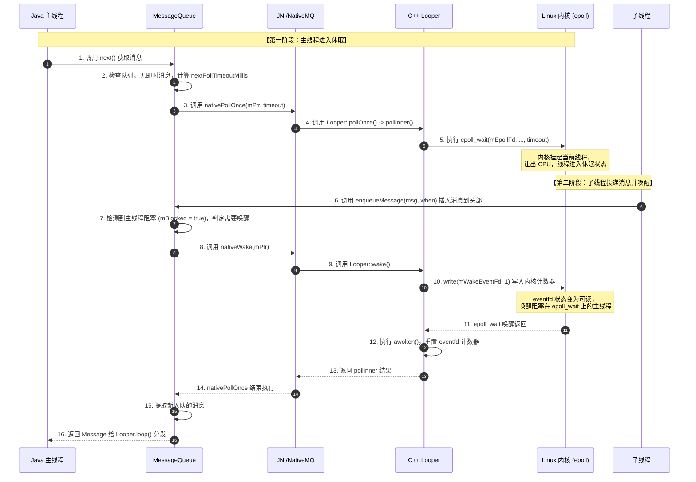
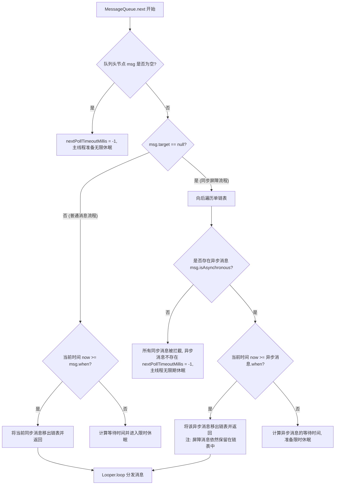
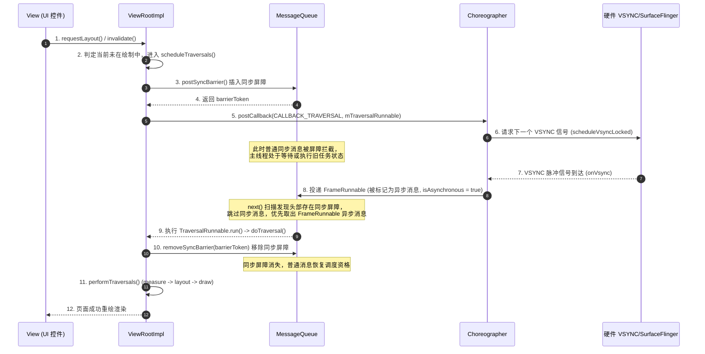

# 5.2.1.4 消息延迟实现与消息屏障

在 Android 异步消息机制中，`Handler` 不仅承担着多线程间通信的重任，还需要处理高精度的定时任务，并保障系统 UI 绘制的绝对流畅度。为了在错综复杂的应用场景下平衡**时间精度**与**任务优先级**，Android 设计了“消息延迟执行”与“同步屏障（Sync Barrier）/ 异步消息”这两套精密协作的机制。

本文将从时间基准选择、`MessageQueue` 的链表结构、Native 层的 `epoll` 与 `eventfd` 唤醒机制、同步屏障的工作原理，以及 `Choreographer` 的 UI 绘制实战等维度，对这些底层设计进行深度剖析。

---

## 1. 引言与核心概念概述

### 1.1 消息机制的吞吐与延迟难题
在 Android 这种事件驱动的操作系统中，主线程（UI 线程）的消息循环面临着巨大的性能挑战。主线程每秒可能需要处理数千个消息，这些消息的性质各不相同：
*   **即时消息**：如用户的点击事件（Input Event）、Binder 调用的回调、主线程的普通 Runnable 任务。
*   **延迟消息**：如双击判定定时器、动画延迟触发、轮询逻辑等。
*   **超高优先级消息**：如屏幕刷新信号（VSYNC）驱动的 UI 测量（Measure）、布局（Layout）和绘制（Draw）任务。

如果简单地使用一个先进先出（FIFO）的普通队列来管理所有消息，将会面临两大痛点：
1.  **延迟精度失控**：如果延迟消息混在普通消息中，当到达指定的延迟时间时，如果队列前面积压了大量繁重的同步任务，延迟消息的执行时间将被无限延后，无法保证定时器的精度。
2.  **UI 掉帧与卡顿**：当系统需要进行绘制以响应用户交互时，如果主线程的消息队列中排满了耗时较长的普通业务消息，绘制任务将被迫排在这些消息后面，从而错过屏幕的刷新周期（VSYNC 信号），引发视觉上的卡顿甚至 ANR。

### 1.2 延迟消息与同步屏障的设计哲学
为了解决上述问题，Android 的设计者在 `MessageQueue` 的基础上引入了两项核心优化：
*   **基于 `when` 排序的优先级单链表**：`MessageQueue` 并不是一个真正的“队列”，而是一个按照时间戳 `when` 升序排列的单链表。当插入延迟消息时，系统会计算出其准确的执行绝对时间，并将其“插队”插入到链表的合适位置。在读取消息时，通过计算距离下一个消息的剩余时间，利用 Linux 的 `epoll` 机制让主线程安全地休眠，既保证了时间精度，又避免了死循环占用 CPU。
*   **同步屏障与异步消息机制**：这是一种专门为 UI 绘制等关键任务设计的“快车道”。当系统需要进行 UI 渲染时，会在 `MessageQueue` 头部插入一个“同步屏障”（即 `target == null` 的特殊 `Message`）。这个屏障就像一个关卡，它会拦截队列中所有普通的同步消息。此时，只有被标记为“异步消息”的任务（如 `Choreographer` 的绘制任务）能够穿过屏障优先执行。当绘制完成后，屏障被移除，普通消息才得以继续流动。

---

## 2. 消息延迟的底层实现原理

### 2.1 时间基准的选择：Wall Clock vs Monotonic Clock
在 Android 中，发送延迟消息通常使用 `Handler.postDelayed(Runnable r, long delayMillis)` 或 `Handler.sendMessageAtTime(Message msg, long uptimeMillis)`。在其底层，所有的相对延迟时间（`delayMillis`）最终都会被转化为一个绝对的目标执行时间 `when`：
$$\text{when} = \text{currentTime} + \text{delayMillis}$$
这里的 `currentTime`（当前时间基准）的选择至关重要。Android 提供了两个核心的系统时钟源：
1.  `System.currentTimeMillis()`：即墙上时钟（Wall Clock Time），代表当前的绝对物理时间（UTC 时间）。
2.  `SystemClock.uptimeMillis()`：即单调递增时钟（Monotonic Clock Time），代表自系统启动以来的毫秒数，但不包括系统处于深度休眠（Deep Sleep / Suspend）的时间。

#### 为什么 Handler 坚决不使用 `System.currentTimeMillis()`？
`System.currentTimeMillis()` 是可以被用户手动修改的，也可以通过 NTP（网络时间协议）服务进行自动同步。这会导致该时钟发生“回退”或“跳跃”。
假设使用 `System.currentTimeMillis()` 作为基准，开发者发送了一个延迟 10 秒执行的消息：
*   **时间回退风险**：如果在等待期间，用户将系统时间向后调整了 1 小时，那么原本应该在 10 秒后执行的消息，在系统看来其目标执行时间（`when`）变成了 1 小时 10 秒之后，该消息将被无限期挂起。
*   **时间跃进风险**：如果用户将系统时间向前调整了 1 小时，原本应该在 10 秒后执行的消息会被系统误认为早已过期，从而立刻被调度执行，破坏了原有的逻辑设计。

因此，Handler 选择了 `SystemClock.uptimeMillis()` 作为时间基准。该时钟由 Linux 内核的 `CLOCK_MONOTONIC` 驱动，是一个严格单调递增的时钟，不受任何外部时间调整的影响，保证了时间段计算的绝对可靠。

#### 为什么不用包含休眠时间的 `SystemClock.elapsedRealtime()`？
`SystemClock.elapsedRealtime()` 包含了系统处于深度休眠（CPU 停止运行，处于内核挂起状态）的时间。
在系统休眠期间，主线程（UI 线程）早已被内核挂起，整个进程暂停调度。如果我们使用 `elapsedRealtime()` 作为基准，在手机锁屏深度休眠期间，延迟时间依然在无形流逝。一旦手机由于收到通知或用户操作而被系统唤醒时，主线程会发现许多“本应在休眠期执行”的消息均已过期，这会导致主线程在瞬间积压大量过期消息并扎堆爆发，瞬间引发严重的 CPU 拥堵与界面卡顿。
使用 `uptimeMillis()`，在休眠期间时钟是“挂起静止”的，当设备被重新唤醒后，消息的相对延迟仍会严格按照 CPU 实际处于活动状态的物理时间来计算。这更加符合应用层交互与单线程 Looper 的调度特征。

##### 延伸对比：AlarmManager 与 Handler 的唤醒设计差异
这引发了另一个经典问题：**为什么 Android 系统的后台任务调度器 `AlarmManager` 反而支持并推荐使用基于 `elapsedRealtime` 的闹钟机制（如 `ELAPSED_REALTIME_WAKEUP`）？**
这是因为两者的设计定位与底层唤醒机制存在根本性差异：
*   **Handler 消息延迟**：属于**进程内**的协作机制。当主线程处于挂起休眠时，说明应用当前没有任何需要即时处理的交互。Handler 并不希望也不具备能力去打破系统的节电状态。因此，使用不包含休眠时间的 `uptimeMillis()` 能够最大程度保护电池寿命，顺应系统休眠。
*   **AlarmManager 调度**：属于**跨进程的系统级**服务（由 `AlarmManagerService` 统一管理）。当开发者使用 `_WAKEUP` 结尾的闹钟类型时，其底层是通过 Linux 内核提供的 `RTC` (Real Time Clock) 驱动设备，在 CPU 深度休眠时向硬件电源芯片发送物理中断信号。即使整个手机 CPU 处于 Suspend 状态，一旦时间到达，硬件中断也会强行唤醒 CPU 并在内核态拉起对应的进程来处理任务。这就要求闹钟时间基准必须包含深度休眠时间，以确保即使手机锁屏，预定的后台任务（如清晨闹钟、社交软件的心跳包接收）也能按时被精准触发。


---

### 2.2 MessageQueue 的单链表优先级排序算法
`MessageQueue` 的核心属性是 `Message mMessages`，它指向链表的头节点。每次投递消息时，都会通过 `enqueueMessage` 方法将其插入链表。

#### `enqueueMessage` 的链表插入排序逻辑：
1.  **头部插入**：如果链表为空（`mMessages == null`），或者新消息的 `when` 为 0（代表需要立即执行，例如 `sendMessageAtFrontOfQueue`），或者新消息的执行时间比当前链表头节点的执行时间还要早（`when < mMessages.when`）。此时，新消息直接作为新的头节点插入，并根据当前主线程是否处于阻塞状态来决定是否立即唤醒主线程。
2.  **中间/尾部插入**：如果新消息的执行时间晚于头节点，说明它不需要立即被处理。此时需要从头节点开始遍历链表，找到第一个满足 `when < p.when` 的位置，将新消息插入到该节点的前面。
3.  **唤醒标志计算**：在中间插入时，通常不需要唤醒主线程，因为主线程即便在休眠，也是在等待执行时间更早的头节点消息。既然新消息排在后面，主线程只需按原计划醒来即可。只有一种特殊情况例外：如果队列头部是一个同步屏障，且新插入的消息是整条链表中最早的“异步消息”，那么我们需要视情况唤醒主线程。

下面是 `enqueueMessage` 的关键源码剖析与注释说明：

```java
boolean enqueueMessage(Message msg, long when) {
    if (msg.target == null) {
        throw new IllegalArgumentException("Message must have a target.");
    }

    synchronized (this) {
        if (mQuitting) {
            IllegalStateException e = new IllegalStateException(
                    msg.target + " sending message to a Handler on a dead thread");
            Log.w(TAG, e.getMessage(), e);
            msg.recycle();
            return false;
        }

        msg.markInUse();
        msg.when = when;
        Message p = mMessages;
        boolean needWake;
        
        // 情况一：插入链表头部
        if (p == null || when == 0 || when < p.when) {
            msg.next = p;
            mMessages = msg;
            // 如果主线程当前处于阻塞状态（mBlocked = true），则必须将其唤醒以更新休眠等待时间
            needWake = mBlocked;
        } else {
            // 情况二：插入链表中间或尾部
            // 通常不需要唤醒主线程，除非队列头部是同步屏障（p.target == null），
            // 并且新插入的消息是链表里最早的异步消息，且主线程当前处于阻塞状态。
            needWake = mBlocked && p.target == null && msg.isAsynchronous();
            Message prev;
            for (;;) {
                prev = p;
                p = p.next;
                // 遍历到链表末尾，或者找到了执行时间比新消息晚的节点，准备在此处插入
                if (p == null || when < p.when) {
                    break;
                }
                // 如果发现该异步消息之前已经存在了更早的异步消息，则不需要唤醒
                if (needWake && p.isAsynchronous()) {
                    needWake = false;
                }
            }
            msg.next = p; // 插入链表
            prev.next = msg;
        }

        // 如果计算出需要唤醒，则调用 Native 方法唤醒阻塞在 epoll_wait 上的主线程
        if (needWake) {
            nativeWake(mPtr);
        }
    }
    return true;
}
```

---

### 2.3 MessageQueue.next() 的轮询与超时计算
主线程通过 `Looper.loop()` 开启无限循环，而每一次循环的核心就是调用 `MessageQueue.next()` 来获取下一条可执行的消息。`next()` 的内部是一个带有 `nativePollOnce` 阻塞机制的 `for(;;)` 循环。

#### `next()` 的动态休眠时间计算流程：
1.  **休眠等待**：进入循环后，首先执行 `nativePollOnce(mPtr, nextPollTimeoutMillis)`。这是一个 Native 方法，它会将主线程挂起，并让出 CPU 资源。阻塞时长由 `nextPollTimeoutMillis` 决定：
    *   若为 `-1`：无限期阻塞，直到被主动唤醒（如新消息入队）。
    *   若为 `0`：不阻塞，立刻返回。
    *   若为 `>0`：最长阻塞对应的毫秒数，超时后自动唤醒。
2.  **同步屏障分流**：被唤醒后，检查当前链表头部。如果 `msg != null && msg.target == null`，说明遇到了“同步屏障”。此时，`next()` 开启一个 `do-while` 循环，跳过链表中的所有同步消息，只去寻找第一个被标记为 `isAsynchronous() == true` 的异步消息。
3.  **消息执行判断**：
    *   如果找到了符合条件的消息（普通同步消息或穿过屏障的异步消息）：
        *   **时间已到**（`now >= msg.when`）：将该消息从单链表中摘除，重置 `mBlocked` 状态，并返回该消息给 `Looper` 进行分发。
        *   **时间未到**（`now < msg.when`）：计算当前距离该消息执行时间的差值，将其赋值给 `nextPollTimeoutMillis`（最大不超过 `Integer.MAX_VALUE`）。在下一轮循环中，主线程会在这个时间内进行限时休眠。
    *   如果没有找到任何符合条件的消息（链表为空，或者队列中全是同步消息但在头部遇到了同步屏障，且没找到异步消息）：
        *   将 `nextPollTimeoutMillis` 设为 `-1`，使主线程在下一轮循环中无限期休眠。
4.  **IdleHandler 的空闲调度**：当队列中没有即时消息可处理（链表为空，或者最近的消息还没到执行时间），主线程判定为“空闲状态”。此时，会取出注册的 `IdleHandler` 列表进行执行。为了避免 `IdleHandler` 执行时间过长导致新入队的消息被延误，执行完 `IdleHandler` 后，会将 `nextPollTimeoutMillis` 重置为 `0`，强制在下一轮循环中重新检查一遍队列。

下面是 `MessageQueue.next()` 的核心源码实现：

```java
Message next() {
    final long ptr = mPtr;
    if (ptr == 0) {
        return null;
    }

    int pendingIdleHandlerCount = -1; // -1 表示只在第一次进入空闲状态时执行
    int nextPollTimeoutMillis = 0;    // 初始不阻塞
    for (;;) {
        if (nextPollTimeoutMillis != 0) {
            Binder.flushPendingCommands();
        }

        // 调用 Native 层，主线程在此处可能会被挂起休眠
        nativePollOnce(ptr, nextPollTimeoutMillis);

        synchronized (this) {
            final long now = SystemClock.uptimeMillis();
            Message prevMsg = null;
            Message msg = mMessages;
            
            // 1. 同步屏障过滤拦截：如果 target == null，说明遇到了屏障
            if (msg != null && msg.target == null) {
                // 循环跳过所有普通同步消息，只寻找第一个异步消息
                do {
                    prevMsg = msg;
                    msg = msg.next;
                } while (msg != null && !msg.isAsynchronous());
            }

            if (msg != null) {
                if (now < msg.when) {
                    // 2. 消息执行时间未到，计算需要休眠等待的绝对时间差
                    nextPollTimeoutMillis = (int) Math.min(msg.when - now, Integer.MAX_VALUE);
                } else {
                    // 3. 消息时间已到，将其从链表中移出并返回
                    mBlocked = false;
                    if (prevMsg != null) {
                        prevMsg.next = msg.next;
                    } else {
                        mMessages = msg.next;
                    }
                    msg.next = null;
                    msg.markInUse();
                    return msg;
                }
            } else {
                // 4. 队列中没有消息，或者遇到了屏障但没有任何异步消息，无限期休眠
                nextPollTimeoutMillis = -1;
            }

            if (mQuitting) {
                dispose();
                return null;
            }

            // 5. 执行 IdleHandler 逻辑
            // 只有当队列为空，或者队列头部消息还没到执行时间时，才判定为空闲
            if (pendingIdleHandlerCount < 0
                    && (mMessages == null || now < mMessages.when)) {
                pendingIdleHandlerCount = mIdleHandlers.size();
            }
            if (pendingIdleHandlerCount <= 0) {
                // 没有注册 of IdleHandler，直接进入下一轮循环（准备休眠）
                mBlocked = true;
                continue;
            }

            if (mPendingIdleHandlers == null) {
                mPendingIdleHandlers = new IdleHandler[Math.max(pendingIdleHandlerCount, 4)];
            }
            mPendingIdleHandlers = mIdleHandlers.toArray(mPendingIdleHandlers);
        }

        // 执行所有的 IdleHandler
        for (int i = 0; i < pendingIdleHandlerCount; i++) {
            final IdleHandler idler = mPendingIdleHandlers[i];
            mPendingIdleHandlers[i] = null; // 释放引用

            boolean keep = false;
            try {
                keep = idler.queueIdle();
            } catch (Throwable t) {
                Log.wtf(TAG, "IdleHandler threw exception", t);
            }

            if (!keep) {
                synchronized (this) {
                    mIdleHandlers.remove(idler);
                }
            }
        }

        // 重置 IdleHandler 计数，防止重复执行
        pendingIdleHandlerCount = 0;

        // 因为在执行 IdleHandler 的过程中，可能有新消息入队或者时间流逝，
        // 故将超时时间设为 0，强制下一轮循环立即检查队列，防止消息延迟
        nextPollTimeoutMillis = 0;
    }
}
```

---

### 2.4 Native 层的休眠与唤醒细节（epoll 与 eventfd）
在 Java 层，休眠和唤醒的核心分别对应 `nativePollOnce` 和 `nativeWake`。这两个方法并非 Java 原生实现，而是通过 JNI 调用了 Native 层的 `android_os_MessageQueue.cpp`，最终由 C++ 层的 `Looper` 完成底层的 I/O 多路复用操作。

#### 2.4.1 C++ 层的 Looper 初始化与 epoll
当 Java 层创建 `MessageQueue` 时，会在构造方法中调用 `nativeInit()`。Native 层会随之创建一个 `NativeMessageQueue` 对象，并且在当前线程的 Native 空间中初始化一个 C++ 层的 `Looper`：

```cpp
// android_os_MessageQueue.cpp
static jlong android_os_MessageQueue_nativeInit(JNIEnv* env, jclass clazz) {
    NativeMessageQueue* nativeMessageQueue = new NativeMessageQueue();
    ...
    return reinterpret_cast<jlong>(nativeMessageQueue);
}

NativeMessageQueue::NativeMessageQueue() {
    mLooper = Looper::getForThread();
    if (mLooper == NULL) {
        // 创建 Native 层的 Looper
        mLooper = new Looper(true);
        Looper::setForThread(mLooper);
    }
}
```

C++ 层的 `Looper` 在构造时，会使用 Linux 系统的 `epoll` 机制来实现高并发的 I/O 事件监听，并建立一个“唤醒通道”：

```cpp
// Looper.cpp
Looper::Looper(bool allowNonCallbacks) :
        mAllowNonCallbacks(allowNonCallbacks), mSendingMessage(false),
        mPolling(false), mEpollFd(-1), mRebuildEpoll(false) {
    // 1. 创建 epoll 句柄
    mEpollFd = epoll_create1(EPOLL_CLOEXEC);
    
    // 2. 初始化唤醒事件文件描述符 (eventfd)
    mWakeEventFd = eventfd(0, EFD_NONBLOCK | EFD_CLOEXEC);
    
    struct epoll_event eventItem;
    memset(& eventItem, 0, sizeof(epoll_event));
    eventItem.events = EPOLLIN; // 监听可读事件
    eventItem.data.fd = mWakeEventFd;
    
    // 3. 将唤醒 fd 注册到 epoll 监听中
    epoll_ctl(mEpollFd, EPOLL_CTL_ADD, mWakeEventFd, &eventItem);
}
```

#### 2.4.2 Linux epoll 的内核底数据结构与高效调度
为了理解主线程休眠不消耗 CPU 资源的原因，我们需要探究 Linux 内核中 `epoll` 的底层数据结构及其等待唤醒逻辑：
1.  **红黑树（RB-Tree）**：在 Linux 内核中，对于每一个创建的 `epoll` 句柄，内核都会分配一棵红黑树。所有需要监听的文件描述符（如 `mWakeEventFd`、以及主线程监听的 Binder 设备 fd、Input 事件 fd 等）都会作为节点插入到这棵红黑树中。由于红黑树在增、删、改、查操作上的时间复杂度为 $O(\log n)$，这使得内核即使在监听成百上千个 fd 时，依然能保持极其敏捷的事件维护性能。
2.  **双向就绪链表（Ready List）**：内核中还维护着一个双向链表，用来存储当前已经有事件触发（如可读、可写）的 fd。
3.  **等待队列（Wait Queue）与进程状态转换**：
    *   当主线程调用 `epoll_wait`（在 Native 层为 `epoll_wait(mEpollFd, ...)`）时，内核会检查 `eventpoll` 的双向就绪链表是否为空。
    *   若链表为空，且设置了超时时间，内核会将当前主线程从 CPU 的“可执行队列”（Run Queue）中移除，将其状态修改为 `TASK_INTERRUPTIBLE`（可中断的睡眠状态），并将其挂载到当前 `eventpoll` 的等待队列中。
    *   此时，主线程的 CPU 时间片被内核收回，CPU 调度器可以调度其他线程运行。因此，主线程即使处于“死循环”的 `Loop` 中，在没有事件触发时，其 CPU 占用率也完全为 `0`。
    *   当子线程向 `mWakeEventFd` 写入数据、或者硬件产生输入中断时，内核的硬件中断或设备驱动回调程序会迅速执行，将事件写入对应的 fd 节点，并将该节点挂入双向就绪链表。
    *   紧接着，内核会唤醒挂载在 `eventpoll` 等待队列中的主线程，将其状态修改为 `TASK_RUNNING`（可运行状态），重新放入 CPU 的调度队列中。主线程再次获得执行权，`epoll_wait` 返回，向下分发执行对应的事件。

#### 2.4.3 为什么从 Pipe 升级到 Eventfd？
在 Android 6.0 之前，`Looper` 使用的是标准 Linux 管道（`pipe`）来实现跨线程唤醒。
*   `pipe` 机制会创建两个文件描述符：一个用于读（`wakeReadPipFd`），一个用于写（`wakeWritePipFd`）。
*   当需要唤醒时，向写 fd 中写入数据（如一个字符 `'W'`），读 fd 产生可读事件，被 `epoll` 监听到，主线程从而醒来。

自 Android 6.0 (API 23) 开始，Google 引入了 `eventfd` 替代了 `pipe`。这种优化对主线程的性能有显著提升：
1.  **资源开销减半**：`pipe` 是半双工的，必须占用 2 个文件描述符（fd）。而在 Android 系统中，单个进程持有的 fd 数量是有限制的（通常是 1024）。`eventfd` 只需要 1 个文件描述符，极大地节省了系统 fd 资源。
2.  **零内存拷贝与极低 CPU 开销**：`pipe` 本质上是内核管理的一块内存缓冲区，读写数据涉及到数据的拷贝。而 `eventfd` 只是内核中维护的一个 8 字节（64 位）的计数器。写操作（`write`）只是对计数器做加法，读操作（`read`）只是读取并清零，不涉及任何缓冲区拷贝。这种极致的轻量级同步，减少了上下文切换的时间，能显著降低高频唤醒时的 CPU 开销。

有关这一底层重构的详细背景，可参见 [AndroidVersionChangeLog.md](../../../../AndroidVersionChangeLog.md)。

#### 2.4.4 nativePollOnce 的内核休眠机制
当 Java 层传入 `nextPollTimeoutMillis` 调用 `nativePollOnce` 时，会通过 JNI 桥接，最终执行到 `Looper::pollInner(int timeoutMillis)`：

```cpp
int Looper::pollInner(int timeoutMillis) {
    ...
    struct epoll_event eventItems[EPOLL_MAX_EVENTS];
    
    // 调用 epoll_wait 让当前线程进入阻塞挂起状态。
    // timeoutMillis 决定了阻塞时长，此时线程处于 Linux 的 TASK_INTERRUPTIBLE 状态，让出 CPU
    int eventCount = epoll_wait(mEpollFd, eventItems, EPOLL_MAX_EVENTS, timeoutMillis);
    
    for (int i = 0; i < eventCount; i++) {
        int fd = eventItems[i].data.fd;
        uint32_t epollEvents = eventItems[i].events;
        
        if (fd == mWakeEventFd) {
            if (epollEvents & EPOLLIN) {
                // 被唤醒，读取 eventfd 中的计数器，将其清零，为下一次唤醒做准备
                awoken(); 
            }
        } else {
            // 处理其他注册的文件描述符事件（如 Input 事件、传感器事件等）
            ...
        }
    }
    return result;
}
```

#### 2.4.5 nativeWake 的唤醒流程
当有新消息加入链表且需要唤醒时，Java 层调用 `nativeWake(mPtr)`，底层通过向 `mWakeEventFd` 写入一个数值（通常是 1），触发内核发出可读事件，从而解除 `epoll_wait` 的阻塞：

```cpp
void Looper::wake() {
    uint64_t inc = 1;
    // 向 eventfd 写入 8 字节数据，触发可读事件
    ssize_t nWrite = TEMP_FAILURE_RETRY(write(mWakeEventFd, &inc, sizeof(uint64_t)));
    if (nWrite != sizeof(uint64_t)) {
        if (errno != EAGAIN) {
            ALOGW("Could not write wake signal to fd %d: %s", mWakeEventFd, strerror(errno));
        }
    }
}
```

---

### 2.5 休眠与唤醒的完整流程时序图

下面的 Mermaid 图清晰地展示了主线程从获取消息、计算时间差、挂起休眠，到子线程投递新消息并强行唤醒主线程的完整调用闭环：



---

## 3. 同步屏障（Sync Barrier）的机制

### 3.1 同步屏障的设计定义与入队细节
同步屏障是一种用来拦截普通同步消息，开辟“绿色通道”让异步消息优先通过的特殊消息。

#### 同步屏障的特征：
1.  **没有 Target**：普通的 `Message` 必须持有发送它的 `Handler` 引用（即 `msg.target`）。在 Java 层，如果通过 Handler 发送消息，`target` 必定不为空。而同步屏障消息的 `target` 属性为 `null`。
2.  **拥有 Token**：屏障消息的 `arg1` 存储了一个递增的整数 `token`。该 `token` 在调用 `postSyncBarrier()` 时生成并返回给调用者，用作移除该屏障的凭证。

#### 插入屏障的源码深度剖析：
同步屏障的插入是通过 `postSyncBarrier(long when)` 实现的。该方法是隐藏的（`@hide`），只有系统内部可以调用。

```java
public int postSyncBarrier() {
    return postSyncBarrier(SystemClock.uptimeMillis());
}

private int postSyncBarrier(long when) {
    synchronized (this) {
        final int token = mNextBarrierToken++;
        // 1. 从消息池中获取一个 Message 并初始化
        final Message msg = Message.obtain();
        msg.markInUse();
        msg.when = when;
        msg.arg1 = token; // 将 token 记录 in arg1
        // 注意：msg.target 保持为 null

        Message prev = null;
        Message p = mMessages;
        // 2. 根据时间戳 when，将屏障消息插入到单链表的对应位置
        if (when != 0) {
            while (p != null && p.when <= when) {
                prev = p;
                p = p.next;
            }
        }
        if (prev != null) { 
            // 插入到链表中间或尾部
            msg.next = p;
            prev.next = msg;
        } else {
            // 插入到链表头部
            msg.next = p;
            mMessages = msg;
        }
        return token; // 返回 token，用于后续移除屏障
    }
}
```

#### 为什么插入同步屏障不需要调用 `nativeWake()`？
从源码中可以看出，相比于普通的 `enqueueMessage`，`postSyncBarrier` 在完成链表操作后，**没有**调用 `nativeWake(mPtr)` 的逻辑。
这是因为：**同步屏障本身并不代表任何需要执行的工作**。它的作用是改变队列中消息的调度顺序。
*   如果当前主线程是休眠的，说明此时队列中没有立即可执行的异步消息。
*   插入屏障只是为了在“未来”有异步消息入队时阻挡同步消息。如果在插入屏障的同时强行唤醒主线程，主线程醒来后发现队列头部是屏障，往后遍历又找不到任何已到期的异步消息，主线程将只能再次进入休眠。这种无效唤醒会带来不必要的 CPU 损耗。
*   当真正有需要优先执行的异步消息入队时，`enqueueMessage` 会检测到头部是屏障，并调用 `nativeWake` 唤醒主线程去执行该异步消息。

---

### 3.2 MessageQueue.next() 对同步屏障的拦截分流
在 `MessageQueue.next()` 的源码中，同步屏障的拦截逻辑是通过判断 `msg.target == null` 来触发的：

```java
// next() 内部核心过滤逻辑
if (msg != null && msg.target == null) {
    // 遇到了同步屏障！
    // 开启循环，无视链表中所有的同步消息，直到找到第一个异步消息（isAsynchronous() == true）
    do {
        prev = msg;
        msg = msg.next;
    } while (msg != null && !msg.isAsynchronous());
}
```

#### 链表检索分流示意图：
假设当前主线程的 `MessageQueue` 链表结构如下，其中包含普通消息、同步屏障和异步消息：

```
[ Head: 同步消息1 (10:00) ] 
       ↓
[ 同步屏障 (Target == null, Token: 99, 10:01) ]  ←-- 此时 next() 检测到此屏障
       ↓
[ 同步消息2 (10:02) ]   --- (被跳过)
       ↓
[ 同步消息3 (10:03) ]   --- (被跳过)
       ↓
[ 异步消息1 (10:05) ]   --- (被命中！优先提取此消息)
       ↓
[ 同步消息4 (10:06) ]
```

当 `next()` 执行时：
1.  首先拿到 `同步消息1`。由于其 `target` 不为空，且时间到了，如果屏障还没生效，它会被正常执行。
2.  当时间推进，链表头节点变为 `同步屏障`。`next()` 检测到 `msg.target == null`。
3.  它立即启动过滤机制，跳过 `同步消息2` 和 `同步消息3`。
4.  找到了 `异步消息1`。
    *   若当前系统时间已经到了 `10:05`，则将 `异步消息1` 从链表中剥离，并返回给 `Looper` 调度执行。
    *   若时间未到，则计算当前时间与 `10:05` 的差值，以此作为 `nextPollTimeoutMillis` 让主线程进入限时休眠。
5.  在此期间，即使 `同步消息2` 和 `同步消息3` 的执行时间已经到了，它们也无法被调度，因为屏障将其死死卡住。

---

### 3.3 同步屏障的移除与主线程唤醒
当紧急任务（如 UI 绘制）执行完毕后，必须调用 `removeSyncBarrier(int token)` 移除屏障，否则主线程的普通消息将永远被阻塞。

```java
public void removeSyncBarrier(int token) {
    synchronized (this) {
        Message prev = null;
        Message p = mMessages;
        
        // 1. 遍历链表，寻找 target == null 且 arg1 == token 的那个屏障节点
        while (p != null && (p.target != null || p.arg1 != token)) {
            prev = p;
            p = p.next;
        }
        
        if (p == null) {
            throw new IllegalStateException("The barrier has already been removed or was never posted.");
        }
        
        final boolean needWake;
        if (prev != null) {
            // 情况一：屏障不在链表头部。说明它前面还有其他没执行完的消息。
            // 直接将屏障节点从链表中移出，不需要唤醒主线程。
            prev.next = p.next;
            needWake = false;
        } else {
            // 情况二：屏障就在链表头部。
            mMessages = p.next;
            // 移出后，如果新的头节点是普通同步消息（target != null）或者链表为空，
            // 且主线程当前处于阻塞状态，则必须唤醒主线程。
            needWake = mMessages == null || mMessages.target != null;
        }
        p.recycleUnchecked(); // 回收屏障消息到消息池

        if (needWake && !mQuitting) {
            nativeWake(mPtr); // 唤醒主线程
        }
    }
}
```

#### 为什么移除头部屏障时需要唤醒主线程？
如果屏障处于队列头部，且主线程当前处于阻塞状态，这意味着之前由于屏障的拦截，队列中已经没有符合条件的异步消息可执行，主线程因此进入了无限休眠（`nextPollTimeoutMillis = -1`）。
现在，屏障被移除了，原来被它拦截的一系列同步消息重新获得了执行的权利。如果此时头部的同步消息已经到了执行时间，而我们不去唤醒主线程，主线程就会继续无限期休眠下去，导致这些同步消息无法被及时处理。因此，必须调用 `nativeWake` 强行唤醒主线程，让其重新进入 `next()` 的分发循环。

---

### 3.4 同步屏障数据流过滤图
下图展示了 `MessageQueue` 在有无同步屏障时，对同步消息与异步消息的分流处理逻辑：



---

## 4. 异步消息（Async Message）与 Choreographer 实践

### 4.1 异步消息的声明与生命周期
普通的 `Message` 默认是同步的。要将消息变成异步消息，有两种主要手段：
1.  **直接设置属性**：调用 `msg.setAsynchronous(true)`。
2.  **通过异步 Handler 投递**：在创建 `Handler` 时，传入 `async = true`。其内部实现是通过 `Handler.createAsync(Looper.myLooper())` 或特定的构造方法：

```java
// Handler.java
public static Handler createAsync(@NonNull Looper looper) {
    if (looper == null) throw new NullPointerException("looper must not be null");
    return new Handler(looper, null, true); // 最后一个参数为 async
}

// Handler 在发送消息时，会自动为 Message 打上异步标签
private boolean enqueueMessage(MessageQueue queue, Message msg, long uptimeMillis) {
    msg.target = this;
    if (mAsynchronous) {
        msg.setAsynchronous(true); // 设为异步消息
    }
    return queue.enqueueMessage(msg, uptimeMillis);
}
```

---

### 4.2 Choreographer 帧率保障与 VSYNC 机制
在 Android 中，屏幕的刷新率（通常是 60Hz, 90Hz 或 120Hz）决定了 UI 必须以极高的规律性进行重绘。每次屏幕硬件发出 VSYNC（垂直同步）信号时，系统都必须准备好下一帧的绘制数据。

如果应用的主线程正在执行一些普通的任务（例如，某个 Handler 正在解析一个复杂的 JSON 字符串），而此时 VSYNC 信号到来了，主线程如果继续老老实实地排队执行剩下的普通消息，就会导致无法在 16.6ms（60Hz）或 11.1ms（90Hz）内完成绘制。这就是导致界面掉帧和卡顿的根本原因。

为了给 UI 渲染提供绝对的通道特权，Android 引入了 `Choreographer`（舞蹈指导）。其核心逻辑在于**让 UI 绘制事件跳过所有业务事件，并在 VSYNC 信号到来时立即获得 CPU 调度**。

#### 4.2.1 Choreographer 的内部 Callback 队列机制
`Choreographer` 内部维护着一个回调队列数组 `mCallbackQueues`，它包含四种不同的回调类型。它们在同一帧的调度周期中，遵循极其严格的执行先后顺序：
1.  `CALLBACK_INPUT`：输入事件响应（例如，Touch 事件的运动轨迹更新）。必须最先执行，以保证交互的灵敏度。
2.  `CALLBACK_ANIMATION`：动画回调（如 `ValueAnimator` 的数值刷新）。在输入事件处理完毕后执行，以使动画能基于最新的输入数据进行计算。
3.  `CALLBACK_TRAVERSAL`：重绘三大步序（Measure、Layout、Draw）的起点。在动画计算完成后执行，确保渲染出最新的动画状态。
4.  `CALLBACK_COMMIT`：用于帧提交的后期收尾工作，在绘制完成后触发。

#### 4.2.2 VSYNC 信号的底层传递与 Native Looper 的配合
当 App 进程通过 `DisplayEventReceiver` 请求 VSYNC 信号后，底层的脉冲响应流程如下：
*   **硬件中断触发**：显示器硬件以固定频率（例如 60Hz，即每 16.6ms）产生垂直同步信号，由系统的 `SurfaceFlinger` 服务捕获。
*   **BitTube 匿名 socket 通信**：`SurfaceFlinger` 的 `EventThread` 收到信号后，通过内核提供的 `BitTube`（基于 `socketpair` 实现的高效双向匿名 Socket 通信机制）向 App 进程发送数据。
*   **Native Looper 唤醒**：App 端的 `DisplayEventReceiver` 的读端文件描述符（fd）已经被注册在主线程 Native 的 `epoll_wait` 监听树上。当 VSYNC 脉冲到达时，内核在 Socket 上产生可读事件，立刻将主线程从阻塞中唤醒。
*   **Java 层回调**：主线程被唤醒后，Native 层的 `Looper` 捕获到可读事件，回调 `receiver`，并最终通过 JNI 调用 Java 层的 `FrameDisplayEventReceiver.onVsync()`。
*   **分发 doFrame()**：在 `onVsync` 中，`Choreographer` 向主线程发送一个**异步消息**，开始执行 `doFrame()`。在 `doFrame` 中，主线程会严格按照 `INPUT -> ANIMATION -> TRAVERSAL -> COMMIT` 的顺序，依次清空对应的回调队列。

---

### 4.3 UI 绘制的同步屏障闭环：scheduleTraversals 到 doTraversal
当一个 `View` 发起重绘请求（如调用了 `requestLayout()` 或 `invalidate()`），整个系统的调用链如下：

1.  `View.requestLayout()` 沿着 View 树向上传递，最终到达根节点 `ViewRootImpl.requestLayout()`。
2.  `ViewRootImpl` 触发 `scheduleTraversals()` 方法。
3.  **插入同步屏障**：在 `scheduleTraversals()` 中，立即向主线程的 `MessageQueue` 插入一个同步屏障，阻止后续所有普通消息的调度，并记录返回的 `token`。
4.  **投递异步绘制消息**：调用 `Choreographer.postCallback()`。`Choreographer` 收到请求后，会等待下一个 VSYNC 信号。一旦 VSYNC 信号到来，`Choreographer` 会通过一个内部的异步 Handler 投递一个 `FrameDisplayEventReceiver` 任务，这个任务最终被封装成一个**异步消息**投递到主线程。
5.  **优先执行与移除屏障**：主线程在 `MessageQueue.next()` 中由于同步屏障的存在，直接忽略所有普通消息，取出该异步消息，执行其 `run()` 方法。该方法会回调到 `ViewRootImpl.doTraversal()`。
6.  在 `doTraversal()` 的第一步，**立即移除同步屏障**，以便后续的普通消息能够在绘制完成后恢复调度。然后开始执行具体的 `performTraversals()`（包含 measure, layout, draw 流程）。

下面是 `ViewRootImpl` 中的核心源码实现：

```java
// ViewRootImpl.java
final class TraversalRunnable implements Runnable {
    @Override
    public void run() {
        doTraversal(); // 最终执行的方法
    }
}
final TraversalRunnable mTraversalRunnable = new TraversalRunnable();

void scheduleTraversals() {
    if (!mTraversalScheduled) {
        mTraversalScheduled = true;
        
        // 1. 立即往主线程 MessageQueue 中插入一个同步屏障，拦截所有普通消息
        mTraversalBarrier = mHandler.getLooper().getQueue().postSyncBarrier();
        
        // 2. 将 mTraversalRunnable 作为 CALLBACK_TRAVERSAL 类型的回调投递给 Choreographer.
        // Choreographer 会在 VSYNC 信号到来时，通过发送一个“异步消息”来触发该 Runnable 的运行
        mChoreographer.postCallback(
                Choreographer.CALLBACK_TRAVERSAL, mTraversalRunnable, null);
        
        notifyRendererOfFramePending();
        pokeDrawLockIfNeeded();
    }
}

void doTraversal() {
    if (mTraversalScheduled) {
        mTraversalScheduled = false;
        
        // 3. 在开始真正的绘制测量流程前，务必移除该同步屏障！
        mHandler.getLooper().getQueue().removeSyncBarrier(mTraversalBarrier);

        if (mProfile) {
            EventLog.writeEvent(Value.PROFILE_DRAWING_BEGIN);
        }

        // 4. 执行三大绘制步序 (measure -> layout -> draw)
        performTraversals();

        if (mProfile) {
            EventLog.writeEvent(Value.PROFILE_DRAWING_END);
        }
    }
}
```

---

### 4.4 Choreographer 绘制时序图
下面的 Mermaid 时序图详尽展示了从 View 请求重绘、插入屏障，到 VSYNC 信号到来、主线程通过异步通道优先调度的整个时空运转逻辑：



---

## 5. 同步屏障泄露（Sync Barrier Leak）与排查治理

### 5.1 屏障泄露的成因与致命后果
同步屏障虽然保障了 UI 绘制的最高优先级，但它引入了一个致命的安全隐患：**同步屏障泄露（Sync Barrier Leak）**。
所谓“屏障泄露”，是指通过 `postSyncBarrier()` 插入到队列中的屏障消息，由于代码逻辑漏洞、运行期异常等原因，没有执行对应的 `removeSyncBarrier()` 移除操作，导致屏障**永久地残留**在 `MessageQueue` 的链表中。

#### 5.1.1 典型泄露场景
1.  **生命周期异常中断**：在 `ViewRootImpl.scheduleTraversals()` 插入屏障后，在 VSYNC 到来并执行 `doTraversal()` 之前，当前 Activity 突然被销毁，或者 `ViewRootImpl` 关联的 Window 被强行移除（`detach`），导致 `doTraversal()` 永远不会被调用，屏障因此泄露。
2.  **线程异常崩溃**：在执行 `performTraversals()` 的过程中，或者在 `Choreographer` 分发回调的中间步骤，某些业务代码抛出了未捕获的运行时异常（Runtime Exception），导致主线程的调用链在移除屏障之前发生中断。
3.  **系统级生命周期漏洞**：在某些定制 ROM 或旧版本 Android 系统中，当 Activity 发生快速的创建与销毁、或者在多窗口模式切换时，系统服务的交互逻辑存在漏洞，可能导致 `ViewRootImpl` 被置空却未能清理对应的屏障。

#### 5.1.2 泄露后的毁灭性后果
一旦发生屏障泄露，主线程将陷入一种极度诡异的“伪死锁”状态：
*   **普通消息彻底卡死**：应用中 99% 的消息（包括 Activity 生命周期回调、BroadcastReceiver 调度、Service 交互、各种 Handler 定时器、触摸事件的分发等）都是同步消息。这些消息在 `next()` 遇到残留屏障后被悉数拦截，永远无法被主线程调度。
*   **主线程并未阻塞在 Lock 上**：如果使用传统的死锁排查工具（如检测 Monitor 锁），会发现主线程一切正常。主线程甚至能够继续执行异步消息。
*   **用户体验卡死与 Input ANR**：用户会发现界面完全“冻结”，点击任何按钮都没有任何高亮或跳转反应（因为 Click 事件是普通同步消息）。由于主线程无法处理触摸输入事件，5 秒后，系统的 `InputDispatcher` 就会检测到输入超时，最终抛出致命的 `Input dispatching timed out` ANR 异常。

---

### 5.2 线上监控与自动清除治理的 Hook 方案
由于同步屏障泄露对于应用是毁灭性的，且系统将 `postSyncBarrier` 设为私有 API，普通开发者无法直接通过规范接口防御。因此，各大厂的 APM（应用性能监控）系统都针对这一痛点设计了线上监控与线上自愈（自动清障）方案。

#### 5.2.1 反射链表检测与自愈
检测的核心思想是：**定期检查主线程的 `MessageQueue` 链表，如果链表头部或前部存在一个 `target == null` 的消息，且该消息的 `when` 已经严重过期（如超过 5 秒），则高度怀疑发生了屏障泄露。**

但在清障自愈时，存在一个致命的**二次崩溃隐患**：
*   假设我们在主线程卡顿时，通过反射强行调用了 `removeSyncBarrier(leakedToken)` 清除了屏障。
*   但是，原来的 `ViewRootImpl` 实例中，依然保存着这个已泄露的 `mTraversalBarrier = leakedToken`。
*   当下一次 VSYNC 到来或者 `ViewRootImpl` 执行正常逻辑需要移除该屏障时，它会再次调用 `removeSyncBarrier(mTraversalBarrier)`。
*   此时由于对应的屏障早已被我们强制清除了，`MessageQueue` 在遍历链表找不到该 token 后，会直接抛出致命崩溃：`IllegalStateException("The barrier has already been removed or was never posted.")`。

为了解决这一痛点，在线上自愈清障的同时，必须对 `removeSyncBarrier` 进行切面 Hook 拦截，确保在抛出异常时能优雅自愈：

```java
public class BarrierLeakDetector {
    private static final String TAG = "BarrierLeakDetector";
    private static final long LEAK_THRESHOLD_MS = 5000; // 判定泄露的阈值：5秒
    // 记录已经被强制清除的 Token 集合，防止二次清除崩溃
    private static final Set<Integer> sRemovedTokens = Collections.synchronizedSet(new HashSet<>());

    public static void startCheck() {
        Looper.getMainLooper().getQueue().addIdleHandler(() -> {
            detectBarrierLeak();
            return true;
        });
    }

    private static void detectBarrierLeak() {
        try {
            MessageQueue queue = Looper.getMainLooper().getQueue();
            Field messagesField = MessageQueue.class.getDeclaredField("mMessages");
            messagesField.setAccessible(true);
            
            synchronized (queue) {
                Message msg = (Message) messagesField.get(queue);
                long now = SystemClock.uptimeMillis();
                
                while (msg != null) {
                    if (msg.target == null) {
                        long delay = now - msg.when;
                        if (delay > LEAK_THRESHOLD_MS) {
                            Log.e(TAG, "检测到疑似同步屏障泄露! Token: " + msg.arg1 + ", 滞留: " + delay + "ms");
                            int token = msg.arg1;
                            sRemovedTokens.add(token); // 加入已移除名单
                            forceRemoveBarrier(queue, token);
                        }
                    }
                    msg = msg.next;
                }
            }
        } catch (Exception e) {
            Log.e(TAG, "反射检测屏障失败: ", e);
        }
    }

    private static void forceRemoveBarrier(MessageQueue queue, int token) {
        try {
            Method removeMethod = MessageQueue.class.getDeclaredMethod("removeSyncBarrier", int.class);
            removeMethod.setAccessible(true);
            removeMethod.invoke(queue, token);
            Log.i(TAG, "已强制移除泄露同步屏障，Token: " + token);
        } catch (Exception e) {
            Log.e(TAG, "强制清除屏障失败: ", e);
        }
    }

    /**
     * 在 APM 初始化时 Hook MessageQueue.removeSyncBarrier()。
     * 可以使用 Epic 等 AOP 库实现，以下展示其切面逻辑伪代码：
     */
    public static void hookRemoveBarrierEntry(MessageQueue queue, int token) {
        // 当 ViewRootImpl 尝试移除一个已经被我们清除过的屏障时
        if (sRemovedTokens.contains(token)) {
            Log.w(TAG, "拦截了重复清除已清障 Token 的异常: " + token);
            sRemovedTokens.remove(token);
            return; // 拦截执行，直接返回，避免抛出 IllegalStateException
        }
        // 如果是正常移除，则继续执行原有逻辑...
    }
}
```

---

## 6. 常见误区与方案权衡

### 6.1 异步消息的滥用与性能反噬
由于异步消息具有“穿透屏障优先执行”的特性，部分开发者会陷入一种误区：**为了提升自己业务逻辑的响应速度，在创建 Handler 时全部使用异步模式（设置 `async = true`），或者将所有投递的 Message 设为异步消息。**

这是一种极其危险且自私的作法，会导致以下严重的系统反噬：
1.  **破坏 UI 绘制的优先级保障**：同步屏障的核心价值在于，当有 UI 绘制（VSYNC 信号）时，能够清空主线程的杂音，只给绘制让路。如果你的应用中充斥着大量的业务异步消息，那么在插入同步屏障时，这些业务异步消息依然会被调度执行，并且与 `Choreographer` 的绘制任务进行 CPU 竞争，导致同步屏障的“排他性特权”彻底失效，引发频繁的掉帧与卡顿。
2.  **丧失先进先出的公平性**：`Handler` 本质上是一个单线程的协同式调度系统，依赖 FIFO 保持业务逻辑的顺序性。无节制地使用异步消息，会导致主线程的消息顺序发生不可控的颠倒，增加业务状态错乱和多线程竞争的几率。

**设计原则**：应用层开发中，**99% 的场景都应该使用普通的同步消息**。只有在开发极底层的 SDK、或需要实现类似于 Choreographer 这种对时钟信号和绘制有着极致高精要求的基础架构时，才考虑在受控的生命周期内配合同步屏障使用异步消息。

---

### 6.2 系统 API 隐藏的考量与绕过方案
由于同步屏障（`postSyncBarrier`）对系统稳定性威胁极大（如上文所述的屏障泄露），Google 从 API 28（Android 9.0）开始，逐步将这一系列方法列入了黑名单（`@hide` / 限制非 SDK 接口调用）。

#### 为什么不允许应用开发者直接使用？
如果开放该 API，一旦大量第三方应用开发者在自己的代码中 post 屏障而未能正确 remove，系统的整体稳定性将面临灾难性挑战。应用频繁死锁、输入无响应，而普通用户只会把账算在 Android 系统“卡顿”的头上。

#### 开发者若需紧急插队，该如何取舍？
如果确实遇到了某些极端的、必须让消息尽快执行的业务场景，应该优先考虑以下安全替代方案，而非使用反射绕过限制去 post 屏障：
*   **`Handler.sendMessageAtFrontOfQueue(Message msg)`**：该方法会将消息直接挂到 `MessageQueue` 链表的头部。这能保证你的消息在当前正在执行的消息结束后，立刻得到第一个响应。这种“插队”方式不依赖屏障，不会引发死锁，是绝对安全的。
*   **主线程空闲调度（`IdleHandler`）**：如果你的任务并非紧急，只是希望在 UI 渲染完毕、主线程彻底闲下来时再执行（如预加载、埋点上报），应使用 `IdleHandler`。它能完美避开 UI 绘制的黄金 16.6ms 窗口，保障流畅度。

---

### 6.3 延迟调度方案对比：Handler vs Timer vs 协程 Delay

在 Android 开发中，实现延迟任务有多种工具可供选择。下表对 Handler 延迟机制与常见的 Timer、Kotlin 协程等方案进行了深度对比：

| 对比维度 | Handler.postDelayed | java.util.Timer | Kotlin 协程 (delay) |
| :--- | :--- | :--- | :--- |
| **线程开销** | 0（复用主线程/已有线程的 Looper，无新线程开销） | 1（每个 Timer 内部都会独立启动一个新线程 `TimerThread`） | 极低（基于虚拟挂起，复用协程调度器中的工作线程） |
| **底层休眠机制** | Linux 内核的 `epoll_wait` + `eventfd` | Java 的 `Object.wait()` | 调度器的时间轮/定时器任务 + 线程挂起 |
| **时间基准** | `SystemClock.uptimeMillis()`（单调递增时钟，防时间篡改，极其稳定） | `System.currentTimeMillis()`（系统物理时钟，易被系统时间篡改影响） | 在 Android 平台底层由 `Dispatchers.Main` 包装 Handler，非 UI 协程则采用 Monotonic 纳秒时钟 |
| **UI 交互安全性** | **高**（默认抛回主线程执行，可直接、安全地操作 UI） | **极危险**（运行在后台子线程，直接操作 UI 会抛出 `BadTokenException` 等） | **高**（通过 `Dispatchers.Main` 调度器可以安全操作 UI） |
| **生命周期绑定** | 需手动移除（`removeCallbacksAndMessages`），否则易引发内存泄露 | 需手动 `cancel`，否则容易导致后台线程常驻，引发内存泄露 | **支持结构化并发**（可随 `CoroutineScope` 的取消自动取消，不易泄露） |
| **高并发性能** | **极佳**（成百上千个延迟任务仅在链表上做 insertion 排序，对系统无额外负担） | **差**（线程开销巨大，多任务并发时容易导致 OOM） | **极佳**（协程极其轻量，支持海量并发挂起任务） |

#### Kotlin 协程 `delay` 在 Android 平台的主线程原理
当在 `Dispatchers.Main` 调度器下调用 `delay(time)` 时，Kotlin 协程并没有另起炉灶。其底层使用的是 Android 特化的协程调度器 `HandlerContext`。
`delay` 会被包装成一个挂起机制：
1.  首先创建一个协程续体（`CancellableContinuation`）。
2.  调用 `HandlerContext.scheduleResumeAfterDelay()`，其内部本质上就是调用了主线程的 `Handler.postDelayed(Runnable, time)`，将恢复协程的任务（即 `Continuation.resume`）作为一个延迟消息投递给 `MessageQueue`。
3.  当延迟时间到达，Handler 消息执行，触发回调，调用 `Continuation.resume(Unit)` 恢复协程运行，执行挂起点之后的代码。
4.  如果在延迟期间协程的 Scope 被取消，它会通过 Handler 移除该回调，防止内存泄露。
由此可见，在 Android 主线程上，Kotlin 协程的 `delay` 仍然是建立在系统的 `Handler` 消息延迟机制之上的，是两者的完美结合。

---

## 7. 总结与版本演进

### 7.1 总结
Android `Handler` 消息机制中的消息延迟与同步屏障，是一套将“高并发事件驱动”与“高实时性 UI 渲染”完美融合的杰出设计：
*   通过基于 `SystemClock.uptimeMillis()` 升序排列的单链表，在 Java 层实现了低开销、高精度的延迟排序算法。
*   通过 Native 层的 `epoll` 与 `eventfd` 实现了线程休眠与唤醒的闭环，在无消息时将 CPU 消耗降为 0，在新消息到来时实现微秒级的唤醒。
*   通过同步屏障（`target == null`）与异步消息的精妙协作，为 `Choreographer` 铺设了 UI 绘制的绿色通道，保障了 Android 界面的流畅体验。
*   同时，这一机制也是一把双刃剑，其带来的“同步屏障泄露”也是 Android 线上卡死与 ANR 的主要杀手之一，需要我们在开发中时刻保持敬畏。

### 7.2 版本演进
Handler 消息机制的核心设计在 Android 诞生之初就已奠定，但在系统底层的性能演进上从未停止：
*   **Android 6.0 (API 23)**：C++ 层的 `Looper` 进行了彻底的重构，将底层的进程/线程间唤醒通道由双 fd 的 `pipe` 管道升级为了单 fd 且免内核内存拷贝的 `eventfd`，使得主线程高频休眠/唤醒的开销降低了近一倍。
*   **Android 9.0 (API 28)**：为了规避应用开发者滥用同步屏障导致系统整体稳定性下降，`postSyncBarrier` 和 `removeSyncBarrier` 被正式列入非 SDK 隐藏接口（`@hide`），限制外部反射调用。

关于 Android 系统演进中更多底层的变更记录，可参考根目录的 [AndroidVersionChangeLog.md](../../../../AndroidVersionChangeLog.md)。
