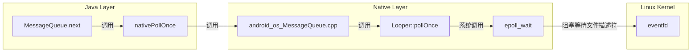
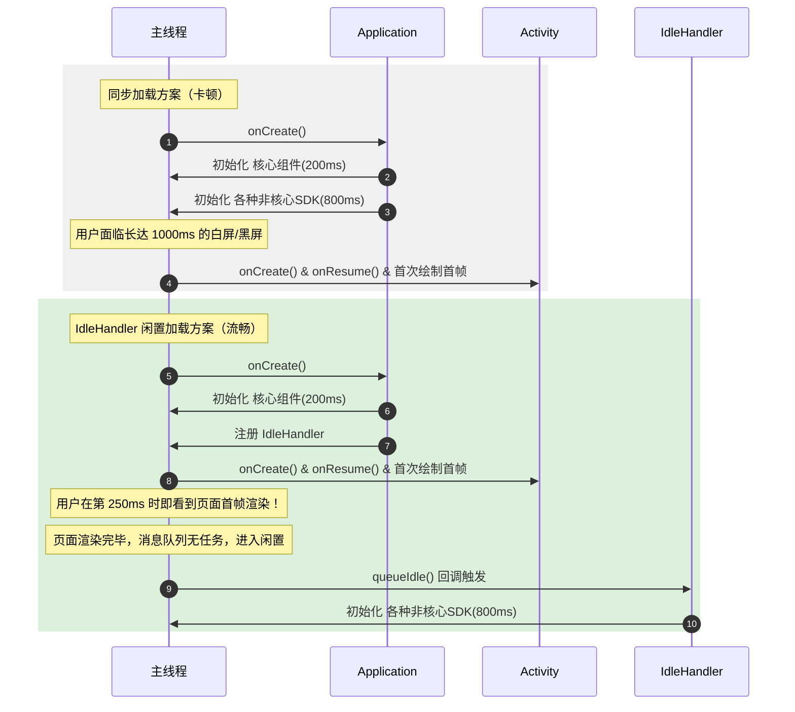

# 5.2.1.5 IdleHandler

在 Android 的消息机制中，`Handler`、`Message`、`MessageQueue` 与 `Looper` 共同构成了整个系统运行与 UI 渲染的底座。在绝大多数日常开发中，我们习惯于通过 `Handler.sendMessage()` 或 `Handler.post()` 投递任务，使之在未来的某一时刻被主线程执行。然而，当面临高精度的性能调优，例如**应用启动性能优化**、**系统资源回收**以及**主线程负载均衡**时，传统的即时消息和延迟消息往往会显得无能为力。

为了解决“在不阻塞主线程的前提下，利用主线程的闲置时间执行轻量级任务”这一诉求，Android 在 `MessageQueue` 中引入了一个非常精妙的机制——**`IdleHandler`**。

本文将从概念定义、设计哲学、底层 Native 交互、Java 源码实现、系统级应用、工程实践避坑以及现代调度机制演进等维度，深入拆解 `IdleHandler` 的核心奥秘。

---

## 核心导读与结构脑图

为了对 `IdleHandler` 的工作机制建立全局性的认知，可以通过以下思维导图快速了解其架构组成与核心链路：

```mermaid
graph TD
    Root["IdleHandler 机制"] --> A["概念与设计"]
    Root --> B["源码剖析与底层"]
    Root --> C["系统应用"]
    Root --> D["工程实践与优化"]
    Root --> E["常见避坑与误区"]
    
    A --> A1["定义：MessageQueue 内部接口"]
    A --> A2["时机：线程即将进入阻塞时"]
    A --> A3["对比：与普通 Message 的多维差异"]
    
    B --> B1["MessageQueue.next() 为入口"]
    B --> B2["pendingIdleHandlers 局部快照"]
    B --> B3["返回 true/false 控制生命周期"]
    B --> B4["底层 Native 的 epoll/eventfd 交互"]
    
    C --> C1["GcIdler：空闲时强行垃圾回收"]
    C --> C2["Idler：空闲时触发 AMS 销毁 Activity 资源"]
    
    D --> D1["启动优化：延迟初始化非核心 SDK"]
    D --> D2["预加载：空闲时预解析布局或缓存数据"]
    
    E --> E1["饿死问题：繁忙状态下无法回调"]
    E --> E2["ANR 风险：在 queueIdle 中执行耗时操作"]
    E --> E3["屏障影响：同步屏障激活时屏蔽空闲回调"]
    E --> E4["内存泄漏：隐式持有外部 Activity 强引用"]
```



---

## 一、 概念界定与设计初衷

### 1.1 什么是 IdleHandler？
`IdleHandler` 是定义在 `MessageQueue` 类内部的一个简单接口：

```java
public final class MessageQueue {
    // ...
    /**
     * Callback interface for discovering when a thread is going to block
     * waiting for more messages.
     */
    public interface IdleHandler {
        /**
         * Called when the message queue has run out of messages and will now
         * wait for more.  Return true to keep your idle handler active, false
         * to have it removed.
         */
        boolean queueIdle();
    }
    // ...
}
```

从接口文档的注释中可以看出：**`IdleHandler` 是一个当线程即将因没有更多消息而进入阻塞状态（等待新消息）时被触发的回调接口。**

它具有两个最显著的特性：
1. **执行时机**：只有在当前消息队列中已经没有立即需要执行的消息、或者队列为空、或者当前时间未达到队列中下一条消息的执行时间时，它才会被调用。
2. **生命周期由返回值决定**：其唯一的方法 `queueIdle()` 返回一个布尔值。如果返回 `true`，代表该 `IdleHandler` 在执行完毕后将继续保留在队列中，下次线程再次空闲时会重复调用；如果返回 `false`，则在执行一次后，系统自动将其从监听队列中移除。

---

### 1.2 IdleHandler 与普通 Message / Runnable 的本质区别

为了厘清 `IdleHandler` 的定位，我们可以将其与通过 `Handler.post()` 或 `Handler.sendMessage()` 发送的普通消息进行横向对比：

| 对比维度 | 普通 Message / Runnable | IdleHandler |
| :--- | :--- | :--- |
| **队列性质** | 存储于消息队列的主单链表中（按 `when` 排序）。 | 存储于独立的动态容器 `mIdleHandlers` 列表中。 |
| **抢占性** | **主动抢占型**。只要时间到了（`when <= currentTime`），无论主线程多么繁忙，它都会被插入并强行执行。 | **被动闲置型**。不具备主动抢占能力。必须等待所有即时消息分发完毕，且当前没有需要立即处理的任务时，才会获得执行机会。 |
| **时效保证** | **强时效性**。能保证在指定的延迟时间之后尽快执行（受前序任务阻塞影响，但逻辑上是即时的）。 | **无时效性**。可能在提交后立刻执行（如果队列本来就是空闲的），也可能被无限期推迟（如果主线程一直处于极度繁忙的状态）。 |
| **对 CPU 的消耗** | 会触发 `nativeWake` 强行唤醒处于 `epoll_wait` 状态的线程，产生上下文切换的开销。 | **零唤醒开销**。它自身绝对不会主动唤醒阻塞的线程，它只“寄生”在主线程正常的唤醒周期末尾。 |
| **生命周期** | 执行完毕即被废弃，由享元池回收。 | 可以通过返回 `true` 实现常驻监听，也可以返回 `false` 实现单次监听。 |

---

### 1.3 设计初衷与性能哲学

在 Android 系统中，用户对界面的流畅度（如 60 FPS / 90 FPS / 120 FPS 的刷新率）有着极其苛刻的要求。主线程每 16.6ms（对于 60Hz 屏幕）或 11.1ms（对于 90Hz 屏幕）就会收到一个来自系统的 VSync 信号以进行 UI 渲染。

假设我们有一系列非紧急任务（如：上报埋点数据、初始化非核心的三方 SDK、清理临时缓存文件等），如果直接放在 `Application.onCreate()` 或 `Activity.onCreate()` 中同步执行，会直接侵占主线程的黄金渲染时间，导致严重的**首帧绘制延迟**（即白屏时间过长），甚至诱发 **ANR（Application Not Responding）**。

#### 传统方案的局限性
很多开发者在面对耗时任务时，会尝试使用以下两种妥协方案：
1. **直接开子线程异步执行**：这看似解决了主线程卡顿问题。然而，在应用启动阶段，系统资源（CPU、I/O、内存）是极其紧张的。如果在这个时候开启大量子线程，会造成严重的 **CPU 线程争抢**。主线程即便本身任务不多，也会因为被子线程抢占了 CPU 时间片而导致运行变慢，依然会拖慢启动速度。同时，很多 SDK（比如推送、地图、排版组件等）内部包含 UI 行为或依赖特定主线程环境，强行在子线程初始化会直接触发崩溃。
2. **使用延迟发送（`postDelayed`）**：例如延迟 3 秒执行。这虽然能避开启动黄金期，但却带来两个明显的弊端：
   - **时间估算的不准确性**：3 秒是一个硬编码的经验值。在低端机上，3 秒时可能用户仍在忙碌地滑动列表，此时任务触发依然会导致卡顿；而在高端机上，可能 500 毫秒就完全处于闲置状态，剩余的 2.5 秒内主线程无所事事，CPU 资源被浪费。
   - **频繁唤醒 CPU**：为了执行这些延迟任务，Looper 必须在 3 秒后被强行唤醒。这需要通过 C++ 层的 `nativeWake`（向 eventfd 写入数据）将主线程从 `epoll_wait` 状态中唤醒。即使当时设备已经进入待机状态，这也会迫使 CPU 从低功耗状态切换回高功耗状态，增加设备的整体电量消耗。

**`IdleHandler` 的设计哲学正是“闲置即服务（Idle-as-a-Service）”**。它不关心具体的时间点，只关心线程**“忙不忙”**。它允许开发者向主线程注册一个“低优先级的寄生任务”。当主线程忙得不可开交时，它默默等待，不占用一丁点 CPU 时间；一旦主线程的消息处理完毕，准备进入休眠（阻塞在 `epoll_wait`）前，系统会通知 `IdleHandler`：“现在有空了，你可以把你的工作做了。”

这是一种极致的**拉动式调度（Pull Scheduling）**，它实现了资源的最大化利用，避免了由于猜测时间造成的体验降级。

---

## 二、 底层 Native 交互与 epoll 机制的演进

虽然 `IdleHandler` 的接口定义在 Java 层，但要完全理清它与线程阻塞/休眠的关系，必须了解 Java 层 `Looper` 之下更深层的 Linux 阻塞唤醒机制。

在 Android 中，主线程之所以能够做到“有消息时立即处理，没消息时静止休眠且不占用 CPU”，完全依赖于底层的 **Linux epoll 机制**。



### 2.1 nativePollOnce 的阻塞原理
当 `MessageQueue.next()` 发现当前没有消息需要处理，或者下一条消息是在未来的某个时间点时，它会调用 Java 层的 `nativePollOnce(ptr, timeoutMillis)`。

该方法通过 JNI 最终调用到 Native 层的 `Looper::pollOnce`。在 C++ 层，系统会调用 Linux 的系统调用 `epoll_wait`：

```cpp
// Native 层 Looper.cpp 核心逻辑示意
int Looper::pollInner(int timeoutMillis) {
    // ...
    struct epoll_event eventItems[EPOLL_MAX_EVENTS];
    // 调用 epoll_wait 阻塞线程，直至文件描述符发生变化或超时
    int eventCount = epoll_wait(mEpollFd.get(), eventItems, EPOLL_MAX_EVENTS, timeoutMillis);
    // ...
}
```

- **`timeoutMillis == -1`**：说明消息队列完全为空，线程将无限期阻塞在 `epoll_wait` 处，此时主线程释放 CPU 占有率，进入深度休眠。
- **`timeoutMillis > 0`**：说明队头有消息，但它的执行时间是在未来的某一时刻。线程将阻塞指定的毫秒数，时间一到，Linux 内核会自动将线程唤醒。
- **被主动唤醒**：当其他线程向当前队列发送消息（`sendMessage`）时，会向 `eventfd` 写入一个 64 位的整型值。这会立即使内核中监听该文件描述符的 `epoll_wait` 返回，线程被强行唤醒并继续工作。

### 2.2 Native 层唤醒机制的演进：从 Pipe 到 eventfd

底层的 Linux 阻塞唤醒通道在 Android 历史版本中经历了一次重大重构，详情可参见 [AndroidVersionChangeLog.md](file:///Users/lizhiyang/Desktop/AndroidKnowledge/AndroidVersionChangeLog.md)。

* **Android 6.0 (Marshmallow) 之前（使用 Pipe 管道）**：
  在早期版本中，Native 层的 `Looper` 内部采用 `pipe(fd)` 创建两个文件描述符（读端与写端）来完成线程的跨线程唤醒。当需要唤醒阻塞在 `epoll_wait` 读端的线程时，写端线程向管道中写入一个任意字符。
  **痛点**：每一个 Pipe 管道都会独占 2 个文件描述符（FD），且内核中需要为管道分配至少 4KB 的缓冲区。在系统资源极度宝贵（FD 数量上限一般为 1024）的情况下，这会产生不小的内存与描述符开销。
* **Android 6.0 之后（改用 eventfd）**：
  从 Android 6.0 开始，Google 将其升级为更加轻量高效的 `eventfd` 机制。`eventfd` 是 Linux 专为事件等待/通知机制设计的计数器，在内核中仅需要 1 个文件描述符，并且其数据结构仅占用 8 字节（一个 64 位的无符号整数计数器）。
  **优势**：在文件描述符资源占用上直接减半（2 -> 1），同时避免了复杂的内核缓冲区管理，让 `nativeWake` 和 `nativePollOnce` 的物理调用路径更加精炼，间接提升了 `IdleHandler` 等调度前哨站的反应灵敏度。

### 2.3 IdleHandler 位于休眠的前哨站
从执行顺序上来说，`IdleHandler` 的执行**快要调用 `epoll_wait` 阻塞的前一刻**。

也就是说，当 Java 层的 `next()` 方法发现当前没有任何可用的即时消息，准备让线程“睡觉”（调用 `nativePollOnce` 进行阻塞）之前，系统会执行最后一次盘点：**“别急着睡觉，看看有没有注册的空闲任务需要顺便解决掉？”** 

这就引出了 Java 层的核心源码逻辑。

---

## 三、 Java 层源码级机制深度剖析

我们要探寻的 Java 源码，全部集中在 `MessageQueue.java` 中。一切故事的起点和终点，都在 `MessageQueue.next()` 方法内。

### 3.1 基础容器与注册方法

在 `MessageQueue` 内部，所有注册的 `IdleHandler` 都被保存在一个普通的 `ArrayList` 中：

```java
public final class MessageQueue {
    // 保存所有注册的 IdleHandler
    private final ArrayList<IdleHandler> mIdleHandlers = new ArrayList<IdleHandler>();
    
    // 临时的局部数组，用于在 next() 中避免在同步锁内直接执行回调，防止死锁与并发修改异常
    private IdleHandler[] mPendingIdleHandlers;
    
    // ...
    
    public void addIdleHandler(@NonNull IdleHandler handler) {
        if (handler == null) {
            throw new NullPointerException("Can't add a null IdleHandler");
        }
        synchronized (this) {
            mIdleHandlers.add(handler);
        }
    }

    public void removeIdleHandler(@NonNull IdleHandler handler) {
        synchronized (this) {
            mIdleHandlers.remove(handler);
        }
    }
}
```

这里需要注意一个细节：`addIdleHandler` 和 `removeIdleHandler` 都是**线程安全**的，其内部逻辑全部包裹在 `synchronized(this)`（即对 `MessageQueue` 对象加锁）中。这意味着我们可以在任何线程中安全地为目标线程的 `MessageQueue` 动态添加或移除 `IdleHandler`。

---

### 3.2 `MessageQueue.next()` 中对 IdleHandler 的处理

下面我们来看 `next()` 核心源码中关于 `IdleHandler` 调度逻辑、同步屏障控制及时间判断的完整呈现：

```java
Message next() {
    // 如果消息循环已经退出（dispose），直接返回 null
    final long ptr = mPtr;
    if (ptr == 0) {
        return null;
    }

    // 记录待执行的 IdleHandler 数量。初始化为 -1 代表“尚未统计”
    int pendingIdleHandlerCount = -1; 
    int nextPollTimeoutMillis = 0; // 控制 epoll_wait 的超时时间
    for (;;) {
        if (nextPollTimeoutMillis != 0) {
            Binder.flushPendingCommands();
        }

        // 调用 Native 方法进行阻塞。如果 timeout 为 -1 则无限期阻塞，直到被主动唤醒
        nativePollOnce(ptr, nextPollTimeoutMillis);

        synchronized (this) {
            final long now = SystemClock.uptimeMillis();
            Message prevMsg = null;
            Message msg = mMessages;

            // 检测同步屏障（Sync Barrier）。若遇到屏障（target == null），则过滤寻找第一条异步消息执行
            if (msg != null && msg.target == null) {
                do {
                    prevMsg = msg;
                    msg = msg.next;
                } while (msg != null && !msg.isAsynchronous());
            }

            if (msg != null) {
                if (now < msg.when) {
                    // 当前消息还未到执行时间，计算需要等待的差值
                    nextPollTimeoutMillis = (int) Math.min(msg.when - now, Integer.MAX_VALUE);
                } else {
                    // 获取到一条可以立即执行的消息，将其移出队列，直接返回给 Looper
                    mBlocked = false;
                    if (prevMsg != null) {
                        prevMsg.next = msg.next;
                    } else {
                        mMessages = msg.next;
                    }
                    msg.next = null;
                    msg.markInUse();
                    return msg;
                }
            } else {
                // 队列为空，或者遇到同步屏障但无异步消息，timeout 为 -1，准备无限阻塞
                nextPollTimeoutMillis = -1;
            }

            // 如果正在退出，直接返回
            if (mQuitting) {
                dispose();
                return null;
            }

            // ==================== IdleHandler 核心处理逻辑 ====================
            
            // 确定是否需要执行 IdleHandler。
            // 必须同时满足三个前提条件：
            // 1. pendingIdleHandlerCount < 0：表明是第一次检索，防止在同一次 next() 内部由于循环导致重复执行
            // 2. 消息队列当前没有可执行消息：满足条件之一即可
            //    a) 队头 mMessages 为 null（消息队列彻底为空）
            //    b) 队头最新消息的执行时间还在未来 (now < mMessages.when)
            if (pendingIdleHandlerCount < 0
                    && (mMessages == null || now < mMessages.when)) {
                pendingIdleHandlerCount = mIdleHandlers.size();
            }

            // 如果发现根本没有注册任何 IdleHandler，则直接进入下一轮循环准备阻塞
            if (pendingIdleHandlerCount <= 0) {
                mBlocked = true;
                continue;
            }

            // 初始化临时挂起数组。为了避免重复分配，这里做了一个惰性初始化
            if (mPendingIdleHandlers == null) {
                mPendingIdleHandlers = new IdleHandler[Math.max(pendingIdleHandlerCount, 4)];
            }
            // 将真实列表中的 IdleHandler 复制到临时数组中
            mPendingIdleHandlers = mIdleHandlers.toArray(mPendingIdleHandlers);
        } // 释放锁 synchronized(this)

        // 遍历执行所有暂存的 IdleHandler
        // 注意：执行回调时已经脱离了 synchronized 锁。这是极为关键的设计！
        for (int i = 0; i < pendingIdleHandlerCount; i++) {
            final MessageQueue.IdleHandler idler = mPendingIdleHandlers[i];
            mPendingIdleHandlers[i] = null; // 释放引用，便于 GC 回收

            boolean keep = false;
            try {
                // 执行外部具体的业务逻辑，并获取返回值
                keep = idler.queueIdle();
            } catch (Throwable t) {
                Log.wtf(TAG, "IdleHandler threw exception", t);
            }

            if (!keep) {
                // 如果返回值为 false，重新获取锁，将该 handler 从核心容器中移除
                synchronized (this) {
                    mIdleHandlers.remove(idler);
                }
            }
        }

        // 重置待处理计数器为 0。
        // 这意味着在这一次 next() 唤醒中，即便下一步因为超时的原因再次循环，也不会重复触发空闲回调了。
        pendingIdleHandlerCount = 0;

        // 因为在执行 IdleHandler 期间可能耗费了时间，或者在此期间有新消息（或延迟消息）被 post 进来，
        // 因而不能马上进入阻塞状态。我们将超时时间置为 0，以便在下一轮循环中重新检查是否有新消息可立即处理。
        nextPollTimeoutMillis = 0;
    }
}
```

---

### 3.3 关键核心源码逐行精细解析

为了确保完全理解源码中的每一处转折，我们对上述 `MessageQueue.next()` 中关于 `IdleHandler` 的核心段落进行逐行拆解：

#### 【第 1 行】`if (pendingIdleHandlerCount < 0 && (mMessages == null || now < mMessages.when))`
* **`pendingIdleHandlerCount < 0`**：
  在 `next()` 方法一开始时，我们将其初始化为 `-1`。只有在当前这次检索中尚未统计过空闲任务时，这个条件才成立。这能保证一旦开始处理空闲回调（将其置为 `0` 或正整数），在主循环 `for(;;)` 的同一次唤醒运行里，即使它没有被阻塞而再次循环，也绝对不会进入该逻辑分支。
* **`mMessages == null`**：
  表明主链表完全没有消息了。这是一个最直观的“空闲”信号，此时主线程没有任何渲染任务和事件需要分发。
* **`now < mMessages.when`**：
  表明队列头部的第一个消息还没有到达执行时间（它是一个延迟消息）。这同样是一个空闲状态，因为距离执行它还有一段时间，主线程如果直接休眠也是闲着，不如在此之前先做空闲任务。
* **`mMessages` 的选择**：
  注意，这里判断的是 `mMessages`（队头原本的消息），而不是在前面检测同步屏障后过滤出来的异步消息 `msg`。这是一个极其隐蔽的底层设计。我们将在后面第四章节的“同步屏障”部分进行专门的深度推理。

#### 【第 2 行】`pendingIdleHandlerCount = mIdleHandlers.size();`
* 如果前置空闲条件成立，程序会立即抓取当前已经注册在 `mIdleHandlers` 容器中的全部 `IdleHandler` 数量。这一操作依然处于同步锁 `synchronized(this)` 内部，因此获取到的数量是绝对线程安全的。

#### 【第 3 行】`if (pendingIdleHandlerCount <= 0)`
* **`mBlocked = true; continue;`**：
  如果在刚才的计数中发现没有任何空闲回调被注册，说明线程真的不需要做任何空闲工作。此时它将 `mBlocked` 标志位设为 `true`（这会告诉外部的监测器，当前主线程已经进入阻塞状态），然后直接调用 `continue` 放弃后面的步骤，跳回循环顶部，进入 `nativePollOnce` 深度休眠。

#### 【第 4 行】`if (mPendingIdleHandlers == null) { mPendingIdleHandlers = new IdleHandler[Math.max(pendingIdleHandlerCount, 4)]; }`
* **惰性分配与内存复用**：
  这里使用了成员变量 `mPendingIdleHandlers` 来暂存即将运行的回调。通过 `Math.max(pendingIdleHandlerCount, 4)` 确保即使这次只有 1 个空闲任务，我们也直接分配一个大小为 4 的数组。下次如果是 3 个任务，可以直接复用这个已分配的数组，避免高频创建数组引发 GC。只有当注册数量超过 4 时，它才会根据实际需要建立一个更大的新数组，并将引用替换，这体现了极高水准的内存复用哲学。

#### 【第 5 行】`mPendingIdleHandlers = mIdleHandlers.toArray(mPendingIdleHandlers);`
* **锁定状态下的快照拷贝**：
  我们通过 `toArray` 方法，将核心列表 `mIdleHandlers` 中的每一个回调实例拷贝到我们刚刚分配好的 `mPendingIdleHandlers` 数组中。这一步还在 `synchronized(this)` 锁内，它完成了“状态快照”的拍摄。一旦完成拷贝，即便后面在锁外对 `mIdleHandlers` 进行增加或删除，也不会对这轮遍历产生影响，规避了并发异常。

#### 【第 6 行】`} // 释放锁`
* **退出 synchronized 临界区**：
  这是一个极度关键的设计决策。在这个大括号之后，我们正式释放了对 `MessageQueue` 实例的同步锁。后续所有的外部业务代码执行，都发生在这个锁的范围之外。这也是 Android 主线程能保持并发活性的根本保证。

#### 【第 7 行】`for (int i = 0; i < pendingIdleHandlerCount; i++) {`
* **锁外安全遍历**：
  我们开始对刚刚在锁内拷贝出来的 `mPendingIdleHandlers` 临时数组进行高速遍历。此时由于没有锁，其他线程随时可以通过 `addIdleHandler` 向 `mIdleHandlers` 写入新数据，但这不会打扰我们当前对老快照的执行。

#### 【第 8 行】`final MessageQueue.IdleHandler idler = mPendingIdleHandlers[i];`
* **提取回调实例并解除引用**：
  `mPendingIdleHandlers[i] = null;` 这句代码非常重要。它将数组当前位置上的强引用及时清除置为 `null`。如果不进行清除，在这一轮空闲回调执行完毕后，这个长生命周期的成员变量数组依然会死死抓着刚才那些 `IdleHandler` 的引用，如果这些 `IdleHandler` 是匿名内部类，就会直接导致它们所依附的 Activity 无法被 GC 回收，产生无意的内存泄漏。

#### 【第 9 行】`keep = idler.queueIdle();`
* **运行核心业务代码**：
  调用我们在 Java 层重写的 `queueIdle()` 方法。为了避免外部糟糕的业务实现抛出异常导致整个主线程崩溃（崩溃会直接让应用死掉），系统用了一个 `try-catch(Throwable t)` 块将其包围。一旦发生异常，系统会调用 `Log.wtf`（What a Terrible Failure）打印一条极高等级的错误日志，但仍会坚持运行完剩余的空闲任务，保证主线程的生命延续。

#### 【第 10 行】`if (!keep) { synchronized (this) { mIdleHandlers.remove(idler); } }`
* **生命周期清退**：
  如果我们的 `queueIdle()` 返回了 `false`，说明这是一个“一次性任务”。系统会重新获取 `synchronized` 锁，将这个具体的实例从核心容器 `mIdleHandlers` 中移除。如果返回了 `true`，则什么也不做，任由它留在容器里，等待下一次空闲的降临。

#### 【第 11 行】`pendingIdleHandlerCount = 0;`
* **阻断死循环**：
  将临时计数器归零。因为在执行这一堆空闲任务的过程中，它们本身的运行需要耗费不少时间。一旦循环完毕，程序重新返回到 `for(;;)` 顶端，并在 `nativePollOnce(ptr, 0)` 时因为不阻塞而瞬间返回。重新获取锁后，如果依然没有任何新消息，此时由于 `pendingIdleHandlerCount` 被置为了 `0`（而不是最初的 `-1`），程序将**无法**再次满足第 1 行的 `pendingIdleHandlerCount < 0` 判定条件，这就完美地绕过了 `IdleHandler` 的重复执行，直接进入 `mBlocked = true` 并阻塞在下一次 `nativePollOnce` 处，优雅地避免了 CPU 空转。

#### 【第 12 行】`nextPollTimeoutMillis = 0;`
* **超时重置**：
  因为执行空闲任务时耗费了时间，在这一小段空闲期内，可能有新的即时消息已经加入到队列中，或者原本还没到时间的延迟消息现在已经到了运行时间。我们强制将下一次 Native 阻塞的超时时间置为 `0`，使得下一轮循环能立刻对整个消息队列进行一次无阻塞的高速盘点，确保了即时消息的高响应度。

---

## 四、 深度探究：同步屏障激活时的 IdleHandler 物理模型

这是 Android 底层调度设计中一个极少被深入剖析的细节：**同步屏障（Synchronous Barrier）状态下，`IdleHandler` 的执行边界到底在哪里？**

我们先回顾同步屏障的基本定义：当消息队列的队头是一条 `target == null` 的消息时，此消息即为“同步屏障”。一旦该屏障被激活，所有的**普通同步消息（Synchronous Message）**都将被完全屏蔽，只有**异步消息（Asynchronous Message）**才被允许过滤出来执行。

### 4.1 物理场景分析

假设发生以下极限情况：
- 消息队列中存在大量的普通同步消息（排在后面，尚未执行）。
- 队头被插入了一个同步屏障（例如，触发了屏幕刷新，Choreographer 发送了绘制请求，但 VSync 信号还在等待中）。
- 队列中此时**没有**任何异步消息，或者仅有的一条异步消息被设在 5000 毫秒后执行。

此时，主线程因为同步屏障的封锁，无法执行任何同步消息，只能阻塞。那么，在这个长达 5000 毫秒的空窗期内，**主线程是否被认定为“空闲”？`IdleHandler` 会触发吗？**

让我们回到判定代码的核心：
```java
if (pendingIdleHandlerCount < 0
        && (mMessages == null || now < mMessages.when)) {
    pendingIdleHandlerCount = mIdleHandlers.size();
}
```

- **`mMessages`** 指向当前队列的头部。由于队列中存在同步屏障，`mMessages` 指向的正是这条同步屏障消息本身。
- 同步屏障消息在被 post 时，其 `when` 通常被设定为 `SystemClock.uptimeMillis()`（即当前时间）。
- 因此，`mMessages != null` 成立，且 `now < mMessages.when`（当前时间小于屏障时间）**不成立**（因为当前时间 `now` 显然大等于屏障时间）。
- **判定结果**：这个 `if` 条件**不成立**！`pendingIdleHandlerCount` 保持为 `-1`！
- **最终后果**：跳过所有 `IdleHandler` 的执行，将 `nextPollTimeoutMillis` 置为 `-1`，主线程直接通过 `nativePollOnce(ptr, -1)` 进入**永久休眠**。

### 4.2 深度设计哲学

这个看似不合理的逻辑，其实隐藏着系统级渲染防卡顿的极高智慧。

为什么在同步屏障阻断期间，即便主线程处于静止状态，系统也不允许触发 `IdleHandler`？

```
时间轴 -------------------------------------------------------->
[同步屏障激活] ───────────────────────────> [VSync 信号抵达/绘制开始]
      │                                         ▲
      │             (这期间禁止触发 IdleHandler) │
      └─────────────────────────────────────────┘
```

1. **规避 UI 渲染延迟**：同步屏障的设立，代表系统已经进入了“UI 准备更新”的紧急临界状态（例如用户正在触摸屏幕、或者正在准备进行动画的第一帧计算）。虽然这一毫秒内还没有异步消息（绘制任务）执行，但它可能在未来的 1 毫秒或 2 毫秒内随时会通过 Binder 被注入到队列中。
2. **防范空闲任务超时**：如果系统在这个空窗期触发了 `IdleHandler`，而 `IdleHandler` 内部的任务执行了 30 毫秒。在这 30 毫秒期间，即使 VSync 信号抵达、绘制的异步消息被 post 进来，主线程也会被该空闲任务死死卡住。这直接导致新 Activity 的首帧延迟或者动画掉帧。
3. **安全避让**：因此，系统宁可让主线程完全静止休眠，也绝对不允许任何低优先级的 `IdleHandler` 在同步屏障激活的敏感时期抢占 CPU。这是一种对 UI 渲染流畅度的“绝对倾斜”。

---

### 4.3 消息队列物理状态转移完全矩阵

为了清晰对比各种运行状态下，底层的超时时间、阻塞标记及 `IdleHandler` 状态的转移规律，我们整理出以下状态转移完全矩阵：

| 队列初始物理状态 | `nextPollTimeoutMillis` 设定值 | `mBlocked` 标志位 | `IdleHandler` 是否被触发 | 线程调度状态与物理行为 |
| :--- | :--- | :--- | :--- | :--- |
| **队列彻底为空** (即 `mMessages == null`) | 先设为 `-1` | 被置为 `false` (触发后置为 `true`) | **是** | 触发空闲回调。执行完毕后，因 `timeout` 被重置为 `0`，先快速进行无阻塞轮询，若仍无新消息则进入 `-1` 永久休眠。 |
| **队头为即时消息** (`now >= when`) | 设为 `0` (立即分发) | 被置为 `false` | **否** | 立即跳过空闲处理，将消息出队并返回给 `Looper` 执行，线程继续高速运转。 |
| **队头为延迟消息** (`now < when`) | 设为 `when - now` 毫秒差值 | 被置为 `false` (触发后置为 `true`) | **是** | 触发空闲回调。执行完毕后因 `timeout = 0` 快速重新检查。若仍无新消息，阻塞指定时间后自动唤醒。 |
| **屏障激活，无异步消息** | 先设为 `-1` | 被置为 `false` | **否** | **跳过空闲**。系统不认为此时处于安全空闲状态。线程不分发任务，直接进入 `-1` 永久休眠。 |
| **屏障激活，且异步消息延迟** | 设为 `asyncMsg.when - now` | 被置为 `false` | **否** | **跳过空闲**。线程同样直接开始休眠，直到时间到达该异步消息的 `when` 或被外界主动唤醒。 |

---

## 五、 系统级应用与源码剖析

由于 `IdleHandler` 优秀的“拉动式”调度特性，Android 源码自身就在大量核心机制中使用了它。通过阅读系统源码，我们能学到最地道的性能优化方案。

### 5.1 系统级典型应用 1：`GcIdler` 垃圾回收时机

内存回收（GC）是一项高CPU消耗、甚至可能导致短暂 STW（Stop-The-World）的操作。如果在用户滑动列表或者点击按钮的瞬间触发 GC，极易导致主线程掉帧。

Android 系统为了在主线程闲置时进行主动内存清理，在 `ActivityThread.java` 中设计了一个 `GcIdler`：

```java
// ActivityThread.java 源码
final class GcIdler implements MessageQueue.IdleHandler {
    @Override
    public boolean queueIdle() {
        // 当主线程空闲时，触发强制垃圾回收
        doGcIfNeeded();
        // 返回 false，代表执行一次后就自动从 MessageQueue 中注销
        return false;
    }
}

void doGcIfNeeded() {
    mGcIdlerScheduled = false;
    final GcWatcher watcher = mGcWatcher;
    if (watcher != null) {
        // 调用 native 层或 Runtime 执行强力回收
        BinderInternal.forceGc("system");
    }
}
```

#### 它是如何被调度的？
当应用程序的生命周期发生重大变化（如 Activity 完成了绘制并显示出来、或者退到了后台），`ActivityThread` 会在其内部的 `H`（一个专门的 Handler）中收到一些事务指令。当这些指令处理完毕，主线程即将空闲时，`ActivityThread` 就会动态地将 `GcIdler` 添加到 `MessageQueue` 中：

```java
void scheduleGcIdler() {
    if (!mGcIdlerScheduled) {
        mGcIdlerScheduled = true;
        // 添加到当前主线程的 MessageQueue 中
        Looper.myQueue().addIdleHandler(mGcIdler);
    }
}
```
这样，系统系统能保证 GC 操作**只在用户停止操作、界面渲染完毕、主线程彻底闲下来的时候**才安静地执行，最大程度地规避了 GC 造成的应用运行卡顿。

---

### 5.2 系统级典型应用 2：`Idler` 与 Activity 的资源释放

在 Android 的 Activity 启动与切换流程中，旧 Activity 的 `onStop()` 并不是由 AMS（Activity Manager Service）同步触发的。如果同步触发，新 Activity 必须等待旧 Activity 复杂的 `onStop()` 甚至资源销毁完毕后才能显示，这会极大延缓新页面的展现。

为了解决这个问题，Android 系统将 Activity 切换后的资源清理和生命周期收尾工作，交给了 `IdleHandler`。在 `ActivityThread` 中有一个名为 `Idler` 的内部类：

```java
// ActivityThread.java 中的 Idler 源码
private class Idler implements MessageQueue.IdleHandler {
    @Override
    public boolean queueIdle() {
        ActivityClientRecord a = mNewActivities;
        boolean stopProfiling = false;
        if (mBoundApplication != null && mProfiler.profileFd != null
                && mProfiler.autoStopProfiler) {
            stopProfiling = true;
        }
        if (a != null) {
            mNewActivities = null;
            IActivityTaskManager am = ActivityTaskManager.getService();
            ActivityClientRecord prev;
            do {
                if (a.activity != null && !a.activity.mFinished) {
                    try {
                        // 1. 报告 ActivityTaskManagerService：当前主线程已经闲置了
                        am.activityIdle(a.token, a.createdConfig, stopProfiling);
                        a.createdConfig = null;
                    } catch (RemoteException ex) {
                        throw ex.rethrowFromSystemServer();
                    }
                }
                prev = a;
                a = a.nextIdle;
                prev.nextIdle = null;
            } while (a != null);
        }
        // ...
        return false;
    }
}
```

#### 核心运转链路：
1. 当一个新 Activity 被创建、测量、布局并首次绘制（Resume）完毕后，主线程会向自身的 `MessageQueue` 注册一个 `Idler`。
2. 一旦主线程完成了首帧的全部绘制，消息队列中没有其他紧迫任务时，`Idler.queueIdle()` 被触发。
3. 它通过 Binder 跨进程向系统服务汇报 `activityIdle()`。
4. AMS 收到通知后，得知主线程已经安全、流畅地完成了新界面的绘制，此时才会开始调度后台服务去执行旧 Activity 的 `onStop()`，甚至销毁不再需要的旧 Activity 实例。
5. 这个机制完美地保障了**新页面的流畅渲染与展示拥有绝对的最高优先级**，而资源清理等重度操作则“退避”到闲置时执行。

---

## 六、 物理调度理论：Linux CFS 调度器与 cgroups 的交互

尽管 `IdleHandler` 是在主线程的空闲点调度的，但我们要意识到，其执行速度与物理 CPU 的主频、线程本身的调度组（Scheduling Group）具有深刻的关系。

在 Android 操作系统中，线程并不是生而平等的。底层 Linux 内核使用 **CFS（Completely Fair Scheduler）** 进行 CPU 时间片的分配，同时通过 Android 框架层与 Linux **cgroups**（控制组）进行交互，划分了不同的调度优先级组：

* **前台线程组 (Foreground group)**：包含主线程（UI Thread）和 RenderThread，拥有极大的 CPU 优先权，且能够绑定到 CPU 的“大核”或“超大核”上运行。
* **后台线程组 (Background group)**：包含大量的子线程或线程池，其 CPU 使用量通常被严格限制在 5%~10% 以内，并且往往被强行调度到 CPU 的“小核”运行。

### 6.1 cgroups 对 IdleHandler 的间接物理限制
由于 `IdleHandler` 执行在主线程（属于前台线程组），因此即便它被拖延到了“空闲时”才运行，它一旦运行起来，依然享有**前台大核的高频计算能力**。

这是 `IdleHandler` 优于“直接开低优先级子线程初始化”的又一个隐性物理优势：
- 如果我们将一个耗时 40ms 的 SDK 初始化放在**后台低优先级子线程**，由于被 cgroups 限制在小核，这 40ms 的任务物理上可能被拉长到 **150ms** 甚至 **200ms**，在这漫长的时间内，由于锁争抢或 Binder 通信，主线程依然可能被间接卡死。
- 而将同样的任务放在主线程的 `IdleHandler` 中，主线程在闲置时使用超大核高频运行，可能仅需 **15ms** 就能顺滑执行完毕，完成了极高吞吐量的处理。

---

## 七、 线上 APM 监控设计与隐藏 API 限制规避

在大型商业项目中，为了防止开发人员在不经意间提交了恶劣的耗时 `IdleHandler` 到主线程，我们需要在应用中建立**线上 APM（Application Performance Monitoring）性能监控机制**。

### 7.1 反射代理监控方案

由于 `mIdleHandlers` 容器是 `MessageQueue` 类中的私有成员变量，我们可以通过反射获取该变量，并用一个包装过的、带有性能统计功能的代理 `ArrayList` 来替换它，从而实现线上监控。

```java
public class IdleHandlerMonitor {
    private static final String TAG = "IdleHandlerMonitor";
    private static final long WARN_THRESHOLD_MS = 16; // 耗时超过一帧即报警

    public static void start() {
        try {
            MessageQueue queue = Looper.myQueue();
            Field field = MessageQueue.class.getDeclaredField("mIdleHandlers");
            field.setAccessible(true);

            // 1. 备份原有的真实容器
            final ArrayList<MessageQueue.IdleHandler> originList = 
                (ArrayList<MessageQueue.IdleHandler>) field.get(queue);

            // 2. 注入我们自定义的代理容器
            field.set(queue, new ArrayList<MessageQueue.IdleHandler>(originList) {
                @Override
                public boolean add(MessageQueue.IdleHandler handler) {
                    if (handler == null) return false;
                    // 包装成带有耗时监控的代理实例
                    return super.add(new MonitoredIdleHandler(handler));
                }

                @Override
                public boolean remove(Object o) {
                    if (o instanceof MonitoredIdleHandler) {
                        return super.remove(o);
                    }
                    // 遍历寻找原包装实例进行移除
                    for (int i = 0; i < size(); i++) {
                        MessageQueue.IdleHandler item = get(i);
                        if (item instanceof MonitoredIdleHandler 
                            && ((MonitoredIdleHandler) item).delegate == o) {
                            return super.remove(item);
                        }
                    }
                    return super.remove(o);
                }
            });
            Log.i(TAG, "IdleHandler APM Monitor started successfully.");
        } catch (Exception e) {
            Log.e(TAG, "Failed to inject IdleHandler Monitor", e);
        }
    }

    private static class MonitoredIdleHandler implements MessageQueue.IdleHandler {
        private final MessageQueue.IdleHandler delegate;

        public MonitoredIdleHandler(MessageQueue.IdleHandler delegate) {
            this.delegate = delegate;
        }

        @Override
        public boolean queueIdle() {
            long startTime = SystemClock.uptimeMillis();
            boolean keep = false;
            try {
                // 运行真实的回调
                keep = delegate.queueIdle();
            } finally {
                long cost = SystemClock.uptimeMillis() - startTime;
                if (cost > WARN_THRESHOLD_MS) {
                    // 线上 APM 可以将该信息上报到监控后台，包含具体的类名与耗时
                    Log.w(TAG, String.format("WARNING: IdleHandler [%s] took %d ms! Blocks rendering!",
                        delegate.getClass().getName(), cost));
                }
            }
            return keep;
        }
    }
}
```

### 7.2 隐藏 API 限制避坑（Android 9+ / P 适配）

在 Android 9 (Pie) 及更高的版本中，系统引入了非公开 API（即“深灰名单”和“黑名单”里的私有反射字段）的调用限制。如果直接使用上述反射去修改 `MessageQueue.mIdleHandlers`，在 Android 9 之后的机型上会直接抛出 `NoSuchFieldException`。

详细的隐藏 API 版本演进记录，可以参阅 [AndroidVersionChangeLog.md](file:///Users/lizhiyang/Desktop/AndroidKnowledge/AndroidVersionChangeLog.md)。

#### 避坑对策：
1. **使用双反射绕过限制（“元反射”方案）**：
   在 Android 9 之后，如果我们直接在当前上下文反射系统私有变量，会遭遇系统的 `ReflectionGuard` 拦截。但是，如果我们通过“反射 `Class.getDeclaredField` 本身”来获取私有属性，便能绕过系统的安全检测（这在业内被称为“元反射”或“双重反射”技术）。
2. **线上 APM 兜底**：
   在反射前，必须捕获一切 `Throwable` 异常，并在 Android 9+ 上检测是否有 `BootstrapClass` 豁免权。如果无法反射成功，则平滑降级，切勿引发应用线上 Crash。

---

## 八、 Systrace / Perfetto 性能度量与硬掉帧诊断

在线下对应用进行调优时，我们要学会利用系统的性能度量工具去直观观测 `IdleHandler` 的足迹。

### 8.1 systrace 代码埋点
我们可以在每个 `IdleHandler` 的执行边界加上 `Trace` 标签：

```kotlin
class TracerIdleHandler(private val delegate: MessageQueue.IdleHandler) : MessageQueue.IdleHandler {
    override fun queueIdle(): Boolean {
        // 利用 Systrace 标签包裹，可在 Perfetto 页面中展现耗时条
        Trace.beginSection("IdleHandler_${delegate.javaClass.simpleName}")
        try {
            return delegate.queueIdle()
        } finally {
            Trace.endSection()
        }
    }
}
```

### 8.2 在 Perfetto / Systrace 中的现象分析
当我们在生成的性能跟踪图（Perfetto Trace View）中查看主线程的 Slice 状态时，如果发现主线程有一块名为 `Choreographer#doFrame` 的渲染切片与随后的 `IdleHandler_MyTask` 产生了重叠：

```
主线程 CPU 切片状态图 (Systrace)

[Choreographer#doFrame] ────> [deliverInput] ───> [epoll_wait (休眠)]
                                                  ▲
                                        (本该在此处休眠)
                                        [IdleHandler_MyTask] (卡主线程 40ms)
                                        └──────────────────┘
```

- **硬掉帧（Hard Junk）诊断**：
  如果这个 `IdleHandler_MyTask` 耗时达到了 40ms，虽然它开始执行时确实是“空闲的”，但是在这个 40ms 期间，VSync 渲染脉冲刚好到达，或者用户正在疯狂滑动屏幕。主线程因为正卡在这个空闲任务中，无法在 16.6ms 内及时响应 `doFrame` 消息。这会导致主线程排在后面的重绘请求严重推迟，在 Systrace 上表现为一帧直接被拉长到 3 帧，这就是由于 `IdleHandler` 过于沉重导致的典型“硬掉帧（Junk）”现象。

通过 Systrace，我们能迅速揪出到底是哪一个 `IdleHandler` 假借“空闲执行”的名义，实则暗中阻塞了整个渲染循环。

---

## 九、 工程实践与优化案例

除了系统内部的使用，`IdleHandler` 也是我们进行应用性能优化的利器。以下是两个典型的工程实践案例。

### 9.1 工程实践 1：应用启动优化（App Startup Optimization）

在商业项目的开发中，启动优化是重中之重。通常在 `Application.onCreate()` 中，会有多达十几个甚至几十个 SDK 等待初始化（如：推送 SDK、分享 SDK、高德地图 SDK、调试工具 Stetho、各种性能监控组件等）。

按照传统的方案，我们要么直接同步初始化，要么使用异步线程。但许多 SDK 的初始化必须运行在主线程。

此时，**使用 `IdleHandler` 进行延迟加载**是极其地道的手段。

#### 启动优化时序图

我们可以通过以下时序图对比**同步加载**与**基于 IdleHandler 的闲置加载**在主线程时间分配上的巨大差异：



#### 工程实战代码模板：
```kotlin
class MyApplication : Application() {

    override fun onCreate() {
        super.onCreate()
        
        // 1. 立即初始化核心基础组件（如崩溃日志收集、核心网络底座）
        initEssentialComponents()

        // 2. 将非核心、但必须在主线程执行的 SDK 延迟到闲置时加载
        Looper.myQueue().addIdleHandler(object : MessageQueue.IdleHandler {
            override fun queueIdle(): Boolean {
                // 执行延迟初始化
                initNonEssentialSDKs()
                
                // 返回 false，代表执行一次后立即注销，防止重复初始化
                return false
            }
        })
    }

    private fun initEssentialComponents() {
        // CrashReport.init(...)
    }

    private fun initNonEssentialSDKs() {
        // MapSDK.initialize(this)
        // PushSDK.register(...)
        // FeedbackSDK.init(...)
    }
}
```

---

### 9.2 工程实践 2：View 的预解析（Pre-inflation）与数据预缓存

在一些复杂的滑动列表（如 Feeds 流）中，Item 的布局结构极其复杂，其中包含了大量的嵌套层级和自定义控件。当滑动列表快速滑过时，主线程需要实时调用 `LayoutInflater.inflate()` 去解析 XML 并创建 View 实例。这个解析过程涉及到 I/O 读取和 XML 的反射解析，极易导致列表瞬间掉帧。

#### 优化思路：
利用 `IdleHandler`，在用户不滑动列表、主线程彻底闲置时，**提前在后台或主线程缓存几个已经解析好的 View 实例**。当 `RecyclerView.Adapter` 需要创建 `ViewHolder` 时，直接从空闲缓存中取出 View，从而实现“零等待”加载。

```kotlin
class ViewCacheGroup(private val context: Context) {
    private val mCacheQueue = LinkedList<View>()
    private val maxCacheSize = 3

    init {
        // 注册空闲监听
        Looper.myQueue().addIdleHandler {
            if (mCacheQueue.size < maxCacheSize) {
                // 闲置时，预先 inflate 复杂布局
                val view = LayoutInflater.from(context).inflate(R.layout.item_complex_feed, null, false)
                mCacheQueue.add(view)
            }
            // 返回 true，保持监听。只要队列空闲，且缓存数量未达上限，就不断补充
            true
        }
    }

    fun obtainPreInflatedView(): View? {
        return if (mCacheQueue.isNotEmpty()) {
            mCacheQueue.poll()
        } else {
            null // 缓存未就绪，降级为实时创建
        }
    }
}
```

---

## 十、 常见误区与避坑指南

尽管 `IdleHandler` 非常好用，但如果理解不够深入，极其容易在生产环境中写出引发灾难性后果的代码。以下是四大经典大坑及解决方案：

### 10.1 致命大坑 1：“饿死”问题（Starvation）—— IdleHandler 真的能保证一定会执行吗？

这是关于 `IdleHandler` 最经典的误区。很多开发者理所当然地认为，注册了 `IdleHandler`，它在未来的某个空闲时刻“必定”会执行。

**答案是：如果主线程持续处于繁忙状态，`IdleHandler` 将永远不会被执行，这被称为“线程饥饿（Starvation）”。**

#### 导致“饿死”的典型场景：
1. **高频绘制动画**：如果应用界面上正在播放一个无限循环的属性动画（Lottie、ValueAnimator），或者有一个自定义 View 正在以 60 FPS / 120 FPS 的频率不断地调用 `invalidate()` 进行重绘。
2. **频繁的消息循环**：当应用后台有一个定时器（如后台 Socket 心跳、高频传感器数据轮询），每隔 100 毫秒就通过 `Handler` 向主线程发送一个消息。
3. **Choreographer 密集回调**：连续的手势滑动、列表惯性滚动（Fling）。

在上述场景下，`MessageQueue.next()` 永远能拿到可立即执行的消息，`nextPollTimeoutMillis` 永远为 0 且每次都会在同步块中取出消息直接返回。主线程的消息队列从不曾“空闲”，所以 `IdleHandler` 的回调完全被屏蔽了。

#### 灾难后果：
如果开发者将某些“必须执行”的初始化逻辑（如：决定用户能否进入主页的安全认证 SDK 初始化、核心配置数据拉取）放在了 `IdleHandler` 中，一旦遇到上述繁忙场景，该初始化将无限延期，表现为应用功能完全失效。

#### 破局策略：超时保底机制（SafeIdleHandler）
为了应对这一隐患，最地道的解决方案是：**设计一个带“超时保底”功能的封装类。如果在指定时间内（如 5 秒）主线程一直没有闲置，则强行通过普通的 Handler 消息把该任务执行掉。**

```kotlin
class SafeIdleHandler(
    private val timeoutMillis: Long = 5000L,
    private val task: () -> Unit
) : MessageQueue.IdleHandler, Runnable {

    private val handler = Handler(Looper.getMainLooper())
    private var isExecuted = false

    fun start() {
        // 1. 同时注册 IdleHandler 监听
        Looper.myQueue().addIdleHandler(this)
        // 2. 发送一个延迟的保底消息
        handler.postDelayed(this, timeoutMillis)
    }

    // IdleHandler 的回调
    override fun queueIdle(): Boolean {
        execute()
        // 返回 false，执行一次后自动从 MessageQueue 移除
        return false
    }

    // Runnable 的回调（超时保底）
    override fun run() {
        execute()
    }

    @Synchronized
    private fun execute() {
        if (!isExecuted) {
            isExecuted = true
            // 3. 执行核心业务逻辑
            task()
            
            // 4. 清理工作：双向注销，防止重复执行
            handler.removeCallbacks(this)
            Looper.myQueue().removeIdleHandler(this)
        }
    }
}

// 使用示例
SafeIdleHandler(timeoutMillis = 4000L) {
    // 必须要执行的非紧急初始化任务
    initTelemetrySDK()
}.start()
```

---

### 10.2 致命大坑 2：在 `queueIdle()` 中执行耗时或阻塞操作

有的开发者认为：“既然当前主线程闲下来了，那我就可以在 `queueIdle()` 里干点重活，比如读个数据库、写个 SharePreferences、网络请求的同步解析等。”

**这是极其危险的错误！**

`queueIdle()` 依然是运行在 **`Looper` 所在的线程（通常为主线程）**。
- 如果在 `queueIdle()` 中执行了耗时 200 毫秒的操作，那么在这 200 毫秒期间，主线程是处于**无响应**状态的。
- 此时如果用户突然用手指点击了屏幕，或者系统发来了一个重要的 VSync 信号，这些十万火急的消息只能默默地排在 `MessageQueue` 中，眼睁睁地看着主线程被你的 `queueIdle()` 卡死。
- 这不仅会产生肉眼可见的剧烈卡顿，如果耗时超过 5 秒，依然会触发 **ANR**。

#### 避坑准则：
- `IdleHandler` 中只能执行轻量级的任务。
- 如果确实有重度逻辑需要在空闲时做，应将 `queueIdle()` 当作一个**“触发信号”**，在其内部将重度任务投递给**子线程或协程池去执行**。

---

### 10.3 内存泄漏隐患

当你在 `Activity` 或 `Fragment` 中注册一个返回 `true` 的常驻 `IdleHandler` 时，如果你使用的是匿名内部类或者非静态内部类，它会**隐式持有外部类（Activity）的强引用**。

因为该 `IdleHandler` 返回了 `true`，它会一直常驻在 `MessageQueue`（由 `Looper` 间接持有，其生命周期等同于当前线程）中。
如果你的 Activity 已经被销毁了，但这个 `IdleHandler` 依然活在主线程的消息队列里，这就形成了一条完美的泄漏链路：
`Looper` -> `MessageQueue` -> `mIdleHandlers` -> `IdleHandler 匿名内部类` -> `Activity`。

#### 正确的做法示范（静态内部类 + 弱引用）：
```kotlin
class MyActivity : AppCompatActivity() {

    private val myIdleHandler = MyWeakIdleHandler(this)

    override fun onCreate(savedInstanceState: Bundle?) {
        super.onCreate(savedInstanceState)
        setContentView(R.layout.activity_main)
        
        Looper.myQueue().addIdleHandler(myIdleHandler)
    }

    override fun onDestroy() {
        super.onDestroy()
        // 显式手动移除，双重保险，防止泄漏
        Looper.myQueue().removeIdleHandler(myIdleHandler)
    }

    // 静态内部类，切断对 Activity 的直接强引用隐式持有
    private class MyWeakIdleHandler(activity: MyActivity) : MessageQueue.IdleHandler {
        private val weakActivity = WeakReference(activity)

        override fun queueIdle(): Boolean {
            val act = weakActivity.get()
            if (act != null && !act.isFinishing) {
                // 执行空闲任务
                act.performIdleTask()
            }
            // 返回 false 代表单次触发，不再常驻
            return false
        }
    }

    private fun performIdleTask() {
        // ...
    }
}
```

---

## 十一、 IdleHandler 与现代 Android 调度的演进

随着 Android 开发生态的繁荣，Google 官方相继推出了 Jetpack 家族中的一系列组件（如 Jetpack App Startup, WorkManager, Kotlin 协程），这使得底层的 `IdleHandler` 角色在一定程度上发生了转变。

### 11.1 与现代组件的多维对比

| 调度方案 | 适用场景 | 线程属性 | 触发时机特征 | 超时/依赖控制 |
| :--- | :--- | :--- | :--- | :--- |
| **IdleHandler** | 线程内空闲时调度的轻量任务。 | 属于 `Looper` 所在的特定单线程。 | 完全依赖该线程 of 空闲状态，无强时效性。 | 无内置超时，无依赖图支持（需自行封装）。 |
| **Jetpack App Startup** | 统一各 SDK 的初始化逻辑，简化 ContentProvider。 | 默认主线程，亦可配置后台线程。 | 应用启动时立刻顺序执行。 | 强依赖图（可指定 A 必须在 B 之后加载），无闲置调度能力。 |
| **WorkManager** | 跨进程、长生命周期、且必须保证可靠执行的后台任务。 | 后台线程池。 | 满足特定约束（如有网、充电、空闲状态等）时执行。 | 适合系统级空闲（Device Idle - Doze 模式），而非主线程空闲。 |
| **Kotlin 协程** | 轻量级异步并发、线程切换。 | 协程上下文指定的调度器。 | 可使用 `yield()` 主动让出 CPU，或通过时间片轮转。 | 与主线程的 Looper 空闲机制无天然挂钩。 |

---

### 11.2 深度设计：基于协程的 Idle 调度器

在现代的 Android 开发中，Kotlin 协程（Coroutines）已经成为了多线程并发和异步任务处理的事实标准。既然如此，我们能不能把 `IdleHandler` 的“闲置触发”思想与“协程的轻量级调度”结合起来？

我们可以通过自定义一个协程调度器（`CoroutineDispatcher`），让特定的协程任务完全在主线程空闲时被驱动运行。

#### 自定义 `IdleDispatcher` 完整实现：
```kotlin
import kotlinx.coroutines.CoroutineDispatcher
import kotlinx.coroutines.Runnable
import android.os.Looper
import android.os.MessageQueue
import java.util.concurrent.ConcurrentLinkedQueue
import kotlin.coroutines.CoroutineContext

/**
 * 自定义主线程闲置协程调度器
 */
object Dispatchers : CoroutineDispatcher() {
    private val mainLooper = Looper.getMainLooper()
    private val taskQueue = ConcurrentLinkedQueue<Runnable>()
    
    // 监听主线程的空闲状态
    private val idleHandler = MessageQueue.IdleHandler {
        // 1. 当主线程闲置时，从队列中取出一个协程任务执行
        val task = taskQueue.poll()
        task?.run()
        
        // 2. 如果任务队列中依然有任务，返回 true 以保持在空闲队列中继续等待下次触发
        // 如果队列为空，则返回 false 注销自身以释放开销
        val hasMore = !taskQueue.isEmpty()
        hasMore
    }

    override fun dispatch(context: CoroutineContext, block: Runnable) {
        // 将协程投递进队列
        taskQueue.add(block)
        
        // 尝试向主线程消息队列注册空闲监听
        if (Looper.myLooper() == mainLooper) {
            registerIdleHandlerIfNeeded()
        } else {
            // 如果是在非主线程提交的任务，通过 Handler 强行切换到主线程注册
            android.os.Handler(mainLooper).post {
                registerIdleHandlerIfNeeded()
            }
        }
    }

    private fun registerIdleHandlerIfNeeded() {
        // 由于 addIdleHandler 本身就是线程安全的，这里可以直接安全注册
        // 注意：为防止重复注册，我们可以通过自定义标志位或反射判断。
        // 这里依靠 queueIdle() 内部返回 hasMore 的机制，在队列空时会自动注销，因此可以直接 add。
        Looper.myQueue().addIdleHandler(idleHandler)
    }
}
```

#### 使用方式：
```kotlin
// 在协程上下文中指定使用空闲调度器
lifecycleScope.launch(Dispatchers.Idle) {
    // 这行逻辑会在主线程完全空闲、渲染完毕后才开始执行
    val configData = loadHeavyLocalConfig()
    updateConfigToUI(configData)
}
```

#### 设计的精妙之处：
- **与协程挂起机制完美契合**：在协程内部，如果遇到 `delay(1000)` 等挂起操作，当协程在 1 秒后恢复运行时，它依然会通过 `dispatch()` 重新排队到空闲队列中，继续等待下一次空闲才执行。这确保了在协程的整个生命周期中，无论它恢复执行多少次，它都绝不会抢占主线程的黄金渲染资源。

---

### 11.3 工业级“空闲任务分发器”（IdleTaskDispatcher）

在实际的大型项目重构中，我们不建议直接裸写 `Looper.myQueue().addIdleHandler()`，这会造成代码结构混乱。最优雅的架构设计是实现一个**统一的空闲任务分发器**，它应当具备以下特性：
1. **任务分级与排队**：能够按优先级顺序执行。
2. **每次空闲只执行一个任务**：防止多个空闲任务集中在同一次空闲回调中执行，导致主线程瞬间掉帧（分治思想）。
3. **安全保底**：支持超时强行执行，防止线程饿死。

```kotlin
/**
 * 工业级空闲任务分发器
 */
object IdleTaskDispatcher {
    private const val TAG = "IdleTaskDispatcher"
    private const val DEFAULT_TIMEOUT = 8000L

    private val handler = Handler(Looper.getMainLooper())
    private val taskQueue = PriorityQueue<IdleTask>()
    private val isDispatched = AtomicBoolean(false)

    // 空闲回调定义
    private val idleHandler = MessageQueue.IdleHandler {
        runNextTask()
    }

    class IdleTask(
        val name: String,
        val priority: Int, // 数值越大优先级越高
        val timeoutMs: Long = DEFAULT_TIMEOUT,
        val action: () -> Unit
    ) : Comparable<IdleTask>, Runnable {
        
        var isExecuted = false
        val submitTime = SystemClock.uptimeMillis()

        override fun compareTo(other: IdleTask): Int {
            // 优先级从大到小排序
            return other.priority.compareTo(this.priority)
        }

        // 超时保底执行
        override fun run() {
            execute()
        }

        @Synchronized
        fun execute() {
            if (!isExecuted) {
                isExecuted = true
                Log.d(TAG, "Executing task: $name (Priority: $priority)")
                val start = SystemClock.uptimeMillis()
                action()
                Log.d(TAG, "Task $name finished, cost: ${SystemClock.uptimeMillis() - start}ms")
            }
        }
    }

    /**
     * 提交一个新的空闲任务
     */
    @Synchronized
    fun postTask(task: IdleTask) {
        taskQueue.add(task)
        // 开启超时保底监听
        handler.postDelayed(task, task.timeoutMs)
        
        if (isDispatched.compareAndSet(false, true)) {
            Looper.myQueue().addIdleHandler(idleHandler)
        }
    }

    /**
     * 逐个执行空闲任务，防止单次空闲执行任务过多导致卡顿
     */
    @Synchronized
    private fun runNextTask(): Boolean {
        val task = taskQueue.poll()
        if (task == null) {
            // 队列全部清空，注销 IdleHandler
            isDispatched.set(false)
            return false
        }
        
        // 1. 执行任务
        task.execute()
        // 2. 清理超时保底定时器
        handler.removeCallbacks(task)

        // 3. 核心设计：如果队列里还有任务，我们依然返回 true
        // 这样下一次主线程空闲时，会继续调用 runNextTask() 执行下一个任务。
        // 这实现了“每次空闲只执行一个任务”的平滑调度策略，有效杜绝了空闲任务堆积导致的一次性卡顿。
        val hasMore = taskQueue.isNotEmpty()
        if (!hasMore) {
            isDispatched.set(false)
        }
        return hasMore
    }
}
```

通过这种架构，项目中的空闲任务被规范地组织起来，既享有 `IdleHandler` 的低优先级调度福利，又拥有清晰的优先级排序和强悍的超时保底能力，真正做到了在复杂的生产环境中“驯服” `IdleHandler`。

---

## 十二、 总结与最佳实践

`IdleHandler` 作为 Android 异步消息机制的深度扩展，赋予了开发者极高的性能调优能力。以下是一份简明扼要的集成检查清单，供开发与 Review 时对照使用：

1. **确定任务属性**：
   - 该任务必须是非紧急任务，其延迟执行不会直接影响当前界面对用户的呈现。
   - 确认该任务不是“必须要在某个精准时间点”执行的任务。
2. **返回值的正确处理**：
   - 90% 的场景下应使用单次执行，请确保 `queueIdle()` 返回 **`false`**。
   - 只有在设计常驻型的内存监视器、动态缓存池或长生命周期事件分发时，才返回 `true`，并务必在生命周期销毁时注销。
3. **守护主线程原则**：
   - 严禁在 `queueIdle()` 中同步执行耗时超过 50ms 的重度 I/O 或大循环。
   - 遇到中重度计算或网络交互，必须在其内部切换至子线程/协程池，仅将 `queueIdle()` 当作触发阀门。
4. **防饿死保底**：
   - 在强依赖该任务最终状态的场景，请使用类似 `SafeIdleHandler` 的超时保底框架，防止主线程持续繁忙引发线程饥饿。
5. **内存泄漏防范**：
   - 检查匿名 `IdleHandler` 内部是否隐式持有了 `Activity` 或 `Fragment`。如果持有且为常驻监听（返回 `true`），必须在销毁时手动调用 `removeIdleHandler`。

---
建议继续阅读同期消息机制核心文档，建立闭环理解：
- 核心原理篇：[5.2.1.1 Handler原理](file:///Users/lizhiyang/Desktop/AndroidKnowledge/docs/5.Android/5.2.%E8%BF%9B%E9%98%B6/5.2.1.Handler%E6%B6%88%E6%81%AF%E6%9C%BA%E5%88%B6/5.2.1.1.Handler%E5%8E%9F%E7%90%86.md)
- 消息屏障篇：[5.2.1.4 消息延迟实现与消息屏障](file:///Users/lizhiyang/Desktop/AndroidKnowledge/docs/5.Android/5.2.%E8%BF%9B%E9%98%B6/5.2.1.Handler%E6%B6%88%E6%81%AF%E6%9C%BA%E5%88%B6/5.2.1.4.%E6%B6%88%E6%81%AF%E5%BB.md)
