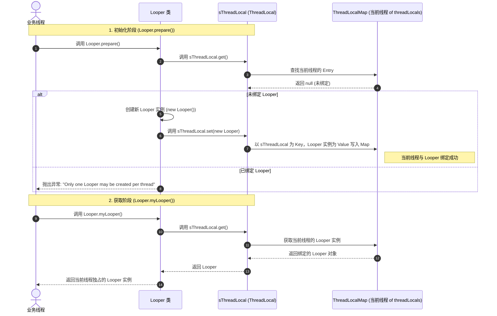

# 5.2.1.7 ThreadLocal 线程本地存储机制深度剖析

在 Android 异步消息机制（Handler）中，`Looper` 是维持线程消息循环的核心组件。为了保证“一个线程有且仅有一个 Looper 实例”且每个线程的 Looper 互不干扰，Android 巧妙地利用了 Java 的 `ThreadLocal` 机制。

`ThreadLocal` 是 Java 并发包（`java.lang`）中一个看似简单但设计极其精妙的类。它提供了一种线程本地变量（Thread-Local Variables）的机制，用于在多线程环境下实现线程间的数据隔离。本文将从设计哲学、内存模型、源码细节、内存泄漏防范、Android Looper 中的应用以及业界优秀的变体方案（ITL、TTL、FastThreadLocal）等多个维度，对 `ThreadLocal` 进行多层次、深度剖析。

---

## 1. ThreadLocal 概述与核心概念（“是什么”）

### 1.1 什么是 ThreadLocal？
**ThreadLocal**，即**线程本地变量**或**线程局部存储（Thread Local Storage, TLS）**。

简单来说，当你在类中声明一个 `ThreadLocal` 变量时，每一个访问该变量的线程都会在其线程内部初始化一个该变量的**独立副本**。每个线程对该变量的读写操作（通过 `get()` 和 `set()` 方法）都是针对自己内部的副本进行的，与其他线程完全隔离。

#### 核心定位与设计对比
在并发编程中，我们经常面临多个线程同时访问共享资源的问题。通常的解决方案可以分为两大流派：

| 维度 | 同步锁机制 (synchronized / ReentrantLock) | 线程局部存储机制 (ThreadLocal) |
| :--- | :--- | :--- |
| **设计思想** | **时间换空间** | **空间换时间** |
| **解决痛点** | 多个线程并发修改**同一个共享变量**时的安全性问题 | 多个线程对**非线程安全对象**的并发访问隔离，或线程上下文的跨层传递 |
| **核心机制** | 通过锁来排队，使多个线程排队访问共享变量，保证操作的互斥性 | 为每个线程分配独立的变量副本，各线程在私有内存空间内运行，互不干扰 |
| **性能开销** | 存在锁竞争、上下文切换、线程阻塞与唤醒开销 | 无锁竞争，高并发下读写效率极高，但需消耗额外的内存空间 |
| **典型代表** | 各种并发锁、原子类（AtomicInteger等） | `ThreadLocal`、`FastThreadLocal` |

---

### 1.2 ThreadLocal 的典型应用场景与代码实现

`ThreadLocal` 在实际开发和框架设计中应用极广，以下是四个最典型的应用场景及其深度代码实现剖析。

#### 场景一：SimpleDateFormat 的线程隔离
`SimpleDateFormat` 底层维护了一个特殊的 `Calendar` 实例，在执行 `format()` 或 `parse()` 方法时，会多次调用 `calendar.setTime(date)`。如果多个线程共享同一个 `SimpleDateFormat` 实例，它们的日期数据会相互覆盖，导致输出的格式化日期错乱，甚至在并发解析时抛出 `NumberFormatException`。

##### 错误的多线程共享示例：
```java
public class DateFormatUnsafeDemo {
    private static final SimpleDateFormat sdf = new SimpleDateFormat("yyyy-MM-dd HH:mm:ss");

    public static void main(String[] args) {
        for (int i = 0; i < 10; i++) {
            new Thread(() -> {
                try {
                    // 多线程并发解析，会导致解析异常或结果错误
                    System.out.println(sdf.parse("2026-06-21 12:00:00"));
                } catch (Exception e) {
                    e.printStackTrace();
                }
            }).start();
        }
    }
}
```

##### 使用 ThreadLocal 进行线程隔离的优雅解法：
```java
public class DateFormatSafeDemo {
    // 声明 ThreadLocal，为每个线程初始化一个独立的 SimpleDateFormat 实例
    private static final ThreadLocal<SimpleDateFormat> sdfHolder = 
            ThreadLocal.withInitial(() -> new SimpleDateFormat("yyyy-MM-dd HH:mm:ss"));

    public static String format(Date date) {
        // get() 会从当前线程的 ThreadLocalMap 中获取该线程私有的 SimpleDateFormat 实例
        return sdfHolder.get().format(date);
    }

    public static Date parse(String dateStr) throws ParseException {
        return sdfHolder.get().parse(dateStr);
    }
    
    public static void remove() {
        // 记得在使用完毕后清理，防止内存泄漏
        sdfHolder.remove();
    }
}
```
**原理剖析**：由于每个工作线程通过 `sdfHolder.get()` 获取到的都是本线程独占的 `SimpleDateFormat`，因此它们永远不会操作同一个 `calendar` 实例，从根本上规避了并发安全性问题，且无需像在方法内部每次新建实例那样频繁创建、销毁对象，极大地提升了 GC 友好度。

#### 场景二：数据库连接与声明式事务管理
在传统的基于 JDBC 的事务管理中，如果要保证一系列数据库操作（如更新用户账户余额、记录账单明细）在同一个事务中执行，必须确保这些操作共用同一个数据库连接（`Connection`）。
Spring 框架的事务管理器通过将 `Connection` 绑定到 `ThreadLocal` 中，实现了声明式事务在单线程内的串联。

##### Spring 事务同步的底层逻辑模拟：
```java
public class ConnectionManager {
    private static final ThreadLocal<Connection> connectionHolder = new ThreadLocal<>();

    public static Connection getConnection() throws SQLException {
        Connection conn = connectionHolder.get();
        if (conn == null) {
            // 从连接池获取物理连接
            conn = DriverManager.getConnection("jdbc:mysql://localhost:3306/db", "root", "123");
            // 将连接绑定到当前线程
            connectionHolder.set(conn);
        }
        return conn;
    }

    public static void closeConnection() throws SQLException {
        Connection conn = connectionHolder.get();
        if (conn != null) {
            conn.close();
            // 必须手动清理，切断线程与连接的强引用
            connectionHolder.remove();
        }
    }
}
```
**原理剖析**：当事务开始时，获取连接并存入 `ThreadLocal`。随后，在当前线程内执行的所有 DAO 操作都通过 `getConnection()` 拿到同一个连接实例，保证了事务提交（`commit`）或回滚（`rollback`）的一致性。同时，其他 HTTP 线程访问数据库时，获取的是它们各自绑定的连接，确保了线程隔离与并发安全。

在 Spring 框架的 `TransactionSynchronizationManager` 类中，同样也大量利用了这一设计：
```java
public abstract class TransactionSynchronizationManager {
    // 线程本地变量，存储当前事务绑定的各类资源（如 DataSource 到 ConnectionHolder 的映射）
    private static final ThreadLocal<Map<Object, Object>> resources =
            new NamedThreadLocal<>("Transactional resources");

    // 事务同步器列表，也是线程隔离的
    private static final ThreadLocal<Set<TransactionSynchronization>> synchronizations =
            new NamedThreadLocal<>("Transaction synchronizations");
    // ...
}
```
这保证了 Spring 在管理声明式事务（尤其是在多数据源或嵌套事务下）时，资源和同步监听器绝对处于当前的调用线程中，为应用级并发安全筑牢了根基。

#### 场景三：Web 请求上下文信息传递
在分布式 Web 架构或 Spring Boot 服务中，客户端请求携带的身份 Token（例如 JWT）通常会被 Spring MVC 的 `HandlerInterceptor` 拦截解析，随后获取到对应的 `UserInfo` 实体。为了避免在后端的 Controller -> Service -> Manager -> DAO 的方法调用链中层层传递 `UserInfo` 对象，可以使用 `ThreadLocal` 进行上下文穿透传递。

##### 上下文传递的最佳实践编码：
```java
public class UserContextHolder {
    private static final ThreadLocal<UserInfo> userHolder = new ThreadLocal<>();

    public static void set(UserInfo user) {
        userHolder.set(user);
    }

    public static UserInfo get() {
        return userHolder.get();
    }

    public static void remove() {
        userHolder.remove();
    }
}

// 在拦截器中写入
public class SecurityInterceptor implements HandlerInterceptor {
    @Override
    public boolean preHandle(HttpServletRequest req, HttpServletResponse resp, Object h) {
        UserInfo userInfo = parseToken(req.getHeader("Authorization"));
        UserContextHolder.set(userInfo); // 写入当前 HTTP 线程上下文
        return true;
    }

    @Override
    public void afterCompletion(HttpServletRequest req, HttpServletResponse resp, Object h, Exception ex) {
        UserContextHolder.remove(); // 极其重要！请求结束，立刻清理，防止线程池复用污染
    }
}
```

#### 场景四：日志链路追踪（SLF4J MDC 机制）
微服务架构下，我们需要对每一个 HTTP 请求或分布式任务进行追踪。通过在日志中打印一个唯一的全局 `TraceID`，可以将跨越多个服务、多个方法的日志日志链条串联起来。
SLF4J 日志框架提供的 `MDC`（Mapped Diagnostic Context）组件就是通过 `ThreadLocal` 来维护和传递这些键值对的。

##### MDC 原理与使用示例：
```java
public class TraceDemo {
    public static void main(String[] args) {
        // 在请求入口处，生成唯一的 TraceID 并塞入 MDC
        String traceId = UUID.randomUUID().toString();
        MDC.put("traceId", traceId);

        // 此时，本线程打印的所有日志都将自动在日志格式中输出该 traceId
        LoggerFactory.getLogger(TraceDemo.class).info("开始处理业务逻辑...");
        
        doSomeBusiness();

        // 业务结束，必须清除
        MDC.clear();
    }

    private static void doSomeBusiness() {
        // 跨类调用，依然能拿到 TraceID，无须显式传值
        LoggerFactory.getLogger(TraceDemo.class).info("业务逻辑第二阶段执行完成.");
    }
}
```
**MDC 底层实现深度剖析**：以 Logback 框架为例，`MDC` 的底层核心是 `LogbackMDCAdapter`，它内部持有一个 `ThreadLocal<Map<String, String>>` 的成员变量。每当你调用 `MDC.put(key, val)` 时，实际上是将键值对放入当前线程专属的 Map 中。当日志输出时，日志布局器（Layout）会从该 Map 中取出键值对拼接到日志行中，从而实现了无侵入的链路追踪。

---

## 2. ThreadLocal 设计演进与核心设计思想（“为什么”）

### 2.1 早期设计与现代设计的对比

在 Java 的发展历史中，`ThreadLocal` 的内部架构经历过一次重大的颠覆性重新设计。理解这段演进历史对于理解其现代设计极为关键。

#### 早期设计（JDK 1.3 及以前）：以 ThreadLocal 为 Map，Thread 为 Key
在 JDK 的早期实现中，`ThreadLocal` 的结构非常符合直觉：
* 每个 `ThreadLocal` 变量内部维护着一个全局的线程安全 Map（如 `ConcurrentHashMap` 或带锁的 Map）。
* 这个 Map 的 Key 是当前线程 the 引用 `Thread`，Value 是该线程对应的本地变量副本。

```
[ThreadLocal 实例]
   └── 内部的 Map:
        ├── Key: Thread A  --->  Value: Value A
        ├── Key: Thread B  --->  Value: Value B
        └── Key: Thread C  --->  Value: Value C
```

**早期设计暴露出的致命缺陷：**
1. **严重的锁竞争与性能瓶颈**：随着高并发场景下线程数量的激增，成百上千个线程同时存取本地变量时，都在并发访问同一个 `ThreadLocal` 内部的全局 Map。即使使用分段锁，在极高并发下依然会产生严重的同步开销，直接抵消了“无锁化”的设计初衷。
2. **内存泄漏与生命周期失控**：当一个线程执行完毕并被销毁时，这个全局 Map 中依然残留着该线程的 Key-Value 映射关系。除非手动清除，否则这个 Map 会一直持有该 `Thread` 对象的引用以及对应的 `Value` 引用。这意味着已死亡线程的关联内存无法被及时释放，造成严重的内存泄漏。

#### 现代设计（JDK 1.4 及以后）：以 Thread 为 Map 持有者，ThreadLocal 为 Key
现代 JDK 彻底逆转了这一设计：**不再是 `ThreadLocal` 内部持有线程 Map，而是每个线程 `Thread` 内部持有自己的 `ThreadLocalMap`**。

* 每个 `Thread` 内部都有一个名为 `threadLocals` 的成员变量，其类型为 `ThreadLocal.ThreadLocalMap`。
* `ThreadLocalMap` 本身是由 `ThreadLocal` 维护的定制化哈希表，其 Key 是 `ThreadLocal` 实例的**弱引用**，Value 是用户存放的具体对象。

```
[Thread A 对象]
   └── threadLocals (ThreadLocalMap)
        ├── Key: ThreadLocal 1 (弱引用)  --->  Value: Value A1
        ├── Key: ThreadLocal 2 (弱引用)  --->  Value: Value A2

[Thread B 对象]
   └── threadLocals (ThreadLocalMap)
        ├── Key: ThreadLocal 1 (弱引用)  --->  Value: Value B1
        └── Key: ThreadLocal 3 (弱引用)  --->  Value: Value B3
```

**现代设计的绝对优势：**
1. **完全消除并发竞争**：因为 `ThreadLocalMap` 是 `Thread` 对象的私有成员，每个线程在读写本地变量时，操作的都是自己私有的 Map。线程之间没有任何共享的 Map，不存在任何并发冲突，实现了真正的无锁化。
2. **生命周期自动绑定**：当线程被销毁（例如非线程池的普通线程消亡）时，其内部的 `threadLocals`（`ThreadLocalMap` 实例）会随着 `Thread` 对象一同进入垃圾回收流程。Map 中的所有 Entry 及 Value 引用也会在没有其他强引用的情况下被自然回收，大幅降低了内存泄漏的风险。
3. **Entry 数量显著减少**：在早期设计中，Map 的大小取决于系统中**并发线程的数量**；而在现代设计中，每个线程的 `ThreadLocalMap` 大小取决于该线程**实际使用的 `ThreadLocal` 变量数量**，通常这个数量非常小（一般也就几个到十几个），因此哈希冲突的概率和 Map 的空间占用都大幅减小。

---

## 3. 内存模型与引用链深度剖析

现代 `ThreadLocal` 的设计虽然优雅，但由于引入了**弱引用**，使得其内存模型和垃圾回收机制变得非常复杂。这也是为什么它成为了 Java 内存泄漏问题的重灾区。

### 3.1 核心数据结构与引用关系

首先，我们通过 Mermaid 图来直观展现 `ThreadLocal` 在运行时的内存引用关系。

```mermaid
graph TD
    subgraph JVM_Stack ["JVM 栈 (Thread Stack)"]
        ThreadLocalRef["ThreadLocal Ref (外部强引用)"]
        CurrentThreadRef["Current Thread Ref (当前线程强引用)"]
    end

    subgraph JVM_Heap ["JVM 堆 (Heap)"]
        ThreadObj["Thread 实例"]
        ThreadLocalObj["ThreadLocal 实例"]
        MapObj["ThreadLocalMap 实例"]
        EntryArray["Entry[] 数组"]
        EntryObj["Entry 实例"]
        ValueObj["Value 真实值对象"]
    end

    CurrentThreadRef -->|强引用| ThreadObj
    ThreadLocalRef -->|强引用| ThreadLocalObj
    ThreadObj -->|强引用 threadLocals| MapObj
    MapObj -->|强引用 table| EntryArray
    EntryArray -->|强引用元素| EntryObj
    EntryObj -.->|弱引用 Key (referent)| ThreadLocalObj
    EntryObj -->|强引用 Value (value)| ValueObj
```

从上图可以看出，当我们在代码中使用 `ThreadLocal` 时，存在两条核心引用链：

1. **指向 Key (ThreadLocal) 的引用链**：
   - 外部业务代码持有的强引用：`ThreadLocalRef -> ThreadLocal 实例`。
   - `ThreadLocalMap` 的 `Entry` 持有的弱引用：`Entry -> Key (ThreadLocal 实例)`。
2. **指向 Value (存储对象) 的引用链**：
   - 当前线程的强引用：`CurrentThreadRef -> Thread 实例 -> ThreadLocalMap -> Entry[] -> Entry -> Value 实例`。

---

### 3.2 为什么 Entry 的 Key 必须设计为弱引用？

在 `ThreadLocalMap` 中，`Entry` 是继承自 `WeakReference<ThreadLocal<?>>` 的：

```java
static class Entry extends WeakReference<ThreadLocal<?>> {
    /** The value associated with this ThreadLocal. */
    Object value;

    Entry(ThreadLocal<?> k, Object v) {
        super(k);
        value = v;
    }
}
```

这里的设计决策非常关键：**为什么要将 Key 设计为弱引用，而将 Value 设计为强引用？**

#### 3.2.1 假设 1：如果 Key 设计为强引用
若 `Entry` 的 Key 是强引用，那么当外部业务代码中已经完成了 `ThreadLocal` 的使用，并将外部强引用置为了空（`threadLocal = null`）时，由于当前线程的 `ThreadLocalMap` 中依然持有着该 `ThreadLocal` 实例的强引用 Key，这个 `ThreadLocal` 实例将永远无法被 GC 回收。
这就导致了即便开发者已经明确不需要这个 `ThreadLocal` 了，但只要当前线程不死（例如处于常驻线程池中），该 `ThreadLocal` 实例和对应的 `Value` 就会一直残留在内存中，造成严重的内存泄漏。

#### 3.2.2 假设 2：Key 设计为弱引用（现代设计）
当外部强引用 `threadLocal = null` 后，整个 JVM 中仅剩下 `ThreadLocalMap` 里的 `Entry` 对该 `ThreadLocal` 实例的**弱引用**。
根据弱引用的 GC 特性，在下一次垃圾回收发生时，垃圾回收器会直接回收掉这个 `ThreadLocal` 实例。此时，该 `Entry` 的 Key 就会变成 `null`。
Key 变为 `null` 之后，`ThreadLocalMap` 就能在后续的 `get()`、`set()` 或 `remove()` 操作中，通过识别 `key == null` 的脏槽位（Stale Slot），自动将对应的 `Value` 置为 `null` 并清除 `Entry`，从而提供了自我清理和防御的机制。

#### 3.2.3 为什么 Value 不能被设计为弱引用？
有开发者提出疑问：既然 Key 设计为弱引用能规避内存泄漏，为什么不把 Value 也设计成对真实值的弱引用？
**答案是绝对不行的**。如果 Value 被设计为弱引用，那么只要外部没有强引用指向该 Value，垃圾回收器一旦启动就会将该 Value 瞬间回收。
然而在实际开发中，我们通常是将一个新生成的对象（例如刚才实例化的 `UserInfo`）放入 `ThreadLocal`。如果它是弱引用，当方法执行完毕、局部强引用失效后，即使线程仍在运行且后续还需要在其他类中通过 `ThreadLocal.get()` 使用这个 `UserInfo`，它也会在 GC 发生后被意外清理掉，返回 `null`。这会直接导致业务数据丢失和严重的 NullPointerException，无法满足本地存储的根本目的。

---

### 3.3 JVM 垃圾回收细节与弱引用队列机制

为了彻底讲透弱引用的回收细节，我们必须上升到 JVM 的垃圾回收机制及 Reference 处理的底层运作流程。

#### 3.3.1 GC 根可达性分析与标记过程
JVM 在执行垃圾回收时，首先从 **GC Roots**（包括当前活跃的线程栈、静态属性变量、JNI 局部引用等）开始，沿着引用链向下搜索所有可达的对象：
1. **强可达（Strongly Reachable）**：如果一个对象能通过至少一条强引用链从 GC Root 到达，它就是强可达的，GC 绝对不会回收它。
2. **弱可达（Weakly Reachable）**：如果一个对象无法通过强引用链到达，但能通过包含弱引用的链条到达，它就是弱可达的。

当 `ThreadLocal` 的外部强引用（即我们在方法内或静态类中持有的 `threadLocal` 变量引用）被置为 `null`，而该 `ThreadLocal` 在某条运行线程的 `ThreadLocalMap` 中依然作为 Key 被弱引用持有着。此时，这个 `ThreadLocal` 实例在 GC 的视角中就变成了**弱可达对象**。

在垃圾回收的标记阶段（Marking Phase），垃圾回收器会扫描所有弱可达对象，并将它们存入一个待挂载的临时引用链表中。在随后的引用处理（Reference Processing）阶段，GC 会自动将这些 `WeakReference` 对象内部的 `referent`（即指向 `ThreadLocal` 的引用指针）清空，置为 `null`。

#### 3.3.2 为什么 ThreadLocalMap 没有使用 ReferenceQueue？
在标准 Java 中，我们创建弱引用时，通常可以传入一个 `ReferenceQueue`（引用队列）：
```java
ReferenceQueue<Object> queue = new ReferenceQueue<>();
WeakReference<Object> weakRef = new WeakReference<>(target, queue);
```
当 GC 回收了 `target` 实例时，JVM 的守护线程（`ReferenceHandler`）会自动将该 `weakRef` 弱引用对象本身加入到注册的 `ReferenceQueue` 中。我们可以开启一个后台线程不断 `poll` 这个队列，从而得知哪些 Key 被回收了，进而执行内存扫尾清理。

**为什么 Doug Lea 在设计 ThreadLocalMap 时没有采用 ReferenceQueue 呢？**
1. **轻量化设计，避免锁竞争**：`ReferenceQueue` 的底层实现需要通过 `ReferenceQueue.lock` 对象锁进行同步，这在多线程高并发下会带来额外的同步锁开销，违背了 `ThreadLocal` 追求极致免锁性能的初衷。
2. **后台线程开销**：如果每个 `ThreadLocal` 都维护或共享一个监听队列的守护线程，会徒增 CPU 调度和线程上下文切换开销。
3. **闭环自愈能力**：现代的 `ThreadLocalMap` 将清理脏数据的逻辑内聚在 Map 内部的操作中。当线程频繁调用 `get()`、`set()`、`remove()` 时，本身就证明当前线程非常活跃。在这时进行局部的、轻量级的线性探测自愈清理，能够以极低的代价（分摊到每次操作，分摊时间复杂度为 $O(1)$）精准维持 Map 的整洁性，而不需要借助外部队列。

---

## 4. JDK 源码级深度剖析（“怎么做”）

为了彻底摸清 `ThreadLocal` 的运作轨迹，本节将深入 JDK 源码（以 JDK 8 为标准），对核心 API 以及 `ThreadLocalMap` 的冲突解决和自愈清理算法进行深度拆解。

### 4.1 ThreadLocal 核心 API 源码解密

#### 1. set(T value) —— 数据写入流程
`set` 方法是数据存入的入口，其核心逻辑是获取当前线程的 `ThreadLocalMap`，如果不存在则创建，存在则直接写入。

```java
public void set(T value) {
    Thread t = Thread.currentThread();
    // 获取当前线程持有的 ThreadLocalMap 实例
    ThreadLocalMap map = getMap(t);
    if (map != null) {
        // 如果 Map 已经初始化，则将值存入，Key 为当前 ThreadLocal 实例 (this)
        map.set(this, value);
    } else {
        // 如果 Map 还未创建，则为当前线程初始化 Map 并存入初始值
        createMap(t, value);
    }
}

ThreadLocalMap getMap(Thread t) {
    // 直接返回线程对象内部的成员变量 threadLocals
    return t.threadLocals;
}

void createMap(Thread t, T firstValue) {
    // 实例化 ThreadLocalMap 并将其赋值给线程的 threadLocals 字段
    t.threadLocals = new ThreadLocalMap(this, firstValue);
}
```

#### 2. get() —— 数据读取流程
`get` 方法负责从当前线程的 Map 中取出对应的值。这里设计了**快速路径（Fast Path）**和**慢速路径（Slow Path）**以保证极致的读取性能。

```java
public T get() {
    Thread t = Thread.currentThread();
    ThreadLocalMap map = getMap(t);
    if (map != null) {
        // 快速路径：直接计算哈希并尝试从数组中获取 Entry
        ThreadLocalMap.Entry e = map.getEntry(this);
        if (e != null) {
            @SuppressWarnings("unchecked")
            T result = (T)e.value;
            return result;
        }
    }
    // 慢速路径：如果 map 为空，或者没有找到对应的 Entry，则进入初始化阶段
    return setInitialValue();
}

private T setInitialValue() {
    // 调用 initialValue() 获取默认初始值（默认返回 null，子类可重写该方法）
    T value = initialValue();
    Thread t = Thread.currentThread();
    ThreadLocalMap map = getMap(t);
    if (map != null) {
        map.set(this, value);
    } else {
        createMap(t, value);
    }
    return value;
}
```

#### 3. remove() —— 数据清理流程
`remove` 方法用于手动清除当前线程中绑定的当前 `ThreadLocal` 变量。

```java
public void remove() {
    ThreadLocalMap m = getMap(Thread.currentThread());
    if (m != null) {
        // 调用 ThreadLocalMap 的 remove 方法进行清除
        m.remove(this);
    }
}
```

---

### 4.2 ThreadLocalMap 内部结构与冲突算法

`ThreadLocalMap` 是整个机制的幕后功臣。它没有使用 Java 集合框架中的 `HashMap`，因为它的使用场景非常特殊：不需要支持海量数据，哈希冲突相对较少，且需要极高的访问速度和低内存占用。

#### 1. 底层存储结构与哈希算法
`ThreadLocalMap` 底层是一个 `Entry` 数组：
```java
private Entry[] table;
// 初始容量，必须是 2 的幂次方
private static final int INITIAL_CAPACITY = 16;
// 扩容阈值，默认为容量的 2/3
private int threshold;
```

#### 2. 斐波那契散列与黄金分割数 `0x61c88647`
在 `ThreadLocalMap` 中，Key 的哈希值并不是直接调用 `hashCode()`，而是使用了一个神奇的增量：
```java
public class ThreadLocal<T> {
    private final int threadLocalHashCode = nextHashCode();
    private static AtomicInteger nextHashCode = new AtomicInteger();
    
    // 神秘常数：黄金分割数与 2^32 乘积的近似值
    private static final int HASH_INCREMENT = 0x61c88647;

    private static int nextHashCode() {
        return nextHashCode.getAndAdd(HASH_INCREMENT);
    }
}
```
**数学原理与冲突避开深度证明：**
`0x61c88647` 是一个非常特殊的 32 位无符号整型数值。它对应的是黄金比例 $\Phi = \frac{\sqrt{5}-1}{2} \approx 0.6180339887$ 乘以 $2^{32}$ 的结果：
$$2^{32} \times 0.6180339887 \approx 2654435769 \text{ (无符号整数)} \rightarrow \text{补码表示为 } -1640531527 \rightarrow \text{十六进制即 } 0x61c88647$$
这种散列方式称为**斐波那契散列（Fibonacci Hashing）**。它的奇妙之处在于，对于大小为 $2^n$ 的哈希表，通过黄金分割数的累加做模运算，能产生极度分散、分布均匀的散列值，将冲突概率降到最低。

##### 证明 1：当哈希表大小为 16 时，新生成的 ThreadLocal 实例在数组中的索引位置推导
设我们连续新建 16 个 `ThreadLocal` 对象，哈希增量累加，对 $16$ 取模：
* **第 0 个**：$0 \times 0x61c88647 \pmod{16} \rightarrow 0 \pmod{16} = \mathbf{0}$
* **第 1 个**：$1 \times 1640531527 \pmod{16} \rightarrow 1640531527 \pmod{16} = \mathbf{7}$ (因为 $1640531527 = 16 \times 102533220 + 7$)
* **第 2 个**：$2 \times 1640531527 \pmod{16} \rightarrow 3281063054 \pmod{16} = \mathbf{14}$
* **第 3 个**：$3 \times 1640531527 \pmod{16} \rightarrow 4921594581 \pmod{16} = \mathbf{5}$
* **第 4 个**：$4 \times 1640531527 \pmod{16} \rightarrow 6562126108 \pmod{16} = \mathbf{12}$
* **第 5 个**：$5 \times 1640531527 \pmod{16} \rightarrow 8202657635 \pmod{16} = \mathbf{3}$
* **第 6 个**：$6 \times 1640531527 \pmod{16} \rightarrow 9843189162 \pmod{16} = \mathbf{10}$
* **第 7 个**：$7 \times 1640531527 \pmod{16} \rightarrow 11483720689 \pmod{16} = \mathbf{1}$
* **第 8 个**：$8 \times 1640531527 \pmod{16} \rightarrow 13124252216 \pmod{16} = \mathbf{8}$
* **第 9 个**：$9 \times 1640531527 \pmod{16} \rightarrow 14764783743 \pmod{16} = \mathbf{15}$
* **第 10 个**：$10 \times 1640531527 \pmod{16} \rightarrow 16405315270 \pmod{16} = \mathbf{6}$
* **第 11 个**：$11 \times 1640531527 \pmod{16} \rightarrow 18045846797 \pmod{16} = \mathbf{13}$
* **第 12 个**：$12 \times 1640531527 \pmod{16} \rightarrow 19686378324 \pmod{16} = \mathbf{4}$
* **第 13 个**：$13 \times 1640531527 \pmod{16} \rightarrow 21326909851 \pmod{16} = \mathbf{11}$
* **第 14 个**：$14 \times 1640531527 \pmod{16} \rightarrow 22967441378 \pmod{16} = \mathbf{2}$
* **第 15 个**：$15 \times 1640531527 \pmod{16} \rightarrow 24607972905 \pmod{16} = \mathbf{9}$

**结论**：在连续分配的 16 次空间放置中，哈希结果完美地铺满了整个数组（索引集合：`[0, 7, 14, 5, 12, 3, 10, 1, 8, 15, 6, 13, 4, 11, 2, 9]`），**冲突率为 0%**！每一个后续生成的散列槽位都在先前槽位所剩空间的中间点（最大间隔中间）附近，这一极佳的散列均匀度被业界公认为最完美的设计之一。

---

##### 证明 2：当哈希表大小为 32 时，新分配 32 个 ThreadLocal 的散列分布推导
同样地，我们对大小为 32 的哈希表进行推导，累加 `HASH_INCREMENT`，取模 `32`：
* **0-7**：`0`, `23`, `14`, `5`, `28`, `19`, `10`, `1`
* **8-15**：`24`, `15`, `6`, `29`, `20`, `11`, `2`, `25`
* **16-23**：`16`, `7`, `30`, `21`, `12`, `3`, `26`, `17`
* **24-31**：`8`, `31`, `22`, `13`, `4`, `27`, `18`, `9`

**结论**：依然没有任何冲突。每次散列都以步长 23 向后挪移（在模 32 下相当于向前跳 9 个单位）。对于任何 $2^n$ 大小的哈希表，该累加器总能产生无锁且不发生初期冲突的最优解，这是 Doug Lea 在算法设计中运用高级数论的经典一笔。

---

#### 3. 线性探测冲突解决算法
因为 `ThreadLocalMap` 底层数组不使用链表，当发生哈希冲突时，它采用的是**线性探测法（Linear Probing）**。
* **基本原理**：计算出的初始索引为 `i = key.threadLocalHashCode & (len - 1)`。如果当前槽位 `table[i]` 已经被占用了，且占用的 Key 与当前 Key 不同，则继续探测下一个槽位 `i = nextIndex(i, len)`（即 `i + 1`，若到数组末尾则循环回 0），直到找到一个空槽位或者 Key 相同的槽位。

我们来看 `ThreadLocalMap.set()` 的源码实现：

```java
private void set(ThreadLocal<?> key, Object value) {
    Entry[] tab = table;
    int len = tab.length;
    // 计算初始索引
    int i = key.threadLocalHashCode & (len-1);

    // 线性探测遍历数组
    for (Entry e = tab[i]; e != null; e = tab[i = nextIndex(i, len)]) {
        ThreadLocal<?> k = e.get();

        // 情况 1：找到相同的 Key，直接覆盖 Value 即可
        if (k == key) {
            e.value = value;
            return;
        }

        // 情况 2：探测到了一个过期的槽位（Key 已经被 GC 回收了，即 k == null）
        if (k == null) {
            // 执行替换过期槽位的逻辑，在这个过程中会触发局部垃圾清理
            replaceStaleEntry(key, value, i);
            return;
        }
    }

    // 情况 3：探测到了一个空槽位（e == null），直接在此新建 Entry 存入
    tab[i] = new Entry(key, value);
    int sz = ++size;
    // 进行一次启发式清理，若没有清理掉任何过期数据，且当前大小超过了扩容阈值，则进行扩容
    if (!cleanSomeSlots(i, sz) && sz >= threshold)
        rehash();
}
```

---

### 4.3 探测式清理与启发式清理源码追踪

为了应对内存泄漏，`ThreadLocalMap` 设计了精妙的自愈机制，在操作 Map 时会顺便清理那些 Key 已经被 GC 回收的脏数据。清理算法主要分为**探测式清理（Expunge Stale Entry）**和**启发式清理（Heuristically Clean Stale Entries）**。

#### 1. 探测式清理（`expungeStaleEntry`）
探测式清理以一个过期槽位为起点，不仅清除该槽位，还会沿着数组继续向后扫描，清理后续所有过期的 Entry，并对未过期的 Entry 进行 **Rehash 重新定位**。

```java
private int expungeStaleEntry(int staleSlot) {
    Entry[] tab = table;
    int len = tab.length;

    // 1. 清理当前位置的脏数据
    tab[staleSlot].value = null; // 斩断 Value 的强引用，帮助 GC
    tab[staleSlot] = null;       // 清空 Entry 槽位
    size--;

    // 2. 线性探测后续位置，直到遇到 null 槽位为止
    Entry e;
    int i;
    for (i = nextIndex(staleSlot, len); (e = tab[i]) != null; i = nextIndex(i, len)) {
        ThreadLocal<?> k = e.get();
        if (k == null) {
            // 发现过期的 Entry，一并清理
            e.value = null;
            tab[i] = null;
            size--;
        } else {
            // 发现正常的 Entry，需要对其进行 Rehash 重新定位！
            // 因为线性探测要求数据连续，如果中间有槽位被清空了，必须重新排列后续元素，
            // 否则后续的 get操作在线性探测时遇到 null 就会误以为数据不存在而中断查找。
            int h = k.threadLocalHashCode & (len - 1);
            if (h != i) {
                tab[i] = null; // 将其从当前位置移走

                // 从其原本的哈希位置 h 开始，向后寻找最靠近它的空槽位放入
                while (tab[h] != null)
                    h = nextIndex(h, len);
                tab[h] = e;
            }
        }
    }
    // 返回探测结束时遇到的 null 槽位索引
    return i;
}
```

#### 2. 启发式清理（`cleanSomeSlots`）
相比于探测式清理的全力扫描，启发式清理采用了一种折中的、渐进式的策略。它利用对数级别的扫描次数来降低性能开销，在开销和清理效率之间取得了极致的平衡。

```java
private boolean cleanSomeSlots(int i, int n) {
    boolean removed = false;
    Entry[] tab = table;
    int len = tab.length;
    do {
        i = nextIndex(i, len);
        Entry e = tab[i];
        // 发现过期的槽位
        if (e != null && e.get() == null) {
            n = len; // 只要发现有脏数据，就将 n 重置为数组长度，扩大扫描范围
            removed = true;
            // 启动探测式清理，彻底清除并重排以 i 为起点的连续冲突槽位
            i = expungeStaleEntry(i);
        }
    } while ( (n >>>= 1) != 0 ); // 每次循环将 n 除以 2，即扫描次数为 log2(n)
    return removed;
}
```

---

### 4.4 替换过期数据（`replaceStaleEntry`）源码深层拆解

当线程调用 `set` 时，在线性探测中一旦发现某个槽位上的 Key 已经被回收了（即 `Entry != null && Entry.get() == null`），会调用 `replaceStaleEntry` 将该槽位替换为当前新插入的 Key-Value，并同时进行一次范围性脏数据清理。

```java
private void replaceStaleEntry(ThreadLocal<?> key, Object value, int staleSlot) {
    Entry[] tab = table;
    int len = tab.length;
    Entry e;

    // 1. 我们需要向前搜索，寻找最前一个过期的槽位（staleSlot 之前连续探测区间中的脏槽位）
    // 这是为了把这次清理做得尽量彻底，扩大自愈范围
    int slotToExpunge = staleSlot;
    for (int i = prevIndex(staleSlot, len); (e = tab[i]) != null; i = prevIndex(i, len)) {
        if (e.get() == null) {
            slotToExpunge = i;
        }
    }

    // 2. 向后线性探测，寻找是否有已经存在的 Entry 与要插入的 key 相同
    for (int i = nextIndex(staleSlot, len); (e = tab[i]) != null; i = nextIndex(i, len)) {
        ThreadLocal<?> k = e.get();

        // 情况 A：如果在后面找到了相同的 key，我们只需要把最新的 value 覆盖过去
        if (k == key) {
            e.value = value;

            // 为了保持线性探测的顺序性，必须将这个已经挪到后面的 Entry 交换到前面的 staleSlot 位置
            tab[i] = tab[staleSlot];
            tab[staleSlot] = e;

            // 如果向前搜索时没有发现更早的脏槽位，那么这次交换后的 i 位置就成为了最先需要清理的脏槽位
            if (slotToExpunge == staleSlot)
                slotToExpunge = i;
            
            // 启动以 slotToExpunge 为起点的探测式清理与随后的启发式清理
            cleanSomeSlots(expungeStaleEntry(slotToExpunge), len);
            return;
        }

        // 情况 B：如果向后探测发现了过期的脏槽位，且我们先前向前搜索时没有发现脏槽位
        // 那么这个向后探测到的脏槽位 i 就可以更新为我们清理的起点
        if (k == null && slotToExpunge == staleSlot)
            slotToExpunge = i;
    }

    // 情况 C：如果没有在后面找到对应的 key，说明这个 key 是个全新插入的元素
    // 那么我们直接物理覆盖 staleSlot，写入最新的 Entry
    tab[staleSlot].value = null; // 斩断旧 value 强引用
    tab[staleSlot] = new Entry(key, value);

    // 只要有任何其他的脏槽位存在，就立刻执行清理
    if (slotToExpunge != staleSlot)
        cleanSomeSlots(expungeStaleEntry(slotToExpunge), len);
}
```

---

### 4.5 扩容机制与 `resize()` 源码解密

当往 Map 中插入数据后，如果当前 Map 存储的元素个数（`size`）超过了设定的阈值（`threshold`），或者启发式清理没有腾出足够的空间，就会触发扩容流程。

```java
private void rehash() {
    // 1. 首先进行一次全面的探测式清理，把整个哈希数组里的脏数据全清理干净
    expungeStaleEntries();

    // 2. 清理之后，如果 size 依然大于阈值的 3/4 (threshold - threshold / 4)，则说明真的需要扩容了
    // threshold = len * 2/3， threshold - threshold/4 = len * 1/2。
    // 即当实际使用容量达到数组大小的 1/2 时，就着手进行双倍扩容！
    if (size >= threshold - threshold / 4)
        resize();
}

private void expungeStaleEntries() {
    Entry[] tab = table;
    int len = tab.length;
    for (int j = 0; j < len; j++) {
        Entry e = tab[j];
        if (e != null && e.get() == null)
            expungeStaleEntry(j); // 针对每一个过期的 Entry 执行探测式清理
    }
}

private void resize() {
    Entry[] oldTab = table;
    int oldLen = oldTab.length;
    // 双倍扩容
    int newLen = oldLen * 2;
    Entry[] newTab = new Entry[newLen];
    int count = 0;

    for (int j = 0; j < oldLen; ++j) {
        Entry e = oldTab[j];
        if (e != null) {
            ThreadLocal<?> k = e.get();
            if (k == null) {
                // 如果发现过期的 Key，直接将其 Value 设为 null，不拷贝，物理回收！
                e.value = null; // Help GC
            } else {
                // 重新哈希并放入新表
                int h = k.threadLocalHashCode & (newLen - 1);
                // 遇到冲突时，继续用线性探测寻找新表中的空位
                while (newTab[h] != null)
                    h = nextIndex(h, newLen);
                newTab[h] = e;
                count++;
            }
        }
    }

    setThreshold(newLen); // 更新阈值
    size = count;
    table = newTab;       // 重新挂载数组
}
```

---

## 5. 内存泄漏风险与防范策略

虽然 `ThreadLocal` 内部有上述自愈机制（在 `get`、`set`、`remove` 时顺便清理脏数据），但这属于“被动防御”。在许多复杂的工业级场景中，稍有不慎依然会引发严重的内存泄漏。

### 5.1 内存泄漏根源剖析

如前文所述，当一个 `ThreadLocal` 在外部不再被使用，且 GC 回收了它的 Key 后，该 `ThreadLocal` 在当前线程的 `ThreadLocalMap` 中对应的 Entry 会出现 `key == null` 的情况。
如果当前线程是一个**生命周期极长**的线程（例如 Web 容器的 HTTP 工作线程，或者后台的轮询常驻线程），那么在下一次垃圾回收时，因为还有强引用链：
`Thread (强引用) -> ThreadLocalMap -> Entry -> value (强引用) -> 真实对象`
导致该 Value 所占用的堆内存永远无法被垃圾回收器回收。

#### 触发泄漏的必要条件：
1. `ThreadLocal` 外部强引用被置为 `null`（或者生命周期结束），且没有手动调用 `remove()`。
2. 承载该 `ThreadLocal` 的 `Thread` 仍在持续运行（线程未死亡），且未再次触发 `ThreadLocalMap` 的被动清理（即此后没有对该 Map 进行任何 `set`、`get`、`remove` 操作）。

---

### 5.2 线程池场景下的内存泄漏“放大效应”与“脏数据污染”

在现代 Java 及 Android 开发中，几乎所有的并发任务都是通过**线程池（ThreadPoolExecutor）**来调度的。线程池的核心思想是**线程复用**：线程在执行完一个任务后，并不会被销毁，而是会重新回到池中，等待下一个任务的到来。

这会带来两个灾难性的后果：

#### 1. 内存泄漏的无限堆积
因为线程池中的核心工作线程（Worker）通常是与应用程序同生共死的，这意味着 `Thread` 实例永远不会死亡。
如果每个被提交到线程池的任务都在当前工作线程的 `ThreadLocal` 中塞入大对象（比如一个 10MB 的图片缓存），且任务结束时没有手动调用 `remove()`。随着任务的不断流转，线程池中的所有工作线程都会在它们的 `ThreadLocalMap` 里存满废弃的 Value 强引用。这会导致内存占用持续走高，最终直接引发 `OutOfMemoryError`。

#### 2. 脏数据污染（业务数据越权/串号）
这是在业务层面更容易发生的致命 Bug。
由于线程池是复用的，当一个新任务被分配到某个工作线程时，该工作线程的 `ThreadLocalMap` 里可能还残留着上一个任务设置的本地变量（例如：上一个请求对应的 `UserId = 1001`）。
如果新任务在执行时，没有先调用 `set()` 覆盖、而是直接调用了 `get()`，它就会莫名其妙地读取到上一个用户的敏感信息，进而导致业务数据串号、越权漏洞甚至核心数据损毁。

##### 脏数据污染模拟实验代码：
```java
public class ThreadPoolPollutionDemo {
    private static final ThreadLocal<String> userHolder = new ThreadLocal<>();
    private static final ExecutorService threadPool = Executors.newFixedThreadPool(2);

    public static void main(String[] args) {
        // 任务 1：用户张三登录，将名字存入 ThreadLocal，但未进行 remove
        threadPool.execute(() -> {
            userHolder.set("张三");
            System.out.println(Thread.currentThread().getName() + " 设置用户为: 张三");
        });

        // 延迟一会儿确保任务 1 执行完毕
        try { Thread.sleep(500); } catch (InterruptedException e) {}

        // 任务 2：一个新的匿名请求分配到了刚才执行过任务 1 的那个线程
        // 该任务没有进行 set 操作，直接尝试 get
        threadPool.execute(() -> {
            String user = userHolder.get();
            // 这里会惊奇地发现读取到了 "张三" 的信息，发生脏数据污染！
            System.out.println(Thread.currentThread().getName() + " 读取到的用户为: " + user);
        });

        threadPool.shutdown();
    }
}
```

---

### 5.3 Web 容器中的 ClassLoader 内存泄漏

在 Tomcat、Jetty 等 Java Web 容器中，`ThreadLocal` 还容易引发一种更隐蔽、危害极大的**类加载器内存泄漏（ClassLoader Leak）**。

#### 场景分析：
1. 开发者在 Web 应用程序的类中声明了一个静态的 `ThreadLocal` 变量：`private static final ThreadLocal<MyContext> context = new ThreadLocal<>()`。
2. 当 Web 应用部署到 Tomcat 时，Tomcat 会创建一个专属于该 Web 应用的类加载器（例如 `WebappClassLoader`）来加载该应用的所有 class 文件，包括我们的 `MyContext` 类。
3. 当用户发送 HTTP 请求时，Tomcat 的 HTTP 线程池（如 `http-nio-8080-exec-*`）分配一个工作线程处理请求。该线程执行了 `context.set(new MyContext())`。
4. 之后，Web 应用被卸载（Undeployed）或重新部署（Redeployed）。
5. 正常情况下，当应用卸载时，对应的 `WebappClassLoader` 应该被垃圾回收，它加载的所有类也应该被卸载。
6. **然而泄漏发生了**：Tomcat 的 HTTP 线程池生命周期是容器级别的，它并不会因为某个 Web 应用的卸载而销毁。此时，HTTP 工作线程内部的 `ThreadLocalMap` 中依然持有着 `context` 的 Entry，其 Value 强引用指向了 `MyContext` 实例。
7. 由于 `MyContext` 实例的 Class 对象是由 `WebappClassLoader` 加载的，这导致 `MyContext` 实例 -> `MyContext.class` -> `WebappClassLoader` 的强引用链依然成立。
8. 最终，`WebappClassLoader` 及其加载的成百上千个 Class 无法被回收。随着 Web 应用的几次热部署，JVM 的方法区/元空间（Metaspace / PermGen）就会彻底溢出，导致系统彻底瘫痪。

---

### 5.4 防范机制与最佳编码规范

为了彻底杜绝上述内存泄漏与脏数据污染问题，在实际开发中必须遵循以下核心规范：

#### 规范 1：必须在 `finally` 块中调用 `remove()`
这是使用 `ThreadLocal` 的黄金法则。必须确保无论业务逻辑是成功执行还是抛出异常，在方法结束前都必定会执行 `remove()` 操作。

```java
public class ThreadLocalBestPractice {
    // 建议声明为 private static final，防止每次新建对象产生多个 Key 副本
    private static final ThreadLocal<SessionContext> contextHolder = new ThreadLocal<>();

    public void doWork(Request request) {
        try {
            // 1. 初始化并写入当前线程的上下文信息
            SessionContext context = new SessionContext(request);
            contextHolder.set(context);
            
            // 2. 执行核心业务逻辑
            executeBusiness(context);
        } finally {
            // 3. 极其重要：在 finally 块中清除，切断强引用，防止线程复用污染
            contextHolder.remove();
        }
    }
}
```

#### 规范 2：为什么声明为 `static` 是最佳实践？
在绝大多数情况下，`ThreadLocal` 变量都应该被声明为 `private static final`：
1. **节省内存开销**：如果不是 `static` 的，那么在类的每个实例中都会存在一个独立的 `ThreadLocal` 实例。这不仅浪费内存，还会导致每个线程的 `ThreadLocalMap` 中塞满大量指向同一个类型、但 Key 实例不同的 Entry，加剧哈希冲突。
2. **全局唯一标识**：`static` 声明保证了该 `ThreadLocal` 实例在类加载时就确定下来，全局只有一个 Key 实例。每个线程仅需在自己的 Map 中维护这一个 Key 对应的 Value 即可。

#### 规范 3：提供 AutoCloseable 式的包装器（防御式高级设计）
为了降低业务开发人员因疏忽忘记在 `finally` 中调用 `remove()` 的概率，架构师可以设计一个继承自 `AutoCloseable` 的包装组件，利用 Java 7+ 的 **try-with-resources** 语法强制完成自动清理。

```java
public class SafeContext implements AutoCloseable {
    private static final ThreadLocal<SafeContext> contextHolder = new ThreadLocal<>();
    
    private final String data;

    public SafeContext(String data) {
        this.data = data;
        contextHolder.set(this); // 初始化时直接绑定线程
    }

    public static SafeContext getCurrent() {
        return contextHolder.get();
    }

    public String getData() {
        return data;
    }

    @Override
    public void close() {
        // try-with-resources 退出时，JVM 会自动调用 close 方法，强制进行清理！
        contextHolder.remove();
    }
}

// 业务调用方极其简单且安全：
public void business(String input) {
    try (SafeContext ctx = new SafeContext(input)) {
        // 执行业务
        System.out.println("当前上下文数据: " + SafeContext.getCurrent().getData());
    } // 退出 try 代码块，ctx.close() 被自动执行，完成线程清理
}
```

---

## 6. Android 异步消息机制（Handler）中的 Looper 应用

在 Android 的 Handler 机制中，整个系统运行的核心纽带是 `Looper`。每一个 Handler 在发送消息和处理消息时，都必须依赖当前线程的 `Looper`。
这里存在两个核心痛点：
1. **线程独占性**：一个线程最多只能拥有一个 `Looper` 对象，多余的创建必须被禁止。
2. **全局可达性**：在当前线程的任何位置、任何类中，调用 `Looper.myLooper()` 必须能够安全、快速地获取到当前线程的 `Looper` 实例，而不需要通过方法传参层层传递。

Android 系统通过 `ThreadLocal` 完美地解决了这两个问题。

### 6.1 Looper.prepare() 与 Looper.myLooper() 源码剖析

我们直接来看 Android 源码中 `Looper` 类的核心实现：

```java
public final class Looper {
    // 1. 全局唯一的 static ThreadLocal，作为存储 Looper 的 Key
    @UnsupportedAppUsage
    static final ThreadLocal<Looper> sThreadLocal = new ThreadLocal<Looper>();
    
    // 线程的消息队列
    final MessageQueue mQueue;
    // 绑定的线程对象
    final Thread mThread;

    // 2. 提供给普通线程初始化的静态方法
    public static void prepare() {
        prepare(true);
    }

    private static void prepare(boolean quitAllowed) {
        // 关键安全防线：如果当前线程已经绑定了 Looper，则直接抛出异常，防止重复创建！
        if (sThreadLocal.get() != null) {
            throw new RuntimeException("Only one Looper may be created per thread");
        }
        // 若没有绑定，则新建 Looper 实例存入当前线程的 ThreadLocal 中
        sThreadLocal.set(new Looper(quitAllowed));
    }

    // 3. 私有构造函数，只能通过 prepare() 间接创建
    private Looper(boolean quitAllowed) {
        mQueue = new MessageQueue(quitAllowed);
        mThread = Thread.currentThread();
    }

    // 4. 在线程中获取其独占 Looper 的全局静态方法
    public static @Nullable Looper myLooper() {
        return sThreadLocal.get();
    }
}
```

#### 机制拆解分析：
1. **隔离性实现**：`sThreadLocal` 变量本身是静态的（`static`），这意味着不管在哪个线程中，大家都共用同一个 `sThreadLocal` 实例作为操作 Map 的 Key。
   - 当线程 A 调用 `Looper.prepare()` 时，`sThreadLocal.set(new Looper(...))` 将新创建的 `Looper` 实例存入了线程 A 的 `ThreadLocalMap` 中，Key 为 `sThreadLocal`。
   - 当线程 B 调用 `Looper.prepare()` 时，它操作的是线程 B 的 `ThreadLocalMap`。因此，线程 A 和线程 B 各自拥有一个完全隔离的 `Looper` 实例。
2. **唯一性防线**：在 `prepare()` 方法中，先调用 `sThreadLocal.get()` 检查当前线程的 Map 中是否已有值。如果有，说明当前线程此前已经执行过 `prepare()`，直接抛出 `RuntimeException`。这一步极其精妙地锁死了“一个线程只能有一个 Looper”的死理，从根本上杜绝了多次初始化带来的混乱。
3. **获取无锁化**：当我们在开发中调用 `new Handler()` 或者在任意位置需要使用当前线程的消息循环时，直接通过 `Looper.myLooper()` 即可获取。其底层就是 `sThreadLocal.get()`，由于是无锁操作，性能极佳。

---

### 6.2 思考：为什么不用全局 ConcurrentHashMap 存储 Looper？

如果不使用 `ThreadLocal`，我们也可以设计一个全局的线程安全映射表来存储每个线程的 Looper，例如：
```java
public final class GlobalLooperManager {
    // 使用全局线程安全的 ConcurrentHashMap，以线程 ID 为 Key
    private static final Map<Long, Looper> mGlobalLoopers = new ConcurrentHashMap<>();

    public static void prepare() {
        long threadId = Thread.currentThread().getId();
        if (mGlobalLoopers.containsKey(threadId)) {
            throw new RuntimeException("Only one Looper may be created per thread");
        }
        mGlobalLoopers.put(threadId, new Looper());
    }

    public static Looper myLooper() {
        return mGlobalLoopers.get(Thread.currentThread().getId());
    }
}
```

#### 这种设计存在哪些致命缺陷？
1. **严重的并发锁竞争**：虽然 `ConcurrentHashMap` 性能非常优秀，但在多线程并发获取 Looper 时（Android 系统的底层运作中，如频繁分发、回调等），所有线程依然在共享同一个全局 Map。这种跨线程的全局映射访问，在 CPU 调度频繁时会产生分段锁或 CAS 竞争，性能远不及直接读取本线程私有成员的 `ThreadLocalMap`。
2. **致命的内存泄漏隐患**：在使用全局 Map 的设计中，即使某个子线程执行结束死亡了，全局的 `mGlobalLoopers` 依然持有着这个线程 ID 以及对应的 `Looper` 实例。要想避免泄漏，必须在线程销毁时手动将对应的 Entry 从 `mGlobalLoopers` 中移除。然而在 Android 中，非主线程的销毁是由系统或垃圾回收器决定的，我们很难准确捕捉每一个子线程死亡的精确时机去手动注销。而 `ThreadLocal` 完美的利用了“Map 随 Thread 销毁而一同销毁”的特性，将生命周期托管给了 JVM，优雅且安全。

---

### 6.3 Android App 启动时的 Looper 初始化（Looper.prepareMainLooper()）

在 Android 应用程序启动时，主线程（UI 线程）会自动绑定一个特殊的 Looper，这不需要开发者手动干预。这一切发生在我们熟知的 `ActivityThread` 类中。

#### ActivityThread 核心启动源码：
```java
public static void main(String[] args) {
    // ... 前置准备

    // 1. 初始化主线程的 Looper，内部调用的其实是 prepare(false)
    Looper.prepareMainLooper();

    // 创建 ActivityThread 实例
    ActivityThread thread = new ActivityThread();
    thread.attach(false, startSeq);

    if (sMainThreadHandler == null) {
        sMainThreadHandler = thread.getHandler();
    }

    // 2. 开启死循环的消息分发
    Looper.loop();

    throw new RuntimeException("Main thread loop unexpectedly exited");
}
```

```java
// Looper 类中的对应方法：
public static void prepareMainLooper() {
    prepare(false); // 传入 false，代表主线程 Looper 不允许退出 (quitAllowed = false)
    synchronized (Looper.class) {
        if (sMainLooper != null) {
            throw new IllegalStateException("The main Looper has already been prepared.");
        }
        sMainLooper = myLooper(); // 将当前线程绑定的 Looper 挂载到静态全局变量 sMainLooper 上
    }
}
```
**机制拆解分析**：
在主线程启动时，系统调用 `Looper.prepareMainLooper()`，其内部参数 `quitAllowed = false` 意味着如果试图调用主线程 Looper 的 `quit()` 方法，会直接抛出异常，保证了 App 的核心 UI 交互循环不会被误关闭。
初始化成功后，主线程的 Looper 引用被同时存入 `ThreadLocal` 以及全局静态变量 `sMainLooper` 中。此后，其他线程也可以通过 `Looper.getMainLooper()` 安全、免锁地访问主线程的 Looper 实例。

---

### 6.4 子线程消息循环构建与销毁（HandlerThread）

Android 内部提供了一个专门的工具类——`HandlerThread`，用于简化在子线程中创建 Looper 的流程。我们来看它的核心实现，体会其中 ThreadLocal 生命周期与线程消亡的自然映射。

```java
public class HandlerThread extends Thread {
    int mPriority;
    int mTid = -1;
    Looper mLooper;
    private @Nullable Handler mHandler;

    public HandlerThread(String name) {
        super(name);
        mPriority = Process.THREAD_PRIORITY_DEFAULT;
    }

    @Override
    public void run() {
        mTid = Process.myTid();
        // 1. 构建当前子线程的 Looper，存入线程专属的 ThreadLocalMap
        Looper.prepare();
        synchronized (this) {
            mLooper = Looper.myLooper(); // 获取当前子线程刚刚绑定的 Looper 实例
            notifyAll(); // 唤醒等待获取 Looper 的线程
        }
        Process.setThreadPriority(mPriority);
        onLooperPrepared();
        // 2. 启动消息循环
        Looper.loop();
        mTid = -1;
    }
    
    // 退出子线程的消息循环
    public boolean quit() {
        Looper looper = getLooper();
        if (looper != null) {
            looper.quit(); // 调用 Looper 的退出方法，此时 loop() 死循环会结束
            return true;
        }
        return false;
    }
}
```
**退出与清理机制分析**：
当子线程的消息任务执行完毕后，开发者调用 `quit()` 结束消息循环。
此时，`run()` 方法中的 `Looper.loop()` 会跳出死循环，`run()` 函数执行完毕，工作线程正式宣告死亡。
一旦工作线程死亡，JVM 的垃圾回收器检测到该线程对应的 `Thread` 对象已经不再可达，就会将 `Thread` 实例及其持有的 `threadLocals`（`ThreadLocalMap`）彻底回收。这就意味着存放在里面的 `Looper` 实例、`MessageQueue` 以及其它所有的线程本地变量全部被 GC 自动回收，避免了任何残留和泄露。

---

### 6.5 Looper 绑定流程时序图

下面我们通过 Mermaid 时序图，详细还原一个线程从初始化 `Looper` 到获取 `Looper` 的完整调用链。



---

## 7. 扩展探讨（ThreadLocal 的局限与变体）

原生的 `ThreadLocal` 在线程复用（线程池）和海量并发下暴露出了不少短板。为此，业界衍生出了一些非常优秀的变体与替代方案。

### 7.1 InheritableThreadLocal —— 子线程变量继承

在许多场景下，主线程创建了一个子线程，我们希望子线程能够继承父线程中的上下文变量（例如登录用户信息、TraceID）。
普通的 `ThreadLocal` 在子线程中执行 `get()` 会返回 `null`，因为子线程的 `ThreadLocalMap` 与父线程没有任何联系。
为了解决这个问题，JDK 提供了 `InheritableThreadLocal`。

#### 7.1.1 拷贝时机与源码分析：
在 `Thread` 类的初始化方法中，有关 `inheritableThreadLocals` 复制的实现逻辑如下：
```java
// Thread 类初始化片段：
private void init(ThreadGroup g, Runnable target, String name,
                  long stackSize, AccessControlContext acc,
                  boolean inheritThreadLocals) {
    // ... 前置参数校验与挂载
    Thread parent = currentThread();
    
    // 如果父线程的 inheritableThreadLocals 不为空，且调用方允许继承
    if (inheritThreadLocals && parent.inheritableThreadLocals != null) {
        // 创建一个新的 ThreadLocalMap 并将其复制到当前子线程
        this.inheritableThreadLocals =
            ThreadLocal.createInheritedMap(parent.inheritableThreadLocals);
    }
}
```

```java
// ThreadLocal 类中对应的辅助方法：
static ThreadLocalMap createInheritedMap(ThreadLocalMap parentMap) {
    // 调用特殊的私有构造函数完成拷贝
    return new ThreadLocalMap(parentMap);
}
```

```java
// ThreadLocalMap 专供子线程继承的构造函数源码：
private ThreadLocalMap(ThreadLocalMap parentMap) {
    Entry[] parentTable = parentMap.table;
    int len = parentTable.length;
    setThreshold(len);
    table = new Entry[len];

    // 遍历父 Map 中所有的槽位进行拷贝
    for (int j = 0; j < len; j++) {
        Entry e = parentTable[j];
        if (e != null) {
            @SuppressWarnings("unchecked")
            ThreadLocal<Object> key = (ThreadLocal<Object>) e.get();
            if (key != null) {
                // 调用 childValue 决定如何生成子线程的值，此处可进行定制或深拷贝
                Object value = key.childValue(e.value);
                Entry c = new Entry(key, value);
                int h = key.threadLocalHashCode & (len - 1);
                // 遇到哈希冲突时，依然利用线性探测法找寻空位
                while (table[h] != null)
                    h = nextIndex(h, len);
                table[h] = c;
                size++;
            }
        }
    }
}
```

#### 7.1.2 浅拷贝的线程安全隐患：
需要特别注意的是，`InheritableThreadLocal` 默认的拷贝方式是**浅拷贝（Shallow Copy）**。
```java
// InheritableThreadLocal 默认实现：
protected Object childValue(Object parentValue) {
    return parentValue; // 直接返回引用，即父子线程共享同一个对象
}
```
如果父线程存入本地变量的是一个可变对象（例如 `Map<String, String>`），子线程在拷贝过去后，如果直接对该 Map 进行修改，会同步影响到父线程的本地变量，从而引发多线程并发修改安全问题。
若要规避此风险，必须重写 `childValue` 方法以实现对象的深拷贝。

```java
public class DeepInheritableThreadLocal<T> extends InheritableThreadLocal<T> {
    @Override
    protected T childValue(T parentValue) {
        // 使用深拷贝或者克隆机制，隔离父子线程的数据对象引用
        return deepClone(parentValue);
    }
}
```

#### 7.1.3 致命局限性：
`InheritableThreadLocal` **仅在线程初始化（即 `new Thread()`）时进行拷贝**。
如果在线程池场景下，工作线程都是提前创建好并复用的，后续向池中提交任务时不会再进行线程初始化。这意味着父线程对本地变量的修改，**无法再传递给线程池中正在复用的子线程**，导致传递机制彻底失效。

---

### 7.2 TransmittableThreadLocal (TTL) —— 线程池传递方案

为了攻克 `InheritableThreadLocal` 在线程池复用场景下失效的顽疾，阿里巴巴开源了 **`TransmittableThreadLocal (TTL)`**。它是目前微服务架构下跨线程池传递上下文（如 TraceID、租户 ID 等）的业界标准方案。

#### 核心设计思想：
既然在线程池中不能依赖线程初始化来进行数据拷贝，那么就在**任务提交和执行的时机**进行拦截。
TTL 的核心逻辑可以概括为：**捕获（Capture）-> 回放（Replay） -> 恢复（Restore）**。

1. **捕获（Capture）**：当任务（如 `Runnable`、`Callable`）提交到线程池时，TTL 会捕获当前提交任务的父线程的所有 TTL 变量副本。
2. **回放（Replay）**：当线程池中的某个工作线程准备执行该任务前，TTL 会将捕获到的变量值设置到该工作线程中，使工作线程暂时拥有父线程的上下文。
3. **恢复（Restore）**：在任务执行完毕后，TTL 会恢复工作线程原有的本地变量值，防止对后续执行的其他任务造成脏数据污染。

#### TTL 核心流转 Java 模拟实现（不考虑 Agent）：
```java
public class TtlRunnable implements Runnable {
    // 捕获阶段：在实例化当前包装类时，直接读取并保存父线程所有的上下文变量
    private final Map<TransmittableThreadLocal<?>, Object> captured = TransmittableThreadLocal.Helper.capture();
    private final Runnable runnable;

    public TtlRunnable(Runnable runnable) {
        this.runnable = runnable;
    }

    @Override
    public void run() {
        // 回放阶段：在任务开始执行前，将捕获到的父线程上下文值写入当前执行线程，并保存原值
        Map<TransmittableThreadLocal<?>, Object> backup = TransmittableThreadLocal.Helper.replay(captured);
        try {
            // 执行真实的业务逻辑
            runnable.run();
        } finally {
            // 恢复阶段：在执行完成后，将备份的原上下文数据恢复到当前执行线程中
            TransmittableThreadLocal.Helper.restore(backup);
        }
    }
}
```
通过这种捕获-回放-恢复的机制，TTL 巧妙地解决了线程复用与上下文动态传递的天然冲突，为高并发链路分析和鉴权提供了完美的底层基石。

---

### 7.3 Netty FastThreadLocal —— 极致的性能压榨

高并发网络框架 Netty 对性能有着近乎变态的追求。Netty 认为原生的 `ThreadLocal` 依然太慢，主要原因在于：
1. 原生 `ThreadLocalMap` 使用线性探测法解决冲突。如果 Map 中元素较多或者冲突严重，查找和插入的时间复杂度会退化到 $O(n)$。
2. 线性探测过程中伴随大量的探测式清理（`expungeStaleEntry`），这需要对数组元素进行搬移和哈希重算，非常消耗 CPU。
3. 斐波那契散列计算和扩容也存在一定的开销。

为此，Netty 自研了 **`FastThreadLocal`** 和 **`FastThreadLocalThread`**。

#### 核心优化机制：
1. **完全消除哈希计算与冲突解决**：
   在 `FastThreadLocal` 中，每一个新创建的 `FastThreadLocal` 实例都会被分配一个**全局唯一且递增的整数索引（Index）**，这个索引是由一个静态的 `AtomicInteger` 统一分发的。
2. **底层数组直接寻址**：
   Netty 的线程必须是 `FastThreadLocalThread`。其内部维护的不是普通的 Map，而是一个 `InternalThreadLocalMap`，该 Map 内部其实就是一个简单的 `Object[] indexedVariables` 数组。
   当需要读取或写入数据时，直接使用之前分发的 `index` 作为数组下标对该数组进行访问：
   ```java
   Object value = indexedVariables[index]; // 绝对的 O(1) 时间复杂度，无任何哈希计算与冲突
   ```

#### Netty FastThreadLocal 源码片段解析：
```java
// Netty FastThreadLocal 类的获取逻辑：
public final V get() {
    // 1. 获取 InternalThreadLocalMap (当前线程私有的数组)
    InternalThreadLocalMap threadLocalMap = InternalThreadLocalMap.get();
    // 2. 根据全局递增的 index 直接对数组进行寻址
    Object v = threadLocalMap.indexedVariable(index);
    if (v != InternalThreadLocalMap.UNSET) {
        return (V) v;
    }
    // 未命中则执行初始化
    return initialize(threadLocalMap);
}
```

#### FastThreadLocal 与 CPU 伪共享（False Sharing）防范
由于 FastThreadLocal 底层全部依赖于连续存放 of `indexedVariables` 数组元素，这使得同一缓存行（Cache Line，通常为 64 字节）中可能会密集排列多个不同 FastThreadLocal 的数据引用。当多线程对它们进行并发写操作时，由于缓存一致性协议（如 MESI），容易触发严重的**伪共享（False Sharing）**问题，导致缓存失效和性能下降。
Netty 在此处的优化是，可以通过显式插入填充对象（Padding）或者在数组的首尾空出特定的 slot，使得同一块热点数据独占一个完整的缓存行，从而将系统硬件吞吐性能发挥到极限。

#### 缺点与开销：
这种设计是典型的空间换时间。如果全局分发的 index 已经达到了 1000（意味着系统运行中曾经创建了 1000 个 FastThreadLocal 实例），那么每个线程的 `indexedVariables` 数组即使只使用其中两三个元素，其物理长度也必须扩容到 1000 以上。
但这在服务端开发中是极其划算的：相比于几 KB 内存的“数组空洞”浪费，高频网络通信中零冲突的 CPU 寻址带来的吞吐量收益要重要得多。

---

### 7.4 JDK 21 的全新演进：ScopedValue —— 现代线程本地存储的颠覆者

随着 JDK 21 正式引入**虚拟线程（Virtual Threads，即协程）**，`ThreadLocal` 在超高并发（如几十万个虚拟线程同时运转）下的弊端被暴露得淋漓尽致。为此，JDK 21 引入了全新的 **`ScopedValue`**。

#### 7.4.1 ThreadLocal 在虚拟线程下的痛点：
1. **数据可变性难以控制**：`ThreadLocal` 的值可以通过 `set()` 随时随地被修改，如果一个大任务包含了十几个嵌套的子函数，任意一个子函数误改了 ThreadLocal 的值，都会直接破坏整个链路的状态，极难排查。
2. **严重的内存浪费**：如果有 100 万个虚拟线程在并发运行，且每个线程都复制一份 `ThreadLocalMap` 数组拷贝，即便 Map 里只有几个 Entry，其累加起来的内存开销也是灾难性的（可能直接吃满几个 GB 的堆空间），从而彻底抹杀了虚拟线程本应具备的“轻量”优势。
3. **不可避免的泄露风险**：因为虚拟线程生命周期可能极短且复用频繁，任何因粗心遗漏的 `remove()` 调用，都会导致物理线程（载体线程 Carrier Thread）内存积压，直至发生 OOM。

#### 7.4.2 ScopedValue 的颠覆性优化：
`ScopedValue` 采用的是**只读单向关联**的生命周期绑定机制：
1. **单向不可变（Immutability）**：`ScopedValue` 一旦绑定了某个值，在其生命周期内就是**绝对只读**的，不允许进行二次 `set` 修改。若子函数需要不同的值，只能通过“重绑定（Rebind）”在局部临时覆盖，离开子函数作用域后自动回滚，极大地保证了线程状态的可控性。
2. **天然免泄漏（Scope-Bound Life）**：`ScopedValue` 的绑定生命周期是在 Lambda 表达式或指定的代码块执行区间内的。一旦代码块执行完毕，JVM 内部会自动解除对 Value 的强引用关系，根本不需要开发人员手动调用类似 `remove()` 的清理逻辑，彻底在底层闭环了内存泄漏隐患。
3. **海量共享与低开销**：在底层，`ScopedValue` 使用轻量级的哈希树（Snapshot-based Carrier）来维持映射关系，多个虚拟线程在并发执行时，能够高效安全地共享同一个只读变量引用，无需为每个虚拟线程实例化一个臃肿的哈希表结构，空间复杂度极低。

#### 7.4.3 ScopedValue 核心使用示例：
```java
public class ScopedValueDemo {
    // 1. 声明一个全局唯一的 ScopedValue 实例，用于存储当前登录用户上下文
    public static final ScopedValue<UserInfo> USER_CONTEXT = ScopedValue.newInstance();

    public void handleRequest(UserInfo user) {
        // 2. 使用 where 关键字将 user 绑定到 USER_CONTEXT，并指定其生效作用域（Lambda 内）
        ScopedValue.where(USER_CONTEXT, user).run(() -> {
            // 在这个作用域内的任何地方，都可以通过 get() 快速获取
            System.out.println("当前登录用户: " + USER_CONTEXT.get().getName());
            
            doSomeBusiness();
        }); // 3. 退出 Lambda 块，USER_CONTEXT 的绑定关系被 JVM 自动剥离销毁，无须 remove()，绝对安全
    }

    private void doSomeBusiness() {
        // 跨层读取，只读不可改
        UserInfo user = USER_CONTEXT.get();
        System.out.println("Business 层获取到用户: " + user.getName());
    }
}
```

---

## 8. 典型误区与方案权衡

在实践中，围绕 `ThreadLocal` 存在一些高频误区，本节梳理这些误区并探讨架构设计中的权衡方案。

### 8.1 误区一：将 ThreadLocal 当作共享对象并发修改的解法
有些开发者错误地认为，只要把一个对象塞入 `ThreadLocal` 中，这个对象就安全了。
**错误示例**：
```java
public class SharedObjectDemo {
    private static final Map<String, String> sharedMap = new HashMap<>(); // 共享非安全 Map
    private static final ThreadLocal<Map<String, String>> localHolder = new ThreadLocal<>();

    public void init() {
        localHolder.set(sharedMap); // 错误！每个线程虽然拿到了不同的 Entry，但其 Value 均指向同一个共享 Map 引用
    }
}
```
**纠正**：若塞入的本来就是全局共享对象的引用，多线程并发时依然会操作同一个底层实例。`ThreadLocal` 的前提是，每个线程必须通过 `new` 或拷贝等机制分配一个**独立的对象实例**。

### 8.2 误区二：无限制地使用 ThreadLocal 传递上下文导致代码恶化
有些团队为了追求方法签名的干净，把所有中间参数（如商户 ID、设备类型、客户端 IP、灰度标识等）零散地声明在十几个不同的 `ThreadLocal` 变量里。
**带来的弊端**：
1. **隐藏状态导致排查困难**：类与方法之间的依赖关系变得极不明确，单元测试时难以模拟所有隐式的 ThreadLocal 状态。
2. **多线程异步穿透开销陡增**：如果遇到 `CompletableFuture` 编排、或者调用异步线程池，必须逐个对这十几个 ThreadLocal 进行手动捕获和复制，一旦漏掉一两个就会导致严重的业务 Bug。
3. **内存开销累加**：多个 `ThreadLocal` 会导致每个线程的哈希表中存储大量 Entry，增大了扩容和冲突概率。

**最佳权衡方案（Context 包装模式）**：
建议将同一维度的上下文信息打包成一个聚合对象（如 `RequestContext`），只定义全局唯一的一个 `ThreadLocal<RequestContext>`。这样无论是获取、清理还是跨线程池传递，都只需操作这一个对象，极大地简化了系统设计。

---

## 9. 总结与综合对比

`ThreadLocal` 作为实现线程安全和上下文传递的重要工具，其设计充满了工程学上的权衡与取舍。无论是弱引用的引入、斐波那契散列的精妙、抑或是探测式清理的自我防御，都展现了 Java 核心设计者们的智慧。

在 Android 开发中，`Looper` 借助 `ThreadLocal` 锁定了“一线程一 Looper”的安全红线。而在复杂的并发及服务端开发中，面对线程池复用和超高并发，我们则需要深入理解其内存泄露风险，熟练掌握并遵守 `remove()` 的编码规范，并在必要时引入 `TTL` 或 `FastThreadLocal` 等更高级的武器。

最后，我们通过一张全景对比表，为这几种 ThreadLocal 方案的选型画上句号：

| 维度 | 原生 ThreadLocal | InheritableThreadLocal | TransmittableThreadLocal (TTL) | Netty FastThreadLocal |
| :--- | :--- | :--- | :--- | :--- |
| **所属框架** | JDK 标准库 | JDK 标准库 | 阿里巴巴开源项目 (Alibaba) | Netty 框架 |
| **底层数据结构** | 定制 `ThreadLocalMap` (线性探测哈希表) | 定制 `ThreadLocalMap` (线性探测哈希表) | 定制 `ThreadLocalMap` + 注册表结构 | `InternalThreadLocalMap` (原生 Object 数组) |
| **冲突解决方案** | 线性探测法（探测下一个槽位） | 线性探测法 | 线性探测法 | **无冲突**（通过全局递增 Index 数组直接定位） |
| **读写时间复杂度**| 平均 $O(1)$，冲突严重时退化为 $O(n)$ | 平均 $O(1)$，冲突严重时退化为 $O(n)$ | 平均 $O(1)$ | **绝对 $O(1)$** |
| **子线程继承支持**| 不支持 | 支持（仅在 `new Thread` 时拷贝） | 支持（深度支持线程池复用） | 不支持 |
| **线程池兼容性** | 差（需手动 remove，易发生脏数据和泄露） | 极差（线程池复用会导致继承失效） | **极佳**（通过拦截包装，完美兼容线程池）| 差（必须配合 `FastThreadLocalThread` 使用） |
| **主要应用场景** | 普通单线程上下文传递、Android Looper | 单纯的父子线程参数传递（不涉及线程池） | 微服务链路追踪 TraceID 跨线程池传递 | Netty 高并发网络通道读取、高性能缓冲区复用 |
