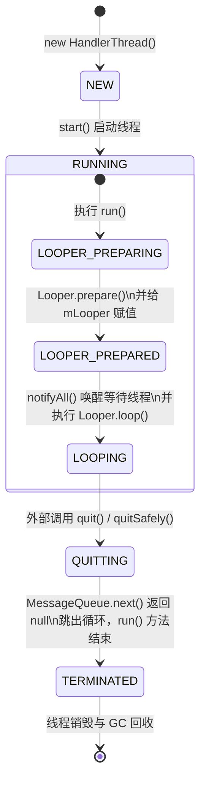
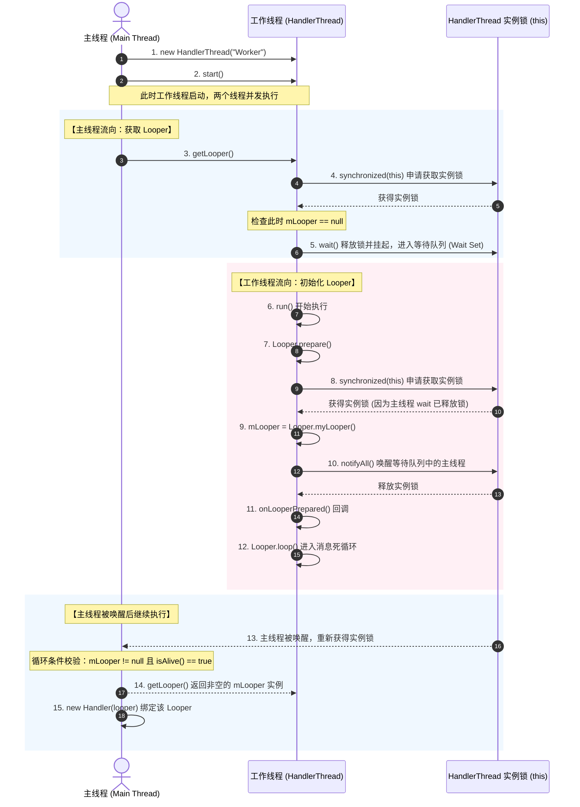
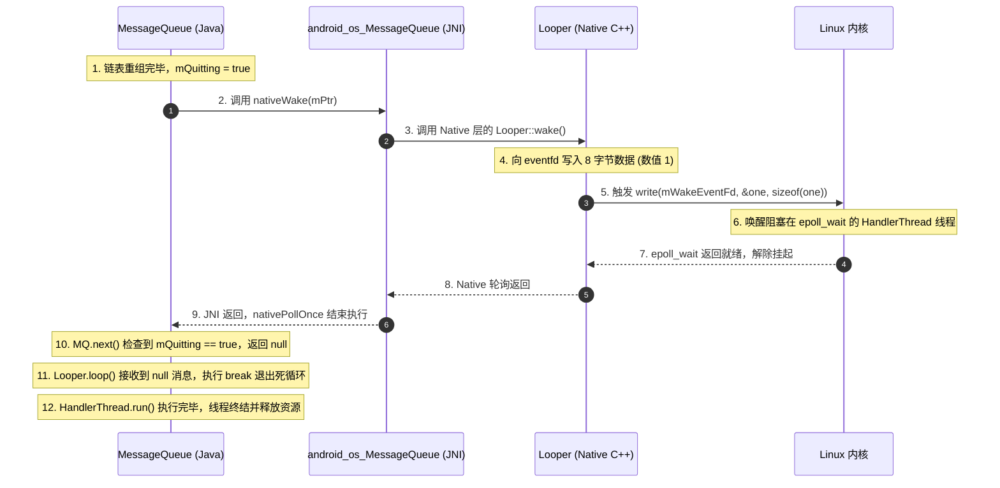

# 5.2.1.8 HandlerThread 深度解析

在 Android 的并发编程体系中，`HandlerThread` 是一个设计极为精妙、且在系统框架与各类 SDK 中被广泛应用的基石类。它虽然名字听起来像是 `Handler` 与 `Thread` 的简单拼接，但在其看似简单的 API 背后，常规地蕴含着关于**多线程并发协作、JVM 管程（Monitor）模型、内存可见性保障、操作系统内核 epoll 机制与 eventfd 的巧妙运用**，以及对**内存泄漏与资源回收**的深度考量。

本文将以系统化的技术视角，从“背景与设计初衷”、“架构设计与时序图解”、“核心机制与源码深度剖析”、“底层 Linux Epoll 与 Native 唤醒机制”、“典型应用与工程实践”以及“线上监控与避坑指南”等八个大维度，对 `HandlerThread` 展开全方位的深度剖析。

---

## 1. 背景、定义与设计初衷

要彻底理解 `HandlerThread` 的存在价值，我们需要首先回到 Android 系统架构设计的源头——**单线程 UI 模型**与**多线程并发协作的竞态痛点**。

### 1.1 UI 单线程模型的本质需求
Android 系统的 UI 渲染机制要求所有的 UI 操作必须在主线程（Main Thread，又称 UI 线程）中串行执行。由于 Android 平台采用的是基于事件驱动的单线程 UI 模型，这意味着任何耗时操作（如网络请求、大文件 I/O 读写、复杂的 SQLite 数据库操作或密集型的 CPU 计算）如果在主线程执行，都会导致主线程无法及时响应系统每隔 16.6ms（在 60Hz 刷新率下，高刷屏则更短）发送的屏幕刷新信号（VSYNC 信号），进而表现为用户界面卡顿，甚至在超时 5 秒后触发系统的 ANR（Application Not Responding）崩溃。

因此，主线程必须将繁重的工作移交给后台的子线程去执行。这是所有 Android 开发者面临的核心场景。

### 1.2 传统 Java 线程在 Android 消息模型下的痛点
为了在子线程中实现类似主线程的“无限循环、随时接收新任务”的消息机制，如果使用标准的 Java `Thread`，开发者需要手工搭建一套基于 `Looper` 的消息循环系统。其典型的样板代码（Boilerplate Code）如下所示：

```java
// 传统子线程消息循环搭建方式
class WorkThread extends Thread {
    private Looper mLooper;

    @Override
    public void run() {
        // 1. 初始化当前线程的 Looper 与 MessageQueue
        Looper.prepare();
        
        synchronized (this) {
            // 2. 获取当前线程的 Looper 引用
            mLooper = Looper.myLooper();
            // 3. 唤醒可能正在等待获取 Looper 的外部主线程
            notifyAll();
        }
        
        // 4. 开始无限消息循环
        Looper.loop();
    }

    public Looper getLooper() {
        return mLooper;
    }
}
```

尽管上述代码看起来并不复杂，但在多线程并发的真实生产环境下，它存在以下极其致命的并发安全隐患和开发痛点：

#### 1. 严重的竞态条件（Race Condition）与空指针（NPE）隐患
如果主线程（或另一个控制线程）创建并启动了这个子线程，然后立即想要向其投递任务，通常的做法是通过该子线程的 `Looper` 来实例化一个 `Handler`。代码如下：

```java
WorkThread workThread = new WorkThread();
workThread.start(); // 启动线程

// 立即使用子线程的 Looper 创建 Handler
Handler childHandler = new Handler(workThread.getLooper()); 
childHandler.post(() -> {
    // 异步任务逻辑
});
```
in 这一调用链中，`workThread.start()` 被调用后，操作系统的线程调度器将为该子线程分配 CPU 时间片，这需要一定的耗时。如果子线程的 `run()` 方法尚未执行到 `Looper.prepare()` 并给 `mLooper` 赋值，主线程的执行流就已经走到了 `workThread.getLooper()`。此时，`getLooper()` 将返回 `null`。

将 `null` 传入 `new Handler(Looper)` 会直接导致程序抛出 `NullPointerException: Can't create handler inside thread that has not called Looper.prepare()`，这在并发场景下是一个极其不稳定的线上隐患。

#### 2. 内存可见性（Memory Visibility）与重排序（Reordering）风险
根据 Java 内存模型（JMM）的定义，在没有提供妥善的同步屏障（Memory Barrier）的情况下，子线程在工作内存中对 `mLooper` 变量的修改，可能无法及时刷新回主内存；同时主线程读取 `mLooper` 时也是从自身的 CPU 缓存中获取，这会导致主线程即使在子线程已经完成了 `Looper.prepare()` 之后，依然读到 `mLooper` 为 `null`。

此外，JVM 为了优化性能，可能会对指令进行重排序。例如，`new Looper()` 的构造过程包括“分配内存空间”、“初始化构造器”和“将内存地址赋值给引用”三个步骤。在没有同步锁约束的情况下，指令重排序可能导致主线程读取到一个尚未完全初始化完毕的“半初始化状态”的 `Looper` 引用，进而引发更加隐蔽且难以排查的运行时崩溃。

### 1.3 HandlerThread 的破局方案
针对上述痛点，Android SDK 官方推出了 `HandlerThread`。它的本质是：**一个继承自 `Thread` 的包装类，在内部高度封装了 `Looper` 的初始化、消息循环启动，以及一整套用于解决多线程竞态条件的互斥同步机制。**

它提供给开发者的核心价值在于：
1.  **开箱即用**：免去了手动调用 `Looper.prepare()` 和 `Looper.loop()` 的样板代码。
2.  **绝对线程安全**：通过内部的锁机制，确保在调用 `getLooper()` 获取 `Looper` 实例时，如果子线程尚未初始化完毕，主线程会主动挂起进入等待状态，直至子线程的 `Looper` 初始化完成并安全暴露后才被唤醒返回。这彻底杜绝了并发导致的 `NullPointerException`。
3.  **单线程串行处理**：HandlerThread 内部的消息是通过单线程串行执行的。这种“串行化调度”天然地避免了多线程环境下的临界区锁竞争问题，非常适合用来处理那些需要严格按顺序执行的后台任务。

### 1.4 设计权衡（Trade-offs）
在计算机并发领域，没有哪种模型是完美的，`HandlerThread` 的设计同样伴随着取舍：
*   **优势**：极轻量。相对于线程池（ThreadPoolExecutor）而言，它不需要复杂的线程状态维护、线程池大小调整及多条线程带来的上下文切换（Context Switch）损耗。对于需要排队执行、无并发冲突、依赖定时/延迟机制的任务，HandlerThread 是最高效的工具。
*   **劣势**：不支持真正的并行计算。因为它是单线程串行结构，一旦队列中某个任务发生严重的阻塞（如耗时网络请求或复杂的 I/O 挂起），会导致队列中后续的所有任务发生饥饿与延迟。

---

## 2. 架构设计与生命周期模型

为了形象地展现 `HandlerThread` 的运作逻辑，下面我们通过状态机模型和多线程交互时序图来进行剖析。

### 2.1 完整生命周期状态机

`HandlerThread` 继承自 `java.lang.Thread`，但它的生命周期不仅仅受 Java 线程状态的控制，还深度绑定了其内部 `Looper` 的生命周期。



*   **`NEW`**：`HandlerThread` 被实例化，此时它与普通的 Java 线程无异，还没有分配底层的轻量级进程（LWP）以及分配系统栈。
*   **`LOOPER_PREPARING`**：调用 `start()` 后，线程进入可运行/运行状态，开始执行 `run()` 方法，并调用 `Looper.prepare()` 在当前线程的 `ThreadLocal` 变量中存入 `Looper` 实例。
*   **`LOOPER_PREPARED`**：`mLooper` 被成功赋值，并在 `synchronized` 锁块中调用 `notifyAll()` 通知所有在 `getLooper()` 上等待的调用者线程。此时会触发 `onLooperPrepared()` 模板回调。
*   **`LOOPING`**：线程进入 `Looper.loop()` 的死循环中，阻塞在 `MessageQueue.next()` 的 epoll 机制上，静静等待并消费消息。
*   **`QUITTING`**：外部发起退出调用。消息队列依据安全或非安全模式对消息链表实施重组与裁切，并通过 native 唤醒机制解除 loop 阻塞。
*   **`TERMINATED`**：`run()` 运行到大括号末尾，线程宣告死亡。相关引用被斩断，等待垃圾回收器（GC）回收资源。

### 2.2 主线程与 HandlerThread 并发协作时序图

下图重点演示了**当主线程超前调用 `getLooper()` 时，`HandlerThread` 内部如何通过 Java Monitor 锁机制实现双线程的安全同步**。



从上述时序图可以看出，无论工作线程由于 CPU 调度慢了多少，主线程的 `getLooper()` 方法都能够安全地阻塞并在 Looper 创建完成时被精准唤醒，从而确保了多线程架构的稳定性。

---

## 3. 核心机制与源码深度剖析

了解了其高层设计之后，我们直接切入 `HandlerThread` 核心源码。以下源码基于最新的 Android AOSP 实现，我们通过逐个字段、逐个方法、逐行注释的方式进行底层原理的剖析。

### 3.1 核心成员变量

```java
public class HandlerThread extends Thread {
    // 线程的优先级，对应 Process.THREAD_PRIORITY_*
    int mPriority;
    // 底层 Linux 线程的真实进程/线程 ID (TID)
    int mTid = -1;
    // 当前线程所绑定的 Looper 实例
    Looper mLooper;
    // 关联的消息队列，仅作缓存，以提升调用效率
    private @Nullable MessageQueue mQueue;

    public HandlerThread(String name) {
        super(name);
        // 默认优先级为标准应用线程优先级（THREAD_PRIORITY_DEFAULT = 0）
        mPriority = Process.THREAD_PRIORITY_DEFAULT;
    }

    public HandlerThread(String name, int priority) {
        super(name);
        mPriority = priority;
    }
    
    // ... 其他方法
}
```

#### 关键技术点：线程优先级（Priority）的处理
在 `HandlerThread` 中，有两个优先级概念：
1.  **Java 层的优先级**（`Thread.setPriority`）：取值范围为 1~10，主要由 JVM 的线程模型映射到系统线程调度，在 Android 平台中效果较弱。
2.  **Android 系统的 Linux Nice 值**（`Process.setThreadPriority`）：取值范围为 -20 到 19。数值越低，优先级越高，分配到的 CPU 时间片越多。Android 系统的底层调度器是基于 Linux CFS（Completely Fair Scheduler，完全公平调度器）实现的。在创建子线程时，强烈建议将其设置为后台线程级别（如 `Process.THREAD_PRIORITY_BACKGROUND = 10`），以便让出宝贵的 CPU 核心给前台 UI 渲染线程，防止发生 CPU 抢占引起的 UI 掉帧。

---

### 3.2 深入 `run()` 方法底层流向

`run()` 方法是工作线程的入口点，承载了 Looper 初始化的全部责任。

```java
@Override
public void run() {
    // 1. 获取并记录当前线程的 Linux LWP TID
    mTid = Process.myTid();
    
    // 2. 调用 Looper.prepare()，在当前线程的 ThreadLocal 中初始化 Looper
    Looper.prepare();
    
    // 3. 【核心同步块】获取 Looper 实例并赋值给成员变量，随后唤醒等待在 getLooper() 上的线程
    synchronized (this) {
        mLooper = Looper.myLooper();
        mQueue = Looper.myQueue();
        notifyAll(); // 唤醒所有处于 wait() 状态的外部线程
    }
    
    // 4. 设置 Linux 线程的 Nice 调度优先级
    Process.setThreadPriority(mPriority);
    
    // 5. 模板方法回调，供子类在开启 loop 循环前做初始化工作
    onLooperPrepared();
    
    // 6. 开启死循环消息调度，此方法会在此处阻塞，直到 Looper 退出
    Looper.loop();
    
    // 7. Looper 被退出后，程序才会走到这里，重置线程 TID
    mTid = -1;
}
```

#### 深度细节剖析与运行时隐患：
*   **`Process.myTid()` 的必要性**：为什么不用 Java 的 `Thread.currentThread().getId()`？因为 Java 中的线程 ID 是 JVM 内部自增的一个 Long 类型数字，而 `Process.myTid()` 返回的是操作系统内核中真正的线程 PID（LWP ID）。在进行底层的 CPU 亲和性设置、调试、或者在 `/proc/[pid]/task/` 下监控资源使用时，只有内核真实的 TID 才是有效标识。
*   **ThreadLocalMap 的挂载逻辑**：当 `Looper.prepare()` 被调用时，Looper 内部持有的 `sThreadLocal.set(new Looper(quitAllowed))` 开始执行。此操作会在 JVM 层面将新生成的 `Looper` 实例存入 `HandlerThread` 线程对象的 `threadLocals` 字段中。该字段 the 本质是一个 `ThreadLocalMap`。由于此 Map 的生命周期直接挂载在 `Thread` 实例上，当 `HandlerThread` 线程终结且对象被 GC 判定为不可达时，这个 Map 以及其中的 `Looper` 实例将自动伴随物理线程的销毁被一同释放，这体现了极高的并发自清洁设计理念。
*   **模板方法 `onLooperPrepared()`**：该方法在 `run()` 中是个空实现。它被特意设计在 `notifyAll()` 之后、`Looper.loop()` 之前被调用，允许开发者在进入消息循环前做初始化。
*   **运行期未捕获异常的致命后果**：在 `Looper.loop()` 中，如果正在执行的 `Message` 关联的 `Runnable.run()` 或者 `Handler.handleMessage()` 发生运行时异常且没有被 try-catch 捕获，异常将顺着调用栈直接抛出到 `HandlerThread.run()`，导致消息循环在没有经过安全退出的情况下强行中断，线程将直接死亡。因此，在 HandlerThread 中排队执行的任务必须在内部做好健壮的异常捕获。

---

### 3.3 深入 `getLooper()` 同步互斥与 JVM 管程机制

`getLooper()` 方法是 `HandlerThread` 架构中最具并发编程美感的一段代码。为了理解这段代码的并发深度，我们必须结合 JVM 的**管程（Monitor）**机制来剖析。

```java
public Looper getLooper() {
    // 1. 如果线程根本没有存活（未 start，或者已经死掉了），直接返回 null
    if (!isAlive()) {
        return null;
    }
    
    // 2. 【并发控制块】如果线程已启动，则通过实例锁阻塞，直至 Looper 构建完毕
    synchronized (this) {
        while (isAlive() && mLooper == null) {
            try {
                // 释放锁，进入等待状态，等待 run() 线程中的 notifyAll() 唤醒
                wait();
            } catch (InterruptedException e) {
                // 捕获中断异常，不中断循环，继续评估 mLooper 的状态
            }
        }
    }
    return mLooper;
}
```

#### 3.3.1 JVM 管程视角下的多线程交互
在 HotSpot JVM 中，每个 Java 对象在内存中都关联着一个 C++ 层的 `ObjectMonitor` 对象。当主线程执行到 `synchronized(this)` 时：
1.  **进入 Entry Set (锁池)**：主线程尝试竞争该 `HandlerThread` 实例的 Monitor 锁。如果竞争失败，主线程会在锁池中挂起。
2.  **获取锁并校验条件**：主线程成功获取锁后，将 `ObjectMonitor` 中的 `_owner` 字段指向自己。接着，它开始校验 `while (isAlive() && mLooper == null)`。由于此时工作线程尚未完成 `mLooper` 赋值，校验结果为 `true`。
3.  **进入 Wait Set (等待池) 并释放锁**：主线程在锁对象上调用 `wait()` 方法。在 JVM 内部，这意味着主线程会将自己封装成一个 `ObjectWaiter` 节点，放入该 Monitor 锁对象的 `_WaitSet` 链表中，同时将自己挂起。最关键的是，主线程会**释放已经持有的 Monitor 锁**（将 `_owner` 置空），使其他线程能够竞争这把锁。
4.  **工作线程抢占锁并赋值**：工作线程启动后，在 `run()` 方法中执行到 `synchronized(this)`，此时锁已经空闲，工作线程成功竞争到锁并更新 `_owner` 为自身。它将 `mLooper` 赋值，然后调用 `notifyAll()`。
5.  **唤醒与锁转移**：调用 `notifyAll()` 后，JVM 会遍历 `_WaitSet` 链表，将其中所有的等待节点（这里是主线程）移动到 `_EntryList`（锁池）中，并将 these 线程从操作系统级别的阻塞中唤醒。由于工作线程此时尚未退出 `synchronized` 同步块，主线程在锁池中重新参与竞争，但只能等待工作线程退出同步块并释放锁后，主线程才能成功竞争到锁并恢复执行。
6.  **二次评估**：主线程苏醒并重新竞争到锁后，程序从 `wait()` 之后的下一行代码恢复。由于 `while` 循环的设计，主线程会再次评估条件。此时 `mLooper != null`，循环破裂，主线程释放锁并带着非空的 `Looper` 引用返回。

#### 3.3.2 为什么必须在 `while` 循环中调用 `wait()`？
在并发编程的管程模型中，有一种管程同步缺陷叫做**虚假唤醒（Spurious Wakeup）**。这指的是线程在没有收到 `notify` 信号，或者在收到信号时发现同步条件变量依然没有被满足的情况下，从挂起中苏醒。
*   **操作系统原因**：在底层的 POSIX 线程库中，`pthread_cond_wait()` 可能会因为内核信号中断、操作系统内部的上下文切换或调度器的某种优化，导致在条件变量没有被置位时返回。
*   **if 校验的漏洞**：如果将 `while` 替换为 `if`：
    ```java
    if (isAlive() && mLooper == null) {
        wait(); // 被虚假唤醒或抢占失败后直接往下执行
    }
    return mLooper; // 此时 mLooper 可能依然是 null，直接返回导致 NPE！
    ```
    一旦线程苏醒，它不会重新校验 `mLooper` 是否为空，而是直接跳出 `if`并返回，这让主线程拿到了一个致命的 `null`。
*   **while 校验的绝对防线**：使用 `while` 循环可以强制线程在从 `wait()` 返回后，**必须重新在同步区内评估条件**。如果依然不符合，则再次调用 `wait()`。这是多线程编程中最基本的安全铁律。

#### 3.3.3 JMM 重排序、内存屏障与 Happens-before 学术原理推导
许多开发者会有疑问：`mLooper` 字段并没有被声明为 `volatile`，那主线程怎么能确保读到的不是工作线程 CPU 缓存中的过期值，或者是由于重排序产生的“半初始化”对象呢？

##### 1. Happens-before 规则链推导
Java 内存模型（JMM）通过 Happens-before 规则为并发提供了跨线程的有序性与可见性保证：
*   **Monitor Lock Rule (管程锁定规则)**：对于同一个锁对象，一个 `unlock`（解锁）操作 happens-before 于后面对这个锁的 `lock`（加锁）操作。
*   **Thread Start Rule (线程启动规则)**：主线程调用 `thread.start()` 操作 happens-before 于该线程的 `run()` 方法中的每一个动作。这确保了在 `start()` 调用之前主线程对任何共享变量的写操作，在子线程启动后都是立即可见的。
*   **Thread Termination Rule (线程终止规则)**：线程中的所有操作都 happens-before 于该线程的终止检测。如果主线程通过 `thread.join()` 成功等待工作线程结束，那么工作线程在运行期间的所有写入都对主线程立即可见。
*   **JMM 语义推导**：
    1. 工作线程在 `run()` 中对 `mLooper = Looper.myLooper()` 进行赋值是在 `synchronized(this)` 块内进行的。工作线程退出同步块时执行了 `unlock`。
    2. 主线程在 `getLooper()` 中读取 `mLooper` 是在 `synchronized(this)` 块内进行的。主线程进入同步块时执行了 `lock`。
    3. 根据管程锁定规则，工作线程的 `unlock` happens-before 于主线程的 `lock`。
    4. 结合 **Transitivity (传递性)**：由于工作线程赋值操作 happens-before 于 `unlock`，而 `unlock` happens-before 于主线程的 `lock`，`lock` happens-before 于主线程读取 `mLooper` 的操作。
    5. 因此，工作线程对 `mLooper` 的所有修改，对于成功进入同步块的主线程而言，都是**绝对可见的**。

##### 2. 硬件级别的内核内存屏障（Memory Barrier）
在底层的 JVM 虚拟机（如 Android Runtime ART）以及 CPU 硬件级别，为了保证 `synchronized` 块内的数据一致性，在进入和退出锁代码段时，虚拟机会在生成的机器码中插入特定的内存屏障指令。
*   **内存屏障类型**：包括 `LoadLoad`、`LoadStore`、`StoreStore` 和 `StoreLoad` 四种基本屏障。
*   **同步指令转换**：当工作线程退出 `synchronized` 块并释放锁时，虚拟机会在底层插入 `StoreStore` 屏障，确保在锁释放前，将子线程寄存器和本地 CPU 缓存中所有被修改的变量（包括 `mLooper` 的引用及其内部字段）强制刷新写入到主内存中。
*   **架构差异**：在 ARM 架构（Android 设备的主要芯片架构）这种弱内存模型（Weak Memory Model）下，CPU 的重排序倾向非常剧烈，屏障的插入是硬件级别的指令（如 `dmb` 或 `dsb`），它会强制排空 CPU 内部的写缓冲区（Write Buffer）；而在 x86 架构（通常为模拟器环境）这种强内存模型下，除了 `StoreLoad` 屏障需要硬件指令（如 `lock` 前缀指令）外，其他屏障很多时候在硬件层面被直接忽略，因为 x86 默认保证了写操作的全局顺序。
*   **安全性结论**：依靠 `synchronized` 隐式引入的硬件级内存屏障，`HandlerThread` 不需要将 `mLooper` 声明为 `volatile` 即可完全封死任何指令重排序或缓存过期的物理漏洞，保证数据在不同 CPU 核心之间的强一致性。

##### 3. 吞咽 `InterruptedException` 的深层设计折衷
在 `getLooper()` 的 `synchronized` 代码块中，对于捕获到的 `InterruptedException`，设计者进行了解析为“空处理”的特殊策略：
*   **传统 Java 规范**：常规的并发规范中，生吞中断异常（Swallowing InterruptedException）被视为一种反模式（Anti-pattern）。正常的处理方式应当是调用 `Thread.currentThread().interrupt()` 以重新标记当前线程的中断状态，或者直接向上层抛出该异常，以让调用者感知到中断事件。
*   **Android 工程折衷（Trade-off）**：`HandlerThread` 的获取往往是在应用主流程（如自定义 Application 的初始化、或者是 Activity 启动的生命周期路径）上以极其同步的方式进行的。如果在该时刻向上层抛出中断异常，或是因为中断而退出了循环，返回了一个 `null` 或者是半初始化的 `Looper`，上层几乎没有任何健壮的恢复手段，应用通常会立即发生 `NullPointerException` 崩溃。为了保证主线程以及整个业务初始化链条获取 Looper 的“坚固确定性”，设计者选择了生吞异常并继续循环，以“最大努力（Best-effort）”坚守等待，直到拿到合法的 Looper。这体现了移动终端工程实践中对“高可用度与高稳定性”的优先考量。

---

## 4. 底层 Linux Epoll 与 Native 唤醒机制

很多开发者知道 Handler 机制是基于内核的 `epoll` 实现的，但 JNI 层面是如何打通 Java 和 Native，以及 Linux 内核事件通知机制又是如何被运用的，需要深入剖析。

### 4.1 Native 层消息队列的双层映射与轮询
在 Java 层调用 `Looper.prepare()` 时，底层通过 JNI 调用了 Native 层的 `NativeMessageQueue` 初始化。
*   **JNI 指针映射**：Java 层的 `MessageQueue` 内部持有一个 `long mPtr` 字段。这个字段在底层其实是一个强转成 `long` 的 C++ 层 `NativeMessageQueue` 对象的物理内存指针地址。
*   **双层轮询机制**：当 Java 层执行 `MessageQueue.next()` 时，最终会调用 `nativePollOnce(mPtr, nextPollTimeoutMillis)`。JNI 对应函数在拿到 `mPtr` 指针后，会将其还原为 `NativeMessageQueue*` 对象，并调用其 `pollOnce` 方法。该方法最终会流向 Native C++ 的 `Looper::pollOnce`，底层便在此调用 Linux 的 `epoll_wait` 监听红黑树中的文件描述符。

### 4.2 Linux Epoll 机制原理
在 Linux 操作系统中，`epoll` 是为了解决传统 `select/poll` 机制在处理高并发文件描述符（FD）时因轮询导致效率极低而设计的 I/O 多路复用机制。它包含三个核心系统调用：
1.  **`epoll_create(int size)`**：在内核中创建一个 epoll 实例，建立一颗红黑树用于保存需要监听的文件描述符，并建立一个双向链表作为就绪队列（Ready List）。
2.  **`epoll_ctl(int epfd, int op, int fd, struct epoll_event *event)`**：对红黑树进行增删改。Android 消息机制在 Native 层初始化 Looper 时，会利用此系统调用将用于进程内通信 of `eventfd` 的读端文件描述符加入红黑树中，监听其可读事件（`EPOLLIN`）。
3.  **`epoll_wait(int epfd, struct epoll_event *events, int maxevents, int timeout)`**：阻塞等待。当红黑树中监听的文件描述符没有事件发生时，调用线程会让出 CPU，进入内核级等待队列休眠，不消耗任何 CPU 计算资源。当被监听的 FD 发生可读写事件时，内核将该 FD 的节点移动到 Ready List，并唤醒阻塞在 `epoll_wait` 的线程，通过该方法返回就绪事件。

### 4.3 C++ 层的唤醒设计：eventfd 的优势
在 Android 6.0 之后，系统的 Native Looper 弃用了传统的 `pipe` 管道，改用 Linux 系统专有的 `eventfd` 来实现跨线程事件唤醒。
*   **pipe 的缺陷**：传统的 `pipe` 管道必须分配两个文件描述符（读端和写端），并且在内核中必须开辟一块缓存区用于数据传输，系统资源开销很大。
*   **eventfd 的优势**：Linux 的 `eventfd` 是一个专门用于进程或线程间通信的极轻量级系统调用。它在内核中仅需要分配一个文件描述符，底层只维护一个无符号的 8 字节（64位）整型计数器。它的读写操作直接修改这个内核计数器的值，省去了传统管道物理缓冲区的内存映射与拷贝开销，性能提高了一个数量级以上，这对于 Android 这种高频的消息分发场景具有显著的性能红利。

当 Native Looper 初始化时：
```cpp
// Native 层 Looper 构造函数片段 (Looper.cpp)
Looper::Looper(bool allowCallOnToWeakRef) {
    mWakeEventFd.reset(eventfd(0, EFD_NONBLOCK | EFD_CLOEXEC)); // 创建 eventfd
    
    // ...
    // 使用 epoll_ctl 将 mWakeEventFd 注册到内置的 epoll 实例中
    int result = epoll_ctl(mEpollFd.get(), EPOLL_CTL_ADD, mWakeEventFd.get(), &eventItem);
}
```

当外部调用 `quit()` 触发唤醒时，Native 层调用 `Looper::wake()`：
```cpp
// Native 层唤醒实现 (Looper.cpp)
void Looper::wake() {
    uint64_t inc = 1;
    // 向 eventfd 写入 8 字节数据 "1"，直接唤醒阻塞在 epoll_wait 的工作线程
    ssize_t nWrite = TEMP_FAILURE_RETRY(write(mWakeEventFd.get(), &inc, sizeof(uint64_t)));
    // ...
}
```
通过内核的信号机制，工作线程得以几乎在微秒级别瞬间摆脱休眠，从而保证了退出动作响应的即时性。

---

## 5. 退出机制与 MessageQueue 链表重组

### 5.1 深度对比 `quit()` 与 `quitSafely()` 的 MessageQueue 链表重组

退出机制是 HandlerThread 生命周期终结的关键。我们通过直观的队列数据结构图来拆解 `quit()` 和 `quitSafely()` 执行时，`MessageQueue` 链表内部发生的深刻改变。

#### 5.1.1 退出前的初始队列链表状态
假设当前 `MessageQueue` 队列中的消息链表如下所示，系统当前时间为 `now = 1000`：

```
mMessages (链表头)
   │
   ▼
[Msg A] ──► [Msg B] ──► [Msg C] ──► [Msg D] ──► [Msg E] ──► null
(when=900)  (when=1000) (when=1100) (when=1500) (when=2000)
 ◄即时消息►  ◄即时消息►  ◄延迟消息►  ◄延迟消息►  ◄延迟消息►
```

---

#### 5.1.2 调用 `quit()` (非安全退出) 后的队列改变
在执行 `quit()` 后，底层触发 `removeAllMessagesLocked()`：

1.  **物理遍历与回收**：
    `mMessages` 指向 `Msg A`。代码进入循环，将 `Msg A` 的所有内部字段（如 `target`、`callback`、`obj`）清空，并将 `Msg A` 回收到系统的复用池。
    接着顺着 `next` 指针，依次对 `Msg B`、`Msg C`、`Msg D`、`Msg E` 进行物理字段清空与复用池回收。
2.  **链表切断**：
    最终，`mMessages` 指针被直接置空：

```
mMessages ──► null

被丢弃并回收到复用池的孤立消息：
[Msg A(已清理)]、[Msg B(已清理)]、[Msg C(已清理)]、[Msg D(已清理)]、[Msg E(已清理)]
```

*   **后果**：所有消息全部丢失，任务处理半途而废。

---

#### 5.1.3 调用 `quitSafely()` (安全退出) 后的队列改变
当我们在 `now = 1000` 时调用 `quitSafely()`，底层触发 `removeAllFutureMessagesLocked()`：

1.  **确定分水岭**：
    系统检索到当前时间 `now = 1000`。
2.  **查找首个未来的延迟消息**：
    *   遍历 `Msg A`（`when = 900`），`900 <= 1000`，保留。
    *   遍历 `Msg B`（`when = 1000`），`1000 <= 1000`，保留。
    *   遍历 `Msg C`（`when = 1100`），`1100 > 1000`，**找到分水岭！** 此时 `Msg C` 就是首个未来的延迟消息，而它的前驱节点是 `Msg B`。
3.  **链表断开与丢弃延迟消息**：
    *   将 `Msg B.next` 强制置为 `null`，完成链表截断，保留前半部分。
    *   从 `Msg C` 开始往后遍历，依次清理并回收 `Msg C`、`Msg D`、`Msg E` 到复用池。

```
mMessages (链表头)
   │
   ▼
[Msg A] ──► [Msg B] ──► null  (这部分消息将继续在当前 loop 中被消费完)
(when=900)  (when=1000)

已经断开连接并回收到复用池的延迟消息：
[Msg C(已清理)] ──► [Msg D(已清理)] ──► [Msg E(已清理)]
```

*   **效果**：系统极为平滑地保证了那些在退出指令前理应被执行的即时任务（`Msg A` 和 `Msg B`）的执行完整性，同时剔成了未来才执行的干扰任务。

---

### 5.2 唤醒流程与线程终止

当上述链表重组完成后，`MessageQueue.quit()` 会调用 `nativeWake(mPtr)`，触发以下连续动作：



通过这一精确的唤醒链路，`HandlerThread` 得以优雅地摆脱内核阻塞，干净利落地完成线程的消亡与内存释放。

---

## 6. 典型应用场景与工程实践

在真实的 Android 系统架构和各类高性能 SDK 中，`HandlerThread` 扮演着非常关键的后台调度角色。

### 6.1 场景一：SQLite 数据库读写的串行保护（如 Room 底层逻辑）
在操作本地数据库时，如果多个子线程同时并发对 SQLite 写入数据，由于 SQLite 本身的文件锁机制，极易触发 `android.database.sqlite.SQLiteDatabaseLockedException: database is locked`。
为了避免复杂的 Java 重入锁（ReentrantLock）导致的线程阻塞与死锁风险，Room 或传统的 SQLiteOpenHelper 在底层通常使用单线程调度器来对所有的写操作进行串行化。

```java
public class DatabaseWriteExecutor {
    private final HandlerThread mDbThread;
    private final Handler mDbHandler;

    public DatabaseWriteExecutor() {
        mDbThread = new HandlerThread("DB-Write-Thread", Process.THREAD_PRIORITY_BACKGROUND);
        mDbThread.start();
        mDbHandler = new Handler(mDbThread.getLooper());
    }

    public void executeWrite(Runnable writeTask) {
        // 利用 HandlerThread 的 FIFO 队列天然保证写入的绝对串行顺序，避免并发锁竞争
        mDbHandler.post(writeTask);
    }
    
    public void close() {
        mDbThread.quitSafely();
    }
}
```

*   **架构用意**：这种设计不追求极致的并发吞吐，而是追求**数据的绝对安全与一致性**。利用 `HandlerThread` 极低的开销，以最简短的代码实现了数据库写入的串行保护。

---

### 6.2 场景二：后台定时轮询器与心跳同步
对于后台定期上报打点数据、网络长连接的定时心跳包同步，引入高开销的 `ScheduledExecutorService` 会导致核心线程长期驻留，而 `Timer` 机制在发生未捕获异常时会导致整条线程挂掉。
`HandlerThread` 配合 `sendMessageDelayed` 是实现轻量级轮询的最佳搭档：

```java
public class HeartbeatPoller {
    private static final int MSG_HEARTBEAT = 0x101;
    private static final long HEARTBEAT_INTERVAL = 30000; // 30 秒心跳一次

    private final HandlerThread mPollThread;
    private final Handler mPollHandler;

    public HeartbeatPoller() {
        mPollThread = new HandlerThread("HeartbeatPoller", Process.THREAD_PRIORITY_BACKGROUND);
        mPollThread.start();
        
        mPollHandler = new Handler(mPollThread.getLooper()) {
            @Override
            public void handleMessage(Message msg) {
                if (msg.what == MSG_HEARTBEAT) {
                    performHeartbeatTask();
                    // 循环投递消息实现无限轮询
                    sendEmptyMessageDelayed(MSG_HEARTBEAT, HEARTBEAT_INTERVAL);
                }
            }
        };
    }

    public void startPolling() {
        // 移除队列中所有的旧心跳消息，防范重复启动
        mPollHandler.removeMessages(MSG_HEARTBEAT);
        mPollHandler.sendEmptyMessage(MSG_HEARTBEAT);
    }

    public void stopPolling() {
        mPollHandler.removeMessages(MSG_HEARTBEAT);
    }

    private void performHeartbeatTask() {
        // 具体的异步心跳请求逻辑
    }

    public void destroy() {
        stopPolling();
        mPollThread.quitSafely();
    }
}
```

---

### 6.3 场景三：从 `IntentService` 到 `JobIntentService` 与 `WorkManager` 的技术演进
在前文中我们深入剖析了 `IntentService` 底层利用 `HandlerThread` 进行任务调度与自动自毁的核心机制。为了更清晰地了解这一后台架构演进线索，我们需要将时序及生命周期关系进行全面拆解：

#### 1. `IntentService` 的核心方法生命周期链路
*   **`onCreate()`**：当组件首次被拉起时执行。其内部首先初始化 `HandlerThread` 实例，并指定后台优先级（`THREAD_PRIORITY_BACKGROUND`）。然后调用 `thread.start()`。接下来，主线程调用 `thread.getLooper()`（触发前面所论述的管程同步挂起机制），在拿到非空 Looper 后实例化内部类 `ServiceHandler`。
*   **`onStartCommand()`**：每次外部通过 `startService(Intent)` 投递新任务时，系统会回调此方法。它会递增一个代表任务流水号的 `startId`，随后调用 `onStart(intent, startId)`。
*   **`onStart()`**：通过前面初始化好的 `ServiceHandler`，将本次携带的 Intent 封装为 `Message` 实例投递到 `HandlerThread` 的 `MessageQueue` 中排队。
*   **`onHandleIntent()`**：工作线程在收到消息后，会串行回调该方法。子类在这里编写具体的耗时业务逻辑。
*   **`stopSelf(startId)`**：这是最重要的动作。当 `onHandleIntent()` 结束后，HandlerThread 会尝试调用服务关闭方法。AMS 服务在内核中校验当前请求停止的 `startId` 是否是当前 Service 接收到的最新任务号。如果是，才真正注销销毁该 Service；否则拒绝清理，使队列中的后续任务得以继续处理。
*   **`onDestroy()`**：服务被完全关闭时回调。它必须负责调用其底层绑定的 `Looper.quitSafely()` 以终结工作线程并斩断强引用链条。

若系统在运行过程中因为低内存（Low Memory）被系统杀掉，当系统内存恢复且该 IntentService 被配置为 `START_REDELIVER_INTENT` 时，系统会重新调用 `onCreate()` 重新建立 `HandlerThread`，并且将之前积压在排队队列中但还没执行完的那些 Intent 重新投递进新线程中执行，保证了后台任务的恢复力。

#### 2. Android 8.0 (API 26) 后台限制（参见 [AndroidVersionChangeLog.md](../../../../AndroidVersionChangeLog.md)）
从 API 26 开始，系统禁止应用在后台处于闲置状态时启动普通的后台服务（Background Service）。如果尝试调用 `startService()`，系统会立即抛出 `IllegalStateException: Not allowed to start service Intent...`。
这一硬性限制直接导致了 `IntentService` 无法在后台正常工作，因为它的本质就是一个普通的服务。

#### 3. 过渡方案：`JobIntentService`
为了兼容 API 26+，官方推出了 `JobIntentService`。其精妙之处在于：
*   **在 API 26 之前**：它在底层依然作为普通的 Service 启动，并自己创建 `HandlerThread` 串行执行任务。
*   **在 API 26 及之后**：它不再使用普通的 Service，而是通过系统的 `JobScheduler` 服务，将任务封装为 `JobWorkItem` 分发给 `JobService` 执行。它工作在系统进程共享的线程池上，避免了本地自建 `HandlerThread` 对应用常驻线程指标的浪费。

#### 4. 终极推荐：`WorkManager` 的物理持久化机制
现代 Android 推荐使用 `WorkManager` 来替代所有的后台任务组件。在可靠性（Reliability）和任务恢复性上，WorkManager 展现出了比 `HandlerThread` 内存队列无可比拟的物理优势：
*   **持久化机制（Room）**：当开发者通过 `WorkManager.enqueue()` 提交一个异步工作（`WorkRequest`）时，该任务的执行状态、参数配置、触发约束条件等数据会在第一时间被写入系统的本地 `Room` 数据库中作为 `WorkSpec` 记录持久化存储。
*   **系统级恢复力（Reboot Recovery）**：因为数据物理落盘，即使设备突发断电、用户强杀应用或者系统低内存强杀进程，在设备重启后，`WorkManager` 会通过监听系统的 `BOOT_COMPLETED` 广播，借助 `JobScheduler` 服务自动从本地 Room 数据库中重新加载尚未完成的工作，并分配系统内核共享的 `Executor` 线程池重新拉起执行。这完全克服了 `HandlerThread` 因内存状态消失导致未处理消息整体处理失败的致命痛点。

---

### 6.4 协同工作：与 Handler 其他核心组件的联动
`HandlerThread` 在真实工程中，往往还会联合 `ThreadLocal`、`IdleHandler` 以及 `消息屏障（Sync Barrier）` 完成更加复杂的时序控制。

#### 1. 结合 ThreadLocal 锁死单线程 Looper
根据 Android 消息机制的设计，一个线程绝对不允许同时拥有两个 `Looper` 实例。`HandlerThread` 通过在 `run()` 方法中调用 `Looper.prepare()`，其实际是在 `ThreadLocal` 中存入当前线程唯一的 `Looper`。这保证了即使外部频繁对该工作线程对象做各种反射或状态重置，其底层运行的 Linux 线程局部变量也无法被篡改，从而保障了运行时的逻辑隔离性。

#### 2. 结合 IdleHandler 在空闲时进行垃圾整理
由于 `HandlerThread` 通常在后台执行诸如日志读写、传感器采集等低优先任务，我们可以通过向其 Looper 关联的 MessageQueue 注册一个 `IdleHandler`，在子线程没有任何新消息需要处理时，利用这个空闲的 CPU 间隙执行一些轻量级清理任务：

```java
// 在 HandlerThread 空闲时触发清理
thread.getLooper().getQueue().addIdleHandler(new MessageQueue.IdleHandler() {
    @Override
    public boolean queueIdle() {
        // 在子线程空闲时，同步离线文件，或者进行内存垃圾回收
        System.gc(); 
        // 返回 false 代表只执行一次，返回 true 代表每次空闲都触发
        return false; 
    }
});
```

#### 3. 消息屏障与 HandlerThread 协作机制
在 Android 系统（如主线程的 Choreographer）中，为了确保屏幕刷新和绘制事件能够以最高优先级被响应，系统会向 MessageQueue 插入一个**消息屏障（Sync Barrier）**。
*   **什么是屏障**：屏障其实是一个特殊的 `Message`，它的 `target`（即 Handler 实例引用）为 `null`。
*   **协同调度内幕**：当工作线程在 `MessageQueue.next()` 中检索到 `target == null` 的屏障消息时，整个队列的轮询逻辑会瞬间发生改变：线程将**完全忽略并挂起后续所有的普通同步消息**，而是只在链表中向后检索被声明为 `isAsynchronous() == true` 的**异步消息**并予以分发。
*   **清除屏障**：直到主线程或调用线程调用 `removeSyncBarrier(token)` 移除屏障后，队列才重新恢复正常的消息分发。虽然在通常的后台 `HandlerThread` 业务中开发者极少主动投递异步消息，但理解这套屏障机制对于排查队列卡顿和消息延迟至关重要。

---

## 7. 高级缺陷、常见误区与避坑指南

尽管 `HandlerThread` 被系统良好封装，但在大中型商业应用的生产环境中，由于不当使用导致的内存泄漏、线程饥饿和死等故障非常频繁。

### 7.1 痛点之一：任务堆积与线程饥饿（Thread Starvation）

由于 `HandlerThread` 核心是一个**单线程的无限循环结构**，因此它的并发吞吐能力非常微弱。

#### 线上生产环境 APM 监控方案（以 BlockCanary 原理为例）
为了在线上捕捉究竟是哪个慢任务导致了 `HandlerThread` 发生卡顿，我们可以编写一个完整的、能够在生产环境下监控 `Handler` 执行时长的 APM 拦截器类，通过提取 `Looper` 内部打印日志中的类名、Callback 信息进行深度分析：

```java
public class HandlerThreadLooperMonitor implements Printer {
    private static final String TAG = "HTLooperMonitor";
    private final long mBlockThresholdMs;
    private long mStartTimestamp = 0;
    
    // 正则表达式：用于解析 Looper 打印的日志结构，提取 Handler 的 Target Class 和 Callback
    private static final Pattern LOG_PATTERN = Pattern.compile(">>>>> Dispatching to Handler \\((.*?)\\) (.*?): (\\d+)");

    /**
     * @param blockThresholdMs 判定为卡顿的阈值时间，单位毫秒（建议设置为 1000ms）
     */
    public HandlerThreadLooperMonitor(long blockThresholdMs) {
        this.mBlockThresholdMs = blockThresholdMs;
    }

    @Override
    public void println(String x) {
        if (x.startsWith(">>>>> Dispatching to")) {
            // 记录消息开始分发的时间戳
            mStartTimestamp = System.currentTimeMillis();
        } else if (x.startsWith("<<<<< Finished to")) {
            if (mStartTimestamp == 0) {
                return;
            }
            long costTime = System.currentTimeMillis() - mStartTimestamp;
            mStartTimestamp = 0; // 重置时间戳

            // 如果执行时长超过设定的阈值，则发出卡顿预警
            if (costTime > mBlockThresholdMs) {
                handleBlockWarning(costTime, x);
            }
        }
    }

    private void handleBlockWarning(long costTime, String looperLog) {
        Log.e(TAG, "⚠️ 检测到工作子线程发生卡顿！执行耗时：" + costTime + " ms");
        
        Matcher matcher = LOG_PATTERN.matcher(looperLog);
        if (matcher.find()) {
            String handlerClass = matcher.group(1); // 提取出 Handler 的具体类名
            String callbackClass = matcher.group(2); // 提取 Callback 实例名
            String messageWhat = matcher.group(3); // 提取消息的 what 值
            
            Log.e(TAG, "卡顿 Handler 类名：" + handlerClass);
            Log.e(TAG, "卡顿 Callback：" + callbackClass);
            Log.e(TAG, "Message.what：" + messageWhat);
        } else {
            Log.e(TAG, "Looper 原始日志：" + looperLog);
        }
        
        // 【线上 APM 进阶】此处可以利用当前线程获取堆栈快照，以便在后台上传定位问题
        // Thread currentThread = Thread.currentThread();
        // StackTraceElement[] stackTrace = currentThread.getStackTrace();
        // uploadStackTraceToApmServer(stackTrace);
    }
}
```

**接入代码**：
```java
HandlerThread sensorThread = new HandlerThread("SensorQueue");
sensorThread.start();

// 注册卡顿监控拦截器，卡顿时间设为 800 毫秒
sensorThread.getLooper().setMessageLogging(new HandlerThreadLooperMonitor(800));
```

---

### 7.2 痛点之二：并发竞态与 NPE 测试用例分析

许多开发者容易忽视 `thread.start()` 调用时机带来的崩溃隐患。我们通过以下两个多线程测试用例来分析其中的机制。

#### 1. 普通线程下的 NPE 并发崩溃复现测试
```java
public class RaceConditionDemo {
    private static Looper mLooper = null;

    public static void main(String[] args) {
        Thread subThread = new Thread("Sub") {
            @Override
            public void run() {
                Looper.prepare();
                mLooper = Looper.myLooper();
                Looper.loop();
            }
        };

        subThread.start();

        // 立即尝试获取并创建 Handler，极高概率抛出 NPE 崩溃！
        if (mLooper == null) {
            System.out.println("❌ 竞态发生：子线程的 Looper 尚未初始化完成！");
        }
        try {
            Handler handler = new Handler(mLooper); // 如果 mLooper == null 则抛出 NullPointerException
        } catch (NullPointerException e) {
            e.printStackTrace();
        }
    }
}
```
*   **分析**：由于 `subThread.start()` 启动后需要被 CPU 重新调度，而主线程继续高速执行，此时 `mLooper` 极概率发生处于 `null`，从而触发空指针崩溃。

#### 2. HandlerThread 下的绝对线程安全保障测试
```java
public class HandlerThreadSafeDemo {
    public static void main(String[] args) {
        final HandlerThread handlerThread = new HandlerThread("SafeThread");
        
        // 启动 50 个主/子线程并发去竞争获取 HandlerThread 的 Looper
        for (int i = 0; i < 50; i++) {
            final int index = i;
            new Thread(() -> {
                if (index == 5) {
                    // 模拟在某个线程中启动工作线程
                    handlerThread.start();
                }
                
                // 并发调用 getLooper()
                Looper looper = handlerThread.getLooper();
                if (looper != null) {
                    System.out.println("✅ 线程 " + Thread.currentThread().getName() + " 成功且安全地获取到了 Looper！");
                } else {
                    System.out.println("⚠️ 线程 " + Thread.currentThread().getName() + " 获取到 null (可能尚未 start 或已销毁)");
                }
            }, "Thread-" + i).start();
        }
    }
}
```
*   **机制**：`HandlerThread.getLooper()` 内部的锁同步块能够让那些在 `handlerThread.start()` 之前或期间调用的线程进入安全的等待状态，当且仅当 `start()` 触发了 `run()` 并且 `mLooper` 彻底赋值且刷新后，才会被批量唤醒并返回，这从根本上阻断了竞态条件的发生。

---

### 7.3 痛点之三：内存泄漏（Memory Leak）隐患

在 Android 开发中，`HandlerThread` 如果使用不当，是非常经典的内存泄漏源头（GC Root）。

#### 泄漏路径分析：
1.  开发者在 Activity 中实例化了一个非静态内部类 Handler，并将其与 `HandlerThread` 的 Looper 绑定。
2.  非静态内部类默认持有外部类 Activity 的强引用。
3.  非静态内部类被传入的 `Message` 的 `target` 字段强引用。
4.  `Message` 此时又被 `MessageQueue` 队列中的单向链表强引用。
5.  `MessageQueue` 被 `Looper` 强引用。
6.  `Looper` 被 `HandlerThread` 线程强引用。
7.  `HandlerThread` 是处于 `RUNNING` 状态的活跃线程。根据 JVM GC 规范，**所有活跃线程都是 GC Root**。
8.  当 Activity 退出时，由于这一条链路的强引用牵制，GC 无法释放 Activity，导致 Activity 内存泄漏。

```
GC Root (系统活跃线程)
   └── HandlerThread (工作线程)
        └── Looper 实例
             └── MessageQueue
                  └── Message 链表
                       └── Target (非静态内部类 Handler)
                            └── Outer Class (Activity/Fragment)  ◄── 【泄漏发生】
```

#### 彻底切断泄漏的标准范式：
要在生命周期结束时（如 `onDestroy()`）严格按照以下三步执行清理动作：

```java
public class MyActivity extends Activity {
    private HandlerThread mLogThread;
    private Handler mLogHandler;

    @Override
    protected void onCreate(Bundle savedInstanceState) {
        super.onCreate(savedInstanceState);
        mLogThread = new HandlerThread("LogThread", Process.THREAD_PRIORITY_BACKGROUND);
        mLogThread.start();
        mLogHandler = new Handler(mLogThread.getLooper()) {
            @Override
            public void handleMessage(Message msg) {
                // 耗时任务
            }
        };
    }

    @Override
    protected void onDestroy() {
        super.onDestroy();
        // 1. 清空所有的待处理消息与 Callback，杜绝未决消息持有的强引用关系
        if (mLogHandler != null) {
            mLogHandler.removeCallbacksAndMessages(null);
        }
        
        // 2. 彻底安全关闭消息循环与线程，使 HandlerThread 跳出 loop 并走向 TERMINATED 状态
        if (mLogThread != null) {
            mLogThread.quitSafely(); 
        }
        
        // 3. 置空引用，加快垃圾回收处理
        mLogHandler = null;
        mLogThread = null;
    }
}
```

---

### 7.4 痛点之四：HandlerThread 物理开销与系统资源损耗分析
很多开发者习惯随意在项目里大量创建 `HandlerThread`：“每个后台任务都建立一个 HandlerThread”。实际上，过滥创建 HandlerThread 会带来极大的系统级性能损耗。

#### 1. 物理内存的固定开销
在 JVM 中，每个线程都需要独立分配栈空间（Thread Stack）。
*   **Android 系统限制**：在 ART (Android Runtime) 中，应用线程的默认栈大小通常是 **1024KB (1MB)**。这意味着，仅仅是 `new HandlerThread().start()` 这个动作本身，哪怕你不执行任何任务，操作系统也会直接预留 1MB 的物理内存用于保存该线程的方法栈、局部变量表和调用帧帧头。
*   **虚拟内存耗尽**：如果应用中并发创建了超过 50 个以上的 HandlerThread，将直接吃掉 50MB 以上宝贵的虚拟内存，甚至容易引发 `OOM: pthread_create failed (1024KB stack; 84 threads)` 崩溃。

#### 2. 上下文切换（Context Switch）的损耗
由于 CPU 核心数量是有限的，当多个 `HandlerThread` 同时处于就绪并抢占 CPU 时间片时，操作系统内核调度器会频繁发生上下文切换：
*   **寄存器保存**：保存当前 CPU 寄存器和程序计数器（PC）的值。
*   **页表切换**：刷新进程页表，切换 CPU 到新的虚拟内存上下文。
*   **Cache Miss 灾难**：上下文切换最大的代价在于它会让 CPU 内部的 L1, L2, L3 硬件高速缓存直接失效（Flush Cache）。当新线程启动后，在很长一段时间内会发生严重的 **Cache Miss**，必须被迫去极其缓慢的 DDR 物理主内存中重新载入代码和数据，导致 CPU 计算效能断崖式下跌。
*   **优化建议**：对于应用内的轻量后台操作，建议共享同一个 `HandlerThread`（比如全局日志上传使用同一个线程，本地打点共享同一个线程），禁止盲目建立独立的私有 `HandlerThread`。

#### 3. 架构重构：基于 SharedHandlerThread 的统一线程池化复用设计
在大型复杂工程中，为了避免多路线程带来的物理栈内存挤爆与剧烈的上下文调度竞争，优秀的架构设计会引入全局唯一的、高度隔离的任务分发管理器 `SharedHandlerThreadManager`。

同时，我们通过向该管理器申请 Handler 时传入自定义 `Handler.Callback` 接口，能够以极其优雅的方式在不同的业务组件之间实现消息接收和分发逻辑的物理隔离，而不需要为每个业务都定制派生 Handler 的类定义：

```java
public class SharedHandlerThreadManager {
    private static volatile SharedHandlerThreadManager sInstance;
    private final HandlerThread mSharedThread;
    private final Handler mSharedHandler;

    private SharedHandlerThreadManager() {
        // 创建全局唯一的低优先级后台共享工作线程
        mSharedThread = new HandlerThread("GlobalSharedWorker", Process.THREAD_PRIORITY_BACKGROUND);
        mSharedThread.start();
        mSharedHandler = new Handler(mSharedThread.getLooper());
    }

    public static SharedHandlerThreadManager getInstance() {
        if (sInstance == null) {
            synchronized (SharedHandlerThreadManager.class) {
                if (sInstance == null) {
                    sInstance = new SharedHandlerThreadManager();
                }
            }
        }
        return sInstance;
    }

    /**
     * 【精妙之处：利用 Handler.Callback 实现逻辑隔离】
     * 不同的子模块共享同一个后台 Looper，但通过独立的 Callback 过滤自身消息，
     * 避免了全局大 Handler 下各种 message.what 的命名冲突，保持了极佳的模块化封装性。
     */
    public Handler getIsolatedHandler(Handler.Callback callback) {
        return new Handler(mSharedThread.getLooper(), callback);
    }

    /**
     * 投递轻量后台任务
     */
    public void postTask(Runnable task) {
        mSharedHandler.post(task);
    }

    /**
     * 投递延迟后台任务
     */
    public void postTaskDelayed(Runnable task, long delayMs) {
        mSharedHandler.postDelayed(task, delayMs);
    }

    /**
     * 移除任务
     */
    public void removeTask(Runnable task) {
        mSharedHandler.removeCallbacks(task);
    }
}
```

*   **Callback 分发机制内幕**：为什么在 `getIsolatedHandler()` 中传入不同模块各自的 `Callback`，它们就能相互不干扰地独立运作？
    这是因为，根据 `Handler.dispatchMessage(msg)` 的核心分发链，Looper 在把消息从队列取出后，会回调 `msg.target.dispatchMessage(msg)`：
    ```java
    public void dispatchMessage(@NonNull Message msg) {
        if (msg.callback != null) {
            handleCallback(msg); // 优先级 1：执行 Runnable 任务
        } else {
            if (mCallback != null) {
                // 优先级 2：回调传入的 Callback 接口。
                // 如果 Callback.handleMessage 返回 true，则消息分发直接被截断中断，不再向下传递！
                if (mCallback.handleMessage(msg)) {
                    return; 
                }
            }
            handleMessage(msg); // 优先级 3：重载 handleMessage 执行默认逻辑
        }
    }
    ```
    基于此，每个业务模块均可以通过 `Callback.handleMessage(msg)` 返回 `true` 的方式，完成各自消息的消化与处理拦截。虽然底层的 `Looper` 物理上完全是同一个，但外部各模块的使用体验依然与独占工作线程的 Handler 完全一致，做到了“逻辑隔离，物理共享”的顶级架构形态。
*   **架构收益**：通过将分散在各个组件内的独立私有 `HandlerThread` 彻底整顿并合并到这一个全局共享的管理器中，应用能在物理层面直接省去数十兆的物理栈内存预留开销。更重要的是，多子系统并发写入时，所有任务在单条线程的 `MessageQueue` 中串行排序，从底层完全抹平了线程间的时间片抢占，对于维持前台 UI 帧率起到了决定性的技术支撑。

---

## 8. 异步技术选型矩阵

为了让开发者能够更加客观地在各类异步任务执行机制中进行权衡，以下总结了主流 Android 后台异步框架的技术选型矩阵：

| 选型维度 | HandlerThread | ThreadPoolExecutor (线程池) | Kotlin 协程 (Coroutines) | RxJava | 已经废弃的 AsyncTask |
| :--- | :--- | :--- | :--- | :--- | :--- |
| **并发能力** | 单线程串行执行（无并发） | 多线程并行，支持核心线程配置 | 支持非阻塞式高并发，轻松调度成千上万协程 | 极强的多线程流式操作，支持并发控制 | 仅适合串行（高版本默认）或并发，但能力单一 |
| **内存开销** | 极低（仅一个工作线程实例） | 中等（取决于核心/最大线程数大小） | 极低（在特定线程池上调度，轻量化协程实体） | 较高（生成较多临时中转操作符对象） | Low |
| **上下文切换损耗** | 极低（单线程，无切线程成本，只在发消息时切换） | 较高（取决于线程数竞争和调度频率） | 极低（协作式调度，挂起时不占用底层 OS 线程） | 较高（在不同 Scheduler 转换时频繁切换） | 较高 |
| **任务顺序性保证** | 强（天然先进先出 FIFO 队列） | 弱（并发环境下无法保证执行顺序） | 可通过 `Actor` 或单线程调度器实现顺序执行 | 可以保证（利用串行操作符） | 可以保证（基于串行队列） |
| **生命周期与取消** | 优（支持 `removeCallbacks` 与安全退出） | 较差（`shutdown` / `Future.cancel` 难以精细控制） | 极佳（基于结构化并发，Scope 绑定自动取消） | 佳（基于 Disposable 与生命周期绑定） | 极差（容易发生内存泄漏，难取消） |
| **学习与维护成本** | 极低 | 中等 | 中等（需要学习挂起函数及协程原理） | 高（陡峭的学习曲线） | 极低 |
| **推荐适用场景** | 后台顺序日志写、数据库读写、单线程轮询器 | 高并发、计算密集型、网络请求并发处理 | 现代 Android 应用的通用异步编程骨架 | 复杂的流式响应式处理，大吞吐量数据链过滤 | 已经不推荐使用 |

### 选型指导思想建议：
1.  当面对的是**单一的、后台串行的顺序任务**（如将网络回包缓存到本地 SQLite），首选 `HandlerThread`。
2.  当面对的是**高并发、相互独立的并行子任务**（如相册中大量图片的并发下载与缓存解码），首选 `ThreadPoolExecutor`。
3.  如果是构建**现代化的、逻辑复杂的全链条响应式/异步式应用框架**，且支持 Kotlin，毫无疑问首选 **Kotlin 协程（Coroutines）** ；如果是 Java 传统大项目，推荐采用 **RxJava**。
4.  对于历史遗留项目中的 **`AsyncTask`**，应该尽快重构并替换，规避因其生命周期不绑定和全局线程排队机制引起的大面积 ANR 隐患。

---

## 9. 总结

`HandlerThread` 在 Android SDK 中不仅仅是一个简单的实用工具类，它其实是**“单线程循环消息调度模型”在多线程环境下的一个标准教科书级实践**。

从 Android 系统底层设计来看，`HandlerThread` 更是整个 Android OS 稳定性（Stability）的物理长城。在 Android 系统的 `SystemServer` 进程中，处理窗口计算的 `wm-worker` 线程、处理显示管理的 `android.display` 线程（`DisplayThread`）、以及 `ActivityManagerService` 的后台服务等，其底层都是直接运行在自建或共享的 `HandlerThread` 及其子类上。

系统框架之所以不采用协程或重型并发线程池，正是因为在底层的系统级运行环境下，极致的**单线程串行控制、最简化的并发逻辑、极低的常驻内存消耗**，是杜绝死锁与系统级 ANR 崩溃的最有效防线。

在工程实践中，理解其**串行化瓶颈**与**系统资源损耗**，熟练掌握它的**内存生命周期联动清理范式**，并建立**耗时消息线上 APM 监控**与**共享线程池复用设计**，是每一位 Android 中高级工程师迈向高性能编程的核心基石。

---
## 延伸阅读 / 反向链接
*   关于消息机制中底层的延迟队列设计与屏障细节，请阅读 [消息延迟实现与消息屏障.md](5.2.1.4.消息延迟实现与消息屏障.md)。在该文中，我们不仅从应用层面剖析了为什么延迟消息能以毫秒级别的精度被准确唤醒，而且深入探讨了异步消息的底层分发逻辑，以便帮助开发者在大规模高频传感器数据推送等并发场景下，能够结合消息屏障开发出性能更优的高响应调度策略。
*   关于空闲时间任务调度的优化，请阅读 [IdleHandler.md](5.2.1.5.IdleHandler.md)。该文针对 HandlerThread 在没有常规消息需要处理时的 CPU 间歇期进行了深挖，指导开发者如何在不拖慢主流程的前提下，利用 IdleHandler 进行内存抖动整理、长连接链路的定时健康状况自检等后台轻量级任务，从而最大化榨取系统的硬件计算效能。
*   关于 ThreadLocal 在多线程数据隔离中的核心机制，请阅读 [ThreadLocal.md](5.2.1.7.ThreadLocal.md)。该文解释了每个线程如何独立维护自己的 Local 变量表，它是 Looper 在 HandlerThread 中实现强线程绑定的基础。
*   Android 系统版本在后台权限、服务限制的完整变化时间线，请参见根目录的 [Android Version Change Log](../../../../AndroidVersionChangeLog.md)。
