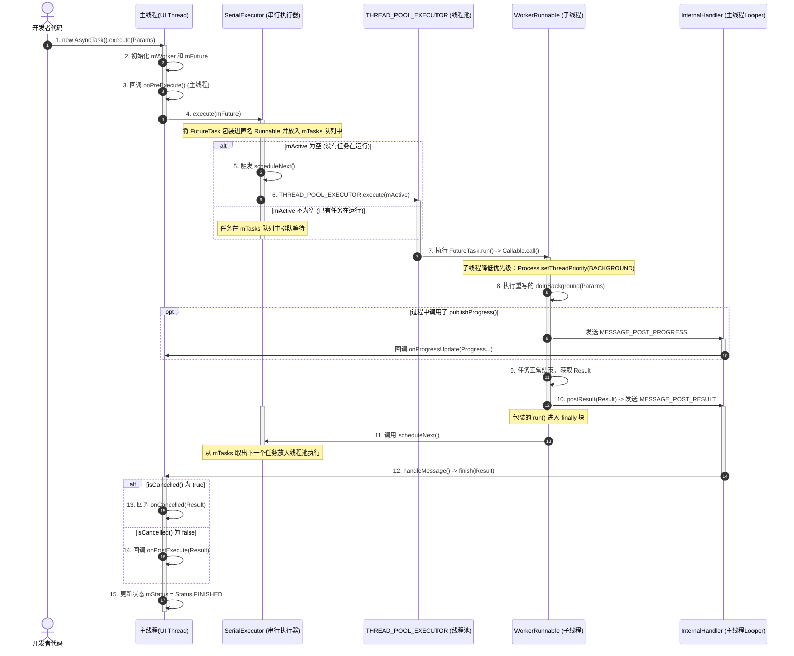
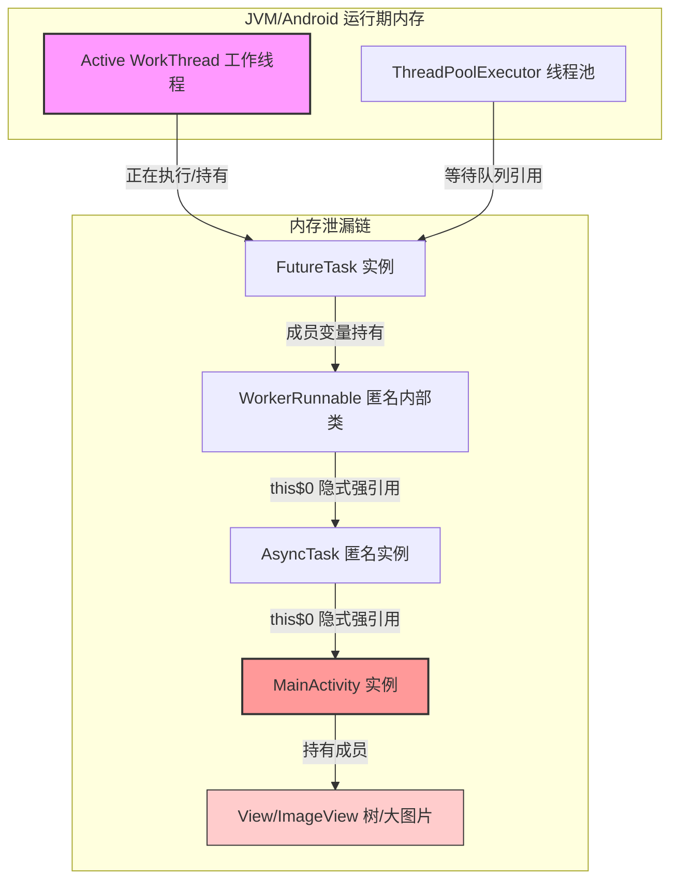

# 5.2.1.9 AsyncTask

`AsyncTask` 是 Android 框架在早期（Android 1.5 / API 3）引入的一个轻量级异步任务抽象类。它的设计初衷是简化在后台线程中执行耗时任务并安全地将结果更新至 UI 主线程的编程模型。然而，随着 Android 平台的演进、多核处理器的普及以及现代并发编程思想的成熟，AsyncTask 的局限性与设计缺陷逐渐暴露，最终在 Android 11（API 30）中被正式标记为废弃（`@Deprecated`）。

本篇文档将从概念设计、生命周期、AOSP 源码深度剖析、历史演进、致命缺陷，以及现代替代方案等多个维度，对 AsyncTask 进行系统化、结构化的深度解构。

---

## 1. AsyncTask 概述与设计初衷

### 1.1 早期 Android 系统的并发环境与单线程模型挑战
要理解 AsyncTask 的设计初衷，必须将其置于 Android 1.5 (API 3) 发布的历史背景中。当时，移动设备的硬件资源极其匮乏。以第一款 Android 手机 HTC Dream (G1) 为例，其 CPU 为单核 528MHz，内存仅为 192MB。在如此苛刻的硬件限制下，Android 系统的运行效率和流畅度面临巨大的挑战。

#### 1. Dalvik 虚拟机的早期 GC 限制与内存抖动
在 Android 2.3 之前，Dalvik 虚拟机采用的是非并发、单线程的垃圾回收器（Stop-The-World GC）。这意味着每次垃圾回收时，整个 Java 进程除了 GC 线程外，所有的应用线程（包括主线程）都会被强制暂停，暂停时间通常在几十毫秒到上百毫秒不等。
同时，早期 Android 系统的堆内存上限极低（通常为 16MB 或 24MB），加载大图（如 Bitmap）时极易触发堆内存扩容或高频次的 GC。如果在后台线程中无节制地进行密集计算或频繁地在内存中创建和销毁临时对象，就会导致系统频繁触发 GC，这在主线程上会表现为连续的掉帧和掉速，产生严重的卡顿现象（Jank）。因此，后台并发任务的资源调度必须进行极其精细的管控。

#### 2. Android 系统的进程模型与主线程环形 Looper 驱动
每一个 Android 应用程序在运行都会启动一个独立的 Linux 进程，拥有独立的 Dalvik/ART 虚拟机实例。应用的主线程（又称 UI 线程）实质上是在 `ActivityThread.main()` 方法中被初始化的：

```java
public static void main(String[] args) {
    // ...
    Looper.prepareMainLooper(); // 1. 创建主线程的 Looper 和 MessageQueue
    ActivityThread thread = new ActivityThread();
    thread.attach(false);
    // ...
    Looper.loop(); // 2. 启动无限事件循环
    throw new RuntimeException("Main thread loop unexpectedly exited");
}
```

主线程的本质是一个由 `Looper.loop()` 驱动的“环形事件循环系统”。它处于一种被事件驱动的阻塞挂起状态（利用 Linux 的 `epoll` 机制），当没有消息时，线程释放 CPU 资源并挂起；当有系统按键、触摸事件、屏幕刷新信号（VSYNC）或 Activity 生命周期回调到达 MessageQueue 时，主线程被立即唤醒并处理消息。
- 如果主线程被任何耗时任务（如网络请求、数据库读写、文件解析）阻塞超过 5 秒，系统的 `ActivityManagerService (AMS)` 就会向应用发送 `SIGQUIT (3)` 信号，并暂停所有线程，将线程栈输出到 `/data/anr/traces.txt` 文件中，最终引发 ANR（Application Not Responding）崩溃。

#### 3. UI 单线程模型的必然选择
与大多数现代 GUI 框架（如 Java Swing、WPF、iOS UIKit）类似，Android 采用了单线程 UI 模型（Single Thread Model）。这意味着：
- **UI 控件是非线程安全的**：如果允许任意后台线程直接修改 UI 控件的属性（如文本、颜色、大小），在多线程并发修改的情况下，UI 控件树的重绘（Measure, Layout, Draw）必须引入复杂的同步锁机制。
- **锁竞争与死锁开销**：在手机这种 CPU 资源有限的设备上，频繁的 UI 锁竞争会导致严重的性能损耗；同时，多线程相互等待极易引发死锁，导致整个系统界面彻底卡死。

因此，Android 规定：所有的 UI 操作必须在主线程中执行，而非 UI 线程绝对不能操作 UI 控件。

---

### 1.2 传统多线程方案（Thread + Handler）的架构缺陷
在 AsyncTask 出现之前，开发者要实现“后台下载数据，获取结果后更新界面”这一最常规的异步操作，通常需要编写如下结构的 `Thread + Handler` 代码：

```java
public class FeedActivity extends Activity {
    private static final int MSG_UPDATE_FEED = 1;
    private Handler mHandler;

    @Override
    protected void onCreate(Bundle savedInstanceState) {
        super.onCreate(savedInstanceState);
        
        mHandler = new Handler(Looper.getMainLooper()) {
            @Override
            public void handleMessage(Message msg) {
                if (msg.what == MSG_UPDATE_FEED) {
                    List<String> feeds = (List<String>) msg.obj;
                    updateUI(feeds);
                }
            }
        };
        
        new Thread(new Runnable() {
            @Override
            public void run() {
                List<String> data = loadFeedsFromServer();
                Message message = mHandler.obtainMessage(MSG_UPDATE_FEED, data);
                mHandler.sendMessage(message);
            }
        }).start();
    }
}
```

这种传统架构在实际工程开发中暴露出了非常严重的缺陷：
1. **控制流与数据流的碎裂**：为了完成一次简单的网络请求和 UI 更新，开发者不得不将逻辑强行割裂在两个独立的代码区域：一个是 `Thread` 的 `run()` 方法中执行后台任务，另一个是 `Handler` 的 `handleMessage()` 中处理 UI 更新。这破坏了面向对象编程的高内聚原则，使得代码的可读性和可维护性急剧下降。
2. **样板代码过重**：开发者必须手动定义各种整型 Message 常量，手动构造 Message 对象，并在 Handler 内部使用繁琐的 `switch-case` 语句进行消息分发。这种包装不仅繁琐，而且降低了开发效率。
3. **并发管理的缺失**：裸线程（Thread）没有线程复用机制。每次发起任务都通过 `new Thread().start()` 启动一个新线程，这在并发任务较多时会引发频繁的线程创建与销毁开销。此外，开发者很难对这些并发线程进行统一取消或生命周期同步。

为了给开发者提供一个更加高内聚、易于使用、能够自动进行线程切换且具备复用能力的异步编程框架，Android 官方在 1.5 版本中引入了 `AsyncTask`。

---

### 1.3 AsyncTask 的设计哲学：面向切面的生命周期抽象
AsyncTask 的设计本质上是对 `Thread + Handler` 模型的一次“声明式”封装。它采用了软件工程中经典的**模板方法模式（Template Method Pattern）**，将异步任务的执行过程高度抽象并分割为多个生命周期阶段（切面）：

- **初始化阶段（主线程）** -> `onPreExecute()`
- **后台计算阶段（子线程）** -> `doInBackground(Params...)`
- **进度汇报阶段（主线程）** -> `onProgressUpdate(Progress...)`
- **结果交付阶段（主线程）** -> `onPostExecute(Result)`

通过将这些不同的阶段绑定在特定的线程环境中，开发者只需要继承 `AsyncTask` 并覆写相应的方法，即可在不关注底层 Handler 消息投递和线程池调度细节的前提下，安全地编写异步任务。

---

## 2. 三泛型与四步骤设计

### 2.1 三个泛型参数的设计与运行机制
AsyncTask 声明了三个泛型参数，用于在编译期对参数和结果的类型进行强类型约束，其定义如下：

```java
public abstract class AsyncTask<Params, Progress, Result>
```

#### 1. 泛型参数的职责划分
- **`Params`（输入参数）**：指启动异步任务时，调用 `execute(Params... params)` 传入后台线程的数据类型。例如，网络下载任务传入的 URL 字符串（`String`）。若该任务不需要任何参数，可声明为 `Void`。
- **`Progress`（进度单元）**：指后台任务在执行过程中，向主线程汇报执行进度的数据类型。例如，下载进度的百分比（`Integer` 或 `Float`）。
- **`Result`（返回结果）**：指后台任务 `doInBackground()` 执行完毕后返回的最终结果类型。例如，网络请求返回的 JSON 字符串（`String`）或图片字节数组。

#### 2. 编译期类型安全与泛型擦除
利用泛型，AsyncTask 在编译期能够对各生命周期方法之间的参数流转进行严格检查。然而，由于 Java 泛型的擦除机制（Generic Erasure），这些泛型在运行期实际上都会被替换为 `Object` 或者是其上限。这也意味着 AsyncTask 底层在进行参数传递时，必须进行隐式的强制类型转换。
同时，`Params...` 和 `Progress...` 是 Java 的变长参数（Varargs），在编译时会被处理为数组类型。这意味着每次启动任务或汇报进度，都会在堆内存中隐式创建一个新的数组对象。如果在高并发或频繁更新进度的场景下，这会引发大量的临时内存申请，从而加重垃圾回收（GC）的负担。

---

### 2.2 四个执行步骤的回调机制
AsyncTask 的执行过程严格遵循以下声明周期的回调顺序：

#### 1. `onPreExecute()` —— 任务准备
- **执行线程**：**主线程（UI 线程）**。
- **调用时机**：在主线程调用 `task.execute()` 或 `task.executeOnExecutor()` 后，后台任务正式启动之前被触发。
- **典型应用**：在界面上弹出一个不可取消的等待对话框（ProgressDialog），或者重置一些界面的初始状态。

#### 2. `doInBackground(Params... params)` —— 后台执行
- **执行线程**：**后台工作线程（线程池）**。
- **调用时机**：`onPreExecute()` 执行完毕后，立即在线程池的工作线程中执行。
- **参数传递**：`Params... params` 在底层会被编译为 `Params[]` 数组。在方法内部，通常通过 `params[0]` 获取第一个参数。
- **异常捕获机制**：如果在 `doInBackground` 执行过程中抛出了未捕获的运行时异常（如 `NullPointerException` 或 `ArithmeticException`），该异常并不会立刻导致应用直接崩溃。这是因为底层的 `mWorker.call()` 使用了 `try-catch (Throwable tr)` 块将异常吞掉，记录取消状态，并最终通过 `postResult(null)` 返回。随后，该异常会被封装进 `FutureTask` 的 `ExecutionException` 中，当调用 `FutureTask.get()` 时才会重新抛出。这就要求开发者必须在 `doInBackground` 内部做好完备的异常处理，否则会导致任务默默失败而没有任何崩溃日志。

#### 3. `onProgressUpdate(Progress... values)` —— 进度更新
- **执行线程**：**主线程（UI 线程）**。
- **调用时机**：在 `doInBackground()` 内部主动调用 `publishProgress()` 后被触发。
- **性能警示**：如果在后台线程中以极高的频率（如每微秒一次）调用 `publishProgress()`，会导致主线程的 MessageQueue 中积压大量的更新消息，从而使得主线程的 Looper 无法即时处理用户的触摸事件和重绘请求，最终导致界面卡死。因此，进度更新应当进行节流（Throttling）处理。

#### 4. `onPostExecute(Result result)` —— 任务完成
- **执行线程**：**主线程（UI 线程）**。
- **调用时机**：后台任务 `doInBackground()` 运行结束并正常返回结果后被调用。
- **职责**：关闭在 `onPreExecute()` 中弹出的对话框，将最终的数据绑定到界面的控件（如 RecyclerView）上。

#### 5. `onCancelled(Result result)` 与 `onCancelled()`
- **执行线程**：**主线程（UI 线程）**。
- **调用时机**：在后台任务执行期间，如果外部调用了 `cancel(boolean)`，那么在 `doInBackground()` 执行结束后，系统会触发 `onCancelled()` 回调，而**不会**再调用 `onPostExecute()`。
- **版本历史**：在 API 11 之前，只有无参的 `onCancelled()` 方法；从 API 11 开始，引入了 `onCancelled(Result result)`，这使得开发者在任务被取消时，依然能拿到后台已经计算出的部分结果进行清理操作。

---

## 3. AOSP 源码级深度剖析

为了彻底理解 AsyncTask 是如何将 Handler 消息机制、线程池、Callable 以及 FutureTask 封装融合的，我们将基于 Android AOSP 源码进行层层解析。

### 3.1 核心构建块：WorkerRunnable 与 FutureTask
AsyncTask 在无参构造函数中，会创建两个最为核心的成员变量：`mWorker` 和 `mFuture`。

```java
private final WorkerRunnable<Params, Result> mWorker;
private final FutureTask<Result> mFuture;
```

#### 1. WorkerRunnable：带有参数的 Callable
`WorkerRunnable` 是 AsyncTask 的一个静态内部抽象类，它实现了 `java.util.concurrent.Callable` 接口，并在此基础上扩展了一个 `mParams` 数组。

```java
private static abstract class WorkerRunnable<Params, Result> implements Callable<Result> {
    Params[] mParams;
}
```

#### 2. FutureTask：状态可控的任务包装器与底层 CAS 状态机
`FutureTask` 是 Java 标准并发包中的类，它实现了 `RunnableFuture` 接口（同时继承自 `Runnable` 和 `Future`）。它可以被提交给 Executor 执行，也可以随时通过 `get()` 获取结果、通过 `cancel()` 取消任务。

##### FutureTask 内部 CAS 状态机转换深度解析
在 `java.util.concurrent.FutureTask` 内部，任务的执行状态是通过一个名为 `state` 的 `volatile` 成员变量来维护的。其取值和状态转换逻辑如下：
- `NEW` (0)：任务新建时的初始状态。
- `COMPLETING` (1)：任务正在完成（结果正在被写入，这是一个临时状态）。
- `NORMAL` (2)：任务正常结束。
- `EXCEPTIONAL` (3)：任务执行中抛出异常。
- `CANCELLED` (4)：任务被非中断方式取消（`cancel(false)`）。
- `INTERRUPTING` (5)：任务正在被中断（`cancel(true)` 的临时状态）。
- `INTERRUPTED` (6)：任务已被中断。

在 FutureTask 的 `run()` 方法中，首先通过 CAS 操作（Compare-And-Swap）将当前运行线程（Thread.currentThread()）绑定到它的 `runner` 成员变量上，以防并发冲突。如果执行成功，任务的状态会从 `NEW` 开始演进。当计算结束并正常返回时，状态会短暂变为 `COMPLETING`，然后通过 CAS 最终变为 `NORMAL`；如果中途发生异常，则通过 CAS 变更为 `EXCEPTIONAL`。

在 AsyncTask 的构造函数中，对这两个变量的初始化代码如下（基于 API 28 源码）：

```java
public AsyncTask(@Nullable Looper callbackLooper) {
    // 1. 初始化 Handler。若未指定 Looper，默认使用主线程 Looper
    mHandler = callbackLooper == null || callbackLooper == Looper.getMainLooper()
        ? getMainHandler()
        : new Handler(callbackLooper);

    // 2. 实例化 WorkerRunnable
    mWorker = new WorkerRunnable<Params, Result>() {
        public Result call() throws Exception {
            // 2.1 标记当前任务已经被调用过
            mTaskInvoked.set(true);
            Result result = null;
            try {
                // 2.2 设定线程优先级为 Background 级
                Process.setThreadPriority(Process.THREAD_PRIORITY_BACKGROUND);
                // 2.3 调用 doInBackground 执行具体的耗时逻辑
                result = doInBackground(mParams);
                Binder.flushPendingCommands();
            } catch (Throwable tr) {
                mCancelled.set(true);
                throw tr;
            } finally {
                // 2.4 无论如何，都通过 postResult 将结果投递出去
                postResult(result);
            }
            return result;
        }
    };

    // 3. 用 FutureTask 将 WorkerRunnable 包装起来
    mFuture = new FutureTask<Result>(mWorker) {
        @Override
        protected void done() {
            try {
                // 3.1 done() 会在 FutureTask 执行结束（正常、异常或取消）时被触发
                // postResultIfNotInvoked 用于兜底，防止 doInBackground 没能执行到 call() 的 finally 块
                postResultIfNotInvoked(get());
            } catch (InterruptedException e) {
                android.util.Log.w(LOG_TAG, e);
            } catch (ExecutionException e) {
                throw new RuntimeException("An error occurred while executing doInBackground()",
                        e.getCause());
            } catch (CancellationException e) {
                postResultIfNotInvoked(null);
            }
        }
    };
}
```

##### 源码解密：
- **`Process.setThreadPriority(Process.THREAD_PRIORITY_BACKGROUND)`**：
  在 Linux 内核调度中，线程优先级（Nice 值）越低，分配到的 CPU 时间片越少。`THREAD_PRIORITY_BACKGROUND` 对应 Nice 值为 10。如果 AsyncTask 运行在一个密集计算任务中，它不会恶意抢占主线程（Nice 值为 0）的 CPU 资源，有效保护了界面的流畅度。
- **`Binder.flushPendingCommands()`**：
  将当前工作线程中所有未处理的 Binder 驱动 IPC 命令立即刷新到 Binder 驱动中。这常用于释放当前线程的 Binder 占用的本地内存资源。
- **`postResultIfNotInvoked(get())`**：
  如果任务在被放入线程池之前就被开发者调用了 `cancel(true)`，或者是线程池容量爆满被抛弃，那么 `mWorker` 内部的 `call()` 根本不会被执行。此时，`FutureTask` 的 `done()` 方法依然会被调用。`postResultIfNotInvoked` 会确保安全的将 `null` 结果通知回主线程。

---

### 3.2 串行执行器：SerialExecutor 的双重互斥与尾递归调度
在默认情况下，所有的 AsyncTask 都是串行执行的。这取决于 AsyncTask 内部定义的一个静态全局 Executor：`SERIAL_EXECUTOR`。

```java
private static class SerialExecutor implements Executor {
    // 存放所有待执行 Runnable 的双端队列
    final ArrayDeque<Runnable> mTasks = new ArrayDeque<Runnable>();
    // 当前正在运行的活跃 Runnable
    Runnable mActive;

    public synchronized void execute(final Runnable r) {
        // 1. 将传入的任务进行一次代理包装并入队
        mTasks.offer(new Runnable() {
            public void run() {
                try {
                    // 执行原本的 FutureTask.run()
                    r.run();
                } finally {
                    // 当任务执行完毕，在当前工作线程中递归驱动队列执行下一个任务
                    scheduleNext();
                }
            }
        });
        
        // 2. 如果当前没有正在执行的任务，则立即拉起队列执行
        if (mActive == null) {
            scheduleNext();
        }
    }

    protected synchronized void scheduleNext() {
        // 3. 从双端队列队首拉取一个任务，交由底层的真正线程池执行
        if ((mActive = mTasks.poll()) != null) {
            THREAD_POOL_EXECUTOR.execute(mActive);
        }
    }
}
```

##### 深度解构 SerialExecutor 的并发学原理与底层数据结构：
1. **ArrayDeque 循环数组结构及其优势**：
   `SerialExecutor` 内部使用的 `ArrayDeque` 是 JDK 中基于循环双向数组实现的。相比于传统的 `LinkedList`，它在堆内存中不需要为每一个入队的 Runnable 任务都额外分配一个 Node 链表节点对象。这极大减轻了虚拟机频繁为短命 Node 节点分配和回收内存的压力，避免了由于并发队列扩容导致的内存碎片化，非常适合高频的排队调度。
2. **全局类锁与串行瓶颈**：
   `SerialExecutor` 的 `execute` 和 `scheduleNext` 都使用了 `synchronized` 关键字进行修饰。因为 `SERIAL_EXECUTOR` 是一个全局唯一的静态变量，这意味着当我们在不同的 Activity 中，同时创建并启动 `TaskA`、`TaskB` 和 `TaskC` 时，它们在排队入队时会共享同一个锁资源。这保证了排队操作是绝对线程安全的，但也意味着**所有任务是严格串行化的**。
3. **尾递归式链式触发（Chain Dispatching）的性能与电能优化**：
   在包装类 `Runnable.run()` 的 `finally` 块中，显式调用了 `scheduleNext()`。这是一个非常巧妙的“事件驱动调度”设计：
   - 相比于定时轮询（Timer Polling）或者常驻一个后台调度线程不断循环队列，尾递归设计在**队列为空时完全不占用任何多余的 CPU 资源与线程上下文调度开销**。
   - 只有当前一个任务执行完毕的瞬间，刚好闲置下来的那个工作线程会进入 `finally` 块，获取锁并驱动移出下一个排队任务。
   - 另外，由于 `scheduleNext()` 中只有 `mTasks.poll()` 这个操作在同步锁中，对真正任务的 `THREAD_POOL_EXECUTOR.execute(mActive)` 是在锁外进行的。这把锁竞争的范围压缩到了极致，有效缩短了临界区（Critical Section）的执行时间，极大地提升了在高并发任务排队时的吞吐性能。
   - *内存代价警告*：如果用户在主线程连续并发调用了 100 个默认配置的 AsyncTask 任务，由于串行限制，第 2 到第 100 个任务都会被包装为 Runnable 对象，并在 `mTasks` 中排队等待。此时，这 99 个处于挂起状态的任务会连带隐式持有 99 个 Activity 的引用，在堆中形成一个庞大的强引用网络，极大地增加了 OOM 的风险。
4. **并发可见性（Happens-Before）与内存屏障**：
   对 `mActive` 的并发修改由于加上了 `synchronized` 类锁保护，在 Java 内存模型（JMM）中属于锁 the 释放与获取关系。根据锁的 Happens-Before 规则，前一个任务在 `finally` 块中释放锁并修改 `mActive` 的操作，其修改结果对后一个任务获取锁并读取 `mActive` 的操作是强制立即可见的。这也强制 CPU 刷新其 Store Buffer 和 Invalidate Queue，阻止了指令重排，确保了多核架构下的排队一致性。
5. **隐患**：如果队列中的某一个任务内部发生了死锁或无限网络等待，由于它始终无法从 `finally` 块中退出并执行 `scheduleNext()`，整条 AsyncTask 链条上的后续任务都将被彻底锁死。

---

### 3.3 并行调度引擎：THREAD_POOL_EXECUTOR
`SerialExecutor` 仅仅是一个队列管理器，真正负责分配系统线程去执行任务的是 `THREAD_POOL_EXECUTOR`。

在 AOSP 源码的演进历史中，线程池的配置参数经历了多次调整：

```java
// AOSP API 28 源码配置
private static final int CPU_COUNT = Runtime.getRuntime().availableProcessors();
// 核心线程数：最少 2 个，最多 4 个，中间取 CPU_COUNT - 1
private static final int CORE_POOL_SIZE = Math.max(2, Math.min(CPU_COUNT - 1, 4));
// 最大线程数：CPU 数量的 2 倍 + 1
private static final int MAXIMUM_POOL_SIZE = CPU_COUNT * 2 + 1;
// 非核心空闲线程的存活时间为 30 秒
private static final int KEEP_ALIVE_SECONDS = 30;

// 限制排队上限为 128
private static final BlockingQueue<Runnable> sPoolWorkQueue =
        new LinkedBlockingQueue<Runnable>(128);
```

#### 1. 线程池工作原理深度推导（ThreadPoolExecutor）
当一个 Runnable 任务提交给 `THREAD_POOL_EXECUTOR` 后，底层的调度执行逻辑完全遵循 Java 标准线程池机制：
- **工作线程数未达核心上限**：若当前线程池内正在运行的线程数小于 `CORE_POOL_SIZE`，即便有空闲线程存在，线程池也会立刻新建一个核心线程去执行该任务。
- **工作队列排队**：若线程数已达核心上限，任务被尝试放入 `sPoolWorkQueue`（有界队列，上限为 128）。
- **开启非核心线程**：若 `sPoolWorkQueue` 已满，且当前运行的线程总数小于 `MAXIMUM_POOL_SIZE`，则线程池会新建一个非核心工作线程去处理该任务。
- **饱和策略触发与自定义规避策略**：若线程总数已达 `MAXIMUM_POOL_SIZE`，且队列已满，则触发 `RejectedExecutionHandler`。默认使用 `AbortPolicy` 策略，抛出 `RejectedExecutionException` 导致进程直接崩溃。
  - *饱和缺陷分析*：假设用户快速滑动一个长列表，每个 Item 都会通过 `executeOnExecutor(AsyncTask.THREAD_POOL_EXECUTOR)` 触发图片的异步网络加载。在最大线程数为 9 的设备上，第 1 到 9 个任务会开启 9 个线程执行，第 10 到 137 个任务会存入 `workQueue` 排队。第 138 个及以后的任务会由于队列和线程池全部饱和，默认触发 `AbortPolicy` 饱和策略。这会使得应用抛出 60 多个 `RejectedExecutionException` 崩溃，如果在主线程没有做全局异常捕获，应用会立刻闪退。

##### 为什么设置 `allowCoreThreadTimeOut(true)`？
在移动设备上，CPU 的能效控制非常严格。如果线程池中的核心线程在任务执行完毕后继续保持存活状态（在普通 JVM 中默认如此），这些线程就会阻碍 CPU 进入深度休眠（C-state），导致设备后台待机电量急剧消耗。通过调用 `threadPoolExecutor.allowCoreThreadTimeOut(true)`，当核心线程在闲置超过 30 秒后也会被强制回收，从而保护了移动设备的续航。

#### 2. Linux Cgroups（控制组）调度机制与 big.LITTLE 架构协同
在 Android 系统中，仅仅通过 Java 线程优先级无法完美控制线程的 CPU 调度。Android 深度依赖 Linux 的 `cgroups`（控制组）机制。
当任务内部调用 `Process.setThreadPriority(Process.THREAD_PRIORITY_BACKGROUND)` 时，该线程对应的 Linux 线程 ID（TID）会被系统写到 `/sys/fs/cgroup/cpuacct/bg_non_interactive/tasks` 分组文件中。
在多核 big.LITTLE（大核.小核）架构的 CPU 上：
- 被归入后台组的 AsyncTask 工作线程会受到严格的调度惩罚，**只允许运行在低能耗的小核上**，且分配到的 CPU 时间片占比被限制在 5%~10% 以内。
- 只有应用的前台主线程（以及渲染线程 RenderThread）允许跑在高频的大核上。这种底层的硬件资源强力隔离，确保了即使 AsyncTask 内部进行着重度计算，也绝不会让主线程发生丢帧掉帧。

---

### 3.4 消息派发中枢：InternalHandler 与 Looper 绑定

```java
private static class InternalHandler extends Handler {
    public InternalHandler(Looper looper) {
        super(looper);
    }

    @Override
    public void handleMessage(Message msg) {
        AsyncTaskResult<?> result = (AsyncTaskResult<?>) msg.obj;
        switch (msg.what) {
            case MESSAGE_POST_RESULT:
                // 收到任务完成或取消的消息
                result.mTask.finish(result.mData[0]);
                break;
            case MESSAGE_POST_PROGRESS:
                // 收到进度汇报消息
                result.mTask.onProgressUpdate(result.mData);
                break;
        }
    }
}
```

#### 静态 Handler 与 MainLooper 的双重检查锁定 (DCL) 机制
在 AOSP 中，`sHandler` 是一个静态的单例，用于在主线程分发结果。

```java
private static InternalHandler sHandler;

private static Handler getMainHandler() {
    synchronized (AsyncTask.class) {
        if (sHandler == null) {
            sHandler = new InternalHandler(Looper.getMainLooper());
        }
        return sHandler;
    }
}
```

##### 为什么必须绑定 `Looper.getMainLooper()`？
在 API 22 之前，`sHandler` 的初始化非常简单：
```java
// 旧版源码
private static final InternalHandler sHandler = new InternalHandler();
```
如果开发者在子线程中通过反射或者类装载（如在 `Service` 的后台线程中）首次访问并装载了 `AsyncTask` 类，JVM 会在该子线程中完成静态变量的初始化。此时，`InternalHandler` 会默认绑定该子线程的 `Looper`（甚至如果子线程没有 Looper，会直接抛出 `RuntimeException`）。

这意味着，一旦 `sHandler` 绑定了子线程，AsyncTask 任务完成后的 `onPostExecute()` 回调也将在子线程中执行。此时如果开发者在 `onPostExecute()` 中尝试更新 UI，就会抛出致命的 `CalledFromWrongThreadException`。

通过在后期版本中引入 `getMainHandler()` 双重检查锁定并显式传入 `Looper.getMainLooper()`，无论 AsyncTask 在哪个线程中被加载和实例化，其底层的 Handler 都绝对绑定的是主线程的 `MainLooper`，确保了线程切换的安全。

#### AsyncTaskResult 的数据封装结构
在 AOSP 内部，Handler 发送的数据并不是直接的结果对象，而是包装为了一个名为 `AsyncTaskResult` 的静态内部类：

```java
private static class AsyncTaskResult<Data> {
    final AsyncTask mTask;
    final Data[] mData;

    AsyncTaskResult(AsyncTask task, Data... data) {
        mTask = task;
        mData = data;
    }
}
```
该包装类将数据再次装入了一个泛型数组中，以便能够适应变长参数传递。这也意味着每次 `publishProgress` 或者任务完成投递结果时，除了数据的数组，还会产生一个 `AsyncTaskResult` 的对象分配。虽然这简化了底层参数的传递形式，但对内存抖动（Memory Churn）起到了一定的推波助澜作用。

---

### 3.5 AsyncTask 执行时序与流程图

为了直观地展示 `SerialExecutor` 的排队过程、`THREAD_POOL_EXECUTOR` 的调度机制，以及 `InternalHandler` 的线程切换，我们绘制了以下完整的时序流程图：



---

## 4. 核心演进历史与串并行策略的反演

AsyncTask 在 Android 系统版本迭代中，其执行方式经历了“串行 -> 并行 -> 串行”的反演过程。

### 4.1 版本变化时间轴
详细的 Android 系统版本行为变化及兼容性演进，可同步阅读：[AndroidVersionChangeLog.md](../../../../AndroidVersionChangeLog.md)。

1. **Android 1.5 ~ 1.6 之前**：
   - **默认行为**：**串行**执行。
   - **设计背景**：早期 Android 设备的 CPU 核心数极少（单核为主），并发能力有限，系统默认使用单线程串行执行队列以防硬件过载。
2. **Android 1.6 (Donut) ~ Android 2.3 (Gingerbread)**：
   - **默认行为**：**并行**执行。
   - **设计背景**：随着智能手机硬件升级，单核主频提升，且开始出现多核处理器。为了充分利用硬件资源、提升应用网络加载等耗时任务的吞吐率，系统引入了并发线程池，允许多个 AsyncTask 同时启动并运行。
3. **Android 3.0 (Honeycomb) 至今**：
   - **默认行为**：**默认重回串行**执行（`sDefaultExecutor = SERIAL_EXECUTOR`）。
   - **重回串行的底层考量**：在 1.6 ~ 2.3 的并行时代，很多开发者在不注意线程安全的情况下，在多个 AsyncTask 中并发读写 Activity 的成员变量或公共资源，导致了极其严重的竞态条件（Race Condition）、死锁、数据不一致，甚至引起应用频繁崩溃。为了提供最安全的编程模型，避免开发者犯错，Google 决定默认重回串行调度。
   - **如何开启并行**：如果开发者非常明确知道自己的多个任务在并发执行时是线程安全的，可以通过调用以下方法强制任务运行在并行池中：
     ```java
     task.executeOnExecutor(AsyncTask.THREAD_POOL_EXECUTOR, params);
     ```
     此外，开发者也可以传入自己自定义配置的 `ThreadPoolExecutor` 来完全控制并发数、等待队列和饱和策略。

---

## 5. 致命缺陷与废弃原因深度解构

在 API 30 中，官方的一句注释彻底宣告了 AsyncTask 时代的结束：
> *Deprecated: Use the standard java.util.concurrent or Kotlin concurrency utilities instead.*

为什么这个一度风靡 Android 开发界的明星级工具会被彻底废弃？它主要存在以下几个无法通过局部修补解决的硬伤。

### 5.1 内存泄漏机制与 GC 阻断分析

#### 5.1.1 泄漏产生的底层机理
当我们在 Activity / Fragment 内部，以非静态内部类（或者匿名内部类）的方式声明一个自定义的 AsyncTask 时：

```java
public class MainActivity extends AppCompatActivity {
    
    private void startTask() {
        new AsyncTask<Void, Void, Void>() {
            @Override
            protected Void doInBackground(Void... voids) {
                // 模拟耗时网络请求，执行时间为 2 分钟
                try { Thread.sleep(120000); } catch (Exception e) {}
                return null;
            }
        }.execute();
    }
}
```

在 Java 语言规范中，**非静态内部类（包括匿名内部类）会隐式持有其外部类（此处即 `MainActivity`）的强引用**。
此时，一旦 AsyncTask 被提交执行：
1. 它的包装任务 `FutureTask` 会被放入 `SERIAL_EXECUTOR` 队列或 `THREAD_POOL_EXECUTOR` 线程池的线程中执行。
2. 只要后台任务 `doInBackground()` 没有执行结束，或者该任务仍在串行排队队列中没有被调度，执行该任务的工作线程（属于 Java 进程级的 GC Root）就会一直持有 `FutureTask` 的引用。
3. `FutureTask` 持有内部 `WorkerRunnable` 的引用。
4. `WorkerRunnable` 持有该匿名内部类 `AsyncTask` 实例的引用。
5. `AsyncTask` 实例强引用持有外部类 `MainActivity`。

##### ART 垃圾回收可达性分析与 GC Root 引用链深度解构
垃圾回收器（Garbage Collector）进行可达性分析时，会从一组被称为 **GC Roots** 的对象出发，向下追踪它们所引用的全部对象。
正在执行任务的后台工作线程（Active Working Thread）就是一种天然的 GC Root。
在该线程的虚拟机栈（VM Stack）的活动栈帧中，其局部变量表（Local Variable Table）的第 0 个槽位（Slot 0）存放着 `doInBackground` 所属的匿名 `WorkerRunnable` 的 `this` 引用。
此外，JVM/ART 中的 GC Roots 还包括：
- 虚拟机栈（栈帧中的本地变量表）中引用的对象。
- 方法区中类静态属性引用的对象。
- 方法区中常量引用的对象。
- 本地方法栈中 JNI（Java Native Interface）引用的对象。
- 被同步锁（`synchronized`）持有的监视器对象（Monitor Lock）。
- JVM 内部持有的特殊对象（如预分配的 OutOfMemoryError 等异常对象，系统类加载器等）。

GC 追踪标记引擎在扫描时，会强制执行如下的可达性搜索：
$$\text{GC Root (工作线程栈帧 Slot 0)} \rightarrow \text{WorkerRunnable 实例} \rightarrow \text{FutureTask 实例} \rightarrow \text{AsyncTask 匿名实例} \rightarrow \text{MainActivity 强引用 (this\$0)}$$
由于整个虚拟机堆内存中，只要存在任何一条到达 GC Root 的有效强引用链路，垃圾回收引擎就绝对不能将其物理空间回收（否则会违反内存模型的强一致性约束）。因此，**垃圾回收引擎在堆内存中绝对无法回收 `MainActivity` 的物理空间**。

##### ART 垃圾回收机制（Generational GC）的介入与影响
现代 Android ART 虚拟机采用的是分代收集垃圾回收器。对象首次分配在新生代（Young Generation）。若 Activity 发生泄漏，AsyncTask 的后台任务执行较慢（例如持续几分钟），在此期间系统会触发多次局部 GC（Minor GC）。由于强引用链的存在，Activity 无法被回收，并在多次 GC 后被错误地“晋升”到了老年代（Old Generation / Tenured Generation）。
老年代的垃圾回收频率极低（需要 Full GC 才能触发回收），且 Full GC 的系统开销极大。这直接导致即便后来后台任务执行结束，Activity 已经在老年代扎根，极易引发老年代内存溢出，触发高频次的 STW（Stop-The-World），使应用变得极其卡顿，甚至抛出 OOM 崩溃。

##### 工业级检测：LeakCanary 内存泄露排障原理
在实际项目中，开发团队通常依赖 `LeakCanary` 来抓取这类内存泄漏。它的内部机制如下：
1. 它通过注册 `Application.ActivityLifecycleCallbacks` 监听所有 Activity 的销毁事件。
2. 当 Activity 的 `onDestroy()` 被触发时，LeakCanary 会将 Activity 的实例包裹进一个 `KeyedWeakReference`（弱引用）中，并将其与一个自定义的唯一 Key 绑定。
3. 如果系统没有发生泄漏，GC 会在随后的垃圾回收中将其自动清空，或者 LeakCanary 会在 5 秒后主动调用 `Runtime.getRuntime().gc()` 触发一次垃圾回收。
4. 随后，它检查该弱引用对象是否已经进入了被清空引用的 `ReferenceQueue`（引用队列）。如果 5 秒后该弱引用依然没有在队列中出现，说明 Activity 强引用链未断开，发生了内存泄漏。
5. 此时 LeakCanary 会通过调用 `Debug.dumpHprofData()` 导出当前 Java 堆转储文件（Hprof），利用其 Shark 分析库找出一条从活跃的 Thread（GC Root）到该 Activity 的最短强引用路径，最终生成与我们上面推导一致的内存泄漏引用链图，指导开发者定位。

#### 5.1.2 内存泄漏强引用链图



---

### 5.2 强弱引用改造（补丁方案）及其局限性与硬件能效开销
为了修复内存泄漏，许多开发者在 AsyncTask 废弃之前，采用了“静态内部类 + 弱引用”的补丁方案。其完整实现如下：

```java
public class SafeActivity extends AppCompatActivity {
    private SafeDownloadTask mTask;

    @Override
    protected void onCreate(Bundle savedInstanceState) {
        super.onCreate(savedInstanceState);
        mTask = new SafeDownloadTask(this);
        mTask.execute("https://example.com/file.zip");
    }

    // 1. 声明为静态内部类，彻底断开隐式的 this$0 强引用
    private static class SafeDownloadTask extends AsyncTask<String, Integer, Boolean> {
        // 2. 使用弱引用持有 Activity
        private final WeakReference<SafeActivity> mActivityRef;

        SafeDownloadTask(SafeActivity activity) {
            mActivityRef = new WeakReference<>(activity);
        }

        @Override
        protected Boolean doInBackground(String... urls) {
            // 后台耗时操作
            for (int i = 0; i < 100; i++) {
                // 3. 频繁检查 Activity 是否已销毁，若销毁，则应当立刻退出以节省 CPU 和电量
                SafeActivity activity = mActivityRef.get();
                if (activity == null || activity.isFinishing() || activity.isDestroyed()) {
                    return false;
                }
                
                try { Thread.sleep(100); } catch (InterruptedException e) { break; }
            }
            return true;
        }

        @Override
        protected void onPostExecute(Boolean success) {
            // 4. 回调到主线程时，再次解引用判空，防止崩溃
            SafeActivity activity = mActivityRef.get();
            if (activity != null && !activity.isFinishing() && !activity.isDestroyed()) {
                activity.updateUI(success);
            }
        }
    }

    private void updateUI(boolean success) {
        // 更新UI
    }

    @Override
    protected void onDestroy() {
        super.onDestroy();
        if (mTask != null) {
            mTask.cancel(true); // 尽可能给后台工作线程发送中断信号
        }
    }
}
```

#### 补丁方案的严重局限性与硬件电量黑洞：
1. **CPU 核心频率被恶意拉高（DVFS 开销）**：
   弱引用只能确保 Activity 能够被垃圾回收，却**无法阻止后台工作线程继续运行**。如果开发者在 `doInBackground` 中忘记了频繁地对弱引用进行判空并主动中断，那么这个后台线程依然会完整地运行完毕。
   对于手机的 DVFS（动态电压频率调节）系统来说，这个在后台持续空转或执行无用计算的线程，会让 CPU 的调度算法误判当前的系统负载，强行拉高 CPU 核心的运行频率。这不仅会在短时间内产生严重的机身发热，还会急剧消耗手机的电量。
2. **射频 Modem 的“尾效”电量黑洞（Modem Tail Time）**：
   如果后台任务涉及到无用的网络请求，即使在 Activity 被回收后请求数据被彻底丢弃，手机的网络射频模块（LTE/5G Modem）依然会被强制从低功耗的电量睡眠状态（Dormant）拉回高功率的活跃状态（Active）。在数据传输结束后，Modem 依然需要维持 5 到 10 秒的高功率待机时间（称为 Tail Time）才会重新休眠。这使得一个本该被切断的下载任务，成为了在后台吞噬设备电量的黑洞。
3. **生命周期割裂与重建方案的挣扎（Configuration Change）**：
   在屏幕旋转配置改变（Configuration Change）导致 Activity 重建时，老 Activity 销毁，新 Activity 诞生。由于老 Activity 绑定的 AsyncTask 与新 Activity 没有任何关联，老任务完成后，新 Activity 无法获取先前正在下载的数据。
   - 在 AsyncTask 流行时代，开发者曾尝试通过各种繁琐的折中方案来规避数据丢失。例如在 Manifest 中声明 `android:configChanges="orientation|screenSize"` 阻止 Activity 销毁；或者利用无 UI 树的 Fragment 设置 `setRetainInstance(true)` 来托管 AsyncTask 实例。然而这些做法要么破坏了 Android 资源自适应机制，要么引入了更复杂的 Fragment 解绑重新关联状态管理，极大增加了项目的开发复杂度。

---

### 5.3 UI 状态异常与 WindowManager$BadTokenException 崩溃
当 Activity 进入销毁阶段，它的 `WindowToken` 会被系统的 WindowManagerService (WMS) 注销。

#### 什么是 WindowToken？WMS 的校验原理
当一个 Activity 启动时，底层的 `ActivityRecord` 会在 WMS 中注册并生成一个唯一的 `AppWindowToken`（Binder Token）。在此 Activity 内部创建和展示的所有子窗口（包括标准 Dialog、PopupWindow 等）在向 WMS 请求添加（WindowManager.addView）时，都必须显式或隐式地向 WMS 提交此 Token。
WMS 会在内部进行严格的安全审查：
- 它会校验当前新加窗口所持有的 Token 是否存在于其活跃的 Token 映射表中。
- 一旦用户返回退出 Activity，或者屏幕发生了旋转销毁，系统 `AMS` 就会在 WMS 中注销对应的 `WindowToken`。
- 如果 AsyncTask 的 `onPostExecute` 执行时，由于网络慢耗时，Activity 已经被注销，而其内部的 `AlertDialog` 却在此时调用了 `show()`。
- WMS 校验到该 Dialog 携带的 Activity Binder Token 已经失效，便会拒绝窗口绘制并立即抛出致命异常：
  `android.view.WindowManager$BadTokenException: Unable to add window -- token android.os.BinderProxy@xxxx is not valid; is your activity running?`

要防范此类崩溃，开发者需要在每个 UI 回调方法中塞满极其臃肿判空与判断生命周期的防御性代码。

---

### 5.4 RejectedExecutionException 崩溃问题
正如 3.3 节所述，在需要大量并发任务的场景中，如果开发者手动使用了 `executeOnExecutor(AsyncTask.THREAD_POOL_EXECUTOR)`，由于有界队列大小只有 128，一旦并发峰值超过最大承载能力：
$$\text{最大承载数} = \text{最大线程数} + 128$$
系统会默认调用线程池的 `AbortPolicy` 拒绝策略，抛出 `RejectedExecutionException`。对于没有做异常捕获的 App 来说，这会直接造成进程崩溃。

---

### 5.5 单向不可逆的状态机限制
在 AOSP 中，`Status` 状态枚举定义了 AsyncTask 严格的生命周期状态：

```java
public enum Status {
    PENDING, // 未启动
    RUNNING, // 运行中
    FINISHED, // 已结束
}
```

#### 为什么 AsyncTask 实例只能被执行一次？
在 `executeOnExecutor` 的实现中，首先执行了如下检查：

```java
if (mStatus != Status.PENDING) {
    switch (mStatus) {
        case RUNNING:
            throw new IllegalStateException("Cannot execute task:"
                    + " the task is already running.");
        case FINISHED:
            throw new IllegalStateException("Cannot execute task:"
                    + " the task has already been executed "
                    + "(a task can be executed only once)");
    }
}
```

这意味着其内部状态的流转是单向、不可逆的。造成这一局限的原因是，其底层的 `FutureTask` 和 `WorkerRunnable` 都是在构造方法中一次性初始化并绑定了参数。由于 Java 标准并发包中的 `FutureTask` 在执行完毕后其 CAS 状态机（如变为 `NORMAL`）就无法重置，这决定了 AsyncTask 无法被循环复用。每次启动异步任务，开发者都必须重新 `new` 一个全新的对象，这也进一步加剧了堆内内存对象的分配压力。

---

### 5.6 同步屏障（Sync Barrier）导致的消息派发延迟
当 `doInBackground` 执行结束通过 `postResult` 发送消息回主线程时，由于使用的是静态 `InternalHandler` 发送的普通 Handler 消息，该消息会经历 MessageQueue 的排队。

In Android 系统中，为了保障 UI 绘制和属性动画的流畅度，Choreographer 在准备渲染下一帧时，会向主线程 MessageQueue 中插入一个**同步屏障（Sync Barrier）**消息。
- 一旦同步屏障被插入，主线程的 Looper 将不再处理任何普通的同步消息，转而全力调度高优先级的异步消息（如屏幕重绘、硬件输入事件）。
- AsyncTask 派发结果的 `MESSAGE_POST_RESULT` 属于**普通同步消息**。
- 这意味着，在界面重绘或播放复杂动画的高负载期间，AsyncTask 的结果回调会面临严重的“消息延迟”。即便后台线程早在一秒前就已经算完了所有数据，主线程也必须等同步屏障移除后才能从 handleMessage 中苏醒，这极易引起页面数据展现的不顺畅与突兀的视觉跳跃。

---

## 6. 替代方案的横向对比与演进实践

### 6.1 异步方案横向对比

为了让开发者对各种替代方案有直观的认识，我们对它们进行了全面对比：

| 对比维度 | Handler / Thread | ExecutorService | RxJava / RxAndroid | Kotlin 协程 (Coroutines) |
| :--- | :--- | :--- | :--- | :--- |
| **代码可读性** | 极低 (控制流与 Handler 消息流分离) | 较低 (包含大量线程回调) | 极高 (支持函数式链式调用) | **最高** (用同步代码的写法写异步代码) |
| **线程控制精度** | 粗糙 (需手动启动/结束线程) | 中等 (由 Executor 调度控制) | 精准 (线程切换十分灵活) | **极精准** (配合结构化并发与作用域) |
| **内存泄漏防范** | 需静态内部类+弱引用，极为繁琐 | 需在 onDestroy 手动 shutdown | 较好 (通过 Disposable 一键切断) | **完美** (生命周期感知 Scope 自动切断) |
| **跨模块数据流** | 难以实现 | 需通过复杂的 Callback | 极强 (提供各种 Observable 转换) | **强** (配合冷流 Flow 或 SharedFlow) |
| **异常流传播机制** | 异常在 Runnable 中抛出，难以捕获监控 | 异常封装在 Future 中，易吞掉或静默失败 | **极强** (统一流经 `onError`，具备丰富的容错/重试算子) | **高雅** (结构化异常传播，区分 SupervisorJob 容错隔离) |

#### RxJava 线程切换底层原理解密
许多开发者不理解为什么 `subscribeOn(Schedulers.io())` 多次调用只有最上游的第一次有效，而 `observeOn(AndroidSchedulers.mainThread())` 多次调用每次都有效。其底层设计原理如下：
1. **`subscribeOn` 的上游驱动性**：
   `subscribeOn` 决定的是 Observable 的被订阅（Subscribe）时所处的工作线程。在 RxJava 的流中，订阅动作是从下游的 Observer 向上游的 Observable 逆向传播的。因此，最先（即最靠上游）声明的 `subscribeOn` 会决定最初的数据源发射数据的线程。一旦该线程确定，后续其他的 `subscribeOn` 虽然也在调用，但数据源的发射动作已经绑定在先前的线程环境中，故不会再发生二次变更。
2. **`observeOn` 的下游包装性**：
   `observeOn` 决定的是下游 Observer 消费事件时的工作线程。在底层，`observeOn` 实际上是一个“包装器模式”的操作符。它会将数据先放入其内部的一个并发队列中，然后通过目标 Scheduler（对于 Android 则是 Handler）发送一个 Runnable 到目标线程的消息队列。因此，每次调用 `observeOn`，都相当于在消费链条上强行做了一次 Handler 投递切换。多次调用 `observeOn` 每次都能实现线程的重新流转。

---

### 6.2 各替代方案的代码演进对比
我们以下面的业务场景为例：**“从后台接口加载一串字符串，然后解析该字符串，最后渲染在主线程上”**。

#### 6.2.1 传统 Thread + Handler 方案
```java
public class OldSchoolActivity extends AppCompatActivity {
    private static final int MSG_LOAD_DATA = 100;
    private final MyHandler mHandler = new MyHandler(this);

    private static class MyHandler extends Handler {
        private final WeakReference<OldSchoolActivity> mActRef;
        MyHandler(OldSchoolActivity act) {
            super(Looper.getMainLooper());
            mActRef = new WeakReference<>(act);
        }

        @Override
        public void handleMessage(Message msg) {
            OldSchoolActivity act = mActRef.get();
            if (act != null && msg.what == MSG_LOAD_DATA) {
                act.mTextView.setText((String) msg.obj);
            }
        }
    }

    private void doTask() {
        new Thread(() -> {
            String data = loadFromNetwork(); // 子线程
            Message msg = mHandler.obtainMessage(MSG_LOAD_DATA, data);
            mHandler.sendMessage(msg);
        }).start();
    }
}
```
*评价：需要同时编写 Handler 单例、判空逻辑和 Message 定义，极其不直观。*

#### 6.2.2 ExecutorService + Handler 方案
```java
public class ExecutorActivity extends AppCompatActivity {
    private final ExecutorService mExecutor = Executors.newFixedThreadPool(4);
    private final Handler mMainHandler = new Handler(Looper.getMainLooper());

    private void load() {
        mExecutor.submit(() -> {
            final String result = loadFromNetwork(); // 子线程
            mMainHandler.post(() -> {
                if (!isFinishing() && !isDestroyed()) {
                    mTextView.setText(result); // 主线程
                }
            });
        });
    }

    @Override
    protected void onDestroy() {
        super.onDestroy();
        mExecutor.shutdownNow(); // 退出时强制切断线程池
    }
}
```
*评价：解决了线程频繁创建的问题，但是切换回主线程依然需要显式嵌套 Handler.post 闭包，容易引发套娃式的代码缩进。*

#### 6.2.3 RxJava 方案
```java
public class RxActivity extends AppCompatActivity {
    private CompositeDisposable mDisposable = new CompositeDisposable();

    private void load() {
        Disposable d = Observable.fromCallable(() -> loadFromNetwork())
                .subscribeOn(Schedulers.io()) // 在 IO 线程执行任务
                .observeOn(AndroidSchedulers.mainThread()) // 在主线程监听结果
                .subscribe(
                        result -> mTextView.setText(result),
                        throwable -> Toast.makeText(this, "异常", Toast.LENGTH_SHORT).show()
                );
        mDisposable.add(d);
    }

    @Override
    protected void onDestroy() {
        super.onDestroy();
        mDisposable.clear(); // 干净地切断所有后台订阅链，防止内存泄漏
    }
}
```
*评价：将整个异步转换过程统一在一条流畅的链式调用中，极大地改善了可读性。配合 `CompositeDisposable` 能完美规避内存泄漏。*

---

### 6.3 现代终极方案：Kotlin 协程（Coroutines）

Kotlin 协程是现代 Android 并发设计的标准和基石，它不仅提供了极高的声明式开发体验，其底层的核心编译器机制更保障了性能上的绝对安全。

#### 1. 挂起函数与 CPS 变换底层原理
当一个函数被标记为 `suspend` 时，Kotlin 编译器在编译阶段对其字节码进行彻底重构：
- **函数签名重写（CPS 变换）**：
  原函数：
  ```kotlin
  suspend fun fetchNetworkData(): String
  ```
  在编译后，其签名隐式转换为：
  ```java
  // 增加了 Continuation 类型的入参，并将返回值修改为 Object
  public static final Object fetchNetworkData(Continuation<? super String> completion)
  ```
- **编译生成的状态机 Java 伪代码**：
  为了深入理解编译期的代码重组，我们可以还原出编译器生成的 Java 伪代码结构：
  ```java
  // 编译器生成的延续对象状态机类
  final class fetchNetworkData$1 extends ContinuationImpl {
      Object result;
      int label; // 状态标记

      fetchNetworkData$1(Continuation completion) {
          super(completion);
      }

      @Override
      public Object invokeSuspend(Object obj) {
          this.result = obj;
          this.label |= Integer.MIN_VALUE;
          return fetchNetworkData(this);
      }
  }

  // 编译重构后的挂起方法实现
  public static final Object fetchNetworkData(Continuation completion) {
      fetchNetworkData$1 stateMachine;
      
      // 1. 判断是否是第一次执行，或者是恢复执行
      if (completion instanceof fetchNetworkData$1) {
          stateMachine = (fetchNetworkData$1) completion;
      } else {
          // 首次执行，新建状态机
          stateMachine = new fetchNetworkData$1(completion);
      }

      switch (stateMachine.label) {
          case 0:
              // 2. 状态机初始状态：推进 label 值为 1
              stateMachine.label = 1;
              // 执行具体的后台异步调用（如 IO 挂起操作）
              Object isSuspended = performNetworkIO(stateMachine);
              if (isSuspended == COROUTINE_SUSPENDED) {
                  // 如果未计算出结果，在此安全挂起，当前方法直接 return 返回
                  return COROUTINE_SUSPENDED;
              }
              // 如果立刻拿到了结果，直接掉落到 case 1 执行
          case 1:
              // 3. 挂起被恢复后，从此处恢复执行流
              String data = (String) stateMachine.result;
              return data;
      }
      throw new IllegalStateException("StateMachine reached invalid state");
  }
  ```
- **挂起不等于线程阻塞**：
  从上述伪代码可见，所谓的“挂起”，本质上是在 `COROUTINE_SUSPENDED` 时，主线程的方法直接执行了 `return` 语句，从当前的方法调用栈中安全退出，去执行主线程 Looper 中的其他绘制与交互消息。在这个过程中，没有任何线程被挂起锁死，从而实现了极致的能效表现。

#### 2. Kotlin 协程冷流 Flow 的无锁背压挂起特性
不同于 RxJava 极其繁杂的背压控制器（如 `Flowable` 对 `MissingBackpressureException` 的缓存、丢弃、最新保留处理），Kotlin 协程中的冷流 `Flow` 天然支持极其优雅的“无锁背压”。
- 因为 Flow 的数据收集函数 `collect` 以及数据发射函数 `emit` 都是**挂起函数**。
- 如果下游消费者在处理数据时耗时较长（例如解析 JSON 慢），消费者的 `collect` 会被挂起。
- 此时，生产者的 `emit` 也会自然而然被挂起，暂停向通道写入数据。整个生产与消费的数据流阻断无需任何底层复杂的缓存队列和原子变量控制，直接依赖协程挂起器实现无缝协作，这是对 AsyncTask 和传统并发组件的降维打击。

#### 3. Jetpack MVVM 架构下的黄金标准代码实践
在现代 Android 开发中，我们不推荐直接在 Activity 内部裸写协程，而是推荐基于 ViewModel 配合 Flow 的响应式数据分发黄金标准：

##### Repository 层（挂起函数数据源）
```kotlin
class NewsRepository {
    // 强制运行在 IO 线程池中
    suspend fun getLatestNews(): List<String> = withContext(Dispatchers.IO) {
        // 模拟网络请求
        delay(1500)
        return@withContext listOf("AOSP 废弃 AsyncTask", "协程成为官方黄金标准", "Jetpack Compose 爆发")
    }
}
```

##### ViewModel 层（利用 viewModelScope 暴露冷流 Flow）
```kotlin
class NewsViewModel(private val repository: NewsRepository) : ViewModel() {
    private val _newsState = MutableStateFlow<UiState>(UiState.Loading)
    val newsState: StateFlow<UiState> = _newsState.asStateFlow()

    fun loadNews() {
        // 1. 在 viewModelScope 中启动协程，当 ViewModel 销毁时会自动 cancel
        viewModelScope.launch {
            _newsState.value = UiState.Loading
            try {
                val data = repository.getLatestNews()
                _newsState.value = UiState.Success(data)
            } catch (e: Exception) {
                _newsState.value = UiState.Error(e.message ?: "Unknown Error")
            }
        }
    }
}

sealed interface UiState {
    object Loading : UiState
    data class Success(val list: List<String>) : UiState
    data class Error(val msg: String) : UiState
}
```

##### UI Activity 层（利用 repeatOnLifecycle 安全收集数据）
```kotlin
class NewsActivity : AppCompatActivity() {
    private val binding by lazy { ActivityNewsBinding.inflate(layoutInflater) }
    private val viewModel: NewsViewModel by viewModels()

    override fun onCreate(savedInstanceState: Bundle?) {
        super.onCreate(savedInstanceState)
        setContentView(binding.root)

        // 1. 启动生命周期感知协程
        lifecycleScope.launch {
            // 2. repeatOnLifecycle 会在 Activity 至少处于 STARTED 状态时激活收集流
            // 一旦 Activity 进入 STOPPED（如退后台），会自动暂停收集挂起；返回前台时自动重新收集
            repeatOnLifecycle(Lifecycle.State.STARTED) {
                viewModel.newsState.collect { state ->
                    when (state) {
                        is UiState.Loading -> binding.progressBar.visibility = View.VISIBLE
                        is UiState.Success -> {
                            binding.progressBar.visibility = View.GONE
                            binding.recyclerView.adapter = NewsAdapter(state.list)
                        }
                        is UiState.Error -> {
                            binding.progressBar.visibility = View.GONE
                            Toast.makeText(this@NewsActivity, state.msg, Toast.LENGTH_SHORT).show()
                        }
                    }
                }
            }
        }
        viewModel.loadNews()
    }
}
```

#### 4. 为什么 Kotlin 协程能够完美替代 AsyncTask 并彻底消灭泄漏？
1. **结构化并发（Structured Concurrency）与 SupervisorJob 容错隔离**：
   在 Android 中，Google 提供了 Jetpack 组件库中的生命周期感知作用域（如 `lifecycleScope` 和 `viewModelScope`）。
   - 当 `NewsActivity` 进入 `onDestroy` 阶段时，其绑定的 `Lifecycle` 状态机自动分发 `Lifecycle.Event.ON_DESTROY` 消息给注册的 Scope 观察者。
   - `lifecycleScope` 会立刻触发对其根 `Job` 的 `cancel()` 操作。
   - 协程的取消是**协同响应式**的。所有在 Scope 中运行的挂起函数（如 `delay`、`withContext`）都会立刻抛出 `CancellationException` 中断后续逻辑，彻底断开与 Activity 中 View 控件的任何接触，天然断绝了内存泄漏与 BadTokenException 崩溃。
   - **错误隔离性**：`viewModelScope` 内部默认使用 `SupervisorJob`。在并发执行多个请求时，若其中一个接口报错，此协程抛出的异常只会被自己捕获或者传递给关联的处理器，**极不会把同一个 viewModelScope 里的其他活跃协程株连取消**，这提供了强健的并发容错边界。
2. **非 Activity 组件（如 BroadcastReceiver 和 Service）中的并发优势**：
   AsyncTask 在 BroadcastReceiver 中极其鸡肋。因为 `onReceive()` 结束后，BroadcastReceiver 生命周期彻底终结，系统会认定该应用进程此时没有任何前台组件在工作，会随时将其 Linux 进程优先级降至极低甚至杀死，AsyncTask 也就随之夭折。
   而在现代 Android 中，协程不仅能绑定 Service 生命周期（如使用 `lifecycleScope`），甚至能与更高级的系统级守护调度组件配合，实现了真正健壮的跨进程任务保证，如下节所述。

---

### 6.4 跨进程长效任务的演进：WorkManager 与 CoroutineWorker
除了前后台简单的数据请求，Android 在 8.0（API 26）引入了严格的后台服务限制（Background Service Limits）。应用一旦退到后台，将无法通过 `startService()` 启动后台服务，否则系统会抛出 `IllegalStateException` 崩溃。这使得 AsyncTask 试图在后台长期运行的补丁方案（如开启后台 Service 承载任务）彻底失效。

为了解决长期运行、可延迟（Deferrable）且需要保证执行（Guaranteed）的后台任务，Google 推出了 Jetpack WorkManager 库。WorkManager 底层会自动根据系统版本适配 JobScheduler、Firebase JobDispatcher 或 AlarmManager，并作为系统级的守护任务调度器运行。
当 WorkManager 与协程结合，就诞生了 `CoroutineWorker`：

```kotlin
class UploadWorker(appContext: Context, workerParams: WorkerParameters) :
    CoroutineWorker(appContext, workerParams) {
    
    override suspend fun doWork(): Result = withContext(Dispatchers.IO) {
        try {
            uploadLogsToServer()
            Result.success()
        } catch (e: Exception) {
            Result.retry() // 支持自动指数退避重试
        }
    }
}
```

通过 `CoroutineWorker`，即使应用进程已经被系统杀死，Android 系统的 OS 级守护进程依然会在合适的时机（如连接 Wi-Fi、插上电源、设备空闲时）拉起应用并执行任务，彻底解决了 AsyncTask 在后台“随时可能因进程被杀而导致数据丢失”的终极痛点。

---

## 7. 总结

`AsyncTask` 作为 Android 早期异步编程的基石，成功帮助了数以万计的早期应用在硬件匮乏的年代实现了前后台线程的数据流转。然而，它也成为了 Android API 设计史上的一个典型反面教材：

- 它混淆了“任务生命周期”与“UI 生命周期”的边界，直接导致了令人头疼的**内存泄漏**和**生命周期错位崩溃**。
- 它在不同的 Android 系统版本上，对“串行”与“并行”调度的反复摇摆，带来了严重的**版本兼容性灾难**。
- 它的设计高度耦合，无法提供细粒度的并发控制与流控背压功能。

在现代 Android 开发中，开发者应当彻底放弃 AsyncTask：
- 推荐在纯 Java 代码库中选择 `ThreadPoolExecutor` 配合 `Handler` 或 `RxJava`。
- 在现代 Kotlin 代码库中，首选 **Kotlin Coroutines + Flow** 作为唯一的异步处理与并发编程手段。

---
## 延伸阅读
- 关于 Android 各系统版本的组件生命周期和行为演变：详见项目根目录下的 [AndroidVersionChangeLog.md](../../../../AndroidVersionChangeLog.md)。
- 关于 Handler 消息延迟机制与消息屏障的详细剖析：详见 [5.2.1.4.消息延迟实现与消息屏障.md](5.2.1.4.消息延迟实现与消息屏障.md)。
- 关于 HandlerThread 的内部应用与原理：详见 [5.2.1.8.HandlerThread.md](5.2.1.8.HandlerThread.md)。
