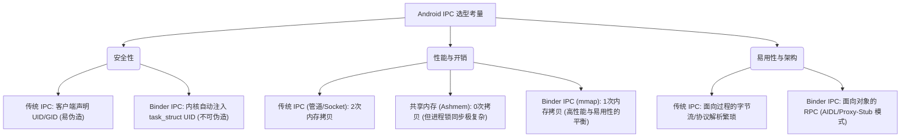
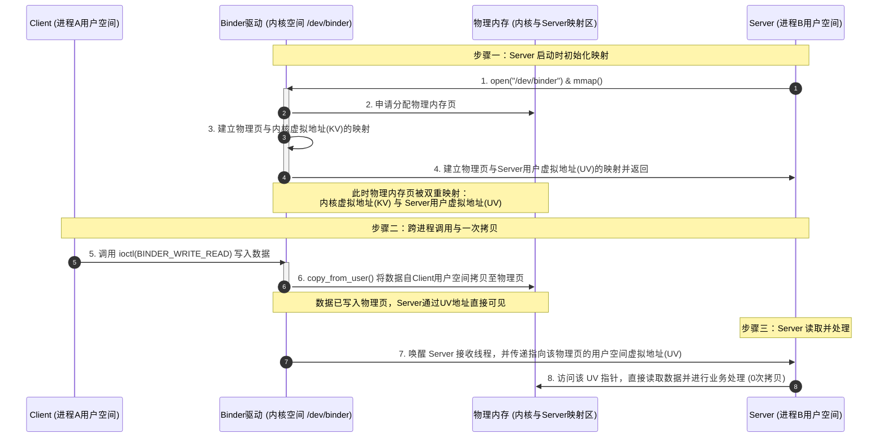

# Android IPC 进程间通信 详细机制

进程间通信 (IPC, Inter-Process Communication) 是构建多进程、多组件、高性能 Android 系统的核心技术纽带。Android 并没有全盘接收传统 Linux 的进程间通信方案，而是创新地开发并主推了以 Binder 为核心的 IPC 体系。

本文将系统阐述 Android IPC 的核心概念、沙箱隔离背景、Binder 与传统 Linux IPC 的深层设计取舍、Android 各种常用 IPC 方案的横向多维度对比，以及 Binder 底层的一次拷贝（`mmap`）实现机制。

---

## 1. 进程间通信 (IPC) 的核心概念与沙箱隔离

### 1.1 什么是 IPC
在现代操作系统中，**进程 (Process)** 是系统分配资源（如内存空间、文件描述符、CPU 时间片）的最小单位。为了防止进程之间互相干扰或非法篡改数据，操作系统在硬件（如 MMU 内存管理单元）和内核的协同下，为每个进程划分了独立的**虚拟地址空间**。
这意味着，默认情况下，进程 A 的指针无法指向并访问进程 B 的内存。这种物理上的硬隔离保障了系统的稳定性，但同时也切断了进程间直接协作的可能。为了实现跨进程协作、共享数据或调用对端功能，操作系统必须提供一种安全的桥梁——这就是**进程间通信 (IPC)**。

### 1.2 Android 应用沙箱与进程隔离的必要性
传统桌面 Linux 系统的设计通常面向单用户或少数可信用户，其进程隔离主要用于防止程序异常导致系统崩溃，而对跨进程通信的安全防范相对宽松（很多 IPC 默认没有强制性的内核身份校验）。

Android 系统则运行在移动终端这一极其复杂的生态中。为了保障数百万第三方应用在同一台设备上和平共处且不泄露隐私，Android 引入了基于 Linux 内核的**应用沙箱 (Application Sandbox) 机制**：
*   **UID/GID 的创造性映射**：在传统 Linux 中，用户 ID (UID) 用于区分不同的登录用户。而在 Android 中，每个应用（Application）在安装时，系统都会为其分配一个独一无二的 **Linux UID**。
*   **独立的安全沙箱**：基于这个 UID，每个应用都运行在自己专属的 Linux 进程中，并拥有独立的虚拟机（ART）实例。应用的文件、数据库等数据仅允许所属 UID 的进程读写。
*   **物理屏障的跨越**：由于沙箱的存在，A 应用无法读取 B 应用的私有文件，也无法直接调用 B 应用内存中的方法。然而，在实际业务中，应用需要向系统服务（如 `ActivityManagerService`、`WindowManagerService`、GPS 定位服务等）发送请求，或者两个不同的应用（如支付 App 与电商 App）需要安全地传递交易数据。

这种“物理上绝对隔离、业务上频繁互通”的根本矛盾，决定了 Android 必须拥有一套**高性能、极度安全且易于开发**的 IPC 机制。

---

## 2. 技术设计选型：为什么 Android 核心通信首选 Binder？

传统 Linux 提供了多种功能完备的 IPC 方式，包括管道 (Pipe)、有名管道 (FIFO)、信号量 (Semaphore)、消息队列 (Message Queue)、共享内存 (Shared Memory) 以及套接字 (Socket)。然而，除了一些特定场景外，Android 并没有采用它们作为系统骨架的核心通信手段，而是几乎全盘采用 Binder。

下面从**安全性**、**性能与开销**、以及**易用性**三个核心维度，深度剖析这一技术选型的背后取舍。



### 2.1 安全性（最重要）：Android 权限模型的底层基石

安全性是 Android 选择 Binder 的最关键驱动力。

#### 传统 Linux IPC 的安全隐患
1.  **身份标识易伪造**：在管道、消息队列或 Socket 通信中，虽然可以在传输协议包中夹带发送方的 UID/PID，但这些数据包字段通常是在**用户空间**由客户端自行填写的。恶意进程可以轻易通过 Hook 技术或修改二进制代码，将数据包中的 UID 伪造为 `SYSTEM` (UID 1000) 或 `ROOT` (UID 0)，从而骗取接收端的敏感权限。
2.  **缺乏内核级身份溯源**：传统 IPC 的接收端在收到报文后，只能被动解析协议包，无法通过一条物理可靠的通道，向内核反向求证“到底是谁在这一刻给我发了这条消息”。
3.  **接入点难以管理**：传统 Linux 的 IPC 节点（如文件系统中的管道文件、Socket 端口）通常只要拥有读写权限即可连接，无法在细粒度的面向对象方法级别（如“只允许该应用调用此接口的 A 方法，不允许调用 B 方法”）进行动态鉴权。

#### Binder 的安全设计
Binder 的每一次跨进程通信，都必须经过内核空间的 **Binder 驱动 (`/dev/binder`)** 进行中转与路由。
1.  **内核强制注入身份**：当客户端进程 A 向服务端进程 B 调用接口时，请求首先被内核中的 Binder 驱动拦截。驱动会直接在内核空间中，读取当前发起调用线程的 `task_struct` 结构体，获取该进程真实的 `uid` 和 `pid`。
2.  **不可伪造的事务数据**：Binder 驱动将获取到的真实 UID/PID 直接填充到内核事务数据结构（`binder_transaction_data`）的 `sender_euid` 和 `sender_pid` 字段中。由于这一过程在内核态强制执行，用户空间的客户端代码绝无可能对其进行任何篡改。
3.  **防伪鉴权 API**：服务端接收到请求时，可以通过调用静态方法 `Binder.getCallingUid()` 和 `Binder.getCallingPid()`，直接读取由内核注入的调用者身份标识。
4.  **物理级别的沙箱校验**：借助这一可靠的标识，Android 的系统服务（如 `PackageManagerService`）可以实施极其严格的权限检查：
    ```java
    // 服务端执行敏感操作前的鉴权逻辑
    public void executeProtectedTask() {
        int callingUid = Binder.getCallingUid();
        // 校验该 UID 是否拥有特定系统权限
        if (mContext.checkPermission(Manifest.permission.ACCESS_FINE_LOCATION, 
                Binder.getCallingPid(), callingUid) != PackageManager.PERMISSION_GRANTED) {
            throw new SecurityException("调用者未获得定位权限，拒绝访问！");
        }
        // 安全执行...
    }
    ```
这套由内核背书的 UID 注入机制，为整个 Android 应用沙箱权限模型奠定了最坚实的物理基础。

---

### 2.2 性能与开销：零拷贝 vs 一次拷贝 vs 两次拷贝

在移动设备上，CPU 主频受限且内存带宽极其珍贵。频繁的系统服务调用（如手指滑动时的窗口绘制事件分发）对 IPC 的延迟和吞吐量提出了近乎苛刻的要求。

#### 传统 IPC：两次拷贝 (Two Copies)
以管道 (Pipe)、Socket 以及消息队列为代表的传统 IPC，在数据传输过程中需要经历两次内存拷贝：
1.  **第一次拷贝**：发送端（Client）调用系统函数（如 `write()`），将数据从 Client 的用户空间拷贝到内核空间的临时缓冲区中（调用 `copy_from_user`）。
2.  **第二次拷贝**：接收端（Server）调用系统函数（如 `read()`），将数据从内核空间的缓冲区拷贝到 Server 的用户空间中（调用 `copy_to_user`）。

对于大体量或高频的通信，两次拷贝会占用大量的 CPU 时钟周期，并显著增加内存总线负载，引发系统卡顿。

#### 共享内存：零拷贝 (Zero Copy)
共享内存通过映射相同的物理内存到 Client 和 Server 的虚拟地址空间，实现了零拷贝。数据写入后对端立即可见。
但共享内存在日常应用级通信中没有被作为主推方案，主要是因为：
1.  **控制与同步极其困难**：共享内存本身并不提供互斥同步机制。两个进程同时写同一块内存会导致数据损坏。为了保证数据一致性，必须在用户空间引入复杂的互斥锁（Mutex）或信号量（Semaphore）。
2.  **死锁与资源泄漏隐患**：如果 Client 在持有跨进程互斥锁的期间突然遭遇 OOM 被杀或发生崩溃，这把锁将永远无法在用户空间被释放，从而导致 Server 进程被永久挂起。
3.  **生命周期难以自动管理**：难以获知对端何时使用完数据，极易引发物理内存无法回收的灾难。

#### Binder：一次拷贝 (One Copy)
Binder 巧妙地利用了**虚拟内存映射 (`mmap`)** 技术，在“传输效率”与“控制复杂度”之间取得了完美的平衡：
*   在 Server 进程初始化时，它会向 Binder 驱动申请一块虚拟内存空间，驱动通过 `mmap` 将这块 **Server 的用户空间虚拟内存** 与 **内核空间的虚拟内存** 同时映射到同一组**物理内存页**上。
*   当 Client 发起调用并写入数据时，Binder 驱动只需将数据从 Client 的用户空间，拷贝一次到内核映射的那块物理内存中（`copy_from_user`）。
*   由于该物理内存页已经被映射到了 Server 的用户空间，Server 进程无需任何拷贝操作，即可直接通过其虚拟内存指针读取该数据。
*   这不仅免去了第二次拷贝的 CPU 开销，还借助 Binder 驱动天然的队列和线程池管理，完美避开了共享内存死锁和同步问题。

---

### 2.3 易用性：面向对象的 RPC

传统 Linux IPC 都是面向过程的，通信双方必须处理低级别的字节流读写。
*   **繁琐的协议解析**：开发者需要自己定义数据包头、包体，手动进行数据的序列化与反序列化，并编写繁琐的套接字循环读写代码。

而 Binder 的设计从一开始就与 Java 语言的强类型及面向对象（OOP）深度绑定：
*   **AIDL (Android 接口定义语言)** 屏蔽了所有底层的 IPC 细节。开发者只需像编写普通 Java 接口一样定义方法，AIDL 编译器会自动生成客户端代理（`Proxy`）和服务端存根（`Stub`）。
*   对客户端而言，跨进程调用看起来和本地方法调用完全一致：
    ```java
    // 客户端直接调用远程方法，无需感知底层的 ioctl 和 Binder 驱动
    int result = myRemoteService.calculateData(100, 200);
    ```
*   **生命周期感知 (DeathRecipient)**：Binder 提供了死亡通知机制。如果远程服务进程意外崩溃，客户端可以通过注册 `DeathRecipient` 立即收到回调并进行清理或重连，保证了高可用性。

---

## 3. Android 各种 IPC 方式的多维度对比

除了 Binder 这一最核心的通信方式之外，Android 平台还并存着多种其他 IPC 手段。它们在不同的业务场景中各司其职。

### 3.1 常用 IPC 方案特点解析

1.  **Bundle / Intent**：
    *   **特点**：Android 组件间跳转与数据传递的载体，其底层序列化机制基于 Parcelable。
    *   **限制**：由于底层共享同一个 Binder 传输缓冲区（默认大小通常约 1MB），为了系统的整体稳定性，单个跳转的 Bundle 数据大小必须严格控制。在新版本 Android（API 30+）中，一旦单次传输数据过大，系统会极其敏感地抛出 `TransactionTooLargeException` 异常。因此，它仅适合传递体积极小的状态、ID 或轻量序列化对象。
2.  **文件共享**：
    *   **特点**：两个进程共同读写同一个物理文件。
    *   **缺陷**：缺乏并发保护。如果进程 A 正在写入，进程 B 同时进行读取，极易产生数据脏读、损坏。适合无并发要求的离线配置读取或大文件下载传输。
3.  **AIDL**：
    *   **特点**：最强大的强类型跨进程 RPC 方案。
    *   **机制**：直接基于 Binder。支持多线程并发，客户端可以通过 Binder 线程池并发调用服务端。
4.  **Messenger**：
    *   **特点**：对 AIDL 的轻量级 Handler 包装。
    *   **机制**：其底层实现依然是 AIDL，但它将所有的跨进程请求投递到服务端的单线程 `Handler` 队列中串行执行。这免去了服务端编写复杂线程同步锁的烦恼，适合非高并发、轻量级的状态同步与控制指令。
5.  **ContentProvider**：
    *   **特点**：数据共享的核心组件。
    *   **机制**：对于常规的 CRUD 数据库操作指令，其底层使用 Binder 进行信令传输；而当需要跨进程传输超大 Cursor 数据集或流媒体文件时，ContentProvider 底层可以结合 **Ashmem (匿名共享内存)** 并通过传递文件描述符 (FD) 来实现零拷贝的高速读取。
6.  **Socket**：
    *   **特点**：经典的 TCP/IP 网络回环通信。
    *   **机制**：开销极大，涉及完整的 TCP/IP 协议栈封包和两次内存拷贝。但在需要与跨 Runtime 进程（如底层的独立 C++ 守护进程、外部 Web 端）进行交互时，Socket 是唯一的通用选择。

---

### 3.2 各种 IPC 方式多维度对比表

| IPC 方式 | 传输效率（拷贝次数） | 带宽/数据限制 | 实时性 | 双向同步性 | 典型应用场景 | 优势 | 缺点 |
| :--- | :--- | :--- | :--- | :--- | :--- | :--- | :--- |
| **Bundle/Intent** | 一次拷贝 (基于 Binder) | 限制严格（建议 < 512KB），超出会崩溃 | 高 | 支持单向同步（跳转组件） | Activity/Service 组件转场与轻量传参 | 简单易用，系统原生结合紧密 | 无法传递大数据，不支持高频交互 |
| **文件共享** | 视底层介质而定（涉及磁盘 I/O） | 无理论限制，但受磁盘空间和 I/O 速率约束 | 低 | 差（无主动通知，需自行轮询或监听） | 跨进程配置共享、日志收集 | 极其简单，数据天然持久化 | 无并发控制，读写延迟高，易引发脏读 |
| **AIDL** | 一次拷贝 (基于 Binder) | 约 1MB 缓冲区限制（单次调用建议更小） | 高 | 强（支持同步阻塞与 `oneway` 异步） | 跨应用服务调用、多进程复杂架构、系统服务交互 | 性能高，支持多线程高并发，面向对象强类型 | 需处理多线程同步，开发成本相对较高 |
| **Messenger** | 一次拷贝 (基于 Binder) | 约 1MB 限制 | 高 | 强（通过 Message/ReplyTo 实现双向） | 跨进程轻量控制指令、状态查询 | 简单，天然线程安全（单线程 Handler 串行） | 无法处理高并发，所有请求排队执行 |
| **ContentProvider**| Binder 指令一次拷贝 / 大数据通过 Ashmem 零拷贝 | Binder 侧 < 1MB；Ashmem/FD 模式无此限制 | 高 | 强（支持 ContentObserver 自动监听） | 跨进程数据库共享（如通讯录、媒体库数据） | 结构化数据共享规范，大数据传输极快 | 只适合对数据源的 CRUD 操作，开发较重 |
| **Socket** | 两次拷贝 | 无硬性限制，但受网络带宽和协议栈吞吐量约束 | 中 | 强（支持全双工） | 跨 Runtime（如 Java 与 C++ 守护进程、跨设备通信） | 普适性强，支持跨平台，容易对接其他语言 | 协议解析繁琐，本地 IPC 性能和开销最大 |

---

## 4. Binder IPC 底层支撑与 mmap 物理内存映射原理

### 4.1 Binder 驱动与 /dev/binder
在 Linux 的设计中，“一切皆文件”。Binder 驱动在系统初始化时，通过 `misc_register` 将自己注册为一个字符设备，入口为 `/dev/binder`。
当一个进程使用 Binder 通信时，它首先需要调用 `open("/dev/binder", O_RDWR)` 打开该字符设备，随后调用 `mmap()` 进行内存映射。

### 4.2 mmap 物理内存映射步骤

为了消除第二次内存拷贝，Binder 驱动在内核中实现了自有的 `binder_mmap` 函数。其核心物理机制如下：

1.  **申请虚拟内存区域**：
    当接收端进程（Server）调用 `mmap` 时，内核会在该进程的虚拟内存空间中寻找一块空闲的区域（用户虚拟空间：`vm_area_struct`），同时在内核空间中也分配一块同样大小的虚拟内存区域（内核虚拟空间：`vm_struct`）。
2.  **分配物理页框并双重映射**：
    Binder 驱动分配若干个物理内存页（Physical Page）。接着，通过修改页表（Page Table），将上述分配的**用户虚拟地址**和**内核虚拟地址**同时指向这组相同的物理内存页。
3.  **单次拷贝执行**：
    当客户端（Client）向服务端发送数据时：
    *   Client 将数据打包放入用户空间缓冲区，调用 `ioctl(fd, BINDER_WRITE_READ, &bc)`。
    *   Binder 驱动响应 `ioctl` 请求，从 Client 的用户空间中读取数据，并直接拷贝到已建立映射的内核虚拟地址中（通过 `copy_from_user` 写入物理内存页）。
    *   因为这块物理内存页同样映射在 Server 的用户虚拟空间，Server 进程的接收线程被唤醒后，直接使用驱动传递过来的用户空间虚拟指针，即可直接读取该物理内存中的数据。

---

### 4.3 Binder 一次拷贝内存映射时序与关系图

下面的 Mermaid 序列图展示了 Server 注册映射，以及 Client 发起通信后，数据在内核驱动与物理内存之间的流转过程：



在这个过程中，只有在**第 6 步**发生了一次数据从 Client 用户空间到映射物理内存页的物理拷贝。**第 8 步**中 Server 对数据的访问不需要任何拷贝行为，这就是 Binder 实现“一次拷贝”的高效原理。

有关 Android 各版本对于 Binder 传输限制的变化，可以参考 [AndroidVersionChangeLog.md](../../../../../AndroidVersionChangeLog.md)。

---

## 5. 目录导航与子节点索引

为了对 IPC 的各个底层技术细节进行更加深入的探究，请参考以下专题文档：

*   [5.2.2.1.1 Binder](5.2.2.1.IPC/5.2.2.1.1.Binder.md)：深入分析 Binder 驱动、代理对象与存根对象、事务处理以及线程池管理。
*   [5.2.2.1.2 AIDL](5.2.2.1.IPC/5.2.2.1.2.AIDL.md)：接口定义、多进程回调（RemoteCallbackList）、同步与异步调用机制。
*   [5.2.2.1.3 Messenger](5.2.2.1.IPC/5.2.2.1.3.Messenger.md)：基于 Handler 的串行化轻量级 IPC 的实现原理与应用。
*   [5.2.2.1.4 Bundle](5.2.2.1.IPC/5.2.2.1.4.Bundle.md)：Parcelable 容器设计与 TransactionTooLargeException 的底层根源。
*   [5.2.2.1.5 序列化](5.2.2.1.IPC/5.2.2.1.5.序列化.md)：详细对比 Serializable 与 Parcelable 的工作机制、内存开销与适用场景。
*   [5.2.2.1.6 共享内存](5.2.2.1.IPC/5.2.2.1.6.共享内存.md)：Ashmem、MemoryFile 的底层机制，以及在跨进程大数据流式传输中的应用。
*   [5.2.2.1.7 跨进程传递大图片](5.2.2.1.IPC/5.2.2.1.7.跨进程传递大图片.md)：详解通过文件描述符传递、共享内存以及 ContentProvider Cursor 传输超大图片的设计模式与优劣。
