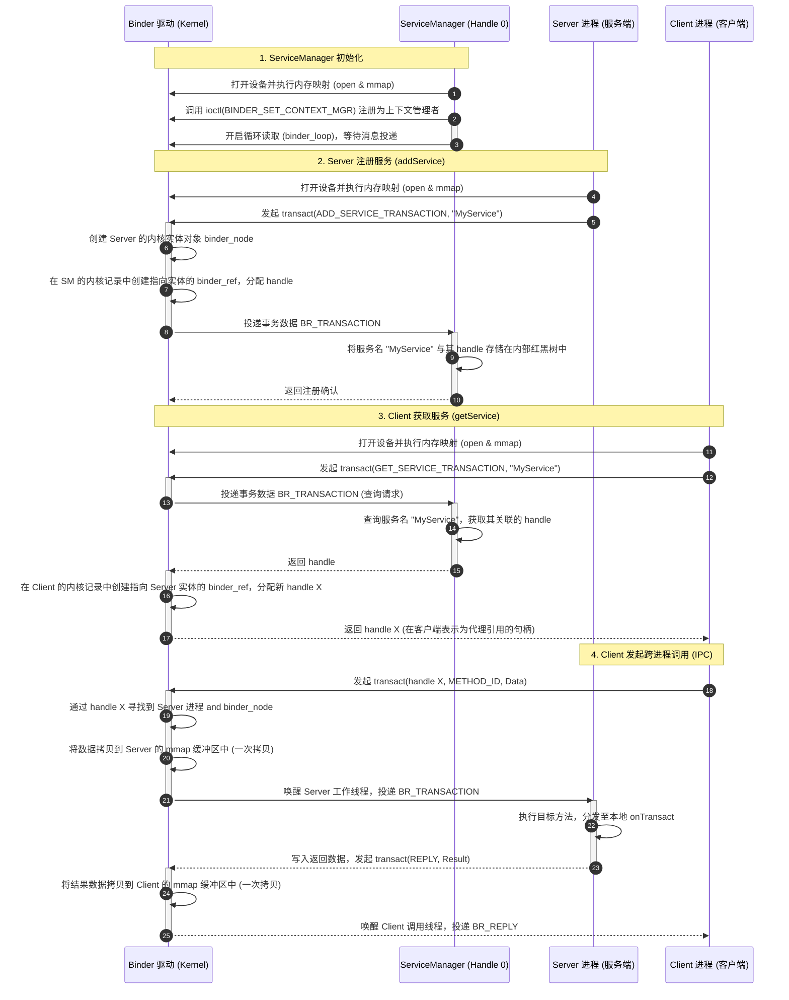
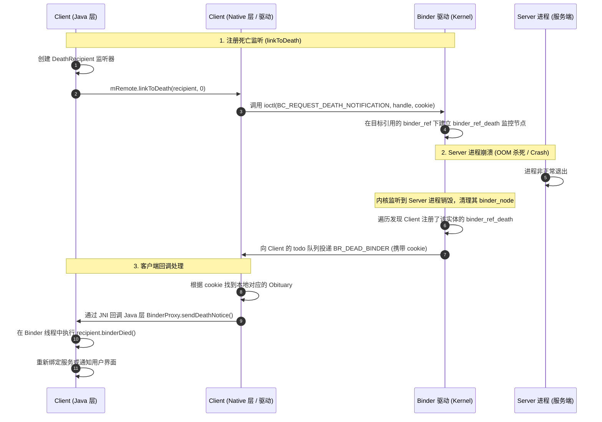

# Android Binder 进程间通信机制详解

在 Android 操作系统中，Binder 是整个系统架构的基石。无论是四大组件的生命周期管理（由 `ActivityManagerService` 负责），还是窗口的显示和绘制（由 `WindowManagerService` 负责），亦或是底层的硬件服务交互，均严重依赖 Binder 机制。

本篇文档将从 Binder 的多重身份出发，深入剖析其拓扑结构、注册与发现时序、内核驱动物理中转、Proxy/Stub 架构设计、线程池管理以及死亡通知机制。

---

## 1. Binder 核心概念

### 1.1 Binder 在 Android 架构中的多重身份

在不同的技术维度和上下文中，“Binder” 代表着不同的概念。理解 Binder 的多重身份是建立完整认知的第一步：

1. **IPC（进程间通信）机制**：
   在应用开发与系统设计维度，Binder 是一种跨进程调用工具。它采用了面向对象的思想，允许客户端进程像调用本地对象的方法一样调用远程进程的对象方法。这种设计将跨进程调用的复杂性屏蔽在底层框架中。
2. **内核驱动程序（`/dev/binder`）**：
   在 Linux 内核空间维度，Binder 表现为一个字符设备驱动。它虽然不对应任何实际物理硬件，但它是整个 Binder 通信的核心物理中转站。通过内核虚拟内存映射（`mmap`），它在底层负责数据的单次拷贝、线程调度、进程间安全凭证传递以及 Binder 实体与引用的双向转换。
3. **通信协议**：
   在通信机制维度，Binder 是一套规范的用户态与内核态数据交互协议。它基于一系列以 `BC_`（Binder Command，用户态发往内核态）和 `BR_`（Binder Reply，内核态发往用户态）开头的命令字，规定了如何封装传输数据、传递控制信号以及处理并发事务。
4. **本地服务类与代理类（Java / C++ 软件框架）**：
   在软件实现维度，Binder 是一整套庞大的基类与接口设计体系。
   - **Java 层**：抽象接口 `IBinder`、服务端实体基类 `Binder`、客户端代理类 `BinderProxy`。
   - **Native 层**：抽象接口 `IBinder`、服务端实体基类 `BBinder`、客户端代理类 `BpBinder`。
   它们通过统一的类继承与多态机制，将底层的进程间调用映射为用户空间的面向对象方法调用。

### 1.2 Binder 四要素的拓扑关系

Binder 的通信系统是一个典型的类似网络通信的拓扑结构，由四个核心角色组成：**Client（客户端）**、**Server（服务端）**、**ServiceManager（服务注册与发现中心）** 以及 **Binder 驱动（通信路由器）**。

- **Binder 驱动**：运行在内核空间（Kernel Space），是通信体系的唯一物理通道。它负责跨进程的数据传输、内存映射建立以及安全校验。
- **ServiceManager**：运行在用户空间（User Space），是整个系统的“DNS 服务器”。它维护了一个系统服务的名字与 Binder 引用句柄的映射表，负责服务的注册（`addService`）与查询（`getService`）。它的 Binder 句柄在内核中被固定为 `0`，使得任何进程都能直接与其通信。
- **Server**：提供业务逻辑的进程。它会向 Binder 驱动申请创建 Binder 实体，并将其注册到 ServiceManager 中。
- **Client**：使用业务逻辑的进程。它首先向 ServiceManager 查询目标服务，获取其在内核中对应的 Binder 引用句柄，再利用该句柄通过驱动向 Server 发起 IPC 请求。

这四要素之间的角色类比关系如下表所示：

| 角色名称 | 互联网通信类比 | 核心职责 | 运行空间 |
| --- | --- | --- | --- |
| **Binder 驱动** | 路由器与物理光纤 | 负责实际的数据路由、物理传输与物理中转，建立共享内存 | 内核空间 |
| **ServiceManager** | DNS 解析服务器 | 集中管理服务的命名、注册与查找，返回引用句柄 | 用户空间 |
| **Server** | Web 业务服务器 | 注册具体服务，提供核心业务处理逻辑，接收并执行方法 | 用户空间 |
| **Client** | Web 浏览器 | 发送查询服务请求，获取代理对象，发起业务请求 | 用户空间 |

### 1.3 服务注册与发现的时序图

为了实现进程间通信，Server 必须先将服务注册到 ServiceManager 中，Client 也必须先从 ServiceManager 获取服务引用。其注册与发现的完整时序如下图所示：



---

## 2. 工作原理与内核物理中转

### 2.1 Binder 驱动的角色：物理中转与安全屏障

Linux 传统的 IPC 机制（如管道、FIFO、消息队列等）由于需要将数据在“用户空间 $\rightarrow$ 内核空间 $\rightarrow$ 用户空间”之间进行两次拷贝，在高并发、大吞吐量的移动设备上显得心有余而力不足。此外，传统 Linux IPC 缺乏可靠的安全鉴权手段，极易被恶意应用伪造发送端 UID/PID。

Binder 驱动作为内核级设备驱动，充当了以下双重角色：
1. **高效物理中转**：通过建立接收端进程的虚拟映射空间，实现整个数据传输链路的“单次拷贝”，极大降低了 CPU 开销。
2. **安全隔离屏障**：由于 Binder 驱动运行在内核中，应用进程无法直接修改内核数据。驱动程序在拦截每一次 IPC 调用时，都会自动将发送端真实的 UID（用户标识）和 PID（进程标识）注入到 `binder_transaction_data` 结构体的 `sender_euid` 和 `sender_pid` 字段中。这为接收端服务进行权限鉴别提供了绝对真实可靠的前提，防范了伪造身份的越权攻击。

### 2.2 mmap 内存映射与一次拷贝原理

“一次拷贝”是 Binder 傲视传统 Linux IPC 性能的核心所在。其底层物理中转机制依赖于 Linux 的 `mmap`（内存映射）。

#### 2.2.1 一次拷贝的物理映射机制
1. **传统的二次拷贝**：
   - 步骤一：发送端调用系统调用，将数据从其用户空间缓存拷贝到内核缓冲区（第一次拷贝）。
   - 步骤二：接收端调用系统调用，将数据从内核缓冲区拷贝到其接收端的用户空间（第二次拷贝）。
2. **Binder 的一次拷贝（`mmap`）**：
   - 当一个进程初始化并打算参与 Binder 通信时，它会首先调用 `ProcessState::self()`。
   - `ProcessState` 会在 Native 层通过系统调用 `open("/dev/binder", ...)` 打开驱动，并紧接着调用 `mmap`。
   - **双重映射的建立**：内核 Binder 驱动接收到 `mmap` 请求后，会在内核中分配一块虚拟内存区域（内核空间虚拟地址），同时将这块内核虚拟地址与当前进程的用户空间虚拟地址映射到**同一组物理内存页**上。
   - **内存限制**：为了防止单个进程占用过多的内核资源，应用进程的映射空间大小在底层被严格限制为 `1016KB`（即 `1MB - 8KB`，8KB 用于作为防溢出保护页）。
   - **物理中转过程**：
     - 当 Client 进程发送数据时，它调用 `copy_from_user` 将数据从 Client 的用户空间拷贝到内核映射区（即上述物理内存页）。
     - 由于 Server 的用户空间虚拟地址也映射到了这块相同的物理内存页上，Server 进程的用户空间代码可以直接在这块内存中读取数据。
     - 数据从 Client 的用户空间直接进入了 Server 进程可以直接访问的物理内存，只发生了一次数据拷贝，节省了接收端的 `copy_to_user` 过程。

一次拷贝的物理内存双重映射关系如下图所示：

```
+-------------------------------------------------------------+
|                     Client 进程 (用户空间)                  |
|  +--------------------+                                     |
|  |   Client 事务数据  |                                     |
|  +---------+----------+                                     |
+------------|------------------------------------------------+
             | copy_from_user (唯一的一步拷贝)
             v
+------------|------------------------------------------------+
| 内核空间   |                                                |
|  +---------v----------+                                     |
|  |    内核映射缓冲区   <============ 双重映射关系            |
|  +---------+----------+           (指向同一组物理内存页)     |
+------------|------------------------------------------------+
             |                                                |
             | 映射指针直接可达                               |
             v                                                |
+------------|------------------------------------------------+
|  +---------v----------+                                     |
|  |   Server 映射缓冲区 |                                     |
|  +--------------------+                                     |
|                     Server 进程 (用户空间)                  |
+-------------------------------------------------------------+
```

### 2.3 Binder 实体与 Binder 引用的解析

Binder 内核驱动通过维护实体与引用的转换，实现了面向对象的跨进程方法调用。在驱动中，有两种核心的数据结构：

1. **`binder_node`（内核 Binder 实体）**：
   - 代表服务端的实体对象，与服务端的 Binder 真实对象（如 Java 层的 `Binder`，C++ 层的 `BBinder`）一一对应。
   - 它记录了该实体归属于哪个服务端进程（`binder_proc`），以及该实体在服务端用户空间的内存指针（`ptr` 与 `cookie`）。
2. **`binder_ref`（内核 Binder 引用）**：
   - 代表客户端进程持有的对远程服务的引用，它指向对应的 `binder_node`。
   - 在客户端的用户空间中，这个引用被抽象为一个 32 位的整数，称为 **句柄（Handle）**。客户端发起 IPC 时，只需要传递这个整数句柄。

#### 2.3.1 传递与转换逻辑
当一个 Binder 对象跨越进程边界传输时（例如作为方法的入参或返回值），它在内核中被包装为 `flat_binder_object` 结构体。驱动在物理中转时，会自动对其类型进行改写：

- **从实体到引用（Server $\rightarrow$ Client）**：
  当 Server 进程向客户端返回一个 Binder 实体时，在打包的数据中，该对象的类型是 `BINDER_TYPE_BINDER`（带实体内存指针）。
  驱动拦截到该对象后：
  1. 它会在 Server 进程的 `binder_proc` 结构中查找或创建一个 `binder_node`，保存其内存指针。
  2. 它会在目标接收端（Client）进程的 `binder_proc` 中查找或创建一个指向该 `binder_node` 的 `binder_ref`。
  3. 驱动为该 `binder_ref` 分配一个当前客户端进程内唯一的整数句柄（如 `handle = 1`）。
  4. 驱动修改传输数据包：将 `flat_binder_object` 的类型改写为 `BINDER_TYPE_HANDLE`，并将实体指针替换为 `handle`。
  5. 客户端收到数据后，便能利用这个 `handle` 构建出客户端代理。
- **从引用到实体（Client $\rightarrow$ Server）**：
  当 Client 进程通过 handle 调用远程方法时，打包的数据中该对象的类型是 `BINDER_TYPE_HANDLE`（带句柄值）。
  驱动拦截到该对象后：
  1. 它根据客户端进程信息和传输的 `handle`，在其内核表里找到对应的 `binder_ref`。
  2. 顺着 `binder_ref` 找到目标的 `binder_node`。
  3. 驱动发现这个 `binder_node` 属于 Server 进程，于是修改传输数据包：将类型改写回 `BINDER_TYPE_BINDER`，并填入该实体在 Server 进程中的用户空间内存指针（`cookie`）。
  4. Server 进程收到数据后，驱动直接将 `cookie` 还原为本地的 Binder 服务对象。

---

## 3. Proxy/Stub 架构设计（源码级剖析）

Android 系统在 Java 层和 Native（C++）层都实现了一套平行的 Binder 软件框架，它们通过 JNI（Java Native Interface）进行双层映射与桥接。

### 3.1 跨语言框架对照

Binder 在 Java 层与 Native 层主要类的对应关系如下：

```
  [Java 层]                               [JNI 桥接层]                               [C++ Native 层]
+--------------+                                                                  +--------------+
|  IInterface  | <---------------------------------------------------------------> |  IInterface  |
+-------+------+                                                                  +-------+------+
        ^                                                                                 ^
        | 继承                                                                            | 继承
+-------+------+                                                                  +-------+------+
|   IBinder    | <===============================================================> |   IBinder    |
+---+------+---+                                                                  +---+------+---+
    ^      ^                                                                          ^      ^
    |      |                                                                          |      |
    | 派生 | 派生                                                                      | 派生 | 派生
+---|--+ +-+------------+                                                         +---|--+ +-+------------+
|Binder| |BinderProxy   | <================ JNI 映射 ================>            |BBinder| |BpBinder     |
+---+--+ +--------------+                                                         +-------+ +-------------+
    ^                                                                                 ^
    | 继承                                                                            | 继承
+---+--+                                                                          +---+--+
| Stub | (AIDL 生成)                                                               |JavaBBinder  (JNI内部桥接)
+------+                                                                          +------+
```

### 3.2 Proxy/Stub 的 JNI 桥接与源码实现

#### 3.2.1 客户端代理侧：`BinderProxy` 与 `BpBinder`
在 Java 层，客户端通过 AIDL 接口获得的远程服务对象实质上是 `BinderProxy`。
- `BinderProxy` 类中持有一个 `long mObject` 字段，该字段在 JNI 层被赋予了 Native 层 `BpBinder` 实例的内存指针地址。
- 当我们在 Java 层调用 `BinderProxy.transact(...)` 时，其会调用一个 Native 方法 `transactNative(...)`：
  ```java
  // 位于 android.os.BinderProxy.java
  public native boolean transactNative(int code, Parcel data, Parcel reply, int flags)
          throws RemoteException;
  ```
- 该方法在 JNI 层的映射实现位于 `frameworks/base/core/jni/android_util_Binder.cpp`：
  ```cpp
  // 简化版 JNI 实现示意
  static jboolean android_os_BinderProxy_transact(JNIEnv* env, jobject obj,
          jint code, jobject dataObj, jobject replyObj, jint flags) {
      // 1. 从 Java 的 BinderProxy 对象中取出保存的 BpBinder 指针
      IBinder* target = getBPNativeData(env, obj)->mObject.get();
      if (target == nullptr) {
          jniThrowException(env, "java/lang/IllegalStateException", "Binder has been finalized!");
          return JNI_FALSE;
      }
      // 2. 将 Java 层的 Parcel 转换成 C++ 层的 Parcel
      Parcel* data = parcelForJavaObject(env, dataObj);
      Parcel* reply = parcelForJavaObject(env, replyObj);

      // 3. 调用 BpBinder 的 transact 方法
      status_t err = target->transact(code, *data, reply, flags);
      return err == NO_ERROR ? JNI_TRUE : JNI_FALSE;
  }
  ```
- `BpBinder` 在 Native 层接收到 `transact` 请求后，会通过 `IPCThreadState::self()` 将请求交付给线程单例，最终打包调用 `ioctl` 写入驱动。

#### 3.2.2 服务端实体侧：`JavaBBinder` 与 `Binder`
在服务端，我们自定义的 Service 继承自生成的 `Stub` 类，而 `Stub` 继承自 `android.os.Binder`。
- 当我们将 Java 层的 `Binder` 服务实体通过跨进程返回时，JNI 会在内核驱动改写数据的前期，在 Native 层为其包裹一个名为 `JavaBBinder` 的 C++ 对象。
- `JavaBBinder` 继承自 C++ 层的 `BBinder`。它内部持有一个 Java 层 `Binder` 对象的弱引用（`jweak`）。
- 当 Binder 驱动接收到客户端请求并唤醒服务端线程时，`IPCThreadState` 会定位到目标 `BBinder`（即 `JavaBBinder`），并调用其 `transact`：
  ```cpp
  // 位于 android_util_Binder.cpp 的 JavaBBinder 核心实现
  status_t JavaBBinder::onTransact(uint32_t code, const Parcel& data, Parcel* reply, uint32_t flags) {
      JNIEnv* env = javavm_to_jnienv(mVM);
      // 1. 获取对应的 Java 层 Binder 实体对象
      jobject binderObject = env->NewLocalRef(mObject);
      
      // 2. 将 C++ 层的 Parcel 封装成 Java 层的 Parcel
      jobject dataObj = ioctlParcelToJavaObject(env, &data);
      jobject replyObj = ioctlParcelToJavaObject(env, reply);
      
      // 3. 调用 Java 层 Binder 对象的 execTransact 方法
      jboolean res = env->CallBooleanMethod(binderObject, gBinderOffsets.mExecTransact,
              code, reinterpret_cast<jlong>(&data), reinterpret_cast<jlong>(reply), flags);
              
      return res ? NO_ERROR : UNKNOWN_ERROR;
  }
  ```
- Java 层的 `Binder.execTransact()` 接收到 JNI 回调后，会在当前 Binder 线程中直接分发到具体的 `onTransact()`，最终执行我们在 `Stub` 中重写的业务方法。

### 3.3 `ProcessState` 与 `IPCThreadState` 的生命周期与职责

在 Native 层中，`ProcessState` 与 `IPCThreadState` 负责了进程级与线程级与驱动交互的全部细节：

1. **`ProcessState`（进程状态管理器）**：
   - **生命周期**：进程单例，通过 `ProcessState::self()` 创建并获取。其生命周期与进程共存亡。
   - **核心职责**：
     - **打开驱动**：执行 `open("/dev/binder", O_RDWR | O_CLOEXEC)`，并将句柄保存在成员变量 `mDriverFD` 中。
     - **建立映射**：执行 `mmap(nullptr, BINDER_VM_SIZE, PROT_READ, MAP_PRIVATE | MAP_NORESERVE, mDriverFD, 0)`。
     - **引用缓存**：管理本进程内部所有 `BpBinder` 的创建与引用生命周期，防止重复创建代理。
2. **`IPCThreadState`（线程通信执行器）**：
   - **生命周期**：线程单例，通过线程局部存储（TLS）实现，每个参与 Binder 通信的线程在首次调用 `IPCThreadState::self()` 时自动创建。
   - **核心职责**：
     - **数据缓冲**：内部拥有 `mIn` 和 `mOut` 两个 `Parcel` 缓存区，分别对应接收和发送的数据包。
     - **与驱动交互**：核心方法 `talkWithDriver` 封装了 `ioctl` 系统调用：
       ```cpp
       status_t IPCThreadState::talkWithDriver(bool doReceive) {
           binder_write_read bwr;
           // 填充写入数据与读取数据的信息
           bwr.write_size = mOut.dataSize();
           bwr.write_buffer = reinterpret_cast<binder_uintptr_t>(mOut.data());
           bwr.read_size = doReceive ? mIn.dataCapacity() : 0;
           bwr.read_buffer = reinterpret_cast<binder_uintptr_t>(mIn.data());
           
           // ioctl 陷入内核，读写操作在驱动中是原子的
           ioctl(mProcess->mDriverFD, BINDER_WRITE_READ, &bwr);
           return NO_ERROR;
       }
       ```
     - **命令执行与分发**：在接收数据后，循环解析 `mIn` 中的 `BR_` 命令。如果是 `BR_TRANSACTION`，则根据句柄查找本地实体并调用其 `transact`，如果是 `BR_REPLY`，则唤醒挂起的客户端调用线程。

---

## 4. 事务处理与线程池管理

### 4.1 Binder 线程池的开启与主线程注册

在应用启动时，由于其由 Zygote 进程 fork 出来，进程的初始化阶段会调用 `ProcessState::self()->startThreadPool()`：

- **主线程的创建**：
  `startThreadPool()` 内部会创建并启动一个名为 `Binder:<pid>_1` 的线程。该线程在其执行入口中会调用 `IPCThreadState::self()->joinThreadPool(true)`（`isMain = true`）。
- **注册 looper**：
  主 Binder 线程向驱动发送 **`BC_ENTER_LOOPER`** 命令，随即进入 `talkWithDriver` 的无限循环。它告诉驱动，自己是该进程的 Binder 主线程，处于随时可以接受 IPC 调用的状态。

### 4.2 线程池的动态扩容机制（BR_SPAWN_LOOPER）

在面临大量并发 IPC 请求时，如果仅凭一个主线程处理，必然会导致请求排队甚至阻塞。Binder 驱动与用户空间利用 **`BR_SPAWN_LOOPER`** 机制实现了动态调节：

1. **设置线程上限**：
   在应用初始化时，系统通过 `ProcessState::self()->setThreadPoolMaxThreadCount(15)` 设置最大动态线程数。
   - 注意：此数值 `15` 指的是**允许动态创建的非主工作线程数上限**。
   - 加上主 Binder 线程本身，该进程的 Binder 线程池最多能拥有 $15 + 1 = 16$ 个工作线程。这也是行业中俗称的“16 个 Binder 线程上限”的由来。
2. **触发扩容**：
   当 Client 发起高并发跨进程调用，且 Binder 驱动检测到该进程的 Binder 任务队列中存在堆积事务，并且目前**该进程内没有处于空闲状态的 Binder 线程**时：
   - 只要当前已创建的动态线程数尚未达到上限（15 个），驱动在某个正在执行任务的线程即将退出 ioctl 返回用户空间时，会在响应包中夹带 **`BR_SPAWN_LOOPER`** 命令。
3. **线程创建**：
   服务端进程收到该命令后，会通过 `ProcessState` 创建一个新的 Native 线程，名为 `Binder:<pid>_<index>`。
4. **子线程注册**：
   新线程在其入口中执行 `joinThreadPool(false)`（`isMain = false`）。它会向驱动发送 **`BC_REGISTER_LOOPER`** 命令，随后进入 ioctl 监听。这代表一个崭新的工作线程正式加入线程池，用来分担并发调用。

### 4.3 超过最大线程数时的系统表现

如果系统的并发跨进程请求持续增加，且该 Server 进程的 16 个 Binder 线程全部处于满载运行状态时：
- **请求进入等待队列**：后续到达的跨进程事务会堆积在内核中该进程对应的 `binder_proc->todo` 等待队列中。
- **客户端挂起等待**：如果客户端执行的是同步 Binder 调用（未设置 `FLAG_ONEWAY`），客户端的调用线程将一直在内核的等待队列中处于挂起（睡眠）状态，直到服务端释放出空闲的 Binder 线程并处理了该请求，客户端才会被唤醒并收到 `BR_REPLY`。
- **异步事务耗尽内存 (ENOMEM)**：若客户端使用的是异步单向调用（`one-way`），客户端线程不会被挂起。但在服务端满载的情况下，大量未处理的异步事务数据会堆积在服务端的 `mmap` 缓冲区中。一旦累积的数据量超过 `1016KB` 的映射限制，后续的 `transact` 调用会在内核中直接返回 `ENOMEM`（内存不足），此时在 Java 层会抛出 `RemoteException`，严重时可能导致接收端或发送端进程异常崩溃。

---

## 5. 死亡通知机制（DeathRecipient）

由于跨进程通信的发送端和接收端进程生命周期独立，如果服务端进程因为内存过载被系统 OOM 杀死、发生 Native 崩溃或主动退出，客户端所持有的 `BinderProxy` 就会处于一种失效状态。如果客户端继续调用，会直接抛出 `DeadObjectException`。

为了能够及时让客户端得知远程服务的挂掉，以进行重连或资源清理，Binder 提供了 **死亡通知（DeathRecipient）** 机制。

### 5.1 linkToDeath 与 unlinkToDeath 的底层原理

#### 5.1.1 注册阶段（`linkToDeath`）
1. Client 进程调用 `IBinder.linkToDeath(recipient, flags)`。
2. 调用通过 JNI 传递到 Native 层。在 `android_util_Binder.cpp` 中，JNI 创建一个 `Obituary`（讣告）结构体。该结构体中包裹了 Java 层 `DeathRecipient` 对象的弱引用。
3. `BpBinder` 接收到调用，执行 `linkToDeath`。它会调用 `IPCThreadState::self()` 向内核驱动发送 **`BC_REQUEST_DEATH_NOTIFICATION`** 命令。
4. 该命令中携带了目标服务的 `handle` 以及 JNI 层创建的 `Obituary` 的地址指针（作为唯一标识 `cookie`）。
5. Binder 驱动接收到命令，在客户端进程对应的 `binder_ref`（引用记录）中，创建并挂载一个 **`binder_ref_death`** 结构体，其中记录了上述 `cookie`。

#### 5.1.2 触发阶段（服务端意外挂掉）
1. 服务端进程由于异常崩溃或被系统杀死，内核在执行进程资源清理时，会触发 `binder_release` 释放该进程持有的所有 `binder_node`（实体）。
2. 内核 Binder 驱动遍历即将被销毁的 `binder_node`，查找有哪些客户端进程的 `binder_ref` 指向该实体。
3. 如果发现某个客户端的 `binder_ref` 下挂载了 `binder_ref_death` 结构，驱动会向该客户端进程的 `todo` 任务队列中投递一条 **`BR_DEAD_BINDER`** 命令，并将注册时保存的 `cookie` 附带在数据包中。
4. 客户端进程中正在阻塞等待的某个 Binder 工作线程被唤醒，读取到 `BR_DEAD_BINDER`。
5. 线程在 `IPCThreadState` 中解析数据，根据 `cookie` 指针寻找到用户空间中对应的 `Obituary`。
6. 通过 JNI 环境，调用 Java 层的 `BinderProxy.sendDeathNotice(DeathRecipient recipient)`。
7. 该方法最终在其 Binder 线程中直接执行我们实现的 `recipient.binderDied()` 回调，实现了对端进程死亡的通知。

#### 5.1.3 注销阶段（`unlinkToDeath`）
当客户端主动不再需要监听，或者在接收到 `binderDied` 回调正在进行资源解绑时，应调用 `unlinkToDeath`：
1. 客户端调用 `unlinkToDeath(recipient, ...)`。
2. Native 层向驱动发送 **`BC_CLEAR_DEATH_NOTIFICATION`** 命令。
3. 驱动在内核中移除对应的 `binder_ref_death` 结构，防止由于多次注册或重复回调引发的内存泄漏。

### 5.2 死亡通知机制的时序图

以下是服务端崩溃后，死亡通知机制在内核与两端进程之间的流转时序：



---

## 6. Binder 的现代演进与版本适配

Binder 机制作为 Android 系统的核心，随着系统版本的演进，在架构和系统安全策略上经历了多次重大调整。关于平台整体版本变更信息，可查阅根目录的 [AndroidVersionChangeLog.md](../../../../../AndroidVersionChangeLog.md)。本节将重点剖析 Binder 通信在现代 Android 版本中的核心演进点。

### 6.1 Android 8.0：Project Treble 与多 Binder 域隔离
在 Android 8.0 之前，系统服务和硬件厂商的 HAL（Hardware Abstraction Layer）服务共同挤在同一个 `/dev/binder` 设备节点中。这导致了硬件组件与系统 Framework 框架高度耦合，不利于系统的独立升级。
为了解决该瓶颈，Android 8.0 推行了 Project Treble 计划，将 Binder 在物理设备层面拆分成了三个相互隔离的 Binder 域：
1. **`/dev/binder` (Framework 域)**：专用于 App 进程与 `SystemServer` 之间的应用层通信。
2. **`/dev/hwbinder` (Hardware 域)**：专用于 Framework 与底层硬件 HAL 服务进程，或者 HAL 服务之间的通信。
3. **`/dev/vndbinder` (Vendor 域)**：专用于芯片/设备厂商底层进程（Vendor 进程）之间的内部通信。这些进程被禁止访问 `/dev/binder` 以隔离系统级敏感信息。

这种物理设备的分离配合相应的权限策略，使得 Framework 层的迭代和 HAL 层的演化能完全解耦。

### 6.2 Android 10：Stable AIDL 与 `libbinder_ndk`
在 Android 10 之前，Native 层编写 Binder 只能链接非公开且非二进制兼容的 `libbinder.so`。在系统升级时，旧版本编译的 Native 组件常常会因为动态库符号变更而崩溃。
Android 10 引入了**稳定 AIDL (Stable AIDL)** 和 **`libbinder_ndk`** 库。
- `libbinder_ndk` 是一套具备向前与向后 ABI 兼容性保证的 C 语言接口，是 `libbinder` 的一个子集。
- 它为 Native 模块（例如 APEX 动态更新模块、硬件厂商 HAL）提供了一套极其稳定的跨进程通信接口，彻底规避了系统升级时的 ABI 不匹配风险。

### 6.3 Android 14 与 Android 15：后台冻结进程下的 Binder 事务控制
为了延长电池寿命并优化系统整体流畅度，现代 Android 系统会更加激进地对处于后台的应用进程实施“冻结（Frozen）”策略。这为 Binder 传输引入了新的运行时约束：
- **同步调用的快速失败 (Android 14)**：
  如果一个后台进程已经被系统冻结，此时前台进程若向其发起**同步 Binder 调用**（等待返回值），客户端将不再会被无限期挂起，而是会立即收到 `DeadObjectException` 异常。系统以此保护前台进程不被后台卡死的进程拖垮。
- **异步事务的挂起与缓冲限制 (Android 15)**：
  如果向已被冻结的进程发送**异步单向调用（`one-way`）**，Binder 驱动不会直接分发这些事务，而是会将它们缓存在内核的 `todo` 队列中。
  在 [AndroidVersionChangeLog.md](../../../../../AndroidVersionChangeLog.md) 提及的底层资源保护原则下，Android 15 对此类挂起事务设置了更为严格的内核缓冲区配额限制。当缓存在队列中的数据包大小累计达到阈值时，驱动会拒绝接收该进程的后续异步事务，并在客户端抛出事务失败的异常。
  **适配建议**：应用在退到后台、可能被系统冻结前，必须停止所有不必要的后台跨进程数据交互，防止触发缓冲区耗尽而引发异常退出。
