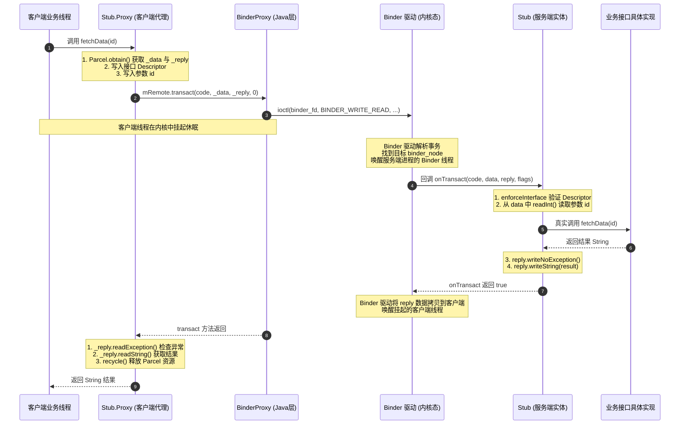
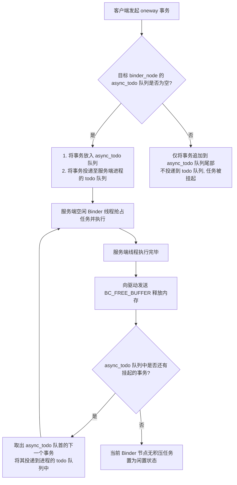
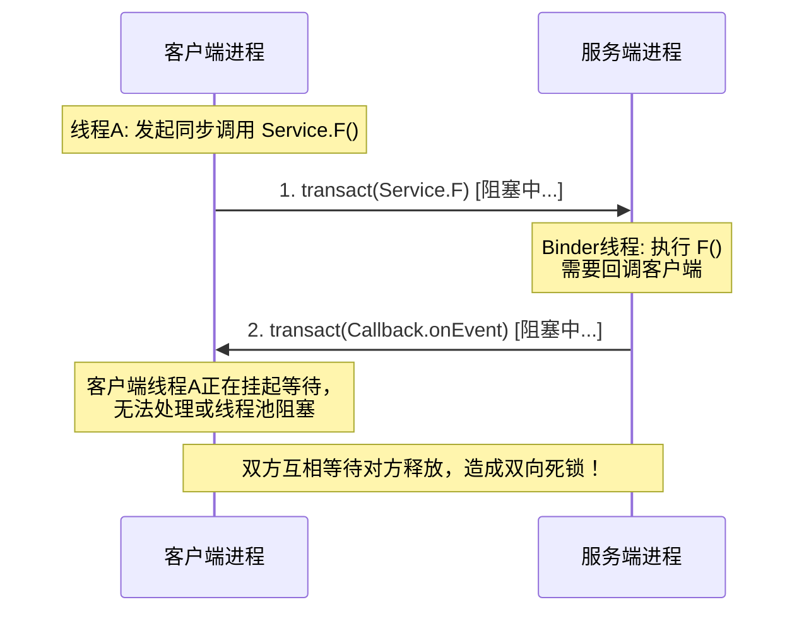

# AIDL 详细机制与底层原理

在 Android 系统中，每个应用程序都运行在独立的沙盒进程中，拥有自己独立的内存空间。这种隔离机制保证了系统的安全与稳定，但同时也为进程间的协作带来了天然的壁垒。为了打破这层壁垒，Android 提供了基于 Binder 的 IPC（Inter-Process Communication，进程间通信）机制。

为了简化 Binder 的开发难度，降低手动编写 Binder 样板代码的繁琐与出错概率，Android 引入了 **AIDL（Android Interface Definition Language，Android 接口定义语言）**。本文将从 AIDL 的设计初衷出发，深入剖析编译器自动生成的 Stub 与 Proxy 类源码，解析 `RemoteCallbackList` 跨进程回调的底层机密，并深度探讨 `oneway` 异步调用的时序保证与 Binder 驱动层串行化机制。

---

## 1. AIDL 的设计初衷与数据支持

### 1.1 什么是 AIDL？
AIDL 是一种接口定义语言，它允许开发者定义客户端与服务端达成共识的编程接口，用于进行跨进程通信（IPC）。

在本质上，**AIDL 并不是一种直接参与运行的通信协议，而是一个“代码生成工具”。**
开发者通过 AIDL 文件声明方法签名，Android 构建工具（如 `aidl` 编译器）会在编译期间自动将该文件翻译成一套符合 Binder 规范的 Java 或 C++ 接口代码。这套自动生成的代码中封装了所有的数据序列化、反序列化、Binder 驱动交互以及跨进程调用分发的细节，使得开发者能够像调用本地对象方法一样，无感地调用另一个进程中的对象方法。

### 1.2 AIDL 支持的数据类型
AIDL 对传输的数据有着严格的类型限制，因为它必须保证所有传输的数据都能够被高效地序列化为 Parcel 数据流，从而跨越进程边界。AIDL 默认支持以下数据类型：
1. **Java 八大基本数据类型**：`byte`, `char`, `short`, `int`, `long`, `float`, `double`, `boolean`。
2. **String** 和 **CharSequence**。
3. **List**：List 中的所有元素必须是 AIDL 支持的类型之一，或者是其他声明的 AIDL 接口、或已实现的 Parcelable 接口。接收端实际收到的集合类型总是 `ArrayList`。
4. **Map**：Map 中的所有元素必须是 AIDL 支持的类型之一。接收端实际收到的集合类型总是 `HashMap`。不支持泛型 Map。
5. **Parcelable**：所有实现了 `Parcelable` 接口的自定义对象，这些对象在 AIDL 中使用前必须显式地进行 `import`，并且必须在同名 AIDL 文件中声明为 `parcelable`。
6. **AIDL 接口**：所有在 AIDL 中定义的接口，也可以作为参数或返回值进行传输。

### 1.3 定向 Tag (Directional Tags) 与序列化代价
在 AIDL 中，非基本数据类型的参数必须冠以“定向 Tag”，用于指示数据在跨进程调用中的流向：
- **`in`**：表示数据只能从客户端流向服务端。这是默认行为。服务端收到的是客户端对象的一份拷贝，服务端对该对象的修改不会反馈给客户端。
- **`out`**：表示数据只能从服务端流向客户端。客户端传入的对象在发送时其内部数据不会被序列化，服务端收到的是一个空内容的“壳”对象，服务端填充该对象后，数据会在返回时序列化并写回客户端对应的对象中。
- **`inout`**：表示数据可以双向流动。客户端的数据先序列化发给服务端，服务端修改后，修改的数据再次序列化并返回写回给客户端。

> [!IMPORTANT]
> 定向 Tag 不是无代价的。`out` 和 `inout` 标签在底层需要 Binder 驱动在内存中进行双向序列化和反序列化拷贝，且要求自定义的 Parcelable 类必须额外实现 `readFromParcel(Parcel)` 方法。过度使用 `inout` 会带来严重的性能损耗，在开发中应当尽可能使用默认的 `in` 标签。

---

## 2. 自动生成类源码级深度剖析

为了彻底理解 AIDL 的底层工作原理，我们必须剥离其外壳，直击其编译自动生成的 Java 文件。

假设我们定义了一个简单的 AIDL 文件 `IMyService.aidl`：
```aidl
package com.demo;

interface IMyService {
    String fetchData(int id);
}
```
经过编译后，会生成一个名为 `IMyService.java` 的接口文件。该文件的核心骨架结构如下：

```java
package com.demo;

public interface IMyService extends android.os.IInterface {
    
    // Stub 抽象类：运行在服务端
    public static abstract class Stub extends android.os.Binder implements com.demo.IMyService {
        private static final java.lang.String DESCRIPTOR = "com.demo.IMyService";

        public Stub() {
            this.attachInterface(this, DESCRIPTOR);
        }

        // 核心工厂方法：将客户端传来的 IBinder 转为 IMyService 接口
        public static com.demo.IMyService asInterface(android.os.IBinder obj) {
            if ((obj == null)) {
                return null;
            }
            android.os.IInterface iin = obj.queryLocalInterface(DESCRIPTOR);
            if (((iin != null) && (iin instanceof com.demo.IMyService))) {
                return ((com.demo.IMyService) iin); // 本地同进程，直接返回 Stub 实体
            }
            return new com.demo.IMyService.Stub.Proxy(obj); // 跨进程，返回代理对象
        }

        @Override
        public android.os.IBinder asBinder() {
            return this;
        }

        // 服务端接收请求的分发枢纽
        @Override
        public boolean onTransact(int code, android.os.Parcel data, android.os.Parcel reply, int flags) 
                throws android.os.RemoteException {
            java.lang.String descriptor = DESCRIPTOR;
            if (code >= android.os.IBinder.FIRST_CALL_TRANSACTION && code <= android.os.IBinder.LAST_CALL_TRANSACTION) {
                data.enforceInterface(descriptor);
            }
            switch (code) {
                case INTERFACE_TRANSACTION: {
                    reply.writeString(descriptor);
                    return true;
                }
                case TRANSACTION_fetchData: {
                    int _arg0 = data.readInt();
                    java.lang.String _result = this.fetchData(_arg0);
                    reply.writeNoException();
                    reply.writeString(_result);
                    return true;
                }
                default: {
                    return super.onTransact(code, data, reply, flags);
                }
            }
        }

        // Proxy 代理类：运行在客户端，内部持有远程服务的 BinderProxy
        private static class Proxy implements com.demo.IMyService {
            private android.os.IBinder mRemote;

            Proxy(android.os.IBinder remote) {
                mRemote = remote;
            }

            @Override
            public android.os.IBinder asBinder() {
                return mRemote;
            }

            public java.lang.String getInterfaceDescriptor() {
                return DESCRIPTOR;
            }

            // 客户端的方法调用入口
            @Override
            public java.lang.String fetchData(int id) throws android.os.RemoteException {
                android.os.Parcel _data = android.os.Parcel.obtain();
                android.os.Parcel _reply = android.os.Parcel.obtain();
                java.lang.String _result;
                try {
                    _data.writeInterfaceToken(DESCRIPTOR);
                    _data.writeInt(id);
                    // 发送数据并阻塞等待远程响应
                    boolean _status = mRemote.transact(Stub.TRANSACTION_fetchData, _data, _reply, 0);
                    _reply.readException();
                    _result = _reply.readString();
                } finally {
                    _reply.recycle();
                    _data.recycle();
                }
                return _result;
            }
        }

        static final int TRANSACTION_fetchData = (android.os.IBinder.FIRST_CALL_TRANSACTION + 0);
    }

    public java.lang.String fetchData(int id) throws android.os.RemoteException;
}
```

### 2.1 DESCRIPTOR：接口的唯一标识
在 `Stub` 内部，定义了 `private static final java.lang.String DESCRIPTOR = "com.demo.IMyService";`。
这是一个全限定类名，充当此 Binder 接口的“身份证”。无论是在客户端写入请求，还是在服务端验证请求，都需要校验这个 Token。这可以防止因为进程间接口类型不匹配而导致的反序列化灾难。

### 2.2 `asInterface(IBinder)`：同进程与跨进程的区分逻辑
这是 AIDL 架构中设计非常精妙的一个工厂方法。客户端在绑定远程服务成功后，在 `onServiceConnected(ComponentName name, IBinder service)` 回调中，会通过以下代码获取接口对象：
```java
IMyService myService = IMyService.Stub.asInterface(service);
```
让我们仔细看 `asInterface` 的执行路径：
```java
android.os.IInterface iin = obj.queryLocalInterface(DESCRIPTOR);
if (((iin != null) && (iin instanceof com.demo.IMyService))) {
    return ((com.demo.IMyService) iin);
}
return new com.demo.IMyService.Stub.Proxy(obj);
```
1. **`queryLocalInterface(DESCRIPTOR)` 的作用**：
   - 如果当前客户端与服务端处于**同一个进程**，传入的 `obj` 实际上就是 `Stub` 实例本身。在 `Stub` 初始化时，构造函数执行了 `attachInterface(this, DESCRIPTOR)`，它会将当前 `Stub` 实例以 `DESCRIPTOR` 为 Key 缓存在 Binder 内部的一个成员变量中。
   - 此时，`queryLocalInterface` 会直接返回本地的 `Stub` 实体。客户端拿到的就是服务端的本地对象，接下来的方法调用就是普通的 Java 本地方法调用（强转后直接执行），不涉及任何跨进程序列化和 Binder 通信，效率极高。
2. **跨进程调用的情况**：
   - 如果客户端与服务端处于**不同进程**，传入的 `obj` 是 Binder 驱动反序列化生成的 **`BinderProxy`** 代理对象。
   - `BinderProxy` 的 `queryLocalInterface` 默认返回 `null`。
   - 于是，`asInterface` 会走第二条分支，通过 `new Stub.Proxy(obj)` 创建一个代理对象返回给客户端。客户端调用方法时，全部由这个 `Proxy` 代理类进行数据封包并利用 `BinderProxy` 进行跨进程传输。

### 2.3 `transact()` 与 `onTransact()` 的内部逻辑流
跨进程调用发生时，数据在客户端与服务端之间的流动规律如下：

#### 客户端 `Proxy.fetchData()`
1. **数据打包（Marshalling）**：使用 `Parcel.obtain()` 获取两个数据包：`_data`（发送的请求数据）和 `_reply`（接收的响应数据）。
2. **写入 Token 与参数**：
   - 首先写入接口的身份标识 `_data.writeInterfaceToken(DESCRIPTOR)`。
   - 接着将方法参数依次写入，例如 `_data.writeInt(id)`。
3. **发起 IPC 事务**：
   - 调用 `mRemote.transact(Stub.TRANSACTION_fetchData, _data, _reply, 0)`。
   - 这里的 `mRemote` 实质上是 `BinderProxy`。此方法会陷入内核态（Binder 驱动），当前客户端线程被挂起并进入休眠状态，等待服务端响应。
   - 最后一个参数 `0` 表示这是一个同步阻塞调用（如果是异步则为 `IBinder.FLAG_ONEWAY`）。
4. **解析返回结果（Unmarshalling）**：
   - 当 Binder 驱动唤醒客户端线程后，执行 `_reply.readException()` 检查服务端是否抛出异常。
   - 通过 `_reply.readString()` 读取服务端返回的结果，并最终将其作为方法返回值返回给调用者。
5. **资源回收**：在 `finally` 块中调用 `recycle()` 释放 Parcel 对象，防止内存泄漏。

#### 服务端 `Stub.onTransact()`
1. **线程唤醒与分发**：当 Binder 驱动收到事务请求后，会唤醒服务端 Binder 线程池中的一个空闲线程，该线程从 Binder 驱动中读取请求数据，并回调 `Stub.onTransact()`。
2. **身份验证**：`data.enforceInterface(descriptor)` 会读取客户端发来的 Token，验证是否与服务端的 `DESCRIPTOR` 吻合。如果不吻合，直接返回 `false` 拒绝服务。
3. **参数解析与执行**：
   - 驱动根据 `code`（即 `TRANSACTION_fetchData`）分发到对应的 `switch` 分支。
   - 通过 `data.readInt()` 逆序读出客户端写入的参数。
   - 调用服务端开发者实现的 `this.fetchData(_arg0)`，这是真正的业务逻辑执行点。
4. **结果回写**：
   - 先写入成功标识 `reply.writeNoException()`。
   - 将具体业务逻辑的返回值写入 `reply.writeString(_result)`。
   - 返回 `true`，告知 Binder 驱动此项事务已成功处理完毕。Binder 驱动负责将 `reply` 中的数据拷贝回客户端内存空间，并唤醒客户端休眠的线程。

### 2.4 AIDL 完整源码级调用时序图
为了清晰展示这一错综复杂的交互流程，我们使用 Mermaid 绘制如下的时序图：



---

## 3. RemoteCallbackList 深入解析

在实际的多进程开发中，我们常常需要进行“双向通信”。服务端在处理某些耗时任务时，需要通过回调（Callback）机制向客户端汇报进度。

### 3.1 为什么普通的 ArrayList 在跨进程回调时会失效？
很多开发者在设计多进程回调时，会直觉性地采用在本地开发中常用的 `ArrayList<IMyCallback>` 来维护客户端注册上来的监听器列表。然而，**在多进程环境下，这种做法不仅无法正常注销回调，还会引发致命的内存泄漏。**

其根本原因在于：**Binder 跨进程传输的对象是“全新反序列化”出来的。**

我们来看这样一个典型的注册与注销流程：
1. 客户端创建了一个匿名内部类对象 `myCallback`（实现了 `IMyCallback` 接口）。
2. 客户端调用 `registerCallback(myCallback)`。当这个对象越过进程边界到达服务端时，Binder 驱动会为其生成一个新的 Binder 代理对象，通常是 `IMyCallback.Stub.Proxy` 实例。服务端将其存入 `ArrayList` 中。
3. 任务结束后，或者客户端销毁时，客户端调用 `unregisterCallback(myCallback)`。
4. 此时，同一个 `myCallback` 实例再次越过进程边界，服务端反序列化后，**又生成了一个全新的 `IMyCallback.Stub.Proxy` 实例**。
5. 服务端尝试执行 `list.remove(incomingCallback)`。由于这在 Java 堆内存中是一个完全不同的对象，其 `equals()` 判定必然为 `false`，从而导致 `remove` 失败。随着客户端不断地注册和注销，服务端的 `ArrayList` 会无限膨胀，造成严重的内存泄漏。

### 3.2 解决机制：RemoteCallbackList 如何利用 IBinder 的等价性？
为了解决这个痛点，Android 官方提供了 `RemoteCallbackList<E extends IInterface>`。

`RemoteCallbackList` 的核心秘诀在于：**不依赖 Java 层反序列化出的代理对象实例，而是依赖其底层对应的、代表物理 Binder 实体的 `IBinder` 句柄的等价性。**

#### 3.2.1 源码底座：IBinder 映射机制
虽然多次跨进程传递同一个客户端 Callback 导致服务端产生多个不同的 `Proxy` 代理对象，但这些代理对象在其底层 C++ 空间中，指向的都是同一个 Binder 实体（即客户端的那个 `Stub` 实体）。

在 Java 层，`RemoteCallbackList` 内部维护了一个 `ArrayMap`：
```java
// RemoteCallbackList.java 源码片段
ArrayMap<IBinder, Callback> mCallbacks = new ArrayMap<IBinder, Callback>();
```
当我们调用 `register(E callback)` 时，`RemoteCallbackList` 的处理逻辑如下：
```java
public boolean register(E callback, Object cookie) {
    synchronized (mCallbacks) {
        if (mKilled) {
            return false;
        }
        IBinder binder = callback.asBinder(); // 获取 callback 对应的底层 IBinder 句柄（对于代理对象而言，即 BinderProxy）
        try {
            Callback cb = new Callback(callback, cookie);
            binder.linkToDeath(cb, 0); // 注册死亡通知
            mCallbacks.put(binder, cb);
            return true;
        } catch (RemoteException e) {
            return false;
        }
    }
}
```
它通过 `callback.asBinder()` 提炼出了该代理对象的核心——**`IBinder`**（实际上是一个 `BinderProxy`）。
在 `BinderProxy` 类中，重写了 `equals()` 和 `hashCode()` 方法：
```java
// BinderProxy.java 底层逻辑
@Override
public boolean equals(Object obj) {
    if (this == obj) return true;
    if (!(obj instanceof BinderProxy)) return false;
    // 比较的是 C++ 层指针的内存物理地址 mNativeData
    return this.mNativeData == ((BinderProxy) obj).mNativeData;
}
```
由于 `equals()` 的底层比较的是 C++ 层 `BpBinder` 指针的内存地址，这就保证了**即使 Java 层的代理对象不同，只要它们指向同一个客户端的 Binder 实体，它们的 `IBinder` 作为 Key 在 `ArrayMap` 中就是完全等价的**。

因此，当客户端调用 `unregister(E callback)` 时，同样提取 `callback.asBinder()`，由于 key 匹配成功，`RemoteCallbackList` 能够准确无误地从 `ArrayMap` 中找到并移除对应的 Callback。

### 3.3 beginBroadcast() 与 finishBroadcast() 的线程安全设计
在遍历 `RemoteCallbackList` 回调列表时，开发者不能直接像普通的 List 那样进行迭代。必须强制执行 `beginBroadcast()` 和 `finishBroadcast()` 配对操作：

```java
int count = mCallbackList.beginBroadcast();
try {
    for (int i = 0; i < count; i++) {
        try {
            mCallbackList.getBroadcastItem(i).onCallbackEvent(data);
        } catch (RemoteException e) {
            // 客户端进程已死，但这里无需手动 remove，死亡通知机制会自动清理
        }
    }
} finally {
    mCallbackList.finishBroadcast(); // 必须在 finally 中调用，以释放内部锁并清理快照
}
```

#### 为什么必须采用这种设计？
它的背后是一套精妙的**线程安全与抗并发修改设计**：
1. **防并发修改异常（ConcurrentModificationException）**：
   - 假设我们在服务端的主线程或某个工作线程中正在遍历回调列表通知客户端，而此时另一个 Binder 线程并发收到了客户端的 `register()` 或 `unregister()` 请求。如果直接对主 Map 进行迭代，会导致并发修改崩溃或死锁。
2. **快照隔离机制（Snapshot Isolation）**：
   - 调用 `beginBroadcast()` 时，`RemoteCallbackList` 内部会加锁，并将其内部的 `mCallbacks` 拥有的数据结构复制拷贝到一个临时的“活动数组” `mActiveCallbacks` 中。
   - `beginBroadcast()` 执行完后会释放锁，并返回当前处于活动状态的回调总数。
   - 之后的 `getBroadcastItem(i)` 只是简单地从这个快照数组 `mActiveCallbacks` 中读取数据。在此期间，如果有新的客户端进行注册或注销，它们的操作作用在 `mCallbacks` 上，完全不会影响正在进行的广播遍历，从而规避了并发问题。
3. **锁的释放与清理**：
   - `finishBroadcast()` 会将临时的 `mActiveCallbacks` 数组置空，释放对代理对象的引用以利于垃圾回收，并完成后续的收尾工作。

### 3.4 死亡通知（DeathRecipient）集成
`RemoteCallbackList` 还有一个极为关键的特性：**自动清理死对象**。
在 `register()` 的源码中，我们可以看到 `binder.linkToDeath(cb, 0)`。
内部类 `Callback` 实现了 `IBinder.DeathRecipient` 接口：
```java
private final class Callback implements IBinder.DeathRecipient {
    final E mCallback;
    final Object mCookie;

    Callback(E callback, Object cookie) {
        mCallback = callback;
        mCookie = cookie;
    }

    // 当客户端进程异常死亡时，Binder 驱动会回调此方法
    public void binderDied() {
        synchronized (mCallbacks) {
            mCallbacks.remove(mCallback.asBinder());
        }
        // 回调子类的自定义清理逻辑
        onCallbackDied(mCallback, mCookie);
    }
}
```
当客户端所在的进程意外崩溃或被系统杀死时，Binder 驱动会监控到这个物理连接的断开，并自动触发服务端的 `binderDied()` 回调。在回调中，`RemoteCallbackList` 会自动将该死去的 Callback 从 `mCallbacks` 中移除，避免了因为客户端死亡而导致服务端持续持有死对象导致的内存泄漏和空指针异常。

---

## 4. oneway 关键字详解

在 AIDL 中，我们经常会在接口方法前看到 `oneway` 关键字，如：
```aidl
oneway void reportStatus(int status);
```
这是一个对 Binder IPC 通信行为会产生颠覆性改变的重要修饰符。

### 4.1 oneway 对客户端调用的影响
默认情况下，Binder 调用是**同步阻塞的**。客户端线程调用方法后，必须等待服务端进程处理完毕，将结果拷贝回客户端并唤醒后，客户端线程才能继续执行。

如果一个方法被标记为 `oneway`，它将彻底转为**异步非阻塞**：
1. **即刻返回**：客户端在调用 `oneway` 修饰的方法时，其数据包（`Parcel`）一旦写入 Binder 缓冲区并提交给 Binder 驱动后，客户端线程便立即返回，不会发生挂起，也不会等待服务端任何形式的回执。
2. **无返回值限制**：因为是异步返回，`oneway` 方法**必须声明为 `void`**，且不能带有任何 `out` 或 `inout` 标记的参数。
3. **单向传递**：数据只管往外发，不关心对方是否收到以及何时执行完毕。

> [!TIP]
> 很多频繁发生的事件（如触摸事件分发、系统状态广播、进度通知等）都非常适合使用 `oneway`，它能极大地避免因为服务端响应慢而导致的客户端主线程卡顿（ANR）。

### 4.2 核心难点：Binder 驱动内部的 oneway 时序保证与排队串行化机制
既然是异步调用，且客户端可能以极高的频率发送 `oneway` 请求，那么服务端是如何处理这些请求的？是否会开启多个线程并发执行，从而导致请求的执行顺序发生颠覆（即后发先至）？

**答案是：对于同一个 Binder 实体，Binder 驱动保证所有 `oneway` 调用严格按照客户端发送的顺序串行化执行。**

这是如何做到的？我们必须深入 Binder 驱动（Linux 内核中的 `drivers/android/binder.c`）的源码逻辑中去探寻究竟。

#### 4.2.1 驱动中的核心数据结构
在 Binder 驱动层：
- **`binder_node`**：代表一个 Binder 实体（即服务端的一个服务节点）。
- **`binder_proc`**：代表一个进程。
- **`binder_thread`**：代表 Binder 线程池中的一个通信线程。
- 每个 `binder_proc` 和 `binder_thread` 都有一个 **`todo` 队列**，用于存放待处理的事务。

#### 4.2.2 串行化排队算法机制分析
当客户端向服务端发送一个 Binder 事务（`binder_transaction`）时，驱动的处理逻辑会根据该事务是否包含 `TF_ONEWAY` 标志而截然不同：

##### 情况 A：普通的同步调用（非 oneway）
1. 客户端发送事务，驱动直接将该事务任务放入目标服务端进程的公共 `todo` 队列，或者直接放入某个正在等待的 Binder 线程的 `todo` 队列。
2. 服务端线程池中只要有空闲线程，就会立即去 `todo` 队列中抢占任务。
3. 如果客户端连续发起多个同步请求（例如在客户端多线程并发调用），它们会立刻被多个服务端线程并发抢占并并行执行。由于是同步的，每个线程各司其职，无须保证串行。

##### 情况 B：异步调用（oneway）
当驱动遇到 `TF_ONEWAY` 事务时，它有一套极其严密的流控与时序保护算法：
1. **寻找队列**：驱动会找到目标 Binder 实体对应的 `struct binder_node` 结构体。
2. **检查排队状态**：
   - 每个 `binder_node` 内部都有一个名为 `async_todo` 的链表，用于专门缓存发往该节点的异步事务。
   - 驱动会检查当前这个 `binder_node` 的 `async_todo` 队列是否为空。
3. **加入队列与投递**：
   - **如果 `async_todo` 为空**：说明当前服务端没有正在执行的该 Binder 实体的异步事务。驱动会将该事务加入 `async_todo` 中，并**同时**将这个事务加入到目标进程的 `todo` 队列中，唤醒一个服务端 Binder 线程去处理。
   - **如果 `async_todo` 不为空**：说明服务端此时**正在执行**前一个针对该 Binder 实体的 `oneway` 事务，或者还有更早的事务在排队。此时，驱动只会将新到达的 `oneway` 事务追加到该 `binder_node` 的 `async_todo` 队列尾部，而**绝对不会**将其投递到目标进程的 `todo` 队列中。这意味着，服务端的其他 Binder 线程在公共 `todo` 队列中是看不见这些被挂起的异步事务的，因此无法进行并发抢占。
4. **事务释放与连锁唤醒（关键点）**：
   - 服务端 Binder 线程执行完当前的 `oneway` 事务后，会向 Binder 驱动发送 `BC_FREE_BUFFER` 指令，申请释放为该事务分配的 Binder 内存缓冲区。
   - 驱动在收到 `BC_FREE_BUFFER` 时，会追溯到这个缓冲区关联的 `binder_node`。
   - 驱动会从该节点的 `async_todo` 队列的头部取出下一个挂起的 `oneway` 事务。
   - 如果取到了，驱动才会将这个新的事务投递到服务端进程的公共 `todo` 队列中，从而唤醒空闲的 Binder 线程去处理它。
   - 如此循环往复。

#### 4.2.3 串行化机制流程图
通过下面的流程图，可以更直观地理解 Binder 驱动对 `oneway` 事务的时序控制：



#### 4.2.4 这一设计的核心意义与局限性
- **时序保证**：这一机制从物理上阻断了同一个 Binder 实体上的 `oneway` 调用在服务端并发执行的可能性。它确保了后到达 of `oneway` 事务必须等待前一个执行完毕并释放内存后，才能进入待处理队列。因此，客户端发送的顺序，就是服务端最终执行的顺序。
- **局限性**：
  - **非跨 Binder 实体**：该串行化保护只针对**同一个** `binder_node` 实体。如果客户端向服务端不同的 Binder 实体发送 `oneway` 事务，这些事务之间不会互相排队，服务端会并发处理它们。
  - **驱动缓冲区风险**：如果客户端发送 `oneway` 事务的速度远超服务端处理的速度，挂起在 `async_todo` 中的事务会越来越多，导致内核 Binder 驱动的共享内存缓冲区被快速榨干，最终可能会抛出 `TransactionTooLargeException` 异常导致调用失败。

---

## 5. 现代演进、版本兼容与实践规避

在掌握了 AIDL 的核心运行机制后，我们在实际开发中还需要知晓它的版本兼容性演进以及规避常见的死锁陷阱。

### 5.1 现代演进：AIDL 接口的版本控制
当我们在大型项目或系统级开发中升级 AIDL 接口时，如果客户端与服务端的版本不一致，可能会导致 IPC 调用崩溃。在 Android 10 (API 29) 及以上版本中，Android 引入了 AIDL 的接口稳定性控制（Structured AIDL）。关于这一更新的历史背景，可以参考 [AndroidVersionChangeLog.md](../../../../../AndroidVersionChangeLog.md)。

系统为 AIDL 编译器引入了两个关键参数：
- **`interfaceVersion`**：表示当前接口的版本号（递增整数）。
- **`interfaceHash`**：当前接口定义的 MD5 散列值，用于保证接口内容的绝对一致性。

在自动生成的 Stub 和 Proxy 代码中，系统会强制生成这两个字段的校验方法。当客户端代理对象连接到服务端时，会在握手阶段进行版本对比：
```java
// 自动生成代码中会包含类似如下校验
if (mRemote.getInterfaceVersion() != this.getInterfaceVersion()) {
    // 处理向下兼容或向上兼容的兜底逻辑
}
```
这使得大型模块的灰度升级和跨版本兼容更加安全，避免了因为添加一个新方法导致老版本客户端调用崩溃的问题。

### 5.2 实践陷阱：同步双向调用导致的“双向死锁”
在不使用 `oneway` 时，跨进程回调极易诱发系统级死锁。

#### 死锁场景复现：
1. **客户端线程 A** 同步调用 **服务端方法 F**，此时线程 A 被挂起，进入阻塞状态，等待服务端返回。
2. 服务端在执行 **方法 F** 的过程中，需要向客户端反馈进度，于是调用了客户端的 **监听器方法 callback()**。
3. 如果这个 **`callback()` 方法在 AIDL 中没有标记为 `oneway`**，那么这是一个**同步回调**。
4. 服务端执行线程因此在内核中也被挂起，进入阻塞状态，等待客户端的 `callback()` 执行完毕并返回。
5. 此时，客户端由于正在阻塞等待服务端的 **方法 F** 返回，其整个接收 Binder 响应的线程可能已经没有空闲能力去处理这个传入的 `callback()` 事务（特别是在主线程调用时）；或者服务端的 Binder 线程池被占满，在等待客户端响应，而客户端也在等待服务端响应。
6. 双向等待链条形成，系统发生**跨进程死锁**，导致两端均卡死并最终引发 ANR。



#### 规避方案：
- **双向调用必须使用 `oneway`**：任何从服务端发往客户端的回调接口（Callback），其所有方法必须全部使用 `oneway` 修饰。因为回调本身通常只是事件通知，无须获取返回值。使用 `oneway` 后，服务端发送回调后立即返回，不会挂起服务端线程，从而切断了死锁链条。
- **避免在主线程进行长时同步调用**：如果无法避免双向同步调用，客户端的调用必须置于非 UI 线程的工作线程中，且两端都要配置合理的 Binder 线程池大小（通过 `Binder.setMaxThreads()`）。

---

## 6. 总结

AIDL 机制是 Android 进阶开发者必须攻克的堡垒，其底层设计处处体现出性能与安全的精妙权衡：
1. **`asInterface`** 的本地直连机制，避免了同进程调用的序列化开销。
2. **`RemoteCallbackList`** 通过对物理 `IBinder` 句柄等价性的重写，巧妙攻克了跨进程反序列化导致的注销失败与内存泄露难题，并通过快照备份机制优雅地做到了多线程安全。
3. **`oneway`** 异步非阻塞机制不仅提升了通信的吞吐量，其在 Binder 驱动层基于 `async_todo` 队列的串行化算法，更是从底层物理机制上无缝保障了调用的时序性。

理解并敬畏这些底层细节，能让我们在架构设计与大型多进程应用开发中，写出更加稳定、高效且优雅的跨进程通信代码。
