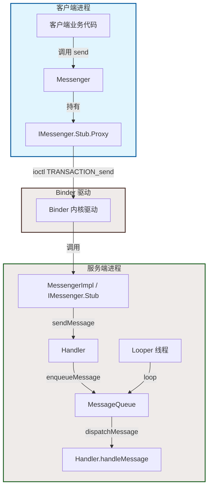
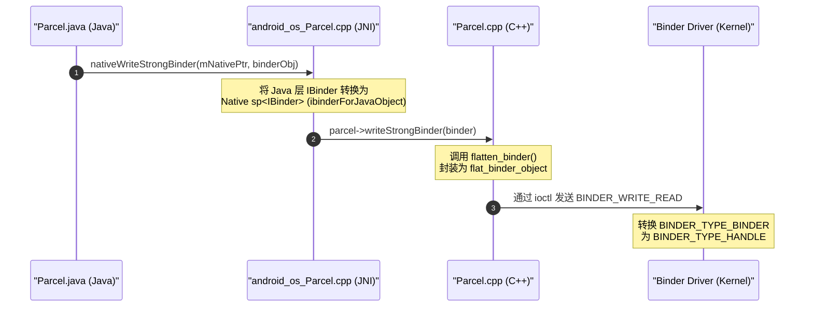
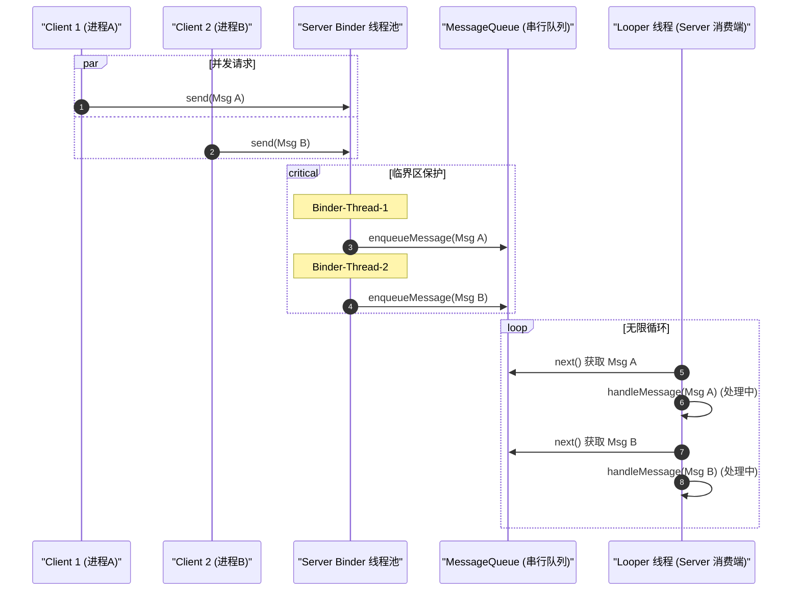

# 5.2.2.1.3 Messenger

`Messenger` 是 Android 系统中提供的一种轻量级进程间通信（IPC）机制。它基于 `Binder` 进行了高度封装，并与 `Handler` 紧密结合。在许多不需要高并发或复杂 RPC 方法调用的场景下，使用 Messenger 可以显著降低多进程通信的开发门槛。

---

## 1. 核心概念与底层机理

要理解 Messenger 的本质，必须剥离其 Java 层的 API 包装，深入分析其在底层是如何利用系统的 AIDL 契约、Handler 消息泵以及跨进程 Binder 驱动完成协同工作的。

### 1.1 Messenger 的定义与典型使用场景

Messenger 意为“信使”，它的设计核心思想是**基于消息（Message）的传递来实现跨进程通信**。
与传统的自定义 AIDL 相比，Messenger 的使用方式更贴近 Android 开发者熟悉的 `Handler-Looper` 消息机制。

#### 典型使用场景
- **低频的控制指令传递**：例如，主进程向独立进程的后台下载 Service 发送“暂停/恢复/取消”指令。
- **状态回调与进度轮询**：前台 Activity 与后台媒体播放器 Service 进行交互，获取当前的播放进度或音视频解码状态。
- **单通道异步通知**：一个后台常驻的推送进程向多个前台应用进程推送轻量级的业务通知。

#### 设计初衷与简化
在 AIDL 中，我们需要定义 `.aidl` 接口、生成相应的 Java 实现类，并且由于 Binder 线程池的存在，服务端的实现方法会并发运行在不同的 Binder 线程中，开发者必须处理复杂的多线程同步。而 Messenger 将复杂的 IPC 过程退化为发送 `Message` 对象的单线程排队模型，让开发者无需应对多线程并发安全问题。

---

### 1.2 底层 AIDL 机制：揭秘 IMessenger 接口

虽然在使用 Messenger 时不需要编写任何 `.aidl` 文件，但在 Android Framework 的底层，它完全是基于一个预先定义好的系统 AIDL 接口来实现的。这个接口就是 `IMessenger.aidl`。

在 Android 源码的 `frameworks/base/core/java/android/os/IMessenger.aidl` 中，该接口的定义极为精简：

```aidl
package android.os;

import android.os.Message;

/** @hide */
interface IMessenger {
    void send(in Message msg);
}
```

编译系统会自动为 `IMessenger.aidl` 生成对应的 Java 接口文件 `IMessenger.java`。它遵循标准的 Binder/AIDL 生成结构：
- **`IMessenger.Stub`**：作为 Binder 服务端实体类（继承自 `Binder` 并实现 `IMessenger`）。
- **`IMessenger.Stub.Proxy`**：作为 Binder 客户端代理类（持有远端 `IBinder` 引用并实现 `IMessenger`）。

在 Java 层，`Messenger` 内部其实只包装了一个 `IMessenger` 类型的成员变量：

```java
public class Messenger implements Parcelable {
    private final IMessenger mTarget;

    // 当服务端通过 Handler 创建 Messenger 时调用
    public Messenger(Handler target) {
        mTarget = target.getIMessenger();
    }

    // 当客户端从 IBinder（如 onServiceConnected）恢复 Messenger 时调用
    public Messenger(IBinder target) {
        mTarget = IMessenger.Stub.asInterface(target);
    }
    
    // ...
}
```

当客户端调用 `messenger.send(msg)` 时，其实质是通过 `IMessenger` 代理执行了跨进程调用：

```java
public void send(Message message) throws RemoteException {
    mTarget.send(message);
}
```

#### 通信拓扑架构

下面是 Messenger 底层各组件的通信拓扑图，展示了从客户端发送消息到服务端 Handler 处理的完整通路：



---

### 1.3 与 Handler 的桥接：MessengerImpl 导出与 Binder 实体构筑

当我们在服务端执行 `val messenger = Messenger(handler)` 时，底层的桥接过程便开始了。我们需要弄清楚 `Handler` 是如何导出一个实现 `IMessenger.Stub` 的 Binder 实体，并使得该实体与 Handler 内部 of `MessageQueue` 绑定。

#### 1.3.1 源码解析：Handler.getIMessenger() 的实现

打开 `android.os.Handler` 的源码，可以看到 `getIMessenger()` 方法：

```java
final IMessenger getIMessenger() {
    synchronized (mQueue) {
        if (mMessenger != null) {
            return mMessenger;
        }
        mMessenger = new MessengerImpl();
        return mMessenger;
    }
}
```

- **锁的选择**：此处使用 `synchronized (mQueue)` 锁定 Handler 自身的消息队列对象 `mQueue`。这是因为 `mQueue` 在 Handler 实例中是唯一的、不可变的，锁住它可以确保在多线程环境下并发获取或初始化 `mMessenger` 时的线程安全与单例状态。
- **`MessengerImpl`**：它是 `Handler` 的一个非静态内部类（Inner Class），继承自 `IMessenger.Stub`：

```java
private final class MessengerImpl extends IMessenger.Stub {
    public void send(Message msg) {
        msg.sendingUid = Binder.getCallingUid();
        Handler.this.sendMessage(msg);
    }
}
```

由于 `MessengerImpl` 是非静态内部类，它天然持有外部类 `Handler` 的隐式引用（`Handler.this`）。当 Binder 驱动调用 `MessengerImpl.send(msg)` 时，它会利用这个隐式引用，直接将消息转发给该 Handler 实例。

#### 1.3.2 Binder 数据传输与 Message 序列化/反序列化（Parcelable）

`Message` 实现了 `Parcelable` 接口，这使得它能够越过进程边界进行序列化和反序列化。而 Messenger 本身也实现了 `Parcelable` 接口：

```java
public int describeContents() {
    return 0;
}

public void writeToParcel(Parcel out, int flags) {
    out.writeStrongBinder(mTarget.asBinder());
}

public static final Parcelable.Creator<Messenger> CREATOR
        = new Parcelable.Creator<Messenger>() {
    public Messenger createFromParcel(Parcel in) {
        IBinder target = in.readStrongBinder();
        return target != null ? new Messenger(target) : null;
    }

    public Messenger[] newArray(int size) {
        return new Messenger[size];
    }
};
```

当客户端通过 `message.replyTo = clientMessenger` 设置回传信使并将其发送到服务端时，整个过程如下：
1. **序列化阶段**：`Message.writeToParcel()` 被调用，在写入自身成员变量的过程中，也会调用 `replyTo.writeToParcel()`。这会把客户端的 `IMessenger` Binder 实体（或者是 Binder 代理）写入当前传输的 `Parcel` 中（转换为 `flat_binder_object` 结构）。
2. **驱动转换阶段**：Binder 驱动在传输数据时，识别到该 `flat_binder_object` 的类型是 Binder 实体，会在内核中将它转换为一个 Binder 引用（Handle），并为目标进程（服务端）创建或映射对应的 Binder 代理。
3. **反序列化阶段**：在服务端进程中，系统反序列化 `Message` 时，读取该 `flat_binder_object` 得到一个 `BinderProxy` 对象。接着通过 `new Messenger(target)`（实际执行 `IMessenger.Stub.asInterface(target)`）重新组装出一个 `Messenger` 代理。
4. **双向通信建立**：服务端便能手握这个代理，像调用本地对象一样调用 `replyTo.send(replyMsg)`，从而将数据回传给客户端。

#### 1.3.3 JNI 结合机制与 Native 层的 Binder 转换

`Parcel.writeStrongBinder` 是 Java 层与 Native 层 Binder 转换的桥梁。我们可以通过下图理清其核心调用链：



在 C++ 层中，`flat_binder_object` 的定义至关重要：

```cpp
struct flat_binder_object {
    struct binder_object_header header;
    uint32_t flags;
    union {
        binder_uintptr_t binder; // 实体地址 (在服务进程中)
        uint32_t handle;         // 引用句柄 (在客户进程中)
    };
    binder_uintptr_t cookie;     // 伴随数据，通常指向 BBinder 对象的指针
};
```

当服务端将 `mTarget.asBinder()` 写入 `Parcel` 时，底层的 C++ `Parcel` 会调用 `flatten_binder` 函数：
- 因为 `mTarget` 实质上是本地的一个 `MessengerImpl`（继承自 `BBinder`），其类型被标记为 `BINDER_TYPE_BINDER`，且 `binder` 字段保存了该 C++ Binder 实体的内存地址，`cookie` 保存了对应的引用指针。
- 当 Binder 驱动解析该事务时，它会在内核中为目标进程（接收此 Parcel 的进程）生成一个对应的引用句柄，并将 `flat_binder_object` 的类型改写为 `BINDER_TYPE_HANDLE`，写入目标进程的物理内存中。
- 目标进程（客户端）在 JNI 层执行 `nativeReadStrongBinder` 时，会根据 `handle` 创建一个 `BpBinder` 对象，最后在 Java 层被封装成 `BinderProxy`。

---

### 1.4 天然线程安全特性：Looper 串行化分发机制

传统的 AIDL 服务端实现之所以会存在线程安全隐患，是因为 Binder 驱动的线程池调度机制。

#### Binder 线程池的并发机制
当客户端跨进程调用 AIDL 接口的方法时，Binder 驱动会从服务端进程的 Binder 线程池（默认最大 16 个线程）中选取一个空闲线程来执行该方法的 `onTransact` 回调。如果有多个客户端并发请求，或者同一个客户端快速发起多个同步/异步请求，这些请求会被分配 to 不同的 Binder 线程中并发执行。如果服务端实现没有做严密的同步处理（如使用 `synchronized`、`ReentrantLock` 或原子类），就会引发严重的线程安全问题。

#### Messenger 的规避方案：Looper 消息队列排队
与 AIDL 不同，Messenger 巧妙地屏蔽了 Binder 线程池的多线程并发。它的线程安全保障并不是通过加锁（Lock）来实现的，而是**将所有的进程间并发请求全部“降维”到单线程的 Looper 消息循环中**。

其内部核心执行路径如下：
1. **并发接收**：当客户端并发调用 `messenger.send(msg)` 时，服务端进程的 Binder 线程池会同时被触发，多个 Binder 线程开始并发处理事务。
2. **入队挂载**：在 Binder 线程中，`MessengerImpl.send(Message msg)` 被调用。在该方法中，会调用 `Handler.sendMessage(msg)`，这最终会被送达 `MessageQueue.enqueueMessage()`。
3. **线程同步队列**：虽然有多个 Binder 线程并发向同一个 `MessageQueue` 写入消息，但 `MessageQueue` 本身通过 `synchronized (this)` 内部锁对消息队列的链表操作（包括插入、唤醒机制）进行了严格的保护：
   ```java
   boolean enqueueMessage(Message msg, long when) {
       synchronized (this) {
           // ... 将 msg 按照执行时间(when)顺序插入到链表指定位置
           if (needWake) {
               nativeWake(mPtr); // 唤醒正在阻塞的 Looper 线程
           }
       }
       return true;
   }
   ```
4. **单线程消费**：服务端的 Looper 运行在一个特定的目标线程（比如 UI 线程或一个自定义的 `HandlerThread` 线程）上。Looper 的 `loop()` 方法处于一个无限循环中，每次通过 `MessageQueue.next()` 从中取出一条最头部的 `Message`。
5. **串行化执行**：取出消息后，Looper 线程执行 `msg.target.dispatchMessage(msg)`，最终在 `handleMessage` 中回调业务逻辑。

这个机制可以用下面的时序图来形象说明：



通过这种设计，所有的客户端请求都必须先在 `MessageQueue` 中规规矩矩地排队。服务端的业务处理代码（`handleMessage`）永远只会在初始化该 Handler 的 Looper 线程中串行化地执行，绝无可能发生并发冲突。因此，服务端开发者在编写 Messenger 处理逻辑时，完全不需要考虑任何多线程同步锁。

---

### 1.5 跨进程多客户端回调：RemoteCallbackList 的引入与必然性

在多客户端场景下，如果服务端进程需要向多个已经连接的客户端主动广播消息（例如，通知所有订阅了的客户端某些系统事件已经发生），很多开发者直觉上会选择使用 `ArrayList<Messenger>` 来保存所有客户端发送来的 `replyTo` 代理。然而，这在实践中会遭遇毁灭性的逻辑灾难。

#### 为什么不能使用 ArrayList 存储 Messenger 代理？
1. **反序列化地址不一致性**：每一次客户端通过 Binder 机制将 `replyTo` 传给服务端时，服务端反序列化出来的 `Messenger` 对象，甚至其内部底层的 `BinderProxy` 实例都是在 Java 堆上重新创建的新对象。也就是说，虽然它们指向同一个远端 Binder 实体，但 `messenger1 == messenger2` 或 `messenger1.equals(messenger2)` 都会返回 `false`。这导致我们无法正常在 `ArrayList` 中通过匹配引用来移除已经不需要的客户端监听器。
2. **生命周期监听缺失**：如果某个客户端进程由于崩溃、被内存清理器（Low Memory Killer）杀死或正常退出而死亡，服务端进程通常是感知不到的。如果我们仍然尝试向这个已死的客户端发送广播，虽然能捕捉到 `RemoteException`，但由于没有机制能自动将它从 `ArrayList` 中移除，就会产生严重的 Binder 代理泄漏和无意义的资源开销。

#### 解决方案：RemoteCallbackList 机制
为了完美解决跨进程回调集合的去重与生命周期自动感知问题，Android 官方提供了专用工具 `RemoteCallbackList`。虽然它的定义是 `RemoteCallbackList<E extends IInterface>`，必须限制泛型对象继承自 `IInterface`（而 `Messenger` 并不是 `IInterface` 实例，它仅仅是一个实现了 `Parcelable` 的外部包装），但我们可以通过操作其内部封装的 Binder 实体来实现。

在 Binder 驱动层中，一个 Binder 代理对应的 Native C++ `BpBinder` 句柄在同一个进程中是全局唯一的。`RemoteCallbackList` 正是利用了这一底层关键事实。
其去重与移除的底层原理如下：
- 当我们向 `RemoteCallbackList` 注册 `messenger.binder`（获取其内部关联的 `IMessenger` 实例）时，它会获取对应的 `IBinder` 代理，并将其作为一个独一无二的 Key 放入其内部的 Map 结构中。这样无论 Java 层的 `Messenger` 包装类被重新实例化了多少次，因为它们底层的 `IBinder` 指向同一个句柄，去重就天然实现了。
- 其次，`RemoteCallbackList` 在添加每一个客户端 Binder 代理的同时，会调用 `IBinder.linkToDeath(DeathRecipient, 0)` 注册一个死亡通知。当对应的客户端进程挂掉时，系统 Binder 驱动会捕捉到这一情况并派发死亡回调，`RemoteCallbackList` 捕获到回调后，便会将该 Binder 从集合中彻底清除，绝不产生泄露。

---

### 1.6 oneway 关键字与跨进程死锁的规避

通过分析 `IMessenger.aidl` 我们可以发现，`send` 方法在声明时，前面有 `oneway` 修饰符。这一关键字的引入具有非常深刻的系统稳定性考虑。

#### 同步 Binder 调用与阻塞
在没有 `oneway` 的普通 AIDL 调用中，客户端线程会被阻塞挂起，进入 Binder 等待队列，直到服务端 Binder 线程把方法执行完毕、将结果回写进 `reply` Parcel 中并通知客户端唤醒。如果在主线程发起这种调用，而服务端的逻辑又极其耗时，客户端就会迅速发生 Application Not Responding (ANR)。

#### 跨进程死锁（Inter-Process Deadlock）的成因
如果我们的跨进程通信是双向的，而且使用的是普通的同步调用：
1. 客户端进程在 A 线程中调用服务端进程的 `methodA()` 方法，A 线程被挂起，等待服务端回复。
2. 服务端进程的 Binder 线程池分配了线程 B 来执行 `methodA()`。在执行过程中，服务端需要向客户端拉取一些状态，于是线程 B 又通过客户端的代理去调用客户端进程中的 `methodB()`。
3. 客户端进程分配了一个 Binder 线程 C 来响应 `methodB()`。然而在某些业务同步锁的作用下，线程 C 可能需要等待 A 线程释放锁；或者反过来，因为两个进程的线程互相等待对方的物理返回，最终将所有可用的 Binder 线程消耗殆尽。这就造成了两个进程之间互相卡死的**跨进程同步死锁**。

#### oneway 的非阻塞特征
当方法前修饰了 `oneway` 时，该跨进程调用将退化为**非阻塞的单向发送**。客户端在执行 `send` 时，只需将 `Message` 的二进制数据成功写入 Binder 驱动的内核缓冲区，便会立即返回，客户端线程甚至不会发生任何卡顿。
同时，由于客户端和服务端之间没有任何人会因为同步等待对方的方法返回而被挂起，这也从底层逻辑上完全杜绝了跨进程死锁的形成条件。因此，Messenger 强行依赖 `oneway` 发送是极具安全考量的健壮设计。

---

## 2. 工程实践

本节将给出一个基于 Kotlin 编写的客户端与服务端双向 Messenger 通信的完整代码模板，包括进程挂掉后的死亡通知（DeathRecipient）处理、双向通信 `replyTo` 的应用，以及跨进程传输自定义 Parcelable 数据时的 ClassLoader 设置。

### 2.1 服务端实现 (Server Service)

服务端负责创建并维护一个关联了子线程 `HandlerThread` 的 `Messenger`，防止阻塞 UI 线程。在收到客户端消息后，解析自定义 Parcelable 数据，并通过 `replyTo` 回传结果。

```kotlin
package com.example.messenger.server

import android.app.Service
import android.content.Intent
import android.os.*
import android.util.Log
import com.example.messenger.shared.MyCustomData

class MessengerService : Service() {

    companion object {
        private const val TAG = "MessengerService"
        const val MSG_CLIENT_TO_SERVER_HELLO = 1001
        const val MSG_SERVER_TO_CLIENT_REPLY = 2001
        const val KEY_CUSTOM_DATA = "key_custom_data"
        const val KEY_REPLY_TEXT = "key_reply_text"
    }

    private lateinit var serviceHandlerThread: HandlerThread
    private lateinit var serviceHandler: ServiceHandler
    private lateinit var messenger: Messenger

    // 内部类 Handler，绑定 HandlerThread 的 Looper，避免在主线程处理耗时 IPC
    private inner class ServiceHandler(looper: Looper) : Handler(looper) {
        override fun handleMessage(msg: Message) {
            when (msg.what) {
                MSG_CLIENT_TO_SERVER_HELLO -> {
                    // 【核心注意点】跨进程读取自定义 Parcelable 数据必须先设置 ClassLoader
                    val bundle = msg.data
                    bundle.classLoader = MyCustomData::class.java.classLoader
                    
                    val clientData: MyCustomData? = if (Build.VERSION.SDK_INT >= Build.VERSION_CODES.TIRAMISU) {
                        bundle.getParcelable(KEY_CUSTOM_DATA, MyCustomData::class.java)
                    } else {
                        @Suppress("DEPRECATION")
                        bundle.getParcelable(KEY_CUSTOM_DATA)
                    }

                    Log.d(TAG, "收到客户端消息: ${clientData?.messageContent}，发送端 UID: ${msg.sendingUid}")

                    // 从 msg.replyTo 中取出客户端的 Messenger 代理，准备回传数据
                    val clientMessenger: Messenger? = msg.replyTo
                    if (clientMessenger != null) {
                        try {
                            val replyBundle = Bundle().apply {
                                putString(KEY_REPLY_TEXT, "Hello 客户端，我是服务端，已收到你的消息: '${clientData?.messageContent}'")
                            }
                            // 复用 Message.obtain() 减少内存开销
                            val replyMsg = Message.obtain().apply {
                                what = MSG_SERVER_TO_CLIENT_REPLY
                                data = replyBundle
                            }
                            clientMessenger.send(replyMsg)
                        } catch (e: RemoteException) {
                            Log.e(TAG, "向客户端回复消息失败", e)
                        }
                    } else {
                        Log.w(TAG, "客户端未携带 replyTo Messenger，无法回复")
                    }
                }
                else -> super.handleMessage(msg)
            }
        }
    }

    override fun onCreate() {
        super.onCreate()
        Log.d(TAG, "Service onCreate")
        serviceHandlerThread = HandlerThread("MessengerServiceThread").apply { start() }
        serviceHandler = ServiceHandler(serviceHandlerThread.looper)
        // 绑定 Handler，将 getIMessenger() 的 Stub 接口导出给 Messenger
        messenger = Messenger(serviceHandler)
    }

    override fun onBind(intent: Intent): IBinder? {
        Log.d(TAG, "Service onBind")
        // 返回 Messenger 内部包装的 IMessenger.Stub 实体对象的 IBinder 句柄
        return messenger.binder
    }

    override fun onDestroy() {
        super.onDestroy();
        Log.d(TAG, "Service onDestroy")
        serviceHandlerThread.quitSafely()
    }
}
```

---

### 2.2 客户端实现 (Client Activity)

客户端负责绑定服务端 Service，提供自身的 `replyTo` 信使给服务端以接收回调，并且对服务端 Binder 进行死亡监视（`DeathRecipient`），防止服务端进程异常崩溃后状态未清理。

```kotlin
package com.example.messenger.client

import android.content.ComponentName
import android.content.Context
import android.content.Intent
import android.content.ServiceConnection
import android.os.*
import android.util.Log
import androidx.appcompat.app.AppCompatActivity
import com.example.messenger.server.MessengerService
import com.example.messenger.shared.MyCustomData

class ClientActivity : AppCompatActivity() {

    companion object {
        private const val TAG = "ClientActivity"
    }

    private var serverMessenger: Messenger? = null
    private var isBound = false

    // 客户端自己接收回复的 Handler 和 Messenger
    private val clientHandler = object : Handler(Looper.getMainLooper()) {
        override fun handleMessage(msg: Message) {
            when (msg.what) {
                MessengerService.MSG_SERVER_TO_CLIENT_REPLY -> {
                    val replyText = msg.data.getString(MessengerService.KEY_REPLY_TEXT)
                    Log.d(TAG, "收到服务端的响应数据: $replyText")
                }
                else -> super.handleMessage(msg)
            }
        }
    }
    private val clientMessenger = Messenger(clientHandler)

    // Binder 死亡通知器：当服务端进程由于异常被系统强杀时，会回调此处的 binderDied()
    private val deathRecipient = IBinder.DeathRecipient {
        Log.e(TAG, "检测到远端 MessengerService 已经异常挂掉！")
        serverMessenger = null
        isBound = false
        // TODO: 在这里处理重连逻辑或者向用户提示界面状态更新
    }

    private val serviceConnection = object : ServiceConnection {
        override fun onServiceConnected(name: ComponentName?, service: IBinder?) {
            Log.d(TAG, "连接服务端成功")
            // 1. 将 IBinder 转换为 IMessenger.Stub.Proxy 并封装为 Messenger 代理
            serverMessenger = Messenger(service)
            isBound = true

            try {
                // 2. 绑定死亡通知
                service?.linkToDeath(deathRecipient, 0)
            } catch (e: RemoteException) {
                Log.e(TAG, "注册死亡监视器失败", e)
            }

            // 3. 向服务端发送消息
            sendHelloToServer()
        }

        override fun onServiceDisconnected(name: ComponentName?) {
            Log.d(TAG, "连接断开 (通常是服务由于内存压力被系统强杀)")
            serverMessenger = null
            isBound = false
        }
    }

    override fun onCreate(savedInstanceState: Bundle?) {
        super.onCreate(savedInstanceState)
        bindMessengerService()
    }

    private fun bindMessengerService() {
        val intent = Intent().apply {
            // 需要替换为您实际服务端的包名和类名
            component = ComponentName("com.example.messenger.server", "com.example.messenger.server.MessengerService")
        }
        bindService(intent, serviceConnection, Context.BIND_AUTO_CREATE)
    }

    private fun sendHelloToServer() {
        val targetMessenger = serverMessenger ?: return
        if (!isBound) return

        try {
            // 创建自定义序列化数据
            val customData = MyCustomData("Hello Android Messenger IPC!")
            val bundle = Bundle().apply {
                putParcelable(MessengerService.KEY_CUSTOM_DATA, customData)
            }

            val msg = Message.obtain().apply {
                what = MessengerService.MSG_CLIENT_TO_SERVER_HELLO
                data = bundle
                // 【核心重点】将客户端的 Messenger 传入 replyTo，用于双向通道建立
                replyTo = clientMessenger
            }

            targetMessenger.send(msg)
            Log.d(TAG, "已成功向服务端发出 Hello 消息")
        } catch (e: RemoteException) {
            Log.e(TAG, "发送消息失败，服务端可能已死", e)
        }
    }

    override fun onDestroy() {
        super.onDestroy()
        if (isBound) {
            // 解绑死亡通知并解绑服务，防止内存泄漏
            serverMessenger?.binder?.unlinkToDeath(deathRecipient, 0)
            unbindService(serviceConnection)
            isBound = false
        }
    }
}
```

---

### 2.3 自定义 Parcelable 数据实体

```kotlin
package com.example.messenger.shared

import android.os.Parcel
import android.os.Parcelable

data class MyCustomData(val messageContent: String?) : Parcelable {

    constructor(parcel: Parcel) : this(parcel.readString())

    override fun writeToParcel(parcel: Parcel, flags: Int) {
        parcel.writeString(messageContent)
    }

    override fun describeContents(): Int = 0

    companion object CREATOR : Parcelable.Creator<MyCustomData> {
        override fun createFromParcel(parcel: Parcel): MyCustomData {
            return MyCustomData(parcel)
        }

        override fun newArray(size: Int): Array<MyCustomData?> {
            return arrayOfNulls(size)
        }
    }
}
```

---

## 3. Messenger 与 AIDL 深度对比与技术选型

虽然 Messenger 的底层就是 AIDL，但两者在接口层面的抽象方式不同，决定了它们在不同场景下的适用性。

| 对比维度 | Messenger | AIDL |
| :--- | :--- | :--- |
| **并发能力** | **串行处理（无并发）**<br/>所有客户端请求被压入 Looper 消息队列中由单个工作线程排队串行执行。 | **多线程并发**<br/>服务端方法运行在 Binder 线程池中，必须处理复杂的同步和竞态条件。 |
| **通信协议契约** | **弱契约（基于 Message）**<br/>无确定的类方法签名。数据交互完全依赖 `Message.what` 常量及 `Bundle` 的 KV 键值对，难以进行静态代码分析。 | **强契约（基于 AIDL 方法）**<br/>像本地方法一样定义接口签名与参数类型，提供严格的静态类型检查和参数校验。 |
| **数据吞吐量** | **较低**<br/>高频、大数据量的跨进程传输容易导致服务端的 Looper 消息队列发生积压，造成调用时延增大，甚至导致 UI 卡顿。 | **较高**<br/>直接利用 Binder 线程池和高速内存拷贝，能够最大化榨干 Binder 吞吐极限，且支持单向 `oneway` 异步和同步等待。 |
| **开发与维护成本** | **极低**<br/>无需定义接口类，直接利用系统原生的 `Handler`、`Message` 和 `Messenger` 进行封装，代码整洁度高。 | **较高**<br/>必须手写 `.aidl` 文件，维护繁琐的接口契约，每一次接口改动都要重新构建工程并仔细维护版本一致性。 |
| **适用场景** | 适合**非高频、中低负荷、偏向于消息分发或指令控制**的双向通信。 | 适合**高吞吐、高并发、有复杂 RPC 方法调用需求、或组件库跨应用提供平台级 SDK 接口**的场景。 |

---

## 4. 关键踩坑点与避坑指南

### 4.1 自定义 Parcelable 对象的 ClassLoader 陷阱
这是初学者在使用 Messenger 通信时最容易遇到的 Crash 问题。
当客户端将一个自定义的 Parcelable 类（如上文的 `MyCustomData`）放入 `Bundle` 中并放入 `Message` 发送后，服务端的 Java 层在反序列化该 `Bundle` 时：
- `Bundle` 在底层的反序列化并不是一次性全部展开的，而是采用**延迟反序列化（Lazy De-serialization）**机制，即只有在调用 `bundle.getParcelable(...)` 等方法时，系统才真正从 Parcel 二进制流中解析该对象。
- 默认情况下，反序列化使用的是系统类加载器 `BootClassLoader`。它只负责加载系统核心 API 类（如 String、Bundle 等），对我们自己的 `MyCustomData` 一无所知，因而抛出 `BadParcelableException`。
- **解决方案**：在服务端对 `Bundle` 执行任何读取之前，必须显式调用 `bundle.classLoader = MyCustomData::class.java.classLoader`。另外，如果使用 Android 13 及以上，建议使用重载方法 `getParcelable(key, Class)`，这样可以在底层更安全地传递对应的 ClassLoader。

### 4.2 Binder 1MB 传输限制
Messenger 的底层依然是 Binder，所以它无法逃脱 Binder 缓冲区的物理局限。
- **1MB 的物理上限**：通常，一个进程中所有正在进行的 Binder 事务共享这 1MB 左右的内存缓冲区（在某些轻量系统设备或特殊版本上甚至小于 1MB，例如数百 KB）。
- **避坑方案**：绝不能用 Messenger 传递超大文本、高清 Bitmap 或大文件的二进制 Byte 数组。如果需要传递大数据，请选择使用 `ParcelFileDescriptor` 传递文件描述符，或者利用 `ContentProvider`（底层共享匿名共享内存 Ashmem）进行大数据中转，Messenger 只负责传递“句柄”或“通知”。

### 4.3 Android 11+ 软件包可见性与 Package Visibility
如果您的客户端与服务端位于不同的应用中（即跨 App 绑定 Service），从 Android 11（API 级别 30）开始，系统的软件包可见性规则会限制您的绑定操作。
- **现象**：客户端调用 `bindService` 会直接返回 `false`，且 Logcat 中不会出现任何显式报错。
- **解决方案**：客户端必须在其 `AndroidManifest.xml` 中使用 `<queries>` 标签声明对其要绑定的 Service 所在应用的包名可见。关于软件包可见性的深度机制与版本更迭历史，请参考主文档：[AndroidVersionChangeLog.md](../../../../../AndroidVersionChangeLog.md)。

```xml
<!-- 客户端 AndroidManifest.xml -->
<manifest xmlns:android="http://schemas.android.com/apk/res/android"
    package="com.example.messenger.client">

    <!-- 声明软件包可见性，允许绑定服务端的包名 -->
    <queries>
        <package android:name="com.example.messenger.server" />
    </queries>

    <application>
        <!-- ... -->
    </application>
</manifest>
```

### 4.4 内存泄漏防御与 WeakReference 重构防护
- **客户端的 `clientHandler` 与 Activity 内存泄露**：在客户端，由于 `clientHandler` 持有外部 Activity 的引用，如果 Activity 已经销毁，而服务端仍然持有 `replyTo`（其对应了客户端的 Binder 实体和 Handler）时，客户端的 Activity 将无法被垃圾回收（GC）。
- **深层内存泄露成因**：由于外部客户端 Messenger 对应的 Binder 实体存在于系统的 Binder 驱动层，只要服务端还持有该客户端的 Messenger 代理，或者 Binder 驱动中的 flat_binder_object 引用计数未归零，底层的 C++ `binder_node` 实体节点就会一直存活。它会强制保护服务进程和客户进程在 Java 层的 Binder 实体对象（如 `MessengerImpl`）。因为 `MessengerImpl` 持有其关联 Handler 的隐式强引用，Handler 又持有外部 Activity 的隐式强引用，直接导致整条引用链上的所有大对象全部发生严重泄漏。
- **防御技巧**：
  1. 客户端的接收 Handler 应当声明为**静态内部类（在 Kotlin 中使用普通 class 而非 inner class）**，配合使用 `WeakReference` 弱引用机制来对 Activity 的 UI 组件进行更新：
     ```kotlin
     private class ClientSafeHandler(activity: ClientActivity) : Handler(Looper.getMainLooper()) {
         private val activityRef = WeakReference(activity)
         override fun handleMessage(msg: Message) {
             val activity = activityRef.get() ?: return
             // 在此安全地对 activity 关联的 UI 资源执行更新操作
         }
     }
     ```
  2. 在客户端 Activity 的 `onDestroy()` 中，务必执行 `unbindService()`，主动断开与服务端的连接，并注销死亡监视器（`unlinkToDeath`）。

---

## 5. 总结

`Messenger` 凭借底层系统的 `IMessenger` 契约，以及精心设计的 `MessengerImpl`，将原本极易出错的并发 Binder 通信，无缝嫁接到了经典的 Android `Handler` 消息队列上。

它利用 `synchronized (mQueue)` 保证了入队并发安全，通过 Looper 循环实现了业务串行消费，彻底消除了服务端的多线程同步成本。在接口变化频繁、并发要求不高、对开发速度敏感的轻量级多进程控制场景中，Messenger 是极具优雅性与稳定性的不二选择。
