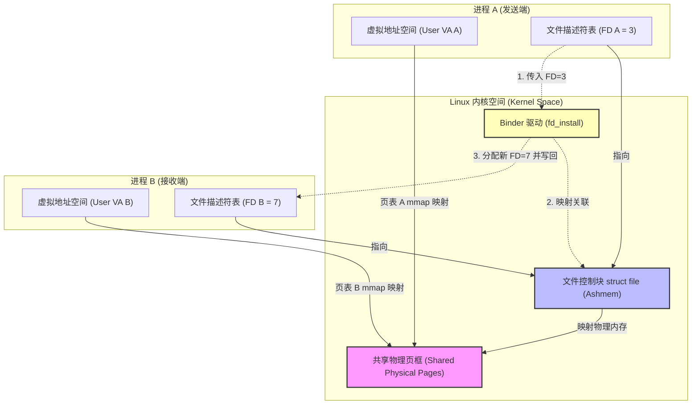
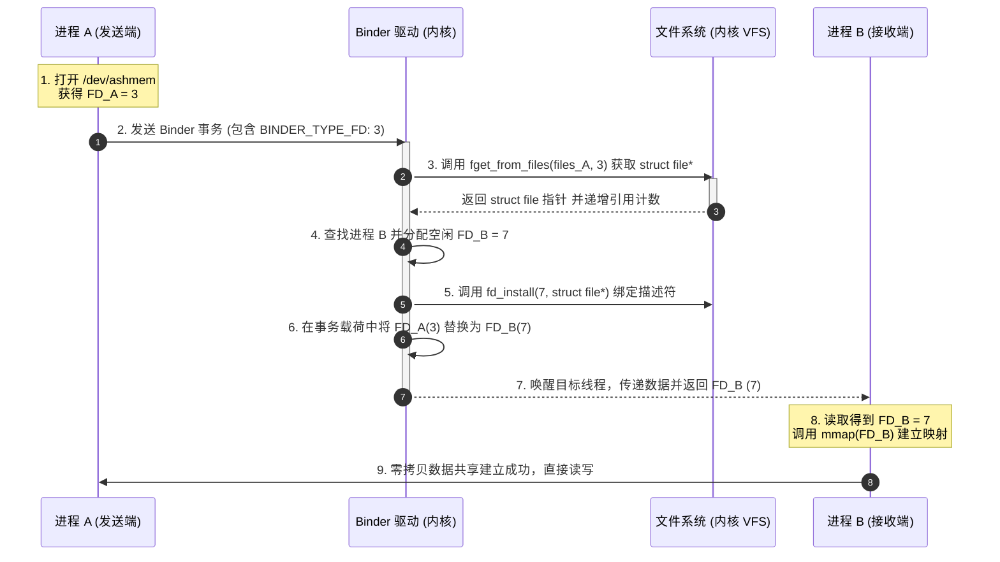

# 5.2.2.1.6 共享内存

在 Android 复杂的进程间通信（IPC）体系中，[Binder](./5.2.2.1.1.Binder.md) 凭借其易用性、安全性和单次拷贝的优秀性能，成为了整个系统的基石。然而，当面临大图传输、音视频原始流媒体缓冲区流转、或者海量数据库查询结果集传递等超大吞吐量场景时，Binder 默认的缓冲区限制（通常为 1MB，异步调用为 512KB）会成为致命的瓶颈，直接导致系统抛出 `TransactionTooLargeException` 异常。

为了解决这一痛点，Android 引入了基于 Linux 共享内存机制的 **Ashmem（Anonymous Shared Memory，匿名共享内存）** 以及在 Android 8.0（API 26）引入的 **`SharedMemory`** 封装。共享内存作为 IPC 界的“速度之王”，实现了真正的 **零拷贝（Zero-Copy）** 数据传输。本文将从硬件和操作系统底层的物理基础出发，深挖 Android Ashmem 内核驱动源码、Binder FD（文件描述符）跨进程传递的物理机制、Java 层的封装演进，以及在 `CursorWindow` 和大图传输中的核心应用实践。

---

## 一、 共享内存与零拷贝（Zero-Copy）性能优势

### 1. 虚拟内存与物理内存映射的硬件根基
要理解共享内存为何是性能极强的 IPC 机制，必须先深入理解现代 CPU 与操作系统的内存映射原理。

*   **物理内存（Physical Memory）**：由 CPU 的物理地址引脚直接寻址的实际内存硬件空间，由一系列的“物理页框（Page Frame）”组成，每个页框的大小通常为 4KB。
*   **虚拟内存（Virtual Memory）**：操作系统为每个进程分配的连续的、独立的虚拟地址空间。在 64 位 Android 系统中，用户空间虚拟地址空间可达 256TB。进程在执行指令时，所有的内存操作指针均指向虚拟地址。
*   **多级页表（Multi-level Page Table）与 MMU（Memory Management Unit）**：
    CPU 无法直接通过虚拟地址从内存硬件中读取数据，必须通过 MMU（内存管理单元）将虚拟地址实时翻译为物理地址。
    在 ARM64 架构下，翻译依赖多级页表（通常为 3 级或 4 级页表，从 L0 直到 L3 页表项）。虚拟地址被拆分为多个部分：
    ```
    +-------------------+-------------------+-------------------+-------------------+-------------------+
    |   L0 Index (9b)   |   L1 Index (9b)   |   L2 Index (9b)   |   L3 Index (9b)   |   Offset (12b)    |
    +-------------------+-------------------+-------------------+-------------------+-------------------+
    ```
    MMU 根据上述索引逐级查表，最终在 L3 页表项（PTE, Page Table Entry）中找到该虚拟页对应的物理页框基地址，再结合 12 位的页内偏移量（Offset），合成最终的物理内存地址。
    页映射的过程伴随着多次内存访问。为了减少这种延迟，CPU 引入了高速缓存 **TLB（Translation Lookaside Buffer）**。TLB 缓存了最近翻译过的虚拟页到物理页框的映射。如果发生 TLB 未命中（TLB Miss），MMU 才会去遍历内存中的多级页表，这会导致明显的时延。

在常规状态下，每个进程都拥有完全独立的页表。进程 A 的虚拟地址 `0x7f000000` 与进程 B 的虚拟地址 `0x7f000000` 虽然数值相同，但由于它们使用各自的页表进行映射，最终会翻译指向完全隔离的两个物理页框中。这种天然的物理屏障为进程隔离奠定了安全基础，却也给进程间的数据通信带来了巨大的障碍。

### 2. 传统 IPC 与 Binder 的拷贝模型对比
在传统的操作系统进程间通信中，由于各进程虚拟地址空间完全隔离，数据必须要跨越用户空间与内核空间的物理边界。

#### (1) 传统 IPC（如 Socket、Pipe、Message Queue）的双拷贝模型
经典的 Linux 进程间通信通常采用双拷贝模型：
1.  **第一次拷贝（Copy from user）**：发送端进程（用户空间）调用 `write()` 或 `send()` 系统调用，CPU 执行数据拷贝，将数据从发送端用户空间的缓冲区拷贝到内核空间的缓冲区（内核堆内存中）。
2.  **第二次拷贝（Copy to user）**：接收端进程（用户空间）调用 `read()` 或 `recv()` 陷入内核态，CPU 再次执行拷贝，将数据从内核缓冲区拷贝到接收端进程的用户空间。

```
[进程 A 用户空间] ---> (拷贝 1: copy_from_user) ---> [内核缓冲区] ---> (拷贝 2: copy_to_user) ---> [进程 B 用户空间]
```
在整个传输周期中，伴随着两次系统调用，CPU 需要在用户态与内核态之间执行多次上下文切换（Context Switch），并且在物理内存中多复制了一份冗余数据，白白消耗了 CPU 指令周期与内存总线带宽。

#### (2) Binder 的单拷贝模型
为了优化这一效率，Android 系统创新设计了 Binder 机制（详见 [Binder](./5.2.2.1.1.Binder.md)）。
Binder 驱动在接收端进程启动时，通过 `mmap()` 在内核中为其建立了一块特殊的物理内存映射：该物理内存在内核空间（Kernel VA）与接收端进程用户空间（User VA）同时进行了双重映射。
1.  **单次拷贝**：当发送端进程通过 Binder 调用发送数据时，Binder 驱动直接调用 `copy_from_user()`，将数据从发送端用户空间拷贝到这块已经映射好的物理内存中。
2.  **直接读取**：由于接收端进程的用户空间也映射到了同一块物理内存，因此无需进行第二次拷贝，接收端可以直接读取数据。

```
[进程 A 用户空间] ---> (唯一拷贝: copy_from_user) ---> [双重映射的物理内存] <=== (直接映射读取) === [进程 B 用户空间]
```
虽然 Binder 将拷贝次数降低为 1 次，但如果面对几十兆甚至上百兆的数据时，单次 CPU 拷贝带来的总线负载依然很重，而且 Binder 驱动内部 1MB 的映射缓冲区限制，使得 Binder 依旧无法胜任大吞吐量的传输任务。

### 3. 共享内存的零拷贝（Zero-Copy）机制
共享内存（Shared Memory）则是直接打破了进程虚拟地址的物理屏障。它的核心原理是：
**操作系统在物理内存中开辟一块区域，然后通过修改页表，将这块物理内存同时映射到进程 A 和进程 B 的用户空间虚拟地址中。**

```
[进程 A 虚拟地址空间]                          [进程 B 虚拟地址空间]
  \                                             /
   \===> [映射页表 A] ---> [相同的物理页框] <--- [映射页表 B] ===/
```

*   **真正的零拷贝**：一旦映射建立，进程 A 在其虚拟地址空间内写入这块内存，进程 B 在其虚拟地址空间内立刻就能看到对应的数据。整个数据传输过程中，**不需要通过 CPU 执行任何在用户空间与内核空间之间的数据复制指令**。
*   **零内核态切换（读写时）**：在数据传输阶段，进程之间通信无需调用任何 `read` / `write` 系统调用，数据的交互速度完全取决于物理内存的带宽，达到了硬件极限。
*   **极致的速度**：共享内存是所有 IPC 机制中速度最快、吞吐量最大的方式，堪称进程间通信的“速度之王”。

下面我们用一张对比表来更直观地展现它们在数据通信上的技术差异：

| 维度 | 传统 Linux IPC (Socket/Pipe) | Android Binder | 共享内存 (Ashmem / SharedMemory) |
| :--- | :--- | :--- | :--- |
| **拷贝次数** | 2 次 | 1 次 | **0 次** |
| **数据量限制** | 受限于内核缓冲区大小（一般较小） | 限制在 1MB 左右（异步更低） | 无硬性限制，仅受限于物理内存 |
| **系统调用开销** | 每次读写都需要 `read`/`write` 系统调用 | 每次传输需要 `ioctl` 调用 | 仅在建立映射和同步时调用，读写时无需系统调用 |
| **安全控制** | 依赖 Linux 权限与 Socket 端口控制 | 极其安全，由 Binder 驱动保障 UID/PID | 原生较弱（需要 Android 8.0 引入的 `SharedMemory` 保护） |
| **使用场景** | 复杂网络、小数据流、流式通知 | 绝大多数 Binder RPC、系统组件生命周期控制 | 大图、音视频帧缓冲区、海量数据库 Cursor 数据集传递 |

---

## 二、 Android Ashmem (匿名共享内存) 深度解密

虽然 Linux 内核已经提供了标准的 POSIX 共享内存 and System V 共享内存，但 Android 并没有直接使用它们，而是选择在内核中设计并实现了一套全新的匿名共享内存机制——**Ashmem**。

### 1. 为什么 Android 放弃 POSIX/System V 共享内存？

Android 系统的运行场景具有两个极端的限制条件：**物理内存小（尤其是早期移动设备）** 且 **后台进程随时可能被系统强制杀死（LMK 机制）**。在这两个约束下，标准的 Linux 共享内存暴露出了致命的缺陷：

1.  **缺乏生命周期的自动绑定（容易导致内存泄漏）**：
    *   在标准的 System V IPC 中，调用 `shmget` 创建的共享内存块是全局持久存在的。一旦创建该区域的进程发生崩溃（Crash）或被内核的 Low Memory Killer（LMK）强制杀死，如果没有进程显式调用 `shmctl(..., IPC_RMID, ...)` 进行销毁，这块内存将一直在内核中驻留并持续占用物理页框，直至系统重启。
    *   在移动设备上，应用进程异常退出是常态。使用 POSIX/System V 共享内存会导致设备运行时间越长，内存泄漏越严重，最终拖垮整机系统。
    *   以下是使用标准 POSIX 共享内存的代码示例，其生命周期是脱钩的：
        ```c
        // 传统的 POSIX 共享内存创建
        int shm_fd = shm_open("/my_shm_region", O_CREAT | O_RDWR, 0666);
        ftruncate(shm_fd, 4096);
        void* addr = mmap(NULL, 4096, PROT_READ | PROT_WRITE, MAP_SHARED, shm_fd, 0);
        // 如果在此处进程异常崩溃退出，若未执行 shm_unlink("/my_shm_region")，该文件将永久存留在 tmpfs 虚拟文件系统中占用物理 RAM！
        ```
2.  **缺乏内核级的垃圾回收与物理页框回收机制**：
    *   经典的共享内存在被映射后，其占用的物理内存页框会一直被锁定，内核无法在系统处于低内存压力（Low Memory）时主动将其回收。
    *   Android 急需一种可以被内核主动“强拆”的共享内存：当系统内存极度匮乏时，如果某块共享内存暂时没有被使用（即使依然被映射），内核也应该能安全地回收其物理内存，待后续使用时再重新分配。
3.  **路径暴露与沙箱安全问题**：
    *   POSIX 共享内存在文件系统中通常有对应的命名路径（例如 `/dev/shm/my_shm`），这使得沙箱外的其他进程可以通过穷举路径尝试访问，带来了安全隐患。

### 2. Ashmem 的核心特性：匿名与文件描述符生命周期绑定
Ashmem 针对上述痛点做出了以下精妙的设计：

*   **匿名性与安全隔离**：Ashmem 驱动挂载于内核字符设备 `/dev/ashmem` 上。进程创建共享内存时，不需要像 POSIX 共享内存那样为其指定一个全局可见的路径名，而是通过打开 `/dev/ashmem` 设备获得一个临时的、未命名的文件描述符（File Descriptor, FD）。只要不把 FD 传递出去，外界根本无法访问这块内存。
*   **引用计数与自动内存回收**：与普通的 Linux 文件对象类似，内核对 Ashmem 对应的 `struct file` 维护着引用计数。当所有进程都关闭了该 FD（`close`），且所有虚拟地址映射都被解除（`munmap`）时，内核会检测到引用计数归零，从而**自动销毁**该共享内存区域，释放所有物理内存。即使进程异常崩溃，内核也会在清理该进程的文件描述符表时自动将其持有的 FD 引用计数减一，彻底避免了内存泄漏。

### 3. Pin/Unpin 锁定与解锁机制的底层逻辑
这是 Ashmem 最具创造性的设计。Ashmem 允许进程将共享内存中的某段区间标记为 **Unpin（解锁）** 或 **Pin（锁定）** 状态。这一机制的核心逻辑如下：

*   **Pin（锁定）状态**：
    *   默认状态。表示该段内存中的数据正在被使用，内核**绝对不能**回收这部分物理页面。
*   **Unpin（解锁）状态**：
    *   进程可以通过 `ioctl(fd, ASHMEM_UNPIN, &pin)` 将内存段声明为 Unpin 状态。
    *   这等于向内核宣告：“这块内存里的数据我暂时不用了（或者里面的缓存数据丢了也无所谓，大不了我重新生成）。如果系统遇到严重的内存压力，你可以直接收回这些物理页面去接济别人。”
    *   在 Unpin 期间，这块内存的虚拟地址映射依然存在，但其对应的物理页框在内核眼里变成了“可回收的脏页”。

#### (1) 内核中的数据结构：`ashmem_area` 与 `ashmem_range`
要深入理解这一机制，首先要看内核中 Ashmem 驱动维护的数据结构。
每一个通过打开 `/dev/ashmem` 设备建立的共享内存区域，在内核中都对应一个 `ashmem_area` 结构体：

```c
struct ashmem_area {
    char name[ASHMEM_NAME_LEN];      /* 区域名称，用于 debug 调试 */
    struct list_head unpinned_list;  /* 挂载所有处于 unpinned 状态的内存区段 (ashmem_range) */
    struct file *file;               /* 对应的 shmem/tmpfs 虚拟文件系统文件对象指针 */
    size_t size;                     /* 区域总大小 */
    unsigned long prot_mask;         /* 允许的访问控制掩码 (如 PROT_READ | PROT_WRITE) */
};
```

*   **Pin/Unpin 时的链表合并与分裂算法**：
    *   **区间合并**：如果新 Unpin 的物理区间与已有的某段 Unpin 区间在物理页框上是前后相连的，内核会将它们合并为一个更大的 `ashmem_range`，以节省维护碎片链表的内存开销。
    *   **区间分裂**：如果进程请求对某个 Unpin 状态的范围进行局部加锁（Pin），而该加锁区间只是之前整个 Unpin 区间的一部分，内核会自动将原有 `ashmem_range` 结构体进行“分裂”，拆分成左、中、右三个区段，将中间需要 Pin 的范围移出 `unpinned_list` 链表。

#### (2) ioctl 的底层调用流程
在 Linux 内核空间中，Ashmem 驱动通过 `ashmem_ioctl` 接收来自用户空间的控制指令。当进程执行 Pin/Unpin 时，对应的核心结构体为 `struct ashmem_pin`：

```c
struct ashmem_pin {
    __u32 offset; /* 起始偏移量 */
    __u32 len;    /* 区域长度 */
};
```

我们来阅读内核 Ashmem 驱动中处理 `ASHMEM_PIN` 和 `ASHMEM_UNPIN` 的核心源码逻辑：

```c
static int ashmem_pin(struct ashmem_area *asma, unsigned long arg)
{
    struct ashmem_pin pin;
    struct ashmem_range *range;
    
    // 1. 从用户空间拷贝参数
    if (copy_from_user(&pin, (void __user *) arg, sizeof(pin)))
        return -EFAULT;
        
    // 2. 检查边界合法性
    if (unlikely((pin.offset + pin.len) > asma->size))
        return -EINVAL;

    mutex_lock(&ashmem_mutex);
    // 3. 在 asma 中查找对应的 unpinned 内存段范围
    range = ashmem_find_range(asma, pin.offset, pin.len);
    if (!range) {
        // 如果没有找到对应的 unpinned range，说明本来就是 pinned 的
        mutex_unlock(&ashmem_mutex);
        return ASHMEM_NOT_PURGED;
    }
    
    // 4. 判断该段内存在 unpinned 期间是否被内核强制回收了（purged）
    if (range->purged == ASHMEM_WAS_PURGED) {
        // 数据已经被回收，返回 ASHMEM_WAS_PURGED 告知用户空间
        ashmem_remove_range(asma, range);
        mutex_unlock(&ashmem_mutex);
        return ASHMEM_WAS_PURGED;
    }
    
    // 5. 重新将该 range 移除出 unpinned 链表，恢复 Pinned 状态
    ashmem_remove_range(asma, range);
    mutex_unlock(&ashmem_mutex);
    return ASHMEM_NOT_PURGED;
}
```

而 `ashmem_unpin` 的过程则是相反的。它会在该 `ashmem_area` 中创建一个 `ashmem_range` 结构体，将其标记为 `ASHMEM_UNPINNED`，并挂载到全局的 `unpinned` 链表上。

#### (3) 内核如何在内存压力下回收物理页框？
在内核中，Ashmem 驱动向系统内存管理子系统注册了一个 **`shrinker`（内存回收器）**。`shrinker` 是 Linux 内核用于回收缓存物理页面的回调机制。

当整个系统发生物理内存不足时，内核会触发内存回收流程，并依次调用所有注册的 `shrinker` 回调函数。Ashmem 注册的回调函数是 `ashmem_shrink()`。
而在具体的回收机制中，内核通过 LRU（Least Recently Used）策略进行页面扫描：
*   **LRU 链表顺序**：全局 `ashmem_lru_list` 在 Unpin 操作时将新的 `ashmem_range` 插入头部，回收时则自尾部（最久未使用的区段）开始扫描。
*   **页表映射解除（PTE Unmapping）与 TLB Shootdown**：
    在执行页面释放时，内核调用 `unmap_mapping_range` 遍历所有通过此共享内存建立虚拟映射的进程页表。内核将对应的 L3 页表项（PTE）的 Present 状态标志位清零，然后回收原先绑定的物理页框（Page Frame）。
    此时，多核 CPU 面临页表缓存不一致的问题。内核必须在硬件层面向所有 CPU 核心广播 **TLB 刷新指令（TLB Shootdown）**：
    1. CPU-0 修改了多进程共享页表的页表项（PTE），释放了物理页。
    2. CPU-0 向所有映射了这块共享内存的其他 CPU 核心（如 CPU-1, CPU-2）发送**处理器间中断（IPI, Inter-Processor Interrupt）**。
    3. 接收到 IPI 的 CPU 核心会暂停当前执行的任务，执行硬件级 TLB 刷新指令（例如 ARM64 下的 `TLBI`），擦除本地的页表缓存。
    4. 刷新完成后，其他核心返回确认信号（ACK），CPU-0 收集完所有 ACK 之后，才能将物理页面彻底回收并重新分配。
    由于 TLB Shootdown 伴随着严重的处理器间中断延迟，频繁建立和销毁映射（`mmap`/`munmap`）会产生巨大的性能开销，这也是为什么在高性能 IPC 中推荐建立**映射共享内存池（Shared Memory Pool）**进行长期复用。

```
[系统遭遇低内存压力]
       │
       ▼
调用 ashmem_shrink_scan()
       │
       ▼
自尾部起遍历全局 LRU unpinned 链表上的 ashmem_range
       │
       ▼
调用 shmem_truncate_range()
       │
       ├──────────────────────────────────────────┐
       ▼                                          ▼
【解除映射与广播 TLB 刷新】                 【修改 range->purged = ASHMEM_WAS_PURGED】
内核执行 TLB Shootdown，强制擦除 TLB     将来进程若调用 ASHMEM_PIN 会收到此标记
       │
       ▼
【释放物理页框 (Page Frame)】
内核将物理内存收回并分给其他进程
```

*   **数据驱逐与缺页中断的后续**：一旦被 `shmem_truncate_range` 释放，如果此时进程去读取对应的虚拟地址，会触发内核的“缺页中断”。但因为该段物理内存已经被驱逐且没有 Swap 分区作为后端存储，内核会分配一个全新的、全是 `0` 值的物理页。为了防止进程读取到脏数据或空数据而不自知，进程必须先进行 `ASHMEM_PIN`，若发现返回值为 `ASHMEM_WAS_PURGED`，则应立刻知晓数据已丢失，并重新向该区域内填充数据。

### 5. 延迟分配与缺页异常的底层细节
匿名共享内存在被映射（调用 `mmap`）时，并不会立刻在物理内存中开辟空间并填入页表。这是一种经典的 **“延迟分配 (Lazy Allocation)”** 机制。
1.  当应用层调用 `mmap(NULL, size, PROT_READ|PROT_WRITE, MAP_SHARED, fd, 0)` 时，内核只会在当前进程的红黑树中寻找一块空闲的虚拟内存区域，并为其分配一个 `vm_area_struct` 结构体来管理这部分虚拟区间。
2.  同时，`vm_area_struct` 中的操作函数集 `vma->vm_ops` 会被绑定为 Ashmem 注册的 `ashmem_vm_ops`，其中核心的回调函数为 `fault` 缺页异常接口。
3.  当进程首次执行读取或写入操作（如 CPU 执行汇编 `str` 往共享内存指针写数据）时，由于页表中对应的 PTE 依然为空（未映射物理页），MMU 会立刻触发 **缺页中断 (Page Fault)**。
4.  CPU 挂起当前线程上下文，保存寄存器现场，跳转进入操作系统的中断处理程序 `do_page_fault()`。
5.  内核通过 `do_page_fault()` 找到对应的 `vm_area_struct`，并触发调用 `ashmem_vm_ops->fault` 回调。
6.  在该回调中，内核底层调用虚拟文件系统的页面分配器分配一个实际的物理页框（Page Frame），并将物理地址 and 相关控制标志写入进程的多级页表中，最后刷新 TLB。
7.  CPU 恢复现场，重新执行刚刚那条写数据指令，此时 MMU 能够顺利查表拿到物理地址，写操作完成。这种设计极大降低了不必要的物理内存占用。

### 6. 现代 Android 的演进：memfd 与 Ashmem 的交替
为了让 Android 更紧密地贴合 Linux 主线内核，并彻底摆脱 Android 专有驱动对 Linux 内核源码的侵入， Android 在高版本中（特别是 Android 10 API 29 之后）逐渐引入了 Linux 主线的 **`memfd_create`** 机制来代替传统的 Ashmem 驱动（可以通过阅读 [AndroidVersionChangeLog.md](../../../../../AndroidVersionChangeLog.md) 了解这期间的 API 演进细节）。
*   `memfd_create` 同样返回一个匿名共享内存的文件描述符，其生命周期与 FD 计数直接绑定。
*   **F_ADD_SEALS 密封机制的优越性**：
    传统的 Ashmem 依靠 ioctl 来限制权限，但在某些极端的多线程并发操作中，其安全性难以完美防护。Linux 提供的 Seals 机制允许通过 `fcntl(fd, F_ADD_SEALS, flags)` 给文件描述符打上防篡改标记：
    *   `F_SEAL_SHRINK`：锁定文件大小，防止通过 `ftruncate` 截断缩小文件。
    *   `F_SEAL_GROW`：防止文件被扩张增大。
    *   `F_SEAL_WRITE`：禁止任何用户调用 `write()` 写入该文件。
    *   `F_SEAL_FUTURE_WRITE`：禁止通过未来的映射建立可写虚拟地址。
    通过这套标准的 Seals 机制，`memfd` 可以实现比 Ashmem 更稳定、更安全的只读性保护（Seals 机制可防止 FD 的访问权限在被创建后被恶意篡改），从而在内核中具备了完全取代 Ashmem 的条件。

AOSP 底层在 `system/core` 库的 JNI 实现中，对这两个系统调用进行了平滑适配：
```c
// 现代 AOSP 共享内存适配伪代码
int create_shared_memory(const char* name, size_t size) {
    // 1. 尝试使用 Linux 主线的 memfd_create
    int fd = memfd_create(name, MFD_CLOEXEC | MFD_ALLOW_SEALING);
    if (fd >= 0) {
        ftruncate(fd, size);
        return fd;
    }
    // 2. 如果内核版本较低不支持 memfd，降级使用传统 /dev/ashmem
    fd = open("/dev/ashmem", O_RDWR);
    if (fd >= 0) {
        ioctl(fd, ASHMEM_SET_NAME, name);
        ioctl(fd, ASHMEM_SET_SIZE, size);
    }
    return fd;
}
```

---

## 三、 双进程共享物理内存架构拓扑与 Binder FD 转换流转

既然匿名共享内存的核心是通过传递文件描述符（FD）给目标进程，然后让目标进程通过 `mmap` 进行物理内存共享，那么本节将重点剖析最为核心的底层物理机制：**文件描述符（FD）跨进程传递的本质**。

### 1. FD 的进程局部性：为什么不能直接传递 FD 的整数值？
在 Linux 操作系统中，文件描述符（File Descriptor）实际上仅仅是一个 **`int` 型的正整数**。
每个进程的 `task_struct` 结构体中包含一个 `files` 指针，指向该进程的 **文件描述符表（`struct files_struct`）**。该表实际上是一个数组，其下标就是 FD 的数值，而数组的每一个元素则是一个指向内核中 **`struct file` 结构体** 的指针。

```
进程 A (FD = 3) ----> files_struct[3] ----> [ 内核 struct file (Ashmem) ]
                                                       ▲
进程 B (FD = 3) ----> files_struct[3] ----> [ 内核 struct file (某个 Socket) ]  <-- 独立冲突！
```

*   **进程隔离**：进程 A 的 FD 3 和进程 B 的 FD 3 完全没有关系，它们分别指向内核中完全不同的 `struct file` 实例。
*   **直接传递的灾难**：如果进程 A 通过 Binder 仅仅把整数值 `3` 发送给进程 B，进程 B 去操作 FD 3 时，读写的目标其实是它自己的 Socket 或者本地文件，这会造成灾难性的内存篡改或文件损坏。

因此，跨进程传递 FD 的本质，绝对不能是简单地传递一个 `int` 数值，而必须要在内核空间中**将源进程的 FD 对应的文件对象（`struct file`），在目标进程的文件描述符表中建立一个新的关联**。

### 2. Binder 驱动对 BINDER_TYPE_FD 事务类型的转换过程
当我们在 Java 层将包含 FileDescriptor 的对象写入 Parcel 并调用 Binder RPC 传输时，Binder 驱动会执行一系列神奇的内核转换操作。

#### (1) 事务对象与内核转换数据结构
当 Binder 进行传输时，所有非基础类型的数据均被封装为特定格式的对象。对于文件描述符，底层使用 `struct binder_fd_object` 来表示：
```c
struct binder_fd_object {
    struct binder_object_header header; /* 头部信息，类型标记为 BINDER_TYPE_FD */
    __u32 pad_to_64;
    __u32 fd;                           /* 源进程中的文件描述符数值 (例如 3) */
    binder_uintptr_t cookie;            /* 额外的安全 cookie */
};
```
当发送端写入一个文件描述符时，内核 Binder 驱动扫描事务数据的头部信息，一旦匹配到 `BINDER_TYPE_FD` 标识，便会接管这个结构体，并在内核中执行以下转换逻辑。

#### (2) Binder 驱动转换源码剖析
在 Binder 驱动的底层，所有传输的数据都是以 Binder 事务（`binder_transaction`）的形式流转。驱动在拷贝事务数据包时，会扫描其中的数据结构，一旦遇到类型为 `BINDER_TYPE_FD` 或 `BINDER_TYPE_FDA` 的对象，就会调用核心函数 `binder_translate_fd` 进行文件描述符的拷贝与转换。

我们来看内核 Binder 驱动中处理这一过程的核心源码片段（简化版）：

```c
static int binder_translate_fd(int fd,
                              struct binder_transaction *t,
                              struct binder_thread *thread,
                              struct binder_node *target_node)
{
    struct binder_proc *src_proc = thread->proc;
    struct binder_proc *target_proc = t->to_proc;
    struct file *file;
    int target_fd;
    int ret;

    // 1. 根据源进程 (src_proc) 以及传入的 fd 整数值，在源进程的文件描述符表中获取 struct file
    file = fget_from_files(src_proc->files, fd);
    if (!file) {
        pr_err("binder: %d:%d got transaction with invalid fd %d\n",
               src_proc->pid, thread->pid, fd);
        return -EBADF;
    }

    // 2. 核心安全审计：检查文件是否允许被通过 Binder 传递（通常都可以，除了特殊的内部控制文件）
    ret = security_binder_transfer_file(src_proc->tsk, target_proc->tsk, file);
    if (ret < 0) {
        fput(file);
        return ret;
    }

    // 3. 在目标进程 (target_proc) 中申请一个当前未使用的空闲文件描述符索引
    // O_CLOEXEC 属性保证了当目标进程执行 exec() 调用启动新程序时，会自动关闭该描述符，以防泄漏
    target_fd = get_unused_fd_flags(O_CLOEXEC);
    if (target_fd < 0) {
        fput(file);
        return target_fd;
    }

    // 4. 将目标进程新分配的 target_fd 索引与上面拿到的 struct file 文件对象进行绑定，并增加 file 引用计数
    // 该步骤相当于在目标进程的文件描述符表中安插了一根直达 file 对象的管道
    fd_install(target_fd, file);

    // 5. 返回目标进程分配好的全新 fd 数值 (如 7)
    return target_fd;
}
```

```
【源进程 A (FD=3)】
       │
       ▼
从 files_struct[3] 获取内核 struct file 指针
       │
       ▼
调用 get_file() 增加该 file 的引用计数
       │
       ▼
查找【目标进程 B】的 files_struct
       │
       ▼
调用 get_unused_fd_flags() 得到空闲索引 (如 FD=7)
       │
       ▼
调用 fd_install(7, file) 绑定到同一个 file 对象
       │
       ▼
修改传输包，将进程 B 读出的数据中 FD 的值改为 7
```

*   **fd_install 的并发与生命周期保障**：
    在 Linux 内核中，调用 `get_unused_fd_flags` 之后和调用 `fd_install` 之前，这个描述符索引是被锁定的，其他线程无法对其进行分配。而在调用 `fd_install` 的瞬间，描述符正式暴露给进程的用户空间。这个过程在内核中采用了一系列原子自旋锁来保证在多线程高并发的 IPC 场景下，文件描述符的建立是线程安全的。

#### (3) 为什么双进程拿到不同的 FD 数值却指向同一块物理内存？
正是通过上述内核级别的转换操作：
1.  源进程 A 拿到的 FD 是 `3`，它映射在 `files_struct` 的第 3 格，最终指向内核中的 `struct file (ashmem_area)`。
2.  目标进程 B 拿到的 FD 是 `7`，它映射在自己 `files_struct` 的第 7 格，但同样指向内核中**同一个** `struct file (ashmem_area)`。
3.  ...双进程不同 FD 最终都在内核中殊途同归，指向了同一个 `struct file`，而该 `struct file` 内部记录的又是同一组物理页框。当两端各自在用户空间调用 `mmap` 时，内核页表映射器（`ashmem_mmap`）会把两端的虚拟内存地址段映射到相同的物理内存上。

### 3. 双进程共享内存架构拓扑图
下面这幅拓扑图清晰地展现了源进程 A 与目标进程 B 是如何利用物理内存双重映射以及内核 Binder FD 转换建立共享通道的：



### 4. Binder FD 跨进程拷贝内核转换时序图
为了彻底讲清这一通信周期的事件顺序，我们可以通过时序图梳理从应用层发起调用到驱动层执行转换并由接收端接收的物理全景：



---

## 四、 Java 层封装的演进与对比：MemoryFile 到 SharedMemory

在 Android SDK 的发展历程中，为了让 Java 层的开发者能便利、安全地操作这套内核共享内存机制，系统经历了两代 API 的演进。这两代封装背后不仅有易用性的改变，更蕴含着深刻的**安全性考量**。

### 1. 第一代封装：`MemoryFile` 的设计缺陷与反射局限
在 Android 8.0 之前，Java 层操作匿名共享内存的唯一手段是 `android.os.MemoryFile`。

#### (1) MemoryFile 的设计初衷
`MemoryFile` 的内部实际上是对 native 层 Ashmem 的封装。其构造函数：
```java
public MemoryFile(String name, int length) throws IOException {
    mLength = length;
    if (length >= 0) {
        mFD = native_open(name, length); // 底层打开 /dev/ashmem
        mAddress = native_mmap(mFD, length, PROT_READ | PROT_WRITE); // 建立读写映射
    }
}
```
它在被创建时便自动完成了 `open` 和 `mmap`，暴露出 `getInputStream()` 和 `getOutputStream()` 供用户像读写文件一样读写共享内存。

#### (2) 缺陷一：接口极其封闭，FD 无法安全且标准地向外暴露
`MemoryFile` 的设计初衷是把它当做一个**进程内部的临时高速文件映射缓存**来使用，而非作为一个通用的**跨进程 IPC 数据通道**。因此，它的文件描述符对象 `FileDescriptor mFD` 字段在 Java 层被严密地封装在类内部，且被标记为私有属性，并且用于跨进程传递 FD 的方法 `getFileDescriptor()` 也是 `@hide`（隐藏）的。

若开发者希望利用 `MemoryFile` 实现跨进程大文件共享，必须借助 **反射** 手段强行撬开封装：
```java
// 伪代码示例：早期开发者为了跨进程传输不得不使用反射
MemoryFile memoryFile = new MemoryFile("test_ashmem", 1024 * 1024);
// 必须通过反射强行获取隐藏的 mFD 字段
Field fdField = MemoryFile.class.getDeclaredField("mFD");
fdField.setAccessible(true);
FileDescriptor fd = (FileDescriptor) fdField.get(memoryFile);

// 然后使用 ParcelFileDescriptor 包装并通过 Binder 发送
ParcelFileDescriptor pfd = ParcelFileDescriptor.dup(fd);
```
这种反射不仅破坏了 Android SDK API 的封闭性原则，更在不同的 Android 版本（如 Android 9.0 引入的私有 API 限制名单）上面临严重的适配与崩溃隐患。

#### (3) 缺陷二：缺乏只读控制（缺乏写保护安全屏障）
在使用 `MemoryFile` 反射拿到了底层的 `FileDescriptor` 并将其通过 Binder 发送给另一个应用（如第三方 Plugin 或辅助进程）后，接收端可以随意对该 FD 重新调用 `mmap`，并映射为具有 **`PROT_WRITE`** 的可写属性。
如果接收端恶意篡改其中的像素数据或行集内容，发送端（创建端）的数据安全将得不到任何保证，这在系统服务与应用进程的 IPC 通信中是绝对不可容忍的安全漏洞。

### 2. 第二代封装：`SharedMemory` (Android 8.0+ 引入)
为了规范匿名共享内存的跨进程传递，并在 Java 层提供更细粒度的物理安全控制，Android 8.0（API 26）引入了标准的 **`android.os.SharedMemory`** 机制。

```
SharedMemory (实现了 Parcelable 接口，可在 AIDL 中直接作为参数传递)
  │
  ├──> mapReadOnly()  ===> 返回只读的 ByteBuffer (PROT_READ)
  │
  ├──> mapReadWrite() ===> 返回读写 ByteBuffer (PROT_READ | PROT_WRITE)
  │
  └──> setProtect()   ===> 锁定权限，一旦降级为只读，任何进程都无法再开启写映射
```

#### (1) 为什么 SharedMemory 是安全的？
`SharedMemory` 提供了强大的 **权限单向降级机制**：
1.  **创建与初始写入**：发送端进程调用 `SharedMemory.create("my_shm", size)`，并通过 `mapReadWrite()` 获得一个可写映射，将敏感数据（例如要绘制的 Bitmap）写入其中。
2.  **设置只读保护**：写入完成后，发送端调用 **`setProtect(OsConstants.PROT_READ)`** 方法。
3.  **Binder 传递**：通过 Binder 将该 `SharedMemory` 对象直接传递给接收端进程。
4.  **接收端强制只读**：一旦执行了 `setProtect(PROT_READ)`，内核底层的 Ashmem/memfd 控制块中的保护掩码（Prot Mask）就被单向修改为了“只读”。此时，接收端进程即使拿到 FD 并尝试强行以 `PROT_WRITE` 的参数调用 `mmap`，**Linux 内核也会在底层直接拒绝，并返回 `EACCES`（权限拒绝）错误**。

#### (2) SharedMemory 的 JNI 核心调用链剖析
我们来看看 `SharedMemory.setProtect` 的 Java 源码与其对应的 Native C++ 实现。

Java 层对应的调用为：
```java
public boolean setProtect(int prot) {
    checkContext(); // 校验生命周期是否已关闭
    // 权限校验：只允许降级权限，不能在已经变为只读后重新申请写权限
    if ((prot & ~PROT_MASK) != 0) {
        throw new IllegalArgumentException("Invalid protection flags");
    }
    try {
        // 调用 JNI 实现
        nSetProtect(mFd, prot);
        return true;
    } catch (ErrnoException e) {
        return false;
    }
}
```

其底层 C++ JNI 实现（`/core/jni/android_os_SharedMemory.cpp`）源码如下：

```cpp
static void SharedMemory_setProtect(JNIEnv* env, jobject, jobject fileDescriptor, jint prot) {
    int fd = jniGetFDFromFileDescriptor(env, fileDescriptor);
    if (fd < 0) {
        jniThrowErrnoException(env, "setProtect", EBADF);
        return;
    }
    
    // 如果是 Ashmem 驱动，调用 ASHMEM_SET_PROT_MASK 控制字
    // 这会在 ashmem_area 内核控制块中修改 prot 掩码，过滤掉后续 mmap 的 PROT_WRITE 权限
    int res = ioctl(fd, ASHMEM_SET_PROT_MASK, prot);
    
    if (res < 0) {
        // 如果是 memfd，则使用更现代的 fcntl 封条机制（Seals）
        if (errno == ENOTTY) {
            int seals = 0;
            // 如果只允许读，则添加 F_SEAL_WRITE 封条，禁止任何人再次修改这块内存
            if (!(prot & PROT_WRITE)) {
                seals |= F_SEAL_WRITE;
            }
            res = fcntl(fd, F_ADD_SEALS, seals);
        }
        
        if (res < 0) {
            jniThrowErrnoException(env, "setProtect", errno);
        }
    }
}
```
通过 JNI，我们可以看到该机制对老版本的 Ashmem ioctl 调用和现代 Linux 的 `fcntl(F_ADD_SEALS)` 封条机制进行了自适应的支持。这在物理层面上完美断绝了对端修改或破坏共享内存的可能性。

---

## 五、 典型实践应用深度剖析

共享内存在 Android 系统内部应用极其广泛，它是很多核心机制能够顺畅运行的根本保证。下面我们深度剖析三个最具代表性的应用场景。

### 1. CursorWindow：超大 Cursor 数据集高效传递机制

当我们从数据库（SQLite）中查询大量数据，并将其以 `Cursor` 的形式跨进程返回给界面层（例如从系统的联系人 Provider 或是 Room 中查询大量文本）时，很多人会奇怪：为什么上万行的文本数据，通过 IPC 传递竟然几乎感觉不到卡顿？这背后正是 **`CursorWindow`** 的功劳。

#### (1) CursorWindow 的底层原理
`CursorWindow` 的核心设计思想是：**以共享内存作为行集缓冲数据池，跨进程传递物理映射关系。**

1.  **数据写入（Server 端）**：在系统服务进程（如 ContentProvider 所在进程）执行数据库查询时，SQLite 驱动不会一条一条把数据发给 Binder 驱动。它首先会在本地 Native 层创建一个 `CursorWindow` 对象。该对象在初始化时，会调用 `ashmem_create_region` 创建一块大小通常为 **2MB** 左右的匿名共享内存，并在 Native 堆上将其构建为一个行列表格结构。SQLite 将查询到的行、列数据直接填充到这块共享内存中。
2.  **句柄传递**：填充完成后，Server 端把这个 `CursorWindow` 序列化写入 `Parcel`。由于 `CursorWindow` 实现了 `Parcelable`，它的反序列化过程其实只向 Parcel 写入了**匿名共享内存的文件描述符 FD** 以及窗口的一些元数据（如行列数偏移等）。
3.  **零拷贝读取（Client 端）**：客户端进程收到 Parcel 后，读取 FD，重建本地的 `CursorWindow`，并直接把该 FD 重新 `mmap` 到客户端的虚拟地址空间。客户端在调用 `cursor.getString(columnIndex)` 时，底层的 C++ 代码直接根据行、列的偏移量在这块共享内存中定位数据，读取字符。

```
[Server 进程]                                                 [Client 进程]
  SQLite 查询
      │
      ▼ (写入本地虚拟地址)
[CursorWindow 共享内存] <═════════════════════════════════════> (直接读取物理数据)
  (物理页框 Page Frame)                                        [Client 虚拟地址]
      ▲                                                             ▲
      │                                                             │
      └─── [FD=3 (Server)] ====> 【Binder 转换 FD】 ====> [FD=7 (Client)] ──┘
```

#### (2) 常见限制与 OOM 踩坑排查（CursorWindowAllocationException）
既然 `CursorWindow` 是有大小限制 of（历史上通常是 2MB，在 Android 9 及后续版本中，可以通过修改 `CursorWindow` 的默认构造来定制大小）：
*   **分配失败的诱因**：如果在一次 SQLite 查询中，单行的数据（比如保存了超大的二进制图片 Blob）接近或超过了 2MB 限制，或者系统进程由于 FD 泄漏无法再创建新的共享内存时，系统会抛出：
    `android.database.CursorWindowAllocationException: Could not allocate CursorWindow of size 2097152 bytes due to error -12`
*   **物理上的 SQLite 行溢出（Row Overflow）**：
    当 SQLite 中的某行数据非常大时，底层的 SQLite 存储引擎在 B-Tree 节点中存储不下，会将该字段的一部分搬移到“溢出页（Overflow Pages）”上。然而，当 `CursorWindow` 填充数据时，它必须把这一整行的物理数据全部反序列化并塞入内存。如果该行包含海量的 Blob 大字段，即使整行刚好限制在 1.9MB 未触发异常，在频繁的并发查询或滑动列表时，也会引发严重的内存垃圾回收抖动。
*   **性能调优与最佳实践**：
    *   **不要在数据库中存大图**：数据库中只应该存储图片的本地路径，大图应该保存在私有目录中，再配合共享内存或文件 FD 跨进程传递。
    *   **分页查询（Limit / Offset）**：避免一次性把成千上万行的数据强行塞入一个 `CursorWindow`。利用分页限制每一批次的窗口大小，既能防范共享内存溢出，又能加快首帧加载速度。
    *   **使用 Room 时防范大查询**：使用 Room 时，默认 of 查询由于封装机制，会倾向于拉取较多数据。如果结合了 `RoomTrackingLiveData` 却没有限制查询列，极易消耗多个 `CursorWindow`，应利用分页组件（Paging Library）进行内存占用截断。

---

### 2. 跨进程大图/Bitmap 传输与音视频流媒体缓冲区

在四大组件之间传输大图是开发中的常见需求。如果我们将一个大尺寸的 `Bitmap` 直接放入 `Intent.putExtra()` 传递给另一个 Activity（特别是处于独立进程的 Activity，如外部预览进程或大图缩放进程），直接使用传统序列化会导致 Binder 缓冲区爆炸。

#### (1) Bitmap 内存模型在 Android 版本中的演进
Bitmap 的像素内存存储位置在 Android 历史版本中经历了几次大变动：
*   **Android 3.0 以前**：Bitmap 像素数据存储在 Native 内存中，而 Java 堆里只存储一个非常小的壳对象。这经常导致 Native 内存溢出却无法被 JVM 垃圾回收器感知，容易导致系统死机。
*   **Android 3.0 - 7.0**：像素数据被挪回 Java 虚拟机的 Heap 堆中。这解决了 Native 泄露问题，但由于大图占用极多堆内存，会频繁触发 JVM 的 GC 造成界面严重卡顿，且跨进程传递大图时极其低效。
*   **Android 8.0 之后**：像素数据重新回归 Native 内存中（使用 `PixelRef`），并且支持 `Hardware Bitmap`，利用 GPU 内存共享大大减少了内存占用。同时，引入了共享内存分流策略。

#### (2) Bitmap.writeToParcel() 的自动物理分流
Android 系统早已在底层为 `Bitmap` 实现了极其智能的自适应共享内存传递机制。我们来探究 `Bitmap.cpp` 对应的 `android_graphics_Bitmap_writeToParcel` JNI 源码：

```cpp
bool android_graphics_Bitmap_writeToParcel(JNIEnv* env, jobject bitmapObj, jobject parcelObj) {
    // 1. 获取本地 Bitmap C++ 指针
    android::Bitmap* bitmap = GraphicsJNI::getNativeBitmap(env, bitmapObj);
    Parcel* parcel = ParcelForJavaObject(env, parcelObj);
    
    // 2. 获取 Bitmap 的像素大小（字节数）
    size_t size = bitmap->getAllocationByteCount();
    
    // 3. 判断是否超过安全阈值。如果像素大小大于 64KB (64 * 1024 字节)
    if (size > 64 * 1024) {
        // 创建一块匿名共享内存 (Ashmem)
        int fd = ashmem_create_region("Bitmap_pixel_shm", size);
        if (fd >= 0) {
            // 将 FD 的只读权限做标记，防止写篡改
            ashmem_set_prot_region(fd, PROT_READ);
            
            // 将像素数据直接拷贝 to Ashmem 映射区
            void* addr = mmap(NULL, size, PROT_READ | PROT_WRITE, MAP_SHARED, fd, 0);
            memcpy(addr, bitmap->pixels(), size);
            munmap(addr, size);
            
            // 4. 将 Binder 事务类型设置为 BINDER_TYPE_FD，并将 FD 写入 Parcel
            parcel->writeDupFileDescriptor(fd);
            close(fd);
            return true;
        }
    }
    
    // 5. 如果小于 64KB，则认为数据量安全，直接把像素字节数组扁平化拷贝进 Binder 缓冲区
    parcel->writeByteArray(bitmap->pixels(), size);
    return true;
}
```

*   **智能切换**：
    *   小于 64KB：直接走 Binder 字节流拷贝，避免了创建共享内存和 FD 的额外系统开销。
    *   大于 64KB：自动将像素数据搬移到 Ashmem 中，通过 Binder 仅传递共享内存的文件描述符 FD。
*   **为什么不需要额外优化**：正是因为这个底层机制的存在，当我们在 Intent 中传递一个 `Bitmap` 对象时，只要它实现了 `Parcelable`，其实传递的只是一个极小的 FD 引用，绝大部分情况下并不会占用系统的 Binder 1MB 限制。
*   **大图跨进程传递的“多级跳转漏洞”**：
    虽然底层有了 Ashmem 优化，但在项目工程中，如果一个包含大图的 `Bundle` 在多个 Activity / Service 间流转（如：进程 A -> 进程 B -> 进程 C），每次跨进程传递都会触发 `Parcel.readParcelable` 与 `writeParcelable`。这会导致底层的 FD 被多次 `dup()` 复制。
    如果客户端没有及时对 Bitmap 执行垃圾回收（Garbage Collection），大量的 FD 会在内核中堆积。一旦单个进程的 FD 句柄数触及 1024 限制，应用会因为 `Could not dup FileDescriptor` 瞬间崩溃！因此，在大图传递的生命周期中，必须及时处理 Bitmap 的解构，避免其在不需要的中间链路被长久保留。关于此机制的具体避坑指南，可延伸阅读 [跨进程传递大图片](./5.2.2.1.7.跨进程传递大图片.md)。

#### (3) 音视频与 UI 渲染中的 Gralloc、BufferQueue 与 HardwareBuffer
在 Android 系统的图形与显示框架中，流媒体视频帧的传输和 UI 渲染对帧率和时延的要求达到了毫秒级。
系统设计了基于共享内存的 **BufferQueue**（生产者-消费者模型）来承载 GraphicBuffer 的高效流转：
1.  **分配机制 (Gralloc)**：系统的硬内存分配器 `Gralloc`（底层基于 Linux DMA-BUF 共享内存）在系统物理内存中申请出一组物理页框，用来表示图形缓冲区（GraphicBuffer）。
2.  **生产者获取 (App 进程)**：UI 渲染线程调用 `dequeueBuffer()` 从 BufferQueue 中取得一块空闲的 GraphicBuffer，并在本地对其执行 Canvas 绘制或 Vulkan/OpenGL 渲染。
3.  **放入队列**：App 进程绘制完毕后，调用 `queueBuffer()` 将该 GraphicBuffer 归还给队列。其 C++ 层的传递依赖 `Flattenable` 协议，将底层的 `native_handle_t`（包含了跨进程共享内存的物理 FD）进行扁平化后，写入 Binder 驱动传输。
4.  **消费者消费 (SurfaceFlinger 进程)**：系统合成服务 `SurfaceFlinger` 调用 `acquireBuffer()` 从 BufferQueue 中取出该 GraphicBuffer，建立共享映射后直接交给 GPU 或 Display 硬件层进行屏幕渲染。由于双进程都直接读写同一块由 Gralloc 物理开辟的共享内存，图形数据在 App 和系统合成服务之间实现了真正的零拷贝流转。
5.  在 Java 层，自 Android 8.0 起提供了标准的 `HardwareBuffer` 接口作为 Native `GraphicBuffer` 的封装。
    ```java
    // 创建一个跨进程图形缓冲，标记使用场景为 CPU 读/写，或者 GPU 采样
    HardwareBuffer hardwareBuffer = HardwareBuffer.create(
            1920, 1080, HardwareBuffer.RGBA_8888, 1,
            HardwareBuffer.USAGE_CPU_READ_OFTEN | HardwareBuffer.USAGE_GPU_SAMPLED_IMAGE
    );
    // 通过 AIDL 接口或 Parcel 直接传递硬件共享内存 FD
    myAidlInterface.sendHardwareBuffer(hardwareBuffer);
    ```

---

## 六、 共享内存并发同步的 Native C++ 实战：Futex 锁设计

由于匿名共享内存本身在内核层不提供多进程读写时的并发同步锁机制，双端直接读写会面临竞态条件（Race Condition）导致数据损坏。在 Native C++ 层，利用 **Futex（Fast Userspace Mutex）** 技术在共享内存中直接嵌入跨进程互斥量，是性能极高且无额外通知开销的标准同步方案。

### 1. Futex (Fast Userspace Mutex) 底层硬件同步原理
为什么 Futex 是高速锁？其核心设计思想是**在无竞争时不进行系统调用**：
*   **无冲突争抢**：在没有锁争用时，`pthread_mutex_lock` 在用户态直接通过 CPU 的原子总线指令（例如 ARM64 下的 `LDREX`/`STREX` 独占加载与写回指令，或者 x86 的 `LOCK CMPXCHG`）直接修改共享内存中的锁状态整型标志位（如将 0 改为 1）。由于完全在用户空间运行，性能与访问本地局部锁无异。
*   **有冲突争抢**：只有当进程 A 尝试加锁时，原子指令检测到锁标志已经是 1，表明有竞争。此时进程 A 才会通过 `syscall(__NR_futex, ..., FUTEX_WAIT, ...)` 陷入内核态。内核把进程 A 放入与该内存地址绑定的等待队列中并令其休眠。
*   **解锁唤醒**：进程 B 释放锁时，如果在用户态原子修改锁标志后，发现有其他进程在等待，则会调用 `syscall(__NR_futex, ..., FUTEX_WAKE, ...)` 陷入内核，由内核将休眠队列中的进程 A 唤醒，使其重新投入运行。

### 2. 多进程鲁棒锁（Robust Mutex）在 Android 中的防崩溃设计
在移动端多进程环境中，进程随时可能被 Low Memory Killer 强制 Kill 或发生 Crash。如果进程 A 拿着跨进程共享锁在临界区内突然死亡，这把锁将永远处于锁定状态，导致全系统所有其他等待的进程永久“死锁”。
为了解决这一灾难性问题，必须引入 **Robust 属性**：
*   调用 `pthread_mutexattr_setrobust(&attr, PTHREAD_MUTEX_ROBUST)` 开启鲁棒锁。
*   当持有锁的进程崩溃死亡时，内核会检测到该进程的退出，自动释放锁，并向正在阻塞等待该锁的下一个进程返回特殊错误码 **`EOWNERDEAD`**。
*   等待进程捕获此错误后，知道上一任拥有者已死，需调用 `pthread_mutex_consistent()` 重新使锁恢复一致，并执行数据修复逻辑，彻底消除了死锁风险。

### 3. 完整的 Native 跨进程共享互斥锁 C++ 代码实现

```cpp
#include <sys/mman.h>
#include <pthread.h>
#include <fcntl.h>
#include <unistd.h>
#include <iostream>
#include <cstring>
#include <errno.h>

// 1. 定义存储在共享内存头部的结构体
struct SharedDataLayout {
    pthread_mutex_t robust_mutex; // 嵌入的跨进程共享互斥锁
    int current_frame_index;      // 帧索引数据
    char pixel_buffer[4096];      // 实际像素数据区
};

// 2. 初始化共享内存并设置跨进程锁
void init_shared_mutex_on_shm(SharedDataLayout* shm_addr) {
    pthread_mutexattr_t attr;
    pthread_mutexattr_init(&attr);
    
    // 关键配置一：设置互斥锁属性为 PTHREAD_PROCESS_SHARED，使其能够支持跨进程并发同步！
    pthread_mutexattr_setpshared(&attr, PTHREAD_PROCESS_SHARED);
    
    // 关键配置二：设置互斥锁属性为 PTHREAD_MUTEX_ROBUST，防止持有锁的进程 Crash 导致死锁！
    pthread_mutexattr_setrobust(&attr, PTHREAD_MUTEX_ROBUST);
    
    // 初始化锁，并将其直接安装在共享内存的首地址中
    pthread_mutex_init(&(shm_addr->robust_mutex), &attr);
    
    pthread_mutexattr_destroy(&attr);
}

// 3. 多进程安全读写示例
bool safe_write_data(SharedDataLayout* shm_addr) {
    int ret = pthread_mutex_lock(&(shm_addr->robust_mutex));
    
    if (ret == EOWNERDEAD) {
        // 捕获到锁的上一任占有者在临界区内死掉的错误
        std::cerr << "Owner died while holding lock. Inconsistency detected." << std::endl;
        
        // 1. 尝试修复数据区（如清空已损坏的帧数据）
        std::memset(shm_addr->pixel_buffer, 0, sizeof(shm_addr->pixel_buffer));
        
        // 2. 核心步骤：调用 pthread_mutex_consistent 让锁重新回到可用的稳定状态
        pthread_mutex_consistent(&(shm_addr->robust_mutex));
    } else if (ret != 0) {
        return false; // 加锁失败
    }
    
    // 临界区安全读写数据
    shm_addr->current_frame_index++;
    shm_addr->pixel_buffer[0] = 0xFF; 
    
    // 解锁并唤醒在内核队列中休眠的其他进程
    pthread_mutex_unlock(&(shm_addr->robust_mutex));
    return true;
}
```

---

## 七、 调试与故障诊断：/proc/maps 与 dumpsys meminfo

在实际开发和系统级调试中，如果怀疑应用中存在匿名共享内存的泄漏（如内存持续上涨，或是文件描述符爆满崩溃），可以通过 Linux 系统的 proc 文件系统及 Android 框架提供的命令行工具进行故障诊断。

### 1. 使用 /proc/<pid>/maps 查看物理映射
在 Linux 下，任何被进程映射（调用 `mmap`）的内存区块都会列在该进程的 `maps` 文件中。
我们可以使用 `adb shell` 切换到设备终端，通过读取该文件来过滤出所有的 Ashmem 区块：
```bash
adb shell cat /proc/$(adb shell pidof com.example.myapp)/maps | grep ashmem
```
典型的控制台输出示例如下：
```
7f28a00000-7f28c00000 r--p 00000000 00:05 142058   /dev/ashmem/Bitmap_pixel_shm (deleted)
7f28c00000-7f28e00000 rw-s 00000000 00:05 142060   /dev/ashmem/CursorWindow (deleted)
```
*   **如何识别**：输出的各列代表了虚拟内存区段的范围、读写权限（如 `rw-s` 代表可读写共享映射）、偏移量、主次设备号、inode 节点号以及文件路径名。
*   **“(deleted)” 的含义**：很多开发者看到 maps 中的名字后面带着 `(deleted)` 标志，会误认为这块共享内存已经损坏或丢失。实际上，这是**正常且安全**的现象。在创建 Ashmem/memfd 得到描述符后，Android 库的 Native 代码通常会立刻调用 `close` 关闭其在文件系统中的局部设备描述符，或者解除其在 procfs 下的文件链接，以防止其他外部进程嗅探到这个 inode 节点。由于双进程中已经映射过该物理区域的 `mmap` 依然存在，因此它的物理内存依然活跃有效，只是在临时文件系统中被逻辑删除了。这正体现了 Ashmem 生命周期绑据的设计。

### 2. 使用 dumpsys meminfo 查看系统整体占用情况
Android 提供了 `dumpsys meminfo` 命令来帮助我们做高层级的内存剖析。当运行此命令时，系统服务会抓取进程占用的各维度指标，其中就包含了匿名共享内存：
```bash
adb shell dumpsys meminfo com.example.myapp
```
在输出的分析报表中，关注这一栏：
```
                   Pss      Private  Private  SwapPss      Rss
                 Total    Dirty    Clean    Dirty    Total
                 ------   ------   ------   ------   ------
  Native Heap     12405    12368        0        0    14108
  Java Heap        6820     6800        0        0     9220
  ...
  Ashmem           4096     4096        0        0     4096   <--- 这里即是匿名共享内存占用的物理页总和 (单位 KB)
  TOTAL           42108    41804        0        0    51042
```
如果每次用户执行大图加载或者数据库大批量拉取操作后，`Ashmem` 这一行的内存指标不断飙升且永不下降，则表明应用存在严重的 **共享内存映射泄漏 (Memory Mapping Leak)** 或是底层的 **FD 泄漏**。开发中应结合 `lsof` 或者是 `/proc/<pid>/fd/` 的文件数量来定位是哪个模块忘记调用了 `close()`。

---

## 八、 总结与方案选择权衡

共享内存以其零拷贝的优势，傲视其他所有的 Android IPC 机制。然而，在实际开发中，它也绝非银弹。我们要深刻理解其局限性，以便在架构设计中做出正确的取舍。

### 1. 共享内存与 Binder 的优势互补
在大型 Android 系统的架构中，**Binder 与共享内存通常是黄金搭档，结伴而行**。

*   **Binder 充当“信使”（控制通道）**：负责传递共享内存的 FD 句柄、文件大小等元数据，并且进行轻量级的同步通知（如：“我已经写完了，你快去读吧”）。
*   **共享内存充当“货船”（数据通道）**：负责装载真正沉重的数据资产（如大图、流媒体帧、多行报表），供双端直接读写。

这一经典的“**控制与数据分离**”设计，完美消除了 Binder 传输体积大时的性能坍塌，同时也规避了共享内存难以做复杂 RPC 逻辑调用的局限。

### 2. 共享内存池（Shared Memory Pool）的架构设计思想
在大型高并发 App（如流媒体播放器、多镜头相机录制框架）中，频繁地创建 `SharedMemory` 会导致频繁地调用 `open("/dev/ashmem")`、`ftruncate` 虚拟文件系统，并引发高频的 `mmap` / `munmap` 系统调用。
如前文所述，每次解构映射都会伴随着整机维度的 IPI（处理器间中断）和 TLB Shootdown，这在多核 CPU 架构下是极其昂贵的硬件级开销，会导致严重的 UI 帧抖动和卡顿。
因此，业界成熟的解决方案是设计 **“共享内存页池（Shared Memory Page Pool）”**：
1. **预分配映射**：在应用初始化时，预先开辟并建立映射几个固定大小的共享内存块（例如 4 个 5MB 的 Block）。
2. **复用机制**：在 IPC 传输视频帧时，不再销毁和创建 SharedMemory 实例，而是仅将物理内存块的偏移量和已写入大小（Offset & Size）作为元数据，通过 Binder 告知对端。
3. **标记回收**：通过类似于环形队列（Ring Buffer）或空闲链表的机制，对这些已建立映射的 Block 进行生命周期状态标记。对端处理完成后，通过单向 Binder 回调将该 Block 标记重新归还为空闲。
这种设计不仅消除了频繁系统调用的上下文切换延迟，更彻底规避了硬件层面的页表广播刷新开销，是保障复杂工程项目极致性能的必然选择。

### 3. 最佳实践与误区防范

在利用 `SharedMemory` 进行开发时，必须警惕以下常见的设计误区：

*   **防范文件描述符（FD）泄漏**：
    *   每次调用 `SharedMemory.create()` 或者从 Binder 中取出 `SharedMemory` 反序列化后，都会在操作系统中生成一个 FD。
    *   一旦不再使用这块内存，必须**显式且及时地调用 `close()` 关闭 FD**，并对之前 `map()` 产生的 `ByteBuffer` 进行解构。如果不做处理，即使虚拟内存解除了，FD 句柄也会一直占用进程的文件描述符名额（Android 默认单进程 FD 限制通常是 1024 或者是 32768，超出限制应用会直接崩溃退出）。
*   **小心只读转换的时机**：
    *   在 Java/JNI 架构下，在调用 `setProtect(PROT_READ)` 之前，请确保所有的数据已经**完全写入完毕，并且清空了缓冲区的 Buffer**。一旦调用了 `setProtect`，连自己也无法再写入，若继续写入会直接引发内核的 Segment Fault 导致进程崩溃。
*   **警惕物理内存爆发与系统 OOM**：
    *   虽然共享内存避开了 Binder 1MB 限制，但它开辟的依然是系统的物理内存。
    *   如果频繁分配超大的 SharedMemory（例如连续分配数十张 20MB 的大图缓冲区）而不释放，会导致整机物理内存告急，引发 Low Memory Killer 对后台应用进行无情清理。
