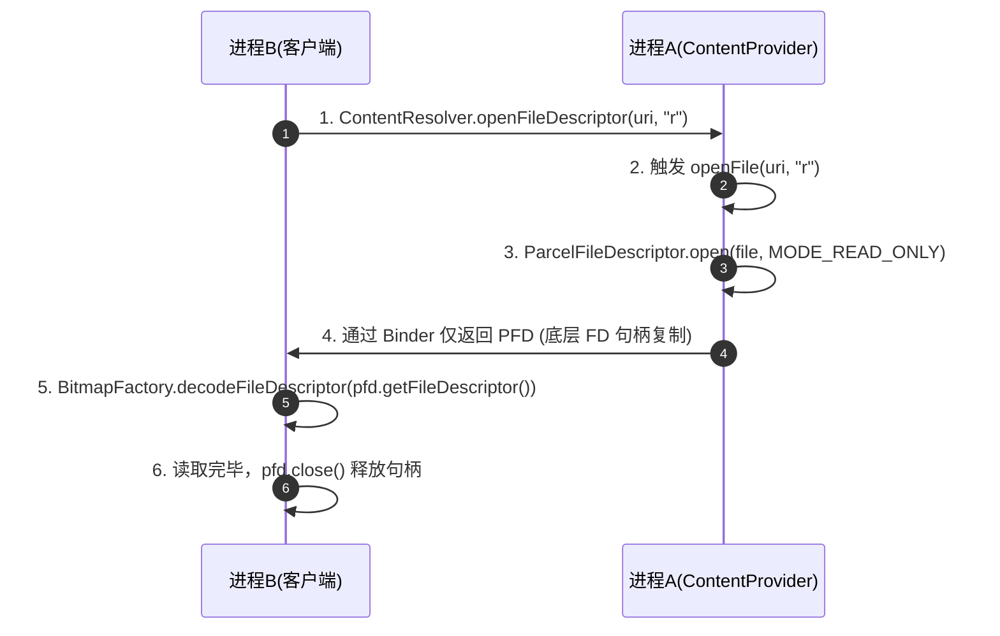
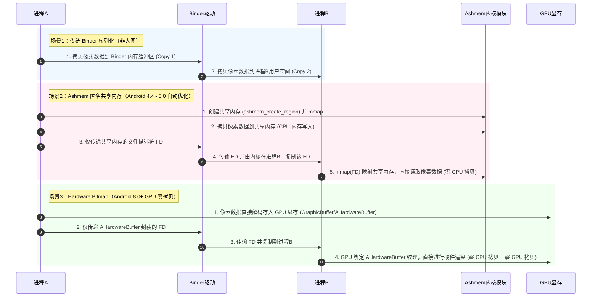

# 跨进程传递大图片

在 Android 系统的日常开发中，多进程架构被广泛应用于各种场景，例如独立的图片加载/浏览进程、保活推送进程、跨进程插件化架构、系统壁纸及系统通知等。在这些场景中，跨进程传递图片（`Bitmap`）是一项高频但极具挑战性的任务。

如果采用传统的 Parcelable 序列化方式，由于 Binder 缓冲区的物理大小限制，传递大图片极易抛出 `TransactionTooLargeException` 导致进程崩溃。为了解决这一痛点，Android 系统在不同版本中演进出了多种优化方案。

本文将从物理内存、Linux 内核及 GPU 硬件等底层视角，深入剖析跨进程传递大图片的四大核心方案及其底层机制，并给出工程化的黄金实践策略。

---

## 1. 跨进程传递大图片（Bitmap）的背景与痛点

### 1.1 跨进程图片传递的业务场景与技术挑战
In the Android platform, multi-process architecture is a mature design pattern that can isolate processes, reduce memory pressure on the main process, and improve overall app stability. The following scenarios frequently require transferring large images across processes:
1. **多进程架构应用**：为了防止图片占用过多主进程堆内存导致 OOM，一些大图浏览器、相册、地图类应用会将图片解码与显示模块放在独立的子进程中。
2. **系统服务与 APP 交互**：APP 向系统发送带有大图的通知（`Notification`），或者设置系统桌面壁纸、锁屏壁纸。这需要通过 Binder 将 APP 进程的图片数据发送给系统的 `SystemServer` 进程。
3. **插件化与多进程 WebView**：在插件化架构或独立的 WebView 进程中，需要将大图或截图跨进程传递给宿主进程。

然而，图片作为多媒体数据，其数据量极大，在多进程之间的流动面临着 Android 系统最底层的 Binder 缓冲区物理限制。

### 1.2 为什么图片成为 IPC 的“终极杀手”？

#### 1.2.1 Bitmap 内存占用计算模型
Bitmap 像素数据在内存中的占用空间远比其压缩包（如 JPG、PNG）大得多。Bitmap 被解码后，在内存中是以未压缩的原始像素矩阵形式存在的。

其内存占用计算公式为：
$$\text{Memory Size} = \text{Width} \times \text{Height} \times \text{Bytes Per Pixel}$$

根据 Bitmap 的 `Config` 配置，不同的格式每个像素占用的字节数（`Bytes Per Pixel`）不同：
*   **`ARGB_8888`**：每个像素占用 4 字节（默认，画质最高，每个色彩通道 8 位）。
*   **`RGB_565`**：每个像素占用 2 字节（无 Alpha 通道，红色 5 位，绿色 6 位，蓝色 5 位，常用于低配设备）。
*   **`RGBA_F16`**：每个像素占用 8 字节（半精度浮点数，常用于 HDR 图及广色域显示）。
*   **`ALPHA_8`**：每个像素占用 1 字节（仅有透明度通道，常用于遮罩和特效）。

例如，一张使用主流手机相机拍摄的照片，其分辨率通常为 $4000 \times 3000$ 像素。如果在内存中以默认的 `ARGB_8888` 格式解码，它所占用的物理内存为：
$$4000 \times 3000 \times 4 \text{ Bytes} = 48,000,000 \text{ Bytes} \approx 45.78 \text{ MB}$$

即便是一张普通的 $1080 \text{p}$ 屏幕截图（$1920 \times 1080$），其内存占用也高达：
$$1920 \times 1080 \times 4 \text{ Bytes} \approx 7.91 \text{ MB}$$

#### 1.2.2 Bitmap 内存分配位置的演进与垃圾回收的影响
Bitmap 的像素数据存储位置在 Android 历史版本中经历多次变迁，这直接影响了它在 IPC 传输时的物理行为及系统的性能表现：
*   **Android 3.0 以前**：像素数据分配在 Native 内存，Java 堆中仅保留 `Bitmap` 的空壳对象。但这导致 Native 内存的生命周期极难控制，容易发生内存泄漏，引发整机 OOM。
*   **Android 3.0 ~ 7.1**：像素数据被挪到了 Java 堆（以 byte 数组形式存在）。这虽然便于垃圾回收器（GC）统一管理，但在加载大图时，极易导致 Java 堆内存碎片化。在 ART 虚拟机的分代垃圾收集（Generational GC）或并发标记清除（CMS）过程中，巨型 byte 数组会导致垃圾回收器频繁触发 GC 暂停（Stop-The-World）。这极易卡顿主线程的 Looper 渲染周期，错失 16.6ms（60Hz）或 8.3ms（120Hz）的垂直同步信号（V-Sync），并且极易直接抛出 Java 层的 `OutOfMemoryError`。
*   **Android 8.0 及以后**：像素数据重新回到 Native 堆（通过 `std::shared_ptr<Bitmap>` 和 `GraphicsJNI` 桥接）。Java 堆仅保留轻量级的 Bitmap 壳对象。这不仅极大缓解了 JVM 堆的压力，还为引入 `Config.HARDWARE`（硬件位图）提供了架构支持。

### 1.3 TransactionTooLargeException 产生的根源
Android IPC 的核心基础设施是 Binder。当我们在 `Intent`、`Bundle` 或 AIDL 接口中跨进程传递一个大 Bitmap 时，最终都是通过 Binder 驱动来进行序列化数据的物理流转。

#### 1.3.1 Binder 内核缓冲区的物理结构设计与物理页映射机制
在 Linux 进程隔离架构中，Binder 驱动在内核空间（Kernel Space）为每个开启了 Binder 通信的进程映射了一块物理内存，称为 **Binder 内存缓冲区（Binder Buffer Area）**。该缓冲区的大小是通过 `mmap` 在进程初始化时（通过 `ProcessState`）指定的。

对于普通的应用程序进程，这块缓冲区的总大小限制为：
$$\text{Binder Buffer Size} = 1016 \text{ KB} \approx 1 \text{ MB}$$

在系统的 Binder 驱动源码中，`binder_alloc` 模块通过映射 `vm_area_struct` 来管理这块虚拟地址空间。值得注意的是，在进程启动时，通过 `mmap` 建立的 Binder 空间仅仅是虚拟内存地址，并没有实际分配对应的物理内存页（Physical Page）。

只有当发生 Binder 事务通信时，内核才会根据待传输 Parcel 的大小，通过驱动底层的 `alloc_page` 动态申请物理内存页，并在页表（Page Table）中动态建立映射关系。如果大图片的序列化数据强行进入这个分配管线，会导致系统短时间内频繁发生页中断（Page Fault），引发系统页表的频繁重构与 TLB（转换旁路缓冲区，CPU 页表缓存）的抖动。这不仅严重降低了 CPU 的数据检索效率，更会导致 Binder 通信延迟呈指数级上升，严重时还会造成整个系统界面的卡顿与掉帧。

#### 1.3.2 并发事务共享与内存碎片的致命碰撞
这约 $1 \text{ MB}$ 的 Binder 缓冲区具有以下两个高风险物理特性：
1. **多线程并发共享**：它并不是每个 Binder 线程独享 $1 \text{ MB}$，而是当前进程中**所有正在进行的 Binder 事务共同分享这 $1 \text{ MB}$ 的空间**。
2. **内存零星碎片化**：随着并发 IPC 事务的不断申请和释放，Binder 缓冲区的红黑树节点会产生大量非连续的零碎区间。当一个大型 Binder 事务请求写入大图片序列化数据时，即使空闲空间总和足够，也可能因为找不到足够大的连续物理页而分配失败。
3. **分配时机与生命周期**：Binder 事务发送时，Binder 驱动会在接收端进程的 Binder 缓冲区中分配一块物理内存，用于存放传入的 Parcel 数据。只有当接收端进程在用户空间处理完该事务（例如 AIDL 接口执行完毕返回）后，驱动才会释放这块缓冲区。这期间如果发生任何延迟，该块缓冲区就无法被回收，极大加剧了进程内其他普通 Binder 调用分配内存失败的概率。

#### 1.3.3 崩溃机制
当发送端进程向 Parcel 写入一个普通序列化的大图片（例如前文计算的 $7.91 \text{ MB}$ 屏幕截图）并调用 `transact()` 时，Binder 驱动在内核中试图分配一块 $7.91 \text{ MB}$ 的内核缓冲区。这显然远远超过了 $1016 \text{ KB}$ 的进程总限制，分配操作必定失败。

内核在分配失败后，会直接向发送端返回 `-ENOMEM` 错误。Android 系统的 Java 层 Binder 框架（`android.os.BinderProxy`）捕获该错误后，会直接抛出：
`android.os.TransactionTooLargeException: data parcel size XXXXXX bytes`

这会导致调用方进程或者被调用方进程直接崩溃，极其危险。

---

## 2. 跨进程传输大图片方案一：直接 Bundle 传输的底层机制与 4.4~8.0 的 Ashmem 自动优化

直接将 Bitmap 放入 Intent 的 Bundle 中传递（如 `intent.putExtra("image", bitmap)`）是开发者最常用的手段。然而，在 Android 4.4 到 8.0 之间，即使图片尺寸超过了 Binder 的 $1 \text{ MB}$ 限制，APP 依然可以神奇地成功传递而不会崩溃。

这得益于 Android 系统底层在 `Bitmap` 类的 C++ 序列化实现中引入的“黑魔法”——**Ashmem 匿名共享内存自动优化**。

### 2.1 Ashmem（匿名共享内存）的核心原理与 ioctl 机制
Ashmem（Anonymous Shared Memory）是 Android 系统特有的一种临时共享内存驱动。它在 Linux 内核层实现，底层基于 Linux 的 `tmpfs` 虚拟文件系统，但针对移动设备的高内存敏感度进行了以下关键扩展：
1. **匿名性**：不需要在磁盘上建立具体的文件路径，而是由内核直接在内存中分配一块命名空间。通过一个虚拟文件描述符（FD）来进行跨进程的映射与共享。
2. **Pin / Unpin 机制（锁定与解锁）**：
    *   **Pin（锁定）**：当进程正在向这块共享内存写入或读取数据时，将内存页状态标记为 Pin（通过底层 `ioctl` 指令）。此时，即便系统内存吃紧，内核的 OOM Killer 也绝对不能回收这块物理内存页。
    *   **Unpin（解锁）**：当图片渲染完毕，或者进入后台不再使用时，进程可以调用 `ioctl(fd, ASHMEM_UNPIN, &pin)` 将其标记为 Unpin。这意味着这块内存的内容可以被内核随时回收。内核在内存紧缺时会直接回收这块物理页，并将其放入系统的回收队列（shrinker）中。如果在被回收后，APP 再次尝试访问它，内核会触发一个缺页中断，并向 APP 返回错误，此时 APP 可以选择重新解码或加载。这极大地防止了图片内存积压导致的系统整机内存崩溃。

### 2.2 Android 4.4 ~ 8.0 自动 Ashmem 优化源码深度剖析
我们以 Android 7.0 的源码为例，来看 `Bitmap` 是如何跨进程传输的。

#### 2.2.1 Java 层的转发
当我们在 Java 层将 Bitmap 写入 Parcel 时，调用的是 `Bitmap.java` 的 `writeToParcel` 方法：

```java
// frameworks/base/graphics/java/android/graphics/Bitmap.java
public void writeToParcel(Parcel p, int flags) {
    noteDirectIndexedIfNeeded();
    // 调用 Native 层的 writeToParcel 方法
    if (!nativeWriteToParcel(mNativePtr, mRecycled, mDensity, p)) {
        throw new RuntimeException("Write to parcel failed");
    }
}
```

#### 2.2.2 JNI 与 C++ 层的桥接
通过 JNI，请求被转发到 `android_graphics_Bitmap.cpp`：

```cpp
// frameworks/base/core/jni/android/graphics/Bitmap.cpp
static jboolean Bitmap_writeToParcel(JNIEnv* env, jobject, jlong bitmapHandle,
                                      jboolean isRecycled, jint density, jobject parcelObj) {
    // 1. 获取 C++ 层的 Parcel 指针
    Parcel* parcel = parcelForJavaObject(env, parcelObj);
    // 2. 将 Java 层的 Bitmap 指针还原为 C++ 的 Bitmap 包装对象
    BitmapWrapper* bitmapWrapper = reinterpret_cast<BitmapWrapper*>(bitmapHandle);
    SkBitmap bitmap;
    bitmapWrapper->getSkBitmap(&bitmap);

    // 3. 写入图片元数据（宽、高、Config、Density等）到 Parcel
    if (!parcel->writeInt32(isRecycled) ||
        !parcel->writeInt32(bitmap.colorType()) ||
        !parcel->writeInt32(bitmap.alphaType()) ||
        !parcel->writeInt32(density)) {
        return JNI_FALSE;
    }

    // 4. 获取像素大小与指针
    size_t size = bitmap.getSize();
    void* pixels = bitmap.getPixels();
    
    // 如果像素大小超过阈值，这里 writeBlob 内部会触发 Ashmem 自动优化
    if (parcel->writeBlob(size, false, [&pixels](void* dest, size_t len) {
        memcpy(dest, pixels, len);
    }) != NO_ERROR) {
        return JNI_FALSE;
    }

    return JNI_TRUE;
}
```

#### 2.2.3 Parcel::writeBlob 底层匿名共享内存 of 创建
接下来我们进入 Binder 框架的核心实现 `Parcel.cpp`，看看 `writeBlob` 内部的逻辑：

```cpp
// frameworks/native/libs/binder/Parcel.cpp
status_t Parcel::writeBlob(size_t len, bool mutableCopy, WritableBlob* outBlob)
{
    status_t status;
    // INPLACE_LIMIT 默认为 128KB 或者是 256KB
    if (len <= INPLACE_LIMIT) {
        // 如果像素数据很小，直接在 Binder 缓冲区分配空间拷贝（普通序列化）
        status = writeInt32(BLOB_INPLACE);
        if (status != NO_ERROR) return status;
        void* ptr = writeInplace(len);
        if (ptr == NULL) return NO_MEMORY;
        outBlob->init(-1, ptr, len, false);
        return NO_ERROR;
    }

    // 【核心优化】如果像素数据超过 128KB，走 Ashmem 共享内存分支
    status = writeInt32(BLOB_ASHMEM);
    if (status != NO_ERROR) return status;

    // 1. 调用 ashmem_create_region 在内核中创建匿名共享内存区域
    int fd = ashmem_create_region("Parcel Blob", len);
    if (fd < 0) return NO_MEMORY;

    int err = 0;
    if (mutableCopy) {
        // 可变拷贝，设置读写保护标志为可读写
        err = ashmem_set_prot_region(fd, PROT_READ | PROT_WRITE);
    } else {
        // 只读拷贝，防止接收端修改像素数据影响发送端
        err = ashmem_set_prot_region(fd, PROT_READ);
    }

    if (err != 0) {
        close(fd);
        return NO_MEMORY;
    }

    // 2. 将创建好的 Ashmem 通过 mmap 映射到当前进程（发送端）的虚拟地址空间
    void* ptr = mmap(NULL, len, PROT_READ | PROT_WRITE, MAP_SHARED, fd, 0);
    if (ptr == MAP_FAILED) {
        close(fd);
        return NO_MEMORY;
    }

    // 3. 将文件描述符 FD 写入 Parcel 中（注意：仅写入一个 FD 整数值）
    // writeFileDescriptor 内部会通过 Binder 驱动注册该 FD
    status = writeFileDescriptor(fd, true /*takeOwnership*/);
    if (status != NO_ERROR) {
        munmap(ptr, len);
        close(fd);
        return status;
    }

    // 4. 初始化 WritableBlob，以便外部 Bitmap.cpp 的 lambda 表达式可以将像素数据 memcpy 拷贝进来
    outBlob->init(fd, ptr, len, mutableCopy);
    return NO_ERROR;
}
```

### 2.3 Binder 驱动对文件描述符（FD）的特殊转换机制与内核映射
当发送端进程将 Ashmem 的文件描述符 `fd`（假设在当前进程中值是 `3`）写入 Parcel 并发送时，Binder 驱动会对其进行拦截和底层转换。

在 JNI 层的 `android_util_Binder.cpp` 中，最终会调用到 `writeFileDescriptor`。当 Binder 驱动检测到 Parcel 中包含 `BINDER_TYPE_FD`（代表文件描述符）类型的对象时，它会执行以下内核操作：
1. 从进程 A 的文件描述符表中找到 `fd = 3` 指向的内核 `struct file` 结构体。
2. 找到接收端进程 B 的 `task_struct` 并获取其文件描述符表。
3. 在进程 B 的文件描述符表中分配一个当前空闲的最小整数（假设是 `7`）。
4. 将进程 B 的 `fd_array[7]` 指向前面找到的内核 `struct file` 结构体，增加该结构在内核中的引用计数。
5. **在 Parcel 数据块中把 FD 的数值从 `3` 替换为 `7`**。

这个过程本质上是 Linux 内核层面的句柄复制。它使得进程 B 能够通过 `fd = 7` 直接访问到进程 A 创建的那块 Ashmem 匿名共享内存，从而实现了**物理内存的跨进程共享**。

### 2.4 接收端的反序列化与 SkPixelRef 关联逻辑
当接收端进程接收到 Parcel 并试图重建 Bitmap 时，会调用 Java 层的 `Bitmap.CREATOR`，最终调用到 JNI 层的 `Bitmap_createFromParcel`：

```cpp
// frameworks/base/core/jni/android/graphics/Bitmap.cpp (接收端)
static jobject Bitmap_createFromParcel(JNIEnv* env, jobject, jobject parcelObj) {
    Parcel* parcel = parcelForJavaObject(env, parcelObj);
    
    // 1. 读取元数据（宽、高、Config等）
    jboolean isRecycled = parcel->readInt32();
    int colorType = parcel->readInt32();
    ...
    
    // 2. 读取 Blob 像素数据
    android::Parcel::ReadableBlob blob;
    // readBlob 内部会通过 mmap 映射接收到的 FD
    if (parcel->readBlob(size, &blob) != NO_ERROR) {
        return NULL;
    }

    // 3. 获取映射后的指针
    const void* pixels = blob.data();

    // 4. 重建 SkBitmap，这里会将像素数据指针直接传递给 SkBitmap 的 SkPixelRef
    // 实现了物理地址级别的共享，无需将像素从 Ashmem 拷贝到 JVM 堆中
    SkBitmap bitmap;
    bitmap.setInfo(SkImageInfo::Make(...));
    bitmap.setPixels(const_cast<void*>(pixels));

    // 5. 包装为 Java 层的 Bitmap 返回
    return GraphicsJNI::createBitmap(env, ...);
}
```

通过这一套“创建 Ashmem -> `mmap` 写入 -> 传递 FD -> 句柄复制 -> 接收端 `mmap` 映射”的链路，Android 系统巧妙地绕过了 Binder $1 \text{ MB}$ 的限制，在物理层只传递了一个轻量级的 FD，并保证了像素数据在两个进程之间的“零 CPU 拷贝”共享。

### 2.5 Android 8.0 后的重构与底层 `Bitmap.cpp` 实现
在 Android 8.0 中，由于 Native 层的结构重构（像素数据改由 Native 堆内存中的 `std::shared_ptr<Bitmap>` 统一接管），这一过程底层的具体包装发生了变化。

Android 8.0+ 在传递 Bitmap 时，会在 C++ 层的 `Bitmap::writeToParcel` 中判断当前 Bitmap 的物理存储类型。

```cpp
// frameworks/base/libs/hwui/hw/Bitmap.cpp (Android 8.0+ 序列化)
bool Bitmap::writeToParcel(Parcel* parcel) const {
    // 1. 写入元数据
    parcel->writeInt32(mWidth);
    parcel->writeInt32(mHeight);
    ...
    
    // 2. 判断物理存储类型
    if (mPixelStorageType == PixelStorageType::Ashmem) {
        // 如果已经是 Ashmem 存储，直接写出类型并复制其 FD
        parcel->writeInt32(1); // 标识为 Ashmem
        parcel->writeDupFileDescriptor(mPixelStorage.ashmem.fd);
    } else if (mPixelStorageType == PixelStorageType::Hardware) {
        // 如果是硬件位图
        parcel->writeInt32(2); // 标识为 Hardware
        AHardwareBuffer* hardwareBuffer = mPixelStorage.hardware.buffer;
        AHardwareBuffer_writeToParcel(hardwareBuffer, parcel);
    } else {
        // 普通 Heap 存储的 Bitmap，如果很大，则创建 Ashmem 写入
        parcel->writeInt32(0); // 标识为普通存储
        ...
        // 内部同样会调用 ashmem_create_region 并将像素复制进 FD 中传输
    }
    return true;
}
```

接收端同样通过读取标识来决定是通过 `mmap` 恢复匿名共享内存，还是通过 GPU 纹理句柄恢复硬件位图。

### 2.6 历史优化局限与 32 位系统的“虚拟内存耗尽”痛点
尽管 Ashmem 自动优化大幅度降低了大图 IPC 的崩溃率，但它也存在重要的历史技术缺陷：
在 32 位 Android 系统中（虚拟地址空间最多 4GB，APP 用户空间通常仅能分配 2GB~3GB），每次对 Ashmem 调用 `mmap` 映射都会占用一大片连续的虚拟地址空间（VMA）。

如果接收端进程频繁加载大图，或者将这些大图的 Bitmap 放入了静态强引用内存缓存（Memory Cache）中，虽然物理内存可能会通过系统的 GC 或者 unpin 机制得以释放，但是这块**虚拟内存地址段依然被该 FD 占用而无法回收**。久而久之，进程会因为无法找到一块足够大的连续虚拟内存地址段而在下一次加载图片时抛出致命的 OOM（虚存空间耗尽崩溃），即便系统此时还有极其富余的物理 RAM 空间。这在早期的中低端折叠屏、车载系统和 32 位应用架构上是非常普遍的稳定性隐患。

---

## 3. 跨进程传输大图片方案二：Android 8.0+ 的 Hardware Bitmap（硬件位图）与 AHardwareBuffer

Android 8.0 (API 26) 引入了一个极其强悍的 Bitmap 格式：`Bitmap.Config.HARDWARE`（硬件位图）。在性能敏感的多进程数据流动中，Hardware Bitmap 发挥了至关重要的作用。

### 3.1 什么是 Hardware Bitmap（硬件位图）？
普通的 Bitmap 即使像素数据在 Native 堆，在被 View 系统渲染绘制时，依然遵循着“CPU 内存 $\rightarrow$ GPU 显存”的传统渲染管线：

```
[磁盘/网络中的压缩图]
       ↓ (CPU 解包解码)
[CPU 内存 (JVM/Native Heap)]
       ↓ (RenderThread 渲染时，调用 OpenGL ES 纹理上传 glTexImage2D)
[GPU 显存 (VRAM 纹理缓冲区)]
       ↓ (GPU 执行渲染)
[显示屏]
```

在这个过程中，每一次绘制大图或每一帧的动画更新，都会引起 CPU 到 GPU 之间物理总线的像素拷贝，严重消耗系统总线带宽，引发 CPU 的阻塞等待和设备发热。

`Config.HARDWARE` 的核心设计思路是：**将像素数据的生命周期终结在 GPU 显存中**。
图片在解码时，直接通过底层的显存分配器将像素写入 GPU 纹理中。在 CPU 侧（即 Java 堆和 Native 堆），仅持有一个极其轻量级的“硬件缓冲引用句柄”。

### 3.2 硬件位图跨进程共享的物理基石：AHardwareBuffer
在 Native 层，Hardware Bitmap 底层核心关联的是一个 NDK API —— `AHardwareBuffer`。

`AHardwareBuffer` 是 Android 8.0 对系统底层核心组件 `GraphicBuffer` 的一层轻量级封装。
`GraphicBuffer` 是 Android Window 渲染系统（SurfaceFlinger）用于跨进程流转图像帧数据的核心介质。它的底层是基于 Android 底层的显存分配器 **Gralloc**。

#### 3.2.1 Gralloc 分配与 dma-buf 机制
`Gralloc` 分配的内存通常是显卡驱动可以直接访问的物理内存（例如统一内存架构下的共享系统内存，或独立的 GPU 专用显存）。
In the Linux kernel layer, the `GraphicBuffer` utilizes the **`dma-buf` (Direct Memory Access Buffer)** framework underneath. This is designed specifically for sharing buffers among multiple drivers.
*   `dma-buf` 允许把一块物理内存（如显存）抽象为一个普通的文件描述符 FD。
*   这个 FD 可以通过内核的 Binder 驱动、Domain Socket 等各种 IPC 手段在进程间随意传递。
*   任何持有了这个 FD 的进程，其底层的硬件模块（CPU、GPU、显示合成器、硬件解码器）都可以通过将该 FD 绑定到自己的页表上，从而直接以 DMA 的形式读取或写入这块显存，实现了**完全的硬件级零拷贝（Zero-Copy）**。

在底层的芯片级实现中，`dma-buf` 通常会结合 Android 底层的 **Ion** 内存管理器（在 Android 12+ 中演进为 DMA-BUF Heaps）。Ion 允许从多媒体芯片（如相机 ISP、视频编解码 VPU）到渲染芯片（GPU）和显示控制器（DPU）之间进行硬件级的无缝内存流转，进一步打通了零拷贝渲染的硬件全链路。

#### 3.2.2 硬件位图跨进程传递的源码流转
当跨进程传递硬件位图时，其 C++ 层的实现会直接将底层的 `AHardwareBuffer` 进行 Parcel 序列化。

在 Native 层 `Bitmap.cpp` 中：

```cpp
// frameworks/base/libs/hwui/hw/Bitmap.cpp (Android 8.0+)
bool Bitmap::writeToParcel(Parcel* parcel) const {
    ...
    if (mPixelStorageType == PixelStorageType::Hardware) {
        // 1. 写入类型标识为 2 (Hardware)
        parcel->writeInt32(2);
        
        // 2. 获取底层的 GraphicBuffer 指针并转为 AHardwareBuffer
        GraphicBuffer* buffer = mPixelStorage.hardware.graphicBuffer.get();
        AHardwareBuffer* hardwareBuffer = reinterpret_cast<AHardwareBuffer*>(buffer);
        
        // 3. 调用 NDK API 序列化 AHardwareBuffer 
        // 它的内部会将物理显存关联的 dma-buf FD 写入 Parcel 中
        return AHardwareBuffer_writeToParcel(hardwareBuffer, parcel) == 0;
    }
    ...
}
```

目标进程在接收反序列化时：

```cpp
// frameworks/base/libs/hwui/hw/Bitmap.cpp (接收端)
bool Bitmap::readFromParcel(Parcel* parcel) {
    ...
    int32_t type = parcel->readInt32();
    if (type == 2) { // 硬件位图分支
        AHardwareBuffer* hardwareBuffer = nullptr;
        // 1. 从 Parcel 中读出 AHardwareBuffer 并还原 FD，映射为 GraphicBuffer
        if (AHardwareBuffer_readFromParcel(parcel, &hardwareBuffer) != 0) {
            return false;
        }
        
        // 2. 包装为 GraphicBuffer 并在 Native 重新构建硬件 Bitmap
        sp<GraphicBuffer> graphicBuffer = reinterpret_cast<GraphicBuffer*>(hardwareBuffer);
        mPixelStorage.hardware.graphicBuffer = graphicBuffer;
        mPixelStorageType = PixelStorageType::Hardware;
    }
    ...
}
```

#### 3.2.3 零拷贝与 GPU 直接渲染机制
使用 Hardware Bitmap 跨进程传输大图片时，物理像素数据自始至终**只在 GPU 显存中存在唯一的一份**。
当进程 B 拿到代表 `AHardwareBuffer` 的 FD 并将其恢复为 Hardware Bitmap 后，在执行渲染时，底层的物理硬件交互流转如下：
1. 进程 B 的渲染线程（RenderThread）将该 `AHardwareBuffer` 作为 EGLImage 导入到当前渲染上下文中（在 OpenGL 中使用扩展 `eglCreateImageKHR` 与 `glEGLImageTargetTexture2DOES`，在 Vulkan 中使用 `VkImportAndroidHardwareBufferInfoANDROID` 结构体导入）。
2. GPU 直接将该 AHardwareBuffer 作为纹理进行片元着色器（Fragment Shader）采样和光栅化渲染，像素数据直接流向屏幕的物理 Framebuffer。
3. 整个传输和渲染过程中，CPU 拷贝次数为 0，GPU 拷贝次数也为 0。仅在 Binder 中传递了一个十几字节的句柄 FD。

### 3.3 Hardware Bitmap 的局限性与致命坑点
虽然 Hardware Bitmap 带来了极其震撼的零拷贝性能，但因为像素数据存放在只读的显存中，使得它在常规的图片操作中存在许多致命局限。如果开发中盲目使用，会导致进程抛出异常或崩溃。

#### 3.3.1 绝对只读性与 Canvas 崩溃
由于物理像素并不在 CPU 可寻址的内存（Java/Native 堆）中，CPU 无法像读写普通 byte 数组那样去修改像素。
如果我们尝试用它创建软件 `Canvas`：

```java
Bitmap hardwareBitmap = ...; // 一个 Config.HARDWARE 的 Bitmap
Canvas canvas = new Canvas(hardwareBitmap); // 报错！
```

此时程序会直接崩溃，抛出异常：
`java.lang.IllegalStateException: Cannot draw to the specified config: HARDWARE`

#### 3.3.2 软件渲染（Software Rendering）下的进程崩溃
如果将 Hardware Bitmap 传递给一个不支持硬件加速（Hardware Acceleration）的 View，或者该 View 被显式设置了软件渲染图层：

```java
view.setLayerType(View.LAYER_TYPE_SOFTWARE, null);
```

当 View 系统的渲染器尝试在 CPU 端调用 `onDraw` 并将 Hardware Bitmap 绘制到软件 Canvas 时，Android 系统的 Render 模块会因为无法在物理内存中寻址到像素数据而直接发生致命崩溃：
`java.lang.IllegalArgumentException: Software rendering doesn't support hardware bitmaps`

#### 3.3.3 转换回普通 Bitmap 的高昂代价
如果遇到必须在 CPU 端处理图片（例如：裁剪、旋转、滤镜处理、或者是保存到本地磁盘）的场景，必须将 Hardware Bitmap 转换回普通的 CPU Bitmap（如 `ARGB_8888`）。

有以下两种常见转换方式：
1. **通过 `copy()` 拷贝**：
   ```java
   Bitmap softwareBitmap = hardwareBitmap.copy(Bitmap.Config.ARGB_8888, true);
   ```
   **底层代价**：系统会通过 Vulkan 或 OpenGL 发起一次 GPU 的 **Readback**（显存回读）操作。GPU 会强制同步等待所有之前的渲染指令执行完毕，进行 Pipeline Flush（管线清空），然后通过 PCI 总线把像素数据从 GPU 显存拷贝回 CPU 内存（Java 堆或 Native 堆）。这是一个严重的**同步阻塞操作**，极易导致当前线程发生长达数十毫秒的卡顿（Jank）。

2. **通过 `PixelCopy` 异步拷贝**：
   Android 8.0 引入了 `android.view.PixelCopy` 工具类，可以发起异步的 GraphicBuffer 数据读取。
   ```java
   // 利用 PixelCopy 将一个 Hardware Bitmap 的物理 Surface 数据拷贝到普通 Bitmap 中
   PixelCopy.request(surface, destBitmap, listener, handler);
   ```
   虽然它可以通过 Handler 异步回调防止主线程卡死，但其底层仍然需要 CPU-GPU 物理总线的拷贝和内存分配。频繁使用会导致显存碎片化与 GPU 渲染带宽瓶颈。

---

## 4. 方案三：利用 ContentProvider / FileProvider 传递只读 ParcelFileDescriptor (PFD)

匿名共享内存（Ashmem）与硬件位图（Hardware Bitmap）虽然非常高效，但它们需要接收端进程在内存中一次性重建出整张 Bitmap。如果我们要跨进程传输的图片特别大（例如 $100 \text{ MB}$ 的超高像素医疗胶片、航拍原图或全景大图），频繁创建大共享内存依然容易触发进程的虚拟内存空间耗尽，或者因为没有大片连续的物理页而失败。

在 Android 系统中，对于这种巨型图片的传输，标准且稳健的方案是通过 `ContentProvider` 结合 `ParcelFileDescriptor`（简称 PFD）建立流式传输通道。

### 4.1 什么是 ParcelFileDescriptor (PFD)？
`ParcelFileDescriptor` 是 Android 系统对 Linux 文件描述符（File Descriptor）的 Parcelable 封装。

如前文所述，在 Linux 系统中，FD 是进程级的资源。PFD 实现了 Parcelable 接口，意味着它可以作为 Binder 调用的参数在进程间传输。通过 Binder 驱动在底层的句柄复制机制，接收端进程能够安全的获取到一个指向服务端相同底层物理文件或通道的 FD 副本。

### 4.2 底层流式零拷贝通道：管道（Pipe）与 socketpair
PFD 不仅可以包装物理磁盘文件，还可以包装 Linux 内核中的虚拟传输通道：
1. **管道（Pipe）**：通过 `ParcelFileDescriptor.createPipe()` 可以创建一对 PFD。一个为输入端，一个为输出端。
2. **SocketPair**：通过 `ParcelFileDescriptor.createSocketPair()` 可以创建一对双向通信的 socket 描述符。

#### 4.2.1 Linux Pipe 缓冲与进程阻塞物理机制
当使用管道传输大图时：
*   Linux 内核在内核空间中维护着一个**环形缓冲区（Ring Buffer）**，默认大小通常为 $64 \text{ KB}$。
*   发送端进程通过输出 PFD 持续向管道写入图片的 byte 数据流；接收端进程通过输入 PFD 持续读取。
*   如果管道的环形缓冲区满了，内核会挂起发送端进程的写线程，直到接收端读取走一部分数据；反之，如果管道空了，内核会挂起接收端的读线程。
*   这种阻塞调度是由 Linux 内核完全托管的。整个传输过程**不需要分配任何大片连续的内存**，数据的流动就像细水长流一样，不仅绕过了 Binder 的 $1 \text{ MB}$ 限制，更将进程的内存峰值降到了极低点（仅需 $64 \text{ KB}$ 的内核缓冲区）。

#### 4.2.2 底层 Linux 内核的 `splice` 零拷贝技术
如果底层代码进行了极致优化，流式管道传输甚至可以使用 Linux 内核的 `splice` 系统调用。`splice` 允许在两个文件描述符之间直接移动数据，而数据完全不需要在内核空间和用户空间之间来回拷贝（直接在内核管道的缓冲区指针之间重定向），这达到了 CPU 层面极其优异的零拷贝流动性能。

### 4.3 结合 ContentProvider 实现大图传输的工作链路
使用 `ContentProvider`（或 `FileProvider`）传输大图时，其核心调用链如下：



#### 4.3.1 服务端 ContentProvider 的实现
服务端实现 `openFile` 回调，负责将图片文件包装成只读的 PFD：

```java
public class LargeImageProvider extends ContentProvider {
    @Override
    public ParcelFileDescriptor openFile(@NonNull Uri uri, @NonNull String mode) 
            throws FileNotFoundException {
        // 1. 根据 URI 定位到服务端的物理大图片文件
        File file = new File(getContext().getCacheDir(), "huge_image.jpg");
        if (!file.exists()) {
            throw new FileNotFoundException("Image file not found");
        }
        
        // 2. 以只读模式打开文件描述符，包装为 PFD 返回
        // 这样 Binder 驱动会自动把这个物理文件的句柄复制到客户端进程中
        return ParcelFileDescriptor.open(file, ParcelFileDescriptor.MODE_READ_ONLY);
    }
    
    // 其他必要生命周期方法略...
}
```

#### 4.3.2 客户端的消费读取
客户端接收到 URI 后，通过 `ContentResolver` 发起读取，并直接在底层文件描述符上进行解码：

```java
Uri uri = Uri.parse("content://com.example.hugeimageprovider/image");
ContentResolver resolver = context.getContentResolver();

// 1. 获取共享文件的 PFD。这是一个轻量级 Binder 请求，只传递了句柄
try (ParcelFileDescriptor pfd = resolver.openFileDescriptor(uri, "r")) {
    if (pfd != null) {
        // 2. 直接在底层内核文件描述符上进行图片解码，不需要把整个图片读入 JVM 堆
        FileDescriptor fd = pfd.getFileDescriptor();
        BitmapFactory.Options options = new BitmapFactory.Options();
        // 如果是极巨型图片，这里还可以配置 inSampleSize 进行采样率控制，防止内存撑爆
        options.inSampleSize = 2; 
        
        Bitmap bitmap = BitmapFactory.decodeFileDescriptor(fd, null, options);
        imageView.setImageBitmap(bitmap);
    }
} catch (IOException e) {
    e.printStackTrace();
}
```

#### 4.3.3 高级方案：基于 MemoryFile 的 PFD-Ashmem 复合通道源码实现
如果大图片在服务端仅存在于内存中（未持久化在磁盘上），且尺寸极大，我们可以设计一个 **PFD-Ashmem 复合通道**。
通过 Java 层的 `MemoryFile` 在内存中创建一块共享区间，然后通过反射获取其物理 FD，包装为 PFD 并通过 ContentProvider 返回：

```java
public class MemoryFileProvider extends ContentProvider {
    @Override
    public ParcelFileDescriptor openFile(@NonNull Uri uri, @NonNull String mode) 
            throws FileNotFoundException {
        try {
            byte[] imageData = getMemoryImageData(); // 从服务端内存获取图片字节流
            
            // 1. 创建 MemoryFile 匿名内存映射文件
            MemoryFile memoryFile = new MemoryFile("temp_mem_file", imageData.length);
            memoryFile.writeBytes(imageData, 0, 0, imageData.length);
            
            // 2. 使用反射调用隐藏 API：getFileDescriptor 获取底层的 FileDescriptor
            java.lang.reflect.Method getFdMethod = MemoryFile.class.getDeclaredMethod("getFileDescriptor");
            FileDescriptor fd = (FileDescriptor) getFdMethod.invoke(memoryFile);
            
            // 3. 将 FileDescriptor 包装为 ParcelFileDescriptor
            // 从而能够在 Binder 通道中安全传输该内存映射描述符
            return ParcelFileDescriptor.dup(fd);
        } catch (Exception e) {
            throw new FileNotFoundException("Failed to open MemoryFile PFD: " + e.getMessage());
        }
    }
    
    // 其他生命周期方法略...
    private byte[] getMemoryImageData() { return new byte[0]; }
}
```

客户端收到 PFD 后，直接通过 `mmap` 进行映射。这种设计既避开了磁盘 I/O，又具备了 PFD 对大文件流式传输的超强稳定性，是工业级高并发场景的终极解法。

---

## 5. 方案四：本地临时文件缓存 + 路径传递

这是最朴素也是在一些大型跨端框架中常用的离线方案。

### 5.1 方案工作流
1. **发送端进程 A**：在用户操作或后台处理中得到一个 Bitmap。
2. **压缩并写入磁盘**：在临时目录（如系统的 Cache 目录或外部存储目录）下创建一个临时文件（如 `temp_ipc_123.png`），将 Bitmap 调用 `bitmap.compress(CompressFormat.PNG, 100, fos)` 压缩并写入磁盘。
3. **传递路径**：将文件的绝对路径字符串（如 `"/data/user/0/com.pkg.a/cache/temp_ipc_123.png"`) 通过 Bundle、Intent 或者是 AIDL 接口传递给进程 B。
4. **接收端进程 B**：接收到该路径字符串后，调用 `BitmapFactory.decodeFile(path)` 从磁盘读取数据，重新解码回内存，并自行对临时文件进行删除。

### 5.2 深度性能分析与痛点

#### 5.2.1 磁盘 I/O 带来的严重延迟与卡顿
磁盘 I/O 是移动设备上性能的大敌。即使是目前主流的 UFS 3.1 / UFS 4.0 闪存，其顺序写入和读取速度在并发有其他系统任务时也会显著下降。
*   **压缩写入开销**：`bitmap.compress()` 是一次纯粹的 CPU 密集型操作。它需要将原始像素进行 PNG 的 DEFLATE 压缩或 JPEG 的离散余弦变换（DCT）和哈夫曼编码。在这个过程中，CPU 使用率会瞬间飙升，且压缩一张 $5 \text{ MB}$ 的图片在低端设备上通常需要耗时 $200 \text{ ms} \sim 800 \text{ ms}$。
*   **解码读取开销**：接收端调用 `decodeFile` 再次进行图片解压，这又是一次耗时数百毫秒的 CPU 操作。
*   这导致原本应当在几十微秒内完成的 IPC 图片共享，变成了一个长达数秒的“重度物理读写”过程，这在 UI 交互动画期间是不可接受的，极易引起丢帧卡顿，甚至诱发系统的 ANR。

#### 5.2.2 编解码过程中的内存暴涨与抖动
虽然通过磁盘文件绕过了 Binder 的大小限制，但在两端进程进行编解码时，会在极短的时间内申请大量的临时字节数组缓冲区：
*   在 `bitmap.compress` 阶段，Java 堆或 Native 堆中会产生频繁的缓冲区申请和废弃。
*   在 `decodeFile` 阶段，同样需要分配临时的内存空间用于解压缓存。
这会引发严重的**内存抖动（Memory Churn）**，进而频繁触发 ART 虚拟机的 GC（Garbage Collection），引发应用暂停（Stop-the-world），影响整机流畅度。

#### 5.2.3 异常情况下的垃圾残留与生命周期复杂度
临时文件的生命周期管理是一个工程难题：
*   **文件安全清理**：如果进程 B 在读取临时文件的过程中被系统强杀（例如低内存杀死），或者进程 B 发生异常奔溃，那么这个临时文件就会永久残留在用户的磁盘空间内。久而久之，应用的磁盘占用会崩溃式增长。
*   **并发读写锁**：如果进程 A 还没有完全把图片写入磁盘，进程 B 在收到路径后就迫不及待地开始读取解码，就会导致读取到不完整的文件，引发 `decode` 失败。因此，必须在应用层引入多进程文件锁（`FileLock`）或复杂的同步信号量进行同步。
*   **安全与权限漏洞与 Android 10+ 限制**：传递绝对路径在 Android 10+（分区存储 Scoped Storage）上面面临严苛的权限审查。如果两个进程属于不同的 APP，跨进程传递绝对路径在没有配置 `FileProvider` 共享目录（如配置 `<paths>`、`<cache-path>`、`<external-path>` 等）的情况下，会直接抛出 `FileUriExposedException` 或者是权限不足异常。

---

## 6. 核心方案横向多维度全方位对比

以下是四种大图跨进程传递方案的横向全方位对比：

| 对比维度 | 方案一：直接 Bundle (Ashmem) | 方案二：Hardware Bitmap | 方案三：ContentProvider + PFD | 方案四：本地临时文件 + 路径 |
| :--- | :--- | :--- | :--- | :--- |
| **传输耗时** | 极低（微秒级） | 最低（几乎为零） | 中等（毫秒级，受磁盘I/O限制） | 极高（数百毫秒至数秒） |
| **物理内存 (RAM) 开销** | 较小（仅 Ashmem 映射开销） | 极小（无 CPU 内存，仅显存） | 极小（分流读取，无大内存驻留） | 极大（双向编解码带来内存抖动） |
| **显存 (VRAM) 开销** | 渲染时正常分配 | 独占显存（只读） | 渲染时正常分配 | 渲染时正常分配 |
| **生命周期管理复杂度** | 低（系统 GC / 自动回收） | 低（由 Graphics 模块生命周期接管）| 中（需要手动关闭 PFD 文件描述符）| 高（需清理临时文件、防并发写）|
| **兼容性** | Android 4.4+ 自动支持 | Android 8.0+ (API 26) | Android 1.0+ (内核通用机制) | Android 1.0+ (不推荐跨应用) |
| **零拷贝支持级** | CPU 级零拷贝 | **GPU 级绝对零拷贝** | 硬件 DMA 拷贝 (受系统支持) | 无（多次 CPU / 磁盘拷贝） |
| **大小限制** | 理论上受限于系统可用虚拟内存 | 理论上受限于 GPU 显存容量 | 无限制（流式传输） | 无限制（受限于磁盘剩余空间） |
| **对 Canvas 的支持** | 完美支持读写 | **只读，Canvas 绘制会直接崩溃** | 恢复为普通 Bitmap 后完美支持 | 恢复为普通 Bitmap 后完美支持 |
| **适用场景** | 常用大小图片（128KB - 10MB） | 独立渲染、背景大图、只读浏览 | 极巨型图片（>10MB）、超大文件流 | 离线、离线大图处理、对延时无要求 |

### 横向性能推演分析
1. **虚拟内存占用对比**：Hardware Bitmap 在方案二中对虚拟地址空间（VMA）的开销几乎为零，因为它绕过了 CPU 内存的地址段映射，完全委派给显存驱动进行显存级的页表转换。而方案一的 Ashmem 随着大图的增加，其在进程虚拟地址段上的映射会导致虚拟内存枯竭。
2. **生命周期回收的自动化**：方案一（直接 Bundle/Ashmem）与方案二（Hardware Bitmap）均融入了 Android 系统的底层垃圾回收管线。当 Java 层的壳对象（`Bitmap.java`）被 GC 标记回收时，其析构函数（Native 层的析构逻辑）会自动关闭底层的共享内存 FD 并释放显存句柄。而方案三的 PFD 和方案四的磁盘文件，均需要开发者编写极其严密的 `close()` 与 `delete()` 逻辑，否则极易导致系统级句柄泄露（FD Leak）与垃圾文件积压。

---

## 7. 架构拓扑与数据流转图

### 7.1 三种内存拷贝方式的时序对比

下面的时序图详细对比了传统 Binder 拷贝（双重拷贝）、Ashmem 自动优化、以及 Hardware Bitmap（显存映射）的底层物理链路。



### 7.2 IPC 图片传输架构拓扑图

下面的架构拓扑图展示了不同方案下，物理像素在内存及设备中的映射关系：

```mermaid
graph TD
    subgraph 进程A用户空间
        BitmapA[Bitmap 对象] -->|指向| NativeBitmapA[Native BitmapWrapper]
        NativeBitmapA -->|指向像素| PixelA[像素数据]
    end

    subgraph 物理媒介层 (共享介质)
        Ashmem[Ashmem 匿名共享内存]
        GraphicBuffer[Gralloc 显存 / GraphicBuffer]
        File[本地存储 / 磁盘文件]
    end

    subgraph 进程B用户空间
        BitmapB[Bitmap 对象] -->|指向| NativeBitmapB[Native BitmapWrapper]
        NativeBitmapB -->|指向像素| PixelB[像素数据]
    end

    subgraph Binder 驱动层
        BinderBuf[Binder 缓冲区: 1016KB]
    end

    %% 方案数据流向
    PixelA -->|普通序列化: 双重拷贝| BinderBuf
    BinderBuf -->|普通序列化: 双重拷贝| PixelB

    PixelA -->|方案一: Ashmem映射| Ashmem
    Ashmem -->|只读映射| PixelB

    PixelA -->|方案二: 显存分配| GraphicBuffer
    GraphicBuffer -->|GPU直接绑定| PixelB

    PixelA -->|方案三/四: 读写通道| File
    File -->|流式读取或mmap| PixelB

    classDef proc fill:#e6f7ff,stroke:#1890ff,stroke-width:2px;
    classDef media fill:#fff0f6,stroke:#eb2f96,stroke-width:2px;
    classDef binder fill:#f6ffed,stroke:#52c41a,stroke-width:2px;
    class 进程A用户空间,进程B用户空间 proc;
    class Ashmem,GraphicBuffer,File media;
    class Binder 驱动层 binder;
```

---

## 8. 黄金实践方案与工程化最佳防范措施

在实际的 Android 工程化开发中，为了追求极致的性能和稳定性，我们需要结合各方案的优劣势，建立一套**自适应多级大图 IPC 容灾策略**。

### 8.1 黄金实践方案：自适应 IPC 传输框架设计
我们在应用底层可以构建一个 `IpcImageBridge` 框架，自动根据系统版本、图片大小以及接收端场景，动态选择最优传输通道：

```java
package com.example.ipc;

import android.graphics.Bitmap;
import android.os.Build;
import android.os.Bundle;
import android.os.ParcelFileDescriptor;
import android.os.SharedMemory;
import android.system.OsConstants;
import androidx.annotation.NonNull;
import androidx.annotation.Nullable;
import java.io.File;
import java.nio.ByteBuffer;

/**
 * 跨进程图片传输黄金实践桥接器
 */
public class IpcImageBridge {

    private static final int ASHMEM_THRESHOLD_BYTES = 128 * 1024; // 128KB 阈值
    private static final int HUGE_IMAGE_THRESHOLD_BYTES = 10 * 1024 * 1024; // 10MB 阈值

    public static class ImageIpcPayload {
        public int type; // 0: 直接传输(轻量图片), 1: SharedMemory/Ashmem, 2: HardwareBuffer, 3: FileProvider/PFD
        @Nullable public Bitmap directBitmap;
        @Nullable public SharedMemory sharedMemory;
        @Nullable public ParcelFileDescriptor pfd;
        @Nullable public String filePath;
        public int width;
        public int height;
        public int byteCount;
    }

    /**
     * 发送端：构建最适合当前环境和图片大小的 IPC 载荷
     */
    @NonNull
    public static ImageIpcPayload buildPayload(@NonNull Bitmap bitmap, boolean displayOnly, @Nullable File tempDir) throws Exception {
        ImageIpcPayload payload = new ImageIpcPayload();
        payload.width = bitmap.getWidth();
        payload.height = bitmap.getHeight();
        payload.byteCount = bitmap.getByteCount();

        // 1. 如果图片大小小于 128KB，无需进行任何优化，直接使用普通序列化传输，开销最小
        if (payload.byteCount < ASHMEM_THRESHOLD_BYTES) {
            payload.type = 0;
            payload.directBitmap = bitmap;
            return payload;
        }

        // 2. 如果图片大于 10MB，或者是超大图片，强制走 ContentProvider PFD 或者是本地磁盘流式传输，保证内存绝对稳定
        if (payload.byteCount >= HUGE_IMAGE_THRESHOLD_BYTES) {
            if (tempDir != null) {
                payload.type = 3;
                File tempFile = new File(tempDir, "ipc_img_" + System.currentTimeMillis() + ".png");
                // 在后台线程压缩写入本地文件，然后将其包装成只读的 PFD
                try (java.io.FileOutputStream fos = new java.io.FileOutputStream(tempFile)) {
                    bitmap.compress(Bitmap.CompressFormat.PNG, 100, fos);
                }
                payload.pfd = ParcelFileDescriptor.open(tempFile, ParcelFileDescriptor.MODE_READ_ONLY);
                payload.filePath = tempFile.getAbsolutePath();
                return payload;
            }
        }

        // 3. Android 8.0+ 且接收端纯用于渲染展示（不涉及 CPU 读写修改）
        if (Build.VERSION.SDK_INT >= Build.VERSION_CODES.O && displayOnly) {
            payload.type = 2;
            // 复制为硬件位图，底层会自动将其放置在显存中（GraphicBuffer）
            payload.directBitmap = bitmap.copy(Bitmap.Config.HARDWARE, false);
            return payload;
        }

        // 4. Android 9.0+ 且接收端需要读写像素：利用 SharedMemory 只读保护进行高性能传输
        if (Build.VERSION.SDK_INT >= Build.VERSION_CODES.P) {
            payload.type = 1;
            SharedMemory shm = SharedMemory.create("ipc_img_shm", payload.byteCount);
            ByteBuffer mapBuf = shm.mapReadWrite();
            bitmap.copyPixelsToBuffer(mapBuf);
            SharedMemory.unmap(mapBuf);
            // 严格设置为只读保护，防止接收端篡改像素导致发送端 Crash
            shm.setProtect(OsConstants.PROT_READ);
            payload.sharedMemory = shm;
            return payload;
        }

        // 5. 兜底方案：在 8.0 以下版本中，直接写入 Bundle
        // 系统会自动使用底层的 Ashmem 进行跨进程 FD 传输，避免大图导致 Binder 崩溃
        payload.type = 0;
        payload.directBitmap = bitmap;
        return payload;
    }
}
```

### 8.2 工程化防范措施一：自适应大图降级压缩
无论底层机制多么优秀，将几千万像素的原图直接在进程间流动都是不明智的。工程上应当遵循**“按需传递”**的原则。如果接收端仅用于绘制小缩略图，则必须在发送端进行强力压限处理：

```java
public class ImageIpcCompressor {
    private static final int MAX_IPC_IMAGE_WIDTH = 1080;
    private static final int MAX_IPC_IMAGE_HEIGHT = 1920;

    /**
     * 在 IPC 之前对 Bitmap 进行物理尺寸和质量压限
     */
    @Nullable
    public static Bitmap prepareBitmapForIpc(@NonNull Bitmap srcBitmap) {
        int width = srcBitmap.getWidth();
        int height = srcBitmap.getHeight();

        // 1. 如果图片尺寸低于阈值，且不需要被压缩，直接返回
        if (width <= MAX_IPC_IMAGE_WIDTH && height <= MAX_IPC_IMAGE_HEIGHT) {
            return srcBitmap;
        }

        // 2. 计算自适应缩放比例（保持宽高比）
        float scale = Math.min((float) MAX_IPC_IMAGE_WIDTH / width, 
                               (float) MAX_IPC_IMAGE_HEIGHT / height);
        
        int targetWidth = Math.round(width * scale);
        int targetHeight = Math.round(height * scale);

        // 3. 在 Native 层进行高保真缩放
        Bitmap scaledBitmap = Bitmap.createScaledBitmap(srcBitmap, targetWidth, targetHeight, true);
        
        // 4. 尽可能将其转换为只读 Hardware Bitmap（如果是 8.0+ 且仅用于显示）
        if (Build.VERSION.SDK_INT >= Build.VERSION_CODES.O) {
            return scaledBitmap.copy(Bitmap.Config.HARDWARE, false);
        }
        
        return scaledBitmap;
    }
}
```

### 8.3 工程化防范措施二：Ashmem / SharedMemory 只读保护与内核防御
如果你的应用中使用了 Android 9.0 (API 28) 引入的 `android.os.SharedMemory`，或者在底层使用了 Ashmem 进行自定义跨进程共享，**只读保护**是一道至关重要的安全防线。

在 Android 9.0 以前，针对 Native 层 Ashmem 描述符的只读保护通常需要在 C++ 层通过直接调用 ioctl 来设置页表权限。然而随着 VNDK 的收紧，很多 Native 方法不再公开。为了规范这一操作，Android 9.0 引入了 Java 层的 `SharedMemory`，其 `setProtect()` 底层将 ioctl 操作进行了统一的安全封装，避免了 SELinux 策略对 Native 拦截的阻碍，使得 Java 层能够非常方便、安全地实现共享内存只读硬化。

在向共享内存映射完像素数据后，必须调用 `sharedMemory.setProtect(PROT_READ)`。该方法会将这块共享页表的物理属性硬化为只读。一旦目标进程试图通过该 FD 执行写入，内核的页表控制器会拦截非法的物理写指令，直接在目标进程中触发 `SIGSEGV` 段错误，而绝不至于连累并摧毁发送端进程。

### 8.4 工程化防范措施三：防范 Binder 线程池耗尽
虽然 Ashmem 和 Hardware Bitmap 的 IPC 阶段非常迅速，但如果目标进程频繁请求大图，并在 Binder 线程中直接执行 `BitmapFactory.decodeStream()` 或者磁盘 I/O，可能会导致接收端进程的 Binder 线程池被全部阻塞。

Android 进程默认的 Binder 线程池最大上限只有 **16 个线程**。一旦这 16 个线程因为等待大图的磁盘 I/O 或复杂的图像解码而耗尽，所有的 IPC 通信（包括轻量级的用户点击事件分发、系统广播分发等）都会被彻底阻塞，从而导致应用陷入死锁或引发 ANR。

**防范策略**：
1. **不要在 Binder 线程中进行任何同步的大图解码与磁盘读写**。
2. 接收端在 Binder 回调中拿到 PFD 或者是共享内存后，应立即将数据结构封装并分发给**子进程的后台工作线程池（如专门的 ImageDecoder 线程池）**，然后迅速释放当前的 Binder 线程，保证 Binder 线程池的吞吐量。

### 8.5 全局 Binder 大传输拦截监控与防爆熔断
为了在大规模团队协作中防止某些业务线同学写出直接在 Intent 里传递超大图片的代码，可以在应用初始化时，通过 Hook 机制建立全局监控。下面的示例展示了如何基于自定义的 `Parcel` 数据写入进行模拟拦截架构：

```java
package com.example.ipc;

import android.graphics.Bitmap;
import android.os.IBinder;
import android.os.Parcel;
import android.util.Log;

/**
 * 跨进程大图片 Binder 拦截监控与熔断器架构
 */
public class BinderIpcMonitor {

    private static final String TAG = "BinderIpcMonitor";
    private static final int PARCEL_WARN_LIMIT = 512 * 1024;  // 512KB 报警限额
    private static final int PARCEL_CRASH_LIMIT = 800 * 1024; // 800KB 熔断崩溃限额

    /**
     * 在框架层或者代理类中执行的拦截方法（示意逻辑）
     */
    public static void checkParcelSizeBeforeTx(@NonNull Parcel parcel, @NonNull IBinder binder, int code) {
        int dataSize = parcel.dataSize();
        
        if (dataSize > PARCEL_CRASH_LIMIT) {
            String errorMsg = "FATAL: Detected huge Binder transaction size: " + dataSize 
                    + " bytes. Target transaction code: " + code 
                    + ". This exceeds the crash limit (" + PARCEL_CRASH_LIMIT 
                    + " bytes) and will cause TransactionTooLargeException. Please use IpcImageBridge to transfer large images!";
            
            // Debug 环境下强行中断崩溃，防止上线
            if (BuildConfig.DEBUG) {
                throw new AssertionError(errorMsg);
            } else {
                Log.e(TAG, errorMsg);
                // Release 环境下进行 APM 埋点上报并静默熔断
                reportToApm(errorMsg, new Throwable());
            }
        } else if (dataSize > PARCEL_WARN_LIMIT) {
            String warnMsg = "WARNING: Heavy Binder transaction size: " + dataSize 
                    + " bytes. Stack trace of caller is captured.";
            Log.w(TAG, warnMsg);
            // 抓取调用堆栈上报 APM 进行性能整改
            reportToApm(warnMsg, new Throwable());
        }
    }

    private static void reportToApm(String message, Throwable throwable) {
        // 实际上报 APM 监控系统的逻辑略
    }
}
```

通过这一整套拦截熔断架构，我们可以确保系统即便在面临开发者疏忽、传递了未压缩大图的情况下，依然可以通过全局监控动态感知，并使用熔断器来替代由于 `TransactionTooLargeException` 导致的进程物理崩溃，为线上高稳定性提供绝对的兜底保障。

### 8.6 常见问答与避坑指南 (Q&A)

*   **Q1: 为什么接收端将通过 Binder 传递过来的 Hardware Bitmap 使用 `copy` 转换为普通 Bitmap 时会极其卡顿？**
    *   **答**：因为 copy 底层调用了 OpenGL ES 或 Vulkan 的回读指令（Readback）。回读是一个同步的硬件阻塞操作，GPU 必须暂停当前的渲染流水线，将显存中的像素通过物理总线同步回传给 CPU 堆内存。在这个期间，RenderThread 会被完全阻塞，这在渲染复杂动画时会导致严重的掉帧。
*   **Q2: 为什么 Android 8.0 以后跨进程传递普通 Bitmap 时，有时依然会抛出 TransactionTooLargeException？**
    *   **答**：在 Android 8.0 以后，虽然系统会在大图序列化时自动将其切换为 Ashmem 或 Blob 存储，但有一个前提条件：你必须确保该 Bitmap 尚未被 Recycle 且元数据信息合法。另外，如果在一个 Parcel 中同时包裹了大量的其他非图片数据（如超长的文本、数万个 POJO 实体对象），或者在一瞬间开启了数十个并行的 Binder 线程同时传递中等大小的图片，也会因为并发 Binder 缓冲区共享段发生分配溢出而导致该异常。
*   **Q3: ContentProvider + PFD 方案传输完毕后，如果忘记关闭 PFD，会发生什么？**
    *   **答**：文件描述符在 Linux 系统中是受限的系统资源（APP 进程的 FD 上限通常是 1024 或 32768）。一旦发生 PFD 泄露（FD Leak），在多次传输后会导致整个应用崩溃，抛出 `too many open files` 错误，甚至导致底层的 SQLite 数据库也无法读取，引起全功能瘫痪。因此，客户端在使用完 PFD 后，必须在 `try-with-resources` 或 `finally` 块中显式关闭 PFD。
*   **Q4: 在 Android 8.0 以前使用 Ashmem 自动优化时，是否有办法将共享内存主动标记为只读，以防御目标进程并发篡改像素？**
    *   **答**：在 Java 层直接使用 `Bundle` 传递 Bitmap 时，系统默认并不会暴露设置只读保护的 Java API。但是，在 Native 层，我们可以通过反射获取 `Parcel` 对象的 Native 指针 `mNativePtr`，然后调用 Native 层的 `Parcel::writeBlob` 并在 C++ 层显式指定其 `mutableCopy` 参数为 `false`，这样底层在调用 `ashmem_set_prot_region` 时就会将其硬编码为 `PROT_READ` 只读权限。这是一种隐藏较深的 Hook 与 Native 混合防范手段。
*   **Q5: 如果跨进程传递的大图片是动态图（如 GIF、WebP），前述的四大方案是否仍然适用？**
    *   **答**：动态图的跨进程传输在机制上面临更大挑战。因为动态图不仅包含像素数据，还包含帧时间间隔、动图控制头等时序元数据。通常来说，像 Hardware Bitmap 这种基于 `GraphicBuffer` 单帧缓冲的优化方案是不适用的（因为 GraphicBuffer 只能装载当前绘制的这一帧像素数据，无法承载时间线）。对于动态图，工业界标准的黄金方案是只传递其磁盘文件对应的只读 ParcelFileDescriptor (PFD)，或者将动图在发送端解码为多帧的 `SharedMemory` 队列，然后在接收端通过专门的动图渲染器（如基于 Native `libwebp` 或 `giflib` 的播放器）直接从 PFD 的文件描述符中进行流式提取和增量解码播放。这保证了高兼容性的同时，又避免了内存被全量帧数据同时撑爆。
