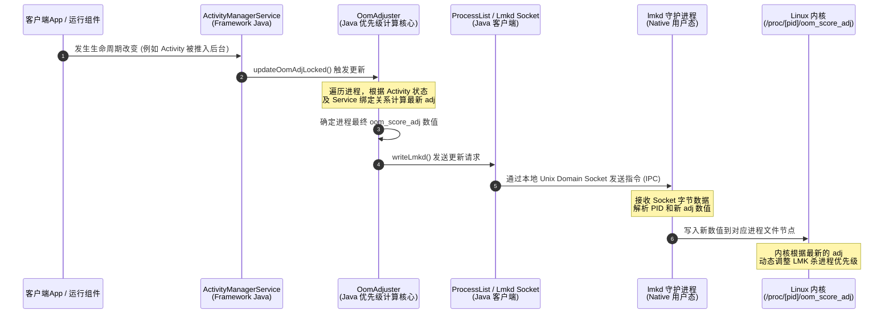

# 5.2.2.2 进程管理与 LMK 机制

在移动设备中，物理内存（RAM）是非常稀缺的资源。与桌面操作系统（如 Windows 或 Linux 桌面版）由用户主动关闭程序、并在内存不足时依赖庞大的交换分区（Swap Space）不同，Android 采用了一种**“以生命周期换流畅度”**的设计哲学。

在 Android 系统中，应用进程的生命周期并不是由应用自身完全控制的，而是由系统根据当前的内存压力和用户的交互状态进行动态管理的。为了在保障前台用户体验的同时，尽可能保留后台进程以实现快速热启动，Android 引入了一套高度精细化的进程管理与回收体系。

本篇文档将深入探讨 Android 的进程分类与优先级动态更新机制、底层的 Low Memory Killer（LMK）工作原理、以及后台保活技术的演进历史与现代 Android 的正确后台任务实践。

---

## 1. 核心概念与宏观定位

### 1.1 Android 进程模型的设计哲学
传统的 Linux 操作系统中，进程是资源分配和调度的基本单位，进程的启动和退出通常与应用程序的运行周期完全同步。但在 Android 中，这一概念被弱化。Android 将“应用进程”与“应用组件”进行了解耦：
*   **进程是组件的容器**：用户启动应用时，系统会为该应用创建一个进程（通常是由 Zygote 进程 fork 出来的）。但应用进程的存活，并不意味着用户正在使用它。
*   **生命周期由系统代管**：当用户退出应用（例如按下 Home 键）后，应用的进程并不会立刻被杀死。Android 会尽可能将其保留在内存中。当用户再次打开该应用时，可以直接从内存中恢复，避免重新执行类加载、Application 初始化等耗时操作，从而实现“热启动”。
*   **内存不足时的强退机制**：当系统内存紧张时，Android 的 Low Memory Killer (LMK) 机制会根据**进程优先级**从低到高的顺序，强杀后台不活跃的进程，以释放物理内存供给前台进程使用。

### 1.2 Linux OOM 机制与 Android LMK 的定位
Linux 内核空间本身自带一套 OOM (Out Of Memory) Killer 机制。当内核分配物理内存失败（发生 Page Allocation Failure）时，会调用 `out_of_memory()` 函数，利用启发式算法计算每个进程的“坏人得分”（badness score），然后杀掉得分最高的进程。

然而，Linux 原生的 OOM Killer 对于移动设备来说存在严重的局限性：
1.  **触发时机过晚**：Linux OOM Killer 只有在物理内存几乎被完全耗尽、系统极度卡顿甚至假死时才会触发。这在极其注重实时交互流畅度的手机上是不可接受的。
2.  **杀进程决策粗暴**：Linux 内核无法感知哪些进程是用户当前正在使用的（前台 Activity、正在放歌的音乐播放器），哪些是完全无感知且可以被牺牲的后台缓存。它极易误杀重要的前台服务，导致糟糕的用户体验。

因此，Android 自诞生之初就在 Linux 内核空间设计了 **Low Memory Killer (LMK)**。它的核心定位是：**在内存发生极度短缺之前，根据进程的“重要程度”（即优先级，体现为 `oom_score_adj`），从低到高主动、分级查杀进程，防患于未然，始终确保前台进程能够获得足够的物理内存。**

---

## 2. 进程分类与 oom_score_adj 动态更新

在 Android 中，系统衡量一个进程重要程度的标准是其内部正在运行的组件状态。随着用户在屏幕上的交互操作，这些组件的生命周期会发生实时流转，AMS（ActivityManagerService）会动态更新进程的优先级分段数值，并写入 Linux 内核中对应的进程节点。

### 2.1 进程优先级的五大传统分类
在官方文档的早期定义中，进程被划分为五个优先级。虽然在现代 Android 系统内部，这些优先级已经完全转化为更细粒度的 `oom_score_adj` 数值控制，但其核心分类逻辑依然成立：

```
+-----------------------------------------------------------------------+
|  前台进程 (Foreground Process)  [oom_score_adj = 0]                     |
|  - 处于 Resume 状态的 Activity                                        |
|  - 绑定了前台 Service 的进程                                           |
+-----------------------------------+-+---------------------------------+
                                    | |
+-----------------------------------v v---------------------------------+
|  可见进程 (Visible Process)     [oom_score_adj = 100/200]             |
|  - 处于 Pause 状态但可见的 Activity (如弹窗底部的 Activity)           |
|  - 绑定到可见 Activity 的 Service                                      |
+-----------------------------------+-+---------------------------------+
                                    | |
+-----------------------------------v v---------------------------------+
|  服务进程 (Service Process)     [oom_score_adj = 500]                 |
|  - 正在运行后台 Service (如执行数据同步) 的进程                       |
+-----------------------------------+-+---------------------------------+
                                    | |
+-----------------------------------v v---------------------------------+
|  后台缓存进程 (Cached Process)    [oom_score_adj = 900~999]             |
|  - 处于 Stop 状态不可见的 Activity (被放入 LRU 缓存队列中)             |
+-----------------------------------+-+---------------------------------+
                                    | |
+-----------------------------------v v---------------------------------+
|  空进程 (Empty Process)         [oom_score_adj = 1000]                |
|  - 不包含任何活跃组件的进程                                           |
+-----------------------------------------------------------------------+
```

1.  **前台进程 (Foreground Process)**：
    用户当前操作所必需的进程。如果一个进程满足以下任一条件，即被视为前台进程：
    *   托管用户正在交互的 `Activity`（已调用 `onResume()`）。
    *   托管一个绑定到正在交互的 `Activity` 的 `Service`。
    *   托管一个正在“前台”运行的 `Service`（调用了 `startForeground()`）。
    *   托管一个正在执行生命周期回调的 `Service`（如 `onCreate()`、`onStartCommand()` 或 `onDestroy()`）。
    *   托管一个正在执行 `BroadcastReceiver.onReceive()` 的进程。
2.  **可见进程 (Visible Process)**：
    没有任何前台组件，但仍会影响用户在屏幕上所见内容的进程。
    *   托管处于已暂停状态（已调用 `onPause()`）但仍然可见的 `Activity`。例如，前台 Activity 弹出了一个非全屏的 Dialog 或半透明 Activity，底部的 Activity 就属于可见进程。
    *   托管一个通过 `Context.bindService()` 绑定到可见（或前台）Activity 的 `Service`。
3.  **服务进程 (Service Process)**：
    正在运行已通过 `startService()` 启动的 `Service`，且不属于上述两个更高级别的进程。例如在后台播放背景音乐、下载文件或上传同步数据的进程。
4.  **后台缓存进程 (Cached/Background Process)**：
    托管当前对用户不可见的 `Activity`（已调用 `onStop()`）。这些进程对用户体验没有直接影响，系统可以随时杀死它们以回收内存。系统将这些进程保存在一个 LRU（最近最少使用）列表中，优先杀死很久未被使用的进程。
5.  **空进程 (Empty Process)**：
    不含任何活动应用组件的进程。保留此类进程的唯一目的是用作缓存，以缩短下次在其中运行组件所需的启动时间。系统会优先杀死此类进程。

### 2.2 oom_score_adj 的数值分段与含义
在 Linux 内核中，每个进程都有一个对应的 `oom_score_adj` 文件，路径为 `/proc/[pid]/oom_score_adj`。其数值范围为 **`-1000` 到 `1000`**。
*   **`-1000` (SYSTEM_ADJ / NATIVE_ADJ)**：表示该进程极其重要，绝对不能被杀掉（例如系统核心 Init 进程、SystemServer 进程）。
*   **`1000` (UNKNOWN_ADJ)**：表示该进程是不受管辖的，或者是一个空进程，随时可以被杀死。
*   数值越小，进程的优先级越高，被 LMK 杀死的概率越低；数值越大，越容易被杀死。

Android 源码（`com.android.server.am.ProcessList`）中定义了一系列标准的 adj 数值常量，随着系统的演进，这些数值在不同 Android 版本中可能存在细微差别（例如高版本将部分 adj 合并或重新分配），但其主要分段如下：

| 级别常量 (AOSP ProcessList) | 现代数值 | 核心场景描述 |
| :--- | :--- | :--- |
| `UNKNOWN_ADJ` | 1001 | 未知状态进程，或即将被清理的无效进程。 |
| `CACHED_APP_MAX_ADJ` | 999 | 后台缓存进程的最大（最易杀）adj 值。 |
| `CACHED_APP_MIN_ADJ` | 900 | 后台缓存进程的最小 adj 值，属于 LRU 缓存队列的头部。 |
| `SERVICE_B_ADJ` | 800 | 运行时间较长的后台 Service 进程，或者是系统判定不太重要的次要服务。 |
| `PREVIOUS_APP_ADJ` | 700 | 用户前一个使用的 App。用于在两个 App 频繁切换时，防止前一个 App 被轻易杀死。 |
| `HOME_APP_ADJ` | 600 | 桌面 Launcher 进程。如果桌面被杀，用户返回时会感知到明显的“闪退重新加载”。 |
| `SERVICE_ADJ` | 500 | 常规后台 Service 进程。 |
| `HEAVY_WEIGHT_APP_ADJ` | 400 | 重量级后台应用进程，这类应用耗费大量内存，系统尽量避免频繁重建。 |
| `BACKUP_APP_ADJ` | 300 | 正在执行备份/恢复操作的进程。 |
| `PERCEPTIBLE_APP_ADJ` | 200 | 用户可感知的后台进程。例如正在后台播放音乐的 Service，或者正在进行前台定位的进程。 |
| `VISIBLE_APP_ADJ` | 100 | 用户可见但不可操作的 Activity 所在进程。 |
| `FOREGROUND_APP_ADJ` | 0 | 正在与用户交互的前台应用进程。 |
| `PERSISTENT_SERVICE_ADJ`| -800 | 系统常驻服务进程，如电话服务（Phone）、蓝牙服务。 |
| `SYSTEM_ADJ` | -900 | SystemServer 进程，是 Android Framework 的核心载体。 |

### 2.3 AMS 对 oom_score_adj 的动态计算与更新流程
AMS 内部有一个专门负责优先级计算和调整的组件：`OomAdjuster`。每当系统状态发生改变时，AMS 都会触发一次全局或局部的优先级调整。

#### 1. 触发时机
*   **组件生命周期切换**：Activity 经历 `onResume()`、`onPause()`、`onStop()` 等流转；Service 启动或销毁；BroadcastReceiver 开始或结束执行。
*   **组件绑定状态改变**：应用通过 `bindService()` 与其他进程的服务建立连接，或者解除绑定。
*   **ContentProvider 访问**：一个进程正在访问另一个进程提供的 ContentProvider。
*   **前台与后台进程切换**：用户通过多任务键切换前台 App。
*   **锁屏/开屏**：设备的亮灭屏状态改变会影响可见进程的判定。

#### 2. AMS 动态更新 adj 的核心逻辑（`OomAdjuster.java`）
当触发调整时，`OomAdjuster` 会执行如下核心逻辑：
1.  **遍历所有进程**：根据 LRU 列表从后往前遍历所有活跃的 App 进程。
2.  **初始化基础优先级**：首先根据进程中是否存在 Activity 以及 Activity 的可见性，设定一个基础的 `adj` 和 `procState`。
3.  **分析 Service 的依赖传递（关键）**：
    *   如果一个 Service 正在运行，它的 adj 默认为 `SERVICE_ADJ` (500) 或 `SERVICE_B_ADJ` (800)。
    *   但如果该 Service 被另一个 adj 值更低的进程（比如前台 App 进程 A，adj = 0）通过 `bindService` 绑定了，那么 AMS 会根据绑定时传入的 **`Context.BIND_*` flags** 进行优先级传导：
        *   `BIND_ABOVE_CLIENT`：使服务进程的 adj 比客户端进程还要低（更重要）。
        *   `BIND_IMPORTANT`：将服务进程标记为对客户端非常重要，通常会提升至与客户端相同的 adj。
        *   `BIND_WAIVE_PRIORITY`：不进行优先级传导，服务端仍维持原样。
        *   如果没有这些 flag，默认情况下，服务端进程的 adj 会被提升至与客户端进程相近的水平（例如提升到 `VISIBLE_APP_ADJ` 或 `PERCEPTIBLE_APP_ADJ`），以防止服务端被杀导致客户端功能崩溃。
4.  **分析 ContentProvider 的依赖传递**：类似于 Service，如果有高优先级的客户端进程正在连接该进程的 ContentProvider，该进程的 adj 也会被相应提升。
5.  **限幅与写入**：计算完成后，限制 adj 的范围在 `[-1000, 1000]` 之间。如果计算出的 adj 发生变化，AMS 会通过底层的 IPC（在现代系统是通过 Socket 向本地守护进程 `lmkd` 发送指令），由 `lmkd` 写入 `/proc/[pid]/oom_score_adj` 文件。

我们可以用以下时序图来形象地展示 AMS 调整并写入 `oom_score_adj` 的全过程：



---

## 3. 底层的杀进程机制：Low Memory Killer (LMK)

有了 AMS 在应用层动态维护的 `oom_score_adj` 数值，底层的 LMK 机制就可以在物理内存紧张时，根据这些数值精准地实施清理。

### 3.1 LMK 的核心运行逻辑：水位线（minfree）与阈值（minadj）
LMK 的核心工作基于两组核心参数：**水位线（`minfree`）** 与 **优先级阈值（`minadj`）**。
这两组参数在系统初始化时被配置，它们是一一对应的数组关系。

在早期的 Android 内核中，这两个参数通过如下 SYS 节点暴露给用户空间：
*   `/sys/module/lowmemorykiller/parameters/minfree`：保存物理剩余内存页数的水位线值。
*   `/sys/module/lowmemorykiller/parameters/minadj`：保存与水位线一一对应的 `oom_score_adj` 阈值。

#### 水位线与 adj 阈值的工作原理
假设系统配置的水位线和 adj 对应关系如下（数值仅为示意说明）：

| 序号 | 物理剩余内存水位线（minfree 页面数换算） | 对应可被杀的 adj 阈值（minadj） |
| :---: | :--- | :--- |
| 1 | 300 MB | 900 (Cached Process) |
| 2 | 200 MB | 500 (Service Process) |
| 3 | 150 MB | 200 (Perceptible Process) |
| 4 | 100 MB | 100 (Visible Process) |
| 5 | 80 MB | 0 (Foreground Process) |

**杀进程判定流程：**
1.  **内核监测**：LMK 驱动会定期或者在内存分配时监控当前系统剩余的可用物理内存。
2.  **匹配区间**：当发现剩余可用物理内存下跌时，LMK 会查找它穿过了哪一级水位线。
    *   例如：当前剩余内存下降到了 **180 MB**。
    *   对比表格，180 MB 介于 150 MB 和 200 MB 之间。这就触发了第 2 级水位线（200 MB 限制）。
3.  **执行强杀**：LMK 会遍历所有进程，寻找所有 **`oom_score_adj >= 500`** 的进程，然后挑选其中 adj 最大、且占用物理内存最多的进程，向其发送 **`SIGKILL` (信号 9)** 强行杀死。
4.  **循环释放**：如果杀死一个进程后内存仍低于 200 MB，LMK 会继续杀死下一个符合条件的进程，直到剩余可用内存回升到水位线以上。

```mermaid
flowchart TD
    A([开始内存分配 / 定期监测]) --> B{当前可用内存 < minfree 水位线?}
    B -- 否 --> A
    B -- 是 --> C[确定触发的水位线级别]
    C --> D[获取对应的 minadj 阈值]
    D --> E[遍历所有进程, 筛选 oom_score_adj >= minadj 且存活的进程]
    E --> F{是否找到符合条件的进程?}
    F -- 否 --> G[抛出内核级 OOM 或直接拒绝分配]
    F -- 是 --> H[选择其中 adj 数值最大且内存占用较多的进程]
    H --> I[向目标进程发送 SIGKILL (信号 9)]
    I --> J[等待内存释放并重新评估可用内存]
    J --> B
```

### 3.2 LMK 在现代系统的演进：从内核驱动到用户态 `lmkd`
在 Android 9.0 之前，LMK 主要是作为一个**内核驱动**运行在内核空间的。然而，这种设计带来了一些不可忽视的问题：
*   **代码难以维护与定制**：把如此复杂的应用级回收逻辑写在 Linux 内核驱动中，会导致内核代码臃肿。由于手机厂商定制系统需要差异化的内存管理策略，修改内核驱动的成本极高。
*   **无法直接与用户态交互**：内核空间难以直接获取应用层的复杂逻辑（例如是否属于用户正在高频使用的应用、是否属于卡死应用等）。

为了解决这些痛点，Android 9 引入并推广了**用户态 LMK 守护进程 —— `lmkd` (Low Memory Killer Daemon)**。在现代 Android（Android 10+ 进一步完善）中，内核驱动版的 LMK 已被废弃，完全由用户态的 `lmkd` 进程来主导内存回收。

#### 用户态 `lmkd` 的核心技术：PSI 机制
用户态进程如果只是通过不断轮询系统剩余内存，效率会极低，且无法做到毫秒级响应。为此，现代 Linux 内核引入了 **PSI (Pressure Stall Information，压力失速信息)** 机制。
*   **什么是 PSI**：PSI 是内核向用户空间提供的一种度量系统由于资源（CPU、内存、I/O）不足而导致锁死/停顿时间的接口。通过 PSI，用户态进程可以得知系统在过去 10s、60s、300s 内，有多少比例的 CPU 线程或内存分配请求处于等待（Stall）状态。
*   **`lmkd` 的事件监听**：`lmkd` 启动后，会使用 `epoll` 机制监听内核的 `/proc/pressure/memory` 节点。当物理内存分配发生延迟、系统产生“内存压力事件”时，内核会立刻唤醒阻塞在 `epoll` 上的 `lmkd` 进程。
*   **决策与执行**：被唤醒的 `lmkd` 会根据当前的内存压力档位（`low`、`medium`、`critical`），快速计算出需要杀死的 adj 级别，并向对应进程发送 `SIGKILL`。

通过这种“内核提供压力通知，用户态执行查杀决策”的模式，Android 实现了回收策略与内核的解耦，厂商可以在 `lmkd` 中加入更加丰富多样的杀进程逻辑（例如：结合机器学习预测下一个被杀的 App，或者引入“冰冻机制”限制后台 CPU 消耗）。关于系统整体机制的演进历程，可以参考 [AndroidVersionChangeLog.md](../../../../../AndroidVersionChangeLog.md)。

---

## 4. 保活斗争演进与最佳姿势

由于 Android 的 LMK 机制会无情地杀死后台进程，对于许多依赖后台长连接、实时数据轮询或定时任务的 App（如即时通讯、消息推送、运动轨迹记录等）来说，如何“保活”（避免被系统杀死，或者被杀后能自动拉起）成为了开发者与 Android系统之间长达数年的“猫鼠游戏”。

### 4.1 历史流氓保活手段及其失效原理

#### 1. 一像素 Activity 保活
*   **手段描述**：监听屏幕亮灭屏广播。当屏幕熄灭（Lock Screen）时，在后台启动一个 1 像素大小的透明 Activity，将进程强行提升至**前台进程**（`adj = 0`）；当屏幕点亮时，将该 Activity 销毁。
*   **失效原理**：Android 8.0 引入了后台启动限制，禁止后台进程在无用户感知的情况下启动 Activity。同时，现代 Android 系统的任务管理器会检测无界面或极小界面的异常 Activity，直接将其判定为恶意行为并进行查杀。

#### 2. 静态广播相互拉起（全家桶关联启动）
*   **手段描述**：在 `AndroidManifest.xml` 中静态注册大量系统广播（如 `BOOT_COMPLETED` 开机广播、网络状态变化、电量改变、SD卡挂载等）。只要系统状态改变，进程就会被拉起。此外，同厂商的 App（如“某大厂全家桶”）在运行期间会通过 Service 相互绑定，拉起彼此已被杀死的进程。
*   **失效原理**：
    *   **静态广播限制**：[Android 8.0](../../../../../AndroidVersionChangeLog.md#android-80-api-26---oreo) 大幅削减了静态广播的注册权限，绝大多数系统广播都无法再通过静态方式接收。
    *   **自启动与关联启动拦截**：国内各大手机厂商的定制 ROM（如 MIUI、EMUI、Flyme 等）加入了严格的自启动管理和关联启动拦截。非用户主动允许，App 根本无法被广播或同盟 App 拉起。

#### 3. Native 进程 fork 双守护
*   **手段描述**：在 Java 层通过 JNI 调用 C/C++ 代码，利用 Linux 的 `fork()` 函数创建一个子进程（脱离 JVM 管辖）。Java 进程与 Native 进程互为守护，一旦发现对方被杀死，立刻通过 `am startservice` 或底层的 IPC 重新拉起对方。
*   **失效原理**：
    *   **cgroup 限制**：[Android 5.0](../../../../../AndroidVersionChangeLog.md#android-50-api-21---lollipop) 之后，系统杀进程不再只杀 PID，而是将该应用所创建的所有子进程划归到同一个 **Linux cgroup（进程控制组）** 中。当 AMS 执行杀进程时，会向该 cgroup 内的所有进程发送 `SIGKILL`。Native 守护进程会与 Java 进程一并被强杀，无一幸免。
    *   **SELinux 策略收紧**：高版本 Android 的 SELinux 策略禁止 Native 进程随意执行 `am` 命令行工具来拉起 Java 组件。

#### 4. 前台服务伪装（如隐藏通知栏漏洞）
*   **手段描述**：
    *   在 Android 4.3 之前，调用 `startForeground(ID, new Notification())` 传入一个空的 Notification，即可让进程拥有前台 adj 且不在通知栏显示任何图标。
    *   在 Android 4.3 至 7.0 之间，利用双 Service 共享同一个 Notification ID 的漏洞，可以让其中一个 Service 开启前台并立刻 stop，从而在通知栏不显示的情况下获得前台优先级。
*   **失效原理**：Android 8.0 彻底封堵了此类漏洞，任何前台服务必须绑定一个有效的通知通道（Notification Channel），且系统会在通知栏强制显示“XX 正在后台运行”的系统级通知，接受用户的强监督。

### 4.2 现代系统的打压组合拳
现代 Android 系统通过一整套系统级的耗电和资源管理策略，彻底终结了各类流氓保活：
1.  **应用待机分组 (App Standby Buckets)**：
    系统根据应用的使用频率和时间，将应用分为 `Active` (活跃)、`Working Set` (工作集)、`Frequent` (常用)、`Rare` (极少使用) 和 `Restricted` (受限) 等桶。处于 `Rare` 或 `Restricted` 桶的应用，其后台执行任务的频率、警报（Alarm）的触发将被系统大幅削减或延迟。
2.  **Doze Mode (低电耗模式)**：
    当设备未充电、屏幕熄灭且静止一段时间后，系统会进入 Doze 模式。在 Doze 模式下，系统会暂停所有应用的 Network 访问，忽略 WakeLock，延迟 Alarm、JobScheduler 以及同步任务的执行。系统仅在极短的“维护窗口（Maintenance Window）”内统一放开限制处理积压的任务。
3.  **应用冷冻与墓碑机制 (Cached Freeze)**：
    在 Android 11+ 系统中，当应用进程被判定为 `Cached`（缓存后台）后，系统会利用 Linux 内核的 `cgroup v2` 冻结器（Freezer）将该进程**完全冻结**。被冻结的进程将无法获得任何 CPU 时间片，其内部的所有线程（包括 Native 线程）全部暂停执行。这使得应用在后台根本无法执行任何轮询或保活代码。
4.  **厂商 ROM 的“一刀切”清理**：
    国内 ROM 普遍配备了自研的“电池管家”和“后台清理助手”。用户一键清理后台、或者锁屏一段时间后，ROM 会直接通过底层的 `forceStopPackage()` 彻底杀死应用进程并清除其所有待执行的任务、闹钟及广播。这种状态下，除非用户重新点击图标启动，否则任何保活手段均无法令其复活。

---

## 5. 现代 Android 的正确后台任务实践

面对极其严苛的系统限制，开发者必须放弃传统的“保活”执念，转向符合 Android 设计规范的正确后台任务处理方式。

### 5.1 场景一：用户可直接感知的实时长连接（如音乐播放、导航、录音）
对于这类如果进程中断会直接打断用户体验的场景，应当使用合规的**前台服务 (Foreground Service)**。

*   **实现要点**：
    1.  在 `AndroidManifest.xml` 中声明前台服务权限，并从 Android 10/14 开始，必须显式声明具体的 `foregroundServiceType`。例如：
        ```xml
        <service
            android:name=".MusicService"
            android:foregroundServiceType="mediaPlayback"
            android:exported="false" />
        ```
    2.  启动服务后，必须在 `onStartCommand` 中尽快（通常在几秒内，否则会触发 ANR / Crash）构建 `Notification` 并调用 `startForeground`：
        ```java
        Notification notification = new NotificationCompat.Builder(this, CHANNEL_ID)
                .setContentTitle("正在播放音乐")
                .setContentText("点击返回应用")
                .setSmallIcon(R.drawable.ic_music)
                .build();
        startForeground(NOTIFICATION_ID, notification);
        ```
*   **优缺点分析**：该方案能稳定地将进程 adj 维持在 `PERCEPTIBLE_APP_ADJ` 级别，极大降低被 LMK 杀死的概率。但缺点是会强制显示通知栏图标，且必须向系统声明合理的使用类型，接受系统的规范审计。

### 5.2 场景二：可延迟的、周期性的、受约束的后台任务（如日志上传、数据库同步、定期缓存更新）
对于这类不需要实时性、但在特定条件下必须完成的后台任务，应当使用 **WorkManager**。

*   **WorkManager 的核心优势**：
    *   **智能调度**：它会根据开发者设定的约束条件（Constraints，如：必须连接 Wi-Fi、必须在充电状态、设备必须处于空闲状态等）智能决定何时执行任务。
    *   **向后兼容**：它能自动适配不同版本的 Android 系统。在高版本使用 `JobScheduler`，在低版本回退到 `AlarmManager` + `BroadcastReceiver`。
    *   **保证执行**：即使应用进程被杀，甚至设备重启，WorkManager 也会通过 SQLite 数据库持久化任务信息，在条件满足时由系统服务拉起应用执行任务。
    *   **支持 Doze 模式**：完全符合 Google 官方的电池优化规范。

*   **实现示例**：
    ```kotlin
    // 1. 定义具体的后台 Work
    class LogUploadWorker(context: Context, params: WorkerParameters) : CoroutineWorker(context, params) {
        override suspend fun doWork(): Result {
            return try {
                uploadLogs() // 执行耗时上传任务
                Result.success()
            } catch (e: Exception) {
                Result.retry() // 失败自动重试
            }
        }
    }

    // 2. 配置约束条件
    val constraints = Constraints.Builder()
            .setRequiredNetworkType(NetworkType.UNMETERED) // 仅限 Wi-Fi
            .setRequiresCharging(true)                  // 必须在充电时
            .build()

    // 3. 构建周期性 WorkRequest
    val uploadWorkRequest = PeriodicWorkRequestBuilder<LogUploadWorker>(24, TimeUnit.HOURS)
            .setConstraints(constraints)
            .build()

    // 4. 加入队列
    WorkManager.getInstance(context).enqueueUniquePeriodicWork(
            "UniqueUploadWorkName",
            ExistingPeriodicWorkPolicy.KEEP,
            uploadWorkRequest
    )
    ```

### 5.3 场景三：即时消息与推送（如即时通讯 App 的消息接收）
对于需要像微信、QQ 一样实时接收后台消息的应用，在现代 Android 尤其是国内生态中，**千万不要尝试自己在后台维持一个 TCP 长连接**。即使进程通过各种手段存活，在墓碑机制下，你的 TCP Socket 也会因为进程冻结而无法收发数据。

*   **现代最佳实践：厂商系统级推送通道**
    *   **基本原理**：手机系统本身（如小米、华为、OPPO、VIVO 等）会在后台维持一条系统级、由系统框架托管的长连接。所有 App 的推送消息都通过这条系统长连接统一分发。
    *   **拉起逻辑**：当有人向你发送消息时，消息通过服务器推送到厂商的推送系统，再通过手机系统长连接下发给手机上的系统推送组件。系统推送组件在通知栏展示一条通知消息，当用户点击该通知时，系统拉起你的 App 进程，让用户阅读消息。
    *   **集成方案**：在海外集成 Google 的 FCM (Firebase Cloud Messaging)；在国内集成各手机厂商的专属推送 SDK（如小米推送、华为推送、OPPO 推送等），或使用集成了各大厂商通道的第三方聚合推送平台（如极光推送、个推等）。这样可以在应用彻底不占用后台物理内存的情况下，依然做到消息的精准触达。

---

## 6. 总结

Android 的进程管理是一套精妙平衡的闭环系统。
*   AMS 通过 `OomAdjuster` 敏锐地洞察用户组件生命周期和绑定关系的变化，为进程定下公平的 `oom_score_adj`。
*   底层的 LMK（在现代演化为用户态的 `lmkd` 配合 PSI）作为冷酷的执行者，实时监控物理内存水位，通过分级强杀（`SIGKILL`）维持系统的生命线。
*   保活的猫鼠游戏早已落幕，后台执行限制、应用冷冻、Doze 模式以及厂商 ROM 的严苛策略宣告了流氓保活的终结。

开发者应当顺应 Android 系统的设计方向，合规地使用前台服务（Foreground Service）、利用智能调度的 WorkManager、以及接入厂商系统级推送，实现对系统友好、对用户省电、且任务稳定可靠的最佳后台实践。
