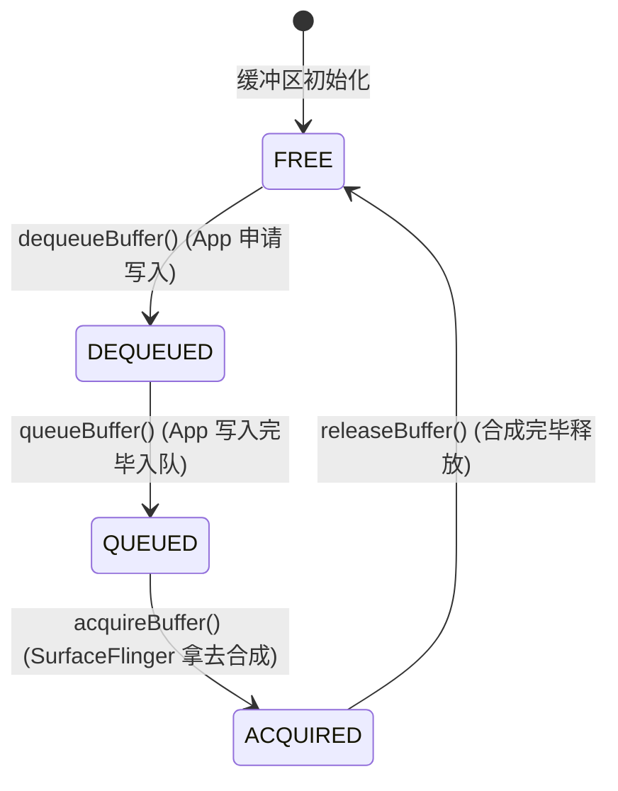

# View 体系与渲染管线宏观架构

在 Android 应用开发与性能调优的知识版图中，“View 体系与渲染管线”是承上启下的核心部分。无论是实现精美复杂的自定义控件，还是解决棘手的界面卡顿与掉帧（Jank）问题，都需要开发者对 View 树的组织结构、窗口管理服务、操作系统级渲染管线、GPU 硬件加速以及底层缓冲同步机制有极其深刻和结构化的理解。

本篇作为该主题的总纲，将高屋建瓴地梳理 Android 视图体系与渲染管线的宏观架构，理清各核心组件的协作关系与数据流向。对于流程中的具体实现细节与关键节点，本篇将通过相对链接的形式导向相应的专项分析文档，包括：
* [requestLayout 触发与执行机制](./5.2.3.1.requestLayout.md)
* [invalidate 局部重绘机制](./5.2.3.2.invalidate.md)
* [屏幕刷新与 VSync 机制](./5.2.3.3.屏幕刷新机制.md)
* [Surface 与 BufferQueue 底层原理](./5.2.3.4.Surface.md)

---

## 1. Android View 体系的宏观架构

### 1.1 View 与 ViewGroup：树形结构的组合模式设计
从面向对象设计的角度来看，Android 的视图系统是典型的**组合模式（Composite Pattern）**实践。

```
          +------------------+
          |       View       | <-----------------------+
          +------------------+                         |
            ^              ^                           |
            |              | (继承)                     |
    +-------+-----+  +-----+------------+              |
    |  Leaf Views |  |    ViewGroup     |              |
    | (TextView等) |  +-----------------+              |
    +-------------+  | - mChildren[]    | -------------+ (持有子 View 树)
                     +------------------+
```

#### 1. 组合模式的角色定位
*   **View（抽象构件/叶子节点）**：它是所有 UI 控件的基类，代表屏幕上的一个矩形区域。它定义了视图在空间布局、事件处理、视觉重绘上的通用协议。View 作为叶子节点，没有子节点，负责执行具体的渲染动作（如绘制文字、位图、线条）并直接响应触控事件。它内部维护了大量的状态变量，例如可见性（`mViewFlags` 中的 `VISIBLE`/`INVISIBLE`/`GONE`）、绘制标记（`mPrivateFlags` 中的 `PFLAG_DIRTY`/`PFLAG_DRAWN`）、测量数据（`mMeasuredWidth`/`mMeasuredHeight`）以及坐标边界（`mLeft`/`mTop`/`mRight`/`mBottom`）。
*   **ViewGroup（容器构件/分支节点）**：它继承自 `View`，并在内部维护了一个 `View[]` 类型的数组 `mChildren`，用来存储和管理子视图。ViewGroup 既是容器，又是一个 View。它必须协调其子 View 的大小与排版，这通过在其内部定义布局协议（例如 `LayoutParams` 的派生）以及重写 `onMeasure()` 和 `onLayout()` 来实现。

#### 2. 递归遍历的算法设计
组合模式带来的最大运行时优势是**遍历的统一性**。View 树本质上是一个有向无环的树状结构。所有的核心操作都遵循深度优先搜索（DFS）的算法进行递归传递：
*   **测量阶段**：`measure()` 发起后，ViewGroup 内部根据其特有的布局算法，遍历所有子 View 并调用它们的 `measure()`，直到叶子 View 计算出自身尺寸，然后 ViewGroup 根据子 View 的大小算出自身的尺寸并回传给父容器。
*   **布局阶段**：`layout()` 发起后，ViewGroup 确定自身边界后，调用 `onLayout()` 遍历子 View，计算每个子 View 的物理坐标偏移量并调用子 View 的 `layout()`，完成整棵树的排版定位。
*   **绘制阶段**：`draw()` 发起后，View 绘制完自身背景和内容后，如果是 ViewGroup，会触发 `dispatchDraw()`，遍历所有子 View 调用 `drawChild()`。每个子 View 再次录制自身的 DisplayList 指令，直到所有节点绘制指令被收集完毕。
*   **事件分发阶段**：当触摸事件产生时，ViewGroup 的 `dispatchTouchEvent()` 会首先判断是否需要拦截。若不拦截，则会遍历子 View，根据子 View 的坐标区域和 Z-Order 顺序，递归调用子 View 的 `dispatchTouchEvent()`，直至找到最终消费该事件的叶子 View；若无子 View 消费，事件将回溯向上传递给父容器的 `onTouchEvent()`。

#### 3. LayoutParams 协议与类型校验机制
子 View 无法决定自己挂载到父容器时的最终行为，它必须向父容器提供一份“意向书”，这就是 `ViewGroup.LayoutParams`。
*   **协议载体**：`LayoutParams` 包含了子 View 期望的宽度（`layout_width`）、高度（`layout_height`）以及边距（`MarginLayoutParams`）。
*   **类型绑定与安全性校验**：不同的 ViewGroup 子类（如 `LinearLayout`、`RelativeLayout`）拥有各自独特的 `LayoutParams` 子类（如 `LinearLayout.LayoutParams` 携带了 `weight` 属性，`RelativeLayout.LayoutParams` 携带了 `alignParentLeft` 等相对约束属性）。
*   当一个子 View 被添加到父容器时（`addView()`），父容器会通过 `checkLayoutParams(ViewGroup.LayoutParams p)` 检查传入的参数是否符合当前容器类型。如果不匹配（例如把一个 `RelativeLayout.LayoutParams` 传入给 `LinearLayout`），父容器会调用 `generateLayoutParams(ViewGroup.LayoutParams p)` 将其安全地转换为当前容器所兼容的默认 `LayoutParams` 实例，以防止在后续的测量和布局阶段发生强转崩溃（ClassCastException）。

---

### 1.2 UI 窗口的层次管理：Window, PhoneWindow, DecorView, ViewRootImpl 与 WMS

在 Android 操作系统中，Activity 的代码虽然是我们编写的核心逻辑，但它并不是图像输出的底座，也不是事件的最终接收者。在其背后，存在着一条从 Application 进程跨越 Binder 边界至 SystemServer 进程的精细协作链。

```
+-----------------------------------------------------------------------------------+
| 进程边界 (App 进程)                                                                |
|                                                                                   |
|  +----------+       +-------------+       +-------------+       +--------------+  |
|  | Activity | ----> | PhoneWindow | ----> |  DecorView  | <---| ViewRootImpl |  |
|  +----------+       +-------------+       +-------------+       +-------+------+  |
|                                                                         |         |
|                                                                         | 持有     |
|                                                                         v         |
|                                                                     +---------+   |
|                                                                     | Surface |   |
|                                                                     +----+----+   |
+--------------------------------------------------------------------------|--------+
                                                                           |
                                                             IWindowSession| (Binder)
                                                                           v
+--------------------------------------------------------------------------|--------+
| 进程边界 (SystemServer 进程)                                              |
|                                                                          v        |
|                                                                     +---------+   |
|                                                                     |   WMS   |   |
|                                                                     +---------+   |
+-----------------------------------------------------------------------------------+
```

#### 1. 概念与角色细分
*   **Window（窗口抽象）**：`Window` 是一个顶级抽象类，它代表了一个可以写入视觉内容并能接收键盘/触控输入事件的独立矩形区域。Window 规定了一系列窗口管理策略（例如设置窗口的背景、标题栏风格、软键盘交互模式等）。Window 并不直接参与 View 的绘制，它更像是一个策略接口，其具体的行为实现全由 `PhoneWindow` 来承载。
*   **PhoneWindow（具体窗口实现）**：`PhoneWindow` 是 `Window` 唯一的系统实现类，主要服务于手机和平板等移动显示设备。PhoneWindow 内部最核心的资产是 `DecorView`。它规定了窗口如何根据当前的主题样式（Theme）生成系统装饰区以及应用内容区。
*   **DecorView（顶层视图根）**：`DecorView` 是窗口 View 树的最顶层节点，它本身是一个 `FrameLayout`。DecorView 承载了系统的视觉骨架：
    *   在一般的带有标题栏和状态栏的主题下，DecorView 内部会包含一个垂直的 `LinearLayout`。
    *   该 `LinearLayout` 内部包含两大部分：一是**系统窗口装饰区**（如状态栏占位区、导航栏占位区、或是 ActionBar 容器）；二是**应用内容区（Content Parent）**，其对应的资源 ID 为 `com.android.internal.R.id.content`。
    *   当我们在 Activity 的 `onCreate` 中调用 `setContentView(layoutId)` 时，`LayoutInflater` 将 XML 布局树解析出来，正是挂载在 `R.id.content` 这个容器之中。
*   **ViewRootImpl（视图控制器与驱动器）**：`ViewRootImpl` 并不继承自 `View`，但它是 `DecorView` 的 `ViewParent`。它是应用进程与 SystemServer 进程交互的核心控制器。它持有一个 Native 层的 `Surface` 对象，管理着与系统服务 `WMS` 交互的 Binder 接口，并在内部调度着 `Choreographer` 接收 VSync 信号，是 View 三大遍历流程和事件分发的真正物理发起者。
*   **WindowManagerService（WMS，窗口管理服务）**：WMS 是 SystemServer 进程中核心的系统级服务。它管理着屏幕上的所有窗口。WMS 负责窗口的 Z-Order 层级关系计算、窗口在屏幕上的绝对大小及偏移定位、窗口入场和出场动画调度、以及将系统全局的物理输入事件路由分发到拥有当前焦点的窗口。

#### 2. 系统窗口层级（Z-Order）物理计算规则
WMS 在调度全局窗口时，会将窗口分为三类以实现层层叠加的物理渲染秩序：
1.  **应用窗口（Application Window）**：例如 Activity 的普通界面，其窗口层级 `TYPE` 在 `1` 到 `99` 之间。
2.  **子窗口（Sub-Window）**：如 Dialog、PopupWindow 等，其 `TYPE` 通常在 `1000` 到 `1999` 之间。子窗口不能脱离父窗口独立存在，WMS 在计算层级时，会自动将其叠加在所属 Activity 窗口之上。
3.  **系统窗口（System Window）**：如状态栏、导航栏、Toast 提示、系统警告悬浮窗等，其 `TYPE` 级别最高，分布在 `2000` 到 `2999` 之间。这保证了状态栏等关键系统 UI 永远不会被应用层 Activity 遮挡。
在进行物理窗口测量时，WMS 侧的 `WindowState.computeFrameLw()` 会结合上述层级、屏幕物理安全区（Safe Insets）进行精密的几何运算，计算出该窗口的物理像素坐标框，最终通过 `IWindow.resized()` 跨进程路由回 App 进程。

#### 3. 系统初始化与挂载流程深度解剖
1.  **Activity 创建与 Window 绑定**：
    当 Activity 启动时，系统通过反射创建 Activity 实例，并在其 `attach()` 方法中，调用 `PolicyManager.makeNewWindow(Context)` 实例化一个 `PhoneWindow` 实例，并与 Activity 完成绑定。
2.  **DecorView 的创建与 setContentView 的源码运作**：
    *   在 Activity 的 `onCreate()` 中调用 `setContentView(R.layout.activity_main)`。
    *   `setContentView` 最终委托给 `PhoneWindow.setContentView()`。
    *   PhoneWindow 检查其内部的 `mContentParent` 是否为 null。若为 null，则调用 `installDecor()` 进行初始化。
    *   在 `installDecor()` 中，首先通过 `generateDecor(-1)` 创建 `DecorView` 实例。接着，调用 `generateLayout(DecorView decor)` 挑选适合当前 Activity 主题风格的窗口布局：
        *   系统会检查当前 Activity 声明的 Window 属性（例如是否有标题栏 `FEATURE_NO_TITLE`，是否是浮动窗口 `FLAG_FLAG_FLOATING`，是否全屏等）。
        *   根据这些配置，从系统的资源文件中选择一个预置的根布局文件（例如 `R.layout.screen_simple`、`R.layout.screen_toolbar` 等）。
        *   调用 `LayoutInflater` 解析该系统布局，将其作为 DecorView 的直接子视图挂载。
        *   从该根布局中，通过 ID `com.android.internal.R.id.content` 找到内容区域的父容器，赋值给 PhoneWindow 的全局变量 `mContentParent`。
    *   最后，`PhoneWindow` 调用 `mLayoutInflater.inflate(layoutId, mContentParent)`，将我们编写的业务布局实例化为 View 树，并正式挂载进 `mContentParent` 容器。
3.  **Activity 的 Resume 与 WindowManagerImpl.addView**：
    *   Activity 经历 `onCreate`、`onStart` 之后，生命周期步入 `onResume` 阶段。
    *   在 `ActivityThread.handleResumeActivity()` 内部，系统执行完 Activity 的 `onResume` 回调后，会调用 `WindowManagerImpl.addView(decorView, layoutParams)`。
    *   `WindowManagerImpl` 并不做实际工作，而是将请求转发给全局单例 `WindowManagerGlobal`。
4.  **ViewRootImpl 诞生与跨进程relayout**：
    *   在 `WindowManagerGlobal.addView()` 内部，创建了一个全新的 `ViewRootImpl` 实例，并通过 `ViewRootImpl.setView(decor, lparams, panelParentView)` 将其与 DecorView 绑定。
    *   在 `ViewRootImpl.setView()` 中，会立刻调用 `requestLayout()` 发起首次测量与布局请求，确保在窗口被 WMS 呈现之前，所有的视图大小和坐标都已计算就绪。
    *   接着，通过 Binder 接口（`IWindowSession`）进行跨进程调用 `mWindowSession.addToDisplayAsUser(...)`。WMS 在接收到该请求后，会在其系统进程中为当前窗口创建 `WindowState` 记录，计算窗口层级，并建立物理输入管道。
    *   随后，在 `performTraversals()` 执行中，`ViewRootImpl` 会通过 `relayoutWindow()` 方法，跨进程请求 WMS 分配一块共享的显示缓冲区底座。WMS 在 Native 层通过 `GraphicBufferProducer` 创建 BufferQueue，并把缓冲区的读写句柄（即 `Surface`）通过 Binder 回传给 App 进程的 `ViewRootImpl`。至此，App 进程正式拥有了向底层写入图像数据的“物理画布”。

#### 5. WMS 侧窗口状态同步与层级判定
WMS 通过在系统进程中维护一个 `WindowState` 数据结构来跟踪这个窗口的全部状态：
*   **物理几何状态控制**：WMS 侧会根据窗口的 `LayoutParams`，结合当前屏幕分辨率以及系统状态栏、导航栏的侵入高度（Insets），计算出窗口在屏幕上的绝对物理位置（`Frame`）。
*   **窗口遮挡与可见性级联变更**：当一个处于最上层的全屏不透明 Activity 窗口被呈现在屏幕上时，WMS 会对位于该窗口下方的所有旧窗口执行计算，判定它们是否被完全遮挡。一旦判定某窗口不再处于可见范围内，WMS 会通过 `IWindow` Binder 通道，向 App 进程发送一个窗口可见性改变信号。App 进程的 `ViewRootImpl` 收到后，会立即在主线程分发 `onWindowVisibilityChanged(GONE)`，并在内部停止不必要的动画和属性刷新。
*   **SurfaceControl 管理**：WMS 并不直接向底层缓冲区写入像素。它内部维护着 `SurfaceControl`。这是一个指向 SurfaceFlinger 中图层（Layer）的指针。当 App 进程的 `ViewRootImpl` 跨进程调用 `relayoutWindow()` 时，WMS 会利用 `SurfaceControl.Transaction` 事务 API 更新当前图层在 SurfaceFlinger 中的 Z-Order、裁剪区域、以及缩放矩阵。

---

### 1.3 ViewRootImpl 的核心地位与工作机制
ViewRootImpl 处于 App 进程与系统服务的交界处，它是所有 View 行为的起点和终点。

#### 1. 输入事件的职责链派发（InputPipeline）
当触摸屏幕时，硬件产生中断信号，被 Native 层的 `InputReader` 读取，并放入 `InputDispatcher` 的队列中。
`InputDispatcher` 查找当前焦点的窗口（由 WMS 提供），通过 `SocketPair` 通信将事件写入该窗口对应的 `InputChannel` 中。
App 进程中的 Looper 监听到该 Socket 的可读事件后，唤醒主线程，触发 `ViewRootImpl.WindowInputEventReceiver#onInputEvent()`。
ViewRootImpl 提取出原始的 `InputEvent`（如 `MotionEvent` 或 `KeyEvent`），并将其输入到一个名为 **`InputStage`（输入流水线）** 的链条中：

```
WindowInputEventReceiver
       |
       v
NativePreImeInputStage  (Native层输入法前拦截)
       |
       v
ViewPreImeInputStage    (View层输入法前拦截)
       |
       v
ImeInputStage           (输入法拦截)
       |
       v
EarlyPostImeInputStage  (分发后早期处理)
       |
       v
NativePostImeInputStage (Native层分发)
       |
       v
ViewPostImeInputStage   (核心: 进入 View 树分发链 -> DecorView.dispatchTouchEvent())
       |
       v
SyntheticInputStage     (合成手势/轨迹球处理)
```

这种链式设计极大地解耦了输入处理的各个阶段。最关键的是 `ViewPostImeInputStage`，它会在其 `onProcess()` 中执行 `mView.dispatchTouchEvent(event)`，从而将事件正式递交给 `DecorView`，开启应用层熟悉的事件分发逻辑。

#### 2. VSync 信号驱动的闭环控制与 Looper 同步屏障 (Sync Barrier)
当应用层发起 `invalidate()` 后，主线程 Looper 并不会立即执行重绘，而是优先在 MessageQueue 中构建同步屏障并注册重绘任务。
*   **同步屏障（Sync Barrier）的本质**：
    为了保障界面的顺畅渲染，Android 必须赋予重绘任务绝对的特权。当 `ViewRootImpl.scheduleTraversals()` 被触发时，它会首先向主线程的 `MessageQueue` 插入一个没有 `target` 属性的特殊 Message，这被称为**同步屏障（Sync Barrier）**。
*   **屏障拦截机制**：
    一旦同步屏障被插入，主线程的 Looper 在读取 MessageQueue 时，会**暂停调度所有普通的同步消息**（如用户的后台业务回调、普通的 Handler 延时任务等），而**仅仅允许异步消息（Asynchronous Message）**通过。
*   **异步调度**：
    随后，`Choreographer` 会在下一个 VSync 信号来临时，向 MessageQueue 发送一个标为“异步”的 VSync 绘制消息。该消息能够突破屏障的拦截，被主线程立刻执行以启动 `performTraversals()`。
*   **移除屏障**：
    当 `performTraversals()` 执行结束后，`ViewRootImpl` 内部会调用 `unscheduleTraversals()` 及时将刚才的同步屏障从 MessageQueue 中移除，此时普通的同步消息方可恢复调度。这一精妙设计完美避免了由于主线程积压大量后台网络回调或业务逻辑导致绘制任务迟迟得不到执行的问题。

#### 3. performTraversals() 核心状态机逻辑
在 `ViewRootImpl` 中，`performTraversals()` 承载了整个界面更新的大型状态机。在其长达近千行的源码中，通过一系列全局布尔变量控制着遍历行为：
*   `mFirst`：代表当前 Window 是否是首次被显示。若为 `true`，系统会强制执行完整的 `performMeasure`、`performLayout` 与 `performDraw`，并且在 relayout 时，通知 WMS 创建底层物理 Canvas。
*   `mLayoutRequested`：由 `requestLayout()` 触发写入。表示 View 树尺寸或者节点结构被修改，状态机必须回调 `performMeasure()` 与 `performLayout()` 对整棵树重新计算排版，否则将无法确定最终布局。
*   `mContentChanged`：由应用窗口内容变更触发，主要用于通知 WMS 更新窗口边界。
*   `mWidth` / `mHeight`：记录上一次测量的窗口宽高。状态机在遍历前会对比这两个值。一旦发生变化（例如由于用户旋转屏幕、开启分屏模式等），系统必须中止当前的绘制，紧急发起一次 `relayoutWindow()` IPC 请求以向 WMS 申请重新调整底盘 Buffer 的大小。

---

## 2. View 的生命周期与测量、布局、绘制三大流程

### 2.1 View 生命周期的完整演进图谱
View 的生命周期并不是孤立的方法执行，它是随着 View 被创建、解析、挂载、测量、重绘以及被销毁等多个物理节点的状态机转移。

```
          +------------------+
          |   Constructor    | (代码创建 / XML反射实例化)
          +------------------+
                   |
                   v
          +------------------+
          | onFinishInflate  | (XML 标签解析挂载完毕)
          +------------------+
                   |
                   v
          +------------------+
          |onAttachedToWindow| (与 Window 物理绑定，AttachInfo 赋值)
          +------------------+
                   |
                   v
          +-------------------------+
          |onWindowVisibilityChanged| (窗口可见性变化 -> VISIBLE)
          +-------------------------+
                   |
                   +<---------------------------------------+ (状态改变，触发重绘)
                   v                                        |
          +------------------+                              |
          |    onMeasure     | (父容器与 LayoutParams 推导)  |
          +------------------+                              |
                   |                                        |
                   v                                        |
          +------------------+                              |
          |  onSizeChanged   | (宽/高测量值发生变化回调)      |
          +------------------+                              |
                   |                                        |
                   v                                        |
          +------------------+                              |
          |     onLayout     | (确定在父容器中的物理坐标)       |
          +------------------+                              |
                   |                                        |
                   v                                        |
          +------------------+                              |
          |      onDraw      | (Canvas 绘制录制指令)         |
          +------------------+                              |
                   |                                        |
                   v                                        |
          +------------------+                              |
          |   dispatchDraw   | (ViewGroup 递归分发子 View)   |
          +------------------+                              |
                   |                                        |
                   v                                        |
          +---------------------+                           |
          |onWindowFocusChanged | (焦点状态回调，此时获取宽高必准)|
                   |                                        |
                   v                                        |
          +---------------------+                           |
          |    onTouchEvent     | (响应触控事件，完成交互)       |
          +---------------------+                           |
                   |                                        |
                   |------------ invalidate / requestLayout -+
                   |
                   v
          +-------------------------+
          |onWindowVisibilityChanged| (窗口被遮挡 / 隐藏 -> GONE)
          +-------------------------+
                   |
                   v
          +------------------+
          |onDetachedFromWindow| (与 Window 解除绑定，彻底清理资源)
          +------------------+
```

#### 核心生命周期方法深度解析
1.  **构造函数族与自定义属性加载**：
    *   `View(Context)`：用于纯代码动态构建视图。
    *   `View(Context, AttributeSet)`：当 View 在 XML 中声明时使用。`AttributeSet` 包含了该 View 节点声明的所有属性键值对。在此阶段，系统会调用 `context.obtainStyledAttributes()` 方法将 XML 中的属性值与自定义属性集 `declare-styleable` 进行合并，解析出最终的 TypedArray，并从 TypedArray 中读取属性配置。
    *   `View(Context, AttributeSet, defStyleAttr)`：第三个参数是默认样式属性。它是一个主题中的属性资源 ID（例如 `R.attr.buttonStyle`），用于在主题中统一定制特定控件的默认风格。
    *   `View(Context, AttributeSet, defStyleAttr, defStyleRes)`：第四个参数是默认样式资源 ID（例如 `R.style.DefaultButtonStyle`），只有当 `defStyleAttr` 传入 0 或者在主题中未找到该属性时，系统才会读取该 Style 作为降级默认属性。有关此部分在 Android 5.0（引入 Material Design）以后的具体加载优先级变更，请参考根目录下的 [AndroidVersionChangeLog.md](../../../../AndroidVersionChangeLog.md)。
2.  **`onFinishInflate()`**：当整个 XML 布局中声明的所有子控件都被反序列化实例化，并且全部被挂载到了父容器中之后，系统会向该父容器发送此回调。这意味着，所有的子 View 此时已经在内存中连接好了。这对于通过 `findViewById` 绑定子控件是绝对安全的。但由于此时尚未与物理 Window 进行绑定，所以此时**无法获取 View 的测量宽高，且调用 requestLayout 也不会有任何效果**。
3.  **`onAttachedToWindow()`**：这是 View 树真正进入显示窗口物理世界的起点。在此回调中，系统将 `ViewRootImpl` 内部维护的全局 `AttachInfo` 赋值给 View 内部的 `mAttachInfo` 变量。
    > [!IMPORTANT]
    > `mAttachInfo` 携带着窗口的核心资产（如关联的全局 Handler，WindowToken 等）。一旦 `mAttachInfo` 为非 null，开发者即可通过 `view.post(Runnable)` 往主线程 Handler 队列中发送未决任务。这些任务能确保在三大流程执行完毕后才会被调度。因此，在此处注册网络监听器、广播监听器，或者开启属性动画是极其安全的。
4.  **`onWindowFocusChanged(boolean hasFocus)`**：当该 View 所在的窗口（Window）获得或失去焦点时，会触发该方法。这是一个非常关键的生命周期时间节点。因为当 `hasFocus` 变为 `true` 时，可以**百分之百确认系统已经至少执行过一次完整的 performTraversals() 流程**。因此，在这里直接调用 `view.getMeasuredWidth()` 或 `view.getWidth()`，得到的数值必定是准确的计算结果。
5.  **`onVisibilityChanged` 与 `onWindowVisibilityChanged` 的核心差异**：
    很多开发者极易混淆这两个回调，导致动画释放或数据暂停时机错误：
    *   `onVisibilityChanged(View changedView, int visibility)`：代表当前 View 或其任何父容器的**布局可见性属性（`setVisibility()`）**发生了改变。例如，把直接父布局从 `VISIBLE` 设为 `GONE`，子视图就会收到此回调。
    *   `onWindowVisibilityChanged(int visibility)`：代表包含此视图的整个**物理窗口（Window）的可见状态**发生了改变。例如，用户按下 Home 键将应用送入后台、手机锁屏、或者另一个全屏的 Activity 强行遮盖了当前界面。此时，即便 View 树上所有控件的布局属性依然是 `VISIBLE`，该方法仍会回调 `GONE`。**这是在自定义控件中暂停 Lottie 动画、挂起 SurfaceView 独立渲染线程以杜绝无意义 CPU 开销的最佳节点**。
6.  **`onDetachedFromWindow()`**：当 View 被从 Window 中移出（例如 Activity 被 destroy、或者调用了 `ViewGroup.removeView()`）时回调。
    > [!CAUTION]
    > **这是防止内存泄漏的最后一道防线**。如果你的 View 在后台持有着 `ValueAnimator`（属性动画）、注册了 EventBus、RxJava 观察者、或者是系统级的 BroadcastReceiver，**必须在这里执行所有的清理注销逻辑**。因为后台动画或静态总线仍持有 View 的引用，如果在此处不释放，会导致整个 View 树以及其关联的 Activity 无法被 GC 回收，产生严重的内存泄漏。

---

### 2.2 核心流程机制

#### 1. Measure (测量阶段)

*   **`MeasureSpec` 二进制编码**：
    为了在海量视图遍历中避免重复分配内存，Android 选用了一个 32 位的 int 值来紧凑编码测量规格：
    ```
    MSB (Most Significant Bit)                                         LSB (Least Significant Bit)
    +----+----+----+----+----+----+----+----+----+----+----+----+----+----+----+----+----+----+----+
    | Mode(2 bits)|                             Size(30 bits)                                    |
    +----+----+----+----+----+----+----+----+----+----+----+----+----+----+----+----+----+----+----+
    ```
    *   **高 2 位 (Mode)**：
        *   `EXACTLY` (`1 << 30`)：精确尺寸。父容器已经计算出子 View 的精确空间（对应具体的 dp 数值，或 `MATCH_PARENT`）。
        *   `AT_MOST` (`2 << 30`)：最大上限限制。子 View 的大小不能超过父容器限制的 `SpecSize`（对应 `WRAP_CONTENT`）。
        *   `UNSPECIFIED` (`0`)：无边界限制。子 View 想要多大就要多大。
    *   **低 30 位 (Size)**：表示在该模式下的约束参考像素尺寸（像素值最大支持为 $2^{30}-1$）。
    *   通过位运算提取 Mode 与 Size：
        ```java
        int mode = measureSpec & ~(0x3 << 30); // 提取 Mode
        int size = measureSpec & (0x3 << 30);  // 提取 Size
        ```

*   **UNSPECIFIED 模式在现实工程中的设计用途**：
    `UNSPECIFIED` 模式常用于系统内部自适应边界的推导：
    *   **RecyclerView 预布局计算**：在 RecyclerView 进行入场/出场动画时，LayoutManager 必须计算出未渲染的 Item 的高度，此时系统会使用 `UNSPECIFIED` 对子项进行测量，以允许子项不受任何物理屏幕边缘限制地汇报其纯真实内容尺寸。
    *   **ScrollView 滚动条范围推导**：`ScrollView` 在度量其唯一的直接子 View 时，由于高度可以无限延伸，便会传递 `UNSPECIFIED` 规范。子 View 收到后，以其内部文本或卡片物理总长度作为测量宽度/高度进行返回。`ScrollView` 读取该高度并将其作为滚动区域（`ScrollRange`）的基础，据此计算滚动条滑块的厚度比例。

*   **父容器规格与 LayoutParams 的联合推导协议**：
    子 View 的 `MeasureSpec` 不是由自身凭空决定的，而是由父容器的 MeasureSpec 与子 View 的 LayoutParams 叠加运算推导出来的。其经典推导矩阵如下表：

| 父容器 MeasureSpec | 子视图 LayoutParams (具体数值, e.g. 100dp) | 子视图 LayoutParams (MATCH_PARENT) | 子视图 LayoutParams (WRAP_CONTENT) |
| :--- | :--- | :--- | :--- |
| **EXACTLY** | **EXACTLY** (Size = ChildDimension) | **EXACTLY** (Size = ParentSize - Padding) | **AT_MOST** (Size = ParentSize - Padding) |
| **AT_MOST** | **EXACTLY** (Size = ChildDimension) | **AT_MOST** (Size = ParentSize - Padding) | **AT_MOST** (Size = ParentSize - Padding) |
| **UNSPECIFIED** | **EXACTLY** (Size = ChildDimension) | **UNSPECIFIED** (Size = 0/ParentSize) | **UNSPECIFIED** (Size = 0/ParentSize) |

> [!NOTE]
> 从表中可以看出，如果父容器是 `EXACTLY` 或 `AT_MOST` 模式，而子视图的 LayoutParams 是 `WRAP_CONTENT`，那么推导出来的子视图 SpecMode 全部是 **`AT_MOST`**，且 SpecSize 是当前父容器剩余的最大空间。
> 这正是为什么自定义 View **必须在 `onMeasure` 中处理 `AT_MOST` 情况** 的根本原因。如果你的自定义 View 不覆写 `onMeasure`，在布局中使用 `WRAP_CONTENT` 将会表现得和 `MATCH_PARENT` 完全一致（因为默认实现中只将 SpecSize 直接返回）。

*   **测量分发与 `measureChildren` 源码级解析**：
    In `ViewGroup` 的 `onMeasure` 内部，容器类除了测量自身，还需要协助子 View 的度量。
    *   `measureChildren(widthMeasureSpec, heightMeasureSpec)` 遍历所有子 View，若子 View 不是 `GONE` 状态，则对其调用 `measureChild(child, widthMeasureSpec, heightMeasureSpec)`。
    *   `measureChild` 内部，通过 `getChildMeasureSpec` 方法，将父容器的测量约束与子 View 声明的 `LayoutParams` 进行叠加运算，获得子 View 的测量 Spec，随后调用 `child.measure()`。

$$\text{MeasureSpec}_{\text{child}} = f(\text{MeasureSpec}_{\text{parent}}, \text{Padding}, \text{Dimension}_{\text{child}})$$

*   **`measure()` 内部缓存算法（`mMeasureCache`）详解**：
    测量操作（尤其是包含文本布局的 TextView）在 CPU 端的计算是极其昂贵的。为此，`View.measure()` 内部建立了一套非常严密的**双重缓存过滤系统**：
    1.  **第一重：Spec 直接匹配与 Layout 标记检测**：
        当 `measure()` 被调用时，系统首先比对传入的 `widthMeasureSpec` 和 `heightMeasureSpec` 与历史保留的 `mOldWidthMeasureSpec` 以及 `mOldHeightMeasureSpec`。若两者完全相同，且 View 此时没有被父容器标记为需要强制重构布局（即 `mPrivateFlags` 中不包含 `PFLAG_FORCE_LAYOUT`），View 就会直接跳过 `onMeasure` 阶段，立即返回历史测量数据。
    2.  **第二重：测量结果缓存表（`mMeasureCache`）**：
        如果传入的 Spec 发生了变化，系统并不会盲目回调 `onMeasure`。View 内部维护了一个 `mMeasureCache`，它是一个 `LongSparseLongArray`（内部为长整型键值对的紧凑数组）。
        系统将 `widthMeasureSpec` 和 `heightMeasureSpec` 拼接成一个 64 位的 `long` 值作为键（Key），去 `mMeasureCache` 中匹配。如果命中，且当前 View 不需要强制布局，系统会直接从缓存中取出测量宽度和高度，并调用 `setMeasuredDimensionRaw()` 完成测量设置，绕过了昂贵的自定义 `onMeasure` 内部测量流程。这一机制极大平滑了滚动布局中子 Item 被反复高频测量的性能。

---

#### 2. Layout (布局阶段)
布局阶段决定了 View 的四个边界坐标：`mLeft`、`mTop`、`mRight`、`mBottom`。

*   **`layout()` 与 `setFrame()` 的源码协作**：
    1.  当 ViewRootImpl 发起 `performLayout()` 后，顶层 DecorView 的 `layout(l, t, r, b)` 被执行。
    2.  `layout()` 方法首先通过 `setFrame(l, t, r, b)` 设定自身在屏幕上的四个坐标点。如果新坐标与历史坐标不同，或者请求了重新布局，则会触发 `onSizeChanged()` 回调。
    3.  接着，`layout()` 内部触发 `onLayout()` 方法。
    4.  对于普通 View，`onLayout()` 是个空实现；对于 `ViewGroup`，`onLayout(boolean changed, int l, int t, int r, int b)` 是一个**抽象方法**，要求所有容器子类（如 `LinearLayout`、`RelativeLayout`）必须实现该方法。容器在其 `onLayout()` 内部，根据自身的排版逻辑（例如线性排列、网格排列），计算出每个子 View 的绝对偏移量，并递归调用每个子 View 的 `layout()` 方法。

*   **Margin 边距的合并解析**：
    在布局计算时，父容器必须为子 View 计算其 margin 占比。在非自定义 Layout 中，如果我们声明了 margin，子 View 绝对无法自己应用它。必须是父容器（如 `FrameLayout`）在其 `onLayout` 过程中，读取子 View 对应的 `MarginLayoutParams`。
    计算方法为：
    $$\text{ActualLeft} = \text{ParentLeft} + \text{ParentPaddingLeft} + \text{ChildMarginLeft}$$
    $$\text{ActualTop} = \text{ParentTop} + \text{ParentPaddingTop} + \text{ChildMarginTop}$$
    由此来确定 `child.layout()` 的起始位置。如果自定义 ViewGroup 时未覆写 `generateLayoutParams()` 去生成带有 Margin 属性的 LayoutParams，在布局过程中子 View 的 margin 属性就会被全部遗失。

---

#### 3. Draw (绘制阶段)
绘制阶段负责将 View 的视觉信息（背景、内容、文字、子 View）渲染为具体的图形显示指令。

在 `View.draw(Canvas canvas)` 的源码中，官方非常清晰地注释了绘制的 6 个标准步骤：

```
1. Draw the background                  (绘制背景)
2. If necessary, save canvas' layers    (若有渐变边缘等效果，保存离屏图层)
3. Draw view's content                  (绘制视图自身内容 -> 回调 onDraw(canvas))
4. Draw children                        (绘制子视图 -> 回调 dispatchDraw(canvas))
5. If necessary, draw fading edges      (若有需要，绘制渐变边缘并恢复图层)
6. Draw decorations (like scrollbars)   (绘制装饰物，如滚动条、前景前景图等)
```

*   **核心分水岭：`onDraw` 与 `dispatchDraw`**：
    对于单一的叶子 View（如 `TextView`、`ImageView`），它们主要通过覆写 `onDraw(Canvas)`，利用 Canvas 提供的各类 API（如 `drawRect`, `drawText` 等）将自身的视觉内容绘制出来。
    对于 `ViewGroup`，除了绘制自身背景外，最核心的是执行第 4 步 `dispatchDraw(Canvas)`。在 `dispatchDraw` 内部，ViewGroup 会遍历所有的子 View，依次调用 `drawChild(canvas, child, drawingTime)`。而在 `drawChild` 中，会调用子 View 的 `draw(canvas)`。通过这种树状递归，整棵 View 树的所有视觉节点都会被依次绘制。

---

## 3. Android 渲染管线深度解析：从 CPU 到 GPU 最终显示

从点击屏幕到肉眼看到界面发生变化，图像数据经历了一条漫长且精细的流水线。整个渲染管线跨越了 **App 进程的主线程**、**RenderThread（渲染线程）**、**GPU（图形处理器）**、以及**系统服务进程中的 SurfaceFlinger**。

### 3.1 物理显示与扫描基础
液晶屏与 OLED 屏幕的数据更新是串行且持续进行的：
*   屏幕上有海量的像素（如 $2400 \times 1080$ 个物理发光点）。扫描笔从左上角起，按照从左至右、自上而下的顺序向每个像素点写入对应的 RGB 模拟电信号。
*   **HSync** 负责同步每行扫描的开始。
*   **VSync** 负责同步整帧扫描的开始。
*   物理刷新率（刷新频次）决定了屏幕硬件读取显示缓冲区的频率。为了防止在扫描过程中突然写入新的图像数据导致画面上下撕裂（Tearing），系统必须使用“缓冲区加锁”与“双缓冲对齐”来确保在 VSync 信号之外拒绝随意更改物理显存中的像素数据。

---

### 3.2 CPU 阶段 (构建/主线程)：从 XML 到 DisplayList

#### 1. XML 解析与反射开销的演进及 `AsyncLayoutInflater`
传统的布局是通过 XML 文件定义的。在运行时，系统需要经历以下高开销步骤：
1.  **I/O 读取**：从 APK 压缩包中读取编译过的二进制 XML 文件。
2.  **词法解析**：通过 `XmlPullParser` 解析标签。
3.  **反射实例化**：根据标签名称（如 `"androidx.constraintlayout.widget.ConstraintLayout"`），通过 `Class.forName` 加载类，再调用 `Constructor.newInstance` 进行反射实例化。
为了缓解首次加载布局卡顿，系统引入过 **`AsyncLayoutInflater`** 机制：
*   **实现原理**：它在后台线程运行一个 `InflaterThread` 循环队列。主线程调用其 `inflate()` 时，实际上是将 XML 资源封装成 `InflateRequest` 提交给后台解析线程。后台线程执行 `LayoutInflater.inflate()` 完成节点的实例化，随后通过主线程 Handler 向主线程回调返回。
*   **严重缺陷与局限性**：
    *   **Context 隔离隐患**：由于后台线程没有与当前主线程绑定相同的 Theme 样式，解析出来的 View 极其容易丢失样式信息。
    *   **Handler 创建崩溃**：很多自定义 View 的构造函数中隐式创建了普通的 `Handler` 实例。如果该 View 在后台异步解析线程被反序列化，由于后台线程默认没有 `Looper`，会直接引发运行时崩溃。这导致了 `AsyncLayoutInflater` 无法应用于包含复杂自定义组件的现代布局中，几乎被主流开发废弃。

#### 2. 现代 Jetpack Compose 的 SlotTable 机制与 Gap Buffer 存储
现代 UI 框架 `Jetpack Compose` 完全摒弃了 XML 解析与反射机制。
*   **Slot Table (插槽表)**：在 Compose 运行时内部，使用了一个名为 `SlotTable` 的数组结构来替代传统的 View 树层级。这个 SlotTable 在内存中是一个一维数组，里面紧凑地存储了所有 Composable 函数的调用状态、参数、位置以及运行时产生的值。
*   **Gap Buffer（间隙缓冲区）物理结构**：
    `SlotTable` 底层是一个名为 **Gap Buffer** 的物理数据结构。它的设计类似于文本编辑器处理光标输入的方式。在这个一维数组中，始终保留着一段连续的、未使用的空闲空间（即 Gap）。
    由于 UI 的“重组（Recomposition）”往往局限在界面的某个局部区域，这具有极高的空间局部性。
    重组发生时，系统会首先通过内存拷贝将 Gap 迅速平移到当前活跃节点的偏移处，随后在该 Gap 中进行 $O(1)$ 时间复杂度的节点插入或覆写。如果是删除节点，也仅需移动 Gap 指针即可。
    这种 Gap Buffer 的内存布局极大地优化了树结构的增量修改效率，比传统 View 树反复增删节点要高出几个数量级。

#### 3. DisplayList 录制原理与底层 C++ 抽象
在启用硬件加速时，View 树的 Draw 阶段其实是“录制”阶段。
*   主线程持有的是 `RecordingCanvas`，它把我们在 `onDraw` 里面写的 `drawRect`, `drawText` 等调用，序列化成一系列 Native 层的绘制指令数据结构，并存储在当前 View 对应的 `RenderNode` 的 `DisplayList` 中。
*   **底层指令表示（RenderNodeOp）**：
    在 HWUI 引擎的 C++ 侧，每一个 Canvas 绘制接口都对应着一个继承自 `RenderNodeOp` 的操作符（例如 `DrawRectOp`、`DrawBitmapOp` 等）。
    当 Java 层的 `RecordingCanvas.drawRect()` 被执行时，系统会通过 JNI 向底层的 `DisplayListData` 容器中追加一个 `DrawRectOp` 实例。这个实例中打包了矩形的顶点数值（`left, top, right, bottom`）、以及画笔属性（颜色、着色器）。
    录制过程不进行任何像素填充，仅仅是矢量命令的数据存入。所以，只要主线程没有在 onDraw 里面执行繁重的计算或分配对象，Draw 阶段的 CPU 耗时通常在 1~2ms 以内。

---

### 3.3 GPU 阶段 (光栅化/RenderThread)：图形驱动与双线程架构

#### 1. RenderThread 同步状态机深度解密
为了实现主线程与渲染线程的安全高并发协作，Android 设计了一套精密的**同步状态机模型**：

```
UI 主线程                                             RenderThread (渲染线程)
   |                                                        |
   |-- 1. performTraversals() 录制完 DisplayList            |
   |-- 2. 调用 ThreadedRenderer.draw()                      |
   |-- 3. 发送 DrawFrameTask 至任务队列                      |
   |                                                        |
   |==== [ 主线程挂起等待 Mutex.wait() ] ====================|-- 4. 从队列取出 DrawFrameTask
   |                                                        |-- 5. 执行 syncFrameState()
   |                                                        |      (同步 DisplayList 树快照)
   |                                                        |-- 6. 释放同步信号量 Mutex.notify()
   |==== [ 主线程被唤醒，退出并继续下一个 Looper 循环 ] =======|
   |                                                        |-- 7. 独占 Native 渲染树快照
   |                                                        |-- 8. 执行 Skia 图形渲染
   |                                                        |-- 9. 提交 OpenGL/Vulkan 指令给 GPU
```

1.  **提交渲染任务**：在 UI 线程的 `performDraw()` 中，主线程录制好 DisplayList 树后，会通过 Native 接口向 `RenderThread` 的轮询队列中放入一个 `DrawFrameTask`。
2.  **主线程挂起 (Sync Wait)**：主线程通过互斥锁和条件变量（Mutex & Condition Variable）将自身强制挂起，进入阻塞等待状态。
3.  **同步快照 (Sync Stage)**：RenderThread 从任务队列中提取出该 `DrawFrameTask`，执行其内部的 `syncFrameState()` 方法。这一步负责将主线程在 Java 层录制的最新 DisplayList 数据、图片内存引用拷贝到 Native 层的 `RenderNode` 树中。学术上被称为快照同步。因为是内存复制，耗时极短（通常在 1ms 以内）。
4.  **唤醒主线程**：数据同步结束后，RenderThread 发出条件变量通知，**立刻释放主线程**。主线程被唤醒，退出 `performDraw`，可以去处理后续的触控交互或 Activity 生命周期函数。
5.  **异步独立渲染**：RenderThread 独自持有这套 Native 视图树的快照，从容不迫地调用 Skia 引擎图形接口，将 DisplayList 指令序列化为 GPU 能够读取的 `OpenGL ES` 或 `Vulkan` 命令流，并提交给 GPU 硬件执行。

#### 2. 光栅化与显存管理
*   **光栅化（Rasterization）**：GPU 收到 Vulkan/OpenGL 命令流后，将矢量顶点信息转化为屏幕的网格坐标，并在显存中计算出具体的像素 RGBA 颜色值，填充至 Framebuffer。
*   **硬件 Bitmap (GraphicBuffer)**：传统的 Bitmap 解码在内存（CPU 堆）中，在被 GPU 绘制前，RenderThread 必须将 RGBA 数据通过显卡带宽上传（Upload）到 GPU 的显存中，开销极大。
    Android 8.0 之后，HWUI 引入了 `Hardware Bitmap`。它在解码时直接在 GPU 的物理显存中分配一块 `GraphicBuffer`，主线程与渲染线程只持有这块显存的引用句柄。这消除了每次重绘时的纹理上传拷贝，彻底消除了图片加载引发掉帧的隐患。相关版本的演化记录，请参照 [AndroidVersionChangeLog.md](../../../../AndroidVersionChangeLog.md)。

---

### 3.4 SurfaceFlinger 与显示阶段 (系统合成)

#### 1. BufferQueue 状态机的状态跃迁

每个 Window 的 Surface 背后对应一个 BufferQueue，其内部缓冲区（GraphicBuffer）的生命周期在以下 4 个状态间循环转移：



1.  **FREE**：该 Buffer 当前被消费者（SurfaceFlinger）所释放，且生产者（App）也没有占用，任何一方都可以去申请使用它。
2.  **DEQUEUED**：App 进程（生产者）通过 Binder 调用了 `dequeueBuffer()` 申请到了该缓冲区。此时，App 进程的 RenderThread 获得了该 Buffer 的读写锁，正在向里面高速写入光栅化之后的像素颜色数据。此时，消费者（SurfaceFlinger）无法访问该 Buffer。
3.  **QUEUED**：App 进程渲染完毕，调用 `queueBuffer()` 把该缓冲区放回 BufferQueue 中。这代表图像已经就绪，等待 SurfaceFlinger 取走进行画面合并。
4.  **ACQUIRED**：垂直同步信号（VSync-SF）到来，`SurfaceFlinger` 调起 Binder 方法 `acquireBuffer()`，获取该 Buffer 的读写锁定权，开始读取像素进行图层合并合成。合成完毕后，调用 `releaseBuffer()`，将 Buffer 变更为 **FREE** 状态。

---

#### 2. 缓冲机制的时序推导与三缓冲设计艺术

##### 双缓冲下的掉帧阻塞数学推导
设系统刷新周期（16.6ms）为时间单元 $T$。物理屏幕在 $T_i$ 物理 VSync 信号时进行 Front Buffer 扫描输出。
在双缓冲机制下，只有两个缓冲区：`FrontBuffer(F)` 和 `BackBuffer(B)`。
如果在 $T_1$ 时刻，由于 GPU 繁忙，Frame 1 的计算在 $T_2$ VSync 信号到来时**尚未完成**（如耗时到了 $1.5T$）：
1.  在 $T_2$ 刻，由于 $B$ 中的数据不完整，系统**拒绝 Swap 指针**。屏幕只能强行继续读取 $F$（即显示旧画面 Frame 0），**视觉卡顿产生（掉帧）**。
2.  **致命后果**：在双缓冲下，由于 $B$ 仍处于 DEQUEUED 状态被 GPU 锁定，且没有多余的缓冲区，**CPU 会被立刻强行挂起（Blocked）**。在 $T_2$ 到 $T_3$ 之间，CPU 无法开始绘制 Frame 2 的任何计算。直到 $T_3$ 来临，GPU 完成 Frame 1 并 Swap 释放了 $B$，CPU 才能被唤醒。
3.  这导致了 CPU 算力在 $T_2 \sim T_3$ 之间出现白白闲置，并且在接下来的周期内，Frame 2 极可能再次因为起步晚而错过 $T_4$ VSync 信号，形成卡顿的连环效应。

##### 三缓冲（Triple Buffering）的设计破局
通过在 BufferQueue 中增加第三个缓冲区 `ThirdBuffer(T)`，三缓冲打破了上述阻塞闭环：
1.  同样在 $T_2$ 刻，Frame 1 渲染超时未完，双缓冲的 $B$ 被锁定。
2.  但在三缓冲下，系统立刻将空闲的 $T$ 分配给 CPU（dequeueBuffer 成功）。
3.  **CPU 不用阻塞，立刻在 $T$ 上启动 Frame 2 的 Measure、Layout 和 DisplayList 录制**。
4.  当 $T_3$ 时刻到来，虽然 Frame 1 被延迟显示了，但 Frame 2 已经提前在 $T$ 中渲染完毕。系统可以立刻 Swap $T$，让 Frame 2 无缝衔接。
5.  三缓冲的核心本质是**以一个帧周期的额外显示延迟（Latency）为代价，换取了 CPU/GPU 算力的零间断运转，极大地平滑了系统吞吐量**。

---

#### 3. VSync-App 与 VSync-SF 相位偏移 (Offset) 的机制设计
在 Android 4.1 引入 Project Butter 后，系统虽然引进了 VSync 驱动，但如果 App 和 SurfaceFlinger 在完全相同的物理时钟下启动：
*   VSync 信号到达，App 主线程开始构建视图，RenderThread 开始向 GPU 提交任务。
*   同一时刻，SurfaceFlinger 也开始进行图层合成。但由于 App 此时才刚刚开始画，SurfaceFlinger 只能读取上一帧的数据。这无形中造成了界面更新需要经过物理屏幕的两个时钟周期（约 33ms）才能反射到用户眼中的延迟。
为了压缩延迟，Android 4.4 引入了 **VSync 相位差（Offset）机制**：

```
物理 VSync 信号:  |                  |                  |                  |
VSync-App 信号:  |                  |                  |                  |
                 v                  v                  v                  v
App 渲染周期:    [--CPU/GPU 渲染--]
                                   v (相位差 Offset)
VSync-SF 信号:                     |                  |                  |
                                   v                  v                  v
SurfaceFlinger:                    [--SF 消费合成--]
```

*   **VSync-App** 信号先被派发，唤醒 App 进程开始绘制。
*   系统有意让 **VSync-SF** 信号相对于 VSync-App **向后偏移几个毫秒**（例如偏置延迟 4ms 或 8ms）。
*   当 VSync-SF 信号到达时，如果 App 性能足够好，已经在偏移的时间片内完成了 GPU 渲染并 queueBuffer 了，SurfaceFlinger 就能**在同一个物理屏幕时钟内直接消费并合成当前帧**，直接将触控到显示的视觉延迟降低了近一倍。

---

## 4. 软件渲染与硬件渲染的核心差异与机制

### 4.1 两种渲染模式的底层工作流对比
理解这两种模式的本质差异对于解决界面闪烁和做图形性能分析至关重要。

#### 1. 软件渲染路径 (Software Path)
当我们使用普通的 Canvas 或调用 `Surface.lockCanvas()` 时，触发的是软件渲染路径：
1.  **内存分配**：在 App 进程的用户空间分配一块用于像素点阵存储的内存 Bitmap。
2.  **CPU 绘图**：Canvas 内部持有着指向该 Bitmap 的指针。当我们调用 `canvas.drawRect()` 时，系统调用运行在 CPU 上的 Skia 库代码，通过 CPU 算力，逐个去计算像素的 RGB 数值，并写入 Bitmap 所在的内存中。
3.  **内存拷贝（Upload）**：绘制完成后，调用 `unlockCanvasAndPost(canvas)`。系统内核通过拷贝操作，将这块内存的像素数据搬运到底层 BufferQueue 的 GraphicBuffer 共享内存中，最后传递给 SurfaceFlinger 进行合成。
4.  **劣势**：**整条路径没有 GPU 的参与**。在大面积图像填充、半透明混合滤镜处理时，CPU 的串行计算效率极低，主线程会发生严重卡顿。

#### 2. 硬件渲染路径 (Hardware Path)
1.  **指令录制**：在 View 的绘制阶段，所有的 `drawRect`、`drawText` 命令仅仅是写入 `RecordingCanvas` 中，被序列化成 DisplayList 矢量绘图指令。
2.  **指令同步**：主线程将 DisplayList 树同步到渲染线程（RenderThread）中。
3.  **GPU 提交**：RenderThread 将 DisplayList 命令翻译为 OpenGL/Vulkan 命令流。
4.  **GPU 绘图**：GPU 利用其海量的并行核心，在显卡显存中对几何图元执行高速的光栅化，直接生成最终的像素数据填充到缓冲区中。
5.  **优势**：**主线程开销极小，并行处理度极高，动画变换零开销**。

---

### 4.2 硬件加速的控制层级与 API 限制
在复杂的业务开发中，我们并非要将硬件加速“一刀切”。系统提供了四个细粒度的控制层级，供开发者根据硬件特性和稳定性做降级处理。

#### 1. 硬件加速的四个层级开启方式
*   **Application 级别**：
    ```xml
    <!-- 在应用全局启用硬件加速 (默认开启) -->
    <application android:hardwareAccelerated="true" ...>
    ```
*   **Activity 级别**：
    ```xml
    <!-- 仅针对特定 Activity 禁用硬件加速，多用于加载了复杂不规则 H5 页面的 Activity -->
    <activity android:hardwareAccelerated="false" ...>
    ```
*   **Window 级别**：
    ```java
    // 强制当前 Dialog 或特定 Window 开启硬件加速
    getWindow().setFlags(
        WindowManager.LayoutParams.FLAG_HARDWARE_ACCELERATED,
        WindowManager.LayoutParams.FLAG_HARDWARE_ACCELERATED
    );
    ```
*   **View 级别**：
    ```java
    // 强制关闭特定自定义 View 及其子树的硬件加速，强制走软件渲染
    myCustomView.setLayerType(View.LAYER_TYPE_SOFTWARE, null);
    ```

#### 2. 不支持的 Canvas API 与降级机制
尽管 GPU 能够并行加速，但由于 GPU 的绘图状态机和顶点/片段着色器的设计原理，某些传统的、依赖 CPU 精密抗锯齿的 Canvas API 在早期硬件层面上难以直接被硬件加速实现。常见的限制包括：
*   在早期 API 级别上不支持非矩形裁剪（如 `clipPath(Path)`）。
*   Paint 特有的阴影滤镜（如 `setShadowLayer`、`BlurMaskFilter` 在特定参数下），硬件加速下可能无法正常渲染。
*   `canvas.drawVertices()` 等三维顶点扭曲API。
若 HWUI 框架发现 View 调用了硬件加速不支持 of API，它内部会自动对该 View 进行**退避软件降级**：
1.  系统自动在主内存中分配一块大小合适的临时 Bitmap。
2.  强制该 View 的绘制命令在 CPU 上运行 Skia 库进行像素计算，绘制到此 Bitmap 上。
3.  渲染线程再调用 `glTexImage2D()` 将该 Bitmap 作为 OpenGL 纹理，跨越 PCIe 总线上传到 GPU 的显存中。
4.  GPU 再使用该纹理同主渲染管线进行混合渲染。

#### 3. “退避降级”下的 Unified Memory 物理总线同步开销
在移动端 SoC 芯片中，CPU 和 GPU 通常采用**统一内存架构（Unified Memory Architecture, UMA）**，即两者物理上共享同一块 LPDDR 系统内存。
但这并不意味着两者的数据交互是零成本的。
因为 CPU 和 GPU 内部拥有各自独立的 L1/L2 高速缓存（Cache）。当 CPU 对降级 View 的 Bitmap 进行逐像素计算并写入内存时，数据首先被滞留在 **CPU Cache** 中。
当系统发起纹理上传时，系统互联总线（System Interconnect）必须强制启动缓存一致性同步（Cache Coherency Protocol）：
1.  发出**缓存刷回（Cache Flush）**命令，强制将 CPU Cache 中的修改刷回到主内存中。
2.  发出**缓存失效（Cache Invalidation）**命令，使 GPU 中已有的对应高速缓存失效。
3.  在底层驱动中设置**同步栅栏（Sync Fence）**，强行挂起 GPU 的渲染任务，直到内存同步完成。
这种物理层面的同步操作会消耗海量的 SoC 内部互联总线带宽，甚至会因为频繁的同步等待导致 GPU 和 CPU 物理降频，使得耗电量和发热量陡增。

---

### 4.3 离屏缓存 (Layer) 机制：Hardware Layer vs Software Layer
在 Android 开发中，当我们需要对 View 实施特定的像素操作（如设置 `alpha` 透明度、实现圆角遮罩蒙版、或者叠加高级图像滤镜 `ColorFilter`）时，系统需要一块特殊的缓冲区来暂存这部分局部的视觉结果。

#### 1. Software Layer (软件图层)
*   **原理**：无论是否开启硬件加速，系统都会强制在 CPU 内存中开辟一块离屏 Bitmap 缓冲区。View 树的分支会被强行绘制在这个离屏 Bitmap 上，然后再通过 Canvas 合成到主渲染管线中。
*   **开销**：极高。涉及主线程的 CPU 像素搬运以及每次重绘时的纹理重建。

#### 2. Hardware Layer (硬件图层)
*   **原理**：在开启硬件加速时，系统会在 GPU 显存中分配一个 FBO（Frame Buffer Object，帧缓冲区对象）纹理。View 的 `DisplayList` 会被直接绘制到这个 FBO 纹理中。
*   **动画优化的双刃剑机制**：
    *   **优势**：在执行平移（Translation）、旋转（Rotation）、缩放（Scale） and Alpha 透明度渐变动画时，`Hardware Layer` 的性能极佳。因为 GPU 只需要直接将已经生成的 FBO 纹理做 2D 仿射变换或 Alpha 乘法即可，**完全不需要重新执行 View.draw()，也不需要重新构建 DisplayList，更不需要纹理上传**。
    *   **劣势与雷区**：**如果硬件图层内部的 View 内容在动画过程中发生了重绘（调用了 invalidate() 导致视觉更新）**，GPU 必须立刻销毁已有的 FBO，重新分配显存并命令 RenderThread 重新将 DisplayList 渲染进纹理。这种“硬件图层频繁更新”的开销远比普通重绘要大得多，会成为严重的渲染杀手。
*   **最佳实践**：
    仅在执行复杂 View 结构（如含有大量子 View 的布局）的**平移/缩放/透明度动画开始前**，开启硬件图层；在**动画结束时，立即销毁硬件图层**，释放珍贵的显存空间：
    ```java
    // 1. 动画开始前开启硬件图层
    view.setLayerType(View.LAYER_TYPE_HARDWARE, null);
    
    // 2. 执行动画
    view.animate()
        .translationX(500f)
        .alpha(0.5f)
        .setDuration(300)
        .withEndAction(new Runnable() {
            @Override
            public void run() {
                // 3. 动画结束时立刻恢复，释放显存
                view.setLayerType(View.LAYER_TYPE_NONE, null);
            }
        })
        .start();
    ```

---

## 5. 渲染性能度量、掉帧分析与优化指南

### 5.1 掉帧（Jank）的物理本质与 VSync 驱动
在物理显示系统层面，掉帧的物理本质是**时间的错位与缓冲区的缺位**。

```
正常情况 (60 FPS，无掉帧):
VSync 信号:   | 16.6ms | 16.6ms | 16.6ms |
CPU/GPU:      [--Frame 1--]
              Swap ----v
显示器:                [--Show Frame 1--]

掉帧情况 (Jank):
VSync 信号:   | 16.6ms | 16.6ms | 16.6ms |
CPU/GPU:      [-------Frame 1 超时 22ms -------]
              Swap 失败 ------------------------v (错过 VSync 1)
显示器:                [--Show Frame 0 (旧)--] [--Show Frame 1--]
                       ^
                       卡顿发生 (Jank)
```

如上图所示，当 VSync 信号 1 到来时，由于 CPU 正在主线程中执行耗时的数据库查询，或者 GPU 正在上传大图纹理，导致 Frame 1 的渲染总耗时达到了 22ms。
这导致在第 1 个 16.6ms 的 VSync 时刻，Back Buffer 尚未就绪，系统无法执行 Swap Buffers。显示控制器别无选择，只能在接下来的 16.6ms 内继续读取 Front Buffer 中的旧画面（Frame 0）。在用户眼中，画面在一帧的周期内没有任何变化，这就是**掉帧（Jank）**的物理本质。关于 VSync-App 与 VSync-SF 之间更细粒度的控制，请参阅专题文档 [屏幕刷新与 VSync 机制](./5.2.3.3.屏幕刷新机制.md)。

#### Choreographer 跳帧警告公式与源码解析
我们在 Logcat 中经常看到这样的警告：
`"Skipped 30 frames! The application may be doing too much work on its main thread."`
这正是由 `Choreographer` 进行监测并打印的。
*   **物理耗时比对**：
    In Choreographer 收到 VSync 信号调度其 `doFrame(long frameTimeNanos, int frame)` 时，会比对当前时间的物理纳秒值 `System.nanoTime()` 与 VSync 信号本应到达的期望时间戳 `frameTimeNanos`：
    $$\text{jitterNanos} = \text{System.nanoTime()} - \text{frameTimeNanos}$$
*   **跳帧计算**：
    如果抖动偏差 $\text{jitterNanos}$ 大于屏幕刷新间隔时间 $\text{frameIntervalNanos}$（对于 60Hz 而言是 16,666,666 纳秒），说明主线程因执行前一个 Message 发生了延期，未能及时响应 VSync。
    系统会通过公式计算出具体错过的帧数：
    $$\text{skippedFrames} = \frac{\text{jitterNanos}}{\text{frameIntervalNanos}}$$
    当 `skippedFrames` 的值大于配置的警告阈值（默认设定为 30）时，系统就会在日志中输出警告，警示开发者主线程存在阻塞问题。

---

### 5.2 性能度量与排查工具
在实际调优中，我们不能依赖肉眼感官，而应使用专业的度量工具：

#### 1. Systrace 与 Perfetto (系统级性能追踪)
Systrace / Perfetto 是分析 Android 渲染耗时最权威的工具。它们能够精确展示：
*   UI 主线程中的 `Choreographer#doFrame` 耗时是否超过了 16.6ms。
*   `performMeasure`、`performLayout`、`performDraw` 三大流程的具体耗时与调用层级。
*   RenderThread 的 `DrawFrame` 耗时，以及其是否在执行严重的 `TextureUpload`。
*   SurfaceFlinger 服务中的 Buffer 申请和合成耗时。

##### Systrace 诊断卡顿实战技巧
*   **主线程瓶颈判定**：在 Systrace 视图中，若主线程的 `Choreographer#doFrame` 变成红色或黄色，并且展开后发现其下的 `traversals` 子节点非常宽，其中 `onMeasure` 耗时占据了 80% 以上，说明这是典型的**视图树复杂度过高引起的 CPU 瓶颈**。
*   **渲染线程瓶颈判定**：若 `doFrame` 耗时很短，但其下的 `DrawFrame` 任务被拉得很宽，且其内部的子任务 `syncFrameState` 和 `flushLayers` 被拉长，说明这是由于**大量大图需要同时解码上传导致 RenderThread 阻塞**。
*   **GPU 瓶颈判定**：如果主线程与渲染线程都在 16.6ms 内完成了数据提交，但在 Trace 轨的 SurfaceFlinger 侧，对应的 App 缓冲区在 VSync 信号到达时仍然是“未就绪（No buffer available）”状态，且 `eglSwapBuffers` 被拉得很长，说明 GPU 端的并行光栅化计算超时。

#### 2. Profile GPU Rendering (GPU 呈现模式分析)
在开发者选项中开启此功能后，屏幕上会实时显示彩色的柱状图，每根柱子代表一帧的渲染时间，绿色的横线代表 16.6ms 的基准线。柱子的不同颜色区块代表渲染管线不同阶段的耗时：

```
+-------------------------------------------------------------------------------+
| GPU 呈现模式柱状图颜色含义:                                                     |
|                                                                               |
|  [ 橙色 ] (Swap Buffers) : RenderThread 提交 Buffer 等待时间。                  |
|                           若过长，通常是因为 GPU 任务过载或 BufferQueue 已满。   |
|                                                                               |
|  [ 红色 ] (Command Issue) : RenderThread 向 GPU 发送 OpenGL/Vulkan 指令时间。  |
|                           若过长，通常是因为录制的 DisplayList 指令过多。      |
|                                                                               |
|  [ 黄色 ] (Sync & Upload) : 主线程向渲染线程同步数据及纹理上传时间。           |
|                           若过长，通常是因为一帧内加载并上传了过多大位图。    |
|                                                                               |
|  [ 绿色 ] (Measure/Layout) : UI 主线程测量与布局计算耗时。                     |
|                           若过长，说明 View树层级太深或嵌套测量严重。        |
|                                                                               |
|  [ 蓝色 ] (Draw) : 主线程录制 DisplayList 耗时。                               |
|                     若过长，说明自定义 View 的 draw 操作内部有重负荷计算。      |
+-------------------------------------------------------------------------------+
```

---

### 5.3 优化核心策略与数学推导

#### 1. 过度绘制（Overdraw）的成因与优化
过度绘制是指在屏幕上的同一个像素点，在同一帧内被系统重复绘制了多次。
*   **成因**：为了绘制最终画面，系统会按照从下到上的顺序绘制各个层级。如果在 DecorView 底部设置了默认主题背景，其上的根布局又设置了相同的颜色背景，各个子 View 又分别设置了自己的背景，那么屏幕底层的像素就会被覆盖书写 3 次以上。
*   **排查工具**：开发者选项 -> 调试 GPU 过度绘制。屏幕会以不同的颜色标识重绘次数：无色（无过度绘制）、蓝色（1次）、绿色（2次）、淡红（3次）、深红（4次及以上）。生产环境下应以蓝色和绿色为主。
*   **针对性优化方案**：
    *   **移除不必要的 WindowBackground**：Activity 默认的主题通常带有一个 WindowBackground。如果我们的 XML 根布局完全覆盖了屏幕且有自己的背景，则可以在 Activity 初始化时或通过 Theme 将窗口背景移除：
        ```xml
        <!-- 在 Theme 中移除默认背景 -->
        <item name="android:windowBackground">@null</item>
        ```
    *   **优化自定义 View 的绘制区域**：在自定义 View 的 `onDraw()` 中，若部分区域会被上层重叠遮挡，可以使用 **`canvas.clipRect()`** 限制当前 Canvas 的绘制矩形范围，避免 GPU 去光栅化那些被完全遮挡的不可见像素区域。

#### 2. 嵌套测量引发的指数级算法复杂度推导
为什么 View 树层级太深或嵌套过于复杂会导致 Measure 耗时暴增？我们从算法复杂度的角度进行数学推导：

在许多容器组件中，为了实现相对布局或比重排版，子视图会被多次重复测量。
*   **RelativeLayout 容器**：强制对每个子节点进行至少 **2 次** 测量。
*   **LinearLayout（带有 layout_weight）**：
    为了准确瓜分屏幕空闲空间，LinearLayout 同样需要执行两轮测量：
    *   第一次测量：假定分配大小，对所有声明了 `layout_weight` 的子 View 发起一轮 measure 测量，以确定其未加权大小。
    *   第二次测量：根据整体剩余空间及各个子 View 的权重比例，重新算出各子项的确切大小，并对所有加权子项发起**第二次 measure 测量**。
*   **指数级卡顿数学推导**：
    假设我们有如下嵌套结构的布局，且各层级均为需要进行 2 次测量的容器（如 RelativeLayout 或使用 weight 的 LinearLayout 嵌套）：
    *   第 $0$ 层（根容器）：测量子节点 $2$ 次。
    *   第 $1$ 层（嵌套）：对每个子节点测量 $2$ 次。则其下的孙子节点被测量的次数为 $2 \times 2 = 4$ 次。
    *   第 $n$ 层（深层嵌套）：底层的叶子节点被测量的次数将呈指数级增加：
        $$\text{MeasureCount}(n) = 2^n$$
        如果嵌套层级达到了 6 层，最底层的子 View 将被高频测量 $2^6 = 64$ 次。
    *   **时间复杂度灾难**：
        在一棵深度为 $H$，分支因子为 $B$ 的树中，若每层容器对子视图的测量次数为 $K$ 次，则整棵树的测量算法时间复杂度将退化为：
        $$O(K^H)$$
        这意味着随着布局深度的增加，测量耗时将呈现**灾难性的指数增长**。在主线程 16.6ms 极其苛刻的时限下，这必然会导致严重的卡顿。

```
嵌套 RelativeLayout (树深 n):
[RelativeLayout 根]
    |---- (测量 2 次)
    [RelativeLayout 层级 1]
        |---- (各测量 2 次，累积 4 次)
        [RelativeLayout 层级 2]
            |---- (各测量 2 次，累积 8 次)
            [Leaf View]  <-- 遭受 8 次测量！
```

*   **ConstraintLayout 的求解器机制与扁平化破局**：
    为了打破嵌套测量的指数级魔咒，Google 推出了 `ConstraintLayout`。
    `ConstraintLayout` 内部使用了一种非线性的 Cassowary 约束求解算法。所有的约束条件在测量前被转化为一组线性等式或不等式方程组，通过求解器在一次或者极少数次遍历中计算出整棵树中所有子 View 的确切坐标。
    这允许开发者将深层嵌套的视图树**“拉平”**成单层结构的扁平化 View 树，把原本时间复杂度为 $O(K^H)$ 的指数级测量灾难降级为接近线性级别的 $O(N)$，彻底消除了由于深度嵌套导致的 CPU 测量瓶颈。

---

### 5.4 优化渲染的最佳实践
1.  **严禁在 `onDraw()` 内部进行任何对象分配（Object Allocation）**：
    `onDraw()` 会随着每一帧刷新被反复调用。如果在 `onDraw()` 内部执行 `new Paint()`、`new Path()`、或 `new Rect()` 甚至隐式字符串拼接，会在一瞬间于堆内存中产生海量的临时“短命”对象。这会导致系统频繁触发 GC。而 GC 过程中的 `Stop-The-World (STW)` 会挂起包括 UI 主线程在内的所有线程，从而直接导致严重的画面掉帧与卡顿。
2.  **严格区分 `requestLayout()` 与 `invalidate()` 的触发场景**：
    *   不要图方便而滥用 `requestLayout()`。若仅仅是更新自定义控件的动画颜色、文字显示内容、而不涉及控件尺寸或内边距的改变，**必须仅调用 `invalidate()`**，这样可以避开极其昂贵的 CPU Measure 和 Layout 重算，直接进入绘制录制阶段。
3.  **合理管理硬件加速图层（Hardware Layer）**：
    硬件加速离屏缓存需要消耗珍贵的 GPU 显存。必须确保只在**内容静态但有复杂 2D 动画（平移/旋转/缩放/渐变）**的 View 上临时开启硬件图层，且动画一结束必须立刻切换回 `LAYER_TYPE_NONE` 释放显存，防止显存溢出或不必要的重绘重建灾难。
4.  **善用 `<merge>` 与 `ViewStub` 优化布局结构**：
    *   在使用自定义布局或 `<include>` 重用布局时，若子布局的根节点与父容器类型完全一致，应使用 `<merge>` 标签消除该冗余的父容器。
    *   对于非必须立即显示的 UI 组件（如网络加载失败页、进度提示遮罩），应使用 `ViewStub` 延迟实例化，避免主线程在首次布局加载时因为解析无用 View 节点而发生初始化超时。
5.  **慎用大面积的透明（Alpha）变化动画，合理利用 `RenderNodeAnimator`**：
    *   当我们在主线程中对 View 设置普通的 `view.setAlpha()` 时，如果该 View 包含很多子 View，系统会被迫为该 View 树分支创建离屏缓存（FBO 图层），并将 Alpha 渲染开销转移至 RenderThread。为了平滑这种动画，推荐在 Android 5.0 以上使用专门的 **`RenderNodeAnimator`**（相关说明见 [AndroidVersionChangeLog.md](../../../../AndroidVersionChangeLog.md)）。
    *   它是运行在 RenderThread 中的动画器。即使主线程完全被其他计算工作卡死，由 `RenderNodeAnimator` 控制的 View 渐变动画依然可以在 RenderThread 中流畅渲染，从而极大程度上减少了主线程跳帧对核心过渡动画的负面影响。
