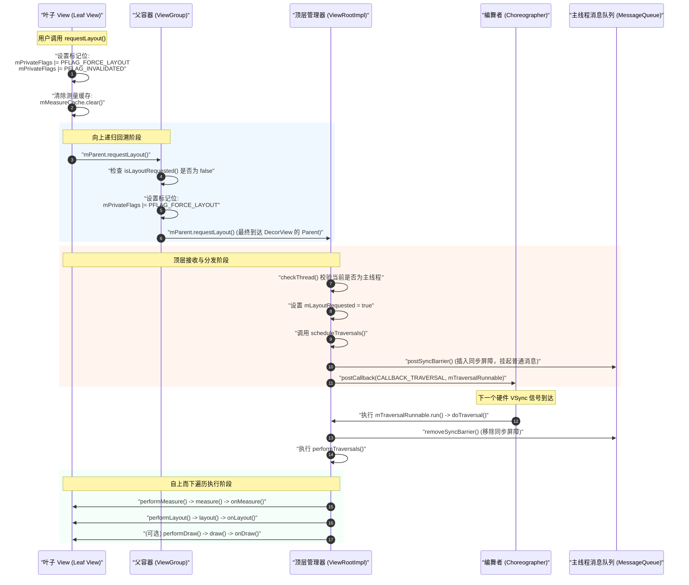

# requestLayout 机制详解

在 Android UI 系统的渲染与绘制流程中，`requestLayout()` 是最核心的控制方法之一。当 View 的尺寸、边界、可见性或内部布局参数发生变化，导致当前界面呈现的几何形态不再满足要求时，开发者或系统控件会调用 `requestLayout()`，从而发起一次完整的测量（Measure）与布局（Layout）请求。

本文将从设计目的、调用链路源码级解构、Choreographer 绑定机制、与 `invalidate()` 的对比，以及常见的开发避坑指南等维度，对 `requestLayout()` 进行深度剖析。

---

## 1. 核心概念与触发机制（是什么）

### 1.1 设计目的
`requestLayout()` 的设计目的是**请求 View 树重新进行几何尺寸的计算与空间分配**。

在 Android 中，View 树的呈现是由“几何结构（Geometry）”与“像素填充（Pixel Rendering）”共同决定的。`requestLayout()` 专注于**几何结构的重构**。它告诉 Android 系统：“当前 View 及其子 View 的尺寸、位置、边界或者显示状态已经发生改变，旧的测量与布局数据已经失效，请在下一次屏幕刷新信号（VSync）到来时，重新计算这棵 View 树中所有相关节点的几何数据。”

### 1.2 常见触发场景
在日常开发中，许多常见的操作在底层都会直接或间接地触发 `requestLayout()`：
1. **修改 View 的尺寸参数**：例如通过 `view.setLayoutParams(params)` 显式修改其宽（`width`）或高（`height`）。
2. **修改可能影响尺寸的属性**：
   - 改变 `TextView` 的文本内容（`setText()`），当新文本的长度或折行情况发生改变，需要重新计算文字宽高时。
   - 改变 `ImageView` 的图片资源（`setImageResource()`），新图片与旧图片的固有宽高（Intrinsic Width/Height）不一致时。
3. **改变 View 的可见性（Visibility）**：调用 `setVisibility(View.GONE)` 或 `setVisibility(View.VISIBLE)`。因为 `GONE` 会使 View 不占用任何物理空间，而 `VISIBLE` 则需要重新为其分配空间，这必然导致父容器的重新测距与重排。
4. **动态添加或移除子 View**：调用 `ViewGroup.addView()` 或 `ViewGroup.removeView()`，容器内的元素数量变化直接影响容器的排列布局。
5. **滚动容器**：某些滚动控件（如 `ScrollView` 在特定模式下，或旧版自定义滚动容器）在滑动过程中改变内部子 View 的偏移位置时，可能会触发重新布局。

### 1.3 核心标志位的引入与状态转换
在 `View` 内部，每一个 View 实例都维护着若干个整型的标志位变量，最核心的是 `mPrivateFlags`、`mPrivateFlags2` 和 `mPrivateFlags3`。这些标志位以按位与（AND）、按位或（OR）的形式，高效地存储了 View 的当前状态。

当调用 `requestLayout()` 时，最核心的变化是为当前 View 的 `mPrivateFlags` 加上了 `PFLAG_FORCE_LAYOUT` 标记。
- **`PFLAG_FORCE_LAYOUT`**：这是一个极其关键的标志。它代表当前 View “被迫重新布局”。在接下来的遍历流程中，只有被标记了该标志的 View，其 `measure()` 和 `layout()` 方法才不会走“缓存优化分支”，而是切实执行 `onMeasure()` 和 `onLayout()`。
- **`PFLAG_INVALIDATED`**：表示 View 的内容已经失效，通常用于标记该 View 需要在后续流程中重新绘制。
- **`PFLAG_MEASURED_DIMENSION_SET`**：这是一个辅助性的安全验证标志。在 `measure()` 源码中，系统会首先清除该标志。当调用 `onMeasure()` 时，开发者必须在其中显式调用 `setMeasuredDimension()` 才能重新打上这个标志。如果 `onMeasure()` 结束时，系统检测到该标志依然缺失，则会立即抛出运行时异常 `IllegalStateException`，警告开发者没有为 View 设定明确的几何宽高。其源码层面的核心逻辑如下：
  ```java
  // View.measure() 内部核心验证逻辑
  mPrivateFlags &= ~PFLAG_MEASURED_DIMENSION_SET;
  onMeasure(widthMeasureSpec, heightMeasureSpec);
  if ((mPrivateFlags & PFLAG_MEASURED_DIMENSION_SET) != PFLAG_MEASURED_DIMENSION_SET) {
      throw new IllegalStateException("View with id " + getId() + ": "
              + getClass().getName() + "#onMeasure() did not set the"
              + " measured dimension");
  }
  ```
- **`PFLAG3_MEASURE_NEEDED_BEFORE_LAYOUT`**：该标志用于高版本 Android 系统（如 Android 6.0 引入的优化机制）中，表明在执行 layout 之前是否需要重新进行一次 measure。它主要协助系统进行“懒测量”以及非连续布局状态下的性能优化。
- **`PFLAG_LAYOUT_REQUIRED`**：表示当前 View 已通过测量并获得了正确的规格，目前急需在接下来的 performLayout 过程中定位和摆放其在屏幕上的物理坐标。

---

## 2. 调用链路与 Choreographer 绑定（怎么做 / 为什么）

`requestLayout()` 的执行是一个**自下而上回溯标记，再自上而下遍历执行**的双向过程。以下我们通过源码级解构，详细分析这一过程的每一阶段。

### 2.1 深度解构向上回溯过程

当我们在某个具体的叶子 View 上调用 `requestLayout()` 时，其内部源码如下（以 Android AOSP 源码为基准）：

```java
public void requestLayout() {
    // 1. 清除上一次的测量维度设置标志（防止检测异常）
    if (mMeasureCache != null) {
        mMeasureCache.clear();
    }

    if (mAttachInfo != null && mAttachInfo.mViewRequestingLayout == null) {
        // 防止在遍历过程中发生重入
        ViewRootImpl viewRoot = getViewRootImpl();
        if (viewRoot != null && viewRoot.isInLayout()) {
            if (!viewRoot.requestLayoutDuringLayout(this)) {
                return;
            }
        }
    }

    // 2. 为当前 View 设置强制布局标志位
    mPrivateFlags |= PFLAG_FORCE_LAYOUT;
    mPrivateFlags |= PFLAG_INVALIDATED;

    // 3. 如果有父容器，且父容器没有被标记为需要强制布局，则将请求向上传递
    if (mParent != null && !mParent.isLayoutRequested()) {
        mParent.requestLayout();
    }
    
    if (mAttachInfo != null && mAttachInfo.mViewRequestingLayout == this) {
        mAttachInfo.mViewRequestingLayout = null;
    }
}
```

#### 2.1.1 关键逻辑拆解
1. **缓存清理**：`mMeasureCache.clear()` 清理了该 View 的测量缓存。Android 为了提高绘制性能，在 View 内部维护了一个 `LongSparseLongArray` 类型的 `mMeasureCache`，它缓存了不同 `MeasureSpec` 下的测量宽高。一旦发起 `requestLayout()`，旧的测量结果必须全部废弃。
2. **设置标志位**：
   - `mPrivateFlags |= PFLAG_FORCE_LAYOUT`：将 View 标记为“必须执行完整测量与布局逻辑”。
   - `mPrivateFlags |= PFLAG_INVALIDATED`：标记内容失效，为后续可能的绘制做准备。
3. **递归回溯 `mParent.requestLayout()`**：
   - 这里的 `mParent` 类型是 `ViewParent` 接口。在 Android 中，View 树的非叶子节点（如 `LinearLayout`、`FrameLayout` 等）都继承自 `ViewGroup`，而 `ViewGroup` 实现了 `ViewParent` 接口。
   - `mParent.isLayoutRequested()` 用于判断父容器是否已经处于“请求布局”的状态。该方法的内部实现其实非常简单，就是判断父容器自己的 `mPrivateFlags` 是否包含 `PFLAG_FORCE_LAYOUT`：
     ```java
     public boolean isLayoutRequested() {
         return (mPrivateFlags & PFLAG_FORCE_LAYOUT) == PFLAG_FORCE_LAYOUT;
     }
     ```
   - **防抖优化与递归终止**：如果父容器已经有了 `PFLAG_FORCE_LAYOUT` 标志，说明父容器在此之前已经发起了布局请求（可能由其他子 View 触发，或者它自己触发的），并且该请求还没被处理。此时，当前 View 只需要给自己打上 `PFLAG_FORCE_LAYOUT` 即可，**无需继续向上递归**。这种“剪枝”设计避免了多子 View 同时改变时，重复向最顶层发起请求的无意义开销。
   - 如果父容器没有被标记，则调用 `mParent.requestLayout()`。这样，调用链就会顺着 `ViewGroup -> ViewGroup -> ... -> DecorView` 一路向上，最终调用到最顶层的 `ViewParent`。而 `DecorView`（Activity 的根布局）的 `mParent` 就是 `ViewRootImpl`。

#### 2.1.2 ViewGroup 对 `requestLayout()` 的继承与实现
在 `ViewGroup` 中，它实现了 `ViewParent` 接口的 `requestLayout()` 方法：

```java
@Override
public void requestLayout() {
    super.requestLayout(); // 调用 View.requestLayout()，给自己打上 PFLAG_FORCE_LAYOUT 标志
    
    // 递归向上传递
    if (mParent != null && !mParent.isLayoutRequested()) {
        mParent.requestLayout();
    }
}
```
可以看到，`ViewGroup` 实际上是先调用 `super.requestLayout()`（即 `View.requestLayout()`）为自己打上 `PFLAG_FORCE_LAYOUT` 标志，然后继续通过 `mParent.requestLayout()` 向上委托，直到触及 `ViewRootImpl`。

---

### 2.2 ViewRootImpl 的处理与 Choreographer 绑定

`ViewRootImpl` 是连接 `WindowManagerService`（WMS）与整个 View 树的桥梁。它是整个 View 树的最顶层管理者，但它本身并不是一个 View，而是一个实现了 `ViewParent` 接口的普通 Java 类。

当回溯链路到达 `ViewRootImpl.requestLayout()` 时，整个渲染管线开始与系统的刷新时钟（VSync）进行绑定。

#### 2.2.1 `ViewRootImpl.requestLayout()` 源码分析

```java
@Override
public void requestLayout() {
    if (!mHandlingLayoutInLayoutRequest) {
        // 1. 检查调用线程是否是创建 ViewRootImpl 的线程（通常是主线程）
        checkThread();
        // 2. 标记布局请求标志
        mLayoutRequested = true;
        // 3. 调度下一次遍历流程
        scheduleTraversals();
    }
}
```
- `mLayoutRequested = true`：这是 `ViewRootImpl` 内部的一个布尔值。在接下来的 `performTraversals()` 中，这个变量将决定是否需要调用 `performMeasure()` 和 `performLayout()`。
- `scheduleTraversals()` 是触发整个 View 树重新绘制与布局的“发令枪”。

#### 2.2.2 `ViewRootImpl.scheduleTraversals()` 源码分析

```java
void scheduleTraversals() {
    if (!mTraversalScheduled) {
        // 1. 防抖标记，确保在一个 VSync 周期内，只向 Choreographer 注册一次 TraversalRunnable
        mTraversalScheduled = true;
        
        // 2. 往主线程的 MessageQueue 中插入一个同步屏障（Sync Barrier）
        // 它的目的是阻塞随后的普通异步消息，确保 VSync 信号到来时，绘制消息（异步消息）能够以最高优先级执行
        mTraversalBarrier = mHandler.getLooper().getQueue().postSyncBarrier();
        
        // 3. 向 Choreographer 发送一个 TRAVERSAL 类型的回调
        mChoreographer.postCallback(
                Choreographer.CALLBACK_TRAVERSAL, mTraversalRunnable, null);
        
        notifyRendererOfFramePending();
        pokeDrawLockIfNeeded();
    }
}
```
- **Choreographer 绑定**：`mChoreographer.postCallback` 传入了 `mTraversalRunnable`。它的定义如下：
  ```java
  final class TraversalRunnable implements Runnable {
      @Override
      public void run() {
          doTraversal();
      }
  }
  final TraversalRunnable mTraversalRunnable = new TraversalRunnable();
  ```

#### 2.2.2.1 深度探索：同步屏障（Sync Barrier）与消息排队机制
这里有必要深入剖析 `postSyncBarrier()` 这一高阶性能优化机制的底层运行机理。

在 Android 中，主线程的 Looper 维护着一个 `MessageQueue`（消息队列）。普通情况下，消息队列是根据时间（`when`）从小到大排列的单链表。当 Looper 循环提取消息时，会按照时间顺序一个个处理。

同步屏障是一种特殊的 Message，它的最大特征是**没有 `target` 属性**（即 `message.target == null`）。
1. 当 `MessageQueue.next()` 被调用并在队列头部或中间检索到一个 `target == null` 的屏障消息时，消息队列就会开启**“紧急避让”模式**。
2. 此时，消息队列会选择性地**过滤掉所有普通的同步消息**（Synchronous Message），即使它们的时间戳已经过期。普通的按钮点击、网络回调 Handler 派发、或者是轻量级的数据更新消息，在这一刻都会被无情地“挂起”和“冻结”。
3. 队列会继续向后遍历，**只寻找被标记为“异步”（Asynchronous）的消息**。而 `Choreographer` 的底层 VSync 回调正是通过异步消息发送出来的。
4. 这项设计能够保证，一旦 `scheduleTraversals` 发起，不管主线程的消息队列有多么拥堵，哪怕排队堆积了数十个甚至数百个普通的消息，下一次屏幕刷新信号带来的 UI 渲染任务也会以最高的特权“插队”到最前端执行。
5. 遍历完成并在 `doTraversal()` 中重置 `mTraversalScheduled` 后，系统会立即调用 `mHandler.getLooper().getQueue().removeSyncBarrier(mTraversalBarrier)`。此时，同步屏障被撤销，之前被挂起的所有同步消息才能重新获得 CPU 执行时间。

#### 2.2.3 VSync 信号到达与 `doTraversal()`

当屏幕的硬件 VSync 信号到来时，`Choreographer` 会在它的 `doFrame()` 流程中，回调我们注册的 `mTraversalRunnable`，并在主线程中执行 `doTraversal()`：

```java
void doTraversal() {
    if (mTraversalScheduled) {
        mTraversalScheduled = false; // 重置防抖标志
        // 移除同步屏障，让普通消息重新得到执行机会
        mHandler.getLooper().getQueue().removeSyncBarrier(mTraversalBarrier);

        // 执行核心的测量、布局、绘制三部曲
        performTraversals();
    }
}
```
在 `performTraversals()` 方法内部，会进行复杂的决策，最终触发我们熟知的三个 `perform` 方法：
1. **`performMeasure(childWidthMeasureSpec, childHeightMeasureSpec)`**：如果 `mLayoutRequested` 为 `true`，或者有其他迫使测量的标志，就会调用根 View（`DecorView`）的 `measure()`。在 `measure()` 内部，如果发现有 `PFLAG_FORCE_LAYOUT` 标志，就会跳过缓存，直接调用 `onMeasure()`，并逐级向下遍历子 View。
2. **`performLayout(lp, mWidth, mHeight)`**：如果 `mLayoutRequested` 为 `true`，就会调用根 View 的 `layout()`。在 `layout()` 中，同样因为 `PFLAG_FORCE_LAYOUT` 标志，会跳过优化直接执行 `onLayout()`，重新确定所有子 View 在屏幕上的 `left, top, right, bottom` 坐标。
3. **`performDraw()`**：根据是否设置了重绘标志、几何尺寸是否发生实质性位移等，决定是否发起绘制。需要注意，`requestLayout()` 本身**不一定会**触发 `performDraw()`。如果尺寸变化没有导致内容失效，或者在 API 21 之后通过 RenderThread 优化后判定无需重绘，它可能会跳过绘制阶段。

#### 2.2.4 编舞者（Choreographer）的回调优先级序列
在 `Choreographer` 的底层设计中，它不仅服务于 View 的布局和绘制，还调度着输入事件和动画。`Choreographer` 内部维护了五种不同的回调队列，并严格按照以下优先级顺序进行依次回调：

1. **`CALLBACK_INPUT`**：用于处理触摸、按键等物理输入事件。优先响应用户操作，能够最快速度将最新的位置信息注入到应用的状态模型中。
2. **`CALLBACK_ANIMATION`**：用于执行动画逻辑（例如常见的 `ValueAnimator`）。由于动画往往会导致 View 的物理属性（位置、缩放等）发生变化，因此必须在布局之前完成这些数值的迭代更新。
3. **`CALLBACK_INSETS_ANIMATION`**：用于窗口插页动画的计算，例如系统软键盘升起和降落时的过渡效果。
4. **`CALLBACK_TRAVERSAL`**：这正是 `requestLayout()` 和 `invalidate()` 所绑定的核心队列。在所有的物理输入、动画变化都算好之后，一次性对 View 树进行最终测量、布局和绘制。
5. **`CALLBACK_COMMIT`**：用于最后的提交工作，协助主线程与渲染线程（RenderThread）进行帧同步。

将 `CALLBACK_TRAVERSAL` 安排在输入与动画后面，是经典的性能合并优化设计。例如，在一个 VSync 周期内，用户快速滑动屏幕产生了一百次 Touch 事件（`CALLBACK_INPUT`），或者属性动画计算出了最新的宽高（`CALLBACK_ANIMATION`），这些中间状态都不需要真正渲染到屏幕上。只有在动画和输入都处理完毕、界面状态固定之后，通过 `CALLBACK_TRAVERSAL` 一次性完成测量和布局，从而极大地避免了中间无效帧的过度绘制与性能损耗。

---

### 2.3 自下而上回溯与 Choreographer 注册时序图

以下是 `requestLayout()` 从最底层的叶子 View 触发，一路向上传递，最终在 `Choreographer` 注册并等待下一帧刷新信号的完整时序图：



---

## 3. 核心对比（重难点）

在 Android 面试与日常高级调优中，`requestLayout()` 与 `invalidate()` 的对比是高频考点。理解两者的区别有助于避免不必要的系统开销，写出高帧率的丝滑 UI。

### 3.1 物理机制对比表

| 对比维度 | `requestLayout()` | `invalidate()` |
| :--- | :--- | :--- |
| **主要设计目的** | 重新计算几何尺寸、位置与层次布局（**Geometry 重构**）。 | 重新填充组件像素内容与色彩表现（**Pixel 重绘**）。 |
| **核心标志位** | `mPrivateFlags |= PFLAG_FORCE_LAYOUT`<br/>`mPrivateFlags |= PFLAG_INVALIDATED` | `mPrivateFlags |= PFLAG_DIRTY`（或者 `PFLAG_DRAWN` 被清除） |
| **向上回溯终点** | 最终调用到 `ViewRootImpl.requestLayout()`。 | 最终调用到 `ViewRootImpl.invalidateChildInParent()` 或直接触发重绘请求。 |
| **是否触发 Measure 阶段** | **是**（必须执行）。如果父容器或自身带有 `PFLAG_FORCE_LAYOUT` 标志，则跳过缓存，强制调用 `onMeasure()`。 | **否**。完全跳过测量阶段。 |
| **是否触发 Layout 阶段** | **是**（必须执行）。强制调用 `onLayout()`，重新计算各子 View 坐标。 | **否**。完全跳过布局阶段。 |
| **是否必然触发 Draw 阶段** | **不一定**。只有当尺寸变化导致边界改变、或同时带有绘制标志时，才会在 `performTraversals` 中触发 `performDraw()`。 | **是**（当 View 可见且其没有硬编码跳过绘制时）。必然会触发 `onDraw()` 重新绘制像素。 |
| **Choreographer 注册类型** | `Choreographer.CALLBACK_TRAVERSAL` | `Choreographer.CALLBACK_TRAVERSAL`（两者的回调终点都在 `performTraversals()` 中分流）。 |
| **渲染物理耗时与开销** | **极高**。由于需要重新计算整棵树（或分支树）的几何数据，涉及复杂的数学测量，开销极大，容易导致掉帧。 | **中等/较低**。仅重绘脏区域（Dirty Area）内的像素，在硬件加速下许多操作只在 GPU 端提交 DisplayList，开销相对较小。 |

### 3.2 深度原理解析：两者是如何配合的？

很多开发者会有疑问：“为什么有时候我改了尺寸，不仅调用了 `requestLayout()`，界面像素也刷新了？它们之间是如何联动的？”

当 `requestLayout()` 向上回溯到 `ViewRootImpl`，在 `performTraversals()` 中：
1. 系统首先执行 `performMeasure` 和 `performLayout`。
2. 在 `layout()` 方法执行过程中，如果 View 的新位置（`left, top, right, bottom`）与上一次的值不同，View 内部会自动调用 `invalidate()`，将这块新位置和老位置标记为“脏区域（Dirty Area）”。
3. 这样，在接下来的 `performDraw()` 阶段，系统就会知道这块区域的内容已经失效，从而真正触发 `draw()` 流程。
4. 也就是说，**如果几何尺寸确实发生了实质改变，`requestLayout()` 会间接触发 `invalidate()` 的绘制流程**。但如果测量出来的尺寸与原来一模一样，且没有其他重绘标记，则可能直接略过后面的 `draw()` 阶段，以节省开销。

---

## 4. 避坑指南

### 4.1 避坑一：在 `onMeasure()` 或 `onLayout()` 中调用 `requestLayout()` 导致无限循环与 ANR

#### 4.1.1 错误场景复现
在自定义 View 时，部分开发者为了在测量或布局期间动态调整某些子 View，会在 `onMeasure()` 或 `onLayout()` 方法内部直接或间接地调用 `requestLayout()`。例如：

```java
// 错误示例！！！
@Override
protected void onMeasure(int widthMeasureSpec, int heightMeasureSpec) {
    super.onMeasure(widthMeasureSpec, heightMeasureSpec);
    if (getMeasuredWidth() > 500) {
        // 错误：在测量中直接修改参数并请求重新布局
        ViewGroup.LayoutParams params = getLayoutParams();
        params.width = 500;
        setLayoutParams(params); // setLayoutParams 内部会调用 requestLayout()
    }
}
```

#### 4.1.2 源码级原理解析：为什么会形成死循环？
我们先来看一次正常的 `performTraversals()` 流程中，`PFLAG_FORCE_LAYOUT` 标志位是如何被清除的。在 `View.layout()` 方法中：

```java
public void layout(int l, int t, int r, int b) {
    ...
    // 1. 调用 setFrame 设定当前坐标
    boolean changed = isLayoutModeOptical(mParent) ?
            setOpticalFrame(l, t, r, b) : setFrame(l, t, r, b);

    if (changed || (mPrivateFlags & PFLAG_FORCE_LAYOUT) == PFLAG_FORCE_LAYOUT) {
        // 2. 回调 onLayout
        onLayout(changed, l, t, r, b);

        // 3. 清除 PFLAG_FORCE_LAYOUT 标志位
        mPrivateFlags &= ~PFLAG_FORCE_LAYOUT;
        ...
    }
    ...
}
```
从源码中可以看到，`PFLAG_FORCE_LAYOUT` 的清除是在 `onLayout()` 执行**之后**进行的。

如果在 `onMeasure()` 或 `onLayout()` 内部调用了 `requestLayout()`：
1. `requestLayout()` 会立即将 `mPrivateFlags` 加上 `PFLAG_FORCE_LAYOUT` 标志。
2. 同时将 `ViewRootImpl` 中的 `mLayoutRequested` 置为 `true`。
3. 并且通过 `scheduleTraversals()` 再次向 `Choreographer` 申请 VSync 回调。
4. 哪怕当前帧正在执行 `layout()`（此时可能在 `onLayout()` 里面），由于你又调用了 `requestLayout()`，在 `onLayout()` 执行完毕后，`mPrivateFlags &= ~PFLAG_FORCE_LAYOUT` 确实清除了当前帧 the 标记。但是！你刚刚调用的 `requestLayout()` 已经在父容器上重新打上了 `PFLAG_FORCE_LAYOUT`，并且向最顶层 `ViewRootImpl` 重新发起了下一次遍历的请求！
5. 结果是：当前 VSync 帧刚结束，主线程的 `MessageQueue` 里立刻又躺着一个 `Choreographer` 的 `TraversalRunnable`（由于同步屏障的开启，它会被以最高优先级执行）。下一帧到来，重新进入 `performTraversals()`，再次触发 `onMeasure()` -> 再次调用 `requestLayout()` -> 再次注册下一帧。
6. **最终后果**：主线程彻底被无休止的“测量-布局-申请下一帧”循环所占满。此时，主线程的 Handler 无法处理任何用户的点击事件、触摸事件或系统广播。当用户尝试与界面交互时，由于事件无法被响应，在超过 5 秒（针对 Activity/Input 事件）后，系统就会直接抛出 **ANR（Application Not Responding）** 弹窗，应用宣告卡死崩溃。

> [!WARNING]
> 绝对不要在 `onMeasure()`、`onLayout()` 以及 `draw()` / `onDraw()` 方法的直接调用栈里发起 `requestLayout()`。如果确实需要根据测量结果修改尺寸，应通过 `post(Runnable)` 将修改逻辑推迟到下一帧的普通消息队列中，或者在数据源发生变化之前就完成尺寸的判定。

---

### 4.2 避坑二：频繁在子线程调用导致的非法线程更新 UI 异常

#### 4.2.1 抛出的异常
在非主线程（子线程）中直接修改 View 属性（如 `textView.setText()`，其内部会触发 `requestLayout()`）时，经常会遇到以下崩溃：

```text
android.view.ViewRootImpl$CalledFromWrongThreadException: 
Only the original thread that created a view hierarchy can touch its views.
```

#### 4.2.2 `ViewRootImpl.checkThread()` 校验的由来
这个异常是由 `ViewRootImpl` 内部的 `checkThread()` 方法抛出的：

```java
void checkThread() {
    if (mThread != Thread.currentThread()) {
        throw new CalledFromWrongThreadException(
                "Only the original thread that created a view hierarchy can touch its views.");
    }
}
```
- `mThread` 是在 `ViewRootImpl` 实例化时被赋值的：`mThread = Thread.currentThread();`。
- 因为 `ViewRootImpl` 是在 Activity 启动过程中，在主线程（ActivityThread）的 `handleResumeActivity` 阶段被创建出来的，所以 `mThread` 就是应用的主线程（UI 线程）。
- 任何会导致 `ViewRootImpl` 重新调度的操作（例如 `requestLayout()`、`invalidate()` 等），其入口处都会调用 `checkThread()`。一旦当前线程不是主线程，直接抛出异常崩溃。

#### 4.2.3 为什么不设计为线程安全？背后的设计取舍
Android 为什么强行限制只能在主线程更新 UI，而不把 View 体系设计为线程安全的？这背后是**性能与开发复杂度**的极致权衡：

1. **死锁（Deadlock）风险极高**：
   - View 树是一个树状拓扑结构。当子 View 属性改变时，需要自下而上回溯（`parent.requestLayout()`）；而当顶层分发测量和布局时，需要自上而下遍历。
   - 如果允许多线程并发操作，为了保证线程安全，必须对 View 节点加锁。
   - 在这样既有“自下而上”又有“自上而下”的双向遍历系统中，在多线程环境下极易发生死锁（例如：线程 A 锁住了子 View 并试图获取父 View 的锁，而线程 B 锁住了父 View 并试图获取子 View 的锁）。
2. **多线程加锁带来的巨大性能开销**：
   - UI 系统的核心诉求是**高帧率（每秒 60/90/120 帧）**。每一次屏幕刷新都必须在 8~16 毫秒内完成整棵树的计算。
   - 如果每一次属性访问、每一次标志位修改、每一个 `measure/layout/draw`操作都要进行锁竞争（Lock Contention），会导致大量的线程挂起和上下文切换。这在性能敏感的 UI 渲染管线中是不可接受的，会导致严重的卡顿。
3. **单线程模型的优势**：
   - 采用单线程模型（Single-Thread Message Loop），所有 UI 操作都在主线程中按顺序排队执行。
   - 这种设计不仅消除了复杂的锁竞争，极大地提升了渲染性能，同时也让 UI 控件的开发者能够在一个确定性的单线程环境中编写逻辑，大大降低了自定义 View 和系统 UI 框架的开发与维护难度。

#### 4.2.4 高阶避误：为什么有时候在子线程修改 UI 不会报错？
有经验的开发者可能注意过：在 Activity 的 `onCreate()` 方法中，启动一个子线程去修改 TextView 的文本，有时候**并不会**抛出 `CalledFromWrongThreadException`。

这并不是因为 Android 放宽了限制，而是因为**时机问题**：
1. `CalledFromWrongThreadException` 的校验是由 `ViewRootImpl.checkThread()` 执行的。
2. 在 Activity 启动流程中，`onCreate()` 和 `onStart()` 阶段，整个 View 树虽然已经通过 `setContentView()` 建立完毕，但此时 `WindowManagerImpl` 还没有正式将 `DecorView` 添加到窗口管理器中，即 **`ViewRootImpl` 尚未被创建**。
3. 在这个阶段，子线程调用 `textView.setText()`，进而触发 `requestLayout()`：
   - 子 View 往上回溯 `mParent.requestLayout()`。
   - 因为此时 `DecorView` 还没有被关联到 `ViewRootImpl`，它的 `mParent` 还是普通的 `ViewGroup`，或者为 `null`。
   - 向上回溯的链路在到达顶层前就中断了，根本没有触及 `ViewRootImpl.requestLayout()`，因此也就没有执行 `checkThread()` 的校验。
4. 虽然子线程修改了属性没有报错，但由于没有向 `ViewRootImpl` 成功注册 VSync 回调，这个修改在下一帧**并不会立刻刷新到屏幕上**（直到主线程随后自己触发了某次布局或绘制）。
5. 一旦 Activity 走到 `onResume()`，`ViewRootImpl` 被创建并绑定到 `DecorView` 后，任何子线程的 UI 操作都会在回溯到 `ViewRootImpl` 时，因触发 `checkThread()` 而立即崩溃。

因此，在任何情况下，都必须遵循“主线程更新 UI”的安全准则。如果在子线程完成了数据加载，必须通过 `Handler.post()`、`Activity.runOnUiThread()` 或 Kotlin 协程的 `withContext(Dispatchers.Main)` 将 UI 更新操作调度回主线程执行。

关于主线程与 UI 交互的详细历史演进，如早期版本中某些特定的异步渲染机制，可在 [AndroidVersionChangeLog.md](../../../../AndroidVersionChangeLog.md) 中查阅相关系统变更记录。
