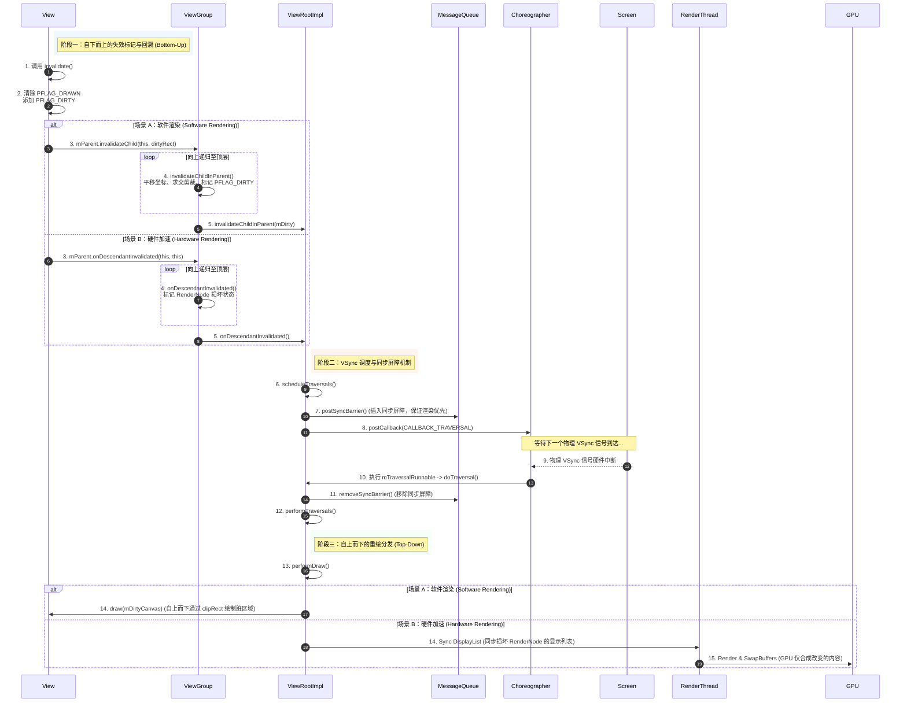

# Android invalidate 详细机制

在 Android 复杂的视图渲染体系中，`invalidate()` 是一个具有核心地位的技术节点。它承载着从状态变化到屏幕像素点更新的中枢联结职责。对于追求极致性能与丝滑动画体验的 Android 开发者而言，深度解构 `invalidate()` 的自下而上脏区域合并回溯逻辑、硬件加速下的机制重构、Choreographer 驱动的 VSync 帧同步，以及跨线程通信的 `postInvalidate()` 底层设计，是突破 UI 性能瓶颈的必经之路。

---

## 1. 核心概念与机制

### 1.1 `invalidate()` 的定义与核心职责
`invalidate()`（意为“使失效”）是 Android `View` 体系中用于触发布局“内容刷新”而非“结构重建”的机制。它的核心职责是：**当 View 的内容、背景、文本或其它视觉状态发生改变，但其尺寸大小（Measure）与在父容器中的相对位置（Layout）保持不变时，通知系统在下一个屏幕刷新周期重新绘制该 View。**

在 View 的底层设计中，重绘流程高度依赖于 `mPrivateFlags`（一个 32 位的整型变量，通过二进制位管理 View 的数百种状态）。当调用 `invalidate()` 时，系统会进行以下核心标记操作：
*   **清除 `PFLAG_DRAWN` 标记**：表示该 View 当前的状态已经过时，不能直接复用上一次的绘制缓存。
*   **添加 `PFLAG_DIRTY` 标记**：标记该 View 为“脏区域”的起点，需要被纳入重绘的遍历树中。
*   **在硬件加速下，添加 `PFLAG_INVALIDATED` 标记**：用以指示该 View 的 `RenderNode` 或 `DisplayList`（显示列表）已经失效，必须在接下来的绘制流程中重新录制（Re-record）。

### 1.2 `invalidate()` 与 `requestLayout()` 的本质区别
理解 `invalidate()` 的关键在于将其与 `requestLayout()` 进行严格的对比：

| 维度 | `invalidate()` | `requestLayout()` |
| :--- | :--- | :--- |
| **触发范围** | 仅重绘（Draw），跳过测量与布局 | 重新测量（Measure）与布局（Layout），视情况触发重绘 |
| **标志位变化** | 清除 `PFLAG_DRAWN`，置位 `PFLAG_DIRTY`/`PFLAG_INVALIDATED` | 置位 `PFLAG_FORCE_LAYOUT`，清除 `PFLAG_LAYOUT_REQUIRED` |
| **执行路径** | `invalidate()` -> `invalidateInternal()` -> 向上回溯脏区域 | `requestLayout()` -> 向上回溯标记 -> `ViewRootImpl.requestLayout()` |
| **性能开销** | 较小，尤其在硬件加速和局部重绘机制加持下 | 极高，由于会自上而下遍历整棵树进行尺寸计算与位置编排 |
| **典型场景** | 修改 TextView 的文字颜色、改变 ImageView 的图片源、Canvas 动画 | 改变 View 的 LayoutParams、动态增删子 View、TextView 文本导致换行 |

从系统设计哲学来看，`requestLayout()` 关注的是**空间位置和结构关系（Where）**，而 `invalidate()` 关注的是**呈现内容和像素表现（What）**。

---

## 2. 脏区域合并与向上回溯流程

重绘机制的本质是一个自下而上（Bottom-Up）传递重绘请求与脏区域，再自上而下（Top-Down）执行绘制指令的双向流动过程。

### 2.1 脏区域（Dirty Area）的概念与定义
为了避免每次微小的像素改变都引发全屏重绘，Android 引入了**脏区域（Dirty Area）**概念。脏区域在软件绘制模式下由一个 `android.graphics.Rect` 矩形来表征，代表屏幕上急需刷新像素的最小包围框。

### 2.2 自下而上的向上回溯逻辑深度解构
当一个具体的子 `View` 调用了 `invalidate()`，它并没有能力直接将像素投递到屏幕上，必须将这一请求层层上报，直至整个视图树的根节点 `ViewRootImpl`。在不同的绘制模式（软件绘制与硬件加速）下，这一回溯过程有着完全不同的底层实现。

#### 2.2.1 软件绘制模式：脏区域坐标累加与剪裁（经典路径）
在未开启硬件加速的软件绘制模式下，向上回溯的本质是**在父视图空间中不断做脏矩形求并集与坐标偏移计算**。

1.  **View 内部发起**：
    `View.invalidate()` 内部会调用 `invalidateInternal(int l, int t, int r, int b, boolean invalidateCache, boolean fullInvalidate)`。此方法接收的 `(l, t, r, b)` 代表当前 View 内部的局部脏矩形坐标。
2.  **标记自身并向上传递**：
    View 标记自身 `mPrivateFlags |= PFLAG_DIRTY`，然后获取其父容器 `mParent`（类型为 `ViewParent`，通常是 `ViewGroup`），调用 `mParent.invalidateChild(this, damage)`，其中 `damage` 是包含脏区域的 `Rect`。
3.  **ViewGroup 的中枢路由与偏移计算**：
    `ViewGroup.invalidateChild(View child, final Rect dirty)` 是经典的脏区域合并核心。其内部通过一个 `do...while` 循环（或者递归调用）不断向上溯源：
    ```java
    // 简化后的 ViewGroup.invalidateChild 伪代码逻辑
    public final void invalidateChild(View child, final Rect dirty) {
        ViewParent parent = this;
        final int[] location = attachInfo.mInvalidateChildLocation;
        // location[0] 记录 child 的 left 坐标偏移
        // location[1] 记录 child 的 top 坐标偏移
        location[0] = child.mLeft;
        location[1] = child.mTop;

        do {
            // 核心中枢方法：在父容器中累加偏移并求交集
            parent = parent.invalidateChildInParent(location, dirty);
        } while (parent != null);
    }
    ```
4.  **`invalidateChildInParent` 的几何合并算法**：
    当父容器 `ViewGroup` 收到子视图的脏矩形时，需要将该矩形平移到自己的坐标系中：
    *   **平移（Offset）**：脏矩形平移当前子 View 的相对位置偏移，并扣除父 View 的滚动偏移量：
        $$\text{dirty.offset}(location[0] - mScrollX, location[1] - mScrollY)$$
    *   **相交与剪裁（Intersect & Clip）**：利用 `Rect.intersect(0, 0, mRight - mLeft, mBottom - mTop)` 将脏矩形与父 View 自身的可视边界进行交集运算。如果脏矩形超出了父 View 的可视范围，交集计算将截断多余部分；如果完全不相交，说明该脏区域在屏幕上不可见，回溯流程将在此终止。
    *   **更新 location 偏移数组**：将 `location[0]` 和 `location[1]` 更新为当前父 View 的 `left` 和 `top` 坐标，供更上一级的父容器继续平移使用。
    *   **状态置位**：父 View 将自身 `mPrivateFlags` 标上 `PFLAG_DIRTY`。
5.  **回溯终点**：
    回溯一直向上进行，直到 `parent` 不再是 `ViewGroup`，而是视图树的始祖——`ViewRootImpl`。

#### 2.2.2 硬件加速模式：损坏区域（Damage Area）与 RenderNode 失效标记
结合 [AndroidVersionChangeLog.md](../../../../../AndroidVersionChangeLog.md#android-80--81api-26--27) 的演进，在 Android 8.0（API 26）及后续版本中，硬件加速成为了系统默认并极力优化的绘制路径。硬件加速模式下，回溯流程发生了根本性重构：

*   **不再计算精确的脏矩形求交**：因为硬件加速为每个 View 分配了独立的 `RenderNode`，每个 View 的绘制指令存放在其 `DisplayList` 中。软件绘制时期繁琐的 `Rect.intersect` 几何计算在 GPU 渲染管线中是无意义的开销。
*   **`onDescendantInvalidated` 机制的引入**：
    当开启硬件加速时，`View.invalidateInternal` 会直接调用 `mParent.onDescendantInvalidated(this, this)`。
    *   此方法不传递 `Rect` 脏区域，而是传递 `target`（发起失效的 View 实例）以及 `descendant`（当前子视图）。
    *   `ViewGroup` 收到该调用后，不需要进行坐标平移与相交裁剪，而是将当前 `ViewGroup` 关联的 `RenderNode` 标记为“包含损坏的子节点”（通过 Native 层的 `damageSelf()` 或 `damage()` 指令），接着继续调用 `mParent.onDescendantInvalidated(this, target)` 向上溯源。
    *   最终，整个回溯路径上的所有 `RenderNode` 在 Native 层形成了一条“损坏标记链”。在接下来的渲染阶段，RenderThread 可以极其高效地根据 RenderNode 的标记状态决定是否需要重新录制 DisplayList。

---

### 2.3 ViewRootImpl 的调度与 VSync 驱动
无论是软件绘制的 `invalidateChildInParent`，还是硬件加速的 `onDescendantInvalidated`，它们最终都由根节点 `ViewRootImpl` 承接。

1.  **`ViewRootImpl` 接收失效请求**：
    `ViewRootImpl` 接收到重绘请求后，会将其内部的全局重绘标志位 `mTraversalScheduled` 或 `mFullRedrawNeeded` 置为 `true`，并锁存脏区域（如果是软件绘制，会保存在 `mDirty` 矩形中）。
2.  **插入同步屏障（Sync Barrier）**：
    `ViewRootImpl` 会调用 `MessageQueue.postSyncBarrier()`。同步屏障的插入会阻塞 MessageQueue 中普通异步消息的分发，只允许**异步消息（Async Message）**通过。这样能够确保后续的 UI 渲染消息以最高优先级被处理，防止主线程中排队的其它耗时业务阻塞绘制。
3.  **向 Choreographer 注册 Traversal 回调**：
    `ViewRootImpl` 调用 `mChoreographer.postCallback(Choreographer.CALLBACK_TRAVERSAL, mTraversalRunnable, null)`。
    `Choreographer`（编舞者）是 Android 屏幕渲染的指挥官。它内部持有一个 `FrameDisplayEventReceiver`，该接收器与底层的物理屏幕 VSync（垂直同步）信号硬件紧密相连。
4.  **VSync 信号到达与 Traversal 触发**：
    当下一个 VSync 信号到达时，底层的硬件中断会唤醒主线程。Choreographer 接收到 VSync 信号，在其 `doFrame()` 方法中依次处理输入事件、动画、以及绘制任务。
    此时，Choreographer 会回调之前注册的 `mTraversalRunnable`，其内部指向核心方法 `doTraversal()`：
    *   **移除同步屏障**：首先移除之前插入的屏障，释放主线程消息队列。
    *   **执行 `performTraversals()`**：进入整个视图树的核心遍历方法。
5.  **自上而下的绘制分发 `performDraw()`**：
    在 `performTraversals()` 中，因为没有 `PFLAG_FORCE_LAYOUT` 标记，系统会直接跳过 `performMeasure()` 和 `performLayout()`，直接执行 `performDraw()`。
    *   `performDraw()` 最终调用 `ViewRootImpl.draw(fullRedrawNeeded)`。
    *   如果是软件绘制，会通过 `mSurface.lockCanvas(mDirty)` 锁定 Canvas 的脏区域，自上而下调用 `View.draw(Canvas)` 执行重绘。
    *   如果是硬件加速，则调用 `ThreadedRenderer.draw(mView, mAttachInfo, this)`，将整棵视图树的 RenderNode 发送给 `RenderThread` 进行显示列表（DisplayList）的更新、同步与 GPU 渲染合成。

---

### 2.4 脏区域合并、回溯与重绘分发时序图
为了更清晰地梳理这一复杂的双向传递流程，以下 Mermaid 时序图展示了在**软件渲染（Software Rendering）**和**硬件加速（Hardware Rendering）**模式下的完整时序演进：



---

## 3. 优化与多线程适配

`invalidate()` 的设计并非仅仅是理论上的精妙，它在工程实践中通过对局部渲染的极致榨取和对多线程安全的精密控制，达成了效率与安全的平衡。

### 3.1 局部重绘机制与规避 Overdraw
过度绘制（Overdraw）是指屏幕上的某个像素在同一帧内被绘制了多次。频繁的全屏重绘是导致界面卡顿的核心元凶。

*   **软件绘制下的 Canvas 裁剪优化**：
    In 软件渲染模式下，当 `ViewRootImpl` 通过 `mSurface.lockCanvas(mDirty)` 锁定画布时，系统会将 `mDirty` 区域（经过逐层回溯合并后的最终脏矩形）传递给底层图形系统。
    底层会对返回的 `Canvas` 隐式调用 `Canvas.clipRect(mDirty)`。在此之后，整棵视图树的 `draw()` 流程开始分发。在 `View.draw(Canvas)` 执行时，任何落在 `mDirty` 区域之外的绘制操作（例如画圆、画矩形或文字），其像素填充指令都会被底层直接过滤并截断，绝不参与 CPU 像素的拷贝和内存写入。这极大地减小了 CPU 软件拷贝像素的带宽开销。
*   **硬件加速下的 RenderNode 局部重新录制**：
    在硬件加速下，由于 DisplayList 的存在，重绘的粒度被细化到了单个 View 的 `RenderNode`。
    当某个 View 调用了 `invalidate()`，在最后的 `performDraw()` 流程中，系统会识别出哪些 `RenderNode` 被打上了损坏标记。
    *   **仅重新录制受损节点**：只有那些失效的 View 会重新调用 `draw()`，通过其关联的 `RecordingCanvas` 重新录制绘制指令。
    *   **兄弟节点完美复用**：而该 View 的兄弟节点（未发生状态改变的 View）将完全跳过 `draw()` 方法，直接复用其 `RenderNode` 中原有的 DisplayList。
    *   **RenderThread 异步合成**：RenderThread 收集到这些 DisplayList 后，只需要将发生改变的图层重新绘制并与其它未改变的图层进行 GPU 混合，从而规避了整棵树的全局绘制，极大减轻了 GPU 的填充负担（Pixel Fill Rate）。

---

### 3.2 `postInvalidate()` 跨线程异步重绘深度剖析
Android UI 控件不是线程安全的，任何在子线程直接更新 UI 控件属性并尝试重绘的操作，都会在 ViewRootImpl 的 `checkThread()` 校验中触雷：

```java
void checkThread() {
    if (mThread != Thread.currentThread()) {
        throw new CalledFromWrongThreadException(
            "Only the original thread that created a view hierarchy can touch its views.");
    }
}
```

为了方便开发者在后台线程（如网络请求完成、I/O 操作读取完毕、后台音频解码等场景）安全地触发 UI 重绘，系统提供了 `postInvalidate()`。其底层实现是一套极具考究的跨线程 Handler 调度机制。

#### 3.2.1 `postInvalidate()` 的执行流程与源码解构
当在子线程调用 `view.postInvalidate()` 时，其内部会直接跳转至 `postInvalidateDelayed(0)`：

```java
public void postInvalidateDelayed(long delayMilliseconds) {
    // 1. 获取 AttachInfo，它是 View 挂载到 Window 时的信息结构体
    final AttachInfo attachInfo = mAttachInfo;
    if (attachInfo != null) {
        // 2. 如果已经挂载，则通过其内部持有的 Handler 发送消息
        Message msg = Message.obtain();
        msg.what = AttachInfo.INVALIDATE_MSG;
        msg.obj = this; // 将当前 View 实例作为消息对象携带
        attachInfo.mHandler.sendMessageDelayed(msg, delayMilliseconds);
    } else {
        // 3. 如果 View 尚未挂载，则将失效操作存入待挂载执行的队列
        // 此时由于没有 ViewRootImpl，无法立刻执行重绘，等到 dispatchAttachedToWindow 时再调度
    }
}
```

#### 3.2.2 `AttachInfo.mHandler` 的接收与分发
`AttachInfo.mHandler` 关联的是主线程（UI 线程）的 `Looper`。当主线程空闲并从消息队列中取出该消息时，会执行对应的逻辑：

```java
// 简化后的 Handler 处理 Invalidate 消息的逻辑
case AttachInfo.INVALIDATE_MSG:
    ((View) msg.obj).invalidate(); // 取出 View 实例，直接调用其主线程下的 invalidate()
    break;
```

#### 3.2.3 性能优化细节：`InvalidateInfo` 对象池设计
在早期版本或频繁的高并发子线程调用中，每次 `postInvalidate` 都会导致大量的 `Message` 以及辅助信息对象的频繁创建与销毁，这极易引发频繁的垃圾回收（GC），造成内存抖动，进而导致主线程卡顿。
为此，Android 系统内部引入了 `InvalidateInfo` 的对象池机制：
*   **结构定义**：`InvalidateInfo` 内部封装了待刷新的 `View` 实例以及具体的脏矩形坐标 `(left, top, right, bottom)`。
*   **对象池复用**：`InvalidateInfo` 内部实现了一个 `SynchronizedPool<InvalidateInfo>`（大小通常为 24 的同步对象池）。
*   **获取与释放**：当子线程调用 `postInvalidate` 时，会从池中通过 `acquire()` 捞取一个闲置的 `InvalidateInfo` 结构体进行属性复写；当主线程处理完 `MSG_INVALIDATE` 后，会立刻调用 `recycle()` 将该结构体清空并扔回池中，最大程度压制了垃圾对象的产生，维护了堆内存的稳定。

---

## 4. 避坑指南

### 4.1 避坑一：避免在 `onDraw()` 中频繁调用 `invalidate()`
这是 Android 初学者最常犯，但也最具毁灭性的性能错误之一。

#### 4.1.1 灾难发生原理：死循环绘制机制
`onDraw(Canvas canvas)` 是重绘分发的终点站。如果在 `onDraw()` 中直接（或者通过修改某些会触发重绘的属性间接）调用了 `invalidate()`，就会构造一个可怕的死循环：

$$\text{onDraw()} \longrightarrow \text{invalidate()} \longrightarrow \text{VSync} \longrightarrow \text{performDraw()} \longrightarrow \text{onDraw() (死循环)}$$

主线程将彻底被 `TraversalRunnable` 和绘制消息占满，导致其余的输入事件（Touch Event）、系统广播、甚至 Choreographer 的其它生命周期 Callback 都无法被及时响应，界面呈现出“无响应”或极度卡顿状态，同时 CPU 和 GPU 的负载将迅速冲向 $100\%$，导致设备异常发热与电量雪崩。

#### 4.1.2 避坑指南与正确替代方案
*   **警惕间接调用**：不要在 `onDraw` 内部更改任何会调用 `invalidate()` 的属性。例如，在 `onDraw` 中修改自定义 View 的 `mText`、`mColor`，或者调用了 `setBackground()`。
*   **合理实现动画**：
    如果需要制作平滑的动画（例如雷达扫描波纹、粒子漂移等），严禁使用“在 `onDraw` 幕尾调用 `invalidate()`”的粗暴实现。应采用以下优雅方案：
    1.  **使用 `ValueAnimator`**：通过属性动画框架修改动画属性，在 `AnimatorUpdateListener` 的回调中，由系统在主线程适度地发起 `invalidate()`。
    2.  **利用 Choreographer 帧回调**：如果想完全手动控制帧速，可以通过 `Choreographer.getInstance().postFrameCallback(new FrameCallback() {...})` 注册下一帧的计算回调，在回调中更新属性并调用 `invalidate()`，这能确保属性更新与物理帧同步，避免无效计算。

---

### 4.2 避坑二：`invalidate()` 与 `requestLayout()` 的混淆与滥用
有些开发者提持着“重绘能解决一切 UI 不刷新顽疾”的防御式编程思维，在遇到任何界面不更新的问题时，都会在代码里接连调用：

```java
// 极具灾难性的防御式 UI 刷新写法
view.requestLayout();
view.invalidate();
```

#### 4.2.1 性能损耗深度分析
这种混用在大多数情况下是多余且代价高昂的。
*   **双重遍历开销**：当调用 `requestLayout()` 时，当前 View 的所有父节点一直到 `ViewRootImpl` 都会被标上 `PFLAG_FORCE_LAYOUT` 标记。在下一个 VSync 到来时，系统被迫对整棵树执行自上而下的 `measure()` 和 `layout()`，紧接着又因为 `invalidate()` 传入的脏标记，不得不再次执行一遍自上而下的 `draw()` 流程。
*   **布局抖动（Layout Thrashing）**：在复杂的父子容器嵌套（如多层 `RelativeLayout` 或嵌套过深的 `ConstraintLayout`）中，一次 `requestLayout()` 会引发数十次子 View 尺寸的重复测算与对齐，严重消耗 CPU 时钟周期。

#### 4.2.2 黄金法则与最佳实践
1.  **仅外观改变，用 `invalidate()`**：如果仅仅是改变了文字颜色、背景图片、渐变进度、圆角弧度等不改变物理宽高、间距（Margin、Padding）的视觉元素，**只使用 `invalidate()`**。
2.  **尺寸空间改变，用 `requestLayout()`**：当且仅当 View 自身的宽度、高度、外边距、内边距、可见性（如 `GONE` 与 `VISIBLE` 的切换，因为这会改变整体空间编排）发生变化时，**调用 `requestLayout()`**。
3.  **协同刷新机制**：需要注意的是，在大多数标准 `ViewGroup` 实现中，`requestLayout()` 会在向上回溯的过程中将父容器的 `PFLAG_AFFECTED_BY_LAYOUT` 等标记置位，并且在最后的布局完成后，系统通常会自动发起一次重绘。因此，不需要显式在 `requestLayout()` 之后强行追加 `invalidate()`，除非需要立刻强制重画特定脏矩形。

---

## 5. 核心原理总结脑图

以下对 `invalidate()` 的底层运作机制进行结构化凝练：

*   **重绘起点（View）**
    *   `invalidate()` $\to$ 清除 `PFLAG_DRAWN` $\to$ 置位 `PFLAG_DIRTY` / `PFLAG_INVALIDATED`。
*   **回溯机制（ViewGroup）**
    *   **软件绘制模式**：`invalidateChildInParent()` $\to$ 脏矩形平移（考虑 `scrollX/Y`） $\to$ 与父边界求交集裁剪 $\to$ 标记父 View 为 `PFLAG_DIRTY` $\to$ 循环回溯。
    *   **硬件加速模式**：`onDescendantInvalidated()` $\to$ 不传递 `Rect` $\to$ 沿途 RenderNode 损坏标记 $\to$ 快速上报。
*   **中枢调度（ViewRootImpl）**
    *   同步屏障插入（优先渲染） $\to$ Choreographer 注册 Traversal 任务 $\to$ 等待 VSync 信号驱动。
*   **同步执行（Choreographer & VSync）**
    *   VSync 触发主线程回调 $\to$ 移除同步屏障 $\to$ `performTraversals()` $\to$ 跳过测量与布局 $\to$ 执行 `performDraw()`。
*   **重绘终端（Canvas / RenderThread）**
    *   **软件绘制**：锁 Canvas 并锁定脏区域（`clipRect` 剪裁） $\to$ `draw()` $\to$ 局部像素更新。
    *   **硬件加速**：RenderThread 仅重新录制受损 RenderNode 的 DisplayList $\to$ GPU 混合层级 $\to$ 规避 Overdraw。
*   **避坑防线**
    *   严禁在 `onDraw()` 中直接或间接调用 `invalidate()`，严防绘制死循环。
    *   区分 `invalidate()`（刷新内容）与 `requestLayout()`（重构布局），杜绝无节制的重新测量。
