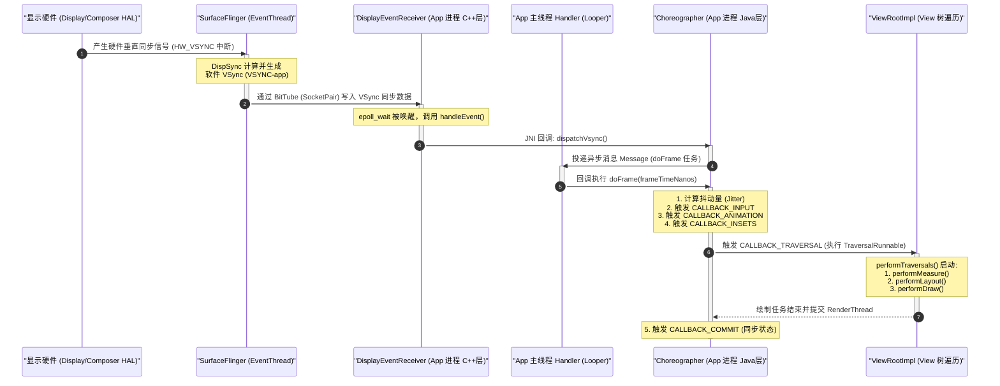

# 5.2.3.3 屏幕刷新机制

在 Android 视图体系中，屏幕刷新机制是连接应用层 UI 绘制与底层物理显示硬件的桥梁。无论是简单的控件重绘、复杂的属性动画，还是用户流畅的滑动手势，其底层都依赖于一套由垂直同步信号（VSync）驱动、Choreographer（编舞者）协调、SurfaceFlinger 合成并由底层物理屏幕渲染的严密流水线。本文将从底层的物理显示原理出发，层层剖析 Android 屏幕刷新机制的演进历程、双缓冲与三缓冲的物理机理、Choreographer 的工作流程，以及跨进程 VSync 分发与 Android 12+ 动态帧率（VRR）的适配。

---

## 1. 屏幕刷新与双缓冲机制的物理机理

要理解 Android 的屏幕刷新，首先必须从物理显示硬件的渲染逻辑讲起。

### 1.1 屏幕刷新频率（Hz）与 GPU 渲染帧率（FPS）
在物理世界中，显示器（如 LCD、OLED 屏幕）是通过电子枪逐行扫描或发光二极管按像素点阵快速刷新来呈现画面的。
*   **屏幕刷新频率（Refresh Rate，单位为 Hz）**：指的是屏幕硬件每秒钟从缓冲区读取数据并刷新屏幕画面的物理次数。例如，60Hz 的屏幕每 16.6ms 刷新一次，90Hz 的屏幕每 11.1ms 刷新一次，120Hz 的屏幕每 8.3ms 刷新一次。这是一个与硬件物理特性直接绑定的固定周期。
*   **GPU 渲染帧率（Frame Rate，单位为 FPS）**：指的是显卡/GPU 每秒钟能够渲染出新画面帧（Frame）的次数。GPU 的渲染帧率是动态变化的，它取决于 CPU 进行视图树遍历计算的复杂度、GPU 绘制顶点与片元的算力，以及当前界面的负载。

这两者是完全独立的软硬件模块，通过共享的图像缓冲区（Graphic Buffer）进行解耦。而如何同步这两个模块的步调，则是屏幕刷新机制要解决的核心物理课题。

### 1.2 单缓冲与屏幕撕裂（Screen Tearing）
在最原始的显示系统中，屏幕控制器（Display Controller）与 GPU 共享同一个缓冲区，即 **FrameBuffer（帧缓冲区）**。屏幕控制器自上而下逐行读取 FrameBuffer 中的像素数据并驱动像素点发光，这个过程称为**扫描（Scan）**。

在单缓冲（Single Buffer）结构下，如果 GPU 的写入速度与屏幕控制器的扫描速度不匹配，就会产生冲突。当屏幕控制器正在扫描第 $N$ 帧画面的中途，GPU 已经把第 $N+1$ 帧的画面写入了同一个 FrameBuffer。此时，屏幕控制器会直接读取新写入的像素，导致屏幕上半截显示的是旧的第 $N$ 帧画面，而下半截显示的是新的第 $N+1$ 帧画面。

这两帧画面的交界线在物理上被称为**撕裂线（Tear Line）**，而这种画面上下脱节的视觉缺陷就是**屏幕撕裂（Screen Tearing）**。

### 1.3 双缓冲（Double Buffering）与 VSync 的引入
为了解决屏幕撕裂问题，业界引入了**双缓冲机制（Double Buffering）**：
1.  **FrameBuffer（前缓冲区）**：专门供屏幕控制器读取，用于物理显示。
2.  **BackBuffer（后缓冲区）**：专门供 GPU 写入，用于绘制新一帧的内容。

在双缓冲结构中，当 GPU 在 BackBuffer 中渲染完一帧后，系统不会立即将内容呈现在屏幕上，而是等待屏幕控制器完成当前帧的扫描。当屏幕控制器完成一帧的扫描时，电子束会从右下角回到左上角准备开始下一帧的扫描，这个时间间隔被称为**垂直消隐期间（Vertical Blanking Interval，简称 VBI）**。

在这个消隐期，物理硬件会发出一个**垂直同步信号（VSync，Vertical Synchronization）**。收到 VSync 信号后，系统会将 FrameBuffer 与 BackBuffer 的指针进行对调（Swap），让原来的 BackBuffer 变成 FrameBuffer 供屏幕读取，原来的 FrameBuffer 变成 BackBuffer 供 GPU 渲染下一帧。由于指针对调发生在屏幕没有进行扫描的消隐期，因而彻底杜绝了扫描中途切换数据导致的屏幕撕裂。

---

## 2. 垂直同步信号（VSync）机制与 Project Butter

双缓冲虽然解决了屏幕撕裂，但在 Android 4.1 之前，由于 CPU/GPU 渲染的启动时机是随机的，依然会导致严重的**掉帧（Jank）**与卡顿。

### 2.1 没有 VSync 同步时的掉帧（Jank）机理
在没有 VSync 强制同步的年代，CPU 和 GPU 开始一帧渲染的时机取决于系统的调度与事件响应。

```
VSync 周期 1   |   VSync 周期 2   |   VSync 周期 3
[   Frame 0   ] | [   Frame 0   ] | [   Frame 1   ]  <- 屏幕显示
      |             |             |             
      +-- CPU 开始渲染 Frame 1 (太迟了，无法在周期 2 前完成)
```

如上图所示：
1.  在 VSync 周期 1 结束前，CPU 并没有立即开始第 1 帧的计算，而是在周期 1 的中途或后半段才被唤醒开始计算。
2.  到了第 2 个 VSync 信号到来时，由于 CPU/GPU 还没有完成第 1 帧的渲染，系统无法进行缓冲区指针交换（Swap）。
3.  屏幕控制器在周期 2 内只能继续读取并显示第 0 帧的内容，这在视觉上就表现为**画面停滞（Jank/掉帧）**。
4.  在周期 2 期间，第 1 帧渲染完成了，但它必须等待下一个 VSync（即第 3 个 VSync）到来时才能被交换显示。在周期 2 的后半段，CPU 和 GPU 却处于闲置状态，白白浪费了计算资源。

### 2.2 Project Butter（黄油计划）的引入
在 Android 4.1（参见 [AndroidVersionChangeLog.md](../../../../../AndroidVersionChangeLog.md)）中，Google 推出了著名的 **Project Butter（黄油计划）**，正式引入了 VSync 信号分发与协调机制。

黄油计划的核心思想是：**将 VSync 信号作为整个渲染系统的“时钟源”**。
*   一旦 VSync 信号发出，它不仅通知屏幕控制器去交换缓冲区，还会同步**唤醒 App 的主线程（CPU）开始处理用户输入、执行动画并遍历绘制 View 树**，同时**唤醒 GPU 开始进行合成和渲染**。
*   通过将 CPU/GPU 的起跑线对齐到 VSync 的节拍上，系统能确保在每个刷新周期开始时，CPU/GPU 拥有最完整的 16.6ms（以 60Hz 为例）或 8.3ms（以 120Hz 为例）渲染时间，极大地降低了因为起跑过晚导致的丢帧概率。

### 2.3 硬件 VSync 与软件 VSync
物理上，VSync 信号是由屏幕显示芯片（Display Driver IC）产生的硬件中断信号，称为 **HW_VSYNC**。
然而，如果每个 App 进程都直接监听硬件中断，会导致系统内核产生大量的上下文切换和中断开销。因此，Android 采用“硬件同步，软件分发”的设计：
*   **硬件 VSync（HW VSync）**：显示硬件产生的中断，传递给底层 HAL 层，进而传递给图形服务 `SurfaceFlinger`。
*   **软件 VSync（SW VSync）**：`SurfaceFlinger` 内部的 `DispSync` 线程会根据硬件 VSync 的历史周期进行锁相环（PLL）估算，模拟出高精度的软件 VSync 信号。
*   **EventThread 线程**：`SurfaceFlinger` 维护了两个 `EventThread` 线程，分别用于分发给 `SurfaceFlinger` 本身（用于图层合成）和各个 App 进程（用于绘制）。为了给 App 留出比合成更早的时间，App 的 VSync 信号往往会设置一个相移（Offset），使得 App 比 SurfaceFlinger 提前被唤醒。

---

## 3. 三缓冲机制（Triple Buffering）深度解析

虽然 VSync 规范了渲染的起点，但在高性能负载或 CPU/GPU 偶然发生突发超时时，双缓冲机制仍然会引发“级联式丢帧”，这正是引入**三缓冲机制（Triple Buffering）**的物理痛点。

### 3.1 双缓冲的超时痛点：级联延迟（Jank Bubble）
在双缓冲机制（只有 FrontBuffer 和 BackBuffer）下，一旦某帧发生渲染超时，会引发连续的卡顿反应：

```
VSync 信号:  | VSync 1      | VSync 2      | VSync 3      | VSync 4
屏幕显示:    | Frame 0      | Frame 0 (Jank)| Frame 1      | Frame 2
Buffer-A:   | Front(F0)    | Front(F0)    | Back(F1)     | Front(F2)
Buffer-B:   | Back(F1忙)   | Back(F1忙)   | Front(F1)    | Back(F3)
CPU/GPU状态: | 渲染 F1 (超) | 闲置(无Buffer) | 渲染 F2      | 渲染 F3
```

**详细步骤推演：**
1.  **VSync 1 到来**：CPU/GPU 开始渲染 `Frame 1`。由于 `Frame 1` 比较复杂，渲染耗时超过了一个周期（例如达到了 22ms）。
2.  **VSync 2 到来**：因为 `Frame 1` 尚未完工，BackBuffer（Buffer B）仍被 GPU 锁定。屏幕控制器无法交换缓冲区，屏幕被迫继续显示 `Frame 0`。**此时发生了一次 Jank（掉帧）**。
3.  **VSync 2 周期内**：在 VSync 2 期间的某个时间点（例如第 5ms），`Frame 1` 终于渲染完毕，Buffer B 变为了可交换状态。然而，**此时 CPU 想要立即开始渲染 `Frame 2`，却发现没有可用的 Buffer！** 因为 Buffer A 正被屏幕控制器读取（Front 状态），而 Buffer B 刚刚渲染完正处于等待下一次 VSync 交换的挂起状态。两个 Buffer 都被占满，**CPU 只能被迫处于闲置（Idle）状态，白白浪费了 VSync 2 剩下的 11.6ms 计算时间。**
4.  **VSync 3 到来**：缓冲区终于对调，Buffer B（Frame 1）送去显示，Buffer A 被释放回 App 端。**此时 CPU 才能开始渲染 `Frame 2`。**
5.  即使 `Frame 2` 的计算速度极快（只花了 8ms），但由于它在 VSync 3 时才“迟到”开始，所以它最早也只能在 VSync 4 时被送去显示。

**结论**：双缓冲的致命缺陷在于，**一旦发生一次超时，就会因为缓冲区的物理锁死导致 CPU 无法在下一个周期立即起跑，从而将卡顿效应向后级联传递，形成卡顿链。**

### 3.2 三缓冲机制的工作原理
为了打破这种级联阻塞，Android 在双缓冲的基础上引入了第三个缓冲区（**Graphic Buffer C**），形成**三缓冲机制（Triple Buffering）**：
*   **FrontBuffer（前缓冲区）**：屏幕控制器正在读取。
*   **BackBuffer（后缓冲区 1）**：GPU 正在写入或已写入等待交换。
*   **ThirdBuffer（后缓冲区 2）**：空闲，可供 CPU 立即写入。

我们用相同的超时场景对比三缓冲的运行过程：

```
VSync 信号:  | VSync 1      | VSync 2      | VSync 3      | VSync 4
屏幕显示:    | Frame 0      | Frame 0 (Jank)| Frame 1      | Frame 2 (流畅)
Buffer-A:   | Front(F0)    | Front(F0)    | Back(F1)     | Front(F2)
Buffer-B:   | Back(F1忙)   | Back(F1忙)   | Front(F1)    | 空闲释放
Buffer-C:   | 空闲         | 渲染 F2 (新)  | Back(F2)     | Back(F3)
CPU/GPU状态: | 渲染 F1 (超) | 渲染 F2      | 渲染 F3      | 渲染 F4
```

**详细步骤推演：**
1.  **VSync 1 到来**：CPU/GPU 开始在 Buffer B 渲染 `Frame 1`，发生超时。
2.  **VSync 2 到来**：`Frame 1` 未完成，屏幕继续显示 `Frame 0`。但此时，**CPU 不需要发呆等待！** 因为系统检测到 Buffer A（显示中）和 Buffer B（GPU 忙）都在被占用，于是立即分配或启用第三个缓冲区 Buffer C。CPU 可以在 VSync 2 到来时，**直接在 Buffer C 上开始 `Frame 2` 的渲染**。
3.  **VSync 2 周期内**：CPU 在 Buffer C 上平稳渲染 `Frame 2`；GPU 在中途完成了 Buffer B（Frame 1）的渲染。
4.  **VSync 3 到来**：屏幕控制器读取 Buffer B（Frame 1）并呈现。Buffer A 释放。同时，由于 CPU 在 VSync 2 周期内利用了 Buffer C，`Frame 2` 也已经渲染完毕。此时，CPU 释放 Buffer C 并获取刚释放的 Buffer A 开始渲染 `Frame 3`。
5.  **VSync 4 到来**：屏幕控制器读取 Buffer C（Frame 2）并呈现。

**结论**：三缓冲机制通过引入第三个缓冲区，**在双缓冲发生超时锁死的瞬间，为 CPU 提供了备用的写入通道，使得 CPU 能够不受阻碍地继续在下一个 VSync 节拍上起跑，从而在后续帧中将丢掉的时间“追”回来，阻断了卡顿的级联传播。**

### 3.3 三缓冲的代价与触发策略
三缓冲并非完美无缺，其主要代价是**增加了输入延迟（Input Latency）**。
在三缓冲饱和运行的状态下，用户从手指触摸屏幕（产生事件在 CPU 渲染），到画面最终呈现在屏幕上，中间经过了三个 Buffer 的周转（CPU 写入 -> GPU 渲染 -> 等待合成 -> 屏幕显示），这会导致视觉上的延迟感增加。

因此，Android 系统采用**动态弹性触发策略**：
1.  **默认双缓冲**：在系统流畅、帧率稳定时，系统只使用两个 Buffer，以保证最低的输入延迟（画面对用户操作的响应最实时）。
2.  **按需升级三缓冲**：当发生渲染超时，且在 VSync 到来时 App 主线程请求 Buffer 失败（发现前两个 Buffer 都被占用）时，系统才会动态分配或启用第三个 Buffer，让 CPU 继续工作。
3.  **降级回双缓冲**：当系统负载降低，缓冲区队列中有多余的空闲 Buffer 持续未被占用时，系统会自动回收/停用第三个 Buffer，退回到双缓冲状态。

---

## 4. VSync 信号分发与跨进程通信链路

VSync 信号由底层的硬件中断产生，而应用进程与系统服务 `SurfaceFlinger` 处于不同的进程。这需要一套极高性能、极低延迟的跨进程通信（IPC）机制来传递信号。

### 4.1 为什么不用 Binder？
Android 系统的核心 IPC 是 Binder。但在 VSync 分发场景下，Binder 并不适用：
1.  **开销过大**：Binder 通信涉及复杂的线程池调度、事务管理、Binder 驱动的用户态/内核态切换以及较重的数据序列化与反序列化。
2.  **高频传输**：在 120Hz 刷新率下，系统每 8.3ms 就需要向所有活跃的应用进程投递一次 VSync 信号，Binder 的开销会占用主线程宝贵的计算时间。

### 4.2 Linux SocketPair 与 Android BitTube 机制
为了追求极致的性能，Android 采用了基于 Linux Domain Socket 的 **`socketpair`** 机制，并在 C++ 层封装成了 **`BitTube`**。

*   `socketpair` 可以在无须经过网络协议栈的情况下，在本地内核中创建一对互通的套接字描述符（读端与写端）。
*   `BitTube` 本质上是一个单向的数据通道，专门用于传输固定大小的轻量级结构体。
*   **通信过程**：
    1.  `SurfaceFlinger` 进程中持有 `BitTube` 的写端描述符。
    2.  App 进程在创建与 `SurfaceFlinger` 的连接（`ISurfaceComposerClient`）时，系统会将 `BitTube` 的读端描述符通过 Binder 传递给 App 进程。
    3.  App 进程的 C++ 层将该读端描述符注册到主线程的 `Looper` 中，利用 **`epoll` 机制** 进行非阻塞监听。
    4.  当 VSync 信号产生时，`SurfaceFlinger` 写入一个 1 字节或极小结构的数据到 `BitTube`。内核立即唤醒处于 `epoll_wait` 阻塞状态的 App 主线程。由于直接在内核态完成状态触发，几乎零延迟。

### 4.3 完整的 VSync 分发调用链路
以下是 VSync 信号从底层硬件一步步传递到 App 主线程并触发绘制的完整调用链：

1.  **硬件中断触发**：物理屏幕产生硬件 VSync 中断，由底层的显示驱动（Disp DRV）捕获，并通过 HAL 层的 `Composer HAL` 回调通知 `SurfaceFlinger`。
2.  **SurfaceFlinger 过滤**：`SurfaceFlinger` 中的 `DispSync` 接收到硬件 VSync，经过软件锁相环校准，产生软件 VSync。随后，`EventThread`（具体为 `EventThreadConnection`）被唤醒。
3.  **跨进程写入**：`EventThread` 通过对应的 `BitTube` 写端，向所有请求了下一次 VSync 的 App 进程写入同步事件数据。
4.  **Client 接收**：App 进程主线程的 `Looper` 被 `epoll` 唤醒，调用 C++ 层 `DisplayEventReceiver` 的 `handleEvent()` 函数。
5.  **JNI 回调**：C++ 层 `DisplayEventReceiver` 通过 JNI，回调 Java 层的 `DisplayEventReceiver` 的 `dispatchVsync` 方法（该类由 `Choreographer` 的内部类 `FrameDisplayEventReceiver` 继承）。
6.  **主线程 Message 投递**：在 Java 层的 `dispatchVsync(long timestampNanos, long physicalDisplayId, int frame)` 中，将 VSync 事件封装成一个 `Message`，并作为 **异步消息（Asynchronous Message）** 投递到主线程的 `Handler`。
7.  **Looper 调度与 doFrame 执行**：由于使用了同步屏障（Sync Barrier），该异步消息被主线程 Looper 优先取出并执行，最终调用 `Choreographer.doFrame()`。

---

## 5. Choreographer 编舞者核心工作原理

`Choreographer`（编舞者）是 App 进程内协调所有渲染行为的核心大脑。它就像乐团的指挥家，统一指挥输入事件、动画执行和布局绘制的节拍。

### 5.1 Choreographer 的初始化与 ThreadLocal 绑定
`Choreographer` 采用单例模式，但它是线程唯一的（通过 `ThreadLocal` 绑定）：
```java
// Choreographer.java
private static final ThreadLocal<Choreographer> sThreadInstance =
        new ThreadLocal<Choreographer>() {
    @Override
    protected Choreographer initialValue() {
        Looper looper = Looper.myLooper();
        if (looper == null) {
            throw new IllegalStateException("The current thread must have a looper!");
        }
        Choreographer choreographer = new Choreographer(looper, VSYNC_SOURCE_APP);
        return choreographer;
    }
};

public static Choreographer getInstance() {
    return sThreadInstance.get();
}
```
通常，UI 的绘制都在主线程进行，因此调用 `Choreographer.getInstance()` 获取的是绑定了主线程 Looper 的 `Choreographer` 实例。

### 5.2 Callback 队列设计
`Choreographer` 内部维护了一个 `CallbackQueue` 数组，包含五种不同的回调队列类型。当 App 进程调用 `postCallback` 时，这些任务会被按类存入对应的链表中。

这五种回调类型（按执行优先级从高到低排序）如下：

| 队列类型常量 | 回调名称 | 执行阶段的具体含义与职责 |
| :--- | :--- | :--- |
| `CALLBACK_INPUT` | 输入阶段 | 处理屏幕触摸（TouchEvent）、按键事件。优先执行是为了让交互响应最敏捷，确保当前帧绘制能应用最新的用户位移数据。 |
| `CALLBACK_ANIMATION` | 动画阶段 | 执行属性动画（`ValueAnimator`、`ObjectAnimator`）以及各种自定义物理过渡动画。动画执行完毕后通常会改变 View 的属性。 |
| `CALLBACK_INSETS` | 窗口阶段 | 处理系统装饰条（状态栏、导航栏、软键盘）的布局改变与动效过渡。常用于适配全面屏及软键盘升降动画。 |
| `CALLBACK_TRAVERSAL` | 遍历绘制阶段 | 触发 `ViewRootImpl` 的 `performTraversals()`。该阶段会依次执行 `measure`（测量）、`layout`（布局）和 `draw`（绘制），是将 View 树树形结构转换为渲染指令的关键。 |
| `CALLBACK_COMMIT` | 提交阶段 | 在主线程完成 Traversal 任务并把绘制指令录入 `DisplayList` 传送给 `RenderThread` 后，执行最后的清理与状态同步，确保主线程和渲染线程步调协调。 |

### 5.3 核心 doFrame() 源码分析
当 VSync 信号通过 `DisplayEventReceiver` 唤醒主线程后，会调用 `Choreographer.doFrame`。我们来剖析其关键源码：

```java
void doFrame(long frameTimeNanos, int frame, DisplayEventReceiver.VsyncEventData vsyncEventData) {
    final long startNanos;
    final long frameIntervalNanos = vsyncEventData.frameInterval;
    synchronized (mLock) {
        if (!mFrameScheduled) {
            return; // 过滤重复/无效的 doFrame 请求
        }

        long intendedFrameTimeNanos = frameTimeNanos;
        startNanos = System.nanoTime();
        final long jitterNanos = startNanos - frameTimeNanos; // 计算当前时间与 VSync 预定时间的差值

        // 判断是否发生主线程阻塞导致的掉帧
        if (jitterNanos >= frameIntervalNanos) {
            final long skippedFrames = jitterNanos / frameIntervalNanos;
            // 当掉帧数达到阈值（默认 30 帧）时，在 Logcat 输出警告
            if (skippedFrames >= SKIPPED_FRAME_WARNING_LIMIT) {
                Log.i(TAG, "Skipped " + skippedFrames + " frames!  "
                        + "The application may be doing too much work on its main thread.");
            }
            // 重新计算对齐时间，修正动画时间轴，防止画面因时间断档发生剧烈跳跃（跳帧补偿）
            long lastFrameOffset = jitterNanos % frameIntervalNanos;
            frameTimeNanos = startNanos - lastFrameOffset;
        }

        mFrameInfo.setVsync(intendedFrameTimeNanos, frameTimeNanos, frame, ...);
        mFrameScheduled = false;
        mLastFrameTimeNanos = frameTimeNanos;
    }

    try {
        // 按优先级顺序，依次回调五个队列中的所有任务
        Trace.traceBegin(Trace.TRACE_TAG_VIEW, "Choreographer#doFrame");

        // 1. 执行输入回调
        mFrameInfo.markInputStart();
        doCallbacks(Choreographer.CALLBACK_INPUT, frameTimeNanos, frameIntervalNanos);

        // 2. 执行动画回调
        mFrameInfo.markAnimationsStart();
        doCallbacks(Choreographer.CALLBACK_ANIMATION, frameTimeNanos, frameIntervalNanos);

        // 3. 执行窗口装饰回调
        mFrameInfo.markInsetsAnimationStart();
        doCallbacks(Choreographer.CALLBACK_INSETS, frameTimeNanos, frameIntervalNanos);

        // 4. 执行绘制遍历回调 (触发 ViewRootImpl.performTraversals)
        mFrameInfo.markPerformTraversalsStart();
        doCallbacks(Choreographer.CALLBACK_TRAVERSAL, frameTimeNanos, frameIntervalNanos);

        // 5. 执行最后的提交同步回调
        doCallbacks(Choreographer.CALLBACK_COMMIT, frameTimeNanos, frameIntervalNanos);
    } finally {
        Trace.traceEnd(Trace.TRACE_TAG_VIEW);
    }
}
```

#### doFrame() 的核心逻辑说明：
1.  **计算抖动（Jitter）与跳帧警告**：
    `frameTimeNanos` 是底层 VSync 信号产生的标准时间戳，而 `startNanos` 是主线程开始执行 `doFrame` 的实际物理时间。
    如果 `jitterNanos = startNanos - frameTimeNanos` 大于一个 VSync 周期，说明主线程在 Looper 调度这个消息前，被其他耗时任务（如 I/O 操作、主线程解析 JSON 等）阻塞了。一旦跳帧数超过预设限额，系统就会打印日志警告。
2.  **时间戳对齐修正**：
    为了使属性动画在发生丢帧后依然看起来平滑，Choreographer 会动态将 `frameTimeNanos` 调整为最接近当前物理时间的一个 VSync 周期节点。这保证了动画在计算属性插值（Fraction）时使用的是“平滑过后的虚拟时间”，从而避免了动画画面因为时间突变发生跳变。
3.  **doCallbacks() 的分步执行**：
    `doCallbacks` 内部会遍历对应类型的链表，取出所有的 Runnable 并执行。在这个过程中，`CALLBACK_TRAVERSAL` 会触发 `ViewRootImpl` 绑定的 `TraversalRunnable`，执行测量、布局和绘制。

---

## 6. 高刷新率与动态帧率（Android 12+ VRR 适配）

随着屏幕硬件演进，固定 60Hz 刷新的局限性愈发明显，可变刷新率（Variable Refresh Rate，VRR）与高刷新率成为了现代移动设备的标配。

### 6.1 可变刷新率（VRR）的物理与系统实现
传统的屏幕驱动以固定周期发送 VSync。在 VRR 硬件下，屏幕控制器可以动态改变两次物理刷新之间的间隔。例如，在用户静止阅读文字时，屏幕可以降频至 10Hz/30Hz；在滑动手势或游戏进行时，瞬间拉升到 90Hz/120Hz。
*   **功耗与续航的权衡**：120Hz 下单帧渲染时间缩短至 8.3ms，GPU 绘制和图层合成的频率翻倍，会导致电量消耗剧增并伴随 CPU/GPU 发热降频。VRR 可以在静态画面时降低刷新率，极大地降低显示面板与处理器的功耗。
*   **画面撕裂与 Judder（抖动）的避免**：如果将一个 24fps 的视频强行在 60Hz 的屏幕上播放，由于 60 无法被 24 整除，必须使用 3:2 Pulldown 算法，导致某些视频帧显示 3 次，某些帧显示 2 次，产生画面的不均匀抖动（Judder）。通过 VRR，系统可以将屏幕刷新率直接调整为 24Hz 或 48Hz，使每一帧的显示时间完全均等。

### 6.2 Android 12 的动态帧率 API：`Surface.setFrameRate`
为了在应用层精准控制物理刷新率，Android 12（参见 [AndroidVersionChangeLog.md](../../../../../AndroidVersionChangeLog.md)）规范并强化了动态帧率的配置 API。应用层可以通过 `Surface.setFrameRate()` 主动提示系统当前期望的帧率：

```java
// Surface.java
public void setFrameRate(float frameRate, int compatibility, int changeFrameRateStrategy)
```

#### 参数详解：
1.  **`frameRate`**：期望的帧率数值（例如 `60.0f`，`120.0f`）。传入 `0f` 代表清除之前的帧率设定，交由系统自行托管。
2.  **`compatibility`（帧率兼容类型）**：
    *   `FRAME_RATE_COMPATIBILITY_DEFAULT`：默认值。表示期望帧率，但没有特殊要求。系统会根据其他 Surface 的状态和全局策略综合决定。
    *   `FRAME_RATE_COMPATIBILITY_FIXED_SOURCE`：**固定源帧率**。通常用于视频播放器。表明该 Surface 呈现的内容有固定的帧率（如 24fps），系统应当尽一切可能匹配物理刷新率为此刷新率的整数倍（如 24Hz、48Hz 或 120Hz），以彻底消除抖动。
3.  **`changeFrameRateStrategy`（帧率切换策略）**：
    *   `FRAME_RATE_CHANGE_SEAMLESS_ONLY`：**仅限无缝切换**。只有在硬件支持平滑切换（不产生短暂黑屏、闪烁或亮度突变）时，系统才会改变物理刷新率。这适用于普通的 UI 页面滑动，保障切换过程中的视觉连续性。
    *   `FRAME_RATE_CHANGE_ALWAYS`：**总是切换**。即使会产生短暂的黑屏、闪烁或亮度抖动，也强制改变物理刷新率。这通常适用于全屏视频播放开始、大型 3D 游戏启动等场景，此时用户对短暂的画面过渡是可以接受的，而更契合的物理刷新率能够带来更持久的绝佳体验。

---

## 7. 屏幕刷新机制核心时序流程图

下面使用 Mermaid 语法画出从底层硬件 VSync 中断产生，经 SurfaceFlinger 投递，到 Choreographer 响应，再到 App 主线程执行绘制（doFrame）的完整时序图。



---

## 8. 常见卡顿与丢帧的根因与优化分析

在实际开发中，深刻理解屏幕刷新机制有助于我们排查各种诡异的卡顿和掉帧问题。以下是基于刷新机制总结的常见卡顿根因：

1.  **主线程耗时任务（阻碍 doFrame 及时响应）**：
    由于 Choreographer 投递的 doFrame 消息最终是通过主线程的 Looper 调度执行的。如果主线程当前正在执行一个耗时的 I/O 操作、复杂的布局反射解析、大量的 JSON 转换或大量的内存分配，主线程就会被死死卡住。等 Looper 终于有空调度 doFrame 消息时，距离 VSync 产生的时间已经过去了很久（`jitterNanos` 严重超限），导致系统不得不抛弃这一帧，产生 Skipped 丢帧警告。
2.  **同步屏障（Sync Barrier）泄漏**：
    为了保证渲染消息（doFrame）能被第一时间执行，`ViewRootImpl` 会在申请 VSync 前向主线程消息队列发送一个**同步屏障**。同步屏障会挂起消息队列中所有的同步消息，只允许异步消息（例如 doFrame）通过。如果 `ViewRootImpl` 在绘制完成后由于某种 Bug 没有移除这个同步屏障，就会导致主线程的所有普通消息（如点击事件、生命周期回调）全部无法执行，使得应用界面彻底假死。
3.  **GPU 渲染超时（Buffer 锁死）**：
    即使主线程的 `performTraversals` 速度极快，但如果界面的层级过于复杂、过度绘制（Overdraw）严重、或者使用了过多复杂的离屏渲染（Offscreen Buffer），会导致 `RenderThread` 在向 GPU 提交指令时发生阻塞。GPU 耗时严重会直接把当前的 `BackBuffer` 锁死。当下一个 VSync 到来时，App 进程由于申请不到新的空闲 Buffer，即使主线程是闲置的也无法启动下一帧的计算，从而导致卡顿。
4.  **高刷下的渲染耗时窗口收缩**：
    随着屏幕物理刷新率提升到 120Hz，渲染耗时窗口从 16.6ms 缩短到了 8.3ms。这意味着任何主线程或渲染线程中超过 6ms 的波动都会直接导致丢帧。在高刷设备上，开发者必须更加激进地将数据解析、文件读写、多媒体解码等工作从主线程剥离，并尽量减少布局层级以压缩 Measure/Layout 的时间开销。
