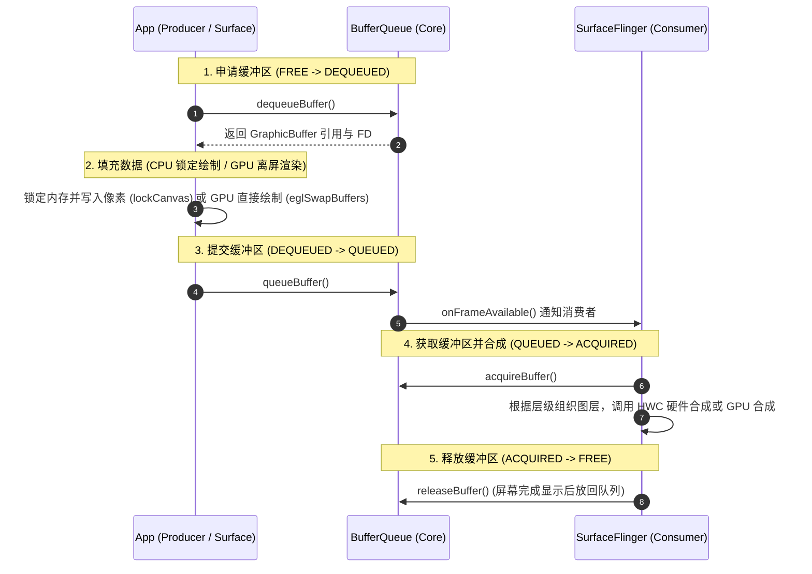

# 5.2.3.4 Surface 机制解析

在 Android 图形系统中，`Surface` 是所有图形渲染的核心载体。无论是普通 View 树的渲染、视频播放的硬解码输出，还是 3D 游戏引擎的画面呈现，其底层最终都指向了 `Surface`。

本文将从底层的生产者-消费者模型入手，深度剖析 `Surface` 的物理载体、与 `SurfaceFlinger` 的窗口合成机制、`SurfaceView` 的独立窗口“挖洞”渲染原理，以及 `TextureView` 的硬件加速纹理挂载机制，并解析 `GLSurfaceView` 的后台 `EGL` 环境搭建。

---

## 1. 核心概念与数据结构（是什么）

要理解 `Surface` 机制，必须剥离 Java 层的表象，深入到 Native 层甚至内核态的图形共享内存架构。

### 1.1 Java 层 Surface 的本质：指向 Native 画布的“外壳”

在 Java 层，`android.view.Surface` 的类定义中，最核心的成员变量是一个指针：
```java
// Surface.java 中的 Native 对象指针
private long mNativeObject; // 指向 Native 层的 android::Surface 对象
```
在 Java 层调用 `Surface` 的绘制方法时，最终都是通过 JNI 路由到 Native 层的 `android::Surface`。

在 Native 层（C++ 中），`android::Surface` 继承自 `ANativeWindow`。`ANativeWindow` 是 Android 系统为本地窗口定义的通用抽象基类，它封装了图形缓冲区的申请（`dequeueBuffer`）、提交（`queueBuffer`）等基础操作。

因此，**Java 层的 `Surface` 本质上只是一个包装了 C++ `android::Surface` 指针的壳**，而底层真正管理图形缓冲区流转的是 **`BufferQueue`**。

### 1.2 底层物理载体：BufferQueue 生产者-消费者模型

Android 系统的整个图形架构是建立在 `BufferQueue`（缓冲区队列）基础之上的。这是一种经典的**生产者-消费者（Producer-Consumer）**模型。

```
+-----------------------------------------------------------+
|                      BufferQueueCore                      |
|                                                           |
|  +---------+     +-----------+     +---------+     +---+  |
|  |  FREE   | --> | DEQUEUED  | --> | QUEUED  | --> | A |  |
|  +---------+     +-----------+     +---------+     +---+  |
|       ^                                              |    |
|       |                 releaseBuffer                v    |
|       +---------------------------------------- [ACQUIRED]|
+-----------------------------------------------------------+
        |                                              |
     Producer                                       Consumer
(App / Surface.lockCanvas)                  (SurfaceFlinger / GPU)
```

#### 1.2.1 核心组件与接口
*   **BufferQueueCore**：核心数据结构，用于维护图形缓冲区的状态机及队列，通常运行在系统服务进程中。
*   **Producer（生产者）**：图形数据的提供者。其核心接口是 `IGraphicBufferProducer`。在 App 端，`Surface` 内部持有该接口的 Binder 代理对象，通过它向 `BufferQueue` 申请空的缓冲区，渲染完成后再将缓冲区提交回队列。
*   **Consumer（消费者）**：图形数据的接收者和使用者。其核心接口是 `IGraphicBufferConsumer`。最主要的消费者是 **`SurfaceFlinger`**（系统窗口合成器），它负责读取缓冲区内容并进行多图层合成；另一个常见消费者是 **`SurfaceTexture`**（用于将缓冲区转化为 GPU 纹理）。

#### 1.2.2 缓冲区状态转换
`BufferQueue` 内部的一块缓冲区（`GraphicBuffer`）在生命周期中会在以下四种状态间转换：
1.  **`FREE`**：空闲状态。此时缓冲区归 `BufferQueue` 所有，可以被生产者申请。
2.  **`DEQUEUED`**：出队状态。生产者通过 `dequeueBuffer()` 申请了这块缓冲区。此时生产者拥有缓冲区的写入权，正在往里面填充数据（通过 CPU 软件绘制或 GPU 硬件渲染）。
3.  **`QUEUED`**：入队状态。生产者完成数据填充后，通过 `queueBuffer()` 将缓冲区放回队列。此时缓冲区正等待消费者读取。
4.  **`ACQUIRED`**：获取状态。消费者通过 `acquireBuffer()` 拿到了这块缓冲区，准备进行合成或纹理采样。此时生产者无法对该缓冲区进行写操作。合成结束后，消费者调用 `releaseBuffer()` 将其放回，状态重新变回 `FREE`。

### 1.3 共享内存机制：GraphicBuffer 与 AHardwareBuffer

图像数据的像素数组极其庞大（例如一个 1080P、32 位的帧缓冲区大小时约为 $1920 \times 1080 \times 4 \text{ 字节} \approx 8.3\text{ MB}$）。如果每一帧在 App 进程和 SurfaceFlinger 进程之间进行进程间内存拷贝，系统性能将彻底崩溃。因此，Android 采用**共享显存/内存**来传递图形数据。

#### 1.3.1 GraphicBuffer 的物理本质
`GraphicBuffer` 是 Android 图形内存的载体。它的底层封装了通过 **`Gralloc`**（Graphic Allocator）分配的本地图形缓冲区（通常基于 `ion` 驱动或现代的 `dma-buf` 驱动）。
*   `GraphicBuffer` 持有一个文件描述符（FD）句柄（`buffer_handle_t`）。
*   当 `GraphicBuffer` 通过 Binder 跨进程传递时，系统并没有复制实际的像素数据，而只是通过 Binder 驱动**复制并传递了文件描述符（FD）**。
*   接收进程（如 `SurfaceFlinger`）在收到 FD 后，通过内核将该文件描述符重新映射（`mmap`）到自身的进程地址空间。
*   通过这种“共享文件描述符”的设计，App 进程与 SurfaceFlinger 进程指向了**同一块物理显存**，实现了真正的**零拷贝（Zero-Copy）**图形传输。

#### 1.3.2 AHardwareBuffer 的引入
在 [Android 8.0 (API 26)](../../../../../AndroidVersionChangeLog.md) 中，Google 引入了 **`AHardwareBuffer`** 这一 NDK APIs。
*   **设计动机**：此前，Native 层的 C++ 开发者若想直接操作 `GraphicBuffer`，必须依赖非公开的、不稳定的 libui 和 libgui 系统库。一旦 Android 版本升级，这些私有 API 极易发生崩溃或链接失败。
*   **技术实现**：`AHardwareBuffer` 是对 C++ `GraphicBuffer` 的一层官方 NDK 封装。它允许 Native 层的游戏引擎、Vulkan API 或者是 Native 视频解码器，无需 Java 层中转，便可以直接申请共享内存，并将其绑定为 OpenGL 纹理或 Vulkan Image，极大地简化了高性能跨进程图形管道的开发。

---

## 2. 窗口合成与 SurfaceFlinger 交互机制（怎么做）

当应用在屏幕上画图时，底层的 Buffer 数据是通过双缓冲或三缓冲队列，在应用（生产者）和 SurfaceFlinger（消费者）之间高速流转的。

### 2.1 Surface 生产者-消费者双缓冲交互流向

以下是 Surface 作为 Buffer 生产者与底层 BufferQueue、消费者 SurfaceFlinger 交互的核心数据流向和状态机变迁图：



### 2.2 软件绘制（lockCanvas）的数据流向

当应用没有开启硬件加速，或者主动使用 `SurfaceHolder.lockCanvas()` 进行软件绘制时，数据的具体流动过程如下：

```
[ App Process / UI Thread ]               [ Binder / System ]           [ SurfaceFlinger ]
            |                                      |                            |
  1. lockCanvas()                                  |                            |
      |---> dequeueBuffer() ---------------------->|                            |
      |<--- 返回 GraphicBuffer <-------------------|                            |
      |                                            |                            |
  2. CPU 往 Buffer 中写像素 (Skia / Canvas)           |                            |
      |                                            |                            |
  3. unlockCanvasAndPost()                         |                            |
      |---> queueBuffer() ------------------------>|                            |
                                                   |---> onFrameAvailable() --->|
                                                   |                            | 4. VSYNC 触发合成
                                                   |                            |---> acquireBuffer()
                                                   |                            |---> 硬件 HWC/GPU 合成
                                                   |                            |---> releaseBuffer()
```

1.  **锁定缓冲区（Lock）**：
    *   应用调用 `lockCanvas(Rect dirtyRect)`。
    *   底层通过 Native `android::Surface` 向 `BufferQueue` 发起 `dequeueBuffer()` 请求，取得一块 `FREE` 状态的 `GraphicBuffer`，并将其状态置为 `DEQUEUED`。
    *   底层调用 `gralloc` 的 `lock()` 方法，锁定这块共享显存，将其物理地址映射为应用进程内可直接读写的虚拟内存指针。
    *   Native 层将此内存指针包装为 `SkBitmap`，再在此基础上创建 `SkCanvas`，最终返回给 Java 层的 `Canvas` 对象。
2.  **绘制（Draw）**：
    *   应用在 Java 层调用 `canvas.drawXXX()`。所有的 Skia 软件渲染指令都会通过 CPU 计算，直接写入刚才被映射的 `GraphicBuffer` 共享内存空间。
3.  **解锁并提交（Unlock & Post）**：
    *   绘制完成后，应用调用 `unlockCanvasAndPost()`。
    *   底层调用 `gralloc::unlock()` 解除内存锁定，刷新 CPU Cache，确保 GPU 或其他硬件能正确读取该内存数据。
    *   通过 `IGraphicBufferProducer::queueBuffer()` 接口，向 `BufferQueue` 发起入队申请，将缓冲区状态修改为 `QUEUED`。
    *   `BufferQueue` 触发 `onFrameAvailable()` 回调，通知消费者。

### 2.2 硬件加速绘制（RenderThread 与 EGL）

现代 Android 应用默认开启硬件加速，其数据流向不经过 `lockCanvas()` 的 CPU 拷贝过程，而是利用 **`RenderThread`** 线程和 GPU 直接完成：
1.  应用的 UI 线程将绘制指令（如 DrawRect, DrawTexture）录制到 `DisplayList` 中。
2.  UI 线程将 `DisplayList` 同步给 `RenderThread`，随后 UI 线程被释放，可以继续响应用户事件。
3.  `RenderThread` 通过 **`EGL`** 与 GPU 建立上下文连接，其绑定的本地窗口即为 Native `ANativeWindow`（Surface）。
4.  当 `RenderThread` 通过 OpenGL ES/Vulkan 渲染完一帧后，调用 `eglSwapBuffers()`。
5.  在 `eglSwapBuffers()` 底层，它会隐式地触发 Native Surface 的 `queueBuffer()`，将渲染完毕的 `GraphicBuffer` 直接回收到 `BufferQueue` 中，通知 `SurfaceFlinger`。

### 2.3 SurfaceFlinger 的合成工作流

`SurfaceFlinger` 是 Android 系统的总屏幕合成器。它作为一个独立的系统级守护进程运行，消费着全系统所有的 `BufferQueue`。

#### 2.3.1 合成阶段
1.  **接收 VSYNC 信号**：`SurfaceFlinger` 的合成循环受硬件屏幕的 VSYNC（垂直同步）信号驱动。
2.  **获取 Buffer（Acquire）**：当 VSYNC 信号到来时，`SurfaceFlinger` 遍历系统中的所有 Layer（每一个窗口，如 Activity 窗口、状态栏、导航栏，在底层都对应一个 `Layer`，每个 Layer 都有自己的 `BufferQueue`）。它通过 `acquireBuffer()` 从对应的 `BufferQueue` 中取得处于 `QUEUED` 状态的最新的 `GraphicBuffer`，并将其状态置为 `ACQUIRED`。
3.  **确定合成策略**：
    *   `SurfaceFlinger` 会根据每个 Layer 的几何位置、是否透明、是否重叠，与硬件合成芯片（**Hardware Composer, HWC**）进行协商。
4.  **执行合成（Composition）**：
    *   **硬件合成（Overlay / Device Mode）**：这是最优先、最高效的合成方式。如果 HWC 芯片支持，`SurfaceFlinger` 会直接把各个 Layer 的 `GraphicBuffer` 内存句柄和几何参数送入 HWC 寄存器。由显示控制器（Display Controller）在扫描输出到屏幕时，硬件实时混合图层。这种合成**完全不消耗 GPU 和 CPU**，省电且速度极快。
    *   **GPU 合成（Client Mode）**：如果图层过多、存在复杂的圆角裁剪、或存在 HWC 无法处理的 3D 变换，`SurfaceFlinger` 会退回到 GPU 合成。它会启动 OpenGL ES，将各图层的 `GraphicBuffer` 作为纹理贴图，绘制到一个系统级的 Framebuffer（帧缓冲区）中，再将混合后的结果送往屏幕。
5.  **释放 Buffer（Release）**：一帧在屏幕上显示完毕（或被下一帧覆盖）后，`SurfaceFlinger` 会调用 `releaseBuffer()` 将该 `GraphicBuffer` 还回对应的 `BufferQueue`，使其状态重新变为 `FREE`，供 App 重复出队（`dequeue`）使用。

---

## 3. SurfaceView 深度剖析（重难点）

在 Android 的 UI 体系中，所有的标准 View 均共享同一个主窗口的 Surface，并统一由宿主 Activity 的 UI 线程进行绘制。然而，`SurfaceView` 是一个特殊的另类。

### 3.1 为什么 SurfaceView 拥有独立的 Surface？

普通 View 的层级结构再复杂，它们在 WindowsManagerService (WMS) 侧也只对应一个 `WindowState`（即一个窗口）。所有的 View 最终都会通过主线程被绘制在同一个 Surface 上。

而 `SurfaceView` 在被解析并加到 View 树时：
1.  它的内部持有自己专属的 `mSurface`。
2.  它会通过 Binder 向 WMS 申请创建一个**全新的、独立的子窗口（Child Window）**。这个子窗口在 WMS 和 SurfaceFlinger 侧对应一个**完全独立的 Layer**。
3.  因此，在 SurfaceFlinger 看来，`SurfaceView` 的画面是独立于主 Activity 窗口的。它有自己专属的 `BufferQueue` 和渲染管线。

### 3.2 挖洞原理（Punch a Hole）

由于 SurfaceView 的 Surface 是一个独立的窗口 Layer，默认情况下，它的 Z-Order 层级被放置在主 Activity 窗口 Layer 的**下方**（即背后）。如果不做特殊处理，主 Activity 窗口上不透明的背景和 View 树会直接将它完全遮挡。

为了让用户能看到下方的 SurfaceView 画面，系统引入了**挖洞（Punch a Hole）**机制：

```
[ Z-Order High ]  +-----------------------------------+
                  |  主 Activity 窗口 Layer (包含View树) |
                  |                                   |
                  |         +---------------+         |
                  |         |  "透明洞"      |         |  <-- 像素 Alpha 被清除为 0 (Mode.CLEAR)
                  |         +---------------+         |
                  +---------|---------------|---------+
                            |               |
                            v   透过洞往下看   v
[ Z-Order Low ]   +---------|---------------|---------+
                  |  SurfaceView 独立窗口 Layer       |
                  |                                   |
                  |         [视频画面/游戏画面]         |
                  +-----------------------------------+
```

1.  **占位与定位**：在主窗口的 View 树中，`SurfaceView` 本身作为一个特殊的 View 节点，负责在布局中占位，并将其在屏幕上的绝对几何坐标（Left, Top, Width, Height）通知给底层的窗口管理器。
2.  **清除像素（挖洞）**：在主窗口绘制时，当绘制到 `SurfaceView` 这个 View 节点时，它的 `onDraw()` 方法并不绘制任何自身内容，而是利用特殊的 Canvas 混合模式：
    ```java
    // 伪代码：底层通过设置 PorterDuff 混合模式清除像素
    paint.setXfermode(new PorterDuffXfermode(PorterDuff.Mode.CLEAR));
    canvas.drawRect(mLeft, mTop, mRight, mBottom, paint);
    ```
    *   `PorterDuff.Mode.CLEAR` 模式会将目标区域的所有像素通道（A, R, G, B）的像素值直接清空为 `0`。
    *   这意味着主 Activity 窗口在其 GraphicBuffer 的对应矩形区域上，产生了一个**完全透明的“空洞”**（Alpha = 0）。
3.  **多层合成**：当 `SurfaceFlinger` 进行窗口合成时，由于主 Activity 窗口在该区域是透明的，因此在叠放合成后，底层的 `SurfaceView` 窗口内容便完美地透过这个“透明洞”显现了出来。

> [!NOTE]
> 如果通过 `surfaceView.setZOrderOnTop(true)` 将其放置在主窗口之上，则不再需要挖洞，但此时 SurfaceView 的画面将覆盖在主窗口所有普通 View（如弹窗、悬浮按钮）的上方。

### 3.3 高性能优势

SurfaceView 的这种双窗口、隔离 Surface 设计，带来了极高的渲染性能：
*   **线程隔离**：应用可以开启一个纯粹的后台渲染线程（通常称为 `RenderThread` 或 `GLThread`），在该后台线程中持有一个死循环，源源不断地调用 `lockCanvas()` 和 `unlockCanvasAndPost()`，或者执行 OpenGL 渲染。这**完全不占用 UI 主线程**，即便后台渲染因重载卡顿，也绝不会导致主线程发生 ANR。
*   **规避主 View 树重绘**：在标准 View 中，只要局部内容发生变化，就必须调用 `invalidate()`，进而导致整条 View 树链路发生 `measure`、`layout`、`draw` 的重算。而 `SurfaceView` 局部的画面更新只是向其专属的 `BufferQueue` 提交 Buffer，完全不触发宿主 View 树的任何重绘流程。
*   **适合硬解输出**：视频播放器（如 `MediaPlayer`、`ExoPlayer`）或相机预览（`Camera`）可以通过底层 C++ 直接将硬解码后的 YUV 数据输出到 `SurfaceView` 的 `Surface`，整个过程直接由硬解码芯片和 HWC 合成器对接，效率极高。

### 3.4 物理硬伤：无法应用普通 View 变换

尽管 SurfaceView 性能极其强悍，但在实际开发中，它却存在一个致命的“物理硬伤”：**无法完美应用平移、旋转、缩放、透明度渐变等普通 View 变换动画。**

#### 3.4.1 硬伤的物理原因
*   在 Android 中，View 的平移、缩放、旋转和透明度等变换（如 `setTranslationX()`，`setRotation()`，`setAlpha()`）是作用在**主窗口 Canvas 内部的矩阵运算**上的。
*   然而，SurfaceView 的核心画面是在**另一个独立的窗口 Layer**上渲染的。主窗口的 Canvas 变换根本无法跨窗口作用到另一个并立的 Surface 窗口中。
*   如果你对 SurfaceView 执行平移或缩放动画，主窗口 View 树里那个用于“挖洞”的占位 View 会随着动画发生平移和缩放（洞在动），但底层的独立窗口却无法实时、精确地同步这些变换。

#### 3.4.2 抖动与白边/黑边现象
为了让独立窗口跟随主窗口移动，SurfaceView 的占位 View 会在每次布局改变时，向系统服务 `WindowManagerService` 发起跨进程的窗口几何参数修改请求（`relayoutWindow`），由 WMS 动态修改独立窗口的位置和大小。
*   **时序不同步**：主 View 树的渲染是在应用的 UI 线程和 `RenderThread` 中由主窗口的 VSYNC 驱动的；而 WMS 对窗口位置的修改、SurfaceFlinger 对窗口层级的重建是跨进程且异步的。
*   **后果**：由于两者的帧率和位置同步在时间轴上无法完全对齐，在进行滑动、缩放或转场动画时，主窗口的“透明洞”与底层的“独立窗口”会发生明显的错位。这种错位在视觉上表现为边缘处严重闪烁、出现白色或黑色的色块拉伸（俗称“黑边”或“抖动”）。

---

## 4. TextureView 机制与对比（重难点）

为了解决 `SurfaceView` 无法应用动画、无法与普通 View 树进行良好融合的物理硬伤，Android 在 [Android 4.0 (API 14)](../../../../../AndroidVersionChangeLog.md) 中引入了 **`TextureView`**。

### 4.1 为什么 TextureView 必须硬件加速？

与 `SurfaceView` 另起炉灶申请独立窗口的思路不同，`TextureView` 并没有创建新的窗口，它在 WMS 侧依然属于主窗口的一部分。
*   它的核心思想是：**将本该输出到屏幕的图形数据，重定向输出到 GPU 的一块纹理（Texture）中。**
*   这块纹理作为图形材质被挂载在主 View 树上，在主窗口渲染时，由 GPU 直接将这块纹理贴图绘制在 Canvas 上。
*   **强依赖硬件加速**：由于 CPU 软件 Canvas 无法直接操作显存中的 GPU 纹理，因此 `TextureView` 必须在**硬件加速开启**（使用 GPU 渲染 View 树）的前提下才能工作。如果关闭了硬件加速，`TextureView` 将完全黑屏。

### 4.2 SurfaceTexture 作为中间桥梁

`TextureView` 的底层核心是 **`SurfaceTexture`**。
`SurfaceTexture` 的角色是一个**消费者（Consumer）**，它内部包含了一个 `BufferQueue`。

```
[ 生产者: 视频播放器 / Camera ]
         |
         v (渲染画面)
   ANativeWindow (Surface)
         |
         v (queueBuffer)
   [ SurfaceTexture (BufferQueue) ]
         |
         +--> updateTexImage() [将最新 Buffer 转换为 GPU 外部纹理]
                    |
                    v (GL_TEXTURE_EXTERNAL_OES)
   [ TextureView.onDraw() ]
         |
         v (硬件加速 Canvas 绘制纹理贴图)
   主 Activity 窗口 Surface (与普通 View 混合)
```

1.  **导出 Surface**：`TextureView` 创建后，会导出一个 `SurfaceTexture`。我们可以通过它创建一个 `Surface`，并传给 `MediaPlayer` 或 `Camera` 作为输出目标。
2.  **转换为纹理**：当视频解码器或相机向该 `Surface` 写入一帧数据时，数据被 `queue` 到 `SurfaceTexture` 的队列中。`SurfaceTexture` 收到 `onFrameAvailable` 通知后，在它的渲染上下文里调用 `updateTexImage()`。该操作会释放旧的 Buffer，并将最新的 GraphicBuffer 内存直接绑定为 OpenGL ES 的一个外部纹理（通常是 `GL_TEXTURE_EXTERNAL_OES` 类型）。
3.  **View树挂载**：在主窗口的 VSYNC 渲染流程中，当遍历到 `TextureView` 时，硬件加速的渲染引擎（HWUI）会直接将这个外部纹理当作普通的 2D 材质，绘制在 `TextureView` 所占用的网格（Mesh）上。

### 4.3 完美融入 View 树与额外开销

*   **完美融入**：由于 `TextureView` 的内容在最终合成时，只是主窗口 Canvas 上绘制的一张纹理贴图，因此它完全符合普通 View 的渲染生命周期。你可以对它调用任意的旋转、缩放、Alpha 渐变动画，甚至将其包裹在 `ScrollView` 中滑动，画面都会保持完美的同步，绝不会出现任何错位和黑边。
*   **离屏缓冲与性能开销**：
    *   **内存开销更大**：对于 `SurfaceView`，Buffer 是直接从生产者流向底层的独立 Layer 窗口，由 SurfaceFlinger 进行一次性混合。而 `TextureView` 的 Buffer 在流向 `SurfaceTexture` 后，需要先被绑定为纹理，再由 HWUI 在一个独立的**离屏缓冲区（Offscreen Buffer）**中进行一次渲染混合，最终写入主窗口的 Surface，再由 SurfaceFlinger 合成。
    *   **帧延迟**：多出的一层显存纹理采样和主窗口 HWUI 混合，会导致 `TextureView` 比 `SurfaceView` 通常多出 **1 ~ 2 帧的渲染延迟**。
    *   **高能耗**：额外的 GPU 采样和离屏合成，使得在播放高分辨率视频（如 4K）或高帧率渲染时，`TextureView` 的能耗和发热量明显高于 `SurfaceView`。

### 4.4 SurfaceView vs TextureView 核心差异对比

| 对比维度 | SurfaceView | TextureView |
| :--- | :--- | :--- |
| **窗口机制** | 创建独立的子窗口（独立 Layer） | 不创建新窗口，属于主窗口内的一个 View |
| **渲染线程** | 支持完全独立的后台渲染线程，不阻塞 UI | 必须依赖主窗口的 `RenderThread` 进行合成 |
| **硬件加速** | 不需要，支持 CPU 软件绘制与 GPU 硬件绘制 | **强依赖**硬件加速，关闭后无法显示 |
| **动画与变换** | 物理硬伤：无法直接旋转/缩放，动画易有黑边 | 完美支持旋转、缩放、透明度、圆角裁剪等所有动画 |
| **内存与能耗** | 极低（直接送 SurfaceFlinger 合成） | 较高（有额外的显存缓冲与纹理采样开销） |
| **渲染延迟** | 极低（接近 0 延迟） | 存在 1 ~ 2 帧的纹理转换与离屏混合延迟 |
| **最佳适用场景** | 3D 游戏、4K/高清视频播放、相机取景器 | 悬浮窗视频、列表中的小视频播放、需要频繁动效的页面 |

---

## 5. GLSurfaceView 与 EGL 机制

在开发高性能 3D 游戏或需要调用 OpenGL ES 滤镜的视频应用时，开发者通常会选择使用 `GLSurfaceView`。

### 5.1 GLSurfaceView 的作用

`GLSurfaceView` 本质上是对 `SurfaceView` 的二次封装。它保留了 `SurfaceView` 独立窗口、高帧率渲染的优点，同时替开发者解决了两大痛点：
1.  **封装了线程模型**：OpenGL 的上下文（EGLContext）是严格与渲染线程绑定的，非渲染线程无法调用 GL 指令。`GLSurfaceView` 内部自动维护了一个后台渲染线程 **`GLThread`**。
2.  **自动搭建了 EGL 环境**：OpenGL 仅仅是一个跨平台的绘图指令规范，它并不负责窗口系统的创建和管理。要将 OpenGL 绘制的图像显示在 Android 的 Surface 上，必须依靠 **`EGL`** 适配层。`GLSurfaceView` 内部全自动完成了 EGL 环境的配置与生命周期绑定。

### 5.2 EGL 环境自动搭建流程

`GLSurfaceView` 内部的 `GLThread` 在启动后，会自动执行以下 EGL 初始化工作，将 OpenGL ES 与底层的 `Surface`（`ANativeWindow`）绑定：

```
[ GLThread 启动 ]
       |
       v
1. eglGetDisplay(EGL_DEFAULT_DISPLAY)  <-- 获取本地物理屏幕的显示连接
       |
       v
2. eglInitialize()                      <-- 初始化显示连接
       |
       v
3. eglChooseConfig()                   <-- 根据 RGB 通道数、深度缓存选择 EGL 配置
       |
       v
4. eglCreateContext()                  <-- 创建 GPU 状态机上下文 EGLContext
       |
       v
5. eglCreateWindowSurface()             <-- 将 Native 层的 Surface (ANativeWindow) 
       |                                   包装成 EGLSurface
       v
6. eglMakeCurrent()                    <-- 激活上下文，绑定当前渲染线程
       |
+------+---------------+
| 循环渲染中             |
|  - glDrawArrays()    |
|  - eglSwapBuffers()  | <-- 触发 BufferQueue::queueBuffer() 提交图像数据
+----------------------+
```

1.  **获取默认显示设备**：
    ```c++
    EGLDisplay eglDisplay = eglGetDisplay(EGL_DEFAULT_DISPLAY);
    ```
2.  **初始化 EGL 连接**：
    ```c++
    eglInitialize(eglDisplay, &majorVersion, &minorVersion);
    ```
3.  **选择配置（EGLConfig）**：根据应用设置的色彩格式（如 RGB888）、是否需要深度测试（Depth Buffer）、是否需要模板测试（Stencil Buffer）等参数，选择最接近的硬件配置：
    ```c++
    eglChooseConfig(eglDisplay, attribList, &config, 1, &numConfigs);
    ```
4.  **创建上下文（EGLContext）**：`EGLContext` 内部存储了 OpenGL 的所有状态机数据（如当前绑定的着色器、纹理、顶点缓冲区等）：
    ```c++
    EGLContext eglContext = eglCreateContext(eglDisplay, config, EGL_NO_CONTEXT, attribList);
    ```
5.  **创建 EGL 渲染表面（EGLSurface）**：这一步是最关键的结合点。它将 `SurfaceHolder` 里的 Native `Surface`（即 C++ 层的 `ANativeWindow` 指针）传入，创建出一个与屏幕物理窗口直接绑定的 `EGLSurface`：
    ```c++
    EGLSurface eglSurface = eglCreateWindowSurface(eglDisplay, config, nativeWindow, NULL);
    ```
6.  **绑定当前线程**：调用 `eglMakeCurrent()` 后，当前 `GLThread` 正式与该上下文及渲染表面绑定。此后在此线程调用的所有 `glClear()`, `glDrawArrays()` 等 OpenGL 绘图指令，其结果都会渲染到该 `EGLSurface` 上：
    ```c++
    eglMakeCurrent(eglDisplay, eglSurface, eglSurface, eglContext);
    ```
7.  **帧交换（Swap）**：当每一帧的 OpenGL 指令执行完毕后，调用 `eglSwapBuffers(eglDisplay, eglSurface)`。该操作在 Native 层会调用 `Surface::queueBuffer()`，将渲染好的 `GraphicBuffer` 提交回应用的 `BufferQueue` 中，通知 SurfaceFlinger 抓取并合成显示。

### 5.3 渲染驱动模式

`GLSurfaceView` 提供了两种渲染驱动模式，满足不同的能耗和性能诉求：
*   **`RENDERMODE_CONTINUOUSLY`（持续渲染）**：`GLThread` 内部会持有一个不受限的循环，只要上一帧渲染完毕并完成了 `SwapBuffers`，它就会立刻开始绘制下一帧。通常这一过程会受到底层 VSYNC 信号的节流限制（例如屏幕刷新率为 60Hz，则渲染速率被卡在 60FPS），这是游戏场景的默认选项。
*   **`RENDERMODE_WHEN_DIRTY`（按需渲染）**：`GLThread` 会在完成初始化后进入 `wait` 挂起状态。只有当开发者手动调用 `glSurfaceView.requestRender()`，或者底层的 Surface 尺寸发生变更时，渲染线程才会被唤醒并绘制单帧。这种模式非常适合静态的 OpenGL 界面或不需要高帧率的滤镜展示应用，能够极大地**降低 CPU 和 GPU 的能耗**。
