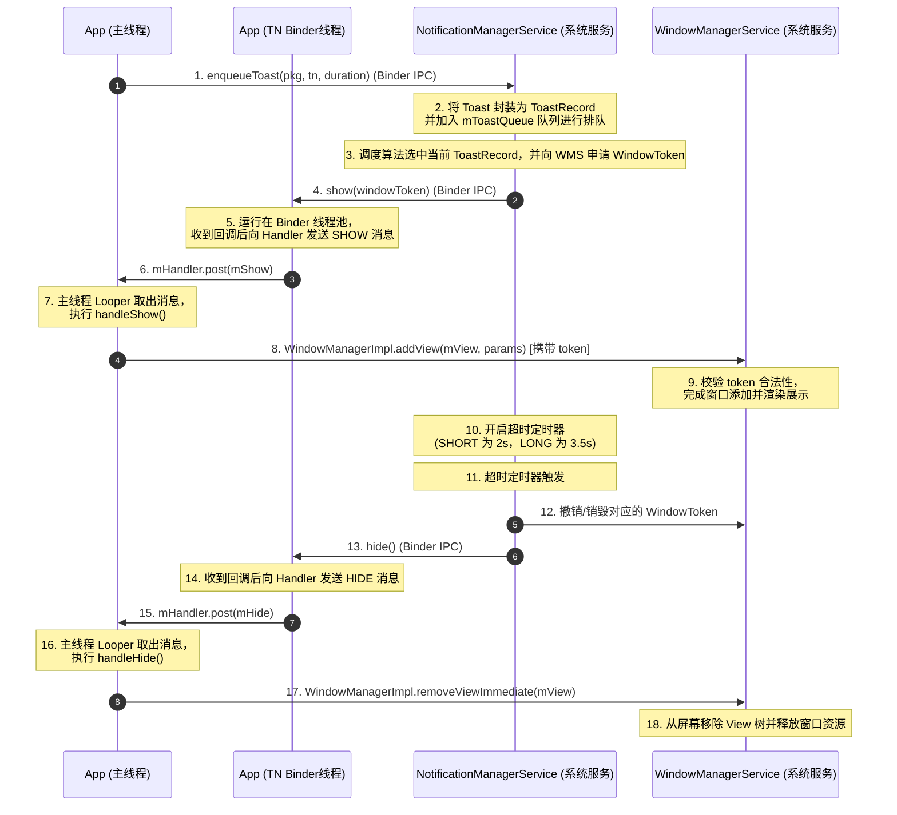

# 5.2.4.2 Toast 机制深度解构与版本演进

在 Android 系统中，`Toast` 是一种极其常用的轻量级提示组件。与普通的 `Activity` 或 `Dialog` 窗口不同，`Toast` 能够在应用处于后台、甚至在没有活跃页面的情况下在屏幕上悬浮显示，并在规定时间后自动消失。这种独特能力的背后，是一套高度精密、跨越应用进程与系统服务的 IPC 协同机制。

本文将深入 Android 源码，从窗口本质、跨进程通信（IPC）、TN 内部类、Handler 线程分发以及系统服务调度等多维度解构 `Toast` 的底层实现原理，并详尽剖析 Android 7.1 经典的 `BadTokenException` 崩溃根源，以及 Android 9.0 至 11+ 各个版本的安全限制与系统托管渲染的重构演进。

---

## 1. 核心概念与系统级悬浮通知本质

### 1.1 Toast 的窗口本质
在 Android 的窗口体系中，任何能显示在屏幕上的 UI 元素都必须依附于一个窗口（Window），而窗口的挂载、图层合成和窗口焦点的管理是由系统核心服务 `WindowManagerService (WMS)` 统一负责的。
`Toast` 的本质就是一个**系统级的悬浮通知窗口**。在 API 26（Android 8.0）之前，`Toast` 窗口对应的类型通常是 `WindowManager.LayoutParams.TYPE_TOAST`。这种类型的窗口非常特殊，它在设计初衷上是用于系统通知的。因此，它不需要应用声明任何特殊的悬浮窗权限（如 `SYSTEM_ALERT_WINDOW`），就能够直接悬浮在大多数应用窗口之上，并具有极高的图层优先级。

### 1.2 IPC 架构与 NotificationManagerService (NMS)
为了防止任意应用通过创建大量的 `TYPE_TOAST` 窗口来恶意遮挡屏幕、霸占前台、实施钓鱼攻击或干扰用户操作，Android 系统对该窗口的管理进行了非常严苛的隔离。应用进程本身并没有直接在屏幕上挂载 `TYPE_TOAST` 窗口的绝对控制权，所有的 `Toast` 展示申请必须由系统进程中的 `NotificationManagerService (NMS)` 进行统一的管理、排队、限流与生命周期裁决。

整个 `Toast` 的 IPC 模型由以下四个核心角色相互配合组成：
1.  **App 进程（发起方）**：客户端通过构建 `Toast` 对象并调用 `show()`，向系统服务发起展示申请。
2.  **NotificationManagerService (NMS，系统进程)**：作为中枢决策者和全局调度中心。它维护着一个全局的 `Toast` 记录队列（`mToastQueue`），对各应用的请求进行排队、配额管理，并利用定时器控制 Toast 的显示时长。
3.  **ITransientNotification (TN，App 进程静态内部类)**：一个通过 AIDL 接口定义的 Binder 服务端实体。它作为 NMS 回调 App 进程的通信通道，用于接收 NMS 发送的 `show(IBinder windowToken)` 和 `hide()` 指令。
4.  **WindowManagerService (WMS，系统进程)**：负责窗口的最终添加、布局测量、绘制以及图层合并。

应用进程在调用 `Toast.show()` 时，实际上是向 `NMS` 发起了一次 Binder 跨进程申请。`NMS` 在批准该请求后，会在系统侧为该 Toast 分配一个唯一的 `WindowToken`，然后将该 Token 通过 Binder 回传给应用进程的 `TN` 实体，由应用进程在主线程中通过 `WindowManagerImpl` 拿着这个 Token 向 `WMS` 申请添加 View。

---

## 2. Toast 实现机制与 TN (ITransientNotification) 回调深度解构

### 2.1 Toast.show() 客户端源码调用链分析
当开发者在应用中调用 `Toast.makeText(...).show()` 时，客户端进程首先进行参数校验和 Binder 通讯准备。以 Android 7.x/8.x 源码为例，`Toast.show()` 的核心实现如下：

```java
public void show() {
    if (mNextView == null) {
        throw new RuntimeException("setView must have been called");
    }

    INotificationManager service = getService();
    String pkg = mContext.getOpPackageName();
    TN tn = mTN;
    tn.mNextView = mNextView;

    try {
        // 向 NMS 注册 enqueueToast
        service.enqueueToast(pkg, tn, mDuration);
    } catch (RemoteException e) {
        // Empty
    }
}
```

#### 关键步骤剖析：
*   **`getService()`**：这是一个静态方法，内部通过调用 `ServiceManager.getService("notification")` 获取名为 `notification` 的系统服务，并利用 AIDL 接口的 `INotificationManager.Stub.asInterface()` 转换为客户端可用的 Binder 代理对象。
*   **`mTN`**：它是 `Toast` 内部的一个静态内部类实例，作为 Binder 通道的接收端被传递给系统进程。
*   **`enqueueToast`**：系统进程的 `NMS` 在接收到此 Binder 调用后，会根据调用者的 `packageName`、`mDuration` 以及 `tn` 等参数进行安全检查和排队限流。

### 2.2 NMS 的排队限流策略
NMS 在系统侧的核心工作是防止系统资源被滥用。当 NMS 收到 `enqueueToast` 调用后，会执行以下步骤：
1.  **配额限制（Quota Enforcement）**：NMS 会检查当前应用在队列中已经积压了多少个 Toast 请求。为了防止内存溢出和屏幕刷屏，Android 源码中定义了硬性限制，例如 `MAX_PACKAGE_TOASTS = 50`。如果某应用在短时间内疯狂调用 `show()`，导致排队数量超过 50 个，NMS 会直接拦截新的申请并抛出异常，或者直接丢弃，以防止系统被恶意卡死。
2.  **封装 ToastRecord**：对于合法的请求，NMS 会将其封装为一个 `ToastRecord` 对象，并将其追加到系统全局的 `mToastQueue` 队列尾部。
3.  **串行化分发**：NMS 采用串行排队展示的机制。当队列中前一个 Toast 展示完毕并消失后，NMS 会调用 `showNextToastLocked()` 方法，取出队列顶部的下一个 `ToastRecord`，然后通过其持有的 `tn` 代理引用，发起 Binder 回调。

### 2.3 TN 类的角色与 Handler 线程切换
`TN` 类继承自 `ITransientNotification.Stub`，是一个标准的 AIDL 服务端实现，用于接收系统进程的远程回调。

```java
private static class TN extends ITransientNotification.Stub {
    final Runnable mShow = new Runnable() {
        @Override
        public void run() {
            handleShow();
        }
    };

    final Runnable mHide = new Runnable() {
        @Override
        public void run() {
            handleHide();
        }
    };

    private final Handler mHandler;
    View mView;
    View mNextView;
    WindowManager mWM;

    TN() {
        // 获取当前线程的 Looper 并构建 Handler
        mHandler = new Handler(); 
    }

    @Override
    public void show() {
        // NMS 轮到该 Toast 时，会在 Binder 线程池中回调此方法
        mHandler.post(mShow);
    }

    @Override
    public void hide() {
        // NMS 超时或者主动 Cancel 时，在 Binder 线程池中回调此方法
        mHandler.post(mHide);
    }
}
```

#### 为什么必须进行 Handler 线程切换？
当 NMS 中的排队算法轮到当前应用展示 Toast 时，NMS 会跨进程调用 `TN.show()`。由于这是 Binder 调用，该方法必然执行在 App 进程的 **Binder 线程池（Binder Thread）** 中，而非应用的主线程（UI 线程）。
Android 系统的 UI 控件是非线程安全的，所有的 UI 操作（包括向 WindowManager 添加视图、修改 View 状态、触发布局计算等）都必须在主线程中进行。如果直接在 Binder 线程中操作 UI，系统会立即抛出 `CalledFromWrongThreadException`。
因此，`TN` 内部维持了一个 `Handler`。在 `TN` 实例化时，它默认绑定当前调用线程的 `Looper`（通常是主线程 `Looper`）。当系统回调 `TN.show()` 时，它通过 `mHandler.post(mShow)` 向主线程消息队列发送一个 `SHOW` 消息，将后续的窗口挂载工作安全地切换到应用主线程中去处理。

### 2.4 动态添加与移除窗口
当 `mShow` 任务被投递到应用主线程并执行时，最终会调用 `TN.handleShow()` 方法。该方法内部利用 `WindowManager` 实现 View 的动态挂载：

```java
public void handleShow() {
    if (mView != mNextView) {
        // 1. 若已有 View 正在展示，先移除旧 View
        handleHide();
        mView = mNextView;
        Context context = mView.getContext().getApplicationContext();
        String packageName = mView.getContext().getOpPackageName();
        if (context == null) {
            context = mView.getContext();
        }
        // 2. 获取当前上下文的 WindowManagerImpl
        mWM = (WindowManager)context.getSystemService(Context.WINDOW_SERVICE);
        
        // 3. 配置 WindowManager.LayoutParams
        final WindowManager.LayoutParams params = mParams;
        params.height = WindowManager.LayoutParams.WRAP_CONTENT;
        params.width = WindowManager.LayoutParams.WRAP_CONTENT;
        params.format = PixelFormat.TRANSLUCENT;
        params.windowAnimations = com.android.internal.R.style.Animation_Toast;
        params.type = WindowManager.LayoutParams.TYPE_TOAST; // 设置窗口类型为 TYPE_TOAST
        params.setTitle("Toast");
        // 配置 FLAG 以防拦截用户交互，实现触摸穿透与不可聚焦
        params.flags = WindowManager.LayoutParams.FLAG_KEEP_SCREEN_ON
                | WindowManager.LayoutParams.FLAG_NOT_FOCUSABLE
                | WindowManager.LayoutParams.FLAG_NOT_TOUCHABLE;
        
        // 4. 将系统服务分配的 mToken 赋值给 Window 的 token 属性
        params.token = mToken; 

        // 5. 动态挂载窗口
        mWM.addView(mView, params);
    }
}
```

*   **配置 `flags`**：为了保证 Toast 只是一个纯粹的提示而不干扰用户操作，`FLAG_NOT_FOCUSABLE` 确保它不获取输入焦点，`FLAG_NOT_TOUCHABLE` 确保用户的点击事件可以穿透该 Toast 窗口，直接落到下方的 Activity 或桌面上。
*   **配置 `token`**：`params.token = mToken;` 是整个校验链路的闭环点。`mToken` 是一个 Binder 令牌，是在 NMS 内部生成的。当 `mWM.addView()` 请求发送到 WMS 时，WMS 会对这个 Token 进行校验。如果 WMS 发现当前添加的 `TYPE_TOAST` 窗口所携带的 Token 在系统中是不合法的或者已经被销毁，就会拒绝添加该窗口，这起到了安全访问控制的作用。

当 Toast 的展示时长到达后，NMS 侧的定时器触发，跨进程回调 `TN.hide()`。`TN` 同样利用 Handler 将任务切换到主线程，并在主线程中调用 `handleHide()`：

```java
public void handleHide() {
    if (mView != null) {
        // 如果当前 View 已经被添加到 WindowManager 中，则安全移除
        if (mView.getParent() != null) {
            mWM.removeViewImmediate(mView);
        }
        mView = null;
    }
}
```

---

### 2.5 Mermaid 交互时序图
为了清晰展示 App 发起 `show`，NMS 排队调度，再到 TN 接收回调并动态加载窗口的完整生命周期，以下绘制了其交互时序：



---

## 3. 历史兼容痛点：Android 7.1 中 TN Handler 超时崩溃深度剖析

在 Android 7.1 (API 25) 时代，应用层非常频繁地发生如下 Crash，这几乎是所有 Android 开发者都遇到过的经典痛点：

```
android.view.WindowManager$BadTokenException: Unable to add window -- token android.os.BinderProxy@xxxx is not valid; is your activity running?
    at android.view.ViewRootImpl.setView(ViewRootImpl.java:679)
    at android.view.WindowManagerGlobal.addView(WindowManagerGlobal.java:342)
    at android.view.WindowManagerImpl.addView(WindowManagerImpl.java:94)
    at android.widget.Toast$TN.handleShow(Toast.java:459)
```

这也就是著名的 **Android 7.1 Toast BadTokenException 崩溃 Bug**。下面从底层源码角度深挖这一 Bug 的成因。

### 3.1 NMS 的超时销毁与 App 主线程卡顿的冲突
在 NMS 的设计中，出于安全和系统资源的考虑，绝对不允许任何应用无限期地挂载 Toast 窗口。因此，当 NMS 调度某一个 Toast 显示并回调 `TN.show()` 时，它会在系统服务内部启动一个超时倒计时。

```java
// NMS 内部展示 Toast 并启动超时的逻辑伪代码
void showNextToastLocked() {
    ToastRecord record = mToastQueue.get(0);
    try {
        // 回调 App 的 TN 接口，传递系统生成的 Token
        record.callback.show(record.token); 
        // 发送延迟消息，到期后执行超时回收
        scheduleTimeoutLocked(record); 
    } catch (RemoteException e) {
        // ...
    }
}
```

而在客户端 App 进程中，`TN.show(windowToken)` 是在 **Binder 线程** 中被唤醒的。它接收到这个调用后，向主线程 Handler 投递了 `SHOW` 消息。

理想情况下，主线程会立即处理这个消息，调用 `handleShow()` 并成功通过 `addView()` 显示 Toast。但如果此时 **App 的主线程发生卡顿**（例如在主线程执行了大文件的 I/O 读写、复杂的数据库操作，或者主线程被前一个耗时严重的 Handler 消息所阻塞），就会发生多线程时间窗口的冲突：

1.  **消息积压与排队**：`SHOW` 消息被发送到了主线程的 MessageQueue 中。但在主线程卡顿恢复前，它只能在队列中排队等待，无法被及时调度执行。
2.  **系统定时器不受控地流逝**：在系统进程中，NMS 的超时定时器（例如 SHORT 对应 2 秒）是在 NMS 自己的系统进程中计时的。NMS 并不会感知 App 主线程的卡顿状况。
3.  **Token 在系统侧被注销**：2 秒时间一到，NMS 侧的 `TIMEOUT` 消息触发。NMS 判定该 Toast 的显示时间已经结束。它会立即调用 WMS 的接口，将该 Toast 对应的 `WindowToken` 从 WMS 的合法 Token 列表中移除，完成系统侧的撤销。
4.  **迟到的 addView 触发 Crash**：在第 3 秒，App 主线程卡顿结束，Looper 终于恢复运转。它从 MessageQueue 中取出了之前积压的 `SHOW` 消息，进入 `TN.handleShow()`，并最终执行 `mWM.addView(mView, mParams)`。
    此时，它传入的 `mParams.token` 依然是那个过期的 Token。当该请求发送到 WMS 时，WMS 在校验此 Token 时发现它已经被系统注销了，属于无效 Token。为了防止越权添加窗口，WMS 果断抛出了 `BadTokenException`，从而直接导致整个 App 进程崩溃退出。

简而言之，**系统进程的超时销毁逻辑是在系统端运行的，而 App 端的窗口添加是在受主线程负载制约的时间队列中运行的，两者在时间维度上产生了脱节，最终由于“先销毁后添加”触发了致命崩溃。**

---

### 3.2 Android 8.0 系统的自我救赎
为了彻底解决这一由于客户端主线程卡顿导致应用无故 Crash 的系统缺陷，Android 8.0 (API 26) 对 `Toast.TN.handleShow()` 的源码进行了修正。系统不再任由 `BadTokenException` 向外抛出，而是进行了内部捕获容错：

```java
// Android 8.0 源码片段
public void handleShow(IBinder windowToken) {
    // ... 前置初始化与 LayoutParams 配置
    mWM = (WindowManager)context.getSystemService(Context.WINDOW_SERVICE);
    // ...
    mParams.token = windowToken;
    try {
        mWM.addView(mView, mParams);
        trySendAccessibilityEvent();
    } catch (WindowManager.BadTokenException e) {
        /* ignore */
        // 系统在 8.0 中捕获了该异常，不再向上抛出，从而避免了应用 Crash
    }
}
```

在 Android 8.0 及更高版本中，如果 App 再次因为卡顿而导致 Token 失效，`addView()` 抛出的 `BadTokenException` 会被底层的 `try-catch` 块静默捕获。虽然这次 Toast 无法再渲染在屏幕上，但至少保证了应用进程的存活，提升了整个 Android 平台的稳定性。

---

## 4. 版本安全限制与演进剖析

由于 `Toast` 具有可以在后台弹出且不需要申请特殊权限的天然属性，它在历史上成为了各种恶意流氓软件、广告推送和钓鱼攻击的最爱。为此，Android 团队在后续版本中对 `Toast` 进行了层层收紧。

### 4.1 Android 9.0 / 10 对后台弹出 Toast 的限制
在早期的 Android 版本中，很多应用为了保持活跃度或向用户推送广告，会在后台或者 Service 中无节制地弹出 Toast，严重干扰用户的设备使用体验。
*   **后台频率限制**：从 Android 9.0（API 28）开始，NMS 内部的 `enqueueToast()` 增加了对发起进程的前后台状态校验。如果检测到发起进程处于后台（且不属于白名单场景，如前台服务的启动过程），系统会严格限制其 Toast 的弹出频率，甚至直接拦截丢弃。
*   **防遮挡设计**：Android 10 开始，WMS 进一步收紧了对非 Activity 窗口的触摸穿透规则，防止后台应用利用透明的自定义 Toast 覆盖在其他 App 之上进行**点击劫持（Clickjacking）**攻击。

### 4.2 Android 11+ 对自定义 Toast (Custom Toast) 的限制与彻底重构
在 [Android 11（API 30）](../../../../../AndroidVersionChangeLog.md#android-11api-30) 中，系统对 `Toast` 进行了有史以来最彻底的一次重构与安全收紧。

#### 4.2.1 屏蔽后台自定义 Toast
为了彻底杜绝后台应用利用自定义 Toast 的 View 渲染能力进行钓鱼欺诈或非法常驻遮挡，Android 11 明确规定：
*   **前台应用**：依然允许显示自定义布局的 Toast（通过 `setView(View)` 设置的 Toast）。
*   **后台应用**：**完全禁止弹出自定义布局的 Toast**。
*   **退化（Fallback）机制**：如果一个处于后台的应用调用了带有自定义 View 的 `Toast.show()`，系统会自动拦截该自定义布局，并强制将其退化为普通的**纯文本 Toast**（仅提取其中的文本内容进行展示），或者在特定情况下直接不予显示。同时，系统会在控制台输出警告日志，提醒开发者避免在后台调用自定义布局的 Toast。

#### 4.2.2 系统托管渲染机制
为了彻底解决 Android 7.1 中因为主线程卡顿导致的 `BadTokenException` 崩溃，并且进一步从安全层面收紧控制权，Android 11+ 对纯文本 Toast 的渲染架构进行了颠覆性的修改：
*   **系统进程接管渲染**：纯文本 Toast（使用 `Toast.makeText()` 创建的 Toast）的渲染工作被彻底从 App 进程中剥离，交由系统进程（通常是 System Server 或 SystemUI）进行统一的托管渲染。
*   **App 端 TN 回调的失效**：对于文本 Toast，App 调用 `show()` 后，NMS 会直接在系统侧创建并挂载窗口，不再需要将 `windowToken` 回传给 App 进程的 `TN`，App 的 `TN` 也无需在本地执行 `handleShow()` 和 `mWM.addView()`。
*   **崩溃的根本杜绝**：由于窗口的添加完全在系统进程中由系统 Handler 调度，App 进程的主线程卡顿再也不会影响到系统 Token 的合法性校验，从而从架构设计上彻底消灭了文本 Toast 的 `BadTokenException`。

#### 4.2.3 新引入的监听机制：Toast.Callback
由于纯文本 Toast 的渲染收归系统，App 进程无法像以前一样通过 hook `TN` 的内部状态来感知 Toast 的展示进度。为了满足合规和业务埋点需求，Android 11 专门引入了官方的回调接口：

```java
// Android 11 新增 API
Toast toast = Toast.makeText(context, "Hello World", Toast.LENGTH_SHORT);
toast.addCallback(new Toast.Callback() {
    @Override
    public void onToastShown() {
        super.onToastShown();
        // 当 Toast 在屏幕上真正显示时回调（系统托管后，由系统进程跨进程通知 App）
    }

    @Override
    public void onToastHidden() {
        super.onToastHidden();
        // 当 Toast 消失时回调
    }
});
toast.show();
```

---

## 5. 最佳实践与避坑指南

### 5.1 如何优雅处理 Android 7.1 的 BadTokenException（SafeToastContext 方案）
虽然系统在 Android 8.0 修复了该崩溃，但针对仍有大量 Android 7.1 设备存活的历史项目，开发者必须进行手动兼容。最优雅、侵入性最小的方案是实现一个 `SafeToastContext` 来拦截 `BadTokenException`。

其基本思路是：通过一个包装的 `ContextWrapper`，在获取 `Context.WINDOW_SERVICE`（WindowManager）时，返回一个我们自定义的 `WindowManager` 代理类。在代理类的 `addView` 方法中，使用 `try-catch` 进行兜底：

```java
public class SafeToastContext extends ContextWrapper {

    public SafeToastContext(Context base) {
        super(base);
    }

    @Override
    public Object getSystemService(String name) {
        if (Context.WINDOW_SERVICE.equals(name)) {
            // 返回自定义的 WindowManager 代理对象
            return new WindowManagerDouble((WindowManager) getBaseContext().getSystemService(name));
        }
        return super.getSystemService(name);
    }

    private static class WindowManagerDouble implements WindowManager {
        private final WindowManager mBase;

        WindowManagerDouble(WindowManager base) {
            mBase = base;
        }

        @Override
        public Display getDefaultDisplay() {
            return mBase.getDefaultDisplay();
        }

        @Override
        public void removeViewImmediate(View view) {
            mBase.removeViewImmediate(view);
        }

        @Override
        public void addView(View view, ViewGroup.LayoutParams params) {
            try {
                mBase.addView(view, params);
            } catch (WindowManager.BadTokenException e) {
                // 关键点：在这里捕获 7.1 系统上因超时引起的 BadTokenException
                Log.e("SafeToastContext", "Caught BadTokenException in Toast addView", e);
            }
        }

        @Override
        public void updateViewLayout(View view, ViewGroup.LayoutParams params) {
            mBase.updateViewLayout(view, params);
        }

        @Override
        public void removeView(View view) {
            mBase.removeView(view);
        }
    }
}
```

#### 如何在使用时装配？
在创建 Toast 时，使用反射机制，将 `Toast` 内部的 `mContext` 替换为我们的 `SafeToastContext`，或者直接重写 Toast 静态工厂方法进行包装：

```java
public static Toast makeSafeToast(Context context, CharSequence text, int duration) {
    Toast toast = Toast.makeText(context, text, duration);
    if (Build.VERSION.SDK_INT == Build.VERSION_CODES.N_MR1) { // 仅针对 Android 7.1 (API 25)
        try {
            Field tnField = Toast.class.getDeclaredField("mTN");
            tnField.setAccessible(true);
            Object tn = tnField.get(toast);
            
            Field contextField = tn.getClass().getDeclaredField("mContext");
            contextField.setAccessible(true);
            // 替换 TN 内部的 Context 为包装过的 SafeToastContext
            contextField.set(tn, new SafeToastContext(context)); 
        } catch (Exception e) {
            Log.e("SafeToast", "Hook safe context failed", e);
        }
    }
    return toast;
}
```

### 5.2 子线程弹出 Toast 的机制与避坑
如果直接在子线程中调用 `Toast.makeText(...).show()`，通常会遇到如下崩溃：
`java.lang.RuntimeException: Can't create handler inside thread that has not called Looper.prepare()`

#### 崩溃成因：
前面在剖析 `TN` 类时我们提到，`TN` 在实例化时会创建一个 `Handler`。而 Java 中的 `Handler` 必须要绑定一个 `Looper` 才能正常工作。主线程默认已经由系统帮我们调用了 `Looper.prepareMainLooper()` 并启动了循环，但子线程默认是没有 `Looper` 的。因此，当你在普通的子线程中创建 Toast 时，TN 试图创建绑定到当前子线程的 Handler，若没有 Looper 就会发生崩溃。

#### 正确的做法：
若必须在非主线程中弹出 Toast，必须手动为其准备 Looper，并开启消息循环：

```java
new Thread(new Runnable() {
    @Override
    public void run() {
        Looper.prepare(); // 1. 初始化当前线程的 Looper
        
        Toast.makeText(getApplicationContext(), "子线程提示", Toast.LENGTH_SHORT).show();
        
        Looper.loop(); // 2. 启动消息循环，使 TN 的 Handler 能够正常分发消息
    }
}).start();
```

> [!WARNING]
> 虽然上面的代码可以正常运行，但并不推荐在子线程中频繁进行此操作。因为 `Looper.loop()` 会导致该子线程进入无限循环阻塞状态，如果不手动调用 `Looper.myLooper().quit()`，该线程将永远无法正常退出，从而引发严重的内存泄漏和线程资源浪费。最佳做法依然是通过 `Activity.runOnUiThread` 或者主线程 Handler 将 Toast 展示操作投递回主线程，确保在主线程 Looper 中执行。

### 5.3 Android 11+ 时代的 Toast 替代方案
随着自定义 Toast 在后台被封禁，前台自定义 Toast 限制变多，以及纯文本 Toast 渲染收归系统，开发者应逐渐改变开发习惯，对于不同的提示场景选择更为合规、稳定的替代方案：

1.  **首选 Snackbar**：
    `Snackbar` 是 Material Design 推荐的标准轻量级提示组件。
    *   **优点**：它完全依附于 Activity 的 View 树（通常挂载在 `CoordinatorLayout` 或 `FrameLayout` 下），生命周期与 Activity 严格绑定。不存在跨进程 Binder 通信，因此绝对不会发生 `BadTokenException` 崩溃；它支持滑动清除、点击交互（如“撤销”按钮），且完全不受系统的后台 Toast 权限或自定义限制。
    *   **限制**：Activity 销毁后无法继续显示，但对于前台提示而言，这正是其安全的体现。
2.  **应用内自定义 PopupWindow / Dialog**：
    对于需要展示自定义复杂 UI、强交互的提示场景，应该放弃使用 `Toast.setView()`，改用 `PopupWindow`、`DialogFragment` 或者自定义悬浮 View。这些组件在应用前台时能够提供完全可控的 UI 定制能力，并且能够更优雅地与页面的生命周期进行联动，避免了后台遮挡所带来的安全和审查风险。
