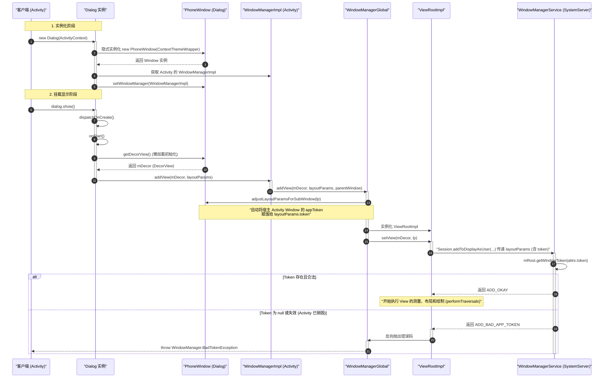

# Dialog 窗口机制与 Token 依赖深层解析

在 Android 窗口体系中，`Dialog` 是不可或缺的悬浮交互组件。与 `Activity` 这种具有独立生命周期和 AMS（ActivityManagerService）深度管理的组件不同，`Dialog` 的本质是一个**基于客户端侧 WindowManager、PhoneWindow 和 DecorView 的窗口包装容器**。

在底层，`Dialog` 并未在 AMS 侧注册任何组件记录，它的存在完全依赖于宿主 `Activity`。因此，深刻理解 `Dialog` 的窗口机制、`PhoneWindow` 的隐式实例化、对宿主 `Activity Token` 的强依赖机制，以及如何防范 `BadTokenException`、`WindowLeakedException` 和内存泄漏，是构建健壮 Android 架构的核心基本功。

---

## 1. Dialog 窗口本质与核心概念

要搞清楚 `Dialog` 的底层逻辑，首先必须将其从“四大组件”的固有认知中剥离开来。

### 1.1 Dialog 不是四大组件
在系统的生命周期调度层面，`Activity`、`Service`、`BroadcastReceiver` 和 `ContentProvider` 拥有独立的系统级生命周期管理，它们在 `system_server` 进程的 AMS 侧有对应的描述对象（如 `ActivityRecord`）。然而，`Dialog` 在系统侧是一个“隐形”的存在。
* **无 AMS 实体**：AMS 根本不知道 `Dialog` 的存在，它不需要在 `AndroidManifest.xml` 中注册，也没有进程间通信（IPC）在 AMS 侧去维护其“创建、暂停、销毁”的状态。
* **纯客户端行为**：`Dialog` 的生命周期（如 `show()`、`dismiss()`）本质上是客户端通过 `WindowManager` 向 `WindowManagerService` (WMS) 发送的视图挂载和卸载请求，属于窗口管理范畴。

### 1.2 与宿主 Activity 的实体关系
尽管 `Dialog` 看起来是弹出的独立界面，但它在窗口结构上与宿主 `Activity` 存在着千丝万缕的联系。它们的实体关系如下：
* **独立的 PhoneWindow 实例**：`Dialog` 内部拥有一个自己专属的 `PhoneWindow` 实例。也就是说，`Dialog` 的视图层次树（DecorView）并不是直接挂载在 Activity 的 PhoneWindow 之上的，而是挂载在 Dialog 自己的 PhoneWindow 之上。
* **独立的 DecorView 根视图**：每一个 `Dialog` 都对应一个独立的 `DecorView`。它与 Activity 的 DecorView 在结构上完全对等，内部持有 `title`、`content` 等视图容器。
* **独立的 WindowState**：在 WMS 侧，每一个 `Dialog` 的 `DecorView` 挂载后，WMS 都会为其分配一个独立的 `WindowState` 节点。这使得 `Dialog` 在 WMS 的窗口层级（Z-Order）管理中，能够作为独立的窗口参与位置计算和输入事件的分发。

关于 Android 窗口体系的通用基础，可以参考 [5.2.4.1.Window.md](./5.2.4.1.Window.md)。

以下是 Dialog、Activity、WMS 之间的核心架构实体关系示意图：

```
+-------------------------------------------------------------+
|                        Client 进程                          |
|                                                             |
|   +---------------------+       +-----------------------+   |
|   |   Activity 宿主      |       |      Dialog 实例      |   |
|   |                     |       |                       |   |
|   |  - mWindow          |       |  - mWindow            |   |
|   |    (PhoneWindow A)  |       |    (PhoneWindow B)    |   |
|   |                     |       |                       |   |
|   |  - mDecor           |       |  - mDecor             |   |
|   |    (DecorView A)    |       |    (DecorView B)      |   |
|   +----------+----------+       +-----------+-----------+   |
|              |                              |               |
+--------------|------------------------------|---------------+
               | ViewRootImpl A               | ViewRootImpl B
               |                              |
               | (Session.addToDisplay)       | (Session.addToDisplay)
               v                              v
+--------------|------------------------------|---------------+
|              |                              |               |
|  +-----------v----------+       +-----------v----------+    |
|  |     WindowState A    |       |     WindowState B    |    |
|  |  (Activity Window)   |       |    (Dialog Window)   |    |
|  +-----------+----------+       +-----------+----------+    |
|              |                              |               |
|              +---------------+--------------+               |
|                              |                              |
|                              v                              |
|                   AppWindowToken (Activity)                 |
|                                                             |
|                    WindowManagerService (WMS)               |
+-------------------------------------------------------------+
```

---

## 2. 深度解构构造方法：隐式 PhoneWindow 实例化

接下来，我们进入 AOSP 源码，剖析 `new Dialog(context, theme)` 这一行代码执行时，系统在背后做了哪些初始化工作。

### 2.1 源码走读：Dialog 构造器定义
以下是 `Dialog.java` 的核心构造方法源码：

```java
Dialog(@NonNull Context context, @StyleRes int themeResId, boolean createContextThemeWrapper) {
    if (createContextThemeWrapper) {
        if (themeResId == ResourceId.ID_NULL) {
            final TypedValue outValue = new TypedValue();
            context.getTheme().resolveAttribute(R.attr.dialogTheme, outValue, true);
            themeResId = outValue.resourceId;
        }
        // 1. 隐式将 Context 包装为 ContextThemeWrapper，确保应用了指定的 theme
        mContext = new ContextThemeWrapper(context, themeResId);
    } else {
        mContext = context;
    }

    // 2. 获取 WindowManager 引用
    mWindowManager = (WindowManager) context.getSystemService(Context.WINDOW_SERVICE);

    // 3. 隐式实例化一个 PhoneWindow
    final Window w = new PhoneWindow(mContext);
    mWindow = w;
    
    // 4. 将 PhoneWindow 与 WindowManager 进行关联
    w.setCallback(this);
    w.setOnWindowDismissedCallback(this);
    w.getHttpProxyHandler(); // 初始化代理相关句柄
    w.setWindowManager(mWindowManager, null, null);
    w.setGravity(Gravity.CENTER);
    
    // 5. 初始化内部的事件监听 Handler
    mListenersHandler = new ListenersHandler(this);
}
```

### 2.2 核心初始化步骤详析

#### 2.2.1 ContextThemeWrapper 的重要职责
构造函数首先会判断是否需要创建 `ContextThemeWrapper`。
* **为什么需要包装 Theme？**
  如果直接使用传入的 `Context`（通常是 Activity），那么在实例化 View 时，View 会默认读取 Activity 的主题属性。然而，`Dialog` 拥有一套独立的 UI 规范（如背景变暗、浮动窗口、特定的圆角和边距等），这些配置通常定义在系统或自定义的 `R.attr.dialogTheme` 中。
  通过 `ContextThemeWrapper`，系统可以为 `Dialog` 创建一个专属的上下文环境。当 Dialog 内部的布局加载器（LayoutInflater）去 inflate 布局或者创建 View 时，这些 View 就能正确解析并应用 Dialog 的特有样式，从而避免与宿主 Activity 的 UI 样式发生冲突。

#### 2.2.2 隐式实例化 PhoneWindow
在 Java 层，`Window` 是一个抽象类，其唯一的具体实现类是 `PhoneWindow`。
```java
final Window w = new PhoneWindow(mContext);
mWindow = w;
```
这一步为 Dialog 声明了一个全新的窗口。这个窗口内部会包含后续需要生成的 `DecorView`。虽然 Activity 也有一个 `PhoneWindow`，但两者是**完全独立、互不干扰的两个实例**。

#### 2.2.3 WindowManager 的获取与绑定
```java
mWindowManager = (WindowManager) context.getSystemService(Context.WINDOW_SERVICE);
w.setWindowManager(mWindowManager, null, null);
```
这里的 `context` 就是我们传入的 Context 实例。
1. 如果我们传入的是一个 `Activity`，那么 `context.getSystemService(Context.WINDOW_SERVICE)` 返回的是 Activity 内部特有的 `WindowManagerImpl` 实例。这个 `WindowManagerImpl` 在 Activity 启动时被创建，其内部持有 `mParentWindow`（即宿主 Activity 的 PhoneWindow）。
2. 在调用 `w.setWindowManager(mWindowManager, null, null)` 时，宿主 Activity 的 `WindowManagerImpl` 会作为一个基准被 Dialog 缓存下来。
3. 关联后，当 Dialog 尝试把自己的 `DecorView` 添加到窗口系统时，实际上调用的就是这个与宿主 Activity 深度绑定的 `WindowManager` 实例。这就为后续 WMS 对 Token 的校验埋下了伏笔。

---

## 3. Token 依赖机制与 BadTokenException 崩溃本质

在 Android 开发中，如果在创建 Dialog 时传入了 `getApplicationContext()`，或者在 Activity 已经销毁后调用了 `dialog.show()`，便会引发如下崩溃：
```
android.view.WindowManager$BadTokenException: Unable to add window -- token null is not valid; is your activity running?
```
要彻底理解这个崩溃的本质，我们需要从 Window 体系的 **Token 安全校验机制**说起。

### 3.1 什么是 Token？
在系统的 Window 管理中，Token 主要指 `WindowToken` 和 `appToken`：
1. **WindowToken**：WMS 中用来标识一组窗口的基类（对应的类是 `com.android.server.wm.WindowToken`）。它在 WMS 侧起到安全凭证和分组管理的作用。WMS 要求，**任何应用窗口（TYPE_APPLICATION）都必须关联一个合法的 WindowToken**，否则不允许添加。
2. **appToken (AppWindowToken)**：继承自 `WindowToken`，专属于 Activity（在较新版本的 AOSP 中，`ActivityRecord` 本身在 WMS 侧就充当了 WindowToken 的角色）。它是 AMS 在调度 Activity 启动时生成的 `Binder` 凭证。当 Activity 成功在 WMS 注册后，WMS 侧就会留存该 `appToken` 的记录。

### 3.2 为什么 Dialog 强制要求传入 Activity Context？

#### 3.2.1 默认窗口类型：TYPE_APPLICATION
Dialog 的窗口类型默认是 `WindowManager.LayoutParams.TYPE_APPLICATION`。这是一种普通的应用窗口。
根据 WMS 的设计规范，所有类型为 `TYPE_APPLICATION` 的窗口，在向 WMS 申请挂载（`addWindow`）时，**必须携带一个有效的 AppWindowToken 作为其 LayoutParams.token**，用以证明该窗口确实依附于一个处于存活状态的 Activity 页面。

#### 3.2.2 宿主 Activity Token 的隐式注入
当我们在 Dialog 中传入 `Activity` 作为 Context 时，Dialog 内部获取的 `WindowManager` 实际上是该 Activity 的 `WindowManagerImpl`。
in `WindowManagerImpl` 真正向 WMS 提交视图之前，会经过 `WindowManagerGlobal` 进行参数的适配调整：

```java
// WindowManagerGlobal.java
public void addView(View view, ViewGroup.LayoutParams params, Display display, Window parentWindow) {
    ...
    final WindowManager.LayoutParams wparams = (WindowManager.LayoutParams) params;
    if (parentWindow != null) {
        // 如果存在宿主 Window，就会根据宿主窗口的属性来调整当前窗口的 LayoutParams
        parentWindow.adjustLayoutParamsForSubWindow(wparams);
    }
    ...
}
```

让我们来看 `Window.adjustLayoutParamsForSubWindow(wparams)` 的具体逻辑：

```java
// Window.java
void adjustLayoutParamsForSubWindow(WindowManager.LayoutParams wp) {
    if (wp.type >= WindowManager.LayoutParams.FIRST_SUB_WINDOW &&
            wp.type <= WindowManager.LayoutParams.LAST_SUB_WINDOW) {
        // 子窗口类型的 Token 注入
        if (wp.token == null) {
            View decor = peekDecorView();
            if (decor != null) {
                wp.token = decor.getWindowToken();
            }
        }
    } else if (wp.type >= WindowManager.LayoutParams.FIRST_SYSTEM_WINDOW &&
            wp.type <= WindowManager.LayoutParams.LAST_SYSTEM_WINDOW) {
        // 系统窗口处理
        ...
    } else {
        // 普通应用窗口（例如 Dialog 默认的 TYPE_APPLICATION）
        if (wp.token == null) {
            // 关键：将宿主 Activity Window 的 appToken (即 mAppToken) 注入给 Dialog
            wp.token = mAppToken;
        }
    }
}
```
通过上述代码，宿主 Activity Window 的 `mAppToken`（本质上是 AMS 分配的表示该 Activity 的 Binder 句柄）成功被赋给了 Dialog 的 `LayoutParams.token`。

#### 3.2.3 Application Context 的缺失致命伤
当我们传入 `getApplicationContext()` 时：
1. `Application` 只是一个全局上下文，它在系统侧**没有对应的 ActivityRecord**，更没有在 WMS 中注册的 `appToken`。
2. Application Context 获取到的 `WindowManager` 是系统级别的 `WindowManagerImpl`，其内部的 `mParentWindow` 为 `null`。
3. 由于没有宿主 Window，`WindowManagerGlobal.addView` 时 parentWindow 为 `null`，无法触发 `adjustLayoutParamsForSubWindow()` 方法。
4. 最终，Dialog 的 `LayoutParams.token` 保持为 `null`，被直接提交给了 WMS。

### 3.3 WMS 端的鉴权拦截源码分析
当 `LayoutParams.token` 为 `null`（或者传入的 Token 已经在 WMS 中过期销毁）的请求提交到 WMS 时，WMS 侧会发生什么？
我们走读 `WindowManagerService.java` 中核心的 `addWindow` 方法：

```java
// WindowManagerService.java
public int addWindow(Session session, IWindow client, int seq,
        LayoutParams attrs, int viewVisibility, int displayId, Rect outFrame,
        Rect outContentInsets, Rect outStableInsets, Rect outDisplayCutout,
        DisplayCutout.ParcelableWrapper outDisplayCutoutWrapper,
        InsetsState outInsetsState, InsetsSourceControl[] outActiveControls) {
    
    ...
    final int type = attrs.type;
    
    synchronized (mGlobalLock) {
        // 根据传入 of attrs.token 获取对应的 WindowToken 描述符
        WindowToken token = mRoot.getWindowToken(attrs.token);
        
        // 关键逻辑：如果对应的 Token 在 WMS 中不存在
        if (token == null) {
            // 如果是应用窗口（TYPE_APPLICATION 类型），直接判定为非法，拦截并返回错误码
            if (type >= FIRST_APPLICATION_WINDOW && type <= LAST_APPLICATION_WINDOW) {
                ProtoLog.w(WM_ERROR, "Attempted to add application window with "
                        + "invalid token %s.  Aborting.", attrs.token);
                return WindowManagerGlobal.ADD_BAD_APP_TOKEN;
            }
            ...
        }
        ...
    }
}
```
WMS 返回错误码 `WindowManagerGlobal.ADD_BAD_APP_TOKEN`。
回到客户端，在 `WindowManagerGlobal.addView()` 中，对 WMS 的返回值进行了统一校验，一旦匹配到错误码，立即抛出 `BadTokenException` 异常：

```java
// WindowManagerGlobal.java
switch (res) {
    case WindowManagerGlobal.ADD_BAD_APP_TOKEN:
    case WindowManagerGlobal.ADD_BAD_SUBWINDOW_TOKEN:
        throw new WindowManager.BadTokenException(
                "Unable to add window -- token " + attrs.token
                + " is not valid; is your activity running?");
}
```

---

## 4. 系统级 Dialog (悬浮窗) 的绕过逻辑

在某些特殊的业务场景中（例如全局后台来电弹窗、悬浮球、全局提醒），我们确实需要脱离 Activity 宿主而使用 Application Context 弹出对话框。此时，必须绕过 `TYPE_APPLICATION` 窗口的 Token 校验。

### 4.1 窗口类型提权
为了使 WMS 在 `token == null` 时不予以拦截，我们必须将窗口的类型由“应用窗口”变更为“系统级窗口”：
* **Android 8.0 及以上版本**：使用 `WindowManager.LayoutParams.TYPE_APPLICATION_OVERLAY`。
* **Android 8.0 之前版本**：使用 `WindowManager.LayoutParams.TYPE_SYSTEM_ALERT` 或 `TYPE_SYSTEM_OVERLAY`。

这部分系统级窗口的变化规范已沉淀在 [AndroidVersionChangeLog.md](../../../../AndroidVersionChangeLog.md)。

```java
Dialog dialog = new Dialog(getApplicationContext());
Window window = dialog.getWindow();
if (window != null) {
    if (Build.VERSION.SDK_INT >= Build.VERSION_CODES.O) {
        window.setType(WindowManager.LayoutParams.TYPE_APPLICATION_OVERLAY);
    } else {
        window.setType(WindowManager.LayoutParams.TYPE_SYSTEM_ALERT);
    }
}
```

### 4.2 悬浮窗权限限制
即使绕过了 Token 校验，系统级窗口又引入了新的安全壁垒：
1. **权限申请**：应用必须在 `AndroidManifest.xml` 中声明 `android.permission.SYSTEM_ALERT_WINDOW` 权限。
2. **动态授权**：在 Android 6.0 (API 23) 及以上，用户必须在系统设置中手动为该应用授予“允许显示在其他应用上”的权限。若没有授权便强行调用 `show()`，系统将抛出 `Permission Denied` 相关的 `BadTokenException`。
因此，除非是特定类型的系统级工具，否则绝不建议使用 Application Context 强行创建系统级 Dialog。

---

## 5. Dialog.show() 源码解构与挂载细节

当我们调用 `dialog.show()` 时，从内存中包装的 PhoneWindow 到屏幕上真正渲染出视图，经历了一系列精密的过程。

### 5.1 走读 Dialog.show() 核心流程
以下是精简后的 `Dialog.show()` 源码走读：

```java
public void show() {
    // 1. 状态判断：如果已经显示，则直接返回
    if (mShowing) {
        if (mDecor != null) {
            if (mWindow.hasFeature(Window.FEATURE_ACTION_BAR)) {
                mWindow.invalidatePanelMenu(Window.FEATURE_SUPPORT_ACTION_BAR);
            }
            mDecor.setVisibility(View.VISIBLE);
        }
        return;
    }

    mCanceled = false;

    // 2. 回调触发：仅在第一次 show 时，回调 onCreate()
    if (!mCreated) {
        dispatchOnCreate(null); // 内部会回调宿主的 onCreate 方法
    } else {
        // 如果 Activity 的 Configuration 发生了变化，此处会重新应用
        final Configuration config = mContext.getResources().getConfiguration();
        mWindow.getDecorView().dispatchConfigurationChanged(config);
    }

    // 3. 回调 onStart() 生命周期
    onStart();
    
    // 4. 获取并加载 DecorView 根视图
    mDecor = mWindow.getDecorView();

    // 5. 获取窗口属性，进行参数微调
    WindowManager.LayoutParams l = mWindow.getAttributes();
    if ((l.softInputMode & WindowManager.LayoutParams.SOFT_INPUT_IS_FORWARD_NAVIGATION) == 0) {
        WindowManager.LayoutParams nl = new WindowManager.LayoutParams();
        nl.copyFrom(l);
        nl.softInputMode |= WindowManager.LayoutParams.SOFT_INPUT_IS_FORWARD_NAVIGATION;
        l = nl;
    }

    try {
        // 6. 核心步骤：调用 WindowManagerImpl 的 addView 进行窗口挂载
        mWindowManager.addView(mDecor, l);
        
        mShowing = true;
        
        // 7. 发送 Accessibility 事件或统计事件，并分发 Show 监听
        sendShowMessage();
    } finally {
        ...
    }
}
```

### 5.2 挂载细节分析

#### 5.2.1 延迟初始化的设计哲学
在 `Dialog` 的构造方法中，我们没有看到任何与 `DecorView` 或者布局 inflate 相关的代码。这意味着如果我们只执行了 `new Dialog()` 而不调用 `show()`，Dialog 占用的内存开销是极低的。
`onCreate(Bundle)` 和 `DecorView` 的创建，都被巧妙地推迟到了 `show()` 被执行的瞬间。这是一种典型的懒加载（Lazy Initialization）策略。

#### 5.2.2 WindowManager.addView() 的下沉逻辑
当执行 `mWindowManager.addView(mDecor, l)` 时：
1. 实际调用的是当前绑定的 `WindowManagerImpl` 实例。
2. `WindowManagerImpl` 将调用转发给 `WindowManagerGlobal.addView()`。
3. `WindowManagerGlobal` 内部会为 Dialog 的 `DecorView` 创建一个新的 `ViewRootImpl` 实例。
4. `ViewRootImpl` 是连接 `WindowManager` 和 `WMS` 的桥梁。它在构造时会初始化 `IWindowSession` 的 Binder 通道。
5. 最终，通过 `ViewRootImpl.setView(mDecor, l, panelParentView)` 执行跨进程 IPC，调用 WMS 侧的 `Session.addToDisplayAsUser`，交由 WMS 完成最终的 Token 鉴权与窗口挂载。

---

## 6. Dialog 挂载与 Token 鉴权时序图

为了更直观地理解从 `new Dialog()` 到最终 WMS 鉴权的完整链路，以下展示其时序交互图：



---

## 7. 事件分发与“点击外部区域消失”机制

用户点击 Dialog 外部的阴影区域时，Dialog 默认会自动收起（Dismiss）。这一便捷逻辑的背后，蕴含着 PhoneWindow 侧非常巧妙的输入事件分发与边界拦截机制。

### 7.1 setCanceledOnTouchOutside(true) 的运作机制
当我们在代码中配置该属性时，系统实际是在 Dialog 挂载后通过拦截触摸事件来处理的：

```java
public void setCanceledOnTouchOutside(boolean cancel) {
    if (cancel && !mCancelable) {
        mCancelable = true;
    }
    mWindow.setCloseOnTouchOutside(cancel);
}
```

### 7.2 触摸事件的物理边界拦截
当一个点击事件发生时，系统会将 MotionEvent 通过 `ViewRootImpl` 路由到当前聚焦窗口的根视图 `DecorView`。
1. **Callback 接口转发**：由于 `Dialog` 在构造时通过 `w.setCallback(this)` 将自身注册为了 `PhoneWindow` 的回调实现类，所以点击事件首先会下发到 `Dialog.dispatchTouchEvent(MotionEvent ev)`：

```java
// Dialog.java
public boolean dispatchTouchEvent(@NonNull MotionEvent ev) {
    // 1. 将事件首先回调给 Dialog 窗口的回调接口（如果有的话）
    if (mWindow.superDispatchTouchEvent(ev)) {
        return true;
    }
    // 2. 如果视图层级未消费该触摸事件，交由 Dialog 自身的 onTouchEvent 处理
    return onTouchEvent(ev);
}
```

2. **边界碰撞检测**：如果点击发生在 Dialog 外部区域，Dialog 内部的布局树自然不会消费该事件，事件回传并触发 `Dialog.onTouchEvent(MotionEvent event)`：

```java
// Dialog.java
public boolean onTouchEvent(@NonNull MotionEvent event) {
    // 如果设置了 cancelable 且检测到点击了边界外部
    if (mCancelable && mShowing && mWindow.shouldCloseOnTouch(mContext, event)) {
        cancel(); // 执行取消与收起流程
        return true;
    }
    return false;
}
```

3. **shouldCloseOnTouch 判定规则**：
我们走读 `Window.java` 内部对边界的校验方法：

```java
// Window.java
public boolean shouldCloseOnTouch(Context context, MotionEvent event) {
    final boolean isOutside =
            event.getAction() == MotionEvent.ACTION_DOWN && isOutOfBounds(context, event)
            || event.getAction() == MotionEvent.ACTION_OUTSIDE;
            
    return mCloseOnTouchOutside && isOutside;
}

private boolean isOutOfBounds(Context context, MotionEvent event) {
    final int x = (int) event.getX();
    final int y = (int) event.getY();
    // 获取系统的触摸阈值偏移
    final int slop = ViewConfiguration.get(context).getScaledWindowTouchSlop();
    final View decorView = getDecorView();
    // 判断点击物理坐标 (x, y) 是否在当前 DecorView 的边界外侧
    return (x < -slop) || (y < -slop)
            || (x > (decorView.getWidth() + slop))
            || (y > (decorView.getHeight() + slop));
}
```
当检测到点击坐标落在了当前 `DecorView` 的边界范围之外（加上了系统预设的阈值偏移 `slop`），`shouldCloseOnTouch` 便会返回 `true`，从而使 Dialog 截获该事件并安全触发 `cancel()` 收起。

---

## 8. Window 标志位（Flags）对 Dialog 的属性控制与 WMS 原理

Dialog 往往自带背景变暗、模态锁定等功能，这些属性均是由 Window 的配置标志位（LayoutParams.flags）控制的。

### 8.1 标志位深度解析
* **FLAG_DIM_BEHIND**：
  * **作用**：控制 Dialog 弹窗时，宿主 Activity 界面整体被一层暗黑阴影所笼罩。
  * **WMS 底层原理**：当 WMS 检测到新添加的窗口包含此 flag 时，它会在这个窗口的 Z-Order 层级下方，动态挂载一个特殊的调光层（`Dimmer`）。这个调光层由 WMS 控制其渐变动画和透明度（默认暗度通过 `dimAmount` 属性决定，通常为 0.5f）。
* **FLAG_NOT_FOCUSABLE**：
  * **作用**：使窗口无法获取输入焦点。
  * **对 Dialog 的影响**：一旦设置此 flag，Dialog 将无法接收按键事件（如返回键），此时所有软键盘输入等也会被宿主或下方窗口截获。
* **FLAG_NOT_TOUCH_MODAL**：
  * **作用**：即使点击了 Dialog 外部的区域，事件也不会被 Dialog 的 WindowState 截断，而是会直接下透分发给宿主 Activity 的 View 树。这对于实现非模态弹窗（允许与背景视图交互）至关重要。

---

## 9. 崩溃分析：WindowLeakedException 的本质与防范

在开发中，特别是在切换页面、配置变更或按返回键退出时，经常会在 Logcat 中撞见如下异常：
```
android.view.WindowLeaked: Activity com.example.MainActivity has leaked window DecorView@a6d1b78[] that was originally added here
```
这便是典型的 **Window 泄漏异常**（WindowLeakedException）。

### 9.1 异常产生的底层逻辑
`WindowLeakedException` 不是在 WMS 中抛出的，而是在应用进程客户端检测并抛出的。
1. 当 Activity 销毁（执行 `onDestroy`）时，系统会通过 Activity 的 `WindowManagerImpl` 去回收窗口资源。
2. 此时，系统会调用到 `WindowManagerGlobal.closeAll(IBinder token, String who, String what)` 方法：

```java
// WindowManagerGlobal.java
public void closeAll(IBinder token, String who, String what) {
    synchronized (mLock) {
        int count = mViews.size();
        for (int i = 0; i < count; i++) {
            ViewRootImpl vri = mRoots.get(i);
            // 校验这个 View 对应的 Token 是否为当前正在销毁的 Activity 的 token
            if (token == null || vri.mWindowAttributes.token == token) {
                View view = mViews.get(i);
                // 拦截到了泄漏：Activity 要被销毁了，但它的 WindowManager 居然还挂载着属于它的窗口
                WindowManager.BadTokenException leaked = new WindowManager.BadTokenException(
                        "Activity " + who + " has leaked window "
                        + view + " that was originally added here");
                leaked.fillInStackTrace();
                Log.e(TAG, "", leaked); // 打印著名的 WindowLeaked 崩溃栈
                
                // 强制将该泄露的 DecorView 移出窗口
                removeViewLocked(i, false);
                i--;
                count--;
            }
        }
    }
}
```
WMS 并不允许一个已经销毁的宿主 Activity 依然占有活动状态的子窗口（如 Dialog 弹窗）。如果在 Activity 退出时，Dialog 仍处于显示状态，系统会强制将其剥离以防泄露，并以 `WindowManager.BadTokenException` 作为错误原因记录调用栈打印在控制台。

### 9.2 避坑指南
任何拥有 Window 的组件，其生命周期都**必须在宿主组件消亡之前完成终结**。宿主 Activity 退出前，必须调用 `dismiss()` 关闭所有 Dialog，释放底层对应的 ViewRootImpl。

---

## 10. 异步崩溃（BadTokenException）与生命周期解耦

由于 `Dialog` 与宿主 `Activity` 在底层的生命周期管理上是处于松耦合状态，WMS 并不知道 Activity 什么时候销毁，Activity 也不会在销毁时主动告知 Dialog。这导致了**异步回调带来的 BadTokenException 崩溃**。

### 10.1 崩溃时序差分析
当我们在 Activity 中发起一个异步任务（例如网络请求），在回调接口中尝试 `dialog.show()` 时，往往是崩溃的重灾区。
1. 用户启动 Activity，发起异步请求。
2. 用户在请求未完成时，按了返回键（Back），或者屏幕发生旋转导致 Activity 被销毁。
3. AMS 调度 Activity 销毁流程，通知 WMS 移除该 Activity 对应的 `appToken` 记录。
4. 此时异步任务在后台线程执行完毕，切回主线程，触发回调：
   ```java
   mDialog.show();
   ```
5. Dialog 带着已被销毁的 Activity 的 `appToken` 去 WMS 注册窗口，WMS 发现该 Token 在 `mTokenMap` 中已无记录，拦截并返回 `ADD_BAD_APP_TOKEN`，引发 `BadTokenException`。

### 10.2 工业界防御性治理最佳实践
在调用 `dialog.show()` 之前，必须对宿主 Activity 进行严格的状态校验：

```java
public static void safeShowDialog(Dialog dialog) {
    if (dialog == null) return;
    Context context = dialog.getContext();
    
    // 如果 Context 被 ContextThemeWrapper 包装过，需要解包获取原始 Context
    if (context instanceof ContextWrapper) {
        context = ((ContextWrapper) context).getBaseContext();
    }
    
    if (context instanceof Activity) {
        Activity activity = (Activity) context;
        // 核心校验：如果 Activity 处于 Finishing 或 Destroyed 状态，绝不调用 show
        if (activity.isFinishing() || activity.isDestroyed()) {
            return;
        }
    }
    
    try {
        dialog.show();
    } catch (WindowManager.BadTokenException e) {
        Log.e("DialogHelper", "BadTokenException intercepted: Host activity is likely dead.", e);
    }
}
```

---

## 11. 内存泄漏深度治理方案

因为 Dialog 的 `mContext` 强引用了宿主 Activity，如果 Dialog 自身的生命周期因各种原因被无限拉长，会导致宿主 Activity 在销毁后依然无法被垃圾回收器（GC）回收，引发严重的内存泄漏。

### 11.1 泄漏的核心根源分析

我们来看一个最常见的 Dialog 泄漏引用链：

```
GC Root
  ↳ 静态单例 (e.g. NetworkManager)
    ↳ 异步回调监听器 (匿名内部类)
      ↳ Dialog.mDismissListener
        ↳ Dialog 实例
          ↳ mContext (Activity 实例) ❌ 导致 Activity 内存泄漏
```

#### 11.1.1 ListenersHandler 的隐式引用
Dialog 内部会维护如 `mShowListener`、`mDismissListener`、`mCancelListener` 等成员变量。如果我们为了方便，在 Activity 中以匿名内部类的形式为 Dialog 设置了监听器：

```java
dialog.setOnDismissListener(new DialogInterface.OnDismissListener() {
    @Override
    public void onDismiss(DialogInterface dialog) {
        // 匿名内部类隐式持有外部类 Activity 的强引用
        doSomethingInActivity(); 
    }
});
```
只要 Dialog 实例没有被 GC 回收，这个监听器就会一直存活，并间接拉住外部 Activity，造成泄漏。

### 11.2 内存泄漏治理三步法

#### 11.2.1 第一步：在 Activity 销毁前主动 Dismiss 并释放窗口资源
我们在 `show()` 源码走读中得知，`show()` 会通过 `WindowManager.addView` 将 `DecorView` 添加到窗口。如果不主动 `dismiss`，该 `DecorView` 将一直与 `ViewRootImpl` 以及 WMS 的 `WindowState` 保持 Binder 绑定状态，导致其内存无法释放。
因此，必须在 Activity 的生命周期末尾安全释放 Dialog：

```java
@Override
protected void onDestroy() {
    if (mMyDialog != null && mMyDialog.isShowing()) {
        mMyDialog.dismiss(); // 内部会调用 mWindowManager.removeViewImmediate(mDecor)
    }
    mMyDialog = null; // 切断本地引用
    super.onDestroy();
}
```

#### 11.2.2 第二步：在生命周期回调中自动注销监听器
为了避免 Dialog 的 Listener 链条拉住宿主 Activity，可以在 Dialog 内部做防御性设计，在 `onDetachedFromWindow()` 或者 `dismiss()` 发生时，主动将所有的监听器置空：

```java
public class SafeDialog extends Dialog {
    
    public SafeDialog(@NonNull Context context) {
        super(context);
    }

    @Override
    protected void onStop() {
        super.onStop();
        // 在 Dialog 停止时，主动解绑监听，切断引用链
        setOnShowListener(null);
        setOnDismissListener(null);
        setOnCancelListener(null);
    }

    @Override
    public void onDetachedFromWindow() {
        super.onDetachedFromWindow();
        // 确保 DecorView 被移出窗口后，彻底切断所有强引用
        setOnShowListener(null);
        setOnDismissListener(null);
        setOnCancelListener(null);
    }
}
```

#### 11.2.3 第三步：引入 LifecycleObserver 实现自动化生命周期感知
通过 Jetpack `Lifecycle` 组件，我们可以写出完全自治、无需在 Activity 中手动编写 `onDestroy` 释放逻辑的 `LifecycleSafeDialog`。

```java
import android.content.Context;
import androidx.annotation.NonNull;
import androidx.appcompat.app.AppCompatDialog;
import androidx.lifecycle.Lifecycle;
import androidx.lifecycle.LifecycleEventObserver;
import androidx.lifecycle.LifecycleOwner;

public class LifecycleSafeDialog extends AppCompatDialog implements LifecycleEventObserver {

    private final Lifecycle mLifecycle;

    public LifecycleSafeDialog(@NonNull Context context, Lifecycle lifecycle) {
        super(context);
        this.mLifecycle = lifecycle;
        // 注册观察者
        if (mLifecycle != null) {
            mLifecycle.addObserver(this);
        }
    }

    @Override
    public void onStateChanged(@NonNull LifecycleOwner source, @NonNull Lifecycle.Event event) {
        // 监听宿主的 ON_DESTROY 事件
        if (event == Lifecycle.Event.ON_DESTROY) {
            if (isShowing()) {
                dismiss();
            }
            if (mLifecycle != null) {
                mLifecycle.removeObserver(this);
            }
            // 彻底清理内部属性
            setOnShowListener(null);
            setOnDismissListener(null);
            setOnCancelListener(null);
        }
    }
}
```

---

## 12. 进阶实践：DialogFragment 的引入与生命周期自动对齐

尽管对 Dialog 进行防御性包装能够避开大多数崩溃，但面对配置变更（Configuration Changes，如屏幕旋转、系统语言切换）时，传统的 Dialog 会因 Activity 的销毁重建而彻底丢失或发生 WindowLeaked。为此，Google 强烈推荐在现代 Android 开发中使用 `DialogFragment` 代替直接实例化 `Dialog`。

### 12.1 DialogFragment 的架构本质
`DialogFragment` 本质上是一个 Fragment。它在内部持有一个 `Dialog` 对象，但其最核心的区别在于：**它将 Dialog 的挂载与收起完全托管给了 FragmentManager**。

```
+-------------------------------------------------------+
|                     FragmentManager                   |
|                                                       |
|   +-----------------------------------------------+   |
|   |                 DialogFragment                |   |
|   |                                               |   |
|   |  - mDialog (底层的 Dialog 实例)                |   |
|   |  - lifecycle (与 Fragment 生命周期对齐)         |   |
|   +-----------------------------------------------+   |
+---------------------------+---------------------------+
                            | 自动在 ON_DESTROY 时 dismiss
                            v
                    WMS 窗口清理与鉴权解绑
```

### 12.2 为什么它能抵抗配置变更？
1. **自动重建与状态留存**：
当 Activity 重建时，`FragmentManager` 会依据其内部的状态备份（Save/Restore）机制，自动恢复被标记为显示的 `DialogFragment` 实例。
2. **生命周期对齐**：
`DialogFragment` 覆写了 Fragment 的生命周期回调（如 `onDestroyView()`）。在视图销毁时，它会自动在内部调用 `mDialog.dismiss()`，彻底避开了 `WindowLeakedException`。
3. **Token 的自愈性**：
在重建后的 `onActivityCreated` (或更高级的生命周期) 阶段，`DialogFragment` 会根据重建后的新 Activity 上下文重新隐式生成一个全新的 `Dialog` 实例。此时，它获取到的是**新 Activity 的合法 appToken**。这就从根本上解决了因为 Activity 重建、旧 Token 过期导致 `BadTokenException` 的死穴。

---

## 13. 总结：Dialog 窗口管理的底层启示

通过对 Dialog 机制的深入剖析，我们可以总结出以下几点关键性的底层启示：
1. **Window 是承载 View 的容器**：`Dialog` 本身没有任何绘制能力，它通过内部隐式持有的 `PhoneWindow` 来承载 `DecorView`。
2. **Token 是应用层窗口的门票**：WMS 为了维护系统窗口的安全性，要求所有 `TYPE_APPLICATION` 级别的普通应用窗口在添加时必须出示由 AMS 授权颁发的 Activity 令牌（`appToken`）。Application Context 由于缺失这一安全令牌，强行申请会导致 `BadTokenException`。
3. **宿主生命周期决定窗口命运**：Dialog 没有 AMS 组件管理，其窗口的安全凭证依赖于存活着的 Activity。当 Activity 终结后，宿主令牌失效，任何对 Dialog 窗口的操作都将成为非法操作。

在日常开发中，始终坚守“**优先采用 DialogFragment 托管、异步 show 前加校验、Activity 销毁前主动释放并置空**”这一黄金法则，能有效规避 95% 以上与 Dialog 相关的崩溃与泄漏问题。
