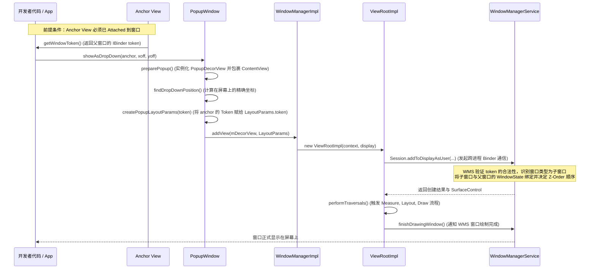

# 5.2.4.4 PopupWindow 底层原理与设计机制

`PopupWindow` 是 Android 平台提供的一种极为灵活的悬浮窗口组件。与 `Dialog` 相比，它不依赖于传统的 `PhoneWindow` 包装，而是直接将视图树通过 `WindowManager` 挂载到系统的窗口管理服务（WMS）上，通常作为**子窗口（Sub Window）**依附于父窗口。由于其具有无边框、无默认遮罩、定位精准等特点，在下拉菜单、快捷操作浮层及气泡提示等场景中被广泛使用。

本文将从底层渲染架构、WMS Token 绑定机制、关键窗口属性（Flags）映射、事件分发与销毁机制等多个维度，对 `PopupWindow` 进行源码级别的深度剖析。

---

## 1. PopupWindow 的核心架构定位

在 Android 窗口体系中，每一个可见的界面本质上都对应着 WMS 中的一个 Window。然而，`PopupWindow` 与 `Activity`、`Dialog` 在架构层面的设计有着根本性差异：

- **无 PhoneWindow 实例**：`Activity` 和 `Dialog` 内部都拥有一个 `PhoneWindow` 实例（即 `Window` 抽象类的具体实现），其视图根节点是 `DecorView`。`PhoneWindow` 负责了大量的窗口装饰（如标题栏、默认背景阴影）以及系统回调（`Window.Callback`）。而 `PopupWindow` 内部**没有** `PhoneWindow`，它直接持有一个名为 `PopupDecorView` 的自定义根视图，并直接通过 `WindowManagerImpl.addView()` 向 WMS 发起窗口注册。
- **子窗口（Sub Window）定位**：在窗口类型（Window Type）的划分上，`PopupWindow` 默认的窗口类型为 `WindowManager.LayoutParams.TYPE_APPLICATION_PANEL` 或 `TYPE_APPLICATION_ABOVE_SUB_PANEL`。这属于典型的**子窗口**。子窗口的生存极其依赖其父窗口（通常是 Activity 所在的窗口），在 WMS 进行窗口层级排序（Z-Order）时，子窗口会紧紧跟随父窗口进行相对层级计算。

---

## 2. 核心组件解析（源码级）

要理解 `PopupWindow` 的运行机制，首先需要厘清其内部的三个核心组件：`PopupDecorView`、`Anchor View` 和 `LayoutParams`。

### 2.1 视图根节点：PopupDecorView

当我们调用 `PopupWindow.setContentView(View)` 传入自定义布局时，该布局并不会被直接添加到窗口上，而是被包装进一个内部类 `PopupDecorView` 中。

```java
// 源码示意：PopupDecorView 的定义
private class PopupDecorView extends FrameLayout {
    // 负责拦截物理按键事件，如 BACK 键
    @Override
    public boolean dispatchKeyEvent(KeyEvent event) { ... }

    // 负责拦截触摸事件，实现点击外部自动 Dismiss
    @Override
    public boolean dispatchTouchEvent(MotionEvent event) { ... }

    // 负责处理窗口过渡动画（Transition）
    ...
}
```

#### PopupDecorView 的核心职责：
1. **动画包装**：在 `preparePopup()` 阶段，如果开发者设置了进入/退出动画（或 `Transition`），`PopupDecorView` 会作为这些动画的载体，包裹住 ContentView 进行动画渲染。
2. **事件哨兵**：它是整个悬浮窗的入口，重写了 `dispatchTouchEvent` 和 `dispatchKeyEvent`。当用户点击弹窗外部或者按下返回键时，`PopupDecorView` 是最先捕获到这些事件并决定是否触发 `dismiss()` 的地方。
3. **背景修饰与阴影**：若设置了 `setBackgroundDrawable(Drawable)`，该背景会被应用到 `PopupDecorView` 上。这个背景的有无，不仅决定了视觉上的阴影和边框，更在底层直接影响了窗口事件的穿透逻辑。

### 2.2 定位物理依据：Anchor View

`PopupWindow` 最显著的特征是能够精准地附着在某个特定的 `View`（即 Anchor View，锚点视图）周围。这通过 `showAsDropDown()` 或 `showAtLocation()` 实现。

在 `showAsDropDown(View anchor, int xoff, int yoff, int gravity)` 执行时，底层包含以下核心计算步骤：
1. **依附性检查**：系统会首先检查 `anchor.getWindowToken()` 是否为空。如果为空，说明 Anchor View 尚未附着到当前的 Window 上（即未经历过 `onAttachedToWindow`），此时无法获取有效的 Binder Token，直接调用将导致异常。
2. **坐标换算**：调用 `anchor.getLocationOnScreen(int[])` 获取锚点 View 在屏幕上的绝对像素坐标 `(anchorX, anchorY)`。
3. **空间余量评估（裁剪与翻转）**：
   - 系统获取屏幕的可用物理高度与宽度（需扣除状态栏及导航栏，在 target 35 后需紧密结合 `WindowInsets`）。
   - 计算锚点下方剩余的垂直高度是否大于 `PopupWindow` 的测量高度。如果下方空间不足，且上方空间宽裕，系统会自动将布局策略调整为“展示在锚点上方”（即 `Gravity.BOTTOM` 的反向计算）。
   - 如果上下空间都不足，系统会限制 `PopupWindow` 的高度，并可能启动嵌套滑动（Nested Scrolling）机制来保证内容可阅读。

---

## 3. 底层挂载与 WMS Token 绑定机制

要向 WMS 成功注册一个窗口，必须提供一个合法的 `IBinder` Token。这直接关系到窗口的安全防范与生命周期绑定。对于 `PopupWindow` 而言，这一绑定过程发生在 `show` 系列方法被调用的瞬间。

### 3.1 Token 传递与 BadTokenException 的成因

以下是 `PopupWindow` 底层展示时，与 `WindowManager` 和 WMS 交互的关键源码执行链路：



#### 关键步骤剖析：
1. **获取 Token**：当执行 `showAsDropDown(View anchor)` 时，`PopupWindow` 内部会调用 `anchor.getWindowToken()`。该 Token 本质上是父窗口（Activity 对应的 `PhoneWindow`）在 View 系统中的唯一标识符。
2. **构建 LayoutParams**：在 `createPopupLayoutParams(IBinder token)` 方法中，`PopupWindow` 创建 `WindowManager.LayoutParams` 实例，并将该 `token` 赋值给 `LayoutParams.token` 字段：
   ```java
   // 源码核心映射
   final WindowManager.LayoutParams p = createPopupLayoutParams(anchor.getWindowToken());
   ```
3. **WMS 侧安全检查**：当 `ViewRootImpl` 通过 Binder IPC 调用 WMS 的 `addWindow()` 方法时，WMS 会对传入的 Token 进行校验。
   - 如果 `token` 为 `null`：对于 `TYPE_APPLICATION_PANEL` 等子窗口类型，WMS 会直接拒绝该请求，并向客户端抛出著名的异常：
     `WindowManager$BadTokenException: Unable to add window -- token null is not valid; is your activity running?`
   - **典型错误场景**：在 Activity 的 `onCreate()` 中直接调用 `PopupWindow.showAsDropDown()`。此时 Activity 刚刚完成初始化，尚未经过 Measure/Layout 流程，`DecorView` 未被挂载到 `WindowManager`，因此 `anchor.getWindowToken()` 返回 `null`。
   - **正确做法**：将 `show` 动作推迟到 View 附着之后（例如使用 `anchor.post(Runnable)`），或者在 Activity 彻底可见的生命周期之后执行。

### 3.2 子窗口的 Z-Order 排序规则

在 WMS 内部，所有窗口都按照 `BaseLayer` 和 `SubLayer` 进行优先级计算，最终映射为一维的 Z-Order 层级。
- **子窗口的 SubLayer**：`TYPE_APPLICATION_PANEL` 的子窗口类型在 WMS 中被分配了固定的正数相对层级（通常为 `1` 或 `2`）。
- **依附机制**：这意味着无论父窗口（Activity）的 `BaseLayer` 如何随应用切换而变化，WMS 都会将 `PopupWindow` 紧紧放置在父窗口之上。父窗口一旦隐藏，所有的子窗口也会被同步隐藏。

---

## 4. 关键窗口属性与 LayoutParams Flags 映射

`PopupWindow` 对事件穿透、返回键拦截、外部点击消失等交互行为的控制，本质上是通过修改 `WindowManager.LayoutParams` 的 `flags` 属性实现的。

### 4.1 Focusable（焦点属性）与 FLAG_NOT_FOCUSABLE

通过 `setFocusable(boolean)`，开发者可以直接决定 `PopupWindow` 是否能够抢占输入系统的焦点。
- **`setFocusable(true)`**：
  - **Flag 表现**：清除 `FLAG_NOT_FOCUSABLE` 标志。
  - **核心影响**：窗口可以接收物理按键事件（如返回键 `KEYCODE_BACK`、菜单键等）。由于它占据了全局焦点，当用户触摸窗口外部的区域时，事件**不会**穿透并分发给下层 Activity 的视图，系统会将这些外部点击动作视为一次焦点外的触摸。
- **`setFocusable(false)`**（默认）：
  - **Flag 表现**：设置 `FLAG_NOT_FOCUSABLE` 标志。
  - **核心影响**：窗口完全不参与物理按键的消费，返回键将直接由下层的 Activity 接收并消费。由于不占用焦点，点击弹窗外部的事件可以直接穿透到下层 Window 的 View 树中，从而触发下层 View 的点击事件。

### 4.2 OutsideTouchable 与 FLAG_WATCH_OUTSIDE_TOUCH

`setOutsideTouchable(boolean)` 用于配置是否需要监听悬浮窗外部的点击事件。
- **`setOutsideTouchable(true)`**：
  - **Flag 表现**：设置 `FLAG_WATCH_OUTSIDE_TOUCH` 标志。
  - **核心影响**：当用户的触摸点落在 `PopupWindow` 物理边界之外时，WMS 会专门向 `PopupWindow` 的 `PopupDecorView` 发送一个 `MotionEvent.ACTION_OUTSIDE` 事件。这为实现“点击外部自动消失”提供了底层的硬件级事件通知。
- **`setOutsideTouchable(false)`**：
  - **Flag 表现**：清除 `FLAG_WATCH_OUTSIDE_TOUCH` 标志。WMS 将不再向其派发 `ACTION_OUTSIDE` 事件，外部的触摸会被直接忽略或直接穿透。

### 4.3 为什么早期版本必须设置 Background Drawable？

在 [Android 6.0 (API 23)](../../../../../AndroidVersionChangeLog.md#android-60api-23) 以前的系统源码中，有一个广为人知的“奇特”设定：**如果不给 PopupWindow 设置背景（即不调用 `setBackgroundDrawable()`），即使设置了 `setOutsideTouchable(true)`，点击外部也无法让弹窗自动消失。**

这一现象的深层源码根源存在于 `preparePopup()` 方法中：
```java
// 早期 Android 版本的 preparePopup() 源码设计简化
private void preparePopup(WindowManager.LayoutParams p) {
    if (mBackground != null) {
        // 如果背景不为空，则创建 PopupDecorView (早期为 PopupViewContainer)
        PopupDecorView decorView = new PopupDecorView(mContext);
        decorView.setBackground(mBackground);
        // PopupDecorView 内部的 Touch 监听器会在检测到外部点击时触发 dismiss()
        mPopupView = decorView;
    } else {
        // 如果没有背景，直接将 ContentView 作为根视图挂载到 Window
        mPopupView = mContentView; 
    }
}
```
#### 原因分析：
在早期版本中，如果 `mBackground == null`，`PopupWindow` 不会使用 `PopupDecorView` 这一包装类，而是将用户的 `mContentView` 直接添加给 `WindowManager`。
- 因为 `mContentView` 只是普通的布局，它并没有重写 `onTouchEvent` 去拦截 `ACTION_OUTSIDE`，也没有处理按键事件。
- 这导致 `ACTION_OUTSIDE` 事件虽然被 WMS 分发了下来，但是因为没有 `PopupDecorView` 承接，事件在 View 树的底部被直接漏掉了，从而无法触发 `dismiss()`。

#### 现代版本的改进：
自 Android 6.0 起，Google 重构了这部分逻辑。无论开发者是否显式传入 Background，系统在调用 `preparePopup` 时，都会强制为窗口配置包装类 `PopupDecorView`。如果没有背景，系统会自动应用一个默认的透明背景，或者直接通过包装类的事件分发机制保证 `ACTION_OUTSIDE` 和 `KeyEvent` 的捕获，消除了这一历史局限。

### 4.4 窗口属性配置与交互表现全维度映射表

为了在开发中避免弹窗点击穿透、返回键失灵等常见问题，以下将 `focusable`、`outsideTouchable` 以及 `Background` 的组合交互表现总结成表：

| focusable | outsideTouchable | Background (不为 null) | 核心 LayoutParams Flags | 点击 PopupWindow 内部 | 点击 PopupWindow 外部 | 按下返回键 (Back Key) |
| :--- | :--- | :--- | :--- | :--- | :--- | :--- |
| **`true`** | `false` / `true` | `Yes` (或系统默认) | `FLAG_SPLIT_TOUCH`<br>(不含 `FLAG_NOT_FOCUSABLE`) | 正常响应 Touch 事件 | **不穿透下层**。<br>由于 Focusable 占用焦点，且 `PopupDecorView` 能够消费 Outside 事件，点击外部会导致 **Popup 自动消失**。 | **拦截返回键**。<br>物理返回键会触发 `dismiss()`。 |
| **`false`** | **`true`** | `Yes` (或系统默认) | `FLAG_NOT_FOCUSABLE`<br>\| `FLAG_WATCH_OUTSIDE_TOUCH` | 正常响应 Touch 事件 | **事件穿透下层**。<br>下层 View 接收到点击事件（如按钮被触发），同时 WMS 派发 `ACTION_OUTSIDE`，**Popup 自动消失**。 | **不拦截返回键**。<br>直接由下层 Activity 响应并消费（如直接关闭 Activity）。 |
| **`false`** | **`false`** | `Yes` (或系统默认) | `FLAG_NOT_FOCUSABLE`<br>(不含 `FLAG_WATCH_OUTSIDE_TOUCH`) | 正常响应 Touch 事件 | **事件穿透下层**。<br>下层 View 正常响应，但由于没有监听 Outside 事件，**Popup 不会消失**。 | **不拦截返回键**。<br>直接由下层 Activity 响应并消费。 |
| **`false`** | `false` / `true` | `No` <br>(在 API 23 以前) | `FLAG_NOT_FOCUSABLE`<br>(且无 `PopupDecorView` 包装) | 正常响应 Touch 事件 | **事件穿透下层**。<br>由于没有包装类，即使收到 `ACTION_OUTSIDE` 也无法消费，**Popup 不会消失**。 | **不拦截返回键**。<br>直接由下层 Activity 响应。 |

---

## 5. 事件分发与 Dismiss 销毁机制

### 5.1 事件穿透与 Outside 拦截流程

当用户的手指触摸屏幕时，WMS 会根据窗口的物理区域（`Region`）和 Z-Order 来定位事件所属的窗口。

1. **Focusable 为 true 时的事件截获**：
   - 所有的触摸事件优先分发给 `PopupDecorView`。
   - `PopupDecorView` 的 `onTouchEvent` 被调用，计算触摸点相对自身边界的距离：
     ```java
     // 源码级逻辑说明
     @Override
     public boolean onTouchEvent(MotionEvent event) {
         final int x = (int) event.getX();
         final int y = (int) event.getY();
         
         // 当检测到 ACTION_DOWN 且坐标位于 PopupDecorView 边界之外时，直接触发 dismiss()
         if ((event.getAction() == MotionEvent.ACTION_DOWN)
                 && ((x < 0) || (x >= getWidth()) || (y < 0) || (y >= getHeight()))) {
             dismiss();
             return true;
         } else if (event.getAction() == MotionEvent.ACTION_OUTSIDE) {
             // 接收到 WMS 分发的 OUTSIDE 事件也触发 dismiss()
             dismiss();
             return true;
         }
         return super.onTouchEvent(event);
     }
     ```
2. **Focusable 为 false 时的穿透**：
   - 因为设置了 `FLAG_NOT_FOCUSABLE`，WMS 在分发事件时，判定点击区域虽然在 `PopupWindow` 物理范围内，但不参与焦点争夺，对于超出其物理边界的点击，WMS 直接将其投递给下层拥有焦点的窗口（Activity）。
   - 同时，如果设置了 `FLAG_WATCH_OUTSIDE_TOUCH`，WMS 还会额外向 `PopupWindow` 发送一个 `ACTION_OUTSIDE`。

### 5.2 Dismiss 销毁与 WindowLeaked 风险

当调用 `dismiss()` 时，系统的清理动作是极其迅速且同步的：

1. **注销监听器**：解除对 Anchor View 滚动事件（`ViewTreeObserver` 滚动追踪）的监听，防止内存泄露。
2. **同步移除 View**：
   - `dismiss()` 内部最终调用 `WindowManagerImpl.removeViewImmediate(mDecorView)`。
   - `removeViewImmediate()` 是一次同步移除操作。它会通知当前窗口对应的 `ViewRootImpl` 立即停止一切渲染信号（VSync）的接收，调用 `dispatchDetachedFromWindow()` 彻底销毁客户端的 View 树。
   - 随后，通过 IPC 将该窗口的 `WindowState` 从 WMS 列表中移除，底层关联的 `Surface` 被释放。

#### WindowLeaked 异常的源码级原理：
在 Android 中，所有子窗口都必须附着在父窗口上。如果我们在 Activity 销毁（`onDestroy`）前没有主动调用 `PopupWindow.dismiss()`：
- Activity 销毁时，WMS 会对该 Activity 的 `AppWindowToken` 下的所有窗口进行强制垃圾清理。
- 当发现该 Token 下仍残留着没有被主动 remove 掉的子窗口（即 `PopupWindow` 的 `PopupDecorView`）时，系统会判定应用存在“严重的窗口泄露行为”。
- `WindowManagerGlobal` 随之会抛出著名的异常：
  `android.view.WindowLeaked: Activity com.example.MainActivity has leaked window PopupDecorView{...} that was originally added here`
- **防范机制**：在 Activity 的 `onDestroy()` 或 `onPause()`（视业务生命周期而定）中，必须确保执行 `popupWindow.dismiss()`。

---

## 6. PopupWindow 与 Dialog 全维度对比

尽管二者在视觉上都表现为“浮层”，但它们在底层的实现原理、生命周期和灵活性上存在巨大的鸿沟。

| 对比维度 | PopupWindow | Dialog |
| :--- | :--- | :--- |
| **Window 类型** | 属于 **子窗口 (Sub Window)**。<br>通常为 `TYPE_APPLICATION_PANEL`。 | 属于 **应用窗口 (Application Window)**。<br>通常为 `TYPE_APPLICATION`。 |
| **PhoneWindow 实例** | **无**。<br>直接包装自定义 View 挂载到 WindowManager。 | **有**。<br>内部拥有一个完整的 `PhoneWindow` 实例，自带默认的主题样式、背景边框。 |
| **WMS Token 绑定** | **极度严格**。<br>强制绑定 Anchor View 的 `WindowToken`，Anchor View 必须 attached 之后才能展示。 | **绑定 Activity**。<br>绑定 Activity 级别的 `Token`，在创建 Dialog 时必须传入 Activity 的 Context，否则抛出 Token 异常。 |
| **事件分发与穿透** | **高度可控**。<br>可通过 `focusable` 和 `outsideTouchable` 精准控制点击外部是穿透还是拦截、弹窗是否消失。 | **相对封闭**。<br>默认拦截全局事件并提供一层暗色遮罩（Dim Amount），较难实现“点击外部穿透给下层，同时弹窗消失”的组合。 |
| **沉浸式与布局范围** | **超出父窗口限制**。<br>可以在屏幕任意坐标显示，默认无暗色遮罩（可通过属性手动加）。 | **居中/底部固定**。<br>受限于 Window 容器，默认居中展示，有全局暗色背景遮罩。 |
| **定位灵活性** | **极高**。<br>支持根据 Anchor View 的物理位置动态计算坐标并贴合显示，支持边缘翻转与裁剪。 | **较低**。<br>通常通过 `Gravity`（如屏幕居中、底部弹窗）进行宏观定位，无法轻易贴合某个具体控件。 |
| **生命周期管理** | **不具备独立生命周期**。<br>完全依附于绑定的 Anchor View 的生命周期。 | **具备独立的生命周期回调**。<br>拥有 `showListener`、`dismissListener` 及内建的 `Lifecycle` 绑定。 |
| **硬件加速与渲染独立** | **依附父窗口渲染**。<br>虽然有独立 ViewRootImpl，但由于是子窗口，在渲染硬件加速树构建上受限于父 Window 的状态。 | **独立渲染树**。<br>拥有独立的 PhoneWindow，独立初始化 EGL 绘制上下文，不受父 Window 刷新频率或硬件加速层级树的直接制约。 |
| **常见内存泄漏场景** | - Activity 销毁前未调用 `dismiss()` 导致 `WindowLeaked`。<br>- 长期监听 Anchor 滚动导致的 `ViewTreeObserver` 泄漏。 | - 传入了已经被销毁的 Activity Context。<br>- 异步任务回调中尝试 `show()` 或 `dismiss()` 导致状态异常。 |

---

## 7. 版本兼容演进与适配

在 Android 的历史版本更迭中，`PopupWindow` 经历了几次重大的行为修正和安全策略升级。在开发时，必须结合 `[AndroidVersionChangeLog.md](../../../../../AndroidVersionChangeLog.md)` 进行针对性适配：

### 7.1 [Android 6.0 (API 23)](../../../../../AndroidVersionChangeLog.md#android-60api-23)
- **OutsideTouchable 行为修正**：如前文所述，移除了“必须配置 BackgroundDrawable 才能响应点击外部消失”的历史硬性要求。对于新 target SDK，系统默认提供支持，但若在低于 API 23 的旧设备上运行，仍建议显式设置一个透明或自定义的 `BackgroundDrawable`。

### 7.2 [Android 7.0 / 7.1 (API 24 / 25)](../../../../../AndroidVersionChangeLog.md#android-70--71api-24--25)
- **`showAsDropDown` 的边缘适配重构**：
  - **7.0 之前**：如果 `showAsDropDown()` 计算出来的弹出高度超出了屏幕底部，它会被无情地“截断”，超出部分将无法显示。
  - **7.0 之后**：引入了智能翻转与裁剪策略。如果底部空间不足，系统会自动将其挪至 Anchor View 的上方；若上下空间都不够，系统会动态将 PopupWindow 的高度裁剪为“锚点到屏幕边缘的距离”，并允许内部视图发生滑动。这直接影响了列表中气泡菜单的显示位置。

### 7.3 [Android 12 / 13 (API 31 / 33)](../../../../../AndroidVersionChangeLog.md#android-12api-31)
- **非 Activity 窗口安全策略收紧**：
  - 引入了对不可信触摸（Untrusted Touch）的过滤。如果 `PopupWindow` 被恶意配置为完全透明并覆盖在其他关键应用（如系统支付页）之上，WMS 会丢弃这些穿透的触摸事件，以防止点击欺骗（Tapjacking）攻击。
  - **适配动作**：避免使用过度透明（Alpha 接近 0）且设置了焦点穿透的极大 `PopupWindow` 覆盖屏幕。

### 7.4 [Android 15 / 16 (API 35 / 36)](../../../../../AndroidVersionChangeLog.md#android-15api-35)
- **Edge-to-Edge 沉浸式硬性要求对坐标计算的影响**：
  - 在 target 35（Android 15）及以上时，系统默认强制推行 **Edge-to-Edge（全面屏）** 策略，应用界面会被强制绘制在系统栏（状态栏与导航栏）之下。
  - **坐标计算冲击**：传统的 `showAsDropDown()` 依赖屏幕的绝对物理坐标。在 Edge-to-Edge 环境下，如果不对 `WindowInsets` 的 `Type.systemBars()` 进行裁剪，PopupWindow 极其容易与底部的系统三键导航栏或上方的打孔屏（DisplayCutout）发生物理重叠。
  - **适配动作**：使用 `WindowInsets` 获取当前窗口的安全显示区域，并在测量 `PopupWindow` 尺寸时动态调整其高度上限，或通过 `setFitsSystemWindows(true)` 保护布局。
- **预测性返回（Predictive Back）适配**：
  - 随着 Android 16 对预测性返回的默认化，通过 `PopupDecorView` 捕获物理返回键的行为需要格外小心。必须确保在销毁弹窗时使用的是标准的 `dismiss()` API，避免干扰系统对 Activity 退场动画的预测判定。
