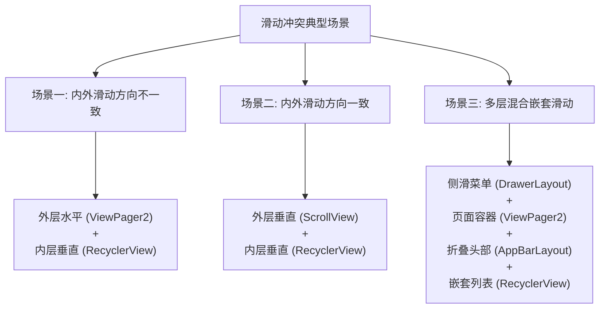
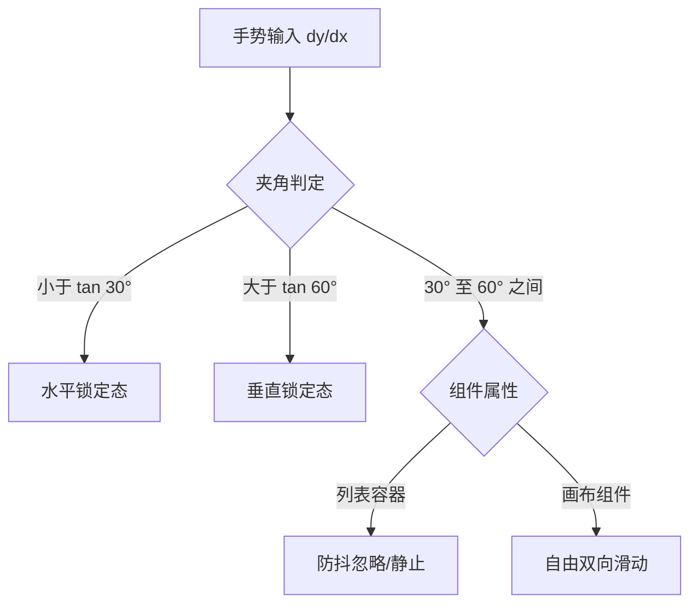
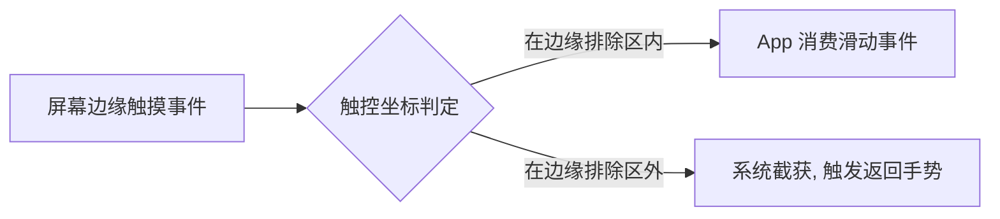

# 5.2.4.5 滑动冲突

在 Android 应用开发中，滑动冲突（Scroll Conflict）是构建复杂交互界面（如多级嵌套列表、抽屉导航、折叠头部以及混合滑动手势）时最常见且最棘手的问题之一。其本质是移动设备单点/多点触控的唯一性与 View 树层级结构中多个可滚动组件之间对触摸事件序列消费权的争夺。

要完美解决滑动冲突，开发者不仅需要熟练掌握 Android 经典的事件分发机制，还需要深入理解现代的 NestedScrolling 嵌套滑动机制，并能针对具体的业务场景进行定制化的事件拦截与传递。

本文将从滑动冲突的本质出发，死磕 Android 事件分发与嵌套滑动协议 of 底层源码，提供经典拦截法与现代嵌套滑动机制的完备解决方案，并结合实战案例进行设计模式与调试方法的深度剖析。

---

## 1. 滑动冲突的本质与典型场景分析

### 1.1 为什么会产生滑动冲突

要理解滑动冲突的根源，必须从硬件层与软件层的连接处说起。

从硬件层面来看，电容式触摸屏在毫秒级别的周期内不断扫描屏幕表面的电容变化。当用户的手指接触屏幕并滑动时，触摸屏驱动程序会生成一系列的硬件中断，并将触控点坐标、触摸面积、压力值等数据上报给操作系统。在 Android 系统中，这些原始的输入事件经过系统服务 `InputReader` 和 `InputDispatcher` 的读取与分发，最终被包装成 `MotionEvent` 对象传递给当前处于活跃状态的窗口（Window）。关于输入事件的底层接收与路由，可参考 [输入系统.md](./5.2.4.6.输入系统.md) 的详细论述。

当 `MotionEvent` 进入 Window 后，会沿着 `DecorView` 自顶向下传递到 View 树中。Android 经典的事件分发设计遵循一种**单路排他性消费机制**：
1. **单路分发**：对于一个完整的触摸事件序列（以 `ACTION_DOWN` 开始，经历若干个 `ACTION_MOVE`，以 `ACTION_UP` 或 `ACTION_CANCEL` 结束），系统需要通过碰撞测试（Hit Test）在 View 树中寻找一个最合适的消费者。
2. **排他消费**：在非主动干预的前提下，一旦某个 View 在处理 `ACTION_DOWN` 事件时返回了 `true`，系统就会在底层的 `ViewGroup` 中通过一个触摸目标链表（`mFirstTouchTarget`）将该 View 记录为当前事件序列的“终极消费者”。此后，该事件序列中的所有后续事件（特别是 `ACTION_MOVE`）都将直接越过其他兄弟 View，直接分发给该消费 View。
3. **单向终结**：如果父容器在中途（例如在 `ACTION_MOVE` 期间）通过 `onInterceptTouchEvent` 强行拦截了事件，子 View 将收到一个 `ACTION_CANCEL` 事件，并且在此后的整个事件序列中，子 View 将再也无法接收到任何事件。

这种“非此即彼”且“单向终结”的事件分发模型，在面对多层嵌套的可滑动组件时，就会产生不可调和的矛盾：
当用户的手势轨迹在屏幕上滑动时，如果 View 树中叠放了多个同样具备滚动能力的组件（例如 ScrollView 嵌套 RecyclerView，或者 ViewPager2 嵌套水平滑动的自定义图表），它们在当前的滑动方向上都满足滚动的物理阈值。由于传统的单路排他机制在同一时刻只能将事件序列交给某一个 View 来消费，因此如果缺乏合理的协调逻辑，就会导致以下问题：
* **事件被错误截获**：本该由子 View 响应的滑动事件被父容器强行拦截，导致子 View 无法滑动。
* **滑动体验割裂**：子 View 滑动到边界后，无法将多余的滑动距离无缝传递给父容器，导致界面“卡死”。
* **手势判定混乱**：用户轻微偏斜的滑动同时触发了水平和垂直两个方向的滚动意图，导致界面抖动或两个方向交替滑动，产生严重的视觉卡顿。

---

### 1.2 多指触控对冲突判定的加剧

在多指触控（Multi-touch）场景下，滑动冲突的判定会变得更加复杂。每个触摸屏幕的手指都会被系统赋予一个唯一的指针 ID（Pointer ID）。在事件流中，随着第二根手指的按下（`ACTION_POINTER_DOWN`）和第一根手指的抬起（`ACTION_POINTER_UP`），触摸事件的中心坐标（X, Y）以及活跃的 Pointer ID 会发生动态变化。如果滑动冲突的处理逻辑没有正确追踪活跃的 Pointer ID，就容易在多指交替滑动时产生计算坐标突变，从而导致视图产生瞬间的物理跳跃（Jump Bug）。

##### Pointer ID 与 Pointer Index 的映射关系
在 AOSP 中，`MotionEvent` 内部维护着一个动态的触控点数组。为了区分不同的手指，系统引入了两个概念：
* **Pointer ID**：在整轮手势序列中，代表某个特定手指的标识符。只要该手指不离开屏幕，其 Pointer ID 就保持绝对恒定不变（例如第一根按下的手指 ID 通常为 0，第二根为 1）。
* **Pointer Index**：当前触控点在 `MotionEvent` 内部数组中的物理索引。随着手指的抬起和按下，这个索引是**动态重组**的。例如，当 ID 为 0 的第一根手指抬起后，原本 ID 为 1、Index 为 1 的第二根手指在数组中的 Index 会瞬间变为 0。

| 状态描述 | 手指 1 (ID = 0) | 手指 2 (ID = 1) |
| :--- | :--- | :--- |
| **状态一**：双指在屏 | Index = 0 | Index = 1 |
| **状态二**：手指 1 抬起 | (已离屏) | Index = 0 |

如果在冲突判定中，我们直接调用不带参数的 `event.getX()` 或 `event.getY()`，其底层实际等价于 `event.getX(0)`（获取 Index 为 0 的坐标）。在上述第一根手指抬起的瞬间，`event.getX(0)` 获取到的值会突然从手指 1 的坐标跃迁到手指 2 的坐标。由于这两个触控点在屏幕上可能相距数厘米，导致计算出的滑动增量 $dx$ 或 $dy$ 瞬间增大百倍，触发滑动冲突判定的逻辑错误，使界面产生剧烈闪烁。
因此，在编写冲突解决方案时，**必须始终通过 `findPointerIndex(activePointerId)` 实时动态查询最新的 Index**。

---

### 1.3 滑动判定的物理与数学建模

在判定用户滑动意图时，我们通常使用以下物理与数学指标：
* **TouchSlop（滑动临界阈值）**：系统能识别的被认为是滑动的最小距离（以像素为单位）。在不同分辨率（DPI）的设备上，为了保证一致的手势体验，`TouchSlop` 的像素值是动态计算的。可以通过 `ViewConfiguration.get(context).getScaledTouchSlop()` 获取。其底层计算公式依赖于屏幕密度：
  $$\text{TouchSlop}_{\text{px}} = \text{TouchSlop}_{\text{dp}} \times \left( \frac{\text{Density}}{160} \right)$$
* **夹角判定法**：如果手势运动的起点是 $(x_{start}, y_{start})$，当前坐标是 $(x_{cur}, y_{cur})$，则水平位移为 $dx = |x_{cur} - x_{start}|$，垂直位移为 $dy = |y_{cur} - y_{start}|$。当手势方向与水平线的夹角为 $\theta$ 时，其正切值 $\tan\theta = \frac{dy}{dx}$：
  - 若 $\tan\theta < 1.0$（即 $dx > dy$），判定为**水平滑动**。
  - 若 $\tan\theta > 1.0$（即 $dy > dx$），判定为**垂直滑动**。
  
  在实际开发中，为了避免用户在斜向滑动时的模糊意图导致视图抖动，通常会设定一个缓冲角（如 $\tan 30^\circ$ 或 $\tan 60^\circ$ 阈值），或者加入滑动初速度（Velocity）的过滤。

---

### 1.4 三大典型滑动冲突场景

在实际开发中，滑动冲突几乎都可以归纳为以下三种典型场景：



#### 场景一：内外滑动方向不一致
这是最常见的冲突场景，典型代表是外层使用 `ViewPager2`（水平滑动），内层嵌套 `RecyclerView`（垂直滑动）。
* **冲突表现**：当用户在 `RecyclerView` 上进行垂直滑动时，如果手势稍微偏斜（例如划出了一条夹角为 30 度的斜线），由于 `ViewPager2` 内部的检测机制比较敏感，它可能会判定用户在进行水平滑动，从而强行拦截事件开始切换页面。这会导致用户本想上下滚动列表，却意外触发了页面的左右切换，或者导致列表上下滑动极不顺畅，产生明显的卡顿感。
* **解决核心**：根据滑动夹角或滑动距离差值进行判定。当 $dx > dy$ 且满足 $dx > \text{TouchSlop}$ 时，判定为水平滑动，交由外层容器消费；否则判定为垂直滑动，交由内层容器消费。

#### 场景二：内外滑动方向一致
此场景的典型代表是外层 `ScrollView` / `NestedScrollView` 嵌套内层的 `RecyclerView`，且两者都是垂直滚动。
* **冲突表现**：由于滑动方向完全相同，当用户手指在屏幕上垂直滑动时，如果外层容器在 `ACTION_MOVE` 期间直接拦截了事件，那么内层列表将永远无法滚动；如果外层容器不拦截，内层列表会消费所有滑动事件，直到列表滚动到最底部。此时，如果用户继续向上滑动手指，外层容器由于没有重新获取事件的机会，导致整个页面无法继续向上滚动，界面直接在边界处卡死。
* **解决核心**：引入**边界协同判定**或**嵌套滑动协议**。当内层子 View 滚动到边界（顶部或底部）时，必须能够将滑动事件的所有权动态转交给父容器，或者父子容器协同消费这一段滑动距离。

#### 场景三：多层混合嵌套滑动
这是前两种场景的复合体，常出现在大型商业 App 的首页。例如：外层是 `DrawerLayout`（水平滑动侧滑菜单），中间是 `ViewPager2`（水平滚动页面），`ViewPager2` 的某个 Fragment 中又包含一个 `CoordinatorLayout` 配合 `AppBarLayout`（垂直折叠），下方又是一个水平滚动的 `BannerView`（轮播图）和垂直滚动的 `RecyclerView`。
* **冲突表现**：在这样一个复杂的 View 树中，用户的单次滑动可能同时处于多个容器的触发边界。例如在 `BannerView` 上斜向滑动，既可能触发 `Banner` 的左右翻页，也可能触发 `ViewPager2` 的页面切换，还可能触发外层 `DrawerLayout` 的拉出，同时还伴随着整个页面的上下滚动。
* **解决核心**：对于如此复杂的场景，传统的基于事件拦截（`onInterceptTouchEvent`）的双路判定代码会变得极其臃肿、脆弱且难以维护。必须依赖 `NestedScrolling` 嵌套滑动协议进行多级链式分发，并在各个层级精确定义各自的滑动边界与消费优先级。

---

## 2. 滑动冲突解决的前置基础：Android 事件分发机制深度复习

在深入探讨滑动冲突的解决方案之前，我们必须对 Android 传统的事件分发机制进行源码级别的复习。事件分发的起点通常是 DecorView，进而流向 View 树。关于 Window 的概念和作用，可参考 [Window.md](./5.2.4.1.Window.md) 的系统介绍。

### 2.1 事件分发经典三大方法

事件分发流程的核心由三个方法共同维系，它们的函数签名和职责如下：

1. **`public boolean dispatchTouchEvent(MotionEvent ev)`**
   * **职责**：进行事件的分发。只要触摸事件能传递给当前 View，该方法就一定会首先被调用。
   * **返回值**：返回 `true` 表示当前事件序列被当前 View 或其子 View 消费；返回 `false` 表示不消费，事件将回传给父容器的 `onTouchEvent` 处理。
2. **`public boolean onInterceptTouchEvent(MotionEvent ev)`**
   * **职责**：这是 `ViewGroup` 独有的方法，用于决定是否拦截事件。在 `dispatchTouchEvent` 内部调用。
   * **返回值**：返回 `true` 表示拦截该事件，后续的事件序列将直接交由当前 `ViewGroup` 的 `onTouchEvent` 处理，并且会向之前消费事件 of 子 View 发送一个 `ACTION_CANCEL` 事件；返回 `false` 表示不拦截，事件继续向子 View 分发。
3. **`public boolean onTouchEvent(MotionEvent ev)`**
   * **职责**：处理触摸事件。在 `dispatchTouchEvent` 内部被调用（如果事件没有被拦截）。
   * **返回值**：返回 `true` 表示消费该事件，此后该事件序列的后续事件都将源源不断地分发到这里；返回 `false` 表示不消费，当前事件序列的后续事件将不再分发给它。

---

### 2.2 核心机制分发逻辑源码级剖析

为了更直观地理解这一过程，我们对 `ViewGroup.java` 中有关事件分发的核心源码逻辑进行死磕：

#### 1. 禁止拦截标记与重置逻辑
在 `ViewGroup.dispatchTouchEvent` 的开头，系统会在收到 `ACTION_DOWN` 时重置所有触摸状态：
```java
// 源码来自 AOSP ViewGroup.java
// 在收到新事件序列的首个事件时，进行彻底的清理工作
if (actionMasked == MotionEvent.ACTION_DOWN) {
    // 强制清除 mFirstTouchTarget 链表，切断上一轮事件的绑定关系
    cancelAndClearTouchTargets(ev);
    // 重置触摸状态，包括清除 mGroupFlags 中的 FLAG_DISALLOW_INTERCEPT 标志！
    resetTouchState();
}
```
`resetTouchState()` 内部的关键实现为：
```java
private void resetTouchState() {
    clearTouchTargets();
    resetCancelNextUpFlag(this);
    // 核心：清除禁止拦截标志位，恢复默认的拦截可判定状态
    mGroupFlags &= ~FLAG_DISALLOW_INTERCEPT;
    mNestedScrollAxes = SCROLL_AXIS_NONE;
}
```
这段代码揭示了一个核心定理：**在 `ACTION_DOWN` 到达时，ViewGroup 总是会清除禁止拦截标志**。因此，任何子 View 都无法阻止父容器拦截 `ACTION_DOWN`。

#### 2. 拦截判定的执行条件
在重置状态后，ViewGroup 会检查是否需要调用 `onInterceptTouchEvent`：
```java
final boolean intercepted;
if (actionMasked == MotionEvent.ACTION_DOWN || mFirstTouchTarget != null) {
    // 只有在 DOWN 事件或者有子 View 已经声明消费了事件（mFirstTouchTarget != null）时，才会检查拦截标志
    final boolean disallowIntercept = (mGroupFlags & FLAG_DISALLOW_INTERCEPT) != 0;
    if (!disallowIntercept) {
        intercepted = onInterceptTouchEvent(ev);
    } else {
        intercepted = false;
    }
} else {
    // 如果既不是 DOWN 事件，也没有任何子 View 消费该序列（mFirstTouchTarget 为空）
    // 说明之前的 DOWN 已经被当前 ViewGroup 自己消费了，后续的 MOVE/UP 将不再调用 onInterceptTouchEvent，直接进行拦截
    intercepted = true;
}
```
这意味着：如果子 View 在 `ACTION_DOWN` 阶段没有进行消费，`mFirstTouchTarget` 就会保持为 `null`。在随后的 `ACTION_MOVE` 中，此 ViewGroup 的这段逻辑会直接判定 `intercepted = true`，根本不会再去执行 `onInterceptTouchEvent`。

#### 3. 拦截转移与 ACTION_CANCEL 的向下分发
如果在滑动过程中，ViewGroup 在 `ACTION_MOVE` 阶段突然决定拦截事件（即 `onInterceptTouchEvent` 返回了 `true`）：
```java
// 沿着 mFirstTouchTarget 链表向下分发取消信号
TouchTarget predecessor = null;
TouchTarget target = mFirstTouchTarget;
while (target != null) {
    final TouchTarget next = target.next;
    if (alreadyDispatchedTo != null && target == alreadyDispatchedTo) {
        handled = true;
    } else {
        // 核心：如果 intercepted 为 true，此处会将 cancelChild 参数设为 true
        final boolean cancelChild = resetCancelNextUpFlag(target.child) || intercepted;
        // 这会向子 View 派发一个带有 ACTION_CANCEL 的 MotionEvent
        if (dispatchTransformedTouchEvent(ev, cancelChild, target.child, target.pointerIdBits)) {
            handled = true;
        }
        if (cancelChild) {
            // 从触摸目标链表中移除该子 View，后续事件再也发不给它了
            if (predecessor == null) {
                mFirstTouchTarget = next;
            } else {
                predecessor.next = next;
            }
            target.recycle();
            target = next;
            continue;
        }
    }
    predecessor = target;
    target = next;
}
```
子 View 在收到 `ACTION_CANCEL` 后，自身的 `onTouchEvent` 会被调用，内部通常会执行清理逻辑（例如重置按下状态、停止当前滚动动画、隐藏高亮框等），然后退出该轮事件序列的处理。

---

### 2.3 关键底层概念与进阶机制

#### 1. MotionEvent 的批处理（Batching）机制
在处理高频滑动手势时，如果系统对触摸屏的每一次物理采样都产生一个独立的 `MotionEvent` 并调用一次 View 树分发，这会导致主线程产生极大的渲染压力，引起界面丢帧。
为了优化性能，Android 引入了事件批处理机制：
在两次屏幕绘制周期之间产生的多个 `ACTION_MOVE` 物理坐标，会被打包进同一个 `MotionEvent` 中。在 `onTouchEvent` 中，我们不仅能通过 `event.getX()` 获取当前的坐标，还能通过 `event.getHistorySize()` 获取在这之间缓存的历史坐标点个数，并通过 `event.getHistoricalX(pin, pos)` 获取这些历史点。
* **滑动冲突判定价值**：如果我们在滑动冲突判定中只拿最新的当前点，在手指快速划过时可能会丢失一些微小的运动轨迹。通过遍历历史点，可以计算出更加平滑的速度曲线，提高冲突判断的精确度。

#### 2. OnTouchListener 的优先拦截权
在 View 的 `dispatchTouchEvent` 源码中，有以下逻辑：
```java
// View.java 中的核心分发
public boolean dispatchTouchEvent(MotionEvent event) {
    ...
    ListenerInfo li = mListenerInfo;
    if (li != null && li.mOnTouchListener != null
            && (mViewFlags & ENABLED_MASK) == ENABLED
            && li.mOnTouchListener.onTouch(this, event)) {
        // 如果外部给此 View 设置了 OnTouchListener 且 onTouch 返回了 true
        // 事件直接在此处终结，不会再向下调用 onTouchEvent(event)！
        return true;
    }
    
    if (onTouchEvent(event)) {
        return true;
    }
    ...
}
```
在排查滑动冲突时，开发者常犯的一个错误是：在外部给子 View 设置了 `OnTouchListener` 且返回了 `true`，但却在重写的子 View `onTouchEvent` 中编写冲突解决逻辑，结果发现子 View 的 `onTouchEvent` 根本没有执行，导致冲突逻辑彻底失效。

#### 3. requestDisallowInterceptTouchEvent 的底层位操作与级联机制
当子 View 需要阻止父容器拦截事件时，会调用 `requestDisallowInterceptTouchEvent(true)`。该方法在 `ViewParent` 接口中定义，由 `ViewGroup.java` 实现，其底层源码实现和位操作逻辑极具参考价值：

```java
// AOSP ViewGroup.java 核心实现
@Override
public void requestDisallowInterceptTouchEvent(boolean disallowIntercept) {
    if (disallowIntercept == ((mGroupFlags & FLAG_DISALLOW_INTERCEPT) != 0)) {
        // 状态已吻合，直接返回，避免无意义的递归调用
        return;
    }

    if (disallowIntercept) {
        // 使用按位或（OR）操作，将 FLAG_DISALLOW_INTERCEPT 对应的比特位置为 1
        mGroupFlags |= FLAG_DISALLOW_INTERCEPT;
    } else {
        // 使用按位与（AND）和按位取反（NOT）操作，将该标志位清零
        mGroupFlags &= ~FLAG_DISALLOW_INTERCEPT;
    }

    // 级联向上层层传导
    if (mParent != null) {
        mParent.requestDisallowInterceptTouchEvent(disallowIntercept);
    }
}
```

##### 级联传导的运行机制
当我们在多层嵌套的树结构中（如：Activity -> FrameLayout -> ScrollView -> ViewPager2 -> RecyclerView）调用此方法时，RecyclerView 会触发其直接父容器（ViewPager2）的 `requestDisallowInterceptTouchEvent`。ViewPager2 修改自身的 `mGroupFlags` 之后，会通过 `mParent` 引用递归向上层层调用，使得上游所有的 Parent 容器（ScrollView、FrameLayout 等）都打上 `FLAG_DISALLOW_INTERCEPT` 的禁止拦截标记。
这种级联式的链式通知，确保了在手势响应期间，**整个上层 View 树上的所有祖先容器都会放行，把事件流完整地保留在底层的子 View 分支**。

##### FLAG_DISALLOW_INTERCEPT 位操作的技术考量
在 Android 系统级的核心 UI 库中，一个 `ViewGroup` 的状态（如是否支持绘制、是否需要剪裁子 View、是否禁止拦截事件等）多达数十种。如果为每个开关都分配一个独立的 `boolean` 字段，不仅会增加每个 `ViewGroup` 实例的内存开销（由于内存对齐，每个 Boolean 字段在 64 位虚拟机中可能会占用 1 个字节甚至 8 个字节的内存空间），还会降低状态查询的执行效率。
Lock/Key 的机制在底层的图形与渲染框架中是极其常规且高性能的优化策略。AOSP 采用了一个全局的 `mGroupFlags` 整型（32位 `int`）变量，将各个状态作为独立的**比特位**进行压缩存储：
- **置位 1（Set Bit）**：`mGroupFlags |= FLAG_DISALLOW_INTERCEPT`。此操作利用按位或（`|`），保证在不改变 `mGroupFlags` 中其他 31 个状态比特位的前提下，强行将该标志位对应的比特位置为 1。
- **清位 0（Clear Bit）**：`mGroupFlags &= ~FLAG_DISALLOW_INTERCEPT`。此操作首先对 `FLAG_DISALLOW_INTERCEPT`（其值除该标志位为 1 外其他均为 0）进行按位取反（`~`），得到一个该比特位为 0、其他比特位均为 1 的掩码。然后与 `mGroupFlags` 进行按位与（`&`）运算，从而在完整保留其他状态的同时，将目标比特位精准地剥离并置为 0。

##### 暴破该限制的 resetTouchState() 底层细节
在前文的 `ViewGroup.dispatchTouchEvent` 源码分析中，我们看到在 `MotionEvent.ACTION_DOWN` 到达时，会首先执行 `resetTouchState()`。在 `resetTouchState()` 中：
```java
private void resetTouchState() {
    clearTouchTargets();
    resetCancelNextUpFlag(this);
    // 强制清除禁止拦截标志位
    mGroupFlags &= ~FLAG_DISALLOW_INTERCEPT;
    mNestedScrollAxes = SCROLL_AXIS_NONE;
}
```
这导致子 View 之前通过级联传导设置给上游所有父容器的 `FLAG_DISALLOW_INTERCEPT` 比特位瞬间被全部清零。这就是为什么在 `ACTION_DOWN` 阶段，父容器的 `onInterceptTouchEvent` 一定会被执行的深层原因。这一底层逻辑确保了每一轮事件序列的起点，父容器都拥有绝对的事件分发主导权。

---

## 3. 经典冲突解决方案一：外部拦截法 (Parent Interception)

外部拦截法将滑动事件的控制权完全收归父容器，由父容器决定是否向子 View 分发事件。

### 3.1 设计理念

外部拦截法的核心思路是：所有触摸事件首先都会经过父容器的 `onInterceptTouchEvent`。父容器根据当前的触摸点坐标、滑动方向和业务逻辑，判断该滑动事件是否属于自己。
* 如果判定当前滑动应该由父容器消费，则在 `onInterceptTouchEvent` 中返回 `true` 进行拦截，事件随之转交给父容器的 `onTouchEvent` 处理。
* 如果判定当前滑动应该由子 View 消费，则在 `onInterceptTouchEvent` 中返回 `false` 进行放行，事件得以下传给子 View。

---

### 3.2 完备的多点触控与速度判定模板实现

以下是集成多点触控追踪（防跳变）以及速度判定（`VelocityTracker`）的外部拦截法高级实现代码：

```java
public class AdvancedParentInterceptLayout extends ViewGroup {

    private static final int INVALID_POINTER_ID = -1;
    
    private int mActivePointerId = INVALID_POINTER_ID;
    private int mLastX;
    private int mLastY;
    
    private int mTouchSlop;
    private int mMaxFlingVelocity;
    private int mMinFlingVelocity;
    private VelocityTracker mVelocityTracker;

    public AdvancedParentInterceptLayout(Context context, AttributeSet attrs) {
        super(context, attrs);
        ViewConfiguration vc = ViewConfiguration.get(context);
        mTouchSlop = vc.getScaledTouchSlop();
        mMaxFlingVelocity = vc.getScaledMaximumFlingVelocity();
        mMinFlingVelocity = vc.getScaledMinimumFlingVelocity();
    }

    @Override
    public boolean onInterceptTouchEvent(MotionEvent ev) {
        final int action = ev.getActionMasked();
        
        // 1. 初始化或将事件添加进速度追踪器
        if (mVelocityTracker == null) {
            mVelocityTracker = VelocityTracker.obtain();
        }
        mVelocityTracker.addMovement(ev);

        switch (action) {
            case MotionEvent.ACTION_DOWN: {
                // 2. 追踪主手指的 Pointer ID
                mActivePointerId = ev.getPointerId(0);
                int pointerIndex = ev.findPointerIndex(mActivePointerId);
                if (pointerIndex < 0) break;
                
                mLastX = (int) ev.getX(pointerIndex);
                mLastY = (int) ev.getY(pointerIndex);
                
                // DOWN 事件绝不拦截，否则会导致后续事件无法下传
                break;
            }

            case MotionEvent.ACTION_MOVE: {
                if (mActivePointerId == INVALID_POINTER_ID) break;
                
                int pointerIndex = ev.findPointerIndex(mActivePointerId);
                if (pointerIndex < 0) break;

                int x = (int) ev.getX(pointerIndex);
                int y = (int) ev.getY(pointerIndex);
                
                int deltaX = x - mLastX;
                int deltaY = y - mLastY;

                // 计算滑动速度
                mVelocityTracker.computeCurrentVelocity(1000, mMaxFlingVelocity);
                float xVelocity = mVelocityTracker.getXVelocity(mActivePointerId);
                float yVelocity = mVelocityTracker.getYVelocity(mActivePointerId);

                // 3. 综合判断距离与速度。
                // 假定此父容器负责水平滑动：
                // 如果水平滑动位移超过阈值且大于垂直位移，或者水平速度大于最小 Fling 速度阈值，则实施拦截
                if ((Math.abs(deltaX) > mTouchSlop && Math.abs(deltaX) > Math.abs(deltaY))
                        || (Math.abs(xVelocity) > mMinFlingVelocity && Math.abs(xVelocity) > Math.abs(yVelocity))) {
                    
                    // 标记当前位置为最后位置，防止拦截瞬间发生坐标抖动
                    mLastX = x;
                    mLastY = y;
                    return true; // 强行拦截事件！
                }
                break;
            }

            case MotionEvent.ACTION_POINTER_DOWN: {
                // 4. 处理第二根手指按下的情况，将活跃手指切换到新按下的手指，防坐标跳变
                final int index = ev.getActionIndex();
                mActivePointerId = ev.getPointerId(index);
                mLastX = (int) ev.getX(index);
                mLastY = (int) ev.getY(index);
                break;
            }

            case MotionEvent.ACTION_POINTER_UP: {
                // 5. 应对活跃手指抬起的情况
                onPointerUp(ev);
                break;
            }

            case MotionEvent.ACTION_UP:
            case MotionEvent.ACTION_CANCEL: {
                // 6. 清理速度追踪器和活跃手指状态
                mActivePointerId = INVALID_POINTER_ID;
                recycleVelocityTracker();
                break;
            }
        }

        return false;
    }

    private void onPointerUp(MotionEvent ev) {
        final int pointerIndex = ev.getActionIndex();
        final int pointerId = ev.getPointerId(pointerIndex);
        if (pointerId == mActivePointerId) {
            // 如果抬起的是当前活跃的手指，选择另一个手指作为活跃手指并更新 mLastX/mLastY
            final int newPointerIndex = pointerIndex == 0 ? 1 : 0;
            mActivePointerId = ev.getPointerId(newPointerIndex);
            mLastX = (int) ev.getX(newPointerIndex);
            mLastY = (int) ev.getY(newPointerIndex);
        }
    }

    private void recycleVelocityTracker() {
        if (mVelocityTracker != null) {
            mVelocityTracker.recycle();
            mVelocityTracker = null;
        }
    }

    @Override
    public boolean onTouchEvent(MotionEvent event) {
        // 在此处理父容器自身的滑动逻辑
        return true;
    }

    @Override
    protected void onLayout(boolean changed, int l, int t, int r, int b) {
        // 布局子视图逻辑
    }
}
```

---

## 4. 经典冲突解决方案二：内部拦截法 (Child Interception)

内部拦截法颠覆了父容器的绝对主导地位，将滑动事件的决策权交给了子 View，属于“子 View 动态向父容器申请权限”的模式。

### 4.1 设计理念

内部拦截法的工作逻辑是：
1. 父容器默认**不拦截**任何触摸事件。所有的事件第一站都是下发给子 View。
2. 子 View 在其 `dispatchTouchEvent` 中接收事件，并根据自身滑动状态进行判断：
   * 如果子 View 判定当前滑动自己可以消费（比如列表还没滚动到边界），则调用 `parent.requestDisallowInterceptTouchEvent(true)`，命令父容器不许插手。
   * 如果子 View 判定当前滑动已经到达边界（比如列表已经滚到最底部，需要父容器继续滑动），则调用 `parent.requestDisallowInterceptTouchEvent(false)`，允许父容器接管后续滑动。

---

### 4.2 完备的高级实现代码

内部拦截法需要子 View 和父容器**协同**编写代码。以下是考虑了多点触控防抖动的完备实现：

#### 1. 子 View 侧的实现：重写 `dispatchTouchEvent`
```java
public class AdvancedChildInterceptView extends View {

    private static final int INVALID_POINTER_ID = -1;
    private int mActivePointerId = INVALID_POINTER_ID;
    
    private int mLastX;
    private int mLastY;
    private int mTouchSlop;

    public AdvancedChildInterceptView(Context context, AttributeSet attrs) {
        super(context, attrs);
        mTouchSlop = ViewConfiguration.get(context).getScaledTouchSlop();
    }

    @Override
    public boolean dispatchTouchEvent(MotionEvent event) {
        int x = (int) event.getX();
        int y = (int) event.getY();

        switch (event.getActionMasked()) {
            case MotionEvent.ACTION_DOWN: {
                mActivePointerId = event.getPointerId(0);
                mLastX = x;
                mLastY = y;
                // 1. 默认对父容器加锁，保证后续的 MOVE 能传递给当前子 View
                getParent().requestDisallowInterceptTouchEvent(true);
                break;
            }

            case MotionEvent.ACTION_POINTER_DOWN: {
                // 2. 多指按下，切换活跃手指，更新定位点
                final int index = event.getActionIndex();
                mActivePointerId = event.getPointerId(index);
                mLastX = (int) event.getX(index);
                mLastY = (int) event.getY(index);
                getParent().requestDisallowInterceptTouchEvent(true);
                break;
            }

            case MotionEvent.ACTION_MOVE: {
                if (mActivePointerId == INVALID_POINTER_ID) break;
                int pointerIndex = event.findPointerIndex(mActivePointerId);
                if (pointerIndex < 0) break;

                int curX = (int) event.getX(pointerIndex);
                int curY = (int) event.getY(pointerIndex);
                
                int deltaX = curX - mLastX;
                int deltaY = curY - mLastY;

                // 3. 进行边界协同判定。
                // 假定此子 View 负责垂直滑动。当滑动量超过阈值且处于向上滑动状态，
                // 同时自身已经滚动到了最底部时，解除对父容器的限制，将剩余位移让渡出去
                if (Math.abs(deltaY) > mTouchSlop && Math.abs(deltaY) > Math.abs(deltaX)) {
                    if (deltaY < 0 && !canScrollVertically(1)) {
                        // 允许父容器拦截
                        getParent().requestDisallowInterceptTouchEvent(false);
                    } else if (deltaY > 0 && !canScrollVertically(-1)) {
                        // 允许父容器拦截
                        getParent().requestDisallowInterceptTouchEvent(false);
                    } else {
                        // 自身依然可以滑动，继续保护
                        getParent().requestDisallowInterceptTouchEvent(true);
                    }
                }
                break;
            }

            case MotionEvent.ACTION_POINTER_UP: {
                final int index = event.getActionIndex();
                final int pointerId = event.getPointerId(index);
                if (pointerId == mActivePointerId) {
                    final int newIndex = index == 0 ? 1 : 0;
                    mActivePointerId = event.getPointerId(newIndex);
                    mLastX = (int) event.getX(newIndex);
                    mLastY = (int) event.getY(newIndex);
                }
                break;
            }

            case MotionEvent.ACTION_UP:
            case MotionEvent.ACTION_CANCEL: {
                mActivePointerId = INVALID_POINTER_ID;
                getParent().requestDisallowInterceptTouchEvent(false);
                break;
            }
        }

        // 记录坐标，以当前指针位置为基准
        if (mActivePointerId != INVALID_POINTER_ID) {
            int idx = event.findPointerIndex(mActivePointerId);
            if (idx >= 0) {
                mLastX = (int) event.getX(idx);
                mLastY = (int) event.getY(idx);
            }
        }
        
        return super.dispatchTouchEvent(event);
    }
}
```

#### 2. 父容器侧的配合代码
父容器必须配合子 View，在 `onInterceptTouchEvent` 中放行 `ACTION_DOWN`，而拦截其他的 `ACTION_MOVE` 和 `ACTION_UP`：
```java
public class ParentHelperLayout extends ViewGroup {

    public ParentHelperLayout(Context context, AttributeSet attrs) {
        super(context, attrs);
    }

    @Override
    public boolean onInterceptTouchEvent(MotionEvent event) {
        int action = event.getActionMasked();
        if (action == MotionEvent.ACTION_DOWN) {
            // 必须放行 DOWN
            return false;
        } else {
            // 默认拦截 MOVE/UP
            return true;
        }
    }

    @Override
    public boolean onTouchEvent(MotionEvent event) {
        // 父容器滑动逻辑
        return true;
    }

    @Override
    protected void onLayout(boolean changed, int l, int t, int r, int b) {}
}
```

---

### 4.3 内部拦截法失效的核心源码栈分析

为了彻底搞清为什么父容器对非 DOWN 事件必须返回 `true`，我们追踪一下当父容器的 `onInterceptTouchEvent` 对 MOVE 事件返回 `false` 时，系统的具体运行轨迹：

```
[子 View 的 MOVE 事件分发链路]
1. 用户的坐标发生改变，系统产生 ACTION_MOVE
2. 触发 ParentHelperLayout 的 dispatchTouchEvent(ev)
3. 校验 FLAG_DISALLOW_INTERCEPT：
   由于子 View 在 ACTION_MOVE 期间判定到达边界，调用了：
   getParent().requestDisallowInterceptTouchEvent(false)
   此时父容器的 mGroupFlags 中的该标志位被置为 0（即 disallowedIntercept = false）
4. 因为 disallowedIntercept 为 false，父容器调用其 onInterceptTouchEvent(ev) 
5. [错误设定点]：如果此时父容器 of onInterceptTouchEvent 返回了 false
   -> intercepted 被设为 false
6. 接下来，由于 intercepted 为 false，系统继续沿着 mFirstTouchTarget 链表向下分发事件：
   dispatchTransformedTouchEvent(ev, false, target.child)
7. 事件又被原封不动地发给了子 View 的 dispatchTouchEvent！
8. 父容器的 onTouchEvent(ev) 根本不会被调用！
```
从这一调用栈可以看出，在内部拦截法中，**子 View 对父容器的“请勿拦截”标记只是一个“锁”**。子 View 打开锁的瞬间，父容器必须在 `onInterceptTouchEvent` 中表达出拦截动作（返回 `true`），才能完成对滑动事件控制权的交接。

---

### 4.4 中断状态恢复与多点手势退避机制

在内部拦截法中，一旦子 View 判定需要父容器接管滑动（例如垂直滚动的列表滑动到了顶部），它会调用 `getParent().requestDisallowInterceptTouchEvent(false)`。
这会导致在下一个 `ACTION_MOVE` 事件到达父容器时，父容器会强行对其进行拦截（`onInterceptTouchEvent` 返回 `true`）。
在拦截发生的瞬间，根据 `ViewGroup.dispatchTouchEvent` 的底层逻辑，系统会向子 View 分发一个包含 `ACTION_CANCEL` 的 `MotionEvent`。在处理这一高频且突然的“状态被剥夺”事件时，子 View 必须实现一套严密的状态恢复与多点手势退避（Gesture Back-off）机制，否则会直接带来灾难性的 UI 体验问题。

#### 1. 状态中断与界面优雅还原
一旦子 View 在其 `dispatchTouchEvent` 或 `onTouchEvent` 中接收到 `ACTION_CANCEL`，意味着它彻底失去了本轮事件序列的控制权。
此时，子 View 内部必须立即将以下状态重置为基准值，称为**安全归位（Safeguard Resets）**：
* **界面物理效果重置**：如果子 View 正在响应按压高亮效果（如 `Drawable` 状态列表呈现 `state_pressed`），必须立即调用 `setPressed(false)` 还原背景，防止界面卡在“按下变灰色”的状态。
* **手势计算增量归零**：子 View 的滚动偏移计算（如 `mLastX`、`mLastY`）、手势判定助手类（如 `VelocityTracker`）必须调用 `clear()` 立即清空并释放。如果这些累加值没有在 `ACTION_CANCEL` 中清空，当用户下一次重新按下屏幕（触发新一轮 `ACTION_DOWN`）时，由于之前残留的滑动偏置值没有被抹去，子 View 会直接在屏幕上产生一次剧烈的坐标“瞬移”（跳变）。
* **跟随手势动画的强行终止**：如果子 View 正处于一种“手势跟随”的微型弹性动画中（如阻尼位移平移），必须在收到 `ACTION_CANCEL` 的刹那立即执行 `ValueAnimator.cancel()` 或 `ViewPropertyAnimator.cancel()`，并将 View 的位置平滑恢复到默认锚点。

#### 2. 多点触控下的手势退避（Gesture Back-off）
在处理多指滑动冲突时，如果活跃手指（由 `mActivePointerId` 追踪）被用户抬起（触发 `ACTION_POINTER_UP`），子 View 需要选择另一根仍然停留在屏幕上的手指作为新的活跃点，以防止计算出的 $dx$ 或 $dy$ 发生突变。这被称为**手势退避机制**：
* **查询活跃指针状态**：在 `ACTION_POINTER_UP` 中，通过 `event.getActionIndex()` 获取刚刚抬起的手指的 Index，并通过 `event.getPointerId(index)` 获取该手指的 Pointer ID。
* **触发退避选择**：如果抬起的手指正是我们正在用来计算滑动增量的 `mActivePointerId`，说明活跃滚动源丢失了。子 View 必须立刻遍历所有仍处于触控状态的手指，挑选一个（通常是 Index 为 0 的手指）作为新的活跃点，并将该新手指对应的物理坐标更新为最新的 `mLastX` 和 `mLastY`。
* **退避逻辑在 Kotlin/Java 中的经典实现**：
  ```java
  case MotionEvent.ACTION_POINTER_UP: {
      final int pointerIndex = event.getActionIndex();
      final int pointerId = event.getPointerId(pointerIndex);
      if (pointerId == mActivePointerId) {
          // 活跃手指被抬起了！重新指派新的活跃手指
          // 选择触控列表里除了当前抬起手指外的另一个有效指针（通常是 Index 0 或 1）
          final int newPointerIndex = pointerIndex == 0 ? 1 : 0;
          mActivePointerId = event.getPointerId(newPointerIndex);
          mLastX = (int) event.getX(newPointerIndex);
          mLastY = (int) event.getY(newPointerIndex);
      }
      break;
  }
  ```
通过这种退避设计，即使多指高频交替滑动，子 View 内部记录的滑动起点也能随之瞬时修正，从物理数学模型上彻底斩断了多指切换引起的坐标跳跃（Jump Bug）。

---

## 5. 现代高级解决方案：NestedScrolling 嵌套滑动协议详解

虽然经典拦截法（外部拦截、内部拦截）可以解决大多数滑动冲突，但它在处理一些复杂的平滑过渡场景时显得力不从心。为了应对现代 UI 设计的嵌套滑动要求，Android 从 5.0 开始引入了 `NestedScrolling` 嵌套滑动机制，并在 AndroidX 库中对其进行了数次重大演进。

### 5.1 传统事件拦截机制的局限性

传统的事件分发机制是“非此即彼”且“单向终结”的。这带来了两个致命的局限性：
* **无法实现“协同消费”**：在滑动过程中，无法做到“子 View 先滑动 50px，剩下的 100px 让父 View 滑动，如果父 View 滑不动了再交还给子 View 滑动”的平滑过渡。一旦父 View 拦截了事件，子 View 就会接收到 `ACTION_CANCEL`，当场出局。
* **惯性滑动（Fling）断层**：当用户手指快速滑过屏幕并抬起时，列表会产生一个惯性滑动（Fling）。在传统机制下，如果子 View Fling 到达边界，由于手指已经抬起，不会产生新的触摸事件，父 View 无法接收到任何剩余的动量，导致整个页面戛然而止，体验非常生硬。

---

### 5.2 NestedScrolling 嵌套滑动的核心思想

NestedScrolling 机制的核心思想是：**由子 View 发起滑动（因为子 View 是触摸事件的第一消费者），并在滑动的每个阶段主动将位移推送给父 View 协同消费。**

整个嵌套滑动由两个接口协同完成：
* **`NestedScrollingChild`（简称 NSC）**：滑动的发起者，通常是滚动的具体组件，如 `RecyclerView`、`NestedScrollView`。
* **`NestedScrollingParent`（简称 NSP）**：滑动的配合者，通常是包裹 NSC 的父容器，如 `CoordinatorLayout`、`SwipeRefreshLayout`。

---

### 5.3 核心接口与类层次演进

随着 Android 的版本迭代，嵌套滑动协议经历了三次演进，解决了不同时期的交互痛点：

| 接口版本 | 对应核心类 | 引入的改进与解决的问题 |
| :--- | :--- | :--- |
| **NestedScrolling v1** | `NestedScrollingChild`<br>`NestedScrollingParent` | 提供了最基础的嵌套滑动骨架。但在惯性滑动（Fling）阶段，只能由子 View 或父 View 单独消费全部动量，**不支持 Fling 过程中的分段消费和无缝过渡**。 |
| **NestedScrolling v2** | `NestedScrollingChild2`<br>`NestedScrollingParent2` | 在所有核心方法的签名中引入了 `NestedScrollType` 参数。区分了 **触摸滑动（`TYPE_TOUCH`）** 和 **惯性滚动（`TYPE_NON_TOUCH`）**。使得 Fling 阶段也能像 Move 阶段一样，由子 View 产生 Fling，并源源不断地向父 View 传递 `TYPE_NON_TOUCH` 的 PreScroll / Scroll 信号，实现了 **Fling 阶段的无缝联动**。 |
| **NestedScrolling v3** | `NestedScrollingChild3`<br>`NestedScrollingParent3` | 进一步修改了 `dispatchNestedScroll` 和 `onNestedScroll` 的方法签名。引入了一个额外的 **`consumed` 数组参数**，用来精确向子 View 传递父 View 在后置消费中实际消耗的未消耗距离。解决了在多级嵌套滑动（如：CoordinatorLayout 嵌套 ScrollView 再嵌套 RecyclerView）时，由于 unconsumed位移被多层父容器重复消耗或丢失，导致**外层刷新控件无法被正确唤醒的 bug**。 |

### 5.3.4 NestedScrolling v3 解决多级级联传递卡顿的底层机制

在 NestedScrolling v1 和 v2 协议下，多级滚动嵌套（例如：CoordinatorLayout 包裹了一个 `NestedScrollView`，内部又放置了一个垂直滚动的 `RecyclerView`，最外层还包裹着 `SwipeRefreshLayout` 下拉刷新）会经常遇到滑动中途瞬间阻尼异常、惯性滑动（Fling）传递卡滞或者下拉刷新无意中卡死“打架”的故障。
这些现象的根源在于：**未消费位移（unconsumed）的传递链是“单向且盲目”的**。

在 v2 版本中，NSC 将剩余位移分发给 Parent 的方法签名为：
```java
// v2 协议接口方法
void onNestedScroll(View target, int dxConsumed, int dyConsumed, 
                    int dxUnconsumed, int dyUnconsumed, int type);
```
假定在三层嵌套下，内层 `RecyclerView` 滑动到了底部，产生 $100\text{px}$ 的 `dyUnconsumed`。
1. `RecyclerView` 通过 `dispatchNestedScroll` 向上分发，触发中层 `NestedScrollView` 的 `onNestedScroll`。
2. 中层 `NestedScrollView` 本身也无法向上滚动了，因此它只能级联向上，将这 $100\text{px}$ 继续分发给最外层的 `CoordinatorLayout`。
3. `CoordinatorLayout` 消耗了其中的 $40\text{px}$ 来折叠头部，剩下 $60\text{px}$ 未消耗。
4. **致命缺陷出现**：由于 v2 接口方法不提供任何消费反馈机制，中层 `NestedScrollView` 根本不知道最外层 `CoordinatorLayout` 到底消费了多少像素！它只知道自己发出去的是 $100\text{px}$，但在返回后它无法知道外层的消费状态。这使得中层的位移记账完全失衡，进而导致惯性滑动 Fling 动量在多级传递时由于数据断层被直接截断，在用户看来就是界面滑到一半突然“卡顿”。

为了彻底解决此问题，NestedScrolling v3 协议对该方法进行了重构，引入了 `consumed` 数组参数：
```java
// v3 协议接口方法
void onNestedScroll(@NonNull View target, int dxConsumed, int dyConsumed,
        int dxUnconsumed, int dyUnconsumed, int type, @NonNull int[] consumed);
```
此方法的核心改进在于**引入了“双向同步账本”机制**：
- 级联传递时，中层 Parent 会将一个用于记录消费状态的 `consumed` 数组（例如 `consumed[1]` 代表垂直消费量）作为参数，与 `dyUnconsumed` 一同向上传递给最外层 Parent。
- 最外层 Parent 实际消费了多少像素，就必须在 `consumed[1]` 中累加该像素值。
- 调用返回后，中层 Parent 可以通过读取 `consumed[1]` 的最新数值，精准洞察外层 Parent 替自己分担的滚动距离，并能准确扣除该值，将最终仍未被消费的净位移通过 `consumed` 链条再次反馈给最内层的 NSC（RecyclerView）。
- 这种“双向核算”的设计，使得多级嵌套滑动的每一像素位移在各个父容器中分配得清清楚楚，完全消除了动量丢失，使级联滑动和 Fling 惯性传递能够以极其平滑、级联的方式彻底贯通。

---

## 5.4 嵌套滑动调用逻辑与源码链路

我们以 AOSP 中 `RecyclerView`（作为 NSC）和 `CoordinatorLayout`（作为 NSP）的交互为例，解析嵌套滑动的源码链路。

#### 1. 初始化与绑定阶段：`startNestedScroll`
在 `RecyclerView.onTouchEvent` 收到 `ACTION_DOWN` 时：
```java
// RecyclerView.java
case MotionEvent.ACTION_DOWN: {
    mScrollPointerId = e.getPointerId(0);
    mInitialTouchX = mLastTouchX = (int) (e.getX() + 0.5f);
    mInitialTouchY = mLastTouchY = (int) (e.getY() + 0.5f);
    
    // 启动垂直方向的嵌套滑动，并标记为触摸滑动 (TYPE_TOUCH)
    startNestedScroll(ViewCompat.SCROLL_AXIS_VERTICAL, TYPE_TOUCH);
} break;
```
in `startNestedScroll` 内部，RecyclerView 会通过 `NestedScrollingChildHelper` 去寻找它的父容器：
```java
// NestedScrollingChildHelper.java
public boolean startNestedScroll(int axes, int type) {
    if (hasNestedScrollingParent(type)) {
        // 已经绑定了 Parent
        return true;
    }
    if (isNestedScrollingEnabled()) {
        ViewParent p = mView.getParent();
        View child = mView;
        // 递归向上遍历 View 树，寻找实现了 NestedScrollingParent 接口的容器
        while (p != null) {
            if (ViewParentCompat.onStartNestedScroll(p, child, mView, axes, type)) {
                // 找到合适的 Parent，进行记录
                setNestedScrollingParentForType(type, p);
                ViewParentCompat.onNestedScrollAccepted(p, child, mView, axes, type);
                return true;
            }
            if (p instanceof View) {
                child = (View) p;
            }
            p = p.getParent();
        }
    }
    return false;
}
```

#### 2. 滑动位移分配核心：`NestedScrollingChildHelper` 源码剖析
在 `NestedScrollingChildHelper` 中，`dispatchNestedPreScroll` 的实现极具技术含金量，它展示了 Android 如何在窗口坐标系中维持坐标定位的连续性：

```java
// AOSP NestedScrollingChildHelper.java 中的核心实现
public boolean dispatchNestedPreScroll(int dx, int dy, @Nullable int[] consumed,
        @Nullable int[] offsetInWindow, int type) {
    if (isNestedScrollingEnabled()) {
        // 根据滑动的 type (TOUCH 或 NON_TOUCH) 寻找对应的 Parent 引用
        final ViewParent parent = getNestedScrollingParentForType(type);
        if (parent == null) {
            return false;
        }

        if (dx != 0 || dy != 0) {
            int startX = 0;
            int startY = 0;
            if (offsetInWindow != null) {
                // 1. 记录调用前子 View 在窗口中的绝对坐标
                mView.getLocationInWindow(offsetInWindow);
                startX = offsetInWindow[0];
                startY = offsetInWindow[1];
            }

            // 2. 初始化消费数组，复用全局临时数组避免对象频繁分配引起 GC
            if (consumed == null) {
                if (mTempNestedScrollConsumed == null) {
                    mTempNestedScrollConsumed = new int[2];
                }
                consumed = mTempNestedScrollConsumed;
            }
            consumed[0] = 0;
            consumed[1] = 0;

            // 3. 通过兼容类向上传递，驱动 Parent 进行优先滑动消费
            ViewParentCompat.onNestedPreScroll(parent, mView, dx, dy, consumed, type);

            if (offsetInWindow != null) {
                // 4. 计算调用后子 View 的绝对坐标偏移量
                mView.getLocationInWindow(offsetInWindow);
                offsetInWindow[0] -= startX;
                offsetInWindow[1] -= startY;
                // 这个偏移量 offsetInWindow 会被子 View 拿来对后续的 MotionEvent 坐标进行平移校正，
                // 从而保证了在 Parent 滑动导致子 View 物理移动时，手指触摸在子 View 上的相对位置依然是绝对连续的！
            }
            return consumed[0] != 0 || consumed[1] != 0;
        } else if (offsetInWindow != null) {
            offsetInWindow[0] = 0;
            offsetInWindow[1] = 0;
        }
    }
    return false;
}
```

#### 3. 自身消费与剩余传递：`dispatchNestedScroll`
在 RecyclerView 扣除父容器消费的位移后，它会在内部执行自身的滚动逻辑（`scrollByInternal`），这会改变 RecyclerView 的滚动偏移量。滚动完成后，可能还会有一部分“未消耗完”的位移（例如 RecyclerView 已经滑到了最底部，但用户手指还在继续往上推，此时有多余的 `dyUnconsumed`）。RecyclerView 会把这部分未消耗的位移再次传给父容器：
```java
// RecyclerView.java
// dxConsumed, dyConsumed 为当前 RecyclerView 实际滚动的距离
// dxUnconsumed, dyUnconsumed 为多余未消费的距离
dispatchNestedScroll(dxConsumed, dyConsumed, dxUnconsumed, dyUnconsumed, 
                     mScrollOffset, TYPE_TOUCH, mNestedOffsets);
```

#### 4. 嵌套滑动结束：`stopNestedScroll`
在 `ACTION_UP` 或 `ACTION_CANCEL` 时，RecyclerView 宣告当前滑动结束：
```java
// RecyclerView.java
cancelTouch();
stopNestedScroll(TYPE_TOUCH);
```

#### 5.4.5 惯性 Fling 传递机制（TYPE_NON_TOUCH）源码分析
在 NestedScrolling v2 与 v3 中，惯性滑动的无缝联动依赖于 `TYPE_NON_TOUCH` 这一事件分发参数。
当用户的手指快速滑动并离开屏幕时，子 View 会根据 `VelocityTracker` 捕获的初始速度，利用 `OverScroller` 进行数学模型的轨迹推演。在子 View 内部（如 `RecyclerView.ViewFlinger`），系统会在每一帧更新坐标：

```java
// AOSP RecyclerView.java -> ViewFlinger 核心计算循环
@Override
public void run() {
    ...
    final OverScroller scroller = mScroller;
    if (scroller.computeScrollOffset()) {
        final int x = scroller.getCurrX();
        final int y = scroller.getCurrY();
        int dx = x - mLastFlingX;
        int dy = y - mLastFlingY;
        
        // 关键点：在每一帧滚动前，先向 Parent 分发 PreScroll 信号，标记为 TYPE_NON_TOUCH
        if (dispatchNestedPreScroll(dx, dy, mReusableIntPair, null, TYPE_NON_TOUCH)) {
            dx -= mReusableIntPair[0];
            dy -= mReusableIntPair[1];
        }
        
        // 自己滚动消耗
        scrollStep(dx, dy, mNestedOffsets);
        
        // 自己滚完后，将未消耗的惯性动量继续向外派发给 Parent
        final int unconsumedX = dx - mNestedOffsets[0];
        final int unconsumedY = dy - mNestedOffsets[1];
        dispatchNestedScroll(..., unconsumedX, unconsumedY, TYPE_NON_TOUCH, ...);
        
        // 调度下一帧
        postOnAnimation();
    }
}
```
这种设计通过在硬件垂直同步信号（VSYNC）的驱动下，以 `TYPE_NON_TOUCH` 的参数循环调用 PreScroll/Scroll，将惯性动量切碎为像素增量上报，彻底解决了惯性滑动阶段父子视图无法协同消费的局限。

---

### 5.5 CoordinatorLayout 与 Behavior 机制

在 Material Design 中，`CoordinatorLayout` 是实现复杂嵌套滑动的明星组件。作为一个全局的布局协调器，它实现了 `NestedScrollingParent3` 接口，但它自身并不直接处理具体的滑动逻辑。它将自己接收到的所有嵌套滑动事件（如 `onNestedPreScroll`、`onNestedScroll`）分发给它的直接子 View 的 `Behavior`。

#### 自定义 Behavior 实现平滑联动
为了让一个 Header 视图（如 `ImageView` 或自定义的 `HeaderLayout`）在下方的 `RecyclerView` 滚动时产生无缝折叠的效果，我们可以自定义一个 Behavior：

```java
public class HeaderScrollingBehavior extends CoordinatorLayout.Behavior<View> {

    public HeaderScrollingBehavior(Context context, AttributeSet attrs) {
        super(context, attrs);
    }

    // 1. 声明我们只关心垂直方向的滑动
    @Override
    public boolean onStartNestedScroll(@NonNull CoordinatorLayout coordinatorLayout, 
                                       @NonNull View child, @NonNull View directTargetChild, 
                                       @NonNull View target, int axes, int type) {
        return (axes & ViewCompat.SCROLL_AXIS_VERTICAL) != 0;
    }

    // 2. 在子 View 滚动之前，父容器拦截并消费滑动量
    @Override
    public void onNestedPreScroll(@NonNull CoordinatorLayout coordinatorLayout, 
                                  @NonNull View child, @NonNull View target, 
                                  int dx, int dy, @NonNull int[] consumed, int type) {
        super.onNestedPreScroll(coordinatorLayout, child, target, dx, dy, consumed, type);
        
        // child 是当前绑定了该 Behavior 的 View（即 Header 视图）
        // target 是发起滑动的滚动视图（即 RecyclerView）
        
        // 向上滑动 (dy > 0) 且 Header 还没有完全折叠到上限
        if (dy > 0) {
            int minTranslation = -child.getHeight();
            int currentTranslation = (int) child.getTranslationY();
            if (currentTranslation > minTranslation) {
                // 计算本次 Header 需要消耗的位移量
                int remainingTranslation = currentTranslation - minTranslation;
                int consumeY = Math.min(dy, remainingTranslation);
                
                // 对 Header 进行平移，模拟折叠效果
                child.setTranslationY(currentTranslation - consumeY);
                
                // 告诉子 View，Parent 已经消费了这部分位移
                consumed[1] = consumeY;
            }
        }
    }

    // 3. 处理子 View 消费完后剩余的位移量
    @Override
    public void onNestedScroll(@NonNull CoordinatorLayout coordinatorLayout, 
                               @NonNull View child, @NonNull View target, 
                               int dxConsumed, int dyConsumed, 
                               int dxUnconsumed, int dyUnconsumed, 
                               int type, @NonNull int[] consumed) {
        super.onNestedScroll(coordinatorLayout, child, target, dxConsumed, dyConsumed, 
                             dxUnconsumed, dyUnconsumed, type, consumed);
        
        // 向下滑动 (dyUnconsumed < 0) 且 RecyclerView 已经滑到了最顶部
        if (dyUnconsumed < 0) {
            int currentTranslation = (int) child.getTranslationY();
            if (currentTranslation < 0) {
                // 消耗多余的向下滑动量，恢复 Header 的位置
                int consumeY = Math.max(dyUnconsumed, -currentTranslation);
                child.setTranslationY(currentTranslation - consumeY);
                
                // 记录消费的值（v3 版本要求）
                consumed[1] = consumeY;
            }
        }
    }
}
```

---

## 6. 实战案例与冲突调优

接下来，我们将通过四个极具代表性的实战案例，演示如何运用经典拦截法与 NestedScrolling 机制来解决复杂的滑动冲突。

### 6.1 实战一：ViewPager2 嵌套水平滑动的自定义 View（内部拦截法实战）

#### 业务背景
页面最外层是 `ViewPager2`（代表整个页面的水平切换），其内部的 Fragment 中包含一个自定义的水平滑动图表 / 地图组件 `InteractiveMapView`。当用户在地图上左右拖动以查看隐藏区域时，很容易直接触发 `ViewPager2` 的页面切换，导致用户根本无法正常操作地图。

#### 解决方案分析
由于 `ViewPager2` 内部使用的是 `RecyclerView`，它的 `onInterceptTouchEvent` 机制在检测到水平移动距离超过 `TouchSlop` 时就会实施拦截。这是一个典型的 **场景一（水平与水平冲突）**，我们使用**内部拦截法**来解决：子 View 在发现自己还能向左或向右滚动时，命令父容器不要拦截事件。

#### 自定义 InteractiveMapView 的 Kotlin 实现
```kotlin
package com.example.widget

import android.content.Context
import android.util.AttributeSet
import android.view.MotionEvent
import android.view.View
import android.view.ViewConfiguration
import kotlin.math.abs

/**
 * 解决 ViewPager2 嵌套水平滑动冲突的自定义 Map/Chart 视图
 */
class InteractiveMapView @JvmOverloads constructor(
    context: Context,
    attrs: AttributeSet? = null,
    defStyleAttr: Int = 0
) : View(context, attrs, defStyleAttr) {

    private var lastX = 0f
    private var lastY = 0f
    private val touchSlop = ViewConfiguration.get(context).scaledTouchSlop

    override fun dispatchTouchEvent(event: MotionEvent): Boolean {
        val x = event.x
        val y = event.y

        when (event.actionMasked) {
            MotionEvent.ACTION_DOWN -> {
                // 1. DOWN 阶段，命令所有父容器（包括 ViewPager2）不要拦截我
                parent.requestDisallowInterceptTouchEvent(true)
                lastX = x
                lastY = y
            }
            MotionEvent.ACTION_MOVE -> {
                val deltaX = x - lastX
                val deltaY = y - lastY

                // 判断是否是水平滑动趋势
                if (abs(deltaX) > abs(deltaY) && abs(deltaX) > touchSlop) {
                    if (deltaX > 0) {
                        // 手指从左向右滑：说明用户想看地图左侧区域
                        // 临界条件：如果地图本身还没有滑动到最左边界，自己可以消费，禁止父容器拦截
                        if (canScrollHorizontally(-1)) {
                            parent.requestDisallowInterceptTouchEvent(true)
                        } else {
                            // 已经到达左边界，自己滑不动了，放开限制，让 ViewPager2 接管切换到上一个页面
                            parent.requestDisallowInterceptTouchEvent(false)
                        }
                    } else {
                        // 手指从右向左滑：说明用户想看地图右侧区域
                        // 临界条件：如果地图本身还没有滑动到最右边界，自己消费，禁止父容器拦截
                        if (canScrollHorizontally(1)) {
                            parent.requestDisallowInterceptTouchEvent(true)
                        } else {
                            // 已经到达右边界，放开限制，让 ViewPager2 接管切换到下一个页面
                            parent.requestDisallowInterceptTouchEvent(false)
                        }
                    }
                } else if (abs(deltaY) > abs(deltaX) && abs(deltaY) > touchSlop) {
                    // 如果判定为垂直滑动，我们自己不需要，应该让外部可能存在的垂直滚动组件（如 ScrollView）去拦截
                    parent.requestDisallowInterceptTouchEvent(false)
                }
            }
            MotionEvent.ACTION_UP, MotionEvent.ACTION_CANCEL -> {
                // 滑动结束，放开限制
                parent.requestDisallowInterceptTouchEvent(false)
            }
        }

        lastX = x
        lastY = y
        return super.dispatchTouchEvent(event)
    }

    // 模拟内部的滑动边界判定，实际工程中根据地图/图表的可视范围计算
    override fun canScrollHorizontally(direction: Int): Boolean {
        // direction > 0: 手指向左滑（看右边），判断右侧是否还有隐藏内容
        // direction < 0: 手指向右滑（看左边），判断左侧是否还有隐藏内容
        return true // 示例一律返回 true 表示可以无限滑动
    }
}
```

---

### 6.2 实战二：经典下拉刷新 + Sticky Header + ViewPager2 + RecyclerView 的复杂滑动套路实现方案（NestedScrolling 深度实战）

#### 业务背景
页面从上到下的结构为：
1. `PullToRefreshLayout`：下拉刷新容器（外层）。
2. `HeaderView`：顶部大图横幅（高度约 300px）。
3. `StickyNavigationBar`：水平导航栏（高度 50px，滑动到顶部时悬停）。
4. `ViewPager2`：内部装载多个 Fragment，每个 Fragment 都是一个垂直滑动的 `RecyclerView`。

整个页面的协同滚动逻辑是：
* **向上滑动**：首先整个页面向上滚动，折叠并收起 `HeaderView`；当 `StickyNavigationBar` 到达屏幕顶部时，它保持悬停悬浮（Sticky），此后用户的继续向上滑动无缝转为让下方的 `RecyclerView` 开始上下滚动。
* **向下滑动**：如果 `RecyclerView` 还没有滑动到顶部，用户的向下滑动应该让 `RecyclerView` 列表向下滑动；当 `RecyclerView` 滑动到顶部时，用户的继续向下滑动无缝转为让整个页面往下滑，把 `HeaderView` 重新拉出来；如果 `HeaderView` 已经完全拉出，继续向下拉则触发 `PullToRefreshLayout` 的下拉刷新动画。

这就是目前电商 App、外卖 App 首页的标准交互。如果使用经典事件拦截法，由于 `ACTION_CANCEL` 的强行切断，我们将无法做到在“手指不离开屏幕”的情况下，将向上滚动的位移在 Header 折叠完毕时瞬间切换为列表滚动的位移。这必须依赖 `NestedScrollingParent3` 的机制。

为了保证惯性滑动（Fling）的流畅过渡，我们还在自定义容器中集成了 `OverScroller` 进行惯性动量接管。

#### 核心协调容器 StickyNestedLayout 的实现
这里我们使用 Kotlin 自定义一个 `StickyNestedLayout` 容器，它继承自 `LinearLayout` 并实现 `NestedScrollingParent3` 接口：

```kotlin
package com.example.widget

import android.content.Context
import android.util.AttributeSet
import android.view.View
import android.widget.LinearLayout
import android.widget.OverScroller
import androidx.core.view.NestedScrollingParent3
import androidx.core.view.NestedScrollingParentHelper
import androidx.core.view.ViewCompat
import kotlin.math.max
import kotlin.math.min

/**
 * 实现了 NestedScrollingParent3 接口的粘性嵌套布局容器
 */
class StickyNestedLayout @JvmOverloads constructor(
    context: Context,
    attrs: AttributeSet? = null,
    defStyleAttr: Int = 0
) : LinearLayout(context, attrs, defStyleAttr), NestedScrollingParent3 {

    private val parentHelper = NestedScrollingParentHelper(this)
    private val scroller = OverScroller(context)
    
    private var headerView: View? = null
    private var navigationBar: View? = null
    private var contentView: View? = null

    private var headerHeight = 0
    private var scrollRange = 0 // 最大的折叠范围（即 HeaderView 的高度）
    
    private var lastVelocityY = 0f

    override fun onFinishInflate() {
        super.onFinishInflate()
        orientation = VERTICAL
        if (childCount >= 3) {
            headerView = getChildAt(0)
            navigationBar = getChildAt(1)
            contentView = getChildAt(2)
        }
    }

    override fun onMeasure(widthMeasureSpec: Int, heightMeasureSpec: Int) {
        // 关键逻辑：因为 contentView (ViewPager2) 滑动到顶部时，需要撑满除了 NavigationBar 以外的剩余高度。
        // 为了防止 contentView 被裁切，需要重新计算它的高度。
        super.onMeasure(widthMeasureSpec, heightMeasureSpec)
        
        headerView?.let {
            headerHeight = it.measuredHeight
            scrollRange = headerHeight
        }

        contentView?.let {
            val navHeight = navigationBar?.measuredHeight ?: 0
            // contentView 的测量高度应该等于 StickyNestedLayout 容器的高度减去导航栏的高度
            val layoutParams = it.layoutParams
            layoutParams.height = measuredHeight - navHeight
            it.layoutParams = layoutParams
        }
        
        // 重新测量以应用修改后的高度
        super.onMeasure(widthMeasureSpec, heightMeasureSpec)
    }

    // ==========================================
    // NestedScrollingParent3 / Parent2 接口实现
    // ==========================================

    override fun onStartNestedScroll(child: View, target: View, axes: Int, type: Int): Boolean {
        // 只接受垂直方向的嵌套滑动
        return (axes & ViewCompat.SCROLL_AXIS_VERTICAL) != 0
    }

    override fun onNestedScrollAccepted(child: View, target: View, axes: Int, type: Int) {
        parentHelper.onNestedScrollAccepted(child, target, axes, type)
    }

    override fun onStopNestedScroll(target: View, type: Int) {
        parentHelper.onStopNestedScroll(target, type)
    }

    /**
     * 在子 View (RecyclerView) 滚动之前，由 Parent 优先进行滚动消费
     */
    override fun onNestedPreScroll(target: View, dx: Int, dy: Int, consumed: IntArray, type: Int) {
        // dy > 0 : 向上滑动（列表上滑，Header 折叠）
        // dy < 0 : 向下滑动（列表下滑，Header 展开）
        val currScrollY = scrollY

        if (dy > 0) {
            // 向上滑动：如果 HeaderView 还没有完全折叠，Parent 需要优先消费这个 dy
            if (currScrollY < scrollRange) {
                val remaining = scrollRange - currScrollY
                val consumeY = min(dy, remaining)
                scrollBy(0, consumeY) // 容器自身向上滚动，遮挡 Header
                consumed[1] = consumeY // 记录已消费的垂直距离
            }
        } else if (dy < 0) {
            // 向下滑动：如果列表已经滑动到最顶部 (target.canScrollVertically(-1) 为 false)
            // 且 HeaderView 还没有完全拉出来，Parent 应该优先消费这个 dy，把 Header 拉出来
            if (!target.canScrollVertically(-1) && currScrollY > 0) {
                val consumeY = max(dy, -currScrollY)
                scrollBy(0, consumeY)
                consumed[1] = consumeY
            }
        }
    }

    /**
     * 子 View (RecyclerView) 自己滚动完之后，如果还有没消费完的滑动量，继续交给 Parent 消费
     */
    override fun onNestedScroll(
        target: View,
        dxConsumed: Int,
        dyConsumed: Int,
        dxUnconsumed: Int,
        dyUnconsumed: Int,
        type: Int,
        consumed: IntArray
    ) {
        // 传递给 v3 的后置消费逻辑：
        // 如果 dyUnconsumed < 0，代表向下滑动到达了列表顶部，继续向下滑动
        if (dyUnconsumed < 0 && scrollY > 0) {
            val currScrollY = scrollY
            val consumeY = max(dyUnconsumed, -currScrollY)
            scrollBy(0, consumeY)
            consumed[1] = consumeY // 记录消费
        }
    }

    // NestedScrollingParent3 的核心方法，多了一个 consumed 数组参数
    override fun onNestedScroll(
        target: View,
        dxConsumed: Int,
        dyConsumed: Int,
        dxUnconsumed: Int,
        dyUnconsumed: Int,
        type: Int
    ) {
        // 兼容 V2，空实现即可，因为 V3 会调用带 consumed 参数的方法
    }

    // ==========================================
    // 惯性滑动 (Fling) 传递与动量承接核心逻辑
    // ==========================================
    
    override fun onNestedPreFling(target: View, velocityX: Float, velocityY: Float): Boolean {
        // 保存最后的垂直速度，用于惯性滚动计算
        lastVelocityY = velocityY
        // 如果当前没有完全折叠或者没有完全展开，由 Parent 拦截 fling 并自己处理
        if (scrollY > 0 && scrollY < scrollRange) {
            fling(velocityY.toInt())
            return true
        }
        return false
    }

    fun fling(velocityY: Int) {
        if (childCount > 0) {
            scroller.fling(0, scrollY, 0, velocityY, 0, 0, 0, scrollRange)
            invalidate()
        }
    }

    override fun computeScroll() {
        if (scroller.computeScrollOffset()) {
            scrollTo(0, scroller.currY)
            postInvalidate()
        }
    }

    // 限制容器自身的滑动范围，确保不会滑出边界
    override fun scrollTo(x: Int, y: Int) {
        val clampedY = min(max(y, 0), scrollRange)
        super.scrollTo(x, clampedY)
    }
}
```

#### 双方案深度对比说明
在上述交互场景下，我们来对比**外部拦截法**和 **NestedScrolling 方案**的实现难度与体验差异：

| 维度 | 外部拦截法 (Parent Interception) | NestedScrolling 嵌套滑动方案 |
| :--- | :--- | :--- |
| **滑动流畅度** | **差**。当 Header 折叠到临界点时，事件必须发生拦截转移。此时，子 View 收到 `ACTION_CANCEL`，后续的 MOVE 事件在当前手势周期内无法再传递给子 View。用户必须抬起手指重新按下，列表才能继续滚动，体验有极其明显的瞬间卡顿。 | **极佳**。整个过程无须中断事件序列。利用 `PreScroll` 在微秒级的位移切片中动态分摊 `dy`，手指不离开屏幕即可完成“Header 折叠 -> 列表滚动 -> 列表滑至顶部 -> Header 展开”的无缝顺滑过渡。 |
| **边界判定难度** | **极高**。父容器需要时刻保存子 View 的引用，并手动通过 `RecyclerView.getChildAt(0)`、LayoutManager 状态判断是否滚动到了最顶/最底。当包含多个 Fragment 切换时，父容器对子 View 的感知极其困难，容易产生状态断层。 | **低**。基于观察者协议。所有的滚动量由最底层的 NSC (RecyclerView) 产生并向上传递，父容器只需要关注其本身的 `scrollY` 状态 and 位移消费算法，无需持有内层复杂的 View 引用。 |
| **惯性滑动联动** | **基本不支持**。手指抬起后，惯性滑动由列表自己执行。列表滑到顶部时，Fling 强行终止，顶部的 Header 无法跟随动量展开。 | **支持**。通过传递 `TYPE_NON_TOUCH` 标记，Fling 的动量在子 View 减速到 0 后能无缝回传给 Parent，触发 Parent 产生惯性的拉出折叠动画。 |

---

### 6.3 实战三：侧滑菜单 DrawerLayout 与 ViewPager2 的边缘拦截冲突（ViewDragHelper 实战）

#### 业务背景
在许多 App 架构中，最外层是 `DrawerLayout`（实现侧边滑动拉出菜单），主页面内部是 `ViewPager2`。当用户在 `ViewPager2` 的第一页尝试向右滑动以拉出 `DrawerLayout` 的侧边栏时，事件会优先被 `ViewPager2` 响应导致页面无法拉出；或者反过来，用户在页面中间进行左右切换时，无意中触发了侧滑菜单，体验极差。

#### 核心协调机制：ViewDragHelper 边缘检测
`DrawerLayout` 内部使用 `ViewDragHelper` 来控制菜单的拖拽。为了彻底分离这两种滑动的冲突，最佳实践是引入**边缘触发限制（Edge Drag Tracking）**：
1. **ViewPager2 优先**：在屏幕的大部分区域，左右滑动均由 `ViewPager2` 处理页面切换。
2. **边缘拦截**：只有当用户的触摸起点落在屏幕极左边缘（如距离左侧边界 20dp 以内）且滑动方向向右时，`DrawerLayout` 才会启动拦截，接管拖拽。

AOSP 中 `DrawerLayout` 对此的底层实现如下：
```java
// 简化自 DrawerLayout.java 中的拦截实现
@Override
public boolean onInterceptTouchEvent(MotionEvent ev) {
    final int action = ev.getActionMasked();
    
    // 由两个 ViewDragHelper（分别控制左菜单和右菜单）共同判定是否需要拦截
    final boolean interceptForDrag = mLeftDragger.shouldInterceptTouchEvent(ev) 
            | mRightDragger.shouldInterceptTouchEvent(ev);

    switch (action) {
        case MotionEvent.ACTION_DOWN: {
            final float x = ev.getX();
            final float y = ev.getY();
            mInitialMotionX = x;
            mInitialMotionY = y;
            break;
        }
        case MotionEvent.ACTION_MOVE: {
            // 如果已经在拖拽了，强制拦截
            if (mLeftDragger.checkTouchSlop(ViewDragHelper.DIRECTION_HORIZONTAL)) {
                // 只有当滑动起点处于边缘时，shouldInterceptTouchEvent 才会将状态置为拖拽
                // 这保证了在非边缘区域，ViewPager2 能够正常消费该滑动事件
            }
            break;
        }
    }
    return interceptForDrag;
}
```
通过 `ViewDragHelper.setEdgeTrackingEnabled(ViewDragHelper.EDGE_LEFT)` 开启边缘追踪。这样，在非边缘区域，`shouldInterceptTouchEvent` 一律返回 `false`，从而将所有的非边缘滑动权无缝转交给 `ViewPager2`，完美化解冲突。

---

### 6.4 场景三终极实战：四层混合嵌套滑动的解决方案与源码实现 (DrawerLayout + ViewPager2 + NestedScrollView + RecyclerView)

#### 业务背景与冲突交织
在复杂的 Android 首页架构中，经常会出现“四层手势嵌套滑动”的极端场景：
* **第一层（最外层）**：`DrawerLayout`（水平方向，实现侧滑抽屉菜单）。
* **第二层**：`ViewPager2`（水平方向，管理多 Tab 页面的横向平滑切换）。
* **第三层**：`NestedScrollView`（垂直方向，管理整个子页面的上下折叠与粘性悬浮导航栏）。
* **第四层（最内层）**：`RecyclerView`（垂直方向，展示长列表瀑布流，支持自身的复用复载滚动）。

在这样一个高密度的 View 树中，水平手势和垂直手势在物理上是交织在一起的：
1. **水平轴冲突**：DrawerLayout 的拉出手势与 ViewPager2 左右翻页手势完全重叠。
2. **垂直轴冲突**：外层 NestedScrollView 的折叠滚动与内层 RecyclerView 的列表滚动完全同向。
3. **斜向抖动**：当用户斜向滑动（如 $45^\circ$ 斜划）时，水平的页面切换可能意外触发垂直折叠，或者垂直的折叠手势意外导致 ViewPager2 页面偏移。

#### 解决方案架构设计
为了让这四层容器在物理手势上各司其职、丝滑联动，我们采取了以下三维协调架构：
1. **边缘屏蔽 (Edge Shielding)**：DrawerLayout 开启 `setEdgeTrackingEnabled(ViewDragHelper.EDGE_LEFT)`，限制其只有在屏幕极左边缘（如距离左侧边界 20dp 以内）向右滑动时才能响应；其余任意区域的水平滑动一律屏蔽，无条件让给 ViewPager2。
2. **双轴锁定 (Axis-Locking Helper)**：在 ViewPager2 容器与内部可滚动组件之间引入一个拦截助手，利用三态夹角判定机制。一旦手势判定为水平滚动趋势，对祖先的垂直滚动组件调用 `requestDisallowInterceptTouchEvent(true)` 强行上锁，阻断斜向滑动的串扰；判定为垂直趋势时，亦然。
3. **未消费级联传导 (Cascade Scrolling)**：利用 NestedScrolling v3 协议，将 NestedScrollView 作为 NSP（嵌套滑动父容器），RecyclerView 作为 NSC（子容器）。RecyclerView 滚动至顶部或底部时产生的 unconsumed 动量，通过带 `consumed` 反馈数组的 `dispatchNestedScroll` 向上提交，驱动 NestedScrollView 顺滑接管剩余的垂直物理动量，并由 `OverScroller` 承接惯性 Fling。

#### 终极协调容器 UltimateNestedCoordinatorLayout 源码实现
以下是能够解决这四层嵌套冲突的核心自定义布局组件的 Kotlin 代码：

```kotlin
package com.example.widget

import android.content.Context
import android.graphics.Rect
import android.util.AttributeSet
import android.view.MotionEvent
import android.view.View
import android.view.ViewConfiguration
import android.widget.FrameLayout
import androidx.core.view.NestedScrollingParent3
import androidx.core.view.NestedScrollingParentHelper
import androidx.core.view.ViewCompat
import kotlin.math.abs

/**
 * 终极四层嵌套滑动冲突协调布局容器
 */
class UltimateNestedCoordinatorLayout @JvmOverloads constructor(
    context: Context,
    attrs: AttributeSet? = null,
    defStyleAttr: Int = 0
) : FrameLayout(context, attrs, defStyleAttr), NestedScrollingParent3 {

    private val parentHelper = NestedScrollingParentHelper(this)
    private val touchSlop = ViewConfiguration.get(context).scaledTouchSlop
    
    private var startX = 0f
    private var startY = 0f
    private var isLockedHorizontal = false
    private var isLockedVertical = false

    override fun onInterceptTouchEvent(ev: MotionEvent): Boolean {
        val x = ev.x
        val y = ev.y

        when (ev.actionMasked) {
            MotionEvent.ACTION_DOWN -> {
                startX = x
                startY = y
                isLockedHorizontal = false
                isLockedVertical = false
                // DOWN 事件默认不拦截，通知上游不要拦截 DOWN
                parent.requestDisallowInterceptTouchEvent(true)
            }
            MotionEvent.ACTION_MOVE -> {
                val dx = abs(x - startX)
                val dy = abs(y - startY)

                if (!isLockedHorizontal && !isLockedVertical) {
                    if (dx > touchSlop && dx > dy) {
                        // 判定为水平意图，锁死垂直响应
                        isLockedHorizontal = true
                        // 允许上游水平组件（如 ViewPager2）拦截，同时锁定上游的垂直组件
                        parent.requestDisallowInterceptTouchEvent(false)
                    } else if (dy > touchSlop && dy > dx) {
                        // 判定为垂直意图，锁死水平响应，对水平 Parent（ViewPager2 / DrawerLayout）加锁
                        isLockedVertical = true
                        parent.requestDisallowInterceptTouchEvent(true)
                    }
                }
            }
            MotionEvent.ACTION_UP, MotionEvent.ACTION_CANCEL -> {
                parent.requestDisallowInterceptTouchEvent(false)
            }
        }
        return super.onInterceptTouchEvent(ev)
    }

    // ==========================================
    // 实现 NestedScrollingParent3 级联分摊协议
    // ==========================================

    override fun onStartNestedScroll(child: View, target: View, axes: Int, type: Int): Boolean {
        // 仅配合垂直方向的级联嵌套滑动
        return (axes & ViewCompat.SCROLL_AXIS_VERTICAL) != 0
    }

    override fun onNestedScrollAccepted(child: View, target: View, axes: Int, type: Int) {
        parentHelper.onNestedScrollAccepted(child, target, axes, type)
    }

    override fun onStopNestedScroll(target: View, type: Int) {
        parentHelper.onStopNestedScroll(target, type)
    }

    override fun onNestedPreScroll(target: View, dx: Int, dy: Int, consumed: IntArray, type: Int) {
        // 向上传递给上游的 NestedScrollView 优先消耗位移
        // 这一步确保了内层 RecyclerView 滚动前，外层的折叠头部能够优先响应
        val parent = parent
        if (parent is NestedScrollingParent3) {
            parent.onNestedPreScroll(target, dx, dy, consumed, type)
        } else {
            // 传统兼容分发
            ViewCompat.dispatchNestedPreScroll(this, dx, dy, consumed, null, type)
        }
    }

    override fun onNestedScroll(
        target: View,
        dxConsumed: Int,
        dyConsumed: Int,
        dxUnconsumed: Int,
        dyUnconsumed: Int,
        type: Int,
        consumed: IntArray
    ) {
        // v3 双向核算：当最内层 RecyclerView 产生了未消耗距离 dyUnconsumed 时，
        // 容器将该位移继续向上传递给中层的 NestedScrollView
        val parent = parent
        if (parent is NestedScrollingParent3) {
            parent.onNestedScroll(target, dxConsumed, dyConsumed, dxUnconsumed, dyUnconsumed, type, consumed)
        }
    }

    override fun onNestedScroll(
        target: View,
        dxConsumed: Int,
        dyConsumed: Int,
        dxUnconsumed: Int,
        dyUnconsumed: Int,
        type: Int
    ) {
        // 兼容 V2，空实现即可
    }
}
```

---

## 6.5 调试工具与排障实战技巧

在实际开发滑动冲突逻辑时，往往会遇到“为什么我的代码写得和模板一样，但就是不拦截/不滚动”的现象。以下介绍高效的排障手段与核心机制盲区：

#### 1. Layout Inspector（布局检查器）
* **排障场景**：很多时候，滑动冲突源自于开发者忽略了某些“隐形”的父容器。例如，当你在 RecyclerView 和外部嵌套 ScrollView 之间又包裹了一层没有高度的 `FrameLayout` 或 `ConstraintLayout`，并且该中间层设置了某些点击事件，可能无意中把事件截断了。
* **使用技巧**：打开 Android Studio -> App 运行状态下点击 **Tools -> Layout Inspector**。通过 3D 视图观察事件流经的完整 View 树，查看在产生冲突的触摸点正下方，到底重合了多少层 View，确认事件的分发链路是否如你所愿。

#### 2. 自定义 TouchEventLog 进行流向追踪
在排查事件中断原因时，最有效的方法是自定义一个代理 View（或在你的自定义组件中），将核心的分发、拦截、消费方法打上日志。
我们可以重写这三个方法并输出日志：

```kotlin
object TouchEventLog {
    fun log(tag: String, method: String, event: MotionEvent, result: Boolean) {
        val actionStr = when (event.actionMasked) {
            MotionEvent.ACTION_DOWN -> "DOWN"
            MotionEvent.ACTION_MOVE -> "MOVE"
            MotionEvent.ACTION_UP -> "UP"
            MotionEvent.ACTION_CANCEL -> "CANCEL"
            else -> event.actionMasked.toString()
        }
        android.util.Log.d("TouchTrace", "[$tag] -> $method: action = $actionStr, return = $result")
    }
}

// 在自定义 View 中进行钩子调试
override fun dispatchTouchEvent(ev: MotionEvent): Boolean {
    val res = super.dispatchTouchEvent(ev)
    TouchEventLog.log("MyView", "dispatchTouchEvent", ev, res)
    return res
}

override fun onTouchEvent(ev: MotionEvent): Boolean {
    val res = super.onTouchEvent(ev)
    TouchEventLog.log("MyView", "onTouchEvent", ev, res)
    return res
}
```
* **黄金排障法则**：如果你的子 View 怎么也收不到 MOVE 事件，直接看日志中子 View 的 `dispatchTouchEvent(ACTION_DOWN)` 返回的是否是 `true`。如果返回了 `false`，说明在 Down 阶段子 View 已经出局，后续的 MOVE 自然与它无缘。

#### 3. requestDisallowInterceptTouchEvent 失效排查清单
当你调用了 `requestDisallowInterceptTouchEvent(true)` 却发现父容器依然拦截了事件，请对照以下三点进行排查：
1. **父容器在 ACTION_DOWN 阶段发生了拦截**：这是第一大死穴。如前文分析，一旦父容器在 DOWN 阶段拦截，子 View 根本不会被触发，你的“禁止拦截”申请连执行的机会都没有。
2. **父容器重写了 `requestDisallowInterceptTouchEvent`**：某些第三方的嵌套滚动组件（如某些开源的 PullToRefresh 下拉刷新库）在内部重写了该方法，并且里面是空实现，或者在特定条件下屏蔽了子 View 的申请。需要排查父容器的源码。
3. **嵌套滑动机制抢占了事件**：如果父容器和子 View 都支持 NestedScrolling，那么事件将优先通过 NestedScrolling 的 PreScroll / Scroll 协议进行位移消费，而**不再依赖传统的 Touch 事件拦截机制**。此时，子 View 调用 `requestDisallowInterceptTouchEvent` 将不会影响 NestedScrolling 链条的位移分摊，必须改用 NestedScrolling 对应的逻辑（例如在子 View 中调用 `stopNestedScroll()`）来中断联动。

---

## 6.6 全局 Hook 监测分发：核武级调试方案
在面对大型、多人协同开发的项目时，由于页面混淆严重且 View 层级极深，要想通过修改源码打印日志的排障手段往往效率低下。此时，可以通过给 DecorView 全局 Hook `Window.Callback` 的方式，动态监控触摸事件在各个层级的停留情况。

以下是实现全局触摸监控的 Hook 工具类 Kotlin 代码：

```kotlin
package com.example.utils

import android.app.Activity
import android.view.MotionEvent
import android.view.Window
import android.util.Log

/**
 * 全局 Activity 触摸事件分发追踪 Hook 工具
 */
object TouchHookManager {

    fun hookActivity(activity: Activity) {
        val window = activity.window
        val localCallback = window.callback
        
        // 使用代理对象包裹原始的 Window.Callback
        window.callback = object : Window.Callback by localCallback {
            override fun dispatchTouchEvent(event: MotionEvent?): Boolean {
                event?.let {
                    val actionStr = when (it.actionMasked) {
                        MotionEvent.ACTION_DOWN -> "DOWN"
                        MotionEvent.ACTION_MOVE -> "MOVE"
                        MotionEvent.ACTION_UP -> "UP"
                        MotionEvent.ACTION_CANCEL -> "CANCEL"
                        else -> it.actionMasked.toString()
                    }
                    Log.d("GlobalTouchHook", "Activity dispatchTouchEvent -> Action: $actionStr, X: ${it.x}, Y: ${it.y}")
                }
                
                // 执行原始逻辑，保证分发链路不中断
                return localCallback.dispatchTouchEvent(event)
            }
        }
        Log.d("GlobalTouchHook", "Successfully hooked Window.Callback for ${activity.localClassName}")
    }
}
```
在 BaseActivity 的 `onPostCreate()` 之后调用 `TouchHookManager.hookActivity(this)`。当发生滑动冲突、事件莫名丢失或无法滚动时，观察 Logcat 中 `GlobalTouchHook` 的打印。如果事件一直能在 Activity 层面打印出 MOVE，但界面没有滚动，说明事件是在 View 树内部被某个自定义 View 的 `onInterceptTouchEvent` 截获或被 `onTouch` 返回 `true` 给直接吞掉了。

---

## 6.7 延伸排障：嵌套导致的 Layout 复用失效与内存暴涨原理

在解决滑动冲突时，很多开发者为了“省事”，直接在传统的 `ScrollView` 内部放置一个 `RecyclerView`，并通过自定义 `LayoutManager` 或者在 xml 中将 RecyclerView 的高度设置为 `wrap_content`。这虽然消除了滑动冲突（因为 RecyclerView 的高度被完全撑开，不再具有独立的滑动区），但却带来了一个隐性且极其致命的内存灾难：**RecyclerView 的视图复用机制彻底失效**。

#### 1. Measure 规格退化的机理
在 Android 中，View 树的测量机制依赖于父容器传递给子 View 的 `MeasureSpec` 规格。
* 正常情况下，`RecyclerView` 具有固定高度（如 `match_parent` 或具体值 `300dp`）。在测量时，其高度规格为 `EXACTLY`。此时，`RecyclerView` 只会根据当前可视区域的大小，测量并创建当前屏幕可见的几个 `ViewHolder`。
* 当 `RecyclerView` 嵌套在 `ScrollView` 中且高度设置为 `wrap_content` 时，`ScrollView` 在测量子 View 时会向其传递一个 **`UNSPECIFIED`（未指定）** 的测量规格。这相当于对 RecyclerView 说：“你的高度可以无限大，你需要测量出你所有内容的总高度”。

#### 2. 复用失效的执行链条
```
[ScrollView Measure 阶段]
  -> ScrollView.onMeasure(width, height)
  -> 探测到内部 RecyclerView 且高度规格为 UNSPECIFIED
  -> 调用 RecyclerView.onMeasure(width, UNSPECIFIED)
  
  [RecyclerView 内部测量逻辑]
    -> LayoutManager 开始填充子 View (fill 过程)
    -> 发现剩余空间为“无限大”(UNSPECIFIED)
    -> LayoutManager 会不断地调用 Adapter.onCreateViewHolder 和 onBindViewHolder
    -> 一次性把所有的数据项 (可能有 10,000 条) 全部实例化为 View 对象并绘制出来！
    
  -> RecyclerView 的测量高度返回了 10,000 条 item 的累加高度 (例如 20,0000 像素)
```

#### 3. 内存暴涨的致命后果
这导致 `RecyclerView` 退化为了一个大尺寸 of 静态 `LinearLayout`：
* **GC 频繁触发**：瞬间创建数千甚至数万个 `ViewHolder` 和视图对象，内存瞬间飙升几十兆甚至上百兆，极易触发 `OutOfMemoryError`。
* **首屏加载极慢**：因为要一次性测量并绘制所有数据项，页面渲染出现严重的“白屏”或“卡死”现象。

#### 4. 彻底修正方案
* **方案一**：不要使用 `wrap_content` + 传统 `ScrollView`，直接使用 `NestedScrollView` 嵌套 `RecyclerView`，且 `RecyclerView` 的高度**必须保持为 `match_parent` 或固定数值**。因为 `NestedScrollView` 实现了 `NestedScrollingParent` 接口，它能够在保持 `RecyclerView` 高度有限的情况下，实现位移在父子容器间的无缝滑动转移。
* **方案二**：彻底放弃多层滚动容器嵌套，统一合并为单层 `RecyclerView`，利用 **`Multi-Type`（多类型布局列表）** 机制。将头部的 HeaderView、NavigationBar 分别作为 RecyclerView 的首个 Item 类型（`Item_Type_Header` 和 `Item_Type_Nav`），后续 the 列表数据作为 `Item_Type_Normal`，这是目前业界最推崇、性能最好的扁平化列表架构。

---

## 7. 高级滑动意图检测：双向过滤判定算法

在顶尖的商业 App（如专业绘图软件、高精地图组件）中，滑动冲突不仅存在于单轴方向（水平或垂直），更存在于双轴任意角度的滑动竞争。单纯比较绝对位移 $dx$ 和 $dy$ 会导致手势意图产生明显的判定“粘滞”。我们需要引入基于“双向过滤”（Double-Filter Algorithm）的高级算法。

### 7.1 意图判定的三态模型
经典的滑动判定只区分“水平”和“垂直”两种状态。这在用户斜向拖动时会产生“非此即彼”的硬切，导致两个轴向的滚动交替触发，产生严重的抖动。
为了解决该问题，双向过滤判定引入了“三态模型”：
1. **水平锁定态 (Horizontal Locked)**：手势偏向水平（角度小于 $30^\circ$），此时强行切断垂直方向的响应。
2. **垂直锁定态 (Vertical Locked)**：手势偏向垂直（角度大于 $60^\circ$），此时强行切断水平方向的响应。
3. **混合滑动态 (Diagonal Free-Scroll)**：手势处于斜角区间（$30^\circ \le \theta \le 60^\circ$），在特定画布组件（如大图查看器）中支持双向同步位移，在普通嵌套列表中则判定为“无效抖动”，进行阻尼衰减或完全忽略。



### 7.2 双向过滤判定的算法实现

以下是一个能够有效过滤斜向抖动、实现平滑意图认定的核心逻辑实现：

```kotlin
class GestureIntentFilter(private val context: Context) {

    private val touchSlop = ViewConfiguration.get(context).scaledTouchSlop
    
    // 角度正切值阈值
    private val TAN_30_DEGREE = 0.577f
    private val TAN_60_DEGREE = 1.732f

    enum class ScrollIntent {
        NONE, HORIZONTAL, VERTICAL, DIAGONAL
    }

    /**
     * 根据初始点和当前点，判定用户的真实滑动意图
     */
    fun filterIntent(startX: Float, startY: Float, curX: Float, curY: Float): ScrollIntent {
        val dx = abs(curX - startX)
        val dy = abs(curY - startY)

        // 1. 如果移动距离未达到 TouchSlop，一律视为无滑动意图
        if (dx < touchSlop && dy < touchSlop) {
            return ScrollIntent.NONE
        }

        // 防止除零错误
        if (dx == 0f) {
            return ScrollIntent.VERTICAL
        }

        val tangent = dy / dx

        // 2. 根据正切值划定严密的锁定区间
        return when {
            tangent < TAN_30_DEGREE -> ScrollIntent.HORIZONTAL // 锁定为水平
            tangent > TAN_60_DEGREE -> ScrollIntent.VERTICAL   // 锁定为垂直
            else -> ScrollIntent.DIAGONAL                       // 处于斜向灰色区域
        }
    }
}
```
通过引入 `GestureIntentFilter`，可以在 `onInterceptTouchEvent` 中对 `ScrollIntent.DIAGONAL` 状态进行单独过滤。如果返回了 `DIAGONAL`，可以根据业务需求选择不拦截也不下传，或者加入 $0.3$ 左右的阻尼系数进行平滑缩放，这对于折叠屏多窗口下的大图滑动交互至关重要。

---

## 8. 主流开源三方库滑动冲突避坑指南

在实际业务开发中，我们除了使用原生 View，还会大量接触到官方支持库中的优秀三方组件。这里总结两款最常用组件在滑动冲突下的底层行为特征与避坑指南：

### 8.1 SwipeRefreshLayout 嵌套自定义可滑动视图

#### 1. 冲突的表现与机理
`SwipeRefreshLayout`（下拉刷新组件）内部在进行拦截时，会通过检查子 View 能否在垂直负方向继续滚动（即调用 `child.canScrollVertically(-1)`）来作为是否拦截的依据。
* 如果 `canScrollVertically(-1)` 返回 `true`，代表子 View 还没滑动到最顶部，此时 SwipeRefreshLayout **不会拦截**事件，允许子 View 向上滚动列表。
* 如果返回 `false`，代表子 View 已经滑到了顶部，用户的下拉动作将触发 `SwipeRefreshLayout` 自身的下拉刷新，它会拦截后续的 MOVE 事件。

当我们在 `SwipeRefreshLayout` 内部放置了一个自定义的垂直滚动 View（如自定义图表、画廊组件）时，如果开发者没有重写 `canScrollVertically` 方法，该方法会默认返回 `false`。
这会导致：**用户哪怕在列表滚动到中间时进行向下拉动，`SwipeRefreshLayout` 也会因为错误的判定瞬间实施拦截，强行唤醒下拉刷新动作，使得子 View 内部的向下滑动彻底报废。**

#### 2. 避坑指南
任何自定义的垂直滑动 View 嵌套在 `SwipeRefreshLayout` 内部时，**必须重写并正确实现 `canScrollVertically(int direction)` 方法**。根据你的内部边界坐标计算出真实的返回状态。

---

### 8.2 BottomSheetBehavior 的高度嵌套协同

#### 1. 协作特征分析
`BottomSheetBehavior` 被绑定在 CoordinatorLayout 的子 View 上，用于实现“底部上拉面板”的 Material 设计。
其内部高度依赖 `NestedScrolling` 协议来解决与面板内 `RecyclerView` 的滑动冲突：
* **第一阶段：展开面板**。当 RecyclerView 向上滑动时，BottomSheetBehavior 首先拦截，它会在 `onNestedPreScroll` 中消费所有的 `dy` 位移，使自身从 `STATE_COLLAPSED`（半展开）逐渐升起并转换为 `STATE_EXPANDED`（全屏展开）。在这个阶段，RecyclerView 自身没有任何滚动。
* **第二阶段：列表滚动**。当 BottomSheet 已经全屏展开（无法继续升起）后，它不再消费 `onNestedPreScroll` 中的位移。此时，多余的 `dy` 会原封不动地返回给 `RecyclerView`，使其内部列表开始上下滚动。

#### 2. 避坑指南
当 `BottomSheet` 内部需要包含水平滚动的 `ViewPager2`，且 `ViewPager2` 的各个子 Tab 中又包含垂直滚动的 `RecyclerView` 时，`BottomSheetBehavior` 将默认无法自动寻找到底层的嵌套滑动源。
* **原因**：`BottomSheetBehavior` 在寻找嵌套滑动源时，默认只会去寻找 `CoordinatorLayout` 的**直接子孙 View** 中实现了 NestedScrollingChild 的第一个组件。如果中间隔了 `ViewPager2` 和 Fragment，绑定关系就会断层。
* **解决方案**：在切换 ViewPager2 的 Tab 时，需要动态获取当前 Tab 的 `RecyclerView`，并手动调用 `BottomSheetBehavior.setNestedScrollingChildRef(newRecyclerView)` 来更新 BottomSheet 对当前滚动源的引用，否则嵌套折叠效果会彻底卡死。

---

## 9. 手势导航时代（Edge-to-Edge）的系统级手势冲突处理

自 Android 10 (API 29) 引入系统级手势导航（Gesture Navigation）以来，滑动冲突从“应用内 View 层级竞争”扩展到了“应用与操作系统”的竞争。关于 Android 10 及后续版本手势避让机制的完整 API 迁移，可链接至 [AndroidVersionChangeLog.md](../../../../AndroidVersionChangeLog.md) 查看。

### 9.1 系统手势与 App 的手势冲突场景
在手势导航下：
* 屏幕左侧或右侧边缘向内滑动代表“返回键 (Back)”。
* 屏幕底部向上轻扫代表“回到桌面 (Home)”，向上轻扫并停顿代表“最近任务 (Recents)”。

If App 在设计上包含靠近边缘的滑动交互（例如：左侧拉抽屉菜单、绘图软件在边缘的调色盘滚动、或者高精度地图的边缘拖拽），当用户在边缘操作时，很容易被操作系统强行截获，误触发系统返回或回到桌面，造成极差的体验。



### 9.2 系统手势避让机制：Exclusion Rects

为了给 App 留出边缘操作的控制权，Android 10 引入了 **`View.setSystemGestureExclusionRects(List<Rect> rects)`** API。

#### 1. 核心原理
App 可以通过该 API 向系统注册一组矩形区域（Exclusion Rects）。当触摸事件落在这些矩形区域内时，系统手势导航（特别是左右返回手势）将暂停工作，触摸事件被强制留给 App 中的 View 进行分发与消费。

#### 2. Kotlin 实现系统手势排除
以下是一个优雅的扩展函数，用来动态给 View 注册手势排除区：

```kotlin
import android.graphics.Rect
import android.os.Build
import android.view.View
import androidx.annotation.RequiresApi

/**
 * 为 View 注册系统手势排除区域（防系统返回拦截）
 */
fun View.registerSystemGestureExclusion(edgeWidthPx: Int) {
    // 系统手势排除仅支持 Android 10 (API 29) 及以上设备
    if (Build.VERSION.SDK_INT >= Build.VERSION_CODES.Q) {
        post {
            val rects = ArrayList<Rect>()
            // 创建一个位于 View 左边缘的矩形区域
            val leftRect = Rect(0, 0, edgeWidthPx, height)
            rects.add(leftRect)
            
            // 如果是右边缘视图，也可以创建右边缘排除区
            // val rightRect = Rect(width - edgeWidthPx, 0, width, height)
            // rects.add(rightRect)
            
            systemGestureExclusionRects = rects
        }
    }
}
```

#### 3. Exclusion Rects 的物理限制（避坑重点）
为了防止恶意 App 注册全屏排除导致用户无法退出或返回，Android 操作系统在 exclusion 机制上做出了硬性物理限制：
* **高度限制**：每个屏幕边缘（左侧或右侧），系统手势排除区域的总垂直高度**不能超过 200dp**（转换成像素后在设备上动态限幅）。
* **底部排除限制**：屏幕底部的 Home 手势区域通常**完全无法被排除**（为了保证用户在任何情况下都能退出 App 回到桌面）。
* **动态更新**：如果 View 发生了滚动、缩放或位置挪动，必须在 `onLayout` 或滚动监听中**动态重新计算并更新** `systemGestureExclusionRects`，否则排除矩形不会跟随 View 移动，从而导致排除区错位失效。
