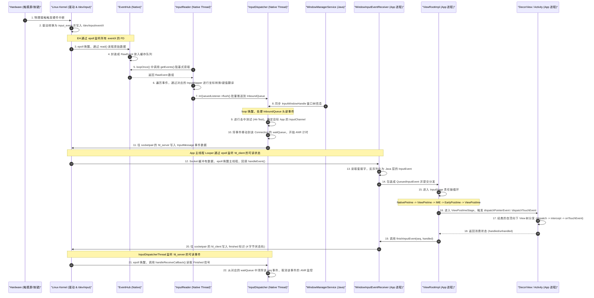

# Android 输入系统底层机制

在 Android 系统中，用户与设备的每一次交互（无论是触摸屏幕、按下物理按键，还是操作外接鼠标、键盘）都依赖于一个高度精密且极速响应的系统——**Android 输入系统（Input System）**。该系统横跨 Linux 内核空间、硬件抽象层（HAL）、运行于 SystemServer 进程中的 Native 服务，以及应用程序（App）的 Java 框架层。

本文将从底层的 Linux 内核事件读取开始，深入解密事件分发的线程分工、跨进程物理通道 `InputChannel` 的双向通信设计、App 内部的 `InputStage` 责任链分发机制、ANR（Application Not Responding）的底层判定逻辑，以及各版本的兼容性变更。

---

## 一、 Linux 内核到 EventHub 物理读取

Android 输入系统的起点位于 Linux 内核。当用户触摸屏幕或按下按键时，硬件会触发中断，内核驱动程序会将这些物理动作转化为标准的 Linux 输入事件，并写入对应的设备节点。

### 1. 物理设备节点 `/dev/input/`
在 Linux 内核中，所有的输入设备都抽象为 `/dev/input/` 目录下的设备节点（例如 `event0`、`event1`、`event2` 等）。
每一个输入设备节点都遵循标准的 Linux Input 子系统规范。当硬件产生输入事件时，驱动程序会向该节点写入符合 `input_event` 结构的数据：

```c
// Linux 内核头文件 <linux/input.h> 中定义的原始输入事件结构
struct input_event {
    struct timeval time; // 事件发生的时间戳
    __u16 type;          // 事件类型（如 EV_KEY 键盘/按键事件、EV_ABS 绝对坐标事件、EV_SYN 同步事件）
    __u16 code;          // 事件代码（如 KEY_POWER 电源键、ABS_MT_POSITION_X 触摸点 X 轴绝对坐标）
    __s32 value;         // 事件具体的值（如按键按下值为 1，抬起为 0；触摸点的坐标像素值）
};
```

### 2. inotify 与 epoll 机制
为了管理这些设备节点，Android 在 Native 层设计了 `EventHub`。`EventHub` 是输入系统与内核交互的唯一桥梁。为了高效地检测设备的热插拔和读取高频的输入事件，`EventHub` 引入了 Linux 的 **`inotify`** 与 **`epoll`** 机制：

*   **`inotify` 机制（设备热插拔监测）**：
    `EventHub` 在初始化时，会通过 `inotify_init()` 创建一个 `inotify` 实例，并将整个 `/dev/input/` 目录注册到监听列表中。当有新的输入设备（如 USB 鼠标、蓝牙键盘、手写板）接入或者被移除时，内核会在该目录下创建或删除对应的 `eventX` 节点。`inotify` 会产生可读事件，通知 `EventHub` 动态调用 `openDeviceLocked()` 开启对新设备的数据读取，或调用 `closeDeviceLocked()` 销毁对应设备的数据结构。
*   **`epoll` 机制（多路复用事件读取）**：
    由于一部 Android 手机可能同时存在多个输入源（屏幕触摸、音量键、电源键、传感器、外接设备等），如果采用传统的阻塞式 `read` 机制，系统必须为每个设备节点分配一个线程，这会带来极大的线程调度开销；若采用非阻塞轮询，又会白白消耗 CPU 资源。
    `EventHub` 巧妙地利用了 `epoll` 机制。它创建一个 `epoll` 实例，并将 `inotify` 的文件描述符（FD）以及所有已打开设备的 `eventX` 文件描述符统一注册到 `epoll` 的红黑树监听列表中。当没有任何输入事件时，`EventHub` 阻塞在 `epoll_wait`上，此时线程进入休眠状态，释放 CPU 资源；一旦任意设备节点有数据可读，内核会立即唤醒 `EventHub`，由其直接读取特定设备的数据，保证了低延迟与低功耗。

### 3. `EventHub::getEvents` 阻塞式读取
`EventHub::getEvents` 是输入系统中最核心的 Native 方法之一。它在一个无限循环中被调用，其核心执行逻辑如下：

1.  **调用 `epoll_wait`**：如果当前的事件缓冲区为空，`EventHub` 会阻塞调用 `epoll_wait`，等待内核通知。
2.  **处理设备热插拔**：若被唤醒后发现是 `inotify` 的 FD 激活，说明 `/dev/input/` 目录发生了变化。`EventHub` 会读取 `inotify` 事件，遍历目录，识别是哪个设备被插入或拔出，并相应地执行 `openDeviceLocked`（打开设备、查询设备能力如是否支持多点触控，并将其 FD 注册到 `epoll` 中）或 `closeDeviceLocked`（移出 `epoll` 监听并关闭 FD）。
3.  **读取物理原始事件**：如果是某个输入设备节点的 FD 激活，`EventHub` 会调用 `read()` 函数，批量读取底层的 `input_event` 结构体数组。
4.  **封装为 `RawEvent`**：`EventHub` 将这些底层的 `input_event` 转化为 Native 层通用的 `RawEvent` 结构体：
    ```cpp
    struct RawEvent {
        nsecs_t when;         // 事件发生的时间戳
        int32_t deviceId;     // 设备 ID（EventHub 内部为每个物理设备分配的唯一标识）
        int32_t type;         // 事件类型（映射自 input_event.type）
        int32_t code;         // 事件代码（映射自 input_event.code）
        int32_t value;        // 事件值（映射自 input_event.value）
    };
    ```
    这些 `RawEvent` 会被写入到传入的缓冲区中，供上层 `InputReader` 进行后续的转换与翻译。

---

## 二、 系统服务架构与线程分工

在 SystemServer 进程中，`InputManagerService` (IMS) 是 Java 层管理输入系统的入口。但 IMS 的核心工作全权委托给了 Native 层的 `InputManager`。`InputManager` 内部包含两个核心的 Native 线程：**`InputReaderThread`** 与 **`InputDispatcherThread`**。这两个线程通过“生产者-消费者”模式协同工作，实现了读取与分发的解耦。

### 1. InputReaderThread 与 InputReader::loopOnce
`InputReaderThread` 是一个循环执行的 Native 线程，它的唯一工作就是源源不断地从 `EventHub` 读取原始事件并进行翻译加工。其核心是 `InputReader::loopOnce()`：

```cpp
void InputReader::loopOnce() {
    ...
    // 1. 调用 EventHub::getEvents 阻塞获取原始事件，返回事件的数量
    size_t count = mEventHub->getEvents(timeoutMillis, mEventBuffer, EVENT_BUFFER_SIZE);
    
    // 2. 加锁处理事件
    {
        AutoMutex _l(mLock);
        if (count) {
            // 3. 核心处理函数：加工原始事件
            processEventsLocked(mEventBuffer, count);
        }
        ...
    }
    
    // 4. 将处理后的事件批量发布给监听者（通常是 InputDispatcher）
    mQueuedListener->flush();
}
```

#### 事件翻译：InputMapper 的设计与转换
`processEventsLocked` 并不会直接把 `RawEvent` 送去分发，因为 `RawEvent` 太过原始且与底层硬件紧密相关。`InputReader` 会为每个设备维护一个 `InputDevice` 对象，每个 `InputDevice` 会根据自身能力挂载一个或多个 **`InputMapper`**：
*   **`KeyboardInputMapper`**：负责物理按键事件。它根据系统的按键映射表（`.kl` 文件），将 Linux 原始键值（Scan Code）转换为 Android 标准的 KeyCode（如 `AKEYCODE_BACK`、`AKEYCODE_HOME`），并生成对应的 `NotifyKeyArgs`。
*   **`TouchInputMapper`**：负责触摸屏事件。多点触控屏幕传上来的事件非常零散（例如 X 坐标、Y 坐标、压力值、触摸 ID 分开上报，最后以一个 `SYN_REPORT` 同步事件结尾）。`TouchInputMapper` 负责收集这些零散的数据，进行屏幕旋转方向校准、物理坐标到像素坐标的换算，在滑动时计算轨迹，最终将这组动作融合成一个结构化的 `NotifyMotionArgs`。
*   **`CursorInputMapper`**：负责鼠标或轨迹球事件，将其转换为相对于屏幕的光标移动，并产生对应的 `NotifyMotionArgs`。

当 `InputMapper` 完成翻译后，它会调用 `QueuedInputListener`（队列式输入监听器）将包装后的 `NotifyKeyArgs` 或 `NotifyMotionArgs` 压入队列。在 `loopOnce` 的末尾，通过调用 `mQueuedListener->flush()`，这些加工好的事件被批量分发给 `InputDispatcher`。

### 2. InputDispatcherThread 与 InputDispatcher::dispatchOnce
`InputDispatcherThread` 是另一个循环执行的 Native 线程，负责接收 `InputReader` 传递过来的事件，并根据 WMS（WindowManagerService）提供的窗口状态，安全、准确地将事件分发到目标 App 窗口。其核心是 `InputDispatcher::dispatchOnce()`：

```cpp
void InputDispatcher::dispatchOnce() {
    nsecs_t nextWakeupTime = LONG_LONG_MAX;
    {
        AutoMutex _l(mLock);
        
        // 1. 唤醒并执行延迟的排队命令（如与 WMS 交互的命令）
        mDispatcherIsAliveCondition.broadcast();
        if (runCommandsLockedInterruptible()) {
            nextWakeupTime = LONG_LONG_MIN; // 如果有命令被执行，立即再次循环
        }
        
        // 2. 进入核心分发逻辑
        dispatchOnceInnerLocked(&nextWakeupTime);
    }
    
    // 3. 根据计算出的下一次唤醒时间，阻塞当前线程，释放 CPU
    mLooper->pollOnce(timeoutMillis);
}
```

在 `dispatchOnceInnerLocked` 中，主要逻辑如下：
1.  **获取待分发事件**：从输入缓冲区 `mInboundQueue` 中取出头部的事件。
2.  **ANR 状态检查**：检查当前是否有正在处理且处于挂起超时的事件。如果目标窗口已经卡死且超时，直接触发 ANR 逻辑。
3.  **计算目标窗口（联动 WMS）**：
    *   **对于按键事件（KeyEvent）**：属于焦点事件。`InputDispatcher` 会调用 `findFocusedWindowTargetsLocked()`，寻找当前处于 Active 状态且 `hasFocus` 为 true 的窗口。
    *   **对于触摸事件（MotionEvent）**：属于空间位置事件。`InputDispatcher` 会调用 `findTouchedWindowTargetsLocked()`，根据触摸点的 X/Y 轴像素坐标，结合 WMS 传递的窗口 Z 轴层级，自顶向下进行**击中测试（Hit-Testing）**。找到最顶层且满足接收条件的窗口作为分发目标。
4.  **安全分发**：确定目标窗口后，获取该窗口关联的 `InputChannel`，将事件写入物理通道发送给 App。

#### WMS 窗口状态同步与 `InputWindowHandle`
`InputDispatcher` 在分发事件时，需要清晰地知道当前屏幕上有哪些窗口、它们的坐标范围和层级关系。这些信息都在 WMS 中维护。
WMS 通过 Java 层的 `InputManagerService`，定期在底层调用 Native 的 `setInputWindows` 方法，将一个 `InputWindowHandle` 数组传递给 `InputDispatcher`。
`InputWindowHandle` 包含了每个窗口的物理边界（`frame`）、触摸区域（`touchableRegion`）、窗口属性标志（`layoutParams.flags`，如是否允许穿透触摸 `FLAG_NOT_TOUCH_MODAL`，是否允许接收触摸 `FLAG_NOT_FOCUSABLE`）、窗口的 Z-Order 顺序，以及该窗口在系统注册的 `InputChannel`。
得益于这种同步机制，`InputDispatcher` 可以在 C++ 层极其迅速地完成坐标碰撞和目标定位，避免了频繁回调 Java 层的巨大开销。

---

## 三、 跨进程物理通道 InputChannel

当 `InputDispatcher` 确定了事件要投递的目标窗口后，它需要将事件跨进程传递给对应的 App。这个承载输入事件的跨进程物理通道就是 **`InputChannel`**。

`InputChannel` 的底层核心并没有采用 Android 中随处可见的 Binder IPC 机制，而是基于 **`socketpair`** 实现的本地匿名双向套接字通道。

### 1. 匿名本地套接字 `socketpair`
当 App 向 WMS 申请创建一个新窗口（调用 `WindowManagerService::addWindow`）时，WMS 会在 Native 层通过 `InputChannel::openInputChannelPair` 创建一对相互连接的匿名本地套接字：
*   **`Server 端 InputChannel`**：留在 SystemServer 进程中，注册到 `InputDispatcher`，用于写入事件。
*   **`Client 端 InputChannel`**：通过 Binder 机制序列化传递给 App 进程，由 App 进程包装在 `ViewRootImpl` 内部，用于读取事件并回传 Finished 信号。

```
   SystemServer 进程 (InputDispatcher)          App 进程 (ViewRootImpl)
+------------------------------------+        +-------------------------+
|                                    |        |                         |
|  +------------------------------+  |        |  +-------------------+  |
|  |  Server-side InputChannel    |  |        |  | Client-side Chan. |  |
|  +--------------+---------------+  |        |  +---------+---------+  |
|                 |                  |        |            |            |
|                 v                  |        |            v            |
|       socketpair[0] (fd_server)    |        |  socketpair[1] (fd_client)
|                 |                  |        |            |            |
+-----------------|------------------+        +------------|------------+
                  |                                        |
                  +==================[ 内核缓冲区 ]=========+
                                (双向全双工管道)
```

### 2. 深度解密：为什么不使用普通的 Binder IPC？
在 Android 系统中，绝大多数跨进程通信（如四大组件启动、WMS 窗口控制、AMS 服务访问）都采用 Binder。但在输入事件传输上，设计者选择了 `socketpair`，这基于以下几个决定性的性能与架构考量：

#### (1) 高频与高吞吐量的传输极限
现代智能手机屏幕的刷新率（Refreshrate）已达 90Hz、120Hz、甚至 144Hz，与之配套的触摸采样率（Touch Sampling Rate）可达 240Hz 甚至 360Hz。
在快速滑动屏幕时，平均每 2~4 毫秒就会产生一个含有多点触摸信息的 `MotionEvent`。
*   **Binder 的瓶颈**：Binder 通信虽然支持一次拷贝（内核共享内存机制），但它的生命周期管理和内核开销依然显著。每次 Binder 事务都需要经历“请求 Binder 线程、分配传输缓冲区、执行内核映射、发送中断唤醒目标线程、释放缓冲区”等一系列精细流程。当触摸事件如此密集时，频繁的 Binder 调用会在内核产生剧烈的锁竞争，并产生大量短暂的内存碎片，极易导致帧率抖动。
*   **Binder 共享内存溢出风险**：每个 App 进程在 Binder 驱动中分配的缓冲区大小限制在 1MB 左右（且该缓冲区由进程内所有的 Binder 通信共享）。如果在短时间内产生海量的多指触摸事件，且 App 主线程发生暂时卡顿，这些事件堆积在 Binder 缓冲区中，极易引发缓冲溢出（TransactionTooLargeException），导致通信链路彻底崩溃。而套接字拥有独立、可扩容的套接字内核缓冲区（Socket Buffer），能够天然应对短时间高频高吞吐的数据洪峰。

#### (2) 线程调度与上下文切换的开销
*   **Binder 的唤醒模式**：在 Binder 通信中，当 SystemServer 进程向 App 进程发送数据时，内核会从 App 进程的 Binder 线程池（如 `Binder:1234_1`）中随机唤醒一个空闲线程来读取数据并回调。然而，App 窗口更新和 UI 绘制都必须运行在**主线程**（UI 线程）。这意味着，Binder 线程接收到输入事件后，必须通过 `Handler.sendMessage()` 将事件重新投递到主线程的消息队列（`MessageQueue`）中。
    这一过程存在两次显著的线程切换开销：`InputDispatcherThread` (SystemServer) -> App Binder 线程 -> App 主线程。这增加了事件在管道中的排队延迟。
*   **Socket 配合 Looper 的直接唤醒**：`socketpair` 允许直接将 `Client 端 InputChannel` 的套接字文件描述符（FD）注册到 App 主线程的 `Looper` (基于 epoll) 中。当 `InputDispatcher` 向 Socket 写入事件时，内核直接唤醒处于 `epoll_wait` 挂起状态的 App 主线程。主线程被唤醒后在 native 层直接读取套接字数据，就地回调 Java 层，完全绕过了 Binder 线程，将线程切换次数降低到 1 次，实现了延迟的极致优化。

#### (3) 物理对称的双向全双工通道
输入系统是一个**闭环分发系统**。为了防止 App 因卡死而不断堆积事件，`InputDispatcher` 每次分发事件后，都必须等待 App 处理完毕后回传一个“Finished 信号”。
*   **Binder 的非对称限制**：Binder 是一种典型的 C/S（Client-Server）单向请求/响应式架构。如果使用 Binder 实现双向通信，必须要么让 App 进程同时扮演 Server，要么使用回调接口。这会导致 `IMS -> App` 一次 Binder IPC，`App -> IMS` 又一次反向 Binder IPC，产生双倍的跨进程调用开销。同时，这种双向 Binder 嵌套极易引发底层互锁与线程死锁。
*   **socketpair 的全双工优势**：`socketpair` 在初始化时直接在内核空间中创建了两个对等的、全双工的套接字描述符。`InputDispatcher` 往 `socketpair[0]` 写入 `InputMessage` 事件，App 从 `socketpair[1]` 读取；App 消费完毕后，在 `socketpair[1]` 写入 4 字节的 Finished 状态标识，`InputDispatcher` 从 `socketpair[0]` 直接读取。这种物理上绝对对称的双向通信非常契合输入系统“分发 - 确认”的闭环流程，架构极度纯粹。

---

## 四、 App 内部事件接收与 InputStage 责任链分发

当输入事件跨越 `InputChannel` 到达 App 进程后，App 主线程从 `Looper` 中被唤醒，开始进入 App 内部的事件分发与消费链路。

### 1. 入口：WindowInputEventReceiver
在 Java 层，`ViewRootImpl` 内部持有一个名为 `mInputEventReceiver` 的成员变量，其具体实现类是 **`WindowInputEventReceiver`**（继承自 `InputEventReceiver`）：

```java
final class WindowInputEventReceiver extends InputEventReceiver {
    public WindowInputEventReceiver(InputChannel inputChannel, Looper looper) {
        super(inputChannel, looper);
    }

    @Override
    public void onInputEvent(InputEvent event) {
        // 1. 当内核套接字可读时，此方法在主线程中被回调
        enqueueInputEvent(event, this, 0, true);
    }
}
```

其底层调用链路如下:
1.  主线程的 Native Looper 监听到 `socketpair` 的 FD 可读，唤醒并调用 `NativeInputEventReceiver::handleEvent()`。
2.  `NativeInputEventReceiver` 调用 `consumeEvents()`，通过 `recv` 系统调用从 Socket 读取原始字节流，反序列化为 C++ 层的 `InputEvent` 对象。
3.  通过 JNI 跨语言调用 Java 层的 `WindowInputEventReceiver.dispatchInputEvent()`，最终触发 `onInputEvent()`。
4.  在 `enqueueInputEvent()` 中，事件被封装成一个 `QueuedInputEvent` 链表节点，提交给 `ViewRootImpl` 开始责任链分发。

### 2. InputStage 责任链模式设计
为了让输入事件能够按阶段被拦截、过滤、变换并最终分发给 UI 组件，`ViewRootImpl` 内部将事件处理流程设计成了典型的**责任链（Chain of Responsibility）模式**。所有的处理节点都继承自 **`InputStage`**。

在 `ViewRootImpl.setView()` 流程中，这些 Stage 被串联成一条单向链表。事件分发时，会沿着这条链表依次向下传递。

```
     [ WindowInputEventReceiver ]  (主线程唤醒读取)
                 |
                 v
     +----------------------------------+
     |      NativePreImeInputStage      |  (Native Window 预处理)
     +-----------------+----------------+
                       | forward
                       v
     +----------------------------------+
     |      ViewPreImeInputStage        |  (View 预处理，如 IME 前的 BACK 键)
     +-----------------+----------------+
                       | forward
                       v
     +----------------------------------+
     |          ImeInputStage           |  (分发给输入法进行消费)
     +-----------------+----------------+
                       | forward (若 IME 未消费)
                       v
     +----------------------------------+
     |      EarlyPostImeInputStage      |  (系统按键、快捷键拦截)
     +-----------------+----------------+
                       | forward
                       v
     +----------------------------------+
     |       ViewPostImeInputStage      |  (核心！分发到 DecorView 与整个 View 树)
     +-----------------+----------------+
                       | forward (若整个 UI 树均未消费)
                       v
     +----------------------------------+
     |        SyntheticInputStage       |  (最后的收尾：合成轨迹球/特殊手势等)
     +----------------------------------+
```

### 3. 各 InputStage 职责源码级剖析

#### (1) NativePreImeInputStage
*   **职责**：在事件提交给输入法（IME）之前，分发给 Native 层的窗口（如游戏框架中使用 NativeActivity 直接处理原始按键的场景）。
*   **实现**：如果 App 注册了 Native 端的输入接收器，此阶段会将事件交给底层的 Native 窗口，如果被消费则直接 `finish`，否则 `forward` 传递给下一阶段。

#### (2) ViewPreImeInputStage
*   **职责**：在输入法消费按键之前，允许 Java 层的 View 树提前拦截事件。
*   **实现**：调用根 View 的 `dispatchKeyEventPreIme()`：
    ```java
    // 典型场景：当输入法弹出时，用户按下物理返回键（BACK），
    // 应当是输入法先响应并隐藏，而不是当前的 Activity 直接退出。
    // 如果某个 View 想要强行在输入法响应前拦截此按键，可以重写 dispatchKeyEventPreIme
    if (mView.dispatchKeyEventPreIme(event)) {
        return finishInputEvent(q); // 被消费，结束责任链
    }
    ```

#### (3) ImeInputStage
*   **职责**：将按键事件发送给当前的输入法编辑器（IME）。
*   **实现**：通过 `InputMethodManager` (IMM) 跨进程发送给输入法进程。如果输入法消费了该按键（例如在虚拟键盘上打字时，按下物理字母键），则调用 `finish` 结束分发；如果输入法不感兴趣（例如点击了非文字输入区域，或者按下了不支持的控制键），则通过回调继续执行 `forward` 投递给后 IME 阶段。

#### (4) EarlyPostImeInputStage
*   **职责**：在输入法不消费后，但在普通 View 消费之前，进行系统级别的全局拦截。
*   **实现**：主要处理一些特殊的系统级按键（如音量加减、电源键、静音键、系统菜单键、Home 键等拦截），调用 `PhoneWindowManager` 或 `PhoneWindow` 的特定接口进行预拦截。

#### (5) ViewPostImeInputStage（核心阶段）
*   **职责**：这是所有 UI 开发者最熟悉的阶段，负责将事件正式派发给 App 窗口内的 View 树。
*   **核心逻辑**：
    ```java
    // 源码核心分流逻辑
    protected int onProcess(QueuedInputEvent q) {
        if (q.mEvent instanceof KeyEvent) {
            // 分发按键事件
            return processKeyEvent(q);
        } else {
            final int source = q.mEvent.getSource();
            if ((source & InputDevice.SOURCE_CLASS_POINTER) != 0) {
                // 分发指针事件（触摸、鼠标悬浮、手写笔）
                return processPointerEvent(q);
            }
            ...
        }
    }
    ```
    1.  **对于 MotionEvent**：调用 `mView.dispatchPointerEvent(event)`。由于 `mView` 实际是指向系统的 **`DecorView`**，`DecorView` 会将该调用转交给关联的 **`Window.Callback`（即当前 Activity）**：
        ```java
        // Activity.java 源码片段
        public boolean dispatchTouchEvent(MotionEvent ev) {
            if (ev.getAction() == MotionEvent.ACTION_DOWN) {
                onUserInteraction(); // 触发用户交互回调
            }
            // 重点：分发给 Window
            if (getWindow().superDispatchTouchEvent(ev)) {
                return true; // 只要有任何 View 消费了，返回 true
            }
            // 兜底逻辑：如果整个 View 树都没有消费此事件，由 Activity 自己的 onTouchEvent 处理
            return onTouchEvent(ev);
        }
        ```
    2.  **调用链回退到 DecorView**：`getWindow().superDispatchTouchEvent(ev)` 实际调用的是唯一实现类 `PhoneWindow` 的对应方法，而 `PhoneWindow` 仅仅是直接调用了 `DecorView.superDispatchTouchEvent(ev)`。
    3.  **经典的 View 树分发**：`DecorView` 内部会调用 `super.dispatchTouchEvent(ev)`，这便进入了标准的 **`ViewGroup.dispatchTouchEvent()`**。
        *   首先判断是否需要被拦截（调用 `onInterceptTouchEvent()`）。
        *   如果未被拦截，遍历处于触摸区域内的子 View，根据 Z 轴层级，调用子 View 的 `dispatchTouchEvent()` 进行递归分发。
        *   如果在递归过程中有子 View 消费（返回了 true），分发链返回并打断，整个过程返回 true。
        *   若子 View 均未消费，则回溯调用 `ViewGroup` 自身的 `onTouchEvent()`。

#### (6) SyntheticInputStage
*   **职责**：兜底处理阶段。对于前面所有阶段都未能消费的输入事件，进行兼容性合成或系统默认行为。
*   **实现**：例如将轨迹球的微小物理滚动合成为方向键事件（DPAD），或者将非标手势转换为辅助功能的系统级操作。如果此阶段运行完毕事件依然没有被消费，系统将直接抛弃该事件，并向 `InputDispatcher` 回传 Finished 信号。

---

## 五、 跨进程分发时序图

为了系统、直观地展现从硬件发生中断，到 App 消费事件并回传 Finished 信号的全过程，以下绘制了完整的跨进程时序图：



---

## 六、 Input ANR 监测与判定逻辑

如果应用程序主线程因为耗时操作（如在 `onTouch` 中执行复杂算法、IO 读写，或者主线程被其他大任务长期霸占），导致输入事件在规定的时间内无法消费完毕，输入系统就会触发 **ANR（Application Not Responding）** 机制。

### 1. InputDispatcher 的队列模型
`InputDispatcher` 为每个与 App 建立连接的 `Connection` 维护了两个关键的先进先出（FIFO）队列：
*   **`outboundQueue`**：待发送队列。包含准备分发给该 App 窗口，但还没有写入到 `socketpair` 的事件。
*   **`waitQueue`**：等候接收队列。包含**已经写入**到 `socketpair` 物理通道发送给 App，但 `InputDispatcher` **尚未收到 App 回传 Finished 信号**的事件。

### 2. 深入 ANR 触发判定核心逻辑
对于输入系统引发的 ANR，通常在日志中表现为 `Reason: Input dispatching timed out...`。很多人误以为只要一个事件被发往 App，系统就会开启一个定时器，在 5 秒（系统默认的输入超时阈值）后准时弹出 ANR 弹窗。**这是一种错误的直觉理解。**

真实的底层判定机制基于以下精细的惰性检查机制：

#### (1) 按键事件（KeyEvent）判定
按键事件往往带有明确的控制属性（如返回、主页等）。
当 `InputDispatcher` 试图向一个没有焦点或当前焦点窗口处理缓慢的进程分发 KeyEvent 时：
系统会在分发事件时直接设置一个硬性的 5 秒超时定时器。如果在 5 秒内，`waitQueue` 中的该按键事件依然没有收到 Finished 信号，系统将**立刻触发** ANR 判定，不依赖后续事件。

#### (2) 触摸事件（MotionEvent）判定
触摸事件非常密集。如果用户快速滑动一下产生 50 个事件，App 主线程卡顿了 5.1 秒，如果按照“每个事件发出去后 5 秒无条件弹 ANR”，则在滑动完后会产生 50 次 ANR 报警判定，这显然是不合理的。
因此，`InputDispatcher` 针对 MotionEvent 采用了**“只有当存在新事件等待处理时，才进行超时判定”**的惰性检查逻辑：

1.  **首个事件分发**：当用户产生第一个触摸动作，事件 A 被写入 Socket，并移动到当前 Connection 的 `waitQueue` 中，记录其分发时间戳为 $T_{send}$。此时**并不会**无条件启动一个 5 秒后必响的定时器。
2.  **没有后续新事件**：如果用户触摸完后收手，没有再触摸屏幕，即使 App 进程卡死了 10 秒钟，系统也**不会**弹出 ANR。因为此时没有任何新事件在队列中积压，用户的卡顿体验并未因“无法处理后续操作”而进一步恶化，不触发弹窗有利于保护用户体验的连贯性。
3.  **新事件进入与超时检查**：
    当用户由于卡顿感到疑惑，进行了第二次触摸，产生了新事件 B。新事件 B 进入 `InputDispatcher` 的 `mInboundQueue` 中，试图分发给当前的窗口。
    在 `dispatchOnceInnerLocked` 分发事件 B 时，`InputDispatcher` 发现目标窗口对应的 `waitQueue` **不为空**（里面还塞着很久之前发出去的事件 A）。
    此时，系统开始执行严格的超时判断：
    $$\text{当前时间 } T_{current} - T_{send} \ge 5\text{ 秒}$$
    如果该条件成立，说明前一个事件 A 已经发出超过 5 秒且没有被 Finished 确认，而此时又有新事件 B 处于饥饿等待状态。`InputDispatcher` 立即判定该窗口发生了 **Input ANR**，并向 WMS 和 AMS 发起 ANR 报错通知。

#### (3) Finished 信号的回退与 waitQueue 清理
如果 App 主线程运行流畅，完成 `InputStage` 责任链分发后：
1.  App 调用 `finishInputEvent(seq, true)`。
2.  通过 `socketpair` 将含有 `seq` 的 4 字节 Finished 信号写入管道。
3.  `InputDispatcher` 被 epoll 唤醒，调用 `handleReceiveCallback()` 读出 Finished 信号。
4.  根据事件唯一序号 `seq`，从 Connection 的 `waitQueue` 中找到对应的事件，将其移出队列并销毁。
5.  由于 `waitQueue` 随时被清空，当下一次新事件到来时，`waitQueue` 为空，直接顺利分发，不会触发任何超时判定逻辑。

---

## 七、 版本兼容性与变更

随着 Android 系统的演进，输入系统在安全性、多任务协作和低延迟绘制方面进行了持续升级。以下梳理了近年来 Android 版本的重大底层变更：

### 1. Android 12 (API 31) 不受信任触控阻断 (Untrusted Touch Blocking)
*   **设计背景**：在早期 Android 版本中，恶意 App 可以创建一个透明的浮窗（Toast 窗口或 Overlay 悬浮窗）覆盖在正常 App 的上方。当用户尝试点击正常 App 的某个敏感按钮时（如“支付”或“授权”），点击事件会穿过透明悬浮窗，触发底层 App 的点击动作。这被称为**点击劫持攻击（Tapjacking）**。
*   **底层变更**：Android 12 在 `InputDispatcher` 分发 MotionEvent 时引入了严格的过滤。如果检测到触摸点穿过了一个属于不同进程的非信任半透明/透明窗口（且该窗口的 Alpha 不为 0），`InputDispatcher` 将会直接丢弃该触摸事件，或者将其转换为无安全隐患的事件，并在 Logcat 中输出警告。
*   **兼容性适配**：开发者若需在自身应用内合理使用悬浮窗进行穿透式触摸，必须在窗口属性中明确配置不受限制的受信任标志，或合理规避多进程遮挡。详细变更日志可参见 [AndroidVersionChangeLog.md](../../../../../AndroidVersionChangeLog.md)。

### 2. Android 13 (API 33) 预测回退与多窗口分流优化
*   **多窗口输入预测**：在平板、折叠屏等大屏设备普及的背景下，Android 13 对手势在多窗口间穿梭的分发逻辑进行了彻底重构。优化了多指在不同窗口分发时的冲突判定。
*   **输入通道安全校验**：进一步收紧了 Native 层 `InputChannel` 的 FD 管理权限，防止非系统进程恶意监听、挟持系统输入管道。

### 3. Android 14 (API 34) 智能预测输入 (Predictive Touch) 与硬件级采样增强
*   **预测触控机制（Predictive Touch）**：在滑动手势交互中，Android 14 引入了更为激进的“预测触控”算法。系统可以通过历史滑动轨迹，在 UI 渲染线程中提前预测并计算出下一个 1~2 帧的触摸位置，并直接提供给 View 树进行预渲染。这使得在大屏或高刷新率设备上的手势响应显得更加丝滑。
*   **手势拦截层重构**：重构了 `InputFilter` 与系统辅助功能（Accessibility）的拦截链路，减少了辅助功能开启时输入事件传递的二次延迟。

---

## 八、 总结

Android 输入系统是一套兼顾高性能与极致延迟的工程杰作。它通过：
1.  **Linux 内核 epoll/inotify 机制**：实现了对物理输入源的多路复用和零功耗待机。
2.  **双线程异步架构**：利用 `InputReader` 与 `InputDispatcher` 解耦了事件读取与分发。
3.  **匿名双向套接字 `socketpair`**：替代传统的 Binder IPC，极大降低了高频采样下的线程切换与数据调度延迟。
4.  **Java 层 `InputStage` 责任链**：提供了模块化、层次清晰的事件拦截与分发框架。
5.  **基于 waitQueue 的惰性 ANR 判定**：既保证了系统响应的可靠性，又避免了频繁打扰用户。

深入理解这一套底层的流转逻辑，不仅能帮助我们在遇到复杂的事件冲突 and ANR 时快速定位排障，更能指导我们在自定义 View 开发及多进程交互设计中，写出更高性能、更流畅的代码。
