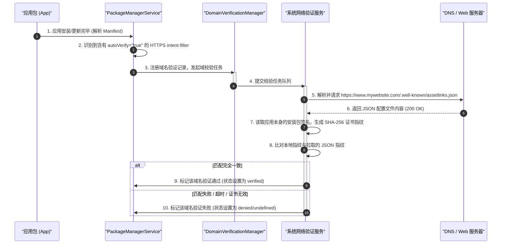
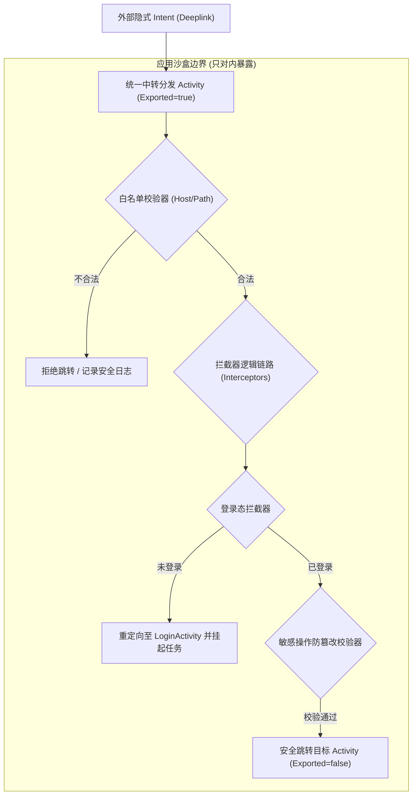

# Android Deeplink 详细机制与底层原理

在现代移动互联网生态中，Deeplink（深度链接）是打破 App “信息孤岛”、实现跨容器流量直达、提升用户留存与商业转化的核心技术。通过 Deeplink，用户可以从外部的 H5 页面、短信、社交平台、或者其他应用中，直接唤起并跳转到目标 App 的特定深度页面（如商品详情页、活动页、个人主页等），而非仅仅打开 App 的首页。

本文将从 Android 系统底层分发逻辑出发，系统地剖析 **Custom Scheme**、**App Links** 和 **Deferred Deeplink** 三大协议体系的演进脉络，并针对实际生产环境中的**安全性防护**与**降级兜底机制**进行深度解析。

---

## 1. Android 路由直达的底层原理 (什么是 Deeplink)

Deeplink 的本质是 Android 进程间通信（IPC）机制与组件分发系统的一种外化表现。在 Android 系统中，外部流量拉起特定 Activity 的底层逻辑依赖于 **`Intent` 路由解析机制**。

当用户在外部环境（如浏览器中点击链接、短信中点击 URL、或者在其他 App 中触发跳转）发起唤起请求时，系统会构建一个隐式 `Intent`，其核心属性包括：
*   **Action**：通常为 `Intent.ACTION_VIEW`，表示展示数据的动作。
*   **Category**：通常包含 `Intent.CATEGORY_DEFAULT`（默认可响应隐式 Intent）和 `Intent.CATEGORY_BROWSABLE`（允许从浏览器等 Web 容器中安全唤起）。
*   **Data**：以 `Uri`（统一资源标识符）形式承载的链接地址，包含协议头部、域名/主机名、路径以及携带的查询参数。

### 1.1 系统层面的 Activity 解析与匹配流

当一个隐式 `Intent` 被投递给 Android 系统时，核心的分发与解析工作由系统服务 **`PackageManagerService` (PMS)** 与 **`ActivityManagerService` (AMS)** 协同完成：

1.  **Intent 发起与捕获**：外部应用或 Web 容器通过调用 `Context.startActivity(intent)` 将 Intent 发送至系统的 AMS。
2.  **PMS 组件检索 (QueryIntentActivities)**：AMS 接收到隐式 Intent 后，无法直接确定目标 Activity。它会通过 Binder 跨进程调用 PMS 的 `queryIntentActivities` 方法。PMS 会在内存中维护的已安装应用组件树（从各应用的 `AndroidManifest.xml` 中解析而来）中，过滤并检索出所有声明了匹配该 Intent 规则的 `<intent-filter>` 的 Activity。
3.  **过滤器匹配规则**：PMS 在匹配 `<intent-filter>` 时，会严格执行以下三层过滤：
    *   **Action 匹配**：Intent 携带的 Action 必须存在于 `<intent-filter>` 的动作列表里。
    *   **Category 匹配**：Intent 中携带的所有 Category 必须在 `<intent-filter>` 中完全被覆盖（隐式启动默认要求包含 `CATEGORY_DEFAULT`，从 Web 唤起必须包含 `CATEGORY_BROWSABLE`）。
    *   **Data 匹配**：这是 Deeplink 的核心。PMS 将对 `Uri` 进行逐项拆解（`scheme`、`host`、`port`、`path`/`pathPrefix`/`pathPattern`），只有在 `<intent-filter>` 的 `<data>` 标签中配置的规则与传入的 Uri 完全契合，或者被通配符覆盖，才算匹配成功。
4.  **路由决策与启动**：
    *   **唯一匹配**：如果 PMS 检索到系统中仅有一个应用的一个 Activity 满足匹配规则，系统将越过中间决策，直接由 AMS 调度 `ActivityTaskSupervisor` 启动该 Activity，实现“无缝直达”。
    *   **多重匹配 (冲突)**：如果有多个应用都注册了相同的匹配规则，系统将无法替用户做决策，此时会拉起系统级弹窗组件 **`ResolverActivity`**（即应用选择器弹窗，App Chooser），向用户展示所有可选应用，并提供“仅此一次”或“始终”的选项。

---

## 2. 三大主要协议技术体系与演进 (为什么/怎么做)

随着 Android 系统版本的更电子移动生态竞争的加剧，Deeplink 经历了从自由无序到安全规范的演进过程。以下是三大主要技术体系的详细剖析。

```mermaid
graph TD
    A["外部触发源 (H5/短信/其他App)"] --> B{"匹配协议类型"}
    B -->|"Custom Scheme"| C["Custom Scheme 机制"]
    B -->|"App Links (Android 6.0+)"| D["App Links 机制"]
    B -->|"Deferred Deeplink"| E["Deferred Deeplink 机制"]

    C --> C1{"系统内是否有应用响应?"}
    C1 -->|无| C2["降级兜底: 唤醒失败流 (跳转下载页/H5)"]
    C1 -->|有唯一应用| C3["直接拉起 Activity"]
    C1 -->|有多个应用冲突| C4["拉起 ResolverActivity (App 选择器弹窗)"]

    D --> D1{"已安装且域验证(autoVerify)成功?"}
    D1 -->|是 (Android 6.0+)"| D2["直接唤起应用 (免弹窗直达)"]
    D1 -->|否 (Android 12+ 破坏性变更)| D3["直接跳转系统默认浏览器打开 Web 页面"]
    D1 -->|否 (Android 12 以下)"| C4

    E --> E1{"本地是否已安装 App?"}
    E1 -->|是| C1
    E1 -->|否| E2["跳转应用商店/H5下载页"]
    E2 --> E3["安装后首次打开 (还原参数)"]
    E3 --> E4{"设备指纹模糊匹配 / 剪贴板精准匹配?"}
    E4 -->|成功| E5["直达深度内容页"]
    E4 -->|失败| E6["降级启动 App 首页"]
```

### 2.1 Custom Scheme (自定义 URL Scheme)

Custom Scheme 是 Android 最早支持的深度链接形式。它允许开发者自定义非标准的 URI 协议头（例如 `myapp://`），用于标识自己的应用。

#### 2.1.1 客户端配置与实现
在 `AndroidManifest.xml` 中，针对需要被唤起的 Activity，声明如下的 `<intent-filter>`：

```xml
<activity
    android:name=".ui.activity.DeeplinkDispatcherActivity"
    android:exported="true">
    
    <!-- 隐式启动与浏览器唤起必须声明这两个 category -->
    <intent-filter>
        <action android:name="android.intent.action.VIEW" />
        <category android:name="android.intent.category.DEFAULT" />
        <category android:name="android.intent.category.BROWSABLE" />
        
        <!-- 自定义 Scheme 规则 -->
        <data
            android:scheme="myapp"
            android:host="goods"
            android:pathPrefix="/detail" />
    </intent-filter>
</activity>
```

在 Activity 启动后，通过解析传入的 `Intent` 获取具体的 URI 数据并进行业务路由分发：

```kotlin
class DeeplinkDispatcherActivity : AppCompatActivity() {
    override fun onCreate(savedInstanceState: Bundle?) {
        super.onCreate(savedInstanceState)
        
        val intentUri: Uri? = intent.data
        if (intentUri != null) {
            handleDeeplink(intentUri)
        }
        finish()
    }

    private fun handleDeeplink(uri: Uri) {
        // 解析 myapp://goods/detail?id=10086
        val scheme = uri.scheme // "myapp"
        val host = uri.host     // "goods"
        val path = uri.path     // "/detail"
        val goodsId = uri.getQueryParameter("id") // "10086"
        
        if ("myapp" == scheme && "goods" == host && "/detail" == path) {
            // 执行内部页面跳转逻辑
            val targetIntent = Intent(this, GoodsDetailActivity::class.java).apply {
                putExtra("EXTRA_GOODS_ID", goodsId)
            }
            startActivity(targetIntent)
        }
    }
}
```

#### 2.1.2 局限性与痛点分析
尽管 Custom Scheme 实现简单，但在移动互联网的发展中，它暴露出了两个致命的缺陷：

1.  **超级应用生态的 Scheme 屏蔽**：
    微信、微博、字节跳动系等超级应用拥有庞大的应用内流量池。为了规避恶意 Scheme 欺诈、防止用户无感流失到外部 App 形成流量黑洞，以及保证自身商业闭环，这些超级应用在其内置 WebView 中重写了 `WebViewClient` 的 `shouldOverrideUrlLoading(view, request)` 方法。一旦检测到非白名单 Scheme（如自定义的 `myapp://`），直接返回 `true` 进行拦截屏蔽。这导致外部 Scheme 在微信等应用内完全失效，开发者被迫使用“提示用户点击右上角，在系统浏览器中打开”等极高折损率的降级操作。
2.  **无命名空间约束的多 App 冲突弹窗**：
    自定义 Scheme 没有任何全球性的注册中心或命名空间约束。如果 App A 声明了 `mall://` 协议，App B 也可以声明 `mall://`。当用户手机中同时安装了这两个 App，并点击了一个以 `mall://` 开头的链接时，Android 系统无法裁决由谁响应，必然会拉起 `ResolverActivity` 弹窗。多出的这一步交互，使用户的直达链路被打断，不仅严重影响用户体验，还给冒名顶替、钓鱼欺诈提供了便利。

---

### 2.2 App Links (Android 6.0+)

为了克服 Custom Scheme 冲突和安全性缺陷，Android 6.0 (API 23) 引入了 **Android App Links**。App Links 强制使用标准的 `http` 或 `https` 协议，并通过**反向安全验证机制（Digital Asset Links）**，在应用与网站域名之间建立强信任关系。

#### 2.2.1 客户端配置
在客户端，除了将 `scheme` 设置为 `http` 或 `https`，还必须在 `<intent-filter>` 中显式声明 `android:autoVerify="true"`。

```xml
<activity
    android:name=".ui.activity.AppLinksHandlerActivity"
    android:exported="true">
    
    <!-- 开启自动验证 -->
    <intent-filter android:autoVerify="true">
        <action android:name="android.intent.action.VIEW" />
        <category android:name="android.intent.category.DEFAULT" />
        <category android:name="android.intent.category.BROWSABLE" />
        
        <!-- 使用标准 HTTP/HTTPS 协议 -->
        <data android:scheme="http" />
        <data android:scheme="https" />
        <data android:host="www.mywebsite.com" />
        <data android:pathPrefix="/goods" />
    </intent-filter>
</activity>
```

#### 2.2.2 服务端配置 (`assetlinks.json`)
为了向 Android 系统证明你确实拥有该域名，你必须在网站服务器上部署一个资产配置文件。该文件必须通过 HTTPS 协议对外公开，路径必须为：
`https://www.mywebsite.com/.well-known/assetlinks.json`

此文件的 JSON 格式规范如下：

```json
[
  {
    "relation": ["delegate_permission/common.handle_all_urls"],
    "target": {
      "namespace": "android_app",
      "package_name": "com.example.myapp",
      "sha256_cert_fingerprints": [
        "14:6D:E9:83:C5:73:06:50:D8:39:3A:44:5A:B9:8A:EF:6C:34:E3:73:21:E1:92:43:2D:E1:EE:A0:87:C5:1B:32"
      ]
    }
  }
]
```
> [!IMPORTANT]
> 服务端部署的 `assetlinks.json` 必须满足以下条件，否则系统校验将直接宣告失败：
> 1. 必须使用 HTTPS 协议，且 SSL 证书必须是系统受信任的 CA 签发，自签名证书无效。
> 2. Content-Type 必须为 `application/json`。
> 3. HTTP 响应状态码必须为 `200 OK`，不能有任何重定向（例如 301 或 302 跳转到其他域名）。
> 4. `sha256_cert_fingerprints` 必须是应用发布版签名证书的真实 SHA-256 指纹（通过开发 debug 签名打包的 App 无法通过正式域名的校验）。

#### 2.2.3 系统底层校验机制剖析
当应用在设备上完成安装或更新时，系统会触发后台异步网络校验流。以下是 `IntentFilterIntentOp` / `DomainVerificationManager` 机制的底层执行路径：



1.  **解析阶段**：在安装过程中，PMS 解析 `AndroidManifest.xml`，一旦发现某个 Activity 包含带有 `autoVerify="true"` 的 `<intent-filter>`，PMS 会将该应用包含的所有 HTTPS 域名记录下来。
2.  **异步网络任务投递**：在 Android 12（API 31）及以上版本中，域验证交由 `DomainVerificationManager` 统一管理。系统会通过内置的域验证服务，向注册的域名地址异步发送标准的 HTTPS GET 请求，尝试获取 `/.well-known/assetlinks.json`。
3.  **签名碰撞**：获取到 JSON 文件后，系统网络校验服务会提取出文件中的 `sha256_cert_fingerprints` 列表，与本地安装的该应用包（`.apk`）的实际签名证书 SHA-256 指纹进行碰撞比对。
4.  **状态持久化**：
    *   **Verified**：比对完全一致，系统会在底层的域名映射数据库中将该应用对该域名的控制权标记为“已验证（verified）”。此后，系统接收到指向该域名的隐式跳转 Intent时，不再弹出 ResolverActivity，直接启动该 App。
    *   **Failed/Denied**：如果网络请求超时、返回非 200 状态码、或者是签名指纹不匹配，该域名验证置为失败。

你可以通过 ADB 命令来强制执行或查询当前设备上的 App Links 验证状态：
```bash
# 查询指定包名的域验证状态
adb shell pm get-app-links com.example.myapp

# 输出示例：
#   com.example.myapp:
#     ID: c1234567-89ab-cdef-0123-456789abcdef
#     Signatures: [14:6D:E9:...:1B:32]
#     Domains:
#       www.mywebsite.com: verified   <-- 表示验证通过
#       api.mywebsite.com: undefined  <-- 表示未验证或验证失败
```

#### 2.2.4 Android 12+ (API 31) 破坏性变更与适配
根据 [AndroidVersionChangeLog.md](../../../../../AndroidVersionChangeLog.md) 记录，Android 12 对未验证域名的 Intent 路由分发做出了重大调整：

*   **旧版本行为（Android 11 及以下）**：如果 App Links 验证失败，系统会将该域名退化为普通 HTTP/HTTPS 隐式路由。这意味着当用户点击链接时，系统仍然会弹出一个应用选择器，询问用户是用浏览器打开还是用你的 App 打开。
*   **新版本行为（Android 12+）**：系统在拦截到 HTTP/HTTPS 链接时，如果发现没有任何应用的验证状态为 `verified`，则**直接在用户的默认浏览器中打开**该链接。系统完全取消了未验证链接的 App 选择弹窗，用户将无法在点击链接时看到你的 App 选项。
*   **适配方案**：
    1.  **完整校验每一个二级域名**：开发者必须确保 `<data>` 标签中配置的每一个域名（包括二级域名，如 `api.mywebsite.com`、`m.mywebsite.com` 等）其服务端的 `.well-known/assetlinks.json` 都是完全畅通且校验一致的。任何一个子域校验失败，可能会导致整个应用的自动验证被降级。
    2.  **引导用户手动关联**：如果验证因为不可控的网络原因失败，开发者必须在应用内引导用户跳转到系统设置页，手动勾选“默认打开的链接”。
        ```kotlin
        if (Build.VERSION.SDK_INT >= Build.VERSION_CODES.S) {
            val intent = Intent(Settings.ACTION_APP_OPEN_BY_DEFAULT_SETTINGS, 
                Uri.parse("package:${packageName}"))
            startActivity(intent)
        }
        ```

---

### 2.3 Deferred Deeplink (延迟深度链接)

传统的 Deeplink 和 App Links 都建立在**“App 已经安装在用户设备上”**的假设之上。如果用户未安装 App，点击链接后只会被引导去应用商店或下载 H5，但在安装完毕首次启动时，原先的上下文路径丢失了，用户必须重新从 App 首页去寻找刚才看中的内容。

延迟深度链接（Deferred Deeplink）致力于打破这一阻碍，其技术目标是：**未安装 App -> 点击链接 -> 引导下载安装 -> 首次打开 App -> 自动还原之前点击的深度内容页面**。由于安装过程跨越了应用商店的黑盒环境，传统的 Intent 传参手段失效，行业中主流采用以下两种技术方案来完成“链路还原”。

```mermaid
graph TD
    subgraph "方案 A: 云端设备指纹模糊匹配"
    A1["用户在 H5 点击跳转"] --> A2["收集设备特征: IP/UA/分辨率/时区等"]
    A2 --> A3["发送特征与 Target URL 到云端服务器"]
    A3 --> A4["重定向到应用商店下载"]
    A4 --> A5["用户安装并首次打开 App"]
    A5 --> A6["App 采集设备特征发送到云端"]
    A6 --> A7["云端进行指纹碰撞与时间窗口比对"]
    A7 -->|成功| A8["返回 Target URL 并还原跳转"]
    end

    subgraph "方案 B: 系统剪贴板参数携带匹配"
    B1["用户在 H5 点击下载"] --> B2["H5 静默将跳转参数写入系统剪贴板"]
    B2 --> B3["跳转到应用商店下载"]
    B3 --> B4["用户安装并首次打开 App"]
    B4 --> B5["App 获得焦点 (onWindowFocusChanged)"]
    B5 --> B6["App 读取系统剪贴板"]
    B6 -->|包含约定格式数据| B7["提取参数并清空剪贴板, 实现还原跳转"]
    end
```



#### 2.3.1 方案一：云端设备指纹模糊匹配（Fingerprint Matching）
该方案完全不依赖本地底层特殊权限，主要由第三方移动归因分析服务（如 Adjust, AppsFlyer, Branch）或自建归因系统来实现。

*   **第一阶段（信息上报）**：当用户在 H5 浏览器中点击推广链接时，H5 页面上的 JS 脚本立即采集当前浏览器的特征数据，包括但不限于：**外网出口 IP 地址、浏览器 User Agent、操作系统版本、屏幕分辨率与 DPI、语言设置、时区**等。H5 将这些特征与期望跳转的 `Target_URL` 一并发送给云端服务器，云端服务器将这组指纹存入 Redis，并设置一个较短的生存周期（如 1 小时）。随后，H5 将用户重定向到 Google Play 或 APK 下载页。
*   **第二阶段（碰撞比对）**：用户下载、安装并首次打开 App。在 App 初始化的 Application 或 MainActivity 中，SDK 会采集相同的本地设备特征（IP、OS版本、UA、分辨率等），并将这组指纹发送到归因服务器。
*   **第三阶段（还原直达）**：服务器在内存中根据设备指纹库进行碰撞。如果发现刚刚有一个相同/高度相似指纹的设备在 1 小时内点击了某个跳转链接，则判断为同一设备，将对应的 `Target_URL` 返回给 App。App 收到响应后解析参数并跳转直达。
*   **致命缺陷**：
    *   **准确率受限**：由于是模糊匹配，当用户处于复杂的网络环境（例如点击链接时用的是蜂窝数据，下载完成打开时连接了公用 Wi-Fi，导致 IP 地址改变），或者面对相同型号、系统版本的同城设备群时，匹配错误率会大幅增加。业界平均匹配成功率通常在 85% - 95% 之间。

#### 2.3.2 方案二：系统剪贴板参数携带匹配（Clipboard Carrying）
由于模糊匹配的准确率上限难以突破，目前很多国内互联网大厂采用基于系统剪贴板的强绑定方案。

*   **第一阶段（参数写入）**：在 H5 下载引导页，当用户点击“下载 App”或者“一键唤起”按钮时，H5 通过浏览器的剪贴板接口，将高度压缩的加密路由跳转参数写入到设备的系统剪贴板中。
    ```javascript
    // H5 写入剪贴板示例
    function writeToClipboard(deeplinkData) {
        const text = "##DEEPLINK_PARAM##" + btoa(JSON.stringify(deeplinkData));
        navigator.clipboard.writeText(text).then(function() {
            console.log('写入成功');
        }, function(err) {
            console.error('写入失败', err);
        });
    }
    ```
*   **第二阶段（启动读取）**：应用安装完成，首次启动时，App 主动去读取系统剪贴板的内容。如果发现剪贴板内容以特定的私有标识（如 `##DEEPLINK_PARAM##`）开头，则提取出 Base64 密文并进行解密还原。
*   **第三阶段（清空防打扰）**：在成功提取并解析参数后，**必须立刻清空剪贴板**，避免之后每次打开 App 都会重复触发该跳转逻辑。
*   **Android 系统级隐私限制与适配**：
    在 Android 10+ 版本中，系统为了保护用户隐私，对剪贴板的访问实施了极强的管控：
    *   **非焦点状态限制**：只有当应用处于前台，并且**获得当前窗口的输入焦点（Focus）**时，才能读取剪贴板。在 `onCreate`、`onStart` 或 `onResume` 中直接同步调用读取方法可能会失败（因为此时 Window 尚未完全获得焦点，系统会抛出 `SecurityException` 或返回空）。
    *   **Android 12+ 剪贴板读取提示**：自 Android 12 起，如果应用读取剪贴板，系统会在底部弹出一个持久一秒的 Toast 提示（“XX已复制你剪贴板的内容”），直接告知用户隐私已被读取。
    *   **适配代码实践**：
        ```kotlin
        class MainActivity : AppCompatActivity() {
            override fun onWindowFocusChanged(hasFocus: Boolean) {
                super.onWindowFocusChanged(hasFocus)
                if (hasFocus) {
                    // 确保在 Activity 获得焦点后再读取剪贴板
                    checkDeferredDeeplinkFromClipboard()
                }
            }

            private fun checkDeferredDeeplinkFromClipboard() {
                val sp = getSharedPreferences("app_init_config", Context.MODE_PRIVATE)
                val isFirstOpen = sp.getBoolean("key_first_open", true)
                
                // 仅在首次打开时检测延迟深度链接，防止干扰日常体验
                if (!isFirstOpen) return

                val clipboard = getSystemService(Context.CLIPBOARD_SERVICE) as ClipboardManager
                if (clipboard.hasPrimaryClip()) {
                    val clipData = clipboard.primaryClip
                    if (clipData != null && clipData.itemCount > 0) {
                        val text = clipData.getItemAt(0).text?.toString() ?: ""
                        if (text.startsWith("##DEEPLINK_PARAM##")) {
                            val paramBase64 = text.substring("##DEEPLINK_PARAM##".length)
                            // 执行解密与路由解析
                            val targetUrl = decryptAndParse(paramBase64)
                            navigateToTarget(targetUrl)
                            
                            // 立即清除剪贴板，防止重复唤起
                            if (Build.VERSION.SDK_INT >= Build.VERSION_CODES.P) {
                                clipboard.clearPrimaryClip()
                            } else {
                                clipboard.setPrimaryClip(ClipData.newPlainText("", ""))
                            }
                            
                            // 标记首次打开已处理
                            sp.edit().putBoolean("key_first_open", false).apply()
                        }
                    }
                }
            }
        }
        ```

---

## 3. 安全性防护与兜底机制 (怎么做)

Deeplink 极大地缩短了页面转换链路，但这同时也意味着攻击者可以通过伪造隐式 Intent 绕过正常的安全隔离机制，直达应用的敏感内部逻辑。

### 3.1 Intent 注入与越权攻击防护

处理 Deeplink 的目标 Activity 必须在清单中将 `android:exported` 设置为 `true`。这意味着不仅系统浏览器可以调用它，任何安装在同一台设备上的恶意第三方 App 也可以构建一个相同的 URI，直接拉起你的 Activity。

#### 3.1.1 典型漏洞场景与原理
1.  **敏感操作越权绕过**：
    很多 App 在打开特定 Activity 时会默认“当前页面只能通过应用内部逻辑（如点击个人中心）跳转而来”，并且假设用户必定处于已登录状态。如果在处理外部 Scheme 跳转时，未对当前登录态（Session Token）进行校验，攻击者通过传入 `myapp://wallet/withdraw?amount=5000`，就可能直接越过鉴权界面，进入提现界面。
2.  **Intent 重定向漏洞（Intent Redirect）**：
    这是一种高危漏洞。某些 Dispatcher Activity 允许通过外部传入一个嵌套的 Intent 作为参数，然后调用 `startActivity(intentFromUrl)` 进行跳转。恶意 App 可以利用这个被导出的 Activity 作为中转站，将一个指向私有 Activity（如未导出的 `AdminSettingsActivity`，其 `exported` 显式设置为 `false`）的隐式 Intent 包裹在 Deeplink 参数中投递过去。你的应用接收后在内部把这个嵌套的 Intent 解析出来并启动，导致私有页面越权暴露给外部。

#### 3.1.2 业界标准的安全防御架构
为了杜绝安全漏洞，推荐使用**“单一入口调度 + 拦截器拦截”**的防御架构设计。



1.  **收敛入口**：
    在整个 App 中，**仅允许一个 Activity 声明为 exported=true** 用于接收外部 Deeplink（例如 `SchemeFilterActivity`）。其余所有的业务 Activity 必须显式声明 `android:exported="false"`，严禁直接对外部暴露。
2.  **强校验白名单**：
    对外部传入的 `Uri` 进行域名与路径校验。在解析具体参数时，严禁使用反射动态创建类实例或根据外部类名跳转。
3.  **跳转拦截器（Interceptors）**：
    在中转 Activity 中定义校验管道，如登录态拦截器、参数合法性校验器等：

```kotlin
class SchemeFilterActivity : AppCompatActivity() {
    override fun onCreate(savedInstanceState: Bundle?) {
        super.onCreate(savedInstanceState)
        val uri = intent.data
        if (uri != null) {
            // 1. 白名单与合法性强校验
            if (isSafeUri(uri)) {
                // 2. 路由分发
                RouteManager.route(this, uri)
            } else {
                Log.e("Security", "检测到非法非安全域名唤起: $uri")
            }
        }
        finish()
    }

    private fun isSafeUri(uri: Uri): Boolean {
        val host = uri.host ?: return false
        // 仅允许可信域名
        val trustedDomains = listOf("www.mywebsite.com", "m.mywebsite.com")
        if (!trustedDomains.contains(host)) {
            return false
        }
        // 防止 Path 穿越漏洞，检查 path 是否存在特殊字符如 "../"
        val path = uri.path ?: ""
        if (path.contains("..") || path.contains("//")) {
            return false
        }
        return true
    }
}

object RouteManager {
    fun route(context: Context, uri: Uri) {
        val path = uri.path
        val goodsId = uri.getQueryParameter("id")
        
        when (path) {
            "/pay" -> {
                // 执行敏感操作前，必须进行登录拦截
                if (!UserManager.isLogin()) {
                    // 未登录，保存当前 pending 的跳转任务，重定向到登录界面
                    UserManager.savePendingRoute(uri)
                    context.startActivity(Intent(context, LoginActivity::class.java))
                } else {
                    // 已登录，进入内部未导出的 Activity
                    val intent = Intent(context, PayActivity::class.java).apply {
                        putExtra("ID", goodsId)
                    }
                    context.startActivity(intent)
                }
            }
            "/goods/detail" -> {
                val intent = Intent(context, GoodsDetailActivity::class.java).apply {
                    putExtra("GOODS_ID", goodsId)
                }
                context.startActivity(intent)
            }
        }
    }
}
```

---

### 3.2 无法唤起时的 Fallback 降级与 H5 引导机制

在实际业务推广中，我们无法保证用户百分之百安装了我们的 App，同时也必须面对超级应用（微信等）的 Scheme 限制。为此，建立一套闭环的 **Fallback H5 降级逻辑** 显得至关重要。

#### 3.2.1 H5 唤醒检测算法（超时判定）
由于 H5 浏览器端并没有一个直接的 JS API 能够同步返回“是否成功拉起了目标 App”，H5 页面通常需要通过 `setTimeout` 超时检测和浏览器页面可见性（Page Visibility API）的组合拳来实现智能降级：

1.  **原理解析**：
    若 App 被成功拉起，浏览器容器会被切入后台运行，此时 JS 的执行会被挂起或者页面的 `visibilityState` 会变为 `hidden`。如果在设定的时间阈值（通常为 1.5 到 2.5 秒）内，页面仍然保持前台可见，或者定时器回调正常无延迟地执行，说明唤起动作没有成功发生。
2.  **H5 核心逻辑实现**：

```javascript
function openAppOrFallback(schemeUrl, downloadUrl) {
    const startTime = Date.now();
    let hasGoneToBackground = false;

    // 监听 Visibility Change 事件，及时捕获切后台状态
    const visibilityHandler = function () {
        if (document.visibilityState === 'hidden' || document.hidden) {
            hasGoneToBackground = true;
        }
    };
    document.addEventListener('visibilitychange', visibilityHandler);
    document.addEventListener('webkitvisibilitychange', visibilityHandler);

    // 1. 尝试通过 location 唤起
    window.location.href = schemeUrl;

    // 2. 设置超时检测定时器
    setTimeout(function () {
        // 移除监听
        document.removeEventListener('visibilitychange', visibilityHandler);
        document.removeEventListener('webkitvisibilitychange', visibilityHandler);

        const endTime = Date.now();
        
        // 如果页面未切换到后台，且时间消耗未发生挂起导致的跳跃，判定为唤醒失败
        if (!hasGoneToBackground && (endTime - startTime < 2200)) {
            console.log("App 唤起失败，准备跳转至兜底 H5 下载页");
            // 执行降级：跳转到应用商店或 APK 直连下载地址
            window.location.href = downloadUrl;
        } else {
            console.log("App 成功唤醒或浏览器切后台");
        }
    }, 2000);
}
```

#### 3.2.2 基于 App Links 的平滑降级策略
相较于自定义 Scheme 必须依赖上述复杂的 H5 定时器检测，**App Links 提供了一种极其平滑优雅的默认降级体验**。
*   因为 App Links 使用的标准域名地址（如 `https://www.mywebsite.com/goods/100`），如果用户已经安装 App 并通过了验证，系统会在底层直接拉起 App，这不经过浏览器。
*   如果用户未安装 App，或者网络验证未通过，系统的默认处理行为就是退化为在手机浏览器中打开这个 URL。开发者只需保证这个 Web 页面在移动端浏览器上有良好的呈现，并且在页面顶部提供一个高亮引人注目的“打开 App”或“下载 App”的悬浮 banner 按钮，即可将断裂的流量重新引导回下载闭环。

---

## 4. 总结与最佳实践建议

在设计和实现 Android Deeplink 方案时，开发者应遵循以下原则以达到最佳的用户体验与安全防护水平：

1.  **协议演进适配**：对于常规渠道的跳转，首选配置标准的 **App Links** 作为主要的跳转媒介，并在 `intent-filter` 中开启 `autoVerify="true"`。在 Android 12+ 环境下，务必防范因为域名校验失败导致的所有链接被强制引流至浏览器的风险。
2.  **私有流量降级**：考虑到超级应用内的屏蔽现状，在微信等渠道中，必须结合 **Universal Links（iOS）/ 微信应用宝微下载（Android）** 做专门的桥接映射，或者设计友好的“右上角外部浏览器打开”的图文视觉引导。
3.  **延迟深度链接兜底**：使用剪贴板方案完成 Deferred Deeplink 时，注意避开 Android 10+ 的非前台焦点限制，延迟在 `onWindowFocusChanged` 并且首开标志位成立时才读取剪贴板，并在读取后彻底销毁剪贴板内容，杜绝重复唤起。
4.  **安全围栏筑牢**：严禁对外暴露所有业务 Activity。严格落实**“中转分发器 Dispatcher”**设计，严格过滤传入的 Uri 域和 path 路径，对任何包含敏感操作的跳转必须前置执行登录态拦截与签名防篡改校验，避免由于 Intent 注入带来的越权安全风险。
