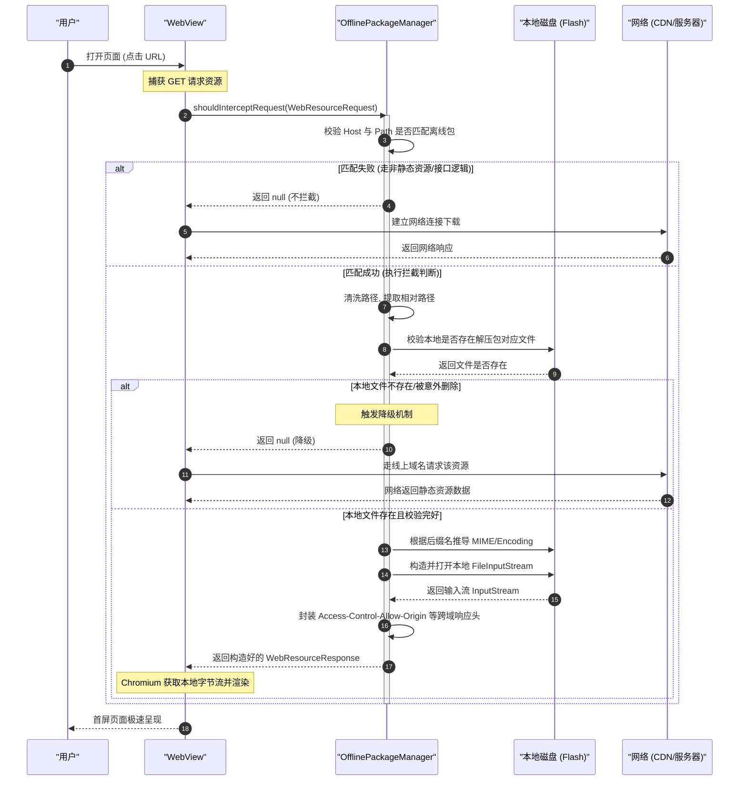

# 5.2.5.3 离线包

在移动互联网时代的 Hybrid 混合架构中，WebView 容器因其出色的跨平台性、热更新能力和敏捷的迭代效率，成为了各大应用必不可少的基石。然而，**“白屏时间过长”**始终是传统 H5 容器被用户与开发者诟病的顽疾。

为了解决 H5 首屏加载缓慢的问题，**离线包（Offline Package）**机制应运而生。这是一种将 Web 静态资源（HTML、CSS、JS、图片、字体等）提前打包，通过后台静默下载、安全校验并解压到客户端本地，再利用 WebView 拦截技术将原本的网络请求重定向到本地 I/O 读取，从而实现“秒开”的核心技术方案。

---

## 一、 核心概念：混合容器下线上 Web 加载的白屏缺陷与加速原理

### 1.1 线上 Web 加载的时延与白屏痛点
当用户在 Android App 中点击一个按钮，打开一个传统的、完全依赖线上资源的 WebView 页面时，Chromium 内核会经历一长串串行的网络与渲染生命周期。如下图所示，每一个环节都会引入显著的时延：

```
[点击打开] ──> (1. 实例初始化) ──> (2. DNS解析) ──> (3. TCP/SSL建连) ──> (4. HTML下载) ──> (5. DOM解析) ──> (6. CSS/JS阻塞下载与执行) ──> [首屏渲染]
```

这些时延环节在移动网络环境下会被成倍放大，最终导致严重的**白屏（Blank Screen）**现象：

1. **WebView 实例初始化时延**：
   Chromium 内核首次启动时，需要进行大量的动态库加载、主线程与渲染线程初始化、V8 引擎配置等工作。在中低端 Android 设备上，这一步骤的耗时常常高达 **300ms ~ 1000ms**，在页面尚未发起任何网络请求前，就已经占用了大量的白屏时间。
2. **DNS 解析时延**：
   在移动网络（4G/5G 或不稳定的公共 Wi-Fi）中，LocalDNS 的解析速度极不稳定。域名解析耗时一般在 **50ms ~ 300ms** 之间，甚至可能因为运营商的 DNS 劫持、缓存失效或递归查询失败而导致长达数秒的延迟。
3. **TCP 建连与 SSL 握手时延**：
   TCP 三次握手需要 1 个往返时延（RTT）。而现代 Web 强制要求 HTTPS，TLS 握手在 1.2 版本下通常需要 2 个 RTT，在 1.3 版本下也需要 1 个 RTT。在移动网络高时延、高丢包率的环境下，建连与握手往往需要消耗 **100ms ~ 500ms**。
4. **HTML 下载与首字节时间（TTFB）**：
   浏览器必须完整下载 HTML 文档才能开始解析。首字节返回时间（Time to First Byte）受服务器响应性能、网络带宽以及传输距离的限制，通常需要 **100ms ~ 400ms**。
5. **DOM 解析与关键渲染路径（CRP）阻塞**：
   Chromium 解析 HTML 并构建 DOM 树的过程中，一旦遇到外部脚本（`<script src="...">` 且未设置 `async` 或 `defer`），DOM 构建就会被迫暂停，等待该 JS 资源下载并执行完毕。同时，外部样式表（`<link rel="stylesheet">`）虽然不阻塞 DOM 构建，但会阻塞渲染树（Render Tree）的合成。此时页面依然无法呈现任何内容，进一步加剧了白屏时间。

### 1.2 离线包（Offline Package）的定义
**离线包（Offline Package）**，是指将 H5 页面所需的**静态资源**（主要包括 HTML 模板、JavaScript 逻辑、CSS 样式表、非动态图片、字体文件等）在发布阶段进行压缩打包（通常为 `.zip` 格式），由客户端通过后台静默下载、增量更新等手段提前下载并解压到应用的私有存储目录中。

其核心思想可以概括为：**“静态资源本地化” + “动态数据网络化”**。

### 1.3 静态资源本地化加速原理
离线包的本质是**使用本地文件 I/O 代替网络 I/O**。

| 评估维度 | 线上 Web 加载 (网络 I/O) | 离线包加载 (本地闪存 I/O) |
| :--- | :--- | :--- |
| **首字节耗时 (TTFB)** | **100ms ~ 400ms**（受网络环境、服务器距离制约） | **< 5ms**（闪存随机读取） |
| **带宽吞吐量** | 几 Mbps 到几十 Mbps（受限移动信号） | 数百 MB/s 至数 GB/s（UFS 3.0/4.0 闪存总线） |
| **稳定性（网络抖动）** | 极差（网络丢包、延迟波动会导致加载卡死） | 极高（不受网络环境和断网影响） |
| **资费开销** | 每次加载都会消耗用户手机流量 | 仅在后台更新包时消耗流量（可在 Wi-Fi 静默下载） |

通过本地化加速，Chromium 内核在请求 `main.js` 或 `theme.css` 时，不需要发起实际的 HTTP/HTTPS 网络连接，而是直接从闪存（Flash Memory）中通过 `FileInputStream` 读取。这几乎消除了 DNS 解析、TCP 建连、SSL 握手以及静态资源网络下载的所有时间消耗。一旦配合后文提到的“数据并行拉取”与“模板预渲染”，H5 页面的秒开率（首屏呈现时间 < 300ms）可以提升至 **90% 以上**。

---

## 二、 核心拦截与加载机制：shouldInterceptRequest 的深度拆解

Android 离线包机制能够运转，完全依赖于 WebView 提供的资源拦截接口：`WebViewClient.shouldInterceptRequest`。它扮演了本地“反向代理”的角色。

### 2.1 WebViewClient.shouldInterceptRequest() 核心原理

#### 2.1.1 API 演进与适配
随着 Android 系统的演进，该接口经历了一次重大的 API 升级：

1. **早期版本 (API 11 ~ API 20)**：
   ```java
   public WebResourceResponse shouldInterceptRequest(WebView view, String url)
   ```
   * **缺陷**：该接口只传入了请求的 `url` 字符串。客户端无法获知当前请求的 HTTP Method（GET/POST）、HTTP Header（例如 `Cookie`、`User-Agent` 等），也无法判断该请求是来自于 HTML 页面本身（主 Frame）还是图片、Ajax 异步请求。

2. **现代版本 (API 21 及以上)**：
   ```java
   public WebResourceResponse shouldInterceptRequest(WebView view, WebResourceRequest request)
   ```
   * **改进**：参数升级为 `WebResourceRequest` 对象。该接口提供了极度丰富的上下文数据：
     * `Uri getUrl()`: 统一资源标识符。
     * `boolean isForMainFrame()`: 是否是主 Frame 请求。这允许我们只对 HTML 页面本身进行特殊的路由与预加载控制。
     * `boolean isRedirect()`: 当前请求是否是重定向（在 API 24 引入）。
     * `boolean hasGesture()`: 用户是否点击或手势触发了此请求。
     * `String getMethod()`: 请求的 HTTP 方法（如 `GET`, `POST` 等）。由于 `POST` 请求带有的 Body 数据在 Native 拦截层难以通过标准输入流还原，因此离线包通常**只拦截 `GET` 请求**的静态资源。
     * `Map<String, String> getRequestHeaders()`: 获取该请求携带的所有 HTTP 头信息。

#### 2.1.2 运行线程与 UI 阻塞风险
> [!IMPORTANT]
> `shouldInterceptRequest` **并不运行在 Android 的主线程（UI 线程）上**，而是运行在 Chromium 内核分配的非 UI 线程（如 `WebViewCoreThread` 或专属的 I/O 线程）中。

这种设计决定了以下开发准则：
1. **合理性**：在此回调中直接进行同步的磁盘 I/O（如 `new FileInputStream(file)`）或数据库查询是安全的，不会触发主线程 ANR。
2. **严禁主线程调用**：绝对不能在此回调中直接操作任何 WebView 的方法（例如 `webView.loadUrl(...)`、`webView.getSettings(...)`）或修改任何 Android View 的 UI 状态。如需操作，必须通过 `Handler(Looper.getMainLooper())` 异步邮寄到主线程。
3. **严禁执行极度耗时的同步阻塞任务**：虽然它不在主线程，但如果在此处无脑发起一个**同步网络请求**去下载缺失的本地资源，会占用内核的 I/O 线程资源。当并发请求较多时，会导致内核线程池耗尽，进而引起网页上所有未拦截的网络资源加载挂起，导致严重的渲染卡顿。

---

### 2.2 本地资源的拦截与匹配策略
当 Chromium 发起网络请求时，`shouldInterceptRequest` 会被高频触发（一个页面可能触发几十次，包括每个 `.js`、`.css`、图片）。我们需要一套高效、严密的拦截判定算法。

#### 2.2.1 URL 解析与相对路径提取
线上 URL 与本地离线包的相对路径需要一一对应。通常规则为：
* 线上基准域名：`https://static.example.com/project_a/`
* 本地解压目录：`/data/user/0/com.pkg.name/files/offline/project_a/`
* 线上请求地址：`https://static.example.com/project_a/js/main.1a2b3c.js`

**提取算法步骤**：
1. 判断 `request.getMethod()` 是否为 `"GET"`，若不是，直接返回 `null`（不拦截）。
2. 获取 `Uri` 并判断其 `Scheme` 是否为 `"http"` 或 `"https"`。
3. 比对 `Host` 是否与我们配置的离线包静态域名相符。
4. 比对 `Path` 是否以我们定义的项目路径前缀开头。
5. 提取出相对路径（如 `js/main.1a2b3c.js`），与本地离线包的真实物理路径拼接，校验文件是否存在。

#### 2.2.2 MIME 类型与文件后缀匹配
Chromium 内核对回传的 `WebResourceResponse` 的 MIME 类型校验极其严苛。如果 MIME 类型缺失或匹配错误（例如将 `.js` 文件的 MIME 传为 `text/html`），Chromium 控制台会报错：
`Refused to execute script from '...' because its MIME type ('text/html') is not executable, and strict MIME type checking is enabled.`

必须在本地维护一个完备的**文件后缀 -> MIME 类型**映射字典：

| 文件后缀 | 匹配的 MIME 类型 (mimeType) | 字符编码 (encoding) |
| :--- | :--- | :--- |
| `.html`, `.htm` | `text/html` | `UTF-8` |
| `.js` | `application/javascript` 或 `text/javascript` | `UTF-8` |
| `.css` | `text/css` | `UTF-8` |
| `.png` | `image/png` | `null` |
| `.jpg`, `.jpeg` | `image/jpeg` | `null` |
| `.webp` | `image/webp` | `null` |
| `.gif` | `image/gif` | `null` |
| `.svg` | `image/svg+xml` | `UTF-8` |
| `.woff` | `font/woff` | `null` |
| `.woff2` | `font/woff2` | `null` |
| `.json` | `application/json` | `UTF-8` |

#### 2.2.3 本地文件读取与输入流构造
使用本地文件的 `FileInputStream` 构造数据流。如果本地文件因损坏或丢失不存在，必须优雅地**返回 `null`**，此时系统会自动发起真实网络请求去线上下载，确保业务正常流转（无缝降级）。

---

### 2.3 WebResourceResponse 的构造与回传

#### 2.3.1 核心字段解析
`WebResourceResponse` 包含以下核心属性：
```java
public WebResourceResponse(
    String mimeType, 
    String encoding, 
    int statusCode, 
    String reasonPhrase, 
    Map<String, String> responseHeaders, 
    InputStream data
)
```
* **`mimeType`**：资源的媒体类型（如上文映射表所示）。
* **`encoding`**：字符集编码。通常文本类文件为 `"UTF-8"`，二进制流（图片、字体）为 `null`。
* **`statusCode`**：HTTP 状态码。本地拦截成功时必须为 `200`；如果想通过拦截器告知前端某个资源不存在或拒绝服务，可以返回 `404` 或 `403`。
* **`reasonPhrase`**：状态描述，通常为 `"OK"`。不能为空，否则构造时会抛出异常。
* **`responseHeaders`**：极其关键。它是返回给 Chromium 渲染引擎的 HTTP 响应头。如果缺少必要的头（如 CORS 头），会导致网页内其他脚本无法正常读取此资源。
* **`data`**：输入流。**注意：开发者不需要手动在 `shouldInterceptRequest` 结束时关闭此流，Chromium 读取完数据后会在内核层自动关闭。若发生读取异常，则需要在 `catch` 中将其安全关闭。**

#### 2.3.2 跨域（CORS）问题处理
如果 H5 页面本身运行在主域名（例如 `https://h5.example.com`），而拦截加载的静态资源或发起的 Ajax 请求被重定向到本地，Chromium 的安全沙箱会执行**同源策略（Same-Origin Policy）**检查。为了防止跨域安全报错，必须在 `responseHeaders` 中手动注入允许跨域的字段：

```kotlin
val headers = HashMap<String, String>()
headers["Access-Control-Allow-Origin"] = "*" // 允许任意源跨域
headers["Access-Control-Allow-Methods"] = "GET, POST, OPTIONS"
headers["Access-Control-Allow-Headers"] = "Content-Type, Authorization, X-Requested-With"
headers["Access-Control-Allow-Credentials"] = "true"
```

---

### 2.4 核心实现代码示例
以下是一个用 Kotlin 编写的健壮的、支持高并发和防内存泄漏的 `shouldInterceptRequest` 拦截匹配类：

```kotlin
package com.example.webview.offline

import android.content.Context
import android.net.Uri
import android.webkit.WebResourceRequest
import android.webkit.WebResourceResponse
import java.io.File
import java.io.FileInputStream
import java.io.IOException
import java.io.InputStream
import java.util.Locale

class OfflinePackageManager(private val context: Context) {

    // 线上静态资源基准域名
    private val targetHost = "static.example.com"
    // 本地离线包的解压基准路径
    private val localOfflineDir: File by lazy {
        File(context.filesDir, "offline_packages")
    }

    // 后缀与 MIME 的映射关系表
    private val mimeMap = mapOf(
        "html" to "text/html",
        "htm" to "text/html",
        "js" to "application/javascript",
        "css" to "text/css",
        "png" to "image/png",
        "jpg" to "image/jpeg",
        "jpeg" to "image/jpeg",
        "webp" to "image/webp",
        "gif" to "image/gif",
        "svg" to "image/svg+xml",
        "woff" to "font/woff",
        "woff2" to "font/woff2",
        "json" to "application/json"
    )

    /**
     * 核心拦截入口，在 WebViewClient.shouldInterceptRequest 中调用
     */
    fun shouldIntercept(request: WebResourceRequest): WebResourceResponse? {
        // 1. 只拦截 GET 请求
        if (!"GET".equals(request.method, ignoreCase = true)) {
            return null
        }

        val uri = request.url ?: return null
        val host = uri.host ?: return null
        val path = uri.path ?: return null

        // 2. 判定 Host 是否匹配离线包域名
        if (!host.equals(targetHost, ignoreCase = true)) {
            return null
        }

        // 3. 映射到本地文件物理路径
        // 示例：/static.example.com/project_a/js/main.js -> 本地物理路径
        val localFile = getLocalFile(path) ?: return null

        if (!localFile.exists() || !localFile.isFile) {
            return null
        }

        // 4. 获取文件后缀并推导 MIME 类型
        val extension = getFileExtension(localFile.name)
        val mimeType = mimeMap[extension] ?: "application/octet-stream"
        val encoding = if (isTextType(extension)) "UTF-8" else null

        return try {
            val inputStream: InputStream = FileInputStream(localFile)
            
            // 5. 构造跨域（CORS）响应头
            val responseHeaders = HashMap<String, String>()
            // 动态匹配 Origin，防止跨域凭证 (Credentials) 为 true 时使用通配符 '*' 的报错
            val origin = request.requestHeaders["Origin"] ?: "*"
            responseHeaders["Access-Control-Allow-Origin"] = origin
            responseHeaders["Access-Control-Allow-Methods"] = "GET, POST, OPTIONS"
            responseHeaders["Access-Control-Allow-Headers"] = "Content-Type, Authorization, X-Requested-With"
            responseHeaders["Access-Control-Allow-Credentials"] = "true"
            // 防止中间人注入风险与强转 MIME Sniffing 检查限制
            responseHeaders["X-Content-Type-Options"] = "nosniff"

            // 6. 构造 WebResourceResponse 回传
            WebResourceResponse(
                mimeType,
                encoding,
                200,
                "OK",
                responseHeaders,
                inputStream
            )
        } catch (e: IOException) {
            // 发生 IO 异常时优雅返回 null，降级到网络正常加载
            null
        }
    }

    private fun getLocalFile(path: String): File? {
        // 清洗路径，防止路径穿越攻击（安全原则：拦截层过滤绝对路径上的 "../"）
        if (path.contains("..")) {
            return null
        }
        // 假设 URL 路径为 /project_a/js/main.js，本地目录结构保持一致
        return File(localOfflineDir, path)
    }

    private fun getFileExtension(fileName: String): String {
        val index = fileName.lastIndexOf('.')
        return if (index != -1) {
            fileName.substring(index + 1).lowercase(Locale.ROOT)
        } else {
            ""
        }
    }

    private fun isTextType(extension: String): Boolean {
        return extension in setOf("html", "htm", "js", "css", "json", "xml", "svg")
    }
}
```

---

## 三、 离线包生命周期维护

离线包机制绝不仅是 WebView 的拦截，更是一整套闭环的分布式客户端版本生命周期管理系统。

```
[打包发布平台] ── 差分(bsdiff) ──> [CDN服务器] ── 触达/静默更新 ──> [App] ──> [签名&Zip Slip校验] ──> [双目录就绪]
```

### 3.1 离线包打包规范与增量更新

#### 3.1.1 ZIP 包结构设计与 `manifest.json`
离线包的打包输出应当是统一规范的 ZIP 包。解压后的内部文件必须扁平化、模块化：
```
biz_project_a.zip
├── manifest.json            # 离线包的核心元数据配置文件
├── index.html               # 页面入口
├── css/
│   └── main.a8f90c.css
└── js/
    └── index.7cf29e.js
```
`manifest.json` 用来保障本地资源与线上的动态对齐和安全强校验：
```json
{
  "packageId": "biz_project_a",
  "version": 2026062101,
  "domain": "https://static.example.com/project_a",
  "entry": "index.html",
  "files": [
    {
      "path": "index.html",
      "hash": "e3b0c44298fc1c149afbf4c8996fb92427ae41e4649b934ca495991b7852b855"
    },
    {
      "path": "js/index.7cf29e.js",
      "hash": "ab348d28a1c90c749afbf4c8996fb92427ae41e4649b934ca495991b7852ba44"
    }
  ]
}
```

#### 3.1.2 增量更新机制（bsdiff/bspatch 算法的应用）
如果每次离线包更新都需要用户重新下载完整的 ZIP 包（如 5MB ~ 20MB），不仅极大浪费网络流量，也会使下载成功率断崖式下跌。为此，业界统一引入了二进制差分升级算法：
1. **服务端差分（bsdiff）**：
   当版本从 `V1` 升级到 `V2` 时，打包发布平台在后台调用 `bsdiff` 核心命令，比对两代二进制 ZIP 文件，生成一个微小的差分补丁：
   $$\text{Patch} = \text{bsdiff}(V1\text{.zip}, V2\text{.zip})$$
   这个补丁通常只有原包体积的 $5\% \sim 20\%$（例如 10MB 的大包，其 Patch 可能只有几百 KB）。
2. **客户端合成（bspatch）**：
   客户端仅拉取这个 Patch 差分包。下载成功后，在后台线程中利用 JNI 库调用 `bspatch` 算法，将本地已存的 `V1.zip` 和新下载的 `Patch` 合并生成出全新的 `V2.zip`：
   $$V2\text{.zip} = \text{bspatch}(V1\text{.zip}, \text{Patch})$$
3. **哈希校验**：合成完成后，使用预置的哈希（如 SHA-256）对新合成的 `V2.zip` 进行一次全盘匹配，确认无误后方可进入解压流程。

---

### 3.2 离线包下载与更新机制

#### 3.2.1 后台静默更新策略
离线包的同步绝对不能在页面展示的同步生命周期中串行执行，否则会引入更长久的等待白屏。
1. **检测阶段**：App 启动或定时器触发时，向 API 发送本地离线包版本清单列表（如 `{"biz_project_a": 2026062101}`）。
2. **下载阶段**：若服务器返回有新版本，客户端判断当前网络状态（可配置为仅在 Wi-Fi 下下载，或者在 4G/5G 下仅下载小型的差分 Patch）。使用系统的 `WorkManager` 或后台高抗丢包网络库拉取补丁。
3. **调度阶段**：下载与合并任务执行于低优先级的守护线程池中。

#### 3.2.2 版本一致性保障：双版本/双包机制
> [!CAUTION]
> **绝对不能在 WebView 实例运行期间去覆盖、删除当前页面正在读取的本地解压文件！**
> 否则会导致 Chromium 的文件句柄突然失效，引起页面语法解析中断、图片瞬间破碎、或者 JS 引擎崩毁白屏。

为了解决读写冲突，引入**双包隔离与生效指针机制**：
1. **磁盘目录设计**：
   对于每一个离线包 ID，本地存储路径中根据版本号存放于不同独立目录：
   * `.../offline_packages/biz_project_a/2026062101/` （旧版本目录，WebView 正在安全读取）
   * `.../offline_packages/biz_project_a/2026062102/` （后台静默解压好的新版本目录，处于隔离就绪态）
2. **版本映射指针（active_version.json）**：
   本地存在一个指向“当前可用最新稳定版”的轻量级 JSON 配置文件。当 `2026062102` 解压并自检全部通过后，我们将指针的值修改为 `2026062102`。
3. **拦截路径的绑定时间点（Session 隔离）**：
   当用户点击进入 H5 页面时，在页面初始化的瞬间，Native 锁定当前正在生效的版本（例如 `2026062102`）。在这一次页面访问周期中，`shouldInterceptRequest` 将**锁定**读取 `2026062102` 的目录。即便随后后台更新下载了更高的 `V3` 版本，也绝对不改动当前生命周期的映射路径。直到下次重新进入页面、刷新或 WebView 被销毁重启时，新的生效版本才会生效。

#### 3.2.3 完整性校验（MD5/SHA256）
* **包校验**：下载的 Zip 文件或合并出的新 Zip 文件，必须通过全量 MD5 校验（由服务器下发配置）。
* **单个资源校验**：在解压时，对照 `manifest.json` 内部的 `files` 列表，逐个核对解压后文件的 SHA-256 签名，防范解压阶段的文件损坏。

---

### 3.3 安全解压与签名校验

#### 3.3.1 安全解压：防范 Zip Slip 漏洞
**Zip Slip** 是一种极其危险的路径穿越（Directory Traversal）漏洞。攻击者可以在打包 Zip 时，恶意命名文件路径，如：
`../../../../../../data/data/com.example/databases/user.db`
当客户端以无防护的循环读取流解压时，该文件会被强制解包写入到预设的物理目录之外，覆盖应用极其关键的数据库或 DEX 缓存。

**防范原理**：
在写入每个 Zip Entry 到磁盘前，使用 `File.getCanonicalPath()` 获取目标写入文件真正的**规范化绝对路径**，并校验该绝对路径是否以**安全的目标解压基准路径**为前缀。

以下为防范 Zip Slip 漏洞的安全解压 Kotlin 完整代码实现：

```kotlin
package com.example.webview.offline

import java.io.BufferedOutputStream
import java.io.File
import java.io.FileOutputStream
import java.io.IOException
import java.io.InputStream
import java.util.zip.ZipEntry
import java.util.zip.ZipInputStream

object SafeZipDecompressor {

    /**
     * 安全解压缩 zip 包到指定目标目录
     * @param zipInputStream 待解压的输入流
     * @param destDirectory 目标输出物理目录
     * @throws IOException 抛出IO异常或Zip Slip注入攻击异常
     */
    @Throws(IOException::class)
    fun unzipSecurely(zipInputStream: InputStream, destDirectory: File) {
        // 创建目标目录
        if (!destDirectory.exists()) {
            destDirectory.mkdirs()
        }
        
        val canonicalDestDirPath = destDirectory.canonicalPath
        
        ZipInputStream(zipInputStream).use { zis ->
            var entry: ZipEntry? = zis.nextEntry
            val buffer = ByteArray(4096)
            
            while (entry != null) {
                // 1. 构造输出目标文件对象
                val newFile = File(destDirectory, entry.name)
                
                // 2. 安全防线：校验规范路径前缀是否属于合法目录，防止 Zip Slip
                val canonicalNewFilePath = newFile.canonicalPath
                if (!canonicalNewFilePath.startsWith(canonicalDestDirPath + File.separator)) {
                    throw IOException("检测到 Zip Slip 恶意攻击注入路径: ${entry.name}")
                }
                
                if (entry.isDirectory) {
                    newFile.mkdirs()
                } else {
                    // 创建父目录
                    val parent = newFile.parentFile
                    if (parent != null && !parent.exists()) {
                        parent.mkdirs()
                    }
                    
                    // 3. 输出文件
                    FileOutputStream(newFile).use { fos ->
                        BufferedOutputStream(fos).use { bos ->
                            var len: Int
                            while (zis.read(buffer).also { len = it } > 0) {
                                bos.write(buffer, 0, len)
                            }
                        }
                    }
                }
                zis.closeEntry()
                entry = zis.nextEntry
            }
        }
    }
}
```

#### 3.3.2 签名校验：RSA 验签保障传输安全
为杜绝 CDN 被劫持、DNS 污染或中间人篡改（特别是对于明文的 HTML 注入恶意 JS 的风险），必须在发布端引入非对称加密。
1. **服务端签名**：在发布系统生成离线包并生成最终的 `manifest.json` 时，用非对称加密的**私钥（Private Key）**对 `manifest.json` 的文本内容（或整个包）进行 RSA 签名，签名结果存放在包中或以独立字段下发。
2. **客户端内置公钥（Public Key）**：客户端的 Assets 目录中硬编码内置与之配对的 RSA 公钥。
3. **加载前校验**：离线包下载合成后，客户端在解压前，首先使用本地公钥对 `manifest.json` 里的数字签名进行还原比对。一旦签名校验失败，立即判定为中间人篡改或包不合规，彻底丢弃整包并销毁目录。

---

## 四、 预加载（Preload）与预渲染（Prerender）优化

要追求极致的“秒开”体验，仅有静态资源本地化是不够的，必须榨干 WebView 初始化与网络串行的多余时间。

### 4.1 WebView 实例池的全局复用
#### 4.1.1 WebView 初始化耗时瓶颈分析
WebView 首次实例化的耗时主要是因为需要唤醒底层的 Blink/Chromium 渲染引擎、加载内核类、分配资源等。为了让打开页面的第一步速度增快，业内通常设计一套全局缓存池。

#### 4.1.2 MutableContextWrapper 复用池设计
如果单纯将 WebView 以 `Activity` 级别的 Context 进行强引用缓存，必然在 Activity 退出时引发严重的**内存泄漏**。因为 WebView 内部持有了 Context 进而导致 Activity 无法被垃圾收集（GC）回收。

**解决方案**：使用 `MutableContextWrapper` 做上下文的动态解耦与桥接。

* **原理**：`MutableContextWrapper` 是 Android 提供的允许在运行时修改包装内真实 `baseContext` 的类。
* **设计架构图**：
  ```
  [预创建阶段] : WebView 实例化 -> MutableContextWrapper(ApplicationContext) -> 存入复用池
  [绑定使用阶段]: 从复用池取出 WebView -> MutableContextWrapper.setBaseContext(ActivityContext) -> 挂载到Activity中
  [销毁置空阶段]: 移出 WebView -> MutableContextWrapper.setBaseContext(ApplicationContext) -> 清空状态放回池中
  ```

* **复用池核心代码实现**：
```kotlin
package com.example.webview.pool

import android.annotation.SuppressLint
import android.content.Context
import android.content.MutableContextWrapper
import android.webkit.WebView
import java.util.Stack

object WebViewPool {
    private val webViewStack = Stack<WebView>()
    private const val MAX_POOL_SIZE = 3

    /**
     * 在 Application 初始化时调用，提前预创建
     */
    fun preInit(context: Context) {
        val appWrapper = MutableContextWrapper(context.applicationContext)
        val webView = createWebViewInstance(appWrapper)
        webViewStack.push(webView)
    }

    /**
     * 获取复用池中的 WebView 实例
     */
    @SuppressLint("SetJavaScriptEnabled")
    fun acquire(context: Context): WebView {
        return if (webViewStack.isNotEmpty()) {
            val webView = webViewStack.pop()
            val wrapper = webView.context as MutableContextWrapper
            // 切换为 Activity 上下文，防止内存泄露的同时确保 dialog 等正常弹出
            wrapper.baseContext = context
            webView
        } else {
            createWebViewInstance(MutableContextWrapper(context))
        }
    }

    /**
     * 归还并重置 WebView
     */
    fun release(webView: WebView) {
        // 移出父容器
        val parent = webView.parent
        if (parent is android.view.ViewGroup) {
            parent.removeView(webView)
        }
        
        try {
            // 重置状态与历史记录，避免上一次浏览的缓存、滚动位置干扰下一次展示
            webView.stopLoading()
            webView.loadUrl("about:blank")
            webView.clearHistory()
            webView.clearSslPreferences()
            webView.clearMatches()
            
            // 关键：将上下文剥离，指回 ApplicationContext，断开对 Activity 的强引用
            val wrapper = webView.context as MutableContextWrapper
            wrapper.baseContext = webView.context.applicationContext
            
            if (webViewStack.size < MAX_POOL_SIZE) {
                webViewStack.push(webView)
            }
        } catch (e: Exception) {
            // 兜底，重置异常则直接丢弃防止泄露
        }
    }

    private fun createWebViewInstance(context: Context): WebView {
        return WebView(context).apply {
            settings.javaScriptEnabled = true
            // 配置最简的离线包适配设定
        }
    }
}
```

---

### 4.2 首屏数据接口提前拉取与模板并行化
#### 4.2.1 传统串行加载瓶颈
即便资源实现了完全本地化，传统 Hybrid 容器在加载流程上仍然是**串行等待**的：

```
[启动Activity] ─1.初始化WebView─> [加载本地HTML] ─2.解析DOM并加载JS─> [JS发送Ajax拉取首屏数据] ─3.数据网络返回─> [JS绑定数据渲染首屏]
```
在此流程中，WebView 初始化及 JS 的下载执行期间，网络带宽是**闲置**的。而数据拉取期间，内核处于挂起等待态。

#### 4.2.2 Sonic 模板-数据并行拉取思想
由腾讯 VasSonic 团队等业界推广的数据与模板分离方案，极大地压榨了这部分串行空档：

1. **并行初始化与拉取**：
   在 Native 启动页面的瞬间（`Activity.onCreate`），不仅通过实例池取出并配置 WebView，同时利用 Native 网络层立即发起**首屏数据接口的 HTTP 请求（并行拉取）**。
2. **本地模板载入**：
   WebView 启动本地离线 HTML 模板（此模板没有包含首屏数据，通常为空白骨架或包含旧的离线占位符）。
3. **JSBridge 注入/拦截注入**：
   当 JS 解析完成准备拉取数据时，不走常规的线上网络，而是调用 JSBridge 发起“索要首屏数据”的 Native 调用：
   * 若 Native 网络请求比 JS 执行慢，JS 等待 Native 网络完成后立即回调。
   * 若 Native 网络层早就拿到了数据，数据被存在 Native 内存中，JSBridge 直接将这部分数据瞬时注入到本地网页内。
   * 通过这种“Native 替 H5 跑网络”的并行化手段，数据加载与 WebView 初始化完美重叠，秒开速度可以进一步压缩 **100ms ~ 300ms**。

---

## 五、 离线包机制时序图

以下是完整的离线包运行与无缝网络降级逻辑时序图：



---

## 六、 常见踩坑与治理

### 6.1 跨域（CORS）问题治理
离线包若使用传统的本地协议（如 `file:///android_asset/` 或私有物理路径 `file:///data/user/0/...`）加载 HTML 模板，当其通过 Ajax/Fetch 向线上 `https://api.example.com` 交互数据时，会遇到极为顽固的跨域沙箱限制。

#### 6.1.1 历史 API 行为演进
与此相关的行为变更，主要记录在 [AndroidVersionChangeLog.md](../../../../../AndroidVersionChangeLog.md) 对应的系统迁移指引中：
* **Android 4.1 (API 16) 变更**：
  引入 `WebSettings.setAllowFileAccessFromFileURLs` 与 `WebSettings.setAllowUniversalAccessFromFileURLs`。为了防止从 `file://` 起源的安全漏洞，系统默认将其设为 `false`。若需使用 `file://` 加载本地页面并和线上 API 正常通信，必须硬开启这两个属性。
  ```kotlin
  settings.allowFileAccessFromFileURLs = true
  settings.allowUniversalAccessFromFileURLs = true
  ```
  > [!WARNING]
  > 开启上述 Universal Access 意味着网页中的恶意 `file://` 可以跨域越权访问手机内部的私有数据，存在巨大的客户端安全漏洞。
* **Android 10 (API 29) ~ Android 11 (API 30) 变更**：
  系统权限对分区存储（Scoped Storage）收紧，WebView 中对于 `file://` 协议的内部私有文件访问权限默认关闭，且在 API 30 中 `settings.allowFileAccess` 默认被强制置为 `false`（为了安全性不建议随意开启）。

#### 6.1.2 现代终极解决方案：`WebViewAssetLoader`
为了完美消除 `file://` 协议引起的跨域痛点与安全隐患，Google 官方在 `androidx.webkit:webkit` 库中提供了 **`WebViewAssetLoader`** 机制。

它允许开发者将本地的 Assets 或私有数据目录，映射为一组合法的、安全的**虚拟标准 HTTPS 域名**（例如 `https://appassets.androidplatform.net`）。
* **收益**：对于 Chromium 而言，网页是由标准 `https://` 安全域名加载出来的，因此可以获得完美的同源策略保护，并能够无缝执行与线上 HTTPS API 接口的 CORS 通信。

**WebViewAssetLoader 拦截配置示例**：
```kotlin
val assetLoader = WebViewAssetLoader.Builder()
    .setDomain("appassets.androidplatform.net") // 自定义本地映射虚拟域名
    .addPathHandler("/assets/", WebViewAssetLoader.AssetsPathHandler(context))
    .addPathHandler("/offline/", WebViewAssetLoader.InternalStoragePathHandler(context, localOfflineDir))
    .build()

webView.webViewClient = object : WebViewClient() {
    override fun shouldInterceptRequest(
        view: WebView,
        request: WebResourceRequest
    ): WebResourceResponse? {
        // 先走 WebViewAssetLoader 的标准安全本地文件解析
        val localResponse = assetLoader.shouldInterceptRequest(request.url)
        if (localResponse != null) {
            // 在返回前，由于它是安全的映射域名，依旧可以按需追加 CORS 跨域头信息以允许与其他 API 域交互
            localResponse.responseHeaders["Access-Control-Allow-Origin"] = "*"
            return localResponse
        }
        
        // 走离线包定制管理流程
        return offlinePackageManager.shouldIntercept(request)
    }
}
```

---

### 6.2 Cookie 同步与丢失问题
本地离线包（如静态页面、资源）拦截运行后，一些由 JS 直接发起的跨域异步请求往往会导致登录态 `Cookie` 丢失。
1. **第三方 Cookie 被禁**：
   在 [Android 5.0 (API 21)](../../../../../AndroidVersionChangeLog.md#android-50--51api-21--22) 及以上系统，为了用户安全，WebView 默认禁用第三方 Context 的 Cookie 读写策略。如果页面是在虚拟本地域下运行，去跨域访问线上业务域名，Cookie 默认会被阻断拦截。
   **解决方式**：在初始化 WebView 时，必须针对 Cookie 策略进行显示开启：
   ```kotlin
   CookieManager.getInstance().let { cookieManager ->
       cookieManager.setAcceptCookie(true)
       // API 21+ 必须显式开启跨域/第三方域 Cookie 的传输
       cookieManager.acceptThirdPartyCookies(webView, true)
   }
   ```
2. **Cookie 同步阻塞与异步刷入**：
   老旧的 `CookieSyncManager.sync()` 已经早在 API 21 被弃用。现在的 Cookie 写入与落盘采用高效的后台线程刷入机制：
   ```kotlin
   CookieManager.getInstance().flush() // 异步写入数据库，避免阻塞 UI 线程
   ```

---

### 6.3 H5 缓存控制与 Service Worker 冲突
**Service Worker (SW)** 是前端浏览器提供的一种可在后台劫持、分发网页请求的独立线程。
* **冲突点**：一旦前端 H5 页面注册了 Service Worker，在后来的加载中，Chromium 的网络层逻辑中，页面发起的 `Fetch/XHR` 请求会**优先被 Service Worker 监听拦截**并可能直接走 SW 的 `CacheStorage`，这导致请求**压根不会到达 Android 原生的 `shouldInterceptRequest` 接口**，使 Native 离线包完全失效。
* **规避策略**：
  1. **关闭 Service Worker 支持**：通过在 WebView 拦截到主 HTML 后，分析或在 JS 层下发指令拒绝 SW 注册。
  2. **拦截注册文件**：在 `shouldInterceptRequest` 里，对于名为 `service-worker.js` 或类似规则的 JS 请求，客户端拦截直接返回一个空内容的 `WebResourceResponse`（状态码 404 或空文本），从物理上废除 Service Worker 引擎的启用。
  3. **全局控制**：通过 `ServiceWorkerController` （API 24+）在 Native 侧显式覆盖 Service Worker 的拦截回调，并在其中重定向逻辑到本地离线包。

---

### 6.4 异常降级与白屏回退机制
不管离线包机制设计得多么精巧，在复杂的硬件与系统环境中，依然会存在各类异常：闪存坏道导致的 I/O 读取失败、Zip 包损坏、合并校验失败或版本冲突。必须建立多级**异常降级与白屏回退兜底（Fallback）机制**：

1. **资源拦截无缝降级**：
   在 `shouldInterceptRequest` 捕获所有 `IOException` 等底层读取异常。一旦捕捉，绝对不抛出崩溃，而是以 `return null` 终结。此时 Chromium 引擎会将此请求退化为普通的线上 CDN 网络连接，确保内容能够从网络端正常呈现。
2. **整页降级回退（白屏治理）**：
   在 WebView 加载页面时，若本地 HTML 入口因为损坏导致了白屏，客户端可以通过以下两种模式治理：
   * **生命周期错误监听**：重写 `WebViewClient.onReceivedError`。一旦检测到本地 HTML（特别是 `isForMainFrame` 且以本地虚拟域名开头的页面）发生严重的网络错误或资源缺失错误（如 `ERROR_FILE_NOT_FOUND`），记录下异常指标，并立刻调用：
     ```kotlin
     webView.loadUrl(onlineFallBackUrl) // 重定向加载线上真实 URL 页面
     ```
   * **像素采样检测**：在 `onPageFinished` 之后启动 2 秒定时轮询，使用 `view.getDrawingCache()` 或通过 Canvas 绘制出 `1x1` 的特定屏幕像素，进行透明度/纯色校验。若页面在完成加载 1.5 秒后依然全部为透明或白色像素，则判定离线包发生白屏损坏故障，执行清除本地离线包配置指针、并无缝重定向到线上 CDN 地址进行高可用降级。
