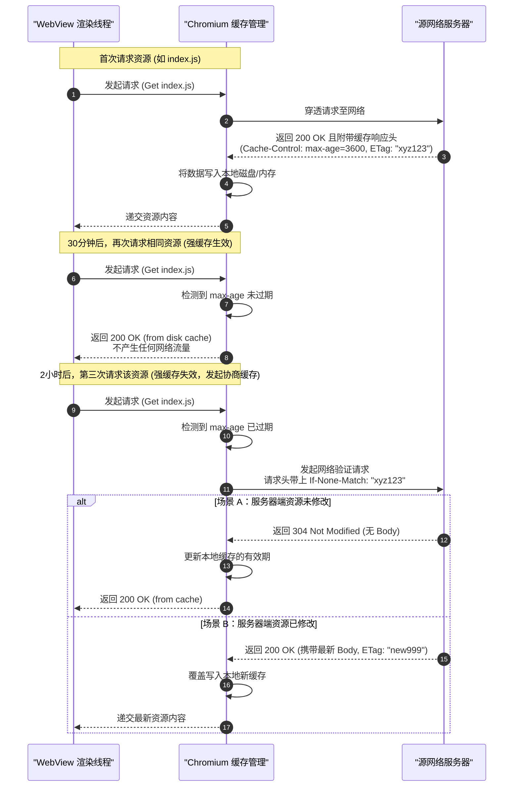

# 5.2.5.4 网页缓存

在移动端混合应用（Hybrid App）开发中，WebView 的加载性能与断网可用性是直接决定用户体验的核心指标。而在网络传输时延高、地铁或地下室等弱网甚至断网的复杂移动场景下，**网页缓存机制**是解决白屏时间长、网络流量消耗大、服务器负载重等性能瓶颈的终极武器。

本文将从核心概念出发，系统深入地剖析 Android WebView 支持的多级缓存机制，包括 HTTP 缓存、DOM Storage 缓存、IndexedDB 与 Web SQL、以及 Service Worker 缓存，并结合 Android 源码、API 演进及工程实践中的多进程冲突治理、磁盘空间淘汰等核心治理方案展开深入分析。

---

## 1. 核心概念：多级缓存的价值

网页缓存机制的本质是**利用本地存储空间换取网络带宽与时间**。在 Android 混合容器中，网页的渲染依赖于对 HTML、CSS、JS、图片及接口数据的加载。如果每次打开页面都从远端服务器下载这些静态或动态资源，会导致以下瓶颈：
1. **白屏时延长**：DNS 解析、TCP 握手及网络传输的往返时延（RTT）会导致首屏渲染时间（FP, FCP）大幅增加。
2. **网络依赖度高**：在离线或极端弱网环境下，应用会直接呈现类似 `net::ERR_INTERNET_DISCONNECTED` 的报错页面，混合容器形同虚设。
3. **流量浪费**：重复下载未发生任何变更的静态资源，消耗用户流量，增加服务器带宽成本。

为了解决这些痛点，Chromium 内核在 WebView 中实现了一套多级、互补的缓存技术体系：

```
+------------------------------------------------------------+
|                       WebView 渲染主线程                     |
+------------------------------------------------------------+
                              |
                              v
+------------------------------------------------------------+
|         Service Worker 拦截层 (通过 Cache Storage)           |
+------------------------------------------------------------+
        |                                       |
     (命中)                                  (未命中)
        v                                       v
+------------------+         +-------------------------------+
| 本地离线缓存(SW)  |         |     DOM Storage / IndexedDB   |
+------------------+         +-------------------------------+
                                                |
                                                v
                             +-------------------------------+
                             |    HTTP 强缓存 (Memory/Disk)   |
                             +-------------------------------+
                                                |
                                             (未命中)
                                                v
                             +-------------------------------+
                             |    HTTP 协商缓存 (304 校验)    |
                             +-------------------------------+
                                                |
                                             (未命中)
                                                v
                             +-------------------------------+
                             |        远端网络服务器          |
                             +-------------------------------+
```

* **网络传输层（HTTP 缓存）**：遵循标准的 RFC 7234 协议，由 Chromium 内核底层的网络协议栈自动接管。包含强缓存与协商缓存。
* **本地键值与结构化存储层（DOM Storage / IndexedDB）**：由 Web 开发者在前端 JavaScript 代码中调用，用于缓存结构化数据、用户状态以及业务数据。
* **独立拦截控制层（Service Worker）**：作为独立于 Web 渲染主线程的后台脚本，支持可高度编程的网络请求拦截与离线资源缓存，为 Web 带来了媲美原生应用的离线体验。

---

## 2. 三大缓存技术体系配置与深入剖析

### 2.1 HTTP 缓存（核心）

HTTP 缓存是整个网页缓存体系的基石。在 WebView 加载网页时，Chromium 内核的网络模块会自动解析 HTTP 响应头，并根据协议规范做出缓存决策。

#### 2.1.1 强缓存与协商缓存机制

HTTP 缓存分为**强缓存**和**协商缓存**两大阶段。它们通过特定的响应头与请求头相互配合，流转逻辑如下：

##### 1. 强缓存
强缓存表示客户端在缓存有效期内，**无需向服务器发送任何网络请求**，直接从本地读取缓存资源，HTTP 状态码返回 `200 OK (from memory cache)` 或 `200 OK (from disk cache)`。
* **`Expires`**：HTTP 1.0 的产物，其值是一个绝对的 GMT 时间戳（如 `Expires: Sun, 21 Jun 2026 12:00:00 GMT`）。它的缺陷在于依赖客户端本地系统时间，若客户端时间被篡改或不准确，会导致缓存错乱。
* **`Cache-Control`**：HTTP 1.1 的标准属性，优先级高于 `Expires`。它采用相对时间表示（如 `Cache-Control: max-age=3600`，表示资源在获取后的 3600 秒内有效）。其常用指令包括：
  * `public`：表明响应可以被任何对象（包括客户端、代理服务器、CDN 等）缓存。
  * `private`：表明响应只能被单个用户（客户端）缓存，中间代理服务器不能缓存。
  * `no-cache`：**这是一个极其容易被误解的指令**。它并不表示“不缓存”，而是表示**强制使用协商缓存**，即每次使用缓存前，必须向服务器发起请求以校验资源是否发生更新。
  * `no-store`：表示**真正意义上的禁止缓存**，客户端和任何中间代理均不得缓存该资源的任何部分，每次请求必须从服务器拉取完整数据。

##### 2. 协商缓存
协商缓存指当强缓存失效（例如缓存时间过期）后，客户端**必须向服务器发起请求，询问本地缓存是否依然有效**。如果服务器发现资源未变更，则返回 `304 Not Modified`，不携带响应体，通知客户端直接读取本地缓存；若资源已更新，则返回 `200 OK` 并附带最新的资源内容。
* **基于最后修改时间：`Last-Modified` / `If-Modified-Since`**
  1. 服务器在首次响应时，通过 `Last-Modified` 头部带上资源的最后修改时间。
  2. 客户端缓存失效后再次发起请求，会自动在请求头中携带 `If-Modified-Since: [Last-Modified的值]`。
  3. 服务器对比文件的当前最后修改时间，一致则返回 `304`。
  4. *缺点*：只能精确到秒。如果在 1 秒内文件被多次修改，或者文件虽然被修改了但内容并无实质变化，该机制仍会导致重复下载。
* **基于内容指纹：`ETag` / `If-None-Match`**
  1. 服务器为资源生成唯一的哈希指纹，在首次响应中通过 `ETag` 返回。
  2. 客户端再次发起请求时，在请求头中携带 `If-None-Match: [ETag的值]`。
  3. 服务器对比指纹，一致则返回 `304`。
  4. *优点*：精度极高，优先级高于 `Last-Modified`，完美解决了秒级更新和无实质修改的重复传输问题。

下面是强缓存与协商缓存交互流转的完整时序图：



#### 2.1.2 Chromium WebView 的内存缓存与磁盘缓存

Chromium 内核在底层将缓存分为内存缓存（`Memory Cache`）和磁盘缓存（`Disk Cache`）：
* **Memory Cache**：生存期最短，随着 WebView 渲染进程（Renderer Process）的销毁而释放。它通常存放体积较小的、解析后的资源（如 CSS 样式表、已解码的图片、V8 编译后的 JS 脚本 AST）。由于直接驻留内存，其读取速度达到微秒级。
* **Disk Cache**：持久化存放于磁盘空间。根据资源的类型和大小，内核决定其保存物理形式。

#### 2.1.3 `WebSettings.setCacheMode()` 配置剖析

在 Android 侧，我们可以通过 `WebSettings.setCacheMode(int mode)` 控制 WebView 的缓存加载策略。它提供了以下四种核心模式：

| 缓存模式常量 | 行为描述 | 适用场景 |
| :--- | :--- | :--- |
| `LOAD_DEFAULT` | **默认模式**。严格遵循标准 HTTP 协议（如 `Cache-Control` / `Expires`）决定是否走网络或读取本地缓存。 | **绝大多数标准网页的推荐配置**。配合服务端合理的 HTTP 头设置，可达到最佳的缓存平衡。 |
| `LOAD_CACHE_ELSE_NETWORK` | **优先使用缓存**。只要本地有缓存资源（即使它已经过期了），就直接使用缓存，不走网络；**只有当本地无任何缓存时，才发起网络请求**。 | **离线浏览/断网容灾方案**。当检测到系统处于离线状态时，可动态切换为此模式，防止白屏。 |
| `LOAD_NO_CACHE` | **强制禁用本地缓存**。忽略强缓存和协商缓存，WebView 每次请求资源都必须穿透到网络拉取最新内容。 | **高度敏感的实时性页面**。如支付结果页、实时证券行情页，或者处于前端联调阶段需要频繁更新资源的调试包。 |
| `LOAD_CACHE_ONLY` | **纯离线模式**。只读取本地缓存，绝对不发起任何网络请求。如果本地无缓存，则直接触发 `onReceivedError` 回调（报错 `net::ERR_CACHE_MISS`）。 | **本地静态离线包加载**。适用于完全不需要与后端实时同步的工具类 Web 页面或游戏。 |

#### 2.1.4 Android WebView HTTP 缓存初始化与物理目录

WebView 的 HTTP 缓存由 Chromium 内核进行底层的自动读写。
在 Android 应用的私有数据目录下，WebView 会建立以下文件结构：
* 物理路径：`/data/data/<你的包名>/cache/WebView/`
* 底层子文件夹：
  * `Cache/`：包含众多的 `data_0`、`data_1`、`index` 等文件。这是典型的 Chromium 二进制磁盘块缓存（Blockfile Cache），专门用于快速定位与读写小体积的 HTTP 资源。
  * `Code Cache/js/`：用于存放 V8 引擎将 JavaScript 源代码编译成机器码/字节码后的二进制缓存（V8 code serialization）。当下一次加载相同 JS 时，省去了语法解析与编译步骤，直接执行，这对于大型 JS 框架（如 Vue、React）的初始化速度提升巨大。

---

### 2.2 DOM Storage 缓存

DOM Storage 是 Web Hypertext Application Technology Working Group (WHATWG) 推出的一套标准 Key-Value 存储机制，旨在提供比传统 Cookie 容量更大、操作更便捷的本地存储解决方案。

#### 2.2.1 LocalStorage 与 SessionStorage

* **`LocalStorage`**：
  * **生命周期**：持久存储。除非前端代码主动调用 `localStorage.removeItem()` / `clear()`，或者 Android 原生侧主动清理数据，否则缓存永远存在。
  * **共享范围**：在同一个域（Origin，协议 + 域名 + 端口）下的所有页面、窗口及 WebView 实例中共享。
  * **容量**：一般为 5MB 左右。
* **`SessionStorage`**：
  * **生命周期**：临时存储。会话（Session）结束时即自动清除。在 WebView 场景下，只要销毁了对应的 WebView 实例，SessionStorage 的内存数据即宣告释放。
  * **共享范围**：仅在当前 WebView 的单次浏览上下文（Tab / Page）中可见，不可跨 Tab 或跨实例共享。

#### 2.2.2 Android WebView 配置 DOM Storage 开启与演进

默认情况下，Android WebView **并未开启 DOM Storage 支持**，这会导致大量依赖 LocalStorage 的现代前端单页面应用（SPA）功能失效、甚至直接抛出 JavaScript 异常崩溃。

配置开启代码如下：

```kotlin
val webSettings = webView.settings
// 必须：开启 DOM Storage API 支持
webSettings.domStorageEnabled = true
```

##### 历史 API 演进与安全注意事项
在较早的 Android 版本中，你可能会在遗留代码中看到以下配置：
```java
// 已废弃：设置数据库存储路径
webSettings.setDatabasePath(context.getDir("databases", Context.MODE_PRIVATE).getPath());
```
> [!NOTE]
> 自 Android 4.4（API 19）引入基于 Chromium 内核的新版 WebView 之后，DOM Storage 和 Web SQL 的存储目录已完全移交给 Chromium 内部管理，开发者无需也不应再手动调用 `setDatabasePath()` 来指定物理路径。

##### 安全隐患：XSS 注入与 LocalStorage 泄露
LocalStorage 存储的数据没有任何防篡改保护，且极易受到 **跨站脚本攻击（XSS）**。一旦黑客通过 XSS 注入了恶意 JS，即可通过 `localStorage.getItem()` 窃取用户的 SessionToken、身份凭证或敏感配置。
* **治理规范**：禁止在 LocalStorage 中存放任何敏感、加密度高、关乎身份校验的数据。敏感凭证应使用 `HttpOnly` 的 Cookie。

---

### 2.3 IndexedDB 与 Web SQL

当混合容器内的网页需要存储大量结构化数据（例如离线字典、离线地图瓦片数据、大体积本地邮件列表）时，简单的键值对 DOM Storage 便力不从心。此时需要依赖数据库级本地缓存。

#### 2.3.1 IndexedDB（现代推荐）

IndexedDB 是一个支持事务的、基于 JavaScript 的面向对象数据库。它不是关系型数据库，不使用 SQL 语句，而是通过索引和键值段落来检索数据。
* **核心优势**：
  * 支持存储大体积数据（没有 DOM Storage 的 5MB 限制，通常可达磁盘剩余空间的几十个百分点）。
  * 支持二进制大对象（Blob/File）的直接存取。
  * 所有的数据库操作（打开、事务、读写、检索）都是**异步执行**，绝对不阻塞渲染主线程，这对于界面的流畅度至关重要。
* **在 WebView 中的开启**：
  在配置了 `domStorageEnabled = true` 以及内核默认支持下，WebView 会自动启用对 IndexedDB 的支持，无需额外调用特定的 API。

#### 2.3.2 Web SQL（已废弃但保留）

Web SQL 是一套基于关系型 SQL（底屋运行 SQLite）的数据库接口。
* **现状**：W3C 已经在 2010 年底废弃了 Web SQL 规范，转而推荐使用 IndexedDB。
* **兼容处理**：虽然规范已死，但由于历史包袱及底层 Chromium 本身就是基于 SQLite 的，WebView 内部仍保留着对 Web SQL 的支持。如果遗留系统确实在使用 Web SQL，需要在 WebView 中调用以下 API 开启：
```kotlin
// 启用应用数据库（Web SQL）
webSettings.databaseEnabled = true
```

---

## 3. Service Worker 缓存机制（重难点）

在 Android 7.0 (API 24) 以后，WebView 正式引入了对 **Service Worker** 的支持，这是混合容器走向 Progressive Web Apps (PWA) 时代、实现完美离线化的重中之重。

### 3.1 Service Worker 的核心原理

Service Worker 是一种独立于 Web 渲染主线程的后台脚本。它不能直接访问 DOM，而是作为一个**网络代理服务器**，拦截、修改以及响应由它控制的域发出的所有网络请求。

它与 Cache Storage（缓存存储空间）深度结合，提供了比传统 HTTP 缓存更细粒度的控制能力：

```
+------------------+                   +----------------------+
| WebView 渲染线程  |<-----------------|   Service Worker 线程 |
+------------------+                   +----------------------+
         |                                         |
    (网络请求)                                 (监听 fetch)
         v                                         v
         |                               +------------------+
         +------------------------------>| caches.match()?  |
                                         +------------------+
                                           /            \
                                       (命中)          (未命中)
                                         v                v
                              +---------------+    +----------------+
                              | Cache Storage |    | 请求真实网络    |
                              +---------------+    +----------------+
```

* **独立生命周期**：Service Worker 的生命周期由浏览器内核自主控制，与页面是否关闭无关。主要包括：`Register (注册)` -> `Install (安装)` -> `Activate (激活)` -> `Fetch (网络拦截/响应)`。
* **Fetch 事件拦截**：当页面发出网络请求时，Service Worker 的 `onfetch` 监听器会被触发。开发者可以用极其复杂的逻辑自定义资源分发策略（例如：`Cache First` - 优先走本地缓存；`Network First` - 优先走网络，失败才走缓存；`Stale-While-Revalidate` - 优先读缓存返回，同时后台异步更新网络资源）。

### 3.2 WebView 开启 Service Worker 的步骤

在 Android WebView 中，Service Worker 的配置不能仅在前端完成，**必须依赖 Android 原生 API 的授权与配置**。涉及 API 变化，请参考 [AndroidVersionChangeLog.md](../../../../../AndroidVersionChangeLog.md)。

配置步骤如下：

```kotlin
import android.os.Build
import android.webkit.ServiceWorkerController
import android.webkit.ServiceWorkerClient
import android.webkit.WebResourceRequest
import android.webkit.WebResourceResponse
import androidx.annotation.RequiresApi

fun initServiceWorker(context: Context) {
    // Service Worker API 引入自 API 24 (Android 7.0)
    if (Build.VERSION.SDK_INT >= Build.VERSION_CODES.N) {
        val controller = ServiceWorkerController.getInstance()
        
        // 1. 设置配置项 (如缓存模式)
        controller.serviceWorkerWebSettings.apply {
            // 允许使用本地强缓存/网络混合模式
            cacheMode = WebSettings.LOAD_DEFAULT
            // 是否允许 Service Worker 执行文件/内容读写
            allowContentAccess = true
            allowFileAccess = true
        }

        // 2. 绑定客户端回调以支持请求拦截治理
        controller.setServiceWorkerClient(object : ServiceWorkerClient() {
            override fun shouldInterceptRequest(request: WebResourceRequest): WebResourceResponse? {
                // 这里可以像 WebViewClient.shouldInterceptRequest 一样，
                // 在原生侧为 Service Worker 内部发起的网络验证请求进行资源拦截与本地分发兜底
                Log.d("ServiceWorker", "SW intercept request: ${request.url}")
                return null // 返回 null 代表继续执行默认行为
            }
        })
    }
}
```

### 3.3 Service Worker 的安全与协议局限性及避坑实践

#### 1. HTTPS 安全限制
Service Worker 可以拦截网络请求并随意篡改响应，这赋予了它极高的权限。为了防止**中间人攻击（MitM）**，W3C 规范强制规定：**Service Worker 必须在 HTTPS 协议（或本地 localhost / 127.0.0.1）下工作**。

#### 2. 本地离线包的冲突（`file:///` 协议）
在传统的 App 性能优化中，开发者常常将静态 HTML/JS/CSS 打包进 `assets/`，通过 `webView.loadUrl("file:///android_asset/index.html")` 进行本地加载以规避网络加载带来的耗时。
* **冲突点**：由于安全同源限制，在 `file:///` 协议下**无法安装和启动 Service Worker**。
* **正解方案**：引入 `androidx.webkit.WebViewAssetLoader`。该组件能够将本地 `assets/` 或 `res/` 物理目录，透明地映射为一个合法的、虚拟的 HTTPS 域名（例如：`https://appassets.androidplatform.net/assets/index.html`）。
  由于网页运行在虚拟 the HTTPS 域名下，不仅解决了跨域问题，同时也**完美兼容了 Service Worker 的安全运行环境**。

---

## 4. 缓存清理与多进程冲突治理（工程实践）

在混合容器的日常运维中，随着用户使用时间的推移，缓存文件会急剧膨胀，进而可能导致多进程读写冲突引起应用 Crash，或者磁盘爆满导致存储写入失效。因此，工程上的冲突治理与定时淘汰必不可少。

### 4.1 多进程冲突治理

在 Android 9.0 (API 28) 中，Google 引入了一项重大变更：为了提高安全性和稳定性，**禁止同应用内的多个进程同时共享同一个 WebView 数据目录（Data Directory）**。有关此特性的详细变更说明，请参阅 [AndroidVersionChangeLog.md](../../../../../AndroidVersionChangeLog.md)。

#### 4.1.1 冲突的底层成因

Chromium 的底层设计是单进程独占读写数据物理文件。在旧版 Android 中，若 App 开启了多个进程（例如：主进程负责业务、`:push` 进程负责后台推送服务且也初始化了 WebView ），两套 Chromium 实例同时试图读取和写入物理路径 `/data/data/<package_name>/app_webview/` 下的 SQLite 数据库和缓存锁文件，极易导致底层文件死锁或数据库文件物理损坏。

在 Android 9.0+，如果未做任何处理就在多进程中初始化 WebView，系统会直接触发 Crash，并在 Logcat 抛出如下致命错误：
`java.lang.RuntimeException: Using WebView from more than one process at once with the same data directory is not supported.`

#### 4.1.2 解决方案：动态分配目录后缀

在多进程混合应用中，最佳实践是在 `Application.onCreate()` 初始化阶段，判断当前进程名，并为非主进程动态分配独立的数据目录后缀。

```kotlin
import android.app.Application
import android.os.Build
import android.webkit.WebView
import java.io.File

class MyHybridApplication : Application() {

    override fun onCreate() {
        super.onCreate()
        initWebViewMultiProcessConfiguration()
    }

    private fun initWebViewMultiProcessConfiguration() {
        if (Build.VERSION.SDK_INT >= Build.VERSION_CODES.P) {
            val processName = getProcessName(this)
            val packageName = packageName
            
            // 如果当前进程不是主进程，则需要显式设置不同的数据目录后缀
            if (packageName != processName) {
                // 提取进程名称的尾部作为后缀，如 "push" 或 "web"
                val suffix = processName.substringAfter("$packageName:")
                if (suffix.isNotEmpty()) {
                    try {
                        WebView.setDataDirectorySuffix(suffix)
                    } catch (e: IllegalStateException) {
                        // 捕获可能因为重复设置或WebView已被加载引发的异常
                        e.printStackTrace()
                    }
                }
            }
        }
    }

    /**
     * 获取当前进程名（兼容低版本）
     */
    private fun getProcessName(context: Context): String {
        return if (Build.VERSION.SDK_INT >= Build.VERSION_CODES.P) {
            Application.getProcessName()
        } else {
            // 兜底反射或读取 /proc/self/cmdline
            val pid = android.os.Process.myPid()
            val am = context.getSystemService(Context.ACTIVITY_SERVICE) as ActivityManager
            am.runningAppProcesses?.find { it.pid == pid }?.processName ?: context.packageName
        }
    }
}
```

* **隔离结果**：设置后缀为 `push` 后，该进程专属的 WebView 数据目录将变为 `/data/data/<package_name>/app_webview_push/`。它拥有完全独立的 HTTP 缓存、Cookies 及 LocalStorage 存储，从物理隔离上彻底解决了多进程冲突。

---

### 4.2 LRU 磁盘缓存管理与自动淘汰机制

#### 4.2.1 磁盘爆满的代价
1. **数据损坏**：若手机内部磁盘空间不足，SQLite 写入会直接报 `SQLITE_FULL` 错，进而导致 LocalStorage 和 IndexedDB 文件损坏。
2. **系统垃圾清理误杀**：部分厂商的深度定制系统在检测到 App 私有 `cache/` 目录极其庞大时，会在后台静默强行清理此目录，从而导致离线包资源断崖式丢失，致使下一次混合容器白屏时间飙升。

#### 4.2.2 Chromium 底层的淘汰算法
Chromium 内核底层的磁盘缓存机制天然包含了 **LRU（Least Recently Used，最近最少使用）** 算法。
* 它会依据当前设备空闲磁盘大小动态计算一个缓存体积的最大上限（Max Limit）。
* 当缓存体积逼近或超过上限时，Chromium 会在网络线程中发起淘汰机制，清理最近最少使用的缓存块（块大小一般为 256B 到 1MB 不等）。

#### 4.2.3 开发者主动介入缓存清理

即使有内核自动的 LRU 清理，混合应用仍然需要提供主动的管理入口（例如“应用内清除缓存”的功能）。

##### 1. 使用官方 API 安全清理
```kotlin
// 清理当前 WebView 的 HTTP 缓存
// 参数 includeDiskFiles 若为 true，则连带清理磁盘缓存文件，若为 false 则仅清理内存缓存
webView.clearCache(true)
```
> [!WARNING]
> `clearCache(true)` 是安全的，但它只会清理标准的 **HTTP 缓存**，并不会触碰 `LocalStorage`、`IndexedDB` 以及安全加密的 `Cookies`。

##### 2. 深度清理：物理遍历删除
若要彻底清空 WebView 数据，开发者必须异步在后台线程中遍历并清空以下文件目录（**注意：禁止在 WebView 实例存活时进行强删，防止引发空指针或死锁崩溃**）：

```kotlin
import java.io.File
import kotlin.concurrent.thread

/**
 * 彻底清除混合容器所有物理缓存目录 (建议在App启动时、或WebView尚未初始化前异步调用)
 */
fun clearWebViewPhysicalCache(context: Context) {
    thread {
        try {
            // 1. 清理 HTTP 缓存与 V8 Code Cache 目录
            val cacheWebViewDir = File(context.cacheDir, "WebView")
            if (cacheWebViewDir.exists()) {
                deleteDirContent(cacheWebViewDir)
            }

            // 2. 清理 DOM Storage / Database 目录
            val appWebViewDir = File(context.filesDir.parentFile, "app_webview")
            if (appWebViewDir.exists()) {
                // 保留 Default 目录下的 Preferences (偏好设置)，只清理缓存和存储
                val webViewLocalStorageDir = File(appWebViewDir, "Default/Local Storage")
                if (webViewLocalStorageDir.exists()) {
                    deleteDirContent(webViewLocalStorageDir)
                }
                
                val webViewIndexedDbDir = File(appWebViewDir, "Default/IndexedDB")
                if (webViewIndexedDbDir.exists()) {
                    deleteDirContent(webViewIndexedDbDir)
                }

                val webViewCacheDir = File(appWebViewDir, "Default/Cache")
                if (webViewCacheDir.exists()) {
                    deleteDirContent(webViewCacheDir)
                }
            }
        } catch (e: Exception) {
            e.printStackTrace()
        }
    }
}

private fun deleteDirContent(dir: File) {
    dir.listFiles()?.forEach { file ->
        if (file.isDirectory) {
            deleteDirContent(file)
        }
        file.delete()
    }
}
```

---

## 5. 缓存技术选型对比表

结合各层缓存方案，混合应用技术选型对比汇总如下：

| 技术名称 | 存储介质 | 生命周期 | 存储容量上限 | Android 启用 API | 典型应用场景 |
| :--- | :--- | :--- | :--- | :--- | :--- |
| **HTTP 缓存** | 内存 / 磁盘二进制块 | 依据响应头控制（强缓存/协商缓存） | 依据系统磁盘空间，由 Chromium LRU 限制 | `WebSettings.setCacheMode()` | 静态网页资源（HTML/CSS/JS/图片）的标准自动存储 |
| **DOM LocalStorage** | 磁盘 SQLite 文件 (K-V 映射) | 持久化，除非手动调用 API 或物理清除 | 约 5MB | `settings.domStorageEnabled = true` | 保存轻量级的用户偏好设置、离线 Token，**禁止存储高度敏感数据** |
| **DOM SessionStorage** | 进程内存 | 会话级，WebView 销毁或页面关闭即释放 | 约 5MB | 自动支持（依赖 DOM 开启） | 保存当前页面跳转的临时控制状态、分页滚动位置 |
| **IndexedDB** | 磁盘 SQLite 文件 (对象型 NoSQL) | 持久化，支持强事务管理 | 极其宽裕（一般可使用几十百分比的磁盘剩余容量） | 自动支持（依赖 DOM 开启） | 离线词典、大体积结构化业务报表、离线地图瓦片、媒体 Blob 数据 |
| **Service Worker** | 磁盘 Cache Storage 隔离区 | 持久化，独立于页面生命周期 | 依据 PWA 标准限制，较为宽裕 | `ServiceWorkerController.getInstance()` (API 24+) | 高度可编程的网络拦截兜底、弱网秒开、离线应用（结合 `WebViewAssetLoader`） |
