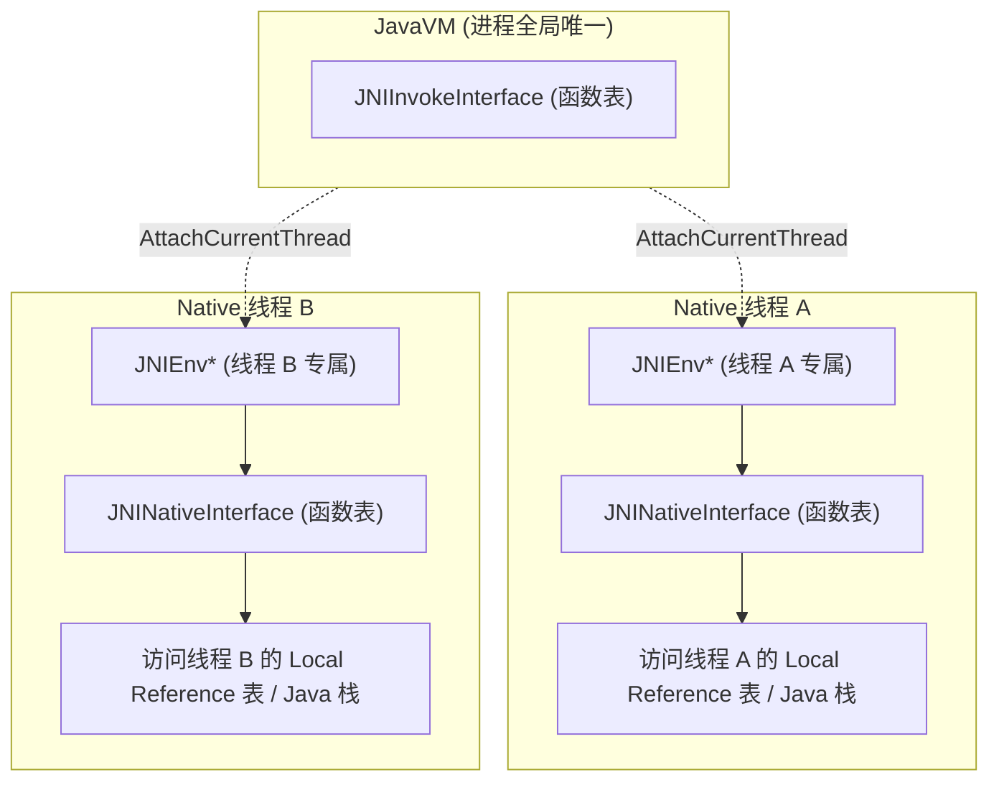
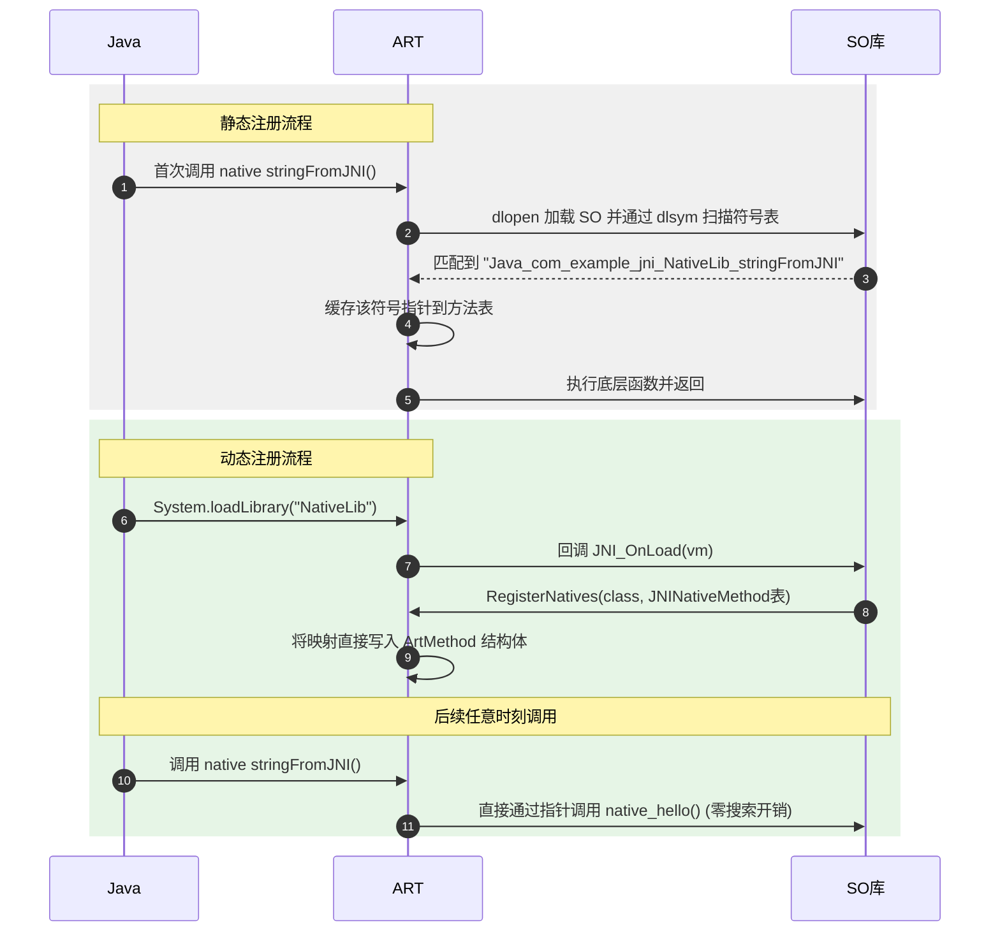
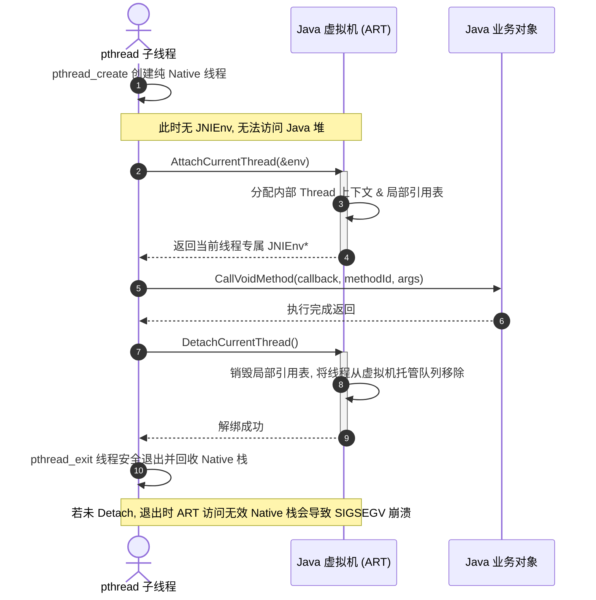

# JNI 基础

在 Android 系统的多语言混合架构中，JNI（Java Native Interface，Java 本地接口）处于承上启下的核心枢纽地位。无论是系统底层库的调用（如 MediaCodec、Skia 等图形与多媒体引擎），还是高安全性、高性能的第三方算法库、网络库（如 OpenSSL、FFmpeg）的集成，都离不开 JNI 的桥接作用。

本文将从 JNI 的核心架构设计出发，由浅入深地剖析数据类型映射、内存交互机制、引用管理、注册流程、跨线程附着及异常处理等底层技术细节，帮助开发者构建起系统化、无死角的 JNI 知识图谱。

---

## 一、 JNI 核心架构与桥梁机制

### 1. 什么是 JNI？
JNI 是 Java 平台标准版（Java SE）的一部分，是一套标准的编程接口。它允许 Java 虚拟机（JVM）或 Android 运行期环境（ART）内运行的 Java 代码，与使用 C、C++、汇编等其他编程语言编写的应用程序和库进行互操作。

JNI 的核心价值在于**打破 Java 沙箱环境的限制**：
*   **平台互操作性**：访问底层操作系统特定的 API 或硬件资源。
*   **性能提升**：将高计算密集型的任务（如图像处理、3D 渲染、音视频编解码、物理模拟）交给运行效率更高的机器码执行。
*   **代码复用**：复用海量且成熟 C/C++ 开源生态与既有资产（如 SQLite、OpenCV 等）。
*   **安全性**：将核心算法及密钥隐藏在二进制 SO 文件中，增加反编译与逆向工程的门槛。

### 2. JVM/ART 与 Native（C/C++）的物理与逻辑边界
Java 与 C/C++ 分属不同的运行时世界，它们在底层设计上存在巨大的“鸿沟”：

| 维度 | Java 世界（JVM / ART） | Native 世界（C / C++） |
| :--- | :--- | :--- |
| **内存管理** | 垃圾回收器（GC）自动管理，堆内存对象可被移动与整理。 | 手动申请与释放（`malloc/free`、`new/delete`），地址固定。 |
| **执行机制** | 解释执行、JIT（即时编译）或 AOT（预先编译）为字节码/机器码，受虚拟机监控。 | 机器码直接由物理 CPU 执行，具备不受限制的内存访问权限。 |
| **数据表示** | 对象有复杂的类头部信息（如 Mark Word、Klass Word），类型安全，不暴露物理指针。 | 扁平的内存布局，支持任意物理内存指针转换与位操作。 |
| **异常机制** | 虚拟机级捕获与分发（`Exception`），能够精确回溯调用栈。 | 系统级信号（如 `SIGSEGV`、`SIGABRT`），未捕获即导致整个进程崩溃。 |

JNI 正是建立在这两个世界之间的一道“海关”。任何跨越边界的数据、调用和控制流，都必须严格遵守 JNI 规范的转换流程。

### 3. JNIEnv 与 JavaVM 的双指针架构
在 C/C++ 代码中，我们接触最频繁的两个核心结构是 `JavaVM` 和 `JNIEnv`。

#### (1) JavaVM：虚拟机的全局代表
`JavaVM` 代表了整个 Java 虚拟机的实例。在单个进程中，通常只允许存在一个 `JavaVM` 实例（Android 进程也是如此）。
*   **全局性**：它是跨线程共享的，任何线程都可以通过持有该指针来与虚拟机实例进行基本的通信。
*   **核心职责**：创建、销毁 JVM 实例，以及将当前 Native 线程附着（Attach）到虚拟机上或从其解绑（Detach）。

在 `jni.h` 中，`JavaVM` 在 C 语言和 C++ 语言下的定义略有差异。C 语言中使用的是指向函数表指针的指针（双重指针），而 C++ 中则进行了面向对象的封装：

```c
/* jni.h 中关于 JavaVM 的定义片断 */
#ifdef __cplusplus
typedef JavaVM_ JavaVM;
struct JavaVM_ {
    const struct JNIInvokeInterface_* functions;
    jint DestroyJavaVM() { return functions->DestroyJavaVM(this); }
    jint AttachCurrentThread(void** penv, void* args) { return functions->AttachCurrentThread(this, penv, args); }
    jint DetachCurrentThread() { return functions->DetachCurrentThread(this); }
    jint GetEnv(void** penv, jint version) { return functions->GetEnv(this, penv, version); }
    // ...
};
#else
typedef const struct JNIInvokeInterface_* JavaVM;
#endif
```

#### (2) JNIEnv：线程专属的运行上下文
`JNIEnv` 代表了 Java 执行环境的上下文。
*   **线程私有性**：`JNIEnv` 内部包含了与当前线程相关的状态。它**绝对不能在多线程之间共享或传递**。
*   **核心职责**：提供了几乎所有 JNI 交互相关的接口，包括创建 Java 对象、访问 Java 字段、调用 Java 方法、操作数组/字符串、抛出异常以及管理 JNI 引用等（共有超过 200 个 API 函数）。

其底层实现同样是一个指向“JNI 函数表”的指针。由于它是线程本地的，虚拟机可以通过它快速获取当前线程的上下文、堆栈信息和局部引用表。



---

## 二、 数据类型映射与交互底层机制

在 JNI 调用中，Java 的所有类型都必须翻译成 Native 能理解的 C/C++ 类型。`jni.h` 头文件中定义了这一整套映射规则。

### 1. 基本类型映射
Java 的基本数据类型（如 `int`、`boolean`、`byte` 等）在 Native 层有完全对应的同等大小标量类型：

| Java 类型 | JNI 类型 (Native) | C/C++ 实际定义 (`jni.h`) | 字节大小 (位宽) |
| :--- | :--- | :--- | :--- |
| `boolean` | `jboolean` | `unsigned char` | 8 位 (无符号) |
| `byte` | `jbyte` | `signed char` | 8 位 (有符号) |
| `char` | `jchar` | `unsigned short` | 16 位 (无符号，Unicode) |
| `short` | `jshort` | `short` | 16 位 (有符号) |
| `int` | `jint` | `int` | 32 位 (有符号) |
| `long` | `jlong` | `long long` 或 `int64_t` | 64 位 (有符号) |
| `float` | `jfloat` | `float` | 32 位 |
| `double` | `jdouble` | `double` | 64 位 |

在 Native 代码中，我们可以直接将 `jint` 当作普通 `int` 处理，或将 `jdouble` 当作 `double` 处理，因为它们在物理内存结构上是完全一致的。

### 2. 引用类型映射与“不透明句柄”本质
与基本类型不同，Java 引用类型（如 `Object`、`Class`、`String`、`Array`）在 Native 层不能直接被 C/C++ 访问。

```c
/* jni.h 中关于引用类型的定义片断 */
#ifdef __cplusplus
class _jobject {};
class _jclass : public _jobject {};
class _jstring : public _jobject {};
class _jarray : public _jobject {};
// ...
typedef _jobject* jobject;
typedef _jclass* jclass;
typedef _jstring* jstring;
typedef _jarray* jarray;
#else
typedef void* jobject;
typedef void* jclass;
typedef void* jstring;
typedef void* jarray;
#endif
```

#### 句柄（Opaque Reference）本质
从上述定义可以看出，在 C++ 中，`jobject` 等被定义为空类指针；在 C 中，它们直接被定义为 `void*`。
这表明 **JNI 引用类型在 Native 层是不透明的句柄**。
*   它并不是 Java 堆中对象的真实物理内存地址。
*   它实际上是虚拟机内部某个“句柄表”或“指针映射表”的索引（指针的指针）。
*   **原因**：Java 虚拟机的垃圾回收器（GC）在进行垃圾回收与整理（如标记-整理算法、复制算法）时，会频繁移动 Java 堆中的对象，更新其物理内存地址。如果 JNI 允许 C++ 持有 Java 对象的物理内存指针，一旦发生 GC，C++ 中的指针就会变成野指针。通过不透明句柄的设计，当对象被移动时，虚拟机只需要更新句柄表中的物理指向，而 Native 持有的 `jobject` 句柄数值保持不变，从而保证了内存安全。

### 3. String 类型的转换与底层处理机制
Java 中的 `String` 在内存中是 UTF-16 编码（Android 9 之后可能根据内容进行 Compact 优化为 Latin-1/UTF-16 混合），而 C/C++ 中常用的是以 `\0` 结尾的 ASCII 或 UTF-8 编码。两者交互必须进行字符集转换。

#### (1) GetStringUTFChars 与 ReleaseStringUTFChars
这是最常用的字符串交互 API：

```cpp
extern "C"
JNIEXPORT void JNICALL
Java_com_example_jni_MainActivity_printString(JNIEnv *env, jobject thiz, jstring j_str) {
    jboolean isCopy;
    // 获取 UTF-8 编码的 C 风格字符串
    const char *c_str = env->GetStringUTFChars(j_str, &isCopy);
    if (c_str == nullptr) {
        return; // 内存不足，抛出 OutOfMemoryError
    }
    
    LOGI("Received string: %s (isCopy: %d)", c_str, isCopy);
    
    // 释放资源
    env->ReleaseStringUTFChars(j_str, c_str);
}
```

##### 核心参数 `isCopy` 的设计
`isCopy` 是一个布尔值指针。传入后，虚拟机底层会写入 `JNI_TRUE` 或 `JNI_FALSE`：
*   `JNI_TRUE`：代表当前返回的 `const char*` 指针指向的是在 Native 堆（C Heap）上**新分配并拷贝**出来的一份副本。
*   `JNI_FALSE`：代表当前返回的指针**直接指向 Java 堆中字符串的原始内存**。此时，虚拟机会暂时锁定该内存（Pin 机制），防止 GC 移动该字符串对象。
*   **开发约束**：无论 `isCopy` 返回的是 `JNI_TRUE` 还是 `JNI_FALSE`，在完成字符串操作后，都**必须成对调用 `ReleaseStringUTFChars`**。如果是拷贝的，它负责释放 Native 堆上的内存；如果是引用的，它负责解除 JVM 对该 Java 字符串的锁定，使其能够重新参与 GC 移动。否则，将直接导致 **Native 内存泄漏** 或 **Java 堆垃圾无法回收**。

##### Modified UTF-8 (MUTF-8) 陷阱
`GetStringUTFChars` 返回的并不是标准的 UTF-8，而是 **Modified UTF-8 (修正版 UTF-8)**：
*   **空字符处理**：在标准 UTF-8 中，空字符 `\u0000` 编码为单个字节 `0x00`。但在 MUTF-8 中，它被编码为两个字节 `0xC0 0x80`。这是为了确保字符串中不会中途出现 `0x00`（即 `\0`），因为 C/C++ 中字符数组以 `\0` 作为结束标志。如果是标准 UTF-8，Java 字符串中包含的空字符会提前截断 C 字符串。
*   **补充字符（Supplementary Characters）**：如 Emoji 表情等超过 U+FFFF 的字符，在 MUTF-8 中是先转成代理对（Surrogate Pairs），再分别进行 UTF-8 编码，最终占用 6 个字节。而标准 UTF-8 直接用 4 字节表示。
*   **防范措施**：当需要与外部标准 UTF-8 的网络服务、数据库或三方库通信时，若直接使用 `GetStringUTFChars` 获取的字符流可能会发生乱码或解析失败。在涉及表情符号或多国语言的高要求场景下，建议在 Java 层先将 String 转换为 `byte[]`（标准 UTF-8 编码），再将 `byte[]` 传入 Native 层。

#### (2) GetStringChars 与 GetStringCritical（临界区机制）
*   `GetStringChars`：获取的是 UTF-16 编码的 `const jchar*` 数组，同样遵循 `isCopy` 逻辑。
*   `GetStringCritical`：**极其高效的获取通道**。它极力避免拷贝，并尽可能直接返回 Java 堆中字符串对象的指针。
    *   **限制条件**：在调用 `GetStringCritical` 和 `ReleaseStringCritical` 之间的代码区域被称为**临界区（Critical Section）**。在临界区内，当前线程**绝对不能调用任何可能会引起当前线程阻塞的 JNI 函数，也不能分配任何新的 Java 对象**。因为此时 JVM 极有可能挂起了 GC，如果此时当前线程因其他 JNI 调用进入阻塞，而其他线程又在等待 GC 结束，将会瞬间引发**全局死锁（Deadlock）**。

### 4. 数组交互机制与锁机制
Java 数组（如 `int[]`）在 C/C++ 中表现为 `jintArray`。

```cpp
extern "C"
JNIEXPORT void JNICALL
Java_com_example_jni_MainActivity_sumArray(JNIEnv *env, jobject thiz, jintArray j_arr) {
    jsize len = env->GetArrayLength(j_arr);
    
    // 获取数组的 Native 映射指针
    jint *elems = env->GetIntArrayElements(j_arr, nullptr);
    if (elems == nullptr) {
        return; // OOM
    }
    
    jint sum = 0;
    for (int i = 0; i < len; ++i) {
        sum += elems[i];
        elems[i] *= 2; // 修改数组元素
    }
    
    // 释放并选择回写策略
    env->ReleaseIntArrayElements(j_arr, elems, JNI_COMMIT); 
}
```

#### (1) GetIntArrayElements 与 ReleaseIntArrayElements
获取数组的底层实现非常依赖虚拟机的具体策略：
*   **Pin 机制（锁定）**：如果数组内存连续且当前 GC 策略支持，虚拟机直接锁定 Java 数组在堆上的物理地址并返回。
*   **Copy 机制（拷贝）**：如果虚拟机不能锁定（例如正在整理碎片或堆内存布局不连续），它将在 Native 堆（C Heap）分配空间，并将 Java 数组的全部数据拷贝过去。

#### (2) ReleaseIntArrayElements 的第三个参数：释放与回写控制
在释放数组时，`ReleaseIntArrayElements` 的最后一个参数极为关键，它决定了数据是否回写到 Java 堆以及如何释放 Native 内存：

| 参数模式值 | 底层动作行为 | 适用场景 |
| :--- | :--- | :--- |
| `0` | 将 Native 缓冲区的内容**拷贝回** Java 数组中，并**释放** Native 缓冲区。 | **默认且最常用**。对数组既有读取又有修改，且修改需要同步到 Java。 |
| `JNI_COMMIT` | 将 Native 缓冲区的内容**拷贝回** Java 数组中，但**不释放** Native 缓冲区。 | 适合多次、分阶段将 Native 数据同步回 Java，后续还会继续操作该 C 数组。最后仍需用 `0` 彻底释放。 |
| `JNI_ABORT` | **不拷贝**回 Java 数组，直接**释放** Native 缓冲区。 | **极高实用性**。如果 Native 只是**读取**了数组，没有进行任何修改，或者修改不需要保留，使用该参数可彻底免除回写 Java 堆的性能损耗。 |

#### (3) GetPrimitiveArrayCritical 极速数组访问
与字符串类似，`GetPrimitiveArrayCritical` 用于极其敏捷地获取数组指针。
它通过暂时挂起虚拟机垃圾回收（GC Run），使 Native 线程能够直接访问 Java 堆内原始数组内存。同样必须严格遵守**临界区内不进行其他 JNI 调用、不分配 Java 对象、迅速退出**的开发准则，否则会导致严重的挂起和死锁崩溃。

---

## 三、 JNI 引用管理机制（内存泄漏与崩溃防御）

JNI 引用管理是 NDK 开发中最容易导致 JVM 崩溃（`JNI DETECTED ERROR IN ACTIVE THREAD`）与内存泄漏的重灾区。JNI 引用主要分为三类：**局部引用**、**全局引用**和**弱全局引用**。

### 1. 局部引用（Local Reference）
局部引用是 JNI 中最常见的引用类型。所有通过 JNI 接口（如 `NewObject`、`FindClass`、`GetObjectField`、`NewStringUTF` 等）返回的 Java 对象指针，默认都是局部引用。

#### (1) 特性与局限
*   **生命周期绑定**：局部引用只在当前 Native 函数调用的生命周期内有效。一旦 Native 函数返回 Java 层，这些局部引用就会被虚拟机自动销毁。
*   **线程隔离**：局部引用只在创建它的线程中有效，**绝对不能跨线程传递和复用**。
*   **不能跨方法持久化**：不能将局部引用赋值给 Native 层的全局变量/静态变量并在后续的方法调用中使用它。

#### (2) 局部引用表容量上限与溢出崩溃
在 ART/JVM 中，局部引用是通过一个名为**内部局部引用表（Indirect Reference Table, IRT）**的结构来管理的。
*   **容量限制**：为了防止 Native 代码失控地消耗虚拟机资源，局部引用表是有容量限制的。在 Android 的 ART 虚拟机中，非 JNI 活跃的 Java 线程进入 Native 后，局部引用表容量通常被严格限制为 **512**（有些后台或主线程上限会动态扩容到 **5120**，但极不稳定）。
*   **溢出后果**：一旦 Native 循环创建对象（例如在大循环中解析大 json、处理图片像素），未及时释放的局部引用数量超过此上限，虚拟机将直接抛出类似以下的致命崩溃，并强制终止进程：
    ```text
    JNI ERROR (app bug): local reference table overflow (max=512)
    Failed added to local reference table, table size=512
    ```

#### (3) 显式释放 `DeleteLocalRef` 的金科玉律
虽然局部引用会在函数返回时被虚拟机回收，但在以下三种情况下，**必须显式调用 `DeleteLocalRef` 提前释放**：
*   **在循环中创建 Java 对象**：
    ```cpp
    for (int i = 0; i < 1000; i++) {
        jstring local_str = env->NewStringUTF("temp");
        // 使用 local_str ...
        env->DeleteLocalRef(local_str); // 必须！否则在第 512 次循环前就会崩溃
    }
    ```
*   **编写公共工具类函数**：在 Native 封装的辅助函数中创建的临时局部引用，应在函数退出前全部清理。否则，如果调用链很长，会在调用源累积大量的局部引用。
*   **持有了巨大的 Java 对象**（如 `byte[]` 图像数组或大 `Bitmap`）：虽然函数快结束了，但为了让 GC 能尽早回收这个巨大的对象以避免 OOM，应在其使用完毕的第一时间手动 `DeleteLocalRef`。

#### (4) 局部引用帧管理：PushLocalFrame 与 PopLocalFrame
如果一个 Native 函数内需要创建大量的临时引用，手动一个个 `DeleteLocalRef` 会使代码极度臃肿。此时可以使用引用帧机制进行批量管理：

```cpp
// 创建一个容量为 30 的局部引用栈帧
if (env->PushLocalFrame(30) == 0) {
    // 保护区：在这里创建的所有局部引用都属于这层新的栈帧
    jstring str1 = env->NewStringUTF("A");
    jstring str2 = env->NewStringUTF("B");
    
    // 如果需要将某个引用传递到外层，可通过 PopLocalFrame 传递回去
    jstring return_val = (jstring) env->PopLocalFrame(str1);
    
    // 此时 str2 以及其他在此帧中创建在大局引用都已被批量自动释放！
    // str1 的生命周期被延续，交给了外层栈帧，成为 return_val
}
```

### 2. 全局引用（Global Reference）
如果需要在 Native 层长期持有某个 Java 对象，使其跨越多个 Native 函数调用、甚至跨越多个线程，必须使用全局引用。

#### (1) 特性与创建
*   **生命周期长**：一旦创建，除非显式释放，否则在整个 Java 虚拟机的生命周期内（直到进程结束）都会一直存活。
*   **GC Root 效应**：全局引用会作为 JVM GC 的 **GC Root** 节点。这意味着它所引用的 Java 对象及其关联的整棵对象树，都绝对无法被 GC 回收。
*   **跨线程**：可以安全地在多个线程中传递和并发访问。

```cpp
static jclass g_activity_class = nullptr; // 静态变量，跨方法使用

void init(JNIEnv *env, jobject activity) {
    jclass local_class = env->GetObjectClass(activity);
    // 从局部引用提升为全局引用
    g_activity_class = (jclass) env->NewGlobalRef(local_class);
    // 销毁临时的局部引用
    env->DeleteLocalRef(local_class);
}

void process(JNIEnv *env) {
    if (g_activity_class != nullptr) {
        // 安全使用全局引用
    }
}

void destroy(JNIEnv *env) {
    if (g_activity_class != nullptr) {
        // 必须手动释放，否则将永久内存泄漏
        env->DeleteGlobalRef(g_activity_class);
        g_activity_class = nullptr;
    }
}
```

#### (2) 致命误区：忘记 Release 与物理回收
在 Native 层的 C/C++ 内存空间，**没有任何自动垃圾回收机制**。如果开发者在业务结束时忘记调用 `DeleteGlobalRef`，对应的 Java 对象将永远留存在 Java 堆中，极易引起应用**严重的 Java 内存泄漏与 Native 内存膨胀**。

### 3. 弱全局引用（Weak Global Reference）
弱全局引用是 JNI 版本的 `WeakReference`。

#### (1) 特性与创建
*   它像全局引用一样可以跨方法、跨线程复用。
*   **不阻碍 GC**：它不会阻止所引用的 Java 对象被 GC 回收。如果该 Java 对象没有其他强引用存在，下次 GC 时该对象仍会被正常清理。

```cpp
static jweak g_weak_activity = nullptr;

void setWeakRef(JNIEnv *env, jobject activity) {
    g_weak_activity = env->NewWeakGlobalRef(activity);
}
```

#### (2) 弱引用存活检测与并发安全转换
在使用弱全局引用时，必须先检测其指向的对象是否已被 GC 回收。
*   **检测方法**：使用 `IsSameObject(env, w_ref, nullptr)`。如果返回 `JNI_TRUE`，代表对象已被回收。
*   **并发冲突问题（关键悬挂）**：如果直接先检测后使用，在多线程环境下可能会发生竞争：检测时对象还存活着，但在你准备调用其方法的瞬间，GC 刚好执行并回收了它，这会导致空指针甚至虚拟机崩溃。
*   **最佳实践**：**在使用弱全局引用前，先将其提升为局部强引用**。如果提升成功（返回不为 `nullptr`），则该局部引用会锁定对象（在当前局部栈帧生命周期内不会被 GC 清理），确保了后续调用的安全性。

```cpp
void runTask(JNIEnv *env) {
    if (g_weak_activity == nullptr) return;
    
    // 尝试将弱全局引用提升为局部强引用
    jobject local_ref = env->NewLocalRef(g_weak_activity);
    if (local_ref != nullptr) {
        // 提升成功，local_ref 作为强引用保证了在此期间对象绝对不会被 GC 销毁
        jclass clazz = env->GetObjectClass(local_ref);
        // 执行业务逻辑...
        env->DeleteLocalRef(clazz);
        env->DeleteLocalRef(local_ref); // 释放局部强引用，允许对象再次被 GC
    } else {
        // 提升失败，说明 Java 对象已被回收
        LOGW("Java object has been garbage collected.");
    }
}
```

---

## 四、 静态注册与动态注册机制对比

为了将 Java 声明的 `native` 方法与 C/C++ 中的具体函数实现关联起来，JNI 提供了两种注册机制。

### 1. 静态注册
静态注册是最传统的 JNI 注册方式，它基于**约定的命名规则**和**运行时符号搜索**。

#### (1) 映射原理与符号规则
静态注册要求 C/C++ 层的函数名必须严格按照如下格式命名：
`Java_包名_类名_方法名`（包名中的点 `.` 替换为下划线 `_`）。如果方法中包含下划线或重载，规则会更加复杂（如引入 `__`）。

当 Java 层首次执行 `native` 方法时，虚拟机会通过加载的 `.so` 库中的动态符号表，使用 `dlsym` 机制根据上述特定命名的字符串搜索对应的 C/C++ 函数地址，并将其绑定到 Java 方法的指针上。

```java
package com.example.jni;
public class NativeLib {
    public native String stringFromJNI();
}
```
对应的 C++ 命名：
```cpp
extern "C" JNIEXPORT jstring JNICALL
Java_com_example_jni_NativeLib_stringFromJNI(JNIEnv* env, jobject thiz) {
    return env->NewStringUTF("Hello from JNI static!");
}
```

#### (2) 局限性与致命缺陷
1.  **动态链接搜索开销**：首次调用该 native 方法时，虚拟机需要执行复杂的动态符号查找（`dlsym` 遍历符号表），这会导致第一次调用产生明显的延迟（性能开销）。
2.  **混淆（ProGuard / R8）的灾难**：如果开启了混淆，Java 层的类名和包名会被混淆成 `a.b.c`。此时，虚拟机会去搜索 `Java_a_b_c_stringFromJNI`，但 SO 库中的函数名依然是 `Java_com_example_jni_NativeLib_stringFromJNI`。由于符号不匹配，会立即抛出致命的 `UnsatisfiedLinkError`。
    *   *规避方案*：必须在 `proguard-rules.pro` 中加入 `-keep` 规则，强制不混淆所有包含 native 方法的类和方法。这不仅使 Java 层的代码暴露无遗，也给逆向分析留下了极大的线索。
3.  **函数名冗长晦涩**，如果包名很长，C 函数名会极其臃肿。

### 2. 动态注册
动态注册是工业级 NDK 开发的首选。它在 SO 库被加载的生命周期入口处，显式向虚拟机注册 Java 方法与 C/C++ 函数的映射关系。

#### (1) 核心原理：JNINativeMethod 与 RegisterNatives
当 Java 层执行 `System.loadLibrary("xxx")` 时，虚拟机会加载该 SO 库，并自动回调库中的 `JNI_OnLoad` 函数。在 `JNI_OnLoad` 中，我们利用 `JNINativeMethod` 结构体数组定义映射，并调用 `RegisterNatives` 完成直接绑定。

```cpp
#include <jni.h>
#include <string>

// 1. 定义真实的 C++ 业务函数，命名完全自由，无需遵循 Java_ 包名前缀
jstring native_hello(JNIEnv* env, jobject thiz) {
    return env->NewStringUTF("Hello from JNI dynamic!");
}

// 2. 准备 JNINativeMethod 映射表
static const JNINativeMethod g_methods[] = {
    // Java 中的方法名, 方法签名, C++ 对应的函数指针 (强制转换为 void*)
    {"stringFromJNI", "()Ljava/lang/String;", (void*) native_hello}
};

// 3. 动态注册的核心逻辑
int registerNativeMethods(JNIEnv* env, const char* className, 
                          const JNINativeMethod* methods, int numMethods) {
    jclass clazz = env->FindClass(className);
    if (clazz == nullptr) {
        return JNI_ERR;
    }
    // 显式向虚拟机注册映射表
    if (env->RegisterNatives(clazz, methods, numMethods) < 0) {
        return JNI_ERR;
    }
    return JNI_OK;
}

// 4. SO 库加载入口函数
JNIEXPORT jint JNICALL JNI_OnLoad(JavaVM* vm, void* reserved) {
    JNIEnv* env = nullptr;
    if (vm->GetEnv((void**) &env, JNI_VERSION_1_6) != JNI_OK) {
        return JNI_ERR;
    }
    
    const char* className = "com/example/jni/NativeLib";
    if (registerNativeMethods(env, className, g_methods, 
                              sizeof(g_methods) / sizeof(g_methods[0])) < 0) {
        return JNI_ERR;
    }
    
    return JNI_VERSION_1_6; // 返回支持的 JNI 版本
}
```

#### (2) 动态注册的压倒性优势
1.  **极高的运行性能**：在 `JNI_OnLoad` 执行时，映射关系就已经直接写入到虚拟机内部的方法映射表中（直接覆写了 `ArtMethod` 结构体中的 `entry_point_from_jni_` 指针）。后续调用 native 方法时，虚拟机可以直接跳转，**零符号搜索开销**。
2.  **完美的混淆支持**：即使 Java 层的类名被 R8 混淆了，我们只需要在 `JNI_OnLoad` 中通过混淆后的类名动态注册即可（或在混淆字典中只保留类名，但方法名可以混淆，动态注册依然生效，无需再保留全部方法名符号）。
3.  **极致的安全防护**：
    *   在动态注册下，C/C++ 业务函数的函数名是完全随机和隐蔽的。
    *   我们可以在 Android NDK 构建脚本中加入 `-fvisibility=hidden` 编译参数。这样，SO 库编译出的动态符号表中，将**完全抹除（隐藏）**我们内部的 C++ 业务函数符号。逆向分析人员使用 `readelf` 或 IDA Pro 打开 SO 文件时，完全找不到类似 `stringFromJNI` 或 `native_hello` 的符号，这给逆向反编译增加了极高难度。
4.  **解耦与代码整洁**：Native 代码命名完全符合 C/C++ 编程规范，彻底摆脱冗长、格式怪异的 `Java_...` 命名限制。



---

## 五、 跨线程调用与 JVM 附着机制

在多线程开发中，经常会有这样的场景：我们在 Native 层创建了一个 POSIX 线程（使用 `pthread_create`），用于在后台执行耗时的网络请求、下载或渲染任务。任务完成后，该子线程需要回调 Java 层的某个方法（如更新 UI 状态或通知数据就绪）。

在跨线程调用 Java 方法时，由于环境差异，存在严苛的技术限制。

### 1. JNIEnv 的 Thread Local 本质
最常见的初学者崩溃是：**把主线程持有的 `JNIEnv*` 指针保存为全局静态变量，然后直接在子线程中使用它。**
调用时，程序会瞬间崩溃，并抛出类似下方的致命异常：
```text
Fatal signal 11 (SIGSEGV), code 1 (SEGV_MAPERR), fault addr 0x...
JNI DETECTED ERROR IN ACTIVE THREAD: thread ... using JNIEnv* from thread ...
```

#### 底层原理
在虚拟机内部，`JNIEnv` 在物理实现上与 POSIX 线程的 **Thread Local Storage (TLS, 线程局部存储)** 紧密绑定（通过类似 `pthread_getspecific` 的机制实现）。
*   每个线程都有自己专属的虚拟机调用栈、局部引用表以及异常挂起标志。
*   `JNIEnv` 本质上是一个指向线程专属上下文的“局部视窗”。如果线程 A 拿着线程 B 的 `JNIEnv` 去访问虚拟机的 API，虚拟机会由于读取了错误的线程上下文地址、错误的局部引用表，从而发生不可控的野指针写入或非法内存越界访问。

### 2. JavaVM 的全局性与跨线程管理
虽然 `JNIEnv` 不能跨线程，但 `JavaVM` 指针是全局合法的、可以跨线程共享的。我们可以通过全局持有的 `JavaVM*` 指针，动态获取当前线程专属的 `JNIEnv*`。

### 3. POSIX 子线程附着 (AttachCurrentThread)
由 Native 代码通过 `pthread_create` 创建的子线程，是一个纯粹的操作系统级线程，对 Java 虚拟机（ART）而言是完全不可见的“异类”。该子线程没有分配任何 JVM 运行所需的上下文、线程栈和局部引用表。

如果该 Native 子线程想要调用 Java 方法，必须先**向虚拟机完成注册，将自己附着（Attach）到虚拟机上**，使其转换为一个被 JVM 托管的线程。

```cpp
#include <pthread.h>
#include <jni.h>

// 全局持有的 JavaVM
JavaVM* g_vm = nullptr;
// 全局持有的回调对象 (必须是全局引用)
jobject g_callback_obj = nullptr;
jmethodID g_on_success_mid = nullptr;

// 保存 JavaVM 的入口 (一般在 JNI_OnLoad 中获取)
JNIEXPORT jint JNICALL JNI_OnLoad(JavaVM* vm, void* reserved) {
    g_vm = vm;
    return JNI_VERSION_1_6;
}

// 线程执行函数
void* native_worker_thread(void* args) {
    JNIEnv* env = nullptr;
    
    // 1. 将当前 Native 线程附着到 JavaVM，获取当前线程专属的 JNIEnv
    jint res = g_vm->AttachCurrentThread(&env, nullptr);
    if (res != JNI_OK || env == nullptr) {
        LOGE("Failed to attach current thread to JVM");
        pthread_exit(nullptr);
    }
    
    // 2. 此时可以安全地通过 env 调用 Java 方法
    jstring msg = env->NewStringUTF("Data processed successfully by native thread!");
    env->CallVoidMethod(g_callback_obj, g_on_success_mid, msg);
    env->DeleteLocalRef(msg); // 记得清理局部引用
    
    // 3. 善后处理：必须解除附着！
    g_vm->DetachCurrentThread();
    
    pthread_exit(nullptr);
}
```

### 4. 为什么线程销毁前必须 DetachCurrentThread？
**如果不调用 `DetachCurrentThread` 立即解绑，将会导致极其严重的系统性崩溃或资源泄露！**

#### 崩溃与泄露机理
1.  **ART 致命崩溃**：当 POSIX 线程退出时，操作系统的 `pthread` 会清理回收该线程的 Native 物理栈空间。但因为该线程没有 detach，JVM（ART）内部依然维持着对该线程的引用，并在内部线程列表中认为它处于“Runnable”或“Blocked”状态。当 JVM 尝试做垃圾回收（GC）需要挂起所有线程（Stop The World）时，虚拟机会尝试向这个已经被操作系统销毁的线程发送挂起信号，或者去读取其已经被回收的物理栈，从而瞬间触发 **Segment Fault 崩溃**。
2.  **内存泄露（Thread Leaks）**：JVM 内部与该线程关联的 `Thread` 对象、`ThreadGroup`、局部引用表等内存结构将彻底失去释放的机会，造成严重的 JVM 内存泄漏。
3.  **GC 永久挂起（ANR）**：在某些 ART 版本中，虚拟机等待一个已经消亡的线程响应 GC 挂起指令，会导致整个 APP 陷入永久等待，引发系统级的 ANR（Application Not Responding）。

#### 最佳实践：使用 `pthread_key_create` 析构自动 Detach
在复杂的工程中，Native 线程的退出可能由于异常分支、尽早返回等原因极易漏掉 `DetachCurrentThread` 的显式调用。我们可以利用 POSIX 线程的线程私有数据（TSD）和析构函数，实现**线程消亡时自动自动解绑 Detach**：

```cpp
static pthread_key_t g_thread_key;

// 线程退出时由系统自动调用的析构函数
void detach_thread_destructor(void* value) {
    JNIEnv* env = (JNIEnv*)value;
    if (env != nullptr) {
        JavaVM* vm = nullptr;
        env->GetJavaVM(&vm);
        if (vm != nullptr) {
            vm->DetachCurrentThread();
            LOGI("Thread successfully detached automatically via destructor.");
        }
    }
}

// 库初始化时调用（例如在 JNI_OnLoad）
void init_thread_key() {
    pthread_key_create(&g_thread_key, detach_thread_destructor);
}

// 在子线程开始附着的地方
void attach_current_thread_safely() {
    JNIEnv* env = nullptr;
    if (g_vm->AttachCurrentThread(&env, nullptr) == JNI_OK) {
        // 将 env 指针存入 TLS 键中。只要该键对应的值不为 nullptr，
        // 线程退出时，操作系统会自动回调 detach_thread_destructor
        pthread_setspecific(g_thread_key, env);
    }
}
```



---

## 六、 JNI 异常处理机制

Java 语言有严格的异常捕获处理机制（`try-catch-finally`），而 C/C++ 语言在 Native 层则没有这种原生的、能与虚拟机直接互通的捕获手段。两者对异常的处理逻辑存在本质差异。

### 1. Java 异常在 Native 中的生存状态
**核心警示：当 Native 代码通过 JNI 调用 Java 方法，而该 Java 方法内部抛出了异常时，Native 层的 C/C++ 执行流绝对不会立刻中断！**

#### 底层行为
*   当异常被抛出时，虚拟机会在当前线程的内部结构中设置一个“异常挂起标志（Pending Exception）”，并将异常对象保存在特定的寄存器或变量中。
*   Native 层的 C/C++ 代码是一行行被物理 CPU 执行的机器码。除非 Native 显式去检测，否则 Native 根本不知道发生了 Java 异常，它会**若无其事地继续向下执行后续的 C/C++ 代码**。

#### 致命风险：未处理异常引发的“双重崩溃”
如果 Native 代码在明知（或未知）有 Pending Exception 的情况下，继续调用大部分其他 JNI 函数（例如尝试通过 `env->NewStringUTF` 创建字符串，或调用其他 Java 方法），ART 虚拟机会认为这是一个极其严重的逻辑错误，并会立即产生**崩溃（Abort）**：
```text
JNI DETECTED ERROR IN ACTIVE THREAD: pending exception was thrown in call to ...
```
因此，在调用任何可能会抛出异常的 Java 方法后，Native 必须尽早检测并妥善处理异常。

### 2. 异常检测与清除
JNI 提供了两个用于检测异常的 API：

#### (1) ExceptionOccurred 与 ExceptionCheck
*   `ExceptionOccurred(env)`：返回一个 `jthrowable` 引用。如果当前线程有异常挂起，它会返回该异常对象的局部引用；若无异常，则返回 `nullptr`。可以通过它获取异常的详细信息（如调用其 `toString()` 方法）。
*   `ExceptionCheck(env)`：返回 `jboolean`（`JNI_TRUE` / `JNI_FALSE`）。它非常轻量，不需要在局部引用表中创建新的局部引用。如果只是想简单快速地判断是否发生异常，推荐使用 `ExceptionCheck`；只有当确实需要分析异常对象时，才使用 `ExceptionOccurred`。

#### (2) ExceptionClear
*   `ExceptionClear(env)`：清除当前线程挂起的异常标志。调用此 API 后，虚拟机恢复正常状态，Native 线程又可以安全地调用其他 JNI 函数了。

### 3. 异常传递与重新抛出（最佳实践）
当 Native 捕获到 Java 异常时，合理的处理流程通常是：
1.  检测到异常挂起；
2.  清理当前函数在 Native 申请的局部引用、临界区锁或 Native 内存空间（防止泄露）；
3.  清除虚拟机的 Pending Exception（为了能够调用接下来的 JNI 函数）；
4.  根据业务需要，在 Native 内部消化，或者重新抛出一个自定义的、对 Java 层更有指导意义的异常。

#### 示例代码：异常处理与向上抛出
```cpp
// 向上抛出指定 Java 异常的辅助函数
void throwJavaException(JNIEnv *env, const char *exceptionClassName, const char *message) {
    jclass exClass = env->FindClass(exceptionClassName);
    if (exClass != nullptr) {
        // ThrowNew 会创建异常对象并在当前线程挂起它
        // 注意：执行完 ThrowNew 后，Native 依然需要立即 return 退出当前函数
        env->ThrowNew(exClass, message);
        env->DeleteLocalRef(exClass);
    }
}

extern "C"
JNIEXPORT void JNICALL
Java_com_example_jni_MainActivity_parseData(JNIEnv *env, jobject thiz, jobject parser_obj) {
    jclass parser_clazz = env->GetObjectClass(parser_obj);
    jmethodID do_parse_mid = env->GetMethodID(parser_clazz, "doParse", "()V");
    
    // 调用可能会抛出异常的 Java 方法
    env->CallVoidMethod(parser_obj, do_parse_mid);
    
    // 1. 快速检查是否有异常挂起
    if (env->ExceptionCheck()) {
        LOGE("Java doParse threw an exception!");
        
        // 获取并保留该异常，方便打印日志或做进一步判断
        jthrowable exception = env->ExceptionOccurred();
        
        // 2. 清除当前挂起的异常状态，以允许我们调用接下来的 JNI 方法
        env->ExceptionClear();
        
        // 3. 执行 Native 层的善后收尾工作，释放持有的 Native 资源，避免内存泄露
        env->DeleteLocalRef(parser_clazz);
        if (exception != nullptr) {
            env->DeleteLocalRef(exception);
        }
        
        // 4. 向上抛出一个更明确的 Java 异常，交由 Java 层的 try-catch 捕获
        throwJavaException(env, "java/io/IOException", "Parsing failed in Native wrapper.");
        return; // 必须立即终止 Native 执行流，返回 Java 层！
    }
    
    // 正常业务流
    env->DeleteLocalRef(parser_clazz);
}
```

---

## 七、 JNI 进阶设计技巧与工具链调试

### 1. 零拷贝交互：Direct ByteBuffer 机制
当 Java 层与 Native 层需要高频、大批量交换数据（例如每秒 60 帧的 4K 视频数据、大量传感器物理参数）时，传统的 `byte[]` 传递面临巨大的内存复制和 GC 锁性能损耗。
为了解决这一痛点，JDK 引入了 `Direct ByteBuffer`（直接字节缓冲区）。

#### 机制原理
*   `Direct ByteBuffer` 所指向的物理内存是直接在 **Native 堆（C Heap）** 上分配的，而不是在 Java 堆上。
*   Java 层持有的 `ByteBuffer` 对象内部仅仅保存了该 Native 物理内存的起始地址和大小。
*   **零拷贝通信**：
    *   在 Java 层，可以直接使用 `put()`、`get()` 进行基本读写。
    *   在 Native 层，通过 `env->GetDirectBufferAddress(j_buffer)` 可以**瞬间获取其真实的物理内存指针**。
    *   Native 对该内存的写入会实时反馈到 Java 层，全程**完全免去了堆内外数据拷贝**，并且因为其内存位于 Java 堆外，**完全不会增加 JVM GC 的标记与移动负担**。

```cpp
// Native 端获取 Direct ByteBuffer 的直接指针并写入数据
extern "C"
JNIEXPORT void JNICALL
Java_com_example_jni_MainActivity_fillBuffer(JNIEnv *env, jobject thiz, jobject j_buffer) {
    // 获取 Buffer 的起始物理内存地址
    void* buffer_address = env->GetDirectBufferAddress(j_buffer);
    // 获取 Buffer 的容量限制
    jlong capacity = env->GetDirectBufferCapacity(j_buffer);
    
    if (buffer_address == nullptr || capacity <= 0) {
        return; // 传入的不是 Direct ByteBuffer
    }
    
    // 直接向该内存写入数据，零拷贝！
    memset(buffer_address, 0xFF, (size_t)capacity);
}
```

### 2. 常见 JNI 崩溃的排查技巧 (ndk-stack 与 addr2line)
当 Native 层发生崩溃（如空指针解引用、数组越界、段错误 `SIGSEGV`）时，Android 系统的 Logcat 只会打印出一堆充满十六进制地址的 Tombstone 堆栈信息：

```text
*** *** *** *** *** *** *** *** *** *** *** *** *** *** *** ***
Build fingerprint: 'generic/sdk_gphone64_arm64/...'
pid: 12345, tid: 12345, name: com.example.jni  >>> com.example.jni <<<
signal 11 (SIGSEGV), code 1 (SEGV_MAPERR), fault addr 0x0
    #00 pc 000000000001bc38  /data/app/~~.../libnative-lib.so (process+56)
    #01 pc 000000000001be20  /data/app/~~.../libnative-lib.so (Java_com_example_jni_MainActivity_run+32)
```

若要在没有源代码符号表的情况下精确定位出错的代码行，必须借助于 NDK 工具链：

#### (1) 使用 ndk-stack 实时解析日志
`ndk-stack` 是 NDK 内置的一个命令行工具，它可以自动读取 Logcat 输入，并结合包含调试符号表的 SO 库（通常位于项目构建目录的 `build/intermediates/cmake/debug/obj/` 下），将十六进制地址在线翻译成具体的文件名和行号。

```bash
# 实时监控 Logcat 并翻译 Native 崩溃栈
adb logcat | ndk-stack -sym /path/to/your/project/app/build/intermediates/cxx/Debug/obj/arm64-v8a/
```

#### (2) 使用 addr2line 精准定位
如果已经拿到了 Tombstone 日志中的崩溃偏移地址（如上文中的 `#00 pc 000000000001bc38`），可以使用 NDK 提供的 `llvm-addr2line` 工具直接查阅代码行：

```bash
# 工具路径通常位于：$ANDROID_NDK_HOME/toolchains/llvm/prebuilt/darwin-x86_64/bin/llvm-addr2line
llvm-addr2line -C -f -e /path/to/libnative-lib.so 000000000001bc38
```
输出结果类似于：
```text
process(JNIEnv*, _jobject*)
/path/to/your/project/app/src/main/cpp/native-lib.cpp:42
```
这可以直接指出崩溃发生在 `native-lib.cpp` 的第 42 行，极大提升了调试与 Bug 修复的效率。

---

## 八、 总结与最佳实践准则

为编写出稳定、高性能、无内存泄漏的 JNI/NDK 代码，建议在日常开发中严格遵循以下准则：

1.  **成对释放原则**：所有的 `GetStringUTFChars` 与 `ReleaseStringUTFChars`、`Get***ArrayElements` 与 `Release***ArrayElements`、`NewGlobalRef` 与 `DeleteGlobalRef` 必须在逻辑上严格闭环并成对释放。
2.  **局部引用防溢出**：在循环中创建 Java 对象时，务必使用 `DeleteLocalRef` 或 `PushLocalFrame/PopLocalFrame` 进行按需释放。
3.  **线程隔离铁律**：永远不要跨线程传递 `JNIEnv`，子线程在操作前必须调用 `AttachCurrentThread` 附着到 JVM，并在线程退出前调用 `DetachCurrentThread` 进行释放。
4.  **异常检查即时性**：每次调用可能抛出异常的 Java 方法后，必须立即使用 `ExceptionCheck` 或 `ExceptionOccurred` 进行检查，且在清除 Pending 异常前，不要执行非安全的 JNI API 操作。
5.  **优先采用动态注册**：在商业项目中优先使用动态注册，不仅可以规避 `UnsatisfiedLinkError` 的混淆灾难，还能通过隐藏 Native 导出符号进一步提升 SO 库的安全性。
6.  **大吞吐首选 Direct ByteBuffer**：处理音视频、图片等大数据吞吐场景，应摒弃普通的 `byte[]` 拷贝传递，转而采用零拷贝的 Direct ByteBuffer 机制以实现最高的互操作效率。
