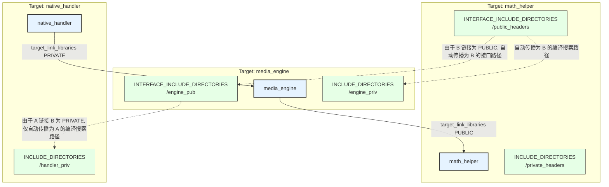
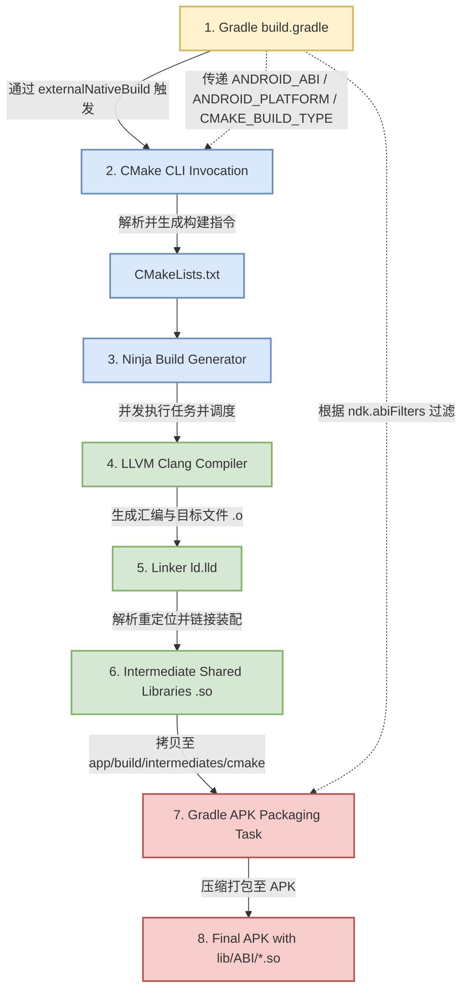

# CMake 语法与 NDK 构建体系深度剖析

在 Android NDK 开发的演进历程中，构建系统经历了从传统的 `ndk-build`（基于 `Android.mk` 和 `Application.mk`）向现代的 `CMake` 构建体系的彻底变革。CMake 目前已成为 Android Studio 官方默认且推荐的 C/C++ 构建工具。

理解 CMake 不仅是掌握几个常用指令，更要理解它作为**元构建系统（Meta-build System）**的设计哲学、它与 Android 编译链（LLVM Clang）的底层交互、它在二进制产物（ELF 格式）上的控制细节，以及它与 Gradle 构建生命周期的深度协同。

---

## 一、 CMake 的概念与现代 NDK 构建体系

### 1. 什么是 CMake 及其元构建机制
CMake 本质上**不是编译器**，也不是直接执行编译动作的构建工具（如 Make、Ninja）。它是一个**元构建系统生成器（Meta-build System Generator）**。

CMake 的核心工作流程是读取声明式的 `CMakeLists.txt` 配置文件，然后在不同的平台和环境下，生成对应构建系统所需的底层“工程文件”或“构建规约”（例如 Linux 下的 Makefile，Windows 下的 VS Solution，或是性能极佳的构建系统 Ninja 的 `build.ninja` 描述文件）。

在 Android NDK 的默认构建流程中，CMake 会为每一个配置的目标 ABI（如 `arm64-v8a`）生成一套 `build.ninja` 文件，最终由 **Ninja** 工具调用 NDK 中的 Clang 编译器来执行物理编译 and 链接。

```
                    ┌───────────────────┐
                    │  CMakeLists.txt   │
                    └─────────┬─────────┘
                              │ (CMake 解析)
                              ▼
                    ┌───────────────────┐
                    │   build.ninja     │ (为每个 ABI 生成的构建规约)
                    └─────────┬─────────┘
                              │ (Ninja 执行)
                              ▼
    ┌───────────────────────────────────────────────┐
    │ NDK Toolchain (LLVM Clang / Linker ld.lld)    │
    └───────────────────────┬───────────────────────┘
                            │ (物理编译与链接)
                            ▼
                    ┌───────────────────┐
                    │ .so / .a Binary   │ (最终二进制产物)
                    └───────────────────┘
```

---

### 2. 为什么 Android 淘汰 ndk-build (Android.mk) 转而全面采用 CMake？
传统的 `ndk-build` 是一套基于 GNU Make 语法实现的宏体系。尽管它在 Android 早期表现优异，但在大中型项目和现代工程实践中暴露出严重的底层缺陷，导致其最终被谷歌边缘化：

#### ① 全局变量污染与维护困境
`Android.mk` 的核心配置依赖大量的全局变量（如 `LOCAL_PATH`, `LOCAL_SRC_FILES`, `LOCAL_LDLIBS`）。在一个包含几十个 Native 模块的庞大工程中，由于 GNU Make 的全局作用域特性，前一个模块声明的变量极易泄露或覆盖后一个模块的变量。这需要开发者小心翼翼地在每个模块开头和结尾调用 `include $(CLEAR_VARS)`，不仅极易出错，而且让编译脚本的并行维护变得十分痛苦。

#### ② 跨平台生成能力的缺失
`ndk-build` 深度绑定了 Make 工具和类 Unix 的环境。一旦开发者试图在非 Unix 环境（例如没有安装 MinGW/Cygwin 的原生 Windows 宿主机）中进行构建，或者需要将同一套 C++ 代码编译到 iOS、Windows 或 macOS 平台时，`Android.mk` 便无法使用，必须为每个平台手写一套构建配置。而 CMake 作为通用的工业级跨平台构建工具，能够用同一份 `CMakeLists.txt` 无缝生成跨越 Android、iOS、Linux、Windows、macOS 乃至 WebAssembly 的项目工程。

#### ③ 现代 IDE 集成与智能提示的代差
现代 C++ 的集成开发环境（如 CLion、VS Code、Android Studio）依赖对编译选项、宏定义和头文件搜索路径的精确解析，以提供高精度的方法跳转、参数提示和实时语法检查。
* **CMake** 提供了标准的语义描述，并且支持输出 `compile_commands.json`（编译数据库）。IDE 可以直接读取该文件，获取每一个 `.cpp` 文件的精准编译命令（包括具体的编译宏、包含路径等），从而实现完美的智能提示。
* **ndk-build** 本质上是黑盒的 Make 宏执行，IDE 难以在静态下逆向推导出完整的依赖树和上下文，导致老项目中 Native 代码编写时经常出现红线伪报错、跳转失效等问题。

#### ④ 声明式构建与现代编译理念
`Android.mk` 偏向过程式和指令式，而 CMake 从 3.0 版本起，全面推行**面向对象/面向目标（Target-based）**的现代 CMake（Modern CMake）设计理念。它将编译任务抽象为“目标（Target）”与“属性（Property）”，通过属性传递来管理依赖关系，极大地提升了大型 C++ 项目的可维护性与模块化水平。

---

## 二、 CMake 核心基础语法与指令详解

在 NDK 开发中，一个合格篇幅的 `CMakeLists.txt` 必须以清晰、规范的方式配置各级指令。以下对 CMake 最核心的指令进行分门别类的深度剖析。

### 1. cmake_minimum_required 与策略机制（Policies）
```cmake
cmake_minimum_required(VERSION 3.22.1)
```
* **核心作用**：声明运行当前构建脚本所需的最低 CMake 版本。如果当前宿主机安装的 CMake 版本低于该设定，CMake 将直接拒绝构建并报错。
* **底层策略机制（CMake Policies）**：CMake 的不同版本之间存在行为变更（废弃旧指令、引入新行为）。CMake 依靠此指令来确保向下兼容性。当设置最低版本为 `3.22.1` 时，CMake 会将内部的所有行为策略（Policies）默认设置为该版本对应的状态。如果未声明最低版本，CMake 将以默认兼容模式运行，可能会在控制台抛出大量的 Policy 警告。例如，策略 `CMP0042` 控制 macOS 上的 RPATH 支持，`CMP0054` 控制 if 语句中对引用变量的展开方式，明确最低版本可以确保构建逻辑在不同的 CMake 执行环境下的行为完全一致。

---

### 2. project 与编译器探测
```cmake
project(AndroidNativeCore LANGUAGES C CXX)
```
* **核心作用**：定义项目的名称以及项目所使用的编程语言。
* **隐式变量注入**：当调用 `project(AndroidNativeCore)` 后，CMake 会自动在内存中注入一系列极其有用的全局只读变量：
  * `PROJECT_NAME`：当前项目名（值为 `"AndroidNativeCore"`）。
  * `PROJECT_SOURCE_DIR`：当前项目的根源文件目录的绝对路径。
  * `PROJECT_BINARY_DIR`：当前项目的构建输出目录的绝对路径。
  * `<projectName>_SOURCE_DIR`（如 `AndroidNativeCore_SOURCE_DIR`）。
* **语言声明（LANGUAGES）**：明确指出需要使用的编译器。如果不写，默认启用 `C` 和 `CXX`（C++）。显式声明可以让 CMake 在初始化时仅去检测对应的编译器（如 NDK 中的 Clang/Clang++）。
* **底层探测流**：在 NDK 环境下，CMake 会加载内置的 `CMakeDetermineCCompiler.cmake` 和 `CMakeDetermineCXXCompiler.cmake` 文件，通过探测 NDK 传入的工具链（如 Clang 编译器二进制），运行编译一个极简 C 文件的“冒烟测试”，验证编译器是否能正常工作并输出可执行二进制，随后把检测到的编译器路径、版本号和目标架构写入 `CMakeCache.txt` 中。

---

### 3. add_library (SHARED 与 STATIC 的区别及 ELF 产物差异)
```cmake
add_library(native_handler SHARED handler.cpp)
add_library(math_helper STATIC helper.cpp)
```
`add_library` 是 NDK 开发中最频繁使用的指令，用于将指定的源文件编译并打包为库文件。

#### ① SHARED（动态链接库）与 STATIC（静态链接库）的本质区别

| 特性维度 | STATIC (静态库) | SHARED (动态库) |
| :--- | :--- | :--- |
| **文件后缀** | Linux/Android 下为 `.a` (Archive) | Linux/Android 下为 `.so` (Shared Object) |
| **打包本质** | 使用 `ar` 工具将编译出的目标文件 (`.o`) 进行简单打包归档。不进行最终的符号重定位决议。 | 由链接器（`ld.lld`）执行完整的链接过程，生成一个符合 ELF 规范的共享二进制对象文件。 |
| **链接期行为** | 链接器会将该静态库中被调用的函数和数据段，**物理性地复制**到最终引用的动态库或可执行文件中。 | 链接器只在生成的 ELF 文件中记录符号的依赖关系和引用的动态库名称（写入 `DT_NEEDED` 段），不拷贝任何代码。 |
| **运行期行为** | 运行时没有独立的生命周期，随着承载它的 `.so` 一起被加载。 | 由系统的动态链接器（`linker` / `linker64`）在运行时动态加载、重定位并映射到进程内存空间。 |
| **包体积影响** | 容易导致代码冗余。若有多个子模块独立链接同一个静态库，该静态库的代码会在最终的 APK 中重复出现多次。 | 多个模块可以共享同一个 `.so` 库，避免重复拷贝，有利于控制 APK 的体积。 |
| **内存与共享** | 无法跨进程或跨模块共享内存中的代码段。 | 操作系统通过 `mmap` 的写时复制（COW）机制，可以在物理内存中只保留一份只读的 `.text` 代码段，供多个进程或模块共享，极大节省物理内存。 |

#### ② ELF 二进制文件级的微观差异
In Linux/Android 系统中，动态库 `.so` 是一个完整的 **ELF (Executable and Linkable Format)** 共享文件，它包含复杂的段（Sections）结构：
* **`.text` 段**：存放可执行的机器指令。
* **`.dynsym` 段（Dynamic Symbol Table）**：动态符号表。它记录了当前 `.so` 导出了哪些符号（供其他库调用）以及导入了哪些外部符号（如 NDK 系统的 `__android_log_print`）。这是运行时动态链接的桥梁。
* **`.dynstr` 段**：动态符号的名字字符串表，用于符号决议的哈希对比。
* **`.rel.dyn` 和 `.rel.plt` 段**：重定位表。在 Android 运行时，由于 `.so` 加载的内存地址是不固定的（启用 ASLR - 地址空间布局随机化），重定位表指示了 `linker` 在加载完毕后需要修改哪些指令处的内存地址，将其修正为真实的符号物理地址。

相比之下，静态库 `.a` 仅仅是一个压缩包，里面是一堆离散的、没有经过最终符号解析的 `.o` 目标文件。它不具备运行时的装载能力，甚至在没有被其他模块链接时，其内部符号的物理地址全为相对偏移零值。

#### ③ 代码可见性优化（`-fvisibility=hidden`）
默认情况下，`.so` 中的所有非静态（non-static）全局函数和类都会被导出到 `.dynsym` 中。这会导致两个严重问题：
1. **安全性降低**：逆向分析者可以使用极其轻松的工具（如 `objdump` / `IDA Pro`）获取到导出的关键业务函数名称。
2. **加载速度变慢 & 体积变大**：过多的导出符号会导致 `.dynsym` 和 `.dynstr` 迅速膨胀，且 Android 运行时链接器在进行符号决议和地址重定位时，需要进行大量的字符串哈希对比，拖慢 So 的加载速度。

**黄金实践**：在 CMake 中全局配置 `-fvisibility=hidden`。默认隐藏所有外部符号，仅通过在代码中显式标记 `__attribute__((visibility("default")))`（或 JNI 专用的 `JNIEXPORT`）来导出必要的 JNI 入口函数。

```cmake
# 全局设置所有 Target 的 C++ 符号默认隐藏
set(CMAKE_CXX_VISIBILITY_PRESET hidden)
set(CMAKE_VISIBILITY_INLINES_HIDDEN ON)
```

---

### 4. find_library (NDK Sysroot 检索逻辑)
```cmake
find_library(
        log-lib
        log
)
```
* **核心作用**：在宿主机的 NDK 目录中，检索并定位指定的 Android 系统内置库（如 `log` 日志库、`android` 系统库、`EGL` 绘图库、`OpenSLES` 音频库等），并将其绝对路径存储到指定的变量（如 `log-lib`）中。

#### ① 底层检索逻辑与 Sysroot
当编译 Android 原生代码时，我们是在进行**交叉编译（Cross Compilation）**。这意味着我们在 PC 端（x86_64 架构的 macOS/Windows）编译出运行在手机端（ARM 架构）的二进制文件。

为了能编译成功，编译器必须有一套与目标手机系统完全一致的系统头文件和预编译动态库。这套环境的根目录被称为 **Sysroot（System Root）**。
在 NDK 编译期间，NDK 的 CMake 工具链文件（`android.toolchain.cmake`）会根据 Gradle 传来的 `ANDROID_PLATFORM` (API Level) 和 `ANDROID_ABI`，自动推算出对应的 Sysroot 路径。例如：
`<NDK_PATH>/toolchains/llvm/prebuilt/darwin-x86_64/sysroot`。

当 CMake 执行 `find_library(log-lib log)` 时，其底层检索路径的优先级如下：
1. **NDK 专属的库路径**：检索 `${sysroot}/usr/lib/${triple}/${api_level}/`。
   * 例如，目标为 `arm64-v8a`，API 为 `24`，则检索 `sysroot/usr/lib/aarch64-linux-android/24/liblog.so`。
2. **用户指定的检索路径**：若配置了 `PATHS` 或 `HINTS`，CMake 会去对应路径检索。
3. **系统默认查找路径**：被 NDK 工具链拦截，防止其误链接到宿主机（Mac/PC）本地的 `/usr/lib/liblog.dylib`。这是一个安全的物理隔离。

---

### 5. target_link_libraries (链接装配与运行时重定位)
```cmake
target_link_libraries(
        native_handler
        ${log-lib}
        math_helper
)
```
* **核心作用**：将一个或多个库（可以是 `find_library` 找出来的系统库，也可以是原生使用 `add_library` 定义的子模块库）链接到目标 Target（如 `native_handler`）中。

#### ① 链接装配的微观机制
当执行 `target_link_libraries` 链接一个动态库（如 `liblog.so`）时，编译器和链接器在**编译链接期**主要做两件事：
1. **符号有效性校验（Symbol Resolution）**：链接器会检查 `native_handler` 代码中所调用的那些外部函数（例如 `__android_log_print`）在 `liblog.so` 的动态符号表中是否存在。如果找不到，则抛出未定义引用报错（`undefined reference to ...`）。
2. **依赖登记（DT_NEEDED）**：通过符号校验后，链接器会在生成的 `libnative_handler.so` 的 ELF 头部 `.dynamic` 段中，写入一条类型为 `DT_NEEDED` 的标记，其值就是依赖的库名称：`liblog.so`。

#### ② 运行期的动态加载机制（Android Linker 的角色）
当 Android 应用层调用 `System.loadLibrary("native_handler")` 时，底层运作流程如下：
1. **`dlopen` 发起加载**：Java 层的调用最终会通过 JNI 转化并调用到系统的 C 库函数 `dlopen("libnative_handler.so", RTLD_NOW)`。
2. **解析 `DT_NEEDED` 依赖树**：系统动态链接器（`/system/bin/linker` 或 `linker64`）加载并解析 `libnative_handler.so` 的 ELF 结构，读取其 `.dynamic` 段中所有的 `DT_NEEDED` 记录。
3. **递归加载依赖库**：动态链接器发现它依赖 `liblog.so`，会首先去系统路径下（如 `/system/lib64/`）寻找并用 `mmap` 加载 `liblog.so`。
4. **运行时符号重定位（Runtime Relocation）**：当所有的依赖库都加载进进程内存后，链接器会扫描 `libnative_handler.so` 的重定位表（`.rel.dyn` / `.rel.plt`），将代码段中那些占位的未决函数地址，改写为内存中 `liblog.so` 里 `__android_log_print` 的真实物理内存地址。此时，链接装配过程全部闭环，Native 方法才可以安全执行。

```
[System.loadLibrary("native_handler")]
              │
              ▼
    [dlopen("libnative_handler.so")]
              │
              ▼
  ┌────────────────────────────────────────────────────────┐
  │   Android Linker64 读取 ELF .dynamic 中的 DT_NEEDED     │
  │   - 发现依赖: liblog.so                                 │
  └──────────────────────────┬─────────────────────────────┘
                             │
                             ▼
  ┌────────────────────────────────────────────────────────┐
  │  mmap 加载系统底层的 /system/lib64/liblog.so            │
  └──────────────────────────┬─────────────────────────────┘
                             │
                             ▼
  ┌────────────────────────────────────────────────────────┐
  │ 扫描 .rel.plt / .rel.dyn 修正 native_handler 的内存地址 │
  │ 将外部符号绑定 to 真实的物理内存地址                     │
  └──────────────────────────┬─────────────────────────────┘
                             │
                             ▼
                   [重定位完成, 执行 Native 代码]
```

---

## 三、 头文件包含路径详解与依赖传递性控制

在大型 C++ 项目中，不合理的头文件查找路径配置会导致大量编译冲突、搜索范围过宽（导致编译变慢）以及模块间高耦合。

### 1. target_include_directories 与全局 include_directories 的本质区别
* **`include_directories(dir)` (旧式全局指令)**：
  * **工作机制**：属于**过程式（Old CMake）**指令。它会将指定的目录追加到当前 `CMakeLists.txt` 中**所有**后续定义的 Target 的编译查找路径中（相当于给 Clang 编译器全局加上了 `-I dir` 选项）。
  * **严重弊端**：缺乏隔离性。如果模块 A 只需要包含 `dirA`，模块 B 只需要 `dirB`，一旦使用全局指令，模块 B 的源文件也可以非法包含 `dirA` 内的私有头文件，彻底破坏了模块化封装，并大幅增加了编译器的头文件搜索开销，拖慢编译速度。
* **`target_include_directories(target <INTERFACE|PUBLIC|PRIVATE> dir)` (现代目标绑定指令)**：
  * **工作机制**：它是**面向目标（Modern CMake）**的核心指令。它将查找目录作为**属性（Property）**绑定 to 特定的 Target 上。只有该 Target 关联的源文件在编译时，Clang 才会加上对应的查找路径。

---

### 2. INTERFACE、PUBLIC、PRIVATE 属性的微观控制与依赖传递性
这三个关键字定义了被绑定属性的**作用域**和**向下游传递的规则**。它们底层的本质是操作 CMake Target 的两个核心属性列表：
* `INCLUDE_DIRECTORIES`：当前 Target 自己编译时需要查找的目录列表。
* `INTERFACE_INCLUDE_DIRECTORIES`：外部其他 Target 链接当前 Target 时，需要查找的目录列表。

| 关键字 | 是否加入自身的 `INCLUDE_DIRECTORIES` (自身编译使用) | 是否加入自身的 `INTERFACE_INCLUDE_DIRECTORIES` (传递给下游) | 典型应用场景 |
| :--- | :--- | :--- | :--- |
| **`PRIVATE`** | **是** | 否 | 模块内部使用的私有头文件目录，外部链接者不应感知其存在。 |
| **`INTERFACE`** | 否 | **是** | 纯头文件库（Header-only Library）或向外部导出的纯接口定义头文件。 |
| **`PUBLIC`** | **是** | **是** | 模块自身编译需要，且导出的公共头文件中也 `#include` 了这些目录下的头文件。 |

#### Modern CMake 基于 Target-Property 的依赖传递性拓扑图：
假设有三个 Target：`Target A` (最上层调用者)、`Target B` (中间件)、`Target C` (底层工具库)。
`Target A` 链接了 `Target B`，而 `Target B` 链接了 `Target C`。



* **若 B 链接 C 时使用 `PRIVATE`**：`Target C` 的 `INTERFACE_INCLUDE_DIRECTORIES` 会被塞入 `Target B` 的 `INCLUDE_DIRECTORIES` 中。因为是 `PRIVATE`，它**不会**进入 `Target B` 的 `INTERFACE_` 属性。因此，`Target A` 链接 `Target B` 时，**无法**感知 `Target C` 的头文件存在。
* **若 B 链接 C 时使用 `PUBLIC`**：`Target C` 的 `INTERFACE_` 属性会被传递塞入 `Target B` 的 `INCLUDE_DIRECTORIES` 和 `INTERFACE_INCLUDE_DIRECTORIES` 中。因此，下游的 `Target A` 编译时，**能够**自动找到 `Target C` 的头文件目录。

---

### 3. 头文件路径的 SYSTEM 关键字
在集成第三方预编译头文件时，如果第三方代码中包含大量的 C/C++ 警告，当我们的主项目开启了 `-Werror`（将所有警告视为错误）时，编译会因此中断。
为了解决这一痛点，我们可以在引入头文件时加上 `SYSTEM` 关键字：
```cmake
target_include_directories(media_player SYSTEM PRIVATE ${CMAKE_CURRENT_SOURCE_DIR}/thirdparty/include)
```
加上 `SYSTEM` 后，CMake 会将该路径标志传递给编译器（在 Clang 下转换为 `-isystem` 而不是 `-I`）。这会告诉编译器该目录属于“系统级头文件”，从而自动忽略该目录下的所有编译警告。

---

## 四、 外部第三方库的引入与集成（NDK 开发的难点）

在 Android 开发中，我们经常需要引入第三方 C++ 开源库（如 FFmpeg、OpenCV、WebP 等）。这些预编译好的二进制库通常以动态库（`.so`）或静态库（`.a`）的形式存在。

### 1. 为什么不能直接在 target_link_libraries 里写死绝对路径？
初学者极易写出类似底部的错误配置：
```cmake
# 错误示范
target_link_libraries(native_core PRIVATE /Users/xxx/libs/libopencv_java4.so)
```
这种写法存在毁灭性的缺陷：
1. **硬编码路径无法在团队协同中共享**：每个开发者的 PC 路径各不相同，会导致换台电脑直接编译失败。
2. **缺乏 ABI 抽象**：Android 设备拥有多种 CPU 架构（`armeabi-v7a`、`arm64-v8a`、`x86_64`）。硬编码一个具体的 `.so` 路径，意味着当 Gradle 试图编译其他架构版本时，链接器依然去链接这个特定架构的 `.so`，直接导致链接器报出严重的 CPU 架构冲突错误（如 `incompatible target`）。

---

### 2. 黄金实践：使用 IMPORTED Target 进行优雅封装
现代 CMake 推荐为每一个外部预编译库定义一个专属的 **IMPORTED（导入）** 目标。这可以将外部库的路径及头文件搜索目录完美封装为一个“伪目标”，使其在使用时与普通的 CMake Target 完全一致。

#### 引入第三方动态库（.so）和静态库（.a）的标准模板：
```cmake
# 1. 定义一个名为 "ffmpeg_codec" 的动态库导入目标
add_library(ffmpeg_codec SHARED IMPORTED)

# 2. 为该导入目标关联物理路径和头文件搜索目录
set_target_properties(ffmpeg_codec PROPERTIES
        IMPORTED_LOCATION "${CMAKE_CURRENT_SOURCE_DIR}/prebuilt/ffmpeg/libs/${ANDROID_ABI}/libavcodec.so"
        INTERFACE_INCLUDE_DIRECTORIES "${CMAKE_CURRENT_SOURCE_DIR}/prebuilt/ffmpeg/include"
)

# 3. 定义一个名为 "yuv_static" 的静态库导入目标
add_library(yuv_static STATIC IMPORTED)

# 4. 关联静态库文件路径
set_target_properties(yuv_static PROPERTIES
        IMPORTED_LOCATION "${CMAKE_CURRENT_SOURCE_DIR}/prebuilt/libyuv/libs/${ANDROID_ABI}/libyuv.a"
        INTERFACE_INCLUDE_DIRECTORIES "${CMAKE_CURRENT_SOURCE_DIR}/prebuilt/libyuv/include"
)

# 5. 在主 Target 中像使用本地库一样链接它们
target_link_libraries(media_player
        PRIVATE
            ffmpeg_codec
            yuv_static
)
```

---

### 3. 动态路径适配：利用 CMAKE_CURRENT_SOURCE_DIR 与 ANDROID_ABI
在上面的配置中，`${CMAKE_CURRENT_SOURCE_DIR}` 与 `${ANDROID_ABI}` 是实现跨平台多架构自动适配的关键宏变量：
* **`CMAKE_CURRENT_SOURCE_DIR`**：当前 `CMakeLists.txt` 文件所在的绝对路径，确保了相对路径转换的绝对安全，不会因为执行 cmake 命令时所在的当前工作目录不同而解析失败。
* **`ANDROID_ABI`**：由 NDK 编译链在调用 CMake 时隐式注入的变量。当 Gradle 编译 `arm64-v8a` 时，该变量值自动设为 `"arm64-v8a"`；编译 `armeabi-v7a` 时，自动设为 `"armeabi-v7a"`。配合规范的项目结构，可以实现一行代码自动切换链接对应架构的目标二进制文件。

---

## 五、 Gradle 与 CMake 的协同构建体系

Android Native 项目的编译并不是直接通过命令行调用 CMake 完成的，而是由 **Gradle 外部原生构建（externalNativeBuild）** 进行驱动和生命周期托管。

### 1. 外部原生构建的工作流
当我们在 Android Studio 中点击编译时，Gradle 与 CMake 的内部装配交互可以用以下 Mermaid 流程图清晰勾勒：



1. **解析 Gradle 配置**：Gradle 读取 `build.gradle` 中的 `externalNativeBuild.cmake` 配置，获取 `path`（指向 `CMakeLists.txt` 的路径）以及 `arguments` 选项。
2. **命令行参数注入**：Gradle 调用 CMake 可执行程序，并隐式拼接一系列代表 Android 特性的 CMake 变量，例如：
   ```bash
   cmake -H/path/to/project -B/path/to/build/intermediates/cxx/Debug/abi \
     -DCMAKE_TOOLCHAIN_FILE=/path/to/ndk/build/cmake/android.toolchain.cmake \
     -DANDROID_ABI=arm64-v8a \
     -DANDROID_PLATFORM=android-24 \
     -DCMAKE_BUILD_TYPE=Debug \
     -GNinja
   ```
3. **Ninja 构建描述生成**：CMake 读取 `android.toolchain.cmake`，完成交叉编译环境初始化，解析 `CMakeLists.txt`，并在 `build/intermediates/cxx/` 目录下为每一个 target ABI 输出专属的 `build.ninja` 和 `CMakeCache.txt`。
4. **物理编译调度**：Gradle 唤醒 NDK 中内置的 `ninja` 进程，由 `ninja` 直接并行解析 `build.ninja` 并调度 LLVM Clang 编译器与 `ld.lld` 链接器，最终输出 `.so` 库。
5. **APK 打包归档**：Gradle 将编译出的 `.so` 文件自动拷贝进 APK 内部的 `lib/<ABI>/` 目录。

---

### 2. Gradle arguments 核心底层参数详解
在 `build.gradle` 中，我们可以在 `defaultConfig.externalNativeBuild.cmake` 模块下通过 `arguments` 属性向 CMake 注入极其关键的构建控制参数：

```groovy
android {
    defaultConfig {
        externalNativeBuild {
            cmake {
                // 传给 CMake 的命令行参数
                arguments "-DCMAKE_BUILD_TYPE=Release",
                          "-DANDROID_TOOLCHAIN=clang",
                          "-DANDROID_PLATFORM=android-21",
                          "-DANDROID_STL=c++_shared"
            }
        }
    }
}
```

* **`CMAKE_BUILD_TYPE` (构建类型)**：
  * 可设为 `Debug` 或 `Release`。
  * **Debug 模式**：CMake 会默认加上 `-g` 调试符号标记，不开启代码优化（`-O0`），方便在 Android Studio 中打断点进行 Native 调试。
  * **Release 模式**：CMake 会默认加上高阶优化参数（通常是 `-O2` 或 `-O3`），并利用 `llvm-strip` 工具彻底剔除生成的 So 中的符号表和调试段，使 So 体积急剧减小，运行性能大幅飙升。
* **`ANDROID_TOOLCHAIN` (编译器选择)**：
  * NDK 早期支持 `gcc` 与 `clang`。自 NDK r18 起，GCC 被彻底移除，LLVM Clang 成为唯一的官方编译器选项。该参数目前默认为 `clang`。
* **`ANDROID_PLATFORM` (minSdkVersion 映射关系)**：
  * 它定义了交叉编译时所对应的最低 Android API 级别（例如 `android-21`，对应 Android 5.0，相关版本变化日志参见根目录的 [AndroidVersionChangeLog.md](../../../../../AndroidVersionChangeLog.md)）。
  * **核心底线逻辑**：如果你的 `minSdkVersion` 设为 `21`，你必须确保 `ANDROID_PLATFORM` 也是 `android-21` 或更低。如果将其设为 `android-24`（Android 7.0），CMake 在编译时会允许你调用只有 API 24 才提供的系统 C 库函数。一旦这样的 So 运行在 Android 5.0 的低版本设备上，加载时动态链接器会因为找不到对应的系统符号而直接崩溃（报错 `symbol not found`）。
* **`ANDROID_STL` (标准 C++ 支持)**：
  * 默认为 `c++_static`。为了实现多模块状态隔离与减少冲突，建议显示指定为 `c++_shared`，以确保全局仅有一份共享的标准库实例。

---

### 3. 核心机制辨析：ndk.abiFilters 与 externalNativeBuild.cmake.abiFilters
这是 NDK 构建中最容易发生混淆的两个配置项。它们有着本质的**职责分工**和**底层运作区别**：

```groovy
android {
    defaultConfig {
        // 配置 1：编译过滤控制
        externalNativeBuild {
            cmake {
                abiFilters "arm64-v8a", "armeabi-v7a"
            }
        }
        // 配置 2：打包过滤控制
        ndk {
            abiFilters "arm64-v8a"
        }
    }
}
```

#### ① `externalNativeBuild.cmake.abiFilters`（编译期控制）
* **职责**：控制 **CMake 编译器为哪些 CPU 架构执行编译动作**。
* **底层行为**：在上面的配置下，Gradle 只会调用两次 CMake 生成器，分别产出 `arm64-v8a` 和 `armeabi-v7a` 的 `build.ninja`。即使项目中包含大量的原生 C++ 代码，也不会耗费任何 CPU 去编译 `x86` 或 `x86_64` 的二进制包。这直接决定了**编译速度**。

#### ② `ndk.abiFilters`（打包/过滤期控制）
* **职责**：控制 **APK 安装包打包时，允许将哪些 ABI 的 So 文件放进 APK**。
* **底层行为**：它不管你是怎么编译出来的，即使你通过 `externalNativeBuild` 编译出了 `arm64-v8a` 和 `armeabi-v7a` 两种架构的库，或者你的第三方依赖 Jar 包/Aar 库中附带了 `x86` 和 `armeabi-v7a` 的 So。一旦在 `ndk { abiFilters "arm64-v8a" }` 中做了限制，Gradle 在最后组装 APK 时，会将**除 `arm64-v8a` 以外的所有 `.so` 目录全部无情地剔除**。
* **主要目的**：过滤掉第三方 SDK 中多余的架构，极致控制最终下发 APK 的体积。

---

## 六、 现代 CMake 的属性传递设计理念 (Target-based)

在早期（CMake 2.8 之前）的 CMake 构建脚本中，项目管理完全基于**全局变量（Old CMake）**。这种方式在现代 C++ 规范中已被废弃。

### 1. Old CMake (基于全局变量) 的致命缺陷
```cmake
# 旧式 CMake 的写法示例 (反模式)
set(CMAKE_CXX_FLAGS "${CMAKE_CXX_FLAGS} -std=c++11 -Wall")
include_directories(${CMAKE_CURRENT_SOURCE_DIR}/common/include)
link_libraries(log) # 全局链接

add_library(module_a SHARED a.cpp)
add_library(module_b SHARED b.cpp)
```
在旧式写法中，`include_directories` 和 `link_libraries` 具有全局或目录级的“变量污染”属性。一旦声明，目录中定义的所有 Target（`module_a` 和 `module_b`）都必须继承这些头文件路径和链接库。
当项目庞大、包含许多具有独立第三方依赖的子模块时，全局变量很容易导致编译链条互相污染。例如，本来只适用于 `module_a` 的编译优化参数，被强行作用到了包含不兼容语法的 `module_b` 上，导致编译莫名失败。

---

### 2. Modern CMake (Target-based) 的面向对象哲学
Modern CMake 将每一个编译产物（动态库、静态库、可执行文件）抽象为一个“**目标（Target）**”。Target 拥有自己的“**属性（Properties）**”，如编译选项、头文件路径、宏定义、链接依赖等。

这些属性不再通过全局变量设置，而是使用绑定的指令精确控制，并支持声明其**传递性**（`PRIVATE` / `PUBLIC` / `INTERFACE`）。

#### 现代属性配置指令对照表：

| 目标配置项 | Modern CMake 推荐指令 (基于 Target) | Old CMake 废弃指令 (基于全局变量) |
| :--- | :--- | :--- |
| **头文件搜索路径** | `target_include_directories()` | `include_directories()` |
| **链接库依赖** | `target_link_libraries()` | `link_libraries()` |
| **编译期宏定义** | `target_compile_definitions()` | `add_definitions()` |
| **编译器参数选项** | `target_compile_options()` | `set(CMAKE_CXX_FLAGS ...)` |
| **链接器参数选项** | `target_link_options()` | `set(CMAKE_SHARED_LINKER_FLAGS ...)` |

通过这种设计，`CMakeLists.txt` 的维护变得极其清晰，就像在高级面向对象语言中声明一个类的私有属性和公有接口一样，实现了逻辑的完全解耦。

---

## 七、 CMake 的变量与持久化缓存机制

在 CMake 构建流中，灵活运用变量声明是控制复杂编译分支的基础。

### 1. 局部变量的声明与作用域
普通变量通过 `set(变量名 值)` 声明。这种变量只在**当前编译作用域**（即声明该变量的 `CMakeLists.txt` 文件及其之后 `add_subdirectory` 导入的子目录）中可见。
```cmake
set(SOURCE_DIR_NAME "src")
```
当构建配置过程退出或当前的编译单元文件夹解析完毕，局部变量占用的内存会被完全释放，不会对父文件夹或同级的其他独立文件夹产生任何影响。

---

### 2. 缓存变量（CACHE）与持久化状态
```cmake
set(PRE_BUILD_STATIC_LIBS ON CACHE BOOLEAN "是否使用预编译静态库进行加速构建")
```
#### ① 机制与普通局部变量的差异
普通的局部变量在每一次 CMake 重新运行时都会被初始化并重新计算。而**缓存变量（Cache Variables）**是全局唯一的，并且会被持久化保存到构建输出目录下的 `CMakeCache.txt` 文件中。

当 CMake 第二次运行（例如你在 Android Studio 中再次点击 Sync 或 Build）时，它会首先读取 `CMakeCache.txt`。如果发现该变量在缓存文件中已经存在，CMake 将**直接复用该缓存值，略过后面的 set 赋值语句**。
如果需要强制覆盖已存在的缓存值，必须使用 `FORCE` 属性：
```cmake
set(PRE_BUILD_STATIC_LIBS ON CACHE BOOLEAN "强制覆盖旧缓存值" FORCE)
```

#### ② 环境变量（ENV）
CMake 同样允许直接读写宿主机操作系统的环境变量：
```cmake
# 读取系统环境变量
set(LOCAL_NDK_ROOT $ENV{ANDROID_NDK_HOME})

# 写入系统环境变量 (仅对当前 CMake 配置进程的生存周期有效)
set(ENV{CMAKE_COLOR_DIAGNOSTICS} "ON")
```

---

## 八、 自动源文件查找 file(GLOB) 的机制与深水陷阱

在初学者的 `CMakeLists.txt` 中，非常容易看到以下用法：
```cmake
# 自动递归搜索 src/ 目录下的所有 .cpp 文件 (反模式)
file(GLOB_RECURSE SRC_LIST src/*.cpp)
add_library(native_core SHARED ${SRC_LIST})
```
尽管这种写法可以省去每一次新增源文件时手动书写名字的麻烦，但在**生产级 NDK 构建中，这属于极其危险的反模式（Anti-pattern）配置**。

### 1. 为什么官方强烈反对使用 file(GLOB) 收集源文件？
这涉及到 Ninja/Make 等底层构建系统在**增量编译（Incremental Builds）**时的文件变化监听机制：

1. **缓存依赖检测机制**：
   Ninja 构建系统在决定是否需要重新运行 CMake 的配置阶段时，会对比 `CMakeLists.txt` 的最后修改时间戳。如果发现 `CMakeLists.txt` 没有发生任何变化，构建系统就会认为“构建结构规则完好”，从而跳过 CMake 的元生成，直接进行物理编译。
2. **新增文件时的漏编译陷阱**：
   如果在 `src/` 目录下新增了一个源文件 `network_helper.cpp`，因为 `CMakeLists.txt` 本身的文件内容和修改时间戳没有任何变动，构建系统不会重新运行 CMake，于是生成的 `build.ninja` 中依然只保留了原有的编译列表。
   * **结果**：`network_helper.cpp` 根本不会被编译器执行编译。当你的主代码库调用该文件定义的类和函数时，在最后的链接链接器组装阶段，会抛出致命的 `undefined reference to ...` 错误。开发者往往百思不得其解，直到彻底清理项目并重新运行完整的 CMake 同步。

### 2. 黄金实践：手动显式列出所有源文件
在大中型企业级项目中，务必采用明确列出源文件的方式：
```cmake
add_library(native_core SHARED
        src/main.cpp
        src/utils.cpp
        src/network.cpp
        src/helper.cpp
)
```
虽然新增源文件需要手动在此处追加一行，但这直接保证了 `CMakeLists.txt` 的时间戳在文件改动时发生刷新，强制 Ninja 准确执行增量生成器运行，避免了莫名其妙的链接缺失报错。

---

## 九、 JNI 动态注册与静态链接在编译期的符号控制

在 Android NDK 的交互设计中，Java 调用 Native 函数有两套经典流派：**静态注册**与**动态注册**。从 CMake 构建控制及 So 安全加固的微观层面看，两者的差异非常巨大。

### 1. 两种注册机制的底层区别
* **静态注册**：
  根据极其繁琐的类名与方法名命名规范命名 C++ 函数（如 `Java_com_example_media_MediaPlayer_nativePlay`）。在 JVM 第一次运行该方法时，会在已加载的 So 的动态符号表（`.dynsym`）中进行字符串模式搜索匹配。
* **动态注册**：
  在 JNI 库被 Java 加载时，JVM 会自动回调 `JNI_OnLoad` 函数。我们在 `JNI_OnLoad` 内部，通过调用 `env->RegisterNatives` 显式将 Java 方法的指针与 C++ 对应函数的指针绑定。

---

### 2. CMake 编译选项对这两种注册安全层面的微观控制
* **静态注册的局限性**：
  因为 Java 运行时必须通过符号表反射定位到 JNI 函数，因此这些 JNI 入口函数的符号**必须公开导出**。我们在编译时即使配置了 `-fvisibility=hidden`，也必须保证这些静态注册的 JNI 方法被声明为 `JNIEXPORT`（其在 Android NDK 编译链下被映射为 `__attribute__((visibility("default")))`）。逆向工程师可以非常轻松地通过 `nm -D libmedia_player.so` 打印出你所有的 JNI 导出符号，一览无余地洞悉底层接口。
* **动态注册的黄金安全加固**：
  因为符号映射关系是在 `JNI_OnLoad` 里通过代码指针内存绑定的，**所有的 JNI 实现函数在 ELF 符号表里完全不需要导出**。
  我们只需将 `JNI_OnLoad` 声明为 default 导出，剩下的所有具体 JNI 逻辑函数一律使用 `-fvisibility=hidden` 进行极致隐藏。
  * **效果**：逆向分析 So 文件时，导出的符号表中仅有孤零零的一个 `JNI_OnLoad`。逆向黑客如果想要找你的核心业务函数，就必须肉眼逆向分析 `JNI_OnLoad` 里的 Register 结构体数组，极大地提高了破解的技术门槛。

---

## 十、 编译期 configure_file 动态生成头文件的实战

在企业级 C++ 工程中，我们经常需要把编译配置（如 CMake 变量中的版本号、打包时间、支持的算法分支）动态写入 C++ 代码。严禁使用在 Java 层传值或硬编码的方式。CMake 为我们提供了 `configure_file` 这一神器。

### 1. 准备配置文件模板（config.h.in）
在主源文件目录下，创建一个名为 `config.h.in` 的模板文件：
```cpp
#pragma once

// 编译时由 CMake 动态替换的属性
#define MEDIA_PLAYER_VERSION_MAJOR @PLAYER_VERSION_MAJOR@
#define MEDIA_PLAYER_VERSION_MINOR @PLAYER_VERSION_MINOR@

// 条件编译定义
#cmakedefine01 SUPPORT_NEON_ACCELERATION
#cmakedefine01 ENABLE_DEBUG_LOGS
```

---

### 2. 在 CMakeLists.txt 中调用与自动配置
```cmake
# 定义配置版本变量
set(PLAYER_VERSION_MAJOR 2)
set(PLAYER_VERSION_MINOR 5)
set(SUPPORT_NEON_ACCELERATION 1)

if(CMAKE_BUILD_TYPE STREQUAL "Debug")
    set(ENABLE_DEBUG_LOGS 1)
else()
    set(ENABLE_DEBUG_LOGS 0)
endif()

# 执行配置替换，输出真正的 config.h 文件到构建缓存目录
configure_file(
        "${CMAKE_CURRENT_SOURCE_DIR}/src/config.h.in"
        "${CMAKE_CURRENT_BINARY_DIR}/generated/config.h"
)

# 必须将生成的头文件目录加入包含路径
target_include_directories(media_player PRIVATE "${CMAKE_CURRENT_BINARY_DIR}/generated")
```
在 C++ 代码中，我们只需简单地 `#include <config.h>` 即可获取到最准确的编译期静态常量。当 CMake 重新运行修改变量时，该文件会自动同步更新，极大降低了由于各端标准版本不一致产生的维护灾难。

---

## 十一、 Android 64 位升级与多 ABI 底层差异解密

2019 年谷歌发布强制指令，要求所有上传 Google Play 的应用必须提供 64 位架构（ARM64）的 So 库支持。目前， 64 位已经成为绝对的主流。相关版本历史可参看根目录的 [AndroidVersionChangeLog.md](../../../../../AndroidVersionChangeLog.md)。

### 1. ARM32 (armeabi-v7a) 与 ARM64 (arm64-v8a) 底层架构差异对比

| 技术维度 | armeabi-v7a (ARM32) | arm64-v8a (ARM64) |
| :--- | :--- | :--- |
| **指针与数据宽度** | 32位（4 字节） | 64位（8 字节） |
| **虚拟内存寻址空间** | 理论上限 4GB（单进程寻址局限） | 理论上限 256TB（满足超大内存要求） |
| **通用寄存器数量** | 16 个通用寄存器 | 31 个通用寄存器 |
| **NEON 矢量执行效率** | 仅支持 64 位宽度寄存器运算 | 支持 128 位宽度寄存器原生高速并行 |
| **参数传递机制** | 依赖栈（Stack）传递，频繁内存交互 | 优先使用前 8 个寄存器传递，几乎无额外开销 |

### 2. 64 位带来的编译期与运行期性能飞跃
为什么 64 位 So 能运行得更快？
1. **寄存器翻倍优势**：
   在 C++ 密集运算（如图像处理、音频重采样、编解码）中，由于 ARM32 寄存器极少，编译器不得不将中间变量频繁地压入栈（内存）中，在需要时重新加载，带来高频的访存延迟。
   而 ARM64 拥有多达 31 个通用寄存器，编译器可以几乎将所有循环内部的局部变量直接留在寄存器中执行，处理性能实现跨越式的翻倍。
2. **寄存器调用约定优化**：
   在 ARM64 架构下，C/C++ 函数调用的前 8 个参数能够通过 `X0` - `X7` 寄存器完成极其高效的传递，而无需像 ARM32 那样频繁压栈和弹栈。这极大地优化了轻量级函数调用开销。
3. **强制 64 位架构指令集**：
   ARM64 抛弃了大量古老的过渡指令，完全采用精简高效的 A64 指令系统。

---

## 十二、 CMake 的流程控制与逻辑语句详解

编写复杂的 NDK 构建脚本时，流程控制语句必不可少。我们需要掌握分支、循环等核心逻辑。

### 1. 条件分支语句 (if, elseif, else, endif)
```cmake
if(ANDROID_ABI STREQUAL "arm64-v8a")
    target_compile_definitions(media_player PRIVATE ARCH_ARM64=1)
elseif(ANDROID_ABI STREQUAL "armeabi-v7a")
    target_compile_definitions(media_player PRIVATE ARCH_ARM32=1)
else()
    message(WARNING "暂不支持的 CPU 架构: ${ANDROID_ABI}")
endif()
```

#### 核心条件判断操作符：
* **`STREQUAL`**：字符串绝对等于对比。
* **`DEFINED`**：判断某变量是否已被声明（如 `if(DEFINED ANDROID_NDK)`）。
* **`AND` / `OR` / `NOT`**：标准的逻辑“与”、“或”、“非”运算。
* **`VERSION_GREATER` / `VERSION_LESS`**：专门用于版本号比对的运算符。

---

### 2. 循环语句 (foreach, while)
在批量拷贝头文件或配置多模块构建参数时，`foreach` 能够大幅精简代码：
```cmake
# 定义要批量构建的子库列表
set(SUB_LIBS audio video network)

foreach(lib_name ${SUB_LIBS})
    # 动态链接所有子库
    target_link_libraries(media_player PRIVATE ${lib_name}_lib)
endforeach()
```

---

## 十三、 NDK 高级编译选项与性能调优

在 Native 编译中，正确配置编译器和链接器参数，是发挥 C++ 极致性能、压缩包体积的底线要求。

### 1. 优化级别 `-O3` 与 `-Os` 的抉择
* **`-O3` (极致性能优化)**：
  编译器会开启激进的优化手段，包括极度进取的循环展开（Loop Unrolling）、自动向量化（SIMD 优化）、以及内联增强。
  * **适用场景**：图像编解码、矩阵乘法、物理引擎等计算密集型模块。
  * **代价**：会导致二进制产物（`.so`）的体积明显膨胀。
* **`-Os` (极致体积优化)**：
  编译器会开启几乎所有 `-O2` 级别中不增加代码尺寸的优化，并进一步精简无效机器码。
  * **适用场景**：普通的业务逻辑、API 装配库。
  * **代价**：计算效率略低于 `-O3`。

---

### 2. 死代码剔除 (Dead Code Stripping)
默认情况下，即使 C++ 代码中有一些函数从未被调用过，编译器依然会将它们原封不动地编译并放入最终的 So 文件中。
为了解决这一问题，我们需要在编译和链接阶段配合下发指令：

```cmake
# 1. 编译选项：为每一个函数和全局变量分配独立的 ELF 段 (Sections)
target_compile_options(media_player PRIVATE -ffunction-sections -fdata-sections)

# 2. 链接选项：链接器在最后装配时，垃圾回收式地剔除没有被外部引用的极小段
target_link_options(media_player PRIVATE -Wl,--gc-sections)
```
这一组合可以使 So 的体积大幅削减 15% - 30%，尤其适合引入大型第三方库但仅调用其少数接口的场景。

---

### 3. 链接期优化 (LTO - Link Time Optimization)
在传统的构建流中，编译器（Clang）是针对**每一个单独的 `.cpp` 文件**进行编译的（生成 `.o`）。在编译 A.cpp 时，Clang 根本无法知道 B.cpp 中的代码细节，导致编译器无法进行跨源文件（Cross-module）的函数内联和跨文件死代码剔除。

**LTO（又称 IPO - Interprocedural Optimization）** 将代码的全局分析和优化动作延迟到了**链接阶段**。
* **工作机制**：Clang 编译 `.cpp` 时，输出的不是直接的机器码 `.o`，而是一种称为 **LLVM Bitcode（中间表示 IR）** 的格式。在最后的链接阶段，链接器（`ld.lld`）会读取所有的 Bitcode，在全局作用域下进行统一的死代码分析、内联展开与寄存器分配，最终生成极致优化的机器码。

#### 在 CMake 中启用 LTO：
```cmake
# 引入检测模块
include(CheckIPOTest)
check_ipo_supported(RESULT lto_available LANGUAGES CXX)

if(lto_available)
    # 为 Target 强制激活链接期优化
    set_target_properties(media_player PROPERTIES INTERPROCEDURAL_OPTIMIZATION TRUE)
    message(STATUS "LTO 链接期全局优化已成功激活！")
endif()
```

---

### 4. C++ 标准库 STL 的选择：c++_shared 与 c++_static
Android NDK 提供了两种 STL 支持：
1. **`c++_static` (静态链接标准库)**：
   每个 So 在构建时，都会将所用到的 C++ 标准库代码拷贝一份到自身内部。
   * **缺陷**：如果你的 APK 里有多个自己编写的 So，或者同时引入了第三方的 So，且都采用了 `c++_static`。这会导致同一个 Android 进程中存在**多份标准库全局状态的拷贝**。在多 So 交互时，极易发生 RTTI 类型识别失败、内存分配器状态冲突（如 A.so 分配的 vector 在 B.so 中被释放导致崩溃）、以及异常捕获失效的致命问题。
2. **`c++_shared` (共享动态链接库)**：
   项目编译出的所有 So 共同依赖 NDK 统一提供的 `libc++_shared.so`。
   * **优势**：确保了全局标准库状态的一致性，且有效避免了包体积的重复膨胀。**属于多模块 Native 项目的唯一正确选择**。

---

## 十四、 多目录与多模块协同构建实战（add_subdirectory）

随着 Native 代码规模的扩大，将所有代码塞在一个 `CMakeLists.txt` 中会导致该文件极难维护。我们需要按照业务维度拆分子模块目录。

### 1. 项目目录架构
```
app/src/main/cpp/
├── CMakeLists.txt             # 根构建配置
├── include/                   # 公共接口头文件
├── src/                       # 主应用源码
│   └── main.cpp
├── sub_audio/                 # 音频处理模块
│   ├── CMakeLists.txt
│   ├── include/
│   └── src/
└── sub_video/                 # 视频渲染模块
    ├── CMakeLists.txt
    ├── include/
    └── src/
```

---

### 2. 根目录 CMakeLists.txt 配置
```cmake
cmake_minimum_required(VERSION 3.22.1)
project(MainApp LANGUAGES CXX)

# 引入子目录模块
add_subdirectory(sub_audio)
add_subdirectory(sub_video)

add_library(main_jni SHARED src/main.cpp)

# 链接子模块 (现代属性传递会自动处理头文件等)
target_link_libraries(main_jni PRIVATE audio_engine video_engine)
```

---

### 3. 子目录 sub_audio/CMakeLists.txt 配置
```cmake
# 定义子模块库，声明为静态库以避免在 APK 根目录输出过多 So
add_library(audio_engine STATIC
        src/audio_decoder.cpp
        src/audio_mixer.cpp
)

# 暴露公共头文件给父目录使用
target_include_directories(audio_engine
        PUBLIC ${CMAKE_CURRENT_SOURCE_DIR}/include
        PRIVATE ${CMAKE_CURRENT_SOURCE_DIR}/src
)
```
通过 `add_subdirectory`，CMake 会建立清晰的父子作用域链。父目录中定义的 Target 只要简单链接子模块 Target，子模块通过 `PUBLIC` 暴露的头文件查找路径和链接依赖就会自动“传播”给父模块，省去了在根目录中写死子目录路径的麻烦。

---

## 十五、 CMake 编译诊断与调试技巧

由于 CMakeLists.txt 执行在编译初始化阶段，如果发生路径配置错误，排障十分繁琐。以下是核心的调试工具。

### 1. message 编译期打印
`message` 是最直接的调试手段，可以在 Sync 或编译时向控制台打印任意变量状态：
```cmake
message(STATUS "当前编译的目标 CPU 架构: ${ANDROID_ABI}")
message(STATUS "项目根目录路径: ${PROJECT_SOURCE_DIR}")

# 调试致命错误，会直接阻断 CMake 构建
if(NOT DEFINED ENV{ANDROID_NDK_HOME})
    message(FATAL_ERROR "未检测到系统环境变量 ANDROID_NDK_HOME，请先配置以完成交叉编译！")
endif()
```

---

### 2. 编译数据库 compile_commands.json 的力量
在 CMakeLists.txt 顶部全局配置：
```cmake
set(CMAKE_EXPORT_COMPILE_COMMANDS ON)
```
开启后，CMake 在构建输出目录（如 `app/.cxx/Debug/.../`）下会生成一个名为 `compile_commands.json` 的文本文件。
这个文件包含了项目中每一个 `.cpp` 文件的精准编译命令、包含的编译宏和所有的 `-I` 头文件路径。
* **用法**：主流的 IDE（如 CLion、VS Code）或静态分析工具（如 `clang-tidy`）可以直接导入该文件，获得与编译器完全相同的代码树视野，从而完美解决跳转失效、伪红线报错的问题。

---

## 十六、 企业级 CMakeLists.txt 经典综合实例

下面提供一个标准的、遵循 Modern CMake 设计哲学的高可用企业级 `CMakeLists.txt` 完整实例。该工程包含一个主动态库，并引入了第三方预编译的动态库与静态库，配置了严格的 C++17 标准、编译警告、符号可见性控制以及依赖传递。

```cmake
# ==============================================================================
# 1. CMake 基础配置与版本规范
# ==============================================================================
cmake_minimum_required(VERSION 3.22.1)

# 定义项目名称并声明使用 C 和 C++
project(AndroidCoreMediaPlayer LANGUAGES C CXX)

# ==============================================================================
# 2. 全局编译配置 (采用现代全局推荐变量)
# ==============================================================================
# 强制要求 C++17 标准
set(CMAKE_CXX_STANDARD 17)
set(CMAKE_CXX_STANDARD_REQUIRED ON)
set(CMAKE_CXX_EXTENSIONS OFF) # 禁用编译器特有拓展, 确保标准可移植性

# 全局开启符号默认隐藏（`-fvisibility=hidden`），大幅优化动态库大小与装载性能
set(CMAKE_CXX_VISIBILITY_PRESET hidden)
set(CMAKE_VISIBILITY_INLINES_HIDDEN ON)

# 开启编译数据库输出, 优化 IDE 代码补全和 AST 诊断体验
set(CMAKE_EXPORT_COMPILE_COMMANDS ON)

# ==============================================================================
# 3. 引入第三方预编译库 (IMPORTED Target 模式)
# ==============================================================================
# 引入第三方动态库 libavcodec.so (FFmpeg 音视频解码库)
add_library(ffmpeg_codec SHARED IMPORTED)
set_target_properties(ffmpeg_codec PROPERTIES
        IMPORTED_LOCATION "${CMAKE_CURRENT_SOURCE_DIR}/prebuilt/ffmpeg/libs/${ANDROID_ABI}/libavcodec.so"
        INTERFACE_INCLUDE_DIRECTORIES "${CMAKE_CURRENT_SOURCE_DIR}/prebuilt/ffmpeg/include"
)

# 引入第三方静态库 libyuv.a (像素格式转换库)
add_library(yuv_static STATIC IMPORTED)
set_target_properties(yuv_static PROPERTIES
        IMPORTED_LOCATION "${CMAKE_CURRENT_SOURCE_DIR}/prebuilt/libyuv/libs/${ANDROID_ABI}/libyuv.a"
        INTERFACE_INCLUDE_DIRECTORIES "${CMAKE_CURRENT_SOURCE_DIR}/prebuilt/libyuv/include"
)

# 声明第三方导入目标自身的依赖链关系 (ffmpeg 依赖 yuv 进行格式转换)
set_target_properties(ffmpeg_codec PROPERTIES
        INTERFACE_LINK_LIBRARIES yuv_static
)

# ==============================================================================
# 4. 检索 NDK 系统库 (Sysroot 下查找)
# ==============================================================================
# 查找系统日志库 liblog.so
find_library(log-lib log)

# 查找系统图形绘制库 libandroid.so (用于 NativeWindow 渲染)
find_library(android-lib android)

# ==============================================================================
# 5. 构建主动态库 Target
# ==============================================================================
# 定义主渲染播放器动态库, 包含核心的 C++ 源文件
add_library(media_player SHARED
        src/media_player.cpp
        src/video_renderer.cpp
        src/audio_processor.cpp
)

# 配置主库的头文件包含目录
# PUBLIC: 保证自己编译时能找到头文件; 如果下游模块链接了 media_player, 也能自动找到其公共接口头文件
# 使用 BUILD_INTERFACE 生成器宏，将编译时搜索路径和安装路径安全分离
target_include_directories(media_player
        PUBLIC
            $<BUILD_INTERFACE:${CMAKE_CURRENT_SOURCE_DIR}/include>
        PRIVATE
            ${CMAKE_CURRENT_SOURCE_DIR}/src/internal_headers
)

# 为主库配置特有的编译参数 (PRIVATE: 仅在该库编译时生效, 不传递给下游)
target_compile_options(media_player PRIVATE
        -Wall -Wextra             # 开启强类型编译警告
        -Werror                   # 将警告当做错误对待（严格代码审查）
        -O3                       # 极致性能优化 (针对密集型音视频计算)
        -ffunction-sections       # 开启死代码剔除前置标记
        -fdata-sections
)

# 为主库配置安全特性参数
target_compile_options(media_player PRIVATE
        -fstack-protector-strong  # 栈溢出 Canary 安全保护
        -D_FORTIFY_SOURCE=2       # 内存边界防御
)

# 链接参数配置：链接器启用 GC 剔除未引用段
target_link_options(media_player PRIVATE
        -Wl,--gc-sections
)

# 为主库配置编译宏定义
target_compile_definitions(media_player
        PRIVATE
            LOG_TAG="MediaPlayerNative" # 定义模块专有的 Log 标记
        PUBLIC
            SUPPORT_NEON=1              # 开启 ARM NEON 硬件加速标记并传递给链接它的下游
)

# 激活 LTO 链接期全局优化，进一步压榨性能和缩减包体积
include(CheckIPOTest)
check_ipo_supported(RESULT lto_available LANGUAGES CXX)
if(lto_available)
    set_target_properties(media_player PROPERTIES INTERPROCEDURAL_OPTIMIZATION TRUE)
    message(STATUS "成功为 media_player 模块激活链接时优化 (LTO)")
endif()

# ==============================================================================
# 6. 链接装配各个模块依赖
# ==============================================================================
# 将主库与第三方库、系统库进行链接
target_link_libraries(media_player
        PRIVATE
            ffmpeg_codec   # 动态链接第三方解码库 (其头文件与对 yuv_static 的依赖会自动传递过来)
            ${log-lib}     # 链接系统内置 Log 库
            ${android-lib} # 链接系统内置 Android 原生接口库
)
```

---

## 十七、 常见构建误区与排障方案

### 1. UnsatisfiedLinkError 运行时缺失依赖库
* **现象**：应用启动或调用 Native 方法时报错崩溃：
  `java.lang.UnsatisfiedLinkError: dlopen failed: library "libavcodec.so" not found`
* **根源分析**：你仅在 `CMakeLists.txt` 中使用了 `target_link_libraries(media_player PRIVATE ffmpeg_codec)`。这完成了编译期链接，但在 APK 打包时，Gradle 的打包程序并不知道要将外部 `libavcodec.so` 放进 APK 的 `lib/` 下。
* **解决方案**：在项目的 `build.gradle` 中，通过 `sourceSets` 或 `jniLibs` 指向该外部 So 所在的根目录，以确保 Gradle 打包时将其同步拷入 APK：
  ```groovy
  android {
      sourceSets {
          main {
              jniLibs.srcDirs = ['src/main/cpp/prebuilt/ffmpeg/libs']
          }
      }
  }
  ```

### 2. 多 ABI 构建时架构冲突
* **现象**：编译过程中，链接器抛出类似以下错误：
  `libavcodec.so is incompatible with aarch64`
* **根源分析**：在 CMakeLists.txt 中直接硬编码了特定架构路径（例如引用的路径中写死了 `prebuilt/libs/armeabi-v7a/libavcodec.so`），而在 Gradle 驱动 CMake 编译 `arm64-v8a` 架构时，链接器试图将 32 位的库文件与 64 位的代码进行链接，导致格式冲突。
* **解决方案**：使用 NDK 提供的内置变量 `${ANDROID_ABI}` 作为目录占位符，由 Gradle 控制动态路径的指向：
  ```cmake
  # 推荐写法
  IMPORTED_LOCATION "${CMAKE_CURRENT_SOURCE_DIR}/prebuilt/libs/${ANDROID_ABI}/libavcodec.so"
  ```

### 3. libc++_shared 状态冲突
* **现象**：当 APK 内部包含多个独立的 Native 动态库（例如 `libA.so` 和 `libB.so`），且它们各自以 `c++_static` 的方式链接了 C++ 标准库时，如果它们在同一个 JNI 进程中交互，可能会引发异常未捕获、全局锁死、甚至内存崩溃。
* **根源分析**：每个动态库都保留了一份 C++ 标准运行库的独立状态拷贝，导致 RTTI（运行时类型识别）、全局静态分配器、甚至是 C++ 异常表的处理逻辑发生了冲突。
* **解决方案**：如果有多个 So 动态库，在 `build.gradle` 中强制指定使用共享的 `c++_shared`：
  ```groovy
  cmake {
      arguments "-DANDROID_STL=c++_shared"
  }
  ```
  这会使所有的 So 共享一个通用的 `libc++_shared.so`，从而保证全局状态의 唯一性和安全性。

### 4. 依赖库加载顺序导致的动态链接失败
* **现象**：在低版本 Android（如 Android 6.0 之前，具体变更详情参见根目录的 [AndroidVersionChangeLog.md](../../../../../AndroidVersionChangeLog.md)）上，加载主库时报错：
  `java.lang.UnsatisfiedLinkError: dlopen failed: library "libavcodec.so" not found`，但在高版本 Android 上一切正常。
* **根源分析**：在 Android 6.0 之前，系统动态链接器（`linker`）无法自动递归加载动态链接库所依赖的 `DT_NEEDED` 库，它要求开发者在 Java 层必须手动按照拓扑排序由底向上地依次加载。
* **解决方案**：在 Java 层加载时，严格按照依赖关系，先加载被依赖的库，最后加载主库：
  ```java
  // 必须先加载底层的第三方动态库
  System.loadLibrary("avcodec");
  // 随后加载依赖它的主业务动态库
  System.loadLibrary("media_player");
  ```
  或者在项目中使用类似于 `ReLinker` 这样的第三方库，在 Java 层自动分析 `.so` 的 ELF 结构并递归解决加载依赖。
