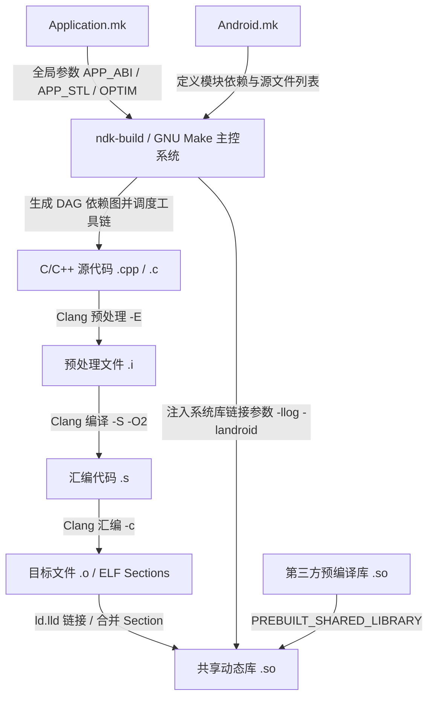
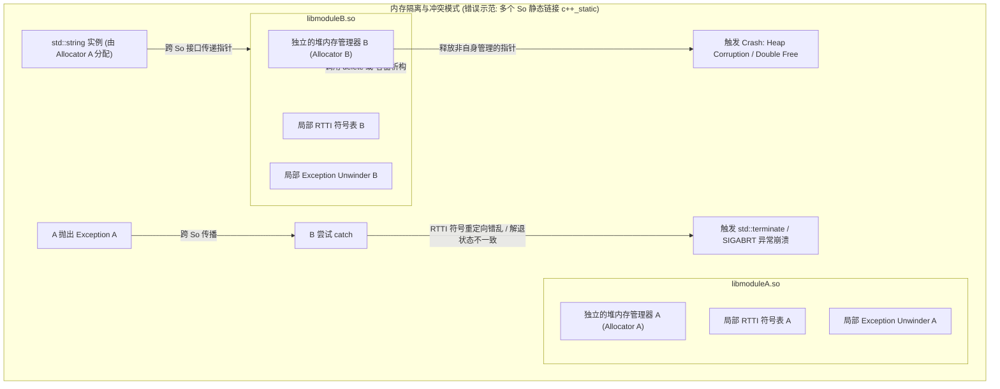

# Android NDK 构建体系：Android.mk 与 Application.mk 深度解析

在 Android 原生开发（NDK）的历史演进中，构建体系经历了从基于 GNU Make 的 `ndk-build` 到基于 Ninja 的 `CMake` 的重大跨越。尽管 Google 自 Android Studio 2.2（NDK r12）起已将 CMake 作为首推的 C/C++ 构建工具，但由于历史包袱、AOSP（Android Open Source Project）生态的一致性以及大量大型遗留项目的稳定性要求，`ndk-build` 构建体系依然在大量工业级项目中扮演着举足轻重的角色。

本文将从底层构建原理、Makefile 宏语法规则、ELF 动态共享库装配流水线、ABI 与 STL 内存管理等多个维度，对 `Android.mk` 与 `Application.mk` 的核心机制进行深入剖析，并提供面向现代 CMake 体系的无缝迁移指南。

---

## 一、 ndk-build 构建体系的底层原理

### 1.1 什么是 ndk-build 与 GNU Make 的依赖引擎
`ndk-build` 本质上不是一个独立的编译器或构建引擎，而是一个封装好的 **GNU Make 编译脚本系统**。它的核心是一套高度复杂的 Makefile 模板宏（位于 NDK 安装目录下的 `build/core/` 目录中）。

GNU Make 是一个依靠有向无环图（DAG, Directed Acyclic Graph）来解析和生成目标文件的构建引擎。在 NDK 构建流程中，GNU Make 扮演着构建决策者的角色。它通过读取 `Android.mk` 和 `Application.mk`，将所有的 C/C++ 模块关系转化为图中的节点（Nodes）和边（Edges）。每一条边代表一个依赖关系（例如，`.so` 依赖于多个 `.o` 文件，而 `.o` 依赖于对应的 `.cpp` 和 `.h` 头文件）。

#### 1.1.1 拓扑排序与增量编译决策
* 当开发者在终端中调用 `ndk-build` 命令行工具，或者通过 Gradle 的 `externalNativeBuild` 触发构建时，底层实际上启动了系统的 GNU Make 解析器，并隐式加载了 `build/core/main.mk`。
* GNU Make 遍历所有的依赖项，利用**拓扑排序（Topological Sort）**算法确定一个无冲突的线性编译顺序。
* **增量编译机制**：GNU Make 依靠文件系统的**最后修改时间戳（Timestamp）**进行编译决策。若目标文件（如 `main.o`）的时间戳晚于其所有依赖源文件（如 `main.cpp` 和 `main.h`）的时间戳，Make 就会判定此节点未发生改变，直接跳过该编译步骤。如果修改了任何一个公共头文件，所有依赖于该头文件的源文件都会被 Make 判定为“已过期”，从而触发级联重编译。



#### 1.1.2 Target-Prerequisite-Recipe 构建规则解析
在 GNU Make 中，最基础的构建单元是“规则（Rule）”，其表达形式为：
```makefile
target: prerequisites ...
	recipe
	...
```
* **Target（目标）**：通常是要生成的物理文件名（如 `main.o` 或 `libnative.so`），或者是自定义的一个伪目标（Phony Target）。
* **Prerequisites（先决条件）**：生成该目标所依赖的文件列表（如源文件 `main.cpp`）。
* **Recipe（命令行/配方）**：Make 决定更新目标时需要执行的一系列 shell 命令。**特别注意**，在原生 Makefile 中，每一行 Recipe 之前必须强制以一个 Tab 字符（即 `\t`，而不是空格）作为前导。
* **命令行抑制与编译日志可视化（`V=1`）**：
  默认情况下，为了保持编译终端输出整洁，`ndk-build` 内部在执行 Recipe 时会在命令前加上 `@` 符号（例如 `@clang++ ...`），这会指示 Make 只执行该命令，而不把冗长复杂的 Clang 参数打印到屏幕上。
  但在排查编译宏未生效、头文件引用冲突或链接顺序错误时，我们需要观察完整的 Clang 命令行。此时可以在命令行后加上 `V=1`（Verbose = 1）：
  ```bash
  ndk-build V=1
  ```
  这会使 `ndk-build` 的 quiet 抑制机制失效，将包含所有 `-I` 头文件路径、`-D` 宏定义、`-W` 警告选项以及动态链接器参数的完整 Clang 编译指令暴露在控制台上，是极佳的 NDK 排障利器。

### 1.2 NDK 构建系统的内部加载链与初始化
`ndk-build` 运行时，会顺序加载 `build/core/` 下的多个核心构建脚本：
1. **`main.mk`**：构建系统入口，负责检测 NDK 版本、Host 主机环境，以及设置基本的全局常量。它定义了 `NDK_PROJECT_PATH`（项目路径）、`NDK_APPLICATION_MK`（Application.mk 路径）、`NDK_APP_OUT`（编译输出目录）等核心变量。
2. **`setup-imports.mk`**：处理模块导入路径，解析 `NDK_MODULE_PATH` 环境变量，允许多个工程共享通用的 C/C++ 模块。
3. **`add-application.mk`**：读取项目的 `Application.mk` 文件。如果该文件不存在，则会加载默认配置。
4. **`setup-toolchain.mk`**：根据 `Application.mk` 指定的 `APP_ABI` 和 NDK 支持的工具链（在早期版本中是 GCC，现在则是 LLVM/Clang），动态匹配出特定目标架构的编译器路径（如 `aarch64-linux-android-clang`）。
5. **`definitions.mk`**：定义了整个构建系统最核心的辅助宏函数，例如 `my-dir`、`all-subdir-makefiles`、`clear-vars` 等。
6. **`Android.mk`**：最后，系统加载开发者编写的 `Android.mk`，开始解析每个具体模块的编译规则。

#### 1.2.1 Host OS 适配与跨平台构建环境初始化
为了实现跨平台编译（Cross-compilation），NDK 构建系统会在 `main.mk` 中执行 Host OS 的探测脚本。它会通过检查系统环境变量或执行内置 Shell 命令（如 `uname`），来判断宿主机是 Windows（包括 MinGW/Cygwin 模拟环境）、macOS 还是 Linux。
* 根据检测到的 Host 架构，构建系统会将其映射到特定的预编译二进制目录，如 `prebuilt/darwin-x86_64/bin/` 或 `prebuilt/linux-x86_64/bin/`。
* 针对 Windows 环境，它还需要处理路径分隔符（将 Windows 的反斜杠 `\` 改为 Linux 兼容的正斜杠 `/`）以及命令行长度限制。这些细节都被封装在 NDK 底层的 Make 宏中，对开发者完全透明。

#### 1.2.2 多架构的“多通解析”机制
如果我们在 `Application.mk` 中配置了多个 ABI（例如 `APP_ABI := armeabi-v7a arm64-v8a`），ndk-build 并不会在单次 Make 解析中混杂编译。相反，它会启动**多通解析（Multi-pass Parsing）**机制。Make 会对每个指定的 ABI 独立进行一次完整的依赖图解析 and 构建调用。在每一通解析中，诸如 `TARGET_ARCH_ABI`、`TARGET_PLATFORM` 以及编译器工具链路径等环境变量都会被重置为对应架构的值。

#### 1.2.3 GNU Make 内置函数在 NDK 内部的深度流转
在 NDK 构建骨架文件 `definitions.mk` 中，随处可见 GNU Make 内置文本函数的运用：
* **`filter` 和 `filter-out`**：用于过滤编译器 Flags。例如，NDK 通过 `$(filter-out -fno-exceptions,$(PRIVATE_CFLAGS))`，在检测到开启全局异常处理时，强行把“禁用异常”的标志从编译器标志列表中剔除。
* **`subst` 和 `patsubst`**：用于实现路径的拼接和后缀替换。例如，将所有的 `.cpp` 或 `.c` 文件后缀替换为对应的 `.o`，以此作为编译的目标链。
* **自定义递归搜索宏 `all-subdir-makefiles`**：
  在巨型项目中，我们常常需要在根目录的 `Android.mk` 中一次性引入所有子目录下的模块。NDK 提供了一个内置宏来实现此功能：
  ```makefile
  include $(call all-subdir-makefiles)
  ```
  该宏的底层实现是通过调用系统级的 `find` 命令或利用 Make 的 `wildcard` 机制，递归搜索当前目录所有子层级中的 `Android.mk` 并将其 `include` 进来。它极大降低了巨型多团队协同项目的模块注册成本。

### 1.3 Android NDK 构建系统的历史演进与技术迭代
自 Android 1.5 引入第一个 NDK 版本以来，原生构建系统经历了深度的演进：
* **早期阶段 (NDK r1 - r10)**：构建系统完全依赖 GCC 工具链，且仅支持 32 位架构（`armeabi` 和极少见的 `x86`、`mips`）。为了节省体积，系统默认生成 Thumb 指令。
* **分水岭 (NDK r11 - r15)**：引入 Unified Headers（统一头文件），消除了早期针对不同 API 级别存在重复且零碎的头文件定义。CMake 开始与 ndk-build 并存，Clang 逐步确立主导地位，GCC 开始步入生命周期的终点。
* **现代阶段 (NDK r16 - r27)**：彻底移除 GCC 编译器，Clang 成为唯一的官方支持编译器。全面废弃 `armeabi`、`mips` 和 `mips64` 等过时架构，仅保留 `armeabi-v7a`、`arm64-v8a`、`x86` 和 `x86_64` 核心架构。新版本的 NDK 重写了动态装配逻辑，强制开启 ELF 的 RELRO 安全验证，且默认打包策略从早期的静态运行时全面迁移到更加安全稳定的 `c++_shared` 动态运行时。

---

## 二、 Android.mk 核心语法与宏控制深度解剖

`Android.mk` 本质上是一个遵循 GNU Make 语法的配置文件，用于向构建系统描述具体的模块结构。

### 2.1 逐一推导核心变量的工作机制

#### 2.1.1 `LOCAL_PATH := $(call my-dir)` 的工作机制
这是所有 `Android.mk` 文件的第一行非注释代码。其唯一作用是确定当前模块在宿主机上的绝对路径。
* **底层推导原理**：GNU Make 在解析所有的 Makefile 时，会自动维护一个特殊的隐式变量 `MAKEFILE_LIST`。这个变量是一个以空格分隔的列表，记录了 Make 迄今为止读取过的所有 Makefile 文件的路径。当 Make 刚好解析到当前 `Android.mk` 时，该列表 the last word（即 `$(lastword $(MAKEFILE_LIST))`）预测必定是当前的 `Android.mk` 文件的路径。
* NDK 内部在 `definitions.mk` 中将 `my-dir` 定义为如下宏：
  ```makefile
  my-dir = $(strip $(patsubst %/,%,$(dir $(lastword $(MAKEFILE_LIST)))))
  ```
  * `dir` 函数：提取文件路径中的目录部分（保留末尾的斜杠 `/`）。
  * `patsubst` 函数：将目录路径末尾的斜杠 `/` 剥离掉。
  * `strip` 函数：去除可能存在的首尾空格。
* **避坑警告**：正因为 `$(MAKEFILE_LIST)` 是动态追加的，如果在 `Android.mk` 中途包含了其他 Makefile 文件（例如通过 `include $(BUILD_SHARED_LIBRARY)` 会隐式包含 NDK 的内部脚本），那么 `MAKEFILE_LIST` 就会发生改变。因此，**必须在文件的第一行，且在任何 `include` 语句执行之前，完成 `LOCAL_PATH` 的赋值**。此外，由于 `LOCAL_PATH` 作为相对路径的锚点，它也是**唯一不会被 `CLEAR_VARS` 清除的全局变量**。

#### 2.1.2 `include $(CLEAR_VARS)` 的必要性与变量清除明细
* **必要性（全局变量污染）**：由于 GNU Make 的解析是单进程、顺序执行的，且所有以 `LOCAL_` 开头的变量在 Make 中默认都是**全局作用域**的。如果你的项目包含多个模块，或者通过 `include $(all-subdir-makefiles)` 递归引入了子目录下的 `Android.mk`，那么前一个模块对 `LOCAL_SRC_FILES`、`LOCAL_CFLAGS` 等变量的赋值会直接残留在 Make 上下文中，导致后一个模块在编译时错误地夹带前一个模块的源文件或编译标志。
* **工作机制**：`CLEAR_VARS` 是一个内置的系统变量，指向 NDK 内部的 `clear-vars.mk` 脚本。当执行 `include $(CLEAR_VARS)` 时，Make 会逐个清空所有以 `LOCAL_` 开头的配置变量。
* **清除的变量明细（超 20 个变量）**：
  包括但不限于：`LOCAL_MODULE` 、`LOCAL_SRC_FILES`、`LOCAL_CFLAGS`、`LOCAL_CPPFLAGS`、`LOCAL_CONLYFLAGS`、`LOCAL_C_INCLUDES`、`LOCAL_LDLIBS`、`LOCAL_LDFLAGS`、`LOCAL_STATIC_LIBRARIES`、`LOCAL_SHARED_LIBRARIES`、`LOCAL_ARM_MODE`、`LOCAL_ARM_NEON`、`LOCAL_EXPORT_CFLAGS`、`LOCAL_EXPORT_CPPFLAGS`、`LOCAL_EXPORT_C_INCLUDES`、`LOCAL_EXPORT_LDLIBS`、`LOCAL_EXPORT_SHARED_LIBRARIES`、`LOCAL_EXPORT_STATIC_LIBRARIES`、`LOCAL_DISABLE_FATAL_LINKER_WARNINGS`、`LOCAL_ALLOW_UNDEFINED_SYMBOLS`。
* **模块属性导出机制（LOCAL_EXPORT_xxx）**：
  在大型多模块编译中，NDK 引入了 `LOCAL_EXPORT_` 系列变量。如果 Module A 依赖于 Module B，而 Module B 在其 `Android.mk` 中配置了：
  ```makefile
  LOCAL_EXPORT_C_INCLUDES := $(LOCAL_PATH)/include/codec
  ```
  那么在 Module A 声明 `LOCAL_SHARED_LIBRARIES := B` 时，NDK 构建系统在编译 Module A 时，会自动把 Module B 导出的头文件包含目录追加到 Module A 的 `LOCAL_C_INCLUDES` 中。这省去了手动为每个模块重复配置复杂包含路径的麻烦，极大地规范了模块依赖链条。
* **赋值风格选择（`:=` vs `=` vs `+=`）**：
  在 Makefile 中，`:=` 代表**立即展开赋值**（变量的值在定义处立即被计算并固定），而 `=` 代表**延迟展开赋值**（变量的值在使用到该变量的地方才进行计算）。为了防止因后面变量改变而导致编译参数产生诡异变化，NDK 中绝大多数 `LOCAL_` 变量的定义都必须采用 `:=` 或 `+=`（追加赋值），严禁使用 `=`。

#### 2.1.3 `LOCAL_MODULE` 与 `LOCAL_SRC_FILES` 的命名与路径解析规则
* **`LOCAL_MODULE`**：
  * 每个模块的唯一名称，用于在整个编译依赖树中作为主键。名称中严禁包含空格。
  * **输出文件名映射规则**：构建系统在生成最终的库文件时，会自动根据该变量拼接前缀 and 后缀。如果定义为 `LOCAL_MODULE := math_engine`，编译出的动态库文件名为 `libmath_engine.so`。如果定义的名称本身就带有 `lib` 前缀（如 `LOCAL_MODULE := libmedia`），构建系统会智能识别，不再重复添加前缀，输出的文件依然是 `libmedia.so`。
* **`LOCAL_SRC_FILES`**：
  * 列出该模块所有需要编译的源文件路径，路径是相对于 `LOCAL_PATH` 的相对路径。
  * 多个文件用空格分隔，换行使用反斜杠 `\` 续行。
  * **通配符的局限性与避坑**：虽然可以使用 `$(wildcard $(LOCAL_PATH)/src/*.cpp)` 动态检索文件，但 NDK 官方强烈建议手动列出所有文件。这是因为当你在本地新增、删除或重命名源文件时，如果没有修改 `Android.mk` 文件本身，GNU Make 检查 `Android.mk` 的修改时间戳就会发现没有变化，从而不会重新生成 DAG。这会导致增量编译时无法将新文件纳入编译，或者依然尝试编译已删除的文件，引发编译失败。

#### 2.1.4 架构条件编译控制与汇编源文件引入
在实际开发中，我们常常需要针对不同的 CPU 架构编译不同的优化文件（例如手写的 `.S` 汇编源文件）。在 `Android.mk` 中，我们可以使用 GNU Make 的分支结构实现精确控制：
```makefile
# 根据当前编译通的目标 ABI 进行条件分支判断
ifeq ($(TARGET_ARCH_ABI),arm64-v8a)
    # 为 64位 ARM 架构引入专门的汇编优化器
    LOCAL_SRC_FILES += src/asm/kernel_fft_arm64.S
    LOCAL_CFLAGS += -DENABLE_ARM64_ASM
else ifeq ($(TARGET_ARCH_ABI),armeabi-v7a)
    # 为 32位 ARM 架构引入 NEON 版本的汇编优化器
    LOCAL_SRC_FILES += src/asm/kernel_fft_neon.S
    LOCAL_CFLAGS += -DENABLE_ARM32_ASM
else
    # 针对 x86 等架构使用纯 C++ 软实现
    LOCAL_SRC_FILES += src/cpp/kernel_fft_fallback.cpp
endif
```
* **`.S` 汇编文件的处理原理**：以大写 `.S` 结尾的汇编源文件，在被 Clang 编译时，会**先经过预处理器（Preprocessor）**的处理，然后再送入汇编器。这意味着我们在汇编代码中可以使用 C 语言风格的 `#include` 引入头文件，使用 `#define` 定义常数，或者使用条件宏进行分支裁剪。这在底层的 SIMD 汇编优化中应用极广。

#### 2.1.5 `LOCAL_ARM_MODE` 与 `LOCAL_ARM_NEON` 的优化机制
在 32 位 ARM 架构（`armeabi-v7a`）下，处理性能敏感型代码时，有两项关键控制：
* **`LOCAL_ARM_MODE`（ARM 指令集 vs Thumb 指令集）**：
  * 32 位 ARM 处理器支持两种工作状态：**ARM 状态**（执行 32 位宽指令，性能强劲，代码密度低）和 **Thumb 状态**（执行 16 位宽指令，代码体积小，但在复杂计算中由于指令条数增多导致性能较 ARM 状态有 10%~20% 的衰退）。
  * 默认情况下，NDK 为了缩减体积，可能会使用 Thumb 模式进行编译。
  * 对于性能极其敏感的模块，可以通过设置 `LOCAL_ARM_MODE := arm`，强制编译器使用 32 位的 ARM 指令进行编译。
* **`LOCAL_ARM_NEON`（向量化加速）**：
  * ARM NEON 是一种单指令多数据（SIMD）架构的协处理器加速技术，非常适合并行计算。
  * 设置 `LOCAL_ARM_NEON := true` 会让编译器在全局编译中启用 NEON 指令集。
  * 如果只想对某一个特定的源文件启用 NEON，可以在 `LOCAL_SRC_FILES` 中给该文件名加上 `.neon` 后缀，例如：`LOCAL_SRC_FILES := main.cpp image_process.cpp.neon`。

### 2.2 头文件包含与系统库链接

为了让编译器在编译阶段找到符号声明，并在链接阶段将符号绑定到正确的实现，我们需要深度配置头文件路径与链接选项。

#### 2.2.1 `LOCAL_C_INCLUDES`（编译期搜索路径）
* 用于向 Clang 编译器传递额外的头文件搜索路径列表，对应编译器的 `-I` 选项。
* 当我们在源文件中使用 `#include "my_header.h"` 时，如果该头文件不在当前源文件同级目录下，Clang 就会依次遍历 `LOCAL_C_INCLUDES` 指定的路径。
* 推荐配置方式：
  ```makefile
  LOCAL_C_INCLUDES := $(LOCAL_PATH)/include \
                      $(LOCAL_PATH)/src/common/headers
  ```

#### 2.2.2 `LOCAL_LDLIBS`（系统级链接库）
* 用于指定链接 NDK 中预置的 Android 系统原生库，这些库已经是 Android 操作系统的一部分，NDK 仅提供编译期用来占位的 Stub（存根）动态链接库（即没有具体实现的导出符号表）。
* 对应链接器的 `-l` 参数。
* **常用系统链接库大纲**：
  * **`-llog`**：日志打印模块，支持 `<android/log.h>` 中的 `__android_log_print` 等函数。
  * **`-landroid`**：提供 Android 系统底层的原生 API，如通过 `ANativeWindow` 直接进行屏显绘制，或者通过 `AAssetManager` 直接在 Native 层读取 assets 目录下的资源文件。
  * **`-lz`**：系统集成的 zlib 压缩/解压缩库。
  * **`-ljnigraphics`**：允许 Native 层直接锁定并操作 Java 层的 Bitmap 像素矩阵。
  * **`-lGLESv2` / `-lGLESv3`**：OpenGL ES 2.0 / 3.0 图形渲染库。
* **警告**：系统自带的原生库**只能**配置在 `LOCAL_LDLIBS` 中，绝不能配置在 `LOCAL_SHARED_LIBRARIES` 里，因为后者是专门用来链接项目内部自定义的动态库或第三方预编译 So 的。

#### 2.2.3 `LOCAL_SHARED_LIBRARIES` 与 `LOCAL_STATIC_LIBRARIES` 的链接期差异

```
+----------------------------------------------------------------------------------+
| 编译链接期差异对比                                                                |
+--------------------------+-------------------------------------------------------+
| 维度                     | LOCAL_STATIC_LIBRARIES                                | LOCAL_SHARED_LIBRARIES                                |
+--------------------------+-------------------------------------------------------+
| 编译产物处理方式         | 将被依赖模块(.a)的代码直接物理合并并拷贝到最终生成的 So  | 不拷贝代码，仅在 ELF 文件中记录符号的依赖关系          |
| 最终 So 的体积           | 显著增大 (包含了静态库中所有未被剔除的二进制代码)      | 较小 (仅保留自身代码 and 外部符号声明)                   |
| 运行时加载顺序           | 运行时无需额外加载该依赖库                             | 运行时必须优先加载被依赖的 So，否则会加载失败          |
| 符号解析时机             | 静态链接期完成符号地址偏移计算                         | 运行时由系统的动态链接器(linker)进行符号地址重定向      |
+--------------------------+-------------------------------------------------------+
```

### 2.3 第三方预编译库的导入配置与依赖树构建
在实际开发中，我们常需要集成已经编译好的第三方 SDK。NDK 提供了一套非常严谨的预编译导入机制，以便将这些 So 或 A 文件以“模块”的身份纳入全局依赖拓扑中。

#### 2.3.1 预编译动态库的导入配置
假设我们拥有第三方动态库 `libthirdparty.so`，我们需要针对不同 CPU 架构把它放置在不同的物理路径下，并进行注册：

```makefile
# ----------------------------------------------------
# 1. 定义预编译动态库模块
# ----------------------------------------------------
include $(CLEAR_VARS)
LOCAL_MODULE := my_thirdparty_sdk
# 使用 TARGET_ARCH_ABI 自动适配当前编译环境下的 CPU 架构路径
LOCAL_SRC_FILES := prebuilt/$(TARGET_ARCH_ABI)/libthirdparty.so
# 核心宏：表明这是一个不需要重新进行源码编译的共享链接库
include $(PREBUILT_SHARED_LIBRARY)

# ----------------------------------------------------
# 2. 业务模块引用预编译库
# ----------------------------------------------------
include $(CLEAR_VARS)
LOCAL_MODULE := my_app_native
LOCAL_SRC_FILES := src/app_main.cpp

# 声明对第三方预编译模块的动态链接依赖
LOCAL_SHARED_LIBRARIES := my_thirdparty_sdk
# 链接系统 Log 库
LOCAL_LDLIBS := -llog

include $(BUILD_SHARED_LIBRARY)
```

#### 2.3.2 预编译库对依赖图（DAG）的影响
通过 `PREBUILT_SHARED_LIBRARY` 声明，构建系统会在 DAG 中为 `my_thirdparty_sdk` 创建一个节点。
* 在**静态链接/验证阶段**，链接器 `ld.lld` 会读取该 So 文件的符号表，确保 `app_main.cpp` 中调用的第三方函数能够成功匹配。
* 在**打包阶段**，NDK 构建系统会追踪此依赖，自动把 `prebuilt/arm64-v8a/libthirdparty.so` 拷贝到 APK 最终的 `lib/arm64-v8a/` 目录下。

---

## 三、 include $(BUILD_SHARED_LIBRARY) 背后编译器的 ELF 动态共享库装配流水线

当在 `Android.mk` 结尾写入 `include $(BUILD_SHARED_LIBRARY)` 时，构建系统将启动 LLVM/Clang 工具链，开始将 C++ 源文件装配成符合 ELF 规范的共享库（`.so` 文件）。

### 3.1 编译器与链接器的核心工作阶段

#### 3.1.1 预处理阶段（Preprocessing）
* 编译器针对源文件展开头文件、进行宏替换、剔除不匹配的条件编译分支。

#### 3.1.2 编译阶段（Compilation）
* 编译器将 C++ 源码编译为带有寄存器调度、循环优化以及 `-fPIC` 位置无关汇编代码（`.s`）。

#### 3.1.3 汇编阶段（Assembly）
* 汇编器将汇编文件转为二进制机器码，生成包含多个段区信息的 `.o` 中间目标文件。

#### 3.1.4 链接阶段（Linking）
链接器 `ld.lld` 将所有输入的 `.o` 文件、静态库（`.a`）和外部动态库（`.so`）装配成最终的 ELF 共享库。
1. **Section 合并**：链接器将所有输入文件的 `.text` 节合并成一个连续的代码段，`.data` 节合并成一个数据段。

---

### 3.2 ELF 文件物理结构深入解析

ELF（Executable and Linkable Format）文件是 Android 系统中动态库和可执行文件的物理载体。要理解编译装配和运行加载，就必须理清其内部复杂的二进制结构。

```
+-------------------------------------------------------------+
| ELF 二进制物理文件布局                                       |
+=============================================================+
| 1. ELF Header (文件魔数、目标架构、Program Header 偏移量等) |
+-------------------------------------------------------------+
| 2. Program Header Table (段表: PT_LOAD, PT_DYNAMIC 等段描述) |
+-------------------------------------------------------------+
| 3. Sections (节区: .text, .rodata, .data, .bss, .dynsym)     |
+-------------------------------------------------------------+
| 4. Section Header Table (节头表: 记录各 Section 大小及偏移) |
+-------------------------------------------------------------+
```

* **ELF Header（文件头）的 64 字节二进制数据描述**：
  在 64 位（EM_AARCH64）系统下，ELF 头部严格按照 `Elf64_Ehdr` 结构体进行内存排布：
  * `e_ident`：包含 16 字节的文件魔数（`7F 45 4C 46`），分别对应 ASCI 的 `DEL`, `E`, `L`, `F`，以此标记其合法性；还包含类别码（1 代表 32 位，2 代表 64 位）和大小端属性。
  * `e_type`：2 字节。对于共享链接库，其值固定为 `ET_DYN`（3）。
  * `e_machine`：2 字节。指定运行目标机器，如 `EM_AARCH64`（183）代表 ARM64。
  * `e_phoff` / `e_shoff`：分别为程序头表和节区头表在文件中的起始绝对偏移字节数。
  * `e_phnum` / `e_shnum`：分别记录了文件拥有的 Segments 数量和 Sections 数量。
* **Program Header Table（程序头表 / 段表）**：
  这是**运行期装载器**（如系统的 dynamic linker）最关心的表。它将文件内容划分为多个 **Segments（段）**。
  * `PT_LOAD` 段：描述了哪些文件区域需要被动态映射到虚拟内存空间中，并定义其读写执行权限（如代码段 `R-X`，数据段 `RW-`）。
  * `PT_DYNAMIC` 段：存放了动态链接器的核心调度信息，包括依赖的共享库列表（`DT_NEEDED`）、全局符号表位置（`DT_SYMTAB`）、重定位表位置（`DT_REL` / `DT_RELA`）以及初始化函数指针（`DT_INIT` / `DT_INIT_ARRAY`）。
* **Section Header Table（节区头表）**：
  这是**链接器**最关心的表。它将文件物理内容划分为几十个细分的 **Sections（节）**。
  * **`.dynsym`（动态符号表）**：记录了本动态库导入和导出的所有符号（函数、全局变量）的名称及其在内存中的相对偏移量。
  * **`.dynstr`（动态字符串表）**：存放所有符号名、库名对应的明文字符串常量。
  * **`.rela.dyn` 与 `.rela.plt`**：分别存放数据段和代码段（函数调用）的动态重定位条目。

---

### 3.3 链接器重定位动作与 GOT/PLT 机制

当我们在 C++ 代码中调用一个外部库函数（如 `__android_log_print`），编译器在编译时无法获知其在设备运行时的绝对虚拟地址。为了确保程序能够顺利跳转到该函数，链接器利用 GOT/PLT 机制进行动态地址重定向。

#### 3.3.1 动态符号的重定位表（Relocation Entries）
在生成的 So 文件中，链接器会生成对应的重定位节。在 ARM64 架构下，常见的动态重定位类型如下：
* **`R_AARCH64_GLOB_DAT`**：用于初始化 GOT 表中存放外部全局变量地址的表项。
* **`R_AARCH64_JUMP_SLOT`**：用于初始化 GOT 表中存放外部函数指针的表项，对应 PLT 桩代码的跳转目标。
* **`R_AARCH64_RELATIVE`**：相对重定位。用于解决 ASLR（地址空间布局随机化）引入的基地址偏移。当系统将 So 装载到某个随机的内存基地址 $Base$ 后，动态链接器必须遍历所有的 `R_AARCH64_RELATIVE` 条目，将表中记录的相对偏移 $Offset$ 加上基地址 $Base$，计算出真实的内存地址：$Addr = Base + Offset$，并填回对应的指针位置。

#### 3.3.2 PLT 与 GOT 协同寻址步骤
假设我们在 C++ 中执行了 `__android_log_print(ANDROID_LOG_INFO, "TAG", "Hello")`：
1. **调用 PLT 桩**：汇编指令 `bl`（Branch with Link）会跳转到 `__android_log_print@plt` 的桩代码中。
2. **PLT 内部跳转**：PLT 桩代码只包含 3 条指令。它会利用 PC 相对寻址，读取位于 GOT 表（即 `.got.plt` 节）中为该函数保留的槽位（Slot）。
3. **未解析状态下的首次跳转**：
   * 在早期操作系统中，为了优化启动速度，GOT 槽位默认被填充为 PLT 桩代码的下一条指令地址（即触发延迟绑定）。
   * PLT 桩的后两条指令会将该符号在重定位表中的索引压栈，并跳转到动态链接器（`/system/bin/linker64`）入口函数。
   * 动态链接器根据索引找到符号名 `"__android_log_print"`，在系统中加载的各个 So 中查找并定位该函数的实际地址，然后将此地址覆写到该 GOT 槽位中。
4. **已解析状态下的后续跳转**：
   当第二次调用该函数时，`bl` 再次进入 PLT 桩。此时 PLT 桩读取 GOT 槽位，里面已经是上一步覆写的真实地址。执行流直接跳转到目标函数，不再产生动态链接器的寻址开销。
5. **RELRO（ReLocation Read-Only，重定位只读）安全策略**：
   由于 GOT 表在运行时需要被动态链接器改写，它默认是可写的。这成为了黑客通过缓冲区溢出漏洞篡改 GOT 项、劫持控制流的重灾区。为了防范此攻击，现代 Android NDK 默认开启了 **Full RELRO**（通过向链接器传递 `-Wl,-z,relro -Wl,-z,now` 参数）。在 Full RELRO 模式下，动态链接器会在 `.so` 被装载进内存的初期，就一次性解析完**所有**的外部符号地址并填入 GOT，随后立即调用系统调用 `mprotect` 将 GOT 表所在的内存区域设为**只读**。这从根本上杜绝了运行期的 GOT 篡改，但代价是会略微增加 So 的装载和启动耗时。

---

## 四、 Application.mk 核心控制参数详解

`Application.mk` 用于定义应用级别的全局编译环境和属性。

### 4.1 APP_ABI 深度配置与硬件寄存器级解析

Android 设备运行在不同的 CPU 架构上，对应着不同的二进制接口（ABI）。NDK 编译必须针对特定的指令集进行优化。

#### 4.1.1 `armeabi-v7a` 与 `arm64-v8a` 的指令集与寄存器级深度对比

```
+----------------------------------------------------------------------------------+
| CPU 架构寄存器级硬件特性对比                                                    |
+--------------------------+-------------------------------------------------------+
| 特性维度                 | armeabi-v7a (ARMv7-A)                                 | arm64-v8a (ARMv8-A)                                   |
+--------------------------+-------------------------------------------------------+
| 指令集位数               | 32-bit                                                | 64-bit                                                |
| 通用寄存器数量           | 16个 (r0-r15)                                         | 31个 (x0-x30)                                         |
| 自由计算寄存器           | 仅 13个可用 (r13为SP, r14为LR, r15为PC占位)            | 31个均可自由用于计算 (SP/PC为独立专用寄存器)          |
| 浮点与 SIMD 寄存器       | 16个64位 VFP 寄存器 (d0-d15)                          | 32个128位 NEON 寄存器 (v0-v31)                        |
| 硬件异常保护机制         | 不支持硬件加速解退                                     | 完美支持异常解退栈的底层硬件加速                      |
| 函数传参约定 (AAPCS)     | 前4个参数通过 r0-r3 传递，其余参数强行压栈             | 前8个参数通过 x0-x7 传递，极大减少压栈和存根操作      |
+--------------------------+-------------------------------------------------------+
```

* **AArch64 调用约定（AAPCS64）的硬件寄存器分工详情**：
  在 `arm64-v8a` 架构中，31 个 64 位通用寄存器有着非常严格的角色界定：
  * `x0-x7`：用于函数参数的传递。其中 `x0` 同时用作单个函数返回值的寄存器。
  * `x8`：间接返回值指针（Indirect Result Location Pointer）。当函数返回一个非常大的结构体（无法装进单个寄存器）时，调用者会提前开辟好一块内存，并把该内存地址存在 `x8` 中传给被调用函数，函数运行后把数据直接写入该内存。
  * `x9-x15`：临时寄存器（Temporary Registers）。这些是**调用者保存（Caller-saved）**的寄存器，如果调用者在调用子函数后还需要使用其中的数据，调用者必须在调用前自行将它们压栈保护，子函数可以任意覆写它们。
  * `x16-x17`：过程内链接临时寄存器（Intra-procedure-call Scratch Registers），用于 linker 桩代码及 PLT 动态中转。
  * `x18`：平台寄存器（Platform Register），保留作特殊操作系统或编译器实现使用。
  * `x19-x28`：**被调用者保存（Callee-saved）**的寄存器。如果子函数要用到这些寄存器，子函数必须在入口处将其压栈保存，在退出（函数返回）前将其从栈中恢复，确保对调用者无破坏。
  * `x29`：帧指针（FP, Frame Pointer），用于指向当前函数活动记录的栈基地址。
  * `x30`：链接寄存器（LR, Link Register），用于保存函数执行完毕后的返回地址。
  * `SP`：64 位专属栈指针，必须严格保持 16 字节对齐。

* **浮点数传递约定与 Soft Float / Hard Float 差异**：
  在 C/C++ 函数调用中，除了通用寄存器外，浮点参数（`float`, `double`）的传递方式也直接影响编译链接行为：
  * **ARM64 (arm64-v8a)**：由于硬件强制搭载 NEON，所有浮点参数均直接通过专用的 128 位向量/浮点寄存器 `v0-v7`（或按精度映射为 `s0-s7`、`d0-d7`）进行高速传递，规则极其简练，效率极高。
  * **ARM32 (armeabi-v7a)**：支持两种截然不同的浮点调用模式：
    1. **Soft Float**（通过 `-mfloat-abi=soft` 引入）：虽然有浮点协处理器，但编译器在传递参数时，依然遵循早期无 FPU 设备的行为，将浮点数强行拆分存入通用整型寄存器（如 `r0-r3`）中传递。这造成了严重的寄存器转换和拆装包开销。
    2. **Hard Float / SoftFP**（通过 `-mfloat-abi=softfp` 或 `hard` 引入）：允许直接使用硬件浮点寄存器（`s0-s15`）进行参数传递。在 NDK 编译体系中，为了向下兼容并获得硬件加速，默认选用 `softfp` 模式。
  * **避坑要点**：若在项目中静态链接了别人预先打包好的 `.a` 库，且该库在编译时使用了与当前工程不一致的 `-mfloat-abi` 浮点调用标准，链接器 `ld.lld` 将在链接阶段直接中断报错并退出，抛出类似 `fatal error: xxx.a uses hard float, yyy.o uses softfp` 的 ABI 签名冲突。

#### 4.1.2 模拟器 x86 与 x86_64 的二进制翻译开销（Intel Houdini）
* **Houdini 翻译器原理**：大部分 Android 手机采用 ARM 架构，而 PC 开发环境下的 Android 模拟器主要运行在 x86/x86_64 架构上。如果一个 App 的 APK 中仅包含 ARM 架构（`armeabi-v7a`/`arm64-v8a`）的 So，在 Intel 芯片的模拟器上运行时，系统会调用一个名为 **Houdini** 的二进制翻译引擎。
* **开销分析**：Houdini 在运行时会将 ARM 的指令实时动态翻译（Just-In-Time Translation）为 x86 的等效机器指令。由于指令集架构（ISA）和寄存器映射关系存在巨大差异，这种动态翻译会带来 30%~40% 的 CPU 额外开销，并且在涉及高度依赖汇编优化的多媒体、加密库或游戏引擎时，容易产生严重的时序错误，甚至引发非预期的段错误崩溃（Segmentation Fault）。因此，针对开发测试阶段的模拟器环境，配置 `APP_ABI := arm64-v8a x86_64` 是保证模拟器运行流畅和调试稳定的最佳实践。

### 4.2 APP_PLATFORM 的作用与 minSdkVersion 兼容策略限制
* **`APP_PLATFORM`**：声明编译 Native 代码时所使用的 Android 平台 API 版本（例如 `APP_PLATFORM := android-21`）。这直接决定了 NDK 编译器引入头文件的目录以及链接时查找符号的目标系统库版本。
* **兼容性陷阱（UnsatisfiedLinkError 的根源）**：
  如果开发者的 App 在 `build.gradle` 中设置了 `minSdkVersion 19`（对应 Android 4.4），而在 `Application.mk` 中将 `APP_PLATFORM` 错误地设置为了 `android-21`。
  当在编译时，C++ 代码中调用了在 API 21 中才首次引入的系统标准 C 库函数（例如高级数学计算函数或特定的 `pthread` 线程同步接口）时，编译器能够顺利通过，因为编译期链接的是 API 21 的 Stub 库。
  然而，当 App 安装到一台运行 Android 4.4（API 19）的古董设备上时，系统动态链接器（`/system/bin/linker`）在加载该 So 时会去系统的 `libc.so` 中寻找该函数符号。由于 API 19 的系统库中根本没有这个函数，链接器会直接中断 So 的装载，并向 Java 层抛出毁灭性的崩溃异常：
  ```
  java.lang.UnsatisfiedLinkError: dlopen failed: cannot locate symbol "xxx" referenced by "libnative.so"...
  ```

#### 4.2.1 Android 6.0/7.0 系统动态链接器安全升级演进与限制
在 Android 原生开发中，除了 API 符号不匹配之外，Android 系统动态链接器在各个大版本升级中引入的安全限制，也是引发 Native 崩溃的重灾区：
1. **Android 6.0（API 23）对 Text Relocations（TEXTREL，文本重定位）的硬性禁止**：
   * **原理**：早期为了编写方便，某些汇编代码在生成机器码时没有使用 `-fPIC` 位置无关指令，而是在代码段（Text Section）中残留了绝对物理地址，导致系统加载时必须强行对代码段进行改写（即 TEXTREL）。这破坏了内存页面保护机制，给恶意代码注入提供了可乘之机。
   * **限制**：自 Android 6.0 开始，动态链接器对 Target SDK >= 23 的 App，在检测到 So 库中包含 TEXTREL 时，会直接**拒绝加载并导致 Crash**。因此，编写 Makefile 时必须确保开启位置无关编译。
2. **Android 7.0（API 24）命名空间隔离策略（Private Namespace Isolation）**：
   * **原理**：在早期，许多开发者会通过 `dlopen` 去强行加载系统内部并未公开的共享库（如 ART 虚拟机的核心库 `libart.so`，或系统内置的 `libsqlite.so`、`libcrypto.so`）。
   * **限制**：自 Android 7.0 起，动态链接器引入了**命名空间隔离**。系统将所有可供加载的物理路径划分为三个 Namespace 区域：`default`（代表应用本地 `/data/app/` 的 So 目录及 NDK 公共动态库目录，如 `/system/lib/` 下的 `liblog.so`、`libz.so`）、`sphaler`（指向 vendor 部分与硬件渲染密切相关的驱动库）以及 `vndk`（指向供应商 VNDK 扩展库）。App 的 Native 代码被严格限制在 `default` 沙盒中，**只能加载 NDK 公开声明的公共系统库**。如果尝试 `dlopen("libart.so")`，链接器在 `default` 命名空间及其可搜索路径列表中根本找不到这个符号，会立刻拦截并抛出 `UnsatisfiedLinkError`。这一改变要求开发者若必须使用特定三方库，则必须将它们打包到 App 的 APK 内部，而不能私自越界借用系统内部的 So。
* 更多关于 Android 系统 API 的变更和版本迁移细节，可参考 [AndroidVersionChangeLog.md](file:///Users/lizhiyang/Desktop/AndroidKnowledge/AndroidVersionChangeLog.md)。

### 4.3 APP_OPTIM（优化等级）与常见编译器 Flag 组合
`APP_OPTIM` 变量决定了 NDK 构建系统向 Clang 传递的底层代码优化参数：
* **`APP_OPTIM := debug`**：
  * 向 Clang 传递 `-O0` 参数。编译器不进行任何指令级优化，完全保留 C++ 的执行步骤，所有局部变量都强制压入内存栈中。
  * 编译时会生成最完整的 DWARF 调试符号信息，允许 LLDB 在调试时能够完美匹配源码行号，观察任何变量的瞬时值。
* **`APP_OPTIM := release`**（默认）：
  * 向 Clang 传递 `-O2` 参数。在现代 Clang 下，`-O2` 是兼顾运行性能与二进制体积的最佳实践。它会进行复杂的内联展开、常量传播、循环展开以及死代码剔除（Dead Code Elimination）。
  * 链接器在生成 So 后，会自动执行 **Strip** 操作，将 ELF 文件中的 `.symtab`、`.strtab` 以及各种调试符号节区完全剥离，仅保留动态运行所必须的 `.dynsym` 和 `.dynstr`，从而将 So 文件大小缩减 60% 以上。
* **`APP_CPPFLAGS` 常见参数搭配**：
  * `-std=c++17`：显式指定使用 C++17 标准。
  * `-fexceptions`：开启异常处理（默认关闭）。
  * `-frtti`：开启运行时类型识别（默认关闭）。

---

## 五、 C++ 运行时库 APP_STL 灾难级避坑指南与“One STL”铁律

C++ 标准库（STL）包含了异常处理、运行时类型识别（RTTI）以及各种基础数据结构。由于 Android 操作系统本身自带的 C++ 标准库极其不健全且不对 App 开发者完全开放，因此 NDK 提供了独立的 C++ 运行时实现供 App 打包带走。

### 5.1 四大 C++ 运行时模式的底层解剖
1. **`c++_shared`（LLVM libc++ 动态链接库）**：
   * 对应外部文件 `libc++_shared.so`。
   * **运行机制**：所有链接该库的 So 在运行时都指向系统内存中同一份 `libc++_shared.so` 的映射，全局共享唯一的 C++ 运行时状态。
2. **`c++_static`（LLVM libc++ 静态链接库）**：
   * 对应 NDK 中的静态库 `libc++_static.a`。
   * **运行机制**：在编译期间，链接器会将当前模块所用到的 STL 容器、算法以及全局分配器的机器码物理性地“灌入”最终生成的 So 文件中。
3. **`system`（Android 系统极简运行时）**：
   * 对应系统自带的极简 C++ 运行时。不支持 C++ 异常，不支持 RTTI，仅包含最基础的 C 库头文件封装。
4. **`none`（无 C++ 标准库）**：
   * 纯 C 语言开发专用，完全不包含任何标准库支持。

---

### 5.2 铁律破裂灾难分析：多动态库各自静态链接 `c++_static`

> [!IMPORTANT]
> **“One STL”铁律**：一个 Android App 的单个进程空间中，有且只能存在一个 C++ 运行时实例！

如果工程中包含两个以上的 Native 动态库（例如 `libmoduleA.so` 和 `libmoduleB.so`），且都在 `Application.mk` 中指定了 `APP_STL := c++_static`。当它们被装载进同一个 Java 进程后，系统将引爆严重隐患。



#### 5.2.1 经典灾难代码还原与内存轨迹追踪
为了看清内存是如何损坏的，我们通过以下具体的业务代码场景进行分析：

* **动态库 A (`libmoduleA.so`) 中的分配实现**：
  ```cpp
  #include <vector>
  #include <string>
  
  // 导出接口：创建一个字符串容器并填充一个长字符串
  extern "C" __attribute__((visibility("default"))) 
  std::vector<std::string>* createLongStrings() {
      // 1. 在 堆内存管理器 A 中分配 std::vector 结构体空间
      auto* vec = new std::vector<std::string>();
      
      // 2. 向 vector 中压入一个长字符串。
      // 因为长度为 85，超出了 Short String Optimization (SSO) 22字节的限制，
      // 此时 libc++ 会调用 堆分配器 A 的 malloc 在堆上额外开辟 85 字节存储字符内容。
      vec->push_back("This is a very long string that absolutely exceeds the limit of Short String Optimization.");
      
      return vec;
  }
  ```

* **动态库 B (`libmoduleB.so`) 中的销毁实现**：
  ```cpp
  #include <vector>
  #include <string>
  #include <iostream>
  
  // 导出接口：消费来自动态库 A 的对象并销毁它
  extern "C" __attribute__((visibility("default"))) 
  void processAndFreeStrings(std::vector<std::string>* vec) {
      if (vec == nullptr) return;
      
      // 打印内容
      for (const auto& str : *vec) {
          std::cout << str << std::endl;
      }
      
      // 3. 毁灭性操作：在本地调用 delete 释放对象。
      // 此时 B 的析构代码会递归析构 vector 内部的 std::string。
      // 由于析构动作执行在 B.so 内部，它会调用 堆分配器 B 的 free 函数去释放那个 85 字节的字符缓冲区！
      // 紧接着，释放 vector 对象本身的内存空间。
      delete vec; // 崩溃在此处！
  }
  ```

* **崩溃的二进制微观轨迹**：
  1. `delete vec` 触发 `std::string` 析构函数。由于字符串长度为 85，B 判定它是堆存储，提取其内部指针，并向**堆管理器 B** 发起 `free(ptr)` 请求。
  2. 堆管理器 B 检索本地内存页分配元数据（Metadata）。因为此指针由分配器 A 登记在 A 专属的虚拟页中，分配器 B 判定该指针非法，或者其 Chunk 头部大小魔数校验失败。
  3. 系统底层立即抛出 `SIGABRT`，错误日志提示：`scudo: double-free` 或 `jemalloc: invalid pointer`，应用瞬间闪退。

#### 5.2.2 动态库符号交错（Interposition）与混合内存崩溃
除了堆分配器不一致，多静态库并存还会触发 ELF 链接特有的**符号交错（Interposition）**危机：
* **动态链接器符号重名遮蔽（Interposition）机制**：
  当多个动态库都暴露出相同的全局符号（例如 `libc++` 内部通用的内存分配入口 `_Znwm`，即 `operator new(unsigned long)`），Android 系统动态链接器在装载 `A.so` 和 `B.so` 时，默认使用“先入为主”策略。如果 `A.so` 先加载，那么动态链接器会把后续加载的 `B.so` 中对 `_Znwm` 的调用，强行重定向到 `A.so` 中的 `new` 实现上。
* **混合状态导致的内存灾难**：
  这会导致令人窒息的“混合 Interposition”：`B.so` 申请内存时被重定向调用了 `A.so` 内部的分配器 A，而释放内存时（由于 inline 展开或其他优化）却调用了 `B.so` 本地的静态释放函数。这种申请与释放逻辑在两个完全独立的分配器代码段中来回穿插，必定会在第一次大规模访存时引发系统段错误，导致进程彻底崩溃。

#### 5.2.3 C++ 异常捕获（Exception Handling）失效与 Unwind 栈错乱
* **RTTI 符号匹配失败**：
  在 C++ 中，当抛出（`throw`）一个异常对象时，捕获端（`catch`）会使用 RTTI（运行时类型信息）中的类型描述符（`type_info` 结构体）进行比对。在多份静态标准库共存的环境下，由于每个 So 都拥有自己独立的动态符号表和局部类信息，即使 `libmoduleA.so` 和 `libmoduleB.so` 编译了同一个异常类 `class CustomException`，这个类在 A 和 B 的 RTTI 符号表中也会存在两份不同的物理地址。
  当 A 抛出 `CustomException` 试图在 B 中捕获时，B 的捕获机制比对两者的 RTTI 地址发现不一致，判定为“类型不匹配”，从而导致异常无法被捕获，继续向外逃逸。
* **解退（Unwinding）两阶段协议冲突与符号遮蔽灾难**：
  在静态编译下，两个 So 都打包了局部 Unwinder 的核心入口，如 `__gxx_personality_v0`。当 `A.so` 中抛出异常时，回溯引擎第一阶段寻找 Handler。若由于 ELF 符号 interposition，导致 `A.so` 调用了 `B.so` 静态链接的 `__gxx_personality_v0` 人格函数。
  人格函数 B 尝试读取 `A.so` 栈帧内部的 `.eh_frame_hdr` 段，但在解析 DWARF 类型编码表时，由于内存对齐或本地静态类型映射不同，读取出错误的寄存器基址，致使栈指针（SP）计算错误。Phase 2 回溯时，程序直接执行到了非法内存地址，触发内核级 `SIGSEGV` 段错误强制崩溃。

#### 5.2.4 thread_local 局部变量与“魔术静态变量”重入死锁
在 C++11 规范中，局部静态变量的初始化被要求必须是线程安全的（即 Thread-safe Local Statics，也称 Magic Statics）。
* **编译器 guard 实现**：
  为了实现这一特性，Clang 会在局部静态变量的构造区域包裹一段锁检查逻辑，底层调用 `__cxa_guard_acquire` 和 `__cxa_guard_release`。
* **死锁成因**：
  若 `A.so` 和 `B.so` 各自静态链接了 STL，便会生成两套相互独立的静态 guard 标志表。当在多线程中跨模块调用某个公共内联函数（Inline Function）时，两个 So 会针对同一个局部静态变量初始化发起竞争。由于它们的 guard 状态互不相通，两端的线程会各自抢占自己 So 内部的 guard 状态锁，随后在汇编级互相等待对方的释放，在 JNI 边界处造成永久性的**死锁（Deadlock）**，直接表现为应用无响应（ANR）。

#### 5.2.5 退出卸载（dlclose）时的析构空悬崩溃（Use-After-Free）
当动态调用 `dlclose()` 显式卸载某一个 So 时，系统的链接器会扫描该 So 的 `.fini_array` 段，执行所有静态全局对象的析构函数：
* **崩溃根源**：如果 `A.so` 静态链接了 `libc++_static.a`，它在卸载时会把其静态分配器、全局锁状态表一并销毁。但如果 `B.so` 内部还残留着指向 `A.so` 分配出的内存对象的指针（或者在 B 中静态注册的某些标准库回调仍被激活），当 B 尝试在后续调用这些对象时，其背后的 STL 底层基础结构早已在内存中被抹去。此时会访问已经被系统回收的野指针（Use-After-Free），在进程退出或模块重装载时瞬间抛出 `SIGSEGV` 崩溃。

### 5.3 唯一正确的救赎：c++_shared
要彻底规避上述所有由于“状态分裂”带来的毁灭性灾难，唯一方案是在所有子模块的 `Application.mk` 中一致声明：
```makefile
APP_STL := c++_shared
```
* **运行时协同**：
  1. 编译时，`libmoduleA.so` 和 `libmoduleB.so` 中没有被链接任何标准库的实际代码，仅在其 ELF 头部声明依赖 `libc++_shared.so`。
  2. 当 Android 虚拟机（Art）通过 `System.loadLibrary` 加载 So 时，系统动态链接器会保证只把一个 `libc++_shared.so` 实例载入内存。
  3. 所有动态库对 STL 容器操作、内存申请、异常捕获等底层指令的执行，都会动态重定向到内存中这唯一的 `libc++_shared.so` 共享实例中。
  4. 堆分配器全局唯一、RTTI 地址全局唯一、异常解退状态全局统一，多模块间的交互安全度大大提升。

---

## 六、 NDK MakeFile 到 CMake 的映射升级

随着 CMake 成为官方标准的构建工具，将旧的 `ndk-build`（Android.mk/Application.mk）体系重构为 `CMakeLists.txt` 是现代 Android 工程优化的必经之路。

### 6.1 Android.mk 与 CMakeLists.txt 语法对照表

| 构建维度 | Android.mk 语法 / 变量 | CMakeLists.txt 语法 / 命令 | 迁移详解与机制差异 |
| :--- | :--- | :--- | :--- |
| **工作路径定义** | `LOCAL_PATH := $(call my-dir)` | `CMAKE_CURRENT_SOURCE_DIR` | CMake 会自动在每个解析子目录中维护该路径变量，无需像限制 Makefile 那样利用隐式变量去手动推导。 |
| **模块初始化** | `include $(CLEAR_VARS)` | 不需要 | CMake 的目标（Targets）是强作用域隔离的，每个目标都有自己独立的属性集（Properties），无全局污染风险。 |
| **动态库声明** | `include $(BUILD_SHARED_LIBRARY)` | `add_library(target_name SHARED sources...)` | CMake 通过 `add_library` 指令直接将源文件列表与生成的库类型（`SHARED`）绑定。 |
| **静态库声明** | `include $(BUILD_STATIC_LIBRARY)` | `add_library(target_name STATIC sources...)` | 通过 `STATIC` 参数指定编译为静态库（`.a`）。 |
| **头文件包含** | `LOCAL_C_INCLUDES := path` | `target_include_directories(target_name PRIVATE/PUBLIC path)` | CMake 支持通过 `PRIVATE`（仅当前模块可见）或 `PUBLIC`（依赖此模块的其他模块也可见）细化可见性。 |
| **系统原生库** | `LOCAL_LDLIBS := -llog` | `find_library(log-lib log)`<br>`target_link_libraries(target_name PRIVATE ${log-lib})` | CMake 提倡先使用 `find_library` 检索系统库的绝对路径，然后显式绑定到特定 Target 上，防止符号混淆。 |
| **多模块链接** | `LOCAL_SHARED_LIBRARIES := dep_lib` | `target_link_libraries(target_name PRIVATE dep_lib)` | 统一使用 `target_link_libraries` 命令处理静态库和动态库的依赖关系。 |
| **导入预编译 So** | `include $(PREBUILT_SHARED_LIBRARY)` | `add_library(dep_lib SHARED IMPORTED)`<br>`set_target_properties(dep_lib PROPERTIES IMPORTED_LOCATION path)` | CMake 使用 `IMPORTED` 属性将一个现成的物理文件注册为逻辑 Target 节点。 |

---

### 6.2 Gradle 整合原理与 compile_commands.json 的底层妙用
在使用 Android Studio 进行 CMake 构建时，Gradle 并不会直接运行 CMake 进行编译，而是调用 CMake 生成一个后端构建文件（在现代 NDK 中默认使用 Ninja 构建工具）。
* **Ninja 后端生成机制**：
  CMake 首先生成一堆 `.ninja` 编译描述文件。Ninja 在编译速度和并发调度上比传统的 Make 更为敏捷。
* **`compile_commands.json` 索引引擎**：
  在配置完成后，CMake 会在项目目录的 `.cxx/` 目录下生成一个名为 `compile_commands.json` 的编译数据库文件。该文件包含了工程中每一个源文件的完整 Clang 编译命令、工作目录、头文件搜索路径和宏配置。Android Studio 的 Java/C++ 代码编辑器正是读取此文件，才能准确地在 IDE 界面中提供符号跳转、C++ 代码补全和实时静态语法检查。一旦此文件缺失或未被正确生成，Android Studio 会呈现大面积红色报错，严重阻碍开发。

---

### 6.3 迁移实战：将 Android.mk 无缝升级为 CMakeLists.txt

#### 6.3.1 原始 `Android.mk` 配置
```makefile
LOCAL_PATH := $(call my-dir)

# 注册第三方动态库
include $(CLEAR_VARS)
LOCAL_MODULE := external_codec
LOCAL_SRC_FILES := lib/$(TARGET_ARCH_ABI)/libcodec.so
include $(PREBUILT_SHARED_LIBRARY)

# 本地核心渲染模块
include $(CLEAR_VARS)
LOCAL_MODULE := render_engine
LOCAL_SRC_FILES := src/renderer.cpp \
                   src/shader.cpp
LOCAL_C_INCLUDES := $(LOCAL_PATH)/include
LOCAL_SHARED_LIBRARIES := external_codec
LOCAL_LDLIBS := -llog -lGLESv3
include $(BUILD_SHARED_LIBRARY)
```

#### 6.3.2 迁移后的标准 `CMakeLists.txt`
```cmake
# 限制 CMake 的最低版本要求
cmake_minimum_required(VERSION 3.10.2)

# 定义项目名称
project(RenderSystem CXX)

# ----------------------------------------------------
# 1. 注册预编译第三方 So 库为虚拟 Target
# ----------------------------------------------------
add_library(external_codec SHARED IMPORTED)

# 为 IMPORTED 目标配置物理文件路径属性
set_target_properties(external_codec PROPERTIES
    IMPORTED_LOCATION "${CMAKE_CURRENT_SOURCE_DIR}/lib/${ANDROID_ABI}/libcodec.so"
)

# ----------------------------------------------------
# 2. 声明并定义我们自己的核心渲染共享库
# ----------------------------------------------------
add_library(render_engine SHARED
    src/renderer.cpp
    src/shader.cpp
)

# 配置头文件包含目录（PRIVATE 表示不向外部模块传递）
target_include_directories(render_engine PRIVATE
    "${CMAKE_CURRENT_SOURCE_DIR}/include"
)

# ----------------------------------------------------
# 3. 寻找并声明 Android 系统级原生库
# ----------------------------------------------------
find_library(log-lib log)
find_library(gles-lib GLESv3)

# ----------------------------------------------------
# 4. 链接所有依赖：包括第三方预编译库与系统原生库
# ----------------------------------------------------
target_link_libraries(render_engine PRIVATE
    external_codec
    ${log-lib}
    ${gles-lib}
)
```

#### 6.3.2 C++ 编译模式 (Debug / Release) 的映射与传递
在旧的 `Application.mk` 中，我们通过 `APP_OPTIM` (debug 或 release) 来声明优化模式。这一全局设置在 CMake 体系下被完全平移为 CMake 的内置控制变量 `CMAKE_BUILD_TYPE`。
* `APP_OPTIM := debug` 映射为 `CMAKE_BUILD_TYPE := Debug` (传递 `-O0 -g` 标志)。
* `APP_OPTIM := release` 映射为 `CMAKE_BUILD_TYPE := Release` (传递 `-O3 -DNDEBUG` 标志) 或 `RelWithDebInfo` (进行全面优化但保留符号以生成还原 Crash 的映射符号表)。
* **配置方式**：在 App 的 `build.gradle` 中通过 `arguments "-DCMAKE_BUILD_TYPE=Release"` 轻松传递。

#### 6.3.3 Gradle 与 CMake 的无缝绑定
迁移后，我们需要在 App 的 `build.gradle` 脚本中进行重新绑定，将 Gradle 指向新的 `CMakeLists.txt`：
```groovy
android {
    defaultConfig {
        externalNativeBuild {
            cmake {
                // 启用 C++17 标准，启用 C++ 异常和 RTTI
                cppFlags "-std=c++17", "-fexceptions", "-frtti"
                // 默认强制开启 One STL，使用动态共享标准库
                arguments "-DANDROID_STL=c++_shared"
            }
        }
        ndk {
            // 过滤打包的主流 CPU 架构
            abiFilters "armeabi-v7a", "arm64-v8a"
        }
    }
    externalNativeBuild {
        cmake {
            path file("src/main/cpp/CMakeLists.txt")
            version "3.10.2"
        }
    }
}
```

---

## 七、 经典 Makefile 构建实例与逐行原理解析

为了在开发实践中能够准确地调试和编写 Makefile 构建逻辑，本节提供了一套完整的工业级 `Android.mk` 和 `Application.mk` 的配置实例，并进行了深度的原理解析。

### 7.1 Android.mk 深度解析实例
```makefile
#======================================================================
# 1. 确定当前工作根路径
#======================================================================
# 调用系统隐式变量获取当前 Android.mk 所在的绝对物理目录，
# 该变量在 clear-vars.mk 之后仍需被保留，故不应在后续被清除。
LOCAL_PATH := $(call my-dir)

#======================================================================
# 2. 声明并注册第三方预编译动态库
#======================================================================
# 清理除 LOCAL_PATH 之外的所有全局 LOCAL_ 变量，消除模块间污染
include $(CLEAR_VARS)
# 给第三方库在 NDK 构建拓扑树中分配一个唯一的模块名称
LOCAL_MODULE := thirdparty_sdk
# 指向预编译动态库文件的物理路径，使用 TARGET_ARCH_ABI 自动适配（如 arm64-v8a 等）
LOCAL_SRC_FILES := prebuilt/$(TARGET_ARCH_ABI)/libthirdparty.so
# 告诉构建系统这是一个不需要重新编译源文件的预编译动态库节点
include $(PREBUILT_SHARED_LIBRARY)

#======================================================================
# 3. 编写本地主业务动态库
#======================================================================
# 再次清理变量，防止预编译模块的属性影响主业务模块
include $(CLEAR_VARS)
# 定义最终生成的 So 库名称，系统会自动拼接成 libnative_engine.so
LOCAL_MODULE := native_engine

# 包含所有的源文件，换行符使用斜杠进行连接
LOCAL_SRC_FILES := src/main.cpp \
                   src/utils.cpp

# 指定头文件的搜索目录，便于编译器在处理 #include <...> 时能正确找到声明文件
LOCAL_C_INCLUDES := $(LOCAL_PATH)/include \
                    $(LOCAL_PATH)/src/headers

# 将第三方预编译模块链接到当前模块中，运行时会自动在 DT_NEEDED 中加入该库
LOCAL_SHARED_LIBRARIES := thirdparty_sdk

# 链接 NDK 系统原生库：日志模块（-llog）和原生视窗控制模块（-landroid）
LOCAL_LDLIBS := -llog -landroid

# 强制该高性能计算模块在armeabi-v7a下编译时使用完整的32位ARM指令集而非Thumb指令集
LOCAL_ARM_MODE := arm

# 告诉链接器：装配为 ELF 动态共享链接库（.so）
include $(BUILD_SHARED_LIBRARY)
```

---

### 7.2 Application.mk 深度解析实例
```makefile
#======================================================================
# 全局应用级构建控制参数
#======================================================================

# 1. 指定目标 ABI 架构，这里选择打包主流的 32位 和 64位 ARM 指令集。
#    ndk-build 会针对 armeabi-v7a 和 arm64-v8a 各执行一次完整的编译流转。
APP_ABI := armeabi-v7a arm64-v8a

# 2. 核心避坑：指定 C++ 标准库为 LLVM libc++ 动态运行时。
#    确保所有生成的 So 在运行时共享同一个内存分配器，避免内存重复释放崩溃。
APP_STL := c++_shared

# 3. 设置目标编译平台 API 级别。这里指定为 21（Android 5.0）。
#    编译器会导入 API 21 对应的系统头文件，防止使用低版本系统不存在的 API。
APP_PLATFORM := android-21

# 4. 指定编译优化模式。选择 release 模式，编译器会开启全局代码优化（如 -O2），
#    剔除全部无用的调试符号（Strip），以获得极佳的运行效率 and 最小的二进制体积。
APP_OPTIM := release

# 5. 全局 C++ 编译 Flag：指定使用 C++17 标准规范，并开启运行时类型信息（RTTI）
#    以及 C++ 异常处理机制。
APP_CPPFLAGS := -std=c++17 -frtti -fexceptions
```

---

## 八、 总结与最佳实践建议

在现代 Android 原生开发中，理解 ndk-build 体系不仅有助于维护和重构遗留代码，更是深入理解 ELF 链接过程、ABI 指令集优化以及 C++ 运行时内存管理的基石。

为了保障 NDK 项目的稳定与高效，建议遵循以下最佳实践：

1. **坚定执行 "One STL" 原则**：在多 So 模块的项目中，**无条件使用 `c++_shared`**。一旦混用 `c++_static`，跨动态库传递 C++ 容器或释放内存将导致难以排查的 Heap Corruption 崩溃。
2. **严格对齐 `minSdkVersion`**：确保 `APP_PLATFORM` 或 CMake 中的 `ANDROID_PLATFORM` 与 App 的 `minSdkVersion` 强对齐，杜绝因系统 API 符号缺失导致的 `UnsatisfiedLinkError`。
3. **逐步向 CMake 演进**：对于非 AOSP 深度绑定的常规商业项目，应建立迁移计划，对照本文提供的语法映射表将 `Android.mk` 转换为 `CMakeLists.txt`，以享受 Android Studio 官方开箱即用的 IDE 支持和构建速度优化。
