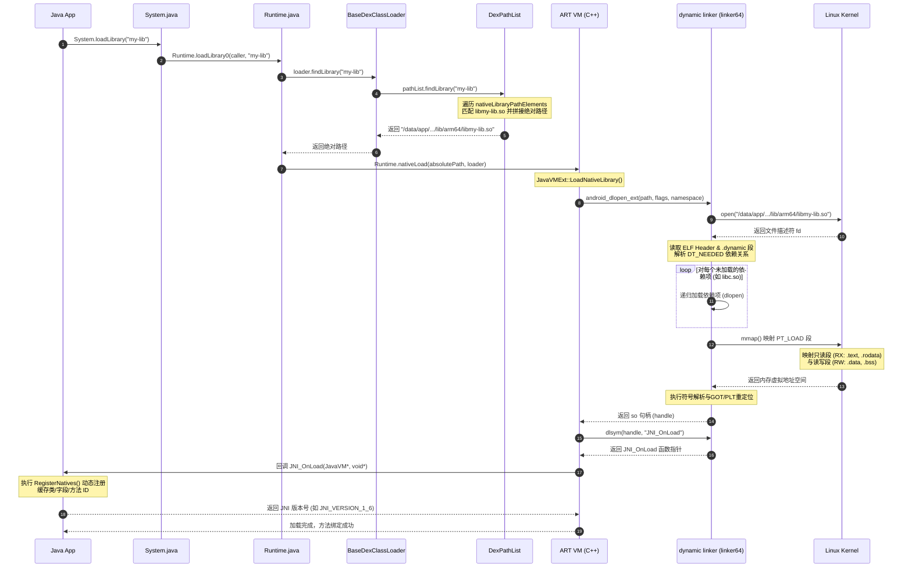

# Android So加载机制与深度原理

在 Android NDK 开发、系统底层适配以及插件化/热修复框架设计中，`.so`（Shared Object）动态链接库的装载与运行机制是连接 Java 运行环境（ART/JVM）与 Linux 内核物理世界的桥梁。作为系统级的核心底座，SO 的加载不仅涉及 Java 层的 API 调用，更涉及 Linux 内核的物理内存映射、动态链接器的符号解析与重定位、ABI 架构的兼容性抉择，以及安全策略的层层演进。

本文将从“是什么”、“为什么”、“怎么做”三个核心维度出发，自上而下对 Android SO 的加载与运行机制进行源码级与物理级的深度剖析。

---

## 1. SO 加载与动态链接库核心概念

### 1.1 什么是动态链接库（.so）？
在 Linux 与 Android 体系下，动态链接库是一种采用 **ELF（Executable and Linkable Format，可执行和可链接格式）** 规范的二进制文件。它包含了已编译的机器码指令、动态符号表、重定位表、调试信息等。

与静态链接库（以 `.a` 为后缀）不同，动态链接库在编译链接期并不与主程序合并，而是作为独立的文件存在。只有在程序运行时，系统才会通过动态链接器将 `.so` 装载进内存，供调用者使用。

#### 动态链接库（.so）与静态链接库（.a）的对比
*   **空间占用与体积**：
    *   **静态链接（.a）**：在编译打包时，静态链接器（如 `ld`）会将静态库中被调用的目标代码段完整拷贝到最终的可生成程序中。这会导致可执行文件的体积急剧膨胀。如果有多个模块引用了同一个静态库，会在程序中产生多份物理代码的冗余副本。
    *   **动态链接（.so）**：程序中仅保留对动态库的符号引用和名称声明。库本身的二进制数据独立存放在单独的 `.so` 文件中，这为 Android 应用缩减 APK 物理包体积提供了基础保证。
*   **内存共享机制**：
    *   **静态链接**：每个加载静态库的程序在其私有的虚拟内存空间里独立维护一份代码副本，物理内存无法共享。
    *   **动态链接**：当多个应用进程使用相同的动态链接库（例如系统级 C 库 `libc.so`）时，操作系统的虚拟内存管理系统（MMU）可以将这多个进程的虚拟地址映射到同一块只读的物理内存页（.text 代码段）上。这样，物理内存中只需常驻一份代码拷贝，实现了极高效率的内存复用。
*   **模块热拔插与动态演进**：
    *   **静态链接**：一旦静态库代码发生任何修改或缺陷修复，依赖它的整个主程序必须重新经历“编译-链接-打包-分发”的完整闭环。
    *   **动态链接**：只要共享库暴露的二进制接口（ABI 规范，如函数签名、数据结构布局）保持不变，直接在磁盘上替换该 `.so` 文件即可完成局部模块的无感升级，这也是 Android 插件化与热修复技术的核心物理基础。

### 1.2 跨进程与系统模块调用中的 .so 载入运行
在 Android 系统的混合架构中，`.so` 库扮演着衔接 Java 框架层与 Linux 硬件底层的枢纽角色：

```
+--------------------------------------------------------------+
|                    Java 业务层 (App 进程)                     |
+--------------------------------------------------------------+
                               | JNI Call
                               v
+--------------------------------------------------------------+
|            应用自有 SO (libnative-lib.so / 算法库)            |
+--------------------------------------------------------------+
                               | 跨进程 IPC (Binder) / 直连调用
                               v
+--------------------------------------------------------------+
|      系统服务 / 硬件抽象层 (HAL) / 核心库 (libc.so, libm.so)  |
+--------------------------------------------------------------+
```

1.  **应用进程内的 JNI 直连调用**：Java/Kotlin 业务代码通过 Java 本地接口（JNI）直接调用应用自带的 `.so` 文件（如第三方音视频解码库或算法库）。这属于同进程内的跳转，但伴随着 CPU 寄存器状态的保存、虚拟方法栈的切换（Java Stack 切换到 Native Stack）以及参数的序列化传递。
2.  **跨进程系统模块调用（Binder IPC）**：应用框架无法直接访问底层硬件设备。当 App 申请使用摄像头时，会通过 Binder IPC 机制向系统的核心服务守护进程（如 `cameraserver` 进程）发送跨进程请求。该系统进程在启动初始化时，已经通过底层的 Linker 装载了对应的硬件抽象层（HAL）模块。Linker 会解析并将其映射至 `cameraserver` 的进程空间，执行直接操作物理驱动的代码。
3.  **系统关键公共库的高速共享**：Android 系统的核心运行时环境（如 `libart.so`）以及基础 C/C++ 库由系统级的根进程 Zygote 在初始化时率先装载。由于所有的 App 进程都是由 Zygote 进程通过 `fork` 系统调用派生出来的，它们天然继承了 Zygote 进程空间中已装载的核心动态库的内存映射关系，这极大地加快了 App 的冷启动时间。

---

## 2. Java 层加载机制与调用链剖析

在 Java 层，Android 提供了 `System.loadLibrary(String name)` 和 `System.load(String path)` 两个 API。虽然两者最终都在 Native 层触发动态库的装载，但在路径检索、ClassLoader 绑定及适用场景上有着清晰的边界划分。

### 2.1 System.loadLibrary(name) 与 System.load(path) 的对比

| 对比维度 | `System.loadLibrary(String libName)` | `System.load(String absolutePath)` |
| :--- | :--- | :--- |
| **参数形式** | **库的简写名称**。例如：传入 `"native-lib"`。 | **绝对物理文件路径**。例如：传入 `"/data/data/com.example/files/libnative-lib.so"` |
| **检索方式** | **委派 ClassLoader 自动检索**。系统会在 ClassLoader 关联的 `nativeLibraryDirectories` 路径下遍历查找匹配的文件。 | **直接指定装载**。跳过一切 ClassLoader 的路径搜索逻辑，直接打开指定物理路径的文件。 |
| **命名适配** | **自动补全**。在 Android（Linux）平台会自动拼接前缀 `"lib"` 和后缀 `".so"`，从而将 `"native-lib"` 映射为 `"libnative-lib.so"`。 | **无自动转换**。必须提供包含完整前缀、后缀以及扩展名的绝对文件名，否则抛出装载异常。 |
| **典型应用场景**| 绝大多数常规开发场景。应用随 APK 一同打包的自研库或第三方 SDK 库，安装后自动置于应用的包 lib 目录下。 | 1. 插件化、热修复框架下，从网络动态下发至私有存储目录的 SO 装载；<br>2. 系统或特定厂商定制路径下的特许 SO 加载。 |
| **安全性约束** | 受限于 ClassLoader 的命名空间隔离保护，无法跨应用越权访问其他应用的私有 SO 目录。 | 受到高版本 Android [W^X（可写或可执行）安全沙盒策略](../../../../../../AndroidVersionChangeLog.md#android-10api-29) 的物理限制，严禁在可写路径下直接映射并执行代码。 |

---

### 2.2 源码级调用链追踪：从 Java 到 C++ Runtime

下面以 Android 10+ 系统的 AOSP 源码为基准，追踪 `System.loadLibrary` 从 Java 侧入口一直到底层 ART 虚拟机执行 `dlopen` 的完整代码调用链。

#### Java 侧调用链时序分析



#### Step 1: System.java 的入口转发
`System.loadLibrary` 会获取发起该调用的 Caller 类的 ClassLoader 实例，以此确定加载路径的权限范围。
```java
// libcore/ojluni/src/main/java/lang/System.java
public static void loadLibrary(String libname) {
    // 转发给 Runtime 实例，同时传入调用者所在的 Class 实例以获取其 ClassLoader
    Runtime.getRuntime().loadLibrary0(Reflection.getCallerClass(), libname);
}
```

#### Step 2: Runtime.java 中的 ClassLoader 获取与检索
在 `Runtime.java` 中，系统会判断当前的 `ClassLoader` 是否为空。如果为空，说明是由底层的系统核心类发起的调用，此时将直接检索系统的系统共享库路径。
```java
// libcore/ojluni/src/main/java/lang/Runtime.java
synchronized void loadLibrary0(Class<?> fromClass, String libname) {
    // 1. 获取调用者的 ClassLoader
    ClassLoader classLoader = ClassLoader.getClassLoader(fromClass);
    
    // 2. 如果 ClassLoader 为空（说明是 BootClassLoader，用于加载系统类，如 java.lang 包下的核心类）
    if (classLoader == null) {
        // 直接在系统 library 路径中查找（如 /system/lib64, /vendor/lib64 等）
        String filename = System.mapLibraryName(libname);
        // 调用底层的 nativeLoad 直接传入系统绝对路径进行加载
        String error = nativeLoad(filename, null);
        if (error != null) {
            throw new UnsatisfiedLinkError(error);
        }
        return;
    }
    
    // 3. 利用 App 的 ClassLoader 检索库文件的绝对路径
    String libraryName = libname;
    String filename = classLoader.findLibrary(libraryName);
    if (filename == null) {
        // 找不到则抛出著名的 UnsatisfiedLinkError
        throw new UnsatisfiedLinkError(classLoader + " couldn't find \"" +
                                       System.mapLibraryName(libraryName) + "\"");
    }
    
    // 4. 执行底层的本地加载
    String error = nativeLoad(filename, classLoader);
    if (error != null) {
        throw new UnsatisfiedLinkError(error);
    }
}
```

#### Step 3: DexPathList 遍历 nativeLibraryPathElements
在 Android 系统中，App 的 ClassLoader 主要是 `PathClassLoader`。它继承自 `BaseDexClassLoader`，其内部持有一个 `DexPathList` 实例。
当 `findLibrary` 触发时，系统会优先在其内部遍历两个核心目录集合：
1.  **应用私有 SO 检索路径**：即 `nativeLibraryDirectories`，在安装时由 PMS 将 APK 中的 SO 文件解压至对应的数据区目录（如 `/data/app/.../lib/arm64`）。
2.  **系统级默认共享路径**：即 `systemNativeLibraryDirectories`。这些目录在类加载器启动时由 JVM 通过读取系统的 `java.library.path` 环境变量静态初始化，默认包含了 `/system/lib64`、`/vendor/lib64`、`/odm/lib64`、`/product/lib64` 等底层共享库地址。

```java
// libcore/dalvik/src/main/java/dalvik/system/DexPathList.java
public String findLibrary(String libraryName) {
    // 1. 拼接为平台特有的文件名，例如 "native-lib" -> "libnative-lib.so"
    String fileName = System.mapLibraryName(libraryName);
    
    // 2. 顺序遍历 nativeLibraryPathElements 数组
    for (NativeLibraryElement element : nativeLibraryPathElements) {
        String path = element.findNativeLibrary(fileName);
        if (path != null) {
            return path; // 一旦找到立即返回，实现了“路径先占原则”
        }
    }
    return null;
}
```

#### Step 4: 进入底层 C++ ART VM 的 nativeLoad
在 `Runtime.java` 中声明了本地方法 `nativeLoad`：
```java
private static native String nativeLoad(String filename, ClassLoader loader);
```
在 ART 虚拟机初始化时，会在 `art/runtime/native/java_lang_Runtime.cc` 中将该 Native 方法绑定到底层的 C++ 函数 `Runtime_nativeLoad`：
```cpp
// art/runtime/native/java_lang_Runtime.cc
static jstring Runtime_nativeLoad(JNIEnv* env, jclass, jstring javaFilename, jobject javaLoader) {
  // 1. 将 Java 层的 filename 转换为 C++ 的 ScopedUtfChars 字符串
  ScopedUtfChars filename(env, javaFilename);
  if (filename.c_str() == nullptr) {
    return nullptr;
  }

  // 2. 获取当前线程的 ClassLoader 对象
  ScopedObjectAccess soa(env);
  StackHandleScope<1> hs(soa.Self());
  Handle<mirror::ClassLoader> class_loader(hs.NewHandle(
      soa.Decode<mirror::ClassLoader>(javaLoader)));

  std::string error_msg;
  // 3. 调用 JVM 内部的加载实现类 JavaVMExt
  bool success = soa.Vm()->LoadNativeLibrary(env, filename.c_str(), class_loader, &error_msg);
  if (!success) {
    return env->NewStringUTF(error_msg.c_str()); // 返回错误信息给 Java 层抛出异常
  }
  return nullptr;
}
```
进入核心的 `art/runtime/java_vm_ext.cc`，执行 `JavaVMExt::LoadNativeLibrary` 函数：
```cpp
// art/runtime/java_vm_ext.cc
bool JavaVMExt::LoadNativeLibrary(JNIEnv* env, const std::string& path,
                                  Handle<mirror::ClassLoader> class_loader, std::string* error_msg) {
  // 1. 查找是否已经加载过此 SO
  SharedLibrary* library = nullptr;
  {
    MutexLock mu(Thread::Current(), *Locks::jni_libraries_lock_);
    library = libraries_->Find(path); // 维护的 JNI 库映射表，用于避免同一SO在同一进程中被加载多次
  }
  if (library != nullptr) {
    // 如果已经加载成功，直接返回，避免重复 dlopen 浪费性能
    return library->CheckInit(env, error_msg);
  }

  // 2. 针对 Android 7.0+ 获取 ClassLoader 对应的命名空间 (Namespace)
  // 如果是空 ClassLoader (系统核心库)，使用系统的 Namespace
  void* handle = nullptr;
  android_namespace_t* ns = nullptr;
  if (class_loader != nullptr) {
    ns = FindNativeLoaderNamespaceByClassLoader(env, class_loader.Get());
  }

  // 3. 调用底层的动态链接器接口进行物理装载
  if (ns != nullptr) {
    // 带有 Namespace 隔离机制的动态加载（Linker 强约束规则）
    android_dlextinfo extinfo;
    extinfo.flags = ANDROID_DLEXT_USE_NAMESPACE;
    extinfo.library_namespace = ns;
    handle = android_dlopen_ext(path.c_str(), RTLD_NOW, &extinfo);
  } else {
    // 标准 dlopen (对于系统类装载)
    handle = dlopen(path.c_str(), RTLD_NOW);
  }

  if (handle == nullptr) {
    *error_msg = dlerror(); // 抓取 Linker 返回的物理错误
    return false;
  }

  // 4. 将句柄 handle 保存到 libraries_ 缓存表中，并准备调用 JNI_OnLoad
  // ... (下文生命周期章节继续细化调用 JNI_OnLoad 流程)
  return true;
}
```

---

## 3. Native 链接器（Linker）与 ELF 映射深度解密

一旦进入 `dlopen` 或 `android_dlopen_ext`，控制权将从 ART 虚拟机转移到系统的动态链接器中。在 Android 系统上，动态链接器是 **Bionic** 库的一部分，其可执行文件物理路径为 `/system/bin/linker`（32 位）和 `/system/bin/linker64`（64 位）。

### 3.1 ELF 文件格式与依赖加载递归解析

ELF 文件格式定义了二进制文件在磁盘和内存中的组织形态。在动态链接过程中，Linker 主要关注以下结构：

#### Bionic 链接器中 ELF 结构体定义说明
在底层的 C++ 实现中，Linker 是通过读取标准的 ELF 结构体来解析 SO 文件的。以下为常见的 64 位 ELF 关键结构体定义：

*   **ELF 头部描述结构体（Elf64_Ehdr）**：
    ```cpp
    typedef struct {
        unsigned char e_ident[16]; /* ELF 魔数 "\x7fELF"、32/64位元信息、大小端格式等 */
        Elf64_Half    e_type;      /* 文件类型：ET_DYN 代表动态库 */
        Elf64_Half    e_machine;   /* 目标 CPU 架构：EM_AARCH64 代表 64位 ARM */
        Elf64_Word    e_version;   /* 版本号 */
        Elf64_Addr    e_entry;     /* 程序的入口虚拟地址 (SO 库中通常为 0) */
        Elf64_Off     e_phoff;     /* 程序头表 (Program Header Table) 在文件中的偏移量 */
        Elf64_Off     e_shoff;     /* 节头表 (Section Header Table) 在文件中的偏移量 */
        // ... 其他对齐及尺寸字段
    } Elf64_Ehdr;
    ```
*   **程序头表段描述符（Elf64_Phdr）**：
    ```cpp
    typedef struct {
        Elf64_Word  p_type;   /* 段类型：PT_LOAD (装载段)、PT_DYNAMIC (动态链接信息) */
        Elf64_Word  p_flags;  /* 段权限：PF_X (可执行)、PF_W (可写)、PF_R (可读) */
        Elf64_Off   p_offset; /* 该段在磁盘文件中的起始偏移量 */
        Elf64_Addr  p_vaddr;  /* 该段映射到虚拟内存中的首地址 (相对地址) */
        Elf64_Addr  p_paddr;  /* 物理地址，在 Android 等虚拟内存系统上无实际意义 */
        Elf64_Xword p_filesz; /* 该段在物理文件中的大小 */
        Elf64_Xword p_memsz;  /* 该段在内存中所占虚拟空间的大小 (p_memsz >= p_filesz，多出部分为 .bss 段，置为零) */
        Elf64_Xword p_align;  /* 内存映射对齐约束，通常为 0x1000 (4 KB) 或 0x4000 (16 KB) */
    } Elf64_Phdr;
    ```
*   **动态链接条目（Elf64_Dyn）**：
    ```cpp
    typedef struct {
        Elf64_Sxword d_tag;   /* 动态项标记类型：DT_NEEDED (依赖项)、DT_PLTGOT (GOT地址) 等 */
        union {
            Elf64_Xword d_val; /* 数值信息 */
            Elf64_Addr  d_ptr; /* 地址信息 */
        } d_un;
    } Elf64_Dyn;
    ```

#### dlopen 递归依赖加载解析与深层循环依赖处理
当 Linker 尝试通过 `dlopen` 装载一个 SO 时，它的执行逻辑如下：

*   **读取 .dynamic 段寻找依赖**：Linker 解析被载入 SO 的 `.dynamic` 段，提取所有标记为 **`DT_NEEDED`** 的元素。每个 `DT_NEEDED` 记录了当前库所需的另一个共享库的名称。
*   **构建依赖树进行递归装载**：Linker 使用**深度优先搜索（DFS）**或**广度优先搜索（BFS）**算法递归地查找并加载所有的依赖项。
*   **循环依赖与防重加载机制**：为了防止多个库之间存在双向或多向依赖（如库 A 依赖库 B，库 B 反向依赖库 A），Linker 内部维护了一个全局已装载的共享库节点图（即 `soinfo` 结构体链表）。
*   **搜索路径决策与命名空间隔离（Linker Namespace）**：
    *   在 Android 7.0 之前，Linker 在全局默认路径中搜寻依赖项。
    *   自 [Android 7.0 (API 24)](../../../../../../AndroidVersionChangeLog.md#android-70--71api-24--25) 起，系统为了防止应用调用未公开的系统私有 Native 库，引入了 **Linker Namespace（命名空间隔离）**。
    *   **隔离的物理设计**：系统为“应用层”和“平台系统层”分别设计了独立的 Namespace 节点。在通常情况下，这两个空间是不互通的。
    *   如果应用层加载的 SO 隐式依赖了系统内部私有库，Linker 会因为隔离屏障判定当前 Namespace 无权访问该物理路径，抛出错误。

#### Treble 架构下的 VNDK 与多分区隔离适配
在 [Android 8.0 (API 26)](../../../../../../AndroidVersionChangeLog.md#android-80--81-api-26--27) 引入 **Project Treble** 后，Linker Namespace 被赋予了更深层次的架构使命。为了实现 Vendor 分区（产商驱动）与 System 分区（谷歌系统框架）的解耦，系统将动态库划分为多个命名空间群。
通过定义独立的命名空间（如 `default`、`vndk`、`rs`），系统禁止 `vendor` 分区下的动态链接库直接 dlopen 载入 `system` 目录下的私有动态链接库（反之亦然），从而建立起了硬件抽象和系统框架之间的坚实沙盒隔离。
*   **ld.config.txt 规则配置**：系统对 Linker Namespace 的隔离和导出限制，主要是通过解析位于 `/system/etc/ld.config.txt`（或对应分区的配置文件）来控制的。该文本规定了各命名空间（如 `[system]`、`[vendor]`）的 `search.paths`（搜索目录）和 `permitted.paths`（准许目录）。若尝试加载的文件不在 permitted 目录内，Linker 将强行予以拦截。

---

### 3.2 android_dlopen_ext 的扩展参数与直接免提取加载（从 APK 内部加载）
在 Android 6.0+ 起，为了避免大型 SO 库在安装时重复解压占用闪存空间，Linker 引入了利用 `android_dlopen_ext` 直接从 APK 压缩包内映射 SO 的能力：

#### android_dlextinfo 结构体定义
```cpp
typedef struct {
    uint64_t flags;             /* ANDROID_DLEXT_USE_LIBRARY_FD 等控制标志 */
    int      library_fd;        /* APK 文件的文件描述符 */
    off64_t  library_fd_offset; /* SO 在 APK 文件内部的物理偏移字节量 */
    // ...
} android_dlextinfo;
```
*   **物理通路**：ClassLoader 并不提取 SO 到磁盘，而是通过 `ZipFile` 找到该 `.so` 的不压缩存储偏移（Store 存储模式，要求 SO 必须 4 KB 或 16 KB 对齐且无压缩存放在 APK 内部）。
*   ClassLoader 直接打开 APK 文件获取其 `library_fd`，将偏移量写入 `library_fd_offset`。
*   Linker 内部直接执行 `mmap` 时，将该文件描述符与偏移量传入。这避免了把 SO 文件解压解密写入闪存，节省了磁盘空间与解密耗时。

#### 16 KB 页对齐适配约束的底层细节与物理页面映射
*   在早期 Android 版本中，系统的虚拟内存是以 **4 KB** 为一个内存页（Page Size）进行管理。这意味着所有的 `PT_LOAD` 段在物理文件中的文件偏移以及映射到虚拟内存的虚拟起始地址，都必须是 4 KB 的整数倍。
*   自 [Android 15 (API 35)](../../../../../../AndroidVersionChangeLog.md#android-15api-35) 起，Android 系统开始引入对 **16 KB 页大小**（16 KB Memory Page Size）的硬性兼容，并在 [Android 16 (API 36)](../../../../../../AndroidVersionChangeLog.md#android-16api-36) 中全面铺开。这旨在利用更大页面带来的硬件缓存（TLB）排队开销降低与硬件缓存命中率提升，来优化高负载场景下的运行性能。
*   **编译对齐 CMake 命令示例**：
    在 CMakeLists.txt 中，可以加入以下配置以确保在编译时完成 16 KB 对齐：
    ```cmake
    # 强制将 AArch64 链接参数中的 max-page-size 设定为 16384 (16 KB)
    set(CMAKE_SHARED_LINKER_FLAGS "${CMAKE_SHARED_LINKER_FLAGS} -Wl,-z,max-page-size=16384")
    ```

---

### 3.3 符号解析与重定位（GOT 与 PLT）

因为 SO 库是在运行时随机映射进进程的任意虚拟内存地址的（受 ASLR 内存地址空间布局随机化影响），所以它无法在编译期确定外部依赖函数的绝对物理地址。为了解决这一问题，ELF 引入了 **GOT（Global Offset Table，全局偏移表）** 和 **PLT（Procedure Linkage Table，过程链接表）** 机制。

#### 重定位 of 物理通路

```
[只读的代码段 (.text)]                      [可写的数据段 (.got / .got.plt)]       [共享库目标代码段]
  调用函数:
  call PLT_entry -------------------------> 跳转到 GOT 指针地址 -------------> 目标函数的物理地址
                                                   | 
                                                   v (首次调用，若未解析)
                                            回跳至 Linker 符号查找程序 
                                                   |
                                                   +------ 写回解析后的绝对地址
```

1.  **PLT 表项** 位于只读的 RX 代码段中，属于模板性桩代码。
2.  **GOT 表项** 位于可读写的 RW 数据段中，保存的是外部符号的虚拟内存指针。
3.  **重定位过程与绑定模式**：
    *   当 SO 中的代码调用一个外部函数时，编译器在汇编指令里不会写死绝对地址，而是将跳转指令指向 PLT 中对应的表项。
    *   PLT 中的第一条指令是去读取 GOT 表中存储的指针并跳转。
    *   **立即绑定（Eager Binding）**：Android Linker 在通过 `dlopen` 成功映射并装载 SO 时，会立即遍历重定位表（如 `.rel.dyn` 和 `.rel.plt`），计算外部符号的真实内存地址，并把该值覆写到 GOT 表的相应表项中。

#### GOT 重定位在底层的物理结构（重定位表项）
动态链接器解析外部符号地址时，是通过重定位段（例如 `.rela.dyn` 或 `.rela.plt`）的表项进行修正的。一个标准的 64 位重定位条目定义如下：
```cpp
typedef struct {
    Elf64_Addr  r_offset; /* 需要被修正的内存 GOT 地址 (相对偏移) */
    Elf64_Xword r_info;   /* 包含需要定位的符号表索引值及重定位类型 */
    Elf64_Sxword r_addend; /* 辅助常数加数 */
} Elf64_Rela;
```
Linker 会通过读取 `r_info` 中的符号索引到 `.dynsym`（动态符号表）中检索出对应的符号字符串，然后去依赖库的动态符号表里计算出目标函数的加载基址，再将绝对虚拟地址写回 `r_offset` 指向的可写 GOT 地址中。

---

### 3.4 Android 压缩重定位表机制（APS2 / Android Packed Relocations）
*   **设计初衷**：在包含大量 C++ 模板的大型 Native 项目中，重定位表会占据 SO 文件近 20% 以上的体积。
*   **压缩重定位段**：为了减少文件体积与网络分发成本，Android 引入了非标准的重定位格式，标记为 `SHT_ANDROID_REL` 或 `SHT_ANDROID_RELA`。
*   **压缩算法**：该机制将传统的 `Elf64_Rela` 数组转换为**以 LEB128 变长编码的压缩字节流**。LEB128 能够极好地利用重定位偏移量连续递增的物理特征进行差值编码（Delta Encoding）。
*   **运行期解析**：当 Linker 载入 SO 时，会先识别 `.dynamic` 段中的压缩标记，在重定位阶段通过内部的解压引擎实时还原出 `r_offset` 和 `r_addend`，随后完成GOT表写入。这一优化虽然为 Linker 初始化增加了轻微的解压计算量，但对包体积优化带来了质的飞跃。

---

## 4. JNI_OnLoad 运行机制与生命周期

一旦 Linker 完成了 SO 的内存映射、重定位和符号解析，`dlopen` 函数将成功返回。ART 虚拟机随之执行 JNI 环境绑定与 JNI_OnLoad 回调。

### 4.1 JVM 回调 JNI_OnLoad 源码
当 `dlopen` 成功后，虚拟机在 `art/runtime/java_vm_ext.cc` 中的 `JavaVMExt::LoadNativeLibrary` 会尝试获取该 SO 的 `JNI_OnLoad` 函数符号。如果实现该符号，ART 会当即发起回调。

---

### 4.2 JNI_OnLoad 的三大核心任务

一个规范的 NDK SO 库，应当在 `JNI_OnLoad` 中集中完成核心的系统注册和缓存初始化工作。

#### 核心任务 1：向 JVM 返回规范版本号
告知虚拟机应当前以哪个 JNI 版本去解析 native 层的交互协议。目前常用且稳定的返回值是 `JNI_VERSION_1_6`。

#### 核心任务 2：执行动态绑定（RegisterNatives）
*   **动态注册**：
    *   函数名可任意命名，通过向 JNI 注册一个 `JNINativeMethod` 结构体数组，显式声明 Java 类方法名、签名描述符与 native 函数指针的一对一绑定关系。
    *   **优点**：无需任何符号猜测与动态匹配，运行期直连，性能极佳，安全性高。

#### JNI 方法描述符常用类型对照表
在进行动态注册时，必须指定精确的方法签名描述符（Method Descriptor）。以下是 Java 数据类型在 JNI 中的映射简写：

| Java 数据类型 | 描述符简写 | JNI 数据类型 |
| :--- | :--- | :--- |
| `boolean` | `Z` | `jboolean` |
| `byte` | `B` | `jbyte` |
| `char` | `C` | `jchar` |
| `short` | `S` | `jshort` |
| `int` | `I` | `jint` |
| `long` | `J` | `jlong` |
| `float` | `F` | `jfloat` |
| `double` | `D` | `jdouble` |
| `void` | `V` | 无对应返回值 |
| `任意类对象` | `L包名/类名;`（注：末尾的分号是类型的一部分，不可遗漏） | `jobject` (或特定子类如 `jstring`) |
| `数组` | `[` + 对应元素类型（例如 `[I` 代表整型数组，`[Ljava/lang/String;` 代表 String 数组） | `jarray` (如 `jintArray`) |

*   **内部类特殊表示**：如果需要引用内部类，必须使用 **`$`** 分隔。例如，包名为 `com.example.app` 的类 `Outer` 下的内部类 `Inner`，其 JNI 描述符表示为 `"Lcom/example/app/Outer$Inner;"`。

#### 核心任务 3：初始化全局 Native 上下文与多线程环境适配（JavaVM 缓存）
JNI 调用中通常面临跨线程回调 Java 的诉求。由于 `JNIEnv` 指针是线程特有的，C++ 端异步线程无法直接复用 Java 主线程传递过来的 `JNIEnv`，否则会直接引发内存越界奔溃。

*   **缓存全局 JVM 指针**：在 `JNI_OnLoad` 中缓存全局的 `JavaVM*` 指针，因为 `JavaVM` 对象在整个虚拟进程中是唯一的、共享的。
*   **异步线程挂载机制（Attach/Detach）**：
    *   在 C++ 新开辟的异步线程中，必须首先通过 `JavaVM->AttachCurrentThread` 将当前 C++ 线程注册并挂载到 ART 虚拟机的线程管理者中，以此换取一个当前 C++ 线程专用的 `JNIEnv` 指针。
    *   在完成反射回调后，必须显式调用 `JavaVM->DetachCurrentThread` 将其从虚拟机上剥离并释放，否则该 Native 线程的退出会引发 ART 进程的全局死锁或资源泄露。
*   **全局类与方法句柄缓存（NewGlobalRef）**：
    *   在 `JNI_OnLoad` 执行时，当前类的 ClassLoader 上下文是最高优先级的。此时，通过 `env->FindClass` 查找 Java 类是唯一百分之百能成功的时期。
    *   在 JNI 方法调用中获得的 `jclass` 和本地对象引用都是**局部引用（Local Reference）**，在当前方法返回时就会自动失效。如果要缓存 `jclass`，必须使用 **`env->NewGlobalRef`** 将其提升为全局引用，并保存在全局指针变量中。

#### JNI_OnLoad 模板代码示例

```cpp
#include <jni.h>
#include <string>
#include <android/log.h>

#define LOG_TAG "NativeBackend"
#define LOGI(...) __android_log_print(ANDROID_LOG_INFO, LOG_TAG, __VA_ARGS__)

// 全局唯一的 JavaVM 指针缓存
static JavaVM* g_javaVM = nullptr;

// 全局缓存的 Java 类引用与 ID
static jclass g_mainActivityClass = nullptr;
static jmethodID g_onNativeCallbackMethod = nullptr;

// 实际执行 native 逻辑的 C++ 函数（不遵循静态注册的长命名规则）
jstring native_hello(JNIEnv* env, jobject thiz) {
    LOGI("Executing native_hello...");
    return env->NewStringUTF("Hello from dynamic registered native-lib!");
}

// 映射表：Java 方法名、签名描述符、Native 函数指针
static JNINativeMethod g_methods[] = {
    {"stringFromJNI", "()Ljava/lang/String;", (void*)native_hello}
};

// JNI_OnLoad 入口
JNIEXPORT jint JNICALL JNI_OnLoad(JavaVM* vm, void* reserved) {
    g_javaVM = vm; // 缓存 JavaVM 句柄，供多线程 Attach 使用
    
    JNIEnv* env = nullptr;
    if (vm->GetEnv((void**)&env, JNI_VERSION_1_6) != JNI_OK) {
        return JNI_ERR; // 获取环境失败，拒绝加载
    }

    // 1. 查找目标 Java 类
    jclass localClass = env->FindClass("com/example/app/MainActivity");
    if (localClass == nullptr) {
        return JNI_ERR;
    }

    // 2. 提升为全局引用，防止被 GC 回收
    g_mainActivityClass = (jclass)env->NewGlobalRef(localClass);
    
    // 3. 缓存回调方法的 MethodID
    g_onNativeCallbackMethod = env->GetMethodID(g_mainActivityClass, "onNativeCallback", "(I)V");
    if (g_onNativeCallbackMethod == nullptr) {
        // 方法不存在也报错
        return JNI_ERR;
    }

    // 4. 执行动态注册
    jint methodsCount = sizeof(g_methods) / sizeof(g_methods[0]);
    if (env->RegisterNatives(g_mainActivityClass, g_methods, methodsCount) < 0) {
        return JNI_ERR;
    }

    LOGI("JNI_OnLoad initialized successfully.");
    return JNI_VERSION_1_6; // 必须返回正确的版本号
}
```

---

### 4.3 JNI_OnUnload 的触发时机与局限性
与 `JNI_OnLoad` 对应，Bionic 在卸载 SO 库时会尝试调用 `JNI_OnUnload`。

*   **触发时机**：当装载当前 SO 库的 `ClassLoader` 实例被 JVM 标记为垃圾，并且被垃圾回收器（GC）彻底回收时。
*   **Android 端的致命局限**：
    *   在标准的 Android App 运行期间，主 ClassLoader（负责加载 Activity、Service 以及业务 so 的 `PathClassLoader`）在整个进程的生命周期内**永远不会被 GC 回收**，除非整个进程被内核杀死（此时所有内存直接被内核回收，不再有回调的物理意义）。
    *   因此，对于标准的 Android App 来说，`JNI_OnUnload` **几乎永远不可能被触发**。
    *   **适用特例**：只有在使用自定义 `DexClassLoader` 动态装载/卸载插件 SO 的场景下，当插件 ClassLoader 被主动解除一切强引用引用并成功 GC 时，才会回调 `JNI_OnUnload`。

---

### 4.4 ART 虚拟机中 JNI 注册函数的底层寻找与执行机制
*   **方法结构描述（ArtMethod）**：在 ART 虚拟机内部，每一个 Java 类的方法都对应一个名为 `ArtMethod` 的 C++ 对象。该对象内部保存了方法的访问权限、字节码地址、以及最核心的执行入口点指针 `entry_point_from_jni_`。
*   **静态注册方法的解析路径**：
    *   当 JVM 首次分发并调用一个未进行 `RegisterNatives` 动态注册的 native 方法时，虚拟机首先会将 `entry_point_from_jni_` 指向一段通用的动态搜寻存根代码（`art_jni_dlsym_lookup_stub`）。
    *   执行该存根时，虚拟机会调用内部函数 `artFindNativeMethod`。该函数内部通过 `dlopen` 返回的各大 SO 库句柄，使用系统的 `dlsym` 执行字符串遍历，以此检索符合 Java 包名规范的静态 C 函数符号。
    *   **缓存回填**：一旦检索成功，虚拟机会将计算出的实际 native 函数物理地址回填写入该方法的 `ArtMethod` 的 `entry_point_from_jni_` 字段。后续的第二次及以后调用，将直接顺着该指针执行，彻底绕过 `dlsym` 的检索阶段。
*   **动态注册方法的解析路径**：
    *   当在 `JNI_OnLoad` 中调用 `RegisterNatives` 时，ART 虚拟机内部直接将传入的 C++ 函数指针写入到目标方法的 `ArtMethod` 的 `entry_point_from_jni_` 中。
    *   此方式在首个方法执行前便完成了回填，彻底避免了首次调用的“搜寻存根”开销，不仅能提升应用的冷启动响应效率，还能规避 dlsym 被劫持的安全隐患。

---

## 5. ABI 兼容性冲突与 UnsatisfiedLinkError 崩溃分析

### 5.1 ABI 兼容性链式关系
在 Android 生态中，硬件层面的 CPU 架构多种多样， ABI 定义了指令集和函数调用的低级规范。

目前 Android 平台支持的四大主流 ABI 及兼容性链条如下：

```
                    +--------------------+
                    |      x86_64        |
                    +--------------------+
                               |
                               v (向下兼容)
                    +--------------------+
                    |       x86          |
                    +--------------------+
                               ^
                               | (兼容模拟器运行 ARM SO)
                    +--------------------+
                    |     arm64-v8a      |
                    +--------------------+
                               |
                               v (向下兼容)
                    +--------------------+
                    |    armeabi-v7a     |
                    +--------------------+
```

*   **arm64-v8a**：基于 ARMv8 架构的 64 位指令集，是目前市面上绝大多数 Android 真机的默认架构。
*   **armeabi-v7a**：基于 ARMv7 架构的 32 位指令集。**arm64-v8a 芯片向下兼容 armeabi-v7a 的运行**。
*   **x86_64 / x86**：Intel/AMD 芯片的 64/32 位架构，主要用于 PC 上的 Android 模拟器。

---

### 5.2 64 位手机上“32位/64位 SO 混合灾难”深度剖析

这是 NDK 适配中最常见、最棘手的线上崩溃元凶。

#### Zygote 的 Primary/Secondary 架构选择机制与 PMS 扫描机制
在 64 位 Android 设备上，系统会同时启动两个 Zygote 进程：一个是主架构 `zygote64`，另一个是辅助兼容架构 `zygote`。
当 App 安装或者更新时，系统中的 `PackageManagerService`（PMS）会主导如下架构检测过程：
1.  **解析 APK 内部文件目录**：PMS 使用 `ZipFile` 打开 APK 包，并检索其内部 `lib/` 文件夹。
2.  **提取主 CPU ABI 信息**：
    *   若在 `lib/` 下包含 `arm64-v8a` 目录且内有 `.so` 文件，系统会将该应用的首选运行架构（`PrimaryCpuAbi`）标记为 `"arm64-v8a"`。
    *   若仅有 `armeabi-v7a`，则标记为 `"armeabi-v7a"`。
    *   该结果会被写入到 `/data/system/packages.xml` 的应用节点配置中。
3.  **Zygote Fork 分配**：
    *   应用冷启动时，`ActivityManagerService`（AMS）向系统的 `Zygote` 守护接口发送启动指令，命令参数中携带了上面存储的 `PrimaryCpuAbi`。
    *   若为 64 位，则由 `zygote64` 派生出应用进程；若为 32 位，则由 `zygote`（32位虚拟机）派生。

#### 混合灾难的物理成因与三方库依赖审查
在大型工程中，崩溃往往不是自研代码导致的，而是因为引入了只提供 32 位 SO 的第三方 SDK。
*   **起因**：例如某旧版地图 SDK 仅提供了 `armeabi-v7a` 的 `libmap.so`，但项目其余部分引入了 `arm64-v8a` 的其他依赖库。
*   **编译期表现**：在编译打包时，Gradle 默认会合并所有模块的动态链接库。这会导致生成的 APK 在 `lib/arm64-v8a` 下有其他 so，但**唯独没有 `libmap.so`**。
*   **运行崩溃**：PMS 判定 App 支持 64 位并用 `zygote64` 启动。当执行到地图界面调用 `System.loadLibrary("map")` 时，系统在 64 位专属检索路径下查找失败，直接抛出 `UnsatisfiedLinkError` 强退。
*   **审查定位手段**：在遇到此类合并缺陷时，开发者可以使用 Gradle 命令进行 Native 依赖的合并结果审查：
    ```bash
    ./gradlew :app:dependencies
    ```
    或者直接到项目编译输出目录 `build/intermediates/merged_native_libs/` 下，手动检查各个 ABI 文件夹下的文件合并清单是否等价，从源头上杜绝“漏配 SO”问题。

---

### 5.3 symbol not found 异常分类与原理解析

```
java.lang.UnsatisfiedLinkError: dlopen failed: cannot locate symbol "some_symbol" referenced by "libxxx.so"
```
这个异常表明 Linker 已经顺利找到了 `.so` 文件，但在运行时解析符号表或重定位 GOT 时，无法在进程的符号链中找到对应的函数定义。常见起因包括：

#### 原因 1：C++ 符号重载导致的 Name Mangling 混淆
*   JNI 的静态绑定搜索器是严格按照**标准的 C 语言符号命名特征**去查找 Java 声明的 Native 方法名称的。如果我们在 C++ 中实现 JNI 接口，却忘记加上 `extern "C"` 关键字，编译器就会用 C++ 的规则混淆该符号，导致 Linker 找不到该函数入口。

#### 原因 2：动态注册中方法签名（JNI Signature）不一致
*   在调用 `RegisterNatives` 时，如果 `JNINativeMethod` 中的参数签名与 Java 声明不匹配（如漏写分号或写错类型），注册操作会直接被 JVM 中止并报错。

#### 原因 3：外部链接库或系统版本 API 差异与 TEXTREL 历史遗留崩溃
*   **跨设备符号缺失**：当编译 SO 时使用的是高版本的 NDK，且代码中调用了高版本系统新增的 Bionic C 库 API。如果该 APK 运行在老旧的低版本 Android 系统设备上，Linker 在载入 SO 执行重定位时，在低版本的 `libc.so` 符号表中找不到此函数的定义，便会报出错误。
*   **TEXTREL（文本重定位）崩溃**：
    *   **现象**：`dlopen failed: has text relocations` 导致程序装载失败。
    *   **演进限制**：自 [Android 6.0 (API 23)](../../../../../../AndroidVersionChangeLog.md#android-60api-23) 起，系统的 Linker **禁止在 Target SDK >= 23 的应用中加载含有 TEXTREL 的库**。
    *   **检测与修复**：使用 NDK 提供的 `readelf -d libxxx.so` 工具检查，若输出中包含 `TEXTREL` 关键字，说明代码不合规。修复时，在 CMakeLists.txt 中配置 `-fPIC` 位置无关代码参数。

---

## 6. 热修复与插件化中的 SO 动态加载方案

在热修复和动态化架构中，核心诉求是**不重新安装 APK，动态下发补丁并使之生效**。

### 6.1 ClassLoader 反射注入机制与 Tinker 补丁原理
Java 层的 SO 加载，本质上是委派给 `BaseDexClassLoader` -> `DexPathList` -> `nativeLibraryPathElements`（`NativeLibraryElement[]`）进行检索的。

#### 非 SDK 接口反射限制与 Tinker 动态规避（双重反射与 JNI 绕过）
自 [Android 9.0 (API 28)](../../../../../../AndroidVersionChangeLog.md#android-9api-28) 起，谷歌开始对非 SDK 接口的反射访问实施了极其严苛的限制。
*   **反射拦截机制**：如果应用直接反射访问 `BaseDexClassLoader` 的 `pathList` 或其内部的 `nativeLibraryPathElements`，系统会通过检测调用栈中的 Caller ClassLoader 属性，直接抛出 `NoSuchFieldException`。
*   **双重反射规避方案**：热修复框架为绕过此限制，会首先反射调用系统的 `getDeclaredMethod` 获取控制权，或者利用底层的 JNI 接口进行绕过。由于 **JNI 层（C++ 层）的反射和字段获取不受平台的非 SDK 反射红线约束**，Tinker 等框架会通过加载一个极其精简的引导 SO，在 Native 层获取 `nativeLibraryPathElements` 的 FieldID 并完成数组替换，随后再退出，巧妙地规避了 Java 层的反射限制。

#### 示例代码：多版本兼容的 ClassLoader SO 注入器 (Kotlin 描述)
```kotlin
import dalvik.system.BaseDexClassLoader
import java.io.File
import java.lang.reflect.Array
import java.lang.reflect.Constructor
import android.os.Build

object SoPatchLoader {

    fun installPatchSo(classLoader: ClassLoader, patchDir: File) {
        if (!patchDir.exists() || !patchDir.isDirectory) return

        try {
            // 1. 获取 BaseDexClassLoader 中的 pathList 属性
            val pathListField = BaseDexClassLoader::class.java.getDeclaredField("pathList")
            pathListField.isAccessible = true
            val dexPathList = pathListField.get(classLoader)

            // 2. 根据系统版本执行分支适配
            if (Build.VERSION.SDK_INT >= Build.VERSION_CODES.O) {
                // Android 8.0+ 适配 (NativeLibraryElement)
                val elementsField = dexPathList.javaClass.getDeclaredField("nativeLibraryPathElements")
                elementsField.isAccessible = true
                val originalElements = elementsField.get(dexPathList) as Array
                
                val elementClass = Class.forName("dalvik.system.DexPathList\$NativeLibraryElement")
                val constructor = elementClass.getDeclaredConstructor(File::class.java)
                constructor.isAccessible = true
                val patchElement = constructor.newInstance(patchDir)

                val newElements = Array.newInstance(elementClass, originalElements.length + 1)
                Array.set(newElements, 0, patchElement)
                System.arraycopy(originalElements, 0, newElements, 1, originalElements.length)
                elementsField.set(dexPathList, newElements)
                
            } else if (Build.VERSION.SDK_INT >= Build.VERSION_CODES.M) {
                // Android 6.0 - 7.1 适配 (Element)
                val elementsField = dexPathList.javaClass.getDeclaredField("nativeLibraryPathElements")
                elementsField.isAccessible = true
                val originalElements = elementsField.get(dexPathList) as Array
                
                val elementClass = Class.forName("dalvik.system.DexPathList\$Element")
                val constructor = elementClass.getDeclaredConstructor(
                    File::class.java,
                    Boolean::class.javaPrimitiveType,
                    File::class.java,
                    Class.forName("dalvik.system.DexFile")
                )
                constructor.isAccessible = true
                val patchElement = constructor.newInstance(patchDir, true, null, null)

                val newElements = Array.newInstance(elementClass, originalElements.length + 1)
                Array.set(newElements, 0, patchElement)
                System.arraycopy(originalElements, 0, newElements, 1, originalElements.length)
                elementsField.set(dexPathList, newElements)
                
            } else {
                // Android 5.0 - 5.1 适配 (File 数组)
                val dirsField = dexPathList.javaClass.getDeclaredField("nativeLibraryDirectories")
                dirsField.isAccessible = true
                val originalDirs = dirsField.get(dexPathList) as Array<File>
                
                val newDirs = Array(originalDirs.size + 1) { File("") }
                newDirs[0] = patchDir
                System.arraycopy(originalDirs, 0, newDirs, 1, originalDirs.size)
                dirsField.set(dirsField, newDirs)
            }
            
        } catch (e: Exception) {
            e.printStackTrace()
            throw e
        }
    }
}
```

---

### 6.2 自定义 System.load 拦截器与规避系统加载器局限
在实际工程实践中，依靠系统的 `System.loadLibrary` 会面临低端 Android 机型升级 APK 时未正确把 APK 内 SO 提取出来的 Bug。

#### ReLinker 库的设计原理与物理安全解压逻辑
KeepSafe 推出的第三方开源库 `ReLinker` 提供了一种高可靠的 SO 加载替代策略。当常规的 `System.loadLibrary` 抛出崩溃时，它会执行以下物理防御逻辑：
1.  **APK 安装路径捕获**：ReLinker 通过反射获取当前应用 `ApplicationInfo` 中的 `sourceDir`，即物理 `base.apk` 的具体磁盘位置。
2.  **ZIP 流式定位与 CRC32 校验**：以 ZIP 输入流方式解压 `base.apk`，在 `lib/<ABI>/` 目录里精确定位到损坏或机制异常 `.so` 文件。在复制前，对其执行 CRC32 校验，确保提取的文件完整无缺。
3.  **原子写入与防局部写入死锁**：解压时，数据先被写入到一个临时文件（如 `libxxx.so.tmp`），写入完毕后再通过文件系统的原子重命名操作（`renameTo`）覆盖原有文件。这能有效防止因磁盘满、并发加载或异常中断导致写入半截 SO 文件，进而导致进程死锁或永久崩溃。
4.  **ABI Fallback 链式回退**：如果在 `arm64-v8a` 目录找不到对应的补丁，ReLinker 会按照系统的 ABI 兼容顺序（如继续寻找 `armeabi-v7a` 目录）尝试提取兼容性的 32 位库进行加载。

#### Android 10+ W^X（写或执行）安全限制深度适配
*   **安全策略升级背景**：自 [Android 10 (API 29)](../../../../../../AndroidVersionChangeLog.md#android-10api-29) 起，针对 target 为 29 或更高版本的应用，系统 SELinux 策略强制实施了 **W^X（Write or Execute）限制**。任何位于应用私有数据目录下的可执行文件，无论其文件权限是否被设为了 `0777`，Linker 都会**强行禁止对其执行 `dlopen` 或加载**。一旦尝试加载这些目录下的 SO，系统会抛出安全异常导致崩溃。
*   **合规应对方案**：对于动态下发加载 SO 的场景，应当积极采用 Google 官方推荐的应用拆分模式（Split APKs），使动态库置于系统专用的、只读的代码目录中，从而避开 W^X 违规。

---

## 7. Native 层的安全防护与对抗技术

由于 SO 库运行于 Java 虚拟机制约之外的 Native 层，通常被视作安全对抗的主战场。对于算法、私有网络协议等敏感业务，开发者常常会采用各种手段对其进行加固和保护。

### 7.1 符号表剥离与名称混淆（Symbol Stripping）
编译出的默认 SO 库包含大量的调试符号和局部变量表，这会让反编译工具能轻易勾勒出函数逻辑。
*   **符号表剔除（Strip）**：在 NDK 编译管线中，应当启用 `strip` 功能。它能从生成的 ELF 动态库中物理移除所有的 `.symtab`（符号表）与 `.strtab`（字符串符号表），只保留动态链接所必须的 `.dynsym`，使逆向工程的符号匹配难度成倍上升。

### 7.2 控制流平坦化与 OLLVM 加固
利用 **OLLVM (Obfuscator-LLVM)** 对 Native 代码进行混淆是目前业内对抗反汇编的核心技术：
1.  **控制流平坦化 (Control Flow Flattening)**：将原本结构清晰的 `if-else` 或循环跳转逻辑打碎，通过引入一个全局状态变量与嵌套的 `switch-case` 结构，将代码平展成一个巨大的分发循环。逆向工具分析时，控制流拓扑结构会呈现出恐怖的“蜘蛛网”形态。
2.  **指令替换 (Instruction Substitution)**：将简单的运算符替换为复杂的等价二进制位运算组合，使汇编指令含义变得晦涩难懂。
3.  **虚假控制流 (Bogus Control Flow)**：在真实的代码逻辑中插入大量永远不会执行到的分支，并在分支内填充干扰性垃圾代码，极大地消耗逆向分析人员的人力。

### 7.3 反调试与反注入机制（ptrace 自附加与 TracerPid 监控）
为了防止逆向者在 Root 手机上使用 GDB/LLDB 挂载应用进程进行内存动态调试，SO 库通常在 `JNI_OnLoad` 中埋设反调试钩子：

*   **ptrace 双进程自挂载**：
    *   在 Linux 下，一个进程同一时间只能被一个调试器通过 `ptrace` 挂载。
    *   **对抗策略**：SO 启动时主动调用 `ptrace(PTRACE_TRACEME, 0, 0, 0)`。这样，如果该进程已经被调试器附加，系统会直接报错；如果未被附加，当前进程将先入为主地被置于“已被自我调试”状态，防止了后续外部 LLDB 的动态注入。
*   **TracerPid 检测**：
    *   应用可定时读取 `/proc/self/status` 虚拟文件，检索 `TracerPid` 字段的值。
    *   如果该值不为 0，说明有外部调试器正在监控当前 App。SO 库内可以当即发起 `kill` 或 `exit` 系统调用强制退栈退出。

### 7.4 内存解密与 W^X 对抗（memfd_create）
在高安全级别的加壳加固（SO 加壳）方案中，为了对抗内存 dump 和 W^X 策略限制，业界引入了基于虚拟匿名文件（memfd_create）的安全加载方案：
*   **加密存储**：补丁 SO 被高度加密存储在 assets 目录或下发。
*   **内存解密与匿名文件映射**：
    *   在 C++ 层读取加密数据并进行对称解密，获得解密后的内存 buffer。
    *   **物理对抗核心**：直接调用 Linux 系统调用 `sys_memfd_create("anonymous_so", MFD_CLOEXEC)`，在内核物理内存中创建一块匿名的文件描述符（FD）。该 FD 不在磁盘上产生物理文件（因此不会违反 W^X 限制，且无法通过普通的文件浏览器抓取）。
    *   将解密的二进制 buffer 写入该 FD 对应的内核缓冲区中。
    *   反射调用带有 Namespace 描述符的 `android_dlopen_ext`，将对应的路径设定为 `/proc/self/fd/<fd_val>`。
    *   **安全意义**：Linker 将直接从内核匿名的 FD 缓冲区映射二进制段。由于这不涉及到向可写物理磁盘文件写入执行代码，巧妙地规避了 Android 10+ 严格 W^X 安全沙盒屏障，同时也实现了高强度防拷贝脱壳。

### 7.5 SO 函数 Hook 防护与代码完整性动态校验
*   **Hook 拦截原理**：黑客常利用 PLT Hook 框架或 Inline Hook 工具篡改 SO 中的核心函数。PLT Hook 会直接覆写可写 GOT 表中的目标函数指针，而 Inline Hook 则直接在 RX 代码段的目标函数起始位置强行写入 5 字节或 8 字节的跳转指令（如 ARM64 下的 `BR X16`），劫持执行流。
*   **代码段内存 CRC/SHA 动态校验**：
    *   为了检测 SO 关键算法或核心链路是否被下断点（`Software Breakpoint`，调试器下断点的物理逻辑就是将目标地址的指令临时替换为中断指令，如 ARM 架构下的 `BRK #0`）或被执行了 Inline Hook，安全壳会启动独立的校验线程。
    *   **执行通路**：读取当前进程的 `/proc/self/maps` 映射记录，圈定目标 SO 的只读代码段（RX）所在的虚拟起始与终止地址。
    *   对这块内存区域中的机器码进行实时的 `CRC32` 或 `SHA-256` 校验和计算。
    *   将实时算出的值与编译期打包入壳的“纯净特征码”进行比对。一旦不一致，说明代码段中被动态塞入了跳转桩或断点指令，SO 库立即引发自我崩溃或拒绝后续计算，从而完成了对动态注入的防守。

---

## 8. SO 加载性能与异步初始化最佳实践

SO 加载本身是一个高度 I/O 密集型且 CPU 密集型的重度操作（涉及文件系统读取、多依赖库递归查找、PT_LOAD 段 mmap 以及数十个 GOT/PLT 符号重定位计算）。如果 SO 体积庞大，同步载入会显着拖慢应用的启动冷时长。

### 8.1 耗时分析与启动阻塞评估
在应用冷启动时同步加载大型 SO（如大小为几十MB的 3D 渲染引擎、排队人脸识别库或 WebView Core），可引发 **100ms - 300ms** 级别的主线程阻塞。如果在此生命周期内伴随大屏绘制，极易诱发系统 ANR。

### 8.2 异步预加载与屏障设计（CountDownLatch 方案）
为了避免阻塞主线程，开发者可以通过后台工作线程异步加载，并通过屏障机制防止 native 方法因提前调用触发 UnsatisfiedLinkError 崩溃。

#### 异步加载管理器设计
```kotlin
import java.util.concurrent.CountDownLatch
import java.util.concurrent.Executors

object NativeLibLoader {
    private val executor = Executors.newSingleThreadExecutor()
    private val loadLatch = CountDownLatch(1)
    
    @Volatile
    private var isLoadSuccess = false

    // 开启异步加载
    fun initAsync() {
        executor.execute {
            try {
                // 执行 I/O 和重定位运算
                System.loadLibrary("heavy-native-lib")
                isLoadSuccess = true
            } catch (e: UnsatisfiedLinkError) {
                e.printStackTrace()
                isLoadSuccess = false
            } finally {
                loadLatch.countDown() // 释放加载栅栏
            }
        }
    }

    // 业务在调用 native 方法前的安全守护锁屏障
    fun ensureLoaded() {
        try {
            loadLatch.await() // 挂起调用线程，直至异步加载完成。若是主线程会在此处短暂停顿
            if (!isLoadSuccess) {
                throw UnsatisfiedLinkError("heavy-native-lib load failed in background thread")
            }
        } catch (e: InterruptedException) {
            Thread.currentThread().interrupt()
        }
    }
}
```

---

## 9. NDK 核心安全与链接命令详解（编译与调试工具链）

在开发与适配期间，善用 NDK 自带的分析工具是排查各类 `UnsatisfiedLinkError` 及对齐灾难的利器。

### 9.1 动态链接信息查询（readelf）
`readelf` 是解析 ELF 文件最为底层的工具，在 `/Users/lizhiyang/Desktop/AndroidKnowledge/`（可查阅 [NDK与Native](../5.2.6.NDK与Native.md) 核心配置）的预装 NDK toolchains 下可获得。
*   **查看 ELF 头部架构对齐**：
    ```bash
    $AARCH64-linux-android-readelf -h libxxx.so
    ```
    输出中的 `Machine` 字段会指明是否是 `AArch64` 或 `ARM`。
*   **查看依赖列表（DT_NEEDED 项）**：
    ```bash
    $AARCH64-linux-android-readelf -d libxxx.so
    ```
    **输出结构分析**：该命令会打印动态段 `.dynamic` 的全局表项。例如：
    ```
    Dynamic section at offset 0x3d00 contains 28 entries:
      Tag        Type                         Name/Value
      0x0000000000000001 (NEEDED)             Shared library: [liblog.so]
      0x0000000000000001 (NEEDED)             Shared library: [libc.so]
      0x000000000000000e (SONAME)             Library soname: [libnative-lib.so]
    ```
    输出中所有的 `(NEEDED)` 行都指代物理依赖库。如果系统找不到对应的依赖，加载便会告吹。
*   **查看重定位段**：
    ```bash
    $AARCH64-linux-android-readelf -r libxxx.so
    ```

### 9.2 符号表解析（nm）
`nm` 用于列出目标文件中的符号表。
```bash
$AARCH64-linux-android-nm -u libxxx.so
```
*   **`-u` 参数说明**：此参数表示“列出所有未定义的符号（Undefined Symbols）”。这些符号代表该 SO 运行期必须依赖外部环境注入（如来自其他 so）。如果在此列表看到了不该出现的私有符号，多半就是 `UnsatisfiedLinkError: symbol not found` 的前兆。
*   **输出示例**：
    ```
    U _JNIEnv::RegisterNatives(_jclass*, JNINativeMethod const*, int)
    U __android_log_print
    U strlen
    ```
    若看到依赖项未被成功定义，需要检查是否链接了对应库或缺失了实现符号。

### 9.3 崩溃堆栈行号还原（addr2line）
当 SO 内部发生崩溃，系统日志只会吐出底层寄存器的 16 进制虚拟偏移地址（如 `pc 000000000001a4e8`）。
```bash
$AARCH64-linux-android-addr2line -C -f -e libxxx.so 000000000001a4e8
```
*   **参数与编译器优化影响说明**：
    *   `-C`：还原被 C++ Name Mangling 混淆的原始函数签名；
    *   `-f`：展示出错的具体函数名称；
    *   `-e`：指定对应的含有调试符号信息的原生 SO 物理包。
*   **物理文件差异（Debug vs Release）**：Debug 版本的 SO 未经剥离（含有完整的 `.debug_info`、`.debug_line` 节），体积较大，用于在 `addr2line` 中还原行号。而 Release 版本的 SO 经过了 `strip` 命令裁剪去除了这些庞大的调试信息，因此无法直接使用 `addr2line` 还原符号，必须通过构建归档时备份的带符号库（Symbolic SO）进行对照解析。此外，在进行 `-O2` 或 `-O3` 级别的编译器高级优化时，部分函数会被执行“内联展开（Inline Expansion）”或“循环展开”，导致还原的行号产生微小偏差，开发者调试时需结合汇编上下文进行细致判定。

---

## 10. UnsatisfiedLinkError 崩溃诊断与排查全链路工作流

当遇到线上 SO 加载或绑定崩溃时，建议遵循以下结构化的诊断漏斗开展排查：

```
[UnsatisfiedLinkError 崩溃发生]
         |
         +--> 漏斗第一层： couldn't find "libxxx.so"
         |       |
         |       +---> 检查 APK 解压目录：APK 的 zip 包里是否有该 SO？是否被混用 ABI 过滤掉？
         |       +---> 检查 ClassLoader 路径：ClassLoader.nativeLibraryDirectories 是否匹配？
         |       +---> 检查动态下发路径：Android 10+ 是否违反了 W^X 策略？
         |
         +--> 漏斗第二层： cannot locate symbol "foo"
         |       |
         |       +---> 使用 readelf -d：该 SO 所依赖的所有 Needed 库在设备上是否都能找到？
         |       +---> 使用 nm -u：未定义符号 "foo" 是否缺失？C++ 实现是否遗漏了 extern "C" 声明？
         |       +---> 检查 NDK targetSdkVersion 编译水位：是否使用了低版本系统不存在的系统 Bionic 符号？
         |
         +--> 漏斗第三层： has text relocations (TEXTREL)
                 |
                 +---> 检查 Linker 限制：是否在 Target SDK >= 23 的设备上运行了含有文本重定位的旧 so？
                 +---> 重新编译修复：在编译参数中补齐 -fPIC，剔除内联汇编中的绝对物理地址寻址。
```

### 10.1 典型崩溃诊断实战与源码还原

为了加深对 UnsatisfiedLinkError 的调试感知，以下针对诊断漏斗中各层给出具体日志及底层的物理修复机制。

#### 实战 1：Java 检索路径崩溃（couldn't find "libxxx.so"）
*   **典型日志特征**：
    ```
    java.lang.UnsatisfiedLinkError: dalvik.system.PathClassLoader[DexPathList[[zip file "/data/app/com.example-abcd/base.apk"],nativeLibraryDirectories=[/data/app/com.example-abcd/lib/arm64, /system/lib64, /product/lib64]]] couldn't find "libxxx.so"
    ```
*   **诊断思路**：
    通过读取日志中输出的 `nativeLibraryDirectories`，可以看到 ClassLoader 当前绑定的物理检索路径。
    *   若应用运行于 64 位（如 `lib/arm64`），而 APK 包解压后该目录下确实不存在 `libxxx.so`，系统便抛出此错。
    *   排查时应当解压 APK，验证 `lib/arm64-v8a` 目录中是否因为 gradle 配置的 abiFilters 导致被剔除，或者被误放在了 `armeabi-v7a` 目录下。

#### 实战 2：RegisterNatives 动态绑定崩溃（cannot locate method signature）
*   **典型日志特征**：
    ```
    java.lang.UnsatisfiedLinkError: JNI_ERR returned from JNI_OnLoad in "/data/app/com.example-abcd/lib/arm64/libnative-lib.so"
    ```
    或者是伴随虚拟机底层报错：
    ```
    art E 12345 12345 RegisterNatives failed for "com/example/MainActivity"; methods: stringFromJNI ()Ljava/lang/String;
    ```
*   **物理成因**：
    通常是 Java 声明的方法在 `JNINativeMethod` 中进行了绑定，但在 JNI 方法名或描述符出现了大小写拼写、分号缺失或参数类型描述不一致。
    由于 JVM 寻找不到匹配的方法结构，导致 JNI_OnLoad 返回了 `JNI_ERR`（-1），从而使系统中止了 SO 加载链。

#### 实战 3：汇编代码中的文本重定位缺陷（has text relocations）
*   **汇编底层的错误写法示例**：
    在 32 位或旧版 ARM 汇编中，未经 PIC 优化的全局变量寻址常被写为：
    ```assembly
    .section .text
    ldr r0, =global_var  @ 绝对物理地址寻址！这会在编译时产生一个位于代码段（.text）的重定位项
    ```
    当 Linker 试图装载该 SO 时，为了写入 `global_var` 的运行时物理地址，它不得不向代码段的内存写入数据，触发 `TEXTREL` 异常并阻断装载。
*   **符合安全 PIC 规范的 ARM64 汇编写法**：
    在 ARM64 汇编中，正确的写法应当改用相对寻址（基于 GOT 表）：
    ```assembly
    .section .text
    adrp x0, :got:global_var        @ 1. 获取全局偏移表所在页的虚拟地址
    ldr  x0, [x0, :got_lo12:global_var] @ 2. 通过页内偏移，从 GOT 表中读取变量的绝对地址
    ```
    由于只修改了 GOT（属于 RW 数据段），RX代码段自始至终保持只读，安全地规避了 TEXTREL 崩溃，也满足了 Android 6.0+ 的 Linker 安全检查规范。

---

### 10.2 NDK 底层调试最佳实践诊断清单
在线上或本地出现 NDK 加载崩溃时，建议研发团队检查以下清单：
1.  **Linker 诊断日志（debug.ld.all）**：
    在 Root 设备上，可以通过设置以下系统属性，开启 Linker 极度详细的运行期搜索及加载日志：
    ```bash
    adb shell setprop debug.ld.all 1
    ```
    开启后，Linker 在执行 dlopen 时会对每一次路径搜索、Namespace 绑定、依赖解析以及重定位写入输出 verbose 级别的 logcat 报告，是动态链接调试的终极排障抓手。
2.  **APK 分析仪验证**：在 Android Studio 中打开 `Build -> Analyze APK...`，检查目标 APK 中的 `lib/` 文件夹下是否对称包含所有 ABI 目录，确保无漏打包。
3.  **内存映射状态检查**：当进程挂起或运行中，可以通过以下命令查看已映射的 so 地址段和权限：
    ```bash
    adb shell cat /proc/<PID>/maps | grep libxxx.so
    ```
    用于确认 so 的只读 RX 内存段和可写 RW 段是否被完整分配。

---

## 11. Android SO 加载与适配最佳实践总结

为了确保应用在多变的 Android 系统及各种 SoC 硬件平台上的平稳装载和卓越表现，开发团队应当将以下架构设计规范纳入日常研发流程：

1.  **ABI 架构全局收拢与强制过滤**：
    为了根治 Zygote fork 阶段的 Primary/Secondary 架构混合 SO 加载灾难，主工程及所有子模块的 Gradle 构建配置中必须配置等价的 `ndk.abiFilters`。目前，推荐全面收拢为 **`arm64-v8a`**（面向现代设备）或 **`armeabi-v7a`**（面向存量兼容）。
2.  **前置完成 16 KB 物理页面对齐编译**：
    针对 [Android 15](../../../../../../AndroidVersionChangeLog.md#android-15api-35) 及 [Android 16](../../../../../../AndroidVersionChangeLog.md#android-16api-36) 大内存页面设备的适配，必须在编译链中配置 `-Wl,-z,max-page-size=16384` 参数，并使用 `readelf` 检查 `p_align` 以验证是否已正确对齐，防止应用在新型设备上发生物理映射崩溃。
3.  **首选 RegisterNatives 动态注册**：
    废弃传统的静态注册长命名规则，利用 `JNI_OnLoad` 入口集中执行 `RegisterNatives` 动态绑定。这能消除运行期 `dlsym` 的哈希搜索开销，实现冷启动性能跃升，同时能混淆隐藏 native 函数真实入口，提高代码防御安全性。
4.  **妥善配置异步加载和屏障设计**：
    对于超过 10 MB 的大型 Native 库，同步加载会严重阻塞 App 主线程造成 ANR。应当使用后台线程异步拉起，并配合 `CountDownLatch` 等同步屏障防范“未载入先调用”产生的 UnsatisfiedLinkError 闪退。
5.  **实施多重 Native 加固与对抗保障**：
    在编译流水线中对 release 二进制包实施 `strip`（剥离符号表和调试段），对于极度敏感的数据安全、加密通信等核心 SO，使用 OLLVM 混淆，嵌入 ptrace 反调试自附加逻辑与内存 maps 的代码段 integrity 完整性校验，构筑起抵御 IDA/Frida 内存抓取的坚实壁垒。

---

## 12. Android SO 加载历史安全性限制演进表

随着 Android 版本的升级，系统对 NDK 安全红线的收紧是持续不断的。下表梳理了各关键系统版本所施加的链接约束：

| 平台版本 | API Level | 引入安全限制 | 适配及解决方案 |
| :--- | :--- | :--- | :--- |
| **Android 5.0** | 21 | 强制执行 **PIE (Position Independent Executable)** 规范。系统不再支持加载非 PIE 的可执行二进制程序。 | 在 NDK 编译配置中强制加上 `-fPIE -pie` 控制参数（新版 NDK 默认启用），详细可对照系统索引 [Android 5.0](../../../../../../AndroidVersionChangeLog.md#android-50--51api-21--22])。 |
| **Android 6.0** | 23 | **禁止加载具有文本重定位（TEXTREL）的动态库**。如果发现 RX 段被修改，Linker 将直接中断加载流程。 | 检查底层汇编是否包含绝对寻址，编译时增加 `-fPIC` 参数进行重编译，细节可查看 [Android 6.0](../../../../../../AndroidVersionChangeLog.md#android-60api-23)。 |
| **Android 7.0** | 24 | **正式推行 Linker Namespace 命名空间隔离策略**。App 不再允许直接 dlopen 系统的私有动态链接库（如 `libart.so`）。 | 只能依赖公共 NDK API。如有使用系统私有功能，需改用标准 Java 方法或使用动态查找 Hook（参考系统变更日志 [Android 7.0](../../../../../../AndroidVersionChangeLog.md#android-70--71api-24--25)）。 |
| **Android 8.0** | 26 | **Treble 架构引入 VNDK Namespace 分区解耦**。禁止 `/vendor`（产商代码）和 `/system`（谷歌平台代码）交叉动态装载非 VNDK 共享库。 | 分极厂商特定共享库和通用共享库，详细逻辑可查阅 [Android 8.0](../../../../../../AndroidVersionChangeLog.md#android-80--81-api-26--27)。 |
| **Android 9.0** | 28 | **限制对非 SDK 接口的反射和直接访问（含 ClassLoader 内置变量）**。阻止直接反射修改 ClassLoader 内部 lists。 | 改用 JNI 双重反射或 JNI-C++ 绕过逻辑，详情适配清单参考系统变更日志 [Android 9.0](../../../../../../AndroidVersionChangeLog.md#android-9api-28)。 |
| **Android 10** | 29 | **W^X (Write or Execute) 可写执行防护强制实施**。禁止从应用私有数据目录中映射执行代码。 | target 为 29 及以上的 App 不再允许从 `files/` 目录中 load so，必须改用 Split APK 或 Dynamic Feature，具体迁移建议见 [Android 10](../../../../../../AndroidVersionChangeLog.md#android-10api-29)。 |
| **Android 15 / 16** | 35 / 36 | **强制实施 16 KB 内存页面对齐约束**。4 KB 对齐的共享库在新架构中直接装载崩溃。 | 升级编译链配置，强制使用编译器参数 `-Wl,-z,max-page-size=16384` 进行对齐适配，具体可参考 [Android 15](../../../../../../AndroidVersionChangeLog.md#android-15api-35) 及 [Android 16](../../../../../../AndroidVersionChangeLog.md#android-16api-36) 的适配指南。 |
