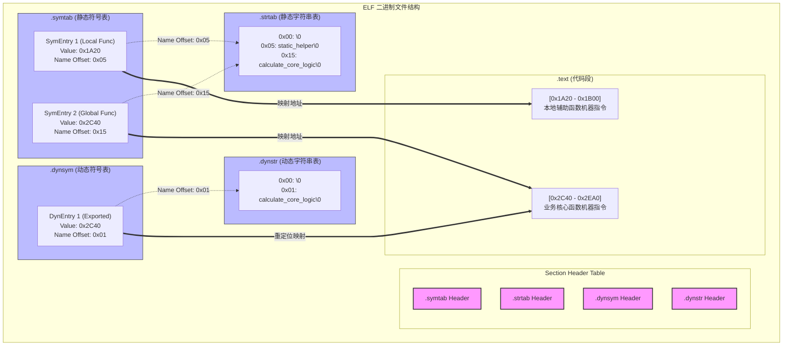
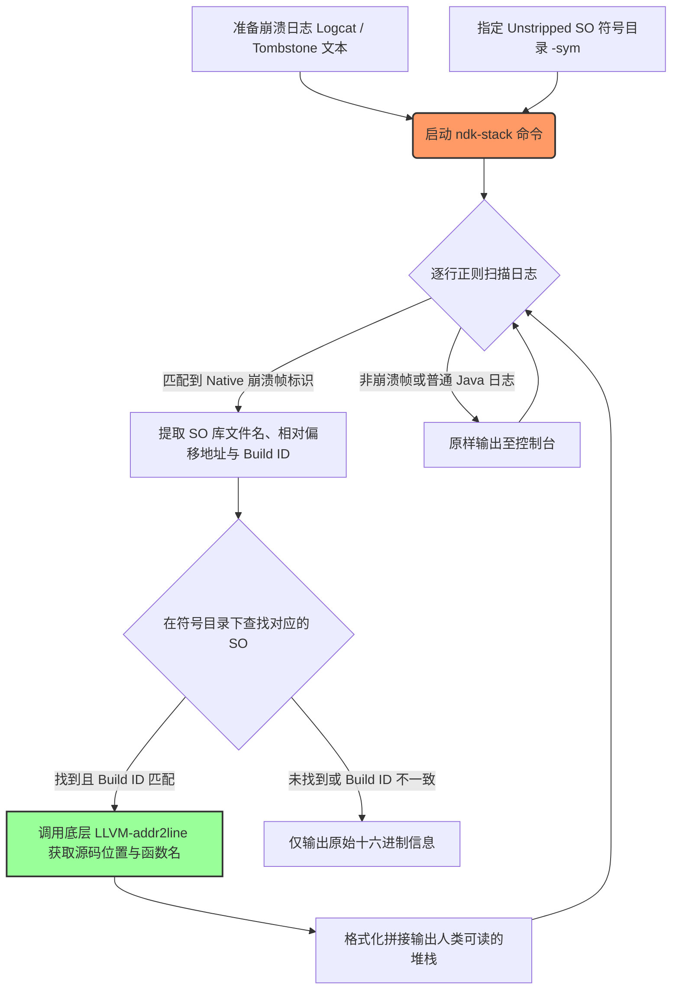
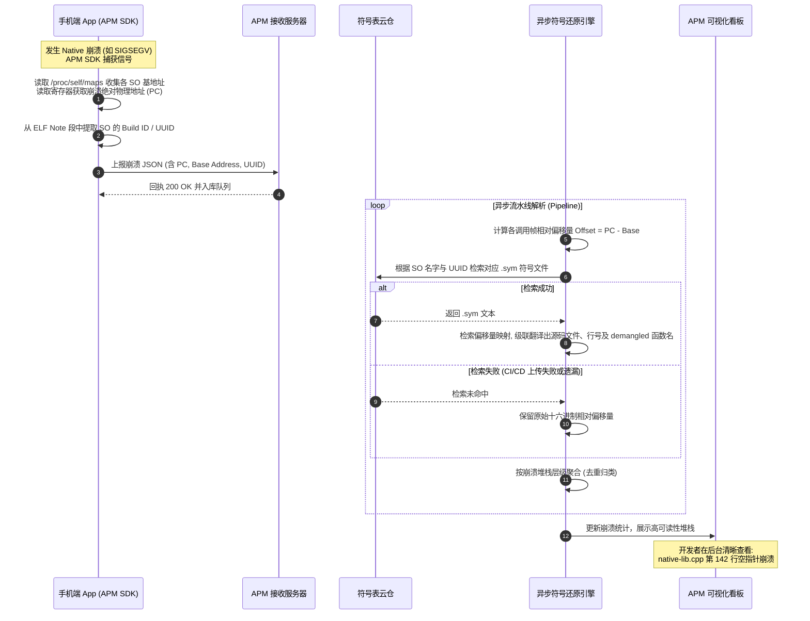

# 符号表（Symbol Table）深度解析

在 Android NDK 开发与 Native 稳定性治理中，**符号表（Symbol Table）** 是连接二进制机器指令与人类可读源代码的生命线。当 Native 层发生崩溃（如常见的段错误 `SIGSEGV`）时，系统上报的往往是一堆晦涩的十六进制虚拟内存地址。如何将这些物理寻址转换为精确的“源码文件名：行号”和“函数名”，正是符号表与调试机制的核心任务。

本篇将从 ELF 二进制文件结构出发，深入剖析符号表的内部构造、`Strip` 机制的底层差异、ASLR 下的崩溃寻址物理换算数学模型、APM 符号还原流水线，以及如何通过符号控制进行 Native 安全防守。

---

## 1. 符号表的核心概念与 ELF 文件结构

要理解符号表，首先必须理解 Linux 及 Android 系统中最基础的二进制容器格式——**ELF（Executable and Linkable Format，可执行与可链接格式）**。在 Android 中，动态链接库（`.so` 文件）和可执行文件都是 ELF 格式。

### 1.1 什么是符号与符号表？
在编译期，编译器会将高级语言（C/C++）编写的变量名、函数名、类名等标识符，转换为二进制文件中的**符号（Symbols）**。
*   **符号的定义**：符号是程序中某个全局变量、静态变量或函数的名称与其在二进制文件中的偏移地址（或虚拟地址）、大小、类型等属性的映射关系。
*   **符号表（Symbol Table）**：是 ELF 文件中专门用来存储 these 映射关系的表格。它就像一本字典，键（Key）是符号的名称或二进制代号，值（Value）是符号的属性（包括在代码段中的偏移量、作用域、大小等）。

### 1.2 ELF 文件结构中的符号相关段（Sections）
ELF 文件由众多的**段（Sections）**组成。在调试与链接机制中，以下四个段起着决定性的作用：

```
+-------------------------------------------------------------------+
|                           ELF 文件                                 |
+-----------------------------------+-------------------------------+
|       静态链接 / 调试相关段         |       运行时装载 / 动态链接段    |
|  (Strip 时可去除，本地调试使用)    |    (运行时不可去除，装载器依赖)  |
|                                   |                               |
|   1. .symtab (静态符号表)          |   3. .dynsym (动态符号表)      |
|      - 包含本地、全局所有符号       |      - 仅包含导入/导出符号       |
|                                   |                               |
|   2. .strtab (静态字符串表)        |   4. .dynstr (动态字符串表)    |
|      - 存储 .symtab 对应的名称     |      - 存储 .dynsym 对应的名称     |
+-----------------------------------+-------------------------------+
```

#### 1. `.symtab` (Symbol Table，静态符号表)
*   **作用**：保存了定位、重定位程序符号定义和引用时所需的所有符号信息。它不仅包含了当前模块导出的全局符号，还包含了内部使用的局部变量、局部函数、静态变量以及调试符号。
*   **装载特性**：它**不参与**运行时的进程虚拟内存映射，不需要被动态链接器加载到内存中。因此，它是纯粹的“静态调试/链接辅助数据”，在发布版 SO 中完全可以被剔除。

#### 2. `.strtab` (String Table，静态字符串表)
*   **作用**：`.symtab` 表项中符号的名称（如 `my_test_function`）是不能直接以变长字符串存放在符号表结构体中的（因为结构体需要固定大小）。`.symtab` 内部只保存一个指向 `.strtab` 的字符偏移量索引。`.strtab` 便是存放这些实际 ASCII/UTF-8 字符串的连续存储区。
*   **装载特性**：与 `.symtab` 相同，不参与运行时装载，可在 Strip 阶段安全去除。

#### 3. `.dynsym` (Dynamic Symbol Table，动态符号表)
*   **作用**：为了支持动态链接，SO 必须在运行时将自身的某些函数导出给其他 SO 或可执行文件调用，同时也要记录自己从外部导入的符号。`.dynsym` 专门用来保存这些**运行时动态链接所需**的外部导入和内部导出符号。
*   **装载特性**：它**必须**参与运行时的虚拟内存装载，由动态链接器（Android 中的 `/system/bin/linker` 或 `linker64`）在进程启动或 `dlopen` 时读取，用于执行重定位和符号绑定。如果去除了 `.dynsym`，SO 将无法被其他模块发现，也无法正常调用外部 API，导致动态链接失败。

#### 4. `.dynstr` (Dynamic String Table，动态字符串表)
*   **作用**：类似于 `.strtab`，它是 `.dynsym` 专用的字符串表，存储着动态符号表项对应的所有符号字符串名称（如 `malloc`、`printf` 等）。
*   **装载特性**：必须参与运行时装载，不可被 Strip。

### 1.3 静态链接符号表与动态链接符号表的本质差异

为了让差异更加直观，我们从编译期行为、装载期行为、性能影响以及保留必要性四个维度进行对比：

| 对比维度 | `.symtab` (静态符号表) & `.strtab` | `.dynsym` (动态符号表) & `.dynstr` |
| :--- | :--- | :--- |
| **包含的符号范围** | 包含当前 SO 内部的所有符号（局部变量、静态函数、调试信息等）。其范围是全局的。 | 仅包含需要与其他 SO 或主程序进行动态链接交互的外部导出（Export）与导入（Import）符号。 |
| **装载期内存映射** | **不装载**。仅存在于磁盘上的 ELF 文件中，运行时不占用 RAM。 | **必须装载**。运行时会随着 `.text` / `.data` 段一起被映射到虚拟地址空间，占用 RAM 资源。 |
| **Strip 操作影响** | 可以被 `strip` 命令行工具完全剔除，不影响程序的运行时正确性。 | 绝对不能被 `strip` 剔除，否则动态链接器报错，无法加载该 SO。 |
| **解析依赖** | 依赖于外部 DWARF 调试段（如 `.debug_info` 等）进行行号和源码文件名的追溯。 | 不包含行号、源码文件名信息，只包含符号名、虚拟地址偏移量等重定位基本信息。 |

### 1.4 ELF 符号与字符串表映射拓扑结构

下面的 Mermaid 拓扑图展示了 ELF 文件内部，符号表项与字符串表、以及最终二进制代码段的映射关系：



---

## 2. Stripped SO 与 Unstripped SO 的本质区别

在 Android NDK 的典型构建系统（ndk-build 或 CMake）中，细心的开发者会发现在编译产物目录下，每个库都会生成两套同名的 `.so` 文件。它们在体积和内部结构上有着天壤之别。

### 2.1 为什么 ndk-build/CMake 默认会生成两套 SO？
在 Android Gradle Plugin (AGP) 进行 NDK 编译时，默认的输出拓扑结构如下：
1.  **Unstripped SO（未裁剪的 SO）**：
    *   **存放路径**：位于模块构建目录的中间产物中，例如 `app/build/intermediates/cxx/Debug/.../obj/` 或 `app/build/intermediates/cmake/`。
    *   **特点**：包含完整的 `.symtab`、`.strtab` 以及以 `.debug_` 开头的各种 DWARF 调试段（如 `.debug_info`、`.debug_line`、`.debug_loc` 等）。这些调试信息详细记录了机器指令对应的源码行号、局部变量作用域等。其体积庞大，通常是几十 MB。
2.  **Stripped SO（裁剪后的 SO）**：
    *   **存放路径**：最终被打包进 APK/AAR 的 `lib/<abi>/` 目录中。
    *   **特点**：经过 NDK 工具链中的 `strip`（或 `llvm-strip`）处理，去除了所有非运行时必需的调试段和静态符号表，仅保留了 `.dynsym`、`.dynstr`、`.text`、`.data` 等运行时动态链接必不可少的段。其体积小，通常只有几十 KB 到几 MB。

### 2.2 编译过程中 Strip 机制去除了什么？
Strip 过程本质上是一次 ELF 结构的“大瘦身”。它利用工具读取 ELF 文件，遍历 Section Header Table，识别并剔除以下几类段：
1.  **整个 `.symtab` 和 `.strtab`**：将所有本地函数符号、非导出全局符号及其名称字符串全部抹去。
2.  **DWARF 格式的调试信息段**：
    *   `.debug_info`：保存编译单元的声明信息（类、函数、变量定义）。
    *   `.debug_line`：建立机器指令地址与源代码行号的映射矩阵（**这是 addr2line 能还原行号的根本基础**）。
    *   `.debug_ranges`、`.debug_loc`、`.debug_frame`：函数调用栈帧回溯信息及变量生命周期定位。
3.  **不影响执行的辅助段**：例如 `.comment`（编译器版本注释信息）。

#### 对 APK 包体积的影响
如果不进行 Strip，将包含完整 DWARF 信息的 SO 直接打包进 APK，会导致以下后果：
*   **体积暴增**：一个简单的 C++ Hello World 库，Unstripped 版本可能有 5MB，而 Stripped 版本只有 15KB。对于大型 3D 游戏或带有复杂音视频算法的 App，不进行 Strip 会导致 APK 体积增加 10~50 倍。
*   **下载与转化率下降**：Google Play 和国内各大应用商店的包体积直接关联着用户的下载转化率。
*   **无谓的内存浪费**：虽然内核在映射只读代码段时不会完全装载调试信息，但过大的文件体积会增加 APK 解压、安装校验以及文件系统 I/O 的负担。

### 2.3 线上崩溃日志中“十六进制堆栈”的底层产生原理

当线上用户运行 Stripped SO 时，如果触发了 C++ 层的崩溃（例如空指针野指针引发 `SIGSEGV`），Android 系统的 `debuggerd` 守护进程会捕捉到该信号，并转储当前崩溃线程的寄存器状态和调用栈。

然而，我们在控制台或 APM 服务端看到的崩溃日志往往是这样的：
```text
*** *** *** *** *** *** *** *** *** *** *** *** *** *** *** ***
Build fingerprint: 'google/redfin/redfin:12/SP1A.210812.015/7679548:user/release-keys'
Revision: '0'
ABI: 'arm64'
Timestamp: 2026-06-21 21:50:30+0800
pid: 28415, tid: 28415, name: my.native.app  >>> my.native.app <<<
uid: 10123
signal 11 (SIGSEGV), code 1 (SEGV_MAPERR), fault addr 0x0
    x0  0000007801a2b000  x1  0000000000000000  x2  0000007fc02f1a20  x3  0000000000000001
    ...
backtrace:
      #00 pc 000000000005a7b4  /data/app/~~uKx==/my.native.app-1/lib/arm64/libnative-lib.so (BuildId: a3b4c5d6e7f8)
      #01 pc 0000000000059c20  /data/app/~~uKx==/my.native.app-1/lib/arm64/libnative-lib.so (BuildId: a3b4c5d6e7f8)
      #02 pc 00000000000523f4  /data/app/~~uKx==/my.native.app-1/lib/arm64/libnative-lib.so (BuildId: a3b4c5d6e7f8)
```

#### 底层回溯机制（Unwinding）在缺乏符号表时的物理逻辑：
1.  **信号拦截与 Ptrace**：崩溃发生时，CPU 硬件抛出异常，内核向崩溃线程发送 `SIGSEGV`。`debuggerd` 通过 `ptrace` 挂载到目标进程。
2.  **获取寄存器**：读取崩溃瞬间的 **PC（Program Counter，程序计数器）**，对于 64 位 ARM 即为 `PC` 寄存器，对于 32 位为 `R15`。它指向当前执行指令的虚拟内存地址。
3.  **栈回溯（Stack Unwinding）**：
    *   回溯器（Unwinder）通过读取 `.eh_frame` 或 `.ARM.exidx` 段（这两个段存储着栈帧解包元数据，通常不会被普通的 strip 删掉，因为运行时抛出异常和 C++ `throw/catch` 需要它）来追踪调用链。
    *   回溯器沿着栈指针 `SP` 向上寻找前一级调用者的返回地址（Return Address，保存在 `LR` 寄存器或保存在栈帧中的特定位置），并记录每个栈帧对应的二进制代码绝对地址。
4.  **符号匹配失败**：
    *   回溯器拿到一堆绝对地址后，会尝试去对应的 SO 的 `.dynsym` 中匹配。由于我们的核心业务函数大多不是导出函数，也没有 `.symtab` 可用，系统回溯器只能匹配到最邻近的导出函数（甚至如果没有任何导出符号相近，就什么都匹配不到）。
    *   由于去除了 `.debug_line`，系统回溯器根本不知道该指令地址对应哪个 C++ 源码文件的第几行。
5.  **结果输出**：最终，系统只能将当前绝对地址换算成在该 SO 内的相对偏移量（即 `pc 000000000005a7b4`），打印出十六进制堆栈。

---

## 3. 崩溃还原物理寻址换算（最核心）

将线上上报的 `pc 0005a7b4` 还原成 `src/main/cpp/native-lib.cpp:142` 的过程，是一场关于虚拟内存与静态地址映射的精确物理换算。

### 3.1 为什么不能直接用 PC 绝对物理地址去查找符号表？
在编译和静态链接结束后，符号表中记录的所有函数地址都是**以 0 为基准的相对偏移量（Relative Offset）**（或者在共享库中是以某个预设的基虚拟地址 `p_vaddr` 计算的偏移量）。

然而，当 App 运行在 Android 手机上，SO 被动态装载入内存时，由于存在以下两个机制，其在内存中的实际物理（虚拟）地址每次都是随机的：

#### 1. ASLR (Address Space Layout Randomization，地址空间布局随机化)
ASLR 是现代操作系统的核心安全防御手段。它的主要目的是防止缓冲区溢出攻击。
*   如果 SO 在内存中的加载地址是固定的，黑客就可以精确预测 `system()` 等敏感系统函数的内存地址，从而通过注入恶意代码并跳转执行。
*   在 ASLR 作用下，操作系统在每次启动进程或使用动态装载器（Linker）加载共享库时，都会随机选择一段未被占用的虚拟内存区域作为该 SO 的加载起点，称为**内存加载基地址（Library Base Address）**。

#### 2. Linker 装载分配
动态链接器负责把 ELF 文件的 `PT_LOAD` 段复制到内存中。由于多个 SO 库共享进程的 32 位/64 位虚拟地址空间，动态链接器必须根据当前内存的紧张程度和已分配区域，动态排布每个 SO，这使得基地址必定每次不同。

因此，**崩溃时的绝对物理地址（Absolute PC） = 内存加载基地址（Base Address） + 动态链接库的相对偏移量（Relative Offset）**。由于基址每次随机，我们手头的 Unstripped SO 的符号表只记录了“相对偏移量”，所以绝对物理地址无法直接查表。

### 3.2 崩溃还原计算模型与数学公式

#### 基础还原公式
对于单装载段（PT_LOAD）或标准编译的共享库，还原符号的核心数学公式为：

$$\text{PC 相对偏移量 (Relative Offset)} = \text{崩溃绝对虚拟地址 (Absolute PC)} - \text{动态链接库内存加载基地址 (Library Base Address)}$$

#### 复杂装载（多 PT_LOAD 段）修正公式
现代 ELF 编译器通常将代码段（可读可执行，`.text`）和数据段（可读写，`.data`/`.bss`）分开装载，此时 ELF 中会有多个 `PT_LOAD` 类型的 Program Header。
在 Android Linker 中，SO 文件的虚拟地址空间范围是从第一个 `PT_LOAD` 段的加载起始地址开始计算的。如果该段的虚拟地址偏移量 `p_vaddr` 不为 0，则需要引入装载段偏移修正：

$$\text{Relative Offset} = \text{Absolute PC} - \text{Base Address} + \text{ELF 内部预设段虚拟基址 (p\_vaddr)}$$

> [!NOTE]
> 幸运的是，Android 系统 `debuggerd` 输出的 `backtrace` 日志中，类似 `#00 pc 000000000005a7b4` 里的地址已经是系统通过 `/proc/<pid>/maps` 读取并扣除了 Base Address 后的**相对偏移量（Relative Offset）**。我们只需要拿到这个 `0x5a7b4`，即可在本地结合 Unstripped SO 进行符号映射。
> 但如果在一些自建的 APM 信号捕获中，只收集到了物理绝对地址 `0x7801a7a7b4` and maps 里的基址 `0x7801a20000`，我们就必须执行减法：`0x7801a7a7b4 - 0x7801a20000 = 0x5a7b4`。

---

### 3.3 NDK 底层工具链详析：addr2line、objdump、readelf

在获得相对偏移量后，我们可以使用 Android NDK 提供的 LLVM/GNU 工具链进行手动还原。

#### 3.3.1 `readelf` —— 诊断 ELF 的瑞士军刀
`readelf` 用于显示 ELF 文件的结构信息。如果原意确认某个 SO 是否被 strip，或者检查其 UUID/Build ID，它是首选工具。

*   **常用语法**：
    ```bash
    # 查看 ELF 文件头信息，确认其 ABI 架构（ELF32/ELF64）、大小端等
    llvm-readelf -h libnative-lib.so

    # 查看段表（Section Headers），确认是否存在 .debug_info 或 .symtab 以判定是否 stripped
    llvm-readelf -S libnative-lib.so

    # 提取 SO 唯一的 Build ID（线上 Crash 日志中的 BuildId 用于精准匹配符号表文件）
    llvm-readelf -n libnative-lib.so
    ```

*   **输出示例与诊断**：
    运行 `llvm-readelf -S libnative-lib.so` 后，如果看到以下输出：
    ```text
      [27] .symtab           SYMTAB          0000000000000000 000670d8 000045d0 18   28  93   8
      [28] .strtab           STRTAB          0000000000000000 0006b6a8 000085a2 00    0   0   1
      [29] .debug_info       PROGBITS        0000000000000000 00073c4a 0015ab1a 00    0   0   1
    ```
    说明该 SO 为 **Unstripped**，包含完整的调试和符号段。若上述段全部消失，只有 `.dynsym` 和 `.dynstr`，则为 **Stripped**。

---

#### 3.3.2 `objdump` —— 反汇编与局部代码逆向分析
当知道崩溃偏移量后，如果我们想分析该指令周围的汇编上下文（例如，是什么汇编指令导致了 `SIGSEGV`），可使用 `objdump`。

*   **常用语法**：
    ```bash
    # 对指定的 C++ 代码段进行反汇编，并显示对应的 C++ 源码（要求必须是 Unstripped SO）
    llvm-objdump -S -C libnative-lib.so > disassembly.txt

    # 仅反汇编崩溃相对地址附近的指令（例如崩溃在 0x5a7b4，反汇编该区间）
    llvm-objdump -d --start-address=0x5a7a0 --stop-address=0x5a7d0 -C libnative-lib.so
    ```

*   **反汇编输出分析样本**：
    ```text
    000000000005a7b4 <_Z21calculate_core_logicPii>:
       5a7b4:   b9400008        ldr     w8, [x0]     ; x0 是第一个参数指针，此处解引用（Crash 点，证明传了空指针！）
       5a7b8:   2a010100        orr     w0, w8, w1
       5a7bc:   d65f03c0        ret
    ```
    通过上面的反汇编样本可以清晰看出，在偏移 `0x5a7b4` 处，CPU 尝试执行 `ldr w8, [x0]` 指令，从寄存器 `x0` 指向的地址读取数据到 `w8` 中。如果 `x0` 的值是 `0x0`（空指针），就会直接触发系统缺页中断，抛出 `signal 11 (SIGSEGV)`。

---

#### 3.3.3 `addr2line` —— 相对偏移还原的黄金标准
`addr2line` 是调试中用得最多的工具，其作用是直接将偏移地址翻译成“函数名”和“源码行号”。

*   **核心命令行语法**：
    ```bash
    # 语法格式
    aarch64-linux-android-addr2line -C -f -e <Unstripped-SO路径> <十六进制相对偏移量>

    # 选项参数详解：
    # -C: Demangle 选项，将 C++ 编译器混淆后的符号（如 _Z21calculate_core_logicPii）还原为人类可读的原始函数签名（如 calculate_core_logic(int*, int)）
    # -f: Show function names，除了显示行号外，同时显示该地址所属的函数名
    # -e: Target executable/library file，指定需要解析的目标 Unstripped SO 路径
    ```

*   **实际还原输入/输出样本**：
    ```bash
    # 输入指令：
    /Users/lizhiyang/Library/Android/sdk/ndk/25.1.8937393/toolchains/llvm/prebuilt/darwin-x86_64/bin/llvm-addr2line -C -f -e /Users/lizhiyang/Desktop/AndroidKnowledge/unstripped/libnative-lib.so 0x5a7b4
    ```

    ```text
    # 终端输出结果：
    calculate_core_logic(int*, int)
    /Users/lizhiyang/Desktop/AndroidKnowledge/app/src/main/cpp/native-lib.cpp:142
    ```

*   **原理解析**：
    1.  `llvm-addr2line` 打开 `libnative-lib.so`，定位到其中的 DWARF 调试信息段 `.debug_line`。
    2.  读取 `.debug_line` 内保存的**行号程序（Line Number Program）状态机**，该状态机内包含一张映射表，记录了二进制指令偏移地址与源文件索引及行号的关系。
    3.  利用传入的 `0x5a7b4` 检索映射表，查找到最匹配的记录：对应的源文件索引为 `native-lib.cpp`，物理行号为 `142`。
    4.  从 `.symtab` 中读取偏移地址 `0x5a7b4` 所在的函数符号项，提取符号名，并通过 C++ ABI Demangler 将其从 `_Z21calculate_core_logicPii` 翻译成 `calculate_core_logic(int*, int)`。

---

### 3.4 Android 专用工具 `ndk-stack` 的工作流程

面对庞大的 Tombstone（墓碑文件）或包含成百上千行 Logcat 混合堆栈的日志，逐行调用 `addr2line` 显然是不现实的。Android NDK 专门提供了一个用于自动批量解析还原的包装工具——`ndk-stack`。

#### ndk-stack 执行批量还原的架构流程：



*   **ndk-stack 常用命令语法**：
    ```bash
    # 从本地导出的 log.txt 文件中读取崩溃栈，并结合符号表目录进行解析输出
    ndk-stack -sym /Users/lizhiyang/Desktop/AndroidKnowledge/unstripped_libs -dump log.txt
    
    # 结合实时 Logcat 管道，在设备调试时实时输出还原后的 Native 调用栈
    adb logcat | ndk-stack -sym /Users/lizhiyang/Desktop/AndroidKnowledge/unstripped_libs
    ```

*   **还原前后的日志对比**：
    *   *还原前*：
        `#00 pc 000000000005a7b4  /data/app/libnative-lib.so`
    *   *还原后*：
        `#00 0x000000000005a7b4 in calculate_core_logic(int*, int) at /Users/lizhiyang/Desktop/AndroidKnowledge/app/src/main/cpp/native-lib.cpp:142`

---

## 4. 符号表服务器与线上 APM Crash 还原闭环

在现代工业界，移动 App 通常会接入第三方或自建的 APM（Application Performance Monitoring）平台（例如腾讯 Bugly、网易云捕、Firebase Crashlytics）。线上每天产生数以万计的 Native 崩溃，不可能让开发人员用命令行工具去手动还原。因此，企业会搭建一套全自动的符号还原流水线。

### 4.1 CI/CD 打包阶段的自动生成与提取

在持续集成（CI/CD）打包环境中，Android App 的构建任务一结束，流水线必须自动剥离调试元数据并上传至符号表服务器。其流程通常由 APM 提供的 Gradle Plugin 驱动，整个构建链路如下：

#### 4.1.1 SO 文件定位与 UUID 提取
1.  **APK 编译完成**：当执行 `./gradlew assembleRelease` 时，Gradle 会在编译完成后拦截 `ndk-build` 或 `CMake` 的最终输出目录。
2.  **提取 Build ID（UUID）**：每个 ELF 文件编译时，都会在 `.note.gnu.build-id` 段中生成一个全球唯一的十六进制哈希值，称为 **Build ID**。APM 插件读取 Unstripped SO 的 Build ID，并以此作为该符号表文件的唯一 Key。
    > [!IMPORTANT]
    > **为什么不用文件名，而要用 Build ID？**
    > 因为只要 C++ 代码有一行修改，重新编译后的机器码地址就会完全改变。如果不使用 Build ID 校验，线上崩溃上报时就可能会用旧版符号表去还原新版二进制文件，导致错位的行号或完全错误的函数名。

#### 4.1.2 符号轻量化转换（Breakpad 格式）
Unstripped SO 体积动辄几百 MB，如果直接将其上传到云端符号表服务器，会极大增加带宽、传输时间和存储开销。
工业界几乎统一使用 Google 顶级开源项目 **Breakpad** 的 `dump_syms` 工具，将几十 MB 的调试信息转换为一种基于纯文本的极简符号文件格式：`.sym`。

*   **`.sym` 符号文件的本质结构**：
    ```text
    MODULE Linux arm64 A3B4C5D6E7F890ABCDEF1234567890120 libnative-lib.so
    FILE 0 /Users/lizhiyang/Desktop/AndroidKnowledge/app/src/main/cpp/native-lib.cpp
    FILE 1 /Users/lizhiyang/Desktop/AndroidKnowledge/app/src/main/cpp/utils.h
    FUNC 5a7a0 24 0 calculate_core_logic(int*, int)
    5a7a0 c 142 0
    5a7ac c 142 0
    5a7b4 8 142 0
    FUNC 59c00 40 0 main_jni_entry
    59c00 10 90 0
    ```
    *   `MODULE` 头部声明了系统类型、架构、UUID（`A3B4...120`）和动态库名称。
    *   `FILE` 定义了一个文件索引表，映射文件名。
    *   `FUNC` 定义了函数的起始偏移地址（`5a7a0`）、占用字节大小（`24`）、参数占用空间以及 demangled 函数名。
    *   随后的数字行（如 `5a7b4 8 142 0`）表示偏移地址 `5a7b4` 开始的 `8` 字节机器码，对应于 `FILE 0`（即 `native-lib.cpp`）的第 `142` 行。
    
    通过将 DWARF 二进制段翻译为 `.sym` 文本，文件体积可压缩至原来的 **1%~5%**。

#### 4.1.3 自动化上传
APM 插件在 Gradle 后置任务中，通过 HTTP POST 协议将这些 `.sym` 符号表文件上传到私有或公有的**符号表服务器**上进行归档存储，其目录结构通常以 `uuid/so_name.sym` 进行组织。

---

### 4.2 线上崩溃上报与异步还原流水线（Pipeline）

当线上 App 崩溃时，APM SDK 在客户端捕获异常并开启还原流程：



---

## 5. 符号导出控制与安全性防守（高级专题）

在享受符号表为调试带来便利的同时，我们也必须认识到：**完全公开的符号表是逆向工程的天然路标**。
如果我们在打包发布 SO 时不加以控制，逆向分析人员直接将 SO 拖进 **IDA Pro** 或 **Ghidra** 中，就能在 `Exports`（导出表）中一览无余地看到所有的业务函数名。这将使诸如加解密算法、核心鉴权协议等商业机密瞬间曝光。

为了防范这种风险，在工业级 Native 开发中，我们必须建立**符号导出控制防御策略**。

### 5.1 编译器选项 `-fvisibility=hidden` 详解

在默认情况下，GCC 或 Clang 编译器在编译 C/C++ 源文件时，会将所有的全局符号（包括类、全局函数、全局变量）的可见性设置为 `default`（导出状态）。这意味着这些符号会被记录在二进制文件的动态符号表 `.dynsym` 中，从而对外部可见。

通过在编译脚本中全局启用 `-fvisibility=hidden` 编译标记，我们可以颠覆这一默认行为：
*   **作用**：将编译出的所有符号默认都设置为 `hidden`（隐藏属性）。
*   **底层改变**：被隐藏的符号将只会被保留在静态符号表 `.symtab` 中。在构建产物执行 `strip` 后，这些 `hidden` 符号的信息将被彻底从 ELF 中擦除，绝不会进入 `.dynsym`。外部任何模块无法通过 `dlsym()` 动态获取这些符号的地址，逆向工具也无法在导出表中搜寻到它们。

#### CMake 中的具体配置
在 CMake 构建脚本中，可以通过设置全局 C/C++ 编译标志来开启此选项：

```cmake
# CMakeLists.txt

cmake_minimum_required(VERSION 3.10.2)
project("security_native_sdk")

# 全局开启隐藏所有符号的选项
set(CMAKE_CXX_FLAGS "${CMAKE_CXX_FLAGS} -fvisibility=hidden")
set(CMAKE_C_FLAGS "${CMAKE_C_FLAGS} -fvisibility=hidden")

# 也可以直接设置 CMake 属性：
set(CMAKE_CXX_VISIBILITY_PRESET hidden)
set(CMAKE_VISIBILITY_INLINES_HIDDEN ON)

add_library(security-sdk SHARED security-sdk.cpp)
```

---

### 5.2 精准导出控制与 JNI 动态注册（阻断逆向核心防御）

开启了 `-fvisibility=hidden` 后，所有的符号都被隐藏了。但我们的 Java 代码该如何调用 C++ 中的 native 函数呢？Java 的 `System.loadLibrary` 之后，虚拟机又是如何寻找 native 现实的呢？

这涉及到两种 JNI 绑定策略的碰撞：

#### 5.2.1 传统“静态注册”的安全性缺陷
在传统的 JNI 静态注册中，开发者会在 Java 类中声明 `public native void doSomething();`，并在 C++ 中实现符合特定命名规范的函数：
```cpp
extern "C" JNIEXPORT void JNICALL Java_com_security_sdk_MainActivity_doSomething(JNIEnv *env, jobject thiz) {
    // 业务逻辑
}
```
*   **致命缺陷**：宏定义 `JNIEXPORT` 本质上就是把函数的可见性强制定义为 `default`。即使在 CMake 中设置了 `-fvisibility=hidden`，凡是打上了 `JNIEXPORT` 的静态注册函数依然会被强制导出并写入 `.dynsym` 中。
*   **逆向分析**：逆向工程师在 IDA Pro 的导出表中看到 `Java_com_security_sdk_MainActivity_doSomething`，可以直接双击跳转到对应的汇编代码段，利用 F5 插件将其反编译为 C 伪代码。核心算法形同裸奔。

#### 5.2.2 动态注册 + 隐藏可见性防御方案
为了彻底封杀逆向工程师的信息来源，企业安全的标准做法是：
1.  **全局启用 `-fvisibility=hidden`**。
2.  **不使用任何静态注册命名格式的函数**。
3.  **仅显式导出 `JNI_OnLoad` 函数**。
4.  **在 `JNI_OnLoad` 内部，通过 `RegisterNatives` 将 Java native 方法动态绑定到隐藏的 C++ 业务函数上**。

由于 C++ 中的业务函数名没有使用 `JNIEXPORT`，且属于局部/内部符号，配合 `-fvisibility=hidden`，在 `strip` 之后它们会被全部抹去。

#### 5.2.3 核心实现代码示例

下面的代码展示了如何运用这种“只导出 `JNI_OnLoad`，其余全部隐藏”的安全代码架构：

```cpp
#include <jni.h>
#include <string>
#include <android/log.h>

#define LOG_TAG "SecuritySDK"
#define LOGI(...) __android_log_print(ANDROID_LOG_INFO, LOG_TAG, __VA_ARGS__)

// 宏定义：显式将指定函数导出为 default 可见性
#define EXPORT_SYMBOL __attribute__((visibility("default")))

// ==========================================
// 1. 核心业务 C++ 函数（此时没有使用 JNIEXPORT，符号是隐藏的）
// ==========================================
jstring native_perform_crypto_auth(JNIEnv *env, jobject thiz, jstring raw_data) {
    LOGI("执行核心加解密算法鉴权...");
    
    // 模拟解密
    const char *data_ptr = env->GetStringUTFChars(raw_data, nullptr);
    std::string result = "decrypted_token_" + std::string(data_ptr);
    env->ReleaseStringUTFChars(raw_data, data_ptr);
    
    return env->NewStringUTF(result.c_str());
}

jint native_check_signature(JNIEnv *env, jobject thiz, jobject context) {
    LOGI("校验 App 签名证书签名值...");
    // 签名校验逻辑
    return 1; // 1 表示通过
}

// ==========================================
// 2. JNI 动态绑定映射表
// ==========================================
static const JNINativeMethod gMethods[] = {
    {
        "performCryptoAuth",                 // Java 中声明的 native 方法名
        "(Ljava/lang/String;)Ljava/lang/String;", // 方法签名描述符
        (void *)native_perform_crypto_auth   // 绑定的 C++ 隐藏函数指针
    },
    {
        "checkSignature",
        "(Landroid/content/Context;)I",
        (void *)native_check_signature
    }
};

// ==========================================
// 3. 唯一的公开出口：JNI_OnLoad（动态库加载入口）
// ==========================================
// 使用 EXPORT_SYMBOL 强行将其暴露出导出表，使 Dalvik 虚拟机能找到并调用它
EXPORT_SYMBOL jint JNI_OnLoad(JavaVM *vm, void *reserved) {
    JNIEnv *env = nullptr;
    if (vm->GetEnv((void **)&env, JNI_VERSION_1_6) != JNI_OK) {
        return JNI_ERR;
    }

    // 获取需要注册的 Java 类名
    jclass clazz = env->FindClass("com/security/sdk/SecurityManager");
    if (clazz == nullptr) {
        return JNI_ERR;
    }

    // 执行动态绑定注册
    jint methods_count = sizeof(gMethods) / sizeof(gMethods[0]);
    if (env->RegisterNatives(clazz, gMethods, methods_count) < 0) {
        return JNI_ERR;
    }

    LOGI("JNI 动态注册完毕，成功隐藏核心业务符号。");
    return JNI_VERSION_1_6;
}
```

#### 5.2.4 逆向防守效果深度对比

我们从逆向工程师在静态反编译软件（如 IDA Pro）中的视角来对比这两种注册方式的防守效果：

```
静态注册方案下的导出表 (Exports)
+------------------------------------------------------------+
| Address    | Ordinal | Name                                |
+------------+---------+-------------------------------------+
| 0x00001000 | 1       | JNI_OnLoad                          |
| 0x000012C0 | 2       | Java_com_security_sdk_Main_auth     |  <-- 泄露核心算法入口
| 0x000014B0 | 3       | Java_com_security_sdk_Main_check    |  <-- 泄露安全检测入口
+------------------------------------------------------------+
                       | (IDA 可以一键跳转进行伪代码还原)
                       v
            直接反编译出核心加解密流程和签名对比分支！

==============================================================

动态注册 + 隐藏可见性方案下的导出表 (Exports)
+------------------------------------------------------------+
| Address    | Ordinal | Name                                |
+------------+---------+-------------------------------------+
| 0x00001000 | 1       | JNI_OnLoad                          |  <-- 唯一可见的导出接口
+------------------------------------------------------------+
                       | (逆向人员在 Exports 找不到业务函数)
                       v
            黑客被迫进入 JNI_OnLoad 分析汇编：
            1. 需在汇编中寻找 RegisterNatives 传参
            2. 需逆向重构 JNINativeMethod 结构体数组
            3. 分析阻碍大幅度提升，极难进行大规模自动化破解！
```

---

## 6. 常见误区与最佳实践权衡

### 6.1 符号表管理常见误区

#### 误区 1：Debug 包与 Release 包混用符号表
*   **现象**：由于开发测试环境使用 Debug 构建，崩溃时开发直接拿着 Debug 生成的 Unstripped SO 符号表去解析 Release 版本的堆栈。
*   **后果**：由于编译器优化选项的差异（Debug 通常是 `-O0`，Release 是 `-O2` 或 `-Os`），Release 二进制指令发生了指令重排与函数内联（Inlining），行号程序完全对不上。解析出的堆栈行号往往牛头不对马嘴，严重误导排障。
*   **修正**：**必须**为每一个正式编译的 Release 归档版本单独保存对应的符号表，并以 Build ID 作为关联标识。

#### 误区 2：为了隐藏符号将 `JNI_OnLoad` 也给隐藏了
*   **现象**：粗暴地在编译脚本中设置 `-fvisibility=hidden` 且对 `JNI_OnLoad` 没有任何可见性保护。
*   **后果**：Android 系统在 `System.loadLibrary` 时，会通过 `dlsym` 搜寻 `JNI_OnLoad` 以触发绑定。若其被隐藏，系统将找不到入口，只能退回静态绑定搜索模式，进而导致 App 启动即崩溃，报 `UnsatisfiedLinkError`。
*   **修正**：务必显式声明 `__attribute__((visibility("default")))` 给 `JNI_OnLoad`。

#### 误区 3：忽视了内联函数（Inline Functions）的符号还原
*   **现象**：崩溃日志里解析出的堆栈深度只有 2 层，但看源码此处明明是一个很深的调用链。
*   **原因**：编译器将短小频繁调用的函数自动内联了。
*   **修正**：在调用 `addr2line` 时，注意观察输出。如果地址被内联，高版本的 `llvm-addr2line` 在开启 `-i` (inlines) 选项时会展示内联堆栈链：
    ```bash
    llvm-addr2line -C -f -i -e libnative-lib.so 0x5a7b4
    ```

### 6.2 NDK 调试机制下的工程最佳实践建议
1.  **建立云端符号归档库**：在 CI/CD 流程中，自动执行 Breakpad 符号提取任务，输出并以 `Build ID` 重命名 `.sym`，自动推送到公司内部的符号表服务器或 APM 供应商端。
2.  **保留未剥离的原始 SO**：除了 `.sym` 文本外，构建服务器应将带调试信息的原始 `unstripped SO` 打包压缩，作为发布介质的附属产物存放在制品库（如 Nexus 或 Artifactory），以备后续需要汇编级逆向调试（使用 GDB/LLDB）时提取。
3.  **安全敏感模块动态化绑定**：凡是涉及密钥、风控、算法安全的核心 Native 库，坚决使用 `-fvisibility=hidden`，且彻底杜绝静态 JNI 命名，全部采用 `RegisterNatives` 进行动态注册，阻断逆向探测。
