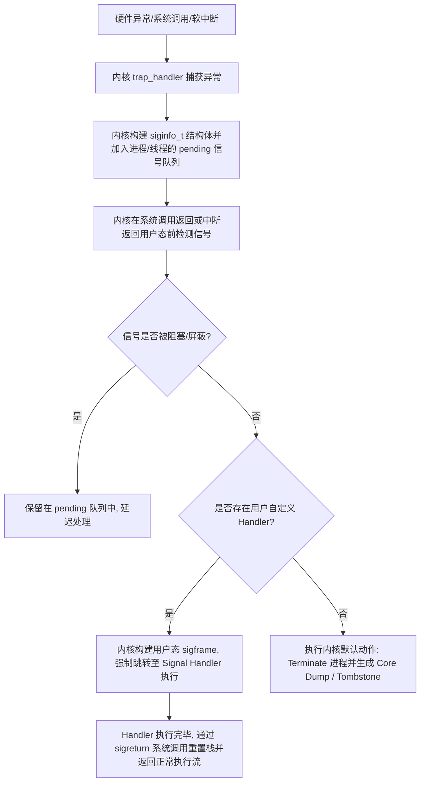
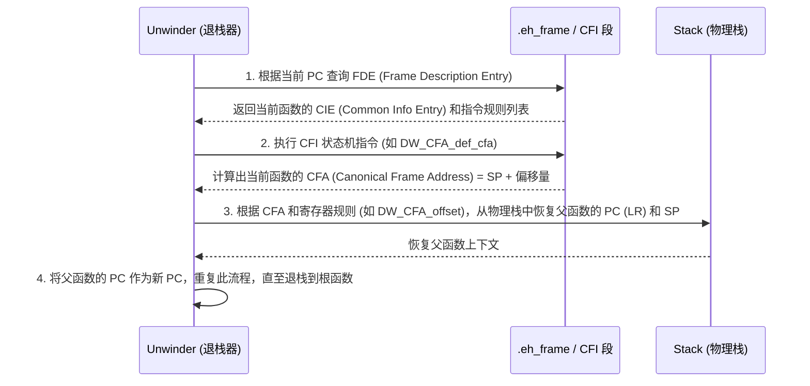
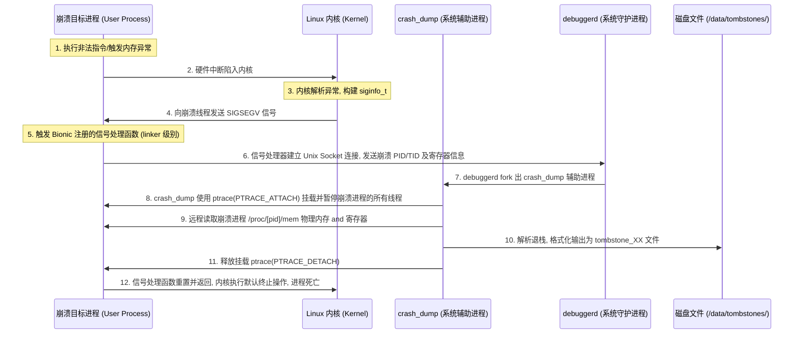

# Tombstone 深度原理与 Native 崩溃分析指南

在 Android NDK 开发与性能优化领域，Native 崩溃（C/C++ 崩溃）是破坏性最强、排查难度最大的一类问题。与 Java 层崩溃可以通过完整的异常堆栈直接定位不同，Native 崩溃发生时，进程通常会直接被操作系统内核终止，仅在系统目录中留下一份墓碑文件——**Tombstone**。

理解 Tombstone 文件的产生机制、结构逻辑以及它背后的 Linux 信号机制、CPU 寄存器体系、栈回溯算法和内存管理安全校验，是 Android 资深开发与系统工程师攻克 Native 稳定性难题的必备底层技能。

---

## 一、 Tombstone 的概念与 Native 调试的价值

### 1.1 什么是 Tombstone（墓碑）文件
Tombstone 是 Android 系统在 Native 进程发生异常崩溃（如段错误、未捕获的信号等）时，由系统守护进程 `debuggerd` 协同内核抓取并持久化在磁盘上的崩溃诊断文件。其默认保存路径通常为：
- Android 9 及以上：`/data/tombstones/tombstone_XX`（`XX` 为 00-99 循环使用的双位数字）
- Android 9 以下：`/data/tombstones/tombstone_XX`

Tombstone 文件包含了进程崩溃瞬间的“案发现场全息照片”，包括但不限于：
- 崩溃进程的 PID、TID、UID、进程名与线程名。
- 触发崩溃的 Linux 信号（Signal）以及子码（Code）、故障内存地址（Fault Address）。
- 崩溃瞬间 CPU 所有通用寄存器与特殊寄存器的数值（以 ARM/ARM64 架构为主）。
- 崩溃线程的调用栈回溯（Backtrace），包含已加载 SO 库的绝对基址、段偏移量和函数符号。
- 崩溃点附近的栈内存原始转储（Stack Dump）与内存映射区（Memory Maps）。
- 崩溃前后的系统日志（Logcat）片段。

### 1.2 Tombstone 在 Native 调试中的终极价值
在没有连接 IDE 进行实时调试（如 GDB/LLDB）的生产环境或自动化测试环境中，Tombstone 是还原 Native 崩溃的第一手甚至唯一线索。它的价值主要体现在以下几个维度：
1. **死因定位**：通过信号类型（Signal）与子码（Code）直接明确崩溃的物理本质（是访问了未映射的内存，还是执行了非法指令）。
2. **上下文重建**：通过寄存器快照，开发者可以还原崩溃函数在被调用时的参数（x0~x7）、局部变量甚至 CPU 的运行状态。
3. **调用栈恢复**：在 release 混淆或剥离了符号表（stripped）的 SO 库中，Tombstone 能提供准确的相对偏移量（Relative PC），配合带符号表的原始 SO，即可通过 `addr2line` 或 `ndk-stack` 还原出精确到源码行号的调用栈。
4. **内存污染排查**：借助 Memory Maps 与 Stack Dump，能够清晰识别出内存越界、破坏栈帧返回地址、栈溢出（Stack Overflow）等隐蔽的内存踩踏问题。

---

## 二、 信号（Signal）机制与崩溃成因的物理本质

Native 崩溃的底层本质是 **CPU 硬件异常或软件主动发起的终止请求，最终转化为 Linux 内核向进程投递信号，进程未捕获或默认处理行为是终止运行**。

### 2.1 Linux 信号的投递与处理生命周期
Linux 内核与用户态进程在信号处理上的协同极其复杂，其生命周期可以划分为以下五个物理阶段：



1. **异常触发（Generation）**：
   - **硬件异常**：CPU 执行了非法指令、越权内存访问或算术错误。CPU 内部的 MMU（内存管理单元）或 ALU（算术逻辑单元）产生硬件异常中断（Trap），CPU 自动跳转至内核态的中断处理程序（Exception Vector Table）。
   - **软件触发**：其他进程或本进程调用了 `kill`、`tgkill`、`raise`、`abort()` 等系统调用。
2. **信号投递准备（Pending）**：
   - 内核的异常处理程序根据硬件异常类型，在内核态创建一个 `siginfo_t` 结构体，描述崩溃细节（包括信号值、错误码、触发地址等）。
   - 内核将该信号挂载到目标线程的 `pending` 信号队列中。
3. **信号检测与拦截（Delivery）**：
   - 当 CPU 从内核态返回用户态（例如系统调用结束、时钟中断结束）的物理瞬间，内核会检查当前线程的 `pending` 队列。
   - 如果信号没有被 `sigprocmask` 屏蔽（Block），内核将开始投递该信号。
4. **信号处理器执行（Handling）**：
   - 如果进程通过 `sigaction()` 注册了自定义的信号处理函数（Signal Handler），内核会**劫持**用户态栈，在用户态栈上构造一个临时栈帧（`sigframe`，包含进程当时的上下文 `ucontext_t`），然后跳转到注册的 Handler 执行。
   - 如果进程没有注册 Handler，内核执行该信号的默认动作（大部分崩溃信号的默认动作是 `Core` 或 `Term`，即终止进程并写盘）。
5. **恢复或死亡**：
   - 执行完自定义 Handler 后，通过 `sigreturn` 系统调用恢复到原来的执行上下文。如果 Handler 中没有纠正物理异常（如 SIGSEGV 硬件异常指令未被跳过），返回后 CPU 会再次触发异常，陷入死循环。因此，崩溃信号的 Handler 通常在收集完现场后主动调用 `_exit` 或重置 Handler 为默认行为并再次发送信号以结束进程。

---

### 2.2 五大高频 Native 崩溃信号的物理诱因与子码解析

#### 2.2.1 SIGSEGV (段错误)
`SIGSEGV`（Signal 11）是最常见的 Native 崩溃，代表进程试图访问未分配、未映射或受到保护的物理/虚拟内存段。

*   **SEGV_MAPERR (Subcode 1)**：地址未映射错误。
    *   *物理本质*：进程访问的虚拟地址在页表（Page Table）中不存在对应的物理页（Physical Page）。
    *   *典型场景*：
        *   **空指针访问**：例如访问 `0x0` 到 `0xfff`（通常操作系统会故意保留这一段虚拟地址不进行映射，以捕获空指针）。
        *   **野指针/未初始化指针**：指向了随机的未映射地址。
        *   **Use-After-Free (UAF)**：指针指向的内存已经被 `free()` 释放，且该虚拟内存段已被归还给操作系统内核，取消了映射。
*   **SEGV_ACCERR (Subcode 2)**：地址访问权限冲突错误。
    *   *物理本质*：进程访问的虚拟地址在页表中有物理页映射，但是访问操作违反了页表项（Page Table Entry, PTE）设置的权限保护（如读、写、执行权限）。
    *   *典型场景*：
        *   **修改常量/只读数据**：例如试图向常量区（`.rodata` 段）或已被 `mprotect` 设为 `PROT_READ` 的内存写入数据。
        *   **执行非执行段代码**：在启用了 DEP（数据执行保护）/ NX 位的栈（Stack）或堆（Heap）内存中跳转执行代码。
        *   **野指针乱写**：指针指向了其他只读段。

#### 2.2.2 SIGABRT (异常终止)
`SIGABRT`（Signal 6）不是由 CPU 硬件异常触发的，而是由用户态程序通过 `abort()` 系统调用**主动**发起的进程自杀信号。

*   *物理本质*：libc 的 `abort()` 函数会先解除对 `SIGABRT` 信号的阻塞，然后通过 `tgkill` 发送 `SIGABRT` 给自己。如果进程注册了 Handler，Handler 执行完毕后，`abort()` 会强制将 Handler 重置为默认处理函数并再次发送该信号，确保进程必然死亡。
*   *典型场景*：
    *   **Assert 断言失败**：C/C++ 的 `assert(expression)` 在表达式为假时，输出调试信息并调用 `abort()`。
    *   **C++ 未捕获的异常**：当 C++ 异常沿调用栈向上抛出，直到栈顶（如进入线程入口函数）仍未被 `try-catch` 捕获时，C++ 运行时库（`libc++abi.so`）会调用 `std::terminate()`，其默认行为是调用 `abort()`。
    *   **Bionic libc 堆管理器（Scudo）检测到内存损坏**：Android 的现代安全分配器 `Scudo` 在执行 `malloc()`、`free()` 或 `realloc()` 时，如果通过 Header 校验检测到堆损坏，会直接触发 `__libc_fatal` 并调用 `abort()`。这在后文“Scudo 安全机制”部分将展开深度解析。

#### 2.2.3 SIGBUS (总线错误)
`SIGBUS`（Signal 7）代表进程物理内存访问出现了严重硬件级异常或映射错乱。

*   **BUS_ADRALN (Subcode 1)**：内存非对齐访问错误。
    *   *物理本质*：CPU 硬件层层面对内存地址的对齐（Alignment）有硬性限制。比如在某些严格对齐的 ARM 架构处理器上，要求读取 4 字节整数的地址必须是 4 的整数倍，读取 8 字节浮点数的地址必须是 8 的整数倍。如果对非对齐的地址进行多字节读写，且 CPU 的对齐检查（Alignment Check）硬件开关被启用，CPU 将直接向内核报告总线异常。
    *   *典型场景*：在 ARMv7-A 架构或某些配置了强制对齐的 ARM64 处理器中，通过强行类型转换将一个未对齐的 `char*` 指针转换为 `int*` 或 `long*` 并直接解引用。
*   **BUS_ADRERR (Subcode 2)**：物理内存映射出错。
    *   *物理本质*：进程通过 `mmap()` 系统调用将一个文件映射到了虚拟内存空间，但在进程试图读写这部分虚拟内存时，底层的物理设备发生 I/O 错误，或者对应的文件被其他进程 `ftruncate` 截断，导致映射的虚拟内存背后不再有实际的物理文件页支持。

#### 2.2.4 SIGILL (非法指令)
`SIGILL`（Signal 4）代表 CPU 执行到了其无法识别的机器指令编码。

*   **ILL_ILLOPC (Subcode 1)**：非法操作码错误。
    *   *物理本质*：CPU 的指令译码器（Instruction Decoder）解析当前 PC 指向的内存数据时，发现其不属于当前 CPU 架构的任何合法机器指令集。
    *   *典型场景*：
        *   **ABI 指令集错配**：例如在仅支持 32 位 ARMv7 架构的设备上，强行跳转并执行了包含 ARM64 独有指令（如 A64 指令集的特有编码）的代码段。
        *   **代码段被破坏/执行了乱码段**：由于栈溢出（Stack Smashing）破坏了当前函数栈帧中的函数返回地址（Link Register / LR），当函数执行完毕返回时，PC 跳转到了一个随机的、装满垃圾数据的内存区域（例如堆栈中随机分布的局部变量），CPU 将这些垃圾数据当成指令执行。
        *   **JIT 编译错误**：运行时动态生成的机器码存在编译逻辑漏洞，生成了错误的二进制指令序列。

#### 2.2.5 SIGFPE (浮点/算术异常)
`SIGFPE`（Signal 8）代表发生了 CPU 级别的算术错误。

*   **FPE_INTDIV (Subcode 1)**：整数除以零。
    *   *物理本质*：CPU 在执行整数除法指令（如 x86 的 `div` 指令）时，除数寄存器值为 0，触发 CPU 内部除零陷阱。
    *   *注意*：在 ARM/ARM64 硬件架构下，默认执行整数除零**不会**产生硬件异常，而是直接返回 0。ARM 规范如此，但在 x86（模拟器）上执行除零会触发此信号。
*   **FPE_FLTDIV (Subcode 3)**：浮点数除以零。
    *   *物理本质*：浮点运算单元（FPU）执行除法时，分母为 0 且启用了浮点异常拦截。

---

## 三、 Tombstone 结构字段深度解密

下面我们将对一份真实的、经过脱敏和简化的 ARM64 架构 Tombstone 文件进行逐字段拆解，剖析其物理含义及底层调试原理。

### 3.1 Tombstone 实战样例
```text
*** *** *** *** *** *** *** *** *** *** *** *** *** *** *** ***
Build fingerprint: 'google/redfin/redfin:11/RQ3A.210605.005/7347941:user/release-keys'
Revision: 'PV1.0'
ABI: 'arm64'
Timestamp: 2026-06-21 22:05:14+0800
Pid: 18243, tid: 18260, name: RenderThread  >>> com.example.myapp <<<
uid: 10245
signal 11 (SIGSEGV), code 1 (SEGV_MAPERR), fault addr 0x0000000000000028
    x0  0000000000000000  x1  0000007d4b2e8a10  x2  0000000000000001  x3  0000000000000000
    x4  0000007d4c502b40  x5  0000007d4b2e8c20  x6  0000000000000000  x7  0000000000000001
    x8  0000000000000000  x9  0000000000000001  x10 0000000000000000  x11 0000000000000000
    x12 0000007d4c2ff000  x13 0000000000000040  x14 0000000000000001  x15 0000000000000000
    x16 0000007d89df8c28  x17 0000007d89de4ea0  x18 0000007d4c2fd000  x19 0000007d4b2e8a10
    x20 0000007d4c502b40  x21 0000000000000000  x22 0000007d4c502c80  x23 0000007d4c502b40
    x24 0000007d89dfa000  x25 0000000000000000  x26 0000007d4c502b78  x27 0000000000000000
    x28 0000007d4b2e8c20  x29 0000007d4b2e8970  x30 0000007d89db54e8
    sp  0000007d4b2e8950  pc  0000007d89db54fc  pstate 0000000060000000

backtrace:
      #00 pc 00000000000374fc  /data/app/~~V3x...==/com.example.myapp-abc/lib/arm64/libnative-lib.so (Widget::updateData(int)+28) (BuildId: 8efb22a2810a9c8f)
      #01 pc 000000000003b544  /data/app/~~V3x...==/com.example.myapp-abc/lib/arm64/libnative-lib.so (Java_com_example_myapp_MainActivity_stringFromJNI+84) (BuildId: 8efb22a2810a9c8f)
      #02 pc 000000000013f350  /apex/com.android.art/lib64/libart.so (art_quick_generic_jni_trampoline+144) (BuildId: 9ab0c2e3c0f2)
      #03 pc 0000000000136204  /apex/com.android.art/lib64/libart.so (art_quick_invoke_stub+548) (BuildId: 9ab0c2e3c0f2)
```

---

### 3.2 头部与 Meta 信息深度解密
*   **Build fingerprint**：标明当前设备的系统版本、ROM 厂商指纹。调试时必须确保你本地使用的带符号表的 SO 库 and 发生崩溃的设备系统环境是完全匹配的。
*   **ABI**：崩溃发生时的 CPU 架构（如 `arm64`、`arm`、`x86`、`x86_64`）。
*   **Pid & tid & name**：
    *   `Pid 18243`：崩溃发生时的主进程 PID。
    *   `tid 18260`：具体发生崩溃的线程 ID，本例为渲染线程 `RenderThread`。
    *   `>>> com.example.myapp <<<`：应用包名。
*   **signal 11 (SIGSEGV), code 1 (SEGV_MAPERR), fault addr 0x0000000000000028**：
    *   崩溃原因为 SIGSEGV。
    *   子码为地址未映射 SEGV_MAPERR。
    *   `fault addr 0x0000000000000028` 是极其关键的线索：故障地址为 `0x28`（十进制 40）。
    *   *逻辑推导*：`0x28` 是一个极小的内存地址。在 64 位系统中，由于 C++ 对象的成员变量访问是“基地址 + 成员偏移量”的寻址方式，由此可以断定，进程在此处访问了一个**空指针对象的成员变量**。该成员变量在类/结构体内部的物理偏移量正是 `0x28`。

---

### 3.3 寄存器快照（Registers）深度解密（以 ARM64 为例）

ARM64（AArch64）包含 31 个通用寄存器（`x0` 到 `x30`）以及若干特殊寄存器。分析寄存器状态可以重建崩溃现场的控制流和数据流。

#### 3.3.1 通用与特殊寄存器职责划分（AAPCS64 规范）
*   **`x0` ~ `x7` (参数传递与返回值寄存器)**：
    *   在函数调用时，前 8 个参数（整数或指针）通过 `x0` 到 `x7` 从左到右依次传递。如果参数多于 8 个，剩余参数将压入栈（Stack）中传递。
    *   函数的返回值通常存放在 `x0` 中。如果返回一个结构体且大小超过 16 字节，`x8`（间接结果寄存器）会存储指向返回内存的指针。
    *   在本例中，`x0` 的值为 `0000000000000000`，表示当前函数的第一个入参是 `NULL`。
*   **`x9` ~ `x15` (Caller-saved / 临时寄存器)**：
    *   由调用者（Caller）负责保存。如果子函数中需要使用这些寄存器，子函数可以直接覆盖它们，不需要在退出时恢复它们的值。
*   **`x19` ~ `x28` (Callee-saved / 静态寄存器)**：
    *   由被调用者（Callee）负责保存。子函数如果要使用这些寄存器，必须在函数入口将其压栈（保存），并在退出时出栈恢复，确保父函数在调用子函数前后，这些寄存器的值保持不变。
*   **`x29` (Frame Pointer, FP / 帧指针寄存器)**：
    *   指向当前函数栈帧的基地址。用于在栈回溯时定位局部变量和上一层函数的栈帧。
*   **`x30` (Link Register, LR / 链接寄存器)**：
    *   保存了**当前函数执行完毕后，应该返回到的父函数指令地址**。
    *   在非叶子函数（内部会调用其他函数的函数）中，当执行 `BL`（Branch with Link）指令跳转时，硬件会自动将下一条指令的地址写入 `x30`。
    *   本例中，`x30` 值为 `0000007d89db54e8`，表示当前崩溃函数执行完后本应返回该地址。
*   **`sp` (Stack Pointer / 栈指针寄存器)**：
    *   指向当前线程栈顶的物理地址。
*   **`pc` (Program Counter / 程序计数器)**：
    *   指向**当前正在执行的指令地址**。
    *   本例中，`pc` 值为 `0000007d89db54fc`，这正是 CPU 崩溃那一瞬间所执行的指令地址。
*   **`pstate` (Processor State / 处理器状态寄存器)**：
    *   旧称 `CPSR`，存储当前 CPU 的运行标志位。
    *   `0x60000000` 转化为二进制，表示当前 CPU 的零标志位（Z）和进位标志位（C）为 1，负数标志位（N）和溢出标志位（V）为 0，运行在 64 位用户态。

#### 3.3.2 寄存器现场实战推演
在本例中，我们已知：
- `pc = 0000007d89db54fc`
- `x0 = 0000000000000000`
- `fault addr = 0x0000000000000028`

当我们将崩溃的 SO 库拖入反汇编工具（如 IDA Pro 或 Ghidra）中，定位到偏移量为 `0x374fc`（`pc` 地址 `0x7d89db54fc` 减去 SO 的加载基地址，详见后文）的汇编指令时，必定会看到类似如下的一条指令：
```assembly
ldr x8, [x0, #0x28]   ; 读取以 x0 的值加上 0x28 为地址 of 内存，存入 x8
```
由于 `x0` 的值是 `0`（即 `NULL`），该指令物理上等价于读取内存 `0x28`。由于 `0x28` 未被映射，MMU 瞬间触发 Page Fault，内核捕获后给进程发送信号 `SIGSEGV`，崩溃发生。这完美印证了“空指针访问成员变量”的推断。

---

### 3.4 栈帧回溯（Backtrace）与退栈算法物理原理

Tombstone 中的 `backtrace` 段记录了崩溃线程的历史调用链。还原这一调用链的过程称为**退栈（Stack Unwinding）**。

#### 3.4.1 栈帧回溯的工作原理：FP 算法 vs DWARF 算法

##### A. 帧指针（Frame Pointer, FP）回溯算法
在未启用编译器优化的调试模式下，每个非叶子函数在入口处都会执行“前导码”（Prologue）来保存调用上下文，形成链表结构的栈帧：

```text
    高内存地址 (栈底)
  +------------------+
  |  上一级 FP        | <---+
  +------------------+     |
  |  上一级 LR (返回) |     | (通过 FP 链指针向上查找)
  +------------------+     |
  |  局部变量区域     |     |
  +------------------+     |
  |  当前 FP --------+-----+  <- x29 指向这里
  +------------------+
  |  当前 LR (返回)   |
  +------------------+
  |  局部变量区域     |
  +------------------+  <- sp 指向这里
    低内存地址 (栈顶)
```

*   **退栈逻辑**：
    1.  当前 PC 指向崩溃点，SP 指向当前栈顶，FP（`x29`）指向当前栈帧。
    2.  根据标准约定，当前 FP 寄存器指向的地址存放的是“父函数的 FP”，而 `FP + 8`（在 64 位系统上）存放的是“父函数的返回地址（即上一级 LR）”。
    3.  Unwinder（退栈器）读取当前 `[FP]` 得到父函数的 FP 物理地址，读取 `[FP + 8]` 得到调用当前函数的下一条指令 PC。
    4.  重复此步骤，直到 FP 为 `0`。
*   **优缺点**：
    *   *优点*：算法极其简单，退栈速度极快，不需要任何额外的符号信息。
    *   *缺点*：为了节省寄存器，现代编译器（如 Clang/GCC）在 Release 编译优化（如 `-O2` 或 `-O3`）中，默认会启用 `-fomit-frame-pointer` 选项，即**丢弃 FP 寄存器**，将 `x29` 当作普通的通用寄存器使用。此时，FP 链路断裂，该算法彻底失效。

##### B. DWARF (CFI, Call Frame Information) 符号回溯算法
在没有 FP 寄存器支持的情况下，退栈器必须依赖保存在 SO 二进制文件中的 `.eh_frame`（C++ 异常处理使用）或 `.debug_frame`（编译调试使用）段中的 **CFI（调用帧信息）**。



*   **CFA（Canonical Frame Address，标准帧地址）**：定义为上一个栈帧在调用当前子函数前的栈指针（SP）值。它是退栈的基准物理参考点。
*   **FDE（Frame Description Entry，帧描述条目）**：对应一个具体的函数地址范围。退栈器根据当前的物理 `pc`，在 `.eh_frame` 中二分查找出对应的 FDE。
*   **CIE（Common Information Entry，通用信息条目）**：包含所有 FDE 共享的架构级通用定义。
*   **CFI 状态机指令深度剖析**：
    退栈器（如 Android 系统内部使用的 `libunwindstack`）通过一个内置的状态机解释器来解析 CFI。常见的 CFI 状态机指令如下：
    - `DW_CFA_def_cfa: register offset`：定义当前的 CFA 计算公式为 `Register + Offset`。在 ARM64 上通常默认是 `sp + offset`。
    - `DW_CFA_def_cfa_offset: offset`：保持 CFA 寄存器不变，仅更新其偏移值。
    - `DW_CFA_offset: register offset`：指出某一寄存器（如寄存器 30 即 LR）的备份存放在相对于 CFA 的物理偏移 `Offset` 处（通常是 `CFA + Offset`，注意这里的偏移值可能需要乘以架构比例因子）。
    - `DW_CFA_restore: register`：将某一寄存器恢复为该函数入口处的初始状态。
    
    退栈器从当前 PC 处的指令状态开始，沿 FDE 中的指令流依次在内存中模拟执行，重构出该函数在被调用初始瞬间的寄存器状态表。通过这种方式，退栈器就能精准获取父函数的 `PC` 和 `SP`，从而跳入父函数的栈帧空间，实现无需 FP 寄存器的强健回溯。

#### 3.4.2 Linker 段偏移量计算与符号还原物理公式
我们在 Tombstone 看到的 `backtrace` 地址通常是绝对虚拟地址：
`#00 pc 00000000000374fc  /data/app/.../libnative-lib.so`

但是在 Android 系统中，为了防御内存攻击，默认启用了 **ASLR（地址空间布局随机化）**。这意味着每次应用程序启动，Bionic 动态链接器（Linker）加载 SO 库的起始内存基地址（Base Address）都是完全随机的。

为了能够在本地开发环境中将崩溃地址映射回源代码，退栈器必须计算出**段偏移量（Relative PC）**。其物理数学关系为：

$$\text{Relative PC (相对偏移地址)} = \text{Absolute PC (寄存器中的绝对物理地址)} - \text{SO Base Address (SO 加载到内存的起始基地址)}$$

退栈器解析 `/proc/self/maps` 文件中该 SO 库对应 `PROT_EXEC`（可执行）虚拟内存段的起始地址作为 `SO Base Address`，进行减法运算，得出 Relative PC（本例中为 `0x374fc`）。

---

### 3.5 栈转储与内存分布（Stack / Memory Maps）深度解密

#### 3.5.1 Memory Maps 的只读/读写/执行权限划分
在 Tombstone 的后半部分，会打印出当前进程的物理内存映射表（源自 `/proc/[pid]/maps`），例如：
```text
memory map:
    0000007d4b200000-0000007d4b300000 rw-p 00000000 00:00 0   [stack:18260]
    0000007d89d7e000-0000007d89d8c000 r--p 00000000 fd:03 457 /libnative-lib.so
    0000007d89d8c000-0000007d89de8000 r-xp 0000e000 fd:03 457 /libnative-lib.so
    0000007d89de8000-0000007d89df8000 rw-p 0006a000 fd:03 457 /libnative-lib.so
```
*   `r--p`（只读，私有）：通常存储 SO 库的段头部信息和常量数据区（`.rodata`）。
*   `r-xp`（只读、可执行，私有）：存放 SO 库编译出来的机器指令代码区（`.text` 段）。**崩溃 PC 地址必须落在此类区间内，否则会触发可执行权限冲突**。
*   `rw-p`（可读写，私有）：存放全局变量、静态变量（`.data` 和 `.bss` 段）以及堆栈空间。本例中 `[stack:18260]` 正是崩溃线程的私有栈内存空间。

#### 3.5.2 通过栈转储数据排查局部变量覆写
当 Tombstone 打印出 `stack:` 部分时，它会输出崩溃时 SP 寄存器指针附近的物理内存数据。这在排查**栈破坏（Stack Corrosion）**时是无价的。
例如，如果一个 C++ 函数声明了以下局部变量：
```cpp
void foo() {
    char buffer[8];
    void* func_ptr = &bar;
    // 发生越界写入，导致 buffer 溢出，踩到了 func_ptr 的物理空间
    strcpy(buffer, "1234567890123456"); 
}
```
在 Tombstone 对应的 `stack:` 数据段中，我们会清晰地观察到：
```text
stack:
    #00 sp 0000007d4b2e8950  34333231 38373635  // ASCII "12345678"
           0000007d4b2e8960  32313039 36353433  // ASCII "90123456" -> 彻底覆盖了本应存放 func_ptr 的物理内存
```
通过观察物理栈转储中是否存在连续的、具有明显特征的十六进制数据（如代表字符串的 ASCII 码，或者全 `0xff` 等），能帮助开发者迅速判断是否发生了局部变量越界改写。

---

## 四、 崩溃拦截工作流与 Breakpad 闭环

### 4.1 Android 系统级崩溃拦截与 `debuggerd` 协同机制
Android 系统的 Native 崩溃处理是一个跨进程、高协同的复杂流程。

#### 4.1.1 核心拦截拓扑结构与调用链
当 Native 线程执行发生硬件异常时，其底层拦截与 Tombstone 文件的生成步骤如下：



1.  **进程自检注册**：
    在 Android 系统启动并加载动态链接器（Bionic Linker）时，Linker 内部会通过 `sigaction` 静态注册对常见崩溃信号（SIGSEGV, SIGABRT, SIGBUS 等）的系统信号处理函数（在 `linker_debuggerd_client.cpp` 中定义）。
2.  **信号拦截与 Socket 通信**：
    一旦崩溃发生，进程的信号处理函数被内核激活。该 Handler **不会**在进程内部完成退栈（因为崩溃进程的内存空间此时是极其不可信的），而是通过预先建立好的本地 Unix Domain Socket（地址为 `/dev/socket/tombstoned_crash`）向系统守护进程 `tombstoned`（即 debuggerd 架构的核心服务）发送一条“请求诊断”的 IPC 报文，报文中携带了崩溃进程的 PID、TID 以及崩溃时的基本上下文。
3.  **`crash_dump` 动态挂载**：
    `tombstoned` 接收到崩溃请求后，出于安全权限隔离的考虑（避免高权限的守护进程直接读写不可信的普通应用进程空间，满足 Project Treble 的安全沙箱策略），会动态 `fork` 出一个专职处理的辅助进程 `crash_dumpXX`（`XX` 对应设备的处理器架构，如 `crash_dump64`）。
4.  **`ptrace` 接管现场**：
    `crash_dump` 进程被拉起后，立即调用 Linux 原生的 `ptrace(PTRACE_ATTACH, target_tid, ...)` 系统调用挂载到崩溃进程的线程上。`ptrace` 会使崩溃线程暂停运行，允许 `crash_dump` 像调试器一样，通过 `PTRACE_GETREGSET` 读取崩溃瞬间的 CPU 寄存器快照。
5.  **读取物理内存与解析 DWARF**：
    由于 `crash_dump` 是一个独立进程，它可以通过直接读取 `/proc/[target_pid]/mem` 虚拟文件来安全地读取崩溃进程的栈空间、加载的 SO 列表等。它在自己进程的地址空间内解析目标 SO 的 DWARF CFI 段，执行退栈计算，从而保证了即使崩溃进程的调用栈已经被破坏（Stack Overflow），退栈工作依然能在一个干净、安全的沙箱环境（`crash_dump`）中顺利执行完毕。
6.  **文件写入与销毁**：
    `crash_dump` 将解析好的格式化数据通过 Socket 回传给 `tombstoned`，后者将其写入磁盘文件 `/data/tombstones/tombstone_XX`。写入完毕后，`crash_dump` 执行 `PTRACE_DETACH` 释放目标进程。目标进程的信号处理函数返回，内核重新接管，按照默认动作终止该进程。

---

### 4.2 工业级崩溃捕获框架 Google Breakpad 客户端核心原理

由于 `/data/tombstones/` 目录属于 Android 系统高权限目录，普通第三方应用在非 Root 情况下**无法读取**该目录下的文件。这意味着线上生产环境的 Native 崩溃无法通过系统 Tombstone 机制直接收集。

为了解决这一痛点，工业界（如 Google、腾讯 Bugly、Sentry 等）普遍采用了 Google 开源的崩溃拦截捕获框架 **Google Breakpad**。

#### 4.2.1 sigaction 注册信号 Handler
Breakpad 客户端在应用初始化时，调用 `sigaction` 系统调用，向内核注册自定义的崩溃信号处理函数，接管系统默认行为：
```cpp
struct sigaction sa;
memset(&sa, 0, sizeof(sa));
sigemptyset(&sa.sa_mask);
// 关键：使用 sa_sigaction 携带三参数的信号处理函数，可以获取到 ucontext_t 结构体
sa.sa_sigaction = BreakpadExceptionHandler; 
// 关键：SA_ONSTACK 启用备用信号栈，SA_SIGINFO 携带上下文
sa.sa_flags = SA_ONSTACK | SA_SIGINFO; 
sigaction(SIGSEGV, &sa, NULL);
```

> **[!NOTE]**
> **备用信号栈（SA_ONSTACK / sigaltstack）的重要性**：
> 如果崩溃是由栈溢出（Stack Overflow）触发的，此时当前线程的物理栈空间已经触达边界红线，任何进一步的压栈操作（包括内核跳转执行信号处理函数）都会瞬间触发第二次硬件段错误，导致进程被内核无情地强行抹除，没有任何机会执行你注册的 Handler。
> 启用 `SA_ONSTACK` 后，在初始化阶段通过 `sigaltstack()` 系统调用向内核提前申请一块干净的、预留的物理内存（通常为 32KB），当该线程栈溢出崩溃时，内核会自动将信号处理函数的执行上下文强制切换到这块备用栈上运行，确保崩溃日志能成功写入。

#### 4.2.2 信号沙箱上下文 `ucontext_t` 的物理结构
当 `sa_sigaction` 被触发时，第三个参数是一个指向用户态上下文结构 `ucontext_t` 的指针（强制转换为 `void*` 传递）：
```cpp
void BreakpadExceptionHandler(int sig, siginfo_t* info, void* uc_ptr) {
    ucontext_t* uc = reinterpret_cast<ucontext_t*>(uc_ptr);
    // uc->uc_mcontext 包含了发生崩溃瞬间 CPU 所有的寄存器快照
    // 对于 ARM64 架构：
    uint64_t pc = uc->uc_mcontext.pc;
    uint64_t sp = uc->uc_mcontext.sp;
    uint64_t lr = uc->uc_mcontext.regs[30];
    ...
}
```
`ucontext_t`（在 `<sys/ucontext.h>` 中定义）是内核在向用户态分发信号前，将 CPU 寄存器的物理状态**强制打包**写到用户栈上的结构体。Breakpad 客户端正是通过直接解析该结构体，在极度危险的进程濒死状态下，安全地把所有寄存器的瞬间值捞出来。

#### 4.2.3 崩溃时的“异步信号安全”（Async-Signal Safety）物理限制与死锁规避
这是 Native 崩溃拦截中最核心、最易犯错的底层物理设计限制：**在信号处理函数（Signal Handler）执行期间，进程处于极其脆弱的半死不活状态。你只能调用“异步信号安全”（Async-Signal Safe）的系统调用，绝对不能调用任何非安全的函数**。

##### 为什么不能调用非异步信号安全函数（如 `malloc`、`printf`、`std::string` 等）？
1.  **全局互斥锁死锁**：
    假设崩溃线程（或者进程中的其他线程）在崩溃发生的物理前一纳秒，由于业务逻辑正常执行了 `new` 或 `malloc` 操作，从而持有了堆管理器（如 Scudo/dlmalloc）内部的全局互斥锁（Mutex）。
    就在这一瞬间，崩溃发生了（比如空指针）。内核暂停了所有正常代码流，跳转执行你注册的 `BreakpadExceptionHandler`。
    如果你的 Handler 内部为了拼接日志或者序列化 Minidump 再次调用了 `malloc`（或者调用了会隐式触发内存分配的 `std::string`、`std::vector` 等），堆管理器会尝试去获取同一个全局互斥锁。然而该锁正被当前线程（已被中断挂起）或另一个被内核冻结的线程持有。
    **结果：信号处理函数在等待锁释放，而锁持有者永远无法被调度执行，进程发生永久死锁。**
2.  **Bionic 内部状态损坏**：
    崩溃发生可能伴随着堆内存损坏。如果 Handler 再次依赖这些受损的数据结构，会导致 Handler 自身二次崩溃，丢失所有现场日志。

##### Breakpad 的极致生存策略与闭环实现
为了绕过这道物理死锁红线，Google Breakpad 客户端采用了如下极其严苛 of 工程手段：
*   **不使用 Bionic 的标准内存分配**：Breakpad 内部重写了一套轻量级的、基于固定缓冲区（Static Buffer）的内存分配器，或者在初始化阶段就预先分配好所需的全部内存结构，崩溃时绝不动态申请一字节的堆内存。
*   **手写裸系统调用（Raw System Calls）与汇编实现**：
    Breakpad 完全不调用 C 标准库的 `open`、`write`、`close`，而是使用汇编语言直接封装底层 Linux 系统中断号，直接调用裸系统调用。因为系统调用是重入安全的，不包含用户态的任何锁机制。
    例如，以下展示了在 ARM64 架构下，通过内联汇编绕过 libc 直接发起 `sys_write` 系统调用的物理实现细节：
    ```cpp
    inline int sys_write(int fd, const void* buf, size_t count) {
        register long x0 __asm__("x0") = fd;
        register long x1 __asm__("x1") = reinterpret_cast<long>(buf);
        register long x2 __asm__("x2") = count;
        register long x8 __asm__("x8") = 64; // __NR_write 在 arm64 上的系统调用号为 64
        __asm__ volatile (
            "svc #0" // 触发内核中断, 陷入内核态
            : "+r"(x0) 
            : "r"(x1), "r"(x2), "r"(x8)
            : "memory"
        );
        return static_cast<int>(x0); // x0 会存放内核返回的写入字节数或错误码
    }
    ```
*   **利用 `clone` 避开脏栈**：
    在某些情况下，为了防范当前线程的栈空间被彻底踩烂，Breakpad 在 Handler 内部会通过 `sys_clone` 系统调用，强行创建一个全新的、拥有干净独立栈空间的子进程或子线程来专门负责抓取崩溃上下文并写入磁盘上的 `.dmp` (Minidump) 文件。
*   **二进制 Minidump 格式流（Streams）解析**：
    Breakpad 写入磁盘的文件不是易读的文本格式，而是高度紧凑的、直接按内存结构体布局平铺导出的二进制 Minidump 格式。这使得它可以在 Handler 中通过极其简单的、无格式化的块写入操作，将 `ucontext_t` 结构体直接 Dump 到磁盘上。其核心包含以下数据流结构：
    - `MDRawHeader`：包含 Magic 数 `'PMDM'`、目录大小、流的数量。
    - `ThreadListStream`：保存崩溃时刻所有线程的 CPU 寄存器快照和对应的栈物理指针范围。
    - `ModuleListStream`：保存当前进程加载的所有 SO 模块路径和对应的 Build ID（符号指纹）。
    - `ExceptionStream`：记录崩溃发生的线程 ID、异常信号类型（如 SIGSEGV）、故障地址和 `ucontext_t` 的原始二进制块。
    最后，生成的 `.dmp` 文件被上传到后台，在服务器端进行离线的符号表解析与 Backtrace 重建。

---

## 五、 Scudo 安全分配器对堆崩溃（SIGABRT）的检测机制

现代 Android 系统（Android 11 及以上）默认使用 **Scudo** 代替了旧版的 `jemalloc` 作为底层的原生堆内存分配器。Scudo 旨在提供强大的内存越界检测和双重释放防御机制，它的许多保护策略直接关联到 `SIGABRT` 的触发。

### 5.1 Scudo 双级分配架构
- **Primary Allocator（主分配器）**：处理中小内存块（通常小于 256KB）。它预先在大块虚拟内存中划分多个大小固定的 Class（如 16 字节、32 字节等），并利用无锁的线程局部缓存（Thread Local Cache）快速响应分配请求。
- **Secondary Allocator（二级分配器）**：处理大内存块（大于 256KB）。这类请求直接通过 `mmap()` 从系统申请物理页，并在两侧各配置一个被设为 `PROT_NONE` 的 Guard Page（保护页）。一旦发生大内存越界读写，立刻触发 MMU 硬件异常，生成 `SIGSEGV`。

### 5.2 Chunk Header 的校验和（Checksum）防御机制
对于主分配器分配的中小内存块，Scudo 在每个内存块（Chunk）的物理头部之前，强行插入一个 8 字节（32位系统）或 16 字节（64位系统）的 **Chunk Header**，其结构如下：

```text
    低内存地址
  +-----------------------------------------------------+
  | Checksum (校验和)  | ClassId | State | SizeOrUnused |  <- Chunk Header (16 字节)
  +-----------------------------------------------------+
  | 用户可写的实际数据区域 (User Data)                   |  <- malloc 返回的指针指向这里
  | ...                                                 |
  +-----------------------------------------------------+
    高内存地址
```

*   **Header 内容**：包含该内存块所属的 Class ID、分配状态（`Allocated` 或 `Free`）、用户实际使用的大小（SizeOrUnused）以及一个 16 位的校验和（Checksum）。
*   **Checksum 计算物理公式**：
    $$\text{Checksum} = \text{CRC32} \left( \text{Header 内容} \oplus \text{Heap Cookie} \oplus \text{内存块物理地址} \right)$$
    其中 `Heap Cookie` 是进程拉起时随机生成的一个安全盐值。
*   **越界检测原理**：
    当程序调用 `free(ptr)` 时，Scudo 会将指针向左偏移 16 字节，提取出 Chunk Header。它会利用当前 Header 内的数据和内存地址重新计算一遍 Checksum，然后与 Header 里存储的 Checksum 进行比对。
    如果用户发生了 **Heap Buffer Overflow（堆溢出）** 并向后踩到了相邻内存块的 Header 区域，或者发生了 **Underflow（向左越界）** 破坏了当前 Chunk 的 Header，Checksum 校验必然宣告失败。此时，Scudo 会直接输出错误日志（如 `corrupted chunk header`），并通过 `__libc_fatal` 触发 `SIGABRT` 终止进程。

### 5.3 双重释放（Double Free）与隔离区（Quarantine）机制
*   **Double Free 检测**：
    当 `free(ptr)` 被执行时，Scudo 校验 Header 通过后，会检查 Header 中的 `State` 字段。
    - 如果 `State == Allocated`，Scudo 会将其重置为 `Free`，并进行后续回收。
    - 如果 `State == Free`，说明此块内存之前已经被释放过了，这是一次非法的 Double Free。Scudo 会立刻报错并抛出 `SIGABRT`。
*   **Quarantine（隔离检疫区）机制**：
    为了防御更复杂的 **Use-After-Free (UAF)** 攻击，Scudo 引入了隔离区。被释放的内存块不会立刻回到可用空闲链表（Free List）中，而是会被放入一个 FIFO 队列的 Quarantine 缓冲区中。
    在 Quarantine 中，内存块的 State 保持为 `Free`。如果在其待在隔离区期间，程序试图再次释放它，或者有野指针试图通过原本的地址读写它（如果隔离区内触发了重用校验），Scudo 能极高概率捕获异常。直到隔离区满，旧的内存块才会被洗白并归还给分配器，这极大地拉长了内存释放到重分配的时间窗，提升了崩溃捕获的稳定性。

---

## 六、 典型案例分析与调试实战

### 6.1 实战案例一：通过 Tombstone 分析野指针与内存越界

#### 6.1.1 墓碑文件片段
```text
ABI: 'arm64'
signal 11 (SIGSEGV), code 2 (SEGV_ACCERR), fault addr 0x0000007d89df8c28
    x0  0000007d89df8c00  x1  0000000000000020  x2  0000000000000000
    sp  0000007d4b2e8950  pc  0000007d89db54fc  
backtrace:
      #00 pc 00000000000374fc  /libnative-lib.so (updateScore+12)
```

#### 6.1.2 深度物理推导与调试路径
1.  **看信号与子码**：
    `Signal 11 (SIGSEGV), code 2 (SEGV_ACCERR)`。说明出错地址 `0x0000007d89df8c28` 是**已经映射到物理页**的，但是**访问权限被拒绝**。
2.  **看寄存器与物理映射**：
    *   故障地址为 `0x0000007d89df8c28`。
    *   对比发现，`x0` 的值是 `0000007d89df8c00`，而故障地址恰好等于 `x0 + 0x28`。
    *   查看 Memory Maps：
        *   `0x0000007d89d8c000` 到 `0x0000007d89de8000` 具有可执行权限 `r-xp`。
        *   而故障地址 `0x0000007d89df8c28` 恰好落在了 `0000007d89de8000-0000007d89df8000 rw-p`（只读/读写数据段）的边缘，或者直接指向了只读的 `.rodata` 段。
3.  **还原源代码与汇编意图**：
    在汇编中定位 `updateScore+12`：
    ```assembly
    str w1, [x0, #0x28]   ; 试图将寄存器 w1（得分值）写入到 x0 + 0x28 指向的物理地址
    ```
    由于 `x0 + 0x28` 指向的物理地址属于只读映射区（如一个被强行转换的只读结构体常量），写入操作瞬间触发 MMU 的硬件写保护异常，导致操作系统投递了带有 `SEGV_ACCERR` 子码的段错误信号。
4.  **修复方案**：
    检查 `updateScore` 函数的参数传递，查找是否存在向 `const` 数据结构写入、或者指针被错误转型（例如强行将 `const char*` 转型为 `char*` 并写入）的逻辑缺陷。

---

### 6.2 实战案例二：SO 库 ABI 指令集错配导致 SIGILL 崩溃

#### 6.2.1 墓碑文件片段
```text
ABI: 'arm64'
signal 4 (SIGILL), code 1 (ILL_ILLOPC), fault addr 0x0000007d89db54fc
    x0  0000007d4b2e8a10  
    sp  0000007d4b2e8950  pc  0000007d89db54fc  
backtrace:
      #00 pc 00000000000374fc  /libnative-lib.so (decodeVideoFrame+24)
```

#### 6.2.2 深度物理推导与调试路径
1.  **看信号与子码**：
    `Signal 4 (SIGILL), code 1 (ILL_ILLOPC)`，说明 CPU 执行到了无法识别的指令码。
2.  **对比 PC 与加载库**：
    `pc = 0x0000007d89db54fc` 对应的段偏移量为 `0x374fc`。
3.  **使用 ndk-disasm / objdump 反汇编分析**：
    拉取对应的 `.so` 文件，跳转到偏移量 `0x374fc` 处，读取机器码数据。
    *   在支持 ARMv8.2-A + SVE（可伸缩矢量扩展）的编译器编译下，此处可能生成了类似 `ld1b {z0.b}, p0/z, [x0]` 的 SVE 矢量读取指令。
    *   但是当该 SO 被推送到一台较旧的、仅支持 ARMv8-A 基准架构的 ARM64 处理器（例如骁龙 835）上运行时，处理器的硬核指令译码器根本不认识该矢量编码，抛出硬件异常陷入内核，内核投递 `SIGILL`。
4.  **修复方案**：
    在 Android NDK 的 `Application.mk` 或 CMakeLists.txt 中，检查针对 ARM 架构编译目标的选择，避免开启超出目标设备物理支持范围的编译器特定优化向量指令集参数（如错误指定了 `-march=armv8.2-a+sve` ）。

---

## 七、 生产环境 Native 崩溃符号化还原实战

当从线上收集到 Breakpad Minidump（`.dmp`）文件，或者通过 ADB 导出系统 Tombstone 文件后，由于 Release 包的 SO 库通常在打包时被剥离（stripped）了调试符号信息，Backtrace 仅能显示十六进制的 Relative PC 偏移量。我们需要在本地或服务器端进行**符号化还原**。

### 7.1 `addr2line` 与 `ndk-stack` 底层还原原理
- **`addr2line` 符号查找原理**：
  在编译 C/C++ 时，如果不加特殊去除指令，编译器会在 ELF 格式的 SO 中写入 DWARF 格式的调试段（如 `.debug_info`、`.debug_line`）。其中，`.debug_line` 段包含一张状态机指令表，将每一段相对物理地址与源代码的“文件路径”、“函数名”和“行号”进行一对一的网格化映射。
  `addr2line` 工作时，就是以相对偏移量（Relative PC）为 Key，在此表中快速检索出源码层面的物理出处。
- **`ndk-stack` 自动化汇编分析器**：
  Android NDK 提供的 `ndk-stack` 是对底层还原工具链（如 `addr2line`、`objdump`）的高层 Python 封装。它会自动扫瞄输入的日志文件或墓碑文件，识别出匹配 `backtrace:` 特征的堆栈模式，自动计算偏移量，并在指定的未剥离符号目录（`-sym` 参数指定的目录）中寻找同名 unstripped SO 进行自动化的一键翻译。

### 7.2 符号化还原实战演练

#### 第一步：获取 unstripped 的 SO 库
你必须使用构建 Release APK 瞬间产生并备份在本地的、**未剥离符号**的 SO 库（通常位于项目构建目录的 `app/build/intermediates/merged_native_libs/release/out/lib/arm64-v8a/` 目录下）。

> **[!WARNING]**
> 切记：不能直接使用打入 APK 内的 SO 进行符号还原，因为打入 APK 的 SO 已经通过了 `llvm-strip` 去除了全部调试信息（`.debug_*` 段均被抹除），其尺寸通常仅为 unstripped SO 的 10% 左右。使用 stripped SO 调用 `addr2line` 只会返回 `??:0`。

#### 第二步：使用 `addr2line` 物理还原
对于 backtrace 中的一条指令：
`#00 pc 00000000000374fc  libnative-lib.so (Widget::updateData(int)+28)`

打开终端，定位到 NDK 工具链目录下（对于现代 NDK，可以直接使用 clang 工具链中的 `llvm-addr2line`），执行以下命令：
```bash
$NDK_HOME/toolchains/llvm/prebuilt/darwin-x86_64/bin/llvm-addr2line \
    -f -C \
    -e /path/to/unstripped/libnative-lib.so \
    0x374fc
```
*   `-f` (functions)：同时输出对应的 C++ 函数原型。
*   `-C` (demangle)：将 C++ 编译器混淆后的物理符号名（如 `_ZN6Widget10updateDataEi`）反向还原为直观的类与函数声明形式（`Widget::updateData(int)`）。
*   `-e` (exe)：指定待分析的带符号 SO 文件路径。

**运行输出**：
```text
Widget::updateData(int)
/Users/lizhiyang/Desktop/AndroidKnowledge/jni/Widget.cpp:42
```
由此，崩溃直接精准锁定了 `Widget.cpp` 的第 42 行。

#### 第三步：使用 `ndk-stack` 批量还原堆栈
如果有整段 Logcat 崩溃输出，可将其存为 `crash.txt`：
```bash
$NDK_HOME/ndk-stack \
    -sym /path/to/unstripped/so/directory/ \
    -dump crash.txt
```
`ndk-stack` 会顺着堆栈的每一层自动递归查询，最终将整个空洞的十六进制堆栈翻译为包含源码行号、函数入参信息的“人类可读级”调用栈。

---

## 九、 堆栈的内存破坏诊断技术：ASan 与 HWASan 核心原理

在一些极端诡异的 Native 崩溃场景中，即使拿到了 Tombstone，我们可能也只能看到一个指向受损堆内存的 backtrace，无法得知是**哪一行代码在哪个历史时刻**踩烂了这块内存。此时，我们需要借助主动防御检测技术。

### 9.1 ASan (AddressSanitizer) 内存校验原理
ASan 是由 Google 开发的快速内存错误检测工具，它采用编译器插桩技术，在运行时监控内存的申请、释放与访问。

*   **Shadow Memory (影子内存) 映射**：
    ASan 将进程的虚拟内存空间按 8 字节的物理内存块映射到 1 字节的影子内存空间。影子内存中的数值代表物理内存的可用状态：
    - `0`：表示对应的 8 字节物理内存是干净、安全的，可正常读写。
    - `负数`：表示对应的物理内存处于“受保护状态”（被污染/投毒）。不同的负数值代表不同的保护类型（如堆左右红区、栈左右红区、已被 free 释放的内存等）。
    在 64 位 Android 系统中，物理内存地址 $Addr$ 转换为影子内存地址的物理公式为：
    $$ShadowAddr = \left( Addr >> 3 \right) + Offset$$
*   **Poisoning (投毒) 与红区（Redzone）机制**：
    当我们在堆上调用 `malloc(8)` 申请 8 字节空间时，ASan 会在编译器层面隐式将这块内存的左右两侧各加上一段受保护的红区（Redzone，如各 32 字节），并将影子内存中红区对应的字节全部标为负数（投毒）。
    在每次执行内存读写指令前，ASan 插入的代码会首先根据地址查表影子内存：
    ```cpp
    char *shadow_addr = (addr >> 3) + offset;
    if (*shadow_addr != 0) {
        ReportError(addr); // 访问了被投毒的红区或已释放区, 触发 ASan 报告并异常退出
    }
    ```
    当野指针发生越界（如越界读写第 9 个字节），指针就会踩入右侧红区，ASan 立刻拦截并抛出包含完整物理调用栈的崩溃报告。
*   **局限性**：
    由于 8 字节映射为 1 字节，影子内存需要占用整整 1/8 的虚拟内存空间，这导致在 32 位 Android 设备上由于虚拟内存紧张而几乎无法拉起；此外，其带来 2~3 倍的 CPU 性能损耗和数倍的内存占用。

### 9.2 HWASan (硬件辅助 AddressSanitizer) 原理
Android 10 引入了 **HWASan**，这是专门面向 64 位 ARM64 架构优化的主动防御校验技术，它巧妙地融合了硬件特性。

*   **ARM64 TBI (Top Byte Ignore) 物理机制**：
    ARM64 处理器的 MMU 物理寻址时，会自动忽略 64 位虚拟地址指针的高 8 位（Top Byte）。这意味着：
    `0xXX00007d89db54fc` 与 `0x0000007d89db54fc` 在硬件层面会被指向同一个物理内存单元。高 8 位可以用来存放任意用户自定义的标记（Tag）而不会引起寻址失败。
*   **Tag 标记匹配校验**：
    1.  当程序分配一块内存时，HWASan 会生成一个随机的 8 位 Tag，并把这个 Tag 写入分配指针的高 8 位中返回（例如返回指针 `0xAB00007d89db54f0`）。
    2.  HWASan 会同步使用影子内存（HWASan 的影子内存映射比例仅为 16:1，即 16 字节物理内存映射 1 字节影子内存，开销极大减小）记录该物理内存块的 Tag（同样记为 `0xAB`）。
    3.  当程序通过该指针读写内存时，HWASan 插桩的代码会取出指针高 8 位的 Tag（`0xAB`），并与该内存物理地址对应的影子内存中的 Tag 进行对比。
    4.  如果发现两者不相等，说明发生了**越界访问**（指针踩到了其他 Tag 的内存块）或者 **Use-After-Free**（内存释放时，影子内存的 Tag 会被更新为一个随机的新值，野指针里旧的 `0xAB` 无法再通过匹配校验），HWASan 瞬间抛出崩溃并中止进程。
*   **物理优势**：
    HWASan 内存开销仅为 15% 左右，运行耗时损耗仅约 2 倍，且完美运行于 64 位 Android 真机中，是现代 Android 稳定性排查中定位“幽灵踩内存”问题的核武器。

---

## 十、 常见误区与方案权衡

在建立生产环境的 Native 崩溃收集体系时，开发者极易陷入以下技术误区，必须做好方案的物理权衡。

### 10.1 误区一：在信号处理 Handler 中打印 Java 层调用栈
*   **错误做法**：在注册的 C++ 信号 Handler 中，通过 JNI 反向调用 Java 层的 `Log.getStackTraceString()` 来试图打印 Java 栈。
*   **物理灾难**：JNI 调用完全是非异步信号安全的。JNI 需要依赖 ART（Android Runtime）虚拟机的内部状态，需要申请虚拟机内部的锁。崩溃瞬间虚拟机的物理线程状态极大概率被破坏（或者处于 `GC` 挂起状态），强行调用 JNI 会直接导致死锁或虚拟机的二次崩溃（ART Fatal Error），彻底丢失崩溃现场。
*   **正确权衡**：如果需要在崩溃时收集 Java 层的业务上下文（如当前活跃的 Activity 名字），应当在 Java 业务运行期间，将这些上下文信息**定期序列化**写入到一块预分配好的、共享的 Native 内存缓冲区中。崩溃时，C++ Handler 仅仅以极简单的无锁方式，直接从该 Native 内存块中读取静态二进制数据写入 Minidump。

### 10.2 系统的 `debuggerd` 与应用级 `Breakpad` 方案对比

| 评估维度 | 系统级 `debuggerd` 机制 | 客户端 `Google Breakpad` 机制 |
| :--- | :--- | :--- |
| **工作上下文** | 独立于崩溃进程的 `crash_dump` 进程，退栈环境极安全 | 崩溃进程的信号处理器（Handler）上下文，退栈环境脆弱 |
| **权限限制** | 系统级权限，可读取 `/data/tombstones` 目录 | 用户应用级权限，仅能写入应用私有目录（如 `/data/data/.../files/`） |
| **线上收集能力**| **不可直接收集**（非 Root 权限应用无法访问 `/data/tombstones/`） | **强**（可随时将生成的 `.dmp` 文件通过网络上传到自建后台） |
| **对性能的影响**| 崩溃后动态 fork 进程，不影响应用正常生命周期的运行耗时 | 会在 Handler 中占用部分 CPU 和内存用于导出 minidump，有微弱的延迟损耗 |
| **定制化扩展性**| 无法修改（系统固化） | **极高**（可自定义写入额外附加的业务日志、内存数据） |

### 10.3 总结最佳实践
对于追求高稳定性的 Android 应用，工业界的标准 Native 崩溃闭环体系设计通常为：
1.  **开发与灰度测试阶段**：
    使用 LLDB 实时挂载，或者通过系统提供的 `tombstone` 文件（直接使用 `adb bugreport` 或 `adb pull /data/tombstones/`）获取高保真系统崩溃现场。
2.  **线上生产运行阶段**：
    集成 **Google Breakpad**。配置备用信号栈（`sigaltstack`）防御栈溢出，在 Handler 内部严格遵守异步信号安全规则（不使用 `new` / `malloc`、不调用 JNI、不使用标准 I/O 库，纯汇编/裸系统调用写盘），将崩溃瞬间的寄存器状态和线程栈导出为 `.dmp` 二进制文件，在应用下次拉起时异步上传。
3.  **后台符号化服务**：
    在编译构建 SO 库时，保留未剥离符号（unstripped） of SO 文件归档。后台收到 `.dmp` 后，使用 Breakpad 提供的 `minidump_stackwalk` 工具配合符号表（Symbol Files），在服务器端还原出完美的、包含文件名和具体行号的 Native 调用栈。
