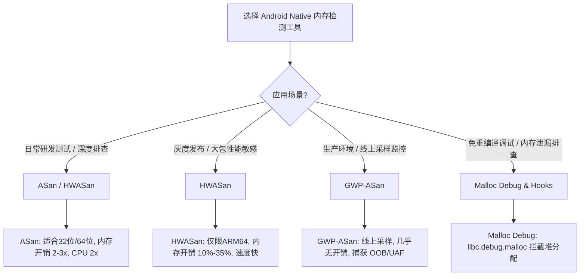
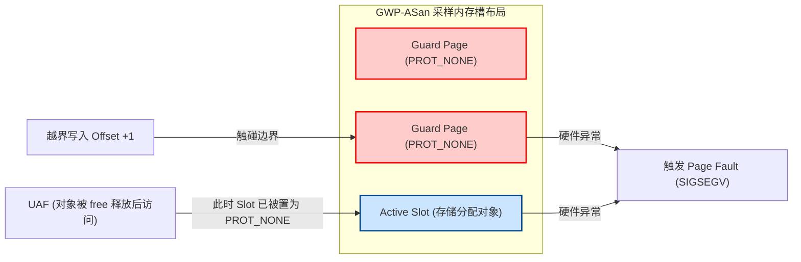

# Android Native 内存问题深度解析与诊断实践

在 Android 系统的分层架构中，Java/Kotlin 层依靠 Android Runtime (ART) 的垃圾回收机制 (Garbage Collection, GC) 实现了自动内存管理。然而，在追求极致性能的音视频渲染、物理引擎、底层算法以及系统核心库（如 MediaServer、SystemServer 的 Native 部分）中，开发者必须深入 Android NDK，直接使用 C/C++ 语言进行底层开发。

C/C++ 的高自由度带来的是对内存管理的绝对控制权，但也引入了巨大的安全隐患。Android 平台上超过 60% 的高危安全漏洞（0-Day Vulnerability）和大量难以定位的崩溃闪退，都源自 Native 层的内存违规操作。本指南将从硬件架构、内存分配器底层逻辑、工业级检测工具原理及工程实践等维度，对 Android Native 内存问题进行深度剖析。

---

## 一、 Android Native 内存问题的本质与危害

### 1. 为什么 C/C++ 内存管理在 Native 层极易失控？

Java 层的对象访问是通过强类型的引用（Reference）进行的，任何数组越界、空指针都会被虚拟机捕获并抛出对应的 Java 异常（如 `ArrayIndexOutOfBoundsException`、`NullPointerException`），不会导致物理进程的直接崩溃。

而在 Native 层，C/C++ 的内存模型建立在**裸指针（Raw Pointer）**和**扁平化虚拟地址空间（Flat Virtual Address Space）**的基础之上：

*   **缺乏边界安全检查（No Bounds Checking）**：C/C++ 数组或指针在进行偏移运算（如 `ptr + index`）时，编译器在默认情况下不会生成任何边界检查指令。即使 `index` 超出了分配内存的实际大小，CPU 依然会忠实地执行访存指令。
*   **内存生命周期的人工掌控**：程序员必须手动通过 `malloc`/`free` 或 `new`/`delete` 来管理堆内存的申请和释放。对象的生命周期与其指针的生命周期常常脱节，导致“指针还在，但内存已被回收”或“对象已死，但未被回收”的混乱局面。
*   **栈内存的脆弱性**：Native 的栈空间（Stack）不仅存放着局部变量，还存放着函数调用的返回地址（Return Address）和帧指针（Frame Pointer）。如果发生栈缓冲区溢出，攻击者可以直接篡改返回地址，改变程序的执行流。

### 2. 0-Day 漏洞与进程崩溃的物理根源

在硬件和操作系统层面，Native 内存问题的危害主要表现在以下两方面：

#### 进程崩溃的物理根源
当 Native 代码访问了一个非法的虚拟内存地址时，CPU 的 **MMU（Memory Management Unit，内存管理单元）** 无法在页表（Page Table）中找到该虚拟地址对应的物理页，或者该操作违反了页表的权限控制（例如向只读页写入数据），MMU 就会触发一个**缺页中断（Page Fault）**。

操作系统内核捕获到这个硬件异常后，会向目标进程发送特定的信号（Signal）：
*   **`SIGSEGV`（Segmentation Violation，段错误）**：通常由访问未映射的虚拟地址、越界访问受保护的内存页或向只读区域写入导致。
*   **`SIGBUS`（Bus Error，总线错误）**：通常由内存对齐限制（Alignment Restriction）引起，或者访问了已经损坏的物理内存。

在 Android 中，系统底层的 `debuggerd` 守护进程会拦截这些信号，捕获崩溃瞬态的寄存器上下文，并生成著名的 `tombstone`（墓碑）文件。

#### 0-Day 漏洞的利用原理
若内存违规操作未导致进程立即崩溃，而是静默破坏了相邻的数据结构，就会产生严重的安全漏洞。
*   **控制流劫持（Control Flow Hijacking）**：利用栈溢出（Stack Overflow）或堆溢出（Heap Overflow）覆盖函数指针（Function Pointer）或虚函数表指针（vptr）。当程序后续调用该函数时，CPU 就会跳转到攻击者精心构造的恶意 shellcode 处执行，实现提权或远程代码执行（RCE）。
*   **信息泄露（Information Disclosure）**：通过未初始化内存读取或越界读取，将进程内存中的敏感信息（如秘钥、内存基地址、Session ID）读取并发送出去，从而绕过系统的 **ASLR（Address Space Layout Randomization，地址空间布局随机化）** 保护机制。

---

## 二、 经典 Native 内存错误类型深度解密

### 1. 堆栈越界 (Out of Bounds, OOB)

#### 堆溢出 (Heap Overflow)
堆内存是通过 `malloc` 或 `new` 从进程堆区动态申请的。堆溢出发生在向堆上分配的缓冲区写入的数据超过了其申请的大小。

```cpp
// 漏洞示例代码
char* heap_buffer = (char*)malloc(16);
// 如果 input_source 的长度大于 16，strcpy 将引发堆溢出
strcpy(heap_buffer, input_source); 
```

**底层破坏原理**：
堆分配器（如 jemalloc）在分配的内存块（Chunk/Run）头部或尾部维护有元数据（Metadata，例如内存块大小、分配状态等）。堆溢出会覆盖相邻内存块的元数据或相邻的业务对象。当相邻对象被使用，或者分配器在后续对该堆块进行 `free` 操作试图解析其元数据时，会导致分配器内部状态损坏，抛出崩溃信号。

#### 栈缓冲区溢出 (Stack Buffer Overflow)
栈内存是由编译器自动分配和释放的，用于存放函数的局部变量和调用上下文。

```cpp
// 漏洞示例代码
void vuln_function(char* input) {
    char stack_buffer[64];
    // 未对 input 长度做校验，直接复制
    strcpy(stack_buffer, input); 
}
```

**底层破坏原理**：
在 ARM64 架构下，函数的栈帧（Stack Frame）结构如下：

| 低地址 | 局部变量 (`stack_buffer`) | 保护边界 (Stack Guard) | 帧指针 (FP, X29) | 返回地址 (LR, X30) | 高地址 |
| :--- | :--- | :--- | :--- | :--- | :--- |

当 `stack_buffer` 发生向高地址方向的溢出时，写入的数据会顺次覆盖 `Stack Guard`（如果有）、`FP` 以及 `LR`（Link Register，即返回地址）。当 `vuln_function` 执行完毕准备返回时，CPU 执行 `RET` 指令，会将 `LR` 寄存器中的值加载到 `PC`（Program Counter，程序计数器）中。如果 `LR` 已被覆盖为攻击者指定的恶意代码地址，CPU 将直接偏离原有的控制流，去执行恶意指令。

### 2. 使用已释放内存 (Use After Free, UAF)

UAF 是 C/C++ 语言中最隐蔽、危害最大的漏洞类型之一。

```cpp
// 漏洞示例代码
struct User {
    void (*print_info)();
    char name[128];
};

User* u = new User();
u->print_info = print_user_details;
// ... 业务操作
delete u; // 释放内存，但指针 u 未置空，成为悬挂指针（Dangling Pointer）

// 此时，另一个逻辑分配了相同大小的堆块
char* attacker_data = (char*)malloc(sizeof(User));
// 写入精心构造的数据（例如一个恶意的函数地址）
memcpy(attacker_data, fake_object_payload, sizeof(User)); 

// 再次调用已被释放的指针，此时原物理地址已被 attacker_data 覆盖
u->print_info(); // 崩溃或任意代码执行！
```

#### 类型混淆与任意代码执行漏洞利用原理
1.  **悬挂指针的产生**：对象被 `delete` 后，其虚拟内存空间被归还给堆分配器。但指向该内存的指针 `u` 依然保留着原有的地址，这就是**悬挂指针**。
2.  **堆的二次分配机制**：为了提升效率，堆分配器会优先回收并快速重新分配大小相近的内存块。当申请 `attacker_data` 时，分配器直接将刚刚释放给 `u` 的虚拟内存块返回。
3.  **类型混淆（Type Confusion）**：此时，指针 `u` 与 `attacker_data` 指向了同一块物理内存，但程序却用两种完全不同的数据类型（一个是 `User` 结构体，一个是裸字符数组）去解析它。
4.  **漏洞利用**：攻击者通过覆盖 `name` 部分或者原有的虚函数指针表，将其指向一段攻击载荷，随后通过 `u->print_info()` 触发劫持。

### 3. 二次释放 (Double Free)

Double Free 指的是对同一块已被释放的堆内存地址连续调用两次 `free()` 或 `delete`。

```cpp
char* ptr = (char*)malloc(32);
free(ptr);
// ... 期间没有对 ptr 进行重新分配
free(ptr); // 第二次释放同一块内存，导致 Double Free
```

#### jemalloc 核心 Bin 链表损坏逻辑
在高效堆分配器（如 jemalloc）中，小内存块（Small Bin）的回收是通过**单向无锁链表（Freelist）**实现的。为了加快后续的分配，已被释放的内存块会被插入到对应大小等级（Size Class）的 Bin 链表头部。

当发生 Double Free 时：
1.  第一次 `free(ptr)`：分配器将 `ptr` 放入空闲链表头部。
    `Freelist -> ptr -> NextFreeNode`
2.  第二次 `free(ptr)`：在缺乏校验的情况下，分配器再次尝试将 `ptr` 放入空闲链表头部，使其 `Next` 指针指向自己。
    `Freelist -> ptr -> ptr`（形成环形死循环）
3.  当程序下一次申请相同大小的内存时，分配器会取出 `ptr`。但由于链表已损坏为环形，下下次申请时，分配器依然会返回 `ptr`，从而导致两个不同的业务逻辑同时持有并操作同一块内存，最终必然引发严重的数据破坏或 UAF 漏洞。

### 4. 内存泄漏 (Memory Leak)

内存泄漏是指程序在动态申请堆内存后，由于逻辑缺陷失去了对该堆内存地址的追踪，导致这部分内存无法被回收，直到进程结束。

```cpp
void run_task() {
    char* log_data = new char[4096];
    if (has_error()) {
        return; // 漏掉了 delete[] log_data，内存泄漏
    }
    delete[] log_data;
}
```

#### 堆内存孤立与虚拟内存空间碎片化
*   **堆内存孤立**：指向堆内存的唯一指针超出了作用域（或者被赋予了新值），而该内存块却未被释放。操作系统认为该内存仍在使用中，因此不能回收。
*   **虚拟内存空间碎片化（Virtual Memory Fragmentation）**：
    在 32 位 Android 进程中，用户空间的虚拟内存仅有 3GB 左右。长期小内存块泄漏会导致大量的虚拟地址空间被零星占用，虽然系统仍有空闲物理内存，但已经无法找到足够大的**连续虚拟内存页**来满足一次大内存申请。这会导致进程在虚拟地址耗尽时触发 `OOM（Out of Memory）` 崩溃，在 32 位游戏或多媒体应用中尤为多见。

### 5. 未初始化内存读取 (Uninitialized Read)

在 C++ 中，局部变量分配在栈上，堆变量分配在堆上，如果未在声明时显式初始化，其内容将是先前该内存区域残留的“垃圾数据”。

```cpp
void evaluate_security() {
    bool is_admin; // 未初始化！内容随机，取决于当前栈帧残留的数据
    if (is_admin) {
        grant_root_privileges();
    }
}
```

**危害**：
读取未初始化数据不仅会导致逻辑行为的不确定性（在 Debug 版本和 Release 版本中表现不同），而且如果这部分数据被拷贝并输出给外部，就会泄露栈或堆上的指针，帮助黑客获取内存布局，绕过 ASLR 防护。

### 6. 野指针 (Wild Pointer) / 悬挂指针 (Dangling Pointer) 访问

*   **野指针**：指针在声明时未初始化，指向了一个随机的、不可控的虚拟内存地址（如 `char* p;` 之后直接对 `*p` 赋值）。
*   **悬挂指针**：指针指向的内存已被 `free`/`delete` 释放，或者指向了已经退栈的局部变量，而指针本身未被清空。

若访问野指针，由于其指向的地址是不确定的，大概率会因为触发非法的地址访问而被操作系统通过 `SIGSEGV` 强行终止；但在极少数情况下，如果野指针碰巧指向了进程中其他可写的有效内存，则会造成静默的写坏（Memory Corruption）。

---

## 三、 Android 底层内存分配器机制简述

为了防御和检测上述 Native 内存问题，Android 系统底层的内存分配器经历了多次重大演进。

### 1. jemalloc 机制简述
在 Android 10 之前（各版本变更历史详见 [AndroidVersionChangeLog.md](../../../../../AndroidVersionChangeLog.md)），Google 长期采用 **jemalloc** 作为默认的内存分配器。其核心设计目标是**多核并发下的高吞吐与低碎片率**。

#### 核心结构
*   **Arenas**：为了减少多线程竞争，jemalloc 将堆内存划分为多个独立的 Arenas。线程会绑定到某个 Arena 上进行内存申请。
*   **Chunks & Runs**：大块内存（Chunk，通常为 4MB）会被拆分为多个 Page Run。
*   **Bins**：对于小内存块分配，分配器将其归类到不同的 Bins（如 8字节, 16字节 ... 2048字节）。Bin 内部机制维护着空闲链表（Freelist）。
*   **Thread Cache**：每个线程维护一个局部的 Tcache，分配小内存时优先在 Tcache 中获取，完全无锁，速度极快。

> [!WARNING]
> **安全局限**：jemalloc 追求极致性能，几乎没有主动的安全防溢出设计。其链表采用裸指针串联，且空闲堆块物理相邻。一旦发生溢出，相邻的元数据或链表节点可以被轻易修改。

### 2. Scudo 强化内存分配器 (Android 10+)
为了应对日益严峻的安全挑战，Google 从 Android 10 开始（Scudo 相关版本变更详见 [AndroidVersionChangeLog.md](../../../../../AndroidVersionChangeLog.md)），在部分核心组件及后续的 AOSP 默认配置中引入了 **Scudo** 内存分配器。Scudo 专为**安全性**设计，旨在缓解堆溢出、Double Free 和 UAF 漏洞。

#### 防溢出与安全设计
*   **分配器首部校验和（Header Checksum）**：
    每个已分配的堆内存块前都紧跟一个受保护的 Header，其中存储了该堆块的元数据（如大小、分配状态、Class ID 等）。Scudo 使用随机生成的 Key 对 Header 计算 CRC32 校验和。一旦发生堆溢出篡改了 Header，或者在 `free` 时传入了错误的指针，Scudo 校验 CRC32 失败，会立即中止进程（`abort`），防止漏洞被进一步利用。
*   **隔离区（Quarantine）**：
    为了阻止 UAF 漏洞，当程序释放一块内存时，Scudo 不会立刻将其放回空闲链表，而是将其放入一个先进先出（FIFO）的**隔离队列（Quarantine）**中。只有当隔离区满了，或者经过一定的延迟后，该内存块才会被重新启用。这极大地增加了攻击者在 UAF 漏洞中进行“类型混淆”重新占位内存的难度。
*   **随机化设计**：
    Scudo 在向操作系统申请大内存页并将其切割为小堆块时，会加入随机的偏移量（Chunk Randomization），破坏堆布局的确定性，使得黑客难以精准预测相邻堆块的地址。

---

## 四、 工业级 Native 内存检测与诊断神器

在开发和测试阶段，依靠人工排查 C/C++ 内存问题如大海捞针。Android 提供了多种功能强大、互为补充的内存检测工具。



---

### 1. AddressSanitizer (ASan)

**AddressSanitizer (ASan)** 是由 Google 维护的一个快速内存错误检测工具，集成在 Clang 编译器中。它能够检测堆/栈/全局变量的越界访问、UAF、Double Free、内存泄漏等绝大部分内存问题。

#### 影子内存 (Shadow Memory) 1:8 比例映射公式
ASan 的核心思想是**虚拟内存映射**。它将进程的虚拟内存空间划分为两个部分：
1.  **主内存（Main Memory）**：程序正常运行所使用的虚拟地址空间。
2.  **影子内存（Shadow Memory）**：用于记录主内存中哪些字节是“安全的”（可读写），哪些字节是“有毒的”（Poisoned，即越界或已释放区域）。

在 64 位 Android 系统中，每 8 个字节的主内存状态，都压缩用 1 个字节的影子内存进行记录。这就是 **1:8 的比例映射**。

对于一个主内存地址 `Addr`，其对应的影子内存地址 `ShadowAddr` 的映射公式如下：

$$\text{ShadowAddr} = (\text{Addr} \gg 3) + \text{Offset}$$

*   在编译时，编译器会将所有的访存指令进行插桩改造。例如，在执行 `*Addr = Value` 之前，先计算 `ShadowAddr`，检查其值是否允许写操作。

#### 影子内存中值的含义 (Shadow Byte Value)
一个影子内存字节（8 bits）记录了对应的 8 字节主内存的可用性状态：
*   **`0x00`**：表示对应的 8 个字节全部是可读写的（干净的）。
*   **`0x01` 到 `0x07`**：表示前 $k$ 个字节是可读写的，后面 $8-k$ 个字节不可读写（通常发生在对象的尾部边界处）。
*   **负数（最高位为 1，如 `0xF1`、`0xF5` 等）**：表示该区域已“中毒”，绝对禁止访问。常见的毒化标记代码有：
    *   `0xF1`：栈左红区 (Stack left redzone)
    *   `0xF2`：栈中红区 (Stack mid redzone)
    *   `0xF3`：栈右红区 (Stack right redzone)
    *   `0xF5`：堆红区 (Heap redzone)
    *   `0xFD`：已被释放的堆内存 (Freed heap memory)

#### 红区 (Redzones) 插桩与毒化 (Poisoning) 机制
为了拦截数组越界，ASan 的工作分为两步：

1.  **内存重构（插入红区）**：
    在编译时，编译器会在分配的每一个堆或栈变量的前后，额外强制分配一段受保护的无意义内存区域——**红区（Redzone）**。
    例如，你申请了一个 16 字节的数组 `char a[16]`，在 ASan 编译下，实际分配的布局可能如下：
    `[左红区 32字节] [用户数据 a[16]] [右红区 32字节]`
2.  **毒化标记（Poisoning）**：
    在分配这块内存时，ASan 的运行时库（Runtime Library）会将左右红区对应的影子内存字节全部填充为 `0xF1` / `0xF3`（即毒化）。
    当代码发生越界访问（例如访问 `a[17]`）时，根据公式算出来的影子内存字节值是非零且非法的，ASan 会立刻中断程序，输出详细的崩溃报告。

```mermaid
graph TD
    subgraph "ASan 物理/虚拟内存布局"
        A["左红区 (Poisoned: 0xF1)"] 
        B["用户数据区 (Valid: 0x00)"]
        C["右红区 (Poisoned: 0xF3)"]
    end

    subgraph "1:8 影子内存映射"
        S_A["影子内存: 0xF1"]
        S_B["影子内存: 0x00"]
        S_C["影子内存: 0xF3"]
    end

    A -->|1:8 映射| S_A
    B -->|1:8 映射| S_B
    C -->|1:8 映射| S_C

    Ptr["访存指针 ptr"] -->|"执行写入 *ptr = 'X'"| Check{"检查影子内存 Shadow(ptr)"}
    Check -->|值为 0x00| OK["允许写入 (正常运行)"]
    Check -->|值 < 0 (如 0xF3)| Crash["拦截非法越界! 触发 ASan Crash"]
```

---

### 2. Hardware-assisted AddressSanitizer (HWASan)

ASan 极其强大，但它的缺点也十分明显：
*   **内存开销巨大**：由于红区的插入和 1:8 的影子内存，内存开销通常会暴涨 **2 到 3 倍**。
*   **CPU 性能下降**：密集的影子地址计算与插桩检查使得 CPU 性能降低约 2 倍。

为了克服这些局限，在 ARM64 硬件架构下，Google 推出了 **HWASan（硬件辅助 AddressSanitizer）**。

#### 利用 ARM64 TBI (Top Byte Ignore) 硬件特性进行内存标记
ARM64 架构引入了一个名为 **TBI (Top Byte Ignore，高位字节忽略)** 的 CPU 硬件特性。当 TBI 开启时，CPU 的 MMU 在解析 64 位虚拟地址指针时，会**自动忽略该指针的最高 8 位（Bits 56-63）**。
传统意义上，指向同一个物理内存页的两个指针：
`0x00FF000012345678` 与 `0xABFF000012345678`，在 CPU 看来是完全等价的，访问的都是 `0x00FF000012345678`。

HWASan 充分利用了这一点，实现了一套**内存标记（Memory Tagging）**机制：
1.  **指针签名（Pointer Tag）**：在申请堆内存时，HWASan 运行时库会随机生成一个 8 位的 Tag（例如 `0x2A`），并将其存放在分配返回的指针最高字节中。此时指针为：`0x2AXXXXXXXXXXXXXX`。
2.  **内存签名（Memory Tag）**：HWASan 会使用一块较小的影子内存空间（映射比例为 **1:16**），记录这块内存对应的物理地址 Tag 也是 `0x2A`。
3.  **硬件级校验 (Tag Matching)**：
    在编译时，编译器在每一次指针解引用前插入一条快速校验指令，读取目标地址在影子内存中的 Tag，与指针高 8 位的 Tag 进行比对。
    若 `PointerTag != MemoryTag`，说明发生了越界（跨过了边界，访问到了具有不同 Tag 的相邻内存块）或 UAF（内存释放后 Tag 已被重新随机化生成），立即触发崩溃。

```mermaid
graph TD
    subgraph "64位 指针结构 (Pointer)"
        Tag["高 8 位: Tag (如 0x2A)"]
        Addr["低 56 位: 虚拟地址 Address"]
    end

    subgraph "HWASan 影子内存"
        ShadowTag["1:16 比例映射影子空间，存储 Tag (0x2A)"]
    end

    CPU["CPU MMU 访问内存"] -->|忽略高 8 位| RealAddr["直接解析低 56 位虚拟地址"]
    
    Check{"指针校验插桩: Pointer.Tag == Shadow[Address >> 4] ?"}
    Check -->|0x2A == 0x2A| CPU
    Check -->|不相等 (例如 0x2A != 0xB4)| Crash["Tag 不匹配! 触发 HWASan 崩溃"]

    Tag -.->|对比| Check
    ShadowTag -.->|加载| Check
```

#### 对比 ASan 的内存与 CPU 开销差异
HWASan 之所以能够实现超低开销，原因在于：
*   **不依赖红区隔离**：ASan 检测越界必须依靠在对象周围填充宽大的“红区”，这极大浪费了空间。HWASan 只需给相邻的堆块赋予不同的随机 Tag 即可，即使它们在内存中是紧挨着的，一旦越界，由于 Tag 不匹配也会被捕获。
*   **影子内存空间减半**：映射比例从 ASan 的 1:8 缩减至 **1:16**，这意味着影子内存开销从 12.5% 骤降至 6.25%。

下表展示了 ASan 与 HWASan 的性能指标对比：

| 检测指标 / 特性 | AddressSanitizer (ASan) | Hardware-assisted ASan (HWASan) |
| :--- | :--- | :--- |
| **支持的架构** | 32位 / 64位 ARM, x86 | **仅限 64位 ARM (ARM64)** |
| **内存开销** | **100% ~ 200%** (翻 2-3 倍) | **10% ~ 35%** |
| **CPU 性能损耗** | **100% ~ 150%** | **30% ~ 50%** |
| **检测原理** | 影子内存 (1:8) + 红区插桩 | 影子内存 (1:16) + ARM64 TBI 硬件标记 |
| **灰度测试可行性**| 极低（高内存开销易导致设备频频 OOM）| **高**（非常适合大包灰度发布与自动化测试）|

---

### 3. GWP-ASan

虽然 HWASan 的开销大幅降低，但在成千上万的真实线上用户设备（生产环境）上，30% 的 CPU 损耗 and 20% 的内存增量依然是不可接受的。为此，Google 开发了 **GWP-ASan**（一种低开销、采样型的线上内存诊断工具）。

#### 警戒页 (Guard Pages) 碰撞崩溃原理
GWP-ASan 不会修改编译出来的机器码（即不需要编译器插桩），而是**通过定制系统底层分配器**，并在虚拟内存的管理上做文章：

1.  **采样与随机分配**：
    当应用调用 `malloc` 申请内存时，GWP-ASan 按照设定的极低概率（如 1/1000）进行拦截采样。如果被选中，GWP-ASan 会从其专属的虚拟内存池中分配一个特殊的虚拟页（Slot Page）来存放该对象。
2.  **两端警戒页（Guard Pages）**：
    在分配的物理 Slot 页的左边和右边，分别紧邻着设置一个**完全不映射物理内存**的虚拟页，称为 **Guard Page**。
    并且，系统将这两个 Guard Page 的页表属性设置为不可读写（即 **`PROT_NONE`**）。
3.  **捕获堆越界 (OOB)**：
    由于对象两旁是空的虚拟页（`PROT_NONE`），一旦程序发生堆越界，哪怕多读写了 1 个字节，CPU 执行到该地址时，会因为物理页未映射直接触发 CPU 的**缺页中断（Page Fault）**，产生 `SIGSEGV`，从而被系统捕获。
4.  **捕获使用已释放内存 (UAF)**：
    当该采样对象被 `free` 时，GWP-ASan 会立即注销该 Slot 页面对应的虚拟地址映射，并将其权限也设为 `PROT_NONE`。此后，任何对该对象残留指针的访问都会瞬间触发崩溃，完美捕获 UAF。



GWP-ASan 的核心价值在于：非采样分配的对象仍由系统默认的分配器处理，完全没有额外开销；采样分配的对象仅消耗极少量的虚拟页。因此，**整体内存与 CPU 开销接近于 0%**，是生产环境收集内存崩溃日志的最优选。

---

### 4. Malloc Debug & Malloc Hooks

**Malloc Debug** 是 Android 系统内建（libc.so）的堆调试机制，**无需重新编译任何 Native 代码**即可使用。它主要用于排查由于内存泄漏、野指针和内存越界导致的不稳定问题。

#### 工作流与检测能力
通过配置系统属性，我们可以激活 Malloc Debug。它会在系统默认分配器（如 Scudo）之上包裹一层保护外壳：

1.  **下发开启指令**：
    ```bash
    # 针对特定进程开启 Malloc Debug 的内存泄漏与哨兵检测
    adb shell setprop libc.debug.malloc.options "backtrace guard"
    adb shell setprop libc.debug.malloc.program "com.example.myapp"
    # 重启 App 使配置生效
    ```
2.  **调用拦截**：
    当 `com.example.myapp` 启动并调用 `malloc` 时，系统底层的动态链接器（linker）会重定向这些调用到 `libc_malloc_debug.so`。
3.  **内存尾部哨兵（Guard Bytes）**：
    Malloc Debug 会在每个分配块的尾部追加填充特定的安全字符序列（如 `0x5a`），当对象被 `free` 时，校验这串字符是否被改写。若改写，说明发生了堆溢出越界。
4.  **调用栈追踪（Backtrace Tracking）**：
    记录每次分配时的调用栈。在程序运行期间或退出前，可以通过发送信号触发 Malloc Debug 将当前未释放的内存及其对应的调用栈打印到 `logcat` 中，用于分析内存泄漏。

---

## 五、 检测工具的编译配置与工程集成

要想在项目中使用 ASan 或 HWASan，必须在构建脚本中开启编译器插桩，并将对应的运行时库打包到 APK 中。

### 1. CMakeLists.txt (NDK 常用构建方式)

如果你的项目使用 CMake 构建，可以在 `CMakeLists.txt` 中通过以下方式开启 ASan 或 HWASan：

```cmake
# CMakeLists.txt

# 判断是否需要开启 ASan (建议只在 Debug 或专项测试包中开启)
if (ENABLE_ASAN)
    message(STATUS "Enabling AddressSanitizer (ASan)")
    
    # 开启编译器插桩与连接器支持
    set(CMAKE_CXX_FLAGS "${CMAKE_CXX_FLAGS} -fsanitize=address -fno-omit-frame-pointer")
    set(CMAKE_C_FLAGS "${CMAKE_C_FLAGS} -fsanitize=address -fno-omit-frame-pointer")
    set(CMAKE_SHARED_LINKER_FLAGS "${CMAKE_SHARED_LINKER_FLAGS} -fsanitize=address")
    
elseif (ENABLE_HWASAN)
    message(STATUS "Enabling Hardware-assisted AddressSanitizer (HWASan)")
    
    # 开启 HWASan 插桩 (注意：仅在 ARM64 架构上有效)
    set(CMAKE_CXX_FLAGS "${CMAKE_CXX_FLAGS} -fsanitize=hwaddress -fno-omit-frame-pointer")
    set(CMAKE_C_FLAGS "${CMAKE_C_FLAGS} -fsanitize=hwaddress -fno-omit-frame-pointer")
    set(CMAKE_SHARED_LINKER_FLAGS "${CMAKE_SHARED_LINKER_FLAGS} -fsanitize=hwaddress")
endif()
```

### 2. Android.bp (Android 系统源码级开发)

在 AOSP 源码树中进行系统 App 或 Native 服务开发时，使用 `Android.bp` 声明构建规则非常简便：

```blueprint
// Android.bp
cc_binary {
    name: "my_native_service",
    srcs: ["main.cpp", "utils.cpp"],
    
    // 开启内存诊断支持
    sanitize: {
        // 开启 ASan 编译
        address: true,
        // 或者开启 HWASan (两者互斥)
        // hwaddress: true,
        
        // 开启未初始化读取检测
        undefined: true,
        // 是否允许崩溃后继续运行 (通常设为 false，直接崩溃抓 Tombstone)
        recover: [],
    },
    
    cflags: ["-fno-omit-frame-pointer"],
}
```

### 3. Android.mk (传统 NDK 构建)

对于老旧的 `Android.mk` 项目：

```makefile
# Android.mk
LOCAL_PATH := $(call my-dir)

include $(CLEAR_VARS)
LOCAL_MODULE := my_native_lib
LOCAL_SRC_FILES := my_source.cpp

# 注入编译与链接参数
LOCAL_CFLAGS += -fsanitize=address -fno-omit-frame-pointer
LOCAL_LDFLAGS += -fsanitize=address

include $(BUILD_SHARED_LIBRARY)
```

---

### 4. 包装脚本 wrap.sh 与动态库打包限制

这是初次集成 ASan 最容易遇到坑的环节。因为 ASan 的运行时库（`libclang_rt.asan-*.so`）需要优先于应用的其他共享库加载，从而接管所有的动态分配。

#### wrap.sh 的作用与配置
在 Android 26（Oreo）及以上系统，Android 允许在编译打包时引入一个名为 `wrap.sh` 的包装脚本。当进程启动时，系统层会优先调用该脚本，允许开发者在启动 Java VM 前注入环境变量。

1.  **创建 wrap.sh**：
    在 `src/main/resources/lib/arm64-v8a/` 目录下（或者根据 CPU 架构对应的 lib 目录），创建一个名为 `wrap.sh` 的文件：

    ```bash
    #!/system/bin/sh
    # 找到 wrap.sh 所在目录（即应用的 lib 目录）
    HERE="$(cd "$(dirname "$0")" && pwd)"
    # 使用 LD_PRELOAD 预加载 ASan 运行时库，使其劫持系统的 malloc/free
    export LD_PRELOAD="$HERE/libclang_rt.asan-aarch64-android.so"
    # 启动应用的正常进程
    exec "$@"
    ```
2.  **获取动态库**：
    你需要从你的 NDK 安装路径中，复制对应架构的 ASan 动态库（例如 `libclang_rt.asan-aarch64-android.so`），并确保它被打包进 APK 的对应库文件夹中。
    > NDK 路径参考：`<ndk-path>/toolchains/llvm/prebuilt/<host>/lib64/clang/<version>/lib/linux/aarch64/`
3.  **Gradle 配置**：
    确保 `wrap.sh` 被作为原生库打包进 APK。在 `build.gradle` 中配置：

    ```groovy
    android {
        // ...
        sourceSets {
            main {
                // 确保 Gradle 会把 wrap.sh 打包进 APK 的 lib 目录下
                resources.srcDirs = ['src/main/resources']
            }
        }
    }
    ```

#### 打包限制与免 Root 限制
> [!IMPORTANT]
> *   **调试权限要求**：`wrap.sh` 仅在应用设置了 `android:debuggable="true"` 的情况下才会被 Android 系统执行。如果在 Release 包（`debuggable="false"`）中打包了 `wrap.sh`，系统会静默忽略它。
> *   **Android 10+ 限制**：从 Android 10 (API 29) 开始，处于安全考量，系统限制了 `LD_PRELOAD` 在一些非 Debug 场景的使用。若未正确配置 `android:debuggable`，ASan 库将无法启动，导致应用黑屏或闪退。
> *   **HWASan 的免 wrap.sh 优势**：与 ASan 不同，从 Android 11 开始，HWASan 的运行时环境被直接内建在系统的 `libc.so` 中。只要设备系统本身是 HWASan 构建版本，或者你的应用是在 Android 14+ 且开启了相关的开发者选项（各系统版本细节参阅 [AndroidVersionChangeLog.md](../../../../../AndroidVersionChangeLog.md)），你无需复杂的 `wrap.sh` 打包即可直接享受到 HWASan 带来的标记诊断。

---

## 六、 崩溃日志深度剖析与实战定位

当内存越界或 UAF 发生时，ASan / HWASan 会在控制台或 Tombstone 中打印出一份结构非常标准且信息量极其庞大的崩溃报告。

### 1. 真实的 Use-After-Free 崩溃日志实例

下面是一段被 ASan 捕获并经符号化还原后的真实堆内存 UAF 崩溃日志：

```text
=================================================================
==12403==ERROR: AddressSanitizer: heap-use-after-free on address 0x007f3a9e4b20 at pc 0x007f9c7f1a30 bp 0x007fdf3c8f10 sp 0x007fdf3c8f08
READ of size 4 at 0x007f3a9e4b20 thread T0 (example.myapp)
    #0 0x7f9c7f1a2c in print_user_age(User*) /Users/lizhiyang/Desktop/AndroidKnowledge/app/src/main/cpp/native-lib.cpp:24
    #1 0x7f9c7f1abc in Java_com_example_myapp_MainActivity_triggerUaf /Users/lizhiyang/Desktop/AndroidKnowledge/app/src/main/cpp/native-lib.cpp:42
    #2 0x7f83a12a8c in art_quick_generic_jni_trampoline (libart.so+0x12a8c)
    ...
    
0x007f3a9e4b20 is located 8 bytes inside of 32-byte region [0x007f3a9e4b18,0x007f3a9e4b38)
freed by thread T0 (example.myapp) here:
    #0 0x7f9d8a5abc in free /usr/src/extern/llvm/compiler-rt/lib/asan/asan_malloc_linux.cpp:62
    #1 0x7f9c7f1a80 in destroy_user(User*) /Users/lizhiyang/Desktop/AndroidKnowledge/app/src/main/cpp/native-lib.cpp:30
    #2 0x7f9c7f1abc in Java_com_example_myapp_MainActivity_triggerUaf /Users/lizhiyang/Desktop/AndroidKnowledge/app/src/main/cpp/native-lib.cpp:40
    #3 0x7f83a12a8c in art_quick_generic_jni_trampoline (libart.so+0x12a8c)

allocated by thread T0 (example.myapp) here:
    #0 0x7f9d8a5d38 in malloc /usr/src/extern/llvm/compiler-rt/lib/asan/asan_malloc_linux.cpp:80
    #1 0x7f9c7f1a54 in create_user(char const*, int) /Users/lizhiyang/Desktop/AndroidKnowledge/app/src/main/cpp/native-lib.cpp:18
    #2 0x7f9c7f1abc in Java_com_example_myapp_MainActivity_triggerUaf /Users/lizhiyang/Desktop/AndroidKnowledge/app/src/main/cpp/native-lib.cpp:38
    #3 0x7f83a12a8c in art_quick_generic_jni_trampoline (libart.so+0x12a8c)

SUMMARY: AddressSanitizer: heap-use-after-free /Users/lizhiyang/Desktop/AndroidKnowledge/app/src/main/cpp/native-lib.cpp:24 in print_user_age(User*)
=================================================================
```

---

### 2. 崩溃报告的行级解析与中文原理讲解

让我们自上而下逐段还原这份报告所呈现的内存灾难现场：

#### 第一部分：错误概览与触发点
```text
==12403==ERROR: AddressSanitizer: heap-use-after-free on address 0x007f3a9e4b20 at pc 0x007f9c7f1a30 bp 0x007fdf3c8f10 sp 0x007fdf3c8f08
READ of size 4 at 0x007f3a9e4b20 thread T0 (example.myapp)
```
*   **诊断结论**：`heap-use-after-free`，ASan 明确指出这是一次**堆上的使用已释放内存**错误。
*   **作案指针**：非法的访问地址是 `0x007f3a9e4b20`。
*   **访存动作**：在主线程 `T0` 中，程序试图在这个地址进行一个长度为 4 字节（`size 4`，通常是 `int` 或 32 位指针）的**读取（READ）**操作。
*   **代码定位**：读取动作发生在 `native-lib.cpp` 的第 24 行，即函数 `print_user_age` 内部：
    `#0 0x7f9c7f1a2c in print_user_age(User*) /Users/lizhiyang/Desktop/AndroidKnowledge/app/src/main/cpp/native-lib.cpp:24`

#### 第二部分：目标内存块的生命轨迹（释放点）
```text
0x007f3a9e4b20 is located 8 bytes inside of 32-byte region [0x007f3a9e4b18,0x007f3a9e4b38)
freed by thread T0 (example.myapp) here:
    #0 0x7f9d8a5abc in free ...
    #1 0x7f9c7f1a80 in destroy_user(User*) /Users/lizhiyang/Desktop/AndroidKnowledge/app/src/main/cpp/native-lib.cpp:30
```
*   **物理画像**：发生崩溃的非法虚拟地址 `0x007f3a9e4b20`，位于一个大小为 32 字节（地址范围 `[0x007f3a9e4b18, 0x007f3a9e4b38)`）的堆内存块中，具体偏离该堆块起始地址 **8 字节** 的位置。
*   **前世今生（何处被释放）**：这块内存被释放的调用栈清清楚楚地显示，它是在 `native-lib.cpp` 的第 30 行 `destroy_user` 函数中，通过调用 `free` 被归还给系统的。

#### 第三部分：目标内存块的生命轨迹（分配点）
```text
allocated by thread T0 (example.myapp) here:
    #0 0x7f9d8a5d38 in malloc ...
    #1 0x7f9c7f1a54 in create_user(char const*, int) /Users/lizhiyang/Desktop/AndroidKnowledge/app/src/main/cpp/native-lib.cpp:18
```
*   **源头追溯（何处被分配）**：这块 32 字节的内存最初是在 `native-lib.cpp` 的第 18 行，也就是 `create_user` 函数里调用 `malloc` 申请的。

#### 案情串联与修复指南
结合上述三段信息，内存泄漏或悬挂指针的脉络瞬间清晰：
1.  主线程 `T0` 调用了 `create_user` 分配了一块 32 字节的内存（用于存放 `User` 结构体），地址为 `0x007f3a9e4b18`。
2.  随后，程序在 `MainActivity_triggerUaf` 中调用了 `destroy_user` 释放了该内存，但**未将原指针置为 `nullptr`**。
3.  紧接着，程序试图通过已被销毁的指针访问 `User` 的成员变量（偏移为 8 字节，即 `0x007f3a9e4b20`），并试图通过 `print_user_age` 读取其 4 字节的年龄数据。
4.  ASan 在插桩校验中检测到该影子地址已“中毒”（对应 `0xFD`，被释放的堆），立刻终止进程并打印此报告。

---

### 3. 崩溃日志符号化还原实战：使用 ndk-stack 与 stack.py

在实际的测试生产环境中，如果我们拿到的崩溃日志（例如 Tombstone）中只有未还原的裸十六进制地址，如：
`#00 pc 000000000001fa2c  /data/app/.../libnative-lib.so`

我们需要使用 NDK 提供的符号化工具来进行还原。

#### 方案 A：使用 ndk-stack (NDK 内置)
如果获得了 Logcat 的原始崩溃流，可以直接通过管道过滤解析：

```bash
# 从 adb logcat 中实时拦截崩溃并符号化
adb logcat | ndk-stack -sym $PROJECT_PATH/app/build/intermediates/merged_native_libs/debug/out/lib/arm64-v8a
```
*   **`-sym` 参数**：指向包含调试符号的未脱壳（unstripped）的 `.so` 库目录。

#### 方案 B：使用 AOSP 的 stack.py
在系统开发中，可以使用 AOSP 工具链下的 `development/tools/stack` 脚本：

```bash
# 解析 tombstone 文件
./development/tools/stack --symbols_dir=$OUT/symbols < tombstone_file.txt
```

---

## 七、 现代 C++ 内存安全实践规范

要彻底杜绝 Native 内存灾难，最根本的途径是在编码阶段遵循现代 C++（C++11 及以上）的安全编码规范，将内存管理的职责交给编译器或高度优化的智能指针。

### 1. 禁用裸指针的所有权管理，拥抱 RAII
**RAII (Resource Acquisition Is Initialization，资源获取即初始化)** 是 C++ 的核心哲学。资源的生死应与生命周期绑定在局部变量或对象析构函数中。

*   **独占资源**：使用 `std::unique_ptr` 代替裸指针 `malloc`。
    ```cpp
    // 坏的实践 (容易漏掉 free 或中途抛出异常导致泄漏)
    User* u = new User();
    // ...
    delete u;

    // 好的实践 (自动释放，安全无开销)
    std::unique_ptr<User> u = std::make_unique<User>();
    ```
*   **共享资源**：对于有多个持有者的资源，使用 `std::shared_ptr` 进行自动引用计数。
*   **避免循环引用**：在 `shared_ptr` 的图结构中，子节点指向父节点应使用 `std::weak_ptr`，防止析构链条断裂导致全局泄漏。

### 2. 边界防范：安全容器与 std::span (C++20)
*   **避免裸数组与 `strcpy`**：禁止使用 C 风格的裸字符数组，转而使用 `std::string`。
*   **容器越界防御**：对于 `std::vector`，在追求安全的非性能核心区，使用 `.at(index)` 代替 `[index]`。因为 `.at()` 会自动抛出 `std::out_of_range` 异常，而 `[]` 则是无保护的直接访存。
*   **跨边界视图 `std::span` (C++20)**：当我们需要向函数传递一个连续内存块（如音频 Buffer）时，不要再使用 `(char* ptr, int size)` 这样的裸组合，而应使用安全视图包装器：
    ```cpp
    // 规避了 ptr 与 size 传参不匹配导致的越界问题
    void process_audio(std::span<const uint8_t> buffer) {
        for (auto byte : buffer) {
            // 安全迭代，自带边界校验
        }
    }
    ```

通过**现代 C++ 的规范设计**打底，配合**ASan/HWASan 在测试环境的深度压测**，以及 **GWP-ASan 在生产环境的持续采样看护**，我们便能在 Android Native 这一块“狂野西部”般的内存世界中建立起牢不可破的工业级防线。
