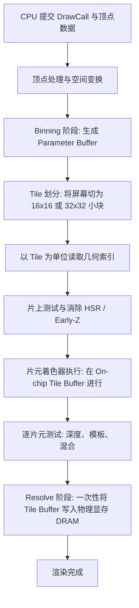
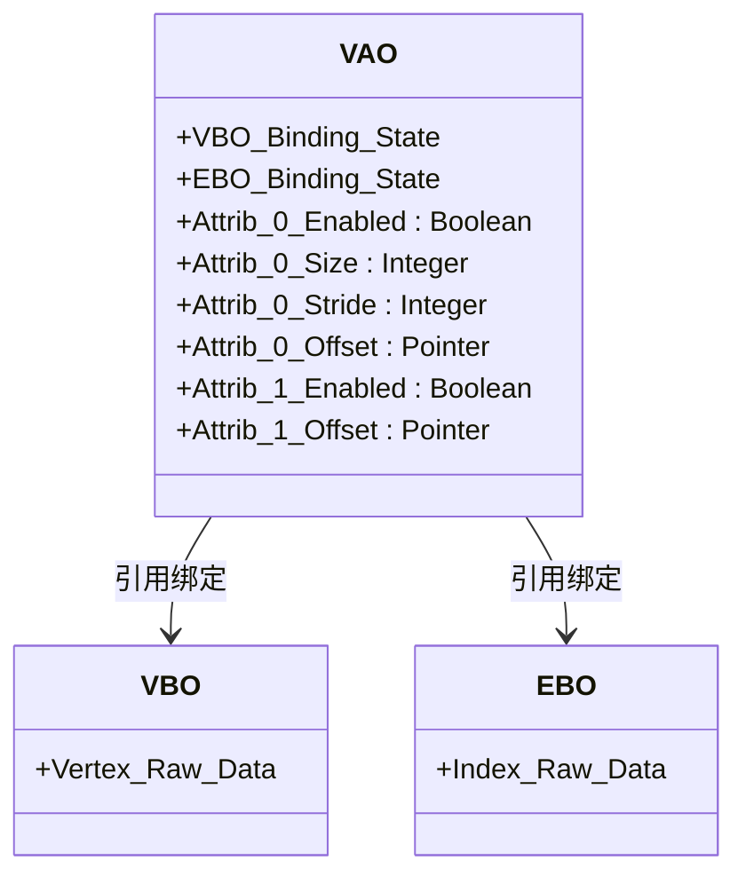
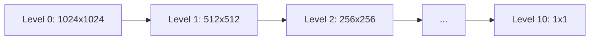
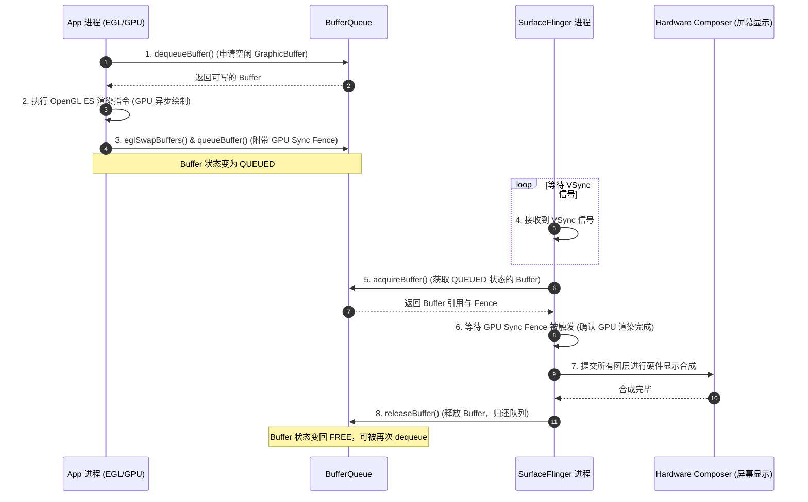

# 5.2.6.3.1 OpenGL ES

在移动端三维图形学与高性能图像处理领域，OpenGL ES（OpenGL for Embedded Systems）是无可争议的基石之一。即便在现代图形 API（如 Vulkan、Metal）逐渐普及的今天，OpenGL ES 凭借其成熟的生态、跨平台兼容性以及与 Android 系统底层的深度契合，依然是移动端图形图像开发中最核心的技能栈。

本篇文档将深入剖析 OpenGL ES 的底层架构、三维图形学渲染管线的物理全景流程、缓冲区对象优化原理、纹理映射与离屏渲染（FBO）的工程实践，并解密 EGL 桥梁如何协同 Android 本地窗口系统（ANativeWindow）及 SurfaceFlinger 共同实现高吞吐、零拷贝的图形渲染。

---

## 1. OpenGL ES 概述与三维图形学底座

### 1.1 什么是 OpenGL ES 及其演进历程
OpenGL ES 是由 Khronos Group 组织制定的跨平台、跨语言的 3D 图形 API 规范，专为嵌入式设备（手机、平板、游戏机、车载仪表等）设计。它是桌面级 OpenGL 的精简子集，移除了冗余的低效接口，保留了最核心的硬件加速渲染能力。

在移动图形技术的发展历史中，OpenGL ES 经历了多次重大的架构演进：
*   **OpenGL ES 1.x（固定管线时代）**：以 1.0 和 1.1 为代表。在此阶段，渲染逻辑是“硬编码”在 GPU 芯片内部的。开发者只能通过设置各种开关（如启用光照、启用雾化、设置材质颜色等）和矩阵操作来控制渲染，无法自定义顶点的变换规则或像素的着色算法。
*   **OpenGL ES 2.0（可编程管线时代）**：这是一个革命性的版本。它废弃了固定管线，引入了可编程的顶点着色器（Vertex Shader）和片元着色器（Fragment Shader），并推出了 OpenGL ES 着色器语言（GLSL ES 1.0）。开发者自此能够通过编写着色器代码，完全掌控三维网格变换与像素颜色的计算逻辑。
*   **OpenGL ES 3.0（统一渲染架构时代）**：进一步统一了着色器模型，引入了诸如多渲染目标（MRT，Multiple Render Targets）、Uniform 缓冲对象（UBO）、顶点数组对象（VAO）、采样器对象以及更丰富的纹理格式（如 ASTC 压缩纹理、3D 纹理），极大增强了移动端渲染复杂 3D 场景的能力。
*   **OpenGL ES 3.1 & 3.2**：引入了计算着色器（Compute Shader，允许利用 GPU 进行通用 GPGPU 计算）、几何着色器（Geometry Shader）、细分控制/评估着色器（Tessellation Shader）以及 ASTC 全面支持，使移动端图形 API 逐渐逼近桌面级 Direct3D 11 与桌面 OpenGL 的水准。

#### 现代图形 API 的格局对比
虽然 OpenGL ES 的使用门槛相对较低，但其作为一个**隐式状态机**，在底层驱动设计上面临很多历史包袱：所有的 API 调用都会改变全局状态，且驱动需要在运行时进行大量的参数合法性校验与着色器动态编译，这导致了极高的 CPU 开销，并且难以进行多线程并行命令提交。

为了解决这些痛点，现代低级图形 API 应运而生：
*   **Vulkan**：Khronos 推出的下一代图形 API，它是完全显式的。开发者需要自行管理内存分配、线程同步、管线状态物（PSO）与命令队列提交。虽然开发难度极高，但它消除了驱动层面的黑盒开销，实现了极致的 CPU 多线程并行渲染。
*   **Metal**：Apple 独占的低开销图形 API，设计理念与 Vulkan 类似，但接口设计更优雅，与 Apple 硬件契合度极高。
*   **WebGL**：Web 端的标准，WebGL 1.0 基于 OpenGL ES 2.0，WebGL 2.0 基于 OpenGL ES 3.0。它通过浏览器的 JavaScript 接口调用 GPU，是 Web 3D 的基石。

### 1.2 移动端 GPU 硬件渲染架构：IMR 与 TBDR 深度对比
移动端 GPU 在设计哲学上与桌面独立 GPU（如英伟达、AMD）投射出本质的不同。这主要体现在对“功耗”和“内存带宽”的敏感度上。移动设备受限于电池容量与散热条件，其芯片功耗必须控制在数瓦之内。

在图形渲染中，对外部系统内存（DRAM，即手机运行内存）的读写是功耗的大户。频繁的内存数据搬运（如读写深度缓冲区、写入帧缓冲区颜色）会迅速耗尽电量并导致芯片发热降频。为了解决这一痛点，移动端 GPU 普遍采用了与桌面端不同的架构。

#### 1.2.1 IMR（Immediate Mode Rendering，立即模式渲染）
桌面独立显卡通常采用 IMR 架构。它的工作方式非常直接：
1.  GPU 接收到一个三角形图元的顶点数据。
2.  对该三角形的顶点执行顶点着色器。
3.  对该三角形进行光栅化，离散成片元。
4.  逐个片元执行片元着色器，进行深度测试，然后将计算出的像素颜色和深度值**立即写回到系统显存中（DRAM）**。

*   **痛点**：对于遮挡严重的复杂 3D 场景，一个像素位置可能被重复绘制多次（Overdraw，过度绘制）。每次绘制都要从物理显存（DRAM）中读取当前的深度值进行比较，再将新的深度和颜色值写回 DRAM。这种高频、批量的 DRAM 读写对于移动端而言是功耗毁灭性的。

#### 1.2.2 TBDR（Tile-Based Deferred Rendering，分块延迟渲染）
主流移动端 GPU（如 ARM Mali、Qualcomm Adreno、Imagination PowerVR）无一例外地采用了 **TBDR** 架构。其核心理念是：**化整为零，将所有的像素运算与测试限制在 GPU 芯片上的高速缓存（On-chip SRAM）中，最大程度减少 DRAM 带宽消耗**。

TBDR 的具体物理流程分为以下三个阶段：



1.  **Binning（分块与几何处理阶段）**：
    GPU 接收到 DrawCall 后，首先对所有的顶点执行顶点着色器（Vertex Shader），完成坐标变换与裁剪。随后，GPU 并不立即进行片元着色，而是将整个屏幕划分为许多微小的网格块，称为 **Tile**（通常大小为 $16 \times 16$ 或 $32 \times 32$ 像素）。
    GPU 会在系统内存中开辟一块缓冲区，称为 **Parameter Buffer**（或 Tile List）。在这个阶段，GPU 会计算哪些三角形图元落在了哪个 Tile 的范围内，并为每个 Tile 构建一个包含其所有相关三角形的索引列表。
2.  **Rendering（分块渲染阶段）**：
    几何处理完成后，GPU 开始逐个（或并行）渲染这些 Tile。
    对于某一个特定的 Tile，GPU 会将该 Tile 区域对应的三角形列表从 Parameter Buffer 中读入。接着，所有的光栅化、片元着色、深度测试、模板测试、以及半透明混合等操作，都**完全在 GPU 芯片内部的高速静态缓存（On-chip Tile Buffer）**中进行。
    *   **HSR（Hidden Surface Removal，隐面消除，PowerVR/Mali 技术）/ Forward Pixel Killing（前向像素杀死，Mali 技术）**：在执行片元着色器之前，GPU 会对该 Tile 内所有的三角形片元进行完全的几何深度排序和预测试。如果发现某个片元被后面的不透明物体完全遮挡，GPU 会直接在硬件层面上将其“杀死”，不分配片元着色器线程。这意味着，即便场景中存在极高倍数的 Overdraw，每个可见像素位置在理论上只会被执行一次片元着色器。
3.  **Resolve（写回阶段）**：
    当该 Tile 内所有的几何图形全部绘制、测试和混合完毕后，On-chip Tile Buffer 中保留的就是该区域最终的像素颜色。此时，GPU 才会发起一次物理内存写操作，将整个 Tile 的像素数据**一次性写回到外部系统内存（DRAM）**的帧缓冲区（Framebuffer）中。

#### TBDR 的性能与功耗权衡
*   **优势**：极大地降低了物理显存的带宽开销。深度缓冲区（Depth Buffer）和模板缓冲区（Stencil Buffer）的读写完全在片上进行，渲染结束后甚至可以直接丢弃（Discard），不需要写回 DRAM。这节省了 90% 以上的传输功耗。
*   **劣势**：如果场景中三角形数量极多，或者顶点着色器极其复杂，Parameter Buffer 会占用海量的物理内存，并且 Binning 阶段会成为新的性能瓶颈。因此，在移动端进行渲染优化时，**控制顶点数量和简化顶点着色器**同样至关重要。

### 1.3 OpenGL ES 在 Android 系统中的地位
在 Android 系统中，所有的 UI 渲染都是硬件加速的。底层的图形加速正是依赖于 OpenGL ES 或 Vulkan。

Android 系统提供了一个高度优化的图形引擎，称为 **HWUI**（Hardware UI）。当我们使用 Java 层的 `Canvas` 进行绘图操作（如 `drawRect`、`drawBitmap`、`drawText` 等）时，HWUI 引擎会将这些 Canvas 绘制命令转换为底层的 OpenGL ES（或 Vulkan）指令。

每个 View 的渲染命令都会被记录在一个 DisplayList 中。在渲染线程（RenderThread）中，HWUI 会遍历这些 DisplayList，通过 OpenGL ES 将其组织成顶点缓冲和纹理，再发送给 GPU 硬件进行光栅化与混合。

最终，渲染出来的像素数据会被写入到与当前 Activity 绑定的本地窗口缓冲中，随后由系统服务 **SurfaceFlinger** 收集并调用硬件合成器（HWC，Hardware Composer）显示到屏幕上。可以说，OpenGL ES 是贯穿 Android 系统从上层 UI 显示到下层硬件驱动的灵魂纽带。

---

## 2. 渲染管线（Rendering Pipeline）物理全景流程

渲染管线是指将三维场景（由顶点坐标、纹理、光照等数据组成）转换为显示器上二维像素图像的完整物理流水线。在 OpenGL ES 中，这个过程大部分由 GPU 硬件自动完成，开发者需要通过编写着色器程序来介入其中的关键节点。

### 2.1 管线全工序流程图
以下是 OpenGL ES 3.0 可编程渲染管线的物理全景流程图：

```mermaid
graph TD
    subgraph CPU 内存空间
        VData["顶点数据 (坐标, 纹理坐标, 法线等)"]
        ShaderSource["着色器源码 (GLSL)"]
    end

    subgraph GPU 显存 / 统一内存
        VBO["顶点缓冲对象 (VBO)"]
        VAO["顶点数组对象 (VAO)"]
        Program["已编译链接的 Shader Program"]
    end

    VData -->|Upload| VBO
    VBO --> VAO
    ShaderSource -->|Compile & Link| Program

    subgraph GPU 渲染流水线 (硬件管线)
        direction TB
        VertexInput["1. 顶点输入 (Vertex Input)<br/>读取 VAO 指定的顶点流"]
        VS["2. 顶点着色器 (Vertex Shader)<br/>坐标空间变换 (MVP)<br/>计算顶点级属性"]
        Division["3. 裁剪与透视除法 (Perspective Division)<br/>将齐次坐标转换为 NDC 坐标 (-1 到 1)"]
        Assembly["4. 图元装配 (Primitive Assembly)<br/>背面剔除 (Face Culling)"]
        Raster["5. 光栅化 (Rasterization)<br/>离散化为片元, 重心坐标/透视校正插值"]
        FS["6. 片元着色器 (Fragment Shader)<br/>纹理采样, 光照模型计算, 颜色生成"]
        
        subgraph 逐片元操作 (Per-Fragment Operations)
            ScissorTest["7.1 裁剪测试 (Scissor Test)"]
            StencilTest["7.2 模板测试 (Stencil Test)"]
            DepthTest["7.3 深度测试 (Depth Test)"]
            Blending["7.4 混合 (Blending)"]
        end
        
        FrameBuffer["8. 帧缓冲区 (Framebuffer)<br/>颜色/深度/模板附着"]
    end

    VAO --> VertexInput
    Program --> VS
    Program --> FS

    VertexInput --> VS
    VS --> Division
    Division --> Assembly
    Assembly --> Raster
    Raster --> FS
    FS --> ScissorTest
    ScissorTest --> StencilTest
    StencilTest --> DepthTest
    DepthTest --> Blending
    Blending --> FrameBuffer
```

### 2.2 第一阶段：顶点输入与顶点着色器（Vertex Shader）
渲染管线的起点是顶点数据。一个顶点不仅包含三维空间位置（X, Y, Z），还可以包含纹理坐标（S, T）、法线向量（Nx, Ny, Nz）以及顶点颜色（R, G, B, A）。

#### 2.2.1 顶点数据的内存布局
在将顶点数据上传给 GPU 时，数据在内存中的排列方式直接影响了 GPU 读取的吞吐量：
1.  **Interleaved（交错排列）**：将每个顶点的所有属性紧凑地排在一起。
    ```text
    [V0.xyz, V0.uv, V0.normal, V1.xyz, V1.uv, V1.normal, ...]
    ```
2.  **Struct of Arrays（属性隔离排列）**：将同一种属性在内存中排在一起。
    ```text
    [V0.xyz, V1.xyz, ...], [V0.uv, V1.uv, ...], [V0.normal, V1.normal, ...]
    ```

*   **优化建议**：**强烈推荐使用 Interleaved 布局**。因为 GPU 在执行顶点着色器时，是为每个顶点分配线程的。当线程启动时，它需要读取该顶点的全部属性。交错排列使得同一个顶点的空间、纹理、法线数据在物理内存中是连续的，能极大地提升 GPU L1 Cache 的命中率，避免零散内存访问造成的总线等待。

#### 2.2.2 坐标空间变换与 MVP 矩阵
顶点着色器的最核心任务，是将顶点从其自身的局部坐标系转换到规范化的裁剪空间中。这一过程涉及到连续的矩阵乘法，即经典的 **MVP 变换**：

$$\mathbf{P}_{clip} = \mathbf{M}_{projection} \times \mathbf{M}_{view} \times \mathbf{M}_{model} \times \mathbf{P}_{local}$$

1.  **Model Matrix（模型矩阵，$\mathbf{M}_{model}$）**：将顶点从**局部空间（Local Space）**转换到**世界空间（World Space）**。通过对顶点应用平移（Translation）、旋转（Rotation）、缩放（Scale）矩阵，确定物体在三维世界中的位置和姿态。
2.  **View Matrix（观察矩阵，$\mathbf{M}_{view}$）**：将顶点从世界空间转换到**观察空间（View Space，又称相机空间）**。该变换相当于把相机移动到原点，并将相机的视线方向对齐到 $-Z$ 轴，世界中的所有物体随之做相对运动。
3.  **Projection Matrix（投影矩阵，$\mathbf{M}_{projection}$）**：将顶点从观察空间转换到**裁剪空间（Clip Space）**。投影矩阵定义了一个可视区域（视锥体）。超出此视锥体的顶点将被剔除。
    *   **正交投影（Orthographic Projection）**：没有“近大远小”的效果，多用于 2D UI 渲染或 UI 编辑器。
    *   **透视投影（Perspective Projection）**：模拟人眼的视觉特征，具有“近大远小”的效果。

##### 透视投影矩阵的数学推导与 $W$ 分量
一个经典的透视投影矩阵形式如下：

$$\mathbf{M}_{projection} = \begin{bmatrix}
\frac{1}{\tan(fov/2) \cdot aspect} & 0 & 0 & 0 \\
0 & \frac{1}{\tan(fov/2)} & 0 & 0 \\
0 & 0 & -\frac{f+n}{f-n} & -\frac{2fn}{f-n} \\
0 & 0 & -1 & 0
\end{bmatrix}$$

其中，$fov$ 为相机的垂直视场角，$aspect$ 为视口的宽高比，$n$ 和 $f$ 分别代表近裁剪面（Near）和远裁剪面（Far）的距离。

当我们将观察空间下的齐次坐标 $\mathbf{P}_{view} = [x_v, y_v, z_v, 1]^T$ 乘以该投影矩阵时，得到的裁剪空间坐标 $\mathbf{P}_{clip} = [x_c, y_c, z_c, w_c]^T$ 中：

$$w_c = -z_v$$

因为在 OpenGL 的右手法则中，相机视线朝向 $-Z$ 轴，所以相机的深度距离（即 $-z_v$）就被完美地编码到了齐次坐标的第四维 $w_c$ 中。

#### 2.2.3 裁剪与透视除法（Perspective Division）
顶点着色器执行的最后一步，是向内建变量 `gl_Position` 赋值裁剪坐标 $\mathbf{P}_{clip}$。紧接着，GPU 硬件会自动进行以下步骤：
1.  **裁剪（Clipping）**：检测顶点是否满足 $-w_c \le x_c, y_c, z_c \le w_c$。完全在范围外的图元直接丢弃，部分超出范围的图元会在裁剪面边界上被截断，并自动生成新的图元顶点。
2.  **透视除法（Perspective Division）**：将裁剪空间下的四维坐标除以其 $w_c$ 分量，将其投影到三维的**规范化设备坐标（NDC，Normalized Device Coordinates）空间**中：

$$\mathbf{P}_{ndc} = \begin{bmatrix} x_{ndc} \\ y_{ndc} \\ z_{ndc} \end{bmatrix} = \begin{bmatrix} x_c / w_c \\ y_c / w_c \\ z_c / w_c \end{bmatrix}$$

此时，$x_{ndc}, y_{ndc}, z_{ndc}$ 的取值范围都被限制在 $[-1, 1]$ 之间。因为除以了代表深度的 $w_c$，远处的物体坐标数值会向中心收缩，从而在数学上实现了“近大远小”的透视投影效果。

#### 2.2.4 视口变换（Viewport Transform）
接下来，GPU 硬件将 NDC 坐标映射到屏幕的物理窗口像素坐标（屏幕空间）。如果我们在 C++ 中配置了 `glViewport(x, y, width, height)`，其变换公式为：

$$X_{screen} = (x_{ndc} + 1) \times \frac{width}{2} + x$$

$$Y_{screen} = (y_{ndc} + 1) \times \frac{height}{2} + y$$

$$Z_{screen} = (z_{ndc} + 1) \times \frac{far - near}{2} + near$$

此时，顶点的坐标正式变成了屏幕像素坐标（如 $1080 \times 2400$ 范围内的实数值）。

### 2.3 第二阶段：形状装配与光栅化（Primitive Assembly & Rasterization）

#### 2.3.1 形状装配（Primitive Assembly）
在此阶段，GPU 将顶点的序列根据指定的绘制拓扑结构（如 `GL_POINTS`、`GL_LINE_STRIP`、`GL_TRIANGLES` 等）装配成点、线段、或三角形图元。

##### 背面剔除（Face Culling）
在封闭的 3D 网格中，一个三角形通常只有一面是朝向相机（正面），另一面朝向模型内部（背面）。通过背面剔除，可以免去对不可见三角面片进行光栅化和片元计算，提升近 50% 的光栅化效率。
*   **物理判定**：GPU 在屏幕投影空间中，计算三角形顶点的**环绕方向（Winding Order）**。默认情况下，如果顶点的排列顺序是**逆时针（Counter-Clockwise, CCW）**，则为正面；如果是**顺时针（Clockwise, CW）**，则为背面。
*   **开启 API**：
    ```cpp
    glEnable(GL_CULL_FACE);        // 开启背面剔除
    glCullFace(GL_BACK);           // 指定剔除背面 (亦可指定 GL_FRONT 剔除正面)
    glFrontFace(GL_CCW);           // 指定逆时针为正面 (默认)
    ```

#### 2.3.2 光栅化（Rasterization）
光栅化是把连续的几何图形离散成一个个像素大小的“片元（Fragment）”的过程。
对于每个三角形，光栅化器会确定哪些像素的中心落在了三角形边界内。一旦确认，就会为该像素生成一个片元。

##### 重心坐标插值（Barycentric Interpolation）
在顶点着色器中输出的顶点级属性（如纹理坐标、颜色、法线等），在光栅化阶段需要被插值到三角形内部的每个片元上。插值的数学基础是重心坐标。
对于平面三角形 $ABC$ 内的任意点 $P$，存在唯一的实数组 $(\alpha, \beta, \gamma)$ 使得：

$$P = \alpha A + \beta B + \gamma C$$

且满足 $\alpha + \beta + \gamma = 1$，其中 $\alpha, \beta, \gamma \ge 0$。
点 $P$ 上的任意属性值 $\phi_P$ 可以表示为：

$$\phi_P = \alpha \phi_A + \beta \phi_B + \gamma \phi_C$$

##### 透视校正插值（Perspective-Correct Interpolation）
如果在**屏幕空间**直接利用三角形的 2D 像素重心坐标进行线性插值，会导致严重的物理错误。因为透视投影是非线性的，3D 空间中等间距的点，投影到 2D 屏幕后是不等间距的（越远越密集）。如果在屏幕空间等距插值，纹理图元会出现严重的拉伸和扭曲。

为了保证 3D 几何的物理真实性，GPU 硬件在底层必须进行**透视校正插值**。
数学上可以证明，3D 空间的属性 $\phi$ 在经过投影后，其与深度倒数 $1/w$ 的乘积 $\frac{\phi}{w}$、以及深度倒数本身 $1/w$，在屏幕空间中是呈**严格线性关系**的。

因此，GPU 的光栅化硬件的实际插值公式为：
1.  对 $1/w$ 进行屏幕空间重心插值，得到片元处的 $\left(\frac{1}{w}\right)_{frag}$。
2.  对 $\frac{\phi}{w}$ 进行屏幕空间重心插值，得到片元处的 $\left(\frac{\phi}{w}\right)_{frag}$。
3.  通过两者相除，计算出该片元物理正确的属性值 $\phi_{frag}$：

$$\phi_{frag} = \frac{\left(\frac{\phi}{w}\right)_{frag}}{\left(\frac{1}{w}\right)_{frag}}$$

现代 GPU 硬件会自动执行上述透视校正插值，确保如纹理映射等计算在透视视角下表现完美。

### 2.4 第三阶段：片元着色器（Fragment Shader）
光栅化生成的每个片元都会进入片元着色器。片元着色器的任务是计算该像素的最终颜色（RGBA），并可选地输出深度值。

#### 2.4.1 核心任务
*   **纹理采样（Texture Sampling）**：根据插值得到的坐标（S, T），去显存中的纹理数据中查询对应的颜色值。
*   **光照计算**：基于 Phong 光照模型或更高级的 PBR 物理光照模型，利用法线、光源方向、视线方向，计算像素的漫反射（Diffuse）、镜面反射（Specular）和环境光（Ambient）贡献。
*   **色彩空间处理**：例如将视频帧的 YUV 格式数据实时转换为 RGB。

#### 2.4.2 GPU SIMT 架构与分支惩罚（Warp/Wavefront Divergence）
GPU 是高度并行的处理器。它的计算核心以**线程束（Warp，通常为 32 个线程，或 Mali 中的 Wavefront）**为基本执行单元。同一个 Warp 内的 32 个线程在硬件上是**单指令多线程（SIMT）**执行的，即在同一时刻，所有线程只能执行相同的指令。

*   **分支惩罚（Branch Divergence）**：如果我们在片元着色器中编写了如下分支代码：
    ```glsl
    if (v_TexCoord.x > 0.5) {
        color = texture(u_TextureA, v_TexCoord);
    } else {
        color = texture(u_TextureB, v_TexCoord);
    }
    ```
    当同一个 Warp 处理的 32 个相邻像素片元中，一部分 $X > 0.5$（走 if 分支），另一部分 $X \le 0.5$（走 else 分支）时，GPU 的硬件执行逻辑是：
    1.  使所有走 else 分支的线程挂起（屏蔽写入），全力执行 if 分支的指令。
    2.  使所有走 if 分支的线程挂起，全力执行 else 分支的指令。
    这种串行化的执行使得该 Warp 的运行时间翻倍，指令吞吐率骤降。
*   **性能准则**：在编写着色器时，**应尽量避免使用与数据高度相关的条件分支**。应优先使用 `mix()`、`step()`、`clamp()` 等内置数学函数来规避显式分支。

### 2.5 第四阶段：逐片元测试与输出到 FrameBuffer
片元着色器执行完毕后，生成的片元颜色还不能直接写入帧缓冲区，必须通过一系列物理测试的“重重筛选”：

#### 2.5.1 裁剪测试（Scissor Test）
如果通过 `glEnable(GL_SCISSOR_TEST)` 启用了裁剪测试，GPU 会检查当前片元的屏幕坐标 $(X_{screen}, Y_{screen})$ 是否在 `glScissor(x, y, width, height)` 指定的矩形区域内。如果不在，直接丢弃该片元。这常用于限制绘制范围或局部 UI 的刷新。

#### 2.5.2 模板测试（Stencil Test）
模板测试是一种高度灵活的掩码机制。GPU 会比较当前片元的模板参考值与模板缓冲区（Stencil Buffer）中对应像素的现有值。
*   **应用场景**：阴影体积（Shadow Volume）、镜像反射蒙版、多边形裁剪、以及 UI 中的圆角截取（Clipping）。
*   可以通过 `glStencilOp` 配置测试通过或失败时如何更新模板缓冲区的值（如保留、清零、累加、取反）。

#### 2.5.3 深度测试（Depth Test）与 Z-Fighting
深度测试用于确定 3D 空间中物体的前后遮挡关系。GPU 将当前片元的深度值 $Z$（通常在 $[0, 1]$ 之间）与深度缓冲区（Depth Buffer）中该位置的现有深度值进行比较（通过 `glDepthFunc`，默认通常为 `GL_LESS`，即更近的物体通过测试）。
*   如果通过，当前片元的深度值会覆盖原有值（如果开启了 `glDepthMask(GL_TRUE)`）。
*   如果不通过，直接丢弃。

##### Z-Fighting（深度冲突）与对策
当两个 3D 几何表面的物理距离非常接近，且距离相机较远时，由于深度缓冲区的精度限制（比如 16 位浮点数在远处的解析度极低），计算出的两个片元的深度值大小可能完全相同，或者由于浮点舍入误差交替领先。这会导致渲染出来的画面出现闪烁斑驳的锯齿状纹理，即 Z-Fighting。
*   **解决对策**：
    1.  **Polygon Offset（多边形偏移）**：通过 `glEnable(GL_POLYGON_OFFSET_FILL)` 在光栅化阶段人为给其中一个图元加上深度偏移值。
    2.  **合理调整近/远裁剪面**：尽量将近裁剪面（Near）推远，远裁剪面（Far）拉近。因为深度缓冲的精度在近裁剪面附近极其密集，远裁剪面附近极其稀疏。
    3.  **提升位深**：在创建 EGLSurface 时，使用 24 位或 32 位的深度缓冲区代替默认的 16 位。

##### GPU 硬件级深度优化：Early-Z 与 Late-Z
*   **Late-Z**：传统的管线设计中，深度测试是在片元着色器**之后**执行的。如果一个复杂的片元经过了繁重的时间计算，最后却因为深度测试失败被丢弃，这就造成了极大的算力浪费。
*   **Early-Z**：现代 GPU 会将深度测试自动提前到光栅化之后、片元着色器执行**之前**。只有通过深度测试的片元才会被激活片元着色器线程。
*   **Early-Z 的失效条件**：如果开发者在片元着色器中执行了以下操作，GPU 必须回退到 Late-Z 模式：
    1.  在着色器内使用了 `discard` 关键字（因为 GPU 在运行着色器前无法断定该片元最终是否会被丢弃）。
    2.  在着色器内手动写入了 `gl_FragDepth`。
    因此，**在移动端高性能渲染中，应尽量避免在着色器中使用 `discard`**，以便充分利用 Early-Z 硬件加速。

#### 2.5.4 混合（Blending）
对于半透明物体，或者是开启了颜色混合（`glEnable(GL_BLEND)`）的场景，GPU 会将片元着色器输出的颜色（源颜色，Source Color，$\mathbf{C}_{src}$）与帧缓冲区中已有的像素颜色（目标颜色，Destination Color，$\mathbf{C}_{dst}$）进行混合。
*   **物理公式**：

$$\mathbf{C}_{final} = \mathbf{C}_{src} \times \mathbf{F}_{src} \text{ op } \mathbf{C}_{dst} \times \mathbf{F}_{dst}$$

我们可以通过 `glBlendFunc(srcFactor, dstFactor)` 配置混合因子，通过 `glBlendEquation(mode)` 配置运算符（如 `GL_FUNC_ADD`、`GL_FUNC_SUBTRACT`）。
对于最经典的 Alpha 混合：
```cpp
glBlendFunc(GL_SRC_ALPHA, GL_ONE_MINUS_SRC_ALPHA);
```
对应的数学计算为：

$$C_{final} = C_{src} \times A_{src} + C_{dst} \times (1 - A_{src})$$

*   **渲染顺序的硬性法则**：
    由于半透明混合依赖于帧缓冲区中已经存在的目标颜色，因此**必须严格控制绘制顺序**：
    1.  首先开启深度测试与深度写入（`glDepthMask(GL_TRUE)`），**从前往后**绘制所有不透明物体。
    2.  然后关闭深度写入（`glDepthMask(GL_FALSE)`，即只进行深度测试，不更新深度缓冲区的值），开启混合（`glEnable(GL_BLEND)`）。
    3.  **从后往前（Painter's Algorithm，画家算法）**依次绘制所有半透明物体。如果不进行深度排序或关闭深度写入，先绘制的近处半透明物体会写入深度，阻挡远处半透明物体的绘制，导致半透明效果失真。

#### 2.5.5 Dither（抖动）
在一些低色深屏幕（如 RGB565，16位色）上，渐变色区域容易出现明显的色彩条带（Banding）。Dither 开启后，会在像素中引入高频微小噪点，利用人眼的低通滤波效应，视觉上模拟出更高色彩深度的渐变效果。

### 2.6 GLSL 3.0 着色器语法详解
GLSL（OpenGL Shading Language）是针对 GPU 编写的类 C 语言。在 OpenGL ES 3.0 中，着色器语法发生了重大升级：

#### 2.6.1 核心语法的变化与 `layout` 修饰符
1.  **版本声明**：着色器第一行必须显式声明版本：
    ```glsl
    #version 300 es
    ```
2.  **in / out 关键字**：废弃了 2.0 的 `attribute`（只能在顶点着色器用）与 `varying`（用于顶点到片元插值）。统一用 `in` 表示输入，`out` 表示输出。
    *   顶点着色器的输入属性标记为 `in`，其计算后需要传递给片元的数据标记为 `out`。
    *   片元着色器接收该数据时，声明同名同类型的 `in` 变量，其输出的颜色则声明为一个 `out vec4` 变量。
3.  **Layout 定位限定符**：
    在 GLSL 3.0 中，我们可以直接在顶点着色器中使用 `layout(location = N)` 来静态指定顶点属性通道：
    ```glsl
    layout(location = 0) in vec4 a_Position;
    layout(location = 1) in vec2 a_TexCoord;
    ```
    *   **核心优势**：在 C++ 宿主代码中，我们可以直接调用 `glVertexAttribPointer(0, ...)` 和 `glVertexAttribPointer(1, ...)` 进行绑定，**免去了使用 `glGetAttribLocation` 去显卡驱动里动态查询位置的步骤**。这规避了 CPU 与 GPU 驱动之间的同步查询开销。

#### 2.6.2 Uniform 变量与插值机制
*   **Uniform 变量**：属于全局静态只读变量，在整个 DrawCall 期间其值完全不变。它被存储在 GPU 的专属常量区。
    如果我们需要渲染大批量的骨骼动画或多光源位置，使用传统的 `glUniform` 单个更新会引发巨大的总线开销。OpenGL ES 3.0 引入了 **Uniform Buffer Object (UBO，Uniform 缓冲对象)**，允许开发者将大量的 Uniform 变量打包写入一块显存缓冲区，实现一键绑定与共享。
*   **插值修饰符**：
    *   `smooth`（默认）：开启透视校正插值。
    *   `flat`：不进行任何插值，片元上的值直接等于该图元最后一个顶点（Provoking Vertex）的属性值。常用于传递材质 ID 或整型标记。

#### 2.6.3 精度修饰符与性能
GLSL ES 要求对浮点数和整型显式声明精度：
*   `highp`：32位浮点数。用于顶点位置、纹理坐标计算（防止远处物体的纹理抖动）以及光照计算中的向量数学。
*   `mediump`：16位浮点数。多用于颜色计算、局部的向量运算。
*   `lowp`：8-10位定点数。多用于普通的 RGBA 颜色表示。

*   **性能考量**：在移动端 GPU 上，`mediump` 的计算吞吐量通常是 `highp` 的两倍（因为很多移动 GPU 拥有专用的 16 位 ALU，可以进行 SIMD 并行计算）。同时，`mediump` 占用的寄存器更少，允许 GPU 调度更多的线程并行。因此，**在片元着色器中，在不影响视觉质量的前提下，应尽可能将变量精度声明为 `mediump`**。

---

## 3. 缓冲区对象优化（Buffer Objects Optimization）

在图形渲染开发中，“CPU 与 GPU 的数据总线传输带宽瓶颈”以及“每次 DrawCall 引起的状态切换开销”是导致游戏和高性能渲染卡顿的两大元凶。OpenGL ES 引入了一系列缓冲区对象，旨在将数据与状态缓存至 GPU 内部，实现最大化的本地化加速。

### 3.1 传统模式的瓶颈：CPU-GPU 通信开销
在未采用任何缓冲区对象（如 VBO）的传统渲染模式下，顶点的解析流向如下：

```text
[CPU 宿主内存] --(每次 DrawCall 均通过系统总线拷贝)--> [GPU 驱动内核空间] --(DMA 传输)--> [GPU 显存/处理单元]
```

由于手机芯片采用统一内存架构（UMP），CPU 与 GPU 虽然共享物理内存，但两者的访问机制、页表管理以及 L1/L2 缓存是独立的。每次调用 `glDrawArrays` 时，驱动都要对用户空间传入的指针进行校验，重新锁页，并拷贝数据。这种频繁的 CPU-GPU 数据通信不仅造成了极高的 CPU 开销（系统调用与上下文切换），更导致 GPU 在等待数据到达时处于饥饿状态，拉低了整体帧率。

### 3.2 VBO（Vertex Buffer Object，顶点缓冲对象）
VBO 的引入就是为了解决上述问题。它允许开发者直接在 GPU 显存或高性能统一内存中开辟一块专有的存储区域，在初始化阶段将顶点数据上传完毕。

#### 3.2.1 VBO 的原理与操作流程
1.  **创建与绑定**：
    ```cpp
    GLuint vboId;
    glGenBuffers(1, &vboId);
    glBindBuffer(GL_ARRAY_BUFFER, vboId);
    ```
2.  **上传数据**：
    ```cpp
    glBufferData(GL_ARRAY_BUFFER, sizeof(vertices), vertices, GL_STATIC_DRAW);
    ```
3.  **指定内存分配与使用策略（Usage）**：
    `glBufferData` 的最后一个参数是给显卡驱动的“内存分配策略暗示”：
    *   **`GL_STATIC_DRAW`**：数据上传后几乎从不修改，但会被高频用于绘图。驱动通常会将该 VBO 放置在 GPU 访问带宽最高、但 CPU 写入开销较大的**本地显存区（VRAM）**中。
    *   **`GL_DYNAMIC_DRAW`**：数据会被 CPU 频繁更新且高频用于绘图（例如物理引擎模拟的水面顶点）。驱动通常会将其放置在**支持写合并（Write-Combining）的系统内存（GART）**中，以便 CPU 高速写入，而 GPU 可以通过 DMA 旁路直接读取。
    *   **`GL_STREAM_DRAW`**：数据只写入一次，使用很少次数。

### 3.3 VAO（Vertex Array Object，顶点数组对象）
虽然 VBO 解决了顶点数据的物理拷贝开销，但在每次 DrawCall 之前，CPU 依然需要为当前的物体执行一系列顶点属性绑定操作：
```cpp
glBindBuffer(GL_ARRAY_BUFFER, vboId);
glEnableVertexAttribArray(0);
glVertexAttribPointer(0, 3, GL_FLOAT, GL_FALSE, stride, pointer);
glEnableVertexAttribArray(1);
glVertexAttribPointer(1, 2, GL_FLOAT, GL_FALSE, stride, pointer2);
```
这些 API 调用属于显式的状态切换，在底层需要经过状态机的转换和校验，累积起来的 CPU 驱动开销不可忽视。

#### 3.3.1 VAO 的设计原理
**VAO 是一个“状态容器”**。它在 GPU 端记录并保存当前绑定的 VBO、EBO，以及所有顶点属性指针（`glVertexAttribPointer`）的配置参数和启用状态。



#### 3.3.2 优化效果
在渲染循环中，我们不需要对每个顶点属性单独做设置，只需要一行代码绑定对应的 VAO：
```cpp
glBindVertexArray(vaoId); // 瞬间恢复所有顶点状态配置
glDrawArrays(...);
glBindVertexArray(0);
```
这样将数十次状态绑定 API 调用缩减为 1 次，大幅减轻了 CPU 的驱动执行开销。

### 3.4 EBO/IBO（Element/Index Buffer Object，索引缓冲对象）
在三维场景中，大部分网格模型都是共享顶点的。以一个最简单的 3D 立方体为例，它有 8 个物理顶点，但在渲染时，它必须被拆解为 6 个面、共 12 个三角形。这意味着我们需要为绘图 API 传入 36 个顶点。

如果只使用 VBO 进行绘制，大量的顶点（包括坐标、UV、法线等）数据会在显存中被重复存储和传输 4.5 次。这不仅浪费了显存空间，最致命的是**顶点的重复空间变换计算**。

#### 3.4.1 EBO 优化机制
EBO 将顶点数据与拓扑结构（即顶点的连接顺序）进行解耦：
*   **VBO** 中只存储唯一的 8 个顶点数据。
*   **EBO** 中仅存储这些顶点的整型索引（如 `[0, 1, 2, 2, 3, 0, ...]`，每个索引仅占 2 字节或 4 字节）。

##### Post-transform Cache（后变换缓存命中）
现代 GPU 内部拥有一个非常关键的物理硬件缓存，称为 **Post-transform Cache（或 Vertex Cache）**。
当 GPU 使用 `glDrawElements` 进行索引绘制时，顶点着色器的执行单元会首先查询该缓存：
1.  如果当前处理的顶点索引已经在缓存中（说明刚刚计算过该顶点），GPU 将**直接复用先前计算好的裁剪空间坐标**。
2.  只有当索引未命中时，才启动顶点着色器计算，并将结果更新进缓存。
如果采用 `glDrawArrays`，GPU 根本无法判定顶点的重用性，导致每一个传入的顶点都要执行一次顶点着色器。因此，**采用 VBO + EBO 的索引绘制能节省 30% 到 50% 的顶点着色算力开销**。

---

## 4. 纹理映射与离屏渲染（Texture Mapping & FBO）

### 4.1 纹理映射基础与性能调优
纹理映射是将一张二维图像（Texture）映射到 3D 网格表面的技术。纹理坐标系统（S, T）定义在 $[0, 1]$ 范围内，用于在图像内进行像素定位。

#### 4.1.1 纹理环绕（Wrap）模式
当着色器中的纹理坐标 $(S, T)$ 超出了 $[0, 1]$ 的范围时，环绕模式决定了如何采样像素：
*   **`GL_REPEAT`**：图像重复平铺。
*   **`GL_CLAMP_TO_EDGE`**：超出范围的坐标被强行钳制在边缘，使得超出部分渲染为边缘的拉伸条纹。
    > [!IMPORTANT]
    > 在进行离屏渲染（FBO）或边缘羽化模糊时，必须指定 `GL_CLAMP_TO_EDGE`。如果误用了默认的 `GL_REPEAT`，在边缘进行纹理采样插值时会混入对面边缘的颜色（如左边缘采样混入右边缘的像素），导致画面出现黑边或杂色。

#### 4.1.2 纹理过滤（Filter）模式
因为三维场景中物体会拉近或推远，纹理图像的分辨率与屏幕像素的分辨率很难恰好相等，需要进行过滤计算：
1.  **`GL_NEAREST`（邻近过滤）**：直接取与采样坐标最近的那个纹素颜色。速度最快，但在拉近放大时会有明显的马赛克，在推远缩小时会有严重的锯齿与闪烁。
2.  **`GL_LINEAR`（线性过滤 / 双线性插值）**：获取采样点周围 $2 \times 2$ 范围内的 4 个纹素进行加权平均。图像相对平滑，但当物体推到极远极小时，仍然会因为采样频率过低产生严重的走样。

##### Mipmapping（多级渐进纹理）与三线性过滤
为了彻底解决“大纹理渲染到小像素区域时的摩尔纹与闪烁”以及“GPU L1 缓存命中率崩溃”的痛点，Khronos 引入了 Mipmap。
Mipmap 是一组预先计算好的图像链，每级的宽和高都是前一级的 $\frac{1}{2}$。例如：
```text
Level 0: 1024x1024
Level 1: 512x512
Level 2: 256x256
...
Level 10: 1x1
```



当物体距离相机较远，其在屏幕上占用的面积缩小时，GPU 会根据缩放比例自动选择最合适的 Mipmap 层级进行采样：
*   **`GL_LINEAR_MIPMAP_NEAREST`（双线性过滤 + 邻近层级）**：在最贴近的单个 Mipmap 层级内执行双线性过滤。
*   **`GL_LINEAR_MIPMAP_LINEAR`（三线性过滤）**：在两个最贴近的 Mipmap 层级上分别执行双线性过滤，然后对这两个层级的结果再次进行线性插值。这消除了不同 Mipmap 精度层级之间明显的阶梯状过渡分界线，但会多消耗一倍的纹理读取带宽。

### 4.2 FBO（Frame Buffer Object，帧缓冲区对象）与离屏渲染
在美颜相机、滤镜后处理、阴影贴图、甚至界面过渡动画中，我们都无法通过单次直接渲染将图像呈现出来，必须先将画面绘制到一张看不见的“画布”上进行深度处理，这个机制就是**离屏渲染（Off-screen Rendering）**。
FBO（帧缓冲区对象）是离屏渲染的核心管理者。它不自带显存，只提供一组“附着插槽（Attachments）”。

#### 4.2.1 FBO 附着选择：纹理附着 vs 渲染缓冲附着
FBO 可以挂载两类物理存储对象：
1.  **Texture Attachment（纹理附着）**：将渲染结果直接写入一个普通的 OpenGL 纹理中。
    *   **核心优势**：这个纹理可以立即作为后续 DrawCall 的片元着色器输入（`sampler2D`），是**滤镜链条串联的物理基础**。
2.  **Renderbuffer Attachment（RBO，渲染缓冲附着）**：
    RBO 是专门优化的底层只写/写回缓冲区。它的内部排列格式针对深度测试、模板测试进行了硬件级的极大优化。
    *   **核心优势**：读写性能优于纹理附着。在不需要作为后续纹理采样的场景下（例如 FBO 离屏渲染时的深度通道和模板通道），**必须优先绑定 RBO**。在 TBDR 架构下，RBO 作为深度缓冲，甚至在 Tile 结束时可以直接丢弃（Discard），不需要发生任何 DRAM 写回。

#### 4.2.2 FBO 创建与绑定 C++ 核心实现

```cpp
#include <GLES3/gl3.h>
#include <iostream>

// 封装 FBO 离屏渲染环境的创建
struct OffscreenFbo {
    GLuint fboId = 0;
    GLuint colorTexId = 0;
    GLuint depthStencilRboId = 0;
    int width = 0;
    int height = 0;

    bool init(int w, int h) {
        width = w;
        height = h;

        // 1. 创建并绑定 FBO
        glGenFramebuffers(1, &fboId);
        glBindFramebuffer(GL_FRAMEBUFFER, fboId);

        // 2. 创建用于颜色附着的纹理
        glGenTextures(1, &colorTexId);
        glBindTexture(GL_TEXTURE_2D, colorTexId);
        glTexImage2D(GL_TEXTURE_2D, 0, GL_RGBA, width, height, 0, GL_RGBA, GL_UNSIGNED_BYTE, nullptr);
        
        // 配置纹理环绕与过滤模式
        glTexParameteri(GL_TEXTURE_2D, GL_TEXTURE_MIN_FILTER, GL_LINEAR);
        glTexParameteri(GL_TEXTURE_2D, GL_TEXTURE_MAG_FILTER, GL_LINEAR);
        glTexParameteri(GL_TEXTURE_2D, GL_TEXTURE_WRAP_S, GL_CLAMP_TO_EDGE);
        glTexParameteri(GL_TEXTURE_2D, GL_TEXTURE_WRAP_T, GL_CLAMP_TO_EDGE);

        // 将该纹理关联 to FBO 的第 0 个颜色附着点上
        glFramebufferTexture2D(GL_FRAMEBUFFER, GL_COLOR_ATTACHMENT0, GL_TEXTURE_2D, colorTexId, 0);

        // 3. 创建用于深度和模板附着的 RBO (合并的 DEPTH24_STENCIL8 格式)
        glGenRenderbuffers(1, &depthStencilRboId);
        glBindRenderbuffer(GL_RENDERBUFFER, depthStencilRboId);
        glRenderbufferStorage(GL_RENDERBUFFER, GL_DEPTH24_STENCIL8, width, height);

        // 将该 RBO 关联 to FBO 的深度和模板附着点上
        glFramebufferRenderbuffer(GL_FRAMEBUFFER, GL_DEPTH_STENCIL_ATTACHMENT, GL_RENDERBUFFER, depthStencilRboId);

        // 4. 检查 FBO 的物理状态是否配置完整
        GLenum status = glCheckFramebufferStatus(GL_FRAMEBUFFER);
        if (status != GL_FRAMEBUFFER_COMPLETE) {
            std::cerr << "FBO configuration incomplete, status: " << status << std::endl;
            release();
            return false;
        }

        // 解绑 FBO，恢复默认屏幕帧缓冲
        glBindFramebuffer(GL_FRAMEBUFFER, 0);
        glBindTexture(GL_TEXTURE_2D, 0);
        glBindRenderbuffer(GL_RENDERBUFFER, 0);
        return true;
    }

    void release() {
        if (fboId != 0) {
            glDeleteFramebuffers(1, &fboId);
            fboId = 0;
        }
        if (colorTexId != 0) {
            glDeleteTextures(1, &colorTexId);
            colorTexId = 0;
        }
        if (depthStencilRboId != 0) {
            glDeleteRenderbuffers(1, &depthStencilRboId);
            depthStencilRboId = 0;
        }
    }
};
```

### 4.3 离屏渲染的高级应用实践

#### 4.3.1 高斯模糊（Gaussian Blur）的一维分离卷积优化
在美颜滤镜中，高斯模糊常被作为磨皮算法的基石。对于一个 $N \times N$ 大小的模糊内核，传统的二维高斯滤波器在对每个像素求值时，需要进行 $N^2$ 次纹理采样。当 $N=15$ 时，单帧像素采样次数高达 225 次，在移动端上会导致严重的 GPU 算力瓶颈。

由于高斯分布具有独特的数学可分离性：

$$G(x, y) = \frac{1}{2\pi\sigma^2} e^{-\frac{x^2+y^2}{2\sigma^2}} = \left( \frac{1}{\sqrt{2\pi}\sigma} e^{-\frac{x^2}{2\sigma^2}} \right) \cdot \left( \frac{1}{\sqrt{2\pi}\sigma} e^{-\frac{y^2}{2\sigma^2}} \right) = h(x) \cdot v(y)$$

我们可以通过**两个独立的通道**来分别实现模糊：
1.  **水平通道**：将原始图像输入，使用只在水平方向做 $N$ 次采样的一维高斯着色器渲染，输出到临时 FBO_A 中。
2.  **垂直通道**：将 FBO_A 对应的纹理输入，使用只在垂直方向做 $N$ 次采样的一维高斯着色器渲染，输出到最终的目标帧缓冲中。
*   **优化结果**：将采样复杂度从 $O(N^2)$ 降低到 $O(2N)$。从 225 次降为 30 次，性能提升近 7.5倍，确保了移动端的实时性。

#### 4.3.2 水印叠加与图层混合
基于 FBO 可以实现多层滤镜和水印的合成。核心逻辑是利用 Alpha Blending，通过两次 DrawCall 将主场景与水印图片叠加绘制进 FBO，最后一次性输出。

#### 4.3.3 双缓冲纹理轮转机制（Ping-Pong Buffering）
当我们需要实现诸如“多次迭代高斯模糊”或“粒子物理反馈模拟”等连续后处理时，会遇到一个 OpenGL 经典的硬件限制：**禁止在同一个 DrawCall 中，将一张纹理既绑定为采样的输入源（`glBindTexture`），又将其挂载为当前绘制的输出帧缓冲（`glFramebufferTexture2D`）**。
如果强制执行，会导致 GPU 读写冲突（Texture Feedback Loop），渲染结果会花屏或完全黑屏。

为了解决这一问题，我们必须使用 **Ping-Pong（兵乓）缓冲机制**：

```mermaid
sequenceDiagram
    participant P as Ping-Pong 控制器
    participant F0 as FBO_0 (Tex_0)
    participant F1 as FBO_1 (Tex_1)
    
    rect rgb(85, 85, 85)
    Note over P, F1: 迭代 1: 以 Tex_0 为输入，渲染至 FBO_1
    P->>F1: 绑定为 Render Target
    P->>F0: 绑定其纹理 Tex_0 为输入源
    P->>F1: 执行 DrawCall 绘制
    end
    
    rect rgb(100, 100, 100)
    Note over P, F1: 迭代 2: 以 Tex_1 为输入，渲染至 FBO_0
    P->>F0: 绑定为 Render Target
    P->>F1: 绑定其纹理 Tex_1 为输入源
    P->>F0: 执行 DrawCall 绘制
    end
    
    Note over P, F1: 如此往复轮转，完成多次迭代
```



##### Ping-Pong 轮转 C++ 实现片段
```cpp
// 准备两个 FBO 离屏对象
OffscreenFbo pingPongFbos[2];
pingPongFbos[0].init(1080, 1920);
pingPongFbos[1].init(1080, 1920);

// 假定最初的输入图像在 inputTextureId 中
GLuint currentInputTex = inputTextureId;
int readIndex = 0;
int writeIndex = 1;

int blurIterations = 4; // 执行 4 次模糊迭代
for (int i = 0; i < blurIterations; ++i) {
    // 绑定写入的帧缓冲
    glBindFramebuffer(GL_FRAMEBUFFER, pingPongFbos[writeIndex].fboId);
    glViewport(0, 0, pingPongFbos[writeIndex].width, pingPongFbos[writeIndex].height);
    glClear(GL_COLOR_BUFFER_BIT);

    // 激活并绑定读取的输入纹理
    glActiveTexture(GL_TEXTURE0);
    glBindTexture(GL_TEXTURE_2D, currentInputTex);
    glUniform1i(textureUniformLoc, 0);

    // 设置模糊的方向 (水平 vs 垂直)
    glUniform2f(blurDirectionLoc, (i % 2 == 0) ? 1.0f : 0.0f, (i % 2 == 0) ? 0.0f : 1.0f);

    // 绘制全屏矩形 (Quad) 触发渲染
    drawFullScreenQuad();

    // 轮转指针：将刚写入的纹理作为下一次迭代的输入源
    currentInputTex = pingPongFbos[writeIndex].colorTexId;
    
    // 交换读写索引
    readIndex = 1 - readIndex;
    writeIndex = 1 - writeIndex;
}

// 此时，最终的结果纹理为 currentInputTex
```

---

## 5. EGL 桥梁与 Android 窗口机制协同

### 5.1 为什么 OpenGL ES 无法直接在 ANativeWindow 上绘图？
OpenGL ES 规范被设计为平台无关的 3D 图形 API，其设计哲学不包含任何与具体操作系统、桌面窗口系统、进程间通信或硬件内存管理相关的接口。OpenGL ES 只关心如何在它抽象出的状态机上，把传入的顶点数据变换成颜色像素写入一个帧缓冲区。

然而，在真实的移动设备上，渲染目标是极为复杂的：
1.  绘制的目标可以是物理屏幕的一个区域，也可以是后台进程的内存块（如离屏解码）。
2.  Android 系统的 UI 渲染需要支持跨进程通信。应用进程（App Process）绘制的图元需要提交给专门的合成进程（SurfaceFlinger Process）进行统一合成。
3.  底层的物理显存分配（Gralloc）和线程安全要求极为严苛。

因此，必须有一个中间适配层，负责连接“平台无关的 OpenGL ES”与“平台特有的窗口管理系统”。这套标准就是由 Khronos Group 制定的 **EGL**。

### 5.2 EGL 的核心概念与数据结构
EGL 的本质是 OpenGL ES 状态机的生命周期管理器与内存桥梁。它定义了以下核心数据结构：

*   **`EGLDisplay`**：物理显示屏的抽象。在 Android 中，通常通过 `eglGetDisplay(EGL_DEFAULT_DISPLAY)` 获得系统默认屏幕的句柄。
*   **`EGLConfig`**：描述帧缓冲区的具体格式。包括颜色通道位深（如 RGB888, RGBA8888）、深度测试/模板测试的位深、以及多重采样抗锯齿（MSAA）的样本数等。
*   **`EGLContext`**：OpenGL ES 渲染上下文。它在物理上包含了当前线程的所有 OpenGL ES 状态变量、着色器程序、VBO/VAO 绑定关系以及显存缓存信息。**EGLContext 就是 OpenGL ES 状态机的物理实体**。
*   **`EGLSurface`**：帧缓冲内存表面的抽象，封装了用于写入像素的底层物理缓冲区。
    *   **`WindowSurface`**：绑定到平台本地窗口（在 Android 中是 Java 层的 `Surface`，在 NDK 层对应 `ANativeWindow`）。OpenGL 往这个 Surface 上绘制的每一帧，都会通过底层驱动队列自动流向系统的显示链路。
    *   **`PbufferSurface`（Pixel Buffer Surface）**：纯后台显存缓冲区，没有绑定任何 OS 的物理窗口。常用于不显示在屏幕上的纯算法计算或图像转码。

### 5.3 EGL 生命周期与核心 API 调用链
要在 NDK 线程中手动建立 OpenGL ES 渲染通道，必须严格执行以下 EGL 初始化流程：

```cpp
#include <EGL/egl.h>
#include <GLES3/gl3.h>

bool setupEgl(ANativeWindow* nativeWindow) {
    // 1. 获取默认显示设备
    EGLDisplay display = eglGetDisplay(EGL_DEFAULT_DISPLAY);
    if (display == EGL_NO_DISPLAY) return false;

    // 2. 初始化 EGL
    EGLint major, minor;
    if (!eglInitialize(display, &major, &minor)) return false;

    // 3. 配置所需的帧缓冲属性
    EGLint attribList[] = {
        EGL_RENDERABLE_TYPE, EGL_OPENGL_ES3_BIT, // 指定支持 ES 3.0
        EGL_SURFACE_TYPE, EGL_WINDOW_BIT,        // 用于 WindowSurface
        EGL_RED_SIZE, 8,
        EGL_GREEN_SIZE, 8,
        EGL_BLUE_SIZE, 8,
        EGL_ALPHA_SIZE, 8,
        EGL_DEPTH_SIZE, 24,                      // 24位深度缓冲
        EGL_NONE
    };

    EGLConfig config;
    EGLint numConfigs;
    if (!eglChooseConfig(display, attribList, &config, 1, &numConfigs) || numConfigs < 1) {
        return false;
    }

    // 4. 创建 OpenGL ES 上下文 (EGLContext)
    EGLint contextAttribs[] = {
        EGL_CONTEXT_CLIENT_VERSION, 3,           // 指定 OpenGL ES 3 版本
        EGL_NONE
    };
    EGLContext context = eglCreateContext(display, config, EGL_NO_CONTEXT, contextAttribs);
    if (context == EGL_NO_CONTEXT) return false;

    // 5. 将 EGLSurface 绑定到 Android 本地窗口 ANativeWindow
    EGLSurface surface = eglCreateWindowSurface(display, config, nativeWindow, nullptr);
    if (surface == EGL_NO_SURFACE) return false;

    // 6. 核心步骤: 将上下文绑定到当前调用线程
    if (!eglMakeCurrent(display, surface, surface, context)) {
        return false;
    }

    return true;
}
```

#### 5.3.1 `eglMakeCurrent` 的底层机制与多线程限制
`eglMakeCurrent` 是整个 OpenGL 开发中最需要谨慎对待的 API 之一。
*   **单线程独占性**：一个 `EGLContext` 在同一时刻**只能被绑定到一个操作系统线程**。如果尝试在两个不同的线程中同时调用 `eglMakeCurrent` 去绑定同一个 Context，第二个线程会立即失败并报错 `EGL_BAD_ACCESS`。
*   **Thread Local Storage (TLS)**：EGL 的底层实现依靠操作系统的线程局部存储。当调用 `eglMakeCurrent` 成功后，EGL 驱动会将当前上下文的指针保存在 TLS 中。随后，当我们在该线程调用 `glDrawX` 等任何 GLES 指令时，GLES 驱动都会隐式地从该线程的 TLS 中取出 Context 指针，从而得知当前是哪个状态机在执行操作。
*   **跨线程迁移机制**：如果需要在后台线程（如工作线程）使用主线程的 Context 进行纹理载入，必须遵循以下“安全转移”规范：
    1.  在主线程调用 `eglMakeCurrent(display, EGL_NO_SURFACE, EGL_NO_SURFACE, EGL_NO_CONTEXT)` 解除绑定。
    2.  在工作线程调用 `eglMakeCurrent(display, surface, surface, context)` 重新执行绑定。

##### 上下文共享（Shared Context）—— 异步资源加载的最佳实践
为了避免跨线程解绑/重绑的复杂同步开销，最佳方案是**创建共享上下文**：
1.  在主线程初始化 `Context_A`。
2.  在后台线程创建 `Context_B`，并在 `eglCreateContext` 的第三个参数（`share_context`）中传入 `Context_A`。
3.  `Context_A` 和 `Context_B` 分别绑定到不同的线程上独立运行。
*   **原理**：共享上下文机制允许两个独立的 OpenGL 状态机共享底层的 GPU 资源数据库（纹理、VBO、UBO、着色器程序）。子线程可以使用 `Context_B` 异步解码大图片并上传至 GPU，上传完毕后发送信号给主线程。主线程可以直接使用 `Context_A` 绘制该纹理，没有任何 CPU 阻塞。

### 5.4 eglSwapBuffers 物理换页与 SurfaceFlinger/VSync 协同

在 Android 的图形架构中，绘制输出是一个高度协作的流水线。在将像素最终呈现到屏幕上时，涉及到 **App 进程（图形生产者 Producer）**、**SurfaceFlinger 进程（图形消费者 Consumer）** 以及 **硬件屏幕（显示器）**。

#### 5.4.1 Android 图形系统的核心纽带：BufferQueue
在底层，Android 本地窗口（ANativeWindow）包装了一个名为 **BufferQueue** 的数据结构。BufferQueue 的内部包含一个 GraphicBuffer（底层是 Gralloc 物理连续内存 / DMA-BUF）的缓冲队列。
BufferQueue 遵循经典的生产者-消费者模式：
*   **Producer（应用程序的 EGL 驱动）**：通过 `dequeueBuffer` 申请一块空闲的物理缓冲区，用 GPU 在上面渲染画面，渲染完毕后调用 `queueBuffer` 送回队列。
*   **Consumer（SurfaceFlinger 服务）**：通过 `acquireBuffer` 拿到包含渲染结果的缓冲区，调用合成器进行合成输出，使用完毕后调用 `releaseBuffer` 将其还回队列。

#### 5.4.2 eglSwapBuffers 与 VSync 的物理时序
当我们在 C++ 渲染循环中调用 `eglSwapBuffers(display, surface)` 时，底层的物理全景协同流程如下：



1.  **物理调用**：`eglSwapBuffers` 被调用后，EGL 驱动会把当前用于前端渲染的 `GraphicBuffer` 通过 `queueBuffer` 操作送入 BufferQueue 中，并将其状态标记为 `QUEUED`。
2.  **异步栅栏（Sync Fence）注册**：
    由于 GPU 在硬件上是异步执行命令的，当 `eglSwapBuffers` 在 CPU 端返回时，GPU 很可能还没有真正绘制完最后一个像素。为了防止画面“脏读”和撕裂，EGL 驱动在调用 `queueBuffer` 的同时，会在系统中创建一个 **Sync Fence（同步锁）** 附加在 Buffer 上。
3.  **VSync 垂直同步信号驱动**：
    系统的硬件定时器会以固定频率（如 60Hz, 120Hz）发射 VSync 信号。
    当 VSync 信号到来时，SurfaceFlinger 进程被唤醒。它遍历系统中的所有 Layer（即所有 WindowSurface），调用 `acquireBuffer` 从各自的 BufferQueue 中取出状态为 `QUEUED` 的缓冲。
4.  **硬件栅栏同步等待**：
    SurfaceFlinger 拿到 Buffer 后，**并不会立即读取其中的像素，而是会挂起等待该 Buffer 上绑定的 Sync Fence 被触发**。一旦 GPU 硬件把像素全部刷入该显存，Sync Fence 自动变为 signaled 状态，SurfaceFlinger 的等待被解除。
5.  **合成与释放**：
    SurfaceFlinger 调用硬件合成器（HWC）将当前 App 的画面与其他系统图层（如状态栏、导航栏）合成为最终的像素流并推送给屏幕控制器。合成完毕后，SurfaceFlinger 调用 `releaseBuffer` 将 Buffer 归还，Buffer 状态变回 `FREE`。

#### 5.4.3 双缓冲与三缓冲机制的物理差异
*   **双缓冲（Double Buffering）**：
    包含一个 Front Buffer（当前屏幕显示的画面）和一个 Back Buffer（App 正在渲染的画面）。
    *   **卡顿隐患（Jank）**：如果应用在 VSync 来临前，GPU 没能按时绘制完 Back Buffer，SurfaceFlinger 就无法进行缓冲区交换。此时，屏幕必须继续显示上一帧 Front Buffer 的内容。这就会造成屏幕“丢帧（Jank）”。由于 Back Buffer 仍被 App 锁定，App 也无法启动下一帧的绘制，必须干等 VSync。
*   **三缓冲（Triple Buffering）**：
    引入了第三块缓冲区（Front Buffer, Back Buffer, Mid Buffer）。
    *   **平滑优势**：即使 GPU 错过了某个 VSync 信号，Back Buffer 还在渲染中，App 依然可以通过 `dequeueBuffer` 瞬间拿到第三块空闲的 Mid Buffer，开始绘制下下帧的几何数据。这避免了 CPU 和 GPU 生产力的闲置，极大地缓和了因突发卡顿而造成的帧率断崖式下跌。

### 5.5 OES 外部纹理（SamplerExternalOES）与硬件零拷贝（Zero-Copy）

在 Android 开发中，最核心的两个图像输入源是：**Camera 预览流（相机预览）** 和 **MediaCodec 解码器（视频播放）**。这两者的底层像素输出都是 **YUV 格式**（如 NV21、YUV420sp 等），而屏幕显示和 3D 着色器内部计算都需要 **RGB 格式**。

如果我们用传统的方法去渲染这些帧：
```text
[相机采集 YUV] --> [CPU 读取内存] --> [CPU 逐像素执行 YUV 转 RGB 计算] --> [通过 glTexImage2D 重传至 GPU]
```
这会导致 CPU 满载、带宽爆表，在移动端是绝对不可行的。Android 采用了基于 **OES 外部纹理** 的**物理零拷贝（Zero-Copy）**方案。

#### 5.5.1 零拷贝实现原理
Android 提供了一个关键的系统类：`android.graphics.SurfaceTexture`。
1.  `SurfaceTexture` 内部封装了一个 BufferQueue。我们在 C++ 中创建一个 OpenGL 纹理，但其目标必须指定为 **`GL_TEXTURE_EXTERNAL_OES`**。
2.  将该纹理 ID 绑定到 `SurfaceTexture` 上，并将 `SurfaceTexture` 作为 Surface 传给 Camera 或 MediaCodec。
3.  当相机捕获到新帧或视频解码出一帧时，图像数据被写进物理连续的 `GraphicBuffer` 中（其分配自 Linux 系统的共享内存 DMA-BUF）。
4.  在 OpenGL 线程中调用 `SurfaceTexture.updateTexImage()`。此时，**没有发生任何物理内存拷贝**。它仅仅是将当前物理显存（GraphicBuffer）的描述符句柄，更新并映射到了 OpenGL 的 OES 纹理对象上。
5.  **硬件级色彩转换**：
    当片元着色器执行到 `texture()` 采样函数时，**GPU 内置的硬件纹理采样单元（Texture Sampler Unit）直接读取 YUV 内存，并在硬件管线的寄存器输入前，自动执行 YUV 格式解析和 RGB 色彩空间矩阵转换**。
    这一过程在 GPU 的硬件逻辑块中一次完成，不占用 CPU 周期，也不产生多余的显存分配，实现了真正的“零拷贝”高性能视频渲染。

#### 5.5.2 普通采样与 OES 采样的着色器代码差异

##### 顶点着色器 (无实质差异)
```glsl
#version 300 es
layout(location = 0) in vec4 a_Position;
layout(location = 1) in vec2 a_TexCoord;

out vec2 v_TexCoord;

void main() {
    gl_Position = a_Position;
    v_TexCoord = a_TexCoord;
}
```

##### 1. 普通 2D 纹理片元着色器 (RGBA 采样)
```glsl
#version 300 es
precision mediump float;

in vec2 v_TexCoord;
out vec4 fragColor;

// 普通 2D 采样器
uniform sampler2D u_Texture;

void main() {
    fragColor = texture(u_Texture, v_TexCoord);
}
```

##### 2. OES 外部纹理片元着色器 (YUV 硬件零拷贝采样)
```glsl
#version 300 es
// 必须声明引入 OES 外部纹理扩展支持 (核心要求)
#extension GL_OES_EGL_image_external_essl3 : require
precision mediump float;

in vec2 v_TexCoord;
out vec4 fragColor;

// 必须声明为外部 OES 采样器类型 samplerExternalOES
uniform samplerExternalOES u_OESTexture;

void main() {
    // 硬件自动读取底层的 YUV 格式 GraphicBuffer 并执行硬件级色彩转换矩阵运算
    fragColor = texture(u_OESTexture, v_TexCoord);
}
```

---

## 6. 常见误区、性能陷阱与方案权衡

### 6.1 误区一：多线程并发调用 OpenGL API
*   **现象**：在新创建的子线程中直接调用 `glTexImage2D` 或 `glBindTexture` 报错，或者没有任何渲染效果。
*   **剖析**：OpenGL ES 是单线程隐式状态机。如果一个线程没有执行 `eglMakeCurrent` 去绑定渲染上下文，该线程中的所有 `glXXX` 调用对于 GPU 驱动而言都是“未定义操作”，绝大多数会被驱动直接忽略或报 `GL_INVALID_OPERATION` 错。
*   **正确方案**：必须遵循“一个上下文在同一时刻只能绑定一个线程”的原则，或者采用**上下文共享（Shared Context）**实现主副线程分工。

### 6.2 性能陷阱二：在着色器中过度使用条件分支
*   **现象**：在片元着色器中为了适配多种渲染效果，写了大量 `if-else` 分支，导致在某些中低端手机上帧率骤降。
*   **剖析**：正如前文所述，GPU 执行单元的 SIMT 架构决定了其处理分支时会进行“分支遮蔽”。如果一个 Warp 里的相邻像素走不同分支，两条分支的指令都会被完整串行执行一遍。
*   **优化对策**：使用数学函数规避分支。
    *   **差写法**：
        ```glsl
        float alpha;
        if (v_TexCoord.x > 0.5) {
            alpha = 1.0;
        } else {
            alpha = 0.0;
        }
        ```
    *   **好写法**：
        ```glsl
        float alpha = step(0.5, v_TexCoord.x); // 使用内置硬件级阶梯函数，无分支开销
        ```

### 6.3 性能陷阱三：频繁读回帧缓冲区（`glReadPixels` Pipeline Stall）
*   **现象**：在做实时滤镜相机或截屏时，每帧都调用 `glReadPixels` 将 GPU 渲染好的像素读回 CPU 进行保存，导致帧率严重下降甚至界面卡死。
*   **剖析**：**`glReadPixels` 会引发严重的 GPU 渲染管线阻塞（Pipeline Stall）**。因为 GPU 渲染是完全异步的，CPU 执行到 `glReadPixels` 时，必须暂停自身，并强行阻断 GPU 的命令队列，等待 GPU 把当前所有的渲染指令全部执行完毕、将像素写回物理显存后，才能从显存通过总线把数据拷贝回 CPU 内存。这彻底打破了 CPU-GPU 并行工作的状态。
*   **优化对策**：
    1.  **PBO (Pixel Buffer Object，像素缓冲对象) 异步读回**：
        OpenGL ES 3.0 引入了 PBO。当调用 `glReadPixels` 时，如果绑定了 PBO，GPU 会在显存内部发起一次 DMA 拷贝，将 Framebuffer 的像素异步复制到 PBO 显存中，该过程立即返回，CPU 无需等待。当下一帧或下下帧来临时，CPU 再去读取 PBO 里的数据，这完美规避了管线阻塞。
    2.  **AHardwareBuffer 映射**：
        In Android 8.0+ 上，利用 NDK 中的 `AHardwareBuffer` 直接建立与物理显存的共享页表映射，实现接近零拷贝的高速读取。

### 6.4 性能优化四：避免离屏渲染的 Overdraw 与内存带宽浪费
*   **现象**：在进行 FBO 离屏渲染时，虽然只需要提取颜色纹理，但每次都用 `glClear(GL_COLOR_BUFFER_BIT | GL_DEPTH_BUFFER_BIT | GL_STENCIL_BUFFER_BIT)` 去清理全部缓冲区，甚至保留无用的深度缓冲。
*   **剖析**：在 TBDR 架构下，任何无用的显存写回都是对电池和带宽的巨大浪费。
*   **优化对策**：
    1.  **Discard Attachment**：在离屏渲染结束前，如果深度和模板数据对后续渲染无用，应显式告知驱动丢弃它们，防止它们被写入外部 DRAM：
        ```cpp
        GLenum attachments[] = {GL_DEPTH_ATTACHMENT, GL_STENCIL_ATTACHMENT};
        glInvalidateFramebuffer(GL_FRAMEBUFFER, 2, attachments);
        ```
    2.  **不为无意义的 FBO 分配深度缓冲**：如果你的离屏渲染只是做 2D 美颜滤镜叠加，根本没有 3D 深度测试需求，在创建 FBO 时**千万不要绑定 Depth RBO**。

### 6.5 状态缓存与合批（Batching）
*   频繁切换着色器程序（`glUseProgram`）、绑定纹理（`glBindTexture`）和切换 VBO 都是极耗 CPU 驱动性能的操作。
*   **优化对策**：
    1.  **Batching（合批）**：将使用相同材质、相同纹理、相同着色器的物体顶点数据打包合并到一个大 VBO 中，只用一次 DrawCall 绘出。
    2.  **Instanced Rendering（实例化渲染）**：如果场景中存在大量重复的几何体（如草地、碎石、树木），使用 `glDrawElementsInstanced`，只提供一份顶点数据，并在顶点着色器中根据 `gl_InstanceID` 区分各自的位置偏移，用单次 DrawCall 实现万级物体的超高性能渲染。
