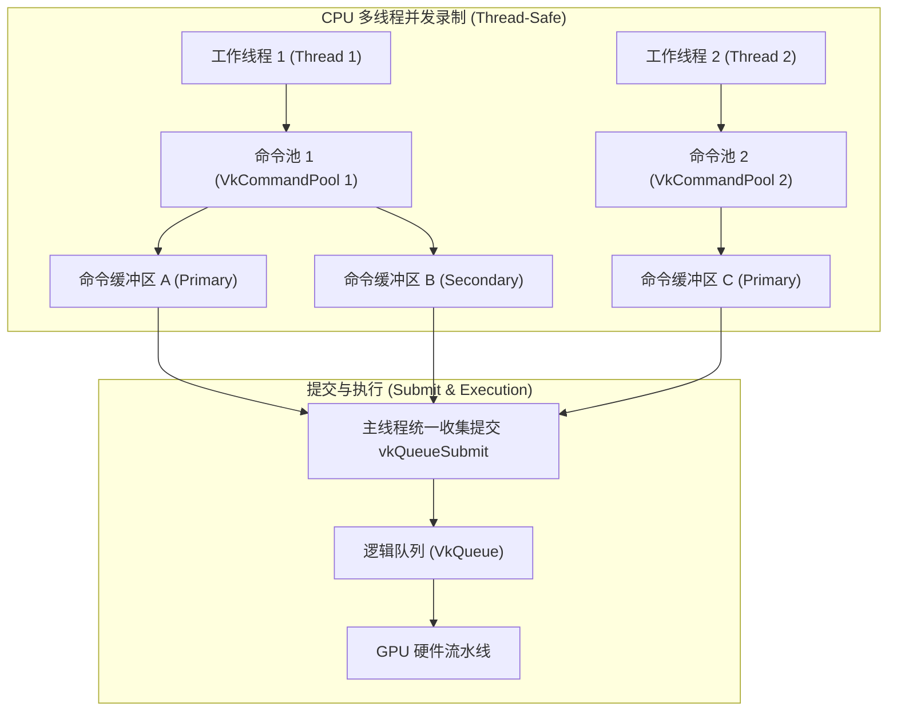
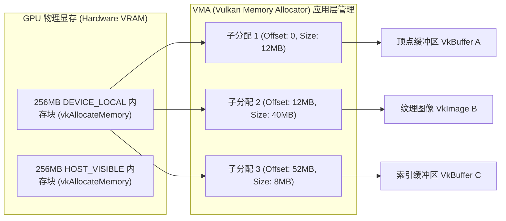
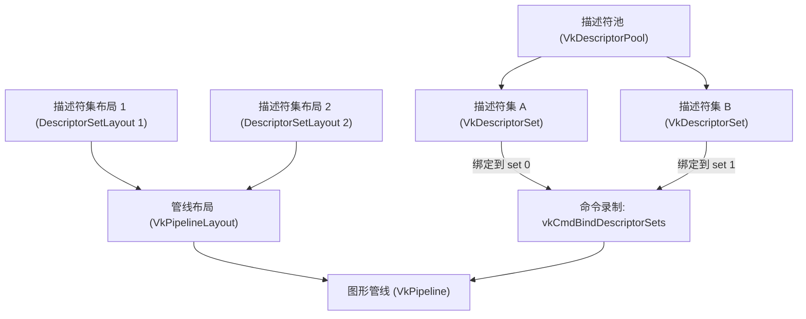
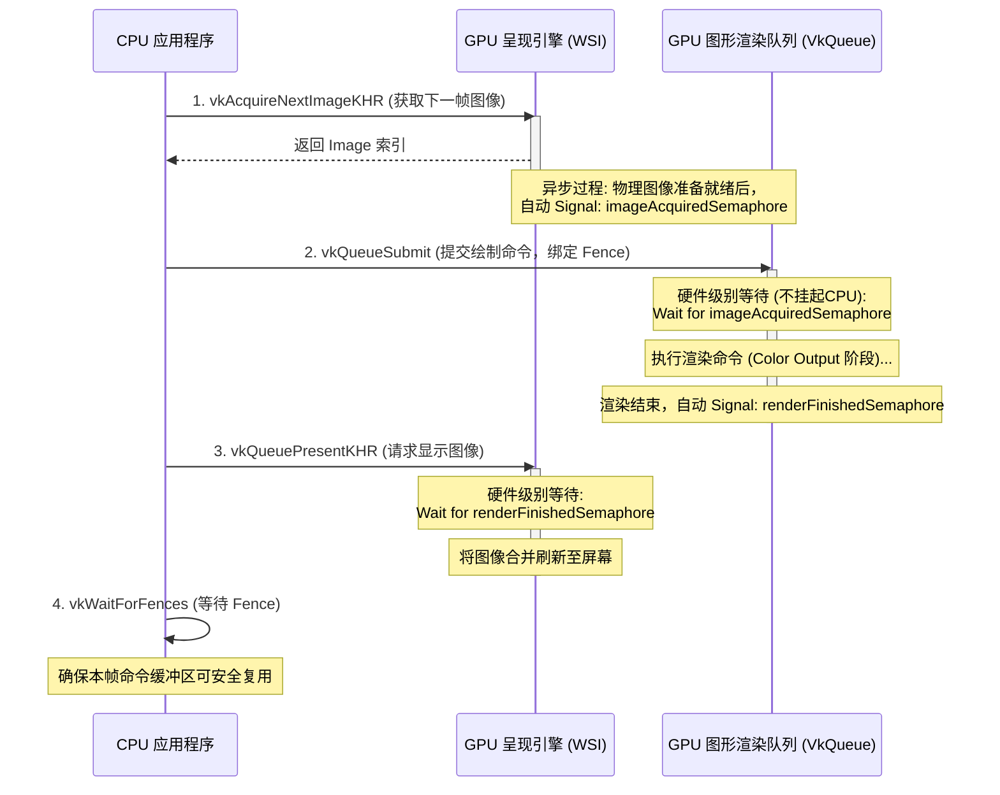
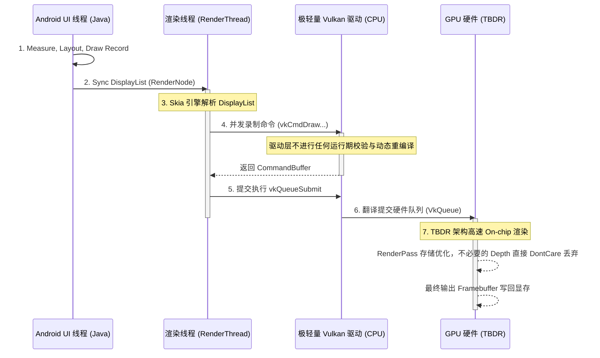

# Vulkan 核心图像机制与 Android 系统协同

在现代移动设备和桌面系统上，图形图像渲染需求的爆炸式增长与多核 CPU 架构的普及，对底层图形 API 提出了前所未有的高并发、低开销要求。在此背景下，由 Khronos Group 推出的 Vulkan 成为新一代显式图形 API（Explicit Graphics API）的工业级标准。

本篇文档将深入剖析 Vulkan 的核心设计哲学、其与 OpenGL ES 的架构代差、Vulkan 逻辑与物理架构组件、显式内存分配与资源装配机制、渲染通路与 WSI 交换链协同、极难的同步控制机制，并提供完整的 Native 级初始化示例，最后探讨 Android 平台对 Vulkan 的支持演进以及系统 UI 渲染引擎 HWUI 引入 Vulkan 后端的重构本质。

---

## 1. Vulkan 概述与显式图形 API 设计革命

### 1.1 什么是 Vulkan？
Vulkan 是一个跨平台的、低开销的、显式控制的现代三维图形与计算 API。与它的前身 OpenGL/OpenGL ES 相比，Vulkan 彻底改变了软件层（CPU 端驱动）与硬件层（GPU 端芯片）的交互模型。Vulkan 不再试图向开发者隐瞒硬件的真实运作方式，而是将显存分配、线程同步、管线状态控制以及命令录制的控制权完全交给了应用层开发者。

### 1.2 显式图形 API（Explicit Graphics API）的工业级标准
传统的图形 API（如 OpenGL）被称为“隐式”API。在隐式 API 中，驱动程序扮演着一个“全能管家”的角色。它在后台默默地做着内存管理、状态追踪、错误检查、多线程冲突处理以及着色器重编译。这种设计在单核 CPU 时代降低了开发门槛，但在多核 CPU 和现代 GPU 并行计算时代，它成为了最大的性能瓶颈。

Vulkan 作为“显式”API，其核心思想是**“所付即所得”（Pay for what you use）**。驱动程序被极度精简，几乎只做命令的直译与投递，将以下关键职责显式地交由开发者控制：
- **物理显存的划分与绑定**：什么时候申请显存、申请什么类型的显存、怎么把缓冲区与图像绑定到显存上，均由开发者决定。
- **渲染管线状态（PSO）的预编译**：不再允许在绘制时动态改变管线状态，必须在初始化阶段将所有的渲染状态（混合、深度、顶点格式等）一次性编译为不可变对象。
- **显式同步**：GPU 内部各个执行阶段（Stages）的先后顺序，以及 CPU 和 GPU 之间的数据搬运同步，全部需要通过 Barrier、Semaphore 和 Fence 进行显式声明。
- **并发命令录制**：支持在不同的 CPU 线程上并发录制渲染命令，彻底释放了多核 CPU 的并行性能。

### 1.3 现代 GPU 架构的演进背景与传统 API 的落后性
现代移动端 GPU（如 ARM Mali、Qualcomm Adreno、Imagination PowerVR）大多采用**贴图延迟渲染（TBDR, Tile-Based Deferred Rendering）**架构。TBDR 架构将屏幕划分为多个 Tile（通常是 16x16 或 32x32 像素），在 GPU 内部的 On-chip 高速缓存（Tile Buffer）中完成一个 Tile内所有几何体的光栅化与像素着色，最后一次性写回系统物理显存（System Memory）。这种架构能极大地减少对高功耗、低带宽的外部 DRAM 的读写次数，从而在移动端显著降低发热和耗电。

然而，OpenGL ES 诞生于传统的立即渲染（IMR, Immediate Mode Rendering）时代，它的设计逻辑假定每一次 Draw Call 都会立即写入全局帧缓冲区。这使得 OpenGL 驱动在 TBDR 架构上必须做大量的妥协与“猜测”（猜测应用是否还要读取当前缓冲区，猜测是否需要保留深度缓冲区），导致不必要的显存带宽浪费。Vulkan 通过引入 Render Pass（渲染通路）和 Subpass（子通道）等显式概念，能够完美契合 TBDR 架构的物理特征，使移动端 GPU 能够最大化地留在 On-chip 缓存中进行渲染。

---

## 2. OpenGL ES 与 Vulkan 架构代差深度对比

为了更直观地理解 Vulkan 的设计革命，本节将从驱动层开销、多线程支持、内存管理、同步控制以及状态管理五个核心维度，深度对比 OpenGL ES 与 Vulkan 的架构代差。

### 2.1 驱动层开销 (Driver Overhead)
- **OpenGL ES 的隐式状态追踪**：OpenGL 是一个巨大的全局状态机。每次调用 `glDrawElements` 时，驱动程序都必须在运行时进行繁重的状态一致性检查（例如，当前的着色器输入是否与当前绑定的 VBO 匹配，当前的混合模式是否合法等）。此外，如果开发者修改了某个状态，驱动需要层层传递并更新底层的寄存器配置，这导致了极高的 CPU 驱动开销。
- **Vulkan 的极轻量驱动与验证层**：Vulkan 驱动在运行时几乎不做任何错误检查与状态校验。它默认开发者传入的参数和状态完全正确，直接将 API 调用翻译为 GPU 硬件指令。所有的调试、错误拦截、API 规范检查都作为独立的“验证层（Validation Layers）”存在。在开发阶段，开发者可以开启验证层进行严格的排错；在发布（Release）版本中，直接关闭验证层，驱动层开销几近于零。

### 2.2 多线程支持 (Multi-threading Support)
- **OpenGL ES 的单线程上下文限制**：OpenGL 的所有操作都绑定在一个隐式的线程上下文（EGL Context）上。该上下文在同一时刻只能绑定到一个 CPU 线程。虽然可以通过多个 Context 共享资源，但由于 Context 内部庞大的状态机同步机制，跨线程的 Context 切换和资源同步开销极大，实际开发中极难实现真正的多线程并发渲染提交。这导致在复杂的 3D 渲染中，往往会出现“一核有难，多核围观”的 CPU 瓶颈。
- **Vulkan 的命令缓冲区多线程并发录制**：Vulkan 彻底解耦了“命令录制”与“命令提交”。开发者可以在 CPU 的 8 个核心上，创建 8 个不同的 `VkCommandBuffer` 录制器，每个线程独立且无锁地录制渲染命令。录制完成后，由主线程或专职提交线程收集这些 `VkCommandBuffer`，一次性提交给 `VkQueue` 执行。

### 2.3 内存分配与管理 (Memory Management)
- **OpenGL ES 的驱动隐式管理**：在 OpenGL 中，开发者调用 `glBufferData` 或 `glTexImage2D`，驱动程序会在底层自动决定何时在系统内存中开辟空间，何时将数据上传到 GPU 显存，以及何时因为显存不足进行垃圾回收（GC）或内存换入换出。开发者无法知道资源在显存中的物理组织方式，也无法精确控制内存的生命周期，容易导致瞬时的卡顿（Jank）。
- **Vulkan 的显式显存分配与生命周期控制**：在 Vulkan 中，创建 Buffer 或 Image 资源外壳后，它并没有任何物理存储空间。开发者必须：
  1. 调用 `vkGetBufferMemoryRequirements` 或 `vkGetImageMemoryRequirements` 查询该外壳所需的内存大小、对齐要求和内存类型掩码。
  2. 根据物理设备的内存属性（`VkPhysicalDeviceMemoryProperties`），筛选出符合要求的物理内存类型索引（如是否对 CPU 可见 `HOST_VISIBLE`，是否为 GPU 高速局部显存 `DEVICE_LOCAL`）。
  3. 显式调用 `vkAllocateMemory` 分配物理显存。
  4. 显式调用 `vkBindBufferMemory` 或 `vkBindImageMemory` 将资源外壳与物理显存绑定。
  5. 手动控制显存的销毁（`vkFreeMemory`），并负责规避显存碎片化。

### 2.4 同步控制 (Synchronization)
- **OpenGL ES 的隐式同步**：当开发者在 OpenGL 中先往一个 Buffer 写入数据，紧接着在下一个 Draw Call 中读取该 Buffer 时，驱动程序会在内部自动插入同步栅栏，挂起 GPU 的后续执行阶段，确保“先写后读”的依赖关系。这种隐式同步虽然省心，但由于驱动缺乏全局视角的上下文信息，为了保守安全，往往会引入过度同步，导致 GPU 流水线频繁空转（Bubble）。
- **Vulkan 的显式同步**：Vulkan 默认没有任何同步保护。如果开发者执行上述“写后读”操作而不加任何同步控制，GPU 将会发生数据冲突（Data Hazard），读取到垃圾数据或发生未定义行为。开发者必须显式使用 Pipeline Barrier（管线屏障）来指明：在哪个流水线阶段（Stage）写入完成之后，另一个流水线阶段才可以开始读取，并且必须显式刷新和使能相应的 GPU 缓存（Cache Invalidation / Flush）。

### 2.5 状态管理 (State Management)
- **OpenGL ES 的隐式重新编译**：OpenGL 允许随时更改单个状态，例如调用 `glBlendFunc` 修改混合模式。然而，对于现代 GPU 来说，混合模式的改变可能需要重新生成 GPU 端的机器指令（着色器微码）。这导致 OpenGL 驱动必须在运行时动态地对 Shader 进行重新编译，从而在游戏运行期间产生严重的卡顿（俗称 Shader Stuttering）。
- **Vulkan 的预编译不可变管线状态对象（PSO）**：Vulkan 引入了 `VkPipeline`。它将顶点输入状态、输入装配状态、着色器阶段、光栅化状态、多重采样状态、深度/模板测试状态、颜色混合状态等全部打包在一起。一旦创建，该 Pipeline 便是只读不可变的。如果想要改变混合模式，必须提前创建两个不同的 Pipeline 对象，在运行时直接切换 Pipeline 指针。这确保了驱动可以在初始化阶段完成所有着色器机器码的编译，绝不会在运行期发生动态编译卡顿。

### 2.6 架构对比汇总

| 维度 | OpenGL ES | Vulkan |
| :--- | :--- | :--- |
| **设计范式** | 隐式全局状态机，黑盒管理 | 显式声明，白盒控制，所付即所得 |
| **驱动开销** | 极高（运行时状态检查、隐式转换、频繁查错） | 极低（不查错，直接翻译命令，调试靠验证层） |
| **多线程支持** | 极差（单线程 Context 限制，锁开销大） | 极佳（支持 CPU 多线程并发无锁录制命令） |
| **内存分配** | 驱动隐式分配，生命周期由垃圾回收或驱动控制 | 显式查询、分配、绑定，支持精细化显存池管理 |
| **管线状态** | 运行时可任意修改，存在 Shader 动态重编译卡顿 | 预编译不可变管线（PSO），状态一次性确定 |
| **同步机制** | 驱动层隐式追踪与自动插入屏障，易导致流水线空转 | 开发者手动显式控制 Barrier/Semaphore/Fence |
| **跨平台性** | 碎片化严重（不同厂商驱动实现差异巨大） | 极度规范，行为一致（一致的 Vulkan Loader） |

---

## 3. Vulkan 核心基础组件与逻辑架构

Vulkan 的架构非常严密，初始化一个能够工作的 Vulkan 环境，需要层层组装多个基础物理与逻辑组件。

### 3.1 核心初始化组件

#### 1. VkInstance (实例)
`VkInstance` 是 Vulkan 应用程序的起点，它代表了 Vulkan 运行时的上下文。创建 Instance 的过程实际上是初始化 Vulkan 驱动库、启用特定的验证层（Validation Layers）以及加载全局扩展（Extensions，如窗口系统集成 WSI 扩展）的过程。

#### 2. VkPhysicalDevice (物理设备)
代表计算机中具体的硬件 GPU。通过 `VkInstance`，开发者可以枚举出系统中所有支持 Vulkan 的物理 GPU 设备（`VkPhysicalDevice`），并查询它们的硬件属性（如 GPU 厂商、型号、显存大小）、硬件限制（如最大纹理尺寸、最大分配次数）以及支持的队列族（Queue Families）。

#### 3. VkDevice (逻辑设备)
这是 Vulkan 中最核心的接口，代表与物理设备进行交互的逻辑通道。所有的渲染资源（Buffers, Images, Shaders, Pipelines）的创建，都是通过 `VkDevice` 来进行的。逻辑设备是物理设备的虚拟化表现，创建它时需要显式声明：
- 启用该物理设备上的哪些硬件队列（Queues）。
- 开启哪些高级硬件特性（如几何着色器、多视角渲染等）。
- 启用哪些设备级扩展（如 `VK_KHR_swapchain`）。

### 3.2 队列与队列族 (Queue & Queue Families)
在 Vulkan 中，所有需要 GPU 执行的任务（如渲染绘制、通用计算、内存拷贝）都必须打包成命令缓冲区提交给 GPU 的“队列（`VkQueue`）”。

物理 GPU 内部可能有多种不同功能的硬件执行通道，Vulkan 将这些通道抽象为**队列族（Queue Families）**。每个队列族包含一个或多个完全等价的队列：
- **Graphics Queue Family**：支持图形渲染指令（如绘制、清除、管线绑定）。
- **Compute Queue Family**：支持通用计算着色器（Compute Shader）的提交。
- **Transfer Queue Family**：支持专用的内存拷贝（CPU 到 GPU，显存内部拷贝），通常拥有 DMA（Direct Memory Access）硬件加速，比在图形队列里做拷贝更快。
- **Sparse Binding Queue Family**：用于管理稀疏资源的绑定。

开发者在创建逻辑设备时，必须查询并选择合适的队列族索引，从中提取出 `VkQueue` 对象，以便后续进行任务提交。

### 3.3 命令池与命令缓冲区 (Command Pools & Command Buffers)
GPU 是一个异步执行引擎。CPU 不应该每发出一条指令就让 GPU 执行一条，而应该将一系列的指令打包在一起，一次性提交给 GPU。这个打包的容器就是**命令缓冲区（`VkCommandBuffer`）**。

#### 1. 命令池 (VkCommandPool)
管理命令缓冲区内存分配的容器。由于频繁分配和释放命令缓冲区会导致内存碎片，Vulkan 要求所有 `VkCommandBuffer` 必须从 `VkCommandPool` 中分配。为了支持多线程，**每个 CPU 线程必须拥有自己独立的 `VkCommandPool`**，因为命令池的分配操作在 Vulkan 规范中是非线程安全的。

#### 2. CPU 多线程并发录制拓扑结构
为了充分释放多核 CPU 的性能，开发者通常会为每个工作线程分配一个 `VkCommandPool`，并并发地录制各自的 `VkCommandBuffer`。最后，主线程通过 `vkQueueSubmit` 将这些缓冲区统一提交给逻辑设备的特定队列。



#### 3. 命令缓冲区录制状态机
每个 `VkCommandBuffer` 在录制和提交的过程中，都严格遵循一个内部状态机转化：
1. **Initial（初始状态）**：刚刚创建或被 Reset 后的状态，此时不包含任何命令。
2. **Recording（录制中状态）**：调用 `vkBeginCommandBuffer` 后进入，此时可以使用 `vkCmdDraw`、`vkCmdBindPipeline` 等 API 写入命令。
3. **Executable（可执行状态）**：调用 `vkEndCommandBuffer` 后进入，表示命令已录制完毕，可以被提交。
4. **Pending（等待执行状态）**：调用 `vkQueueSubmit` 提交到 Queue 后进入，表示命令正在排队等待 GPU 执行。在 GPU 执行完毕之前，该缓冲区绝不能被重新录制或销毁。
5. **Invalid（失效状态）**：对于一次性（One-Time Submit）的缓冲区，提交后执行完毕即失效；或者当绑定的资源被销毁时也会失效。

---

## 4. 显式物理内存与资源装配机制

### 4.1 显式物理显存分配与管理

Vulkan 将物理内存管理完全暴露给开发者，这意味着开发者需要充当“操作系统内存管理器”的角色。

#### 1. 物理内存类型
在 Vulkan 中，GPU 能够访问的物理内存可能有多种类型，它们具有不同的属性标记（Memory Flags）：
- `DEVICE_LOCAL_BIT`：位于 GPU 显卡芯片近端的物理显存。延迟极低、带宽极大，但 CPU 无法直接读写。
- `HOST_VISIBLE_BIT`：对 CPU 可见的内存。CPU 可以直接映射其物理地址进行写入。
- `HOST_COHERENT_BIT`：CPU/GPU 缓存一致性内存。写入此内存的数据无需手动调用 `vkFlushMappedMemoryRanges` 刷新缓存，GPU 即可立即可见。
- `HOST_CACHED_BIT`：CPU 端带有缓存的内存，读取速度快。

#### 2. vkAllocateMemory 的高昂开销与 VMA 思想
在 Vulkan 规范中，**`vkAllocateMemory` 是一个极其高昂的系统调用**，它会涉及到用户态与内核态的切换、物理页表的重映射。许多 GPU 驱动限制了整个进程的最大分配次数（例如通常最大限制为 4096 次）。如果为每一个小小的 Buffer 或小纹理都单独调用一次 `vkAllocateMemory`，程序不仅会因为分配次数超限而崩溃，还会产生严重的内存碎片和性能骤降。

因此，工业界的标准做法是采用**显存池（Memory Allocator）**设计思想，即著名的 **VMA (Vulkan Memory Allocator)** 模式：
- 启动时或在运行期，向 GPU 申请几块尺寸巨大（例如 256MB）的 `DEVICE_LOCAL` 和 `HOST_VISIBLE` 内存块（Block）。
- 在应用层内部实现自定义的内存分配算法（如伙伴系统 Companion System、线性分配器 Linear Allocator 等）。
- 当需要创建资源时，直接在已分配的巨型内存块上划分出一块偏移量（Offset）和大小（Size），实现低开销的子分配（Suballocation）。



#### 3. 绑定物理显存
创建 Buffer 和 Image 资源外壳后，通过 `vkBindBufferMemory` 或 `vkBindImageMemory` 将其显式绑定到上述 VMA 划分出的具体内存块偏移位置：
```cpp
vkBindBufferMemory(device, buffer, memoryBlock, offset);
```

### 4.2 预编译不可变管线 (PSO - Pipeline State Object)

#### 1. 为什么 OpenGL 存在运行期“卡顿”（Shader Stuttering）？
在 OpenGL 中，渲染管线是由零散的状态 API 控制的（如 `glEnable(GL_DEPTH_TEST)`、`glBlendFunc(...)`），并且着色器是由 `glCompileShader` 和 `glLinkProgram` 在运行时动态链接的。

实际上，GPU 的着色器硬件（ALU 单元）在执行时，需要知道所有硬件状态的完整组合。例如，是否开启混合、深度测试的写入格式、顶点的排列步长等，都会直接影响 GPU 生成的最优机器指令。一旦你在运行时突然修改了 `glBlendFunc`，OpenGL 驱动会在你下一次调用 `glDraw` 时，**在后台隐式地把原本的 Shader 机器码丢弃，重新生成一份适配当前新混合状态的机器码**。这种后台隐式重新编译需要数毫秒乃至数十毫秒，直接导致游戏画面出现瞬间的卡顿。

#### 2. Vulkan 预编译 Pipeline 机制
Vulkan 强制要求开发者在初始化阶段，将所有涉及管线状态的要素全部打包封装成不可变的 `VkPipeline`（管线状态对象 PSO）：
- **Shader 阶段**：Vertex、Fragment 等 Shader 的 SPIR-V 中间表示字节码。
- **顶点输入状态**：顶点属性的对齐、间距、绑定描述。
- **输入装配状态**：图元拓扑类型（点、线、三角形）。
- **视口状态**：Viewport 与 Scissor 裁剪矩形。
- **光栅化状态**：剔除模式（Cull Front/Back）、线宽、填充模式。
- **多重采样（MSAA）状态**：采样数、遮罩。
- **深度/模板测试状态**：是否开启深度测试、深度比较函数、深度写入开关。
- **颜色混合状态**：Blend Factors（源混合因子、目的混合因子）、混合公式。

由于这套配置在创建时就已完全固定，驱动程序可以在后台利用多线程把它们一次性编译为 GPU 目标架构的二进制指令集。运行时切换管线只需要极其轻量地调用 `vkCmdBindPipeline(...)` 切换底层执行指针，完全杜绝了动态重编译。

#### 3. Pipeline Cache (管线缓存)
Vulkan 提供了 `VkPipelineCache` 机制。它可以收集并持久化管线编译后的二进制机器码。在游戏首次启动或加载关卡时，驱动把 Pipeline 编译出的二进制存入磁盘；下次启动时，直接读取该缓存并调用 `vkCreateGraphicsPipelines`，极大地缩短了游戏运行期和加载期的卡顿。

### 4.3 描述符集 (Descriptor Sets) 与管线布局
在着色器中，除了顶点数据外，我们还需要绑定诸如 Uniform Buffer（常量缓冲区）、Sampler（采样器）、Sampled Image（纹理贴图）等各种全局资源。在 Vulkan 中，这些资源不能直接与 Shader 绑定，必须通过一个称为**描述符集（Descriptor Set）**的机制。

#### 1. 概念架构层级
- **Descriptor（描述符）**：一个代表具体资源的指针或数据描述块（如“指向 Uniform 缓冲区的指针”、“指向纹理 A 的采样描述”）。
- **Descriptor Set Layout（描述符集布局）**：定义了 Shader 某个 `set` 里的布局格式。类似于 C 语言结构体的定义（声明 `binding 0` 是 Uniform，`binding 1` 是 Sampler）。
- **Pipeline Layout（管线布局）**：由一个或多个 `VkDescriptorSetLayout` 拼接组成，代表了整个管线所能访问的所有全局资源的总体结构大纲。
- **Descriptor Pool（描述符池）**：用于批量分配 `VkDescriptorSet` 的内存池。
- **Descriptor Set（描述符集）**：从描述符池中分配出来的具体实例，包含具体绑定的 Buffer 或 Image 的内存地址。



通过将资源描述符与管线解耦，GPU 可以在运行期只切换绑定的描述符集（例如切换不同的贴图），而无需修改管线状态。

---

## 5. 渲染通路、交换链与 Android WSI 协同

### 5.1 渲染通路 (Render Pass) 与子通道 (Subpass)
正如前文所述，移动端 GPU 的 TBDR 架构极其依赖内部的 On-chip 贴图高速缓存。为了最大化利用这一特性，Vulkan 显式引入了 `VkRenderPass` 和 `VkSubpass`。

#### 1. Render Pass 的作用
Render Pass 描述了一次渲染任务的整体结构，包括：
- 渲染使用了哪些 Attachment（如颜色附件 Color Attachment、深度/模板附件 Depth/Stencil Attachment、多重采样附件 Resolve Attachment）。
- 这些附件在渲染开始和结束时的**负载/存储操作（Load/Store Op）**：
  - `loadOp`：有 `VK_ATTACHMENT_LOAD_OP_CLEAR`（开始渲染前清空该缓冲区）、`VK_ATTACHMENT_LOAD_OP_LOAD`（保留并加载缓冲区已有内容，需要从外部显存读入 Tile Buffer，开销高）、`VK_ATTACHMENT_LOAD_OP_DONT_CARE`（不关心之前内容，直接覆盖，效率最高）。
  - `storeOp`：有 `VK_ATTACHMENT_LOAD_OP_STORE`（渲染完毕后，将 Tile Buffer 里的结果写回系统物理显存）、`VK_ATTACHMENT_LOAD_OP_DONT_CARE`（不写回，例如临时生成的 Depth Buffer 仅用于当前帧消隐，不需要最终呈现，直接丢弃，极大节省带宽）。

#### 2. Subpass (子通道) 与 On-chip 数据共享
一个 Render Pass 可以包含多个 `VkSubpass`。子通道之间可以通过**输入附件（Input Attachment）**实现数据传递。

例如，在延迟渲染（Deferred Shading）算法中：
- `Subpass 0`：将几何体的颜色、法线、深度等数据写入 G-Buffer。
- `Subpass 1`：读取 G-Buffer，进行光照计算并输出到最终的颜色缓冲区。

在传统的 OpenGL 中，G-Buffer 必须作为纹理显式地写回到物理显存，然后在下一帧或者下一个绘制批次中从显存重新读取。而在 Vulkan 的 Subpass 机制下，GPU 知道 Subpass 0 到 Subpass 1 在同一个 Render Pass 内。因此，驱动会将 G-Buffer 保持在 GPU 的 On-chip Tile Buffer 中，Subpass 1 直接在芯片内部读取 Subpass 0 写入的数据，**完全不经过外部显存的写与读**。这对移动端设备的能效比提升是革命性的。

### 5.2 交换链 (SwapChain) 的生命周期与 WSI
Vulkan 默认是一个平台无关的 API，它不知道什么是“窗口”、“屏幕”或“Android Activity”。为了将渲染结果显示在特定操作系统的物理屏幕上，必须使用**窗口系统集成（WSI, Window System Integration）**扩展。

#### 1. WSI 在 Android 平台的桥接
在 Android 平台中，UI 系统的核心是 `Surface`。而在 Native 层，对应的 C++ 结构体是 `ANativeWindow`。
桥接全链路流程如下：
1. 开发者在 Java 端获取 `Surface`，或在 NativeActivity 获得 `ANativeWindow`。
2. 启用 Vulkan 的实例扩展 `VK_KHR_surface` 和设备扩展 `VK_KHR_android_surface`。
3. 调用 `vkCreateAndroidSurfaceKHR` 传入 `ANativeWindow` 指针，创建平台通用的 `VkSurfaceKHR` 对象。
4. 激活设备级扩展 `VK_KHR_swapchain`。
5. 调用 `vkCreateSwapchainKHR` 创建交换链（Swapchain），它代表了一组由系统窗口排队系统管理的、可以循环交替渲染的物理图像（`VkImage`）队列。

#### 2. 呈现模式 (Presentation Mode) 对比
创建交换链时，开发者必须配置 Presentation Mode，这直接决定了屏幕刷新（VSYNC）、图像撕裂（Tearing）、延迟与功耗的权衡：
- **`VK_PRESENT_MODE_FIFO_KHR`**：标准先进先出队列。如果队列满了，GPU 的提交线程会被阻塞。这是 Android 平台最基本的模式，保证画面绝不撕裂，但当渲染时间不稳定时可能引发触控延迟。
- **`VK_PRESENT_MODE_MAILBOX_KHR`**：三缓冲（Triple Buffering）的高级形式。如果队列满了，新生成的帧会直接**替换**掉队列中待呈现的最新的那一帧。这既避免了画面撕裂，又保证了 CPU/GPU 永远不被阻塞，触控响应延迟极低，但功耗相对 FIFO 模式较高。
- **`VK_PRESENT_MODE_IMMEDIATE_KHR`**：立即呈现，不等待 VSYNC 信号。画面会产生明显的撕裂，移动设备上很少使用。

#### 3. 交换链重建机制 (Recreation)
在移动端，当屏幕发生旋转（Landscape/Portrait 切换）、应用失去焦点、或分屏尺寸变更时，底层的 `ANativeWindow` 物理尺寸和方向会发生改变。此时，继续向旧的交换链提交渲染会返回 `VK_ERROR_OUT_OF_DATE_KHR` 错误。

开发者必须监听到该异常，并执行**交换链重建**：
1. 调用 `vkDeviceWaitIdle` 确保当前 GPU 任务完全停下来。
2. 销毁旧交换链创建的所有 `VkImageView`、`VkFramebuffer`。
3. 基于最新的物理窗口参数（宽、高、变换状态），以 `oldSwapchain` 为模板重新调用 `vkCreateSwapchainKHR`。
4. 重新获取新的 `VkImage`，创建对应的 `VkImageView` 和 `VkFramebuffer`。
5. 销毁旧的 Swapchain 句柄，继续正常渲染。

---

## 6. Vulkan 极难同步机制解密

Vulkan 的同步机制是公认最难理解、最容易写出 Bug 的部分。因为驱动完全不提供隐式保护，开发者必须手动利用 Fences、Semaphores 和 Barriers 来协调 CPU-GPU 以及 GPU 内部流水线各阶段的执行顺序。

### 6.1 Fences (栅栏)：CPU-GPU 粗粒度同步
- **物理概念**：Fence 是一个控制 CPU 阻塞等待的同步原语。它有两个状态：**Signaled (已发出信号)** 和 **Unsignaled (未发出信号)**。
- **控制流程**：
  1. 开发者在调用 `vkQueueSubmit` 提交渲染任务时，可选地关联一个 Fence 句柄，此时 Fence 状态会被驱动重置为 Unsignaled。
  2. GPU 执行完该批次提交的所有命令后，硬件会自动将该 Fence 设置为 Signaled 状态。
  3. CPU 端在需要确保该批任务执行完的地方，调用 `vkWaitForFences(device, 1, &fence, VK_TRUE, timeout)`。如果 Fence 是 Unsignaled，CPU 线程将被挂起阻塞，直到 GPU 执行完毕；如果已是 Signaled，则立即返回。
  4. 重用该 Fence 前，必须显式调用 `vkResetFences` 将将其拉回 Unsignaled 状态。
- **典型场景**：控制命令缓冲区的循环复用。一帧渲染结束后，CPU 必须等待该帧关联 of Fence 被 Signaled，才能放心地对这一帧的命令缓冲区进行 `vkResetCommandBuffer` 并重新录制下一帧，否则会覆盖正在被 GPU 读取的指令。

### 6.2 Semaphores (信号量)：GPU-GPU 队列间同步
- **物理概念**：Semaphore 是用于 GPU 内部不同队列（如计算队列与渲染队列之间）或者交换链呈现引擎与渲染命令提交之间进行同步的轻量原语。**它的等待与发出信号过程完全在 GPU 硬件内部发生，不阻塞 CPU 线程。**
- **经典工作流 (Acquire-Render-Present 全链路)**：



- **Timeline Semaphore (时间线信号量)**：
  在 Vulkan 1.2 中引入的新原语。它不像 Binary Semaphore 只有 Signal/Unsignal 两种状态，而是包含一个单调递增的 64 位无符号整数。多个 GPU 队列或 CPU 可以通过指定具体的数值进行等待（如“等待信号量的值大于等于 5”），这使得跨多个异步计算队列的精细依赖控制变得极其灵活。

### 6.3 Barriers (管线屏障)：GPU 内部管道细粒度同步
GPU 是一个极度并行的执行流水线，内部包含许多独立的阶段（Pipeline Stages），如：
- `VK_PIPELINE_STAGE_TOP_OF_PIPE_BIT` (流水线最前端)
- `VK_PIPELINE_STAGE_VERTEX_SHADER_BIT` (顶点着色器)
- `VK_PIPELINE_STAGE_FRAGMENT_SHADER_BIT` (片元着色器)
- `VK_PIPELINE_STAGE_COLOR_ATTACHMENT_OUTPUT_BIT` (颜色附件输出)
- `VK_PIPELINE_STAGE_BOTTOM_OF_PIPE_BIT` (流水线最末端)

为了保证前一个渲染步骤的输出能正确作为后一个渲染步骤的输入，开发者必须在 `VkCommandBuffer` 录制中插入**管线屏障（Pipeline Barrier）**。

#### 1. 屏障的核心参数结构 `VkImageMemoryBarrier`
管线屏障能够同时控制以下三个层面的同步：

```cpp
typedef struct VkImageMemoryBarrier {
    VkStructureType            sType;
    const void*                pNext;
    VkAccessFlags              srcAccessMask;      // 1. 缓存一致性：等待刷新的缓存写入
    VkAccessFlags              dstAccessMask;      // 1. 缓存一致性：需要使能的缓存读取
    VkImageLayout              oldLayout;          // 2. 图像布局转移：源内存布局格式
    VkImageLayout              newLayout;          // 2. 图像布局转移：目标内存布局格式
    uint32_t                   srcQueueFamilyIndex;// 3. 队列所有权转移
    uint32_t                   dstQueueFamilyIndex;// 3. 队列所有权转移
    VkImage                    image;
    VkImageSubresourceRange    subresourceRange;
} VkImageMemoryBarrier;
```

#### 2. 屏障控制的三大维度
1. **执行依赖 (Execution Dependency)**：
   通过 `vkCmdPipelineBarrier` 的 `srcStageMask` 和 `dstStageMask` 指定。它强制规定：所有在 `srcStageMask` 阶段之前启动的命令，必须完全执行完毕，才能开始执行在 `dstStageMask` 阶段之后的命令。
2. **内存可见性与缓存一致性 (Memory Visibility & Cache Coherency)**：
   现代 GPU 拥有 L1/L2 缓存。如果 `Stage A` 在 L2 写入了数据，而没有刷新（Flush）到全局显存，那么紧接着执行的 `Stage B` 从 L1 读取时，可能会读取到旧的脏数据（即数据冲突 RAW, WAR, WAW）。
   - `srcAccessMask`（如 `VK_ACCESS_COLOR_ATTACHMENT_WRITE_BIT`）：通知 GPU 必须将缓存中的写入数据 Flush 到公共显存。
   - `dstAccessMask`（如 `VK_ACCESS_SHADER_READ_BIT`）：通知 GPU 将读取端的 L1/L2 缓存设置为无效（Invalidate），强制从物理显存重新拉取最新数据。
3. **图像布局转移 (ImageLayout Transition)**：
   GPU 内部为了提升着色采样效率，会将图像存储为高度压缩和专用的内部瓦片布局（如 `VK_IMAGE_LAYOUT_COLOR_ATTACHMENT_OPTIMAL`）。但如果该图像要作为纹理传给下一个 Shader 读取，它必须被转换为只读通用布局（`VK_IMAGE_LAYOUT_SHADER_READ_ONLY_OPTIMAL`）。
   当屏障被触发时，GPU 硬件会自动调用专用的解压和布局转换单元在显存内部完成格式转换。

---

## 7. Vulkan Native 完整初始化与交换链绑定示例

本节提供一份用 C++ 编写的经典 Vulkan 初始化及 Android 交换链绑定 Native 伪代码。代码中包含了 Instance、设备、Surface 以及 Swapchain 的完整核心配置步骤。

```cpp
#include <vulkan/vulkan.h>
#include <vulkan/vulkan_android.h>
#include <vector>
#include <iostream>

// 核心 Vulkan 句柄结构体封装
struct VulkanContext {
    VkInstance instance = VK_NULL_HANDLE;
    VkPhysicalDevice physicalDevice = VK_NULL_HANDLE;
    VkDevice device = VK_NULL_HANDLE;
    uint32_t graphicsQueueFamilyIndex = 0;
    VkQueue graphicsQueue = VK_NULL_HANDLE;
    VkSurfaceKHR surface = VK_NULL_HANDLE;
    VkSwapchainKHR swapchain = VK_NULL_HANDLE;
    std::vector<VkImage> swapchainImages;
    std::vector<VkImageView> swapchainImageViews;
    VkFormat swapchainFormat = VK_FORMAT_UNDEFINED;
    VkExtent2D swapchainExtent = {0, 0};
};

// 1. 初始化 VkInstance
VkResult initInstance(VulkanContext& ctx) {
    // 应用程序信息声明
    VkApplicationInfo appInfo{};
    appInfo.sType = VK_STRUCTURE_TYPE_APPLICATION_INFO;
    appInfo.pApplicationName = "Android Vulkan Renderer";
    appInfo.applicationVersion = VK_MAKE_VERSION(1, 0, 0);
    appInfo.pEngineName = "Custom Engine";
    appInfo.engineVersion = VK_MAKE_VERSION(1, 0, 0);
    appInfo.apiVersion = VK_API_VERSION_1_1; // 使用 Vulkan 1.1

    // 启用 Android WSI 表面所必需的全局扩展
    std::vector<const char*> extensions = {
        VK_KHR_SURFACE_EXTENSION_NAME,
        VK_KHR_ANDROID_SURFACE_EXTENSION_NAME
    };

    // 启用调试验证层（开发环境下强烈建议开启）
    std::vector<const char*> validationLayers = {
        "VK_LAYER_KHRONOS_validation"
    };

    VkInstanceCreateInfo createInfo{};
    createInfo.sType = VK_STRUCTURE_TYPE_INSTANCE_CREATE_INFO;
    createInfo.pApplicationInfo = &appInfo;
    createInfo.enabledExtensionCount = static_cast<uint32_t>(extensions.size());
    createInfo.ppEnabledExtensionNames = extensions.data();
#ifdef DEBUG
    createInfo.enabledLayerCount = static_cast<uint32_t>(validationLayers.size());
    createInfo.ppEnabledLayerNames = validationLayers.data();
#else
    createInfo.enabledLayerCount = 0;
#endif

    return vkCreateInstance(&createInfo, nullptr, &ctx.instance);
}

// 2. 选择物理设备并查找队列族
VkResult selectPhysicalDevice(VulkanContext& ctx) {
    uint32_t deviceCount = 0;
    vkEnumeratePhysicalDevices(ctx.instance, &deviceCount, nullptr);
    if (deviceCount == 0) return VK_ERROR_INITIALIZATION_FAILED;

    std::vector<VkPhysicalDevice> devices(deviceCount);
    vkEnumeratePhysicalDevices(ctx.instance, &deviceCount, devices.data());

    // 简单策略：选择第一个支持图形渲染队列的物理设备
    for (const auto& device : devices) {
        uint32_t queueFamilyCount = 0;
        vkGetPhysicalDeviceQueueFamilyProperties(device, &queueFamilyCount, nullptr);
        std::vector<VkQueueFamilyProperties> queueFamilies(queueFamilyCount);
        vkGetPhysicalDeviceQueueFamilyProperties(device, &queueFamilyCount, queueFamilies.data());

        for (uint32_t i = 0; i < queueFamilyCount; i++) {
            // 检查该队列族是否支持 Graphics 通道
            if (queueFamilies[i].queueFlags & VK_QUEUE_GRAPHICS_BIT) {
                ctx.physicalDevice = device;
                ctx.graphicsQueueFamilyIndex = i;
                return VK_SUCCESS;
            }
        }
    }
    return VK_ERROR_INITIALIZATION_FAILED;
}

// 3. 创建逻辑设备并获取图形队列
VkResult createLogicalDevice(VulkanContext& ctx) {
    float queuePriority = 1.0f; // 队列优先级 0.0 ~ 1.0

    VkDeviceQueueCreateInfo queueCreateInfo{};
    queueCreateInfo.sType = VK_STRUCTURE_TYPE_DEVICE_QUEUE_CREATE_INFO;
    queueCreateInfo.queueFamilyIndex = ctx.graphicsQueueFamilyIndex;
    queueCreateInfo.queueCount = 1;
    queueCreateInfo.pQueuePriorities = &queuePriority;

    // 启用设备级 Swapchain 扩展（Android WSI 所必需）
    std::vector<const char*> deviceExtensions = {
        VK_KHR_SWAPCHAIN_EXTENSION_NAME
    };

    VkPhysicalDeviceFeatures deviceFeatures{}; // 开启需要的特性，如各向异性过滤
    deviceFeatures.samplerAnisotropy = VK_TRUE;

    VkDeviceCreateInfo createInfo{};
    createInfo.sType = VK_STRUCTURE_TYPE_DEVICE_CREATE_INFO;
    createInfo.queueCreateInfoCount = 1;
    createInfo.pQueueCreateInfos = &queueCreateInfo;
    createInfo.enabledExtensionCount = static_cast<uint32_t>(deviceExtensions.size());
    createInfo.ppEnabledExtensionNames = deviceExtensions.data();
    createInfo.pEnabledFeatures = &deviceFeatures;

    VkResult result = vkCreateDevice(ctx.physicalDevice, &createInfo, nullptr, &ctx.device);
    if (result == VK_SUCCESS) {
        // 从逻辑设备中提取 Queue 句柄
        vkGetDeviceQueue(ctx.device, ctx.graphicsQueueFamilyIndex, 0, &ctx.graphicsQueue);
    }
    return result;
}

// 4. 将 Android ANativeWindow 桥接创建为 VkSurfaceKHR
VkResult createAndroidSurface(VulkanContext& ctx, ANativeWindow* window) {
    VkAndroidSurfaceCreateInfoKHR createInfo{};
    createInfo.sType = VK_STRUCTURE_TYPE_ANDROID_SURFACE_CREATE_INFO_KHR;
    createInfo.pNext = nullptr;
    createInfo.flags = 0;
    createInfo.window = window; // Android 本地窗口指针

    return vkCreateAndroidSurfaceKHR(ctx.instance, &createInfo, nullptr, &ctx.surface);
}

// 5. 创建交换链并提取缓冲图像
VkResult createSwapchain(VulkanContext& ctx) {
    // A. 查询 Surface 兼容性参数
    VkSurfaceCapabilitiesKHR capabilities;
    vkGetPhysicalDeviceSurfaceCapabilitiesKHR(ctx.physicalDevice, ctx.surface, &capabilities);

    // 确定交换链分辨率（通常匹配窗口物理像素）
    ctx.swapchainExtent = capabilities.currentExtent;
    ctx.swapchainFormat = VK_FORMAT_R8G8B8A8_UNORM; // 使用标准无符号归一化 RGBA 格式

    // 缓冲帧数设置，推荐三缓冲以规避掉帧
    uint32_t imageCount = capabilities.minImageCount + 1;
    if (capabilities.maxImageCount > 0 && imageCount > capabilities.maxImageCount) {
        imageCount = capabilities.maxImageCount;
    }

    VkSwapchainCreateInfoKHR createInfo{};
    createInfo.sType = VK_STRUCTURE_TYPE_SWAPCHAIN_CREATE_INFO_KHR;
    createInfo.surface = ctx.surface;
    createInfo.minImageCount = imageCount;
    createInfo.imageFormat = ctx.swapchainFormat;
    createInfo.imageColorSpace = VK_COLOR_SPACE_SRGB_NONLINEAR_KHR;
    createInfo.imageExtent = ctx.swapchainExtent;
    createInfo.imageArrayLayers = 1;
    createInfo.imageUsage = VK_IMAGE_USAGE_COLOR_ATTACHMENT_BIT; // 用于颜色附件渲染写入

    // 如果图形队列与呈现队列是同一个（移动端通常如此）
    createInfo.imageSharingMode = VK_SHARING_MODE_EXCLUSIVE; 

    // 配置变换，例如不进行额外旋转
    createInfo.preTransform = capabilities.currentTransform;
    createInfo.compositeAlpha = VK_COMPOSITE_ALPHA_INHERIT_BIT_KHR;
    
    // 设置呈现模式为 FIFO (垂直同步)
    createInfo.presentMode = VK_PRESENT_MODE_FIFO_KHR;
    createInfo.clipped = VK_TRUE;
    createInfo.oldSwapchain = VK_NULL_HANDLE;

    VkResult result = vkCreateSwapchainKHR(ctx.device, &createInfo, nullptr, &ctx.swapchain);
    if (result != VK_SUCCESS) return result;

    // B. 获取交换链中的 VkImage 句柄
    uint32_t actualImageCount = 0;
    vkGetSwapchainImagesKHR(ctx.device, ctx.swapchain, &actualImageCount, nullptr);
    ctx.swapchainImages.resize(actualImageCount);
    vkGetSwapchainImagesKHR(ctx.device, ctx.swapchain, &actualImageCount, ctx.swapchainImages.data());

    // C. 为每个图像创建只读的 ImageView 包装
    ctx.swapchainImageViews.resize(actualImageCount);
    for (size_t i = 0; i < actualImageCount; i++) {
        VkImageViewCreateInfo viewInfo{};
        viewInfo.sType = VK_STRUCTURE_TYPE_IMAGE_VIEW_CREATE_INFO;
        viewInfo.image = ctx.swapchainImages[i];
        viewInfo.viewType = VK_IMAGE_VIEW_TYPE_2D;
        viewInfo.format = ctx.swapchainFormat;
        viewInfo.components.r = VK_COMPONENT_SWIZZLE_IDENTITY;
        viewInfo.components.g = VK_COMPONENT_SWIZZLE_IDENTITY;
        viewInfo.components.b = VK_COMPONENT_SWIZZLE_IDENTITY;
        viewInfo.components.a = VK_COMPONENT_SWIZZLE_IDENTITY;
        viewInfo.subresourceRange.aspectMask = VK_IMAGE_ASPECT_COLOR_BIT;
        viewInfo.subresourceRange.baseMipLevel = 0;
        viewInfo.subresourceRange.levelCount = 1;
        viewInfo.subresourceRange.baseArrayLayer = 0;
        viewInfo.subresourceRange.layerCount = 1;

        result = vkCreateImageView(ctx.device, &viewInfo, nullptr, &ctx.swapchainImageViews[i]);
        if (result != VK_SUCCESS) return result;
    }

    return VK_SUCCESS;
}

// 6. 销毁及清理函数
void cleanupVulkan(VulkanContext& ctx) {
    if (ctx.device != VK_NULL_HANDLE) {
        for (auto imageView : ctx.swapchainImageViews) {
            vkDestroyImageView(ctx.device, imageView, nullptr);
        }
        if (ctx.swapchain != VK_NULL_HANDLE) {
            vkDestroySwapchainKHR(ctx.device, ctx.swapchain, nullptr);
        }
        vkDestroyDevice(ctx.device, nullptr);
    }
    if (ctx.instance != VK_NULL_HANDLE) {
        if (ctx.surface != VK_NULL_HANDLE) {
            vkDestroySurfaceKHR(ctx.instance, ctx.surface, nullptr);
        }
        vkDestroyInstance(ctx.instance, nullptr);
    }
}
```

### 7.1 初始化调用链核心原理解析
1. **`vkCreateInstance`**：此函数通过结构体 `VkInstanceCreateInfo` 接收全局参数。它的核心作用是将底层的 Vulkan 动态链接库加载进当前应用进程空间，并绑定调试用验证层。在 Android NDK 开发中，`VK_LAYER_KHRONOS_validation` 层需要显式打包进 APK，否则会创建失败。
2. **`vkGetPhysicalDeviceQueueFamilyProperties`**：该函数由物理设备句柄触发，能列出硬件 GPU 内部的所有微内核分组。在 Android 等移动端，GPU 通常只有一个大核心，因此一般会返回一个通用的队列族（Graphics 队列族），该队列族既支持图形渲染（`VK_QUEUE_GRAPHICS_BIT`），又支持计算任务和内存传输。
3. **`vkCreateDevice`**：该 API 会创建用于控制硬件的物理连接句柄。要注意，**逻辑设备与物理设备是一对一的**，一旦逻辑设备建立，CPU 就可以从其内部加载 GPU 所有的函数指针。
4. **`vkCreateAndroidSurfaceKHR`**：这里是 Android WSI 的核心。它接收一个 `ANativeWindow*`。在 Android 平台中，这个 Window 指针通常由 Java 层的 `SurfaceView` 或 `TextureView` 经过 NDK 层转换而来。它会在内部告诉 SurfaceFlinger（Android 系统的窗口合成器），Vulkan 渲染出的图像接下来应当投递到该特定的缓冲区队列中。
5. **`vkCreateSwapchainKHR`**：这个复杂的 API 会向 Android 系统的 Window Manager 申请一组环形缓冲区（`VkImage`）。当调用 `vkCreateImageView` 后，这些图像就可以作为 Render Pass 的 `Color Attachment` 绑定到 Framebuffer 上，供片元着色器（Fragment Shader）最终输出写入。

---

## 8. Android 平台演进及 HWUI 支持

随着 Vulkan 的性能优势日益凸显，Android 操作系统在图形渲染后端的演进上做出了巨大的架构重构。

### 8.1 Android 平台 Vulkan 演进历史
Android 系统对 Vulkan 的支持是一个循序渐进的过程，具体变更时间线请参阅根目录的 [AndroidVersionChangeLog.md](../../../../../../AndroidVersionChangeLog.md)：

- **Android 7.0 (API 24)**：首次引入了对 Vulkan 1.0 的官方支持。开发者可以通过 Android NDK (API 24+) 直接加载 `<vulkan/vulkan.h>`。然而，此时支持主要局限于高性能旗舰设备，中低端设备的驱动非常不完善。
- **Android 9.0 (API 28)**：系统级集成了对 Vulkan 1.1 的支持。
- **Android 10.0 (API 29)**：这是一个里程碑式的版本。Android 10 强制要求所有 64 位的 Android 设备必须完全支持 Vulkan 1.1。同时，Android 官方开始尝试使用 Vulkan 后端来加速系统 UI 渲染。
- **Android 12+**：HWUI 的 Vulkan 后端在绝大多数主流机型上被默认开启，取代了统治 Android 多年的 OpenGL ES 后端。

### 8.2 HWUI 渲染引擎从 OpenGL ES 到 Vulkan 渲染后端的重构演进
HWUI（Hardware UI）是 Android 系统负责解析 XML 布局、Canvas 绘制并将其渲染到屏幕上的核心引擎。

#### 1. 传统的 OpenGL ES 渲染后端架构缺陷
在 Android 9 及以前，HWUI 的底层主要基于 Skia 图形库的 OpenGL 后端（Skia GL）。
当用户在主线程（UI Thread）操作 UI 时，其渲染逻辑如下：
1. UI 线程遍历 View 树，将绘制操作记录（Record）为 `DisplayList`（本质是一组绘制指令的树状图）。
2. UI 线程将 `DisplayList` 通过同步机制（Sync）传递给专门的渲染线程 **`RenderThread`**。
3. `RenderThread` 将这些 `DisplayList` 翻译成一系列 OpenGL ES API 调用（例如 `glDrawElements`）。
4. **性能瓶颈**：由于 OpenGL 驱动有庞大的状态机验证、动态重编译 Shader 的开销，再加上 OpenGL 上下文单线程限制，`RenderThread` 经常因为驱动层的 CPU 消耗而超时（无法在 16.6ms 或 11.1ms 内完成渲染提交），从而导致系统主线程同步挂起，引发 UI 掉帧、卡顿。

#### 2. 现代 Vulkan 渲染后端架构重构 (Skia Vulkan)
在 Android 10+ 引入 Vulkan 后端后，HWUI 引擎架构重构为 Skia VK：



### 8.3 HWUI Vulkan 渲染后端如何从根本上优化掉帧与卡顿
1. **驱动 CPU 占用大幅下降**：
   由于 Vulkan 驱动不做运行期校验与隐式编译，HWUI 的 `RenderThread` 在翻译 `DisplayList` 时的 CPU 开销显著下降（通常能减少 15%~30% 的 CPU 耗时）。这为复杂页面的渲染争取到了宝贵的 CPU 时间，使得帧率更加平稳。
2. **消除了运行期 Shader 编译卡顿**：
   HWUI 的所有 UI 控件绘制（如圆角裁剪、阴影计算、渐变填充）所对应的着色器和渲染状态，在系统启动和 HWUI 初始化时，就已经全部编译为了不可变的 `VkPipeline` 状态对象并存入缓存中。应用在运行期间绝对不会因为初次显示某个特效而触发 OpenGL 驱动的 Shader 重编译，彻底解决了“首次滑动卡顿”的顽疾。
3. **更高效的 VSYNC 同步与资源复用**：
   在 Vulkan 后端下，HWUI 能够利用 Fences 和 Semaphores 极其精准地追踪每一帧图像的渲染状态。`RenderThread` 能够准确知道 GPU 什么时候完成了前一帧的绘制，从而立即复用命令缓冲区，避免了传统 OpenGL 在后台因为隐式同步而导致的 CPU 闲置和 GPU 饥饿，使得三缓冲（Triple Buffering）能够发挥到极致，UI 动画的过渡和滑动阻尼感显得更加平滑与丝滑。

---

## 9. 总结与最佳实践建议

Vulkan 并不是一个“让 GPU 运行更快”的魔法，而是一个**“释放 CPU 潜力，让开发者能够极致压榨 GPU”**的利器。

在 Android NDK 的 Vulkan 实践中，开发者应当遵循以下准则以避免常见的设计灾难：
- **永远使用 VMA（Vulkan Memory Allocator）**：绝不要为每一个小资源单独调用 `vkAllocateMemory`。使用大内存块的管理思想，能最大程度降低显存分配开销。
- **合理规划管线屏障（Pipeline Barrier）的粒度**：尽量将多个 Barrier 合并为一个 `vkCmdPipelineBarrier` 提交。如果 Barrier 设置得太粗糙，会使 GPU 降级为立即模式（IMR）的同步等待；如果设置得太精细，可能会引发难以调试的数据冲突。
- **开发阶段保持 Validation Layer 开启**：由于 Vulkan 驱动在运行时保持沉默，没有验证层的保护，任何小小的同步或内存越界错误都会直接导致 GPU 挂起（Device Lost）或进程崩溃（Segmentation Fault）。
- **做好交换链（Swapchain）重建保护**：Android 设备的物理屏幕极易发生旋转和尺寸改变，正确且无缝地重建交换链是保证 NDK 游戏和图形应用稳定运行的前提。
