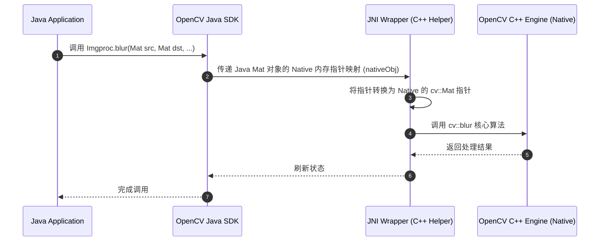
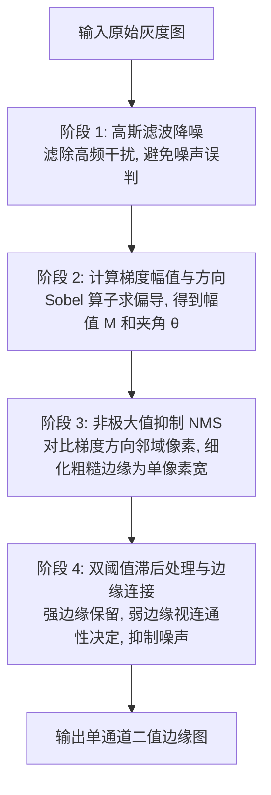

# 5.2.6.3.3 OpenCV 在 Android 平台的高性能实践

在移动端计算机视觉与高性能图像处理领域，OpenCV（Open Source Computer Vision Library）是无可争议的工业级标准基石。随着移动设备硬件的迭代，人脸识别、车牌检测、AR 实时辅助、文档扫描等复杂的计算机视觉（CV）场景已经广泛落地于 Android 客户端。然而，移动端面临着严格的**算力、功耗和内存瓶颈**。在 Android 平台上，如何将 OpenCV 算法与系统底层的图形图像管道深度集成，并实现高吞吐、低延迟的实时处理，是 NDK 开发中的核心技术命题。

本篇文档将深入剖析 Android 平台 OpenCV 的开发集成选型，拆解核心图像处理算法与底层的物理数学原理，详解 JNI 零拷贝技术与 Android 图像介质的桥接实战，并给出针对 ARM 架构的 NEON 指令集与 OpenMP 多核并发的性能极限调优指南。

---

## 1. OpenCV 概述与移动端计算机视觉的架构背景

### 1.1 什么是 OpenCV 及其在移动端的演进
OpenCV 是一个开源的跨平台计算机视觉与机器学习软件库，最初由 Intel 实验室在 1999 年发起，旨在推动计算密集型视觉应用的普及。OpenCV 底层由高度优化的 C/C++ 编写，天然具备极高的执行效率。它涵盖了图像处理、视频分析、特征检测与匹配、三维重建、机器学习以及深度学习推理（DNN 模块）等全栈 CV 能力。

在移动互联网兴起后，OpenCV 推出了专门的 Android SDK。Android 端的计算机视觉任务与桌面端有本质的不同：
*   **计算资源受限**：移动端 CPU/GPU 算力相比桌面显卡极为有限，且受限于电池容量与散热。
*   **输入源高频且连续**：视觉应用通常需要对相机输出的视频流（通常为 30fps 以上的 1080P 或 4K 帧）进行实时处理，这意味着每一帧的处理耗时必须控制在 **33ms** 以内，否则就会造成视觉卡顿和掉帧。
*   **内存抖动敏感**：在 Java 层频繁创建和销毁大块图像内存会触发系统的垃圾回收（GC），造成不可预测的应用程序停顿（Stop-the-World），这在实时相机预览中是致命的。

因此，在 Android 上集成 OpenCV，核心目标就是在榨干底层硬件性能的同时，将数据拷贝开销和 JNI 交互成本降到最低。

---

## 2. Android 平台 OpenCV 开发集成选型

在 Android 平台上集成 OpenCV 时，开发者面临两种主要的架构选型：使用 **OpenCV Java API** 还是直接使用 **Native C++ API**。这两者在底层机制、性能表现以及开发复杂度上存在巨大的差异。

### 2.1 OpenCV Java SDK 架构与执行缺陷
OpenCV Java SDK 提供了一套完整的 Java 语言包装器（Wrapper），其工作原理基于 Java Native Interface (JNI)。当我们在 Java 层调用 `org.opencv.imgproc.Imgproc.blur(...)` 时，其底层的执行逻辑如下：



#### OpenCV Java SDK 的核心痛点：
1.  **动态链接与 OpenCV Manager 依赖（历史包袱）**：
    在早期官方推荐方案中，Java SDK 鼓励使用动态初始化。这要求终端用户的手机必须安装一个独立的 APK —— **OpenCV Manager**，用以在系统内共享 OpenCV 的 `.so` 库。这种反人类的用户体验在实际商用产品中完全不可接受。即便改为静态加载（即在 App 内置 `.so`），Java SDK 依然存在不可调和的性能缺陷。
2.  **极高频的 JNI 边界开销**：
    实时图像处理（如视频帧分析）通常包含数十个步骤（如置灰、高斯平滑、二值化、轮廓检测、形态学操作等）。如果全部在 Java 层调用，每一帧图像的每一个处理算子都要跨越一次 JNI 边界。JNI 调用涉及线程上下文环境的转换、引用类型表的查找以及局部引用的管理，高频的 JNI 调用本身就会消耗大量的 CPU 周期。
3.  **内存垃圾抖动与析构延迟**：
    在 Java 中，`org.opencv.core.Mat` 是对 Native 层 `cv::Mat` 的一层浅包装，内部仅保留一个指向 Native 内存首地址的 `long nativeObj` 指针。虽然 Java Mat 实现了 `finalize()` 以在垃圾回收时释放 Native 内存，但 JVM 的 GC 触发时机具有滞后性。当高频创建临时 Mat 时，Java 对象的堆内存占用可能极小，因而无法触发 GC，但底层的 Native 物理内存却已经爆满，极易导致 `OOM (Out Of Memory)` 崩溃。开发者必须手动调用 `mat.release()` 释放 Native 内存，代码编写繁琐且容错率极低。

### 2.2 Native C++ SDK 架构与核心优势
Native C++ 方案是将所有的图像处理逻辑完全下沉到 C++ 层。我们在 Java 层仅仅负责将原始图像数据源的物理内存指针或者原始数据缓冲区（如 Bitmap、纹理 ID 或 Camera 原始帧数据）一次性传递给 Native 层，然后整个图像处理的流水线（Pipeline）完全在 Native 内部通过 C++ 编写的算法链条跑完，最后只把检测结果（如人脸坐标矩形、识别到的字符）或者处理完毕的画面直接回写入物理缓冲区。

#### Native C++ 方案的核心优势：
1.  **零 JNI 边界损耗**：对于一帧图像，从头到尾的十几步 CV 算法操作都在 C++ 内部的 Native 内存中连续执行，仅在进入和退出算法管道时有两次 JNI 交互，彻底消除 JNI 边界损耗。
2.  **绝对掌控的内存生命周期**：C++ 遵循 RAII（Resource Acquisition Is Initialization）原则，通过 `cv::Mat` 的智能指针引用计数机制管理内存。当局部 `cv::Mat` 变量超出作用域时，其 Native 内存会立即被释放，绝不拖泥带水，从而彻底规避 GC 抖动和内存泄露带来的不确定性。
3.  **完美的第三方库协同**：在 Native 层，可以极方便地将 OpenCV 与其他高性能 C++ 库（如 ncnn、MNN、Tengine 等深度学习推理引擎，或者自定义的 C++ 算法逻辑）进行零开销数据交换，避免了在 Java 和 Native 之间多次来回搬运数据的噩梦。

### 2.3 选型维度深度对比表

| 对比维度 | OpenCV Java API | Native C++ API (CMake 链接) |
| :--- | :--- | :--- |
| **性能损耗** | 高（频繁的 JNI 边界跳转） | 极低（仅在流水线首尾发生 JNI 交互） |
| **内存控制** | 差（依赖 JVM 滞后释放，易导致 Native OOM） | 极佳（RAII 机制，内存随局部变量销毁立即回收） |
| **GC 抖动** | 严重（频繁产生 JVM 包装类碎片，引发频繁 GC） | 零抖动（所有处理及临时变量均在 Native 堆） |
| **包体积** | 较小（仅需包含 Java 封装层和对应的 `.so`） | 中等（需打包 `.a` 静态库或 `.so`，可通过 ABI 裁剪优化） |
| **生态融合度** | 局限于 Android Java 环境 | 能够无缝对接 Vulkan/OpenGL, C++ 神经网络框架 |
| **开发门槛** | 低（适合快速 Demo 验证） | 高（需要具备 C++ 内存管理与 CMake 编译知识） |

**结论**：在对吞吐量、延迟、帧率有硬性要求的**实时视觉处理场景**中，**Native C++ 方案是唯一可用于生产环境的工程选择**。

---

## 3. 核心图像处理算法与底层物理数学原理

为了写出真正高性能的 OpenCV 代码，理解其底层算法的数学本质和物理计算原理是绝对的前提。以下深度解析 OpenCV 最核心的四大图像处理模块的底层逻辑。

### 3.1 色彩空间转换（Color Space Conversion）
色彩空间转换是图像预处理的第一步。在计算机视觉中，最常见的操作是将彩色图转换为灰度图，或者将相机输出的 YUV 视频流转换为 RGBA 以供显示。

#### 3.1.1 BGR 到 GRAY 的转换公式与人眼生理学依据
在 OpenCV 中，彩色图像默认以 BGR（蓝、绿、红）的顺序存储。当调用 `cv::cvtColor(src, dst, cv::COLOR_BGR2GRAY)` 时，底层并不是简单地对三个通道进行平均：

$$\text{Gray} \neq \frac{R + G + B}{3}$$

人眼视网膜上存在三种视锥细胞（Cone Cells），分别对不同波长的光线产生兴奋：
*   **L-视锥细胞**：对长波长光线（红，主峰约 564nm）敏感。
*   **M-视锥细胞**：对中波长光线（绿，主峰约 534nm）敏感。
*   **S-视锥细胞**：对短波长光线（蓝，主峰约 420nm）敏感。

在人类视觉感知系统中，视网膜对绿色的亮度感知最为强烈，红色次之，而对蓝色的敏感度极低。为了模拟人眼的这一生理特征，ITU-R 推荐了 **BT.601** 标准，给出了著名的亮度（Luma）加权公式：

$$\text{Y} = 0.299 \times R + 0.587 \times G + 0.114 \times B$$

##### 优化定点化处理
在移动端 CPU 执行浮点数运算成本较高。为了提升处理速度，OpenCV 底层并没有直接进行浮点数乘法，而是利用**定点数（Fixed-point arithmetic）与位移**操作来逼近浮点公式。若采用 16 位定点数（乘以 $2^{16} = 65536$ 并取整），公式可改写为：

$$\text{Y} = (30618 \times R + 60130 \times G + 11698 \times B) \gg 16$$

其中：
*   $30618 / 65536 \approx 0.299008$
*   $60130 / 65536 \approx 0.587005$
*   $11698 / 65536 \approx 0.114006$

这种优化使得原本昂贵的浮点乘法被转化为效率极高的整型乘加运算和一次快速的寄存器右移指令，这是移动端实时置灰的基础。

#### 3.1.2 YUV420 变体内存布局与工程通道转换适配
Android 相机底层的 HAL 输出通常是 `YUV_420_888` 格式。YUV420 意味着色度通道（U 和 V）在水平和垂直方向上的采样率都只有亮度通道（Y）的一半。为了在 C++ 中正确映射并转换它们，必须分清其主要的四个内存排布子格式：

1.  **I420 (YUV420p)**：平面（Planar）排布。内存中先连续存放所有 $W \times H$ 的 Y 字节，接着连续存放 $W/2 \times H/2$ 的 U 字节，最后连续存放 $W/2 \times H/2$ 的 V 字节。
2.  **YV12 (YUV420p)**：平面排布。与 I420 类似，只是 U 平面和 V 平面的存储顺序颠倒（Y 之后是 V，再是 U）。
3.  **NV12 (YUV420sp)**：半平面（Semi-Planar）排布。先是 Y 平面，后面是一个交错的 UV 平面，按 $U, V, U, V \dots$ 顺序连续存储。
4.  **NV21 (YUV420sp)**：半平面排布。Android 相机预览和编码的传统默认格式。先是 Y 平面，后面是一个交错的 VU 平面，按 $V, U, V, U \dots$ 顺序连续存储。

在 Android Camera2/CameraX 的 `ImageReader` 回调中，由于底层硬件为了内存对齐，各通道的 `rowStride`（行步长）往往大于图像本身的 `width`，导致每行像素末尾存在填充字节（Padding）。如果不加处理直接当作连续内存拷贝，会导致转换后的图像发生错位倾斜。

以下给出在 C++ 中解析 `YUV_420_888` 非连续内存通道并重组为 NV21 连续 Mat 的工程通用解析逻辑：

```cpp
// 假设已通过 JNI 获取 Y, U, V 三个 plane 的 Direct ByteBuffer 首地址指针及各自的 stride
void* yData = env->GetDirectBufferAddress(yBufferObj);
void* uData = env->GetDirectBufferAddress(uBufferObj);
void* vData = env->GetDirectBufferAddress(vBufferObj);

int yRowStride = yRowStrideVal; // 比如 1080P 图像，由于对齐，其 stride 可能是 2048 而非 1920
int uRowStride = uRowStrideVal;
int vRowStride = vRowStrideVal;
int uPixelStride = uPixelStrideVal; // 像素步长：若为交错(sp)格式则为2，平面(p)格式则为1

// 在 Native 申请一块连续的 NV21 内存区，尺寸为 height * 1.5, 宽度为 width
cv::Mat nv21Mat(height + height / 2, width, CV_8UC1);

// 逐行拷贝 Y 平面，剔除行尾对齐填充
uint8_t* destY = nv21Mat.data;
uint8_t* srcY = static_cast<uint8_t*>(yData);
for (int i = 0; i < height; ++i) {
    memcpy(destY + i * width, srcY + i * yRowStride, width);
}

// 拼接 VU 混合交错平面
uint8_t* destVU = nv21Mat.data + width * height;
uint8_t* srcU = static_cast<uint8_t*>(uData);
uint8_t* srcV = static_cast<uint8_t*>(vData);

// YUV420sp (NV21) 期望的 VU 排布为：V, U, V, U ... 
// 针对不同硬件输出的 pixelStride 差异进行工程适配：
if (uPixelStride == 2) {
    // 硬件底层本身就是交错排布的 NV21 或 NV12，可以直接拷贝整个半平面
    // 因为 vData 和 uData 通常指向同一个大平面的相邻地址，所以可直接按行搬运 V 平面即可
    for (int i = 0; i < height / 2; ++i) {
        memcpy(destVU + i * width, srcV + i * vRowStride, width);
    }
} else if (uPixelStride == 1) {
    // 硬件底层是平面排布的 (I420/YV12)，需要在 C++ 内部手动交错重组
    int index = 0;
    for (int i = 0; i < height / 2; ++i) {
        uint8_t* lineU = srcU + i * uRowStride;
        uint8_t* lineV = srcV + i * vRowStride;
        for (int j = 0; j < width / 2; ++j) {
            destVU[index++] = lineV[j]; // 放入 V
            destVU[index++] = lineU[j]; // 放入 U
        }
    }
}

// 转换出终点彩色 RGBA Mat
cv::Mat rgbaMat;
cv::cvtColor(nv21Mat, rgbaMat, cv::COLOR_YUV2RGBA_NV21);
```

##### 物理通道转换数学公式（BT.601）：
重组为连续平面后，逐像素转换色彩空间。色差转换方程为：

$$\begin{aligned}
R &= Y + 1.402 \times (V - 128) \\
G &= Y - 0.344136 \times (U - 128) - 0.714136 \times (V - 128) \\
B &= Y + 1.772 \times (U - 128)
\end{aligned}$$

---

### 3.2 空间域滤波与去噪（Spatial Domain Filtering）
空间域滤波利用卷积核（Kernel）在图像空间移动，对邻域像素进行加权求和。

#### 3.2.1 高斯滤波（Gaussian Blur）
高斯滤波是计算机视觉中应用最广的平滑去噪算子。其核心思想是：越靠近目标像素的邻域点，赋予越高的权重；越远的邻域点，权重呈指数级衰减。这符合物理世界中信号的连续分布特征。

##### 二维高斯分布公式：

$$G(x, y) = \frac{1}{2\pi\sigma^2} \exp\left( -\frac{x^2 + y^2}{2\sigma^2} \right)$$

其中，$x, y$ 代表邻域像素距离中心像素的水平和垂直位移，$\sigma$ 是标准差（方差的开方），控制了高斯分布的“胖瘦”（平滑的范围大小）。

##### 离散卷积与可分离滤波器优化原理
高斯滤波在离散化后的卷积核中应用。假设我们要对一个 $W \times H$ 的图像进行 $K \times K$ 大小的高斯核滤波。
*   **直接二维卷积**：每个像素需要进行 $K^2$ 次乘加操作。算法复杂度为 $\mathcal{O}(W \times H \times K^2)$。
*   **可分离滤波器（Separable Filter）优化**：
    由于二维高斯函数在数学上具有可分离性，即：

    $$G(x, y) = \left( \frac{1}{\sqrt{2\pi}\sigma} \exp\left( -\frac{x^2}{2\sigma^2} \right) \right) \cdot \left( \frac{1}{\sqrt{2\pi}\sigma} \exp\left( -\frac{y^2}{2\sigma^2} \right) \right) = G_1(x) \cdot G_1(y)$$

    这意味着，**一个二维高斯卷积可以被拆分为两个连续的一维高斯卷积**：先对图像的每一行进行 $K \times 1$ 的一维水平卷积，再对结果的每一列进行 $1 \times K$ 的一维垂直卷积。
    此时，每个像素需要的乘加操作被降低为 $2K$ 次。
    若卷积核大小 $K = 9$，计算量直接由原来的 $81$ 次降低为 $18$ 次，**计算效率瞬间提升了 4.5 倍**。在移动端，这一数学特性是保障高斯平滑帧率的绝对前提。

#### 3.2.2 双边滤波（Bilateral Filter）
高斯滤波虽然去噪效果优秀，但它是一个**各项同性**的平滑过程。它在平滑噪声的同时，也会无差别地模糊图像中的边缘和纹理，导致图像的高频细节流失。
为了在去噪的同时保留锐利的物体边缘，双边滤波应运而生。它在空间域（Domain）的基础上，引入了**值域/灰度差域（Range）**权重。

##### 双边滤波数学公式：

$$I^{\text{filtered}}(p) = \frac{1}{W_p} \sum_{q \in \Omega} I(q) \cdot g_s(\|p - q\|) \cdot f_r(\|I(p) - I(q)\|)$$

其中，$\Omega$ 是中心像素 $p$ 的邻域空间，$W_p$ 是归一化权重因子：

$$W_p = \sum_{q \in \Omega} g_s(\|p - q\|) \cdot f_r(\|I(p) - I(q)\|)$$

*   **空间域核（Domain Kernel）$g_s$**：经典的二维高斯空间距离权重，用于平滑空间近邻像素。

    $$g_s(\|p - q\|) = \exp\left( -\frac{\|p - q\|^2}{2\sigma_s^2} \right)$$

*   **值域核（Range Kernel）$f_r$**：像素间的灰度/颜色差异权重。

    $$f_r(\|I(p) - I(q)\|) = \exp\left( -\frac{\|I(p) - I(q)\|^2}{2\sigma_r^2} \right)$$

##### 物理边缘保留机制深度解密：
当双边滤波核划过图像中的一条清晰边缘时，边缘两侧分别是暗区和亮区：

```text
       平坦区(暗)          物理边缘           平坦区(亮)
灰度值: [10, 10, 10]  ===================  [240, 240, 240]
```

假设当前滤波核的中心像素 $p$ 位于暗区（值为 10），其邻域 $q$ 跨越了物理边缘，包含部分亮区（值为 240）的像素：
1.  **对同处在暗区的邻域像素 $q_1$（值为 10）**：像素差极小，$\|I(p) - I(q_1)\| = 0$，其值域权重 $f_r = \exp(0) = 1$。此时只由空间域权重 $g_s$ 决定，起到了很好的平滑去噪作用。
2.  **对跨越到亮区的邻域像素 $q_2$（值为 240）**：像素差极大，$\|I(p) - I(q_2)\| = 230$。若我们将值域方差 $\sigma_r$ 设为合理的值（如 15），则该点的权重贡献为：

    $$f_r = \exp\left( -\frac{230^2}{2 \times 15^2} \right) = \exp(-117.5) \approx 0$$

    这意味着，**位于边缘对侧的亮区像素对当前暗区像素的平滑几乎没有贡献**。其权重被完全阻断。
    
通过这种方式，双边滤波在平坦区域表现为普通的去噪高斯滤波，但在跨越边缘时，边缘两侧 the 像素由于灰度差异巨大，互不相干，从而完美保留了边界特征。

#### 3.2.3 移动端保边滤波性能瓶颈与引导滤波（Guided Filter）替代方案
虽然双边滤波保边去噪效果极佳，但由于其值域权重 $f_r$ 依赖于局部图像的像素差值，这导致**双边滤波无法拆分成行列两个一维卷积进行优化**。其计算复杂度始终为 $\mathcal{O}(W \times H \times K^2)$。在移动端运行 1080P 或 2K 图像的双边滤波时，主频开销极大，容易出现严重掉帧。

在工程实践中，为了达到同样保边去噪甚至人皮美颜平滑的效果，通常会使用何恺明博士提出的**引导滤波（Guided Filter）**进行替代。

##### 引导滤波核心原理：
引导滤波假定在一个局部窗口 $\omega_k$（例如大小为 $r \times r$）内，输出图像 $q$ 与引导图像 $I$（在自滤波场景下，引导图 $I$ 即为输入图 $p$）呈线性关系：

$$q_i = a_k I_i + b_k, \quad \forall i \in \omega_k$$

其中，$a_k$ 和 $b_k$ 是在窗口 $\omega_k$ 内的常数系数。为了让输出图像 $q$ 尽可能保留输入源 $p$ 的轮廓结构，通过最小二乘法最小化其能量函数，推导出系数的闭式解为：

$$a_k = \frac{\frac{1}{|\omega|} \sum_{i \in \omega_k} I_i p_i - \mu_k \bar{p}_k}{\sigma_k^2 + \epsilon}$$

$$b_k = \bar{p}_k - a_k \mu_k$$

其中，$\mu_k$ 和 $\sigma_k^2$ 是引导图 $I$ 在窗口 $\omega_k$ 内的均值和方差，$\bar{p}_k$ 是输入图 $p$ 在该窗口内的均值，$\epsilon$ 是防止分母为零的平滑正则化参数。

##### 为什么引导滤波在移动端极快？
在计算 $a_k$ 和 $b_k$ 时，我们需要计算局部区域的均值 $\mu_k$ 以及协方差。均值平滑在数学上就是一个**盒式滤波（Box Filter）**。通过利用**积分图（Integral Image）**或者 OpenCV 内部高度优化的 `cv::boxFilter`，其计算复杂度可以在常数时间 $\mathcal{O}(1)$ 内完成。
因此，**引导滤波的全局计算复杂度为 $\mathcal{O}(W \times H)$，且与滤波核的半径大小 $r$ 完全无关**。这使其在 1080P 画幅下的运行效率比原生双边滤波高出了 10 至 50 倍。

##### 引导滤波在美颜磨皮算法中的工业级应用：
在 Android 实时美颜相机中，磨皮算法的经典设计是“肤色检测 + 引导滤波局部平滑 + 细节融合”：
1.  **肤色提取**：将输入图像转换至 HSV 或 YCbCr 色彩空间，使用预设的肤色阈值（如在 YCbCr 空间下，满足 $77 \le Cb \le 127$ 且 $133 \le Cr \le 173$）提取肤色区域，生成一个二值化 Mask。
2.  **引导平滑**：以原彩色图作为引导图像 $I$，对原图进行快速引导滤波得到平滑图 $q$。
3.  **局部融合**：利用肤色 Mask 将平滑图 $q$ 与原图进行线性插值混合。仅对肤色区域进行保边磨皮平滑，而非肤色区域（如头发、眼睛、背景）保持原图的锐利度，避免画面整体假面化。

---

### 3.3 边缘检测：Canny 算法四阶段物理步骤深度拆解
Canny 边缘检测算子是图像分割与特征提取的核心基础，因其高检测率、精确定位及单像素响应而被广泛使用。它的处理过程分为 4 个高度递进的物理阶段。

#### Canny 算法四阶段逻辑流转：



#### 3.3.1 阶段 1：高斯滤波降噪
由于微分（偏导数计算）本质上是一种高频放大操作，图像中的微小噪点会被极大地放大。为了防止高频噪声被误检为边缘，Canny 算法首先应用高斯核对图像进行卷积去噪，使图像变得略微平滑。

#### 3.3.2 阶段 2：计算梯度幅值与方向
边缘对应于图像中灰度变化最剧烈的像素点，在数学上表现为极值。通过应用一阶差分算子 —— **Sobel 算子**，分别在水平（X）和垂直（Y）方向上对图像进行卷积求导：

$$\mathbf{S}_x = \begin{bmatrix} -1 & 0 & 1 \\ -2 & 0 & 2 \\ -1 & 0 & 1 \end{bmatrix}, \quad \mathbf{S}_y = \begin{bmatrix} -1 & -2 & -1 \\ 0 & 0 & 0 \\ 1 & 2 & 1 \end{bmatrix}$$

得到每个像素点的偏导数 $G_x = \mathbf{S}_x * I$，以及 $G_y = \mathbf{S}_y * I$。进而计算出**梯度幅值 $A$** 和**梯度方向角 $\theta$**：

$$A(x, y) = \sqrt{G_x^2 + G_y^2}$$

$$\theta(x, y) = \text{atan2}(G_y, G_x)$$

*   为了节省移动端算力，幅值常使用近似公式替代：$A(x, y) \approx |G_x| + |G_y|$。
*   梯度方向角 $\theta$ 决定了边缘穿过该像素时的法线方向。

除了 Sobel 算子，在对边缘定位精度要求更高的场景中，OpenCV 也会使用更符合各项同性的 **Scharr 算子**（如 `cv::Scharr`），其在水平方向为：

$$\mathbf{Scharr}_x = \begin{bmatrix} -3 & 0 & 3 \\ -10 & 0 & 10 \\ -3 & 0 & 3 \end{bmatrix}$$

对于不需要梯度方向且仅需要提取全向快速边缘的场景，可以直接应用二阶偏导数算子 **Laplacian 算子**（拉普拉斯算子），它对图像亮度的二阶空间导数具有零交叉响应，能直接得到精细边缘，但对噪声极其敏感。

#### 3.3.3 阶段 3：非极大值抑制（Non-Maximum Suppression, NMS）
Sobel 算子计算出来的边缘图像通常非常宽（粗糙且模糊）。非极大值抑制的物理目的是**将这些宽边缘细化为精确的单像素宽度**。
其工作原理是：将像素的梯度方向 $\theta$ 离散化为 4 个主要方向：$0^\circ, 45^\circ, 90^\circ, 135^\circ$。

对于当前像素 $p(x, y)$：
1.  沿着其梯度方向找到它在其 3x3 邻域内的两个相邻像素。例如，若梯度方向为 $0^\circ$（水平方向），则邻近像素为左侧的 $p(x-1, y)$ 和右侧的 $p(x+1, y)$。
2.  比较当前像素 $p$ 的梯度幅值 $A(p)$ 与这两个相邻像素的梯度幅值大小。
3.  **判定与归零**：如果 $A(p)$ 是三者中的最大值，则该点作为潜在的边缘像素保留；否则，将其梯度幅值直接清零（置为 0），即予以“抑制”。

```text
    梯度方向: 0度 (水平)
    +-------+-------+-------+
    |       |       |       |
    +-------+-------+-------+
    | A(x-1)|  A(x) | A(x+1)|  <-- 仅当 A(x) > A(x-1) 且 A(x) > A(x+1) 时保留
    +-------+-------+-------+
    |       |       |       |
    +-------+-------+-------+
```

#### 3.3.4 阶段 4：双阈值滞后处理与自适应 Otsu 调优
通过 NMS 后，图像中仍然保留了大量由噪声引起的假边缘。Canny 引入了**双阈值机制**以彻底过滤噪声：高阈值 $T_{\text{high}}$ 和低阈值 $T_{\text{low}}$（通常推荐 $T_{\text{high}} : T_{\text{low}} \approx 2:1$ 或 $3:1$）。

对于所有候选边缘像素，将其划分为三类：
1.  **强边缘（Strong Edge）**：梯度幅值 $\ge T_{\text{high}}$。这部分像素是绝对可信的真边缘，直接保留。
2.  **非边缘（Non-Edge）**：梯度幅值 $< T_{\text{low}}$。直接丢弃并清零。
3.  **弱边缘（Weak Edge）**：梯度幅值介于 $[T_{\text{low}}, T_{\text{high}})$ 之间。这部分可能是真边缘，也可能是噪声。
    *   **连接判定**：遍历所有弱边缘像素，检查其 8 邻域内是否存在强边缘像素。如果存在，说明该弱边缘是真边缘的分支，将其“晋升”并保留；如果邻域内没有任何强边缘，则说明它是孤立的噪声，予以清除。

##### 移动端环境下的自适应大津法（Otsu）双阈值优化：
在移动端复杂的户外和强弱光变化下，硬编码 Canny 阈值（如 $T_{\text{high}}=150, T_{\text{low}}=50$）会导致在暗光场景下边缘信息完全丢失，而在亮光场景下噪点满屏飞。

为了解决该痛点，可以在 Native 层先对灰度图应用**大津法（Otsu's Thresholding）**自动计算最佳分割阈值 $T$。Otsu 的核心思想是通过最大化类间方差（Between-Class Variance）来寻找最完美的二值化阈值。
设图像总像素数为 $N$，灰度级分为两类：$C_0$（小于阈值 $t$，像素数占 $P_0$）和 $C_1$（大于阈值 $t$，像素数占 $P_1$）。其均值分别为 $\mu_0, \mu_1$，全局均值为 $\mu$。其类间方差定义为：

$$\sigma_B^2(t) = P_0(\mu_0 - \mu)^2 + P_1(\mu_1 - \mu)^2$$

通过遍历灰度区间，寻找到使 $\sigma_B^2(t)$ 最大的 $t_{opt}$。在 Canny 边缘检测中，我们便可动态把高阈值设为 $T_{\text{high}} = t_{opt}$，低阈值设为 $T_{\text{low}} = 0.5 \times T_{\text{high}}$，实现无视外界光照变化的自适应边缘识别。

---

### 3.4 特征工程与目标检测：SIFT/SURF 与 ORB 的世纪之战
在移动端实时检测和跟踪特定物体（如车牌、标志物）时，特征提取算法是决定功耗和帧率的关键因素。

#### 3.4.1 SIFT / SURF 在移动端的局限性
*   **SIFT（尺度不变特征变换）**：为了实现尺度不变性，SIFT 需要在连续的高斯差分（DoG）金字塔空间中进行极其繁琐的极值点检测，并生成 128 维的浮点描述符向量。计算两个描述符的差异需要计算 128 维的欧氏距离（L2 范数），开销极大。
*   **SURF（加速稳健特征）**：引入积分图和 Box 滤波器加速了特征提取，但依然面临高维浮点运算的瓶颈。
*   同时，SIFT 和 SURF 算法曾长期受高额专利保护，不符合开源工程的最佳选型。在移动端 CPU 上，SIFT 运行一帧通常需要数百毫秒，根本无法做到实时。

#### 3.4.2 ORB（Oriented FAST and Rotated BRIEF）—— 移动端实时之王
ORB 算法将传统的 FAST 特征点检测器与 BRIEF 描述符结合，并通过一系列精妙的物理优化，在保持极高处理速度（比 SIFT 快两个数量级）的同时，赋予了其**旋转不变性**与**尺度不变性**。

##### 1. 尺度空间构建（金字塔）
为了具备尺度不变性，ORB 对输入图像构建高斯金字塔。金字塔每一层是前一层进行高斯模糊并下采样得到。在不同分辨率的各层上分别提取 FAST 特征点，这样即便目标在相机镜头中缩放，也能在某个对应的金字塔层级上被匹配到。

##### 2. oFAST (Oriented FAST) —— 质心旋转标定与快速拒绝决策树
经典的 FAST 算法只通过比较像素圆周亮度来判定特征点。其原理为：以像素 $p$ 为中心，半径为 3 的圆周上包含 16 个像素（简称 FAST-12）。若这 16 个像素中存在连续 $N$ 个像素（通常取 $N=9$ 或 $N=12$）的灰度值均大于 $I(p) + t$ 或者是均小于 $I(p) - t$（其中 $t$ 为设定的阈值），则将 $p$ 判定为特征点。

在移动端，为了规避对每个像素进行全部 16 个点的逐一比较，ORB 使用了**快速拒绝决策树**优化：
对于每个中心点 $p$，先比较圆周上互为十字对角线的第 1、9、5、13 个像素的灰度。
*   在这四个像素中，必须至少有三个像素同时显著大于 $I(p)+t$ 或小于 $I(p)-t$。
*   如果不满足，则可以直接把当前点排除（快速拒绝），不再对其余 12 个像素进行计算。这一法则瞬间过滤了图像中 80% 以上的非角点平坦区域，使特征点检测的执行效率发生质的突破。

在确定角点后，ORB 引入了**一阶矩（First-order moments）**计算图像块的质心来赋予特征点方向属性。
对于以特征点为中心的局部图像块（矩形区域 $\Omega$），定义其各阶图像矩：

$$m_{pq} = \sum_{x, y \in \Omega} x^p \cdot y^q \cdot I(x, y)$$

其中，$I(x, y)$ 是坐标 $(x, y)$ 处的像素灰度值。
*   零阶矩 $m_{00}$ 代表图像块内的灰度总和。
*   一阶矩 $m_{10}, m_{01}$ 分别代表灰度在 $X$ 和 $Y$ 方向上的加权分布。

图像块的**质心坐标 $C$** 为：

$$C = \left( \frac{m_{10}}{m_{00}}, \frac{m_{01}}{m_{00}} \right)$$

从特征点中心 $O(0, 0)$ 到质心 $C$ 形成一个物理方向向量 $\overrightarrow{OC}$。该**向量的夹角 $\theta$** 即被定义为该特征点的主方向：

$$\theta = \text{atan2}(m_{01}, m_{10})$$

##### 3. rBRIEF (Rotated BRIEF) —— 旋转描述符生成
BRIEF 是一种生成二进制描述符的极速算法。它在关键点周围随机选取 $N$ 对像素点（如 $N = 256$ 对），通过比较每对点像素值的大小生成一个 256 位的二进制串（仅占用 32 字节）：

$$\tau(p; x, y) = \begin{cases} 1 & \text{if } I(x) < I(y) \\ 0 & \text{otherwise} \end{cases}$$

为了让 BRIEF 具备旋转不变性，ORB 必须使得这些测试点对跟着关键点的主方向 $\theta$ 一起旋转。
定义包含 $N$ 对点（共 $2N$ 个坐标点）的初始坐标矩阵 $\mathbf{X}$：

$$\mathbf{X} = \begin{bmatrix} x_1 & x_2 & \dots & x_{2N} \\ y_1 & y_2 & \dots & y_{2N} \end{bmatrix}$$

根据我们通过 oFAST 计算出的主方向 $\theta$，构造二维旋转矩阵 $\mathbf{R}_\theta$：

$$\mathbf{R}_\theta = \begin{bmatrix} \cos\theta & -\sin\theta \\ \sin\theta & \cos\theta \end{bmatrix}$$

将初始点集进行旋转变换，得到旋转后的测试点坐标集 $\mathbf{X}_\theta$：

$$\mathbf{X}_\theta = \mathbf{R}_\theta \mathbf{X}$$

我们在旋转后的坐标点上重新进行像素灰度比较。这样，即使图像发生了旋转，在跟随旋转的测试点上生成的二进制 BRIEF 描述符仍然能保持完全一致！

##### 4. 汉明距离（Hamming Distance）与 RANSAC 鲁棒剔除
在匹配阶段，传统的 SIFT 浮点描述符需要昂贵的浮点欧氏距离计算。而 ORB 描述符是二进制串，计算两个描述符 $A$ 和 $B$ 的差异只需要执行**按位异或（XOR）**，并计算结果中 `1` 的个数（即汉明距离）：

$$\text{Distance} = \text{popcount}(A \oplus B)$$

在 ARM64 架构 CPU 上，这被硬件指令集完美加速。AArch64 指令集提供了 `CNT`（Population Count）指令，可以在几个 CPU 周期内直接计算出 128bit 寄存器中 1 的个数。

然而，在高重复纹理或高噪点环境下，粗配对会包含大量的“错配点（Outliers）”。为了鲁棒剔除噪点，在 C++ 内部我们会对匹配的特征对使用 **RANSAC（随机抽样一致）算法** 进行几何变换矩阵过滤。
定义两幅图像间的**单应性矩阵（Homography Matrix）$\mathbf{H}$** 满足映射关系：

$$\begin{bmatrix} x' \\ y' \\ 1 \end{bmatrix} \sim \mathbf{H} \begin{bmatrix} x \\ y \\ 1 \end{bmatrix} = \begin{bmatrix} h_{11} & h_{12} & h_{13} \\ h_{21} & h_{22} & h_{23} \\ h_{31} & h_{32} & h_{33} \end{bmatrix} \begin{bmatrix} x \\ y \\ 1 \end{bmatrix}$$

RANSAC 的物理处理步骤为：
1.  **随机采样**：随机从汉明距离最短的前 $M$ 对特征匹配中挑选出 4 对无共线的匹配点（求三维投影单应性矩阵所需的极小点集）。
2.  **模型估计**：由 4 对点反解出唯一的矩阵 $\mathbf{H}$。
3.  **计算投影一致性**：对所有剩下的几十对特征点代入该矩阵，检查坐标投影误差 $\| \mathbf{x}'_i - \mathbf{H}\mathbf{x}_i \|$。若误差低于判定门槛（如 3 像素），则划为“内点（Inliers）”；否则为“外点”。
4.  **迭代优化**：循环执行 1-3 步 $N$ 次（如 $N = 1000$ 轮），保留内点数量最多的那块单应性变换模型，并把所有的“外点”匹配全部从匹配链中强行剔除。
    
通过汉明距离加 RANSAC 算法的组合，移动端在对大视野、多角度场景进行实时拼接和识别时，匹配错误率得以被降到 1% 以下。

---

### 3.5 Haar 级联分类器与积分图加速原理（Android 经典目标检测底座）
尽管深度学习目前在人脸和目标检测领域占据了主导地位，但在移动端算力极其受限、不能加载庞大神经网络包的轻量级场景下，OpenCV 内置的 **Haar 级联分类器（基于 Adaboost 算法）**依然是实时人脸/人眼检测的首选高效工具。

#### 3.5.1 Haar 特征及其物理含义
Haar 特征是最基础的边缘和线段模板。它在图像的局部滑动，将矩形模板内白色区域像素之和减去黑色区域像素之和，以此来表征局部的亮度梯度变化。例如，人类眼窝区域的平均灰度通常显著低于额头和颧骨区域，这种特定的亮暗关系就能被 Haar 矩形模板完美捕获。

#### 3.5.2 积分图（Integral Image）加速原理
假设一幅图像分辨率为 $W \times H$，在计算成千上万个不同尺寸的 Haar 矩形特征时，对矩形区域内所有像素进行求和将带来灾难性的计算开销。为了实现 $\mathcal{O}(1)$ 的恒定计算速度，OpenCV 引入了**积分图（Integral Image）**。

积分图 $II(x, y)$ 的每一位数值，代表原图像中该坐标左上方所有像素值的累加和：

$$II(x, y) = \sum_{x' \le x, y' \le y} I(x', y')$$

通过一次扫描（使用动态规划，每个像素仅需两次加法和一次减法），即可构建整幅图像的积分图。
当需要计算图像中任意倾斜或直立的矩形区域 $D$（其四个顶点坐标分别为 $A, B, C, D$）的像素之和时，只需要在积分图中查找这四个顶点的数值，并执行简单的加减操作：

$$\text{Sum}(D) = II(D) + II(A) - II(B) - II(C)$$

```text
    +---------+---------+
    | A       | B       |
    |         |         |
    +---------+---------+
    | C       | D (Sum) |
    |         |         |
    +---------+---------+
    区域 D 的像素和 = II(D) + II(A) - II(B) - II(C)
```

不论该矩形区域的面积是 10 个像素还是 100 万个像素，**其求和耗时完全一致，仅需 3 次查表加减法**。这使 Haar 特征计算速度暴增了数千倍。

#### 3.5.3 Adaboost 级联分类的快速拒绝机制
在实际检测中，人脸只占画面中极小的一部分，大部分都是无用的背景。Adaboost 级联分类器由多个强分类器串联而成（通常有 15~20 级）：
*   前几级强分类器结构极简单，只包含 2-3 个最关键的 Haar 特征，用以在几微秒内快速判定并拒绝 90% 以上的非人脸平坦背景区。
*   只有通过了前几级检测的候选区域，才会被送入后续更复杂的强分类器进行深度特征校验。
*   如果在任何一级被判定为“否定”，则立即退出，不再执行后续几千个特征的计算。
    
这种“漏斗状”的快速拒绝机制，使 OpenCV `CascadeClassifier` 能够在千元级 Android 手机上，单凭 CPU 单线程就实现对 720P 预览帧的人脸实时检测。

---

## 4. JNI 交互与像素零拷贝处理（工程实战）

在 Android 开发中，Java 侧的图片介质多为 `android.graphics.Bitmap`，而 Native 层 OpenCV 的核心数据结构是 `cv::Mat`。如何在两端高效地传递和交互像素数据，是性能成败的胜负手。

### 4.1 为什么要零拷贝（Zero-Copy）技术？
传统的跨界图像处理，通常在 Java 层分配字节数组，通过 `Bitmap.copyPixelsToBuffer` 将图像数据拷贝到 Java 的 `ByteBuffer` 中，再通过 JNI 将数组复制 to Native 堆区，由 C++ 构造 `cv::Mat`。处理完后，再以相反的路径复制回 Java。

这种方案存在三个重大缺陷：
1.  **内存占用翻倍**：一帧 1080P RGBA 图像需要占用大约 $1920 \times 1080 \times 4 \approx 8.3\text{MB}$ 内存。如果发生拷贝，内存中会同时存在 3-4 个副本，对内存极度紧张的移动端是巨大的负担。
2.  **CPU 拷贝开销大**：内存拷贝是一项重 CPU 损耗的操作，由于总线带宽限制，频繁搬运大块内存会导致明显的掉帧。
3.  **频繁引发 GC 抖动**：大对象的快速创建与析构，会频繁触达系统 GC 临界线，直接拖垮相机预览帧率。

为了解决这个问题，我们需要在两端建立一个**物理内存共享通道**，即**像素零拷贝技术**。

### 4.2 JNI 零拷贝核心机制：`<android/bitmap.h>` 锁内存
Android NDK 提供了 `jnigraphics` 库（声明在头文件 `<android/bitmap.h>` 中），它允许 C++ 开发者直接获取 Java `Bitmap` 对象的底层物理像素缓冲区的首地址。

其核心流程包括三步：
1.  **获取位图信息**：通过 `AndroidBitmap_getInfo(...)` 获取图像宽高、格式（如 RGBA_8888）以及 `stride`（步长，即每一行像素的实际字节数，可能为了内存对齐而略大于 `width * channels`）。
2.  **锁定像素物理内存**：通过 `AndroidBitmap_lockPixels(...)` 锁定 Bitmap 像素缓冲区。此时系统会固定这块物理内存的地址，确保 JVM 垃圾回收器不会移动它，并返回一个指向该缓冲区的 `void*` 指针。
3.  **零拷贝包装**：使用获取到的 `void*` 指针，直接构造 OpenCV 的 `cv::Mat`：

    `cv::Mat(height, width, CV_8UC4, pixelsAddress, stride)`

    在这个过程中，**没有发生任何图像数据的内存拷贝**。C++ 的 `cv::Mat` 直接读写 Java Bitmap 的物理底层内存！任何 C++ 的修改都会实时刷新到位图上。
4.  **解锁内存**：处理完毕后，调用 `AndroidBitmap_unlockPixels(...)` 解锁，此时 JVM 可以自由移动该内存，且 Java 层 Bitmap 可以立即被绘制输出。

关于 API 8 的支持情况，可以参考底层的 [AndroidVersionChangeLog.md](../../../../../AndroidVersionChangeLog.md)。

#### 零拷贝物理指针映射架构图：

```text
Java VM 堆空间                          Native (C++) 堆空间
+--------------------------------+      +-----------------------------------------+
|                                |      |                                         |
|  Java Bitmap 对象              |      |  cv::Mat 容器对象                       |
|  +--------------------------+  |      |  +-----------------------------------+  |
|  | 底层像素物理缓冲区        |<==============| data 指针 (指向同一块物理内存)   |  |
|  |                          |  |      |  |                                   |  |
|  | 地址: 0x7F2A38C000       |  |      |  | cols (宽): 1920                   |  |
|  | 格式: RGBA_8888          |  |      |  | rows (高): 1080                   |  |
|  | 步长 (stride): 7680 字节 |  |      |  | step (步长): 7680 字节            |  |
|  +--------------------------+  |      |  +-----------------------------------+  |
+--------------------------------+      +-----------------------------------------+
                  ^                                       ^
                  |_______________________________________|
                                共享同一块物理内存
                           (由 AndroidBitmap_lockPixels 实现)
```

### 4.3 Android 8.0+ `AHardwareBuffer` (硬件缓冲区) GPU 零拷贝演进
随着 Android 8.0 (API 26) 的普及，针对 GPU-CPU 跨硬件加速处理，引入了底层硬件缓冲区 `<android/hardware_buffer.h>` 接口。

#### 传统 Native 零拷贝位图的第二重局限：
利用 `AndroidBitmap_lockPixels` 获取的内存位于 CPU 可访问的 RAM 空间。但如果图像数据是用于 OpenGL ES / Vulkan 作为纹理图渲染，或是直接来自相机硬件 ISP（如 SurfaceTexture 纹理），则使用 Bitmap 锁内存仍然包含底层 GPU-VRAM 到 CPU-RAM 的回传拷贝开销。

#### AHardwareBuffer 的物理闭环：
`AHardwareBuffer` 共享物理内存在底层直接对应 Native Window 系统下的 `GraphicBuffer`。它是一块**同时能映射到 CPU 和 GPU 地址空间**的底层物理帧缓冲。
在 C++ 中，我们可以使用 NDK API 无拷贝地将其直接包装进 OpenCV Mat 矩阵：

```cpp
#include <android/hardware_buffer_jni.h>

// 1. 从 Java 侧的 HardwareBuffer 对象映射到 NDK AHardwareBuffer 结构体
AHardwareBuffer* hBuffer = AHardwareBuffer_fromHardwareBuffer(env, hardwareBufferObj);

AHardwareBuffer_Desc desc;
AHardwareBuffer_describe(hBuffer, &desc);

// 2. 锁定硬件缓冲区，规定其读写掩码 AHARDWAREBUFFER_USAGE_CPU_READ_OFTEN | AHARDWAREBUFFER_USAGE_CPU_WRITE_OFTEN
void* virtualAddress = nullptr;
AHardwareBuffer_lock(hBuffer, AHARDWAREBUFFER_USAGE_CPU_READ_OFTEN, -1, nullptr, &virtualAddress);

// 3. 在 C++ 侧，同样利用返回的虚拟首指针零拷贝包装为 cv::Mat 矩阵进行 OpenCV 算法处理
cv::Mat gpuSharedMat(desc.height, desc.width, CV_8UC4, virtualAddress, desc.stride * 4);

// 4. 算法跑完后，通知硬件解锁
AHardwareBuffer_unlock(hBuffer, nullptr);
```

利用这一链路，图像可以直接在底层 GPU 纹理与 Native 算法之间畅通流转，真正开启了移动端**像素级“端到端零拷贝”**时代。

---

### 4.4 零拷贝 Canny 边缘检测工程实战源码

下面给出完整的 Native C++ 实现及对应的 CMake 配置与 Java 调用示例。

#### 1. CMakeLists.txt 配置（链接 `jnigraphics` 与 OpenCV）
必须在 CMake 中显式地将 `jnigraphics` 库链接到你的 Native 库中：

```cmake
cmake_minimum_required(VERSION 3.10.2)
project("opencv_native")

# 寻找 OpenCV SDK 路径 (假设已通过 CMAKE_PREFIX_PATH 传入)
find_package(OpenCV REQUIRED)

add_library(opencv_native SHARED
            opencv_jni.cpp)

target_include_directories(opencv_native PRIVATE
                           ${OpenCV_INCLUDE_DIRS})

# 链接 NDK 内置的 jnigraphics 库以实现 Bitmap 零拷贝，并链接 OpenCV
target_link_libraries(opencv_native
                      jnigraphics
                      ${OpenCV_LIBS}
                      log)
```

#### 2. C++ 零拷贝核心实现：`opencv_jni.cpp`

```cpp
#include <jni.h>
#include <string>
#include <android/bitmap.h>
#include <android/log.h>
#include <opencv2/opencv.hpp>

#define TAG "OpenCV_NDK_ZeroCopy"
#define LOGE(...) __android_log_print(ANDROID_LOG_ERROR, TAG, __VA_ARGS__)
#define LOGI(...) __android_log_print(ANDROID_LOG_INFO, TAG, __VA_ARGS__)

extern "C"
JNIEXPORT void JNICALL
Java_com_example_cv_OpenCVHelper_processCannyEdge(
        JNIEnv *env,
        jclass clazz,
        jobject bitmap,
        jdouble threshold1,
        jdouble threshold2) {

    AndroidBitmapInfo info;
    void* pixels = nullptr;
    int ret;

    // 1. 获取 Bitmap 信息
    if ((ret = AndroidBitmap_getInfo(env, bitmap, &info)) < 0) {
        LOGE("AndroidBitmap_getInfo 失败, 错误码: %d", ret);
        return;
    }

    // 验证格式是否为 RGBA_8888 (OpenCV 中对应 CV_8UC4)
    if (info.format != ANDROID_BITMAP_FORMAT_RGBA_8888) {
        LOGE("不支持的图片格式, 必须为 RGBA_8888!");
        return;
    }

    // 2. 锁定像素内存，获取物理首地址指针 pixels
    if ((ret = AndroidBitmap_lockPixels(env, bitmap, &pixels)) < 0) {
        LOGE("AndroidBitmap_lockPixels 锁内存失败, 错误码: %d", ret);
        return;
    }

    if (pixels == nullptr) {
        LOGE("获取到的像素指针为空!");
        AndroidBitmap_unlockPixels(env, bitmap);
        return;
    }

    try {
        // 3. 零拷贝包装：构造 OpenCV 的 cv::Mat
        // 传入宽、高、通道格式 (RGBA_8888 即 4通道8位)、物理首地址、以及行步长 (stride)
        cv::Mat srcMat(info.height, info.width, CV_8UC4, pixels, info.stride);

        // 验证图像矩阵是否有效
        if (srcMat.empty()) {
            LOGE("cv::Mat 包装失败, Mat 为空");
            AndroidBitmap_unlockPixels(env, bitmap);
            return;
        }

        // 4. 执行图像算法流 (Canny 边缘检测)
        // Canny 需要灰度图，所以需要临时分配一个单通道 of grayMat
        cv::Mat grayMat;
        cv::cvtColor(srcMat, grayMat, cv::COLOR_RGBA2GRAY);

        // 运行 Canny 边缘检测，输出仍然是单通道灰度形式 (边缘为255，背景为0)
        cv::Mat edgeMat;
        cv::Canny(grayMat, edgeMat, threshold1, threshold2);

        // 为了将边缘画回零拷贝包装的 srcMat (RGBA)，我们将单通道边缘图像转换回 4通道
        // Canny 提取出的边缘在 RGBA 格式下会呈现白色的线条
        cv::cvtColor(edgeMat, srcMat, cv::COLOR_GRAY2RGBA);

        // 注意：整个计算过程中，srcMat 的数据修改是直接写入 pixels 指针指向的内存中。
        // 我们没有发生把 srcMat 再 copy 写入 bitmap 的过程！
        
    } catch (const cv::Exception& e) {
        LOGE("OpenCV 运行异常: %s", e.what());
    } catch (...) {
        LOGE("Native 层捕获到未知异常");
    }

    // 5. 解锁像素内存，提交修改，使 Java Bitmap 刷新
    AndroidBitmap_unlockPixels(env, bitmap);
}
```

#### 3. Java 侧接口声明与调用

```java
package com.example.cv;

import android.graphics.Bitmap;

public class OpenCVHelper {
    static {
        // 加载 C++ 动态库
        System.loadLibrary("opencv_native");
    }

    /**
     * 对传入的 Bitmap 进行实时 Canny 边缘检测 (原位修改，零拷贝)
     *
     * @param bitmap      RGBA_8888 格式的位图
     * @param threshold1  Canny 算法低阈值
     * @param threshold2  Canny 算法高阈值
     */
    public static native void processCannyEdge(Bitmap bitmap, double threshold1, double threshold2);
}
```

---

## 5. 移动端性能极限调优：ARM NEON 与 OpenMP

在 Android 移动端（大多搭载 ARM 处理器），仅仅做到零拷贝是不够的。当处理 1080P 或 4K 的高分辨率画幅时，复杂的 CV 算法可能仍然需要数十毫秒的耗时。为了追求极致帧率（如 60fps），必须启用硬件级指令集向量加速和多核 CPU 并行处理。

### 5.1 ARM NEON 指令集向量硬加速（SIMD）
ARM NEON 是专为 ARM 处理器设计的高性能单指令多数据（SIMD，Single Instruction Multiple Data）技术。它提供了一套独立的 128 位寄存器，能够在一个 CPU 周期内并行处理多个相同类型的数据。

*   **并行威力**：一个 128 位寄存器可以同时存放：
    *   $4$ 个 32 位单精度浮点数（例如 float 坐标运算）。
    *   $8$ 个 16 位短整型（例如 YUV 到 RGB 的差值）。
    *   $16$ 个 8 位无符号整型（例如像素灰度值）。

```text
传统 SISD (单数据流) 运算:
A1 + B1 = C1 (耗时 1 周期)
A2 + B2 = C2 (耗时 1 周期)
...

NEON SIMD (向量化) 并行运算:
NEON 128位寄存器 (同时装载 A1, A2, A3, A4)
+
NEON 128位寄存器 (同时装载 B1, B2, B3, B4)
=
一次指令周期直接输出 (C1, C2, C3, C4) —— 性能直接提升 4 倍！
```

#### OpenCV 中 NEON 的配置与应用：
1.  **CMakeLists.txt 中开启 NEON 支持**：
    在 64 位 ARM (`arm64-v8a`) 架构中，NEON 指令集是底层硬件强制包含的标准，不需要显式配置。但对于 32 位的老旧架构（`armeabi-v7a`），必须在编译脚本中显式开启：

    ```cmake
    if(ANDROID_ABI STREQUAL "armeabi-v7a")
        # 强制开启 32 位 armv7a 的 NEON 硬件向量化加速
        set(CMAKE_ANDROID_ARM_NEON TRUE)
    endif()
    ```

2.  **在 ndk-build 的 `Application.mk` 中配置**：
    ```make
    APP_ABI := armeabi-v7a arm64-v8a
    LOCAL_ARM_NEON := true
    ```

3.  **OpenCV 自动 NEON 派发（Auto-Vectorization）**：
    OpenCV 框架本身在编译 `.so` 时，底层编写了大量的 NEON 汇编优化。一旦你在 CMake 中开启了 NEON 选项，OpenCV 底层的 HAL（Hardware Abstraction Layer）会自动接管，诸如 `cv::resize`、`cv::cvtColor`、`cv::addWeighted` 等计算密集型函数的内部执行路径会自动被重定向到 NEON 汇编实现中。

4.  **手动编写 NEON Intrinsics 汇编级加速代码**：
    在自定义的高频像素处理算法中，如果无法使用 OpenCV 原生函数，我们可以手动引入 `<arm_neon.h>`。
    
    以下示例为在 Native 图像分析中常见的灰度偏置调节（将图像整体亮度提升 $B$ 个灰度级），展示如何使用 NEON Intrinsics 替换常规 C++ 遍历，实现 4-8 倍的向量化加速：
    
    ```cpp
    #include <arm_neon.h>

    void adjustBrightnessNeon(uint8_t* pixels, int size, uint8_t brightnessVal) {
        int i = 0;
        
        // 使用 128 位 NEON 寄存器，一次处理 16 个 8 位无符号像素字节
        uint8x16_t brightnessVec = vdupq_n_u8(brightnessVal); // 广播偏置值到向量通道中
        
        for (; i <= size - 16; i += 16) {
            uint8x16_t pix = vld1q_u8(pixels + i);                // 并行加载 16 字节像素值
            uint8x16_t res = vqaddq_u8(pix, brightnessVec);       // 饱和加法：即使超过255也会截断到255，不会溢出反卷
            vst1q_u8(pixels + i, res);                            // 写入物理内存
        }
        
        // 尾部对齐收尾处理 (处理剩余非16整除像素)
        for (; i < size; ++i) {
            int val = pixels[i] + brightnessVal;
            pixels[i] = (val > 255) ? 255 : val;
        }
    }
    ```

---

### 5.2 OpenMP 多核 CPU 并行处理
现代移动端 CPU 普遍采用“大核+小核”的多核心架构。默认情况下，我们编写的图像处理算法只运行在 Android 系统的单个 CPU 核心（即主线程或当前的工作线程）上，其余的多核心处于空闲或轻载状态。这是一种巨大的硬件资源浪费。

**OpenMP (Open Multi-Processing)** 是一个跨平台的 C++ 并行编程框架，它允许我们通过在代码中添加简单的预处理指令（Pragmas），将单线程循环自动分发到系统的多个 CPU 核心上并行执行。

#### 1. CMake 开启 OpenMP 编译支持
要在 NDK 编译链中引入 OpenMP 支持，我们需要在 `CMakeLists.txt` 中配置编译选项：

```cmake
# 启用 OpenMP 支持
find_package(OpenMP REQUIRED)

if(OpenMP_FOUND)
    # 为目标 native 库链接 OpenMP 的编译和链接标志
    target_link_libraries(opencv_native PRIVATE OpenMP::OpenMP_CXX)
    message(STATUS "OpenMP 开启成功!")
else()
    message(WARNING "当前 NDK 编译链不支持 OpenMP")
endif()
```

#### 2. 在 C++ 中实现自定义 OpenMP 并行循环
对于一些行无关的图像操作（如大图像的行列变换、局部独立区域滤波、大维度的描述符比对），我们可以使用 `#pragma omp parallel for` 进行多核并行提速。

```cpp
#include <omp.h>
#include <opencv2/opencv.hpp>

void processHugeImageParallel(cv::Mat& image) {
    int rows = image.rows;
    
    // 使用 OpenMP 自动将图像行遍历分发给多个 CPU 线程
    #pragma omp parallel for schedule(dynamic)
    for (int i = 0; i < rows; ++i) {
        // 对每一行的像素进行复杂的处理
        uchar* rowPtr = image.ptr<uchar>(i);
        for (int j = 0; j < image.cols; ++j) {
            // 对每个像素点执行耗时算法
            // 每个线程独立处理各自的行，避免了线程间竞态和数据拷贝
        }
    }
}
```

##### 优化警示与线程开销：
*   **线程创建成本**：线程的创建、销毁和上下文切换是需要消耗 CPU 资源的。如果循环迭代极其简单（如普通的像素加法），使用 OpenMP 引入的多线程同步开销可能反而会导致程序变慢。**只有在单个循环内执行计算密集型操作、且画幅分辨率较高时，OpenMP 才会带来质的飞跃。**
*   **线程限制**：在 Android 平台，通常限制最大工作线程数为设备的核心数。可以通过 `omp_set_num_threads(N)` 来限定最大并行线程数，防止因线程过度抢占导致界面假死或手机剧烈发热。

---

### 5.3 移动端 CPU 亲和性（Affinity）绑核控制
现代 ARM 处理器（例如 Snapdragon、Dimensity 芯片）无一例外采用 “大小核（big.LITTLE）” 架构。
如果处理复杂且持续的 OpenCV 算法（例如高帧率图像人脸追踪），系统的进程调度器（CFS）可能会为了限制功耗，错误地将高算力线程转移到小核（通常是能效比极佳但频率极低的 Cortex-A55）上，引发瞬间严重掉帧和抖动。

在 C++ NDK 层面，为了强制让算力任务固定在性能大核（如 Cortex-X 系列超大核或 A78 大核），可以使用 Linux 系统调用来绑定 CPU 亲和性。

以下为 NDK 手动绑核的通用包装类：

```cpp
#include <unistd.h>
#include <sys/syscall.h>
#include <sched.h>
#include <pthread.h>

/**
 * 绑定当前线程至特定 CPU 核心 (绑大核)
 * @param cpu_id 核心ID (通常 0-3 为小核，4-7 为大核/超大核)
 */
bool bindThreadToCpu(int cpu_id) {
    cpu_set_t mask;
    CPU_ZERO(&mask);
    CPU_SET(cpu_id, &mask);
    
    // 获取当前线程 ID (LWP ID)
    pid_t tid = syscall(SYS_gettid);
    
    // 调用 Linux sched_setaffinity 锁定线程亲和性
    if (sched_setaffinity(tid, sizeof(cpu_set_t), &mask) == -1) {
        // 绑定失败
        return false;
    }
    return true;
}
```

在启动 OpenCV 处理工作子线程后，在线程体入口最先调用 `bindThreadToCpu(6)` 或者是遍历 `/sys/devices/system/cpu/` 下的核心最高频率并动态确定大核 ID 绑定，可以彻底规避 CPU 降频降级造成的主频波动，确保移动端视频流处理流畅如丝。

---

### 5.4 NDK 编译器优化与 AArch64 (Arm64-v8a) 体系结构红利
为了最大化释放 OpenCV 的计算潜能，在 CMakeLists.txt 中对 C/C++ 编译器指定极限优化标志同样不可忽视：

```cmake
# 开启 C++ 极限编译器优化 O3 (最高优化级别)
set(CMAKE_CXX_FLAGS_RELEASE "${CMAKE_CXX_FLAGS_RELEASE} -O3")

# 开启快速浮点数数学计算 (-ffast-math 允许微小的精度溢出以换取数倍的 FPU 运算速度)
set(CMAKE_CXX_FLAGS_RELEASE "${CMAKE_CXX_FLAGS_RELEASE} -ffast-math")

# 启用链接时优化 (LTO/IPO) 减少二进制冗余体积并合并内联函数
set(CMAKE_INTERPROCEDURAL_OPTIMIZATION TRUE)
```

##### 64位体系（AArch64 / Arm64-v8a）架构带来的天然性能红利：
在工程打包选型中，强烈推荐**裁剪并抛弃 32 位（armeabi-v7a）**，在 `build.gradle` 中仅过滤保留 `arm64-v8a`：

```groovy
android {
    defaultConfig {
        ndk {
            abiFilters 'arm64-v8a'
        }
    }
}
```

由于 64 位 ARMv8-A 体系结构的指令集红利，其相比 32 位具有天然的硬件级运算优势：
1.  **通用寄存器增倍**：通用寄存器从 32 位的 16 个增加至 31 个，极大减少了由于寄存器不足导致的内存压栈和出栈操作，使局部高密像素计算效率上升 20%。
2.  **NEON SIMD 寄存器翻倍**：128 位 NEON 向量寄存器从 16 个猛增至 32 个（`v0` 到 `v31`）。这使得复杂的图像变换算子可以在寄存器内部缓存更多的滑窗行数据，进一步降低系统总线的带宽吞吐耗时。
3.  **硬件 IEEE 754 浮点支持**：64 位芯片原生具备更强健的硬件 FPU 单元，即使不进行手动汇编 NEON 优化，其常规浮点运算吞吐速度也大幅超越 32 位老旧设备。

---

### 5.5 内存与生命周期的极限优化最佳实践

1.  **避免在核心处理循环中动态分配内存（避免 `cv::Mat::create`）**：
    在视频流处理函数中，频繁调用 `cv::Mat::create` 或直接定义新的 `cv::Mat temp`，会导致 Native 堆不断发生动态内存分配与释放，这不仅产生大量内存碎片，还会因为线程互斥锁增加耗时。
    *   **最佳实践**：在初始化或者外部持有一个复用的 `cv::Mat` 作为缓冲区。在处理帧时，每次都将结果写入这个固定的缓冲区中，避免堆分配。
2.  **明智使用 Mat 的引用拷贝与克隆**：
    在 C++ 中，`cv::Mat B = A;` 这行代码**并不会复制图像像素数据**，它们只是共享同一块像素指针，修改 B 会导致 A 发生同步改变。如果你需要真正的物理数据副本，必须调用 `cv::Mat B = A.clone();`。在不需要时，千万不要滥用 `clone()`，以防止像素内存拷贝的开销。
3.  **善用 `cv::Mat::adjustROI` 进行子图像局部处理**：
    当只需要对图像的局部区域（如检测到的人脸 ROI）进行滤波或识别时，利用感兴趣区域（ROI）：
    
    `cv::Mat roiMat = srcMat(cv::Rect(x, y, w, h));`
    
    这种方式同样是**零拷贝**的指针偏移包装。在 `roiMat` 上的任何算法操作都将直接反映在 `srcMat` 的对应局部中，能够成倍降低算法的像素处理总数。

通过在架构选型上坚定走 Native C++ 路线，在算法层面精研底层数学物理机制，在工程落地时严防死守像素拷贝，并辅以 NEON 与 OpenMP 的硬核级加速，你将能够驾驭 OpenCV，在 Android 客户端打造出高帧率、低功耗、工业级的移动端实时计算机视觉应用。
