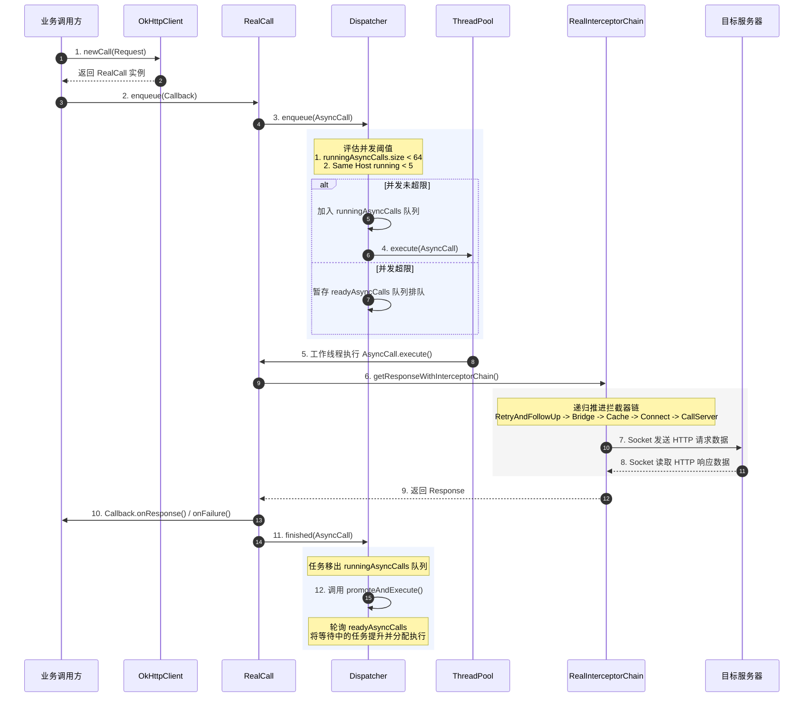

# 5.3.1.1.0 OkHttp 概述

作为现代 Android 开发中最核心的网络底座，Square 公司开源的 OkHttp 几乎承载了所有 Android 应用的流量传输。它不仅在应用层为开发者提供了简洁易用的 API，更在传输层和网络层实现了复杂的并发控制、连接复用、协议协商以及网络缓存等高级机制。

本文将从诞生背景、网络演进历史、核心架构设计、调度模型、拦截器链递归原理、技术优缺点以及 Android 实践适配等多个维度，对 OkHttp 进行系统性、闭环式的深入剖析，以构建对该框架的全局认知。

---

## 1. OkHttp 的诞生背景与网络演进历史

在移动互联网兴起的早期，网络环境主要基于 2G/3G 以及早期的 4G 信号。移动设备在无线电通信（Radio Communication）上有着极为严苛的物理限制。每次网络请求都会唤醒移动设备的无线电模块，使其从休眠状态（Idle）切换到高功耗的专用信道状态（DCH），并在请求结束后持续保持 5-10 秒。如果 App 建连频率高且缺乏长连接复用，不仅会造成设备电量崩塌式损耗，还会在频繁的基站和信号切换（如 Wi-Fi 与蜂窝网络动态切换）中产生高昂的时延与连接超时。在这一背景下，早期的 Android 开发者面临着原生网络底座的技术荒漠。

### 1.1 Apache HttpClient 与 HttpURLConnection 的技术痛点与历史博弈

在 Android 早期（Android 2.2 及以前），由于 `HttpURLConnection` 的实现不够成熟，开发者普遍更倾向于使用 Android 系统内置的 `Apache HttpClient`。
`Apache HttpClient` 的功能非常强大，提供了丰富的 API、成熟的并发连接管理、多样化的身份验证机制以及 Cookie 的自动存储。然而，这种庞大臃肿的设计在移动端带来了致命的缺陷：
- **Dalvik/ART 类加载与内存负担**：`Apache HttpClient` 的代码体系极其庞大且抽象层次过深。在 Dalvik 或早期的 ART 虚拟机中，这会产生极高的类加载开销和运行时内存占用。虚拟机在预加载类（Preloaded Classes）时，需要处理大量不适合移动端运行的无用类，极易诱发主线程 GC 抖动，拖慢应用的冷启动速度。
- **扩展与优化极其困难**：由于其代码紧密耦合了早期 Apache 基金会的实现规范，Android 团队很难在不破坏向后兼容性的情况下对其进行底层代码重构和性能提升。随着安全密码套件（Cipher Suites）以及 TLS 协议版本的演进，HttpClient 难以对其底层 SSL 栈进行统一的安全升级，导致了安全隐患。

为了摆脱对 Apache 第三方库的依赖，Google 自 Android 2.3 开始重点推广原生的 `HttpURLConnection`。它采用精简轻量化的设计，体积小巧，并具备更出色的电量消耗控制与网络缓存机制。然而，`HttpURLConnection` 在早期也暴露出致命的缺陷：
- **Socket 连接泄露 Bug**：在 Android 2.2（API Level 8）及更早版本中，当读取 `InputStream` 并调用 `close()` 时，连接池内部的 Socket 可能无法被正常回收和复用。这会导致大量的 Socket 描述符常驻后台并发生泄漏，进而引发系统的文件描述符（FD）资源耗尽，导致系统崩溃。
- **协议演进脱节与网络机制缺失**：尽管 Google 在高版本中极力推荐使用 `HttpURLConnection`，但其内部实现依然是死板、原始的单通道阻塞模型。它原生不支持当时由 Google 倡导的 SPDY 协议（后演变为 HTTP/2），无法实现多路复用，也缺乏合理的异常静默重试机制。在弱网丢包或 IP 地址因基站切换发生变动时，旧有库频繁报出连接超时，开发者不得不手动在业务层编写极其复杂的 IP 容灾重试、多线程并发队列与退避机制。

### 1.2 Android 网络栈的官方演进与 OkHttp 的收编

在这种破局呼声下，Square 公司开源了 OkHttp。凭借极其出色的连接池设计、极速的 Okio I/O 引擎以及规范的拦截器责任链，它很快赢得了开发者的青睐。Google 官方也随之启动了将 OkHttp 收编为系统网络栈底座的演化路线：
- **偷偷替换底层实现（Android 4.4 / API 19）**：为了彻底提升系统原生网络请求的运行效率，Android 官方在 Android 4.4 中，悄悄将系统内部 `HttpURLConnection` 的底层实现替换为了 OkHttp 的早期分支代码。这意味着开发者即便在代码中调用看似老旧的原生 `URL.openConnection()`，其真实的 Socket 建连与字节流传输逻辑也是由 OkHttp 来接管和驱动的。
- **彻底废弃并移除 HttpClient（Android 6.0 / API 23）**：在 [Android 6.0](file:///Users/lizhiyang/Desktop/AndroidKnowledge/AndroidVersionChangeLog.md#Android 6.0（API 23）) 中，官方正式将 `Apache HttpClient` 的相关类从系统编译库中移除。如果老旧项目需要继续运行，必须在 `build.gradle` 中显式声明 `useLibrary 'org.apache.http.legacy'`。这宣告了 HttpClient 时代的正式终结。
- **明文传输安全收紧（Android 9.0 / API 28）**：在 [Android 9.0](file:///Users/lizhiyang/Desktop/AndroidKnowledge/AndroidVersionChangeLog.md#Android 9（API 28）) 时代，系统进一步收紧了网络安全策略，默认禁止一切未加密的 HTTP 明文请求。此时，底层的 OkHttp 会与 Android 的 `NetworkSecurityPolicy.isCleartextTrafficPermitted()` 进行紧密契合，确保明文白名单外的连接会被物理拦截，从而避免了应用在不同系统版本上的安全漏洞。

OkHttp 的演化史，代表了移动端网络请求向着安全、高速、高吞吐和连接复用的演进脉络，也为诸如 Retrofit 这样的上层框架繁荣打下了稳固的物理底座。

---

## 2. 核心架构设计与关键组件职责

OkHttp 采用门面模式将复杂的底层逻辑封装在 `OkHttpClient` 之后，并通过建造者模式（Builder）进行高度定制化的配置。要系统性掌握其工作原理，需要深入解剖其内部核心组件与关键职责。

### 2.1 OkHttpClient：全局配置的控制中心

`OkHttpClient` 是整个库的配置中心，扮演着“门面”和“守护神”的角色。在 Android 项目中，它通常被配置为全局单例，承载着域名解析（Dns）、安全握手（SSLSocketFactory）、连接回收（ConnectionPool）和任务分发（Dispatcher）等核心组件的管理。

#### 核心设计抉择：不可变性（Immutable）与浅拷贝（Shallow Copy）
`OkHttpClient` 在构建完成之后，其内部所有的状态和参数都处于只读状态（Immutable）。在多线程高并发的网络调用中，任意后台线程都可以安全地使用同一个 Client 实例发起请求，不存在任何多线程竞态条件或参数被意外篡改的隐患。这极大保证了线程安全。

如果项目在某些局部模块中，需要为特定的请求定制更长的超时时间或增加定制拦截器，可以通过如下形式派生：
```kotlin
val specialClient = globalClient.newBuilder()
    .readTimeout(60, TimeUnit.SECONDS)
    .addInterceptor(SpecialAuthInterceptor())
    .build()
```
在调用 `newBuilder()` 时，新生成的 `OkHttpClient` 实例是基于旧实例执行的“浅拷贝”。新实例保留了与原实例相同的底层物理资源引用，包括**同一个连接池（ConnectionPool）**和**同一个线程池/调度器（Dispatcher）**。这种浅拷贝设计，既保障了业务模块配置的绝对灵活性，又防止了重复创建线程池和物理 Socket 连接导致系统资源崩溃。

#### 核心内部配置项深度解剖：
- **Proxy 与 ProxySelector**：支持配置静态代理或基于 PAC 脚本的动态代理选择器。这为企业级网络安全加固、内网穿透以及客户端网络抓包诊断（如 Charles/Fiddler 抓包）提供了底层的支持。
- **Authenticator**：自动挑战认证器。当服务器返回 401 Unauthorized，或者代理服务器返回 407 Proxy Authentication Required 响应时，OkHttp 会自动触发 Authenticator 接口，允许开发者在其中编写刷新 Token、重新填装凭证的逻辑，并自动重发请求，实现了业务层无感知的鉴权刷新。
- **ConnectionSpecs**：TLS 连接规范配置集合（包含 Modern TLS, Restricted TLS, Unencrypted 等）。它控制了安全握手时所支持的 TLS 版本（如 TLS 1.2, TLS 1.3）以及密码套件（Cipher Suites）的协商，确保客户端既能兼容低版本旧系统，又能在高版本系统上强制使用最高强度的加密套件。

### 2.2 Request 与 Response：声明式实体

- **Request**：对 HTTP 请求的纯净抽象。它包含目的 URL、Method（GET/POST/PUT等）、请求头 Headers 以及请求体 RequestBody。为了保证在拦截器长链中数据流转的稳定性与重试一致性，Request 在设计上也是不可变的（Immutable）。
- **Response**：对 HTTP 响应的抽象。它同样是不可变的。需要重点关注的是，其响应体 `ResponseBody` 是一个底层的流式对象（基于 Okio 的 Source 实现）。由于该流对象直接挂接了底层的 Socket 读写通道，为了防止连接泄露和内存溢出，它被设计为**一次性消费**。当开发者调用了 `ResponseBody.string()` 或 `bytes()` 后，底层的流会被立即关闭，二次读取会触发 `IllegalStateException("Closed")`。

### 2.3 RealCall：网络任务的生命体

`RealCall` 是 `Call` 接口的具体实现，代表了一次具体且不可复用的网络请求生命体。它把 `OkHttpClient` 和 `Request` 结合在一起。为了防止内部状态机的紊乱，每一个 `RealCall` 对象通过原子操作保护的 `executed` 布尔值，确保自身**只能被执行一次**（不管是同步 execute 还是异步 enqueue）。如果试图重复执行相同的 RealCall 实例，系统会无情抛出 `IllegalStateException("Already Executed")`。

### 2.4 Dispatcher（调度器）：并发的指挥官

`Dispatcher` 是 OkHttp 并发请求的中枢指挥官。它内部维护了一个共享的线程池和三个双端队列：
- `readyAsyncCalls`：双端队列，用于存放已被业务调用发起、但由于超过并发限制而暂时在等待队列中排队等待的异步请求任务（`AsyncCall`）。
- `runningAsyncCalls`：双端队列，存放当前正在后台线程池中高并发执行的异步网络请求。
- `runningSyncCalls`：双端队列，存放当前在调用线程中同步阻塞运行的同步网络请求。

#### 深入剖析其线程池（ExecutorService）设计参数
Dispatcher 默认持有的线程池为：
```java
public synchronized ExecutorService executorService() {
  if (executorService == null) {
    executorService = new ThreadPoolExecutor(
        0,                    // 核心线程数（corePoolSize）
        Integer.MAX_VALUE,    // 最大线程数（maximumPoolSize）
        60, TimeUnit.SECONDS, // 线程闲置存活时间（keepAliveTime）
        new SynchronousQueue<>(), // 无界同步传输队列
        Util.threadFactory("OkHttp Dispatcher", false)
    );
  }
  return executorService;
}
```
**这一套参数设计有着深刻的高并发哲学**：
- **corePoolSize 设为 0**：保证当应用没有网络请求时，系统不会常驻任何多余的调度线程。当高并发任务退潮，最后一个线程闲置超过 60 秒的 `keepAliveTime` 后，所有工作线程都会在从 `SynchronousQueue` 调用 `poll()` 超时后被 JVM 完全回收，实现 CPU 资源的零闲置损耗。
- **maximumPoolSize 设为 `Integer.MAX_VALUE`**：允许创建无限多的线程。这意味着线程池本身不设置任何硬性并发上限，把真实的并发控制逻辑交给 Dispatcher 自身的三个队列进行评估，从而避免了线程池队列满导致任务被拒绝执行的问题。
- **SynchronousQueue**：这是一个没有内部容量的阻塞队列。每个插入操作必须等待另一个线程的获取操作。当有新的异步请求到来时，如果没有闲置线程，线程池会以零延迟的响应速度立刻创建一个新的工作线程投入工作。

#### 并发控制的阈值设计与深度思考
Dispatcher 限制了 `maxRequests` 为 64（最大并发请求数），且限制 `maxRequestsPerHost` 为 5（同一域名最大并发数）。
- **为什么要设置 64 的最大上限？**
  如果对高并发不加限流，一旦应用在弱网下快速触发上百个请求，线程池就会瞬间创建上百个工作线程。这会导致 CPU 频繁进行上下文切换（Context Switch），消耗大量的内存与物理端口，引发频繁的 JVM 内存分配与 GC 抖动，使得整体网络响应反而更加迟钝，特别是在移动设备硬件资源受限的情况下，极易诱发 OutOfMemoryError。
- **为什么针对单个域名（Host）限制为 5？**
  这来源于 RFC 规范与传统的浏览器连接数限制。一方面，为了防止高并发请求对同一台物理服务器造成分布式拒绝服务攻击（DDoS）式的过载压力；另一方面，如果不设限，假设用户在 App 中同时加载大量大图和发送重要的 API 请求，大图的并发连接会将 Dispatcher 的并发席位占满，导致核心 API 请求发生长期饥饿（Starvation）无法发出。限制为 5 完美平衡了域名的吞吐效率与并发公平性。
- **为什么队列使用双端队列（Deque）？**
  双端队列提供了极大的调度灵活性。它不仅支持先进先出（FIFO）的标准调度流，也为未来可能实现的任务插队、取消特定范围的请求、以及后进先出（LIFO，例如优先加载用户最新滑到的图片）等高级调度策略预留了扩展空间。

### 2.5 ConnectionPool（连接池）：底层的 TCP 复用池

`ConnectionPool` 负责物理 Socket 通道的复用管理。它利用一个双端队列（`ArrayDeque`）存储所有的 `RealConnection`，并利用标记清除算法定期扫描和清理“空闲连接”。

#### 活动 Call 弱引用追踪机制
连接池开发中最核心的技术难点在于：**如何精准、安全地判定一个物理连接（RealConnection）是否处于闲置状态？**
OkHttp 的解决方案是巧妙的“弱引用计数法”。在 `RealConnection` 内部，维护了一个 `List<Reference<RealCall>>` 列表。每当一个 `RealCall` 经由连接分配器定位到该物理连接并准备开始传输数据时，就会向这个列表中添加当前 RealCall 的一个弱引用（`WeakReference<RealCall>`）。
当连接池的后台定时清理任务 `cleanupRunnable` 运行时，它会遍历队列中的每一个 `RealConnection`，并检查其列表：
- 如果弱引用所指向的 `RealCall` 已经被垃圾回收（GC），或者该请求已经完全执行完毕并主动移出了列表，列表长度便会归零。
- 长度归零意味着该 `RealConnection` 当前没有承载任何活动的网络请求，被标记为“空闲连接”。
- 清理线程会统计所有空闲连接，如果发现某个空闲连接的闲置时间长达 5 分钟，或者当前的空闲连接总数已经超过 5 个，清理线程就会将其强制关闭，从而保护了移动设备的 Socket 资源。
- **智能休眠与唤醒机制**：清理线程并不会使用死循环白白消耗 CPU 算力。`cleanup()` 方法会计算并返回一个精确的纳秒时间（例如：距离最快过期的那个空闲连接还差多少时间）。清理线程在同步锁上调用 `Object.wait(timeout)` 进行非阻塞的精准休眠，直到时间到期或有新连接加入时被主动唤醒，从而以极高的效率实现了资源的定时轮询与清理。

### 2.6 Cache：基于 DiskLruCache 的 HTTP 缓存中枢

`Cache` 负责磁盘缓存的读写。其底层直接依赖于 Square 的另一个名作 `DiskLruCache`。
为了解决磁盘 I/O 突然中断、崩溃等引发的脏数据问题，DiskLruCache 引入了名为 **`journal`（日志）** 的控制文件。在磁盘进行读取或写入时，journal 文件会以文本行形式顺序记录 `DIRTY`（表示正在写入，此时缓存项处于半脏状态）、`CLEAN`（表示写入成功且安全）、`REMOVE`（表示缓存被移除）和 `READ`（表示读取发生）四种操作状态。在 App 异常强杀或断电重启后，OkHttp 能通过重读 journal 文件自动回滚未完成的 `DIRTY` 文件，保证了本地 HTTP 磁盘缓存的强一致性与稳健性。

---

## 3. 请求执行流与调度机制源码推演

我们将深入剖析同步和异步网络请求在 OkHttp 底盘的生命周期流转。

### 3.1 同步请求执行流（Execute）

同步执行模型极具条理性，其底层源码流程如下：
1. `RealCall` 调用 `execute()`，检查 `executed` 原子布尔值，并将该标志位置为 `true`。
2. 触发 `transmitter.callStart()` 并激活 `eventListener.callStart()`。
3. 调用 `client.dispatcher().executed(this)`，将当前 `RealCall` 压入 Dispatcher 的 `runningSyncCalls` 双端队列中。
4. 调用 `getResponseWithInterceptorChain()`。当前线程立刻阻塞，并进入拦截器责任链的递归逻辑中。
5. 当调用链层层回传或抛出异常后，在 `finally` 块中调用 `client.dispatcher().finished(this)`。该方法会将 Call 从 `runningSyncCalls` 中清除。

### 3.2 异步请求执行流（Enqueue）

异步执行是 OkHttp 并发吞吐的核心所在，其代码流转更为精密：
1. 业务端调用 `RealCall.enqueue(callback)`。
2. 包装回调：将 `Callback` 封装在内部 Runnable 类 `AsyncCall` 中，`AsyncCall` 额外持有当前请求的 Host 域名以便 Dispatcher 统计。
3. **入队并触发调度**：调用 `dispatcher.enqueue(asyncCall)`。调度器首先将其加入 `readyAsyncCalls` 等待队列，随后立即调用 `promoteAndExecute()`。
4. **提升决策机制（`promoteAndExecute` 源码推演）**：
   在 `promoteAndExecute()` 内部，执行了高度精细的并发锁优化设计：
   ```java
   boolean promoteAndExecute() {
     assert (!Thread.holdsLock(this));
     List<AsyncCall> executableCalls = new ArrayList<>();
     boolean isRunning;
     synchronized (this) {
       // 1. 遍历等待队列 readyAsyncCalls
       for (Iterator<AsyncCall> i = readyAsyncCalls.iterator(); i.hasNext(); ) {
         AsyncCall call = i.next();
         
         // 2. 检查总并发上限是否超标 (默认 64)
         if (runningAsyncCalls.size() >= maxRequests) break; 
         // 3. 检查单域名并发上限是否超标 (默认 5)
         if (call.callsPerHost().get() >= maxRequestsPerHost) continue; 
         
         // 4. 从等待队列移出，晋升入执行队列
         i.remove();
         call.callsPerHost().incrementAndGet(); // 该域名引用计数加 1
         executableCalls.add(call);
         runningAsyncCalls.add(call);
       }
       isRunning = runningCallsCount() > 0;
     }
     
     // 5. 关键并发设计：在同步块外部，真正向线程池提交任务
     for (int i = 0, size = executableCalls.size(); i < size; i++) {
       AsyncCall call = executableCalls.get(i);
       call.executeOn(executorService());
     }
     return isRunning;
   }
   ```
   **为什么要把 `call.executeOn` 移到 `synchronized` 同步锁之外执行？**
   这是一个极其巧妙的并发优化点。向线程池提交任务（`execute`）在底层可能会触发新线程的创建和系统内核的线程调度，这是一个耗时且带有阻塞性质的调用。如果在锁内部提交任务，就会导致其他高并发线程在调用 Dispatcher 时被无辜阻塞在锁外，降低了 Dispatcher 的分发性能。将其移到同步块外部进行无锁提交，使 Dispatcher 的锁持有时间变得极短，从而大大提升了在大并发场景下的系统吞吐率。
5. **执行与唤醒**：在线程池执行 `AsyncCall.run()` 时，它会调用 `getResponseWithInterceptorChain()` 获取响应并通知用户回调。当执行完毕后，在 `finally` 块中调用 `dispatcher.finished(this)`，这会重新触发一次 `promoteAndExecute()`。这样，先前在 `readyAsyncCalls` 中苦苦排队等待的任务便会被自动晋升、唤醒并分配到线程池中开始执行，实现了高并发任务的平滑衔接。

### 3.3 核心请求执行流程与核心组件时序流图

为了直观展现上述并发调度与拦截器链递归推进的过程，以下通过 Mermaid 时序图展现一次异步请求的闭环生命周期：



如上图所示，当用户调用 `enqueue()` 之后，请求会先流转到调度中枢 `Dispatcher`。通过限制策略与双队列控制，保证了高并发请求不会击垮移动设备的线程上限。当空闲线程取得执行权时，便启动拦截器责任链进行网络数据的递归传输，并在完成后通知 Dispatcher 进行队列的轮转与唤醒。

---

## 4. 五大核心拦截器责任链设计简析

OkHttp 的核心灵魂在于其责任链拦截器模型。所有的网络业务处理、连接管理、缓存读取、协议重构等工作，全部被解耦并模块化成一个个单一职责的拦截器。

### 4.1 责任链的工作机制：RealInterceptorChain 递归推进

当请求经过调度进入 `getResponseWithInterceptorChain()` 时，OkHttp 会按照特定顺序组装一个拦截器列表。整个列表的递归流动由 `RealInterceptorChain` 驱动。
`RealInterceptorChain` 的内部持有当前拦截器列表、当前的索引值 `index` 以及传入的 `Request`。当链条在 `proceed(request)` 方法中被触发时，会执行如下操作：
1. **防重复调用校验**：如果当前拦截器已经调用过 `proceed()`（意味着同一个拦截器试图多次驱动责任链向下流转），源码会通过校验同一个 index 上的 `proceed` 调用次数，直接抛出 `IllegalStateException` 崩溃，从而避免无限回溯或责任链崩溃。
2. **构建下一个 Chain**：实例化一个新的 `RealInterceptorChain` 实例，将其 `index` 属性加 1。
3. **驱动下一个拦截器**：通过 `interceptors.get(index)` 取得当前需要执行的拦截器，调用其 `intercept(nextChain)` 方法。
4. **递归解包**：下一个拦截器内部在其前置操作执行完毕后，会再次调用 `nextChain.proceed(request)`。这个过程像剥洋葱一样，层层深入，直到最后一个拦截器 `CallServerInterceptor` 发起 Socket 读写并拿到 `Response`，然后响应再被层层解包、封装、并以递归返回的形式原路回传给最上层。

关于责任链设计模式与 `RealInterceptorChain` 的详细实现，可深度参考 [5.3.1.1.2 责任链模式](file:///Users/lizhiyang/Desktop/AndroidKnowledge/docs/5.Android/5.3.主流三方开源库/5.3.1.网络请求/5.3.1.1.OkHttp/5.3.1.1.2.责任链模式.md)。关于拦截器的分类与应用，可参考 [5.3.1.1.1 拦截器](file:///Users/lizhiyang/Desktop/AndroidKnowledge/docs/5.Android/5.3.主流三方开源库/5.3.1.网络请求/5.3.1.1.OkHttp/5.3.1.1.1.拦截器.md)。

### 4.2 五大官方拦截器的职责定位与前向导航

为帮助开发者构建系统性认知，这里简述五大核心拦截器的主要职责，并建立与后续深度章节的导航链接：

```
                       Request Downward Flow (请求流)
                                     │
                                     ▼
        ┌────────────────────────────────────────────────────────┐
        │  1. RetryAndFollowUpInterceptor (重试与重定向拦截器)      │
        │     - 监控网络异常,自动发起 Route 切换与重试              │
        │     - 捕获 3xx 状态码,重构 Request 发起重定向            │
        └────────────────────────────┬───────────────────────────┘
                                     │ proceed()
                                     ▼
        ┌────────────────────────────────────────────────────────┐
        │  2. BridgeInterceptor (协议桥接拦截器)                    │
        │     - 自动补全请求头: Host, Cookie, User-Agent, GZIP     │
        │     - 响应体透明解压: GZIP 字节流转化为正常字节流         │
        └────────────────────────────┬───────────────────────────┘
                                     │ proceed()
                                     ▼
        ┌────────────────────────────────────────────────────────┐
        │  3. CacheInterceptor (缓存控制拦截器)                     │
        │     - 执行 RFC 缓存规范,匹配强缓存与协商缓存              │
        │     - 离线状态下拦截直接返回本地缓存,降低多余网络传输      │
        └────────────────────────────┬───────────────────────────┘
                                     │ proceed()
                                     ▼
        ┌────────────────────────────────────────────────────────┐
        │  4. ConnectInterceptor (连接分配拦截器)                    │
        │     - 利用 ExchangeFinder 匹配可用连接或开启物理握手     │
        │     - 获取 RealConnection 实例并将其注入连接池           │
        └────────────────────────────┬───────────────────────────┘
                                     │ proceed()
                                     ▼
        ┌────────────────────────────────────────────────────────┐
        │  5. CallServerInterceptor (数据读写拦截器)                │
        │     - 责任链终点,通过 Okio 向物理 Socket 管道写入报文     │
        │     - 读取服务器返回的报文,构筑原始 Response 实体        │
        └────────────────────────────────────────────────────────┘
                                     │
                       Response Upward Return (响应返回流)
```

#### 一、 RetryAndFollowUpInterceptor（重试与重定向拦截器）
- **核心任务**：建立长效的容错机制。捕获传输过程中的物理连接失败、路由异常（如某 IP 挂掉）并自动尝试下一路由；解析 3xx 重定向响应头，生成新请求，限制最大重定向次数为 20 次。
- **不可重试的异常类型推演**：并不是所有的异常都可以重试。以下异常在底层会被直接判定为不可恢复，拦截器会直接放弃重试并向外抛出异常：
  1. `ProtocolException`：HTTP 协议发生冲突或格式损坏。
  2. `InterruptedIOException`：连接或读写超时（若属于 SocketTimeoutException，OkHttp 会视配置决定是否重试，但如果是在途的异步 Call 被主动取消，则绝对不允许重试）。
  3. `CertificateException`：HTTPS 证书解析或校验发生致命错误。
  4. `SSLPeerUnverifiedException`：TLS 握手阶段 Peer 未经验证，或者主机名校验（`HostnameVerifier`）未通过。
- **详细机制**：可参考 [5.3.1.1.5 超时重试重定向](file:///Users/lizhiyang/Desktop/AndroidKnowledge/docs/5.Android/5.3.主流三方开源库/5.3.1.网络请求/5.3.1.1.OkHttp/5.3.1.1.5.超时重试重定向.md)。

#### 二、 BridgeInterceptor（桥接拦截器）
- **核心任务**：HTTP 应用层协议的标准桥接。它在请求阶段为 Request 装配缺少的 `Host`、`Keep-Alive`、`User-Agent`，并调用 `CookieJar` 补全 Cookie 信息。在接收响应时，它扮演着解压缩工具的角色：若它透明添加了 `gzip`，在收到 Response 后会剥离 Content-Encoding 头部，通过 `GzipSource` 对 Body 字节流进行透明解密解压。同时，为了防止上层业务解析出错，它会细心地将已经不再准确的 `Content-Length` 和 `Content-Encoding` 请求头移出。
- **自定义 CookieJar 的工程必要性**：由于移动端没有像 PC 浏览器那样的默认 Cookie 存储容器，默认的 Cookie 读写是空实现（`CookieJar.NO_COOKIES`）。为了实现登录态的本地持久化，Android 开发者必须自定义重写 `CookieJar`，在 `saveFromResponse` 和 `loadForRequest` 方法中，调用 `SharedPreferences` 或 SQLite 数据库将 Cookie 写入磁盘，BridgeInterceptor 正是底层调用该接口的搬运工。

#### 三、 CacheInterceptor（缓存拦截器）
- **核心任务**：遵循 HTTP RFC 缓存规范进行本地文件缓存决策。匹配强缓存与协商缓存规则（发送条件请求如 ETag / If-None-Match），避免无效的网络开销。
- **504 Unsatisfiable Request 的由来**：当业务请求配置了“强制只读缓存”策略（如 `Cache-Control: only-if-cached`），但本地 Cache 恰好没有该记录或缓存已经失效时，`CacheStrategy` 决策出的 Request 和 Response 均为 null。此时，CacheInterceptor 会直接拦截请求并组装返回一个状态码为 504 的 Response，而根本不会发起任何真实的物理网络请求。
- **详细机制**：可参考 [5.3.1.1.4 缓存](file:///Users/lizhiyang/Desktop/AndroidKnowledge/docs/5.Android/5.3.主流三方开源库/5.3.1.网络请求/5.3.1.1.OkHttp/5.3.1.1.4.缓存.md)。

#### 四、 ConnectInterceptor（连接拦截器）
- **核心任务**：建立可供传输 HTTP 数据帧的物理信道。调用 `ExchangeFinder` 寻找可复用的 `RealConnection`，寻找失败则与服务器进行 TCP 三次握手和 TLS 握手创建新连接。
- **ExchangeFinder 寻址降级细节**：在分配 Socket 连接时，OkHttp 并不是盲目握手。它会首先检查当前物理连接池中是否已经有指向相同目标主机的空闲连接；其次会检查是否有可合并的主机名（利用 HTTP/2 的单 IP 多域名证书合并特性）。若全部失败，才通过多路由迭代器（`RouteSelector`）生成新的候选 IP，执行物理 Socket 握手。
- **详细机制**：连接池管理参考 [5.3.1.1.3 连接池](file:///Users/lizhiyang/Desktop/AndroidKnowledge/docs/5.Android/5.3.主流三方开源库/5.3.1.网络请求/5.3.1.1.OkHttp/5.3.1.1.3.连接池.md)；Socket 与协议层建连逻辑参考 [5.3.1.1.7 Socket连接池](file:///Users/lizhiyang/Desktop/AndroidKnowledge/docs/5.Android/5.3.主流三方开源库/5.3.1.网络请求/5.3.1.1.OkHttp/5.3.1.1.7.Socket连接池.md)。

#### 五、 CallServerInterceptor（数据读写拦截器）
- **核心任务**：责任链的收尾工作。通过 Okio 向物理 Socket 管道中写入 HTTP Request 的报文流（对于需要上传大主体的 Post 请求，它会先发送 100-continue 询问服务器，收到许可后再发送 Body，避免不必要的网络开销），并最终从 Socket 管道中读取 Response Headers 与 Body 流，构筑出 Response 实体。

---

## 5. 核心优势与局限性深度剖析

通过对底层机制与设计哲学的探究，我们可以更客观地归纳 OkHttp 的核心技术优势以及隐藏的局限性。

### 5.1 核心技术优势

#### 1. 优秀的连接池复用与多路复用能力
- **物理通道的高效保留**：OkHttp 的 `ConnectionPool` 完美实现了 Keep-Alive 机制。通过合理配置连接生存期，大大降低了高频网络请求下 TCP 三次握手和 TLS 协议握手带来的 CPU 算力损耗与往返时延（RTT）。
- **HTTP/2 的多路复用与多流协作**：如果服务端环境支持 HTTP/2，OkHttp 会自动利用 ALPN 进行协议升级，并在同一条物理 TCP 信道上并发执行多个 HTTP 请求。在底层的 HTTP/2 协议中，所有通信都在单个 TCP 连接上完成，该连接承载着任意数量的双向数据流（`Stream`）。每个数据流都被拆分为独立的“帧（`Frame`）”，这些帧在发送时是交错混杂的，带有各自的流标识符，在接收端再根据标识符重组。这彻底消除了 HTTP/1.x 架构下的“线头阻塞”难题，大幅减少了移动设备为应对高并发创建数十个 Socket 带来的 FD（文件描述符）和网络端口的开销。

#### 2. TLS 1.3 极速安全建连与 ALPN 支持
OkHttp 内建了完整的安全配置协商机制。它完全兼容最新的 TLS 1.3 标准。TLS 1.3 将传统的双向 2-RTT 握手精简为 1-RTT，并允许客户端利用缓存的会话信息实现 0-RTT 极速连接恢复。此外，OkHttp 支持加密客户端 Hello（ECH）以防御窃听（此机制与 [Android 17 Beta](file:///Users/lizhiyang/Desktop/AndroidKnowledge/AndroidVersionChangeLog.md#Android 17 Beta（API 37）) 中强化的本地网络和证书安全性相契合），极大地保障了通信的安全性与速度。更多 HTTPS 兼容性与握手细节，请参考 [5.3.1.1.6 HTTPS](file:///Users/lizhiyang/Desktop/AndroidKnowledge/docs/5.Android/5.3.主流三方开源库/5.3.1.网络请求/5.3.1.1.OkHttp/5.3.1.1.6.HTTPS.md)。

#### 3. 革命性的 I/O 引擎：Okio
OkHttp 底层的字节级数据读写全部由专门定制的 `Okio` 引擎驱动。
- **“零拷贝（Zero-Copy）”内存流转**：Okio 核心采用了 `Segment` 设计。每个 Segment 包含了 8KB 大小的物理内存片段，所有的 `Buffer` 都是由这些 Segment 组成的双向循环链表。当我们需要把数据从一个 Buffer 移动或写入 Socket 时，如果移动的数据块大小刚好超过 8KB，Okio 并不是复制底层的 byte 数组，而是直接操作 Segment 的前后指针，将该节点直接从源链表“修剪”并“挂载”到目标链表上。这种指针级的物理搬运，实现了绝对的“零拷贝”，极大释放了 CPU 的计算资源。
- **SegmentPool 抑制 GC 开销**：频繁的内存申请和回收是 Android App 发生顿卡和 GC 抖动的元凶。Okio 通过 `SegmentPool` 缓存了被释放的 Segment 实例，最大缓存 64KB（8 个 Segment 节点）。这样，高频的网络 I/O 吞吐几乎全部在对象池内复用，极大减轻了 Dalvik/ART 虚拟机的垃圾收集压力。

#### 4. 高适应性的故障转移路由机制
当设备从基站切换到 Wi-Fi，或者网络 IP 解析发生漂移时，OkHttp 的 `RouteSelector` 会自动维护损坏的 IP 地址黑名单，并静默选取 DNS 返回的其他可用备用 IP 地址。这极大提升了移动端产品在电梯、隧道等复杂出行环境下的网络可用性。

### 5.2 局限性与痛点分析

#### 1. JVM 底座的定位导致缺乏 Android UI 线程感知
OkHttp 是一个纯粹的 JVM 级别底层库，不包含任何 Android 平台的系统特性。异步任务的 callback 都是直接在 Dispatcher 的工作线程（非 UI 主线程）中执行的。
这意味着如果开发者直接在回调中修改 TextView 的文字或操作 UI，会导致 App 因 `CalledFromWrongThreadException` 直接崩溃。要想回传数据到主线程，必须手工通过 Handler、LiveData 或是协程上下文切换等形式进行桥接，产生了许多无意义的模板配置代码。

#### 2. 没有内置的反序列化（JSON 自动转 Bean）
OkHttp 仅负责数据的传输，返回的 ResponseBody 是纯净的字节流或文本。它本身不支持类似自动解析 JSON 字符串为 Java/Kotlin 实体类的逻辑。在没有二次封装的情况下，开发者必须手动获取 string 之后通过 Jackson 或 Gson 库手动解析，编码体验较为原始。

#### 3. 缺乏指数退避重试等高级业务治理功能
- **退避重试算法缺失**：OkHttp 虽然具备失败自动重试，但其重试是“立即执行”的。如果服务器遭遇突发流量雪崩，OkHttp 拦截器无延迟地连续请求极易对后端服务器造成致命的“二次雪崩”。它缺乏类似“指数退避重试（Exponential Backoff）”的缓释重试算法，开发者必须基于上层 Retrofit 或自写拦截器来扩展此功能。
- **文件下载管理薄弱**：没有内置的断点续传管理工具、多线程分块下载支持和开箱即用的下载进度状态机。

**架构设计反思**：由于上述局限性，在真实的 Android 工程中，开发团队极少直接暴露 OkHttp 给业务层，而是引入 **Retrofit** 作为声明式高层应用框架，让 Retrofit 负责解析注解、转换 JSON 数据和协程挂起，而将 **OkHttp** 作为 Retrofit 的底层传输底座，两者配合，构成最经典的网络请求栈。

---

## 6. Android 典型应用场景与实践建议

针对 Android 的平台特异性、安全约束和高可用要求，在实际开发中应用 OkHttp 应遵循以下核心设计建议。

### 6.1 全局单例化 OkHttpClient

由于 `OkHttpClient` 的线程池和连接池构建极其沉重，重复创建会引发严重的内存抖动和 Socket 文件描述符（FD）泄露，必须保证全局单例。

在 Kotlin 中可采用如下姿势快速构建单例：

```kotlin
object OkHttpHolder {
    val okHttpClient: OkHttpClient by lazy {
        OkHttpClient.Builder()
            .connectTimeout(15, TimeUnit.SECONDS)
            .readTimeout(15, TimeUnit.SECONDS)
            .writeTimeout(15, TimeUnit.SECONDS)
            .retryOnConnectionFailure(true)
            // 单例全局共享底层的物理连接池
            .connectionPool(ConnectionPool(5, 5, TimeUnit.MINUTES))
            .build()
    }
}
```

**局部定制的使用准则**：
假定业务中“头像上传”模块需要 60 秒的极长写入时间，切勿为该模块创建全新的 `OkHttpClient`。必须使用 `newBuilder()`：

```kotlin
// uploadClient 将继承全局单例的一切连接池与线程池，只修改局部写超时
val uploadClient = OkHttpHolder.okHttpClient.newBuilder()
    .writeTimeout(60, TimeUnit.SECONDS)
    .build()
```

### 6.2 利用 EventListener 打造全链路网络 APM 监控

EventListener 为全方位的网络耗时测量（APM）提供了极佳的入口。我们可以通过注册自定义的事件监视器，将每一次网络请求的细分阶段数据上报后台。

```kotlin
class NetworkMonitorListener : EventListener() {
    private var dnsStartTime = 0L
    private var connectStartTime = 0L

    override fun dnsStart(call: Call, domainName: String) {
        dnsStartTime = System.currentTimeMillis()
    }

    override fun dnsEnd(call: Call, domainName: String, inetAddressList: List<InetAddress>) {
        val duration = System.currentTimeMillis() - dnsStartTime
        // 上报本地 DNS 解析耗时
    }

    override fun connectStart(call: Call, inetSocketAddress: InetSocketAddress, proxy: Proxy) {
        connectStartTime = System.currentTimeMillis()
    }

    override fun connectEnd(
        call: Call,
        inetSocketAddress: InetSocketAddress,
        proxy: Proxy,
        protocol: Protocol?
    ) {
        val duration = System.currentTimeMillis() - connectStartTime
        // 上报 TCP/TLS 握手耗时
    }

    override fun callFailed(call: Call, ioe: IOException) {
        // 捕获异常类型并进行弱网等级划分
    }
}
```

### 6.3 针对 Android 平台特性的网络安全兼容

#### 1. 证书固定与安全容灾（Certificate Pinning）
为了防止在公共 Wi-Fi 等场景下发生中间人攻击（MITM），可通过 `CertificatePinner` 锁定服务器证书的 SPKI 公钥哈希：

```kotlin
val pinner = CertificatePinner.Builder()
    .add("api.mycompany.com", "sha256/7HI9yS...")
    .build()

val client = OkHttpClient.Builder()
    .certificatePinner(pinner)
    .build()
```
*安全注意：如果服务器发生证书替换，证书固定可能导致客户端大面积网络失败。在工程上，应该实现“备用公钥哈希”机制或支持动态下发策略。*

#### 2. 绕过 DNS 劫持与 HTTPS TLS SNI 兼容（HttpDNS）
在移动开发中，运营商 DNS 劫持是网络质量下降的一大祸首。我们可以自定义 OkHttp 的 DNS 解析逻辑，直接绕过系统本地 DNS 去请求安全的 HTTP 域名解析服务（如阿里云、腾讯云 HttpDNS）。

然而，在 HTTPS 场景下直接使用 IP 请求会带来一个巨大的深坑：**当 OkHttp 拿到 IP 地址向目标服务器发起握手时，TLS 握手会校验 Server Name（SNI），此时 IP 地址与服务器证书上的域名不匹配，会导致握手直接失败。**
要解决这一问题，必须重写 `HostnameVerifier` 或者在自定义 `SSLSocketFactory` 中手动设置正确的 SNI 域名信息：

```kotlin
class HttpDns : Dns {
    override fun lookup(hostname: String): List<InetAddress> {
        val ipList = getIpsFromHttpDnsServer(hostname)
        if (ipList.isNotEmpty()) {
            return ipList.map { InetAddress.getByName(it) }
        }
        return Dns.SYSTEM.lookup(hostname)
    }
    
    private fun getIpsFromHttpDnsServer(hostname: String): List<String> {
        // 真实 HttpDNS 解析接口
        return emptyList()
    }
}

// 解决 HTTPS 握手域名校验失败的 Verifier 适配
val safeVerifier = HostnameVerifier { hostname, session ->
    // 手动验证当前的实际目标域名是否与 session 证书所保护的域名一致
    val peerHost = session.peerHost
    HttpsURLConnection.getDefaultHostnameVerifier().verify(hostname, session) 
            || hostname == "api.mycompany.com"
}
```
配置时只需调用 `.dns(HttpDns()).hostnameVerifier(safeVerifier)`，便可让 OkHttp 底层的一切连接物理寻址自动接轨 HttpDNS 服务，保证了域名解析的真实性与稳定性，同时巧妙规避了 TLS 校验的兼容性深坑。

#### 3. 明文安全配置与历史系统兼容
在 Android 中，如果要支持明文传输（如连接测试环境的 HTTP 服务），务必在网络安全配置 xml 中将明文放行范围限制在特定测试域名下，避免使用全局放行：
- 关于 Android 系统明文拦截细节，请建立反链查看 [AndroidVersionChangeLog.md#Android 9（API 28）](file:///Users/lizhiyang/Desktop/AndroidKnowledge/AndroidVersionChangeLog.md#Android 9（API 28）)。
- 针对低版本 Android（如 Android 4.x 设备）对 TLS 1.2/1.3 支持不完善的问题，推荐在应用初始化时，通过 Google 服务的 `ProviderInstaller.installIfNeeded(context)` 动态注入最新的 Security Provider，避免 HTTPS 安全连接被直接拒绝。

### 6.4 协程挂起与 Call 生命周期联动

在 Android 的现代 Jetpack 开发架构中，将 OkHttp 回调封装为挂起函数是非常普遍的需求。在封装时，必须严格处理**协程取消与物理网络连接的联动注销**，防止协程取消后网络依然在后台空跑造成流量和硬件损耗：

```kotlin
suspend fun Call.await(): Response {
    return suspendCancellableCoroutine { continuation ->
        enqueue(object : Callback {
            override fun onResponse(call: Call, response: Response) {
                continuation.resume(response)
            }

            override fun onFailure(call: Call, e: IOException) {
                continuation.resumeWithException(e)
            }
        })

        // 当协程被主动取消（如 ViewModel 被销毁，用户退出页面时）
        // 协程会自动调用此块，必须顺带将底层的 Socket 任务强制取消
        continuation.invokeOnCancellation {
            try {
                cancel() // 强制关闭此 RealCall 的后台执行与物理网络
            } catch (t: Throwable) {
                // 静默忽略取消异常
            }
        }
    }
}
```

---

## 7. 总结

OkHttp 凭借其**优秀的调度器 Dispatcher 并发处理机制**、**高内聚的拦截器责任链解耦设计**、**杰出的物理 Socket 连接复用与多路复用能力**以及**底层定制的对象池化 I/O 引擎 Okio**，成为 Android 乃至整个 Java 平台网络底座的事实标准。

在日常 Android 开发中，建议牢固掌握其核心队列的提升逻辑、五大系统拦截器的工作职责、EventListener 耗时分析原理，并将其与 Retrofit 和 Kotlin 协程生命周期做深度联动。只有掌握了这些深层的机制，才能在多变且严苛的无线网络环境下，打磨出兼具安全、高速与低功耗的高性能网络请求系统。
