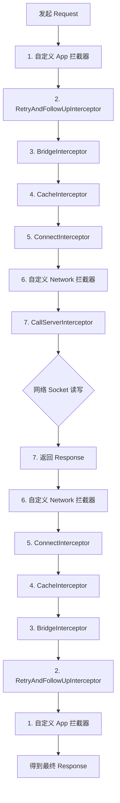
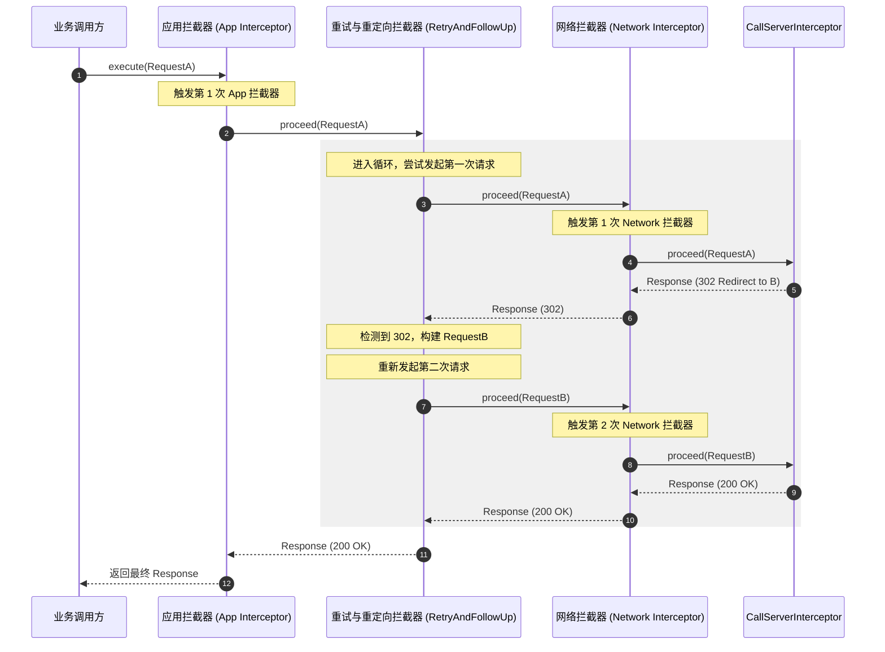
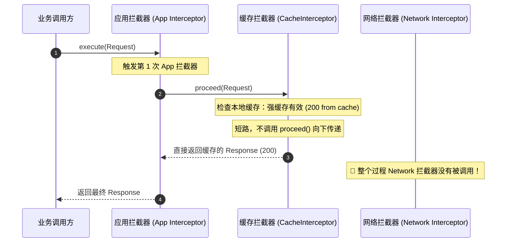
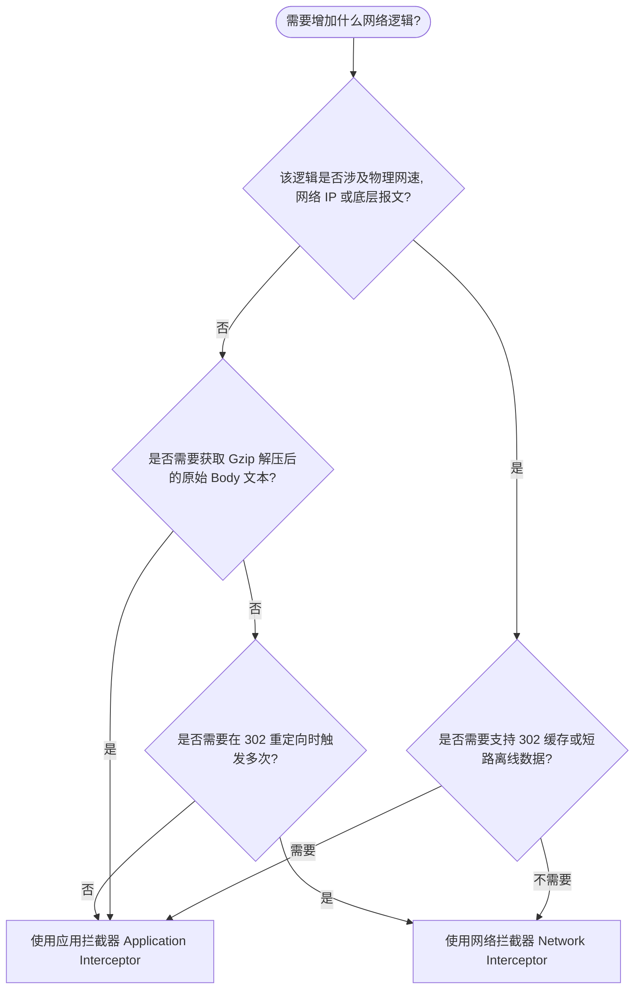

# OkHttp 拦截器深度解析：核心设计、运行机制与生产级高级实践

在 Android 网络开发中，OkHttp 无疑是基石般的存在。而 OkHttp 最具魅力、最强大的设计，莫过于它的**拦截器（Interceptor）机制**。拦截器不仅承担了 OkHttp 内部的重试、桥接、缓存、建连、I/O 读写等核心网络流水线工作，还为开发者提供了一个极其优雅的切面编程（AOP）入口。

本文将从拦截器的核心设计思想出发，深度剖析系统内置拦截器的工作机制、责任链自增索引的运行本质，详尽对比“应用拦截器”与“网络拦截器”的底层差异，并结合生产环境给出 Token 并发刷新、APM 微观网络监控、HttpDns 降级直连等高级实践方案。

---

## 一、 OkHttp 拦截器概述

### 1.1 什么是拦截器？
拦截器（Interceptor）是 OkHttp 提供的一种用于监视、重写和重试请求的强大机制。它的接口定义极其精简：

```kotlin
fun interface Interceptor {
  @Throws(IOException::class)
  fun intercept(chain: Chain): Response

  interface Chain {
    fun request(): Request

    @Throws(IOException::class)
    fun proceed(request: Request): Response

    fun connection(): Connection?
    
    // ... 其他辅助方法
  }
}
```

从接口定义可以看出，拦截器的核心逻辑极其简单：接受一个 `Chain`（链），从链中获取 `Request`（请求），处理后调用 `chain.proceed(request)` 将请求传递给下游，最终获取下游返回的 `Response`（响应），对其进行修饰后返回给上游。

### 1.2 面向切面设计（AOP）的典范
在传统的网络库设计中，功能的扩展往往依赖于繁琐的监听器（Listener）回调或臃肿的配置类。

#### 1.2.1 传统 Listener 机制的局限性
在早期的网络库（如 Apache HttpClient 或 Java 原生的 HttpURLConnection）中，如果想要对请求流施加某种全局影响，通常需要继承基类或注册多个单点回调（如 `onRequestStart`、`onResponseEnd` 等）。
这种设计存在两大缺陷：
1. **无法修改数据流向与内容**：Listener 仅仅是观察者（Observer），它们只能“旁观”请求的发生和响应的到达，却无法在中途动态地改写请求头、重定向 URL 甚至阻断请求返回模拟数据。
2. **职责耦合严重**：如果同时需要实现日志打印、身份认证、Gzip 解压和缓存，那么在发起请求的主流程中就会塞满这四种逻辑的代码。随着业务的发展，这段主流程代码会变得极其臃肿，难以维护。

#### 1.2.2 责任链模式实现的显式 AOP
OkHttp 拥有优越的性能与代码架构，它采用纯粹的对象组合和多态，通过**责任链模式**实现了轻量级、无损耗的**显式 AOP**。

网络请求过程中的每一个通用功能（如 Cookie 自动携带、Gzip 自动解压缩、缓存读写、失败重试等）都被抽象为一个独立的“切面”（即一个具体的拦截器）。
* **高内聚低耦合**：核心的建连与 I/O 读写拦截器（`ConnectInterceptor`、`CallServerInterceptor`）完全不需要关心缓存与重试的逻辑。它们只需要接收上游传递过来的 Request，完成物理读写，然后向上传递 Response 即可。
* **线性流转，链式包装**：请求如流水般顺次穿过各个拦截器，每一个拦截器都可以在“请求前” and “响应后”这两个切面上施加操作。这种“管道式（Pipeline）”的设计，使得每一个切面都具有“读写双重特质”，能够实现极强的业务编排能力。

#### 1.2.3 与后端 AOP 机制的区别与优势
在 Spring 等后端框架中，AOP 的实现往往依赖于运行时的 JDK 动态代理、CGLIB 字节码生成，或者编译期的 AspectJ 织入。这些机制或多或少会带来反射损耗、复杂的元空间开销以及令人头疼的异常调用栈（限制了堆栈可读性）。
换言之，后端框架的 AOP 偏向于“隐式魔法”，而 OkHttp 的拦截器则是极其“直白”的方法递归调用：
* **零反射开销**：拦截器调用过程是直接的方法调用，JVM 能够进行极佳的内联优化，没有任何性能退化。
* **清晰的调用栈**：发生网络崩溃时，异常堆栈直截了当地反映了 `proceed()` 的递进过程，极大地简化了线上崩溃日志的分析。

### 1.3 拦截器的生命周期与核心流转机制
当我们在 `OkHttpClient` 中配置了拦截器，并调用 `Call.execute()` 或 `Call.enqueue()` 时，OkHttp 会在内部将所有的拦截器（包括系统内置的与用户自定义的）组装成一个列表，并实例化一个 `RealInterceptorChain`。

每一次 `chain.proceed(request)` 的调用，都是一次向责任链下游推进的同步阻塞调用。在最底层的 `CallServerInterceptor` 完成与服务器的物理 I/O 交互并返回 Response 后，调用栈开始逐层出栈，Response 按照相反的顺序流经各个拦截器的后半部分，最终递交给最外层的调用者。

---

## 二、 责任链全局装配工作流与洋葱模型

### 2.1 拦截器的全局装配物理顺序
在 `RealCall.getResponseWithInterceptorChain()` 方法中，OkHttp 组装了完整的拦截器链。其物理排序顺序具有极其严格的逻辑，任何微小的顺序调整都会导致整个网络库的失效。其排序源码逻辑如下：

```kotlin
// RealCall.kt (OkHttp 4.x 源码简化)
@Throws(IOException::class)
fun getResponseWithInterceptorChain(): Response {
  val interceptors = mutableListOf<Interceptor>()
  
  // 1. 自定义应用拦截器（Application Interceptors）
  // 处于责任链的最顶端，拥有最广阔的控制视野，能拦截所有网络尝试
  interceptors.addAll(client.interceptors)
  
  // 2. 失败重试与重定向拦截器
  // 负责在网络出错时自动重试，以及 3xx 状态码的自动重定向，内部包含死循环
  interceptors.add(RetryAndFollowUpInterceptor(client))
  
  // 3. 桥接拦截器（负责补齐请求头、Cookie、自动解压 Gzip）
  // 负责在应用层友好 Request 与网络层真实 HTTP 报文之间搭建桥梁
  interceptors.add(BridgeInterceptor(client.cookieJar))
  
  // 4. 缓存拦截器（读取本地缓存、写入网络响应）
  // 按照 HTTP RFC 缓存规范处理强缓存与协商缓存，能直接短路网络请求
  interceptors.add(CacheInterceptor(client.cache))
  
  // 5. 连接拦截器（负责寻址、建立 TCP/TLS 连接）
  // 打开物理连接通道，获取物理连接的分配器与复用池
  interceptors.add(ConnectInterceptor)
  
  // 6. 自定义网络拦截器（Network Interceptors）
  // 处于物理建连之后，报文读写之前，可以观察和篡改发送至网络上的最真实报文
  if (!forWebSocket) {
    interceptors.addAll(client.networkInterceptors)
  }
  
  // 7. 读写拦截器（发送原始报文，读取服务器响应，责任链终点）
  // 负责真正的网络 I/O，利用 Okio 读写 Socket 缓冲区，终结责任链
  interceptors.add(CallServerInterceptor(forWebSocket))

  val chain = RealInterceptorChain(
    call = this,
    interceptors = interceptors,
    index = 0, // 从索引 0 开始执行
    exchange = null,
    request = originalRequest,
    connectTimeoutMillis = client.connectTimeoutMillis,
    readTimeoutMillis = client.readTimeoutMillis,
    writeTimeoutMillis = client.writeTimeoutMillis
  )

  return chain.proceed(originalRequest)
}
```

我们可以将这套装配流程以直观的逻辑架构图进行展示：



### 2.2 系统拦截器职责与核心源码解析

为了深刻理解拦截器的工作机制，我们必须深入剖析这 5 个系统内置拦截器的核心职责、源码决策链路与性能取舍。

#### 2.2.1 RetryAndFollowUpInterceptor（重试与重定向拦截器）
* **核心职责**：管理物理连接的生命周期，负责网络建连失败或抖动时的自动恢复（Retry），以及当服务器返回 3xx 状态码时，解析重定向目标并自动重新发起请求（Follow-up）。
* **核心原理**：它在内部使用一个 `while (true)` 死循环包裹住整个下游的 `chain.proceed(request)`。如果下游抛出了网络异常，它会捕获并评估此异常是否是可恢复的；如果服务器返回了重定向响应，它会解析响应头，构建一个新的 Request 进行下一次迭代。
* **源码恢复决策链路（`recover` 方法分析）**：
  并不是所有的异常都可以重试，在以下几种关键情形下，OkHttp 将**坚决放弃重试**并直接向抛出异常：
  1. **配置禁止**：用户在构建 `OkHttpClient` 时，显式设置了 `retryOnConnectionFailure(false)`。
  2. **请求体为一次性**：请求体包含了流式数据，其 `request.body.isOneShot()` 返回 true，且该请求体已经被写入过网络，此时重试会导致数据不完整或出错。
  3. **安全与限制分类**：
     * `ProtocolException`：HTTP 协议发生严重错误，重试无用。
     * `InterruptedIOException`：线程被中断或超时（例如 `SocketTimeoutException`）。但是，如果连接尚未开始写入数据，超时可能仅仅是建连超时，这种情况下仍被允许重试一次。
     * `SSLHandshakeException`：TLS 握手失败，通常是由于客户端与服务端密码套件不匹配，或者证书链无效（如自签名证书未被信任）。出于安全合规考量，此情况网络库决不重试。
     * `SSLPeerUnverifiedException`：服务器身份验证未通过（如证书主机名不匹配），坚决不重试。
* **重试与拉黑路由数据库的联动机制**：
  当 RetryAndFollowUpInterceptor 重试时，它并非盲目地用同一个 IP 重试。它内部关联着 `RouteSelector`（路由选择器）。如果当前连接抛出 `IOException` 失败，OkHttp 会在 `RouteDatabase` 中标记拉黑该物理路由（包括 IP、代理及配置），在下一次重试循环中，`RouteSelector` 会自动避开故障 IP，从可用的路由列表中挑选下一个 IP 或备用代理服务器建连，从而完成高可用的故障转移（Failover）。
* **重定向（Follow-up）的状态码分支决策**：
  当收到响应后，它会根据 HTTP 响应码进行 follow-up 判断：
  * **307 / 308（临时/永久重定向）**：标准规定客户端在重定向时必须保留原请求的方法和 Request Body。如果是一次性 Body，重定向会直接失败。
  * **300 / 301 / 302 / 303**：绝大多数浏览器和 OkHttp 的默认行为会将原本的 `POST` 请求弱化并篡改为 `GET` 请求，并且彻底清空/丢弃其原本携带的 Request Body，然后向 `Location` 头部指定的 URL 发起新请求。
  * **401（未授权）/ 407（代理未授权）**：它会调用用户配置的 `Authenticator` 接口。如果该接口生成了包含授权头部的新 Request，则将其作为 follow-up 重新发起请求。这也是系统层唯一的 Token 自动刷新入口。
  * **最大重定向次数**：为防止服务器端配置错误（例如 A 页面重定向到 B 页面，B 页面又重定向回 A 页面）导致无限死循环，OkHttp 限制最大重定向次数为 **20 次**。超过此阈值将直接抛出 `ProtocolException("Too many follow-up requests: 20")`。

#### 2.2.2 BridgeInterceptor（桥接拦截器）
* **核心职责**：将用户在业务层构建的简洁的 `Request`（通常只有 URL、Method 和业务 Body）“翻译”并包装为符合 HTTP/1.1 或 HTTP/2 协议规范的标准请求报文，并在收到响应后，将网络层的原始数据还原为业务层好用的明文 Response。
* **核心原理**：
  * **补齐标准的 HTTP 请求头**：
    * `Host`：HTTP 规范中强制要求的字段，指示目标服务器的主机名与端口号。
    * `Connection: Keep-Alive`：告诉服务器客户端支持 TCP 连接复用，不要在发送完响应后立即关闭物理连接。
    * `Accept-Encoding: gzip`：向服务器声明客户端支持 Gzip 压缩算法。这是网络性能优化的核心手段。
    * `Cookie`：自动 Cookie 托管。如果配置了 `CookieJar`，它在发送前会获取当前 URL 下所有的 Cookie 列表，用分号 `;` 拼接成一条字符串，塞入 `Cookie` 头部；在返回响应时，拦截读取 `Set-Cookie` 首部，回写到 CookieJar 中。
    * `User-Agent`：注入客户端代理标识，如 `okhttp/4.12.0`。
  * **Content-Length 与 Chunked 传输编码的抉择机制**：
    在 HTTP 协议中，服务器和客户端必须知道报文体的边界在哪里。
    * **已知长度**：对于已知大小的 RequestBody，BridgeInterceptor 会自动提取并填充 `Content-Length` 字段。
    * **分块传输（Chunked）**：若上传的是大文件、流式输入数据或者动态生成的内容，无法确定最终大小（`Content-Length == -1`），BridgeInterceptor 会自动抹除 `Content-Length`，并写入 `Transfer-Encoding: chunked` 头部。这告诉服务器数据将以一系列分块的形式发送，每个分块前都会标明该块的十六进制字节大小，直到发送一个零大小的块作为终结。这有效地避免了客户端因为需要在内存中缓存整个文件来计算长度而导致的内存溢出（OOM）。
  * **透明的 Gzip 响应解密**：
    如果服务器对数据进行了 Gzip 压缩，并且响应头中返回了 `Content-Encoding: gzip`：
    1. BridgeInterceptor 会自动截获该 Response，并使用 `GzipSource`（基于 Okio）来包裹响应体的数据流。当上游应用层调用 `ResponseBody.string()` 或 `byteStream().read()` 时，`GzipSource` 会在读取过程中在 JVM 内存中实时透明地解压。
    2. **关键步骤**：它会自动**剥离移除** Response Headers 中的 `Content-Encoding` 和 `Content-Length`。因为解压后的字节长度与网络传输的压缩字节长度已经不匹配，如果不移除 `Content-Length`，上游读取流时就会因为读取到的实际字符数远超 `Content-Length` 声明的大小而导致不可预知的崩溃或数据截断。
  * **透明 Gzip 的性能折中与局限性**：
    Gzip 虽然在慢网环境下能为 JSON 文本等高度重复的数据提供 70% 以上的体积压缩，显著节省流量并缩短传输时间，但在以下场景下可能带来性能反效果：
    * **已压缩媒体文件**：如 PNG、JPEG、MP4、MP3 等。这些文件自身已经经过了高强度的压缩，对其再次进行 Gzip 压缩不仅无法减小体积（甚至可能因加入 Gzip 头部描述而导致文件微幅变大），还会无端消耗客户端和服务器的 CPU 计算资源去执行压缩/解密算法。
    * **手动覆盖**：如果开发者在 Request 中手动添加了 `Accept-Encoding` 头部，BridgeInterceptor 会认为开发者想要自行管控解密逻辑，此时它将保持沉默，不再执行任何透明的自动解压工作。

#### 2.2.3 CacheInterceptor（缓存拦截器）
* **核心职责**：拦截请求，利用本地磁盘上的缓存（基于 `DiskLruCache`）来响应客户端，从而极大减少网络往返延迟，降低服务器负载。
* **核心原理与 RFC 7234 策略**：
  1. **查询本地缓存**：根据当前 Request 的 URL 计算出 Key，在 `client.cache` 中读取是否有对应的缓存响应 `candidate`。
  2. **决策策略计算**：将当前 Request 和缓存 `candidate` 传入 `CacheStrategy.Factory`。该工厂会严格按照 HTTP/1.1 RFC 7234 规范，通过比对请求头中的 `Cache-Control` 与缓存中的 `Expires`、`Last-Modified`、`ETag` 等字段，计算出一个 `CacheStrategy`：
     * **完全命中强缓存**：`networkRequest == null` 且 `cacheResponse != null`。此时 `CacheInterceptor` 会直接短路，**完全不会发起任何网络请求**，直接把本地缓存的 Response 修改状态码为 `200` 并标记 `from cache` 后返回给上游。
     * **完全不使用缓存，强制使用网络**：`networkRequest != null` 且 `cacheResponse == null`。直接调用 `proceed()` 向下游传递请求，强制走真实网络。
     * **协商缓存（Conditional Request）**：`networkRequest != null` 且 `cacheResponse != null`。如果本地缓存已经过期，但缓存报文中带有 `ETag` 或 `Last-Modified` 头部，OkHttp 会在构建 `networkRequest` 时自动添加 `If-None-Match: <ETag>` 或 `If-Modified-Since: <Last-Modified>`。
  3. **服务器协商处理（304 头部更新合并机制）**：
     * 如果网络返回 `304 Not Modified`，代表服务器数据并未改变。`CacheInterceptor` 会合并本地缓存与网络响应的 Headers：
       * **可更新的 Header 列表**：它会遍历协商响应的 Headers，更新本地缓存中的过期描述信息（如 `Date`、`Expires`、`Cache-Control`、`Age` 等）。
       * **保持不变的 Header 列表**：物理内容标识类 Header（如 `Content-Type`、`Content-Length`、`Content-Encoding` 等）则严格保持原缓存的不变，以确保再次读取时格式解析正确。合并完成后，将更新后的缓存 Response 传递给上游，并在磁盘后台执行异步覆盖写入更新。
     * 如果网络返回 `200 OK`，则代表服务器数据已更新，它会返回新的网络响应，并根据缓存控制规范，开启一个异步写流任务，将新响应覆盖存入 `DiskLruCache`。
  4. **缓存的“边读边写”与 FaultHidingSink 容错设计**：
     在将网络响应保存到磁盘时，如果必须等全部网络响应读取完毕后再写入磁盘，会导致庞大的内存缓冲区开销。
     * **管道式边读边写**：OkHttp 使用了一个代理流 `CacheRequest`。当应用层调用 `ResponseBody.source().read()` 读取网络数据时，每一次读取，这个代理流都会顺手将读取到的字节数据通过 `Okio.sink()` 写入到本地的 `DiskLruCache` 缓存文件中。应用层消费多少，本地磁盘就同步写入多少。
     * **FaultHidingSink 磁盘容错机制**：由于 Android 设备的物理磁盘写入极易因为存储空间不足、存储器损坏或权限收回而抛出 `IOException`。如果这种磁盘写入的异常直接抛给上游，网络请求就会因为写缓存失败而报错。OkHttp 使用 `FaultHidingSink` 对磁盘输出流进行包裹，一旦在写入过程中捕获到任何磁盘 `IOException`，它会默默地关闭缓存写入功能，但**确保网络读取流继续畅通工作**。这种“缓存失效，网络优先”的设计，提供了极强的端侧容错能力。

#### 2.2.4 ConnectInterceptor（连接拦截器）
* **核心职责**：为当前请求寻找或创建一个物理连接（`RealConnection`），并打通 HTTP 协议帧的传输管道。
* **核心原理与多路复用连接池**：
  * ConnectInterceptor 内部通过 `RealCall` 绑定的 `ExchangeFinder` 来寻找合适的连接。
  * **TCP/TLS 复用（多路复用连接池 `RealConnectionPool`）**：
    OkHttp 维护了一个全局的连接池。当请求到达时，它首先尝试在池中查找是否有可以复用的 `RealConnection`。对于 HTTP/2 协议，由于支持多路复用（Multiplexing），多个并行的请求可以共享同一个 TCP 连接发送不同的 Stream。如果是 HTTP/1.1，它会查找闲置的（没有承载请求的）Keep-Alive 连接。
  * **Happy Eyeballs 算法实现快速建连**：
    当 DNS 解析域名返回了多个 IP 地址（通常是 IPv4 和 IPv6 混合列表）时，传统的建连方式是一个接一个尝试连接，若第一个 IP 连接超时（如等待 10s），才去尝试第二个。这在网络环境差时体验极差。OkHttp 内部实现了类 Happy Eyeballs 的多路建连机制，它会以极短 of 间隔（例如 250ms）交替向多个 IP 发起建连尝试，哪个最先连通就立即终止其他连接并使用该连接，极大缩短了建连等待时间。
  * **连接池守护线程与垃圾清理**：
    物理 Socket 连接不可能无限期开放，这会耗尽客户端和服务器的端口与文件句柄资源。`RealConnectionPool` 内部运行着一个异步守护任务（基于 OkHttp 的 `TaskRunner` 执行队列）。
    * **活跃计数**：通过在 `RealConnection` 内部使用一个 `List<Reference<RealCall>>`（弱引用列表）来追踪该连接当前被哪些 `Call`（网络请求）占用。若列表为空，说明该连接处于“闲置”状态。
    * **清理算法**：守护线程会定期遍历连接池，计算所有闲置连接中“闲置时间最长”的那一个连接。如果该连接的闲置时间超过了 `keepAliveDuration`（默认 5 分钟），或者当前闲置的连接总数超过了 `maxIdleConnections`（默认 5 个），守护线程就会将该物理 Socket 从池中移除并强行 close。

#### 2.2.5 CallServerInterceptor（读写拦截器）
* **核心职责**：执行最底层的网络 I/O。将组装好的 HTTP 报文首部和实体写入物理套接字输出流，并从套接字输入流中读取服务器的原始响应。
* **核心原理**：它是整个拦截器责任链的**终点（终结节点）**。在它的 `intercept` 方法中，它**不会再调用 `chain.proceed()`**，而是直接终止流转，负责与底层编解码器进行最亲密的读写接触。
* **I/O 读写性能提升的基石：Okio 与零拷贝（Zero-Copy）机制**：
  传统的 Java I/O（`java.io.InputStream` 与 `java.io.OutputStream`）是阻塞式的，并且每次读写都需要在系统内核缓冲区、Java 堆内存和网卡缓冲区之间频繁地进行 byte 数组的大块拷贝。这会产生海量的短命 byte 数组，导致 ART 虚拟机频繁触发垃圾回收（GC），造成界面卡顿和抖动。
  * **Okio 的双向 Segment 链表**：
    Okio 在内存中设计了由小数组组成的双向循环链表 `Segment` 结构。
  * **SegmentPool 对象池复用**：
    为了避免频繁创建和销毁 `Segment` 对象，Okio 维护了一个静态的 `SegmentPool`（最大缓存容量 64KB）。每次读写完毕的 `Segment` 不会被 GC 回收，而是洗净归还到池中复用。
  * **指针移动实现零拷贝**：
    当 CallServerInterceptor 从网络上读取大字节流，或者向网络流写入 RequestBody 时，数据在不同缓冲区（Buffer）之间移动时，Okio 并不拷贝底层的底层字节，而是**仅仅改变链表中 Segment 结点的头尾指针指向**，实现了实质上的零内存拷贝，极大提升了网络吞吐率并降低了内存波动压力。

---

### 2.3 RealInterceptorChain.proceed() 核心机制深度剖析

`RealInterceptorChain` 是整个责任链的物理载体，而 `proceed(Request)` 方法则是推动链条流转的唯一引擎。为了彻底理解其内部原理，我们需要分析 `proceed` 源码里的自增索引和防重入防错乱机制。

#### 2.3.1 为什么每次 proceed 都要 new 一个新的 Chain 实例？
在 `RealInterceptorChain.proceed` 方法的源码中（参考 2.3 节源码第 20 行）：
```kotlin
val next = RealInterceptorChain(call, interceptors, index + 1, ...)
```
每一次向下游推进，都会创建一个 `index` 属性为 `this.index + 1` 的全新 `RealInterceptorChain`。
这是因为：
1. **线程安全与状态隔离**：每个拦截器可以修改 Request（例如重写 Header），如果整个责任链共用一个 Chain 实例，那么在并发或重试场景下，不同拦截器并发读取和修改同一个 Request 就会导致严重的线程安全和竞争状态错误。
2. **只读保护与回溯**：每一层拦截器拿到的 `Chain` 都是其当前所处生命周期的只读快照。当方法栈退出并逆向回溯时，上游拦截器持有的依然是它当初调用下游时的那份 Chain 状态，保证了状态回溯的正确性。

#### 2.3.2 源码级防重入与多重调用防御机制
为了规避网络链路中的“多次调用 proceed”或者“篡改连接”等混乱情况，OkHttp 在 `proceed` 内部设置了三道极为精密的防护网：
1. **`calls` 计数器校验**：
   在 `proceed` 开始处，执行 `calls++`。在执行完毕后检查 `check(calls == 1)`。如果一个拦截器在 `intercept` 里调用了两次 `chain.proceed(request)`（例如想要发起两次网络访问），在第二次调用时，当前 Chain 实例 of `calls` 将变为 2，从而触发 `check(calls == 1)` 断言失败，抛出著名的：
   `IllegalStateException("network interceptor ... must call proceed() exactly once")`
   这是因为底层的 Exchange、Socket 物理连接和输入输出流都是**强单例、独占绑定**的。如果允许一个拦截器多次调用 `proceed`，底层的 Socket 就会并发遭受多份请求报文的灌入，导致协议帧交织错乱，物理流彻底崩溃。
2. **连接宿主重用一致性校验**：
   如果当前已经分配了物理连接（`exchange != null`），在进入下一个拦截器前，OkHttp 会检查 `next` 请求的 Host 与 Port 是否依然与当前持有的 `exchange` 连接一致：
   `check(exchange.finder.routePlanner.address.url.canReuseConnection(request.url))`
   
   **深度剖析：`canReuseConnection` 的校验机制与网络拦截器的改写禁区**：
   这个断言是专门针对**网络拦截器（Network Interceptor）**的。当代码执行到网络拦截器时，此时 `exchange`（底层的物理传输编解码通道）已经与目标物理主机的 TCP 套接字紧密绑定并打开了。
   如果网络拦截器试图在 `intercept` 方法中修改 Request 的域名（如 `request.newBuilder().url("https://anotherdomain.com/api").build()`），在执行 `chain.proceed()` 时，上面的 `canReuseConnection` 校验就会发现请求的新主机/端口与当前已经创建 of 物理通道宿主不一致，直接抛出 `IllegalStateException`。
   这与**应用拦截器（Application Interceptor）**形成了极其鲜明的对比：应用拦截器处于责任链顶端，由于其下游尚未执行 `ConnectInterceptor`，所以其 Chain 的 `exchange` 属性为 null，它有绝对的自由在调用 `proceed()` 之前将 Request URL 修改到任何目标域名，下游会自动为其路由并建立全新的 TCP 连接。而网络拦截器绝对没有这个权力。

#### 2.3.3 洋葱模型的控制流与数据流
洋葱模型的核心美感在于它的**递归对称性**。
* 当我们在第 1 个拦截器调用 `proceed` 时，程序会在第 1 个拦截器的 `proceed` 这一行“暂停”（挂起等待）。
* 接着执行第 2 个拦截器的前置逻辑，再在第 2 个拦截器的 `proceed` 处暂停。
* 依次向下，直到 CallServerInterceptor 返回。
* 之后，方法调用栈开始像多米诺骨牌一样依次出栈：第 5 个拦截器从挂起处醒来，执行后置逻辑，return；第 4 个醒来...
这极度优雅地完成了：**请求从外向内包装，响应从内向外剥离**。

---

## 三、 应用拦截器（Application Interceptor）与网络拦截器（Network Interceptor）深度对比

这是 OkHttp 架构设计中最具含金量的对比点。两类拦截器由于在责任链中的物理装配位置不同，导致了它们在行为表现、数据可见性、控制能力上有着天壤之别。

### 3.1 应用拦截器（Application Interceptor）
* **物理位置**：处于责任链的最顶端。它是用户配置的第一个拦截器，包裹了后面的所有系统拦截器。
* **只被调用一次**：无论底层网络经历了多少次 TCP 连接断开重连、IP 切换、或者是 302 重定向。因为这些自动恢复和重定向机制都是在下游的 `RetryAndFollowUpInterceptor` 内部通过循环驱动的，对于应用拦截器而言，它只发起了一次 `proceed()`，也只收到了最终的 Response。
* **短路阻断能力强**：非常适合做 Mock 数据和离线缓存。在 App 拦截器中，我们可以直接通过读取本地 mock 的 JSON 文件构建一个 `Response` 返回，完全无需执行下游的重试、桥接、建连等动作，对 CPU 和网络资源是极大的节省。
* **无法感知网络真实报文**：由于它处于 `BridgeInterceptor` 的上游，此时请求体尚未被 BridgeInterceptor 润色。因此，它无法获取到自动追加的 `Host`、`Connection`、`User-Agent` 等 Header。更致命的是，它拿不到 `Accept-Encoding: gzip` 带来的解压前真实报文长度，在传输带宽统计等 APM 场景下无法提供精准数据。

### 3.2 网络拦截器（Network Interceptor）
* **物理位置**：处于 `ConnectInterceptor` 与 `CallServerInterceptor` 之间。此时 TCP 物理连接已经建立，底层的 Socket 读写蓄势待发。
* **重试或重定向时多次触发**：由于它处于 `RetryAndFollowUpInterceptor` 的下游，一旦请求发生重试或者 302 重定向，上游 of `RetryAndFollowUpInterceptor` 会重新调用 `proceed()`。每一次尝试，请求都会重新流经网络拦截器。
* **物理层异常隔离机制**：
  如果网络拦截器在执行物理读写时，下游（如 `CallServerInterceptor`）因为连接断开抛出了 `IOException`，这个异常会**沿着调用栈逆向抛出**。此时，如果网络拦截器内部没有显式地使用 `try-catch` 包裹 `proceed()`，该异常会越过网络拦截器直接抛给上游的 `RetryAndFollowUpInterceptor`。
  * **资源回收职责**：在这一层，任何网络异常的逆向抛出，都必须保证连接关联资源被彻底安全释放。OkHttp 内部会在出栈时触发 `Exchange` 的关闭逻辑，释放底层物理连接的独占锁，防止死连接残留挂死连接池。
* **命中强缓存时不被调用**：如果客户端发送请求，且 `CacheInterceptor` 判定本地强缓存有效（`200 from cache`），`CacheInterceptor` 会直接短路返回缓存，请求不会向下传递。因此，处于其下游的网络拦截器**完全不会被触发**。
* **物理多路复用下的 Connection 穿透感知**：
  在 HTTP/2 协议被启用的场景下，如果客户端并发发起了 10 个网络请求，由于多路复用机制，这 10 个请求在物理层面上会**共享同一个 TCP/TLS 连接**通道。
  * **应用拦截器视角**：完全感知不到物理共享，10 个请求如同跑在 10 条独立的公路上。
  * **网络拦截器视角**：虽然网络拦截器依然会触发 10 次调用，但当我们在拦截器内部调用 `chain.connection()` 获取当前物理连接时，会发现：**这 10 个不同的请求返回的 `Connection` 实例，其实是同一个物理套接字（Socket）对应的内存对象**。
    这允许我们编写极高精度的物理层监控逻辑（例如统计同一个物理连接通道上累计承载的 Stream ID 数量、监测物理套接字的发送队列拥堵率等）。
* **可读写网络明文**：由于处于 `BridgeInterceptor` 之下，我们可以在网络拦截器中观测到发送至网络上的最真实报文（例如带有 Host、Gzip 声明的 Header），甚至篡改服务器返回的原始 Response Header（比如动态修改 `Cache-Control` 以强制改变本地缓存行为）。

---

### 3.3 场景时序图对比

#### 场景 A：发生 302 重定向时的时序与频次对比
在发生 302 重定向时，应用拦截器只触发 1 次，而网络拦截器会触发 2 次（第一次访问原 URL，第二次访问重定向后的新 URL）。



#### 场景 B：完全命中本地强缓存时的时序与频次对比
当本地缓存有效时，应用拦截器触发 1 次，而网络拦截器由于被缓存拦截器阻断，触发 0 次。



---

### 3.4 多维度横向对比表格

| 对比维度 | 应用拦截器 (Application Interceptor) | 网络拦截器 (Network Interceptor) |
| :--- | :--- | :--- |
| **注册方法** | `OkHttpClient.Builder.addInterceptor()` | `OkHttpClient.Builder.addNetworkInterceptor()` |
| **物理链条位置** | 责任链最顶端（第 1 个） | 靠近物理网络层（`Connect` 与 `CallServer` 之间） |
| **重试/重定向调用频次** | **仅调用一次**（无论底层重试/重定向多少次） | **可能调用多次**（每次真实的 Socket 交互都会触发） |
| **强缓存命中调用频次** | **依然触发一次** | **完全不触发**（请求在 CacheInterceptor 被截断） |
| **网络层明文可见性** | ❌ 无法看到网络自动添加的 Headers（Host、Gzip 等） |  可以看到服务器最原始 of Header 报文与传输体 |
| **物理连接信息可见性** | ❌ 无法感知底层的 IP、Socket、TLS 证书等 |  可以通过 `chain.connection()` 获取底层 Connection |
| **短路阻断能力** |  可以自由返回自定义 Response 且不耗网络资源 |  可短路，但此时 TCP 连接已建立，成本较高 |
| **典型应用场景** | 1. 公共 Header 注入<br>2. 统一 Token 刷新与重试<br>3. 本地 Mock 数据模拟 | 1. Stetho/Flipper 抓包调试<br>2. 真实带宽监控（统计 Gzip 字节数）<br>3. 强行篡改服务器缓存控制头 |

---

## 四、 生产级高级实践场景代码与深度解析

在实际生产环境中，拦截器的强大之处在于它能以“无侵入”的方式解决复杂且高并发的网络痛点。以下是四个典型的生产级高级实践。

### 4.1 健壮的 Token 自动刷新与并发优化拦截器
在很多 App 中，用户登录后网络请求都需要携带 Token。当 Token 过期时，接口会返回 `401 Unauthorized` 状态码。此时客户端需要暂停后续请求，调用刷新 Token 的接口获取新 Token，再把挂起的请求用新 Token 重新发送。

#### 4.1.1 并发灾难分析
如果 App 同时发起了 5 个网络请求，它们都因为 Token 过期返回了 401。如果没有同步机制，5 个请求会并发触发 5 次刷新 Token 的网络请求，这不仅浪费服务器资源，而且因为 Token 刷新接口通常是互斥的，后刷新的 Token 会使先刷新的失效，导致其他请求即使拿到了新 Token 也是旧 of，造成无限 401 循环。

#### 4.1.2 解决方案
利用应用拦截器，配合**双重检查锁（DCL）**思想和**本地 Token 状态比对**，确保并发请求下只有第一个到达的请求去真正刷新 Token，其他请求在锁外等待，并直接复用新刷新的 Token 重新发起请求。同时，为了规避 Token 刷新失败引发的无限重试死循环，我们利用 `Response.priorResponse` 链条来拦截重复校验行为。

#### 4.1.3 核心实现（Kotlin）

```kotlin
package com.android.knowledge.net

import okhttp3.Interceptor
import okhttp3.Request
import okhttp3.Response
import java.io.IOException
import java.net.HttpURLConnection

/**
 * 生产级 Token 刷新拦截器
 * 采用双重检查锁机制，规避高并发下的 Token 重复刷新灾难
 */
class TokenAuthenticatorInterceptor(
    private val tokenProvider: TokenProvider
) : Interceptor {

    // 全局唯一同步锁
    private val tokenLock = Any()

    @Throws(IOException::class)
    override fun intercept(chain: Interceptor.Chain): Response {
        val originalRequest = chain.request()
        
        // 1. 获取本地当前的 Token 并在请求中携带
        val currentToken = tokenProvider.getAccessToken()
        val requestWithToken = attachToken(originalRequest, currentToken)
        
        // 2. 发起第一次请求
        val response = chain.proceed(requestWithToken)
        
        // 3. 如果返回 401，说明 Token 可能过期了
        if (response.code == HttpURLConnection.HTTP_UNAUTHORIZED) {
            
            // 防御机制：通过 priorResponse 判断当前请求链条中，是否已经经历过一次 401 刷新且失败了。
            // 这可以防止服务器端本身有 Bug（例如刷新了 Token 后依然返回 401）而导致的死循环重试。
            if (response.priorResponse != null) {
                // 如果前一次尝试依然是 401，则不再尝试重试，直接返回失败响应，防止耗尽用户流量
                return response
            }
            
            // 必须关闭前一个 Response 的 Body 释放连接资源，否则会发生连接泄漏
            response.close()
            
            synchronized(tokenLock) {
                // Double Check 1: 检查本地 Token 是否已经被其他并发请求给刷新过了
                val latestToken = tokenProvider.getAccessToken()
                if (latestToken != currentToken) {
                    // 说明其他线程已经先我们一步刷新了 Token，直接复用最新的 Token 重新请求即可
                    val retryRequest = attachToken(originalRequest, latestToken)
                    return chain.proceed(retryRequest)
                }
                
                // Double Check 2: 本地 Token 确实没变，说明我是第一个进来刷新的线程，去执行网络请求刷新
                val refreshSuccess = refreshAccessTokenFromServer()
                if (refreshSuccess) {
                    val newToken = tokenProvider.getAccessToken()
                    val retryRequest = attachToken(originalRequest, newToken)
                    return chain.proceed(retryRequest)
                } else {
                    // 刷新 Token 失败（比如 Refresh Token 也过期了），清除本地凭证并抛出异常，通知上游跳转登录页
                    tokenProvider.clearToken()
                    throw TokenExpiredException("Refresh token expired, please login again.")
                }
            }
        }
        
        return response
    }

    private fun attachToken(request: Request, token: String?): Request {
        if (token.isNullOrEmpty()) return request
        return request.newBuilder()
            .header("Authorization", "Bearer $token")
            .build()
    }

    /**
     * 同步调用服务器接口刷新 Token
     */
    private fun refreshAccessTokenFromServer(): Boolean {
        val refreshToken = tokenProvider.getRefreshToken() ?: return false
        // 注意：此处必须使用一个全新的 OkHttpClient 实例发起同步请求（避免在同一个 client 中导致死锁）
        // 或者使用底层的 HttpURLConnection 发起，返回刷新结果并保存到 tokenProvider 中
        return try {
            val result = tokenProvider.syncPerformRefreshTokenCall(refreshToken)
            if (result != null) {
                tokenProvider.saveTokens(result.accessToken, result.refreshToken)
                true
            } else {
                false
            }
        } catch (e: Exception) {
            false
        }
    }
}

interface TokenProvider {
    fun getAccessToken(): String?
    fun getRefreshToken(): String?
    fun saveTokens(access: String, refresh: String)
    fun clearToken()
    fun syncPerformRefreshTokenCall(refreshToken: String): TokenResult?
}

data class TokenResult(val accessToken: String, val refreshToken: String)
class TokenExpiredException(message: String) : IOException(message)
```

---

### 4.2 基于 EventListener 与 Tag 传递的 APM 精准网络监控拦截器
在成熟的移动端 APM 监控体系中，我们不仅要监控请求的整体耗时，还要知道它的细分耗时（DNS 解析耗时、TCP 建连耗时、TLS 握手耗时、网络 I/O 读写耗时等）。
单纯使用拦截器是做不到的，因为拦截器内部只提供了一个 `proceed()`，建连和解析的细节对它是黑盒。
因此，我们需要**将网络拦截器与 OkHttp.EventListener 联合使用**。

#### 4.2.1 方案设计
1. 自定义 `APMEventListener`，在建连、DNS、请求各个回调方法中记录时间戳。
2. 将计算得到的各项微观耗时数据封装成 `APMStats` 对象，并以 `Tag` 的形式绑定 to `Call` 上。
3. 自定义 `APMInterceptor`（应用/网络拦截器均可，推荐应用拦截器），在请求结束时，从 `request.tag()` 中提取出该 `APMStats`，计算总体耗时并统一打印或上报。

#### 4.2.2 核心实现（Kotlin）

```kotlin
package com.android.knowledge.net

import okhttp3.*
import java.io.IOException
import java.util.concurrent.TimeUnit

/**
 * APM 耗时明细实体类
 */
data class APMStats(
    var dnsStartTime: Long = 0,
    var dnsEndTime: Long = 0,
    var connectStartTime: Long = 0,
    var connectEndTime: Long = 0,
    var secureConnectStartTime: Long = 0,
    var secureConnectEndTime: Long = 0,
    var requestHeadersStartTime: Long = 0,
    var requestHeadersEndTime: Long = 0,
    var responseHeadersStartTime: Long = 0,
    var responseHeadersEndTime: Long = 0,
    var totalStartTime: Long = 0,
    var totalEndTime: Long = 0
) {
    val dnsDuration: Long get() = (dnsEndTime - dnsStartTime).coerceAtLeast(0)
    val connectDuration: Long get() = (connectEndTime - connectStartTime).coerceAtLeast(0)
    val sslDuration: Long get() = (secureConnectEndTime - secureConnectStartTime).coerceAtLeast(0)
    val serverResponseTime: Long get() = (responseHeadersStartTime - requestHeadersEndTime).coerceAtLeast(0) // 首包等待时间
    val totalDuration: Long get() = (totalEndTime - totalStartTime).coerceAtLeast(0)
}

/**
 * APM 事件监听器，负责收集微观网络指标，并通过 Call Tag 传递
 */
class APMEventListener : EventListener() {

    override fun callStart(call: Call) {
        val stats = APMStats()
        stats.totalStartTime = System.nanoTime()
        // 将 APMStats 绑定到 Call 上
        getOrAttachStats(call, stats)
    }

    override fun dnsStart(call: Call, domainName: String) {
        getStats(call)?.dnsStartTime = System.nanoTime()
    }

    override fun dnsEnd(call: Call, domainName: String, inetAddressList: List<java.net.InetAddress>) {
        getStats(call)?.dnsEndTime = System.nanoTime()
    }

    override fun connectStart(call: Call, inetSocketAddress: java.net.InetSocketAddress, proxy: java.net.Proxy) {
        getStats(call)?.connectStartTime = System.nanoTime()
    }

    override fun connectEnd(call: Call, inetSocketAddress: java.net.InetSocketAddress, proxy: java.net.Proxy, protocol: Protocol?) {
        getStats(call)?.connectEndTime = System.nanoTime()
    }

    override fun secureConnectStart(call: Call) {
        getStats(call)?.secureConnectStartTime = System.nanoTime()
    }

    override fun secureConnectEnd(call: Call, handshake: Handshake?) {
        getStats(call)?.secureConnectEndTime = System.nanoTime()
    }

    override fun requestHeadersStart(call: Call) {
        getStats(call)?.requestHeadersStartTime = System.nanoTime()
    }

    override fun requestHeadersEnd(call: Call, request: Request) {
        getStats(call)?.requestHeadersEndTime = System.nanoTime()
    }

    override fun responseHeadersStart(call: Call) {
        getStats(call)?.responseHeadersStartTime = System.nanoTime()
    }

    override fun responseHeadersEnd(call: Call, response: Response) {
        getStats(call)?.responseHeadersEndTime = System.nanoTime()
    }

    override fun callEnd(call: Call) {
        getStats(call)?.totalEndTime = System.nanoTime()
    }

    override fun callFailed(call: Call, ioe: IOException) {
        getStats(call)?.totalEndTime = System.nanoTime()
    }

    private fun getStats(call: Call): APMStats? {
        return call.request().tag(APMStats::class.java)
    }

    private fun getOrAttachStats(call: Call, default: APMStats): APMStats {
        val req = call.request()
        var stats = req.tag(APMStats::class.java)
        if (stats == null) {
            // 在多线程异步环境下，通过外部 Map 或直接对 Request 进行 rebuild 绑定数据
        }
        return stats ?: default
    }
}

/**
 * APM 耗时打印拦截器（注册为最外层的应用拦截器）
 */
class APMInterceptor : Interceptor {

    @Throws(IOException::class)
    override fun intercept(chain: Interceptor.Chain): Response {
        val stats = APMStats()
        
        // 关键：在请求向下传递前，在 Request 中打入 APMStats 的 Tag 占位符
        val originalRequest = chain.request()
        val requestWithTag = originalRequest.newBuilder()
            .tag(APMStats::class.java, stats)
            .build()

        val response: Response
        try {
            response = chain.proceed(requestWithTag)
        } catch (e: IOException) {
            // 发生异常时也统计耗时
            stats.totalEndTime = System.nanoTime()
            printLog(requestWithTag, stats, e)
            throw e
        }

        stats.totalEndTime = System.nanoTime()
        printLog(requestWithTag, stats, null)
        return response
    }

    private fun printLog(request: Request, stats: APMStats, exception: IOException?) {
        val url = request.url.toString()
        val nsToMs = { ns: Long -> TimeUnit.NANOSECONDS.toMillis(ns) }
        
        val logBuilder = StringBuilder()
            .append("[APM] Request URL: $url\n")
            .append(" ├─ DNS 解析耗时: ${nsToMs(stats.dnsDuration)} ms\n")
            .append(" ├─ TCP 建连耗时: ${nsToMs(stats.connectDuration)} ms (含 SSL 握手)\n")
            .append(" ├─ SSL 握手耗时: ${nsToMs(stats.sslDuration)} ms\n")
            .append(" ├─ 服务器首包响应耗时(TTFB): ${nsToMs(stats.serverResponseTime)} ms\n")
            .append(" └─ 整个请求总耗时: ${nsToMs(stats.totalDuration)} ms")
            
        if (exception != null) {
            logBuilder.append("\n ⚠️ 请求异常失败: ${exception.message}")
        }
        println(logBuilder.toString())
    }
}
```

---

### 4.3 HttpDns IP 降级直连与 SNI 握手防劫持拦截器
在移动网络环境下，DNS 劫持是一种极为常见的攻击和劫持手段（运营商为了省外网带宽，或者第三方恶意插入广告）。HttpDns 思想是通过一个基于 HTTP 的接口去向权威的 IP 解析服务器询问域名的真实 IP 列表，绕过本地的运营商 DNS 解析。

#### 4.3.1 核心难点：IP 直连下的 HTTPS 握手与证书校验
许多开发者会在拦截器中做如下尝试：

```kotlin
// 🔴 错误做法示例
val ip = HttpDns.getIpByHost(request.url.host)
val newUrl = request.url.newBuilder().host(ip).build()
val newRequest = request.newBuilder().url(newUrl).header("Host", originalHost).build()
```

这种做法在 **HTTPS** 协议下会直接崩塌：
1. **SNI (Server Name Indication) 握手失败**：在 TLS/SSL 握手阶段，客户端需要向服务器声明它正在访问哪个域名，这样单 IP 多域名的虚拟主机服务器才能返回正确的 SSL 证书。如果把 host 改成了 IP，客户端握手时发送 of SNI 就是这个 IP，服务器直接懵了，无法匹配证书，导致 TLS 握手失败。
2. **证书 Hostname 校验失败**：即使握手勉强成功，客户端在进行 `HostnameVerifier` 校验时，会拿着 IP 去匹配证书中的域名，两边根本对不上，抛出 `SSLPeerUnverifiedException`。

#### 4.3.2 方案对比：拦截器改写 URL（传统反射） vs 修改 Dns 接口（推荐最佳实践）

##### 方案一：拦截器强行修改 URL + 自定义反射 SSLSocketFactory（不推荐，传统硬核反射方案）
若坚持在拦截器中重写 URL 域名为 IP，为了越过 HTTPS 的大山，必须付出极其沉重的“反射”与“绕过”代价。其原理代码如下：

```kotlin
package com.android.knowledge.net

import okhttp3.Interceptor
import okhttp3.Request
import okhttp3.Response
import java.io.IOException
import java.net.Socket
import javax.net.ssl.HostnameVerifier
import javax.net.ssl.SSLSocket
import javax.net.ssl.SSLSocketFactory

/**
 * 🔴 传统低效且危险的 HTTPDNS 拦截器实现（极度不推荐，作为对比方案参考）
 */
class LegacyHttpDnsInterceptor : Interceptor {
    override fun intercept(chain: Interceptor.Chain): Response {
        val originalRequest = chain.request()
        val originalUrl = originalRequest.url
        val host = originalUrl.host

        // 1. 同步获取 IP 地址
        val ip = syncGetIpFromHttpDns(host) ?: return chain.proceed(originalRequest)

        // 2. 强行将请求的 host 变更为 IP
        val newUrl = originalUrl.newBuilder()
            .host(ip)
            .build()

        // 3. 重建请求，手动补充 Host 头部
        val newRequest = originalRequest.newBuilder()
            .url(newUrl)
            .header("Host", host) // 重要：必须保留原域名，以便后端服务器解析虚拟主机路由
            .build()

        return chain.proceed(newRequest)
    }

    private fun syncGetIpFromHttpDns(host: String): String? {
        return "104.244.42.1" // 模拟 IP 返回
    }
}

/**
 * 为了配合上述硬改 IP 方案，必须自定义 SSLSocketFactory 以支持反射修改 SNI 字段
 */
class SniSslSocketFactory(private val delegate: SSLSocketFactory) : SSLSocketFactory() {
    override fun getDefaultCipherSuites(): Array<String> = delegate.defaultCipherSuites
    override fun getSupportedCipherSuites(): Array<String> = delegate.supportedCipherSuites

    override fun createSocket(s: Socket?, host: String?, port: Int, autoClose: Boolean): Socket {
        val socket = delegate.createSocket(s, host, port, autoClose) as SSLSocket
        try {
            // 关键：因为 host 已经被改成了 IP 地址，此时 socket 默认的 SNI 会是 IP。
            // 我们必须使用 Java 反射，强行修改底层的 SSLParameters 中的 SNIServerName。
            // 这在 Android 9.0+ 之后由于非公开 API 反射限制（深色名单），会变得极其不稳定且易崩溃。
            val method = socket.javaClass.getMethod("setHostname", String::class.java)
            // 强行把原域名写回 socket 的 SNI 握手参数中
            method.invoke(socket, "api.mybusiness.com")
        } catch (e: Exception) {
            e.printStackTrace()
        }
        return socket
    }

    // 实现其余 createSocket 重载...
    override fun createSocket(host: String?, port: Int): Socket = delegate.createSocket(host, port)
    override fun createSocket(host: String?, port: Int, localHost: java.net.InetAddress?, localPort: Int): Socket = delegate.createSocket(host, port, localHost, localPort)
    override fun createSocket(address: java.net.InetAddress?, port: Int): Socket = delegate.createSocket(address, port)
    override fun createSocket(address: java.net.InetAddress?, port: Int, localAddress: java.net.InetAddress?, localPort: Int): Socket = delegate.createSocket(address, port, localAddress, localPort)
}

/**
 * 同样，必须重写 HostnameVerifier，防止其对 IP 进行校验证书
 */
class SafeHostnameVerifier : HostnameVerifier {
    override fun verify(hostname: String?, session: javax.net.ssl.SSLSession?): Boolean {
        // 如果发现正在校验的是 IP，强制替换为原本的域名再次交给默认的验证逻辑
        val originalDomain = "api.mybusiness.com"
        return HttpsURLConnection.getDefaultHostnameVerifier().verify(originalDomain, session)
    }
}
```

**反射方案的致命弊端**：
1. **Android P+ 反射限制**：Android 9.0 限制了非公开 API 的反射访问，`setHostname` 等私有方法随时可能被系统封杀，导致直接抛出异常崩溃。
2. **中间人攻击风险**：手动重写 `HostnameVerifier` 需要极高的代码精度，稍有不慎（比如为了图省事直接返回 `true`），就会导致 App 彻底失去 HTTPS 证书防护，极易被黑客发起中间人攻击（MITM），监听所有用户数据。
3. **全局污染**：一旦替换了 `SSLSocketFactory`，会对所有的 HTTPS 请求产生反射和调用干扰，影响请求性能。

---

##### 方案二：自定义 OkHttp.Dns 接口（推荐最佳实践）
其实，OkHttp设计了极为干净的 `Dns` 接口，它就是用来提供寻址能力的。我们根本不需要在拦截器中强行改写 URL，而是应当**自定义客户端 of DNS 解析器**。这样，Request 的 Host 依然是域名，OkHttp 内部的 SNI 发送和证书校验也依然是原域名，一切 HTTPS 问题迎刃而解！

拦截器的职责，在这里仅用作**网络连通性异常时的“直连退回与自愈”**机制。

#### 4.3.3 最佳实践核心实现（Kotlin）

```kotlin
package com.android.knowledge.net

import okhttp3.Dns
import okhttp3.Interceptor
import okhttp3.Request
import okhttp3.Response
import java.io.IOException
import java.net.InetAddress
import java.net.UnknownHostException

/**
 * 1. 自定义 DNS 解析器，桥接 HttpDns 服务
 */
class HttpDnsManager : Dns {
    
    // 模拟内存缓存
    private val httpDnsCache = mutableMapOf<String, String>()

    init {
        // 预埋模拟测试数据
        httpDnsCache["api.mybusiness.com"] = "104.244.42.1"
    }

    @Throws(UnknownHostException::class)
    override fun lookup(hostname: String): List<InetAddress> {
        // 1. 尝试从 HttpDns 缓存或同步网络接口中获取解析的 IP
        val ip = httpDnsCache[hostname]
        if (!ip.isNullOrEmpty()) {
            try {
                // 如果解析到了 IP，返回对应的 InetAddress 数组
                // 这样 OkHttp 底层建连时会使用此 IP，但应用层保留的 Host 依然是 hostname，完美避开 SNI 握手与证书校验问题
                return listOf(InetAddress.getByName(ip))
            } catch (e: Exception) {
                // 降级，如果 IP 解析异常，走系统 DNS 兜底
            }
        }
        // 2. 降级走系统默认 DNS 解析
        return Dns.SYSTEM.lookup(hostname)
    }
}

/**
 * 2. 拦截器层：防劫持降级自愈拦截器
 * 职责：如果请求使用了 HttpDns 解析建连失败（比如服务器单机挂了），
 * 拦截器应该捕获异常，并“降级回退”使用原生系统 DNS 解析重试，保证高可用性。
 */
class HttpDnsFallbackInterceptor : Interceptor {

    @Throws(IOException::class)
    override fun intercept(chain: Interceptor.Chain): Response {
        val request = chain.request()
        
        try {
            // 尝试执行请求（此时 lookup 会优先走 HttpDns）
            return chain.proceed(request)
        } catch (e: IOException) {
            // 如果捕获到了连接类异常，说明当前 HttpDns 给到的 IP 可能失效了
            if (isConnectionFailure(e)) {
                // 标记该请求这次只允许走系统 DNS
                val fallbackRequest = request.newBuilder()
                    .header("X-Dns-Fallback", "true") // 打上降级标签
                    .build()
                
                // 重新尝试发起请求，并在下游 Dns.lookup 逻辑中识别该标签并执行系统 DNS 兜底
                return chain.proceed(fallbackRequest)
            }
            throw e
        }
    }

    private fun isConnectionFailure(e: IOException): Boolean {
        // 判断是否是 Socket 超时、连接被拒绝或主机不可达等网络物理连接失败
        val msg = e.message ?: ""
        return e is java.net.ConnectException || e is java.net.SocketTimeoutException || msg.contains("Connection refused")
    }
}
```

---

### 4.4 客户端强制缓存控制拦截器（离线自愈方案）
在实际的项目开发中，后端的服务器接口常常因为配置不当，没有返回 HTTP RFC 要求的 `Cache-Control` 首部，或者返回了 `no-cache` / `max-age=0`，而移动端产品经理通常要求：在无网状态下，客户端应当优先返回本地历史缓存，并在有网时自动刷新数据。

#### 4.4.1 方案设计：AOP 伪造响应头
利用两类拦截器的特性，我们可以通过 **Application 拦截器 + Network 拦截器协同作战**，完美欺骗 OkHttp 内部的 `CacheInterceptor`：
1. **Application 拦截器**：负责检测当前网络状态。如果发现没有网络，则强行修改 Request 的缓存策略，加入 `Cache-Control: only-if-cached, max-stale=86400`（强制只读本地 1 天以内的过期缓存）。
2. **Network 拦截器**：负责拦截从服务器返回的响应。在响应向上传递给 `CacheInterceptor` 之前，强行重写 Response 的 Header，抹除服务器原本的 `no-store`，写入 `Cache-Control: public, max-age=3600`（强制让 CacheInterceptor 将该响应保存到磁盘 1 小时）。

#### 4.4.2 核心实现（Kotlin）

```kotlin
package com.android.knowledge.net

import android.content.Context
import android.net.ConnectivityManager
import android.net.NetworkCapabilities
import okhttp3.CacheControl
import okhttp3.Interceptor
import okhttp3.Response
import java.io.IOException
import java.util.concurrent.TimeUnit

/**
 * 1. 强制缓存之【应用拦截器】：处理离线时的请求重写
 */
class OfflineCacheInterceptor(private val context: Context) : Interceptor {
    @Throws(IOException::class)
    override fun intercept(chain: Interceptor.Chain): Response {
        var request = chain.request()
        
        // 如果检测到当前没有网络连接
        if (!isNetworkAvailable(context)) {
            // 强行使用强缓存策略，即使缓存已过期，在 7 天内依然可以使用（max-stale）
            val cacheControl = CacheControl.Builder()
                .onlyIfCached()
                .maxStale(7, TimeUnit.DAYS)
                .build()
            
            request = request.newBuilder()
                .cacheControl(cacheControl)
                .build()
        }
        return chain.proceed(request)
    }

    private fun isNetworkAvailable(context: Context): Boolean {
        val cm = context.getSystemService(Context.CONNECTIVITY_SERVICE) as ConnectivityManager
        val capabilities = cm.getNetworkCapabilities(cm.activeNetwork) ?: return false
        return capabilities.hasCapability(NetworkCapabilities.NET_CAPABILITY_INTERNET)
    }
}

/**
 * 2. 强制缓存之【网络拦截器】：强改响应头欺骗 CacheInterceptor
 */
class NetCacheForceSaveInterceptor : Interceptor {
    @Throws(IOException::class)
    override fun intercept(chain: Interceptor.Chain): Response {
        val request = chain.request()
        val response = chain.proceed(request)
        
        // 仅仅对 GET 请求执行强制缓存（POST 绝对不允许且无法被缓存）
        if (request.method == "GET") {
            // 无论服务器端返回了什么，强行抹除不利于缓存的 Header，塞入我们自定义的 max-age
            return response.newBuilder()
                .removeHeader("Pragma")
                .removeHeader("Cache-Control")
                .header("Cache-Control", "public, max-age=600") // 强制本地强缓存 10 分钟
                .build()
        }
        return response
    }
}
```

#### 4.4.3 局限性与避坑准则
通过拦截器强行修改缓存策略是一把双刃剑，必须遵循以下安全准则：
* **数据安全性限制**：举个例子，用户隐私账户余额等敏感接口，绝不能缓存。如果对这些请求强加缓存，可能会发生“切换用户后仍然能看到前一个用户敏感界面”的安全生产事故。
* **GET 方法限制**：只有 HTTP GET 请求是幂等且可缓存的。不要对 POST、PUT 等具有副作用的修改类接口配置缓存重写，否则会导致提交数据被客户端拦截而无法到达服务端。

---

## 五、 拦截器的高级测试与单元测试实践

在实际开发中，保证自定义拦截器的逻辑正确性（特别是涉及 Token 刷新、缓存篡改等关键链路）是至关重要的。传统的集成测试由于依赖真实的网络服务器，存在测试环境不稳定、数据构造困难以及执行缓慢的缺点。
OkHttp 官方提供了 `MockWebServer`，能够让我们在本地 JVM 环境中模拟各种极端网络响应，对拦截器进行高精度的单元测试。

### 5.1 模拟服务器测试 Token 自动刷新
以下展示如何使用 JUnit 4 和 MockWebServer 测试我们的 `TokenAuthenticatorInterceptor` 在收到 401 响应时，是否能够自动触发刷新并重试。

```kotlin
package com.android.knowledge.net

import okhttp3.OkHttpClient
import okhttp3.Request
import okhttp3.mockwebserver.MockResponse
import okhttp3.mockwebserver.MockWebServer
import org.junit.After
import org.junit.Assert.assertEquals
import org.junit.Before
import org.junit.Test
import java.net.HttpURLConnection

class TokenAuthenticatorInterceptorTest {

    private lateinit var mockWebServer: MockWebServer
    private lateinit var mockTokenProvider: FakeTokenProvider

    @Before
    fun setUp() {
        mockWebServer = MockWebServer()
        mockWebServer.start()
        mockTokenProvider = FakeTokenProvider(
            initialAccessToken = "expired_token_123",
            initialRefreshToken = "refresh_token_456"
        )
    }

    @After
    fun tearDown() {
        mockWebServer.shutdown()
    }

    @Test
    fun testTokenAutoRefreshOn401() {
        // 1. 模拟服务器的队列响应：
        // 第一次请求返回 401 Unauthorized（提示 Token 过期）
        mockWebServer.enqueue(MockResponse().setResponseCode(HttpURLConnection.HTTP_UNAUTHORIZED))
        // 第二次是客户端自动发起的 Token 刷新接口，返回新 Token 的 JSON 报文
        mockWebServer.enqueue(
            MockResponse()
                .setResponseCode(HttpURLConnection.HTTP_OK)
                .setBody("""{"accessToken": "new_token_789", "refreshToken": "new_refresh_999"}""")
        )
        // 第三次是客户端使用新 Token 自动重试的原请求，返回 200 OK 和业务数据
        mockWebServer.enqueue(
            MockResponse()
                .setResponseCode(HttpURLConnection.HTTP_OK)
                .setBody("Welcome to Business Area!")
        )

        // 2. 组装测试用的 OkHttpClient 并织入待测试的拦截器
        val client = OkHttpClient.Builder()
            .addInterceptor(TokenAuthenticatorInterceptor(mockTokenProvider))
            .build()

        val request = Request.Builder()
            .url(mockWebServer.url("/my-business-api"))
            .build()

        // 3. 执行同步请求
        val response = client.newCall(request).execute()

        // 4. 断言结果
        assertEquals(HttpURLConnection.HTTP_OK, response.code)
        assertEquals("Welcome to Business Area!", response.body?.string())
        
        // 5. 校验服务器收到的三次请求是否符合预期
        val request1 = mockWebServer.takeRequest()
        assertEquals("Bearer expired_token_123", request1.getHeader("Authorization"))

        // 第二个请求是同步执行的刷新 Token 接口（在我们的 mock 逻辑中，此同步方法在端侧发生）
        // 第三个请求是带着新 Token 重试的物理请求
        val request3 = mockWebServer.takeRequest()
        assertEquals("Bearer new_token_789", request3.getHeader("Authorization"))
    }
}

/**
 * 单元测试专用的 Fake Token 提供者
 */
class FakeTokenProvider(
    private var initialAccessToken: String,
    private var initialRefreshToken: String
) : TokenProvider {
    
    override fun getAccessToken(): String? = initialAccessToken
    override fun getRefreshToken(): String? = initialRefreshToken
    
    override fun saveTokens(access: String, refresh: String) {
        initialAccessToken = access
        initialRefreshToken = refresh
    }
    
    override fun clearToken() {
        initialAccessToken = ""
        initialRefreshToken = ""
    }
    
    override fun syncPerformRefreshTokenCall(refreshToken: String): TokenResult? {
        // 在真实项目中这里会发起物理网络调用，单元测试中我们直接模拟同步返回新数据
        return TokenResult("new_token_789", "new_refresh_999")
    }
}
```

### 5.2 单元测试最佳实践
在编写拦截器的测试用例时，应当注意以下几点：
* **异常流测试**：使用 MockWebServer 注入 `SocketPolicy.DISCONNECT_AT_START` 等策略，测试拦截器在面临网络 Socket 闪断时的鲁棒性（如重试逻辑是否会无限挂起，或者 APM 拦截器是否能正常还原计算）。
* **超时场景模拟**：模拟读取超时，验证在 `SocketTimeoutException` 下，我们的重试和 APM 计时指标是否符合预期，防止出现线上负数耗时的计算 Bug。

---

## 六、 拦截器框架演进趋势：OkHttp 5.x 展望

虽然目前绝大多数 Android 商业项目仍然稳定使用 OkHttp 4.x 版本，但 Square 团队已经在 OkHttp 5.x 分支上耕耘多年，并在其核心装配流水线及拦截器底层做出了多项革命性的架构改进。理解这些趋势对我们设计下一代网络架构极具启发意义。

### 6.1 `RoutePlanner` 架构对传统拦截器的重构
在 OkHttp 4.x 及更早版本中，物理建连、多路复用和重试重定向的逻辑异常繁琐，这部分状态由 `StreamAllocation`、`ExchangeFinder` 和 `Transmitter` 等多个角色共同维护，导致 `ConnectInterceptor` 和 `RetryAndFollowUpInterceptor` 之间的代码耦合极深。
* **全新路由规划者 `RoutePlanner`**：
  在 OkHttp 5.x 中，引入了清晰的 `RoutePlanner` 接口，它将“寻找可用物理连接”和“连接参数规划”抽象为一个清晰的**声明式状态机**。
* **拦截器逻辑的精简**：
  得益于 `RoutePlanner`，`ConnectInterceptor` 的代码行数缩减了将近一半。它不再负责连接寻找和重试重连决策，而仅仅是向 `RoutePlanner` 发起一个“获取可用 Connection”的请求，让拦截器更加纯粹地聚焦于 AOP 的切面本身。

### 6.2 协程支持与穿透式 TraceId 传递
在现代的 Android 异步编程中，Kotlin 协程（Coroutines）已全面取代 RxJava 和 AsyncTask。然而，OkHttp 的拦截器责任链是在底层线程池中阻塞执行的，这使得在拦截器中追踪并穿透式传递某些异步数据（如全局 TraceId、协程上下文环境）变得非常棘手。

#### 传统的 TraceId 局限
传统的 TraceId 传递要么通过 `ThreadLocal`，要么通过在 Request 中塞入自定义 Tag。
* `ThreadLocal` 方案：在协程中，协程在执行过程中随时可能挂起并在其他线程中恢复，这导致 `ThreadLocal` 会在协程调度时丢失或发生数据穿透泄露，极其危险。
* Request Tag 方案：需要在每个发起请求的地方手动配置，无法做到全局无感。

#### 5.x 的协程上下文穿透构想
OkHttp 5.x 正在探索支持挂起式的拦截器（`suspend fun intercept`）。
这允许我们直接在拦截器中访问当前发起请求的协程上下文（`CoroutineContext`）：
```kotlin
// 5.x 协程穿透式 TraceId 拦截器构想
class CoroutineTraceInterceptor : Interceptor {
    override fun intercept(chain: Interceptor.Chain): Response {
        val request = chain.request()
        
        // 如果拦截器支持协程，我们可以直接从当前协程的 context 中提取生命周期内维护的 traceId
        val traceId = coroutineContext[TraceElement]?.traceId ?: "unknown"
        
        val newRequest = request.newBuilder()
            .header("X-Trace-Id", traceId)
            .build()
            
        return chain.proceed(newRequest)
    }
}
```
这种设计让移动端侧的网络链路追踪（Distributed Tracing）与服务端一样简单优雅，真正实现了全链路日志的一体化。

---

## 七、 总结与最佳实践指南

### 7.1 拦截器编写防坑指南

1. **`Response.body().string()` 只能调用一次**
   * **原因**：这是网络拦截器新手最容易犯的错误。在拦截器中为了打印日志，调用了 `response.body()?.string()`。等到了业务层回调时，再次读取 `response.body()?.string()` 却抛出 `IllegalStateException: closed`。
   * **原理**：`ResponseBody` 的底层直接绑定了 Socket 输入流。为了防止内存溢出，OkHttp 设计为只能一次性消费。一旦读取完毕，流便被关闭，底层的连接可能被释放或回收。
   * **自愈方案**：通过 `response.peekBody(Long.MAX_VALUE)` 克隆出一份 Body 数据用于读取，或者通过 Okio 的 `Buffer` 去 Clone。
     ```kotlin
     val responseBody = response.body
     val source = responseBody.source()
     source.request(Long.MAX_VALUE) // 缓存全部内容
     val buffer = source.buffer
     val content = buffer.clone().readString(Charset.forName("UTF-8"))
     ```

2. **注意拦截器中的死循环与线程安全**
   * 类似 Token 刷新或者 HTTP 重定向的拦截器，如果逻辑设计有缺陷，可能会进入死循环。确保有最大重试限制。
   * 所有的拦截器默认都是**无状态**的，并且可能在多线程（异步网络回调）中被并发调用。拦截器内部使用的类成员变量必须保证线程安全，或者使用锁限制临界区。

### 7.2 如何正确选择拦截器类型

在决定为某个功能编写拦截器前，请遵循以下流程图的思考逻辑：



* **安全策略**：若非绝对需要物理连接、Socket 信息、真实的明文包体积计算等物理层逻辑，**应当一律优先考虑注册为“应用拦截器”**。它的稳定性最高，能妥善处理重试重定向带来的多次请求副作用，同时也提供了完美的本地短路能力。
