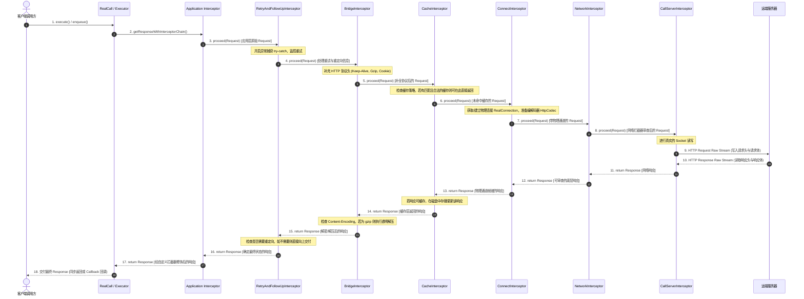
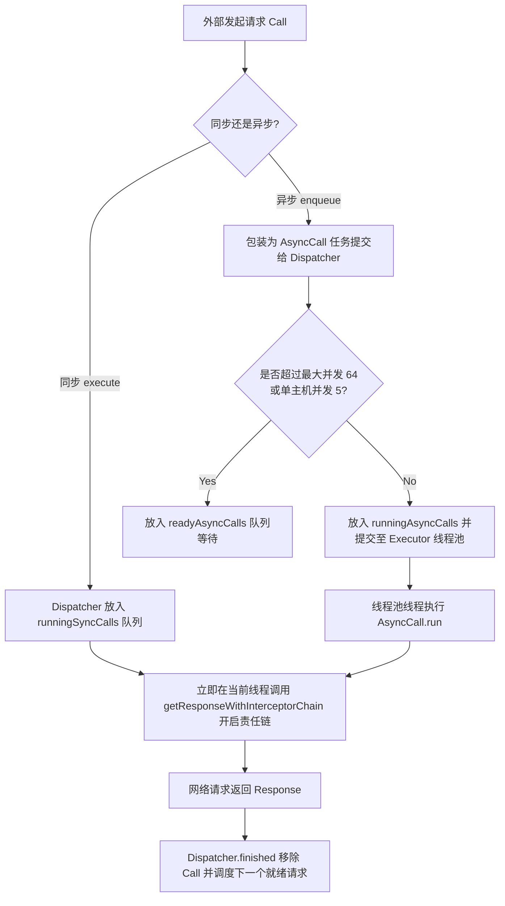
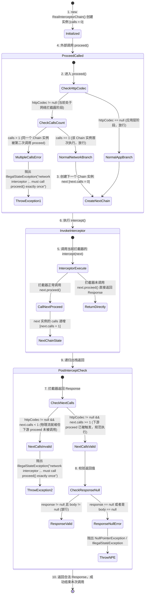

# 5.3.1.1.2 责任链模式

在 Android 网络请求的演进史中，OkHttp 凭借其卓越的性能与极致优雅的架构设计，成为了事实上无可替代的行业标准。而支撑这一庞大且复杂的网络库能够保持极高扩展性与清晰边界的核心，正是其精妙绝伦的**责任链模式（Chain of Responsibility Pattern）**。

本篇文档将深入剖析 OkHttp 责任链模式的底层实现，探讨其如何通过洋葱模型（Onion Model）将一个网络请求拆解为数个高度内聚的切面（AOP），并对五大核心拦截器的微观源码推演、调度器（Dispatcher）与责任链的协作、应用拦截器与网络拦截器的物理本质差异、`RealInterceptorChain.proceed(Request)` 的递归驱动逻辑、防御性校验机制（`calls` 计数器）、异常回滚重试收口机制以及企业级自定义拦截器的 AOP 落地工程实践进行全方位的解构。

---

## 1. 责任链模式在 OkHttp 中的设计哲学与 AOP 解耦

### 1.1 经典责任链 vs OkHttp 变体责任链

在 GoF 的《设计模式》中，**经典责任链模式**的定义是：避免请求发送者与接收者耦合在一起，让多个对象都有可能接收请求，将这些对象连接成一条链，并且沿着这条链传递请求，直到有对象处理它为止。
*   **经典责任链的特点**：请求是单向流动的，通常在链条的某一个节点被处理并截断（即某个节点处理了请求后直接返回，后面的节点不再参与）。
*   **OkHttp 责任链 the 变体**：OkHttp 并没有采用经典责任链的单向截断模式，而是将其演进为一种**双向的“洋葱模型”**。请求（Request）顺次向下传递，由外向内穿透每一层拦截器，直至最核心的 `CallServerInterceptor` 进行网络 I/O。随后，响应（Response）又由内向外，以相反的顺序再次经过所有拦截器进行加工，最终返回给调用方。

### 1.2 面向过程式网络请求的痛点

在传统的网络请求框架中，通常采用面向过程的结构。一个网络请求的完整生命周期大致包含以下步骤：
1.  **参数拼装与请求构造**：处理 URL、Headers，如果是 POST 请求则需要序列化 Request Body。
2.  **重试与重定向**：在遇到网络抖动或 HTTP 3xx 状态码时，通过循环或递归逻辑发起新的请求。
3.  **协议适配（Bridge）**：补充 Host, Content-Length, Keep-Alive, Accept-Encoding 等协议头，将应用层请求转换成符合规范的 HTTP 请求。
4.  **缓存拦截**：判断是否可以直接从本地读取缓存，或者判断缓存是否过期，生成条件请求（Conditional Request）。
5.  **物理连接（Connect）**：寻找或建立 Socket 连接，进行 TCP 三次握手和 TLS 安全握手。
6.  **网络 I/O（CallServer）**：向网络流写入 Request 报文，并等待读取 Response 报文。

如果采用传统的面向过程写法，将所有阶段紧密耦合在同一个主流程中，会导致以下致命问题：
*   **极高的代码耦合度**：如果需要增加一个新的通用功能（例如：统计网络耗时、动态添加 Token、Mock 响应数据、拦截网络包进行解密等），不得不直接修改底层网络传输的核心逻辑，极易引入不稳定因素。
*   **状态管理混乱**：重试、重定向逻辑与底层的 Socket 读写逻辑混杂在一起。一旦 Socket 发生异常，很难优雅地将逻辑回溯到最外层的重试模块。
*   **不符合开闭原则（OCP）**：外部无法在不改动内部源码的情况下，对网络请求的执行流进行干预。

### 1.3 洋葱模型（AOP）如何实现完美解耦与高内聚

OkHttp 的拦截器责任链机制本质上是一种**面向切面编程（AOP, Aspect-Oriented Programming）**的完美实践。它将复杂的网络请求流水线切割成了一个个独立的“切面”（拦截器），每一个拦截器只负责一个极端内聚的单一职责：

*   `RetryAndFollowUpInterceptor` 只关注**重试与重定向**，它不用关心连接是如何建立的，也不关心缓存如何处理。
*   `BridgeInterceptor` 只关注**应用层协议与网络传输协议的适配**（如 Cookie 注入、User-Agent 补全、Gzip 压缩/解压），不干预传输细节。
*   `CacheInterceptor` 只关注**缓存策略的落地**，将响应存入磁盘，或者在有合适缓存时拦截下行流量直接返回。
*   `ConnectInterceptor` 只关注**物理连接的获取**，为下游的数据传输备好连接（RealConnection）与流对象（HttpCodec）。
*   `CallServerInterceptor` 只关注**最底层的网络 I/O 读写**，这是洋葱模型的最核心（物理层），负责通过 Socket 发送和接收最原始的字节流。

通过这一层又一层的洋葱结构，开发者可以非常轻松地自定义拦截器，插入到这个流水线中的特定位置（如客户端层级的 `interceptors`，或网络层级的 `networkInterceptors`），在不改动任何核心网络读写代码的前提下，实现极其强大的 AOP 监控、安全认证与协议改造。

---

## 2. 洋葱模型（Onion Model）执行时序与数据流转

### 2.1 请求下行流转与响应逆向上行

当一个网络请求发起时，它在责任链中的生命周期可以划分为两个相反的阶段：
1.  **Request 下行（由外向内）**：
    *   应用发起的原始请求（Request）作为参数传入。
    *   每层拦截器都会在调用 `chain.proceed(request)` 之前拦截它。
    *   在下行阶段，拦截器可以对 Request 进行**篡改或修饰**。例如，`BridgeInterceptor` 会在此时将你的 `Request` 包装上 `User-Agent`、`Cookie` 等头部字段。
2.  **Response 上行（由内向外）**：
    *   当最底层的 `CallServerInterceptor` 完成物理 I/O，得到来自远端服务器的 `Response` 后，递归调用链开始逐层返回。
    *   在上行阶段，拦截器会在 `chain.proceed(request)` 返回之后拦截此 `Response`，并对它进行**加工、包装或缓存**。例如，`BridgeInterceptor` 发现响应头有 `Content-Encoding: gzip` 时，会在上行阶段将 `ResponseBody` 包装为 `GzipSource` 进行透明解压。

### 2.2 责任链执行时序图

以下是 OkHttp 洋葱模型在正常执行网络请求时的时序图，展示了请求从发起、到各个拦截器下行加工、触达最底层物理发送、再到响应逆向上行加工的完整生命周期：



### 2.3 异常自下而上回滚与重试捕获机制

网络环境充满不确定性，连接超时、DNS 解析失败、TCP 握手重置、读写超时等物理异常经常发生。在 OkHttp 的责任链中，底层的 `ConnectInterceptor` 或 `CallServerInterceptor` 会抛出 `IOException`。

由于整个调用链是基于**方法递归**的，调用栈（Call Stack）天然地为异常回滚提供了基础。当底层抛出 `IOException` 时，如果中间的拦截器（如 `NetworkInterceptor`、`CacheInterceptor`、`BridgeInterceptor`）没有进行显式的 `try-catch` 拦截，该异常会顺着调用栈**自下而上层层向外抛出**。

最关键的地方在于 `RetryAndFollowUpInterceptor`。它是在非常靠前的位置被添加的，它的拦截逻辑内部被一个庞大的 `while(true)` 循环和 `try-catch` 块包裹。

#### 异常回滚与重试判断流程图：

```mermaid
graph TD
    A[CallServer / ConnectInterceptor 发生物理网络异常] -->|抛出 IOException / RouteException| B(异常沿递归调用栈自下而上回滚)
    B --> C[NetworkInterceptor 透传异常]
    C --> D[ConnectInterceptor 透传异常]
    D --> E[CacheInterceptor 透传异常]
    E --> F[BridgeInterceptor 透传异常]
    F --> G[RetryAndFollowUpInterceptor 捕获捕获 IOException/RouteException]
    G --> H{调用 recover() 方法判断是否满足重试条件?}
    H -->|No: 不允许重试| I[继续向上抛出 IOException 至 AppInterceptor 并最终崩溃/回调 onFailure]
    H -->|Yes: 满足重试条件| J[选择下一个可用路由 Route]
    J --> K[销毁当前失败连接的 StreamAllocation/Exchange]
    K --> L[重建一个新的 RealInterceptorChain 实例]
    L --> M[调用 proceed() 重新发起责任链流转]
    M --> F
```

通过这一回滚机制，OkHttp 将最复杂的错误恢复（Error Recovery）逻辑收口在 `RetryAndFollowUpInterceptor` 中，使得底层的物理传输模块不需要关心“如何重试”，只需要在发生异常时直接 `throw IOException` 即可，这极大地简化了底层传输模块的实现。

---

## 3. 责任链调度前的奏鸣曲：调度器（Dispatcher）与责任链的协作

在深入分析责任链的初始化之前，必须明确责任链在 OkHttp 整体多线程架构中所处的位置。责任链并不是孤立运行的，它的入口直接受到分发调度器（`Dispatcher`）的控制。



### 3.1 同步请求（RealCall.execute）的运行链路
当应用层调用 `call.execute()` 时，流程立即进入 `RealCall`：
1. 调用 `client.dispatcher().executed(this)`，将当前 `RealCall` 实例登记在 `Dispatcher` 的 `runningSyncCalls` 队列中。登记的目的是为了能够支持全局查询当前正在运行的请求、或者进行统一的取消（cancel）操作。
2. 立即在当前发起请求的线程中调用 `getResponseWithInterceptorChain()`。这意味着同步请求的责任链执行是阻塞在当前调用线程的，会直接触发 Socket 读写。
3. 执行完毕后，在 `finally` 块中调用 `client.dispatcher().finished(this)`，将该请求从队列中移除。

### 3.2 异步请求（RealCall.enqueue）的运行链路
当调用 `call.enqueue(callback)` 时：
1. `RealCall` 将请求包装成一个 `AsyncCall` 实例。`AsyncCall` 继承自 `NamedRunnable`（本质是一个实现了 `Runnable` 接口的类）。
2. 调用 `client.dispatcher().enqueue(asyncCall)` 提交给调度器。
3. `Dispatcher` 内部会进行流量控制校验：
   * 当前正在运行的异步请求数 `runningAsyncCalls.size()` 是否小于最大并发限制（默认 `maxRequests = 64`）。
   * 该请求指向的主机（Host）当前并发数是否小于单主机限制（默认 `maxRequestsPerHost = 5`）。
4. 如果满足条件，将其存入 `runningAsyncCalls`，并立即提交给 OkHttp 的内部线程池（`ExecutorService`）执行。如果不满足条件，则将其放入 `readyAsyncCalls` 等待队列中挂起。
5. 线程池分配空闲线程执行该 `AsyncCall` 的 `run()` 方法。其内部逻辑会调用 `getResponseWithInterceptorChain()` 并触发责任链。
6. 责任链返回 `Response` 或抛出 `IOException` 后，`AsyncCall` 会通过 `Callback` 进行回调（`onResponse` 或 `onFailure`），最后触发 `dispatcher.finished(asyncCall)`。调度器会从 `readyAsyncCalls` 中取出积压的请求，重新提升并投入线程池中执行。

这种多线程控制与并发数限制，完美保护了客户端在弱网或大量并发时，不会因为瞬间开启过多 Socket 连接而导致 OOM（内存溢出）或网线带宽被撑爆，是责任链安全运行的重要保障。

---

## 4. 责任链初始化与拦截器全局排布精细解构

每一个 OkHttp 请求都是由 `RealCall` 承载的。在同步执行 `execute()` 或异步执行 `enqueue()` 时，其内部的核心终点都是 `RealCall.getResponseWithInterceptorChain()` 方法。

### 4.1 核心源码解读：RealCall.getResponseWithInterceptorChain()

让我们逐行分析这个至关重要的方法（以经典 Java 版本的实现为例）：

```java
Response getResponseWithInterceptorChain() throws IOException {
  // 1. 创建一个拦截器列表，用于存放所有的拦截器实例
  List<Interceptor> interceptors = new ArrayList<>();
  
  // 2. 首先添加用户自定义的全局“应用拦截器”（Application Interceptors）
  // 这类拦截器总是处于调用链的最外层，能最先拿到 Request，最后拿到 Response
  interceptors.addAll(client.interceptors());
  
  // 3. 添加重试与重定向拦截器，负责请求的错误恢复与重定向跳转
  interceptors.add(new RetryAndFollowUpInterceptor(client));
  
  // 4. 添加桥接拦截器，负责把用户的应用层 Request 转化为符合 HTTP 协议的网络 Request
  // 并在响应回来时，将网络层的 Response 转换回应用层可读取的 Response（如解压 Gzip）
  interceptors.add(new BridgeInterceptor(client.cookieJar()));
  
  // 5. 添加缓存拦截器，根据 HTTP 缓存控制协议从磁盘读取缓存或将新响应写入缓存
  interceptors.add(new CacheInterceptor(client.internalCache()));
  
  // 6. 添加连接拦截器，负责获取物理 Socket 连接，并为下一步的数据传输做好准备
  interceptors.add(new ConnectInterceptor(client));
  
  // 7. 如果不是 WebSocket 连接，则添加用户自定义的“网络拦截器”（Network Interceptors）
  // 此时物理 TCP 连接已经建立完毕，这里可以审查物理层发出的最真实 Request 和接收的 Response
  if (!forWebSocket) {
    interceptors.addAll(client.networkInterceptors());
  }
  
  // 8. 添加负责最底层网络传输的拦截器，真正把字节数据写入物理 Socket 流
  interceptors.add(new CallServerInterceptor(forWebSocket));

  // 9. 初始化责任链的核心驱动者：RealInterceptorChain
  // 初始的 index 传入 0，表示从列表中的第 1 个拦截器（用户定义的应用拦截器）开始执行
  Interceptor.Chain chain = new RealInterceptorChain(
      interceptors, null, null, null, 0, originalRequest, this, eventListener,
      client.connectTimeoutMillis(), client.readTimeoutMillis(), client.writeTimeoutMillis());

  try {
    // 10. 启动责任链，获取最终响应
    Response response = chain.proceed(originalRequest);
    
    // 11. 如果在执行过程中 Call 被取消了，则关闭响应并抛出异常
    if (transmitter.isCanceled()) {
      closeQuietly(response);
      throw new IOException("Canceled");
    }
    return response;
  } catch (IOException e) {
    // 12. 捕获未处理的异常，传递给 transmitter 记录失败状态并抛出
    throw transmitter.noMoreExchanges(e);
  }
}
```

### 4.2 拦截器排布顺序的精妙合理性

上述拦截器的排布顺序是经过极为周密的设计的，绝不可颠倒，因为每个拦截器的输入和输出都构成了上下游的严密因果关系：

1.  **Application Interceptors（自定义应用拦截器）在最外层**：
    *   **原因**：它们最靠近用户的业务逻辑。无论发生多少次重试、重定向，或者是否命中了本地缓存，应用拦截器**只会被调用一次**。
    *   **特权**：它们可以通过不调用 `chain.proceed()` 拦截请求来直接 Mock 一个假数据返回；或者通过多次调用 `chain.proceed()` 来实现应用级的重试逻辑。
2.  **RetryAndFollowUpInterceptor 紧随其后**：
    *   **原因**：它必须位于缓存和连接拦截器的上方，这样在进行重试（如切换 IP、重定向）时，重新执行 `proceed()` 才能触发后续的桥接、缓存、连接等一整套全新链路。
3.  **BridgeInterceptor 承上启下**：
    *   **原因**：它负责将业务 Request 包装为合法的网络 Request（补全 Headers），必须在缓存和建立连接之前运行，因为缓存匹配以及底层的 TCP 握手都强烈依赖于合法的 HTTP 协议头部（比如 `Host` 头对多虚拟主机的 TCP 建立至关重要）。
4.  **CacheInterceptor 在连接之前**：
    *   **原因**：如果本地缓存可以直接使用，请求就不应该建立 TCP 连接。把 CacheInterceptor 放在 ConnectInterceptor 之前，可以在“命中缓存”时直接截断请求，避免昂贵的 TCP 握手和 TLS 握手，从而大幅节约系统资源与请求耗时。
5.  **ConnectInterceptor 在网络拦截器之前**：
    *   **原因**：物理连接必须在 NetworkInterceptor 运行之前就已经准备好，这样 NetworkInterceptor 才能通过 `chain.connection()` 访问到当前使用的物理连接（如当前连接的 IP、端口、TLS 证书信息）。
6.  **Network Interceptors（自定义网络拦截器）在极深处**：
    *   **原因**：它们是用于网络调试、抓包的绝佳切面。由于它们处于 `ConnectInterceptor` 之后、`CallServerInterceptor` 之前，它们可以看到物理网线上流过的最真实报文（例如，Gzip 压缩后的二进制数据、自动填充的 Cookie 等）。如果发生重定向，网络拦截器会因为多次网络往返而被触发多次。
7.  **CallServerInterceptor 处于链条终点**：
    *   **原因**：它只负责向网络 Socket 中写入字节流并读取结果，不具备向下游传递的能力（它不会再调用 `chain.proceed()`，而是直接生成响应并返回）。

---

## 5. 【深度专栏】OkHttp 五大内置拦截器职责与源码级微观推演

为了彻底搞透这套责任链中数据的加工流程，我们需要进入每个内置拦截器的内部，推演其核心源码的行为。

### 5.1 RetryAndFollowUpInterceptor 源码与逻辑推演

`RetryAndFollowUpInterceptor` 的核心职责是负责错误恢复与请求的重定向。
在上行阶段，它通过一个 `while(true)` 环路在底层拦截器发生物理网络异常时捕获异常并调用 `recover()` 方法。如果该方法断定该异常在物理层是可以挽救的（例如：当前解析出该域名有 3 个 IP，尝试第 1 个 IP 握手超时，但第 2、3 个 IP 依然是备选路由），它就会继续发起下一轮责任链迭代。

此外，在上行阶段，它负责审查下层返回的 `Response`。如果检测到状态码是 3xx（如 301, 302, 307 等），它会解析出 `Location` 头部，调用 `buildFollowUpRequest()` 方法重建一个新的 `Request`，并重新发起责任链调用，完成自动重定向。

### 5.2 BridgeInterceptor 源码与逻辑推演

`BridgeInterceptor` 承担了“应用层对象与 HTTP 网络标准协议报文”之间的翻译官角色。
*   **Request 下行时**：
    它在原始 Request 中补充大量缺失的 HTTP 标准头部：
    ```java
    // 补全 Host
    if (userRequest.header("Host") == null) {
      requestBuilder.header("Host", hostHeader(userRequest.url(), false));
    }
    // 补全 Connection: Keep-Alive
    if (userRequest.header("Connection") == null) {
      requestBuilder.header("Connection", "Keep-Alive");
    }
    // 透明支持 Gzip 压缩
    boolean transparentGzip = false;
    if (userRequest.header("Accept-Encoding") == null && userRequest.header("Range") == null) {
      transparentGzip = true;
      requestBuilder.header("Accept-Encoding", "gzip");
    }
    // 注入 Cookie
    List<Cookie> cookies = cookieJar.loadForRequest(userRequest.url());
    if (!cookies.isEmpty()) {
      requestBuilder.header("Cookie", cookieHeader(cookies));
    }
    ```
*   **Response 上行时**：
    如果下行阶段采用了透明的 Gzip 压缩，并且服务器响应头确实返回了 `Content-Encoding: gzip`：
    它会主动剥离 `Content-Encoding` 和 `Content-Length` 头部（因为解压后的长度与声明不符），并利用 `GzipSource` 对响应体进行无感解压：
    ```java
    if (transparentGzip && "gzip".equalsIgnoreCase(networkResponse.header("Content-Encoding"))) {
      if (HttpHeaders.hasBody(networkResponse)) {
        ResponseBody responseBody = networkResponse.body();
        GzipSource gzipSource = new GzipSource(responseBody.source());
        Headers strippedHeaders = networkResponse.headers().newBuilder()
            .removeAll("Content-Encoding")
            .removeAll("Content-Length")
            .build();
        responseBuilder.headers(strippedHeaders);
        responseBuilder.body(new RealResponseBody(contentType, -1L, Okio.buffer(gzipSource)));
      }
    }
    ```

### 5.3 CacheInterceptor 源码与逻辑推演

`CacheInterceptor` 是 HTTP 缓存控制协议（RFC 7234）的完整落地者。
它的内部工作原理是：
1.  **策略计算**：利用 `CacheStrategy.Factory` 计算出当前请求的缓存策略。判定结果包含两个核心属性：`networkRequest`（如果需要走网络）和 `cacheResponse`（如果可以读本地缓存）。
2.  **完全拦截（直接返回）**：如果计算结果为 `networkRequest == null`，说明不需要发起网络，直接读取本地磁盘中的缓存数据并返回，彻底截断下游的责任链执行。
3.  **网络验证**：如果需要发起网络（`networkRequest != null`），它依然会将本地的缓存响应作为 candidate 传给下游。如果下游拦截器最终网络返回了 `304 Not Modified`（说明服务器端的数据并未发生变更），`CacheInterceptor` 会提取缓存并合并更新头信息，最后向外返回缓存的 `Response`：
    ```java
    if (cacheResponse != null) {
      if (networkResponse.code() == HTTP_NOT_MODIFIED) {
        Response response = cacheResponse.newBuilder()
            .headers(combine(cacheResponse.headers(), networkResponse.headers()))
            .sentRequestAtMillis(networkResponse.sentRequestAtMillis())
            .receivedResponseAtMillis(networkResponse.receivedResponseAtMillis())
            .cacheResponse(stripBody(cacheResponse))
            .networkResponse(stripBody(networkResponse))
            .build();
        networkResponse.body().close();
        // 更新本地磁盘中的缓存
        cache.update(cacheResponse, response);
        return response;
      }
    }
    ```
4.  **写入缓存**：如果是正常的 `200 OK` 响应且该请求支持缓存，它会使用一个拦截包装的 `Sink` 在上行阶段把服务器的响应数据流边读取边写入到磁盘缓存中。

### 5.4 ConnectInterceptor 源码与连接复用机制推演

`ConnectInterceptor` 的核心代码极其简短，但却大有乾坤：
```java
@Override public Response intercept(Chain chain) throws IOException {
  RealInterceptorChain realChain = (RealInterceptorChain) chain;
  Request request = realChain.request();
  Transmitter transmitter = realChain.transmitter();

  // 我们需要一个物理通道 HttpCodec (负责将 Request 编码为 HTTP 字符流并解码 Response)
  boolean doExtensiveHealthChecks = !request.method().equals("GET");
  HttpCodec httpCodec = transmitter.newStream(client, chain, doExtensiveHealthChecks);
  RealConnection connection = transmitter.connection();

  // 将寻寻找寻找到的物理连接 connection 和数据流编解码器 httpCodec 注入到下一步的 chain 中
  return realChain.proceed(request, transmitter, httpCodec, connection);
}
```
在这背后，`transmitter.newStream()` 驱动了 OkHttp 最具含金量的**连接池复用机制**。为了寻找到可复用的连接，它会按如下优先级匹配：
1.  **自身复用**：首先匹配当前正在工作的物理连接（如果当前 StreamAllocation 中已经持有一个连接且没有关闭，并且可以开启新的 Stream，如 HTTP/2 多路复用）。
2.  **连接池 Address 严格匹配**：从 `ConnectionPool` 中检索。它会逐一对比池中物理连接的 `Address`（即主机 Host、端口 Port、协议、DNS 解析器、Socket 工厂、代理等全部网络配置）。如果完全吻合，则说明这台服务器的 Socket 可以复用，直接返回。
3.  **多 IP 路由合并复用（Route Pooling）**：在 HTTP/2 多路复用场景下，如果两个域名的 IP 地址相同（例如同一个 CDN 节点的多个域名），且服务器证书（SSL Certificate）中包含了目标域名，OkHttp 可以在不重新发起 TLS 握手的前提下，合并复用同一个物理 Socket，这极大提升了网络性能。
4.  **创建全新物理连接**：若前几步全部落空，说明必须开启物理 Socket 建连。它会通过 `Socket.connect()` 发起 TCP 三次握手，如果是 HTTPS，还会在此 Socket 上套接 `SSLSocket` 并触发 SSL 握手。建连成功后，该物理连接（`RealConnection`）会被存入连接池中供下一次请求复用。

### 5.5 CallServerInterceptor 源码与 HTTP/2 流读写推演

`CallServerInterceptor` 是整条责任链的核心“洋葱心”。它是最后一个被触发的内置拦截器，并且**在其内部绝对不会调用 `chain.proceed()`**。
它的工作是与底层的网络流进行最真实的物理字节传输。
*   **对于 HTTP/1.1**，它是直接对物理 Socket 的 `BufferedSink` 和 `BufferedSource` 进行明文的字符协议读写。
*   **对于 HTTP/2**，物理 Socket 实际上已经被一个 `Http2Connection` 接管。`CallServerInterceptor` 持有的 `HttpCodec`（在其子类 `Http2Codec` 中实现）是在当前的 HTTP/2 共享物理连接上打开的一个逻辑通道——`Http2Stream`。

它的工作时序为：
1.  **写入 Header**：
    调用 `httpCodec.writeRequestHeaders(request)`，将请求行（如 `GET /index.html HTTP/2`）和请求头写入网络发送缓存中。
2.  **写入 Body**：
    如果请求含有 Body（如 POST 提交 JSON），且请求头包含 `Expect: 100-continue`，它会首先向底层发送 Header 并等待服务器返回一个临时的 `100 Continue` 确认。收到后，再继续调用 `request.body().writeTo(bufferedRequestBody)` 将内容写入物理网络流。
3.  **读取 Header**：
    调用 `httpCodec.readResponseHeaders(false)` 阻塞等待，直到读取到服务器返回的响应状态行与响应头，并构建 `Response.Builder`。
4.  **构建 Response**：
    利用上面的 Builder 组装出 `Response`，并调用 `httpCodec.openResponseBody(response)` 打开响应体的数据输入流（`ResponseBody.source()`），然后直接向外层返回该 `Response`，开始逆向上行流程。

---

## 6. 应用拦截器（App Interceptor）与网络拦截器（Network Interceptor）的物理本质差异

在开发中，我们可以通过 `client.interceptors()` 和 `client.networkInterceptors()` 分别添加自定义的应用拦截器和网络拦截器。虽然它们使用的接口完全一样，但在运行时却有着天差地别的物理行为：

| 对比维度 | 应用拦截器 (Application Interceptor) | 网络拦截器 (Network Interceptor) |
| :--- | :--- | :--- |
| **在洋葱模型中的位置** | 最外层 (第 1 关) | 物理连接层之后，CallServer 之前 |
| **触发次数** | **永远只有 1 次** (无论发生多少次物理重试/重定向) | **0 次或多次** (不发网络则为 0，重试/重定向几次触发几次) |
| **本地缓存命中的影响** | 依然触发，并能拿到从 Cache 返回的 Response | **完全不触发** (因为 CacheInterceptor 直接截断返回，不再流向下游) |
| **物理连接 (Connection) 的可访问性** | 无法获取连接。调用 `chain.connection()` 必返回 `null` | 可以获取物理连接。调用 `chain.connection()` 能拿到当前 Socket 对应的物理 IP、TLS 证书等 |
| **对 Request 的修改权限** | 拥有绝对自由。可以随意篡改 Host、URL 协议甚至直接 Mock 数据 | 受到严格限制。必须保持 Host 和 Port 不变，否则触发 `proceed` 防御性抛异常 |
| **数据原始性** | 看到的是业务层组装的 Request，和解压/解密后的 Response | 看到的是网线上流过的最真实 Request/Response (如 Gzip 压缩后、Cookie 注入后的字节流) |

### 6.1 缓存命中的物理本质推演
如果一个请求的响应头部带有 `Cache-Control: max-age=3600`，第二次发起相同请求时：
由于 `CacheInterceptor` 位于应用拦截器下方、网络拦截器上方，`CacheInterceptor` 直接命中缓存。
此时，`CacheInterceptor` 会直接返回一个 `Response` 给上游的应用拦截器，不再调用 `chain.proceed(next)`。由于链条在缓存层发生截断，处于更下层的网络拦截器和 `CallServerInterceptor` 根本不会被触发。
这也证明了：**应用拦截器可以感知到所有的请求结果（即使是缓存），而网络拦截器只能感知到真实的网线物理数据往返。**

---

## 7. 核心驱动力：RealInterceptorChain.proceed(Request) 的底层机理

OkHttp 责任链模式能够像流水线一样高效运转，其全部动力都来自于 `RealInterceptorChain` 的 `proceed` 方法。这是一个极其精练且充满设计智慧的代码块。

### 7.1 关键 Java 源码展现

以下是 `RealInterceptorChain.proceed()` 的核心源码实现：

```java
public Response proceed(Request request, StreamAllocation streamAllocation, HttpCodec httpCodec,
    RealConnection connection) throws IOException {
  // 1. 索引边界校验：如果 index 越界，直接抛出 AssertionError
  if (index >= interceptors.size()) throw new AssertionError();

  // 2. 核心状态校验：当前 Chain 实例的 calls 被调用次数自增
  calls++;

  // 3. 校验点 A：如果在已经建立了物理流（httpCodec != null）的前提下，
  // 传入的 Request 请求的目标 Host 与当前连接（RealConnection）的主机不匹配，
  // 说明某个网络拦截器非法篡改了 URL 且企图复用该物理连接。这直接违背了 HTTP 协议规范，抛出异常。
  if (this.httpCodec != null && !this.connection.supportsUrl(request.url())) {
    throw new IllegalStateException("network interceptor " + interceptors.get(index - 1)
        + " must retain the same host and port");
  }

  // 4. 校验点 B：如果在已经建立了物理流（httpCodec != null）的前提下，
  // 当前拦截器调用 proceed() 的次数 calls 已经大于 1，说明它在多次触发物理网络读取，抛出崩溃。
  if (this.httpCodec != null && calls > 1) {
    throw new IllegalStateException("network interceptor " + interceptors.get(index - 1)
        + " must call proceed() exactly once");
  }

  // 5. 状态推进的核心：构建下一个 RealInterceptorChain 实例
  // 关键参数：index + 1。即将当前指针向后移动一位，并传入本次调用的 Request 以及当前的物理组件。
  RealInterceptorChain next = new RealInterceptorChain(interceptors, streamAllocation, httpCodec,
      connection, index + 1, request, call, eventListener, connectTimeout, readTimeout,
      writeTimeout);
  
  // 6. 获取当前的拦截器，并将“下一个责任链实例 next”作为参数传递给当前拦截器的 intercept 方法
  Interceptor interceptor = interceptors.get(index);
  Response response = interceptor.intercept(next);

  // 7. 校验点 C：当拦截器执行返回后，如果在已经建立物理流（httpCodec != null）的前提下，
  // 发现刚刚创建的 next 实例的 calls 计数器依然小于 1（即 calls == 0），
  // 说明当前的 interceptor 方法在返回 Response 时，其内部竟然没有调用 next.proceed()！
  // 这在网络拦截器阶段是绝对禁止的（因为物理层流必须流转到底层以释放或使用连接），抛出崩溃。
  if (httpCodec != null && index + 1 < interceptors.size() && next.calls < 1) {
    throw new IllegalStateException("network interceptor " + interceptor
        + " must call proceed() exactly once");
  }

  // 8. 响应规范性检查：拦截器绝不能返回一个 null，或者 Response Body 为 null
  if (response == null) {
    throw new NullPointerException("interceptor " + interceptor + " returned null");
  }

  if (response.body() == null) {
    throw new IllegalStateException("interceptor " + interceptor + " returned a response with no body");
  }

  // 9. 将当前得到的响应层层向上回传
  return response;
}
```

### 7.2 递归向下机制：为什么 proceed 内部必须实例化一个新的 RealInterceptorChain？

在 `proceed()` 方法第 5 步中，我们可以看到：
```java
RealInterceptorChain next = new RealInterceptorChain(..., index + 1, request, ...);
```
这一步是理解 OkHttp 递归模型的金钥匙。这里有三个最根本的架构和设计考量：

1.  **状态不可变性（Immutability）与多线程安全**：
    在 OkHttp 中，每个拦截器通过 `interceptor.intercept(Chain)` 拿到的 `Chain` 对象，代表着**责任链执行到某一步时的“快照”**。
    这个快照中封装了这一步所处的拦截器索引 `index`、当前步骤修改后的 `Request` 实例以及该阶段关联的 Socket 连接。
    如果允许多个拦截器或者在并发请求中共享同一个 `Chain` 实例并通过指针移动来工作，那么在多线程并发执行（或某个拦截器内部开子线程发起请求）时，很容易出现竞态条件（Race Condition），导致 `index` 状态错乱。
    通过将 `RealInterceptorChain` 设计为不可变对象，每次推进都产生一个新的 `Chain`，从根本上消除了多线程环境下的副作用。
2.  **状态隔离与局部 Request 追踪**：
    每个拦截器在调用 `next.proceed(request)` 时，都可以传入一个**被篡改过的全新 Request 实例**。
    这个被篡改的 Request 仅在它下游的链条中生效。当下游拦截器执行完毕，递归出栈返回到当前拦截器时，当前拦截器所持有的上游 Request 依旧保持原样。这种通过局部变量和方法栈来实现的隔离，使得 Request 的溯源与加工逻辑极其清晰。
3.  **为递归回溯（洋葱模型）提供天然的栈帧上下文**：
    递归调用本质上是利用了 Java 虚拟机（JVM）的**方法调用栈**。
    每一层拦截器的 `intercept(next)` 都是一个独立的栈帧（Stack Frame）。在这些栈帧中，局部变量 `next`、当前的 `request` 都会在栈中被妥善保管。
    当最底层的 `CallServerInterceptor` 返回结果后，JVM 栈开始自动出栈。各个拦截器可以极其自然地在 `proceed()` 返回的那一行代码之后，访问自己栈帧中的局部变量，对返回的 `Response` 进行逆向加工。这比手动维护一个双向链表或维护两个复杂的 Request/Response 队列要优雅得多。

### 7.3 索引 `index + 1` 的工作机理

OkHttp 责任链在结构上没有使用任何显式的循环（如 `for` 或 `while`）来向前遍历拦截器。它的推进完全是由**递归方法调用**驱动的。

*   **初始状态**：`getResponseWithInterceptorChain()` 中，创建 `RealInterceptorChain` 时的 `index = 0`，代表从拦截器列表的头节点开始。
*   **推进过程**：
    1. 调用 `chain.proceed(request)`。
    2. 发现 `index = 0`，于是取出 `interceptors.get(0)`（通常是用户定义的 Application Interceptor）。
    3. 构建 `next`（其 `index` 参数为 `0 + 1 = 1`）。
    4. 调用 `interceptor.intercept(next)`。
    5. 当前拦截器内部执行其业务逻辑，最后调用 `next.proceed(request)`。
    6. 此时 `next` 作为新的 `Chain` 实例，它的 `index` 是 1。它再次进入 `proceed()` 方法，取出 `interceptors.get(1)`，创建 `index = 2` 的 `next` 实例并调用。
    7. 依此类推，如同多米诺骨牌一样，`index` 逐次累加，调用链层层深入。
*   **回溯终点**：
    物理层拦截器 `CallServerInterceptor` 是列表的最后一个元素。它的内部**不调用** `proceed()`，而是直接通过底层 Socket 读取网络数据，生成 `Response` 并直接 `return response`。
    一旦最内层返回，递归调用链开始层层出栈，控制权依次交回前序拦截器的 `intercept()` 方法中 `chain.proceed()` 之后的代码行，直至回到最外层。

---

## 8. 防御性校验状态机：calls 计数器严密防范机制

在 `RealInterceptorChain.proceed()` 中，有一组非常硬核的防御性代码，专门用来检测编写不规范的拦截器。这组校验逻辑主要是通过对 `calls` 计数器以及 `next.calls` 的状态判断来完成的。

### 8.1 为什么要校验“必须且只能调用 proceed() 一次”？

在开发自定义拦截器时，开发者极易写出以下不符合规范的代码：
1.  **多次调用 `proceed()`**：
    ```java
    // 错误示例：拦截器内部调用了两次 proceed
    Response r1 = chain.proceed(request);
    Response r2 = chain.proceed(request); 
    ```
    对于应用层拦截器，多次调用虽然可以工作（例如实现应用层面的重试），但如果这发生在**网络拦截器（Network Interceptors）**阶段，则是灾难性的。因为在网络拦截器阶段，物理 Socket 连接与数据流（HttpCodec）已经初始化完毕并与当前 `Chain` 绑定。如果同一个 `Chain` 实例向物理网络流写入两次数据，会导致底层 Socket 数据帧错乱、多线程连接状态崩溃甚至引发物理连接泄露。
2.  **漏调用 `proceed()`**：
    ```java
    // 错误示例：拦截器直接生成了响应，却忘记调用下游拦截器，且未关闭或合理处理底层物理流
    return new Response.Builder()....build();
    ```
    在网络拦截器阶段，如果某个拦截器没有调用 `proceed()` 直接截断并返回，意味着底层的 `CallServerInterceptor` 不会被执行。但是上游的 `ConnectInterceptor` 已经为这次请求打开了 Socket 连接并分配了网络资源。如果链条在此处断裂，而底层流没有被正确调用和关闭，会导致**网络连接泄露**。

为了杜绝这两种极高风险的工程隐患，OkHttp 设计了极为严苛的运行时防御性校验。

### 8.2 calls 校验逻辑状态机深度解构

我们结合 `proceed` 源码中的校验点，画出 `calls` 校验的底层状态机流转图。



### 8.3 源码校验段逐行解释

我们针对上面状态机中的三个抛出崩溃的检查点进行实证分析：

#### 校验点 A & B：防范同一个拦截器多次调用 `proceed()`
```java
// calls 成员变量在每次 proceed 被调用时自增
calls++;

if (this.httpCodec != null && calls > 1) {
  throw new IllegalStateException("network interceptor " + interceptors.get(index - 1)
      + " must call proceed() exactly once");
}
```
*   **机理**：注意这里的 `this.connection` 和 `this.httpCodec` 都是当前 `RealInterceptorChain` 实例的数个属性，由上游 `ConnectInterceptor` 在创建下游链时注入。
*   如果 `httpCodec != null`，说明目前调用链已经流转到了 `ConnectInterceptor` 之后（即属于网络层拦截器阶段）。
*   当一个自定义的网络拦截器在其 `intercept` 方法中，错误地写了两次 `chain.proceed(request)` 时，第二次调用 `proceed` 会作用在**同一个 `chain` 实例**上。
*   由于是同一个实例，第二次进入时，`calls` 变为了 2。由于 `httpCodec != null && calls > 1` 条件成立，OkHttp 立刻判定该拦截器违法，直接抛出 `IllegalStateException` 崩溃，阻止后续破坏 Socket 的行为。

#### 校验点 C：防范拦截器没有调用 `proceed()`
```java
RealInterceptorChain next = new RealInterceptorChain(..., index + 1, request, ...);
Interceptor interceptor = interceptors.get(index);
Response response = interceptor.intercept(next); // 调用当前拦截器，传入 next

if (httpCodec != null && index + 1 < interceptors.size() && next.calls < 1) {
  throw new IllegalStateException("network interceptor " + interceptor
      + " must call proceed() exactly once");
}
```
*   **机理**：当 `interceptor.intercept(next)` 正常执行完毕并返回 `response` 时，控制权回到了当前 `Chain` 实例的 `proceed` 代码中。
*   OkHttp 会去检查它刚刚为下一步创建的 `next` 实例的 `calls` 属性。
*   如果 `next.calls < 1`（即为 0），这铁证如山地说明：当前拦截器在它自己的 `intercept()` 方法里直接 `return` 了一个响应，而**根本没有调用 `next.proceed()`**。
*   在 `httpCodec != null` 的物理传输阶段，这种“直接截断且不通知下游”的行为会导致底层物理通道无法被正常初始化或关闭，引发内存和 Socket 连接泄露。因此，OkHttp 会直接崩溃并抛出 `"network interceptor " + interceptor + " must call proceed() exactly once"`。

---

## 9. 责任链下的异常回滚与重试收口机制

如第 2 节所述，在责任链下行直至最底层的过程中，一旦 Socket 读写出错（例如超时或连接被对端重置），`CallServerInterceptor` 会抛出 `IOException`。

接下来，我们将结合源码，重点解读异常是如何在责任链中回滚并最终被 `RetryAndFollowUpInterceptor` 优雅重试的。

### 9.1 递归栈的天然回滚

由于每一个 `proceed` 本质上都是一次方法压栈，当 `CallServerInterceptor` 的 `intercept()` 方法执行出错时：

```java
// CallServerInterceptor 内部向底层流写入数据
try {
  httpCodec.writeRequestHeaders(request);
  ...
} catch (IOException e) {
  // 物理 I/O 报错，直接抛出，此时该方法栈帧销毁，异常向上抛出
  throw e; 
}
```

由于物理 I/O 没有在下游被 `try-catch` 消灭，这个异常会逆向穿透 `NetworkInterceptor`、`ConnectInterceptor`、`CacheInterceptor`、`BridgeInterceptor`，它们各自 the `proceed()` 方法都会因底层抛出异常而被迫中断，将异常继续向上抛，直至回到 `RetryAndFollowUpInterceptor`。

### 9.2 RetryAndFollowUpInterceptor 的捕获与重试收口

我们来看 `RetryAndFollowUpInterceptor` 内部最核心的工作环路（化繁为简后的核心结构）：

```java
@Override public Response intercept(Chain chain) throws IOException {
  Request request = chain.request();
  RealInterceptorChain realChain = (RealInterceptorChain) chain;
  Transmitter transmitter = realChain.transmitter();

  int followUpCount = 0;
  Response priorResponse = null;
  
  // 开启无限循环，用于重试与重定向的收口
  while (true) {
    // 1. 为本次尝试分配或寻找物理连接资源
    transmitter.prepareToConnect(request);

    Response response;
    boolean success = false;
    try {
      // 2. 核心步骤：触发下游责任链的执行
      response = realChain.proceed(request, transmitter, null, null);
      success = true;
    } catch (RouteException e) {
      // 3. 捕获路由异常（例如：尝试连接某个 IP 失败，但该域名还有其他候选 IP）
      // 判断是否可以通过其他路由进行恢复
      if (!recover(e.getLastConnectException(), transmitter, false, request)) {
        throw e.getFirstConnectException(); // 无法恢复，直接抛出，彻底放弃
      }
      // 允许恢复，继续循环，发起下一次尝试
      continue;
    } catch (IOException e) {
      // 4. 捕获普通的网络 I/O 异常（例如：连接超时、Socket 读写中途断开）
      // 判断是否满足重试条件（例如：配置了 retryOnConnectionFailure 且异常非致命）
      boolean requestSendStarted = !(e instanceof ConnectionShutdownException);
      if (!recover(e, transmitter, requestSendStarted, request)) {
        throw e; // 无法恢复，抛出给上层应用拦截器
      }
      // 允许恢复，继续循环，重新发起 proceed()
      continue;
    } finally {
      // 如果没有执行成功且未触发 continue 重试，则释放连接资源
      if (!success) {
        transmitter.exchangeMessageFailed();
      }
    }

    // 5. 责任链能成功返回 Response，说明本次网络往返成功。接下来处理 HTTP 3xx 重定向
    Request followUp = buildFollowUpRequest(response, route);
    if (followUp == null) {
      // 不需要重定向，这正是我们需要的最终响应，直接向上层返回
      return response;
    }

    // 处理重定向次数限制，防范死循环重定向（最大限制为 20 次）
    if (++followUpCount > MAX_FOLLOW_UPS) {
      throw new ProtocolException("Too many follow-up requests: " + followUpCount);
    }

    // 更新 Request 为重定向请求，重新发起循环
    request = followUp;
    priorResponse = response;
  }
}
```

### 9.3 异常恢复机制的关键判定：recover()

在上面代码的第 3、4 步中，`recover()` 方法是决定“责任链是否回滚并重新出发”的生死判官。它的核心判断逻辑如下：

1.  **用户是否配置了允许重试**：
    如果 `client.retryOnConnectionFailure()` 返回 `false`，则直接拒绝重试。
2.  **请求体（Request Body）是否是一次性的**：
    如果请求体实现了 `UnrepeatableRequestBody` 接口，或者其设计上不允许重复发送，则拒绝重试。
3.  **异常类型是否是致命的**：
    *   `ProtocolException`（协议错误，如 HTTP 格式崩溃）不支持重试。
    *   `InterruptedIOException` (中断异常，通常是物理读写超时 `SocketTimeoutException`) 除特殊情况外，通常需要进一步判定。
    *   `SSLHandshakeException`（TLS 握手失败，通常是证书校验失败或不支持的加密套件）不支持重试，因为这属于配置错误，重试多少次都会失败。
    *   `SSLPeerUnverifiedException`（证书未验证）不支持重试。
4.  **是否还有可用的物理路由（Route）**：
    如果当前域名解析出的 IP 列表已经尝试完毕，且没有其他可替代的代理服务器或 IP 路由，则拒绝重试。

只有在上述全部条件均允许的情况下，`recover()` 才会返回 `true`，此时 `RetryAndFollowUpInterceptor` 会进入下一轮 `while(true)` 循环，在**方法栈的顶部**重新调用 `proceed()`。此时，责任链会重新向下流转，去寻找可用的物理连接，完成故障自动恢复。

---

## 10. 【工程实战】生产级自定义拦截器设计案例

为了更加真实地体现 AOP 架构的设计魅力，我们下面给出三个在 Android 商业项目中被大量使用的生产级自定义拦截器实现。

### 10.1 生产级 Token 自动刷新拦截器（并发安全）

在实际业务中，当 Token 过期时，服务器会返回 `401 Unauthorized`。此时，我们需要在拦截器中同步发起刷新 Token 请求，并在拿到新 Token 后自动重建原来的 Request 重新发送。

由于多个业务接口通常并发发起，为了防止多线程并发请求时多次发起 Token 刷新调用，必须在拦截器内部引入同步锁与双重检查机制。

```java
import java.io.IOException;
import okhttp3.Interceptor;
import okhttp3.Request;
import okhttp3.Response;

public class TokenAutoRefreshInterceptor implements Interceptor {
    private static final Object lock = new Object();
    
    @Override
    public Response intercept(Chain chain) throws IOException {
        Request request = chain.request();
        String localToken = getLocalToken();
        
        // 1. 下行阶段：往请求头中注入当前的 Token
        Request.Builder builder = request.newBuilder();
        if (localToken != null) {
            builder.header("Authorization", "Bearer " + localToken);
        }
        
        Response response = chain.proceed(builder.build());
        
        // 2. 上行阶段：监控响应码是否为 401
        if (response.code() == 401) {
            synchronized (lock) {
                // 双重校验：判定在获取到锁之前，是否有别的线程已经完成了 Token 刷新
                String currentToken = getLocalToken();
                if (localToken != null && localToken.equals(currentToken)) {
                    // 执行同步网络刷新，获取新 Token 
                    String newToken = syncRefreshToken();
                    if (newToken != null) {
                        saveLocalToken(newToken);
                    }
                }
            }
            
            // 3. 用最新的 Token 重新构建请求发起二次重试
            String freshToken = getLocalToken();
            if (freshToken != null) {
                // !!! CRITICAL: 在重新 proceed 前，务必关闭上一次失败的 response 流，防止流泄漏
                response.close();
                
                Request retryRequest = request.newBuilder()
                        .header("Authorization", "Bearer " + freshToken)
                        .build();
                // 再次调用 chain.proceed，递归推进
                return chain.proceed(retryRequest);
            }
        }
        
        return response;
    }

    private String getLocalToken() {
        // 自定义逻辑：从 SharedPreferences 或内存中获取 Token
        return "current_saved_token";
    }

    private void saveLocalToken(String token) {
        // 自定义逻辑：保存 Token
    }

    private String syncRefreshToken() {
        // 使用原生的同步 Http 客户端（或另一个独立的 OkHttpClient 实例）
        // 发起同步请求获取 Token，以防与当前 client 调度冲突造成死锁
        return "new_refreshed_token";
    }
}
```

### 10.2 企业级加签与数据防篡改拦截器

为了防止网络层数据被篡改，企业级 API 通常需要对 Request 的 Query 参数或 Request Body 进行排序、加盐，并进行哈希计算（如 SHA-256）生成 `Sign` 放在请求头。

```java
import java.io.IOException;
import java.util.TreeMap;
import okhttp3.FormBody;
import okhttp3.HttpUrl;
import okhttp3.Interceptor;
import okhttp3.Request;
import okhttp3.Response;
import okio.Buffer;

public class ApiSignInterceptor implements Interceptor {
    private static final String APP_SECRET = "MY_SECURITY_SALT_KEY";

    @Override
    public Response intercept(Chain chain) throws IOException {
        Request originalRequest = chain.request();
        
        // 1. 获取所有的 URL Query 参数并放入 TreeMap 排序
        HttpUrl url = originalRequest.url();
        TreeMap<String, String> paramsMap = new TreeMap<>();
        for (int i = 0; i < url.querySize(); i++) {
            paramsMap.put(url.queryParameterName(i), url.queryParameterValue(i));
        }

        // 2. 如果是 POST Form 表单，还需要提取 Form Body 中的参数进行混合排序
        if ("POST".equalsIgnoreCase(originalRequest.method()) && originalRequest.body() instanceof FormBody) {
            FormBody formBody = (FormBody) originalRequest.body();
            for (int i = 0; i < formBody.size(); i++) {
                paramsMap.put(formBody.name(i), formBody.value(i));
            }
        }

        // 3. 拼装签名原字符串
        StringBuilder sb = new StringBuilder();
        for (TreeMap.Entry<String, String> entry : paramsMap.entrySet()) {
            sb.append(entry.getKey()).append("=").append(entry.getValue()).append("&");
        }
        sb.append("appSecret=").append(APP_SECRET);

        // 4. 计算哈希签名值
        String signature = calculateSHA256(sb.toString());

        // 5. 重新生成 Request 并注入 Sign 头
        Request signedRequest = originalRequest.newBuilder()
                .header("X-Signature", signature)
                .header("X-Timestamp", String.valueOf(System.currentTimeMillis()))
                .build();

        return chain.proceed(signedRequest);
    }

    private String calculateSHA256(String data) {
        // 哈希签名算法实现
        return "sha256_result_hex";
    }
}
```

### 10.3 生产级弱网模拟与丢包拦截器
在 Android 开发和测试阶段，我们需要模拟真实物理环境下的网络恶化情况（如延迟、丢包等）。通过自定义拦截器，我们可以用最简短的代码，在应用层无缝模拟出弱网切面。

```java
import java.io.IOException;
import java.io.InterruptedIOException;
import okhttp3.Interceptor;
import okhttp3.Response;

public class WeakNetworkSimulatorInterceptor implements Interceptor {
    private final long delayMillis; // 模拟网络延迟耗时 (单位: 毫秒)
    private final double lossRate;  // 模拟丢包率 (范围: 0.0 ~ 1.0)

    public WeakNetworkSimulatorInterceptor(long delayMillis, double lossRate) {
        this.delayMillis = delayMillis;
        this.lossRate = lossRate;
    }

    @Override
    public Response intercept(Chain chain) throws IOException {
        // 1. 下行延迟模拟：在请求发往底层前进行阻塞
        if (delayMillis > 0) {
            try {
                Thread.sleep(delayMillis);
            } catch (InterruptedException e) {
                Thread.currentThread().interrupt();
                throw new InterruptedIOException("Simulated query delay was interrupted");
            }
        }

        // 2. 丢包率模拟：概率性直接抛出 IOException 阻断责任链向下游流转
        if (lossRate > 0.0 && Math.random() < lossRate) {
            throw new IOException("Simulated network packet drop (weak network environment)");
        }

        // 3. 执行真实的链条流转
        Response response = chain.proceed(chain.request());

        // 4. 上行延迟模拟：在响应数据交付给上层前进行阻塞，模拟下载延迟
        if (delayMillis > 0) {
            try {
                Thread.sleep(delayMillis);
            } catch (InterruptedException e) {
                Thread.currentThread().interrupt();
                throw new InterruptedIOException("Simulated response delay was interrupted");
            }
        }

        return response;
    }
}
```

---

## 11. 方案权衡、并发安全与工程实践误区

### 11.1 频繁创建 Chain 对象的 GC 考量与性能取舍

在 OkHttp 的责任链中，每一个网络请求的完整下行与上行，都会伴随着 5~10 个 `RealInterceptorChain` 实例的创建。如果有大量的并发请求，这是否会导致 Android 虚拟机（ART）频繁触发垃圾回收（GC），从而影响应用流畅度？

*   **OkHttp 的权衡**：
    *   `RealInterceptorChain` 是一个极度轻量级的“壳对象”。它内部仅持有对拦截器列表、连接资源、Request/Response 的引用，并不占用大量的物理内存（没有大数组，没有复杂的数据结构）。
    *   在现代 Android 虚拟机（ART）中，分代垃圾回收（Generational GC）对生命周期极短的“临时小对象”的分配和回收进行了深度优化（如 TLAB 线程本地分配缓冲区技术）。这类对象的创建与销毁开销微乎其微。
    *   相比于它带来的**极佳的可读性、状态隔离、线程安全与防错防御机制**，频繁创建 Chain 对象所带来的一点点 GC 开销是完全可以忽略不计的。这正是软件工程中“架构清晰度与扩展性优先于微弱的内存性能优化”的经典范例。

### 11.2 不可变性（Immutability）与并发安全

在拦截器中，如果我们需要对 Request 增加一些公共 Header，正确的做法是：

```java
// 正确做法：基于原有的 Request 创建一个新的 Builder，生成新实例传入 proceed
@Override public Response intercept(Chain chain) throws IOException {
  Request originalRequest = chain.request();
  Request newRequest = originalRequest.newBuilder()
      .header("Authorization", "Bearer token_string")
      .build();
  return chain.proceed(newRequest);
}
```

**绝对禁止**直接在拦截器内部去修改公共的可变成员变量，或者企图去篡改已经返回的 `Response` 的内部成员。
*   **原因**：OkHttp 的 `Request` 和 `Response` 被设计为**完全不可变的对象（Immutable Objects）**。它们的所有属性在构造时就已确定。
*   这种设计确保了它们在多线程的并发调度（如多个异步请求并发执行）中是天然线程安全的。如果需要修改，必须通过其对应的 `Builder` 复制并产生一个全新实例。

### 11.3 拦截器开发中的高频误区

在实际工程实践中，开发者在使用拦截器时，最容易陷入以下三个误区：

1.  **应用拦截器（App Interceptor）与网络拦截器（Network Interceptor）混淆**：
    *   *现象*：企图在网络拦截器中修改 Request 的 URL 到另一个 Host，却不更新底层物理连接，导致抛出 `IllegalStateException` 崩溃（即触犯了 `proceed` 中的校验点 A）。
    *   *准则*：如果需要动态修改请求的主机名、改写 URL、添加通用的加解密参数，**必须**放在外层的 **Application Interceptor** 中进行。网络拦截器通常仅用于物理层数据的监控、网线数据的最终校对、或者底层的网络分析。
2.  **在非网络拦截器阶段做物理流假设**：
    *   *现象*：在应用拦截器中尝试调用 `chain.connection()` 来获取当前物理连接的 IP。
    *   *准则*：在应用拦截器阶段，`ConnectInterceptor` 还没有执行，物理 Socket 连接根本没有创建。此时调用 `chain.connection()` 只会返回 `null`。只有在网络拦截器阶段，物理连接建立完毕后，才能通过该方法获取到真实物理对象。
3.  **在拦截器中多次消费 Response Body**：
    *   *现象*：在日志拦截器中，为了打印响应内容，直接调用了 `response.body().string()`，导致后续业务层读取数据时抛出 `IllegalStateException: closed` 崩溃。
    *   *准则*：HTTP 响应体的数据流（BufferedSource）是**一次性消费的**。一旦调用了 `string()`，底层的输入流就会被关闭以释放 Socket。如果需要在拦截器中打印或提取响应体，必须通过 `response.peekBody()` 或者克隆数据源（如克隆 `ResponseBody.source()` 的 Buffer）来安全读取，绝不能直接消费原始流。

---

## 12. 总结

OkHttp 责任链模式的成功，在于它将极其复杂的网络协议栈、物理连接状态、重试重定向机制以及缓存体系，抽象成了一个极其简洁的递归函数模型。

1.  **洋葱模型**让请求的下行和响应的上行在同一个拦截器方法内闭环，实现了优雅的双向 AOP。
2.  `RealInterceptorChain` 通过**递归实例化**，确保了在多线程环境下的不可变性与高度的状态隔离。
3.  **`calls` 计数器校验**以极简的代码，在运行时筑起了坚不可摧的安全防线，严密防范了不规范拦截器导致的连接与数据流泄漏。
4.  底层的**异常层层上抛**与最上游 `RetryAndFollowUpInterceptor` 的**统一收口重试**，使整个网络框架具备了极强的容灾弹性，同时保持了核心模块的极致纯粹。

深入理解 OkHttp 责任链的底层原理，不仅能帮助我们在 Android 开发中写出更加健壮、高效的自定义拦截器，更能为我们设计复杂的企业级软件架构提供极具价值的设计模式范本。
