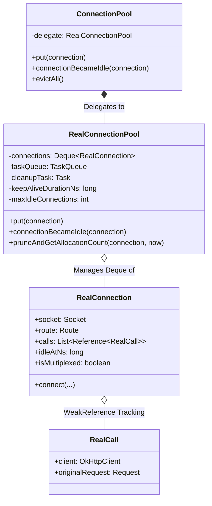
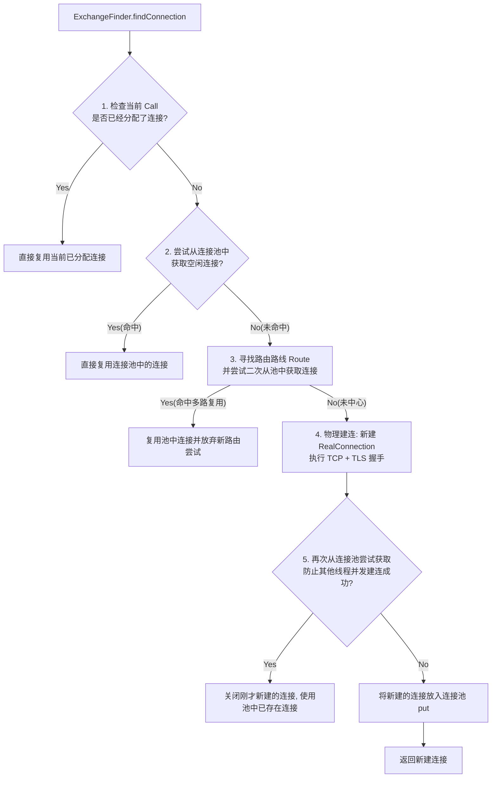

# 5.3.1.1.3 连接池

在移动互联网时代，网络请求的响应速度与稳定性直接关系到应用的用户体验和留存率。作为一个高性能的 HTTP 客户端，OkHttp 的核心优势之一便在于它对网络连接的极致复用。而实现这种复用机制的幕后核心组件就是 **连接池（ConnectionPool / RealConnectionPool）**。

连接池不仅仅是简单地将物理 Socket 连接存入一个队列以供下次使用，它还融合了现代网络协议的演进思想（HTTP/1.1 Keep-Alive 与 HTTP/2 多路复用）、复杂的并发线程安全控制、极致的省电休眠退避算法，以及借鉴 Java 虚拟机垃圾回收（GC）思想的**弱引用计数跟踪防泄漏算法**。

本篇文章将从协议底层物理本质、连接池的核心数据结构、弱引用计数防泄漏机制、守护线程清理算法等多个维度，对 OkHttp 的连接池机制进行源码级的深度剖析。

---

## 1. 连接池的设计背景与网络层物理本质

在探讨 OkHttp 连接池的内部实现之前，我们必须先理清一个根本性的问题：**为什么网络库需要连接池？** 新建一个网络连接的物理代价究竟有多大？

### 1.1 TCP 三次握手与慢启动的高额延时开销

在标准的 TCP/IP 协议族中，每一次网络数据传输都必须先建立 TCP 连接。TCP 的建立依赖于经典的“三次握手”过程：

```
Client                      Server
  |                           |
  | ------ SYN (Seq=x) -----> |  (1.0 RTT)
  |                           |
  | <-- SYN-ACK (Seq=y,...) - |  (2.0 RTT)
  |                           |
  | ------ ACK (Seq=x+1) ---->|  (3.0 RTT)
  v                           v
```

1. **第一次往返（RTT = 1.0）**：客户端向服务器发送同步报文段（SYN）。
2. **第二次往返（RTT = 2.0）**：服务器收到 SYN 后，向客户端发送同步收到确认报文段（SYN-ACK）。
3. **第三次往返（RTT = 3.0）**：客户端收到 SYN-ACK 后，向服务器发送确认报文段（ACK）。此时对客户端而言，连接已建立；当服务器收到该 ACK 后，服务器端的连接也宣告建立。

在不考虑数据负载的情况下，仅仅为了建立一个安全的传输通道，就需要消耗至少 **1.5 个往返时间（RTT, Round Trip Time）**。

在移动网络环境下，RTT 的损耗更为突出。移动网络受制于无线空口延时（UE 设备到基站）、基站与核心网网关的转发延迟、骨干网传输延迟以及物理距离造成的传播延时。在 3G/4G/5G 网络下，典型的空口 RTT 在 50ms 到 150ms 之间；在信号微弱、基站频繁切换或网络拥堵的场景下，单个 RTT 甚至会飙升至 300ms 以上。这意味着，仅仅是 TCP 握手阶段，就可能吃掉 150ms ~ 500ms 的时间。

此外，TCP 协议为了避免瞬间涌入的大量数据冲垮整个网络，设计了**慢启动（Slow Start）**机制。新建立的连接在初始阶段其拥塞窗口（CWND）非常小（通常为 10 个 MSS，即最大报文段大小，约为 14.6 KB）。这意味着在连接刚建立的前几个往返内，即使带宽充裕，客户端也无法满载发送数据。只有随着数据的不断往返，拥塞窗口在收到确认报文（ACK）后呈指数级增长后，连接的吞吐率才能达到理论上限。

而在移动端，网络链路往往不稳定，容易发生突发性丢包。一旦在慢启动阶段发生丢包，TCP 的**拥塞避免（Congestion Avoidance）**和**快速恢复（Fast Recovery）**算法就会被触发，导致拥塞窗口瞬间减半，发送速率断崖式下跌，且需要漫长的重新爬坡过程。因此，频繁地创建和销毁 TCP 连接，相当于让网络通信始终处于低效的慢启动爬坡阶段。

### 1.2 TLS 握手在移动网络下的延迟放大

现代网络应用几乎全部普及了 HTTPS 协议，这使得网络连接除了 TCP 握手之外，还必须经历 TLS 握手。

- **TLS 1.2 握手流程**：在完成 TCP 三次握手后，还需要进行额外的 2 个 RTT。客户端与服务器需要协商加密套件、传递数字证书以验证身份、利用非对称加密算法（如 RSA 或 ECDHE）交换密钥材料，最后通过 Change Cipher Spec 确认对称加密通道开启。这意味着总延迟达到了 **3.5 个 RTT**（TCP 1.5 RTT + TLS 2.0 RTT）。
- **TLS 1.3 握手流程**：TLS 1.3 进行了重大改进，将密钥交换与握手协商合并，使其在 TCP 握手之后仅需要 **1 个 RTT** 即可完成安全通道的建立（总计 2.5 个 RTT）。此外，TLS 1.3 还支持 **0-RTT（Resumption）** 模式，允许客户端在恢复之前的会话时，在发送 TLS 握手的第一帧中就附带加密的应用数据。

即使引入了 TLS 1.3，在最乐观的情况下（不考虑 0-RTT），客户端首次连接服务器也必须消耗至少 2.5 个 RTT。在移动网络信号差、丢包率高的环境下（例如电梯、高铁、基站频繁切换的隧道中），只要有一个握手包丢失，TCP 的重传机制就会被触发，导致总握手时间呈指数级上升，动辄耗时 1~2 秒。这种高额的初始化延时是移动端网络体验的致命杀手。

### 1.3 Keep-Alive 机制与 HTTP/2 多路复用的物理本质

为了规避频繁创建和销毁连接带来的开销，网络协议栈引入了连接复用的思想。

#### 1.3.1 HTTP/1.1 中的 Keep-Alive 机制
在 HTTP/1.1 中，默认启用了 `Connection: keep-alive` 属性。其核心原理是：当一次 HTTP 请求-响应事务完成后，底层的 TCP 连接并不会立即关闭（调用 `close()`），而是保持在 `ESTABLISHED` 状态一段时间（超时时间由服务器控制，例如 Keep-Alive Timeout）。在这段空闲时间内，如果应用层又有新的 HTTP 请求发往相同的 Host，网络库可以直接复用这个已经建好并完成 TLS 握手的 TCP 通道，从而直接跳过握手和慢启动阶段，实现“即开即用”。

然而，HTTP/1.1 的 Keep-Alive 存在致命的缺陷——**串行复用与队头阻塞（Head-of-Line Blocking, HOL）**。在同一个 TCP 连接上，HTTP 请求必须遵循“发送请求 -> 等待响应 -> 收到响应 -> 发送下一个请求”的严格顺序。如果前一个请求因为服务器处理缓慢或者文件体积极大而阻塞在半路上，后续的所有请求都必须在队列中等待。即使客户端建立了多个并发 TCP 连接（浏览器通常限制对同一个域名的最大并发连接数为 6 个），在高并发场景下依然会遭遇连接饥饿与排队延迟。

#### 1.3.2 HTTP/2 中的多路复用（Multiplexing）
HTTP/2 彻底改变了底层的传输逻辑，它引入了**二进制分帧层（Binary Framing Layer）**。HTTP/2 将所有传输的信息分割为更小的帧（Frame），并为每个帧标记一个流 ID（Stream ID）。

在 HTTP/2 中，客户端和服务器之间只需要建立**一个**物理 TCP 连接。在这个唯一的物理通道上，可以同时开启成百上千个虚拟流（Stream）。这些流的帧可以交错、乱序地发送，最后接收端根据 Stream ID 进行组装。这就是多路复用：

```
HTTP/1.1 Keep-Alive (串行复用，易阻塞):
[TCP Conn] === [Req A] ---> [Wait Resp A] ---> [Req B] ---> [Wait Resp B]

HTTP/2 Multiplexing (并行复用，无阻塞):
[TCP Conn] === [Frame A1] -> [Frame B1] -> [Frame A2] -> [Frame B2] -> [Frame C1]
```

由于所有请求并行在一个物理连接上，HTTP/2 彻底解决了应用层的队头阻塞问题。

### 1.4 连接池在 OkHttp 中的定位与必要性

既然 HTTP/2 只需要一个 TCP 连接即可支撑并发，那为什么 OkHttp 还需要复杂的连接池管理呢？

主要原因在于以下几点：
1. **多协议兼容性**：在现阶段的互联网环境中，仍然有大量的服务器只支持 HTTP/1.1，或者不支持 HTTPS。对于 HTTP/1.1，必须通过连接池网络维护多个 TCP 连接来支持并发请求。
2. **多域名访问**：一个复杂的 App 往往需要与数十个不同的域名（如 API 网关、三方登录、图片 CDN、广告系统、日志上报等）进行通信。由于不同域名的物理 IP 地址或 TLS 证书不同，它们无法共享同一个 TCP 连接。连接池必须针对不同的路由（Route）建立独立的 TCP 连接，并对其进行统一的生命周期管理。
3. **容灾与性能备份**：在复杂的网络环境下，即使是同一个域名，由于网络抖动或运营商路由切换，单一的 HTTP/2 连接可能会发生阻塞。此时，网络库可能需要开辟备用的物理连接来确保请求的高可用。

因此，OkHttp 需要一个强大的连接池管理器，它能够同时管理 HTTP/1.1 的多条串行连接以及 HTTP/2 的单条并发连接，合理控制空闲连接的释放，防止物理套接字句柄和本地临时端口被无限制消耗，实现系统资源利用的最优化。

---

## 2. ConnectionPool 核心架构与源码级剖析

在 OkHttp 中，外部暴露的类是 `okhttp3.ConnectionPool`，但它实际上只是一个外壳类，所有的核心管理逻辑和数据结构都委托给了内部的隐藏类 `okhttp3.internal.connection.RealConnectionPool`。

### 2.1 核心组件关系图

在深入源码前，我们先建立连接池管理体系的物理拓扑模型：



### 2.2 数据结构：为什么是双端队列 `Deque<RealConnection>`？

在 `RealConnectionPool` 内部，物理连接被存储在一个双端队列中：

```kotlin
private val connections = ConcurrentLinkedDeque<RealConnection>() // 在某些较新版本中
// 或者在常规实现中，直接使用普通双端队列 Deque<RealConnection> (如 ArrayDeque)，并配合同步锁 synchronized 控制
```

为什么选择**双端队列（Deque）**作为核心容器？其设计考量如下：
1. **LIFO/FIFO 策略的混合支持**：
   - **连接的复用（重用）应当是 LIFO（后进先出）的**。最新被归还给连接池的空闲连接，其底层的 Socket 通道大概率最为活跃，网络中间设备（如 NAT 网关、防火墙）的超时阻断风险最低。因此，当发起新请求需要获取空闲连接时，应该优先从队列的尾部（或者头部，视插入策略而定）获取最近使用的连接。
   - **连接的清理应当是 FIFO（先进先出）的**。在队列中呆得最久的连接，往往是最可能超时的“老旧”连接。守护线程在执行扫描清理时，从另一端开始遍历，能够以最快的速度锁定并剔除过期的物理连接。
2. **高效的插入与删除**：双端队列在首尾进行添加（`addFirst`、`addLast`）和移除（`removeFirst`、`removeLast`）操作的时间复杂度为 $O(1)$，非常契合连接池高频复用与剔除的运作模型。

### 2.3 并发线程安全控制与同步锁设计

网络请求通常是在多线程环境下并发发起的（在 Android 中可能是 RxJava 调度线程池、协程线程池，或者是 OkHttp 内部的 `Dispatcher` 线程池）。这就意味着，可能会有多个线程同时向连接池：
- **存入连接**（当请求完毕，连接变为空闲时）。
- **获取连接**（当请求发起，尝试寻找可用复用连接时）。
- **标记泄漏/断开连接**（当请求异常，或者连接不可用时）。
- 与此同时，后台的**清理守护线程**还在持续对该队列进行扫描和物理移除。

为了保证容器状态的强一致性，OkHttp 并没有依赖纯并发无锁容器，而是主要采用了 `synchronized(this)`（以 `RealConnectionPool` 实例为锁对象）的互斥锁设计。

#### 为什么不能单靠并发容器（如 `ConcurrentLinkedDeque`）？
因为在连接池的运作中，存在大量的 **“检查-执行”（Check-and-Act）** 复合操作。例如：
1. 检查当前连接池中的空闲连接数量是否大于 5。
2. 如果大于 5，找出空闲时间最长的连接。
3. 从队列中将其移除并关闭。

如果这些步骤不是原子化的，即使底层的 `ConcurrentLinkedDeque` 是线程安全的，在第 2 步 and 第 3 步之间，该连接也可能被另一个请求线程重新复用。这会导致清理线程错误地关闭了一个正在传输数据的活跃连接，引发灾难性的网络异常。

因此，OkHttp 采用同步锁将队列的查找、过滤、状态变更操作完全锁住：

```kotlin
// 伪代码：OkHttp 底层的同步锁模型
fun put(connection: RealConnection) {
  synchronized(this) {
    connections.add(connection)
    // 唤醒清理线程或向 TaskQueue 提交清理任务
    cleanupQueue.schedule(cleanupTask)
  }
}
```

加锁的粒度控制得极其精妙：**锁仅用于保护队列的内存状态与引用计数逻辑，而耗时的物理 Socket 关闭操作（`socket.close()`）必须在同步块之外执行。** 这样可以防止某一个 Socket 的关闭延迟（可能涉及 TCP 的 FIN 包确认与阻塞等待）拖慢其他线程获取或释放连接的响应速度。

---

## 3. Call 弱引用计数跟踪与连接泄漏判定（GC 思想的融合）

这是 OkHttp 连接池中最为精妙、最具有借鉴意义的核心设计：**防泄漏标记-清除算法**。

### 3.1 连接泄漏（Connection Leak）的物理危害

在 Android 开发中，我们经常会被告诫：**“使用 OkHttp 发起请求后，必须关闭 Response 或 ResponseBody，否则会导致连接泄漏。”**

什么是连接泄漏？当我们调用 `client.newCall(request).execute()` 拿到 `Response` 后，这个 `Response` 的底层关联着一个未关闭的输入流（`ResponseBody`）。如果开发者没有调用 `response.close()` 或 `response.body().close()`，底层的 `RealConnection` 就会一直认为：“当前还有一个请求流在占用我，我不是空闲的，不能归还给连接池，更不能被清理”。

如果这种情况频繁发生，底层的物理套接字将被一直占用，导致：
1. **Linux 文件描述符（FD）枯竭**：在 Android 系统中，单个进程持有的 FD 数量是有严格限制的（通常是 1024 或 2048 个）。一旦 FD 耗尽，应用将会抛出 `java.io.IOException: Too many open files`，随后崩溃。
2. **临时端口耗尽**：每一次 Socket 连接都需要占用客户端的一个随机临时端口。如果不释放，将没有可用端口去建立新请求。

### 3.2 弱引用计数跟踪的设计原理

为了解决开发者粗心大意导致未关闭 Response 的问题，OkHttp 引入了类似 JVM 垃圾回收（GC）探针的机制。

在 `RealConnection` 内部，维护着一个由弱引用组成的列表：

```kotlin
/** Current calls carried by this connection. */
val calls = mutableListOf<Reference<RealCall>>()
```

当一个 `RealCall` 尝试在这个连接上发起请求时，它会被作为一个弱引用加入到该列表中。

#### 3.2.1 为什么选择弱引用（`WeakReference`）？
如果使用强引用，比如 `List<RealCall>`，那么只要这个物理连接还在连接池中（存活 5 分钟），这个连接就会一直强引用 `RealCall`，而 `RealCall` 又强引用了 `OkHttpClient`、`Request` 甚至是调用它的 Activity/Fragment 上下文。这会导致极其严重的内存泄漏（Memory Leak）。

通过使用 `WeakReference<RealCall>`（更确切地说是 `Reference<RealCall>` 的子类，例如在 OkHttp 中自定义的 `CallReference`），当应用中的请求结束，且外部的所有变量（如 `Response`、`ResponseBody`）由于超出生命周期被销毁后，外界就没有任何强引用指向这个 `RealCall` 对象了。

在下一次 JVM 执行垃圾回收（GC）时，JVM 会自动判定这个 `RealCall` 是不可达的，并将其在堆内存中予以回收，此时包裹它的弱引用内部持有的对象就会自动被置为 `null`（即 `weakRef.get() == null`）。

#### 3.2.2 为什么不使用 `ReferenceQueue`（引用队列）？
在 Java 中，当弱引用持有的对象被 GC 回收后，JVM 会自动将该弱引用对象本身加入到与其关联的 `ReferenceQueue` 中。这是一种标准的检测弱引用回收的机制。但 OkHttp 并没有采用这种设计，而是采用了在清理任务中主动扫描 `calls` 列表并剪枝的方案。

其主要考量是：
1. **减少线程开销**：如果使用 `ReferenceQueue`，通常需要专门开启一个单独的后台监听线程，通过 `queue.remove()` 阻塞等待弱引用的入队，这会产生额外的线程调度开销。
2. **复用已有循环**：OkHttp 的连接池清理任务本来就需要定期运行扫描所有的空闲连接。在对每个连接进行评估时，顺便遍历其内部的 `calls` 列表进行一次 `reference.get() == null` 的检查，是开销极低的操作（因为每个连接上持有的 Call 数量通常极少，HTTP/1.1 最多为 1 个，即使 HTTP/2 并发流也通常在 100 以内）。通过将弱引用扫描融入现有的 `cleanup` 循环，OkHttp 避免了引入多余的监听线程，实现了架构的精简化。

### 3.3 拓扑模型：Call 引用状态演变

我们可以通过以下拓扑图，对比正常状态、GC 前后以及判定泄漏时的引用链状态：

#### 场景 A：正常使用中的连接（活跃状态）
```
[User Code] ----(强引用)----> [Response] ----(强引用)----> [RealCall]
                                                              ^
                                                           (弱引用)
                                                              |
[RealConnectionPool] -> [RealConnection] -> [calls List] -> [CallReference]
```

#### 场景 B：开发者遗漏关闭 Response，但变量作用域结束，触发 JVM GC
当执行方法结束，`Response` 的局部变量被销毁，强引用链断开。此时，虽然底层的物理连接未被正常解绑，但由于仅剩弱引用，JVM GC 会强制回收 `RealCall`。

```
[User Code] (局部变量销毁)
        x
[Response] (不可达，被GC) ----> [RealCall] (不可达，被GC，内存回收，变为 null)
                                                              ^
                                                         (弱引用断开)
                                                              |
[RealConnectionPool] -> [RealConnection] -> [calls List] -> [CallReference] (get() == null)
```

此时，`CallReference.get()` 将返回 `null`。OkHttp 后台的清理线程在扫描到这个连接时，通过识别 `null` 引用，便能推断出：“这个 `Call` 对象已经在内存中被回收了，但它在消失前并没有把连接归还给我。这就是发生了**连接泄漏**！”

### 3.4 泄漏自动剪枝算法：`pruneAndGetAllocationCount`

在 `RealConnectionPool` 中，专门有一个名为 `pruneAndGetAllocationCount` 的方法，用于检查某个连接的引用列表并修剪已经失效的弱引用，同时返回当前连接的实际活跃计数。

我们来看其核心源码实现（基于最新稳定版 Kotlin 实现改写）：

```kotlin
/**
 * 遍历连接持有的所有 Call 弱引用，移除已经被 GC 回收的弱引用。
 * 如果发现某个弱引用指向的 Call 已经为 null，说明该连接发生泄漏，输出警告日志并清除它。
 * 返回该连接当前的实际活跃 Call 计数。如果返回 0，代表该连接处于空闲状态，可以被清理。
 */
private fun pruneAndGetAllocationCount(connection: RealConnection, now: Long): Int {
  val references = connection.calls
  var i = 0
  while (i < references.size) {
    val reference = references[i]

    if (reference.get() != null) {
      // 1. 如果弱引用依然指向一个有效的 RealCall 对象，说明该 Call 仍在占用连接，继续检查下一个
      i++
    } else {
      // 2. 弱引用关联的对象已被置为 null！这代表 RealCall 被 GC 强制回收，但未正常关闭连接。
      val callReference = reference as CallReference
      // 拼装用于调试和定位泄露来源的堆栈警告信息
      val message = "A connection to ${connection.route().address.url} was leaked. " +
          "Did you forget to close a response body?"
      
      // 3. 将泄漏警告输出给平台日志（Android Logcat / Java Platform Logger）
      Platform.get().logCloseableLeak(message, callReference.callStackTrace)

      // 4. 将这个无用的 null 引用从列表中强行移除（剪枝）
      references.removeAt(i)
      
      // 标记该连接已经发生泄漏，不能再被新请求复用
      connection.noNewExchanges = true

      // 5. 如果所有的弱引用都被移除了，说明这个连接上已经没有活着的 Call 了，
      // 连接如果仅剩泄漏引用，则需要将其 idleAtNs 设为已发生泄漏的当前纳秒时间，
      // 从而让它在接下来的清理步骤中能被优先清除。
      if (references.isEmpty()) {
        connection.idleAtNs = now - keepAliveDurationNs
        return 0
      }
    }
  }

  // 返回存活的活跃 Call 的数量
  return references.size
}
```

#### 关键技术点解析：
1. **`callStackTrace` 追溯源头**：
   在 `CallReference` 中，持有了一个名为 `callStackTrace` 的堆栈跟踪对象。这是在 OkHttpClient 开启 `writeTimeout` 或启用特定检测时，通过 `Thread.currentThread().stackTrace` 抓取的。它记录了这个请求是在哪一行代码被创建的。当发生连接泄漏时，Logcat 会打印出该堆栈，开发者可以一眼看出是哪个类的哪行请求漏掉了 `close()`。
2. **`connection.noNewExchanges = true` 的屏蔽效应**：
   一旦检测 to 泄漏，连接的这面旗帜就会被立起来，这意味着即使这个连接底层的 Socket 暂时还连着，OkHttp 也绝对不允许任何新的请求再次路由到这个连接上。它被判处了“死刑”，只等清理线程将其物理关闭。
3. **`connection.idleAtNs = now - keepAliveDurationNs` 的设计用意**：
   如果修剪后发现引用列表彻底为空，说明该连接上全都是泄漏的死引用。OkHttp 会将该连接的“开始空闲时间”刻意向前拨动 `keepAliveDurationNs`（即 5 分钟）。这就相当于告诉清理线程：“这个连接已经空闲了超过 5 分钟了！” 从而促使清理算法在随后的评估中，立即将其作为最老的连接予以物理清除。

---

## 4. 防泄漏清理算法与守护线程（Cleanup Engine）源码剖析

检测到了泄漏，或者连接正常变为空闲后，连接池又是如何将它们物理关闭的呢？这就需要依靠连接池内部的 **守护线程清理机制**。

在较新版本的 OkHttp（如 4.x / 5.x）中，OkHttp 引入了自定义的轻量级任务队列机制 `TaskQueue` 与后台线程池，不再为每个连接池单独创建一个 `java.lang.Thread` 守护线程，而是向一个公共的并发线程池提交清理任务（`cleanupTask`）。其底层控制思想和动态退避算法本质是完全一致的。

### 4.1 清理引擎的驱动机制

清理任务是一个典型的**懒加载与自销毁**模型：
1. **懒加载启动**：当有新的物理连接被创建并放入连接池时（调用 `put()`），连接池会检查清理任务是否正在运行。如果没有运行，就会向后台线程池提交一个 `cleanupTask`。
2. **自销毁退出**：当清理任务运行时，它会不断循环扫描连接池。如果扫描结果显示“当前连接池已完全空空如也，没有任何连接”，清理任务就会停止继续提交自己，后台守护线程随之进入休眠或释放状态，以避免空转消耗 CPU 和 Android 系统的电量。

### 4.2 核心清理算法 `cleanup()` 源码逐行精读

`cleanup()` 方法是整个连接池最核心的“控制台”。它负责评估池内所有连接的状态，决定是执行清理，还是进行休眠，以及休眠多久。

我们来看其核心方法实现（以下为经过高度整理并辅以极详尽中文注释的核心源码）：

```kotlin
/**
 * 执行一次连接池的扫描与清理动作。
 * 
 * 返回一个 long 类型的值，具有以下物理含义：
 * - 0 : 刚刚清除了一个过期的连接，需要立即重新开始下一次扫描评估。
 * - > 0 : 当前不需要清理，但距离下一次最近的连接超时清理还需要等待对应的纳秒数。
 * - -1 : 连接池当前已没有任何物理连接，清理任务可以安全退出运行。
 */
fun cleanup(now: Long): Long {
  var activeConnectionCount = 0
  var idleConnectionCount = 0
  var longestIdleConnection: RealConnection? = null
  var longestIdleDurationNs = Long.MIN_VALUE

  synchronized(this) {
    // 1. 遍历连接池中的所有物理连接
    val i = connections.iterator()
    while (i.hasNext()) {
      val connection = i.next()

      // 2. 调用弱引用剪枝算法，获取该连接当前的实际活跃 Call 计数
      if (pruneAndGetAllocationCount(connection, now) > 0) {
        // 活跃连接数累加
        activeConnectionCount++
        continue
      }

      // 3. 运行到这里，说明该连接处于空闲状态（当前活跃计数为 0）
      idleConnectionCount++

      // 4. 计算该连接已经持续空闲了多久时间（当前纳秒时间 - 开始空闲时的纳秒时间）
      val idleDurationNs = now - connection.idleAtNs
      
      // 5. 记录并找出空闲持续时间最长（即 idleDurationNs 最大）的那个连接
      if (idleDurationNs > longestIdleDurationNs) {
        longestIdleDurationNs = idleDurationNs
        longestIdleConnection = connection
      }
    }

    // 6. 遍历结束，开始根据空闲状态和配置阈值，做出清理决策
    when {
      // 分支一：最长空闲时间超出了最长存活期（默认 5 分钟），或者空闲连接数超出了上限（默认 5 个）
      longestIdleDurationNs >= this.keepAliveDurationNs || idleConnectionCount > this.maxIdleConnections -> {
        // 从连接池双端队列中将这个最老的连接移除
        connections.remove(longestIdleConnection)
        // 退出同步块，准备在锁外物理关闭 Socket，防止阻塞加锁线程
      }

      // 分支二：池内存在空闲连接，但它们全都没有超时，且空闲总数没有超出限制
      idleConnectionCount > 0 -> {
        // 计算距离这个最久空闲的连接超时，还剩下多少纳秒时间
        // 例如：最长空闲了 3 分钟，上限是 5 分钟，则还需要等待 2 分钟后才能清理它
        return this.keepAliveDurationNs - longestIdleDurationNs
      }

      // 分支三：池内没有任何空闲连接，但存在活跃连接（正在传输数据的连接）
      activeConnectionCount > 0 -> {
        // 此时由于没有空闲连接可以清理，但是活跃连接随时可能变为空闲，
        // 而一个新的空闲连接最长可以存活 5 分钟。
        // 因此，我们最迟在 5 分钟之后必须重新回来检查一次。
        return this.keepAliveDurationNs
      }

      // 分支四：池内没有任何连接（连接池已完全排空）
      else -> {
        // 标记清理任务没有在运行，这样下次有新连接放入时会重新触发任务提交
        cleanupRunning = false
        // 返回 -1，告知后台调度引擎彻底退出清理任务
        return -1
      }
    }
  }

  // 7. 物理关闭 Socket 连接（在 synchronized 同步锁的外部执行）
  // 这样做是为了保证高并发请求线程在 put() 或 get() 时不被物理 IO 关闭的延时所阻塞
  closeQuietly(longestIdleConnection!!.socket())

  // 返回 0，提示调度器：刚才发生了解除并关闭连接的行为，连接池状态已变，需要立刻重新执行 cleanup 评估
  return 0
}
```

### 4.3 动态退避休眠算法执行流程图

上面的 `cleanup()` 方法通过精准的返回值设计，实现了一套巧妙的**状态机动态退避与休眠机制**。守护线程的整体回路如下流程图所示：

```mermaid
flowchart TD
    Start([开始执行清理任务]) --> Lock[获取锁 synchronized]
    Lock --> Scan[扫描连接池 Deque, 剪枝弱引用]
    Scan --> Decisions{分析扫描状态}
    
    Decisions -->|分支1: 有连接超时或超额| Evict[从池中移除该连接]
    Evict --> Unlock1[释放锁]
    Unlock1 --> CloseSocket[物理关闭 Socket 资源]
    CloseSocket --> Return0[返回 0: 立即再次进入下一次清理循环]
    Return0 --> Lock
    
    Decisions -->|分支2: 有空闲但未超时| CalcRemaining[计算该最久空闲连接距离超时的纳秒数: keepAlive - idleDuration]
    CalcRemaining --> Unlock2[释放锁]
    Unlock2 --> WaitNs[让线程释放 CPU 挂起 wait(remainingNanos)]
    WaitNs --> WokeUp[等待期满或被主动唤醒]
    WokeUp --> Lock
    
    Decisions -->|分支3: 全是活跃连接| Unlock3[释放锁]
    Unlock3 --> WaitKeepAlive[让线程挂起固定最长存活时间 wait(keepAliveDuration)]
    WaitKeepAlive --> WokeUp
    
    Decisions -->|分支4: 池中已无任何连接| StopRunning[标记 cleanupRunning = false]
    StopRunning --> Unlock4[释放锁]
    Unlock4 --> Exit([彻底结束并退出守护线程])
```

### 4.4 休眠省电的物理本质：为什么是 `Object.wait(long)`？

在早期的 Android 及 Java 网络库中，有些粗糙的连接池实现会使用 `Thread.sleep()` 配合 `while(true)` 死循环进行轮询清理：

```java
// 差劲的设计示例
while (true) {
    Thread.sleep(5000); // 每隔 5 秒轮询一次
    cleanup();
}
```

这种设计存在两个致命的缺陷：
1. **电量与 CPU 资源的浪费**：在移动端，当用户退出应用，手机处于锁屏静置状态时，后台的清理线程如果依然每 5 秒被唤醒一次去检查一个可能已经完全静止的连接池，会导致 Android 系统无法进入深度睡眠（Deep Sleep），从而造成严重的耗电。
2. **精度不足与响应延迟**：使用固定时间步长（如 5 秒），如果某个连接在第 1 秒就已经超时了，它必须等到第 5 秒才会被清理；或者在第 4.9 秒时突然有新请求，这会导致清理不够及时或竞争冲突。

#### OkHttp 的高精度休眠机制
OkHttp 通过 `Object.wait(timeout)` / `LockSupport.parkNanos` 实现高精度挂起。它的妙处在于：
- **精确退避**：如果计算出最久空闲的连接距离超时还差 `123,456,789` 纳秒（约 123.4 毫秒），线程就会正好挂起 `123` 毫秒。一旦时间到达，线程被精准唤醒，此时该连接刚好达到 5 分钟时限，瞬间被完美剔除。
- **无感被动唤醒**：在线程挂起等待的过程中，如果应用发起了新请求，新物理连接被创建并存入连接池（调用 `put()`），或者现有连接变为空闲（调用 `connectionBecameIdle()`），主控线程在加锁操作的同时会主动调用 `Object.notify()`。这会立刻将挂起的清理线程唤醒，让其重新进行一轮扫描，更新超时评估。
- **自适应休眠**：在完全没有连接时，后台清理任务彻底结束销毁，根本不占用任何线程资源和内存，直到下一个网络请求发生时才被重新懒加载拉起。

这种设计使 OkHttp 在 Android 这种对后台电量和 CPU 监控极其严苛的系统环境中，展现出了卓越的低能耗和高响应性。

---

## 5. 连接池在高并发下的状态演变与调用链

为了让大家更加清晰地理解连接池在整个 OkHttp 网络请求生命周期中的工作方式，我们需要梳理其核心调用链。

当一个 `Call` 被发起时，它在拦截器链中的流转如下：

```
[RealCall.execute]
       │
       ▼
[RetryAndFollowUpInterceptor] (超时重试与重定向拦截器)
       │
       ▼
[BridgeInterceptor] (请求头、Cookie、Keep-Alive头填充)
       │
       ▼
[CacheInterceptor] (HTTP 缓存读写)
       │
       ▼
[ConnectInterceptor] (连接建立拦截器) ◄─── 关键入口：在此处寻找或创建连接
       │
       ▼
[CallServerInterceptor] (数据读写拦截器：发送 Request Body，读取 Response Header/Body)
```

在 `ConnectInterceptor` 内部，OkHttp 使用了一个核心的寻路器组件——**`ExchangeFinder`**。它负责为当前的请求定位一个可用的物理连接。其核心逻辑可以概括为以下五步：



### 为什么在新建连接后还要“再次从连接池获取”（第 5 步）？
这又是一个极高并发下的设计考虑：**防止并发路由合并（HTTP/2 多路复用合并）**。
假设两个线程同时向同一个支持 HTTP/2 的 Host 发起请求，且此时池内无连接。它们同时进入第 4 步去执行物理建连，这需要消耗 300ms。当线程 A 建连成功并将新连接 `put` 入池中后，线程 B 在 5ms 后也建连成功了。
如果线程 B 不进行第 5 步的双重检查，直接使用自己新建的物理连接，就会导致客户端针对该 Host 建立了两个 HTTP/2 连接。这违背了“HTTP/2 对单个域名仅保持单条 TCP 连接以节省资源”的初衷。
因此，线程 B 会先检查池中是否刚刚被线程 A 放入了一个可用连接。如果是，线程 B 会果断关闭自己刚刚建好的 Socket，转而复用线程 A 放入池中的连接。

---

## 6. 最佳工程实践与高并发调优

OkHttp 默认的连接池配置为：
- `maxIdleConnections = 5`（最大空闲连接数）
- `keepAliveDuration = 5` 分钟（最长存活时间）

这一默认配置能够应对绝大多数轻量级、单一域名的应用场景，但是在大型 Android 客户端架构或高并发微服务场景下，默认配置往往会成为系统的性能瓶颈。

### 6.1 默认配置在多域名高并发下的局限性（连接抖动 Churning）

设想一个现代的电商或社交类 App，在用户打开首页时，客户端需要同时请求以下接口：
- 域名 1：`api.mainservice.com`（网关接口，并发 3 个请求）
- 域名 2：`image.cdn.com`（图片 CDN 接口，并发 10 个请求）
- 域名 3：`tracker.report.com`（日志埋点上报，并发 2 个请求）
- 域名 4：`ad.display.com`（广告系统，并发 2 个请求）

此时，由于存在 4 个完全不同的域名，即使它们都支持 HTTP/2，客户端也必须建立至少 4 条独立的物理 TCP 连接。如果某些接口（如图片 CDN）由于部署原因只支持 HTTP/1.1，那么客户端在瞬间会创建 10 条以上的物理连接。

当这些请求在 1~2 秒内全部结束后，所有连接都变为空闲状态，并被归还至连接池。
然而，连接池的默认最大空闲数限制为 **5**。
这意味着，连接池在扫描时，会毫不留情地将其中的 $10 + 4 - 5 = 9$ 条连接强制关闭，只保留 5 条空闲连接。

当用户在 3 秒后滑动屏幕，触发下一页数据加载时，客户端又需要发起高并发请求。由于之前的连接已经被无情关闭，OkHttp 必须重新经历“DNS 解析 -> TCP 握手 -> TLS 握手 -> 慢启动”的完整循环。
这种**“连接刚释放就被销毁，紧接着又被迫新建连接”**的现象，在网络工程中被称为 **连接抖动（Connection Churning）**。它会导致客户端出现频繁的卡顿，首帧时间显著拉长，并且会使服务器端产生大量的 `TIME_WAIT` 连接，白白浪费客户端与服务端的系统资源。

### 6.2 客户端与服务端 Keep-Alive 配置不一致的危害（竞态关闭异常）

除了连接抖动，工程中另一个极为经典的网络异常是 **“死连接竞态关闭（Race Condition Close）”**。

#### 物理机理：
假设客户端 OkHttp 连接池配置的 `keepAliveDuration` 为 5 分钟。然而，服务器端为了减轻高并发下的内存负载，在 Nginx 中将 `keepalive_timeout` 设置为了 10 秒。

当客户端发起完一次请求后，物理连接进入空闲状态并存放在 OkHttp 的连接池中。过了 11 秒后，对客户端 OkHttp 而言，该空闲连接仅仅闲置了 11 秒，距离 5 分钟的清理期限还早得很，因此判定该连接是完全健康可用的。

然而在这一瞬间，服务器端的 Nginx 计时器到期，判定该连接已闲置超 10 秒，于是服务器立刻向客户端发送了一个 `FIN` 包，发起 TCP 四次挥手准备主动断开连接。

如果此时客户端应用刚好发起了下一次网络请求，OkHttp 满怀信心地将这个“健康”的连接从池中取出，并在上面发送了 HTTP 请求数据包。这个数据包在网络光纤中，恰好与服务器发来的 `FIN` 包“迎面相撞”。
服务器在收到客户端在该已关闭连接上发来的数据后，会感到疑惑，并直接向客户端回复一个 `RST`（重置）包。客户端在读取 Socket 时，就会接收到 `RST` 从而抛出异常：

```
java.io.IOException: Connection reset by peer
# 或者
java.io.IOException: unexpected end of stream on Connection
```

#### OkHttp 的应对机制：
1. **死连接预检（Heuristic Check）**：OkHttp 在从池中获取连接并准备使用前，会调用 `RealConnection.isHealthy(doExtensiveChecks)` 进行健康检查。在进行深度检查时，它会尝试向 Socket 的输入流发起无阻塞读取（如利用 `socket.setSoTimeout(1)` 读取 1 字节），如果发现返回 `-1`（代表服务器已发起 FIN 关闭），则判定该连接已坏，直接将其从池中踢出，并新建物理连接。
2. **连接失败自动重试（Retry on Connection Failure）**：如果在发送数据时刚好发生了“竞态撞包”并抛出了上述异常，OkHttp 的 `RetryAndFollowUpInterceptor` 会拦截该异常，并判定该错误是否属于可恢复性网络故障。如果是，它会自动从连接池中将其标记为失效，并选择另一个路由（Route）或重建 Socket 进行无感自动重试。
3. **路由黑名单规避（RouteDatabase）**：OkHttp 内部持有一个 `RouteDatabase` 实例。如果某个连接因为 IP 地址不可达或握手频繁失败而宣告断开，该故障路由会被加入到 `RouteDatabase` 的黑名单中。当下次寻路器（ExchangeFinder）重新从连接池或 DNS 解析结果中选择路由时，会优先规避这些黑名单内的故障 IP，实现路由的自愈和容灾切换。

### 6.3 如何自定义调优连接池

为了避免连接抖动和由于配置差异带来的频繁握手，我们应当根据应用的业务特点，合理调大连接池的最大空闲连接数与存活时间。

在 Android 初始化 OkHttpClient 时，可以通过以下方式进行配置：

```kotlin
// 1. 初始化自定义连接池
// 根据业务域名的多少以及并发量，建议将最大空闲连接数调至 15 ~ 30
val customConnectionPool = ConnectionPool(
    maxIdleConnections = 20, // 允许保留 20 个空闲连接
    keepAliveDuration = 3, // 空闲连接最长存活 3 分钟（适度缩短存活期防止占用过多端口，或维持默认5分钟）
    timeUnit = TimeUnit.MINUTES
)

// 2. 绑定至 OkHttpClient
val okHttpClient = OkHttpClient.Builder()
    .connectionPool(customConnectionPool)
    .connectTimeout(15, TimeUnit.SECONDS)
    .readTimeout(15, TimeUnit.SECONDS)
    .build()
```

#### 参数设置权衡原则：
- **最大空闲连接数（`maxIdleConnections`）**：应与 App 核心业务域名的数量以及 HTTP/1.1 场景下的最大并发数相匹配。对于域名多、图片多的 App，建议设置为 20 ~ 30。
- **最长存活时间（`keepAliveDuration`）**：在移动端，不建议设置得过长（例如 30 分钟）。因为移动设备网络状态不稳定，长时间保留空闲连接没有实际物理意义，反而可能因为基站切换导致连接失效，从而在复用时遭遇“死连接（Dead Connection）”导致请求失败。3 到 5 分钟是一个非常合理的折中值。

### 6.4 生产环境下的连接泄漏监控与诊断

为了保障客户端的 FD 数量在安全范围内，我们需要在开发和生产环境下建立有效的监控手段。

#### 6.4.1 开发阶段的 StrictMode 监控
Android 系统提供了 `StrictMode`（严苛模式），可以帮助开发者检测进程中的资源泄漏。在 Application 的 `onCreate` 中开启：

```kotlin
if (BuildConfig.DEBUG) {
    StrictMode.setThreadPolicy(
        StrictMode.ThreadPolicy.Builder()
            .detectAll()
            .penaltyLog()
            .build()
    )
    StrictMode.setVmPolicy(
        StrictMode.VmPolicy.Builder()
            .detectLeakedClosableObjects() // 监控未关闭的 Closeable 资源（如 Response / 流）
            .penaltyLog()
            .penaltyDeath() // 发现泄漏时直接崩溃，强迫开发者在开发阶段修复
            .build()
    )
}
```

#### 6.4.2 线上 APM 系统监控
在生产环境中，可以通过以下指标监控连接池健康状况：
1. **FD（文件描述符）数量监控**：通过读取 `/proc/self/status` 中的 `FDSize`，或者遍历 `/proc/self/fd/` 目录下的软链接数。当 FD 数量持续上涨并突破警戒线（如 800）时，触发 APM 告警，并导出当前进程持有的 Socket 列表。
2. **拦截器泄漏预警**：编写自定义拦截器，使用弱引用或 `PhantomReference`（虚引用）追踪 `ResponseBody` 的生命周期。如果发现 Response 被垃圾回收了，但在销毁前未触发 `close()` 行为，则将当时捕获的堆栈信息（在拦截器中构建的 Exception 对象）上报至 Bugly 或 Sentry 等崩溃/日志平台。

### 6.5 主动关闭连接对 TCP 状态机（TIME_WAIT）的影响

在网络通信中，**主动发起关闭连接（Calling close()）的一方，其底层的 Socket 端口会在物理上进入 `TIME_WAIT` 状态。**

```
Active Close                        Passive Close
     |                                    |
     | ---------- FIN (Seq=u) ----------> |
     |                                    |
     | <--------- ACK (Ack=u+1) --------- |  (CLOSE_WAIT)
     |                                    |
     | <--------- FIN (Seq=v) ----------- |
     |                                    |
     | ---------- ACK (Ack=v+1) --------> |
     v                                    v
(TIME_WAIT: 2 * MSL)                   (CLOSED)
```

`TIME_WAIT` 状态会持续 **2 个最大报文段生存时间（2MSL）**，在主流 Linux 内核或 Android 底层通常为 60 秒到 120 秒。在这个状态下，该 Socket 占用的本地临时端口是**无法被重新分配**给其他新连接使用的。

这带来了一个重要的设计考量：
- 如果 OkHttp 连接池的配置过小，导致池频繁剔除（主动关闭）空闲连接，客户端系统底层会在短时间内积攒大量的 `TIME_WAIT` 状态端口。
- 当这些端口堆积如山时，如果 App 尝试发起新的网络请求，系统会因为“无可用临时端口（Ephemeral Ports）”而直接抛出 `ConnectException: Address already in use` 异常。
- **解决方案**：确保连接池有合理的缓存容量（即适当调大 `maxIdleConnections`），优先让连接在池中自然维持，减少客户端主动调用 `close()` 的频次。同时，在服务器端可以开启 `tcp_tw_reuse`（允许重用 TIME_WAIT 套接字）以缓解服务端的端口压力。

---

## 7. 方案对比与设计权衡

为了能够以全局视角客观看待 OkHttp 的连接池设计，我们可以将其与其他经典网络库（如 Apache HttpClient、HttpURLConnection、gRPC 以及基于 QUIC 的网络库）的连接复用方案进行横向对比：

| 维度 | OkHttp RealConnectionPool | Apache HttpClient (ConnPool) | HttpURLConnection (Android 旧版) | gRPC / HTTP/3 (QUIC) 方案 |
| :--- | :--- | :--- | :--- | :--- |
| **底层队列结构** | 双端队列 `Deque`，配合 `synchronized` 大锁，轻量内存状态维护。 | 基于 `Route` 划分的 `RouteSpecificPool` 分级映射表，采用重度锁。 | 内部使用隐式 `KeepAliveCache` 链表，并发及监控机制弱。 | QUIC 采用单物理 UDP 连接，基于 Connection ID 实现连接复用与迁移，无 TCP 握手开销。 |
| **空闲清理机制** | 懒加载守护任务，高精度 `Object.wait()` 动态退避休眠，无连接自销毁。 | 独立专职清理线程，定时步长唤醒轮询（开销相对较大）。 | 简单定时器触发，清理灵活性和精度较差。 | QUIC 依赖底层的 Idle Timeout 机制，由协议栈内核态或传输层统一控制。 |
| **泄漏检测手段** | 独创的 **Call 弱引用自动剪枝算法**，结合堆栈抓取，自动识别非正常关闭连接。 | 依赖开发者代码质量，无内置弱引用探针级防泄漏机制。 | 无防泄漏检测，完全依赖手动关闭输入流，极易发生泄漏。 | 通过 Stream 状态机（Reset Stream）和垃圾回收生命周期自动管理。 |
| **HTTP/2 契合度** | 原生支持，同一 Host 下的物理连接可高度合并，双重校验防止并发重复建连。 | 早期版本主要针对 HTTP/1.1，HTTP/2 多路复用合并机制复杂。 | 对 HTTP/2 支持能力有限或无原生多路复用支持。 | 完全基于 Stream 模型，天然免疫应用层和传输层的队头阻塞。 |

---

## 8. 总结

OkHttp 连接池（`RealConnectionPool`）的设计堪称移动端网络库的典范。它并没有采用最前沿但复杂的无锁并发数据结构，而是通过精简的双端队列 `Deque` 配合精心控制粒度的同步锁，确保了多线程下的状态绝对安全。

其最闪光之处在于以下两点：
1. **弱引用标记清除算法**：将 JVM 垃圾回收的弱引用探针巧妙引入连接池的资源管理中，即使面对粗心的开发者，也能通过后台剪枝机制强制收回泄漏的物理套接字，极大地增强了 App 运行的鲁棒性。
2. **高精度动态退避清理**：抛弃了传统的定时轮询，利用 `Object.wait(timeout)` 将线程挂起时间精确匹配至纳秒级。在无物理连接时，守护线程能做到“事毕拂衣去，深藏功与名”的自动销毁退出，极大地节省了 Android 系统的 CPU 与电量损耗。

在工程实践中，我们要深刻理解连接抖动（Connection Churning）以及主动关闭物理连接对 TCP 状态机的影响。根据 App 的实际域名构成和高并发业务场景，合理调整连接池的最大空闲数和存活时间，这能让我们的网络库在复杂、动荡的移动网络环境中，始终爆发出最佳的传输性能。

---

## 延伸阅读与反向链接
- 有关 Android 系统的版本演变以及底层底座网络库的变更历史，请参阅根目录的 [AndroidVersionChangeLog.md](../../../../AndroidVersionChangeLog.md)。
- 了解连接池在 OkHttp 整体拦截器责任链中的位置，请阅读 [5.3.1.1.2 责任链模式](5.3.1.1.2.责任链模式.md) 与 [5.3.1.1.1 拦截器](5.3.1.1.1.拦截器.md)。
