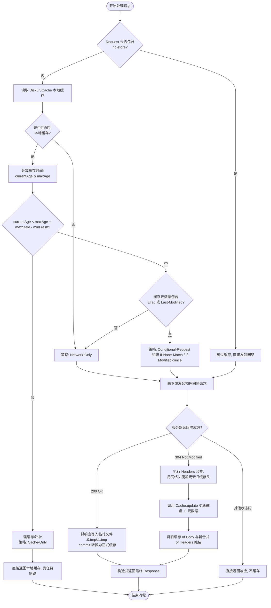
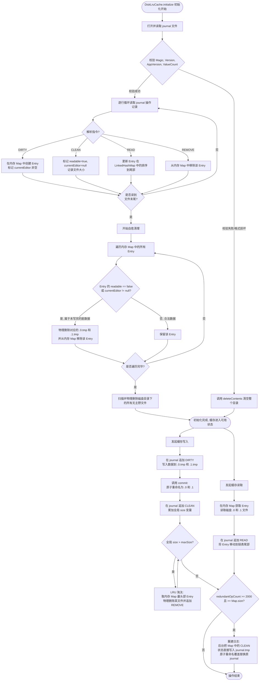

# OkHttp 缓存机制深度解析：HTTP 缓存规范实现、策略判定算法与 DiskLruCache 存储自愈

在 Android 移动端开发中，网络请求的性能和稳定性直接决定了应用的流畅度与用户体验。移动网络环境具有高度的不确定性（如弱网、高延迟、信号突变、物理断网等），因此，**缓存机制**成为了优化数据加载延迟、节省用户流量消耗、降低服务器抗压负载的最核心手段。OkHttp 作为 Android 平台上的事实标准网络库，其内部实现了一套高度贴合 HTTP 协议 RFC 7234 规范的缓存系统，并配合底层的物理文件存储引擎 `DiskLruCache`，实现了高效、稳定、具备崩溃自愈能力的持久化缓存机制。

本文将从 HTTP 缓存的规范基石出发，对比 RFC 历史演进，深度剖析 OkHttp 缓存判定策略的数学逻辑与时钟补偿算法，详尽解密 304 响应合并的核心链路与 Header 过滤策略，并深入底层 `DiskLruCache` 物理文件布局，剖析 `journal` 日志行指令流转、多线程并发控制、异常自愈算法及 LRU 淘汰实现，并结合生产环境探讨常见避坑指南和高级应用调优，帮助开发者建立对 OkHttp 缓存系统的完整心智模型。

---

## 一、 HTTP 缓存规范与 CacheInterceptor 设计哲学

### 1.1 HTTP 缓存规范的历史演进与物理基础（RFC 7234）

HTTP 缓存规范经历过多次具有历史意义的演进。在早期的 HTTP/1.0 时代，缓存控制机制相对简单且粗糙，主要依赖响应头中的 `Expires`（一个绝对的格林威治时间戳，指示过期时间）以及请求头中的 `Pragma: no-cache`。这种设计存在着致命的缺陷：由于 `Expires` 依赖于客户端本地系统时间的绝对值，如果用户手动修改了手机系统时间，或者设备时钟由于校准不及时与服务器产生了巨大的时间漂移，强缓存判定就会彻底失效。

为了解决这一痛点，IETF 在 1999 年发布了 HTTP/1.1 规范（**RFC 2616**），引入了 `Cache-Control` 字段，通过 `max-age`（相对时长，以秒为单位）等一系列指令，使得缓存的控制不再依赖绝对时间戳，极大地提高了缓存判定的准确性。然而，RFC 2616 的内容过于庞大、臃肿且多处定义模糊，这给各浏览器和网络库的开发者带来了理解上的混乱。

为了正本清源，IETF 在 2014 年对 RFC 2616 进行了重构与拆分，将其划分为六个独立的文档。其中，**RFC 7234** 专门作为 **HTTP Caching（HTTP 缓存）** 的官方规范。RFC 7234 清晰地界定了缓存的存储、校验、刷新与失效逻辑，并将其归纳为两大核心机制：

1. **强缓存（Freshness 判定机制）**：
   * **物理含义**：强缓存是“时间维度的单向断言”。如果客户端本地缓存的资源依然处于“新鲜期”（Fresh），客户端可以直接将本地缓存作为最终响应返回给应用程序，完全不需要与源服务器发生任何网络交互。
   * **表现形式**：在应用层表现为 `200 OK (from disk cache)`，其响应延迟通常在毫秒级。
   * **核心控制头**：`Cache-Control` 中的 `max-age` 指令，以及传统的 `Expires` 头部。

2. **协商缓存（Validation 校验机制）**：
   * **物理含义**：协商缓存是“特征维度的双向对齐”。当客户端本地缓存的资源已经过期（Stale），或者请求明确要求必须重新验证时，客户端不能直接使用该缓存，而是必须向源服务器发送一个**条件请求（Conditional Request）**，携带本地缓存的“时间戳”或“内容指纹（ETag）”。
   * **表现形式**：服务器比对客户端提交的验证器。若资源未发生变化，则返回 **`304 Not Modified`** 状态码，且不携带任何响应体（ResponseBody），指示客户端直接重用本地缓存的响应体；若资源已发生改变，则返回 **`200 OK`** 并携带最新的响应体。
   * **核心控制头**：`ETag` / `If-None-Match`（内容指纹）和 `Last-Modified` / `If-Modified-Since`（最后修改时间戳）。

此外，RFC 7234 对缓存的**准入控制（Cacheability）**有着严格界定：
* **方法限制**：只有安全请求方法（Safe Methods，如 `GET`、`HEAD`）才被允许缓存。非安全方法（如 `POST`、`PUT`、`DELETE`）在成功响应后，会直接将该 URL 对应的缓存置为失效（Invalidation），防止脏数据驻留在本地。
* **存储控制**：`Cache-Control` 包含 `no-store` 指令时，无论是客户端、CDN 还是任何代理服务器，均**绝对禁止**将此请求或响应的任何部分写入磁盘或闪存等持久化存储介质。
* **校验控制**：`Cache-Control` 包含 `no-cache` 指令时，表示该缓存资源不能直接用于强缓存，在使用前必须先通过协商缓存向服务器进行验证，确保数据的绝对新鲜。
* **多级代理控制**：规范中明确划分了“共享缓存（Shared Cache，如 CDN、反向代理网关）”与“私有缓存（Private Cache，如浏览器和客户端本地缓存）”。响应头中若包含 `Cache-Control: private`，表示响应只允许被私有缓存存储，保护了用户的隐私信息；而 `public` 则允许任何共享缓存进行存储。同时，`s-maxage` 专门用于指示共享缓存的过期时长，它在共享缓存上会覆盖 `max-age`。

---

### 1.2 OkHttp 中的 CacheInterceptor 架构定位

OkHttp 采用**责任链模式**组装其拦截器流水线。`CacheInterceptor`（缓存拦截器）被放置在自定义的 `Application Interceptors`、`RetryAndFollowUpInterceptor`（负责失败重试与重定向）、`BridgeInterceptor`（负责补齐请求头、处理 Gzip 与 Cookie）之后，但在物理建连拦截器 `ConnectInterceptor` 和网络读写拦截器 `CallServerInterceptor` 之前。

这个架构定位具有深刻的设计考量：

* **性能与能耗开销的权衡（缓存短路）**：
  在移动端，网络请求是电量与流量消耗的大户。如果 `CacheInterceptor` 判定强缓存可用，它可以在不进行物理建连（`ConnectInterceptor`）、不进行 TCP 握手和 TLS 握手、不发送任何字节到网络的情况下，直接“短路”整个责任链。这样，后续的连接与读写拦截器完全不被触发，网络开销直接降为零。这对于频繁启动、需要快速加载首页数据的移动 App 来说，能极大地提升启动性能并节约电量。
* **物理建连的解耦**：
  缓存拦截器处于建连拦截器之前，意味着缓存判定不需要关心具体的物理网络状态、不需要选择路由（Route Selector），也不需要从连接池中获取物理连接（`RealConnection`）。这种分层极大地简化了判定逻辑，使缓存的处理纯粹依赖于 Request 和已存储的 Response Headers，实现了高内聚与低耦合。
* **流式拦截器的读写切面**：
  在请求阶段，`CacheInterceptor` 拦截 Request，利用缓存决策器 `CacheStrategy` 决定是直接返回缓存，还是发起网络。在响应返回阶段，`CacheInterceptor` 拦截来自下游网络拦截器返回的 `Response`，决定是将响应写入本地磁盘，还是对已有的缓存元数据执行合并并重写。这一双向切面保证了网络缓存与协议的完全对齐。

---

## 二、 核心策略判定：CacheStrategy 与 CacheStrategy.Factory 深度解密

### 2.1 CacheStrategy 的设计模型

在 `CacheInterceptor` 内部，缓存的判定逻辑并没有直接写在拦截器的方法体中，而是委托给了一个专门的策略类：`CacheStrategy`。这是一个典型的策略模式（Strategy Pattern）应用。

`CacheStrategy` 的物理模型非常精简，它仅包含两个核心属性：
* **`networkRequest: Request?`**：指示本次请求如果要发起网络，应该使用什么 Request（如果为 `null`，则说明不需要发起网络请求）。
* **`cacheResponse: Response?`**：指示本次请求如果需要重用缓存，应该使用哪个 Response（如果为 `null`，则说明不能直接重用缓存）。

根据这两个属性的组合，OkHttp 将缓存判定策略划分为四种经典的物理表现：

| 属性组合 | 策略类型 | 物理含义 | 适用场景 |
| :--- | :--- | :--- | :--- |
| `networkRequest == null` <br> `cacheResponse != null` | **Cache-Only（仅读缓存）** | 强缓存完全命中。OkHttp 不发起任何网络请求，直接返回本地缓存。 | 缓存未过期，或请求中包含 `only-if-cached` 且本地有缓存。 |
| `networkRequest != null` <br> `cacheResponse == null` | **Network-Only（仅走网络）** | 缓存未命中或不可用。OkHttp 必须发起物理网络请求，不使用任何本地缓存。 | 本地无缓存，或者缓存存在 `no-store` 指令。 |
| `networkRequest != null` <br> `cacheResponse != null` | **Conditional-Request（条件请求）** | 本地缓存过期，但包含验证器。需要将本地缓存的验证头拼装到 `networkRequest` 中，发送到服务器进行协商缓存判定。 | 缓存已失效，但存在 `ETag` 或 `Last-Modified`。 |
| `networkRequest == null` <br> `cacheResponse == null` | **Unsatisfiable Request（无法满足的请求）** | 既不能使用本地缓存，又被限制不能发起网络请求。此时 OkHttp 会返回一个特殊的 `504 Unsatisfiable Request` 错误响应。 | 客户端发起请求时设置了 `only-if-cached`，但本地缓存不存在或已过期。 |

这种四态模型完美地涵盖了 HTTP 协议在各种极端条件下的缓存行为组合，并且用极高的抽象程度隔离了上游的调用逻辑。

---

### 2.2 强缓存判定的数学推导与源码实现

要决定是直接使用缓存，还是走协商缓存，核心就在于判定**缓存是否处于新鲜期（Fresh）**。为此，`CacheStrategy.Factory` 会在内部计算两个核心的时间指标：
1. **当前寿命（Current Age）**：即自服务器产生该响应，或者该响应在网络/代理中存活，直到当前时刻，该响应已经存在的总时长。
2. **最大寿命（Max Age / Freshness Lifetime）**：即根据服务器的指示或协议默认规则，该响应被认为可以安全使用的最大时间跨度。

#### 2.2.1 缓存当前寿命（Current Age）的精确推导算法

在分布式网络中，由于网络数据传输需要时间，以及客户端与服务器之间可能存在明显的**时钟偏差（Clock Skew）**或时钟漂移，我们绝不能简单地用“客户端当前系统时间 - 客户端收到响应的时间”来表示缓存的寿命。因为客户端的时间可能被用户随意篡改，或者设备硬件时钟本身存在漂移。

RFC 7234 规范定义了一套极其严密的算法来消除这些误差。OkHttp 严格实现了这套算法，其数学推导逻辑如下：

1. **计算表观寿命（Apparent Age）**：
   表观寿命是基于响应头中的 `Date`（服务器生成响应的时间）与客户端接收到响应的本地时间 `receivedResponseMillis` 之间的差值。由于本地时钟可能慢于服务器时钟，此差值可能为负数，因此需与 0 取最大值：
   $$\text{apparentAge} = \max(0, \text{receivedResponseMillis} - \text{servedDate})$$

2. **计算修正后的接收寿命（Corrected Received Age）**：
   由于请求在传输中可能经过了多级代理服务器（如 CDN、反向代理），这些代理可能在响应中添加了 `Age` 头部（指示该响应已经在代理中缓存了多少秒）。为防止由于网络传输引起的偏差，我们需要取表观寿命与 `Age` 头部的最大值：
   $$\text{correctedReceivedAge} = \max(\text{apparentAge}, \text{ageHeaderMillis})$$

3. **计算网络传输耗时（Response Duration）**：
   从客户端发送请求的时刻 `sentRequestMillis` 到收到响应的时刻 `receivedResponseMillis` 所消耗的时间，主要用于补偿单次物理往返的延迟：
   $$\text{responseDuration} = \text{receivedResponseMillis} - \text{sentRequestMillis}$$

4. **计算修正后的初始寿命（Corrected Initial Age）**：
   响应在刚刚到达客户端的那一瞬间，它在网络上其实已经存活了：
   $$\text{correctedInitialAge} = \text{correctedReceivedAge} + \text{responseDuration}$$

5. **计算本地驻留时长（Resident Duration）**：
   自客户端接收到该响应，直到当前进行判定策略的时刻 `nowMillis`，缓存在本地磁盘里安然度过的时间：
   $$\text{residentDuration} = \text{nowMillis} - \text{receivedResponseMillis}$$

6. **计算缓存最终的当前寿命（Current Age）**：
   最终的当前寿命，就是初始寿命加上本地的驻留时长：
   $$\text{currentAge} = \text{correctedInitialAge} + \text{residentDuration}$$

通过这一套严密的加减与最大值合并，OkHttp 成功抹平了因为网络传输延时、多级 CDN 代理转发、以及本地与服务器之间的大幅度时钟不同步带来的判定误差，将时钟偏差对强缓存的影响控制在最小限度。

---

#### 2.2.2 缓存最大寿命（Max Age）的判定规则

最大寿命（Freshness Lifetime）代表了服务器允许该资源在本地保持新鲜的时长。其计算具有以下优先级层级：

1. **`Cache-Control: max-age=N`**：
   如果响应头中包含 `Cache-Control` 且声明了 `max-age`，则最大寿命直接取 `max-age` 指定的秒数。
   $$\text{maxAge} = \text{max-ageMillis}$$

2. **`Expires` 头部**：
   如果响应头中没有 `max-age`，但存在 `Expires`，则最大寿命为 `Expires` 时间减去响应头中的 `Date` 服务器时间：
   $$\text{maxAge} = \max(0, \text{expiresDate} - \text{servedDate})$$
   * **时间日期格式解析细节**：根据 RFC 7231 规定，HTTP 日期必须是特定的格林威治绝对时间格式（如 `Sun, 06 Nov 1994 08:49:37 GMT`）。为了能够准确解析出各种服务器五花八门的日期输出格式，OkHttp 内部使用了 `HttpDate.parse()` 方法，其内置了多达 15 种常见的 HTTP 时间日期解析格式（包含符合 RFC 850、RFC 1036、ANSI C 规范的各种格式），从而在最大程度上避免了因日期解析失败导致强缓存直接判定失效的问题。

3. **启发式缓存寿命（Heuristic Expiration Lifetime）**：
   如果响应中既没有 `max-age` 也没有 `Expires`，但响应头中包含了 `Last-Modified`（最近修改时间），RFC 7234 推荐使用一个“启发式”的估算方法：取 `Date` 与 `Last-Modified` 差值的 **10%** 作为缓存的新鲜度寿命。这被称为 **LM-Factor 算法**。
   $$\text{maxAge} = \frac{\text{servedDate} - \text{lastModifiedDate}}{10}$$
   * **设计逻辑**：如果一个资源上一次被修改的时间距离现在已经很久（比如修改发生于 10 天前，而我们现在才请求），根据常识判断，它接下来在短期内发生改变的概率也很低，因此我们允许它在本地新鲜较长时间（例如 1 天）。反之，若最近才发生过修改，则新鲜期会极短，以便尽快与源服务器同步。这种算法极大地提高了那些未显式配置缓存头但内容更新频率低的资源的加载效率。

---

#### 2.2.3 客户端指令对寿命判定公式的扰动

不仅服务器可以通过 Headers 控制缓存新鲜度，客户端同样可以在 Request 中通过 `Cache-Control` 指令来限制或放宽新鲜度的判定标准。OkHttp 的 `CacheStrategy` 实现了对以下两个关键指令的动态修正：

* **`max-stale`（容忍过期时长）**：
  客户端声明：即使缓存过期了，只要过期时间没有超过 `maxStaleMillis`，我依然愿意重用该缓存。这相当于在最大寿命上额外“赠送”了时光：
  $$\text{maxAge}_{\text{effective}} = \text{maxAge} + \text{maxStaleMillis}$$
  * **应用场景**：这在移动端设计“离线模式”时非常有用。当无网络连接时，我们可以通过设置 `max-stale=Integer.MAX_VALUE`，强制 OkHttp 返回即便早已过期的缓存，避免给用户展示一片空白。
* **`min-fresh`（要求最小新鲜度）**：
  客户端声明：我不希望用到临近过期的缓存。我要求该缓存在接下来的 `minFreshMillis` 期限内必须依然保持新鲜。这相当于对最大寿命进行了“克扣”：
  $$\text{maxAge}_{\text{effective}} = \text{maxAge} - \text{minFreshMillis}$$
  * **应用场景**：常用于对数据时效性极敏感的业务（如股票走势、即时交易状态），确保拿到的缓存绝对不是那种在 1 秒后就过期的边缘数据。

综上所述，强缓存能够被直接重用（即判定为强缓存命中）的最终物理判定数学不等式为：

$$\text{currentAge} < \text{maxAge} + \text{maxStaleMillis} - \text{minFreshMillis}$$

只要该不等式成立，并且请求中没有 `no-cache` 或 `no-store` 指令，OkHttp 就会短路网络，直接返回缓存。

---

### 2.3 协商缓存判定与条件请求（Conditional Request）生成

当上述的不等式不成立，即缓存的当前寿命已经超出了其有效生命周期，或者请求中显式携带了 `no-cache` 时，强缓存失效。此时，为了避免重复下载相同的庞大资源，OkHttp 进入协商缓存判定流程。

协商缓存的核心是：**如果本地有缓存元数据，且元数据中包含“验证器（Validator）”，则向服务器发起一个带有特殊验证头的条件请求。**

OkHttp 生成条件请求的具体逻辑如下：

1. **读取 ETag（实体标记）**：
   `ETag` 是服务器为特定资源分配的唯一字符串标识（内容指纹）。只要资源内容发生微小变化，`ETag` 就会完全改变。
   * **逻辑**：如果缓存响应头中包含 `ETag`，OkHttp 会在构建网络请求时，自动在 Header 中追加 **`If-None-Match: <etag_value>`**。根据 RFC 规范，`ETag` 是强验证器（Strong Validator），具有最高的优先级，能够避免由于服务器时钟不精确导致的修改时间判断失误。
2. **读取 Last-Modified（最后修改时间）**：
   * **逻辑**：若不存在 `ETag`，或者为了提高验证的兼容性，OkHttp 会读取缓存响应头中的 `Last-Modified`。在构建网络请求时，在 Header 中追加 **`If-Modified-Since: <last_modified_value>`**。这是一个弱验证器（Weak Validator），以秒为单位标记资源的修改时间。

条件请求一旦组装完毕，`CacheStrategy` 就会返回一个同时含有 `networkRequest`（带有 `If-None-Match` 或 `If-Modified-Since` 头）和 `cacheResponse` 的 `CacheStrategy` 实例。这个策略将被 `CacheInterceptor` 获取，责任链将继续向下游传递，直至将该条件请求发送给物理网络服务器。

---

## 三、 304 Not Modified 响应合并机制（核心机制）

在协商缓存中，**`304 Not Modified`** 响应的处理是整个 `CacheInterceptor` 最核心、最精妙的部分。如果服务器在比对客户端的 `If-None-Match` 或 `If-Modified-Since` 后，确认资源未发生变化，就会返回一个 `304` 状态码的响应。

### 3.1 304 状态码的网络层语意

一个符合标准的 `304 Not Modified` 响应具有以下几个显著特征：
* **无响应体**：响应的 `ResponseBody` 在网络层传输时为空（`Content-Length` 通常为 0，且无物理字节传输）。这使得 304 响应极其轻量，通常只有几百字节的 Headers，消除了大文件传输对带宽和能耗的浪费。
* **时效性 Headers 更新**：虽然没有响应体，但服务器会在 304 响应中携带最新的时效性头部，例如最新的 `Date`（更新服务器当前时间）、最新的 `Cache-Control`（可能会修改下一次的 max-age）、最新的 `Expires`，甚至更新后的 `ETag`。
* **物理语意**：服务器用这个特殊的空响应告知客户端：“我确认你手里缓存的那份数据是完全合法的，你可以继续用它。并且，请用我这次给你发的新响应头，去更新你那里的缓存元数据。”

---

### 3.2 CacheInterceptor 中的 304 响应合并算法

当下游拦截器网络交互完毕，将网络 Response 返回给 `CacheInterceptor` 时，缓存拦截器会立即检查其响应码。如果 `networkResponse.code == HTTP_NOT_MODIFIED`，则执行 304 响应合并机制。该机制包含以下三大精细步骤：

#### 步骤一：HTTP 响应头的合并（Headers Combine）

OkHttp 会调用 `Response.headers().combine()` 方法，将已存储的缓存响应头（`cachedHeaders`）与最新的网络响应头（`networkHeaders`）执行高精度合并：

1. **建立 Builder**：以 `cachedHeaders` 的所有键值对为初始基准建立一个 `Headers.Builder`。
2. **遍历网络头并过滤更新**：遍历服务器新返回的 `networkHeaders`，执行过滤与覆盖规则：
   * **安全过滤黑名单**：如果网络头是 **`Content-Range`**、**`Content-Length`**、**`Content-Encoding`**、**`Content-Type`** 等明确与具体的响应包体传输状态、大小、编码类型深度绑定的字段，OkHttp 会**禁止更新**这些字段，保留缓存中的原始值。*为什么？* 因为 304 响应没有实际的 Body，它的 `Content-Length` 可能是 0。如果用它去覆盖原缓存中代表 200 OK 完整 Body 大小的 `Content-Length`，会导致后续读取缓存 Response Body 时发生 `EOFException` 或者是内容截断错误。
   * **Warning 字段的 RFC 规范处理**：RFC 7234 规定，当发生重新验证成功后，响应中凡是带有以 `1xx` 开头的 Warning 头部字段都必须被清除（表示旧的警告已失效），而 `2xx` 开头的 Warning 字段必须被保留。OkHttp 在合并算法中，遍历 `cachedHeaders` 时若遇到以 `1` 开头的 `Warning`，会使用 `continue` 略过它，不将其拷贝到新生成的 Headers 中。
   * **普通字段覆盖**：如果网络头是其他普通字段（如 `Date`、`Cache-Control`、`Expires`、`ETag`），则使用网络响应中携带的新值，**直接覆盖**旧缓存的对应值。这能保证下一次计算缓存新鲜度寿命时，起点时间 `Date` 已经更新为服务器的最新时间，从而自动延长了缓存的整体生命周期。

#### 步骤二：持久化存储更新（DiskLruCache 重写）

合并完成得到的 `combinedHeaders` 必须立即被持久化，否则在下一次启动时依然会读取旧的过期 Headers，导致协商缓存重复发生，失去合并的意义。

1. OkHttp 调用内部的 `Cache.update(cachedResponse, combinedResponse)`。
2. `Cache` 内部通过请求的 URL 的 MD5 码作为 Key，调用 `DiskLruCache.edit(key)` 获取到一个 `DiskLruCache.Editor`。
3. `Cache` 往该 `Editor` 的第 `0` 号输出流（对应元数据 `.0` 文件）中写入合并后的完整元数据（包含请求行、合并后的 Headers、协议、状态码等信息）。
4. 写入完成后调用 `Editor.commit()`，该操作会将临时写入的 `.0.tmp` 元数据文件重命名为正式的 `.0` 文件，完成磁盘数据的更新。这里，如果多个线程在并发调用 `update()` 对相同的 Key 进行更新，DiskLruCache 内部会通过同步锁控制 Editor 的分配，防止产生元数据写入损坏。

#### 步骤三：完整 Response 的组装与向上传递

由于 304 响应没有 Body，OkHttp 必须给上游应用层提供一个内容完整的 Response。因此，缓存拦截器会基于 `networkResponse`（提供了状态码、网络连接信息）进行重构：
* 将其 Body 替换为缓存响应的 Body（`cachedResponse.body`）。
* 将其 Headers 替换为刚才合并出来的 `combinedHeaders`。
* 最终，上游的应用层（或者之前的拦截器）拿到的将是一个状态码为 `200 OK`，且包含完整物理响应体和最新 Headers 的 Response 实例。这一层合并逻辑在 OkHttp 内部完成了闭环，应用层对此完全无感。

---

## 四、 底层存储引擎 DiskLruCache 深度解密

OkHttp 官方提供了一个名为 `Cache` 的类作为客户端的缓存配置，而 `Cache` 的背后，则是依靠 **`DiskLruCache`（磁盘最近最少使用缓存）** 来管理磁盘文件的物理生命周期。

`DiskLruCache` 最早是由著名开源大牛 Jake Wharton 基于 Android 系统内部 libcore 的源码实现进行抽取和开源的，后来被广泛应用在 Android 的图片库（如 Glide, Picasso）和网络库（如 OkHttp）中。

### 4.1 物理文件存储布局与分立存储设计

#### 4.1.1 为什么使用物理文件而不是数据库？

在持久化框架的设计中，通常有关系型数据库（如 SQLite）和物理文件系统两种方案。
对于 HTTP 响应缓存，响应体（ResponseBody）往往包含大量的图片、JSON 文本、音视频或二进制文件，大小从几 KB 到数十 MB 不等。
* 如果存入数据库，随着大字段的增多，SQLite 的 B-Tree 索引性能会急剧恶化，频繁的读写会导致严重的写放大和锁竞争，且在多线程并发下极其不稳定。
* 文件系统天然支持大文件的顺序读写与流式分片读取，能够直接借助操作系统的页缓存（Page Cache）进行内存加速。因此，DiskLruCache 采用文件系统作为其存储基础。

#### 4.1.2 元数据（.0）与数据（.1）的分立存储设计

为避免非法字符对操作系统文件路径的破坏，DiskLruCache 将请求 URL 经过 MD5 编码转换为一个 32 位的十六进制字符串作为缓存的 Key。

在 `valueCount = 2` 的设定下，每个 Key 对应两个物理文件：
1. **`<key>.0`（元数据文件）**：
   * **内容**：存储了除 ResponseBody 以外 of HTTP 全套报头与握手数据。其物理格式为纯文本，第一行是请求的 URL，第二行是请求方法（如 GET），第三行是请求 Headers 的数量，接下来是请求 Headers；然后是协议版本、状态码、响应 Headers 数量、响应 Headers，以及如果是 HTTPS 请求时的 TLS 握手元数据。
2. **`<key>.1`（响应体数据文件）**：
   * **内容**：以二进制流的形式，原封不动地存储了 HTTP 的响应包体字节流。

* **分立设计的优势**：
  这种“头体分离”的物理布局具有极大的性能优势。在 `CacheInterceptor` 进行缓存判定时，只需要读取 `<key>.0` 元数据文件。由于元数据通常只有几百字节，读取和反序列化操作极快，不需要去碰动辄几十 MB 的 `<key>.1` 数据文件。一旦判定缓存已失效或不可用，可以直接跳过数据文件的读取，从而避免了不必要的物理 I/O 开销，减少了内存抖动。

---

### 4.2 journal 日志文件物理格式与四大行指令

`DiskLruCache` 之所以能高效地管理数以万计的文件并保持内存状态的同步，核心依赖于该目录下唯一的一个特殊管理文件：**`journal`（日志文件）**。

#### 4.2.1 journal 头信息（Header）物理含义

一个合法的 `journal` 文件开头固定占有 5 行头信息：

```text
libcore.io.DiskLruCache
1
100
2

```

* **第一行（Magic 魔数）**：恒为 `libcore.io.DiskLruCache`，用于标识此目录是由该算法管理的缓存目录。
* **第二行（DiskLruCache 版本）**：目前恒为 `1`。
* **第三行（Application 版本）**：调用方传入的应用版本号（例如 `100`）。如果初始化时检测到此版本号与当前运行的应用版本不一致，说明应用发生了升级，原有的缓存格式可能有安全隐患，DiskLruCache 会自动清除整个目录下的所有缓存。
* **第四行（Value Count）**：每个缓存条目对应的文件个数，在 OkHttp 的 `Cache` 中恒为 `2`。
* **第五行（空行）**：空行占位符，做头部与操作记录的分界。

---

#### 4.2.2 journal 四大操作行指令

在头信息之后，是成千上万行动态的操作记录，每一行代表一次对缓存的状态变更或访问操作。这些记录只有以下四种行指令：

```text
DIRTY 3524b08a1e204c3e803a6c9cf8a1e345
CLEAN 3524b08a1e204c3e803a6c9cf8a1e345 528 24896
READ 3524b08a1e204c3e803a6c9cf8a1e345
REMOVE 3524b08a1e204c3e803a6c9cf8a1e345
```

1. **`DIRTY <key>`**：
   * **物理含义**：指示某个 Key 对应的缓存正在被写入或修改。
   * **触发时机**：当调用 `DiskLruCache.edit(key)` 获取编辑器准备写入新响应时触发。如果在 journal 中一个 Key 的最后一条记录是 `DIRTY`，意味着写入过程可能被非正常中断了。
2. **`CLEAN <key> <length0> <length1>`**：
   * **物理含义**：指示该 Key 对应的缓存已成功写完，现在是可读的、安全的合法状态。后面跟随着两个文件（`.0` 和 `.1`）的字节长度，供计算磁盘总大小使用。
   * **触发时机**：当调用 `Editor.commit()` 提交写入时触发。
3. **`READ <key>`**：
   * **物理含义**：记录一次对该 Key 缓存的物理读取。
   * **触发时机**：当调用 `DiskLruCache.get(key)` 成功获取缓存时触发。这个指令仅用于在内存中更新 LRU 淘汰链表的顺序，表示该资源刚被访问过。
4. **`REMOVE <key>`**：
   * **物理含义**：指示该 Key 对应的物理文件和内存记录已被彻底删除。
   * **触发时机**：因 LRU 缓存超额淘汰，或者客户端手动调用 `remove(key)` 时触发。

---

### 4.3 多线程并发控制与异常自愈机制

#### 4.3.1 多线程并发控制设计

由于 OkHttp 通常在线程池中并行并发处理大量的网络请求，会有多个线程同时在向同一个 `DiskLruCache` 写入或读取数据。
为保障并发安全性，DiskLruCache 的底层核心方法（如 `initialize()`、`edit()`、`commit()`、`abort()`、`remove()` 等）全部添加了 `@Synchronized`（在 Java 中为 `synchronized`）锁，从而实现了线程安全。

对于“读-写”、“写-写”冲突，DiskLruCache 采用了极具启发式的解决方案：
* **写-写冲突隔离**：当线程 A 正在写入 Key-1 时，内存中对应的 Entry 会持有线程 A 专属的 `currentEditor`。此时如果线程 B 并发调用 `edit(key)` 试图也写入 Key-1，DiskLruCache 会因为检查到 `currentEditor != null`，而**直接返回 `null`**，从而将后续冲突的写入静默过滤，保证了文件写入的串行完整。
* **读-写互不互斥（读旧写新）**：当线程 A 正在利用 `Editor` 往临时文件 `.0.tmp` / `.1.tmp` 写入新数据时，如果有线程 C 并发调用 `get(key)` 读取 Key-1，只要该 Entry 在此之前已经成功 CLEAN 过（即 `readable == true`），线程 C 依然能够畅通无阻地读取现存的旧正式文件 `<key>.0` / `<key>.1`，读写互不互斥。这样保证了即使在极端下载写入时，UI 线程也能够无延迟地读取到旧缓存展示，获得了极佳的并发性能。

---

#### 4.3.2 临时文件机制与写入事务

为了防止在物理写入缓存时发生 Crash 或断电，导致生成半截子损坏的破损文件，DiskLruCache 引入了**临时文件机制**（Transaction-like File System Operations）：

1. **写事务开启**：
   当要缓存一个 HTTP 响应时，OkHttp 首先调用 `edit(key)`。在 `DiskLruCache` 内部，向内存中的 `journal` 缓冲流中追加写入 `DIRTY <key>`。
2. **物理写入临时文件**：
   此时，DiskLruCache 并不直接修改正式文件 `<key>.0` 和 `<key>.1`。它会将 `Editor` 提供的输出流导向物理上的临时文件：**`<key>.0.tmp`** 和 **`<key>.1.tmp`**。
3. **提交与原子重命名**：
   当 `CacheInterceptor` 将网络流完整读完并成功写入临时文件后，调用 `editor.commit()`。在 `commit()` 的临界区内：
   * 物理上执行 `renameTo` 操作，将 `<key>.0.tmp` 重命名为 `<key>.0`，将 `<key>.1.tmp` 重命名为 `<key>.1`。在现代文件系统（如 ext4, APFS）中，目录项重命名是一个轻量级的原子操作，能够保证文件状态在“存在”与“不存在”之间瞬间切换。
   * 向 `journal` 中追加写入 `CLEAN <key> <length0> <length1>`。
4. **中止回滚**：
   如果写入中途发生任何 `IOException`，或者连接断开，OkHttp 会调用 `editor.abort()`，物理删除生成的 `.tmp` 临时文件，内存中的 Entry 被置为无效。

---

#### 4.3.3 突发崩溃与自愈算法

如果写入中途，App 进程被系统强杀，或者手机遭遇断电，此时正式文件并未生成，但磁盘上会留有残缺的 `<key>.0.tmp` 或 `<key>.1.tmp` 文件。
在下一次 App 启动并首次初始化 `DiskLruCache` 时，会通过执行 `initialize()` 进行状态自愈：

1. **解析 journal 日志重建内存拓扑**：
   DiskLruCache 会以单行循环的方式读入整个 `journal` 文件。
   * 读到 `DIRTY`：在内存的 `LinkedHashMap` 中为该 Key 创建一个 Entry，并将其 `currentEditor` 设为一个虚构的非空值，表示该条目属于“非正常编辑中”状态。
   * 读到 `CLEAN`：将 Entry 的 `readable` 标记设为 `true`，`currentEditor` 设为 `null`，并记录文件长度。
   * 读到 `REMOVE`：从 Map 中直接移除该 Entry。
   * 读到 `READ`：将 Entry 在内存 LRU 链表中移至末尾。
2. **执行脏文件清理（Self-Healing）**：
   在 journal 解析完毕后，Map 状态重建完毕。DiskLruCache 遍历内存 Map 中所有的 Entry：
   * 如果发现某个 Entry 的 `readable` 属性为 `false`，或者其 `currentEditor != null`（这意味着 journal 中关于这个 Key 的最后一条指令是 `DIRTY`，后面没有跟随着 `CLEAN` 指令，说明上一次写操作遭遇了非正常崩溃），DiskLruCache 会**强制将其从 Map 中移除**。
   * 物理删除对应的 `<key>.0.tmp` 和 `<key>.1.tmp` 临时文件，防止这些写一半的垃圾文件无限占用磁盘空间。
3. **野文件扫描与物理清除**：
   DiskLruCache 会遍历整个缓存文件夹下的所有物理文件。如果发现某个 `.tmp` 临时文件不属于任何内存中合法的 Entry，或者文件后缀与 journal 记录的不符（例如未记录在 Map 中的野文件），会执行物理的 `delete()`。
   通过这一套“日志解析 -> 状态审查 -> 物理清理”的闭环算法，DiskLruCache 实现了即使面对任何突发情况，文件存储依然能自动回滚损坏的脏文件，恢复到百分之百健康、可读的状态。

此外，在面对物理存储介质已满（Disk Full）、文件系统权限缺失等极端 I/O 异常时，DiskLruCache 内部使用了 `fault-tolerant`（容错）模式。一旦发生 `IOException`，会调用 `journalRebuildFailed = true` 或是捕获静默异常，停止后续的写入，但会允许已读缓存继续被读取，最大程度保障客户端的可用性，防止因为写入错误导致整个 App 崩溃。

---

#### 4.3.4 journal 日志重建（Rebuilding）机制

随着时间流逝，频繁的 HTTP 读取会产生数十万行 `READ` 记录，这会导致 `journal` 文件急剧膨胀，占用磁盘空间并拖慢下一次启动的解析速度。

DiskLruCache 内部有一个 `redundantOpCount` 计数器：
* 每执行一次 `READ` 或 `REMOVE`，或者写入被中止，`redundantOpCount` 都会加 1。
* 当满足以下条件时，会触发后台 journal 日志重建：
  $$\text{redundantOpCount} \ge 2000 \quad \text{and} \quad \text{redundantOpCount} \ge \text{LinkedHashMap.size}$$
* **为什么重建日志是异步的？**
  因为遍历内存 Map 并将成千上万条记录同步写入磁盘是一个高耗时的 I/O 操作。如果放在主线程或调用线程中同步执行，会造成严重的网络请求卡顿（Block）和界面掉帧。因此，OkHttp 使用了一个后台 executor（单线程线程池 `cleanupQueue`）来异步执行 `cleanupRunnable` 任务。
* **重建流程**：
  1. 在后台线程启动重建任务，创建并打开一个名为 `journal.tmp` 的临时日志文件。
  2. 写入 journal 固定的 5 行 Header 信息。
  3. 遍历内存中的 `LinkedHashMap`。对于每一个 Entry：
     * 若其正在被编辑（`currentEditor != null`），则向 `journal.tmp` 写入 `DIRTY <key>`。
     * 若其已就绪（`readable == true`），则向 `journal.tmp` 写入 `CLEAN <key> <length0> <length1>`。
     * 重建过程中，历史上的所有冗余 `READ` 记录以及已被删除的 `REMOVE` 记录全部被丢弃。
  4. 写入完毕后，将原 `journal` 文件重命名为 `journal.bkp`（备份文件），再将新写入的 `journal.tmp` 重命名为 `journal`。
  5. 物理删除 `journal.bkp`，完成一次无缝的日志体积瘦身与物理替换。

---

### 4.5 LRU 动态淘汰算法物理实现

DiskLruCache 的大小控制并不是无限扩张的，在构建 OkHttp 的 `Cache` 时，我们需要为其指定一个最大磁盘占用容量（如 `10 * 1024 * 1024` 字节，即 10MB）。其 LRU 淘汰是在物理写入阶段动态触发的。

1. **链表基础**：
   DiskLruCache 内存中维护的 Map 结构为 `LinkedHashMap<String, Entry>(0, 0.75f, true)`。其构造函数的第三个参数 `accessOrder = true` 表示**按访问顺序排序**。每次调用 `get` 或 `put`，对应 Entry 都会被自动移到双向链表的末尾（表示最近最常使用）。
2. **容量检查与淘汰（trimToSize）**：
   每当完成一次 `Editor.commit()` 时，会将写入成功的数据大小累加进 `size` 变量。
   随后触发 `trimToSize()`：
   * 循环检查：当 $\text{size} > \text{maxSize}$ 时，进入淘汰逻辑。
   * 获取最久未使用的 Entry：调用 `LinkedHashMap.entrySet().iterator().next()`，由于 `accessOrder = true`，迭代器返回的第一个元素稳居链表最头部、最久未被使用的 Entry。
   * 物理删除：
     * 物理删除对应的 `.0` 和 `.1` 缓存文件。
     * 从内存 Map 中移除该 Entry。
     * 扣减 `size`。
     * 向 `journal` 文件中追加写入一行 `REMOVE <key>`。
   * 重复上述淘汰步骤，直到当前已使用大小 `size` 小于或等于我们设定的 `maxSize`。

---

## 五、 状态机流转与自愈 Mermaid 流程图

### 5.1 CacheInterceptor 协商缓存判定与 304 响应合并流转图

下图展示了 `CacheInterceptor` 面对一个 HTTP 请求时，从强缓存判定、条件请求生成，到 304 状态码返回后的 Headers 合并及 DiskLruCache 更新的完整逻辑流转：



---

### 5.2 DiskLruCache 的 journal 日志读写流转与异常自愈流转图

下图展示了 `DiskLruCache` 在初始化阶段，如何解析 `journal` 日志文件进行拓扑重建，如何检测并回滚异常中断的 DIRTY 脏文件，以及在日常读写中如何配合临时文件与 LRU 淘汰机制进行工作：



---

## 六、 源码级核心实现与中文解析

为了更加直观地理解上述机制在 OkHttp 内部的运作方式，我们选取了判定缓存可用性、协商响应合并以及 DiskLruCache 初始化自愈的核心源码，并为其配以详尽的中文解析。

### 6.1 CacheStrategy.Factory 策略判定源码解析

以下是 `CacheStrategy.Factory` 类中计算新鲜度并决定是直接返回缓存、还是执行条件协商请求的 `compute()` 核心源码实现：

```kotlin
// 选自 okhttp3/internal/cache/CacheStrategy.kt (已适配 Kotlin 语法结构)
class Factory(
  val nowMillis: Long,          // 客户端进行判定策略时的本地系统当前时间戳
  val request: Request,          // 客户端当前发起的新请求
  val cacheResponse: Response?  // 本地磁盘中已经提取出的旧缓存响应
) {
  // ... 成员变量定义

  /**
   * 根据当前请求和已有的缓存响应，计算出具体的缓存判定策略
   */
  fun get(): CacheStrategy {
    val candidate = compute()

    // 缓存防御指令拦截：如果判定需要联网, 但请求中包含 only-if-cached 强限制，说明客户端拒绝物理联网
    if (candidate.networkRequest != null && request.cacheControl.onlyIfCached) {
      // 此时无法联机又无法使用缓存，根据 RFC 只能返回两手空空的 Unsatisfiable 状态（外部将返回 504 响应）
      return CacheStrategy(null, null)
    }

    return candidate
  }

  /**
   * 核心判定算法实现
   */
  private fun compute(): CacheStrategy {
    // 1. 无缓存场景：如果本地没有任何旧缓存，那么直接必须进行完整的网络请求
    if (cacheResponse == null) {
      return CacheStrategy(request, null)
    }

    // 2. 安全性校验：如果当前请求是一次 HTTPS 请求，但本地缓存缺少对应的 TLS 握手信息，为了安全起见必须走网络
    if (request.isHttps && cacheResponse.handshake == null) {
      return CacheStrategy(request, null)
    }

    // 3. 准入性校验：根据 RFC 7234 规范，判断该响应的状态码以及 Cache-Control 指令是否允许被本地缓存
    if (!isCacheable(cacheResponse, request)) {
      return CacheStrategy(request, null)
    }

    // 4. 客户端指令拦截：如果请求中指定了 no-cache（必须验证）或包含特定的验证前置条件（如已带有验证头），直接必须发起网络
    val requestCaching = request.cacheControl
    if (requestCaching.noCache || hasConditions(request)) {
      return CacheStrategy(request, null)
    }

    val responseCaching = cacheResponse.cacheControl
    
    // 5. 计算当前寿命（Current Age）与最大寿命（Max Age）
    val ageMillis = cacheResponseAge() // 利用时钟修正算法推导得出的缓存真实寿命
    var freshMillis = computeFreshnessLifetime() // 根据 Expires, max-age 或启发式计算得出的最大允许新鲜寿命

    // 6. 响应寿命修正：如果客户端对新鲜度有要求
    if (requestCaching.maxAgeSeconds != -1) {
      // 客户端限制了 max-age，与服务器的最大寿命取两者的最小值
      freshMillis = minOf(freshMillis, SECONDS.toMillis(requestCaching.maxAgeSeconds.toLong()))
    }

    var minFreshMillis = 0L
    if (requestCaching.minFreshSeconds != -1) {
      // 客户端要求缓存在接下来的 min-fresh 时间内必须保持绝对新鲜，扣除新鲜期
      minFreshMillis = SECONDS.toMillis(requestCaching.minFreshSeconds.toLong())
    }

    var maxStaleMillis = 0L
    if (!responseCaching.mustRevalidate && requestCaching.maxStaleSeconds != -1) {
      // 如果服务器没有指定 must-revalidate，且客户端愿意接受已经过期在指定范围内的旧缓存
      maxStaleMillis = SECONDS.toMillis(requestCaching.maxStaleSeconds.toLong())
    }

    // 7. 强缓存可用性判定：
    // 如果缓存当前存活时间 + 客户端期望保留的新鲜度 < 缓存最大生命周期 + 客户端容忍过期的时长
    if (!responseCaching.noCache && ageMillis + minFreshMillis < freshMillis + maxStaleMillis) {
      val builder = cacheResponse.newBuilder()
      
      // 如果强缓存已过期，但由于客户端配置了 max-stale 依然放行使用了该缓存，必须按照 RFC 添加 110 Warning 警告
      if (ageMillis + minFreshMillis >= freshMillis) {
        builder.addHeader("Warning", "110 Response is stale")
      }
      
      // 强缓存完全命中，networkRequest 为空，返回组装后的缓存响应，直接短路网络请求
      return CacheStrategy(null, builder.build())
    }

    // 8. 协商缓存构建：强缓存失效，寻找本地缓存的验证器（Validators）
    val conditionBuilder = request.newBuilder()

    val conditionHeader: String
    val conditionValue: String?

    if (cacheResponse.etag != null) {
      // 优先选择内容强验证指纹 ETag，构建 If-None-Match 头
      conditionHeader = "If-None-Match"
      conditionValue = cacheResponse.etag
    } else if (cacheResponse.lastModified != null) {
      // 其次选择最后修改时间弱校验戳，构建 If-Modified-Since 头
      conditionHeader = "If-Modified-Since"
      conditionValue = cacheResponse.lastModifiedString
    } else {
      // 如果没有找到任何验证器，强缓存失效后也无法进行协商缓存，只能进行完整的全新网络请求
      return CacheStrategy(request, null)
    }

    // 将验证头注入到网络请求中，开启协商验证模式
    conditionBuilder.header(conditionHeader, conditionValue!!)

    val conditionalRequest = conditionBuilder.build()
    // 返回协商缓存策略，OkHttp 将带着这些头部向服务器发起条件请求
    return CacheStrategy(conditionalRequest, cacheResponse)
  }
}
```

---

### 6.2 CacheInterceptor 304 响应合并与缓存更新源码解析

以下是 `CacheInterceptor.intercept` 方法中，当网络响应返回 `304` 时，执行 Headers 合并并写入磁盘更新的核心源码实现：

```kotlin
// 选自 okhttp3/internal/cache/CacheInterceptor.kt (已适配 Kotlin 语法结构)
override fun intercept(chain: Interceptor.Chain): Response {
  val cacheCandidate = cache?.get(chain.request()) // 根据当前请求检索出本地缓存候选项

  val now = System.currentTimeMillis()
  // 利用策略工厂分析当前请求与本地缓存的头字段，推导出本次的执行策略
  val strategy = CacheStrategy.Factory(now, chain.request(), cacheCandidate).get()
  val networkRequest = strategy.networkRequest
  val cacheResponse = strategy.cacheResponse

  // ... 缓存命中处理与网络短路直接返回的处理

  var networkResponse: Response? = null
  try {
    // 责任链向下游推进，发起真实的物理网络请求（可能是条件请求）
    networkResponse = chain.proceed(networkRequest!!)
  } finally {
    // ... 异常时资源释放
  }

  // 核心：如果本地有缓存响应，并且服务器在收到条件请求后返回了 304 Not Modified
  if (cacheResponse != null) {
    if (networkResponse?.code == HTTP_NOT_MODIFIED) {
      // 1. 基于已保存的旧缓存 Response 实例构建 Builder
      val response = cacheResponse.newBuilder()
        // 2. 调用 combine 方法合并旧缓存 Headers 与网络 Headers，覆盖更新时效性头部并过滤传输绑定字段
        .headers(combine(cacheResponse.headers, networkResponse.headers))
        .sentRequestAtMillis(networkResponse.sentRequestAtMillis)
        .receivedResponseAtMillis(networkResponse.receivedResponseAtMillis)
        // 3. 关联缓存响应与网络响应（供调用链后续追踪与统计命中率）
        .cacheResponse(stripBody(cacheResponse))
        .networkResponse(stripBody(networkResponse))
        .build()

      networkResponse.body.close() // 关闭无实际内容的网络响应体字节流，防止句柄泄露

      // 4. 调用 Cache.update 方法将合并更新后的全新 Headers 写入磁盘中的 .0 元数据文件
      cache!!.trackConditionalCacheHit()
      cache.update(cacheResponse, response)

      // 5. 向责任链上游返回合并后的完美响应（包体为旧缓存，Headers 为最新合并版）
      return response
    } else {
      // 网络返回的不是 304（比如 200），说明资源已变更，关闭旧缓存体的输入流防止读取流泄露
      cacheResponse.body?.closeQuietly()
    }
  }

  // ... 后续 200 OK 网络成功响应的写入磁盘缓存流程
}

/**
 * 核心合并逻辑：依据 RFC 规范合并缓存头与网络头
 */
private fun combine(cachedHeaders: Headers, networkHeaders: Headers): Headers {
  val result = Headers.Builder()

  // 1. 拷贝旧缓存中的所有 Headers
  for (i in 0 until cachedHeaders.size) {
    val fieldName = cachedHeaders.name(i)
    val value = cachedHeaders.value(i)
    
    // 规范过滤：屏蔽旧缓存中以 1xx 开头的过期 Warning 警告字段，由网络新返回的头决定是否保留
    if ("Warning".equalsIgnoreCase(fieldName) && value.startsWith("1")) {
      continue
    }

    // 过滤与本次响应传输体深度绑定的头部，非绑定字段才拷贝
    if (isContentHeader(fieldName) || !isContentHeader(fieldName)) {
      result.addLenient(fieldName, value)
    }
  }

  // 2. 遍历网络请求新返回的最新 Headers
  for (i in 0 until networkHeaders.size) {
    val fieldName = networkHeaders.name(i)
    
    // 安全屏障：Content-Length、Content-Range 等反映本次 304 包体传输属性 of 字段严禁覆盖原有缓存
    if (isContentHeader(fieldName)) {
      continue 
    }
    
    // 对于其他的通用字段（如 Date, Cache-Control, ETag），用最新获取的值替换或追加到 Headers 中
    result.addLenient(fieldName, networkHeaders.value(i))
  }

  return result.build()
}

/**
 * 判定字段是否属于包体内容专属字段
 */
private fun isContentHeader(fieldName: String): Boolean {
  return "Content-Length".equalsIgnoreCase(fieldName) ||
      "Content-Encoding".equalsIgnoreCase(fieldName) ||
      "Content-Type".equalsIgnoreCase(fieldName)
}
```

---

### 6.3 DiskLruCache 初始化、自愈与日志重建源码解析

以下是 `DiskLruCache` 的核心初始化 `initialize()` 算法，其中包括读取 journal 文件、异常自愈脏文件清除、以及 `rebuildJournal()` 的核心代码实现：

```kotlin
// 选自 okhttp3/internal/cache/DiskLruCache.kt (已适配 Kotlin 语法结构)
@Synchronized
fun initialize() {
  if (initialized) return // 如果已初始化则直接跳过，防止多线程重复构建

  // 容错机制：如果检测到存在备份的 journal.bkp 文件，说明上一次重建在重命名覆盖阶段遭遇了 Crash/断电
  if (fileSystem.exists(journalFileBackup)) {
    // 如果正式的原 journal 文件完整存在，说明备份文件是多余的，直接物理删除
    if (fileSystem.exists(journalFile)) {
      fileSystem.delete(journalFileBackup)
    } else {
      // 否则，说明在覆盖重命名中原 journal 损坏丢失，直接将备份文件重命名恢复为正式的 journal
      fileSystem.rename(journalFileBackup, journalFile)
    }
  }

  // 1. 如果正式的 journal 日志存在，尝试读取日志并恢复内存拓扑
  if (fileSystem.exists(journalFile)) {
    try {
      readJournal() // 内部逐行以 String 读入并解析填充 LinkedHashMap
      processJournal() // 统计冗余数，执行 Crash 脏文件回滚与清除
      initialized = true
      return
    } catch (journalIsCorrupt: IOException) {
      // 自愈防崩：如果读取发生任何损坏异常，打印 Warn 日志并强制清空整个缓存目录
      Platform.get().log(
        "DiskLruCache " + directory + " is corrupt: " + journalIsCorrupt.message + ", removing",
        Platform.WARN,
        journalIsCorrupt
      )
      delete() // 清空缓存目录下的所有物理文件与元数据，实现从零开始的自愈
      closed = false
    }
  }

  // 2. 如果没有 journal 文件（首次启动）或日志解析损坏被清空，则立即开始重建全新的 journal
  rebuildJournal()
  initialized = true
}

/**
 * 核心崩溃自愈算法：扫描内存 Map 并回滚清除未完成写事务的脏文件
 */
private fun processJournal() {
  fileSystem.delete(journalFileTmp) // 物理删除残留的临时日志文件
  
  val i = lruEntries.values.iterator()
  while (i.hasNext()) {
    val entry = i.next()
    if (entry.currentEditor == null) {
      // 状态正常：说明该缓存经历过 CLEAN，是合法的，累加其记录的文件大小到全局的 size
      for (t in 0 until valueCount) {
        size += entry.lengths[t]
      }
    } else {
      // 脏数据回滚：如果 currentEditor 不为 null，说明上一次程序 Crash 导致写入中途夭折了
      entry.currentEditor = null // 重置编辑器引用
      // 物理删除该 Entry 对应残留写了一半的临时文件 `<key>.0.tmp` 和 `<key>.1.tmp`
      for (t in 0 until valueCount) {
        fileSystem.delete(entry.dirtyFiles[t])
      }
      i.remove() // 从内存的 Map 中彻底移除该脏 Entry 节点，完成崩溃自愈
    }
  }
}

/**
 * 后台异步重建 journal 日志，实现日志瘦身，防止无限膨胀
 */
@Synchronized
fun rebuildJournal() {
  if (journalWriter != null) {
    journalWriter!!.close() // 关闭现有的写入流句柄
  }

  // 1. 创建临时的 journal.tmp 日志物理文件写入流
  val writer = fileSystem.sink(journalFileTmp).buffer()
  try {
    // 2. 依次写入固定的 5 行头部元数据信息（Magic, Version, AppVersion, ValueCount等）
    writer.writeUtf8(MAGIC).writeByte('\n'.toInt())
    writer.writeUtf8(VERSION).writeByte('\n'.toInt())
    writer.writeDecimalLong(appVersion.toLong()).writeByte('\n'.toInt())
    writer.writeDecimalLong(valueCount.toLong()).writeByte('\n'.toInt())
    writer.writeByte('\n'.toInt())

    // 3. 遍历内存 LinkedHashMap，仅将存活的有效 Entry 以及正在写入的 DIRTY 条目写入日志
    for (entry in lruEntries.values) {
      if (entry.currentEditor != null) {
        // 如果正在被编辑，追加 DIRTY
        writer.writeUtf8(DIRTY).writeByte(' '.toInt())
        writer.writeUtf8(entry.key)
        writer.writeByte('\n'.toInt())
      } else {
        // 如果是已就绪的有效缓存，追加 CLEAN 以及各文件字节长度
        writer.writeUtf8(CLEAN).writeByte(' '.toInt())
        writer.writeUtf8(entry.key)
        entry.writeLengths(writer) // 例如 " 528 24896"
        writer.writeByte('\n'.toInt())
      }
    }
  } finally {
    writer.close()
  }

  // 4. 原子重命名覆盖：老日志重命名为 backup，新 tmp 重构为正式 journal
  if (fileSystem.exists(journalFile)) {
    fileSystem.rename(journalFile, journalFileBackup)
  }
  fileSystem.rename(journalFileTmp, journalFile)
  fileSystem.delete(journalFileBackup) // 物理清除备份文件

  // 5. 重新打开 journal 日志文件的追加写入流
  journalWriter = newJournalWriter()
  redundantOpCount = 0 // 重置冗余指令计数器
}
```

---

## 七、 生产环境下的高级实践与参数调优

在 Android 实际项目开发中，默认的缓存行为往往难以直接应付复杂多变的业务场景。要让 OkHttp 的缓存机制发挥出最大的效能，我们需要对其参数进行精细的调优，并结合特定的业务需求进行定制。

### 7.1 合理规划缓存大小与分区

在 Android 应用开发中，默认情况下，如果所有的缓存（如 API 的 JSON 响应、加载的大图等）都堆积在同一个 DiskLruCache 目录下：
* **问题**：在大量图片和 API 响应混杂时，几百 KB 到数 MB 的图片文件会极其频繁地触发 `trimToSize()`，导致体积只有几 KB 的 API JSON 响应数据被迅速挤出缓存队列。这会使得 API 的强缓存命中率急剧下滑，频繁发生穿透网络请求。
* **调优方案**：建议执行缓存物理分区。对于大图加载框架（如 Glide, Coil），必须为其配置专有的磁盘缓存目录与独立的 DiskLruCache 实例；而对于 OkHttp 发起的轻量级 API 请求，则在 `OkHttpClient.Builder.cache()` 中为其配置一个专属的独立缓存目录。
* **物理容量合理分配**：API 专属缓存目录通常设置在 **10MB ~ 50MB** 即可，这已经足够存储成千上万个 API JSON 响应；而对于大图片及多媒体文件，推荐设置在 **100MB ~ 250MB** 之间。

---

### 7.2 离线网络兜底（无网依然可用缓存）

在许多高频使用的 App 中（如新闻、社交客户端），用户希望在坐地铁或者进入电梯等完全无网络连接的环境下，依然能看到上一次加载出来的内容，而不是弹出一个冷冰冰的“网络不可用”断网弹窗。

这可以通过构建一个自定义的 `Interceptor` 来拦截并篡改 Request 的 `Cache-Control` 实现。为了适配高版本 Android 系统，我们应结合高版本的 API 进行网络状态的精确判断：

```kotlin
class OfflineCacheInterceptor(private val context: Context) : Interceptor {
  override fun intercept(chain: Interceptor.Chain): Response {
    var request = chain.request()
    
    // 调用兼容高版本的网络检测方法（关于各 Android 版本的网络状态 API 演进细节，可参阅 [AndroidVersionChangeLog.md](../../../../../AndroidVersionChangeLog.md)）
    if (!isNetworkAvailable(context)) {
      // 如果检测到当前没有网络连接，强制使用缓存数据（only-if-cached）
      // 同时容忍最大过期时间延长为 4 周（max-stale = 4 weeks）
      request = request.newBuilder()
        .header("Cache-Control", "public, only-if-cached, max-stale=2419200")
        .build()
    }
    
    val response = chain.proceed(request)
    
    // 如果在联网状态下，服务器响应头里没有配置任何缓存策略，我们也可以在这里强行注入缓存头
    // 使得原本不支持缓存的接口也能被本地磁盘强制存储指定时长（如缓存 60 秒）
    if (isNetworkAvailable(context)) {
      return response.newBuilder()
        .header("Cache-Control", "public, max-age=60") 
        .removeHeader("Pragma") // 清理 HTTP 1.0 的残留字段
        .build()
    }
    
    return response
  }

  /**
   * 兼容 Android 10 (API 29) 之前与之后的网络可用性检测方法
   */
  private fun isNetworkAvailable(context: Context): Boolean {
    val connectivityManager = context.getSystemService(Context.CONNECTIVITY_SERVICE) as ConnectivityManager
    if (Build.VERSION.SDK_INT >= Build.VERSION_CODES.M) {
      val network = connectivityManager.activeNetwork ?: return false
      val capabilities = connectivityManager.getNetworkCapabilities(network) ?: return false
      return capabilities.hasCapability(NetworkCapabilities.NET_CAPABILITY_INTERNET) &&
          capabilities.hasCapability(NetworkCapabilities.NET_CAPABILITY_VALIDATED)
    } else {
      // 废弃 API 的旧版本向下兼容处理
      @Suppress("DEPRECATION")
      val networkInfo = connectivityManager.activeNetworkInfo
      return networkInfo != null && networkInfo.isConnected
    }
  }
}
```

* **原理解析**：在这个拦截器中，当处于断网环境时，我们直接给请求打上 `only-if-cached` 和很大的 `max-stale` 标记。当请求穿过 `CacheInterceptor` 时，策略工厂 `CacheStrategy.Factory` 会判断该请求匹配到了强缓存判定不等式（即使过期时间长达四周也被 max-stale 覆盖），直接从磁盘读取旧响应返回，实现离线状态下的优雅降级。

---

### 7.3 并发下的缓存穿透、雪崩防范与防空穿透设计

#### 7.3.1 缓存穿透与雪崩防范
在多线程高并发请求下，如果某个缓存刚好过期，并且此时客户端发起了数百个对该 URL 的并发请求，如果不对其进行控制，这数百个请求会全部穿透 `CacheInterceptor` 并向下游传递，转化为物理网络请求发送到服务器，从而造成**缓存穿透**甚至**缓存雪崩**。

* **解决方案**：在应用层或网络拦截器层，针对特定的高负荷接口，可以使用本地锁或 Kotlin 协程的 `Mutex` 进行串行化限制。仅允许第一个请求向下游发送条件请求，一旦该请求接收到 304 或 200 并写回 `DiskLruCache`，后续排队的并发请求便可以直接直接从缓存中读取，从而将穿透数量限制在 1 次。

#### 7.3.2 缓存防空穿透设计
如果在业务中，某些非正常请求频繁发生，导致服务器经常返回 `404 Not Found` 或者是空的数据对象，而服务器端并未配置适当的缓存头。默认情况下，这些 404 响应是不会被 OkHttp 缓存的，这会导致每一次请求都实打实地穿透到物理网络中。
* **优化策略**：可以在自定义的网络拦截器中，主动捕获 `code == 404` 或者是空 body，并强制为其注入一个较短新鲜期（如 `max-age=5`，即 5 秒）的缓存头。这能保证在遭受恶意刷量或高频异常请求时，本地缓存能瞬间短路接下来的重复请求，有力保护了服务器免受瞬时洪峰的冲击。

---

### 7.4 常见踩坑案例分析：“为什么我设置了缓存目录和大小，但网络响应依然完全没有被缓存？”

许多开发者在代码中写入了 `client.cache(Cache(cacheDir, maxSize))`，却在测试中发现本地文件目录空空如也，这通常是由于以下原因导致的：

1. **非安全方法的请求**：
   * **原因**：请求是 `POST`、`PUT` 或 `DELETE`。根据 RFC 7234 及 OkHttp 的 `isCacheable` 源码规定，非安全方法一律不予缓存。
2. **响应 Headers 中包含 `Vary: *`**：
   * **原因**：`Vary` 是一个极其严苛的 HTTP 报头，表示缓存的匹配不仅看 URL，还要完全看指定的 Request Headers 是否一致（例如 `Vary: User-Agent` 表示不同设备UA拿到的缓存互不通用）。而如果服务器返回了 `Vary: *`，则物理语义是“该响应依赖请求头中的任意字段，每次都需要重新比对，无法被重复利用”。OkHttp 遇到 `Vary: *` 时，会在 `hasVaryAll()` 中直接拦截，并**无条件拒绝缓存**。
3. **缓存准入控制指令限制**：
   * **原因**：服务器响应头中返回了 `Cache-Control: no-store`，或者客户端请求中自带了 `Cache-Control: no-store`，这会使得 DiskLruCache 绝对不会发生任何文件写入动作。
4. **I/O 写入静默失败**：
   * **原因**：本地移动设备的物理存储空间已满，或者 App 没有外置 SD 卡的物理读写权限（若缓存设在了外部公共目录）。DiskLruCache 会因为捕获到 `IOException`，静默停止一切写入操作，防止 App 发生崩溃。

---

## 八、 总结

OkHttp 的缓存设计是一套将 HTTP 规范与本地高性能文件存储深度结合的优秀工程范例：

1. **规范落地**：`CacheInterceptor` 作为核心网关，基于对 RFC 7234 标准的严密实现，依靠当前寿命（`currentAge`）和最大寿命（`maxAge`）的精确推算，精细控制了强缓存与协商缓存的生命周期，从而实现了零网络交互的缓存短路。
2. **高效合并**：在收到协商缓存的 `304 Not Modified` 响应后，通过在内存和磁盘上安全地合并旧缓存头和新网络头，在无需重复下载响应包体的情况下刷新了缓存寿命，达到了最优的网络性能。
3. **安全自愈**：底层的 `DiskLruCache` 采用元数据与响应体分立存储的布局，在 `journal` 日志行指令流转与物理 `.tmp` 临时文件事务的保障下，实现了出色的崩溃自愈和自动垃圾回滚机制，在多线程高并发及突然 Crash 断电下表现出极强的健壮性。

理解并合理调优 OkHttp 的缓存底层细节，对于设计稳定、高性能的 Android App 网络层架构、优化线上流量损耗与流畅度有着极其重要的指导意义。
