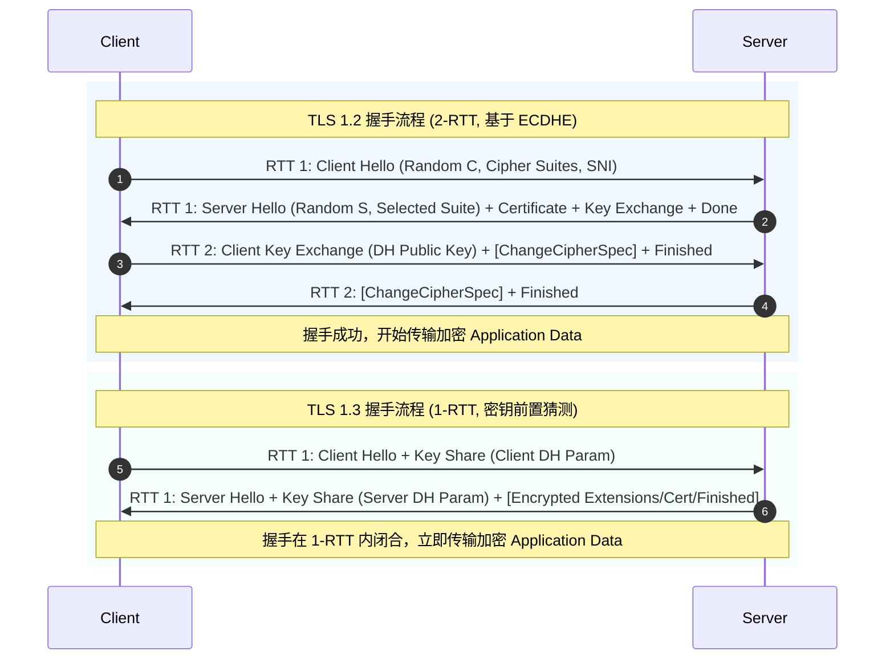
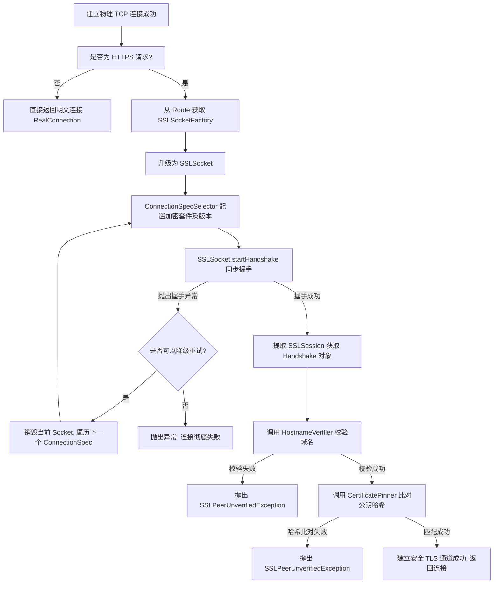

# HTTPS 与 TLS 在 OkHttp 中的机制及安全实践

## 1. 目录索引与学习指南

- [Android 知识体系](../../../../RootIndex.md) / [主流三方开源库](../../../README.md) / [OkHttp 核心原理](../README.md)
- 本文关联的 Android 版本变更日志：[AndroidVersionChangeLog.md](../../../../../../AndroidVersionChangeLog.md)

---

## 2. HTTPS / TLS 核心概念与协商基石

在现代互联网通信中，HTTP 协议的明文传输特性使其在面对窃听、篡改和冒充等威胁时毫无抵抗力。为了保障通信安全，IETF 引入了运行在 TCP 与应用层之间的安全协议——**TLS (Transport Layer Security，传输层安全)**，并在其上承载 HTTP，形成了 **HTTPS (Hypertext Protocol Secure)**。理解 HTTPS 的安全防护能力，必须建立在对其三大协商基石的深度认知上：对称加密、非对称加密以及基于数字证书的信任链。

### 2.1 对称加密与非对称加密的混合体制

#### 2.1.1 对称加密的数学底蕴与性能考量
对称加密算法（如 AES-GCM、ChaCha20-Poly1305）在机密性保护中扮演着“主力军”的角色。以高级加密标准（AES）为例，其核心设计基于 Rijndael 密码体制，采用**置换-组合网络（SPN, Substitution-Permutation Network）**结构。在加密过程中，明文数据被划分为固定大小的分组（如 128 位），并经历多轮数学变换，包括字节代换（SubBytes）、行移位（ShiftRows）、列混淆（MixColumns）和轮密钥加（AddRoundKey）。
*   **混淆（Confusion）**：通过非线性的 S-Box 替换，使得密钥与密文之间的依赖关系极其复杂，攻击者无法通过统计分析推导密钥。
*   **扩散（Diffusion）**：通过行移位和列混淆，将明文的单个位（bit）变化扩散到整个分组，实现“牵一发而动全身”的效果。
从计算性能角度来看，AES 的这些操作完全是底层的置换、异或以及有限域 $\text{GF}(2^8)$ 上的矩阵乘法，现代 CPU（包括 ARM 和 x86 架构）都集成了 **AES-NI 硬件指令集**。这使得对称加密的吞吐量极高，在移动端设备上进行流式加解密时，其 CPU 占用率和耗电量几乎可以忽略不计。然而，对称加密面临不可调和的**“密钥分发困境”**：如果通信双方在建立连接前无法安全地共享这枚“对称密钥”，那么后续的一切加密机制都将失去立足之本。

#### 2.1.2 非对称加密的数论难题与性能取舍
非对称加密算法（如 RSA、ECC）通过一对数学上关联的密钥（公钥与私钥）解决了密钥交换难题。
*   **RSA 算法**：基于**大整数素因子分解难题**。其数学基石在于欧拉定理：选取两个大素数 $p$ 和 $q$，计算其乘积 $n = p \cdot q$。计算欧拉函数 $\varphi(n) = (p-1)(q-1)$。选择一个与 $\varphi(n)$ 互素的加密指数 $e$（通常为 65537），并计算满足 $e \cdot d \equiv 1 \pmod{\varphi(n)}$ 的解密指数 $d$。公钥为 $(e, n)$，私钥为 $(d, n)$。加密过程为 $C = M^e \pmod n$，解密过程为 $M = C^d \pmod n$。RSA 算法的安全强度完全依赖于对大整数 $n$ 进行素因子分解的极高时间复杂度。然而，高精度的模幂运算（Modulus Exponentiation）需要极大的计算开销，高并发的服务器在面对数万次 RSA 解密请求时，CPU 将迅速过载。
*   **ECC（椭圆曲线密码学）**：基于**椭圆曲线离散对数问题（ECDLP）**。在有限域 $\text{F}_p$ 上的椭圆曲线 $y^2 = x^3 + ax + b \pmod p$ 上，定义点加和倍点运算。选择一个基点 $G$，私钥为一个大整数 $d$，公钥为曲线上的一个点 $Q = d \cdot G$。由于在已知 $Q$ 和 $G$ 的情况下，推导 $d$ 在数学上极其困难，这构成了 ECC 的安全基石。相比 RSA，ECC 具有显著的优势：**更短的密钥长度**（例如，256 位的 ECC 密钥所提供的安全强度，相当于 3072 位的 RSA 密钥），这不仅减少了握手报文的物理大小，也大幅提升了移动端的计算性能。

#### 2.1.3 混合加密体制（Hybrid Cryptosystem）
正是由于对称加密效率高但无法安全分发密钥，非对称加密安全但计算极其沉重，HTTPS 融合了二者的长处，构建了**混合加密体制**：
1.  **建连与协商期**：客户端与服务器通过非对称加密算法（如 ECDHE）进行身份认证，并协商出一个随机的对称密钥（工作密钥，称为 Master Secret）。
2.  **数据传输期**：一旦工作密钥协商完毕，非对称加密通道功成身退，后续所有的 HTTP 请求和响应均使用该对称密钥进行对称加密传输，保障了极致的传输效率。

---

### 2.2 数字证书（CA）信任链与证书结构

混合加密机制虽然解决了密钥的安全交换问题，但引入了另一个致命的隐患：**客户端如何确信它在网络上收到的“服务器公钥”确实属于目标服务器，而不是中间人伪造的？**这就是著名的中间人攻击（Man-in-the-Middle, MITM）。为了解决公钥与域名绑定关系的真实性认证问题，互联网引入了公钥基础设施（PKI）中的核心角色——**证书颁发机构 (Certificate Authority, CA)**。

#### 2.2.1 X.509 V3 证书的物理结构
X.509 标准定义了数字证书的物理结构。证书是一个经由 CA 私钥签名的 ASN.1 格式二进制文件（在传输时通常采用 DER 编码，或将其转换为 Base64 编码并加上标识形成 PEM 格式）。其核心字段包括：
*   **TBSCertificate (To Be Signed Certificate)**：待签名的证书主体，包含：
    *   **Version**：版本号（通常为 V3，支持扩展字段）。
    *   **Serial Number**：CA 签发的唯一证书序列号，用于吊销状态查询。
    *   **Signature Algorithm ID**：用于签名的加密算法（例如 `sha256WithRSAEncryption` 或 `ecdsa-with-SHA256`）。
    *   **Issuer**：证书颁发机构的 Distinguished Name (DN)。
    *   **Validity Period**：证书的生效与失效时间。
    *   **Subject**：证书持有主体的 DN（如公司名称、国家等）。
    *   **Subject Public Key Info (SPKI)**：**最为关键的字段**，包含服务器的公钥算法（如 RSA/EC）以及公钥的原始字节。这是证书固定（Pinning）的目标。
    *   **Extensions**：V3 引入的扩展字段，包括：
        *   **Basic Constraints**：标识该证书是终端实体证书（Leaf）还是可以继续签发下级证书的 CA 证书。
        *   **Subject Alternative Name (SAN)**：主题备用名称，用于声明该证书适用的所有域名（例如 `*.example.com`、`example.com`）。**这是现代主机名校验的核心源数据**。
        *   **Key Usage**：声明公钥的用途（如 Digital Signature, Key Encipherment）。
*   **SignatureAlgorithm**：签名算法。
*   **SignatureValue**：CA 签名值。计算方法为：将 TBSCertificate 结构体通过指定哈希算法（如 SHA-256）计算出数据摘要，随后使用 CA 的私钥对该摘要进行加密。客户端收到证书后，使用 CA 的公钥解密此签名，并比对哈希摘要，从而确保证书内容未被中途篡改。

#### 2.2.2 证书信任链（Chain of Trust）与锚点
由于全球存在数以亿计的域名，客户端不可能将所有域名证书都预装在本地。因此，PKI 采用树状分层的**证书信任链**进行分级授权管理：

```
                    ┌────────────────────────┐
                    │      根 CA 证书         │ (自签名, 系统安全区预装)
                    │  (Subject: Root CA)    │
                    └───────────┬────────────┘
                                │ (根 CA 私钥签名)
                                ▼
                    ┌────────────────────────┐
                    │     中间 CA 证书        │ (由二级/三级 CA 持有)
                    │  (Subject: Inter CA)   │
                    └───────────┬────────────┘
                                │ (中间 CA 私钥签名)
                                ▼
                    ┌────────────────────────┐
                    │    服务器叶子证书       │ (部署在目标 Web 服务器上)
                    │ (Subject: yourbank.com)│
                    └────────────────────────┘
```
1.  **根证书（Root Certificate）**：由顶级 Root CA 自签名生成的证书。它是信任链的起点，称为**信任锚点（Trust Anchor）**。Android 系统在安全区（通常在 `/system/etc/security/cacerts/`）预装了百余个受信任的根证书。
2.  **中间证书（Intermediate Certificate）**：Root CA 不直接对普通域名签发证书，而是签发中间 CA。这样做的好处是，一旦某个中间证书发生泄露，只需吊销该中间证书，而无需更换客户端设备中极难更新的系统根证书。
3.  **叶子证书（End-Entity Certificate）**：绑定具体域名、部署在业务服务器上的证书。

当客户端发起连接时，服务器会出示一个完整的证书链：`[叶子证书 -> 中间证书 -> 根证书]`。客户端从叶子证书开始，利用上一级证书的公钥验证当前证书的签名，层层递推，直至在本地系统信任库中找到与之匹配并信任的根证书。如果整个验证链路完备且在有效期内，客户端即认为该连接安全。关于 Android 系统中 CA 证书的管理与信任库加载，可以参考 [AndroidVersionChangeLog.md](../../../../../../AndroidVersionChangeLog.md) 了解不同 Android 版本对自签名与系统级证书策略的调整。

#### 2.2.3 证书吊销状态校验：CRL 与 OCSP 机制
即使证书签名合法，如果证书对应的私钥泄露，或者域名所有者变更，证书必须被提前废弃。CA 提供了两种主流的吊销状态校验手段：
*   **CRL (Certificate Revocation List, 证书吊销列表)**：由 CA 定期发布的一个包含所有被吊销证书序列号的黑名单。
    *   *缺点*：随着吊销证书的增加，CRL 文件体积急剧膨胀，客户端下载不仅消耗流量，还会导致显著的建连延迟；此外，CRL 是定期更新的，存在时间上的灰色地带。
*   **OCSP (Online Certificate Status Protocol, 在线证书状态协议)**：一种实时在线查询协议。客户端在握手时，直接向 CA 的 OCSP 响应服务器（OCSP Responder）发送查询请求，验证特定证书的序列号是否被吊销。
    *   *缺点*：每次 TLS 握手都需要向第三方 CA 建立额外的连接，带来了不容忽视的 RTT 延迟，且泄露了用户正在访问特定域名的隐私。
*   **OCSP Stapling（OCSP 装订）**：**现代 HTTPS 的极致优化方案**。服务器周期性（如每 24 小时）向 CA 请求其证书状态的 OCSP 响应结果，并由 CA 对该结果进行签名。在 TLS 握手时，服务器将这一经过签名的 OCSP 响应与证书链一并发送给客户端。客户端只需验证签名的真实性，即可当场确认证书是否处于合规状态，既避免了客户端在线查询的延迟，又保护了用户隐私。

---

### 2.3 中间人攻击（MITM）攻防本质

中间人攻击的本质是**替换通信实体的公钥，欺骗发起方建立虚假信任**。

#### 2.3.1 中间人劫持的典型链路
当没有安全验证或验证失效时，中间人攻击的拓扑如下：

```
 客户端                                中间人                                服务器
   │                                    │                                    │
   │─────── 发起 TLS Client Hello ──────>│                                    │
   │                                    │─────── 转发 TLS Client Hello ──────>│
   │                                    <─────── 返回服务器真实证书 (S_Cert) ──│
   <─────── 返回伪造证书 (M_Cert) ───────│                                    │
   │                                    │                                    │
   │─── 用 M_Pub 加密 Pre-master Secret ─>│                                    │
   │                                    │ (用 M_Pri 解密，获取 Pre-master)    │
   │                                    │─── 用 S_Pub 加密 Pre-master Secret ─>│
   │                                    │                                    │
   <─────────── 建立加密通道 ────────────>|<─────────── 建立加密通道 ────────────>
```
在上述过程中，因为客户端没有验证返回的 `M_Cert` 与目标域名之间的合法性，使用中间人的公钥加密了关键的对称密钥参数。中间人截获后，用自己的私钥解密，获取了对称密钥，再用服务器的公钥加密伪造请求发给服务器。此时，所有的传输数据在中间人处全部暴露，且中间人可以任意进行篡改。

#### 2.3.2 CA 机制的防线
数字证书通过 CA 的非对称签名封堵了这一路径：中间人无法伪造含有服务器域名的合法证书，因为中间人无法获得权威 CA 的私钥来生成正确的签名。一旦中间人返回自签名或伪造的证书，客户端的证书链校验就会报错并直接终止连接。

#### 2.3.3 CA 机制的软肋：本地信任注入
然而，如果攻击者能够拿到用户的手机，或通过诱导用户安装含有恶意 CA 证书的描述文件（如在 iOS/Android 上安装某些网络管理配置，或在企业内网中强制安装的监控审计证书），攻击者就可以将恶意的 Root 证书注入到客户端系统的受信任根证书库中。
一旦注入成功，中间人就可以使用该恶意 Root CA 的私钥为任意域名（如 `github.com`、`yourbank.com`）实时动态签发虚假证书。在客户端看来，虽然该证书是虚假的，但因为它的根证书已经包含在系统的受信列表中，客户端仍会判定该证书合法，中间人攻击防线瞬间宣告瓦解。这也是金融级 App 必须强制实施“证书固定”的技术背景。

---

## 3. TLS 握手机制演进深度剖析

为了在不可信的网络介质上安全地建立混合加密通道，通信双方必须执行 TLS 握手协议。随着对延迟（Latency）与安全性的极致追求，TLS 协议经历了从 1.2 到 1.3 的重大演进。

### 3.1 TLS 1.2 握手流程深度梳理 (2-RTT)

TLS 1.2 握手是经典的二次往返（2-RTT）机制。其核心任务是：身份认证、确定 TLS 版本与算法、协商出对称密钥。

#### 3.1.1 经典 ECDHE 握手交互步骤

基于 ECDHE（椭圆曲线临时迪菲-赫尔曼）密钥交换算法的 TLS 1.2 握手流程如下：

*   **RTT 1.0 (Client -> Server)**
    1.  **Client Hello**：客户端向服务器发送明文信息，包含：
        *   支持的最高 TLS 协议版本（如 TLS 1.2）。
        *   客户端生成的随机数 **Client Random**（用于后续计算对称密钥）。
        *   支持的密码套件列表（Cipher Suites，如 `ECDHE-RSA-AES128-GCM-SHA256`）。
        *   扩展字段，如 SNI (Server Name Indication，用于指示多虚拟主机下的目标域名)。
*   **RTT 1.5 (Server -> Client)**
    2.  **Server Hello**：服务器回应明文信息，确定本次连接的 TLS 版本和密码套件，并给出服务器生成的随机数 **Server Random**。
    3.  **Certificate**：服务器发送自身的 X.509 证书链。
    4.  **Server Key Exchange**：由于采用 ECDHE 算法，服务器随机生成一个椭圆曲线私钥，计算出临时公钥（Key Exchange Parameter），并使用服务器证书对应的私钥对其进行签名，发送给客户端。
    5.  **Server Hello Done**：服务器宣告初始化握手结束。
*   **RTT 2.0 (Client -> Server)**
    6.  **Client Key Exchange**：客户端验证服务器证书合法性后，也随机生成一个椭圆曲线私钥，计算出临时的客户端公钥发送给服务器。
        *   *计算 Pre-master Secret*：此时，客户端和服务器各自拥有自己的椭圆曲线私钥和对方的临时公钥。根据 ECDH 数学原理，双方均能独立计算出相同的共享密钥 `Pre-master Secret`。
        *   *计算 Master Secret*：双方使用 PRF（伪随机函数），结合 `Client Random` + `Server Random` + `Pre-master Secret`，计算出最终的对称密钥 `Master Secret`（工作密钥）。
    7.  **Change Cipher Spec**：客户端发送此单字节明文通知，宣告“此后的所有报文都将采用刚刚协商好的 `Master Secret` 进行加密传输”。
    8.  **Finished**：客户端发送首个加密的握手报文（包含之前所有握手内容的哈希值校验），用于验证加密通道的完整性。
*   **RTT 2.5 (Server -> Client)**
    9.  **Change Cipher Spec**：服务器验证客户端 of Finished 报文无误后，也发送自己的 Change Cipher Spec。
    10. **Finished**：服务器发送自己的加密 Finished 报文。
    *   **握手成功**，后续开始传输加密的应用层数据（Application Data）。

#### 3.1.2 密钥交换算法的演进与前向安全性（PFS）
在 TLS 1.2 早期，广泛使用 **RSA 密钥交换算法**。在 RSA 模式下：
1. 客户端生成 `Premaster Secret`。
2. 客户端直接用服务器证书中的公钥加密该 `Premaster Secret` 并通过 `Client Key Exchange` 发送给服务器。
3. 服务器用自己的私钥解密，获得 `Premaster Secret`。

**RSA 算法致命缺陷**：不具备**完美前向安全性 (Perfect Forward Secrecy, PFS)**。如果攻击者常年录网并记录了客户端与服务器之间的所有密文流量，一旦有一天服务器的私钥泄露，攻击者就可以解密历史上所有被录网的 `Client Key Exchange` 报文，获取 `Premaster Secret`，进而还原出每一次连接的 `Master Secret`，使历史所有密文数据被一次性破解。

**DH/ECDH（Diffie-Hellman / Elliptic Curve Diffie-Hellman）密钥交换算法**解决了该问题。在 ECDHE（E代表临时 Ephemeral）模式下：
* 双方握手时生成的椭圆曲线私钥是**一次性临时生成、用完即弃**的。
* 即使服务器的长期私钥泄露，它也只在握手阶段用于对临时的 DH 参数进行签名（身份验证），并不能解密历史流量中的 ECDH 共享密钥计算过程。因为计算共享密钥需要的是每个连接临时生成的私钥，而这些私钥从未在网络上传输，且在内存中已被销毁。因此，ECDHE 提供了完美前向安全性。

### 3.2 TLS 1.3 握手流程深度梳理 (1-RTT & 0-RTT)

TLS 1.3 在 2018 年（RFC 8446）发布，完成了 TLS 历史上最大幅度的安全净化与性能跃升。

#### 3.2.1 1-RTT 密钥协商原理与合并发送
TLS 1.2 的 2-RTT 延迟在高频建连的移动端显得过于臃肿。TLS 1.3 将常规握手耗时缩短到了 1-RTT。
其核心优化思路是：**合并参数，前置猜测**。
* 在 TLS 1.2 中，客户端在 `Client Hello` 中只列出自己支持的算法，必须等服务器在 `Server Hello` 中选定算法后，客户端才能在第二轮计算并发送 `Client Key Exchange`。
* 在 TLS 1.3 中，废弃了不支持前向安全性的算法（如 RSA 密钥交换），只保留了少数几个主流的椭圆曲线算法（如 X25519、P-256）。由于选项极少，客户端可以在发送 `Client Hello` 的同时，“自作主张”地直接生成这些常用椭圆曲线的临时私钥与公钥，并将这些公钥参数打包在 `Key Share` 扩展字段中，与 `Client Hello` 合并发送。
* 服务器收到后，直接从客户端的 `Key Share` 中选取匹配的曲线，生成自己的临时公钥，在 `Server Hello` 中一并返回给客户端。同时，服务器在这一步就能直接计算出 `Pre-master Secret` 并生成加密密钥，因此从 `Server Hello` 之后的 Server 握手报文（包括 Certificate、Finished 等）就已经是加密传输的了。

这样，双方仅需一次往返（1-RTT）就协商完成了密钥，并开始传输加密的业务数据。

#### 3.2.2 0-RTT PSK 会话恢复原理
对于曾经建立过连接的客户端与服务器，TLS 1.3 支持零延迟（0-RTT）的数据传输：
1.  在首次连接（1-RTT）成功后，服务器会向客户端发送一个 **New Session Ticket**。该 Ticket 中包含一段加密的会话状态数据，其内部蕴含着一个双方协商好的**预共享密钥（Pre-Shared Key, PSK）**。
2.  当客户端再次尝试连接该服务器时，可以在 `Client Hello` 的 `pre_shared_key` 扩展中携带此 Ticket，并且**无需等待服务器的任何回应**，直接在 `Client Hello` 之后拼接发送首包应用层加密数据（称为 Early Data）。
3.  服务器接收到 `Client Hello` 后，解密 Ticket 提取出 PSK，并使用该 PSK 解密紧随其后的 Early Data。若验证通过，服务器在返回 `Server Hello` 的同时，可以直接返回业务响应数据。
4.  **Stateless（无状态）会话恢复机制**：在分布式服务器集群中，通过 Session Ticket 机制，服务器无需在本地内存中同步数以百万计的会话 Session ID 状态，而是将协商好的密钥、到期时间等状态信息使用只有服务器集群共享的**票据加密密钥（STEK, Session Ticket Encryption Key）**进行强加密后存放在 Ticket 中，完全交由客户端保管。客户端下次请求时出示该 Ticket，服务器只需对其进行快速解密验签即可恢复会话，这极大地降低了服务端的架构复杂度和内存压力。

#### 3.2.3 0-RTT 的重放攻击（Replay Attack）隐患与安全防范
0-RTT 在带来零延迟体验的同时，引入了严重的网络安全隐患——**重放攻击**。

*   **攻击原理**：由于 0-RTT 的 Early Data 在握手尚未完全闭合前发送，且基于静态的 PSK，中间人攻击者如果截获了客户端发送的包含 `Client Hello` 和加密 Early Data 的 TCP 报文，攻击者无需解密该报文，只需原封不动地向服务器重新“重放”该 TCP 数据包。
*   **安全风险**：服务器收到重放的数据包后，会将其视作一次合法的 0-RTT 会话恢复，并解密处理。如果 Early Data 承载的是一个有副作用的非幂等请求（例如 `POST /api/v1/pay?amount=100`），服务器可能会执行两次扣款操作。

```
客户端                          中间人                          服务器
  │                              │                                │
  │─── ClientHello + EarlyData ──> (截获并记录数据包)               │
  │                              │─── ClientHello + EarlyData ───>│ (正常处理,扣款)
  │                              │                                │
  │                              │─── (再次重放数据包) ───────────>│ (重复处理,再次扣款)
```

*   **工业界安全权衡与防御策略**：
    1.  **单向单次 Ticket (Single-Use Tickets)**：服务器对每个 Ticket 仅允许使用一次，使用后立即在内存数据库中置为失效。这需要服务器集群间极高性能的状态同步，运维成本高。
    2.  **时间窗校验 (Client Hello Age Verification)**：在 `Client Hello` 中包含混淆的发送时间戳，服务器校验该时间戳与当前服务器系统时间，如果偏差超出极窄的窗口（如几秒钟），则拒绝 0-RTT，强制降级到 1-RTT。
    3.  **幂等性限制（最核心手段）**：**OkHttp 默认不对非幂等请求启用 0-RTT**。在 RFC 8446 规范中，强烈建议客户端仅在 HTTP 安全且幂等的请求（如 `GET`、`HEAD`）中使用 0-RTT Early Data。对于 `POST`、`PUT` 等修改状态的请求，必须使用常规的 1-RTT 握手。

### 3.3 TLS 与 TCP 物理层重叠机制：TCP Fast Open

在移动互联网环境下，每一个 RTT 的降低都意味着用户体验的显著提升。在 TLS 1.3 的 1-RTT 握手之外，如果配合 **TCP Fast Open (TFO, RFC 7413)**，我们可以实现更深度的性能飞跃。

常规情况下，网络连接必须先经历 TCP 三次握手（1 个 RTT），然后才能进行 TLS 握手。而在支持 TFO 的系统与服务器上：
1.  在首次连接成功后，服务端会在握手响应中向客户端下发一个 **Cookie**。
2.  在后续的建连请求中，客户端直接在 TCP 的首包 **SYN 报文**中携带此 Cookie，并**直接附带 TLS Client Hello 数据**。
3.  服务端在收到 SYN 报文后，验证 Cookie 有效性，并在向客户端发送 SYN-ACK 报文（TCP 第二步）的同时，直接进行 TLS 的协商响应。
4.  这使得 TCP 握手与 TLS 握手在物理网络层面上完成了**重叠融合**，进一步消减了常规 TCP 握手带来的开销。

### 3.4 TLS 1.2 与 TLS 1.3 物理握手交互及 RTT 时序对比



---

## 4. OkHttp 中的 TLS 建立与装配（源码级剖析）

在 Android 生态中，OkHttp 是网络通信的事实标准。它对 TLS 的配置、升级、握手以及证书检验进行了高度的工程化封装。

### 4.1 RealConnection.connectTls() 核心源码调用链与握手触发机制

当 OkHttp 执行到 `ConnectInterceptor` 时，会通过 `ExchangeFinder` 寻找或创建物理连接 `RealConnection`。如果请求是 HTTPS，则会在建立 TCP Socket 连接后，调用 `RealConnection.connectTls()` 方法将普通 Socket 升级为安全套接字 `SSLSocket` 并发起握手。

以下是 `RealConnection.connectTls()` 阶段的核心源码简化分析（基于 OkHttp 4.x 架构）：

```kotlin
private fun connectTls(connectionSpecSelector: ConnectionSpecSelector) {
  val address = route.address
  val sslSocketFactory = address.sslSocketFactory
  var sslSocket: SSLSocket? = null
  try {
    // 1. 利用 SocketFactory，将现有的明文 rawSocket 包装升级为 SSLSocket
    sslSocket = sslSocketFactory!!.createSocket(
        rawSocket,
        address.url.host,
        address.url.port,
        true /* autoClose */
    ) as SSLSocket

    // 2. 根据连接规格选择器，配置 SSLSocket 的 TLS 版本、密码套件及扩展字段
    val connectionSpec = connectionSpecSelector.configureSecureSocket(sslSocket)
    if (connectionSpec.supportsTlsExtensions) {
      // 启用 ALPN (Application-Layer Protocol Negotiation) 协议协商（用于 HTTP/2）
      Platform.get().configureTlsExtensions(sslSocket, address.url.host, address.protocols)
    }

    // 3. 核心触发点：启动物理握手。此步骤为同步阻塞调用，执行底层的 TLS 握手协议
    sslSocket.startHandshake()
    
    // 4. 从 SSLSocket 获取当前握手的会话状态 SSLSession
    val sslSocketSession = sslSocket.session
    val handshake = Handshake.get(sslSocketSession)

    // 5. 进行域名校验 (Hostname Verification)
    if (!address.hostnameVerifier!!.verify(address.url.host, sslSocketSession)) {
      val peerCertificates = handshake.peerCertificates
      if (peerCertificates.isNotEmpty()) {
        val cert = peerCertificates[0] as X509Certificate
        throw SSLPeerUnverifiedException("""
            |Hostname ${address.url.host} not verified:
            |    certificate: ${CertificatePinner.pin(cert)}
            |    DN: ${cert.subjectDN.name}
            |    subjectAltNames: ${OkHostnameVerifier.allSubjectAltNames(cert)}
            """.trimMargin())
      } else {
        throw SSLPeerUnverifiedException("Hostname ${address.url.host} not verified (no certificates)")
      }
    }

    // 6. 进行证书固定强比对校验 (Certificate Pinning)
    val certificatePinner = address.certificatePinner!!
    certificatePinner.check(address.url.host, handshake.peerCertificates)

    // 7. 保存握手成功的状态及协议版本
    val successProtocol = if (connectionSpec.supportsTlsExtensions) {
      Platform.get().getSelectedProtocol(sslSocket)?.let { Protocol.get(it) }
    } else {
      null
    }
    
    this.socket = sslSocket
    this.handshake = handshake
    this.protocol = successProtocol ?: Protocol.HTTP_1_1
  } catch (e: AssertionError) {
    if (e.isGcEvictingTlsException()) throw IOException(e)
    throw e
  } catch (e: Exception) {
    // 握手失败，执行资源清理，并向 Selector 标记此规格在此路由下不可用，为降级做准备
    sslSocket?.closeQuietly()
    throw e
  }
}
```

#### 4.1.1 关键结构：`Handshake` 类对象解构
一旦 `sslSocket.startHandshake()` 成功，通过 `Handshake.get(sslSocket.session)` 会将底层的 `SSLSession` 转换为 OkHttp 内部维护的 `Handshake` 对象。该类是对一次安全连接元数据的高度提炼：
*   **`tlsVersion: TlsVersion`**：表示最终协商采用的 TLS 版本。对应类 `TlsVersion` 枚举值：`TLS_1_3`, `TLS_1_2`, `TLS_1_1`, `TLS_1_0`, `SSL_3_0`。
*   **`cipherSuite: CipherSuite`**：最终协商采用的密码套件（如 `TLS_AES_128_GCM_SHA256`）。
*   **`peerCertificates: List<Certificate>`**：服务器下发的对端证书链，首个元素 `peerCertificates[0]` 即为叶子证书，后续为中间证书。
*   **`localCertificates: List<Certificate>`**：客户端自身发送的证书链，在双向认证（mTLS）中用于证明客户端身份。

#### 4.1.2 Conscrypt 引擎在 Android 上的性能加速机制
在 Android 平台上，底层的 `SSLSocketFactory` 以及 `SSLSocket` 实现随着系统版本的演进发生了很大变化。现代 Android 系统（Android 10+）默认集成了基于 **Conscrypt** 引擎的安全服务提供者（Security Provider）。
*   Conscrypt 内部封装了 Google 的 **BoringSSL**（OpenSSL 的一个分支，使用汇编和 C 语言编写）。
*   在执行 `startHandshake()` 时，Conscrypt 通过 JNI 调用底层的原生方法，直接在 C 语言层执行椭圆曲线计算和 AES/ChaCha20 的解密，大大避免了 Java 层的垃圾回收与对象分配（Conscrypt 会大量复用直接堆外内存 DirectByteBuffer）。
*   如果你的 App 需要在老旧 Android 系统（如 Android 5.0/6.0，这些系统自带的 OpenSSL 包装类性能极差且不支持 TLS 1.3）上获得同等优秀的网络性能与安全性，可以通过引入 Conscrypt 依赖库并动态将其插入到 JCE Provider 队列的第一位，强制覆盖系统原生的低效实现。

---

### 4.2 ConnectionSpec（连接规格）与自动降级协商兼容算法

由于网络设备碎片化严重，不同服务支持的 TLS 版本和密码套件各异。为了兼顾**极致安全**与**广泛兼容**，OkHttp 引入了 `ConnectionSpec`（连接规格）和 `ConnectionSpecSelector`（规格选择器）。

#### 4.2.1 ConnectionSpec 核心结构
`ConnectionSpec` 本质上是约束配置的集合，包含：
*   `tlsVersions`: 允许的 TLS 版本列表。
*   `cipherSuites`: 允许的密码套件列表。
*   `supportsTlsExtensions`: 是否支持 TLS 扩展（如 SNI、ALPN）。

OkHttp 内置了四个标准规格：
1.  **`RESTRICTED_TLS`**：极为严格的安全规格，仅支持 TLS 1.3，搭配最强安全的密码套件。
2.  **`MODERN_TLS`**：**默认规格**，支持 TLS 1.3 与 TLS 1.2，兼容现代主流安全服务器。
3.  **`COMPATIBLE_TLS`**：兼容规格，支持 TLS 1.0 以上，密码套件范围大，用于连接老旧服务器。
4.  **`CLEARTEXT`**：明文规格，不对 Socket 进行 SSL/TLS 升级，用于常规 `http://` 请求。

#### 4.2.2 自动降级协商机制原理
在发起建连时，OkHttp 默认会传入一个规格列表（通常为 `[ConnectionSpec.MODERN_TLS, ConnectionSpec.CLEARTEXT]`）。`ConnectionSpecSelector` 会在多次尝试连接的过程中，自动调整并选择合适的规格进行协商。

我们来深入分析 `ConnectionSpecSelector` 的底层工作逻辑。当建连抛出异常时，OkHttp 在 `RetryAndFollowUpInterceptor` 触发重试，再次调用 `connectTls`，此时 `ConnectionSpecSelector.configureSecureSocket()` 会在剩下的规格列表中寻找下一个匹配项：

```kotlin
// ConnectionSpecSelector 内部选择与配置逻辑
fun configureSecureSocket(sslSocket: SSLSocket): ConnectionSpec {
  var allowedSpec: ConnectionSpec? = null
  
  // 遍历剩余的 ConnectionSpecs，寻找第一个与当前 Socket 物理能力匹配的规格
  for (i in nextModeIndex until connectionSpecs.size) {
    val spec = connectionSpecs[i]
    if (spec.isCompatible(sslSocket)) {
      allowedSpec = spec
      nextModeIndex = i + 1 // 标记下一次降级重试时的起点
      break
    }
  }

  if (allowedSpec == null) {
    throw UnknownServiceException(
        "Unable to find acceptable protocols. " +
        "isFallback=${isFallback}, " +
        "modes=${connectionSpecs}, " +
        "supported protocols=${sslSocket.enabledProtocols.contentToString()}"
    )
  }

  // 判断如果此连接失败，后续是否还可以进行降级重试
  isFallbackPossible = isFallbackPossible(sslSocket)

  // 真正将选中的协议 and 套件应用到底层的 Java SSLSocket 上
  allowedSpec.apply(sslSocket, isFallback)

  return allowedSpec
}
```
*通过这种动态回退（Fallback）算法，OkHttp 在保障现代连接能享受到 TLS 1.3 / 1.2 的高性能与高安全的同时，能够优雅降级兼容老旧服务器，避免了在客户端写死安全规格导致的大面积连接失败。*

#### 4.2.3 ALPN 协商细节
在 `configureSecureSocket` 中，如果 `supportsTlsExtensions` 为 true，OkHttp 会调用平台实现来配置 ALPN。
*   **ALPN (Application-Layer Protocol Negotiation)** 允许客户端在 TLS 握手的 Client Hello 报文的 ALPN 扩展字段中，携带其支持的应用层协议列表，如 `["h2", "http/1.1"]`。
*   服务器在 Server Hello 的 ALPN 扩展中返回选定的应用层协议，如 `"h2"`。
*   这避免了在 TLS 握手闭合后再发起额外的 HTTP `Upgrade` 请求，直接在 TLS 协商中决定采用 HTTP/2，不仅消减了 1 个建连 RTT，也消除了明文协议升级带来的安全隐患。

### 4.3 OkHttp 建连阶段决策树流程图



---

## 5. 工业级网络安全防护（安全重中之重）

在金融、支付、核心业务系统等高安全等级场景下，仅仅依赖系统默认的 CA 信任链与域名校验是远远不够的。我们需要通过证书固定（Certificate Pinning）、主机名校验防御、以及双向认证（mTLS）来构建工业级的网络防护网络。

### 5.1 CertificatePinner（证书公钥固定）

#### 5.1.1 信任链的隐患：为什么默认的 CA 信任是不够的？
如 2.3 节所述，系统默认的证书校验逻辑是“只要是系统信任的根 CA 签发的证书就是合法的”。这带来以下两个严重的单点崩溃隐患：
1.  **CA 被攻破或误签发**：全球有数百家受信任的 CA，任何一家 CA 如果被黑客攻破、或者内部管理混乱误签发了针对你公司域名（如 `yourbank.com`）的虚假证书，客户端将无法识别该证书为虚假证书并予以信任。
2.  **本地根证书劫持**：攻击者在用户手机上植入恶意 Root 证书（如部分政企监控软件、恶意广告拦截插件）。此时，攻击者可以使用其自签名的恶意证书对客户端的所有网络流量进行透明解密。

#### 5.1.2 证书固定（Pinning）的本质与 SPKI 原理
为了防范上述漏洞，**证书固定（Certificate Pinning）**应运而生。它改变了传统的验证方式：不仅要求证书链合法，还强制要求服务器证书链中**必须包含客户端预设的特定公钥哈希值**。

**为什么要固定公钥（SPKI）而不是固定整个证书文件？**
*   **证书文件的固定（Certificate Pinning）**：将服务器证书的 DER 编码文件打包嵌入到 App 内部。这种方式的致命缺点是**证书生命周期通常很短**。一旦证书因过期、泄露而需要更换，App 必须强制发布新版本，否则旧版 App 将因证书无法匹配而瘫痪。
*   **公钥的固定（SubjectPublicKeyInfo Pinning）**：仅提取证书结构中的 **Subject Public Key Info (SPKI)** 计算 SHA-256 哈希进行比对。由于在实际运维中，即使服务器证书过期并重新向 CA 申请新证书，其底层的**公钥对（Public Key Pair）可以保持不变**。因此，固定公钥极大降低了因证书日常轮转（Key Rotation）导致的运维风险。

```kotlin
// OkHttp CertificatePinner 底层匹配逻辑分析
fun check(hostname: String, peerCertificates: List<Certificate>) {
  // 1. 根据 hostname 查找匹配的固定规则（支持通配符，如 *.yourbank.com）
  val findMatchingPins = findMatchingPins(hostname)
  if (findMatchingPins.isEmpty()) return

  // 2. 将 peerCertificates 转换为 X509Certificate 列表
  val x509Certificates = peerCertificates.map { it as X509Certificate }

  // 3. 逐个提取证书的公钥计算 SHA-256，并与预设的 pin 码进行强匹配
  for (cert in x509Certificates) {
    var sha256: ByteString? = null
    for (pin in findMatchingPins) {
      if (pin.hashAlgorithm == "sha256") {
        if (sha256 == null) sha256 = cert.publicKey.encoded.toByteString().sha256()
        if (pin.hash == sha256) {
          return // 只要证书链中任意一个证书（如叶子、中间证书）匹配了 Pin，即通过验证
        }
      }
    }
  }

  // 4. 匹配失败，抛出 SSLPeerUnverifiedException，强行中断 TCP/TLS 链路
  throw SSLPeerUnverifiedException("Certificate pinning failure! Peer certificates: ...")
}
```

#### 5.1.3 生产级 Kotlin 配置示例

在实际生产中，必须同时配置**主公钥固定**与**备用公钥固定（Backup Pin）**。备用公钥对应的私钥应离线存储在企业物理保险箱中，只有当主密钥丢失或泄露时才用于紧急签发新证书，以避免 App 彻底不可用。

```kotlin
import okhttp3.CertificatePinner
import okhttp3.OkHttpClient
import okhttp3.Request
import java.io.IOException

class SecureNetworkClient {

    private val certificatePinner = CertificatePinner.Builder()
        // 对主域名进行公钥固定
        .add("api.yourbank.com", "sha256/7HIpbpzBhdoC7yXX4IZ9jaCHDGa17W8l6wOARzWlsn8=") // 主公钥
        .add("api.yourbank.com", "sha256/k2v657xssCcgvfFihPRWmOmDBXXDmTKyof68G929tTw=") // 离线备用公钥 1
        // 支持通配符子域名
        .add("*.yourbank.com", "sha256/7HIpbpzBhdoC7yXX4IZ9jaCHDGa17W8l6wOARzWlsn8=")
        .build()

    val okHttpClient: OkHttpClient = OkHttpClient.Builder()
        .certificatePinner(certificatePinner)
        .build()

    fun executeSecureCall() {
        val request = Request.Builder()
            .url("https://api.yourbank.com/v1/profile")
            .build()
        try {
            okHttpClient.newCall(request).execute().use { response ->
                if (!response.isSuccessful) throw IOException("Unexpected code $response")
                println("Secure response: ${response.body?.string()}")
            }
        } catch (e: Exception) {
            e.printStackTrace()
            // 在中间人攻击或证书未匹配时，此处会捕获 SSLPeerUnverifiedException
        }
    }
}
```

#### 5.1.4 证书固定的绕过测试与 Frida 防御
在安全审计或逆向工程中，黑客常使用 **Frida** 动态插桩工具对 OkHttp 的 `CertificatePinner` 进行 Hook 绕过（通常定位 `okhttp3.CertificatePinner.check` 方法并将其直接置空返回）。

为了防御这种 Hook，除了常规的 Native 混淆外，我们还可以在客户端中嵌入对 Frida 动态特征的自主感知代码。

```kotlin
import java.io.BufferedReader
import java.io.FileReader
import java.io.File

object FridaAntiHookDetector {

    /**
     * 检测当前进程的内存映射中是否存在 Frida 专有的 so 库注入特征
     */
    fun detectFridaPresence(): Boolean {
        try {
            val mapsFile = File("/proc/self/maps")
            if (!mapsFile.exists()) return false

            BufferedReader(FileReader(mapsFile)).use { reader ->
                var line: String?
                while (reader.readLine().also { line = it } != null) {
                    val currentLine = line ?: break
                    if (currentLine.contains("frida-agent.so") || 
                        currentLine.contains("frida_agent") || 
                        currentLine.contains("re.frida.server")) {
                        return true
                    }
                }
            }
        } catch (e: Exception) {
            // 静默处理，避免引发正常用户崩溃
        }
        return false
    }
}
```
*在 App 发起敏感网络请求前，主动执行此检测。一旦探测到内存中存在 `frida-agent.so`，直接终止程序或断开核心网络通道，能将动态 Hook 扼杀在摇篮之中。*

---

### 5.2 HostnameVerifier（主机名校验）

主机名校验（Hostname Verification）是 TLS 建立连接后的一项关键安全防线，用于验证**当前正在通信的物理服务器地址（Domain Name）是否与证书声称拥有的 Subject 属性完全一致**。如果省略此校验，即使证书本身是由权威 CA 签发且完全合法的，中间人也可以将属于域名 `badguy.com` 的合法证书出示给访问 `yourbank.com` 的客户端，达到李代桃僵的效果。

#### 5.2.1 OkHostnameVerifier 源码匹配机制剖析

在 OkHttp 中，默认的主机名验证实现是 `okhttp3.internal.tls.OkHostnameVerifier`。它遵循 **RFC 2818** 和 **RFC 6125** 标准，核心校验逻辑如下：

```kotlin
// OkHostnameVerifier 源码逻辑提炼
object OkHostnameVerifier : HostnameVerifier {
  private const val ALT_DNS_NAME = 2
  private const val ALT_IP_ADDRESS = 7

  override fun verify(host: String, session: SSLSession): Boolean {
    return try {
      val certificates = session.peerCertificates
      verify(host, certificates[0] as X509Certificate)
    } catch (e: SSLException) {
      false
    }
  }

  fun verify(host: String, certificate: X509Certificate): Boolean {
    // 1. 判断 host 是不是 IP 地址。如果是 IP，则去 SAN 中匹配 IPAddress 属性
    return if (host.toCanonicalHost().isIpAddress()) {
      verifyIpAddress(host, certificate)
    } else {
      // 2. 如果是域名，则去 SAN 中匹配 DNSName 属性
      verifyHostname(host, certificate)
    }
  }

  private fun verifyIpAddress(ipAddress: String, certificate: X509Certificate): Boolean {
    val canonicalIpAddress = ipAddress.toCanonicalHost()
    val altNames = getSubjectAltNames(certificate, ALT_IP_ADDRESS)
    for (altName in altNames) {
      if (canonicalIpAddress == altName.toCanonicalHost()) {
        return true
      }
    }
    return false
  }

  private fun verifyHostname(hostname: String, certificate: X509Certificate): Boolean {
    val lowerCaseHostname = hostname.asciiToLowercase()
    // 优先从 Subject Alternative Names (SAN) 中提取 DNS 属性
    val altNames = getSubjectAltNames(certificate, ALT_DNS_NAME)
    for (altName in altNames) {
      if (verifyHostnameDefaults(lowerCaseHostname, altName)) {
        return true
      }
    }
    // 注意：历史遗留的 Common Name (CN) 匹配在现代安全规范下已被废弃
    // 高版本 OkHttp 仅匹配 SAN，不再回退到 CN 校验，避免 CN 的安全漏洞
    return false
  }
}
```

#### 5.2.2 防范通配符泛域名绕过漏洞
通配符域名证书（如 `*.example.com`）给运维带来了极大的便利，但如果匹配算法不严谨，会引入严重的安全漏洞。`OkHostnameVerifier` 内部对通配符匹配进行了极其严格的边界限制：

```kotlin
// 内部通配符匹配细节逻辑
private fun verifyHostnameDefaults(hostname: String, pattern: String?): Boolean {
  ...
  // 规则 1：通配符 '*' 必须是模式的最左侧部分，且紧邻 '.'
  // 例如 *.example.com 合法； f*.example.com 或 *f.example.com 将不被允许
  if (!pattern.startsWith("*.") || pattern.indexOf('*', 1) != -1) {
    return false
  }

  // 规则 2：匹配目标域名必须包含与模式相同数量的域名分段
  // 例如 *.example.com 只能匹配 foo.example.com，而绝对不能匹配 foo.bar.example.com（不能跨级）
  if (hostname.length < pattern.length) {
    return false
  }
  if ("*." == pattern) {
    return false // 不能匹配纯通配符
  }

  // 规则 3：通配符不能用于匹配顶级域名 (TLD)
  // 例如，如果 pattern 是 *.co.uk，这代表可以匹配任意注册在 co.uk 下的域名，
  // 这会导致安全边界彻底崩溃。OkHostnameVerifier 依赖公共后缀列表（Public Suffix List）予以拦截。
  ...
}
```
*这种精细化的边界控制，彻底杜绝了黑客通过申请恶意通配符证书（或利用公共顶级域的通配符漏洞）对子域名进行拦截和冒充的攻击手段。*

---

### 5.3 自定义双向认证与自签名证书最佳实践

在一些封闭的网络环境（如企业内网）中，由于没有向公网 CA 机构申请证书，通常会使用自签名的 CA 证书。而在高安全性的金融或物联网（IoT）设备接入场景中，为了防止非法客户端调用 API，通常需要启用 **双向认证 (Mutual TLS, mTLS)**，即除了客户端校验服务端证书外，服务端也要对客户端的身份进行校验。

#### 5.3.1 核心隐患：TrustAllManager 的危害
许多开发者在遇到自签名证书报错（`SSLHandshakeException`）时，为求省事，经常会在网上拷贝一段“信任所有证书”的垃圾代码：

```java
// ！！！极度危险的反面教材，绝对禁止写入生产代码！！！
class TrustAllManager implements X509TrustManager {
    @Override
    public void checkClientTrusted(X509Certificate[] chain, String authType) {}
    @Override
    public void checkServerTrusted(X509Certificate[] chain, String authType) {} // 留空导致直接信任任何证书
    @Override
    public X509Certificate[] getAcceptedIssuers() { return new X509Certificate[0]; }
}
```
*这段代码将导致客户端的主机名校验、证书链验证、有效期校验等全部形同虚设。任何一个在局域网内开启了 Charles 抓包的普通攻击者，都可以拦截并完全窃听、篡改你的业务请求。*

#### 5.3.2 生产级安全的自签名证书加载与 SSLSocketFactory 装配（Kotlin）

正确的做法是：**将自签名根证书（CA 证书）内置在 App 资源文件中，并在内存中构建一个仅信任该自签名 CA 的 TrustManager 实例**。

```kotlin
import android.content.Context
import okhttp3.OkHttpClient
import java.io.InputStream
import java.security.KeyStore
import java.security.cert.CertificateFactory
import java.security.cert.X509Certificate
import javax.net.ssl.SSLContext
import javax.net.ssl.TrustManagerFactory
import javax.net.ssl.X509TrustManager

class SelfSignedClientHelper(private val context: Context) {

    /**
     * 根据 raw 目录下的自签名 CA 证书生成安全装配的 OkHttpClient
     * @param caRawResourceId 自签名证书的资源 ID (例如 R.raw.my_self_signed_ca)
     */
    fun getSecureClient(caRawResourceId: Int): OkHttpClient {
        // 1. 初始化 X.509 证书解析工厂
        val cf = CertificateFactory.getInstance("X.509")
        val caInput: InputStream = context.resources.openRawResource(caRawResourceId)
        val caCert: X509Certificate
        try {
            caCert = cf.generateCertificate(caInput) as X509Certificate
        } finally {
            caInput.close()
        }

        // 2. 创建一个内存 KeyStore，并将自签名 CA 证书导入其中
        val keyStoreType = KeyStore.getDefaultType()
        val keyStore = KeyStore.getInstance(keyStoreType).apply {
            load(null, null) // 初始化空 KeyStore
            setCertificateEntry("my_ca", caCert) // 将自签名证书作为受信任的 Anchor 存入
        }

        // 3. 使用刚刚导入自签名 CA 的 KeyStore 初始化 TrustManagerFactory
        val tmfAlgorithm = TrustManagerFactory.getDefaultAlgorithm()
        val tmf = TrustManagerFactory.getInstance(tmfAlgorithm).apply {
            init(keyStore)
        }

        // 4. 获取 TrustManager 数组
        val trustManagers = tmf.trustManagers
        if (trustManagers.size != 1 || trustManagers[0] !is X509TrustManager) {
            throw IllegalStateException("Unexpected default trust managers: ${trustManagers.contentToString()}")
        }
        val trustManager = trustManagers[0] as X509TrustManager

        // 5. 初始化 SSLContext 并装配 SSLSocketFactory
        val sslContext = SSLContext.getInstance("TLS").apply {
            init(null, arrayOf(trustManager), null)
        }

        // 6. 装配至 OkHttpClient
        return OkHttpClient.Builder()
            .sslSocketFactory(sslContext.socketFactory, trustManager)
            .build()
    }
}
```

#### 5.3.3 双向认证（mTLS）客户端 KeyManager 证书加载流程
在 mTLS 中，除了客户端通过 `TrustManager` 验证服务端证书外，服务端还会向客户端发送 `Certificate Request` 报文。客户端必须通过 `KeyManager` 向上出示有效的客户端证书与私钥。

通常，金融或高安全等级 App 会将客户端证书打包为 **PKCS12 格式**（`.p12` 或 `.pfx`），其中包含了客户端的私钥、客户端证书以及中间证书链。

```kotlin
import okhttp3.OkHttpClient
import java.io.InputStream
import java.security.KeyStore
import javax.net.ssl.KeyManagerFactory
import javax.net.ssl.SSLContext
import javax.net.ssl.TrustManagerFactory
import javax.net.ssl.X509TrustManager

class MutualTlsClientHelper {

    /**
     * 双向认证（mTLS）网络装配
     * @param clientCertStream 客户端 .p12 格式私钥证书流
     * @param password p12 文件的解密密码
     * @param serverTrustStream 服务端自签名 CA 证书流（如为公网 CA 可传 null）
     */
    fun createMutualTlsClient(
        clientCertStream: InputStream,
        password: CharArray,
        serverTrustStream: InputStream? = null
    ): OkHttpClient {
        
        // 1. 加载客户端的私钥和证书 (KeyManager)
        val clientKeyStore = KeyStore.getInstance("PKCS12").apply {
            load(clientCertStream, password)
        }
        val kmf = KeyManagerFactory.getInstance(KeyManagerFactory.getDefaultAlgorithm()).apply {
            init(clientKeyStore, password)
        }

        // 2. 初始化服务端的 TrustManager
        val trustManager: X509TrustManager = if (serverTrustStream != null) {
            // 如果服务端是自签名证书，加载自定义 CA
            val cf = java.security.cert.CertificateFactory.getInstance("X.509")
            val serverCert = cf.generateCertificate(serverTrustStream)
            val trustKeyStore = KeyStore.getInstance(KeyStore.getDefaultType()).apply {
                load(null, null)
                setCertificateEntry("server_ca", serverCert)
            }
            val tmf = TrustManagerFactory.getInstance(TrustManagerFactory.getDefaultAlgorithm()).apply {
                init(trustKeyStore)
            }
            tmf.trustManagers[0] as X509TrustManager
        } else {
            // 如果服务端是公网受信证书，使用系统默认的 TrustManager
            val tmf = TrustManagerFactory.getInstance(TrustManagerFactory.getDefaultAlgorithm()).apply {
                init(null as KeyStore?)
            }
            tmf.trustManagers[0] as X509TrustManager
        }

        // 3. 构建并初始化 mTLS 专用的 SSLContext
        val sslContext = SSLContext.getInstance("TLS").apply {
            // 参数 1 传入 KeyManager（管理自己的私钥证书），参数 2 传入 TrustManager（管理受信的 CA）
            init(kmf.keyManagers, arrayOf(trustManager), null)
        }

        return OkHttpClient.Builder()
            .sslSocketFactory(sslContext.socketFactory, trustManager)
            .build()
    }
}
```

#### 5.3.4 mTLS 移动端高级实践：基于 KeyStore 硬件级别保护客户端私钥
在前面的方案中，私钥打包在 `.p12` 文件里，其密码容易在客户端被静态逆向或通过 Hook 方式拦截。为了确保客户端证书的安全，我们可以使用 Android 安全芯片硬件对私钥进行管理：
*   **TEE (Trusted Execution Environment) 或 StrongBox 安全芯片**：
    私钥直接在 Android 系统的安全存储区内生成。这意味着，**私钥的二进制文件永远无法被导出至内存中**。所有的加密和数字签名操作全部下沉至物理芯片层执行，软件层仅能获得执行签名的句柄。这彻底防止了 Root 后的设备私钥被黑客读取窃用的问题。

```kotlin
import android.security.keystore.KeyGenParameterSpec
import android.security.keystore.KeyProperties
import java.security.KeyPairGenerator
import java.security.KeyStore

object HardwareKeyStoreHelper {

    private const val KEY_ALIAS = "mutual_tls_client_key"

    /**
     * 在系统的可信硬件环境（TEE）中生成一对非对称密钥，并返回包含该密钥的 KeyStore
     */
    fun generateHardwareKeyPair(): KeyStore {
        val kpg = KeyPairGenerator.getInstance(
            KeyProperties.KEY_ALGORITHM_EC,
            "AndroidKeyStore"
        )
        
        val parameterSpec = KeyGenParameterSpec.Builder(
            KEY_ALIAS,
            KeyProperties.PURPOSE_SIGN or KeyProperties.PURPOSE_VERIFY
        ).run {
            setDigests(KeyProperties.DIGEST_SHA256, KeyProperties.DIGEST_SHA512)
            // 声明必须由可信硬件进行密钥托管
            setUserAuthenticationRequired(false) 
            build()
        }
        
        kpg.initialize(parameterSpec)
        kpg.generateKeyPair() // 在硬件层直接生成密钥对，私钥无法在软件层提取

        return KeyStore.getInstance("AndroidKeyStore").apply { load(null) }
    }
}
```

#### 5.3.5 NDK 层基于 OpenSSL 进行 SSLContext 初始化与主机名校验（C++ 经典实现）

在 Android 的安全加固实践中，为了防止 Java 层的 SSL/TLS 校验函数被 Frida、Xposed 等工具轻易 Hook，核心的网络请求与证书校验逻辑往往会被下沉到 **C++/NDK 层**。

下面给出了一个在 NDK 层利用 OpenSSL 进行 SSL 握手初始化、加载受信任自签名证书、以及手动执行域名校验的工业级经典 C++ 实现：

```cpp
#include <jni.h>
#include <string>
#include <android/log.h>
#include <openssl/ssl.h>
#include <openssl/err.h>
#include <openssl/x509v3.h>
#include <sys/socket.h>
#include <arpa/inet.h>
#include <netdb.h>
#include <unistd.h>

#define LOG_TAG "NativeSSL"
#define LOGI(...) __android_log_print(ANDROID_LOG_INFO, LOG_TAG, __VA_ARGS__)
#define LOGE(...) __android_log_print(ANDROID_LOG_ERROR, LOG_TAG, __VA_ARGS__)

/**
 * 手动执行主机名（域名）验证。
 * 解析对端证书的 Subject Alternative Name (SAN)，并与目标 host 匹配。
 */
bool verify_hostname(X509* cert, const char* host) {
    if (!cert || !host) return false;

    // 1. 获取证书的 SAN 扩展
    int san_names_count = 0;
    auto* san_names = (stack_st_GENERAL_NAME*)X509_get_ext_d2i(cert, NID_subject_alt_name, nullptr, nullptr);
    if (san_names) {
        san_names_count = sk_GENERAL_NAME_num(san_names);
        for (int i = 0; i < san_names_count; ++i) {
            const GENERAL_NAME* entry = sk_GENERAL_NAME_value(san_names, i);
            if (entry->type == GEN_DNS) {
                // 提取 DNS 域名
                const char* dns_name = (const char*)ASN1_STRING_get0_data(entry->d.dNSName);
                LOGI("Checking SAN DNS: %s against target: %s", dns_name, host);
                
                // 这里仅做简单的字符串相等判断。
                // 生产环境应实现完整的通配符逻辑（同 OkHostnameVerifier）
                if (strcasecmp(dns_name, host) == 0) {
                    sk_GENERAL_NAME_pop_free(san_names, GENERAL_NAME_free);
                    return true;
                }
            }
        }
        sk_GENERAL_NAME_pop_free(san_names, GENERAL_NAME_free);
    }

    // 2. 如果 SAN 不匹配，回退尝试解析 Subject CN (Common Name)
    X509_NAME* subject_name = X509_get_subject_name(cert);
    if (subject_name) {
        char cn[256] = {0};
        int len = X509_NAME_get_text_by_NID(subject_name, NID_commonName, cn, sizeof(cn));
        if (len > 0) {
            LOGI("Checking CN: %s against target: %s", cn, host);
            if (strcasecmp(cn, host) == 0) {
                return true;
            }
        }
    }

    return false;
}

/**
 * JNI 方法入口：在 C++ 层建立安全的 SSL 连接
 */
extern "C"
JNIEXPORT jboolean JNICALL
Java_com_yourbank_security_NativeNetwork_connectTlsSecure(
        JNIEnv *env,
        jobject thiz,
        jstring j_host,
        jint port,
        jstring j_ca_content) {

    const char* host = env->GetStringUTFChars(j_host, nullptr);
    const char* ca_content = env->GetStringUTFChars(j_ca_content, nullptr);

    // 1. 初始化 OpenSSL 库
    SSL_library_init();
    SSL_load_error_strings();
    OpenSSL_add_all_algorithms();

    // 2. 创建 SSL_CTX，指定使用 TLS 协议
    const SSL_METHOD* method = TLS_client_method();
    SSL_CTX* ctx = SSL_CTX_new(method);
    if (!ctx) {
        LOGE("Unable to create SSL context");
        env->ReleaseStringUTFChars(j_host, host);
        env->ReleaseStringUTFChars(j_ca_content, ca_content);
        return JNI_FALSE;
    }

    // 3. 从内存字符串中加载自签名根证书 (防御本地证书劫持)
    BIO* cbio = BIO_new_mem_buf((void*)ca_content, -1);
    X509* cacert = PEM_read_bio_X509(cbio, nullptr, nullptr, nullptr);
    if (!cacert) {
        LOGE("Failed to parse PEM CA certificate");
        BIO_free(cbio);
        SSL_CTX_free(ctx);
        env->ReleaseStringUTFChars(j_host, host);
        env->ReleaseStringUTFChars(j_ca_content, ca_content);
        return JNI_FALSE;
    }

    // 获取内存证书存储库并存入 CA
    X509_STORE* store = SSL_CTX_get_cert_store(ctx);
    X509_STORE_add_cert(store, cacert);
    X509_free(cacert);
    BIO_free(cbio);

    // 设置验证模式：必须验证对端证书 (SSL_VERIFY_PEER)
    SSL_CTX_set_verify(ctx, SSL_VERIFY_PEER, nullptr);

    // 4. 创建标准的 TCP Socket 连接
    int server_fd = socket(AF_INET, SOCK_STREAM, 0);
    struct hostent* server = gethostbyname(host);
    if (!server) {
        LOGE("DNS lookup failed");
        SSL_CTX_free(ctx);
        env->ReleaseStringUTFChars(j_host, host);
        env->ReleaseStringUTFChars(j_ca_content, ca_content);
        return JNI_FALSE;
    }

    struct sockaddr_in serv_addr{};
    memset(&serv_addr, 0, sizeof(serv_addr));
    serv_addr.sin_family = AF_INET;
    memcpy(&serv_addr.sin_addr.s_addr, server->h_addr, server->h_length);
    serv_addr.sin_port = htons(port);

    if (connect(server_fd, (struct sockaddr*)&serv_addr, sizeof(serv_addr)) < 0) {
        LOGE("Socket connection failed");
        close(server_fd);
        SSL_CTX_free(ctx);
        env->ReleaseStringUTFChars(j_host, host);
        env->ReleaseStringUTFChars(j_ca_content, ca_content);
        return JNI_FALSE;
    }

    // 5. 将 Socket 绑定到 OpenSSL SSL 结构上
    SSL* ssl = SSL_new(ctx);
    SSL_set_fd(ssl, server_fd);
    
    // 设置 SNI (Server Name Indication)，支持多域名服务器
    SSL_set_tlsext_host_name(ssl, host);

    // 6. 执行 SSL 物理握手
    int status = SSL_connect(ssl);
    if (status != 1) {
        int err = SSL_get_error(ssl, status);
        LOGE("SSL Handshake failed with OpenSSL error code: %d", err);
        SSL_free(ssl);
        close(server_fd);
        SSL_CTX_free(ctx);
        env->ReleaseStringUTFChars(j_host, host);
        env->ReleaseStringUTFChars(j_ca_content, ca_content);
        return JNI_FALSE;
    }

    LOGI("SSL Physical Handshake successful! Protocol version: %s", SSL_get_version(ssl));

    // 7. 物理握手成功后，进行手动的域名校验
    X509* peer_cert = SSL_get_peer_certificate(ssl);
    bool host_ok = false;
    if (peer_cert) {
        host_ok = verify_hostname(peer_cert, host);
        X509_free(peer_cert);
    }

    if (!host_ok) {
        LOGE("Hostname validation failed!");
        SSL_shutdown(ssl);
        SSL_free(ssl);
        close(server_fd);
        SSL_CTX_free(ctx);
        env->ReleaseStringUTFChars(j_host, host);
        env->ReleaseStringUTFChars(j_ca_content, ca_content);
        return JNI_FALSE;
    }

    LOGI("Host verified successfully. Safe to communicate.");
    
    // 8. 资源清理（正式使用时需维护会话指针，此处做逻辑闭合演示）
    SSL_shutdown(ssl);
    SSL_free(ssl);
    close(server_fd);
    SSL_CTX_free(ctx);

    env->ReleaseStringUTFChars(j_host, host);
    env->ReleaseStringUTFChars(j_ca_content, ca_content);
    return JNI_TRUE;
}
```
*在 Native 层执行证书链加载与主机名匹配，能有效避开 Xposed 等 Java Hook 框架对 `TrustManager` 的攻击，为金融级 App 提供了坚不可摧的安全围墙。*

---

## 6. 常见误区与方案权衡

在网络安全架构设计中，安全强度的提高与系统架构的鲁棒性（Robustness）、运维便利性往往存在剧烈的冲突。开发者必须深刻理解背后的权衡（Trade-offs），避免陷入常见误区。

### 6.1 证书固定的运维灾难与解决策略
虽然 `CertificatePinner` 提供了极强的防御，但由于它直接固化了可信公钥，极易引发**运维灾难**。

#### 6.1.1 灾难场景
*   **私钥意外丢失或泄露**：如果服务器的私钥不小心被黑客盗取，或者管理员丢失了密钥文件，服务器必须紧急重新生成新的密钥对，并重新签发证书。
*   **App 瘫痪**：由于新证书的公钥已经改变，而线上旧版本 App 内只写死了旧公钥的哈希，导致所有旧版 App 的网络请求全部报 `SSLPeerUnverifiedException` 强制断开。App 无法启动，甚至连获取“强制热更新包”的通信都会被证书锁定机制拦截，陷入死锁。

#### 6.1.2 工业级最佳避险策略
1.  **备用 PIN 码机制（Backup Pins）**：
    如 5.1.3 代码所示，初始化 `CertificatePinner` 时，绝不能只配置一个哈希值. 必须额外配置至少一个（推荐两到三个）**备用公钥哈希**。这些备用公钥对应的私钥由公司网络安全团队离线存储在完全隔离的物理金库中。一旦生产环境发生灾难，可直接使用备用私钥签发新证书，线上 App 能够无缝兼容。
2.  **多级固定（Pinning Intermediate CAs）**：
    *   *固定叶子证书（End-Entity）*：安全性最高，但运维风险最大。
    *   *固定中间证书（Intermediate CA）*：安全等级高，且运维风险小。即使你的服务器叶子证书过期或变更，只要依然向同一家 CA 机构（如 DigiCert）申请，其中间证书链公钥是不变的。
    *   *权衡选择*：对于极其关键的核心接口（如登录、支付），可使用严格的叶子证书 SPKI 固定；对于常规业务接口，推荐采用固定中间证书（或其备用 CA）的策略。
3.  **动态下发与回退通道**：
    设计一个不走常规 HTTP 加密通道的备用通信信道（例如使用特定混淆协议的 TCP 长连接，或者在 CDN 上存放一个加密的 Pin 配置文件，并用另外的非对称密钥进行应用层解密）。当证书异常时，可通过该通道动态更新 App 本地的安全 Pin 配置。

---

### 6.2 网络调试工具（Charles/Fiddler）的抓包原理与防范手段

开发过程中，Charles 和 Fiddler 是抓包分析的利器，但如果生产环境中 App 被用户轻易抓包，敏感信息将暴露无遗。

#### 6.2.1 抓包工具的工作原理（MITM 模拟）
Charles 等工具的核心抓包原理就是**中间人代理攻击**：
1.  用户手动在 Android 手机上配置代理服务器指向 Charles 运行的主机 IP 和端口。
2.  用户下载 Charles 的根证书（`Charles CA Certificate`）并将其安装到 Android 系统的**用户信任凭据**中。
3.  当 App 发起 HTTPS 请求时，被代理拦截。Charles 作为客户端向目标服务器建立 TLS 连接，获取真实数据；同时，Charles 作为服务端，使用之前安装在用户手机中的根证书临时签发一个针对目标域名的虚假证书，将其返回给 App。
4.  因为 App 默认信任用户安装的根证书，所以握手成功。Charles 从而能解密并展示所有双向流量。

#### 6.2.2 Android 7.0 后的默认保护行为与绕过
*   **默认限制**：在 Android 7.0 (API 24) 及以上版本中，Android 引入了 **网络安全配置文件 (Network Security Config)** 机制。默认情况下，**App 只信任系统预装的系统级 CA（System CAs），不再信任用户手动安装的 CA（User CAs）**。因此，默认的 Release 包在 Android 7.0 以上设备中是直接免疫 Charles 抓包的。
*   **绕过手段**：
    1.  黑客使用 Magisk 模块（如 `AlwaysTrustUserCerts`）将用户 CA 强制移动到系统 CA 目录下。
    2.  黑客利用 Xposed / VirtualXposed 工具在运行时动态 Hook 系统的 `TrustManagerImpl`。

#### 6.2.3 极致防抓包防伪造手段对比

| 防御技术 | 实现复杂度 | 运维成本 | 安全防御维度 | 缺陷与副作用 |
| :--- | :--- | :--- | :--- | :--- |
| **Network Security Config** | 极低 | 零 | 防范普通用户层面的 Charles 抓包。 | 无法防范已 Root 或 Hook 过的设备。 |
| **Certificate Pinner** | 中 | 高 (需备份/轮转) | 强力防范所有中间人劫持，包括恶意系统证书、代理劫持及伪造 CA 签名。 | 私钥丢失时，容易导致老版本 App 彻底报废。 |
| **双向认证 (mTLS)** | 高 | 高 (需下发客户端私钥) | 彻底鉴别并阻止非法客户端访问 API。 | 握手负担较重，需要管理大量移动端私钥的安全性（防提取）。 |
| **代理防火墙检测 (No Proxy)** | 低 | 零 | 拦截用户设置常规 Wi-Fi 代理的行为。 | 无法防范基于网卡虚拟卡（如 VPN、路由网关）全局流量重定向的抓包工具。 |

*针对核心安全场景，通常在 `OkHttpClient` 配置中检测代理状态并拒之门外：*

```kotlin
// 自定义防普通代理抓包装配
val okHttpClient = OkHttpClient.Builder()
    // 强制使用 Proxy.NO_PROXY，彻底绕过系统 Wi-Fi 处设置的明文代理，直接与服务端通信
    .proxy(java.net.Proxy.NO_PROXY) 
    .build()
```

---

## 7. 动态证书固定下发与灰度策略

为了解决 6.1 节中提到的证书固定带来的运维灾难问题，工业界大型 App 均采用了**动态证书固定（Dynamic Pinning）**方案。本章将详细解构这一生产级高阶方案的设计架构与防线回退策略。

### 7.1 动态下发架构设计
动态证书固定的核心思想是：**将固定的 Pin 码从编译期硬编码解耦，转化为由企业后台安全服务在运行时动态下发并热更新的配置**。

其整体拓扑架构如下：

```
                              ┌──────────────────┐
                              │  配置下发管理后台  │
                              └────────┬─────────┘
                                       │ (双重签名加密数据包)
                                       ▼ (通过 CDN 缓存分发)
 ┌───────────────┐            ┌──────────────────┐
 │  App 安全子通道 │───────────>│   获取最新 Pin 码  │
 └───────┬───────┘            └──────────────────┘
         │ (本地验证签名并写入 EncryptedSharedPreferences)
         ▼
 ┌───────────────┐
 │ OkHttp 拦截器  │
 └───────┬───────┘
         │ (动态拦截并构建最新的 CertificatePinner 注入 Connection)
         ▼
 ┌───────────────┐
 │   TLS 握手   │
 └───────────────┘
```

#### 7.1.1 双重签名防篡改机制
动态下发通道本身也是通过 HTTPS 传输的，这就带来了一个“先有鸡还是先有蛋”的问题：如果动态下载 Pin 码的通道本身被中间人劫持了，中间人下发了篡改后的 Pin 码，安全防线将瞬间崩溃。
为了保证动态配置的真实性，我们必须采用**应用层非对称数字签名**：
1.  **后台下发配置打包**：安全团队在后台生成 Pin 配置文件（JSON 格式），其内包含各域名的 SHA-256 固化值以及过期时间（Ttl）。
2.  **企业私钥签名**：后台使用公司特有的**高强度离线非对称私钥（如 EC dsa-384）**对该 JSON 配置进行签名，生成签名值 `Signature`。
3.  **App 内嵌公钥验签**：App 内只硬编码内嵌该签名对应的**二级公钥**。在下载完配置后，首先在 Native 层或 Java 层的加固代码中，使用该内嵌公钥对下载回来的 JSON 进行签名验证。
4.  **防劫持防篡改**：由于中间人攻击者无法获得企业专属的离线私钥，即使中间人篡改了下发的配置，App 的验签机制也会瞬间发现并拒绝采用该配置，从而安全地退回到本地的内置硬编码 Pin 码。

---

## 8. TLS 握手失败的深度诊断与排障指南

在生产环境中，网络团队和客户端研发经常会遇到各种形式的握手失败报错。我们需要熟练掌握以下五大典型报错的根本诱因和相应的诊断技术。

### 8.1 典型报错场景一：`SSLHandshakeException: Handshake failed`
*   **现象描述**：客户端抛出通用的握手失败，常伴有 `Connection reset`。
*   **根本诱因**：
    1.  **TLS 版本不匹配**：例如，一些老旧的后台服务器为了兼容旧版 IE 浏览器，只开启了 TLS 1.0 或 1.1 协议。而现代 OkHttp（例如 4.x/5.x）默认已经在连接规格中去除了对 TLS 1.0 和 1.1 的支持，导致客户端在协商阶段直接报错。
    2.  **密码套件（Cipher Suite）无交集**：服务器配置的密码套件非常小众或已经过时，而客户端出于安全性考虑仅启用了高度安全的套件，二者在 Hello 协商阶段没有交集，握手终止。
*   **排障策略**：
    *   在 Android 开发阶段使用抓包工具（或 Wireshark 过滤 `ssl` 协议）捕获 Client Hello 报文，观察客户端发送的 `Cipher Suites` 列表以及 `Extension: supported_versions`。
    *   对照服务器的 SSL 配置文件，如有必要，可手动调宽客户端的 `ConnectionSpec`，例如声明使用 `ConnectionSpec.COMPATIBLE_TLS` 兼容规格。

### 8.2 典型报错场景二：`SSLPeerUnverifiedException: Certificate pinning failure`
*   **现象描述**：提示 Pin 码不匹配，包含类似于 `sha256/7HIpbpzBhdoC7yXX...` 与当前线上证书公钥 Hash 的冲突说明。
*   **根本诱因**：
    1.  服务器证书进行了轮转（Key Rotation），但其生成新证书时更改了底层的公钥，而客户端的 `CertificatePinner` 规则中没有配置对应的备用 Hash。
    2.  网络请求在链路中间被开启了代理（如公司网络审计）的设备拦截，代理下发了其伪造的 CA 证书，虽然证书链合法，但其公钥 Hash 显然与预设的主公钥冲突。
*   **排障策略**：
    *   确认当前请求是否存在中间人代理。
    *   如果确实是证书正常轮换，且因为没有备用 Pin 导致旧版 App 大面积瘫痪，必须尽快配合后台启动灾难应对机制（如使用备用公钥紧急向 CA 申请新证书重新替换服务器证书，或者强制推动客户端热更新）。

### 8.3 典型报错场景三：`SSLPeerUnverifiedException: Hostname not verified`
*   **现象描述**：域名校验失败。
*   **根本诱因**：
    1.  服务器证书的 `SAN`（主题备用名称）中，只绑定了 `localhost` 或特定的私有 IP，而客户端正在通过公网域名（如 `test.company.com`）访问该接口。
    2.  在测试自签名证书时，直接在代码中通过 IP 访问（如 `https://192.168.1.100/`），但证书的 `SAN` 列表中并未包含该 IP 属性。
*   **排障策略**：
    *   使用 `openssl x509 -in cert.crt -noout -text` 打印证书属性，重点检查 `X509v3 Subject Alternative Name` 字段。
    *   如果是开发测试环境，可以申请绑定了局域网 IP 属性的自签名证书。

### 8.4 典型报错场景四：`SSLHandshakeException: Certificate expired`
*   **现象描述**：证书过期。
*   **根本诱因**：
    1.  服务器端证书超出了有效期。
    2.  **移动客户端系统时间错误**（极其常见）。如果用户的手机时间被用户手动拨慢（例如为了刷游戏奖励而将系统时间修改为一年前），或者手机长时间关机导致系统时钟重置回 1970 年，由于客户端计算本地当前时间在证书 Validity Period 之外，就会抛出此异常。
*   **排障策略**：
    *   在捕获此异常时，对比客户端当前系统时间与标准网络时基（使用 NTP 协议获取或读取 HTTP 响应头中的 Date 字段）。如果客户端时钟偏差过大，需要引导用户去系统设置中开启“自动确定日期和时间”。

### 8.5 典型报错场景五：`SSLHandshakeException: Chain validation failed`
*   **现象描述**：证书链验证失败。
*   **根本诱因**：
    1.  服务器端配置证书链时，**只部署了叶子证书（End-Entity），而漏掉了中间 CA 证书（Intermediate CA）**。在 PC 浏览器端，由于浏览器可能缓存了大部分主流的中间 CA，或者支持自动从证书签发端（Authority Info Access）补充下载中间证书，因此可以正常连接。而在 Android 移动端，系统对“断链”的容忍度极低，由于缺少中间证书，无法向上追溯到根 CA，导致校验报错。
    2.  客户端系统版本过低，其内置信任的 Root CA 库非常陈旧，无法识别一些近年来刚成立的权威 CA 所签发的证书。
*   **排障策略**：
    *   使用 SSL 校验诊断工具（如 SSL Labs）扫描目标服务器域名，排查是否提示“Chain issues (Incomplete)”链不完整。
    *   如果是老旧设备，推荐在客户端升级安全组件提供者。

---

## 9. 总结与最佳实践 checklist

在 Android 项目中落地 HTTPS 网络安全时，请严格对照以下 Checklist 进行排查，确保每一条防护措施都执行到位：

- [ ] **拒绝 TrustAllManager**：任何地方都不允许出现空的 `checkServerTrusted` 和 `checkClientTrusted` 实现。
- [ ] **强类型 HostnameVerifier**：除非是测试环境，否则禁止直接返回 `true` 的 `HostnameVerifier`，应使用默认的 `OkHostnameVerifier`。
- [ ] **合理配置 Backup Pins**：实施 `CertificatePinner` 时，必须提供 1 个以上存放在离线物理保险库中的备用私钥公钥 Hash，防范服务器公钥泄露引发的线上事故。
- [ ] **禁止通配符顶级域名**：证书校验及主机名匹配规则中，严格拦截形如 `*.co.uk` 或 `*.com` 的泛域名解析配置。
- [ ] **mTLS 私钥硬件保护**：在金融级双向认证中，客户端私钥（Client Private Key）推荐利用 Android KeyStore 在硬件安全芯片（TEE/StrongBox）中动态生成或加载，杜绝黑客直接从 App 内存或沙盒文件中提取 `.p12` 证书及密码。
- [ ] **JNI/NDK 原生校验**：对安全性极度敏感的核心加固包，考虑使用底层的 OpenSSL 或 BoringSSL 进行 SSL 连接装配与 SPKI 比对，避开 Java 层易被 Hook 的漏洞。

---

## 10. 延伸阅读与技术归纳

1.  **IETF RFC 8446 (TLS 1.3 Specification)**: 官方规范详细说明了 TLS 1.3 的所有握手机制、加密拓展与安全升级细节。
2.  **IETF RFC 6125 (Representation and Verification of Domain Identities)**: 深入规范了在 TLS 下如何对服务器标识进行校验。
3.  **BoringSSL / OpenSSL 官方文档**: 深入探讨 C 语言层进行 SSL 上下文初始化及网络安全开发的细节。
