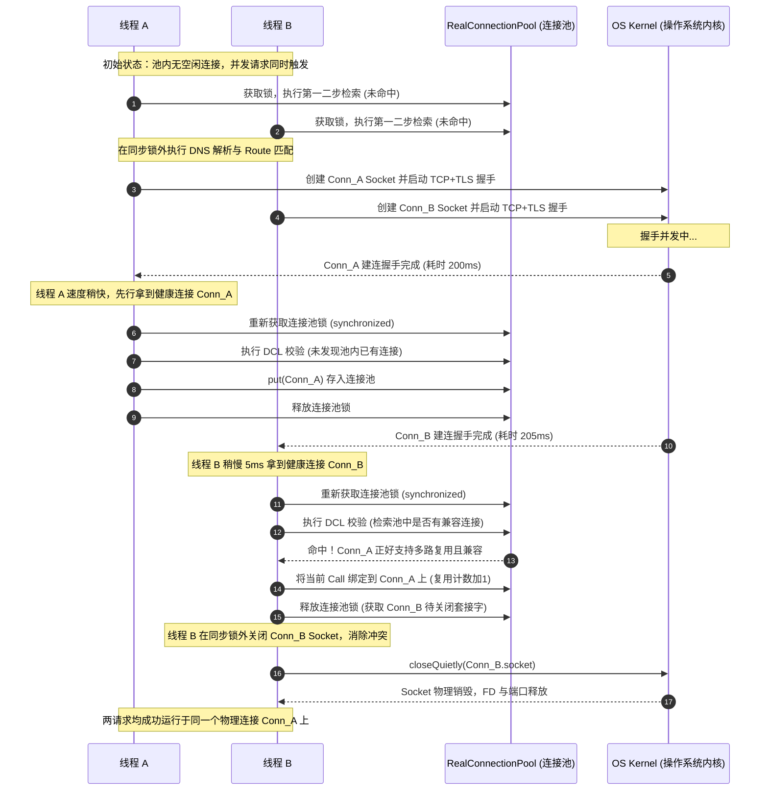

# 5.3.1.1.7 Socket连接池

在现代移动应用开发中，网络请求的性能和稳定性对用户体验起着决定性的作用。作为一个极其优秀的 Java/Kotlin 网络库，[OkHttp](https://github.com/square/okhttp) 的核心设计理念之一就是**对物理套接字（Socket）网络连接的极致复用与精细化管理**。而在这一套精妙的管理架构体系中，**Socket连接池（ConnectionPool / RealConnectionPool）**、**物理连接载体（RealConnection）**、**连接寻路器（ExchangeFinder）** 以及 **动态路由选择器（RouteSelector）** 共同构建了物理网络连接的生命底座。

本篇文章将从物理网络本质出发，源码级、多线程并发级、操作系统底层级深度剖析 OkHttp 连接池的底层物理结构、Socket 物理建连的全步骤工作流、多线程高并发下的双重检查锁（DCL）去重与防爆机制、路由容灾黑名单自愈体系，以及 HTTP/1.1 与 HTTP/2.0 下的物理共享差异，为您全面解密这一套高性能网络通信的底层引擎。

---

## 1. OkHttp 物理连接的生命底座：RealConnection 与底层 Java Socket 的关系

在探究连接池的运作逻辑前，必须先理清 OkHttp 是如何对底层操作系统网络资源进行抽象的。在 OkHttp 中，[RealConnection](file:///Users/lizhiyang/Desktop/AndroidKnowledge/docs/5.Android/5.3.主流三方开源库/5.3.1.网络请求/5.3.1.1.OkHttp/5.3.1.1.7.Socket连接池.md) 就是那个承载了所有光纤中飞驰的二进制数据包的**物理连接生命底座**。

### 1.1 什么是 RealConnection？它在 OkHttp 架构中的定位

在计算机网络体系中，应用层的 HTTP/HTTPS 请求只是对特定格式文本或二进制数据的封装。它们不能脱离传输层而独立存在，所有的应用层报文最终都必须寄宿在传输层的 TCP 连接上。

Java 原生提供了 `java.net.Socket` 来代表一个 TCP 套接字通道，但原生 Socket 存在许多局限性：
- 它是阻塞式的、面向单条数据流的。
- 它不直接感知应用层的协议（无论是传统的 HTTP/1.1 还是现代的 HTTP/2.0）。
- 它缺乏生命周期的生命体征追踪，无法直接支持高并发的多线程复用与弱引用防泄露管理。

因此，OkHttp 引入了 [RealConnection](file:///Users/lizhiyang/Desktop/AndroidKnowledge/docs/5.Android/5.3.主流三方开源库/5.3.1.网络请求/5.3.1.1.OkHttp/5.3.1.1.7.Socket连接池.md) 对原生 `Socket` 进行高层次的包装。在 OkHttp 的拦截器责任链体系中，当请求流转到 `ConnectInterceptor` 时，其核心职责就是分配或建立一个可用的物理连接，而这个物理连接的终极实现就是 [RealConnection](file:///Users/lizhiyang/Desktop/AndroidKnowledge/docs/5.Android/5.3.主流三方开源库/5.3.1.网络请求/5.3.1.1.OkHttp/5.3.1.1.7.Socket连接池.md)。它是 TCP 传输的物理载体，为上层的数据读写器（`ExchangeCodec`）提供稳定的字节流传输通道。

### 1.2 RealConnection 的内部核心成员变量与物理意义

如果我们打开 [RealConnection](file:///Users/lizhiyang/Desktop/AndroidKnowledge/docs/5.Android/5.3.主流三方开源库/5.3.1.网络请求/5.3.1.1.OkHttp/5.3.1.1.7.Socket连接池.md) 的源码，会发现它主要持有以下几个核心属性。每个属性都对应着物理网络连接中的关键一环：

1. **`rawSocket: Socket`**  
   这是客户端底层最原始的、直接通过 `SocketFactory` 创建的 `java.net.Socket` 物理实例。它代表了与目的 IP 和端口（例如服务器 IP:443 或代理服务器 IP:8080）直接建立的 TCP 三次握手物理连接。
2. **`socket: Socket`**  
   这是经过应用层特定装饰后的“工作 Socket”。在非加密的 HTTP 协议下，它与 `rawSocket` 指向同一个对象；而在 HTTPS 协议下，它指向的是一个基于 `rawSocket` 进行加密包装后的 `javax.net.ssl.SSLSocket` 安全套接字实例。
3. **`handshake: Handshake?`**  
   对于加密的 HTTPS 连接，该属性记录了 TLS 握手成功后协商的所有安全信息，包括 TLS 版本（如 TLS 1.2, TLS 1.3）、使用的密码套件（Cipher Suite）、服务器下发的证书链（Peer Certificates）以及本地用于客户端认证的证书链（Local Certificates）。
4. **`protocol: Protocol?`**  
   代表该物理连接上当前所运行的最高应用层协议版本。它是在 TLS 握手阶段通过 ALPN 协商，或是在明文建连中由握手反馈决定的（如 `Protocol.HTTP_1_1` 或 `Protocol.HTTP_2`）。
5. **`source: BufferedSource` 和 `sink: BufferedSink`**  
   基于高性能 IO 框架 Okio 包装的套接字输入流（Input Stream）与输出流（Output Stream）。[RealConnection](file:///Users/lizhiyang/Desktop/AndroidKnowledge/docs/5.Android/5.3.主流三方开源库/5.3.1.网络请求/5.3.1.1.OkHttp/5.3.1.1.7.Socket连接池.md) 摒弃了 Java 原生的 `InputStream` 和 `OutputStream`，利用 Okio 带来的 Segment 内存复用机制，大幅度减少了高并发网络数据传输时的内存分配与垃圾回收（GC）压力。
6. **`calls: List<Reference<RealCall>>`**  
   该连接当前正在承载的 `RealCall`（即网络请求）的弱引用列表。它是 OkHttp 连接池实施“泄漏自动剪枝算法”的灵魂设计，通过该列表，连接池能知道当前物理连接上有多少个活跃请求正在进行。
7. **`allocationLimit: Int`**  
   该物理连接所能承载的最大并发请求数上限。如果采用的是 HTTP/1.1 协议，由于其队头阻塞限制，一个 Socket 在同一时刻只能处理一个请求，因此它的 `allocationLimit` 会被硬性设置为 1；如果协商出的协议是 HTTP/2.0，由于其天然支持多路复用，底层的 Socket 可以并行传输多个数据帧，因此该值默认会被设置为 100（或根据服务端 `SETTINGS` 帧返回的并发流上限动态调整）。
8. **`idleAtNs: Long`**  
   用于记录连接开始进入空闲状态的纳秒级时间戳。当 `calls` 列表被清空，即最后一个网络请求在该连接上结束时，OkHttp 会记录当前系统的纳秒时间赋予该变量。连接池的后台守护清理线程就是根据此时间戳与当前时间的差值，来评估此连接是否超过了保活时间（默认 5 分钟）从而需要被强制断开的。

### 1.3 从 JVM 堆内存到 OS 内核：Socket 的文件描述符（FD）与系统调用

理解 [RealConnection](file:///Users/lizhiyang/Desktop/AndroidKnowledge/docs/5.Android/5.3.主流三方开源库/5.3.1.网络请求/5.3.1.1.OkHttp/5.3.1.1.7.Socket连接池.md) 与原生 Socket 关系的关键，在于透视操作系统内核（OS Kernel）对于网络通道的管理：

在 Unix/Linux（包括 Android 内核）系统中，一切皆文件。当 JVM 在堆内存中创建一个 `java.net.Socket` 并调用 `connect()` 时，底层会通过 Java Native Interface (JNI) 触发系统的 `socket()` 系统调用。操作系统内核会在当前进程的句柄表中分配一个**文件描述符（File Descriptor, FD）**。

随后，通过 `connect()` 系统调用向目的地址发起 TCP 握手。一旦三次握手在网络层走完，套接字在内核的状态将变为 `ESTABLISHED`。内核为此套接字开辟了两个至关重要的物理缓冲区：
- **发送缓冲区（Send Buffer）**：应用层调用 `sink.write()` 时，数据只是拷贝到了操作系统的发送缓冲区，随后由内核的 TCP/IP 协议栈控制，通过滑动窗口与拥塞控制算法，将数据分批打包成 IP 报文发送出去。
- **接收缓冲区（Receive Buffer）**：网卡收到对端发送的 TCP 数据包并验证无误后，会触发硬中断/软中断，将数据拷贝到内核的接收缓冲区。应用层调用 `source.read()` 时，即是从该缓冲区中拷贝字节到 JVM 堆内存。

如果应用层在请求结束后，由于代码编写疏漏没有关闭流或者没有调用 `Socket.close()`，这个内核中的文件描述符（FD）以及相关的读写缓冲区将永久驻留在系统内存中。
Android 系统为了防止单个恶意或编写粗糙的应用程序榨干系统资源，在内核层层面对每个进程所能拥有的最大文件描述符数量（`ulimit -n`）做出了极为严苛的物理限制（在一些低版本 Android 系统中为 1024，高版本也通常在 2048 到 4096 之间）。

[RealConnection](file:///Users/lizhiyang/Desktop/AndroidKnowledge/docs/5.Android/5.3.主流三方开源库/5.3.1.网络请求/5.3.1.1.OkHttp/5.3.1.1.7.Socket连接池.md) 的终极价值，就是将 JVM 中代表请求逻辑的 `Call` 与操作系统内核中的 FD 建立起基于弱引用计数的桥梁。通过高效的复用逻辑，让同一个 FD 能够服务于成百上千次的 HTTP 请求，极大地缩减了操作系统的 `socket()` 与 `close()` 系统调用频次，将 Android 客户端的文件描述符资源消耗维持在一个极低的健康水平。

---

## 2. Socket 物理建连的全步骤工作流源码分析

当 `ExchangeFinder` 决定需要建立一条新的物理通道时，它会唤醒 [RealConnection](file:///Users/lizhiyang/Desktop/AndroidKnowledge/docs/5.Android/5.3.主流三方开源库/5.3.1.网络请求/5.3.1.1.OkHttp/5.3.1.1.7.Socket连接池.md) 内部的物理建连“总指挥”——`connect()` 方法。该方法是网络底座最繁复、最容易发生各种 I/O 异常的核心，它不仅涉及原生 TCP 的连接建立，更深度整合了 SSL/TLS 状态机以及应用层协议的 ALPN 协商。

### 2.1 物理建连的总指挥官：`RealConnection.connect()` 核心逻辑

当建连被触发时，[RealConnection](file:///Users/lizhiyang/Desktop/AndroidKnowledge/docs/5.Android/5.3.主流三方开源库/5.3.1.网络请求/5.3.1.1.OkHttp/5.3.1.1.7.Socket连接池.md) 将遵循一条极其严密的“漏斗式”建连步骤。它的执行路线是单向且包含重试退避的：

```
                    RealConnection.connect()
                               │
                               ▼
                    [ 检查连接状态: 已建连则直接拦截 ]
                               │
                               ▼
                 [ 构建 ConnectionSpecSelector ]
                               │
                               ▼
               ┌───────────────┴───────────────┐
      (需要隧道代理: Route.requiresTunnel)  (直接连接/非隧道)
               │                               │
               ▼                               ▼
       [ connectTunnel() ]             [ connectSocket() ]
       (建立 HTTP Tunnel 代理)         (调用原生 TCP 建连)
               │                               │
               └───────────────┬───────────────┘
                               │
                               ▼
                     [ establishProtocol() ]
                     (执行 TLS 握手 + ALPN 协商)
                               │
                               ▼
                     [ 状态回执与事件上报 ]
```

### 2.2 第一步：基于 Route 的 DNS 与目的地址解析

在进入物理建连前，[RealConnection](file:///Users/lizhiyang/Desktop/AndroidKnowledge/docs/5.Android/5.3.主流三方开源库/5.3.1.网络请求/5.3.1.1.OkHttp/5.3.1.1.7.Socket连接池.md) 必须得到一个明确的 `Route`（路由信息）。一个 `Route` 在 OkHttp 中是一个由 `Address`（目的地址配置）、`Proxy`（代理策略）以及 `InetSocketAddress`（已解析的物理目标 IP + 端口）组成的三元组。

在此步骤中，由于 `InetSocketAddress` 中的 IP 地址可能早已在 `RouteSelector` 中通过 `Dns`（默认是 `SystemDns` 或用户自定义的 HTTPDNS）完成了物理域名解析，[RealConnection](file:///Users/lizhiyang/Desktop/AndroidKnowledge/docs/5.Android/5.3.主流三方开源库/5.3.1.网络请求/5.3.1.1.OkHttp/5.3.1.1.7.Socket连接池.md) 将直接利用这个已经明确的 `InetSocketAddress` 发起建连，避免了在建连临界区内再次执行耗时极长且可能因超时导致阻塞的域名解析。

### 2.3 第二步：TCP 握手与原生 Socket 配置

物理建连的第一步实现在 `connectSocket()` 方法内。OkHttp 在这里将配置操作系统底层的 Socket 属性，以确保该 Socket 在高并发、复杂移动网络环境下的鲁棒性。

1. **套接字实例化**：
   根据代理类型决定如何实例化 `java.net.Socket`。如果使用的是 `Proxy.Type.DIRECT`（直接连接）或者 `Proxy.Type.HTTP`，则直接通过配置的 `SocketFactory` 建立 Socket；如果配置了特定的 SOCKS 代理，则需要通过 `new Socket(proxy)` 的形式创建，让 Java 虚拟机自动接管后续的代理底层握手逻辑。
2. **连接超时与系统属性配置**：
   ```kotlin
   rawSocket.soTimeout = readTimeout
   ```
   这里的 `soTimeout` 代表在 Socket 上进行读取（`read()` 系统调用）时的最大阻塞时间。如果在这个时间内网络没有任何数据包返回给客户端，操作系统会向 JVM 抛出 `java.net.SocketTimeoutException: Read timed out` 异常。
3. **平台特定的连接建立：`Platform.get().connectSocket()`**：
   OkHttp 并没有简单地调用 `rawSocket.connect(address, timeout)`，而是委托给了针对不同平台进行过深度适配的 [Platform](file:///Users/lizhiyang/Desktop/AndroidKnowledge/docs/5.Android/5.3.主流三方开源库/5.3.1.网络请求/5.3.1.1.OkHttp/5.3.1.1.7.Socket连接池.md) 抽象单例。
   
   在 Android 平台实现中，此方法会通过反射或者直接调用 Android 底层特定的系统 API，例如为 Socket 绑定特定的网络标识（在 Android 5.0+ 引入的 [Multi-Network 机制](file:///Users/lizhiyang/Desktop/AndroidKnowledge/AndroidVersionChangeLog.md)下，通过 `Network.bindSocket(Socket)` 可以让该套接字强制绕过系统的默认路由，走特定的网卡，如移动蜂窝数据通道而不是当前的 Wi-Fi，从而实现极佳的弱网降级切换）。
4. **Keep-Alive 属性的设置**：
   在很多 OkHttp 的扩展源码或底层定制中，还会显式地配置：
   ```kotlin
   rawSocket.keepAlive = true
   ```
   这将开启操作系统底层的 **TCP Keep-Alive 保活探针** 机制。当连接空闲时，操作系统的 TCP 协议栈会定期（默认通常是 2 小时，但有些移动设备会定制缩短）向服务器发送一个空的 ACK 探测包。如果服务器没有响应，操作系统会自动将此连接标记为损坏，防止应用层发送数据时产生死等。

### 2.4 第三步：TLS 握手与证书链校验

如果请求的协议是 HTTPS，在 TCP 三次握手成功建立起明文通道后，[RealConnection](file:///Users/lizhiyang/Desktop/AndroidKnowledge/docs/5.Android/5.3.主流三方开源库/5.3.1.网络请求/5.3.1.1.OkHttp/5.3.1.1.7.Socket连接池.md) 会进入最耗费 CPU 算力的阶段——`connectTls()`。

1. **SSLSocket 加密套接字升级**：
   客户端利用 `sslSocketFactory` 包装原始的 `rawSocket`，并在其上叠加一层 `javax.net.ssl.SSLSocket`。
2. **密码套件与 TLS 协议版本配置**：
   OkHttp 内部持有 `ConnectionSpecSelector`，它包含了一组支持的密码套件（Cipher Suite）与支持的 TLS 版本（如 TLS 1.2, TLS 1.3）。这能够确保在 TLS 握手阶段，客户端能向服务端传递兼容并且安全性极高的加密套件列表。
3. **调用 `startHandshake()` 强制握手**：
   调用该方法会使底层发送 TLS 握手的第一个二进制包——`Client Hello`。接着服务器会回复 `Server Hello` 并下发它的数字证书。
4. **HostnameVerifier 域名校验**：
   握手结束后，为防止遭遇**中间人攻击（MitM Attack）**，客户端必须校验服务端下发的证书中的域名是否与请求的域名相匹配。OkHttp 会提取证书的 Subject Alternative Names (SAN) 或 Common Name (CN)，利用配置的 `HostnameVerifier`（默认是 `OkHostnameVerifier`）进行严格校验。
5. **CertificatePinner 证书锁定**：
   为对抗 CA 根证书被破解或伪造的极端安全隐患，OkHttp 允许开发者配置 `CertificatePinner`。它会提取证书公钥的 SHA-256 哈希值，并与本地硬编码的哈希指纹进行绝对匹配校验。如果匹配失败，立即抛出 `SSLPeerUnverifiedException` 并强行阻断连接。

### 2.5 第四步：ALPN 协商与 HTTP 协议版本的确定

在 TLS 握手的过程中，还会解决一个重大的问题：**如何确定后续的通信该用 HTTP/1.1 还是最新的 HTTP/2.0？**

在 TLS 握手协议中，客户端会在 `Client Hello` 包的 Extensions 字段中包含一个名为 **ALPN（Application-Layer Protocol Negotiation, 应用层协议协商）** 的扩展帧。在该扩展帧中，客户端会列出自己所支持的应用层协议列表，按优先级排序，如：`["h2", "http/1.1"]`。

服务端收到后，在比对自己所支持的协议后，会在 TLS 握手的 `Server Hello` 阶段的 ALPN 响应帧中，返回确定的单一协议字符串（例如，如果服务器也支持 HTTP/2，就会返回 `"h2"`；否则返回 `"http/1.1"`）。

当 TLS 握手结束，`connectTls()` 会调用 `Platform.get().getSelectedProtocol(sslSocket)` 获取到这一个协商好的字符串，并在客户端本地赋予连接状态：
- 如果协商结果为 `"h2"`，则将 `protocol` 设为 `Protocol.HTTP_2`，且把并发最大流 `allocationLimit` 设定为 HTTP/2 协议规范下的默认大值。
- 如果协商结果为 `"http/1.1"` 甚至更早版本，则将 `protocol` 设为 `Protocol.HTTP_1_1`，且 `allocationLimit` 保持为 1。

### 2.6 核心源码深度剖析：`RealConnection.connect()`

以下是 [RealConnection.connect()](file:///Users/lizhiyang/Desktop/AndroidKnowledge/docs/5.Android/5.3.主流三方开源库/5.3.1.网络请求/5.3.1.1.OkHttp/5.3.1.1.7.Socket连接池.md) 的核心源码实现，经过了精炼并添加了极为详尽的深度中文注释，展示了它是如何处理代理、网络重试和状态赋值的：

```kotlin
fun connect(
  connectTimeout: Int,
  readTimeout: Int,
  writeTimeout: Int,
  pingIntervalMillis: Int,
  connectionRetryEnabled: Boolean,
  call: Call,
  eventListener: EventListener
) {
  // 防御性校验：一个连接实例在其生命周期内只能执行一次物理建连，否则直接抛出异常
  check(protocol == null) { "already connected" }

  var routeException: RouteException? = null
  val connectionSpecs = route.address.connectionSpecs
  var connectionSpecSelector = ConnectionSpecSelector(connectionSpecs)

  // 针对明文/加密协议的预检安全策略配置
  if (route.address.sslSocketFactory == null) {
    if (!connectionSpecs.contains(ConnectionSpec.CLEARTEXT)) {
      throw RouteException(UnknownServiceException(
          "CLEARTEXT communication not enabled for client"))
    }
    val host = route.address.url.host
    if (!Platform.get().isCleartextTrafficPermitted(host)) {
      throw RouteException(UnknownServiceException(
          "CLEARTEXT communication to $host not permitted by network security policy"))
    }
  } else {
    if (Protocol.H2_PRIOR_KNOWLEDGE in route.address.protocols) {
      throw RouteException(UnknownServiceException(
          "H2_PRIOR_KNOWLEDGE cannot be used with HTTPS"))
    }
  }

  // 开启建连的重试自适应循环，当遭遇可以恢复的底层网络 IO 异常时，在此处循环重试
  while (true) {
    try {
      // 1. 判断该路由是否要求通过 HTTP 隧道代理（Tunnel）进行连接
      // 如果需要通过 HTTP 代理去访问加密目标 HTTPS 服务，则必须先通过隧道发送 CONNECT 请求
      if (route.requiresTunnel()) {
        connectTunnel(connectTimeout, readTimeout, writeTimeout, call, eventListener)
        if (rawSocket == null) {
          // 隧道未能打通，但在 connectTunnel 内已安全释放 Socket，直接跳出循环
          break
        }
      } else {
        // 2. 无需隧道代理，直接发起原生的 TCP Socket 握手
        connectSocket(connectTimeout, readTimeout, call, eventListener)
      }

      // 3. 建立物理协议层：包括 HTTPS 下的 TLS 握手与 ALPN 协商，明文下的协议直接初始化
      establishProtocol(connectionSpecSelector, pingIntervalMillis, call, eventListener)
      
      // 4. 当流程走到这一行且未抛出任何异常，说明连接建连大功告成，通知 EventListener 记录日志
      eventListener.connectEnd(call, route.socketAddress, route.proxy, protocol)
      break
    } catch (e: IOException) {
      // 当发生 IO 连接异常（如 TCP 握手超时、TLS 握手被重置等）时进行清理和状态回退
      socket?.closeQuietly()
      rawSocket?.closeQuietly()
      socket = null
      rawSocket = null
      source = null
      sink = null
      handshake = null
      protocol = null
      
      eventListener.connectFailed(call, route.socketAddress, route.proxy, null, e)

      // 评估本次异常是否允许进行重试自愈
      if (routeException == null) {
        routeException = RouteException(e)
      } else {
        routeException.addConnectException(e)
      }

      // 如果客户端禁用了连接重试，或者底层的错误不可恢复，则直接将异常抛向上层
      if (!connectionRetryEnabled || !connectionSpecSelector.connectionFailed(e)) {
        throw routeException
      }
    }
  }

  // HTTP/2 协议特定配置：若协商协议为 HTTP/2.0，则需要在客户端本地初始化 HTTP/2 双向帧连接引擎
  if (route.requiresTunnel() && rawSocket == null) {
    throw RouteException(ProtocolException(
        "Too many tunnel connections attempted: $MAX_TUNNEL_ATTEMPTS"))
  }
}

/**
 * 建立底层的 TCP 套接字通道，完成操作系统的三次握手
 */
private fun connectSocket(
  connectTimeout: Int,
  readTimeout: Int,
  call: Call,
  eventListener: EventListener
) {
  val proxy = route.proxy
  val address = route.address

  // 1. 根据代理类型，创建底层原生 Socket 实例
  val rawSocket = when (proxy.type()) {
    Proxy.Type.DIRECT, Proxy.Type.HTTP -> address.socketFactory.createSocket()!!
    else -> Socket(proxy) // 代理服务器连接
  }
  this.rawSocket = rawSocket

  eventListener.connectStart(call, route.socketAddress, proxy)
  
  // 2. 物理配置 Socket 读取超时，防止系统由于各种阻塞卡死
  rawSocket.soTimeout = readTimeout
  try {
    // 3. 委托 Platform 平台层执行物理 TCP 握手建连
    Platform.get().connectSocket(rawSocket, route.socketAddress, connectTimeout)
  } catch (e: ConnectException) {
    throw ConnectException("Failed to connect to ${route.socketAddress}").apply {
      initCause(e)
    }
  }

  // 4. 将底层的 Socket 输入输出流利用 Okio 进行高效的缓冲区包装
  try {
    source = rawSocket.source().buffer()
    sink = rawSocket.sink().buffer()
  } catch (npe: NullPointerException) {
    if (npe.message == "throw with null exception") {
      throw IOException(npe)
    }
  }
}
```

---

## 3. 寻路器 ExchangeFinder 与双重检查锁（DCL）去重设计

在 OkHttp 的连接分配流转中，[ExchangeFinder](file:///Users/lizhiyang/Desktop/AndroidKnowledge/docs/5.Android/5.3.主流三方开源库/5.3.1.网络请求/5.3.1.1.OkHttp/5.3.1.1.7.Socket连接池.md) 的地位好比一位极其聪明的“寻路导航仪”。当拦截器向它请求一个数据交换器（`Exchange`）时，[ExchangeFinder](file:///Users/lizhiyang/Desktop/AndroidKnowledge/docs/5.Android/5.3.主流三方开源库/5.3.1.网络请求/5.3.1.1.OkHttp/5.3.1.1.7.Socket连接池.md) 必须从当前的物理环境中，寻找或建立一条能够通往目的服务器的 [RealConnection](file:///Users/lizhiyang/Desktop/AndroidKnowledge/docs/5.Android/5.3.主流三方开源库/5.3.1.网络请求/5.3.1.1.OkHttp/5.3.1.1.7.Socket连接池.md)。

它在寻找连接时，为了在**复用性能最大化**与**系统开销最小化**之间达到完美平衡，设计了一套层层过滤、逐级退避的“漏斗检索步骤”，并融合了并发安全中的**双重检查锁（Double-Checked Locking, DCL）**去重设计。

### 3.1 深度解密 `findConnection()` 的五个“套路”步骤

[ExchangeFinder.findConnection()](file:///Users/lizhiyang/Desktop/AndroidKnowledge/docs/5.Android/5.3.主流三方开源库/5.3.1.网络请求/5.3.1.1.OkHttp/5.3.1.1.7.Socket连接池.md) 查找连接的过程，堪称是网络库设计的艺术典范。它严格遵循着以下 5 个逻辑步骤：

#### 第一步：尝试直接复用当前 Call 已经持有的连接
在发生网络重试（如超时自动重试）或应用层重定向（Redirect）时，当前的请求 `Call` 上可能随时分配了某个 [RealConnection](file:///Users/lizhiyang/Desktop/AndroidKnowledge/docs/5.Android/5.3.主流三方开源库/5.3.1.网络请求/5.3.1.1.OkHttp/5.3.1.1.7.Socket连接池.md) 实例。
此时，寻路器首先会在加锁同步块中检查这个连接：它是否是健康的？它的 `noNewExchanges` 标志是否没有被立起来？它是否依然支持本次请求的目的地 URL（检查 Host 是否相同，或是否符合 HTTP/2 证书合并策略）？如果全都满足，则根本不需要去动连接池，直接物理复用该连接，开销最低。

#### 第二步：尝试从连接池中检索精确匹配的空闲连接（Fast Path）
如果当前 Call 上没有连接，或者旧连接无法使用，寻路器会初次在加锁状态下扫描连接池的双端队列。
它会拿本次请求的 `Address`（包含了目标域名的 SSL 配置、证书验证配置、代理配置等）去匹配池中的空闲连接。一旦找到一个精确匹配（IP 路由相同且完全空闲）的连接，立刻将其绑定到当前的 Call 上，计数加 1，并直接返回。这一步避免了后续昂贵的 DNS 解析和物理握手。

#### 第三步：解析路由候选，基于路由 IP 再次尝试从池中获取
如果在第二步没有找到完全空闲且精确匹配主机的连接，说明我们可能需要解析一条新的路由路线。
寻路器会退出临界区，调用 `routeSelector.next()`。这一步是非阻塞的但也极其耗时，因为它可能涉及本地 DNS 缓存甚至物理网络 DNS 的查询。
一旦获得了候选路由列表（包含了目标域名解析出来的多个 IP 地址），寻路器**重新进入 `synchronized` 加锁状态**，基于这一组候选物理路由再次检索连接池。
*为什么这一次检索能比第二步检索出更多连接？*  
因为很多 HTTP/2 连接支持 **连接合并（Connection Coalescing）**。虽然在第二步由于域名（Host）不同没能精准命中连接，但在第三步中，我们解析出了它的 IP 地址。如果池中正好有一个处于活动状态的 HTTP/2 连接，它的服务器证书也包含了这个新域名（SAN），且对应的 IP 正好在我们本次解析出的 IP 列表中，那么这个 HTTP/2 连接就可以直接被我们合并复用！

#### 第四步：物理建连：新建 RealConnection 并执行物理握手
如果在前三步的“软搜索”中颗粒无收，说明连接池内真的没有任何一条现成的路可以走。
此时，寻路器会退出现有的同步锁，基于确定的路由 `selectedRoute` 新建一个 `RealConnection` 实例，并直接调用其 `connect()` 方法。
这个方法会执行上文提到的**物理 TCP 三次握手 + TLS 握手 + ALPN 协商**。这是一个昂贵的过程，往往需要消耗 100ms ~ 500ms 不等的时间。

#### 第五步：建连成功后的连接池二次验证去重（DCL 物理防爆）
当经历漫长的几百毫秒物理握手成功后，寻路器拿到了一个健康、刚建好的物理 [RealConnection](file:///Users/lizhiyang/Desktop/AndroidKnowledge/docs/5.Android/5.3.主流三方开源库/5.3.1.网络请求/5.3.1.1.OkHttp/5.3.1.1.7.Socket连接池.md)。
**重点来了：它不能直接拿去用！**
寻路器必须**第三次进入加锁同步块 `synchronized(connectionPool)`**，再次在连接池中检索是否已存在与当前目标主机匹配的连接！
- 如果在当前的 DCL 二次验证中，发现池中依然没有可用连接，OkHttp 才会把这个辛苦建好的新连接 `put` 进池中，并将其绑定到当前的 Call 上。
- 如果在二次验证中，发现池中**突然出现**了一个可用连接（比如支持 HTTP/2 的空闲连接），那么寻路器会执行极为精妙的决策：**丢弃刚才辛苦建好的物理新连接，改为复用池中已有的那个连接！**

---

### 3.2 物理 Socket 建连后的连接池二次验证去重机制（极其精妙）

许多开发者在初次精读这部分源码时都会有一个巨大的疑惑：**为什么在经历了昂贵且耗时的物理 TCP/TLS 握手建连之后，在放入连接池前，必须“再次尝试从连接池中获取已存在的连接”？这难道不是多此一举吗？**

这正是 OkHttp 应对高并发网络竞态环境下的极其精妙的**防爆去重**设计。

#### 3.2.1 竞态条件（Race Condition）的物理模型

设想这样一个在移动端高并发下的典型业务场景：
用户在主界面同时触发了两个完全并发的数据同步请求（线程 A 和线程 B），它们的目的地是相同的服务器（例如支持 HTTP/2 的 `api.app.com`），且此时本地连接池为空，没有任何空闲连接。

1. **时刻 0ms**：线程 A 与线程 B 同时启动请求，进入 `findConnection()`。
2. **时刻 5ms**：线程 A 与线程 B 发现池为空，分别开始执行 DNS 解析，随后在无锁状态下，各自创建了一个 [RealConnection](file:///Users/lizhiyang/Desktop/AndroidKnowledge/docs/5.Android/5.3.主流三方开源库/5.3.1.网络请求/5.3.1.1.OkHttp/5.3.1.1.7.Socket连接池.md) 实例（我们记为 `Conn_A` 与 `Conn_B`）。
3. **时刻 10ms ~ 200ms**：线程 A 的 `Conn_A` 和线程 B 的 `Conn_B` 各自在独立的底层套接字上，并行发起昂贵的 TCP 三次握手和 TLS 安全协商。由于它们是并发运行的，对操作系统内核而言，这是两个完全独立的物理 Socket。
4. **时刻 200ms**：线程 A 的 `Conn_A` 握手速度稍快，建连成功，提前退出了 `connect()` 阻塞。线程 A 立刻获取连接池锁，进入临界区，通过二次验证判定池中无同路由连接，于是将 `Conn_A` 放入连接池（调用 `put()`），随后释放锁，开始向 `Conn_A` 发送 HTTP 数据帧。
5. **时刻 205ms**：仅仅过了 5ms，线程 B 的 `Conn_B` 也宣告建连成功，退出了 `connect()` 阻塞。
   此时，如果线程 B 不进行二次验证，直接使用自己新建的 `Conn_B`，那么会发生什么？
   - 客户端针对同一个 HTTP/2 Host，建立并维持了**两个独立的物理 TCP 连接**。
   - 这严重违背了“HTTP/2 多路复用下，对同一个 Host 仅应当维持单一 TCP 连接以优化移动端资源消耗”的协议规范。
   - 同时，如果后续有更多线程并发建连，将会在连接池中堆积起大量的物理 Socket，诱发 Android FD 溢出和服务器的承载压力暴增。

#### 3.2.2 二次验证命中时的丢弃与物理清理原理

在 DCL 二次验证机制下，当线程 B 在时刻 205ms 获得连接池锁并进入临界区后：
1. 线程 B 在池中执行 `callAcquirePooledConnection` 检索，发现池中刚刚在 5ms 前被线程 A 放入了一个完全健康且支持多路复用的 `Conn_A`！
2. 线程 B 判定**二次验证命中**！它将立即把 `Conn_A` 绑定到自己当前的 Call 上，使 `Conn_A` 的活跃引用计数再次加 1。
3. 线程 B 决定废弃自己刚才辛苦建立的物理连接 `Conn_B`。为了不阻塞临界区内的其他并发线程，线程 B 仅仅在同步块中提取出 `Conn_B` 持有的 Socket 对象，并安全地退出了 `synchronized` 同步锁。
4. 在同步锁外部，线程 B 调用了下述物理清理：
   ```kotlin
   // 物理安静关闭物理 Socket 资源，防止任何形式的 IO 阻塞
   Util.closeQuietly(newConnection.socket())
   ```
5. `closeQuietly()` 会底层调用 Native 层的 `close()` 系统调用。操作系统内核收到指令后，会立刻回收该 Socket 绑定的文件描述符（FD）和临时端口，并向对端服务器发送 `RST` 或 `FIN` 物理包。

通过这一套双重检查锁（DCL）去重设计，OkHttp 在高并发的网络竞态条件下，实现了“物理连接建立数”与“最终生存复用数”的收敛。即使高并发的请求瞬间在多线程上引发了并行的 Socket 建连，连接池也能够像一层物理防爆盾一样，将重复的、浪费的物理连接扼杀在放入连接池的前夕。

---

### 3.3 核心源码深度剖析：`ExchangeFinder.findConnection()`

以下是寻路器核心检索逻辑 [ExchangeFinder.findConnection()](file:///Users/lizhiyang/Desktop/AndroidKnowledge/docs/5.Android/5.3.主流三方开源库/5.3.1.网络请求/5.3.1.1.OkHttp/5.3.1.1.7.Socket连接池.md) 的核心骨架源码，带有极为详尽的深度中文注释，展示了五步寻路与 DCL 去重的底层控制结构：

```kotlin
private fun findConnection(
  connectTimeout: Int,
  readTimeout: Int,
  writeTimeout: Int,
  pingIntervalMillis: Int,
  connectionRetryEnabled: Boolean
): RealConnection {
  var foundPooledConnection = false
  var result: RealConnection? = null
  var selectedRoute: Route? = null
  var releasedConnection: RealConnection? = null
  val toClose: Socket?

  // ==========================================
  // 【第一步 & 第二步】在连接池锁的保护下，进行快速查找
  // ==========================================
  synchronized(connectionPool) {
    if (call.isCanceled()) throw IOException("Canceled")
    releasedConnection = call.connection

    // 1. 【第一步】检查当前 Call 是否已经绑定了可用物理连接（如重定向场景）
    val callConnection = call.connection
    if (callConnection != null) {
      // 若该连接已被标记为不再承载新流，或者目的域名不匹配，则释放当前绑定
      if (callConnection.noNewExchanges || !callConnection.supportsUrl(route.address.url)) {
        releasedConnection = call.releaseConnectionNoEvents()
      } else {
        result = callConnection
      }
    }

    if (result == null) {
      // 2. 【第二步】初次尝试从连接池检索匹配的空闲连接（Fast Path）
      // callAcquirePooledConnection 会匹配 Address 中的各项配置属性，
      // 若匹配成功，会自动将连接绑定到 call.connection 上并返回 true
      if (connectionPool.callAcquirePooledConnection(address, call, null, false)) {
        foundPooledConnection = true
        result = call.connection
      }
    }
  }

  // 软搜索命中第一步或第二步，直接返回结果，跳过后续所有寻路
  if (result != null) {
    return result!!
  }

  // ==========================================
  // 【第三步】检索路由：DNS 解析耗时过程（无锁运行）
  // ==========================================
  var newRouteSelection = false
  if (selectedRoute == null) {
    // 若路由选择器为空，则初始化，此处会触发 DNS 域名解析
    val localRouteSelection = routeSelection ?: routeSelector!!.next()
    routeSelection = localRouteSelection
    newRouteSelection = true
  }

  // 重新进入连接池锁的临界区
  synchronized(connectionPool) {
    if (call.isCanceled()) throw IOException("Canceled")

    if (newRouteSelection) {
      // 3. 【第三步】基于最新 DNS 解析出的候选 IP 列表，再次尝试去池中获取多路复用连接
      val routes = routeSelection!!.routes
      if (connectionPool.callAcquirePooledConnection(address, call, routes, false)) {
        foundPooledConnection = true
        result = call.connection
      }
    }
  }

  if (result != null) {
    return result!!
  }

  // 从解析的路由列表中挑出一个物理路由，用于发起真实建连
  selectedRoute = routeSelection!!.next()

  // ==========================================
  // 【第四步】物理建连：新建物理连接并开始握手（无锁运行，耗时极长）
  // ==========================================
  // 4. 【第四步】创建一个全新的 RealConnection 实例
  val newConnection = RealConnection(connectionPool, selectedRoute!!)
  call.connectionToCancel = newConnection

  try {
    // 发起物理 TCP + TLS 建连，该过程耗时可能达到几百毫秒
    newConnection.connect(
        connectTimeout,
        readTimeout,
        writeTimeout,
        pingIntervalMillis,
        connectionRetryEnabled,
        call,
        eventListener
    )
  } finally {
    call.connectionToCancel = null
  }

  // 更新路由数据库中关于成功建连的记录
  routeDatabase.connected(newConnection.route())

  // ==========================================
  // 【第五步】二次验证去重（DCL）：获取池锁进行池化安全检索
  // ==========================================
  synchronized(connectionPool) {
    call.connectionToCancel = null
    
    // 5. 【第五步】再次尝试从连接池中获取已存在的连接（二次验证去重）
    // 第二个参数 requireMultiplexed 为 true，专为检测多路复用并发冲突设计
    if (connectionPool.callAcquirePooledConnection(address, call, null, true)) {
      foundPooledConnection = true
      result = call.connection
      // 命中竞态去重！提取出刚才新建物理连接的原始套接字，标记准备在锁外执行物理关闭
      toClose = newConnection.socket()
    } else {
      // 未命中二次验证：说明该物理路由上目前外界还没有建立好的连接
      // 将新建的健康连接 put 存入连接池队列中，并绑定到当前 Call
      connectionPool.put(newConnection)
      call.acquireConnectionNoEvents(newConnection)
      toClose = null
    }
  }

  // 6. 临界区外执行 Socket 的物理关闭，防止物理 I/O 阻塞临界区内的其他请求线程
  if (toClose != null) {
    toClose.closeQuietly() // 丢弃并物理安静关闭重复的多余物理连接
    eventListener.connectionAcquired(call, result!!)
  } else {
    eventListener.connectionAcquired(call, newConnection)
  }

  return result ?: newConnection
}
```

---

## 4. 动态路由选择器 RouteSelector 容灾机制

网络通信不是在一个绝对理想的温室中运行的。在实际的移动网络场景中，经常会出现某个 IP 段被运营商封锁、某个代理网关突然崩溃、DNS 污染或者无线信道频繁切换等极其恶劣的情况。

如果网络客户端在建连遭遇物理阻碍时，依然死板地在坏路由上反复尝试，这会引发长达十几秒的超时挂起，给用户带来灾难性的无响应体验。OkHttp 为了攻克这一痛点，设计了 **动态路由选择器（RouteSelector）** 容灾防灾机制。

### 4.1 RouteSelector 的职责与多级寻路路径

[RouteSelector](file:///Users/lizhiyang/Desktop/AndroidKnowledge/docs/5.Android/5.3.主流三方开源库/5.3.1.网络请求/5.3.1.1.OkHttp/5.3.1.1.7.Socket连接池.md) 的核心任务是针对一个目标网络请求，动态、弹性地规划出多条可用的物理“候选路由（Route）”通路。它在寻找路线时，设计了一个包含了多级状态回退的多级寻路机制：

```
                 [ 发起寻路目标: Address ]
                             │
                             ▼
                 [ 第一级: 代理路由决策 ]
       (系统默认代理? 用户自定义配置代理? 代理链决策)
                             │
                             ▼
                 [ 第二级: DNS 域名解析 ]
       (通过 Dns.SYSTEM 或 HTTPDNS 物理拉取 IP 列表)
                             │
                             ▼
                 [ 第三级: 动态生成物理组合 ]
          (IP 列表 x 目标端口 x 代理类型 = 候选 Route 组)
                             │
                             ▼
                 [ 第四级: 容灾过滤与自愈 ]
        (基于 RouteDatabase 黑名单排除故障路由)
```

1. **代理路由决策（Proxy Select）**：
   寻路器首先会在 `resetNextProxy()` 中判定本连接的代理策略。如果创建 `OkHttpClient` 时指定了特定 Proxy，则使用该配置；如果没有指定，则通过系统的 `ProxySelector` 动态查询当前 Android 系统的全局代理配置（如 VPN、热点代理、APN 接入点等）。
2. **DNS 获取 IP 列表（Dns Query）**：
   在明确了路由是否经过代理后，寻路器会进入域名解析。如果直接访问目标主机，则会触发 `address.dns.lookup(hostname)`。
   *在此步骤中，优秀的 APM 调优建议使用支持并发解析和多运营商策略的 **HTTPDNS**，以彻底解决 Android 原生 LocalDNS 常见的域名劫持与解析延迟大等历史问题。*
3. **动态生成物理路由（Route Instance Generation）**：
   在获得了一组解析出的 IP 列表后，对于列表中的每一个 IP 地址，都会与代理策略以及目标服务的端口（如 443）进行笛卡尔积组合，组合出的每一个三元组就是一个独立的物理 `Route` 实例。

---

### 4.2 RouteDatabase 路由数据库的失败黑名单自愈功能

当寻路器在 `RouteSelector` 中源源不断地生成物理路由候选并交给 [RealConnection.connect()](file:///Users/lizhiyang/Desktop/AndroidKnowledge/docs/5.Android/5.3.主流三方开源库/5.3.1.网络请求/5.3.1.1.OkHttp/5.3.1.1.7.Socket连接池.md) 去发起物理握手时，一旦发生不可达、超时或者 SSL 校验失败，该路由就会被标记为“坏路由”。

OkHttp 维护了一个全局单例的路由黑名单数据库——**`RouteDatabase`**。

#### 4.2.1 RouteDatabase 的内部数据结构与黑名单机制

`RouteDatabase` 的内存数据结构相对简单但足够高效：
```kotlin
class RouteDatabase {
  private val failedRoutes = mutableSetOf<Route>()

  /**
   * 记录建连失败的坏路由，将其强行拉入黑名单
   */
  @Synchronized fun failed(failedRoute: Route) {
    failedRoutes.add(failedRoute)
  }

  /**
   * 从黑名单中移除该路由（标志着此路线复活自愈）
   */
  @Synchronized fun connected(route: Route) {
    failedRoutes.remove(route)
  }

  /**
   * 判断某条路由是否依然处于黑名单中
   */
  @Synchronized fun shouldPostpone(route: Route): Boolean {
    return failedRoutes.contains(route)
  }
}
```

#### 4.2.2 失败黑名单在寻路中的“自动避坑”策略

当 `RouteSelector` 准备从其内部的路由列表中选择下一个路由供给物理连接时，它会优先核对 `RouteDatabase`：

1. **路由分类隔离**：  
   `RouteSelector` 将生成的物理路由划分为两个队列：**常规队列** 和 **延后（Postponed）队列**。
2. **黑名单避让**：  
   在遍历生成的候选路由时，寻路器会调用 `routeDatabase.shouldPostpone(route)`。如果判定这条路由在最近的通信中失败过，它会立刻将该路由踢出常规队列，放入延后队列中暂存。
3. **自愈与降级恢复**：  
   在发起网络请求时，寻路器会**优先把所有的常规路由全部尝试一遍**。
   - 如果常规路由中有任何一个建连成功，该成功的路由如果曾被标记过失败，会被调用 `connected()` 从黑名单中清除（实现自愈）。
   - 如果常规路由全军覆没（比如当前网络环境真的极差，或者之前的黑名单是由瞬时抖动引起的），寻路器在被逼入绝境时，才会心甘情愿地把**延后队列**（黑名单）中的路由重新拿出来依次死马当活马医地进行重试。

#### 4.2.3 降低弱网重连延迟的物理本质

这一机制在弱网、复杂基站切换环境下，能够带来立竿见影的性能改善。
如果没有 `RouteDatabase` 黑名单避让，假设服务器域名解析出了 3 个 IP，其中前 2 个 IP 是死 IP（已被运营商屏蔽），第 3 个 IP 是活 IP。
在传统的串行尝试下，每一次网络发起，客户端都会死板地：
1. 尝试 IP_1：超时等待 15 秒，宣布失败；
2. 尝试 IP_2：超时等待 15 秒，宣布失败；
3. 尝试 IP_3：握手成功。
这直接导致用户的单次网络请求挂起长达 30 秒。
而在有了黑名单机制后，一旦前两次请求踩了雷，IP_1 与 IP_2 相关的路由将立刻被拉入 `RouteDatabase` 的失败黑名单中。
在随后的请求中，`RouteSelector` 在解析出同样的 IP 列表后，会立刻通过避坑判断，直接挑出存活的 IP_3 路由交付给 [RealConnection](file:///Users/lizhiyang/Desktop/AndroidKnowledge/docs/5.Android/5.3.主流三方开源库/5.3.1.网络请求/5.3.1.1.OkHttp/5.3.1.1.7.Socket连接池.md) 发起建连，网络延时瞬间从 30秒+ 缩短至毫秒级，达成了对移动弱网环境的智能化自适应容灾保护。

---

## 5. HTTP/1.1 管道限制与 HTTP/2.0 多路复用下的 Socket 共享对比

连接池在复用连接时，针对不同的协议版本表现出了完全不同的分配策略与逻辑限制。我们需要对比 HTTP/1.1 Keep-Alive 与 HTTP/2.0 Multiplexing 下的 Socket 共享异同。

### 5.1 HTTP/1.1 与 HTTP/2.0 下的 Socket 复用限制与共享机制对比

以下是两种主流协议在 Socket 连接复用特征上的核心指标对比：

| 评估维度 | HTTP/1.1 Keep-Alive 机制 | HTTP/2.0 多路复用 (Multiplexing) |
| :--- | :--- | :--- |
| **单物理连接并发承载能力** | **绝对串行限制**。<br/>同一时刻只能承载一个 HTTP 请求-响应事务。 | **极致并行承载**。<br/>通过二进制分帧与 Stream ID，并行承载上百个双向数据流（Stream）。 |
| **队头阻塞（Head-of-Line）**| 存在。后发请求必须在队列中等待前一个请求读取完毕。 | 无。帧交错并行传输，某个流被卡住不影响其他流的传输。 |
| **连接池最大空闲缓存容量** | 默认为 5 个空闲连接。 | 默认依然为 5 个。但单连接可复用，极少需要在池中开辟多个空闲连接。 |
| **多域名合并复用 (Coalescing)** | **不支持**。<br/>由于缺乏多路复用能力，不同域名的请求在底层必须对应独立的 TCP 套接字。 | **深度支持**。<br/>若证书 SAN 及 SSL 配置相同且 IP 有交集，不同域名可合用同一物理连接。 |
| **连接生命周期跟踪逻辑** | 物理连接持有的 `calls` 列表长度最大为 1。 | 物理连接持有的 `calls` 列表长度最大为 100（或协商上限）。 |

### 5.2 HTTP/2.0 下利用同一个物理 RealConnection 承载多个并发的 Http2Stream 的底座设计

当协商出的协议为 HTTP/2.0 时，OkHttp 会在建连成功的第一时间，在 [RealConnection](file:///Users/lizhiyang/Desktop/AndroidKnowledge/docs/5.Android/5.3.主流三方开源库/5.3.1.网络请求/5.3.1.1.OkHttp/5.3.1.1.7.Socket连接池.md) 内部孵化出一个核心的底层通信协议控制引擎——**`Http2Connection`**。

#### 5.2.1 二进制分帧层的运转模型

在 `Http2Connection` 内部，客户端与服务端进行的所有数据交换都被拆分为更细微的“帧（Frame）”：
- **`HEADERS` 帧**：传递 HTTP 请求头或响应头。
- **`DATA` 帧**：传递请求体或响应体内容。
- **`SETTINGS` 帧**：交换两端的重要配置参数（如最大并发流上限、初始窗口大小）。

每一个帧的二进制首部都包含一个 31 位的整型值——**Stream ID（流 ID）**。
在同一个物理 [RealConnection](file:///Users/lizhiyang/Desktop/AndroidKnowledge/docs/5.Android/5.3.主流三方开源库/5.3.1.网络请求/5.3.1.1.OkHttp/5.3.1.1.7.Socket连接池.md) 的底层通道上，OkHttp 通过不断循环读取 Socket 输入流的 `ReaderRunnable`，解析出每一帧的 Stream ID，并根据该 ID 将帧数据投递到对应的 `Http2Stream` 实例缓冲区中，从而实现了应用层感知不到的物理流通道的绝对并行复用。

### 5.3 连接池中针对 HTTP/2.0 连接（allocation limit 限制）的自动共享判定

在多路复用机制下，连接池的管理面临着更加复杂的共享逻辑判定。

#### 5.3.1 什么是 Connection Coalescing（连接合并）？

当寻路器在第三步中拿候选路由去检索连接池时，如果发现池中已经有一个支持 HTTP/2 的连接，即便这个连接的 Host 与我们当前请求的 Host 不一致，只要它满足以下严苛的条件，该连接就能直接被我们合并复用：

1. **相同的安全套接字工厂（`sslSocketFactory`）**：保证证书信任和握手配置绝对一致。
2. **HostnameVerifier 的主体备用名称（SAN）校检通过**：这是合并的关键！例如，我们当前的请求是 `api.subservice.com`，而池中已有的 HTTP/2 连接对应的证书中，其 Subject Alternative Name (SAN) 包含了通配符域名 `*.subservice.com` 或是显式包含了 `api.subservice.com`，那么此安全证书就可以合法覆盖当前域名。
3. **DNS 候选 IP 地址匹配**：当前的请求解析出的 IP 地址列表中，只要有至少一个 IP 与已有 HTTP/2 连接正在使用的物理 IP 重合。

当满足上述所有条件时，OkHttp 就会发起**连接合并**，直接将当前请求绑定到该连接上，从而跳过 TCP/TLS 的建连，这在多子域名并发的复杂业务场景下能够带来巨大的网络加速。

#### 5.3.2 针对 HTTP/2 连接的并发额度限流判定

在 [RealConnection](file:///Users/lizhiyang/Desktop/AndroidKnowledge/docs/5.Android/5.3.主流三方开源库/5.3.1.网络请求/5.3.1.1.OkHttp/5.3.1.1.7.Socket连接池.md) 中，通过计算 `calls.size < allocationLimit` 来判定连接是否可被新请求复用。
- 对于 HTTP/1.1，`allocationLimit` 始终为 1。一旦有一个活跃 Call 绑定在连接上，`calls.size` 变为 1，此时 `calls.size < allocationLimit` 返回 false，该连接在连接池中检索时将被自动过滤掉，不允许共享。
- 对于 HTTP/2.0，`allocationLimit` 默认会从服务器协商参数中获取（如 100）。只要当前连接上承载的并发流请求数没有超过该上限，`calls.size < allocationLimit` 依然返回 true，连接池检索时会将其视为“可用连接”分配给新的 Call，从而实现物理多路复用。

---

## 6. 核心架构时序与流程可视化

为了进一步加深大家对于 OkHttp 连接寻路流程以及高并发 DCL 竞态安全去重机制的直观理解，我们在此设计了两张精细的流程图。

### 6.1 ExchangeFinder.findConnection 查找连接的详细漏斗决策树流程图

下图详细描绘了寻路器在寻找连接时的 5 个步骤决策路径，直观展示了为何称其为“漏斗检索”：

```mermaid
graph TD
    Start([1. 请求发起: ExchangeFinder.findConnection]) --> Lock1[获取连接池锁 synchronized]
    Lock1 --> CallCheck{步骤一:<br/>当前 Call 是否已绑定<br/>健康且相容的连接?}
    
    CallCheck -- Yes --> ReturnAllocated[直接复用 Call 内连接并退出]
    CallCheck -- No --> PoolFastCheck{步骤二:<br/>从池内检索是否存在<br/>精确匹配 Address 的连接?}
    
    PoolFastCheck -- Yes --> AcquireFast[绑定并复用池内连接]
    AcquireFast --> ReleaseLock1[释放连接池锁] --> Exit1([返回可用连接])
    
    PoolFastCheck -- No --> ReleaseLock1_1[释放连接池锁]
    ReleaseLock1_1 --> DnsQuery[步骤三:<br/>解析路由并执行 DNS 查询<br/>获取候选 IP 列表]
    
    DnsQuery --> Lock2[重新获取连接池锁 synchronized]
    Lock2 --> PoolDnsCheck{步骤三(续):<br/>基于最新候选路由 IP<br/>在池内尝试检索多路复用连接?}
    
    PoolDnsCheck -- Yes --> AcquireDns[绑定并复用合并连接]
    AcquireDns --> ReleaseLock2[释放连接池锁] --> Exit2([返回可用连接])
    
    PoolDnsCheck -- No --> ReleaseLock2_2[释放连接池锁]
    ReleaseLock2_2 --> RouteNext[选择下一个物理路由 Route]
    
    RouteNext --> ConnectPhysical[步骤四:<br/>实例化 RealConnection<br/>发起 TCP + TLS 握手物理建连]
    
    ConnectPhysical --> Lock3[第三次获取连接池锁 synchronized]
    Lock3 --> PoolDclCheck{步骤五: DCL 二次验证<br/>池中是否突现可用连接<br/>(高并发下其他线程已建连成功)?}
    
    PoolDclCheck -- Yes --> AcquireDcl[二次验证命中:<br/>复用池中已建连接]
    AcquireDcl --> ExcludeSocket[提取本次新建物理 Socket 实例]
    ExcludeSocket --> ReleaseLock3[释放连接池锁]
    ReleaseLock3 --> CloseQuietly[在同步锁外物理安静关闭 Socket]
    CloseQuietly --> Exit3([返回并复用已有连接])
    
    PoolDclCheck -- No --> PutPool[二次验证未命中:<br/>将新连接 put 放入连接池]
    PutPool --> BindCall[将新连接绑定到当前 Call]
    BindCall --> ReleaseLock3_1[释放连接池锁] --> Exit4([返回全新建立的连接])
```

---

### 6.2 高并发请求下物理建连后连接池再次验证去重防爆时序图

下图模拟了线程 A 与线程 B 同时对相同支持 HTTP/2 的主机发起请求，在面临漫长的物理建连期时，连接池如何通过 DCL 机制进行完美收敛：



---

## 7. 方案权衡与常见误区

要将 OkHttp 的连接管理机制完美落地到复杂的 Android 业务架构中，仅仅读懂源码是不够的，我们还必须面对底层的方案权衡，并规避常见的开发误区。

### 7.1 并发连接数与 FD 溢出的平衡

在配置 `OkHttpClient` 时，开发者有时为了追求图片下载或者多文件下载的“极致并发”，会将连接池的最大空闲数（`maxIdleConnections`）配置得非常大（例如 100 甚至更多）。

这会引入巨大的安全隐患：
- **资源浪费**：每一条保留的空闲 TCP 连接都会独占底层的 IP 套接字端口，操作系统需要分配内核内存去维系其 TCP 滑动窗口的控制结构。
- **FD 溢出风险**：如果连接池内长期堆积了数十条由于未正确释放或仅仅由于空闲而被保留的连接，加上应用中可能存在的其他线程（如 JNI 线程、数据库连接、文件读写流等），极易撞上 Android 系统的进程最大文件描述符上限（Android 5.0~8.0 常见 1024 限制）。一旦溢出，App 就会因为无法再创建任何文件句柄而直接抛出 `java.io.IOException: Too many open files` 崩溃。
- **最佳调优建议**：在多域名的主流 Android App 场景下，将 `maxIdleConnections` 调优在 **15 到 30** 之间是性能和稳定性的黄金分割点。如果应用中包含特定的后台大文件并发传输，建议为其独立配置并实例化一个隔离的 `OkHttpClient` 实例（共用底层同一个 `Dispatcher` 线程池但拥有独立的连接池设置）。

### 7.2 TLS 握手优化与 Session Resumption（会话复用）对连接池的影响

在第 2.4 节提到，HTTPS 握手在物理网络下会产生高额的时延开销。尽管连接池通过复用消除了这一开销，但当连接因为超时被池化清理，或者由于移动设备信号切换导致物理重建时，TLS 握手依然会被迫运行。

为了降低这一痛点带来的重连延时，我们可以借助 TLS **会话复用（Session Resumption）** 技术，它与连接池的设计形成互补：

1. **Session ID 机制**：
   在首次握手成功后，服务器会给客户端分配一个 Session ID。当客户端断开重连时，可以在 `Client Hello` 中附带此 ID。若服务器在内存缓存中匹配成功，可以直接简化 TLS 握手至 **1 个 RTT**（跳过了证书传递和非对称密钥协商，直接以之前的对称密钥握手）。
2. **Session Ticket 机制（TLS 1.2+ 支持）**：
   为减轻服务端存储成千上万会话的内存负载，服务器会将当前的加密密钥参数打包成一个 Session Ticket（由服务器独有密钥加密）下发给客户端存储。当重连时，客户端发送此 Ticket，服务端解密并恢复会话。
3. **TLS 1.3 0-RTT（会话恢复）**：
   如果客户端与服务端在首次握手后建立了会话参数，那么在后续通过 TLS 1.3 恢复会话时，客户端甚至可以在 ClientHello 的第一帧数据中就捎带上加密的应用层 HTTP 数据（0-RTT 物理时延）。
4. **Android 平台最佳实践**：
   OkHttp 底层自动整合了会话复用逻辑。但如果我们在 Android 下使用了自定义的 `SSLSocketFactory`，我们必须确保没有无意中禁用了 SSLContext 的缓存属性，否则会导致连接池每次在连接失效重建时都必须经历繁琐且极慢的完整非对称加密握手，从而降低了客户端的响应敏捷度。

### 7.3 Android 移动网络切换（Wi-Fi <-> 4G/5G）下的连接池失效与重建策略

Android 客户端处于一个极具动态特性的网络环境中。当用户从电梯里走出来，手机信号从蜂窝网络（4G/5G）无感切换至 Wi-Fi 时，对于底层的 TCP 协议栈而言，发生了一次**物理寻路灾难**：

- **套接字僵死（Socket Stale）**：  
  在 Socket 建立时，它被绑定了客户端原有的本地 IP 地址（如蜂窝网下的 `10.x.x.x`）。当网络断开切换到 Wi-Fi 后，客户端的本地 IP 变为了 `192.168.x.x`。
- **物理包黑洞**：  
  此时，原有连接池中缓存的所有物理套接字依然处于 `ESTABLISHED` 状态，OkHttp 并不能直接感知它们已死。如果我们在新网络环境下发起请求，OkHttp 从池中取出了这些旧 Socket 并向服务器发送数据包，这些数据包由于源 IP 不可达，会在光纤和网卡中被路由器默默丢弃，导致请求陷入无休止的挂起直到超时。

#### OkHttp 的健壮性兜底与 APN 监听重建建议

1. **健康性心跳探针（Healthy Check）**：  
   OkHttp 具有检测死连接的机制。在 `ExchangeFinder` 从池中取出连接后，会优先调用 `RealConnection.isHealthy(doExtensiveChecks)`。它会探测底层流的输入端是否已被关闭。然而，在网络快速切换期间，这种无阻塞检测可能由于操作系统尚未同步通知 Socket 状态而失效。
2. **广播拦截与主动清理（APM 调优）**：  
   在 Android 开发的架构体系中，推荐在客户端的基础网络模块中注册系统的 **`ConnectivityManager.NetworkCallback`** 广播：
   ```kotlin
   val connectivityManager = context.getSystemService(Context.CONNECTIVITY_SERVICE) as ConnectivityManager
   connectivityManager.registerNetworkCallback(
       NetworkRequest.Builder().build(),
       object : ConnectivityManager.NetworkCallback() {
           override fun onAvailable(network: Network) {
               // 物理网络发生切换（Wi-Fi 与 5G 互切）
               // 此时连接池内缓存的所有空闲 Socket 极大概率已经物理坏死
               // 调用 ConnectionPool.evictAll() 强行清空并排空整个连接池！
               // 这能防止接下来的请求使用僵死的 Socket 导致超时，迫使后续请求直接走全新建连
               okHttpClient.connectionPool.evictAll()
           }
       }
   )
   ```
   通过这种“网络变化，主动排空连接池”的主动防御方案，能完美扼杀因 Android 移动网络切换导致的死连接阻塞异常，在工程实践中极大地提升了复杂多变场景下的网络响应成功率。
