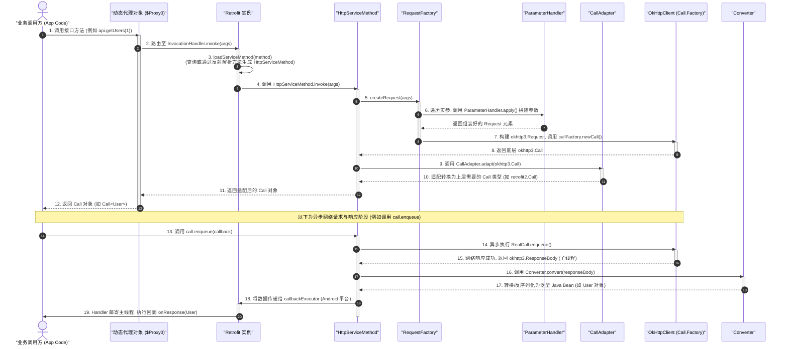

# Retrofit 概述

Retrofit 是由 Square 公司开源的一款适用于 Android 和 Java 的类型安全（Type-Safe）的 HTTP 客户端网络框架。在 Android 现代开发中，Retrofit 几乎成为了网络请求的业界标准。它并非一个独立发起网络请求的网络引擎，而是在 OkHttp 之上构建的一个声明式（Declarative）的应用层封装。Retrofit 的核心价值在于它通过动态代理与运行时注解解析，将底层繁琐的 HTTP 协议细节抽象为面向接口的 Java/Kotlin 本地方法调用，极大解耦了业务逻辑与网络协议，极大地提升了 Android 应用程序的可维护性、类型安全性与测试友好度。

---

## 1. Retrofit 诞生背景与设计哲学

在深入剖析 Retrofit 的底层架构与核心机制之前，必须首先理清 Android 网络请求框架的演进历史。这有助于我们深刻理解 Retrofit 究竟解决了什么问题，以及它所推崇的设计哲学在工程实践中的先进性。

### 1.1 Android 网络框架演进史

在 Android 开发的早期阶段（Android 1.0 至 Android 2.3 时代），开发者在进行网络通信时，面临着底层 API 难用且不稳定的局面。当时主要有两个官方提供的网络请求库：`Apache HttpClient` 和 `HttpURLConnection`。

*   **Apache HttpClient**：曾经是 Android SDK 推荐使用的 HTTP 客户端。它的设计极其庞大，拥有众多的扩展接口和复杂的类层级关系，这也导致了它的维护成本极高，极难在不破坏兼容性的前提下进行性能优化和升级。由于这些历史包袱，Android 团队在 Android 6.0（API 23）中彻底移除了 Apache HttpClient，将其从 Android SDK 中剔除。
*   **HttpURLConnection**：这是 JDK 原生的 HTTP 客户端。虽然它设计相对轻量，在 Android 2.3 之后得到了官方的重点维护与优化（如引入了透明 GZIP 压缩、连接池和响应缓存），但其最大的痛点在于 API 极其低级且难用。

在直接使用 `HttpURLConnection` 时，发起一个简单的 GET 或 POST 请求需要编写冗长的模板代码（Boilerplate Code）。开发者必须手动建立连接、配置连接超时与读取超时、设置 Request Header、获取输出流并写入 Request Body，再通过输入流循环读取响应字节并手动关闭流。在没有异步支持的情况下，开发者还必须自行管理多线程调度（例如通过 `AsyncTask`、`Handler` 或纯 `Thread`），手动将结果邮寄（Post）回主线程以更新 UI。这种原始的流操作极易导致连接泄露、内存泄露和 I/O 阻塞。

为了解决底层 API 难用的痛点，业界涌现出了一批第三方封装框架：

*   **Android-Async-Http (Loopj)**：这是早期非常风靡的异步网络请求库。它基于已废弃的 Apache HttpClient 封装，内部使用线程池执行请求，并利用 Android 的 Handler 机制将网络响应回调分发到主线程。然而，随着底层的 HttpClient 被 Android 弃用，这个库也逐渐退出了历史舞台。
*   **Volley**：在 2013 年 Google I/O 大会上，官方推出了网络请求库 Volley。Volley 专门为“数据量小、网络请求频繁”的场景设计。它内部通过请求队列（RequestQueue）实现了高效的并发管理，并且拥有优秀的缓存策略以及图片加载功能。然而，Volley 的致命缺陷在于其所有响应数据都会在内存中进行完整缓存，这导致它在面对大文件上传或下载时极其吃力，甚至容易引发内存溢出（OOM）。

随后，Square 公司推出了划时代的底层网络引擎——**OkHttp**。OkHttp 直接接管了 Socket 连接，在底层实现了 HTTP/2 多路复用、连接复用（连接池）、透明的 GZIP 压缩、网络拦截器链（Interceptor Chain）以及自动失败重试机制。OkHttp 极其高效和稳定，成为了 Android 网络底层的绝对标准。

### 1.2 OkHttp 时代的工程痛点与 Retrofit 的设计初衷

尽管 OkHttp 完美地解决了网络传输层的性能与稳定问题，但在实际业务开发中，直接使用 OkHttp 依然存在显著的工程痛点：

1.  **样板代码严重积压**：每次网络请求都需要开发者手动构建 `Request` 实体，手动使用 `FormBody` 或 `MultipartBody` 组装参数，在回调接口中手动捕获 `IOException`。
2.  **数据手动反序列化繁琐**：网络请求返回的往往是 JSON 字符串，开发者必须在每个异步回调中，手动调用 `Gson` 或 `Moshi` 将其解析为强类型对象。这些解析逻辑高度重复，且在异常处理上容易出现疏漏。
3.  **多线程切换缺乏系统性支持**：OkHttp 的异步请求回调（`Callback`）是在底层的子线程池中执行的。这意味着开发者在收到数据后，必须手动使用 Handler、`Activity.runOnUiThread` 或协程将数据切换回 Android 主线程。如果在一个页面内有多个网络请求串联，多级回调会引发灾难性的“回调地狱”（Callback Hell）。
4.  **接口契约不清晰**：当项目的 API 接口增多到几十个甚至上百个时，如果请求逻辑散落在各个 Activity、Fragment 或 ViewModel 中，网络接口的 URL 路径、请求参数以及 Header 信息将极难进行集中审查与统一维护。

**Retrofit 的诞生，就是为了解决 OkHttp 在应用层暴露出来的这四个核心痛点。**

Retrofit 的设计哲学可以总结为一句话：**“将 HTTP 网络请求声明，彻底抽象为面向接口的、类型安全的 Java/Kotlin 本地方法调用。”**

Retrofit 并不做任何实际的网络包传输工作，它将所有的底层通信任务全权委托给 OkHttp。Retrofit 本身扮演的是一个“契约制定者”和“配置调度中心”。它允许开发者通过定义一个标准的 Interface，配合方法注解（如 `@GET`、`@POST`）和参数注解（如 `@Query`、`@Path`、`@Body`）来描述网络请求的静态元数据。接着，Retrofit 在运行时利用动态代理技术，将这些静态注解信息转化为实际的 OkHttp 网络请求。它通过配置不同的转换器（`Converter`）将网络响应自动反序列化为 Java Bean，并通过调用适配器（`CallAdapter`）将请求返回转换为 RxJava 的 `Observable`、Kotlin 协程的挂起函数（`suspend`）或是默认的 `Call` 对象。

### 1.3 Retrofit 的三大设计哲学

1.  **声明式编程（Declarative Programming）**：在 Retrofit 中，网络请求的外观由接口上的注解声明。开发者不再需要关心“如何构建一个网络请求并读取字节流”这类“过程性”问题，而是转为声明“我需要请求哪个端点，携带哪些参数，返回什么类型”这类“结果性”问题。
2.  **关注点分离（Separation of Concerns）**：将底层的数据传输（OkHttp）、数据的反序列化（Gson/Moshi/Jackson）、线程调度模型（Android Handler/RxJava/Kotlin Coroutines）与具体的业务请求逻辑彻底剥离。每一部分都是可配置、可替换的插件。
3.  **编译期与运行时双重保障的类型安全（Type-Safety）**：网络请求的输入参数与输出实体都由 Java/Kotlin 的强类型机制进行约束。这确保了开发者在编码阶段就能获得自动补全与类型检查，避免了动态拼接字符串和手动强制类型转换带来的隐患。

---

## 2. 核心工作机制与流程设计

Retrofit 的核心运行逻辑是典型的**拦截-转换-执行**机制。理解 Retrofit 的关键，在于理清从接口方法被调用开始，到数据返回并显示在 UI 上的完整时序。

### 2.1 核心组件的职责划分

在探究流程之前，先了解 Retrofit 内部最关键的几大组件：

*   **Retrofit**：整个框架的全局配置入口。它保存了 `baseUrl`、网络执行工厂 `callFactory`（通常为 `OkHttpClient`）、数据转换工厂列表 `converterFactories`、调用适配器工厂列表 `callAdapterFactories`，以及专门用于在 Android 平台上进行主线程回调的 `callbackExecutor`。
*   **ServiceMethod**：对应于接口中定义的一个具体方法。它是一个抽象类，在解析期用于读取方法上的各种注解。
*   **HttpServiceMethod**：`ServiceMethod` 的具体子类，它不仅封装了方法的请求参数解析规则（通过 `RequestFactory`），还持有用于类型转换的 `Converter` 以及用于调用模型转换的 `CallAdapter`。
*   **RequestFactory**：在 Retrofit 运行时，专门用于反射解析某个接口方法注解的工厂类。它负责解析出 HTTP 请求方式（GET/POST/PUT等）、相对路径、Header 头信息，并为方法的每一个参数生成对应的 `ParameterHandler`。
*   **ParameterHandler**：参数处理器。这是一个非常精妙的接口，每一种参数注解（如 `@Path`、`@Query`、`@Field`、`@Body`）都对应一个 `ParameterHandler` 的实现。在运行时，它负责把外部传入的方法实参转化为 OkHttp 请求中所需要的 URL 参数、表单字段或 Body 体。
*   **CallAdapter**：调用适配器。它的职责是将底层的 `retrofit2.Call` 适配转换为其他异步执行模型，例如将 `Call<R>` 转换为 RxJava 的 `Observable<R>`，或者在 Kotlin 中直接适配为挂起函数返回值。
*   **Converter**：数据转换器。它包含两类：一类负责将上层的请求对象序列化为 OkHttp 的 `RequestBody`；另一类负责在收到响应后，将 OkHttp 的 `ResponseBody` 反序列化为上层业务所期望的实体对象（如 `User`、`List<Repo>`）。

### 2.2 网络请求的完整工作流与 Mermaid 时序图

下面我们通过 Mermaid 时序图来直观地展现从应用层发起方法调用，直到获得类型安全的结果的整个动态机制。



### 2.3 关键步骤深度解说

1.  **接口实例化**：当开发者调用 `retrofit.create(ApiService.class)` 时，Retrofit 并没有执行任何网络解析，而是通过 `Proxy.newProxyInstance()` 在 JVM 内存中动态构建出了一个实现了 `ApiService` 接口的代理类（`$Proxy0`）。
2.  **方法拦截与缓存路由**：当外部调用 `api.getUsers(1)` 时，这个调用立即被代理对象拦截，传入它的 `InvocationHandler`。在 `invoke` 方法内，Retrofit 首先查询内置的 ConcurrentHashMap 缓存。如果是该方法第一次被调用，则启动反射解析机制，提取方法上的所有的注解配置信息，将其解析为唯一的 `HttpServiceMethod` 放入缓存；如果不是第一次调用，则直接命中缓存。这保证了运行时的最高效率。
3.  **请求模板参数化**：`HttpServiceMethod` 的执行流程首先依赖其内部的 `RequestFactory`。RequestFactory 遍历调用时传入的实参列表（如 `[1]`），将其依次分配给先前解析注解时生成好的 `ParameterHandler[]` 数组。参数处理器（例如 `ParameterHandler.Path`）会将数字 `1` 转换为字符串，去替换相对路径 `/users/{id}` 中的占位符，构建出真实的请求相对 URL。
4.  **底层 Call 的构建与适配**：在生成了标准的 `okhttp3.Request` 之后，Retrofit 通过成员变量 `callFactory`（即外部注入的 `OkHttpClient` 实例）调用 `newCall()` 生成底层的 `okhttp3.Call`。紧接着，`HttpServiceMethod` 会将这个底层 Call 传递给它的 `CallAdapter`。适配器会根据接口的返回值类型（如 `Call<User>`），将底层 Call 包装成 Retrofit 本身的 `Call`。
5.  **异步网络回执与自动反序列化**：当 App 触发网络请求执行后，OkHttp 的线程池会执行真正的网络请求。当拿到 HTTP 响应并验证状态码正常后，Retrofit 的包装 Call 会拦截底层响应，获取 `ResponseBody`。包装 Call 随即调用内部匹配的 `Converter` 将响应字节流转换成 Java Bean。
6.  **主线程的精准归航**：在 Android 平台上，由于 UI 必须在主线程更新，Retrofit 内部的 `MainThreadExecutor` 拥有一个关联了 `Looper.getMainLooper()` 的主线程 Handler。它将反序列化得到的强类型 Java Bean 对象打包成一个 Message 邮寄到主线程的消息队列，从而使得回调的 `onResponse` 在主线程中安全地执行，完全免去了开发者手动切换线程的后顾之忧。

---

## 3. 动态代理与注解解析原理

动态代理是 Retrofit 整个设计最核心的支柱，而运行时注解解析与其相配套的缓存机制，则是其在开发灵活性与系统运行性能之间取得完美平衡的精妙法门。

### 3.1 Java 动态代理深度分析

要透彻理解动态代理（Dynamic Proxy）的威力，不妨先看看如果采用静态代理或传统的接口实现会面临什么工程难题。

如果不用动态代理，我们想实现声明式网络请求，要么需要手动编写每一个接口的实现类（在实现类中写满 OkHttp 的调用和 Gson 转换逻辑），这与不使用框架几乎没有区别；要么必须借助编译期注解处理器（APT，Annotation Processing Tool），在编译期为每一个网络接口自动生成对应的实现类（例如著名的依赖注入库 Dagger 和数据库库 Room 就采用了编译期生成代码的路线）。

然而，网络接口具有以下特殊性：其一，它的接口数量巨大且变动极其频繁；其二，网络请求的参数组合方式极其多变，包含 Body、Query、Header、Multipart, Form 等等。如果在编译期生成这些代码，会导致编译时间显著延长，产生大量的额外 `.class` 文件增加包体积，且灵活性较差（例如无法在运行时动态地根据上下文改变转换策略）。

**Retrofit 巧妙地避开了编译期代码生成，转而拥抱运行时动态代理。**

In Java, `java.lang.reflect.Proxy.newProxyInstance` 方法的函数签名如下：

```java
public static Object newProxyInstance(ClassLoader loader, Class<?>[] interfaces, InvocationHandler h)
```

当 Retrofit 接收到接口的 `Class` 对象时，它通过这个 API 动态地向 JVM 申请在内存中生成一个类。这个类在内存中被编译为字节码，并加载进类加载器。在它的内部结构中，所有的接口方法都被重写。不管调用哪一个方法，该方法内部的实现都极其一致——直接调用传入的 `InvocationHandler` 对象的 `invoke` 方法：

```java
@Override
public Object invoke(Object proxy, Method method, Object[] args) throws Throwable {
    // 所有的调用都在这里被拦截
}
```

动态代理的核心魅力在于：**它把一个“强类型的方法调用”转化为了“一个弱类型的方法元数据与实参数组的集合”**。在 `invoke` 方法中，Retrofit 可以直接拿到被调用方法的 `Method` 对象，这让反射读取注解变为了可能；同时它还能拿到一个 `args` 的对象数组，这代表了本次请求传入的具体实参值。

这就是 Retrofit 不需要接口实现类的根本原因——**动态代理在运行时，用一段通用的拦截器代码，扮演了所有接口实现类的角色**。

### 3.2 运行时反射解析的性能瓶颈与 serviceMethodCache

在传统的 Java 性能优化指南中，“反射”往往被贴上“缓慢”和“高能耗”的标签。确实，调用 `Method.getAnnotations()` 或 `Method.getParameterAnnotations()` 需要虚拟机去方法区解析类的 class 文件结构，读取里面的 Annotation 属性表，并在堆内存中为这些注解创建动态代理对象。如果每一次调用 `api.getUsers(1)` 时，Retrofit 都要重新解析一遍，其性能损耗在网络请求高并发或者频繁轮询的场景下是不可接受的，会导致大量的 CPU 占用与频繁的堆内存垃圾回收（GC 抖动）。

Retrofit 消除反射性能隐患的秘诀极其简单且高效：**运行时按需解析与并发安全缓存**。

在 `Retrofit` 类中，定义了如下的成员变量：

```java
private final Map<Method, ServiceMethod<?>> serviceMethodCache = new ConcurrentHashMap<>();
```

当 `InvocationHandler.invoke` 拦截到请求时，它会执行以下的核心路由逻辑：

```java
ServiceMethod<?> loadServiceMethod(Method method) {
  ServiceMethod<?> result = serviceMethodCache.get(method);
  if (result != null) return result;

  synchronized (serviceMethodCache) {
    result = serviceMethodCache.get(method);
    if (result == null) {
      result = ServiceMethod.parseAnnotations(this, method);
      serviceMethodCache.put(method, result);
    }
  }
  return result;
}
```

这段经典的双重检查锁定（Double-Checked Locking）模式配合 `ConcurrentHashMap`，保证了线程安全的前提下，实现了极高的读性能：

*   **冷启动阶段（首次调用）**：当 App 第一次执行某个 API 请求时，缓存未命中，Retrofit 进入同步块，调用 `ServiceMethod.parseAnnotations` 执行反射解析。这个解析过程较慢，包含了方法注解、参数注解、泛型返回值类型的深度扫描与解析。
*   **热路径阶段（后续调用）**：一旦首次解析完成并写入 `serviceMethodCache`，后续对该 API 的千万次调用都将直接命中 Map 的快速读取通道，耗时几乎为 O(1) 的内存寻址开销。反射的开销被稀释到了微秒级别，从而在性能上达到了极致的优化。

### 3.3 ServiceMethod 解析过程与 ParameterHandler 体系

在冷启动解析中，`RequestFactory.Builder` 扮演了核心角色。它利用反射提取出方法上声明的所有静态属性：

1.  **方法级别注解解析**：扫描 `@GET`、`@POST` 等，解析出 HTTP 请求动作，并提取出相对路径（如 `/v2/users/{name}`）。它还会扫描 `@Headers` 注解，解析出静态的请求头键值对。
2.  **参数级别注解解析**：方法的参数列表中，每一个参数都代表着运行时动态传入的变量。`RequestFactory` 遍历每一个参数，读取其注解（如 `@Path("name")`、`@Query("sort")`），并根据注解的类型，为其创建专门的 `ParameterHandler` 实例。

**ParameterHandler 的多态设计是 Retrofit 构建请求体的灵魂。**

Retrofit 内部预设了十多种 `ParameterHandler` 实现，形成了极其严密的参数解析体系：

*   `ParameterHandler.Path`：专门用于路径替换。在运行时，它会获取实参值，并使用配置好的 `Converter` 将其转换为字符串，然后将相对路径中的 `{name}` 占位符替换成具体的变量值。
*   `ParameterHandler.Query`：专门用于 URL 参数拼接。它负责在 URL 末尾安全地追加 `?key=value`，并自动执行 URL 编码，防止中文或特殊字符破坏请求结构。
*   `ParameterHandler.Header`：专门用于动态添加请求头。它负责在网络请求的构建器中插入动态的 KV 键值。
*   `ParameterHandler.Body`：专门用于将复杂的实体对象转化为请求体。它会调用开发者注入的 `Converter`（例如 GsonConverter），将 Java/Kotlin 对象序列化为 JSON 字节流，并生成 Content-Type 为 `application/json` 的 `RequestBody`。

在运行时，`HttpServiceMethod` 构建 `okhttp3.Request` 的逻辑极其清晰：

```java
// 伪代码展示构建 Request 过程
RequestBuilder requestBuilder = new RequestBuilder(httpMethod, baseUrl, relativeUrl, ...);
Object[] args = ...; // 实际传入的方法参数值
ParameterHandler<Object>[] handlers = (ParameterHandler<Object>[]) parameterHandlers;

int argumentCount = args != null ? args.length : 0;
for (int p = 0; p < argumentCount; p++) {
  handlers[p].apply(requestBuilder, args[p]);
}
return requestBuilder.build();
```

通过这种多态设计，Retrofit 将复杂的网络请求参数拼装过程，简化为了对一个 `ParameterHandler` 数组的顺序遍历。这种高度抽象的设计，使得代码不仅极易维护，更具备了极强的抗震荡性与扩展性。

---

## 4. 关键设计模式深度剖析

Retrofit 被公认为 Android 开源库中架构设计的典范，其底层的模块化和可配置性之所以能做到天衣无缝，完全得益于对设计模式的出神入化的运用。以下深度剖析 Retrofit 中最核心的六大设计模式。

### 4.1 外观模式（Facade Pattern）

*   **设计意图**：为子系统中的一组接口提供一个统一的界面，定义一个高层接口，使得这一子系统更加容易使用。
*   **Retrofit 的实现**：
    `Retrofit` 类本身就是网络请求子系统的门面（Facade）。在 Retrofit 的底层，其实包含了极其复杂的子系统：OkHttp 网络通信子系统、数据转换反序列化子系统（`Converter`）、异步模型适配子系统（`CallAdapter`）以及多线程调度子系统（`Executor`）。
    如果让开发者直接去协调这些子系统，那么每次发起请求，开发者都需要手动实例化 OkHttpClient，手动用 Gson 反序列化，再手动用 Handler 邮寄回主线程。
    **Retrofit 类隐藏了所有这些错综复杂的关联。** 开发者只需要通过 `Retrofit.Builder` 配置好baseUrl、ConverterFactory、CallAdapterFactory，然后调用一个简单的 `retrofit.create(ApiService.class)`，就能一步到位获取到可以直接使用的业务代理对象。整个繁琐的子系统交互链条，完全被封装在了 Retrofit 这堵外观之墙的背后。

### 4.2 适配器模式（Adapter Pattern）

*   **设计意图**：将一个类的接口转换成客户希望的另外一个接口，使得原本由于接口不兼容而不能一起工作的类可以一起工作。
*   **Retrofit 的实现**：
    Retrofit 默认生成的网络请求执行器是 `Call<R>`。然而，在现代 Android 架构设计中，各种异步与响应式框架并存。比如 RxJava 开发者希望接口直接返回 `Observable<R>`、`Single<R>`；Kotlin 协程开发则希望返回 `Deferred<R>` 或者直接使用 `suspend` 挂起函数返回纯粹的数据 Bean。
    Retrofit 并没有在核心代码中强耦合这些第三方的类库。它引入了 `CallAdapter` 接口，作为请求适配器：
    ```java
    public interface CallAdapter<R, T> {
      Type responseType();
      T adapt(Call<R> call);
    }
    ```
    它的设计极其巧妙：`adapt` 方法接收一个默认的 `Call<R>`（底层包装了 OkHttp Call），然后将其“包装”、“变形”、“适配”成目标类型 `T`。
    如果缺少了适配器模式，Retrofit 将不得不针对 RxJava 编写一套代码，针对协程编写一套代码，丧失了所有的框架兼容性。正是因为有了 `CallAdapter`，Retrofit 才能在不改动一行核心代码的前提下，无缝嵌入到任何异步编程生态中。

### 4.3 构建者模式（Builder Pattern）

*   **设计意图**：将一个复杂对象的构建与它的表示分离，使得同样的构建过程可以创建不同的表示。
*   **Retrofit 的实现**：
    `Retrofit` 实例是一个复杂的聚合体。它的配置参数众多，且大部分都是可选的（比如你可以不配 `callbackExecutor`，它会自动使用默认平台策略；你也可以配多个 `Converter.Factory` 形成链式查找）。
    如果使用传统的构造器重载（Telescoping Constructor），会导致构造函数的参数列表极其冗长且难以记忆。如果使用属性的 Setter 方法，又会导致 Retrofit 实例在多线程阻碍初始化阶段处于半就绪的“状态不安全”中。
    通过 `Retrofit.Builder`，开发者可以通过清晰的链式调用，一步一步配置所需的属性。最关键的是，在调用最后的 `build()` 方法后，Builder 会创建一个**不可变（Immutable）**的 `Retrofit` 实例。这保证了该实例在多线程并发环境下是绝对线程安全的，没有任何副作用。

### 4.4 工厂模式（Factory Pattern）

*   **设计意图**：定义一个创建对象的接口，但让子类决定实例化哪一个类。工厂方法使一个类的实例化延迟到其子类。
*   **Retrofit 的实现**：
    `Converter.Factory` 和 `CallAdapter.Factory` 是工厂模式的经典应用。
    在初始化 Retrofit 阶段，框架只被注入了诸如 `GsonConverterFactory` 或 `RxJava3CallAdapterFactory` 的工厂类实例，因为此时 Retrofit 根本不可能知道未来开发者会在具体的方法中声明什么泛型类型（如返回 `List<User>` 还是 `Response<String>`）。
    当 Retrofit 运行时解析方法注解时，它会取出方法的真实返回类型（`Type`），然后遍历工厂列表，依次调用工厂的 `get` 方法：
    ```java
    // 询问工厂是否能够创建对应的适配器
    CallAdapter<?, ?> adapter = retrofit.callAdapter(returnType, annotations);
    ```
    如果工厂判断自己能够处理这个类型，它就会负责实例化并返回一个具体的 `CallAdapter` 或 `Converter` 对象；如果无法处理，则返回 `null`，以便 Retrofit 继续询问下一个工厂。
    这种通过工厂类在运行时“根据泛型类型和注解动态生产具体转换器”的设计，体现了高度的多态性与接口隔离原则。

### 4.5 代理模式（Proxy Pattern）

*   **设计意图**：为其他对象提供一种代理以控制对这个对象的访问。
*   **Retrofit 的实现**：
    动态代理模式是 Retrofit 的灵魂。通过 Java 运行时提供的 `Proxy.newProxyInstance()` 动态创建的代理类，拦截了所有业务方对接口的方法调用。它在真实的请求发起之前，插入了一层“前置处理”（解析方法、组装参数、构建 OkHttp 请求）与“后置处理”（数据反序列化、线程切换、回调分发）。这正是代理模式最本质的体现。

### 4.6 策略模式（Strategy Pattern）

*   **设计意图**：定义一系列的算法，把它们一个个封装起来，并且使它们可相互替换。策略模式使得算法可独立于使用它的客户而变化。
*   **Retrofit 的实现**：
    在数据解析方面，Retrofit 并没有实现具体的 JSON 或 XML 解析器。它通过定义 `Converter<F, T>` 接口，将“如何把一个数据类型 F 转换为 T”抽象为一种算法策略。
    具体是采用 Gson 解析、Moshi 解析，还是针对游戏领域的 Protocol Buffers 解析，这都仅仅是不同的具体策略。对于 Retrofit 而言，它只管调用 `converter.convert(value)`。这种策略的完全解耦，体现了“面向接口编程，而不是面向实现编程”的软件工程核心思想。

---

## 5. 优缺点分析与工程价值

任何优秀的框架都是在特定的历史背景和技术栈下做出的设计折中（Trade-off）。全面、客观地认识 Retrofit 的长处与局限，对于我们在大型 Android 工程中进行技术选型和架构设计至关重要。

### 5.1 核心优势与工程价值

1.  **极大地提升了研发效率与代码可维护性**：
    相比于传统的拼接 URL 和手动解析流，Retrofit 的声明式接口让网络层代码行数锐减 80% 以上。所有的 API 路径、Header、Query、Body 的定义集中在 Service 接口中，接口本身就成为了一份清晰的网络协议文档，极易进行代码审查（Code Review）与集中维护。
2.  **类型安全的绝对屏障**：
    在 Retrofit 中，请求的参数和返回的实体对象都在编译期被强类型所约束。开发者无法向一个需要 `Int` 类型的 `@Path` 参数传入一个不合法的类对象，在编译阶段就能够杜绝绝大部分因为拼写错误或类型混淆导致的低级 Crash。
3.  **极度松耦合的可扩展架构**：
    由于 `Converter` 和 `CallAdapter` 都是完全插拔式的，当公司业务从传统的 JSON 转换为 Google 的 Protocol Buffers 时，或者从 RxJava 整体重构至 Kotlin 协程时，网络层的核心骨架几乎不需要做任何修改，只需要在初始化时替换对应的工厂实例即可。
4.  **对测试极其友好**：
    因为网络接口是纯粹的 Interface，我们在编写单元测试（Unit Test）时，不需要真正发起耗时的物理网络连接。我们可以通过官方提供的 `MockRetrofit`，或者自定义一个 `CallAdapter.Factory`，在运行时直接拦截请求并返回本地构造的 Mock 数据，这使得网络层的测试变得极度快捷与可靠。

### 5.2 局限性与工程避坑指南

尽管 Retrofit 近乎完美，但在某些特殊的业务场景和工程环境下，它依然存在不容忽视的局限性：

1.  **冷启动反射开销的隐患**：
    虽然运行时依靠 Map 缓存消除了反射开销，但是在应用刚刚启动、或者某个模块首次加载时，如果有大量的网络接口被集中调用，Retrofit 会密集地去解析注解，这可能会在低端 Android 设备上引起短暂的 CPU 尖峰甚至导致主线程卡顿（Jank）。
    *   *避坑指南*：如果项目中包含数以百计的 API 接口，可以在初始化 Retrofit 时配置 `validateEagerly(true)`。这个配置会告诉 Retrofit 在后台线程中，提前去解析并缓存所有接口类中的全部方法，将首次调用的冷启动时间平摊在后台初始化阶段，保证主线程的绝对流畅。
2.  **与 OkHttp 的深度绑定与底层强耦合**：
    虽然 Retrofit 的 `callFactory` 接受 `okhttp3.Call.Factory` 接口，理论上允许我们注入其他的底层网络库（例如 Cronet 或者定制的 Socket 客户端）。但实际上，Retrofit 的许多参数注解处理器（如 `FormUrlEncoded`、`Multipart` 等）和数据类型（如 `RequestBody`、`ResponseBody`、`MultipartBody.Part`）直接引入并使用了 OkHttp 的数据结构。这意味着，如果你的项目需要完全脱离 OkHttp 环境（例如出于某些安全合规要求需要将底层全面替换为系统的自带传输引擎），Retrofit 将难以抽离，重构成本极大。
3.  **在 Kotlin 跨平台（KMP）浪潮中的局限性**：
    随着移动端跨平台技术的发展，Kotlin Multiplatform (KMP) 逐渐成为了行业趋势。在 KMP 项目中，我们希望能够在 Android 和 iOS 端共享同一套网络层业务逻辑。
    然而，Retrofit 赖以生存的核心——**运行时动态代理（`java.lang.reflect.Proxy`）**，是 JVM 平台的专属特性。在 iOS 端的 Kotlin Native 环境中，根本不存在 JVM，也无法在运行时动态生成字节码类。这导致 Retrofit 彻底失去了跨平台支持能力。
    *   *架构建议*：在现代 KMP 项目中，网络请求的标准已经转向了 **Ktor**。Ktor 通过 Kotlin 编译器插件在编译期处理好了接口声明，不依赖任何运行时的 JVM 动态代理，从而能够在 Android、iOS、Web、Desktop 等全平台无缝运行。

### 5.3 现代 Android 开发中的工程最佳实践

在配合 Kotlin 协程和 Jetpack 架构组件使用时，我们需要注意一些现代化的最佳实践。

#### 5.3.1 协程挂起函数支持的底层机制

从 Retrofit 2.6.0 版本开始，接口中可以直接使用 Kotlin 的 `suspend` 关键字声明挂起函数，例如：

```kotlin
@GET("users/{id}")
suspend fun getUser(@Path("id") id: Int): User
```

很多开发者误以为这需要配置特殊的 `CallAdapter`。实际上，Retrofit 内部对 Kotlin 挂起函数进行了特殊的原生支持。在解析方法时，如果 Retrofit 发现该方法是一个挂起函数（其最后一个参数的类型是 `Continuation`），它就会通过反射动态调用 `KotlinExtensions` 提供的扩展方法。

在底层，它依然会把这个方法包装成一个普通的 `Call` 对象，并调用它的 `enqueue()` 方法发起异步请求。然后，在 `Callback` 的成功回调中调用 `continuation.resume(response.body())` 恢复协程；在失败回调中调用 `continuation.resumeWithException(exception)` 抛出异常。

#### 5.3.2 挂起函数的异常处理避坑

由于挂起函数在遇到非 200 HTTP 状态码或网络连接超时、DNS 解析失败等问题时，会直接将 `IOException` 或自定义的 `HttpException` 通过 `continuation.resumeWithException` 抛出。如果在业务层没有对其进行捕获，将会直接导致 App 发生未捕获异常的崩溃（Crash）。

为了在工程中构建稳健的网络防御体系，有以下两种主流的工程实践方案：

1.  **全局 try-catch 与 CoroutineExceptionHandler 拦截**：
    在 ViewModel 启动协程（`viewModelScope.launch`）时，为协程上下文注入全局的 `CoroutineExceptionHandler`。这样网络层的异常可以被统一拦截并记录日志，展示通用的网络错误 UI。
2.  **优雅的 Result 包裹机制**：
    可以将接口的返回值声明为 `Response<T>` 或是借助自定义的 `CallAdapter`，将返回类型统一适配为 Kotlin 原生的 `Result<T>` 或是架构层自定义的 `Resource<T>`、`NetworkResult<T>`。
    这样一来，网络请求的返回值在业务层表现为：
    ```kotlin
    val result = repository.getUser(1)
    if (result.isSuccess) {
        val user = result.getOrNull()
        // 处理成功数据
    } else {
        val exception = result.exceptionOrNull()
        // 统一处理异常，不用担心 Crash
    }
    ```
    本方式将异常处理从“控制流异常”降级为了“数据流分支”，不仅符合函数式编程的安全理念，也极大提升了业务代码的健壮性。

---

## 6. 总结

Retrofit 作为 Android 主流网络请求框架，其成功并非因为他发明了什么全新的通信协议，而是因为它将**动态代理、运行时注解解析、外观模式、适配器模式和工厂模式**等软件设计模式进行了炉火纯青的整合。它将复杂的网络通信细节锁进黑盒，向开发者呈现了一套极致优雅、类型安全、且高度可扩展的声明式接口。

虽然在当前的 Kotlin Multiplatform (KMP) 跨平台演进中，受制于 JVM 动态代理特性，Retrofit 在 iOS 侧无法工作，但对于深耕于 JVM 平台和纯 Android 开发而言，Retrofit 配合 OkHttp 依然是当之无愧、不可动摇的网络架构第一选择。理解它的核心工作流、动态代理及缓存机制，并掌握在协程环境下的异常设计，是每一个 Android 资深工程师走向架构设计的必由之路。
